# Flow Diagrams: My Approvals

## Module Information
- **Module**: Procurement
- **Sub-Module**: My Approvals
- **Version**: 1.0.0
- **Last Updated**: 2025-11-12
- **Owner**: Procurement & Workflow Team
- **Status**: Draft

## Document History
| Version | Date | Author | Changes |
|---------|------|--------|---------|
| 1.1.0 | 2025-12-10 | Documentation Team | Standardized reference number format (XXX-YYMM-NNNN) |
| 1.0.0 | 2025-11-12 | Documentation Team | Initial version |

---

## Overview

This document provides comprehensive visual workflows for the My Approvals module, which serves as the centralized approval interface for all document types requiring approval in the Carmen ERP system. The diagrams cover the complete approval lifecycle from queue loading through multi-level approval workflows to final document approval or rejection, including system integrations with Budget Management, Inventory Management, Finance Systems, and the Workflow Engine.

**Key Processes Documented**:
- Unified approval queue loading and real-time updates
- Single document review and approval workflow (approve, reject, request info)
- Bulk approval processing with atomic transactions
- Approval delegation setup, activation, and expiration
- Multi-level approval routing and workflow progression
- SLA monitoring, escalation, and deadline management
- Status transitions and state management across queue items and delegations
- System integrations (Budget, Inventory, Finance, Workflow Engine, Notifications)
- Error handling and recovery strategies

**Related Documents**:
- [Business Requirements](./BR-my-approvals.md) - Business rules and functional requirements
- [Use Cases](./UC-my-approvals.md) - Detailed user scenarios and workflows
- [Technical Specification](./TS-my-approvals.md) - System architecture and implementation
- [Data Schema](./DS-my-approvals.md) - Database structure and entities
- [Validations](./VAL-my-approvals.md) - Validation rules and schemas

---

## Diagram Index

| Diagram | Type | Purpose | Complexity |
|---------|------|---------|------------|
| [High-Level Process Flow](#high-level-approval-process-flow) | Process | End-to-end approval lifecycle | High |
| [Approval Queue Loading](#approval-queue-loading-flow) | Process | Load and display approval queue | Medium |
| [Single Document Approval](#single-document-approval-flow) | Process | Review and approve individual document | High |
| [Bulk Approval](#bulk-approval-flow) | Process | Approve multiple documents atomically | High |
| [Delegation Setup](#delegation-setup-flow) | Process | Create and activate delegation | Medium |
| [Context Diagram](#level-0-context-diagram) | Data Flow | System boundaries and external entities | Low |
| [System Decomposition](#level-1-system-decomposition) | Data Flow | Major processes and data stores | Medium |
| [View Queue Sequence](#view-queue-sequence-diagram) | Interaction | Component interactions for queue loading | Medium |
| [Approve Document Sequence](#approve-document-sequence-diagram) | Interaction | Component interactions for approval | High |
| [Bulk Approve Sequence](#bulk-approve-sequence-diagram) | Interaction | Component interactions for bulk approval | High |
| [Queue Item State](#queue-item-status-state-diagram) | State | Status transitions for approval queue items | Medium |
| [Delegation State](#delegation-status-state-diagram) | State | Status transitions for delegations | Medium |
| [Budget Integration](#budget-integration-flow) | Integration | Integration with Budget Management | High |
| [Inventory Integration](#inventory-integration-flow) | Integration | Integration with Inventory Management | High |
| [Finance Integration](#finance-integration-flow) | Integration | Integration with Finance System | High |
| [SLA Management](#sla-management-flow) | Process | SLA calculation and escalation | High |
| [Error Handling](#error-handling-flow) | Error | Error processing and recovery | Medium |

---

## Process Flow

### High-Level Approval Process Flow

**Purpose**: End-to-end business process showing the complete approval lifecycle from queue entry to final approval or rejection across all document types

**Actors**:
- **Approver**: Department Manager, Purchasing Manager, Financial Controller, General Manager (reviews and approves documents)
- **Requestor**: Staff member who submitted document for approval
- **Delegate**: User with temporary approval authority
- **System**: Automated processes (workflow routing, SLA monitoring, integrations, notifications)
- **Escalation Recipients**: Managers who receive escalation notifications

**Trigger**: Document submitted for approval and routed to approver's queue


**Flow Steps**:

1. **Start**: Document submitted for approval by requestor
2. **Route Workflow**: Workflow engine determines approval routing based on document type and amount
3. **Create Queue Item**: System creates approval_queue_items record with status=pending
4. **Calculate SLA**: System calculates SLA deadline based on document type and priority (business hours)
5. **Assign Approver**: System checks for active delegation
   - If delegation active: Assign to delegate with assignee_type=delegate
   - If no delegation: Assign to primary approver with assignee_type=primary
6. **Enter Queue**: Queue item added to approver's approval queue
7. **SSE Update**: Real-time update pushed to approver's browser via Server-Sent Events
8. **Monitor SLA**: Background job monitors SLA progress
   - If threshold reached (e.g., 80% elapsed): Send escalation notification
9. **Approver Action**: Approver reviews and makes decision:
   - **Approve**: Record approval, validate authority, update level, route to next level or complete
   - **Reject**: Record rejection, validate reason, release budget, terminate workflow
   - **Request Info**: Record info request, pause SLA, notify requestor, wait for response
   - **Delegate**: Create delegation and transfer approval
10. **Final Approval**: When last level completes, integrate with external systems
11. **Integrations**: Budget (confirm commitment), Inventory (create transaction), Finance (post GL)
12. **Complete**: Notify stakeholders and remove from queue

**Exception Handling**:
- **Insufficient authority**: Display error, prevent approval
- **Concurrent approval**: Optimistic locking (doc_version) detects, rollback transaction, show error
- **Budget exceeded**: Allow policy override with justification or reject
- **Integration failure**: Retry with exponential backoff, flag for manual review
- **SLA breach**: Continue process, log violation, escalate to manager
- **Database failure**: Rollback transaction, log error, retry
- **Delegation conflict**: Resolve based on precedence (explicit > implicit)

---

### Approval Queue Loading Flow

**Purpose**: Detailed view of how the approval queue is loaded, filtered, sorted, and updated in real-time


**Flow Steps**:

1. **SSR Load**: Server Component executes on server for initial page load
2. **Query Database**: SELECT from approval_queue_items WHERE approver_user_id AND status=pending
3. **JOIN Data**: Join with users, departments, locations for complete display context
4. **Calculate Urgency**: Compute urgency score based on SLA remaining (red: <10%, yellow: <25%, green: >25%)
5. **Format Data**: Prepare data with denormalized fields for efficient display
6. **Hydrate Client**: Pass initial data to ApprovalQueue client component
7. **Render Queue**: Display queue with filters, sorting, and search controls
8. **Establish SSE**: Open Server-Sent Events connection for real-time updates
9. **Listen Events**: Subscribe to approval_added, approval_removed, approval_updated events
10. **User Actions**: Handle user interactions (filter, sort, search, presets)
11. **Background Refresh**: React Query refetches data every 30 seconds as fallback to SSE
12. **SSE Events**: Process real-time updates and merge into existing queue data

**Performance Optimizations**:
- Server-side rendering for fast initial load
- Client-side filtering/sorting for instant feedback
- SSE for efficient real-time updates (no polling)
- React Query caching to minimize database queries
- Virtualization for queues >100 items (react-window)
- Optimistic UI updates for smooth user experience

---

### Single Document Approval Flow

**Purpose**: Detailed workflow for reviewing and approving a single document with all approval actions


**Flow Steps**:

1. **Open Modal**: User clicks document row, modal opens with loading state
2. **Fetch Details**: Load complete document data including line items, attachments, history, budget
3. **Validate Authority**: Check if user has approval authority for document amount
4. **Display Content**: Show tabbed interface with all document information
5. **Calculate Compliance**: Check policy compliance (budget, quotes, categories)
6. **User Reviews**: Approver examines document details
7. **User Decision**: Approver chooses action (approve, reject, request info)

**Approve Path**:
8. Check if policy override needed
9. Enter override justification if required (min 50 chars)
10. Enter optional approval comments
11. Confirm approval
12. Optimistic UI update (remove from queue immediately)
13. Call approveDocument Server Action with atomic transaction
14. Lock record with doc_version for optimistic locking
15. Check for concurrent modifications
16. Record approval action with cryptographic hash
17. Update queue item approval level and version
18. If not final level: Route to next approver
19. If final level: Update document status to Approved
20. Integrate with Budget, Inventory, Finance systems (async)
21. Show success notification

**Reject Path**:
- Enter rejection reason (min 20 chars)
- Confirm rejection
- Record rejection action
- Update queue and document status to Rejected
- Release budget commitment
- Send rejection notification

**Request Info Path**:
- Enter information request (min 20 chars)
- Set response deadline (default 48 business hours)
- Record info request action
- Update status to awaiting_info
- Pause SLA timer
- Send notification to requestor

**Exception Handling**:
- **Insufficient authority**: Display error, prevent approval
- **Concurrent modification**: Rollback, revert optimistic update, show error
- **Budget integration failure**: Log error, flag for manual review, show partial success
- **Validation errors**: Show inline errors, prevent submission

---

### Bulk Approval Flow

**Purpose**: Atomic processing of multiple document approvals with all-or-nothing transaction guarantees


**Flow Steps**:

1. **Select Documents**: User selects multiple documents in queue (checkbox selection)
2. **Enable Bulk Toolbar**: Toolbar appears with bulk actions
3. **Validate Selection**: Check constraints (max 50, same type, all Pending status)
4. **Display Summary**: Show count, total amount, document types, requestors
5. **Enter Comments**: User enters optional bulk approval comments
6. **Confirm Bulk**: Confirmation dialog with warning about atomic operation
7. **Optimistic Update**: Remove all selected documents from queue immediately
8. **Call Server Action**: bulkApproveDocuments with document IDs and comments
9. **Begin Transaction**: Start atomic database transaction (all or nothing)
10. **Validate Each**: Check authority, status, self-approval for each document
11. **Calculate Total**: Sum total amount across all documents
12. **Check Authority**: Verify user authority covers total amount
13. **Process Loop**: For each document, record action, update queue, route
14. **Commit Transaction**: If all successful, commit atomic transaction
15. **Parallel Integrations**: Trigger Budget, Inventory, Finance integrations for all documents
16. **Show Success**: Display success notification with count

**Exception Handling**:
- **Validation failure**: Rollback transaction, revert optimistic update, show error with failed document list
- **Exceeds 50 limit**: Show error, prevent submission
- **Mixed document types**: Show error, require same type
- **Total exceeds authority**: Rollback transaction, show error
- **Integration partial failure**: Flag for manual review, show partial success with retry option

**Performance Considerations**:
- Maximum 50 documents per bulk operation to prevent long transactions
- Parallel integration calls for all documents (not sequential)
- Background job for integration retries
- Optimistic UI for instant feedback
- Atomic transaction ensures data consistency

---

### Delegation Setup Flow

**Purpose**: Creating and activating approval delegations with scope configuration and approval transfer


**Flow Steps**:

1. **Open Form**: User clicks "Setup Delegation" button
2. **Search Delegate**: User searches and selects delegate user
3. **Validate Delegate**: Check delegate is not self, has sufficient authority
4. **Check Overlap**: Query existing delegations for date range overlap
5. **Set Dates**: User enters start and end dates (max 90 days duration)
6. **Validate Dates**: Check end > start and duration ≤ 90 days
7. **Select Scope**: User chooses delegation scope (all documents, specific types, specific departments)
8. **Set Amount Limit**: Optional amount cap (cannot exceed delegate's authority)
9. **Enter Reason**: User enters delegation reason (min 10 chars)
10. **Enter Notes**: Optional notes and instructions for delegate
11. **Review Summary**: Display complete delegation configuration
12. **Query Pending**: Count pending approvals matching delegation scope
13. **Show Transfer Count**: Display how many approvals will be transferred
14. **Confirm**: User confirms delegation creation
15. **Call Server Action**: createDelegation with atomic transaction

**Immediate Delegation Path** (start_datetime ≤ NOW):
16. Create with status=active
17. Set activation_timestamp to NOW
18. Transfer matching pending approvals to delegate
19. Update approval_queue_items with delegate info
20. Count transferred approvals
21. Commit transaction
22. Notify delegate and manager
23. Push SSE updates to delegate browser

**Scheduled Delegation Path** (start_datetime > NOW):
16. Create with status=scheduled
17. Schedule background job for activation at start time
18. Schedule background job for expiration at end time
19. Commit transaction
20. Notify delegate and manager of scheduled delegation

**Background Jobs**:
- **Activation Job** (runs at start_datetime):
  - Update status to active
  - Transfer matching approvals to delegate
  - Notify delegate and manager
  - Push SSE updates
- **Expiration Job** (runs at end_datetime):
  - Update status to expired
  - Route new approvals back to original approver
  - Notify delegator and manager

**Exception Handling**:
- **Cannot delegate to self**: Show error, prevent submission
- **Delegate lacks authority**: Show error, select different delegate
- **Overlapping delegation**: Show error, adjust dates or revoke existing
- **Invalid dates**: Show inline validation errors
- **Amount exceeds delegate authority**: Show error, reduce amount

---

## Data Flow Diagrams

### Level 0: Context Diagram

**Purpose**: Shows My Approvals system boundaries and interactions with external entities

```mermaid
flowchart TB
    subgraph External['External Entities']
        Approver[👤 Approver<br>Reviews & Approves]
        Requestor[👤 Requestor<br>Submits Documents]
        Admin[👤 System Admin<br>Configures SLA & Authority]
    end

    subgraph MyApprovals['My Approvals System']
        System[My Approvals Module<br>✓ Queue Management<br>✓ Approval Processing<br>✓ Delegation Management<br>✓ SLA Monitoring]
    end

    subgraph ExternalSystems['External Systems']
        Budget[💰 Budget Management<br>Commitment Tracking]
        Inventory[📦 Inventory Management<br>Stock Transactions]
        Finance[💵 Finance System<br>GL Posting]
        Workflow[⚙️ Workflow Engine<br>Routing & Escalation]
        Notification[📧 Notification Service<br>Email, Push, SMS]
        Audit[📝 Audit System<br>Activity Logging]
    end

    Approver -->|Review & Decision| System
    System -->|Approval Status| Approver

    Requestor -->|Document Status| System
    System -->|Notifications| Requestor

    Admin -->|Configuration| System
    System -->|Reports| Admin

    System -->|Confirm Commitment| Budget
    Budget -->|Availability Status| System

    System -->|Create Transaction| Inventory
    Inventory -->|Transaction Result| System

    System -->|Post GL Entry| Finance
    Finance -->|Posting Result| System

    Workflow -->|Routing Instructions| System
    System -->|Workflow Events| Workflow

    System -->|Send Notifications| Notification
    Notification -->|Delivery Status| System

    System -->|Log Actions| Audit

    style System fill:#e0ccff,stroke:#6600cc,stroke-width:3px,color:#000
    style Approver fill:#cce5ff,stroke:#0066cc,stroke-width:2px,color:#000
    style Requestor fill:#cce5ff,stroke:#0066cc,stroke-width:2px,color:#000
    style Admin fill:#cce5ff,stroke:#0066cc,stroke-width:2px,color:#000
```



**External Entities**:
- **Approver**: Reviews and approves documents in queue
- **Requestor**: Submits documents and receives status updates
- **System Admin**: Configures SLA policies and approval authority matrix

**External Systems**:
- **Budget Management**: Tracks budget commitments and availability
- **Inventory Management**: Creates stock transactions
- **Finance System**: Posts general ledger entries
- **Workflow Engine**: Provides approval routing and escalation
- **Notification Service**: Sends email, push notifications, SMS
- **Audit System**: Logs all approval actions

---

### Level 1: System Decomposition

**Purpose**: Breaks down My Approvals into major processes and data stores


**Major Processes**:
1. **Queue Management (1.0)**: Load, filter, sort approval queue with real-time updates
2. **Approval Processing (2.0)**: Process approval actions (approve, reject, request info)
3. **Delegation Management (3.0)**: Create, activate, and expire delegations
4. **Authority Validation (4.0)**: Validate approval authority and determine routing
5. **SLA Monitoring (5.0)**: Calculate SLA deadlines, monitor progress, trigger escalations
6. **Integration Management (6.0)**: Coordinate with Budget, Inventory, Finance systems
7. **Notification Management (7.0)**: Send email, push, and in-app notifications

**Data Stores**:
- **D1: approval_queue_items**: Pending approvals assigned to approvers
- **D2: approval_actions**: Immutable audit trail of all approval decisions
- **D3: approval_delegations**: Active and scheduled delegations
- **D4: approval_sla_configuration**: SLA policies by document type and priority
- **D5: approval_authority_matrix**: Approval limits by user/role and document type

---

## Sequence Diagrams

### View Queue Sequence Diagram

**Purpose**: Component interactions when loading and displaying the approval queue


**Key Interactions**:
1. **SSR Load**: Server Component queries database and returns HTML with initial data
2. **Client Hydration**: Client Component mounts with initial queue data
3. **SSE Connection**: Establish real-time connection for queue updates
4. **Real-time Updates**: Push events when documents added/removed/updated
5. **Background Refresh**: React Query refetches every 30s as fallback
6. **Client-side Operations**: Filter/sort/search without server round-trip

---

### Approve Document Sequence Diagram

**Purpose**: Component interactions when approving a document with integrations


**Key Interactions**:
1. **Optimistic Update**: Remove from queue immediately before server call
2. **Atomic Transaction**: BEGIN TRANSACTION for data consistency
3. **Optimistic Locking**: SELECT FOR UPDATE with doc_version check
4. **Concurrent Detection**: Check version, ROLLBACK if modified
5. **Record Action**: INSERT approval_actions with cryptographic hash
6. **Update Level**: UPDATE approval_queue_items, increment level and version
7. **Route Next**: If not final level, create queue item for next approver
8. **Complete Document**: If final level, update document status to approved
9. **COMMIT**: Commit transaction if all steps successful
10. **Async Integrations**: Parallel calls to Budget, Inventory, Finance, Notification systems
11. **SSE Update**: Push event to all approvers to update their queues
12. **Success Response**: Return success to client, close modal

---

### Bulk Approve Sequence Diagram

**Purpose**: Component interactions when approving multiple documents atomically


**Key Interactions**:
1. **Select Documents**: User selects up to 50 documents
2. **Validate Selection**: Check same type, all Pending status
3. **Display Summary**: Show count, total amount, document types
4. **Confirm**: User confirms bulk approval with warning
5. **Optimistic Update**: Remove all from queue immediately
6. **BEGIN ATOMIC TRANSACTION**: Start all-or-nothing transaction
7. **Lock All**: SELECT FOR UPDATE on all selected queue items
8. **Validate Each**: Check authority, status, self-approval for each document
9. **Calculate Total**: Sum total amount across all documents
10. **Check Authority**: Verify user authority covers total
11. **Process Loop**: For each document, record action, update queue, route
12. **COMMIT**: If all successful, commit atomic transaction
13. **Enqueue Job**: Add bulk integration job to background queue
14. **Success Response**: Return count to client
15. **Background Processing**: Worker processes integrations in parallel

**Atomic Guarantee**: If any document fails validation, entire batch is rolled back

---

## State Diagrams

### Queue Item Status State Diagram

**Purpose**: Shows all possible status transitions for approval_queue_items


**Status Definitions**:
- **pending**: Initial state, waiting for approver to review
- **under_review**: Approver has opened document, actively reviewing
- **approved**: Approval granted, either routing to next level or completing workflow
- **rejected**: Approval denied, workflow terminated
- **awaiting_info**: Approver requested more information from requestor (SLA paused)
- **returned**: Document sent back to requestor for correction
- **recalled**: Requestor withdrew document before or during approval
- **delegated**: Temporary state during delegation transfer

**Key Transitions**:
- **pending → under_review**: Approver opens document
- **under_review → approved**: Approver grants approval
- **approved → pending**: If not final level, route to next approver
- **under_review → rejected**: Approver denies approval
- **under_review → awaiting_info**: Approver requests clarification (pauses SLA)
- **awaiting_info → pending**: Requestor provides requested information (resumes SLA)
- **pending/under_review → recalled**: Requestor withdraws document

---

### Delegation Status State Diagram

**Purpose**: Shows all possible status transitions for approval_delegations


**Status Definitions**:
- **scheduled**: Delegation created for future activation (start_datetime > NOW)
- **active**: Delegation currently active, approvals routed to delegate
- **expired**: Delegation ended naturally at end_datetime
- **revoked**: Delegation canceled by delegator before or during active period
- **refused**: Delegation declined by delegate before activation

**Key Transitions**:
- **[*] → scheduled**: Create delegation with future start date
- **[*] → active**: Create delegation with immediate start (start_datetime ≤ NOW)
- **scheduled → active**: Background job activates at start_datetime
- **active → expired**: Background job expires at end_datetime
- **scheduled/active → revoked**: Delegator cancels delegation
- **scheduled → refused**: Delegate declines delegation before activation
- **active → extended**: Delegator extends end_datetime (only if within max 90 days)

**Background Jobs**:
- **Activation Job**: Runs at start_datetime to activate scheduled delegations
- **Expiration Job**: Runs at end_datetime to expire active delegations

---

## Integration Flows

### Budget Integration Flow

**Purpose**: Integration with Budget Management System for commitment tracking


**Integration Steps**:

1. **Check Budget Impact**: Determine if document has budget impact
2. **Get Budget Details**: Retrieve department, account code, amount, currency
3. **Call Budget API**: POST to Budget System API with commitment details
4. **Budget Validates**: Budget System checks budget exists, sufficient balance, not expired
5. **Handle Result**:
   - **Success**: Confirm commitment, reduce available balance, log transaction
   - **Budget Exceeded**: Check if policy override approved
     - If yes: Flag as override, confirm with warning
     - If no: Reject approval, rollback, notify approver
   - **Budget Not Found**: Flag error, log, add to retry queue, notify admin
   - **API Timeout**: Retry up to 3 times with exponential backoff
   - **Budget Expired**: Flag error, notify finance team

**Error Handling**:
- **Retry Strategy**: Up to 3 retry attempts with exponential backoff (1s, 2s, 4s)
- **Fallback**: If all retries fail, flag for manual review and continue workflow
- **Notifications**: Notify approver of budget issues, admin of integration failures
- **Logging**: Log all budget integration attempts with timestamps and errors

---

### Inventory Integration Flow

**Purpose**: Integration with Inventory Management System for stock transactions

```mermaid
flowchart TD
    Start([Approval Completed<br>Final Level]) --> CheckInventoryImpact{Inventory<br>impacted?}

    CheckInventoryImpact -->|No| SkipInventory[Skip Inventory Integration]
    SkipInventory --> NextIntegration([Continue to<br>Next Integration])

    CheckInventoryImpact -->|Yes| GetDocumentType{Document<br>Type}

    GetDocumentType -->|Purchase Order| PrepareReceiving[Prepare GRN Data:<br>- PO Line Items<br>- Expected Quantities<br>- Destination Location]
    GetDocumentType -->|Wastage| PrepareWastage[Prepare Wastage Data:<br>- Wastage Items<br>- Quantities<br>- Source Location<br>- Reason Codes]
    GetDocumentType -->|Stock Requisition| PrepareTransfer[Prepare Transfer Data:<br>- Requested Items<br>- Quantities<br>- Source Location<br>- Destination Location]
    GetDocumentType -->|Stock Transfer| PrepareTransfer
    GetDocumentType -->|Inventory Adjustment| PrepareAdjustment[Prepare Adjustment Data:<br>- Items<br>- Adjustment Quantities<br>- Location<br>- Reason]

    PrepareReceiving --> CallInventoryAPI[Call Inventory API:<br>POST /api/inventory/create-transaction]
    PrepareWastage --> CallInventoryAPI
    PrepareTransfer --> CallInventoryAPI
    PrepareAdjustment --> CallInventoryAPI

    CallInventoryAPI --> InventoryValidates[Inventory System Validates:<br>- Products exist<br>- Locations exist<br>- Stock available (if reduction)]

    InventoryValidates --> InventoryResult{Validation<br>Result}

    InventoryResult -->|Success| CreateTransaction[Inventory System:<br>- Creates transaction record<br>- Updates stock levels<br>- Logs movement<br>- Updates costing]
    CreateTransaction --> UpdateQueueInventory[Update Queue Item:<br>inventory_transaction_created=true<br>transaction_reference]
    UpdateQueueInventory --> NextIntegration

    InventoryResult -->|Stock Insufficient| CheckPartialApproval{Partial approval<br>supported?}
    CheckPartialApproval -->|Yes| PartialTransaction[Create Partial Transaction:<br>- Available quantity only<br>- Flag remaining as backorder]
    PartialTransaction --> NotifyPartial[Notify Requestor:<br>Partial Fulfillment]
    NotifyPartial --> NextIntegration

    CheckPartialApproval -->|No| RejectForStock[Insufficient Stock:<br>Cannot Approve]
    RejectForStock --> RollbackApproval[Rollback Approval Action]
    RollbackApproval --> NotifyApprover[Notify Approver:<br>Stock Insufficient]
    NotifyApprover --> EndReject([End: Rejected])

    InventoryResult -->|Product Not Found| FlagMissingProduct[Flag Error:<br>Product Configuration Missing]
    FlagMissingProduct --> LogError[Log Integration Error]
    LogError --> RetryQueue[Add to Retry Queue]
    RetryQueue --> NotifyAdmin[Notify System Admin]
    NotifyAdmin --> NextIntegration

    InventoryResult -->|Location Not Found| FlagMissingLocation[Flag Error:<br>Location Configuration Missing]
    FlagMissingLocation --> LogError

    InventoryResult -->|API Timeout| RetryInventory{Retry<br>attempt?}
    RetryInventory -->|< 3 attempts| WaitBackoff[Wait with<br>Exponential Backoff]
    WaitBackoff --> CallInventoryAPI

    RetryInventory -->|>= 3 attempts| FlagTimeout[Flag Timeout Error]
    FlagTimeout --> LogError

    InventoryResult -->|Costing Error| FlagCostingError[Flag Costing Error:<br>Transaction created<br>but costing failed]
    FlagCostingError --> NotifyFinance[Notify Finance Team]
    NotifyFinance --> NextIntegration

    style Start fill:#cce5ff,stroke:#0066cc,stroke-width:2px,color:#000
    style NextIntegration fill:#ccffcc,stroke:#00cc00,stroke-width:2px,color:#000
    style EndReject fill:#ffcccc,stroke:#cc0000,stroke-width:2px,color:#000
    style CallInventoryAPI fill:#e0ccff,stroke:#6600cc,stroke-width:2px,color:#000
    style CreateTransaction fill:#e0ccff,stroke:#6600cc,stroke-width:2px,color:#000
    style RollbackApproval fill:#ffcccc,stroke:#cc0000,stroke-width:2px,color:#000
```

**Integration Steps**:

1. **Check Inventory Impact**: Determine if document affects inventory
2. **Get Document Type**: Identify document type to determine transaction type
3. **Prepare Transaction Data**: Format data based on document type
   - Purchase Order: GRN data (line items, quantities, destination)
   - Wastage: Wastage data (items, quantities, source, reason codes)
   - Stock Requisition/Transfer: Transfer data (items, source, destination)
   - Inventory Adjustment: Adjustment data (items, quantities, location, reason)
4. **Call Inventory API**: POST to Inventory System API
5. **Inventory Validates**: Check products exist, locations exist, stock available
6. **Handle Result**:
   - **Success**: Create transaction, update stock levels, log movement, update costing
   - **Stock Insufficient**: Check if partial approval supported
     - If yes: Create partial transaction, flag remaining as backorder
     - If no: Reject approval, rollback, notify approver
   - **Product/Location Not Found**: Flag error, log, add to retry queue
   - **API Timeout**: Retry up to 3 times with exponential backoff
   - **Costing Error**: Transaction created but costing failed, notify finance team

**Error Handling**:
- **Retry Strategy**: Up to 3 retry attempts with exponential backoff
- **Partial Fulfillment**: Support partial transactions for stock unavailability
- **Fallback**: If all retries fail, flag for manual review
- **Notifications**: Notify approver of stock issues, admin of integration failures

---

### Finance Integration Flow

**Purpose**: Integration with Finance System for GL posting and accounting


**Integration Steps**:

1. **Check GL Impact**: Determine if document requires GL posting
2. **Get Account Mapping**: Retrieve account code mapping based on document type, product category, department, cost center
3. **Build GL Entry**: Construct GL entry with debit/credit accounts, amounts, currency, tax, description
4. **Validate GL Entry**: Check debits equal credits (balanced entry)
5. **Call Finance API**: POST to Finance System API
6. **Finance Validates**: Check accounts exist, posting period open, currency valid, tax codes valid
7. **Handle Result**:
   - **Success**: Post GL entry, update ledgers, create journal, calculate tax, return journal number
   - **Account Not Found**: Flag error, log, notify finance team
   - **Period Closed**: Check if can force post to next period
     - If yes: Post to next open period with effective date
     - If no: Flag period closed error, notify finance team
   - **Currency/Tax Error**: Flag error, notify finance team
   - **API Timeout**: Retry up to 3 times with exponential backoff
   - **Posting Restriction**: Flag restriction (account frozen), notify finance team

**Error Handling**:
- **Retry Strategy**: Up to 3 retry attempts with exponential backoff
- **GL Balance Validation**: Ensure debits equal credits before posting
- **Period Handling**: Support force posting to next period if current period closed
- **Fallback**: If all retries fail, flag for manual GL posting
- **Notifications**: Notify finance team of all integration errors

---

## SLA Management Flow

**Purpose**: SLA calculation, monitoring, escalation, and deadline management


**SLA Management Steps**:

1. **Load SLA Configuration**: Query approval_sla_configuration by document_type and priority_level
2. **Calculate Business Hours**: Get business hours start/end, business days, holiday exclusions
3. **Calculate Deadline**: Add target_approval_hours to submission_timestamp in business hours only
4. **Set Deadline**: Update approval_queue_items.sla_deadline
5. **Start Monitoring**: Background job monitors SLA progress every 5 minutes
6. **Monitor Loop**: Check queue item status
   - **Pending/Under Review**: Continue monitoring
   - **Awaiting Info**: Pause SLA timer
   - **Approved/Rejected/Recalled**: Stop monitoring
7. **Check Progress**:
   - **< Approaching Threshold (75%)**: Continue monitoring
   - **>= Approaching Threshold**: Send approaching notification to approver (if not sent)
   - **>= Escalation Threshold (80%)**: Send escalation to Level 1 role and manager (if not sent)
   - **SLA Breach (100%)**: Send breach notification to approver, manager, admin; log breach; flag overdue
8. **Multi-Level Escalation**: If configured, schedule Level 2 and Level 3 escalations at intervals
9. **Pause/Resume**: When status changes to awaiting_info, pause SLA; when back to pending, resume with adjusted deadline
10. **Complete**: When approved/rejected, stop monitoring, calculate actual duration, record metrics

**SLA Thresholds** (Configurable):
- **Approaching SLA**: 75% elapsed (default) - Warning notification
- **Escalation**: 80% elapsed (default) - Escalate to manager
- **Breach**: 100% elapsed - SLA violated

**Business Hours Calculation**:
- **Business Hours**: 08:00 - 18:00 (default, configurable per organization)
- **Business Days**: Monday - Friday (default, configurable)
- **Holiday Exclusions**: Public holidays excluded from SLA calculation
- **Weekend Handling**: Saturday and Sunday excluded from SLA calculation

---

## Error Handling Flow

**Purpose**: Comprehensive error processing and recovery strategies


**Error Categories and Handling**:

**1. Validation Errors**:
- **Cause**: Invalid data, missing fields, business rule violations
- **Handling**: Display inline error messages, allow user correction, retry
- **Recovery**: User corrects input and resubmits

**2. Concurrent Modification Errors**:
- **Cause**: Optimistic locking failure (doc_version mismatch)
- **Handling**: Rollback transaction, revert optimistic UI update, display conflict error
- **Recovery**: Suggest refresh and retry operation

**3. Database Errors**:
- **Cause**: Connection timeout, query timeout, deadlock
- **Handling**: Check if retryable, apply exponential backoff (1s, 2s, 4s, 8s)
- **Retry**: Up to 3-5 attempts
- **Recovery**: If retryable, automatic retry; if not, log critical error, notify DevOps

**4. Integration Errors**:
- **Cause**: Budget/Inventory/Finance system timeout or error
- **Handling**: Retry up to 3 times with exponential backoff
- **Recovery**: If successful, continue approval; if failed, flag for manual review, notify approver of partial success

**5. Authorization Errors**:
- **Cause**: Insufficient authority, user not assigned, delegation expired
- **Handling**: Display authorization error, suggest contact manager or admin
- **Recovery**: User contacts appropriate person to resolve authority issue

**6. SLA Breach**:
- **Cause**: Approval overdue, response deadline missed
- **Handling**: Send SLA breach notifications, log breach event
- **Recovery**: Continue approval process (SLA breach does not block workflow)

**7. Workflow Errors**:
- **Cause**: Routing failure, invalid workflow state, missing approver
- **Handling**: Use fallback workflow routing, notify system admin
- **Recovery**: Continue with fallback routing rules

**8. Unknown Errors**:
- **Cause**: Unexpected exception, unhandled case
- **Handling**: Log detailed error (stack trace, context, user info), send to Sentry
- **Recovery**: Display generic error, suggest contact support

**Retry Strategies**:
- **Exponential Backoff**: 1s, 2s, 4s, 8s, 16s (max 5 retries)
- **Jitter**: Add random variation to prevent thundering herd
- **Circuit Breaker**: Stop retries if system consistently failing
- **Timeout**: Each retry has shorter timeout to fail fast

**Logging and Monitoring**:
- **Error Logging**: All errors logged with context (user, action, timestamp, stack trace)
- **Sentry Integration**: Critical errors sent to Sentry for tracking and alerting
- **Metrics**: Error rates tracked by type (validation, database, integration, authorization)
- **Alerting**: Critical errors trigger immediate alerts to DevOps team

---

## Document Status

**Completeness**: ✅ All 17 diagrams documented (Process Flow, Data Flow, Sequence, State, Integration, SLA, Error Handling)

**Coverage**:
- ✅ High-Level Process Flow: End-to-end approval lifecycle
- ✅ Approval Queue Loading: Real-time SSE updates
- ✅ Single Document Approval: Complete approval workflow with all actions
- ✅ Bulk Approval: Atomic batch processing
- ✅ Delegation Setup: Create, activate, expire delegations
- ✅ Context Diagram: System boundaries and external entities
- ✅ System Decomposition: Major processes and data stores
- ✅ View Queue Sequence: Component interactions for queue loading
- ✅ Approve Document Sequence: Component interactions for approval
- ✅ Bulk Approve Sequence: Component interactions for bulk approval
- ✅ Queue Item State: Status transitions for approval queue items
- ✅ Delegation State: Status transitions for delegations
- ✅ Budget Integration: Budget system integration flow
- ✅ Inventory Integration: Inventory system integration flow
- ✅ Finance Integration: Finance system integration flow
- ✅ SLA Management: SLA calculation, monitoring, escalation
- ✅ Error Handling: Comprehensive error processing and recovery

**Next Steps**: Create VAL-my-approvals.md (Validation Rules)

---

**Document Classification**: Internal Use Only
**Review Frequency**: Quarterly or when major workflow changes occur
**Approval Required**: Yes - Procurement Manager, System Architect
**Version Control**: Maintained in Git with change history
