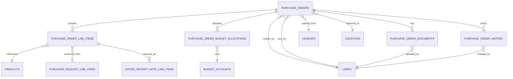

# Data Definition: Purchase Orders

## Document Information
- **Module**: Procurement
- **Sub-Module**: Purchase Orders
- **Document Type**: Data Definition (DD)
- **Version**: 3.4.0
- **Last Updated**: 2025-12-03
- **Status**: In Progress

## Document History

| Version | Date | Author | Changes |
|---------|------|--------|---------|
| 1.1.0 | 2025-12-10 | Documentation Team | Standardized reference number format (XXX-YYMM-NNNN) |
| 1.0.0 | 2025-10-30 | System | Initial creation with approval workflow tables |
| 2.0.0 | 2025-10-31 | System | Removed purchase_order_approvals table, updated ERD, removed v_pending_po_approvals view, updated status constraints, clarified approved_by/approved_at fields are NOT multi-stage approval workflow |
| 3.0.0 | 2025-11-21 | System | Major restructure: Converted from SQL-focused implementation document to proper Data Definition document with field definitions, business rules, and diagrams; moved all SQL code (DDL, triggers, functions, views) to Technical Specification document |
| 3.1.0 | 2025-12-01 | System | Added Comments & Attachments sidebar feature documentation; Updated page layout to describe collapsible right sidebar with Comments, Attachments, and Activity Log sections |
| 3.2.0 | 2025-12-01 | System | Added PO Item enhanced fields: sourceRequestId, sourceRequestItemId, lineTotal, pendingQuantity, discount, discountAmount, taxRate, taxAmount, deliveryDate for PR traceability and financial calculations |
| 3.3.0 | 2025-12-02 | System Analyst | Added QR Code fields (qr_code, qr_code_image, qr_code_generated_at) to Purchase Orders table for mobile receiving integration |
| 3.4.0 | 2025-12-03 | Documentation Team | Converted SQL DDL to text-based DD format for entities 2-6; moved Database Functions and Views to TS reference |

## Related Documents

- [Business Requirements](./BR-purchase-orders.md)
- [Use Cases](./UC-purchase-orders.md)
- [Technical Specification](./TS-purchase-orders.md)
- [Flow Diagrams](./FD-purchase-orders.md)
- [Validations](./VAL-purchase-orders.md)

---

## Overview

This document defines the data structures and relationships for the Purchase Orders sub-module including:
- Entity Relationship Diagram (ERD)
- Entity definitions and purposes
- Field definitions with data types and business rules
- Relationships between entities
- Business constraints and validation rules

**Note**: For technical implementation details (SQL DDL, triggers, functions), refer to the [Technical Specification](./TS-purchase-orders.md).

---

## Entity Relationship Diagram

---

## Core Entities

### 1. Purchase Orders

**Purpose**: Represents a purchase order document sent to vendors for procurement of goods or services.

**Primary Key**: Unique identifier (UUID)

**Business Identifier**: PO Number (Format: PO-YYMM-NNNN, e.g., PO-2401-001234)

#### Field Definitions

| Field Name | Data Type | Required | Description | Business Rules |
|------------|-----------|----------|-------------|----------------|
| **Identification** |
| id | UUID | Yes | System-generated unique identifier | Auto-generated |
| po_number | String(50) | Yes | Human-readable PO number | Unique, format: PO-YYMM-NNNN |
| version | Integer | Yes | Document version for change tracking | Increments on each modification |
| **Vendor Information** |
| vendor_id | UUID | Yes | Reference to vendor entity | Must be active vendor |
| **Status and Workflow** |
| status | String(20) | Yes | Current lifecycle status | Values: Draft, Sent, Acknowledged, Partially Received, Fully Received, Completed, Cancelled, On Hold |
| **Dates** |
| order_date | Date | Yes | Date when PO was created | Defaults to current date |
| expected_delivery_date | Date | Yes | Expected delivery date | Must be >= order_date |
| **Delivery Information** |
| delivery_location_id | UUID | Yes | Reference to delivery location | Must be valid location |
| **Financial Information** |
| subtotal | Decimal(15,2) | Yes | Sum of line item totals | Must be >= 0 |
| discount_amount | Decimal(15,2) | Yes | Total discount applied | Must be >= 0 |
| discount_percentage | Decimal(5,2) | No | Discount percentage if applicable | 0-100% |
| tax_amount | Decimal(15,2) | Yes | Total tax amount | Must be >= 0 |
| shipping_amount | Decimal(15,2) | Yes | Shipping/delivery charges | Must be >= 0 |
| grand_total | Decimal(15,2) | Yes | Final total amount | Calculated: subtotal - discount + tax + shipping |
| currency | String(3) | Yes | Currency code (ISO 4217) | Default: USD |
| **Terms and Conditions** |
| payment_terms | String(100) | Yes | Payment terms agreed with vendor | E.g., "Net 30", "COD" |
| delivery_terms | String(100) | Yes | Delivery terms (Incoterms) | E.g., "FOB", "CIF" |
| **Notes** |
| notes | Text | No | Public notes visible to vendor | |
| internal_notes | Text | No | Internal notes for staff only | Not shared with vendor |
| **Workflow Tracking** |
| created_by | UUID | Yes | User who created the PO | Reference to users |
| created_at | Timestamp | Yes | Creation timestamp | Auto-generated |
| approved_by | UUID | No | Purchasing staff who authorized PO | Single authorization, not multi-stage |
| approved_at | Timestamp | No | Authorization timestamp | Set when PO is sent |
| sent_by | UUID | No | User who sent PO to vendor | |
| sent_at | Timestamp | No | Timestamp when sent to vendor | |
| acknowledged_at | Timestamp | No | Vendor acknowledgment timestamp | |
| completed_at | Timestamp | No | Completion timestamp | |
| cancelled_at | Timestamp | No | Cancellation timestamp | |
| cancellation_reason | Text | No | Reason for cancellation | Required if cancelled |
| **Audit Fields** |
| updated_at | Timestamp | Yes | Last update timestamp | Auto-updated |
| updated_by | UUID | Yes | User who last updated | Reference to users |
| **QR Code for Mobile Receiving** |
| qr_code | String(100) | No | QR code value for mobile scanning | Format: PO:{po_number}, e.g., "PO:PO-2501-0001" |
| qr_code_image | Text | No | Base64-encoded QR code image | Data URL format for web display |
| qr_code_generated_at | Timestamp | No | QR code generation timestamp | Auto-set when generated |
| **Soft Delete** |
| deleted_at | Timestamp | No | Deletion timestamp | Null if not deleted |
| deleted_by | UUID | No | User who deleted | |

#### Business Constraints

1. **Status Transitions**:
   - Draft → Sent (when sent to vendor)
   - Sent → Acknowledged (vendor confirms receipt)
   - Acknowledged → Partially Received (some items received)
   - Partially Received → Fully Received (all items received)
   - Fully Received → Completed (all processes complete)
   - Any status → Cancelled (with reason required)

2. **Financial Validation**:
   - All amounts must be non-negative
   - Grand total must equal: subtotal - discount + tax + shipping
   - Either discount_amount OR discount_percentage can be used, not both

3. **Date Validation**:
   - Expected delivery date must be >= order date

4. **Authorization**:
   - Only authorized purchasing staff can send POs to vendors
   - approved_by and approved_at are set together when PO is sent

5. **QR Code Generation**:
   - qr_code value must follow format: `PO:{po_number}`
   - qr_code_image must be valid base64-encoded data URL
   - qr_code_generated_at auto-set when QR code generated
   - QR codes regenerated if PO number changes

---

### 2. Purchase Order Line Items

**Purpose**: Individual line items on purchase orders representing products or services being ordered.

**Primary Key**: Unique identifier (UUID)

**Composite Key**: purchase_order_id + line_number (unique within each PO)

#### Field Definitions

| Field Name | Data Type | Required | Description | Business Rules |
|------------|-----------|----------|-------------|----------------|
| **Identification** |
| id | UUID | Yes | System-generated unique identifier | Auto-generated |
| purchase_order_id | UUID | Yes | Reference to parent purchase order | Foreign key to purchase_orders |
| line_number | Integer | Yes | Sequential line number within PO | Unique within PO, auto-incremented |
| **Source Reference (PR Traceability)** |
| purchase_request_line_item_id | UUID | No | Reference to source PR line item | Foreign key to purchase_request_line_items |
| source_request_id | String(50) | No | PR number for display | Format: PR-YYMM-NNNN (e.g., "PR-2401-0045") |
| source_request_item_id | String(50) | No | PR item ID for traceability | Links to original request item |
| **Product Information** |
| product_id | UUID | No | Reference to product catalog | Foreign key to products |
| item_code | String(50) | No | Item code from product catalog | For display and lookup |
| item_name | String(255) | Yes | Display name for the item | Required for all line items |
| description | Text | Yes | Detailed item description | Required for all line items |
| **Quantity and Pricing** |
| quantity | Decimal(15,3) | Yes | Ordered quantity | Must be > 0 |
| unit_of_measure | String(20) | Yes | Unit of measure | E.g., "Box", "Each", "Kg" |
| unit_price | Decimal(15,2) | Yes | Price per unit | Must be >= 0 |
| **Discount (Line-Level)** |
| discount | Decimal(5,2) | No | Discount percentage | Default: 0, Range: 0-100% |
| discount_amount | Decimal(15,2) | No | Calculated discount amount | Default: 0, calculated from percentage |
| **Line Totals** |
| line_total | Decimal(15,2) | Yes | Line total amount | Calculated: (quantity × unit_price) - discount_amount |
| tax_rate | Decimal(5,2) | No | Tax rate percentage | Default: 0, Range: 0-100% |
| tax_amount | Decimal(15,2) | Yes | Tax amount for line | Default: 0.00, calculated from tax_rate |
| **Delivery** |
| expected_delivery_date | Date | No | Line-specific delivery date | Optional, overrides PO header date |
| **Receipt Tracking** |
| quantity_received | Decimal(15,3) | Yes | Total quantity received | Default: 0, updated by GRN |
| pending_quantity | Decimal(15,3) | Yes | Quantity pending delivery | Alias for quantity_remaining |
| quantity_remaining | Decimal(15,3) | Yes | Quantity yet to be received | Calculated: quantity - quantity_received |
| **Additional Information** |
| specifications | Text | No | Technical specifications | Optional detailed specs |
| notes | Text | No | Line item notes | Internal notes |
| **Status** |
| status | String(20) | Yes | Line item status | Values: pending, partial, received, cancelled |
| **Audit Fields** |
| created_at | Timestamp | Yes | Creation timestamp | Auto-generated |
| created_by | UUID | Yes | User who created | Reference to users |
| updated_at | Timestamp | Yes | Last update timestamp | Auto-updated |
| updated_by | UUID | Yes | User who last updated | Reference to users |

#### Business Constraints

1. **Quantity Validation**:
   - Ordered quantity must be greater than 0
   - Received quantity cannot exceed ordered quantity by more than 5% (tolerance for over-delivery)
   - Remaining quantity must be >= 0

2. **Pricing Validation**:
   - Unit price must be >= 0
   - Discount percentage must be between 0-100%
   - Tax rate must be between 0-100%

3. **Line Total Calculation**:
   - line_total = (quantity × unit_price) - discount_amount
   - discount_amount = (quantity × unit_price) × (discount / 100)
   - tax_amount = line_total × (tax_rate / 100)

4. **Status Transitions**:
   - pending → partial (when some quantity received)
   - pending → received (when all quantity received)
   - partial → received (when remaining quantity received)
   - Any status → cancelled (with proper authorization)

---

### 3. Purchase Order Budget Allocations

**Purpose**: Budget account allocations for purchase orders, enabling split funding across multiple budget accounts.

**Primary Key**: Unique identifier (UUID)

#### Field Definitions

| Field Name | Data Type | Required | Description | Business Rules |
|------------|-----------|----------|-------------|----------------|
| **Identification** |
| id | UUID | Yes | System-generated unique identifier | Auto-generated |
| purchase_order_id | UUID | Yes | Reference to parent purchase order | Foreign key to purchase_orders, cascade delete |
| **Budget Information** |
| budget_account_id | UUID | Yes | Reference to budget account | Foreign key to budget_accounts |
| allocation_amount | Decimal(15,2) | Yes | Amount allocated to this account | Must be > 0 |
| allocation_percentage | Decimal(5,2) | Yes | Percentage of PO total | Must be > 0 and <= 100% |
| fiscal_year | Integer | Yes | Fiscal year for allocation | Current or future fiscal year |
| **Additional Information** |
| notes | Text | No | Notes about allocation | Optional comments |
| **Audit Fields** |
| created_at | Timestamp | Yes | Creation timestamp | Auto-generated |
| created_by | UUID | Yes | User who created | Reference to users |
| updated_at | Timestamp | Yes | Last update timestamp | Auto-updated |
| updated_by | UUID | Yes | User who last updated | Reference to users |

#### Business Constraints

1. **Allocation Validation**:
   - Allocation amount must be greater than 0
   - Allocation percentage must be between 0-100%
   - Sum of all allocation percentages for a PO must equal 100%

2. **Budget Availability**:
   - Sufficient budget must be available in the budget account
   - Allocation cannot exceed available budget balance

---

### 4. Purchase Order Documents

**Purpose**: Documents and attachments related to purchase orders (quotes, specifications, contracts, etc.).

**Primary Key**: Unique identifier (UUID)

#### Field Definitions

| Field Name | Data Type | Required | Description | Business Rules |
|------------|-----------|----------|-------------|----------------|
| **Identification** |
| id | UUID | Yes | System-generated unique identifier | Auto-generated |
| purchase_order_id | UUID | Yes | Reference to parent purchase order | Foreign key to purchase_orders, cascade delete |
| **File Information** |
| file_name | String(255) | Yes | Original file name | Required |
| file_size | BigInt | Yes | File size in bytes | Must be > 0, max 10MB (10485760 bytes) |
| file_type | String(100) | Yes | MIME type | E.g., "application/pdf", "image/jpeg" |
| file_path | Text | Yes | Storage path/URL | Path to file in storage system |
| **Document Classification** |
| document_type | String(50) | Yes | Type of document | Values: Quote, Specification, Contract, Drawing, Email, Other |
| description | Text | No | Document description | Optional notes about the document |
| version | Integer | Yes | Document version number | Default: 1, increments on replacement |
| **Status** |
| is_active | Boolean | Yes | Whether document is active | Default: true, false for soft delete |
| **Audit Fields** |
| uploaded_by | UUID | Yes | User who uploaded | Reference to users |
| uploaded_at | Timestamp | Yes | Upload timestamp | Auto-generated |

#### Business Constraints

1. **File Size Limit**:
   - Maximum file size: 10MB (10,485,760 bytes)
   - File size must be greater than 0

2. **Document Types**:
   - Quote: Vendor quotation documents
   - Specification: Product/service specifications
   - Contract: Legal agreements
   - Drawing: Technical drawings or diagrams
   - Email: Email correspondence
   - Other: Miscellaneous documents

3. **Version Control**:
   - New version created when document is replaced
   - Previous versions marked as inactive (is_active = false)

---

### 5. Purchase Order History

**Purpose**: Complete audit trail of all changes to purchase orders for compliance and traceability.

**Primary Key**: Unique identifier (UUID)

#### Field Definitions

| Field Name | Data Type | Required | Description | Business Rules |
|------------|-----------|----------|-------------|----------------|
| **Identification** |
| id | UUID | Yes | System-generated unique identifier | Auto-generated |
| purchase_order_id | UUID | Yes | Reference to purchase order | Foreign key to purchase_orders, cascade delete |
| **Change Information** |
| change_type | String(50) | Yes | Type of change | E.g., Created, Modified, Authorized, Sent, Cancelled |
| field_name | String(100) | No | Name of changed field | Populated for field-level changes |
| old_value | Text | No | Previous value | Stored as text for comparison |
| new_value | Text | No | New value | Stored as text for comparison |
| **Change Metadata** |
| changed_by | UUID | Yes | User who made the change | Reference to users |
| changed_at | Timestamp | Yes | Timestamp of change | Auto-generated, default NOW() |
| comments | Text | No | Comments about the change | Optional notes |
| change_reason | Text | No | Reason for the change | Required for cancellations |
| **Context** |
| ip_address | INET | No | IP address of user | For security audit |
| user_agent | Text | No | Browser/client information | For security audit |

#### Change Types

| Change Type | Description | When Logged |
|-------------|-------------|-------------|
| Created | PO initially created | On INSERT |
| Modified | Field value changed | On UPDATE of any field |
| Authorized | PO authorized by purchasing staff | When approved_at is set |
| Sent to Vendor | PO sent to vendor | When sent_at is set |
| Acknowledged | Vendor acknowledged receipt | When acknowledged_at is set |
| Status Changed | Status field changed | On status transition |
| Cancelled | PO cancelled | When cancelled_at is set |

---

### 6. PO Sequence

**Purpose**: Manages sequential PO number generation per fiscal year to ensure unique, sequential PO numbers.

**Primary Key**: Year (Integer)

#### Field Definitions

| Field Name | Data Type | Required | Description | Business Rules |
|------------|-----------|----------|-------------|----------------|
| year | Integer | Yes | Fiscal year | Primary key, range: 2000-2100 |
| sequence | Integer | Yes | Current sequence number | Default: 0, must be >= 0 |
| updated_at | Timestamp | Yes | Last update timestamp | Auto-updated |

#### Business Rules

1. **Sequence Generation**:
   - Sequence increments atomically for each new PO
   - Format: PO-YYMM-NNNN (e.g., PO-2501-000001)
   - Sequence resets to 1 at start of each month

2. **Year Validation**:
   - Year must be between 2000 and 2100
   - Sequence must be non-negative

---

## Database Implementation Reference

For technical implementation details including SQL DDL, database functions, triggers, and views, refer to the [Technical Specification (TS-purchase-orders.md)](./TS-purchase-orders.md).

### Database Functions Summary

The following functions are implemented to support PO operations:

| Function | Purpose |
|----------|---------|
| get_next_po_sequence | Atomically generates next PO sequence number for given year |
| update_po_line_remaining_quantity | Automatically calculates remaining quantity on line items |
| update_po_totals | Recalculates PO totals when line items change |
| log_po_history | Automatically logs changes to purchase orders |
| update_po_timestamp | Automatically updates updated_at timestamp |

### Database Views Summary

| View | Purpose |
|------|---------|
| v_purchase_orders_with_details | Complete PO information with vendor and location details |
| v_po_line_items_with_receipt_status | Line items with receipt status and quantities |

---

## Sample Data Migration

### Initial Sequence Setup

**Purpose**: Initialize the PO sequence counter for the current year.

**Migration Steps**:
1. Insert a new sequence record for the current year with starting value 0
2. If a record already exists for the year, skip the insertion (idempotent operation)

**Expected Result**: A single row exists in `po_sequence` for each active year.

> **Note**: For SQL implementation details, refer to [TS-purchase-orders.md](./TS-purchase-orders.md).

---

## Data Integrity Rules

### 1. Referential Integrity
- All foreign keys use RESTRICT on delete for parent tables
- Cascade delete for dependent records (line items, approvals)
- Soft delete on main purchase_orders table

### 2. Business Logic Constraints
- PO status must follow valid workflow transitions
- Budget allocations must sum to 100% (validated in application layer)
- Approval levels must be sequential
- Quantities and amounts must be non-negative
- Received quantities cannot exceed ordered by more than 5%

### 3. Audit Requirements
- All tables include created_at, created_by, updated_at, updated_by
- Changes logged automatically via triggers
- History table preserves complete audit trail
- Soft delete preserves historical data

---

## Performance Considerations

### Query Optimization
- Indexes on frequently queried columns (status, vendor_id, dates)
- Composite indexes for common filter combinations
- Partial indexes for active records only
- Covering indexes for common queries

### Data Volume Estimates
- Purchase Orders: ~50,000 records/year
- Line Items: ~200,000 records/year (avg 4 items per PO)
- History: ~500,000 records/year (avg 10 changes per PO)

### Archival Strategy
- Completed POs archived after 2 years
- History maintained for 7 years (regulatory requirement)
- Soft delete allows recovery within 30 days

---
