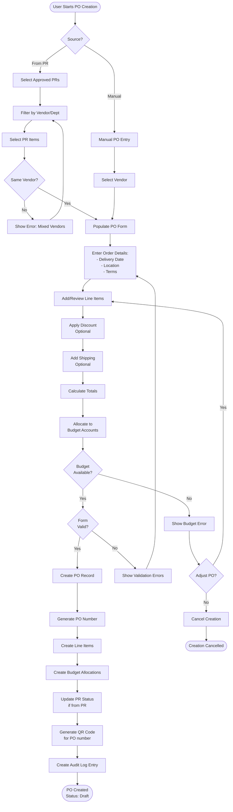
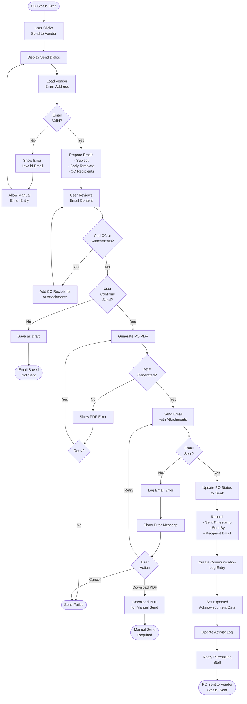
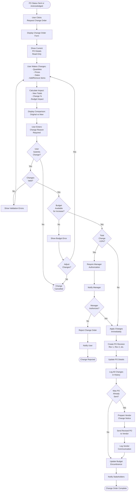
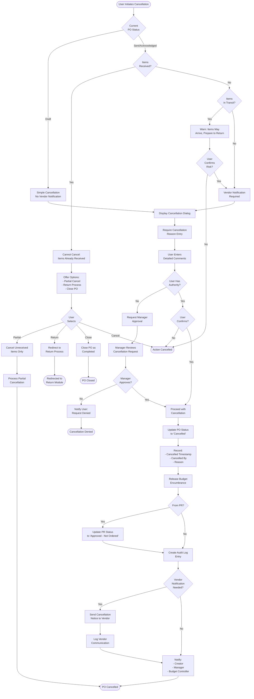
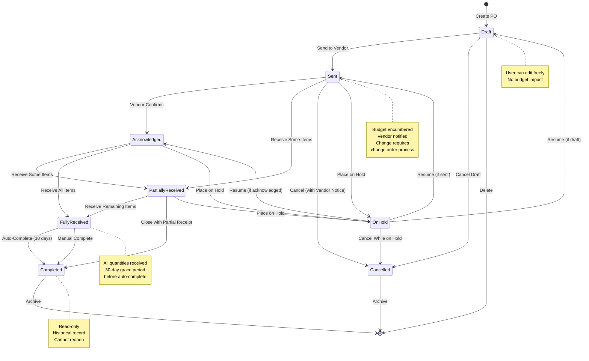
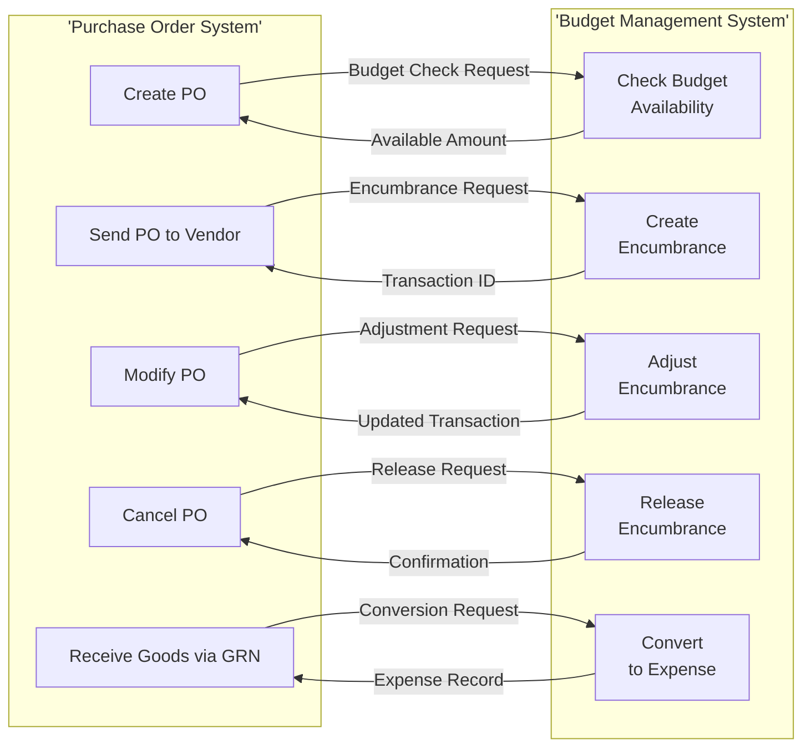
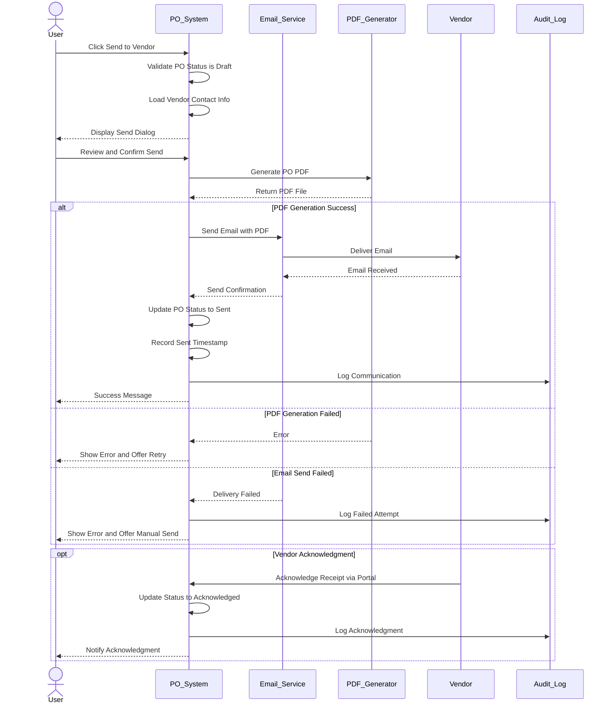
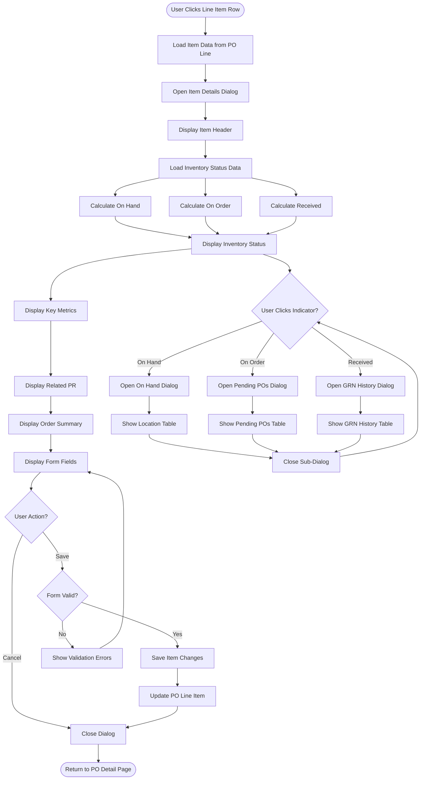
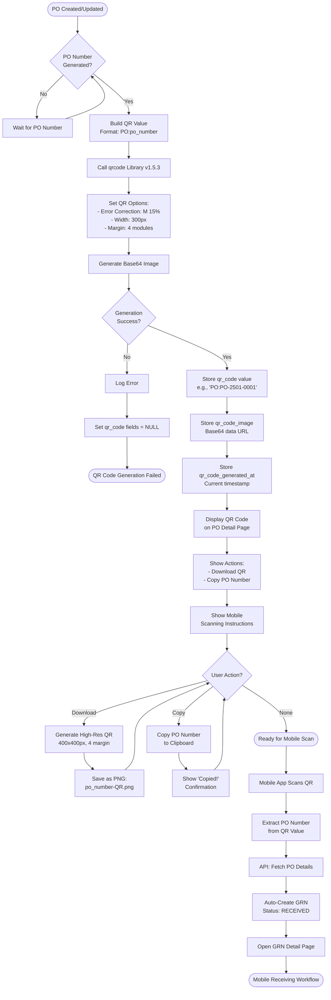

# Flow Diagrams: Purchase Orders

## Document Information
- **Module**: Procurement
- **Sub-Module**: Purchase Orders
- **Document Type**: Flow Diagrams (FD)
- **Version**: 2.5.0
- **Last Updated**: 2025-12-19
- **Status**: Approved

**Document History**:
- v1.0.0 (2025-10-30): Initial version with approval workflow diagrams
- v2.0.0 (2025-10-31): Removed Diagram 2 (Approval Workflow) and Diagram 9 (Multi-Level Approval Sequence), updated all remaining diagrams to remove approval workflow logic

## Related Documents
- [Business Requirements](./BR-purchase-orders.md)
- [Use Cases](./UC-purchase-orders.md)
- [Technical Specification](./TS-purchase-orders.md)
- [Data Definition](./DS-purchase-orders.md)
- [Validations](./VAL-purchase-orders.md)

## Document History

| Version | Date | Author | Changes |
|---------|------|--------|---------|
| 2.5.0 | 2025-12-19 | System Analyst | Added Diagram 11: Simplified Create PO from PR flow showing new PO Summary dialog workflow with vendor + currency grouping |
| 1.1.0 | 2025-12-10 | Documentation Team | Standardized reference number format (XXX-YYMM-NNNN) |
| 2.4.0 | 2025-12-03 | System | Mermaid 8.8.2 compatibility fixes: Updated stateDiagram to stateDiagram-v2, removed unsupported subgraph styling |
| 2.3.0 | 2025-12-02 | System Analyst | Added Diagram 10: QR Code Generation for Mobile Receiving flow, updated PO creation flow (Diagram 1) to include QR code generation step |
| 2.1.0 | 2025-12-01 | System | Added Comments & Attachments sidebar feature; Updated page layout description to include collapsible right sidebar with Comments, Attachments, and Activity Log sections |
| 1.0.0 | 2025-11-19 | Documentation Team | Initial version |
---

## Overview

This document provides visual representations of purchase order workflows, data flows, and state transitions. All diagrams use Mermaid syntax for version control and maintainability.

**Diagram Types**:
- Process Flow Diagrams: User and system workflows
- Data Flow Diagrams: Information movement
- State Transition Diagrams: Status lifecycle
- Sequence Diagrams: System interactions
- Integration Flow Diagrams: External system interactions

---

## 1. Purchase Order Creation Process Flow



**Description**: Complete flow for creating a purchase order from purchase requests or manually.

## 2. Send Purchase Order to Vendor



**Description**: Process for sending purchase order to vendor via email with PDF attachment.

---

## 3. Purchase Order Change Order Process



**Description**: Process for modifying sent purchase orders with change order control and manager authorization for significant changes (>10%).

---

## 4. Purchase Order Cancellation Process



**Description**: Purchase order cancellation with vendor notification and budget release.

---

## 5. Purchase Order Status State Transition Diagram



**Description**: Complete state machine showing all possible PO status transitions and constraints.

**State Guard Descriptions**:

**Send to Vendor Guard**:
- **Condition Name**: Can Send to Vendor
- **Description**: PO can only be sent if all validations pass and vendor contact is valid
- **Required Checks**:
  - PO status is 'Draft'
  - At least one line item exists
  - All required fields completed
  - Budget is available for total amount
  - Vendor has valid email address
  - PO PDF can be generated
  - User has 'send_purchase_orders' permission
- **Implementation**: System validates before email transmission and creates budget encumbrance

**Receive Items Guard**:
- **Condition Name**: Can Receive Items
- **Description**: Items can only be received against sent/acknowledged POs
- **Required Checks**:
  - PO status is 'Sent' or 'Acknowledged'
  - Receiving location matches delivery location
  - Quantities within tolerance (+5%)
  - Line items match PO
- **Implementation**: GRN creation validates against PO

**Complete PO Guard**:
- **Condition Name**: Can Complete
- **Description**: PO can only be completed when all conditions are met
- **Required Checks**:
  - All items fully received OR partial receipt approved
  - No open quality issues or disputes
  - 30 days elapsed since full receipt (for auto-complete)
  - All related invoices processed (if integrated)
  - Budget fully reconciled
- **Implementation**: Automated job checks conditions daily

**Cancel Guard**:
- **Condition Name**: Can Cancel
- **Description**: PO can be cancelled if no items have been received
- **Required Checks**:
  - No GRN entries exist for this PO
  - User has cancellation authority based on PO amount
  - Cancellation reason provided
  - If sent: Vendor notification prepared
- **Implementation**: System prevents cancellation if items received

---

## 6. Budget Integration Data Flow



**Description**: Data flow between purchase order system and budget management system.

---

## 7. Vendor Communication Sequence Diagram



**Description**: Sequence of interactions when sending PO to vendor with error handling.

## 8. Goods Receipt Integration Flow

```mermaid
graph TD
    Start([GRN Created]) --> GRNApproved{GRN<br>Approved?}
    
    GRNApproved -->|No| EndWait([Wait for GRN Approval])
    
    GRNApproved -->|Yes| GetPORef[Get Referenced<br>PO ID]
    GetPORef --> FetchPO[Fetch PO Details]
    FetchPO --> GetGRNLines[Get GRN Line Items]
    
    GetGRNLines --> LoopLines{For Each<br>GRN Line}
    LoopLines --> FindPOLine[Find Matching<br>PO Line Item]
    FindPOLine --> UpdateReceived[Update<br>Quantity Received]
    UpdateReceived --> CalcRemaining[Calculate<br>Quantity Remaining]
    CalcRemaining --> CheckTolerance{Within<br>Tolerance?}
    
    CheckTolerance -->|No| FlagOverReceipt[Flag Over-Receipt<br>Requires Review]
    CheckTolerance -->|Yes| NextLine
    FlagOverReceipt --> NextLine{More<br>Lines?}
    
    NextLine -->|Yes| LoopLines
    NextLine -->|No| EvaluateStatus[Evaluate Overall<br>PO Status]
    
    EvaluateStatus --> AnyRemaining{Any Items<br>Remaining?}
    AnyRemaining -->|Yes| SetPartiallyReceived[Set Status:<br>'Partially Received']
    AnyRemaining -->|No| SetFullyReceived[Set Status:<br>'Fully Received']
    
    SetPartiallyReceived --> UpdateBudget1[Convert Received<br>Portion to Expense]
    SetFullyReceived --> UpdateBudget2[Convert All<br>Encumbrance to Expense]
    
    UpdateBudget1 --> LogHistory1[Log Status Change]
    UpdateBudget2 --> LogHistory2[Log Status Change]
    
    LogHistory1 --> NotifyPartial[Notify Purchasing Staff:<br>Partial Receipt]
    LogHistory2 --> NotifyFull[Notify All:<br>Fully Received]
    
    NotifyPartial --> SetAutoComplete{30 Days<br>Since Full<br>Receipt?}
    NotifyFull --> SetAutoComplete
    
    SetAutoComplete -->|No| End([Status Updated])
    SetAutoComplete -->|Yes| AutoComplete[Auto-Complete PO]
    AutoComplete --> FinalizeStatus[Set Status:<br>'Completed']
    FinalizeStatus --> ArchivePO[Archive PO]
    ArchivePO --> End
```



**Description**: Automatic PO status update when goods are received via GRN.

---

## 9. Line Item Details View Flow



**Description**: User flow for viewing and interacting with line item details, including inventory status indicators and sub-dialogs.

---

## 10. QR Code Generation for Mobile Receiving



**Description**: Complete flow for automatic QR code generation on PO creation/update, desktop display with download/copy actions, and integration with mobile receiving workflow. QR codes enable quick GRN creation by scanning PO QR codes on mobile devices.

**Key Components**:
- **QR Library**: qrcode v1.5.3 (npm package)
- **QR Format**: `PO:{orderNumber}` (e.g., "PO:PO-2501-0001")
- **Desktop Component**: `QRCodeSection.tsx` at `app/(main)/procurement/purchase-orders/components/`
- **Utilities**: `lib/utils/qr-code.ts` with 7+ utility functions
- **Mobile Integration**: cmobile app scans QR → Extracts PO number → Auto-creates GRN
- **Display Options**:
  * On-screen: 200×200px, 2-module margin
  * Download: 400×400px PNG, 4-module margin
- **Error Correction**: Medium (M) level - 15% data restoration capability

---

## 11. Create PO from PR Flow (Simplified v1.4.0)

```mermaid
graph TD
    Start([User Opens<br>Create PO from PR]) --> AccessPoint{Access<br>Point?}

    AccessPoint -->|Dialog| OpenDialog[Open CreatePOFromPR<br>Dialog on PO List]
    AccessPoint -->|Page| OpenPage[Navigate to<br>/create/from-pr]

    OpenDialog --> ShowPRTable[Display PR<br>Selection Interface]
    OpenPage --> ShowPRTable

    ShowPRTable --> DisplayHeader[Show Header with<br>Package Icon in<br>bg-primary/10 circle]
    DisplayHeader --> DisplayBanner[Show Info Banner<br>bg-blue-50 border-blue-200<br>explaining automatic grouping]
    DisplayBanner --> DisplayWorkflow[Show Workflow Indicator<br>Select PRs → Review Summary → Create PO]
    DisplayWorkflow --> DisplayTable[Display Simplified Table:<br>Checkbox | PR# | Date | Description]

    DisplayTable --> UserSearch{User<br>Searches?}
    UserSearch -->|Yes| FilterPRs[Filter PRs by<br>PR# or Description]
    FilterPRs --> DisplayTable
    UserSearch -->|No| UserSelect[User Selects PRs]

    UserSelect --> UpdateBadge[Update Selection Badge<br>Green with CheckCircle]
    UpdateBadge --> MoreSelect{More<br>Selections?}
    MoreSelect -->|Yes| UserSelect
    MoreSelect -->|No| ClickCreate[User Clicks<br>Create PO Button]

    ClickCreate --> GroupPRs[Group PRs by<br>Vendor + Currency]
    GroupPRs --> ShowSummary[Display PO<br>Summary Dialog]

    ShowSummary --> DialogContent[Show Dialog:<br>- Header: X PRs → Y POs<br>- Card per PO with:<br>  * Vendor with Building icon<br>  * Delivery date with Calendar<br>  * Total with green badge<br>  * Source PR badges]
    DialogContent --> UserReview{User<br>Reviews}

    UserReview -->|Cancel| CloseDialog[Close Dialog<br>Return to Selection]
    CloseDialog --> DisplayTable

    UserReview -->|Confirm| StoreData[Store Grouped Data<br>in localStorage]
    StoreData --> CheckGroups{Group<br>Count?}

    CheckGroups -->|Single| NavSingle[Navigate to:<br>/create?mode=fromPR&grouped=true]
    CheckGroups -->|Multiple| NavBulk[Navigate to:<br>/create/bulk]

    NavSingle --> CreateSingle([Create Single PO])
    NavBulk --> CreateBulk([Create Multiple POs])
```

**Description**: Simplified workflow (v1.4.0) for creating Purchase Orders from approved Purchase Requests. Shows the streamlined PR selection interface with simplified table (PR#, Date, Description only), PO Summary dialog for reviewing grouped POs before creation, and navigation to single or bulk creation pages.

**Key Implementation Details**:
- **Component**: `CreatePOFromPR` at `app/(main)/procurement/purchase-orders/components/createpofrompr.tsx`
- **Page**: `/create/from-pr` at `app/(main)/procurement/purchase-orders/create/from-pr/page.tsx`
- **Simplified Table**: Removed Vendor, Delivery Date, Amount, Currency columns for cleaner selection experience
- **Grouping**: By vendor + currency only (NOT delivery date)
- **Design Language**: Consistent styling with `border-l-4 border-l-primary`, green badges, blue info banners
- **localStorage Keys**: `groupedPurchaseRequests`, `selectedPurchaseRequests`
- **Dialog Scrolling**: Uses `overflow-y-auto` with `min-h-0` for flex layout (not ScrollArea)

---

## Summary

This document provides comprehensive visual representations of all major purchase order workflows including:

1. **Creation Process**: From PRs or manual entry
2. **Vendor Communication**: Sending POs with PDF generation
3. **Change Management**: Change order process with budget validation
4. **Cancellation**: Budget release and vendor notification
5. **State Transitions**: Complete lifecycle state machine
6. **Budget Integration**: Real-time budget system interaction
7. **Vendor Communication Sequence**: Email transmission sequence
8. **GRN Integration**: Automatic status updates on receipt
9. **Line Item Details View**: Item details dialog with inventory status and sub-dialogs
10. **QR Code Generation**: Automatic QR code generation for mobile receiving integration
11. **Create PO from PR (Simplified)**: New streamlined workflow with simplified PR table and PO Summary dialog

These diagrams serve as reference for developers, testers, and stakeholders to understand system behavior and data flows.

---

**Document History**

| Version | Date | Author | Changes |
|---------|------|--------|---------|
| 1.0.0 | 2025-10-30 | System | Initial creation from template |
| 2.1.0 | 2025-12-01 | System | Added Comments & Attachments sidebar feature documentation |
| 2.2.0 | 2025-12-01 | System | Added Line Item Details View Flow (Diagram 9) showing item details dialog with inventory status indicators, sub-dialogs for On Hand Breakdown, Pending POs, and GRN History |
| 2.3.0 | 2025-12-02 | System Analyst | Added Diagram 10: QR Code Generation for Mobile Receiving flow with complete desktop and mobile integration, updated Diagram 1 to include QR code generation step |
| 2.4.0 | 2025-12-03 | System | Mermaid 8.8.2 compatibility fixes: Updated stateDiagram to stateDiagram-v2, removed unsupported subgraph styling |
| 2.5.0 | 2025-12-19 | System Analyst | Added Diagram 11: Simplified Create PO from PR flow showing new PO Summary dialog workflow with vendor + currency grouping |
