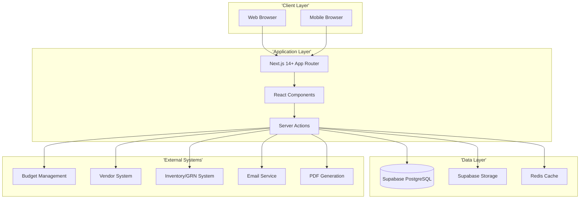
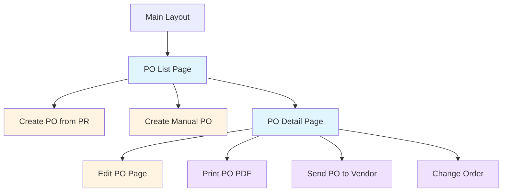
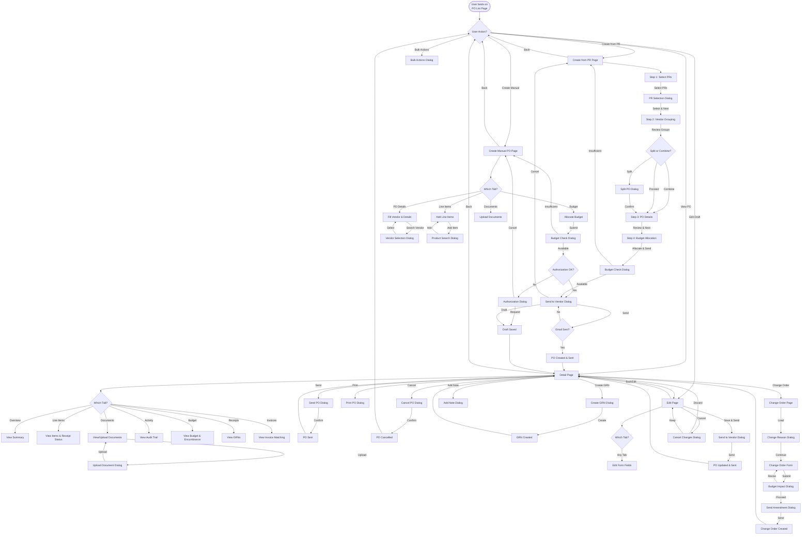
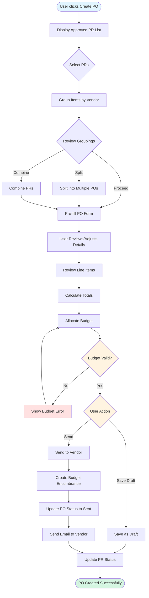
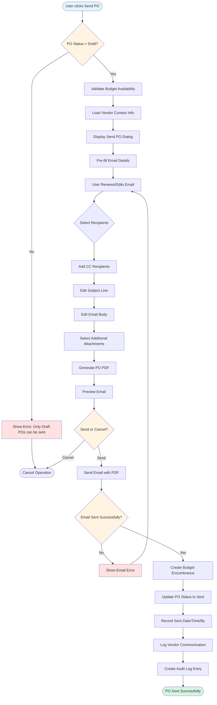
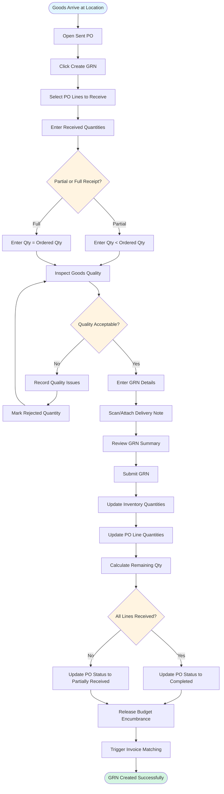

# Technical Specification: Purchase Orders

## Document Information
- **Module**: Procurement
- **Sub-Module**: Purchase Orders
- **Document Type**: Technical Specification (TS)
- **Version**: 2.4.0
- **Last Updated**: 2025-12-19
- **Status**: Approved

**Document History**:
- v1.0.0 (2025-10-30): Initial version with approval workflows
- v1.1.0 (2025-10-31): Added correction notice
- v2.0.0 (2025-10-31): Complete revision - removed all approval workflow content, corrected status flow to match actual implementation

## Related Documents
- [Business Requirements](./BR-purchase-orders.md)
- [Use Cases](./UC-purchase-orders.md)
- [Data Definition](./DS-purchase-orders.md)
- [Flow Diagrams](./FD-purchase-orders.md)
- [Validations](./VAL-purchase-orders.md)

## Document History

| Version | Date | Author | Changes |
|---------|------|--------|---------|
| 2.4.0 | 2025-12-19 | System Analyst | Updated CreatePOFromPR component: simplified PR table (PR#, Date, Description), PO Summary dialog, grouping by vendor + currency only, design language documentation, removed template/recurring UI options |
| 1.1.0 | 2025-12-10 | Documentation Team | Standardized reference number format (XXX-YYMM-NNNN) |
| 2.3.0 | 2025-12-02 | System Analyst | Added QR Code Generation section with QRCodeSection component, lib/utils/qr-code.ts utilities, qrcode library v1.5.3 integration, and mobile receiving integration details |
| 2.2.0 | 2025-12-01 | System | Added PO Item Details Dialog documentation (DetailDialog9) with inventory status indicators (On Hand, On Order, Received), related PR links, and financial summary; Added sub-dialogs for On Hand Breakdown, Pending POs, and GRN History |
| 2.1.0 | 2025-12-01 | System | Added Comments & Attachments collapsible sidebar feature; Updated Detail Page layout to include right sidebar with Comments, Attachments, and Activity Log sections matching PR page pattern |
| 1.0.0 | 2025-11-19 | Documentation Team | Initial version |
---

## Overview

This document provides high-level technical implementation guidance for the Purchase Orders sub-module. It describes the system architecture, page structure, navigation flows, component responsibilities, and integration patterns without including specific code implementations.

**Technology Stack**:
- **Framework**: Next.js 14+ with App Router
- **Language**: TypeScript (strict mode)
- **Styling**: Tailwind CSS + Shadcn/ui
- **State Management**: Zustand + React Query
- **Forms**: React Hook Form + Zod validation
- **Database**: PostgreSQL via Supabase
- **API**: Next.js Server Actions + REST API

---

## High-Level System Architecture



**Architecture Description**:
- **Client Layer**: Browser-based interface supporting desktop and mobile responsive design
- **Application Layer**: Next.js server-side rendering with React components and server actions for data operations
- **Data Layer**: PostgreSQL database via Supabase with caching layer for performance
- **External Systems**: Integration with budget validation, vendor management, inventory tracking, email notifications, and PDF generation

---

## Page Hierarchy and Structure



**Page Hierarchy Description**:
- **Main Layout**: Contains global navigation, sidebar, and common elements
- **PO List Page**: Primary landing page with filterable, sortable PO list
- **Create PO from PR**: Conversion workflow from approved purchase requests
- **Create Manual PO**: Direct PO creation without PR (for emergency purchases)
- **PO Detail Page**: Read-only view of complete PO information
- **Edit PO Page**: Form for modifying draft POs
- **Print PO PDF**: Generate and download formatted PO document
- **Send PO to Vendor**: Email dialog for transmitting PO to supplier
- **Change Order**: Create amendments to approved POs

---

## Page Descriptions

### Purchase Order List Page

**Route**: `/procurement/purchase-orders`

**Purpose**: Display all purchase orders with filtering, sorting, and search capabilities

**Layout Components**:
- **Page Header**: Title, breadcrumb, Create PO button
- **Filter Bar**: Status filter, Vendor dropdown, Date range, Created by, Amount range
- **Quick Filters**: My POs, Draft, Sent, Acknowledged, Partial Received, Fully Received
- **Search Bar**: Search by PO number, vendor name, item description
- **Data Table**: Paginated list of POs with sortable columns
- **Action Buttons**: View, Edit (draft only), Print, Send (draft only), contextual actions
- **Export Button**: Export filtered results to Excel/CSV

**Key Features**:
- Real-time auto-refresh (no manual refresh button)
- Click row to view details
- Responsive table with column visibility toggle
- Status indicators with color coding (Draft: gray, Sent: blue, Acknowledged: green, Partial Received: yellow, Fully Received: purple, Closed: teal, Cancelled: red)
- Pagination (20 items per page default, configurable)
- Bulk actions for multiple POs (export, print)

**Display Columns**:
- PO Number (clickable link)
- Vendor Name
- Order Date
- Expected Delivery Date
- Status Badge
- Grand Total (formatted with currency)
- Created By (user name)
- Actions (icon buttons)

**State Management**:
- Local state for filters, sorting, pagination
- React Query for server state (PO data)
- Debounced search for performance

---

### Create PO from PR Page

**Route**: `/procurement/purchase-orders/create`

**Purpose**: Convert one or more approved purchase requests into purchase orders

**Layout Components**:
- **Page Header**: Title "Create Purchase Order from PR", breadcrumb
- **PR Selection Panel**: Search and select approved PRs
  * Search by PR number, item, requestor
  * Filter by department, location, date range
  * Multi-select capability for combining PRs
  * Preview of selected PR items
- **Vendor Grouping Panel**: Automatic grouping of PR items by vendor
  * Show vendor name and item count
  * Option to split into multiple POs
  * Option to combine items from multiple PRs to same vendor
- **PO Form**: Main purchase order creation form (see PO Form Component below)
- **Action Buttons**: Save as Draft, Send to Vendor, Cancel

**Workflow**:
1. User selects one or more approved PRs
2. System groups PR items by vendor
3. User reviews groupings and can split/combine as needed
4. For each vendor group, user creates a PO
5. System pre-fills PO details from PR (vendor, delivery location, items, terms)
6. User reviews, adjusts if needed, and sends to vendor

**Business Rules**:
- Only approved PRs can be converted
- PR items already on a PO cannot be selected again
- Multiple PRs can be combined if they have the same vendor
- Single PR can be split into multiple POs by vendor or delivery date

---

### Create Manual PO Page

**Route**: `/procurement/purchase-orders/create/manual`

**Purpose**: Create purchase order directly without a purchase request (for urgent or small purchases)

**Layout Components**:
- **Page Header**: Title "Create Manual Purchase Order", breadcrumb
- **PO Form**: Main purchase order creation form
- **Authorization Notice**: Note that manual POs must be created by authorized purchasing staff
- **Action Buttons**: Save as Draft, Send to Vendor, Cancel

**Key Features**:
- All fields manually entered by user
- Vendor selection with search capability
- Line item entry with product catalog integration
- Budget allocation selection
- Automatic totals calculation
- Validation against budget availability

**Business Rules**:
- Requires special permission (create_manual_po - authorized purchasing staff only)
- Amount limits may apply (e.g., under $5,000 for certain staff levels)
- High-value POs may be flagged for manager review (informational, not blocking)
- Justification/reason field is mandatory

---

### Purchase Order Detail Page

**Route**: `/procurement/purchase-orders/[id]`

**Purpose**: Display complete purchase order information in read-only format

**Layout Components**:
- **Page Header**:
  * PO Number (large, prominent)
  * Status Badge
  * Action buttons (Edit, Print, Send, Change Order, Cancel)
  * Breadcrumb navigation
- **PO Header Section**:
  * Vendor information (name, contact, address)
  * Order Date, Expected Delivery Date
  * Delivery Location
  * Payment Terms, Delivery Terms
  * Created By, Created Date
  * Authorized By (purchasing staff who created/sent PO)
  * Sent Date, Sent By (if sent)
- **Line Items Table**:
  * Line Number, Product/Description
  * Quantity, Unit of Measure, Unit Price
  * Line Total, Tax Amount
  * Expected Delivery Date (if different from PO)
  * Quantity Received, Quantity Remaining
  * Specifications, Notes
- **Totals Panel**:
  * Subtotal
  * Discount Amount/Percentage
  * Amount After Discount
  * Tax Amount
  * Shipping Amount
  * Grand Total (prominent, large font)
- **Budget Allocation Panel**:
  * Budget account name and code
  * Allocation percentage
  * Allocation amount
  * Budget availability status
  * Budget encumbrance status (created when PO sent to vendor)
- **Documents Panel**:
  * Attached quotes, specifications, contracts
  * File name, type, size, upload date
  * Download links
- **Notes Section**:
  * Public notes (visible to vendor)
  * Internal notes (internal use only)
- **Collapsible Sidebar** (right side, full-page height):
  * Toggle button in header to show/hide sidebar
  * Sidebar hidden by default
  * When visible, spans full page height alongside main content
  * **Comments & Attachments Section**:
    - Comments list with user avatar, name, timestamp
    - Blue left-border cards for each comment
    - Add new comment with textarea
    - Keyboard shortcut: Ctrl+Enter to send
    - Attachments list with file type badges
    - View and Download actions for attachments
    - Attach File button for uploads
  * **Activity Log Section**:
    - Chronological activity entries
    - User avatar, action badge, description, timestamp
    - Actions: Created, Updated, Approved, Sent, Comment

**Note**: Comments & Attachments and Activity Log are displayed in the collapsible right sidebar instead of as separate tabs.

**Key Features**:
- Print-friendly layout
- PDF generation for vendor transmission
- Email PO to vendor (approved POs only)
- Track vendor acknowledgment
- Link to related PRs (if converted from PR)
- Link to GRNs (Goods Receipt Notes) when received
- Change order creation (for approved POs)
- Cancellation with reason (appropriate permissions required)

---

### Edit PO Page

**Route**: `/procurement/purchase-orders/[id]/edit`

**Purpose**: Modify draft purchase orders before submission

**Layout Components**:
- **Page Header**: Title "Edit Purchase Order [PO Number]", breadcrumb
- **PO Form**: Main purchase order form (see PO Form Component)
- **Action Buttons**: Save Changes, Send to Vendor, Cancel

**Key Features**:
- Pre-populated with existing PO data
- Same validation as create form
- Automatic totals recalculation on changes
- Budget re-validation on amount changes
- Audit trail of all modifications

**Business Rules**:
- Only draft POs can be edited
- Once sent to vendor, editing requires creating a change order
- Changes to sent POs require change order process
- Re-validation of budget availability if total increases

---

## Sitemap

### Overview
This section provides a complete navigation structure of all pages, tabs, and dialogues in the Purchase Orders sub-module. It documents user workflows, interaction patterns, and accessibility considerations for the complete PO lifecycle from creation through goods receipt and payment.

### Enhanced Page Hierarchy

```mermaid
graph TD
    ListPage['List Page<br>(/procurement/purchase-orders)']
    CreateFromPR['Create from PR<br>(/procurement/purchase-orders/create)']
    CreateManual['Create Manual PO<br>(/procurement/purchase-orders/create/manual)']
    DetailPage["Detail Page<br>(/procurement/purchase-orders/[id])"]
    EditPage["Edit Page<br>(/procurement/purchase-orders/[id]/edit)"]
    ChangeOrder["Change Order<br>(/procurement/purchase-orders/[id]/change-order)"]

    %% List Page Tabs
    ListPage --> ListTab1['Tab: All POs']
    ListPage --> ListTab2['Tab: My POs']
    ListPage --> ListTab3['Tab: Draft']
    ListPage --> ListTab4['Tab: Sent']
    ListPage --> ListTab5['Tab: Acknowledged']
    ListPage --> ListTab6['Tab: Receiving']

    %% List Page Dialogs
    ListPage -.-> ListDialog1['Dialog: Bulk Actions']
    ListPage -.-> ListDialog2['Dialog: Export']
    ListPage -.-> ListDialog3['Dialog: Filter Settings']
    ListPage -.-> ListDialog4['Dialog: Column Preferences']

    %% Create from PR Tabs
    CreateFromPR --> CreatePRTab1['Tab: Select PRs']
    CreateFromPR --> CreatePRTab2['Tab: Vendor Grouping']
    CreateFromPR --> CreatePRTab3['Tab: PO Details']
    CreateFromPR --> CreatePRTab4['Tab: Budget Allocation']

    %% Create from PR Dialogs
    CreateFromPR -.-> CreatePRDialog1['Dialog: PR Selection']
    CreateFromPR -.-> CreatePRDialog2['Dialog: Split PO']
    CreateFromPR -.-> CreatePRDialog3['Dialog: Budget Check']
    CreateFromPR -.-> CreatePRDialog4['Dialog: Send to Vendor']
    CreateFromPR -.-> CreatePRDialog5['Dialog: Cancel Confirm']

    %% Create Manual Tabs
    CreateManual --> ManualTab1['Tab: PO Details']
    CreateManual --> ManualTab2['Tab: Line Items']
    CreateManual --> ManualTab3['Tab: Budget Allocation']
    CreateManual --> ManualTab4['Tab: Documents']

    %% Create Manual Dialogs
    CreateManual -.-> ManualDialog1['Dialog: Vendor Selection']
    CreateManual -.-> ManualDialog2['Dialog: Product Search']
    CreateManual -.-> ManualDialog3['Dialog: Budget Check']
    CreateManual -.-> ManualDialog4['Dialog: Send to Vendor']
    CreateManual -.-> ManualDialog5['Dialog: Authorization']

    %% Detail Page Tabs
    DetailPage --> DetailTab1['Tab: Overview']
    DetailPage --> DetailTab2['Tab: Line Items']
    DetailPage --> DetailTab3['Tab: Documents']
    DetailPage --> DetailTab4['Tab: Activity Log']
    DetailPage --> DetailTab5['Tab: Budget & Financials']
    DetailPage --> DetailTab6['Tab: Receipts (GRN)']
    DetailPage --> DetailTab7['Tab: Invoices']

    %% Detail Page Dialogs
    DetailPage -.-> DetailDialog1['Dialog: Send PO']
    DetailPage -.-> DetailDialog2['Dialog: Print PO']
    DetailPage -.-> DetailDialog3['Dialog: Cancel PO']
    DetailPage -.-> DetailDialog4['Dialog: Create GRN']
    DetailPage -.-> DetailDialog5['Dialog: Add Note']
    DetailPage -.-> DetailDialog6['Dialog: Upload Document']
    DetailPage -.-> DetailDialog7['Dialog: Vendor Acknowledgment']
    DetailPage -.-> DetailDialog8['Dialog: Create Change Order']

    %% Edit Page Tabs
    EditPage --> EditTab1['Tab: PO Details']
    EditPage --> EditTab2['Tab: Line Items']
    EditPage --> EditTab3['Tab: Budget Allocation']
    EditPage --> EditTab4['Tab: Documents']

    %% Edit Page Dialogs
    EditPage -.-> EditDialog1['Dialog: Product Search']
    EditPage -.-> EditDialog2['Dialog: Cancel Changes']
    EditPage -.-> EditDialog3['Dialog: Send to Vendor']

    %% Change Order Dialogs
    ChangeOrder -.-> ChangeDialog1['Dialog: Change Reason']
    ChangeOrder -.-> ChangeDialog2['Dialog: Budget Impact']
    ChangeOrder -.-> ChangeDialog3['Dialog: Send Amendment']

    %% Navigation arrows
    ListPage --> DetailPage
    ListPage --> CreateFromPR
    ListPage --> CreateManual
    DetailPage --> EditPage
    DetailPage --> ChangeOrder
    CreateFromPR --> DetailPage
    CreateManual --> DetailPage
    EditPage --> DetailPage

    style ListPage fill:#e1f5ff
    style CreateFromPR fill:#fff4e1
    style CreateManual fill:#fff4e1
    style DetailPage fill:#e8f5e9
    style EditPage fill:#fce4ec
    style ChangeOrder fill:#f3e5f5
```

### Pages

#### 1. List Page
**Route**: `/procurement/purchase-orders`
**File**: `app/(main)/procurement/purchase-orders/page.tsx`
**Purpose**: Display searchable, filterable list of all purchase orders with status indicators and quick actions

**Sections**:
- **Header**: Page title, breadcrumbs, "Create PO" dropdown (from PR, Manual), export button
- **Filters**: Status filter, Vendor dropdown, Date range, Created by, Amount range
- **Search Bar**: Full-text search across PO number, vendor name, item description
- **Data Table**: Sortable columns with PO#, Vendor, Order Date, Delivery Date, Status, Total Amount, Actions
- **Pagination**: Page size selector (10/20/50/100), page navigation, total count display

**Tabs**:
- **All POs** (Default): Shows all purchase orders user has access to
  - Sort by: Order Date (newest first)
  - Filters available: All standard filters
  - Action buttons: View, Edit (if draft), Print, Send (if draft)

- **My POs**: Shows only POs created by current user
  - Sort by: Order Date (newest first)
  - Filters available: Status, Date range
  - Action buttons: View, Edit (if draft), Print, Send (if draft)

- **Draft**: Shows all draft POs
  - Sort by: Last modified (newest first)
  - Filters available: Vendor, Date range
  - Action buttons: Continue Editing, Send, Delete, Clone
  - Badge: Shows count of drafts requiring action

- **Sent**: Shows POs sent to vendors but not yet acknowledged
  - Sort by: Sent date (oldest first - urgent first)
  - Filters available: Vendor, Sent date range
  - Action buttons: View, Print, Resend, Track Acknowledgment
  - Badge: Shows count of POs awaiting acknowledgment

- **Acknowledged**: Shows vendor-acknowledged POs awaiting delivery
  - Sort by: Expected delivery date (earliest first)
  - Filters available: Vendor, Delivery date range
  - Action buttons: View, Print, Create GRN (if goods arrived)

- **Receiving**: Shows POs with partial or pending receipts
  - Sort by: Expected delivery date
  - Filters available: Vendor, Receipt status
  - Action buttons: View, Create GRN, View GRNs
  - Badge: Shows count of POs with pending receipts

**Dialogs**:
- **Bulk Actions Dialog** (Modal - Full Overlay)
  - Trigger: Select multiple POs, click "Bulk Actions" button
  - Content: Available actions list (Export selected, Print selected, Send to vendors)
  - Actions: "Apply Action", "Cancel"
  - Confirmation: Requires confirmation for send actions

- **Export Dialog** (Modal - Medium)
  - Trigger: Click "Export" button
  - Content: Export format selection (Excel, PDF, CSV), date range, columns to include
  - Actions: "Export", "Cancel"
  - Download: Triggers file download on success

- **Filter Settings Dialog** (Drawer - Right Side)
  - Trigger: Click "Advanced Filters" button
  - Content: All available filters with save/load filter presets
  - Actions: "Apply Filters", "Clear All", "Save Preset", "Close"
  - Persistence: Saves filter state in user preferences

- **Column Preferences Dialog** (Modal - Medium)
  - Trigger: Click column settings icon
  - Content: Checklist of available columns, drag to reorder
  - Actions: "Save Preferences", "Reset to Default", "Cancel"
  - Persistence: Saves column visibility and order in user preferences

**Navigation Targets**:
- **To Detail Page**: Click on PO number or "View" action
- **To Create from PR Page**: Click "Create PO" → "From Purchase Request"
- **To Create Manual Page**: Click "Create PO" → "Manual Entry"
- **To Edit Page**: Click "Edit" action (for drafts only)

---

#### 2. Create from PR Component and Page
**Component**: `CreatePOFromPR` - Reusable component for PR selection and grouping
**Page Route**: `/procurement/purchase-orders/create/from-pr`
**Page File**: `app/(main)/procurement/purchase-orders/create/from-pr/page.tsx`
**Component File**: `app/(main)/procurement/purchase-orders/components/createpofrompr.tsx`
**Purpose**: Convert approved purchase requests into purchase orders with automatic vendor + currency grouping

**Access Points**:
- **Dialog Mode**: "New PO" dropdown menu → "Create from Purchase Requests" opens dialog on list page
- **Page Mode**: `/procurement/purchase-orders/create/from-pr` provides full-page experience

**Page Design Language** (consistent styling):
- Page header with Package icon in `bg-primary/10` circle
- Info banner (`bg-blue-50`, `border-blue-200`) explaining automatic grouping
- Workflow indicator showing: Select PRs → Review Summary → Create PO(s)
- Main card with `border-l-4 border-l-primary` accent

**Component Sections**:
- **Search Input**: Search icon with filter input for PR# and description
- **Simplified PR Table**:
  * Columns: Checkbox, PR#, Date, Description (simplified from full detail view)
  * Row click toggles selection
  * Alternating row colors for readability
- **Selection Badge**: Green badge with CheckCircle icon showing selected count
- **Create PO Button**: Disabled until PRs selected, triggers PO Summary dialog

**Automatic Grouping Logic**:
- Groups PRs by vendor + currency (NOT delivery date)
- Each unique vendor+currency combination creates ONE purchase order
- Example: 5 PRs with 2 vendor/currency combinations → 2 POs created

**Dialogs**:
- **PO Summary Dialog** (Modal - Medium)
  - Trigger: Click "Create PO" button after selecting PRs
  - Header: "X PRs selected → Y PO(s) will be created"
  - Content: Card-based layout showing each PO to be created:
    * PO number placeholder (auto-generated on save)
    * Vendor name with Building icon
    * Delivery date with Calendar icon
    * Total amount with green currency badge
    * Source PR numbers as badges
  - Grand total if multiple POs
  - Design: Scrollable body with `overflow-y-auto` and `min-h-0`, `border-l-4 border-l-primary` on cards
  - Actions: "Cancel", "Confirm & Create"
  - Success: Stores grouped data in localStorage, navigates to create page

**Navigation Flow**:
1. User selects PRs in simplified table
2. Clicks "Create PO" → PO Summary dialog opens
3. Reviews grouped POs → Clicks "Confirm & Create"
4. Single PO → `/procurement/purchase-orders/create?mode=fromPR&grouped=true`
5. Multiple POs → `/procurement/purchase-orders/create/bulk`

**Data Storage**:
- `localStorage.groupedPurchaseRequests`: JSON of grouped PR data by vendor+currency
- `localStorage.selectedPurchaseRequests`: JSON of selected PRs array

**Navigation Targets**:
- **To List Page**: Click "Cancel" or back button
- **To Create Page**: After confirming PO summary (single PO)
- **To Bulk Create Page**: After confirming PO summary (multiple POs)

---

#### 3. Create Manual PO Page
**Route**: `/procurement/purchase-orders/create/manual`
**File**: `app/(main)/procurement/purchase-orders/create/manual/page.tsx`
**Purpose**: Create purchase order directly without purchase request for urgent or small purchases

**Sections**:
- **Header**: Page title ("Create Manual Purchase Order"), breadcrumb, authorization notice
- **Authorization Banner**: Warning that manual PO creation requires special permission
- **Form Container**: Tabbed interface with validation indicators
- **Footer**: Auto-save indicator, validation summary, action buttons

**Tabs**:
- **PO Details** (Default - Required):
  - Fields: Vendor (search), Order Date, Expected Delivery Date, Delivery Location, Payment Terms, Delivery Terms
  - Validation: All fields required, vendor must be active
  - Features: Vendor search with details preview, terms auto-populate from vendor master

- **Line Items** (Required - at least 1 item):
  - Content: Line items table with add/edit/remove actions
  - Fields per item: Product (search), Description, Specifications, Qty, Unit, Unit Price, Tax Rate, Line Total
  - Features: Product catalog search, automatic line total calculation, copy from template
  - Validation: At least one line item, quantity > 0, price ≥ 0

- **Budget Allocation** (Required):
  - Fields: Budget account selection, allocation percentage/amount
  - Features: Real-time budget availability check, allocation calculator
  - Display: Subtotal, Discount, Tax, Total, Allocated amount
  - Validation: Allocations sum to 100%, budget available

- **Documents** (Optional):
  - Content: Document upload area with drag-drop
  - Features: Upload quotes, specifications, contracts, supporting documents
  - Validation: Max 10MB per file, allowed types (PDF, DOC, XLS, JPG, PNG)

**Dialogs**:
- **Vendor Selection Dialog** (Modal - Large)
  - Trigger: Click vendor search field in PO Details tab
  - Content: Vendor search/browse, vendor details preview
  - Features: Search by name/code, filter by active status, view vendor terms
  - Actions: Select vendor (closes dialog and populates form)

- **Product Search Dialog** (Modal - Large)
  - Trigger: Click "Add Item" in Line Items tab
  - Content: Product catalog with search and category browse
  - Features: Search by name/code, category filter, product details, recent products
  - Actions: "Add to PO" (closes dialog and adds line item), "Cancel"

- **Budget Check Dialog** (Modal - Medium)
  - Trigger: Click "Send to Vendor" - auto-triggered
  - Content: Budget availability verification with authorization check
  - States: "Checking budget...", "Checking authorization...", "Ready to send ✓", "Insufficient budget ✗", "Authorization required ✗"
  - Actions: "Proceed to Send", "Review", "Cancel"

- **Send to Vendor Dialog** (Modal - Large)
  - Trigger: Budget check and authorization succeed
  - Content: Email composition form with PO PDF preview
  - Fields: Recipient, CC, Subject, Body, Attachments
  - Actions: "Send PO", "Save as Draft", "Cancel"

- **Authorization Dialog** (Modal - Medium)
  - Trigger: Auto-triggered if PO amount exceeds user's authorization limit
  - Content: Authorization request form with justification field (required)
  - Fields: Justification (required, min 20 characters), Urgency level, Manager to notify
  - Actions: "Request Authorization", "Cancel"
  - Success: Saves as draft, sends notification to manager

**Navigation Targets**:
- **To List Page**: Click "Cancel" (with confirmation if unsaved changes)
- **To Detail Page**: After successful PO creation

---

#### 4. Detail Page
**Route**: `/procurement/purchase-orders/[id]`
**File**: `app/(main)/procurement/purchase-orders/[id]/page.tsx`
**Purpose**: Display complete PO information with vendor communication, receipt tracking, and action buttons

**Sections**:
- **Header**: PO number, status badge, action buttons (Edit, Send, Print, Cancel, Create GRN, Change Order)
- **Summary Panel**: Key info (Vendor, Order Date, Delivery Date, Total Amount, Status)
- **Tabbed Content Area**: See tabs below
- **Footer**: Creation/modification info, budget encumbrance status

**Tabs**:
- **Overview** (Default): Shows PO header information and financial summary
  - Content: PO details, vendor information, delivery terms, payment terms, financial breakdown
  - Visual: Currency formatting, status badges, delivery date countdown, vendor contact info
  - Actions: Quick edit button (if draft), send to vendor (if draft), print PO

- **Line Items**: Displays all PO line items with quantities and receipt status
  - Content: Item table (Line#, Product, Description, Qty Ordered, Qty Received, Qty Remaining, Unit Price, Line Total)
  - Features: Sortable, expandable rows for specifications, receipt status indicators, click row to open item details
  - Actions: View item details, view item history, create GRN for selected items
  - **Item Click Behavior**: Clicking a row opens the Item Details Dialog (see DetailDialog9 below)

- **Documents**: Lists all attachments (quotes, specs, delivery notes)
  - Content: File list (Name, Type, Size, Uploaded By, Date, Category)
  - Features: Preview for images/PDFs, download all as ZIP, categorization
  - Actions: Upload new (if permitted), download, delete (if owner or admin)
  - Categories: Quotation, Specification, Contract, Delivery Note, Invoice, Other

- **Activity Log**: Complete audit trail of all PO actions
  - Content: Chronological log (Action, User, Date/Time, Details, Changes)
  - Features: Filterable by action type, expandable details, change tracking
  - Actions: Export log (admin only), filter activities
  - Events: Created, Sent, Acknowledged, Edited, Received (partial/full), Invoiced, Paid, Cancelled

- **Budget & Financials**: Budget allocation and encumbrance tracking
  - Content: Budget accounts, allocation amounts, encumbrance status, remaining budget
  - Features: Budget account details, encumbrance timeline, payment status
  - Actions: View budget details, export financial summary

- **Receipts (GRN)**: Shows all goods receipt notes linked to this PO
  - Content: GRN list (GRN#, Date, Received By, Quantities, Status, Link)
  - Features: Receipt timeline, partial receipt tracking, quality issue notes
  - Actions: View GRN details, create new GRN, reconcile receipts

- **Invoices**: Shows vendor invoices matched to this PO
  - Content: Invoice list (Invoice#, Date, Amount, Status, Matched Status, Link)
  - Features: 3-way match status (PO-GRN-Invoice), variance tracking
  - Actions: View invoice, match invoice, record payment

**Dialogs**:
- **Send PO Dialog** (Modal - Large)
  - Trigger: Click "Send to Vendor" button (draft POs only)
  - Content: Email composition form with PO PDF preview
  - Fields: Recipient (vendor primary contact), CC, Subject, Body, Additional attachments
  - Features: Pre-filled email template, PDF preview, multi-recipient support
  - Actions: "Send PO", "Schedule Send", "Cancel"
  - Success: Updates status to "Sent", creates budget encumbrance, logs communication

- **Print PO Dialog** (Modal - Small)
  - Trigger: Click "Print" button
  - Content: Print options (format, copies, include attachments)
  - Options: PDF download, Direct print, Include line item specs, Include notes
  - Actions: "Print", "Download PDF", "Cancel"

- **Cancel PO Dialog** (Modal - Medium)
  - Trigger: Click "Cancel" button (authorized users only)
  - Content: Cancellation reason (required), impact warning (budget release, vendor notification)
  - Fields: Cancellation reason (required, min 20 characters), Notify vendor checkbox
  - Actions: "Confirm Cancellation", "Cancel"
  - Validation: Cannot cancel if fully received or invoiced
  - Success: Updates status to "Cancelled", releases budget encumbrance, sends vendor notification

- **Create GRN Dialog** (Modal - Large)
  - Trigger: Click "Create GRN" button (sent POs only)
  - Content: GRN creation form with line item selection
  - Fields: GRN date, delivery note#, carrier, condition notes, line item quantities
  - Features: Select items to receive, enter received quantities, quality inspection notes
  - Actions: "Create GRN", "Cancel"
  - Success: Creates GRN, updates PO receipt status, updates inventory

- **Add Note Dialog** (Modal - Medium)
  - Trigger: Click "Add Note" button
  - Content: Note type selection (public/internal), rich text editor
  - Fields: Note type, Note text
  - Features: Internal notes (not sent to vendor), Public notes (included in emails)
  - Actions: "Save Note", "Cancel"

- **Upload Document Dialog** (Modal - Medium)
  - Trigger: Click "Upload" in Documents tab
  - Content: Drag-drop zone, file browser, document category selection
  - Fields: File, Category, Description
  - Validation: Max 10MB per file, allowed types
  - Actions: "Upload", "Cancel"

- **Vendor Acknowledgment Dialog** (Modal - Medium)
  - Trigger: Vendor emails acknowledgment (automated) or manual entry
  - Content: Acknowledgment details capture form
  - Fields: Acknowledged date, Vendor reference#, Confirmed delivery date, Notes
  - Actions: "Record Acknowledgment", "Cancel"
  - Success: Updates status to "Acknowledged", updates delivery date if changed

- **Create Change Order Dialog** (Modal - Large)
  - Trigger: Click "Change Order" button (sent POs only)
  - Content: Change order creation form
  - Fields: Change reason (required), Line item modifications, New delivery dates, Price adjustments
  - Features: Track changes, calculate price impact, budget re-check
  - Actions: "Create Change Order", "Cancel"
  - Success: Creates amendment record, sends to vendor, updates budget encumbrance

- **Item Details Dialog** (DetailDialog9 - Modal - Large)
  - Trigger: Click on a line item row in Line Items table
  - Content: Comprehensive item details view with inventory status, related records, and financial summary
  - **Sections**:
    - **Item Header**: Item name, description banner (full width, muted background)
    - **Inventory Status Indicators**: Three clickable status cards
      - **On Hand**: Shows total quantity on hand across all locations (in inventory units)
        - Click opens On Hand Breakdown Dialog showing location-by-location quantities
      - **On Order**: Shows total quantity on order from pending POs (in inventory units)
        - Click opens Pending POs Dialog showing all pending POs for this item
      - **Received**: Shows total quantity received from GRNs (in inventory units)
        - Click opens GRN History Dialog showing all receipts for this item
    - **Key Metrics Grid**: 3-column grid showing:
      - Order Quantity with unit
      - Unit Price with currency
      - Discount percentage
    - **Related Purchase Request Section**: Links to source PR
      - Source Request ID (clickable link to PR)
      - Source Request Item ID
    - **Order Summary Section**: Financial summary
      - Subtotal (quantity × unit price)
      - Discount amount
      - Tax amount with rate
      - Line Total (final amount)
    - **Form Fields** (read-only when viewing):
      - Name (text input)
      - Description (textarea)
      - Status (dropdown: pending, partial, received, cancelled)
  - **Sub-Dialogs**:
    - **On Hand Breakdown Dialog**: Shows inventory breakdown by location
      - Table columns: Location, Category, Status, Quantity, Inventory Units
      - Displays all locations where item is stocked
    - **Pending POs Dialog**: Shows all pending purchase orders for the item
      - Table columns: PO#, Vendor, Delivery Date, Remaining Qty, Inventory Units, Locations Ordered
      - Shows total on order at bottom
    - **GRN History Dialog**: Shows all goods receipts for the item
      - Table columns: GRN Number, Received Date, Received Qty, Rejected Qty, Inspected By, Location
      - Comment row below each entry showing inspection notes
  - Actions: "Save Changes" (if editable), "Cancel"
  - Validation: Item status must match business rules, quantities must be non-negative

**Navigation Targets**:
- **To List Page**: Click breadcrumb or "Back to List" button
- **To Edit Page**: Click "Edit" button (if draft and authorized)
- **To GRN Detail Page**: Click GRN link in Receipts tab
- **To Invoice Detail Page**: Click Invoice link in Invoices tab

---

#### 5. Edit Page
**Route**: `/procurement/purchase-orders/[id]/edit`
**File**: `app/(main)/procurement/purchase-orders/[id]/edit/page.tsx`
**Purpose**: Edit existing draft purchase orders before sending to vendor

**Sections**:
- **Header**: Page title with PO number, status indicator, action buttons (Save Changes, Send to Vendor, Cancel)
- **Form Container**: Same tabbed interface as Create Manual PO
- **Footer**: Last saved timestamp, validation summary, action buttons

**Tabs**:
- **PO Details**: Same fields as Create Manual PO with pre-populated data
  - Features: Change tracking highlights, restore original value button
  - Warning: Shows if PO was created from PR with link to source PR

- **Line Items**: Same as Create Manual PO with existing items
  - Features: Modified items highlighted, deleted items shown as strikethrough
  - Warning: Shows if items came from PR and warns about PR impact

- **Budget Allocation**: Same as Create Manual PO with existing allocations
  - Features: Budget re-check on amount changes, show budget encumbrance status

- **Documents**: Existing documents with upload capability
  - Features: View existing attachments, upload additional documents

**Dialogs**:
- **Product Search Dialog**: Same as Create Manual PO (for adding new items)

- **Cancel Changes Dialog** (Modal - Small)
  - Trigger: Click "Cancel" with unsaved changes
  - Content: "Discard all changes and return to detail view?" warning
  - Actions: "Discard Changes", "Keep Editing"

- **Send to Vendor Dialog**: Same as Detail Page Send PO Dialog

**Navigation Targets**:
- **To Detail Page**: After successful update or click "Cancel" (with confirmation)
- **To List Page**: Click breadcrumb

---

#### 6. Change Order Page
**Route**: `/procurement/purchase-orders/[id]/change-order`
**File**: `app/(main)/procurement/purchase-orders/[id]/change-order/page.tsx`
**Purpose**: Create amendments to sent purchase orders

**Sections**:
- **Header**: Page title ("Change Order - PO [number]"), breadcrumb, original PO reference
- **Comparison Panel**: Side-by-side view (Original PO vs. Proposed Changes)
- **Form Container**: Change order form
- **Footer**: Price impact summary, budget impact, action buttons

**Dialogs**:
- **Change Reason Dialog** (Modal - Medium)
  - Trigger: Auto-triggered on page load
  - Content: Change reason selection and description
  - Fields: Reason category (Quantity change, Price change, Delivery date, Product substitution, Terms change), Detailed description (required)
  - Actions: "Continue", "Cancel"
  - Validation: Reason required

- **Budget Impact Dialog** (Modal - Medium)
  - Trigger: Auto-triggered when changes increase PO amount
  - Content: Budget impact analysis with availability check
  - Display: Original amount, New amount, Increase/Decrease, Budget availability
  - Actions: "Proceed", "Revise Changes", "Cancel"
  - Validation: Budget must be available for increased amount

- **Send Amendment Dialog** (Modal - Large)
  - Trigger: Click "Send Change Order" button
  - Content: Email composition for change order notification
  - Fields: Recipient, CC, Subject, Body (pre-filled with change summary), Attachments
  - Features: Change summary included, comparison PDF attached
  - Actions: "Send Change Order", "Save as Draft", "Cancel"
  - Success: Creates change order record, sends vendor notification, updates PO

**Navigation Targets**:
- **To Detail Page**: After successful change order creation
- **To List Page**: Click breadcrumb

---

### Dialog Types Summary

#### Modal Dialogs (Full Overlay - Requires Action)
- **PR Selection**: Select approved PRs for conversion to PO
- **Split PO**: Split vendor group into multiple POs
- **Vendor Selection**: Search and select vendor for manual PO
- **Product Search**: Search product catalog for line items
- **Budget Check**: Verify budget availability before sending
- **Send to Vendor**: Compose and send PO email with PDF
- **Authorization**: Request approval for over-limit manual PO
- **Print PO**: Select print/PDF options
- **Cancel PO**: Cancel PO with reason and vendor notification
- **Create GRN**: Create goods receipt note for received items
- **Add Note**: Add public or internal note to PO
- **Upload Document**: Upload supporting documents
- **Vendor Acknowledgment**: Record vendor's acknowledgment
- **Create Change Order**: Create amendment to sent PO
- **Change Reason**: Specify reason for change order
- **Budget Impact**: Review budget impact of change order
- **Send Amendment**: Send change order notification to vendor
- **Bulk Actions**: Apply actions to multiple selected POs
- **Export**: Export PO data in various formats
- **Column Preferences**: Customize table columns
- **Cancel Confirm**: Confirm discard of unsaved changes
- **Cancel Changes**: Confirm revert to original data

#### Drawer Dialogs (Side Panel - Non-blocking)
- **Filter Settings**: Advanced filtering with presets (Right side)

#### Toast Notifications (Non-blocking - Auto-dismiss)
- **Draft Saved**: Confirmation of auto-save or manual save (Bottom right, 3s)
- **PO Sent**: Confirmation of successful vendor email (Top right, 3s)
- **Budget Encumbered**: Confirmation of budget encumbrance (Top right, 3s)
- **Success Messages**: Action completed successfully (Top right, 3s)
- **Error Messages**: Action failed with reason (Top right, 5s)
- **Warning Messages**: Important information requiring attention (Top right, 5s)

---

### Navigation Flow Diagram



---

### User Journey Examples

#### Journey 1: Create PO from Approved Purchase Request

**Scenario**: Purchasing staff converts approved PR to PO for weekly supplies

**Steps**:
1. **Start**: User navigates to PO List Page
2. **Initiate**: Clicks "Create PO" dropdown → Selects "From Purchase Request"
3. **Step 1 - Select PRs**:
   - Search bar auto-focuses
   - Enters PR number "PR-2501-0042" or searches by department "Kitchen"
   - System displays approved PRs matching criteria
   - Selects PR checkbox → Item list preview appears
   - Reviews items: 6 products totaling $588.50
   - Clicks "Next" → Proceeds to Step 2
4. **Step 2 - Vendor Grouping**:
   - System automatically groups items by vendor:
     * ABC Fresh Produce: 2 items ($250.00)
     * XYZ Meats Inc.: 2 items ($200.00)
     * DEF Supplies: 2 items ($138.50)
   - User reviews grouping
   - Decides to create separate POs for each vendor
   - Clicks "Next" → Proceeds to Step 3
5. **Step 3 - PO Details** (Creates first PO for ABC Fresh Produce):
   - Vendor: ABC Fresh Produce (pre-filled)
   - Order Date: Today (auto-filled)
   - Expected Delivery Date: +3 days from today
   - Delivery Location: Main Kitchen (pre-filled from PR)
   - Payment Terms: Net 30 (auto-filled from vendor master)
   - Delivery Terms: FOB Destination (auto-filled from vendor master)
   - Line Items Table (pre-filled from PR):
     * Line 1: Fresh Tomatoes, 50 KG @ $2.50 = $125.00
     * Line 2: Lettuce, 25 KG @ $5.00 = $125.00
   - Subtotal: $250.00, Tax: $17.50, Total: $267.50
   - Reviews and confirms all details
   - Clicks "Next" → Proceeds to Step 4
6. **Step 4 - Budget Allocation**:
   - Total to allocate: $267.50
   - Clicks "Add Budget Account"
   - Searches for "Food & Beverage - Kitchen"
   - Selects account, enters 100% allocation
   - System shows: Available Budget: $5,000, After PO: $4,732.50
   - Clicks "Send to Vendor"
7. **Budget Check Dialog**:
   - Dialog appears: "Checking budget availability..."
   - Budget check succeeds: "Budget available ✓"
   - Clicks "Proceed to Send"
8. **Send to Vendor Dialog**:
   - Recipient: john@abcproduce.com (vendor primary contact, pre-filled)
   - CC: receiving@hotel.com (added by user)
   - Subject: "Purchase Order PO-2501-0088 - ABC Fresh Produce" (pre-filled)
   - Body: Professional email template with PO details (pre-filled, editable)
   - Attachments: PO-2501-0088.pdf (auto-generated)
   - User reviews email
   - Clicks "Send PO"
9. **Success**:
   - Success toast: "PO-2501-0088 created and sent to ABC Fresh Produce"
   - System:
     * Creates PO record (status: Sent)
     * Sends email to vendor
     * Creates budget encumbrance for $267.50
     * Updates PR-2501-0042 status to "Partially on PO"
     * Records sent date/time/by
     * Logs communication
   - User redirected to PO Detail Page (PO-2501-0088)
10. **Repeat for Other Vendors**:
    - User returns to Step 2 (vendor grouping)
    - Creates PO-2501-0089 for XYZ Meats Inc. ($200.00)
    - Creates PO-2501-0090 for DEF Supplies ($138.50)
    - PR-2501-0042 status updates to "Fully on PO"

**Accessibility**: Keyboard shortcuts (Tab, Enter), screen reader announcements for status changes

---

#### Journey 2: Create Manual Purchase Order for Urgent Repair

**Scenario**: Maintenance manager creates emergency PO for equipment repair

**Steps**:
1. **Start**: User navigates to PO List Page
2. **Initiate**: Clicks "Create PO" dropdown → Selects "Manual Entry"
3. **Authorization Check**:
   - System verifies user has "create_manual_po" permission
   - Authorization banner displays: "Manual PO creation - authorized purchasing staff only"
   - Proceeds to form
4. **PO Details Tab**:
   - Clicks vendor search field → Vendor Selection Dialog opens
   - Searches for "ABC Equipment Repair"
   - Selects vendor → Dialog closes, vendor populated
   - Vendor details auto-populate: Contact, Address, Payment Terms (Net 15)
   - Order Date: Today (auto-filled)
   - Expected Delivery Date: Tomorrow (urgent)
   - Delivery Location: Engineering Department
   - Clicks "Next Tab" (Line Items)
5. **Line Items Tab**:
   - Clicks "Add Item" → Product Search Dialog opens
   - Searches for "Compressor Motor"
   - Product not in catalog → Clicks "Add Custom Item"
   - Enters:
     * Description: "Replacement compressor motor for HVAC Unit 3"
     * Specifications: "Model XYZ-500, 5HP, 230V"
     * Quantity: 1
     * Unit: EA (Each)
     * Unit Price: $2,500.00
     * Tax Rate: 7%
   - System calculates: Line Total: $2,675.00
   - Clicks "Add to PO"
   - Clicks "Next Tab" (Budget Allocation)
6. **Budget Allocation Tab**:
   - Total to allocate: $2,675.00
   - Searches budget account: "Maintenance - Equipment Repairs"
   - Enters 100% allocation
   - System shows: Available Budget: $10,000, After PO: $7,325
   - Clicks "Next Tab" (Documents)
7. **Documents Tab**:
   - Clicks "Upload Document"
   - Uploads vendor quote PDF: "ABC_Quote_12345.pdf"
   - Selects category: "Quotation"
   - Clicks "Upload" → Document attached
   - Clicks "Send to Vendor"
8. **Authorization Check** (amount over user's limit):
   - Authorization Dialog appears
   - Message: "PO amount ($2,675) exceeds your authorization limit ($2,000). Request approval?"
   - Justification field (required): Enters "Emergency repair for HVAC Unit 3. Guest comfort critical. Approved by Director of Engineering (verbal)."
   - Urgency: High
   - Manager to notify: Director of Engineering
   - Clicks "Request Authorization"
9. **Success**:
   - Success toast: "PO-2501-0091 saved as draft. Authorization request sent to Director of Engineering."
   - System:
     * Creates PO record (status: Draft - Pending Authorization)
     * Sends notification to Director
     * Does NOT create budget encumbrance (not sent yet)
   - User redirected to PO Detail Page (PO-2501-0091)
   - Status badge: "Draft - Pending Authorization"
10. **Director Approves** (later):
    - Director receives email, reviews PO, clicks "Authorize"
    - System updates PO permissions
    - Purchasing staff receives notification
    - Staff opens PO, clicks "Send to Vendor"
    - PO sent, budget encumbered

**Accessibility**: Form validation with screen reader announcements, keyboard navigation

---

#### Journey 3: Receive Goods and Create GRN

**Scenario**: Warehouse staff receives delivery and creates goods receipt note

**Steps**:
1. **Start**: Goods arrive at receiving dock
2. **Locate PO**: Staff opens PO List Page → Clicks "Sent" tab
3. **Find PO**: Searches for PO by vendor "ABC Fresh Produce"
4. **Open PO**: Clicks PO-2501-0088 → Opens Detail Page
5. **Verify Delivery**:
   - Status: Sent ✓
   - Expected Delivery: Today ✓
   - Line Items tab shows:
     * Tomatoes: Ordered 50 KG, Received 0 KG, Remaining 50 KG
     * Lettuce: Ordered 25 KG, Received 0 KG, Remaining 25 KG
6. **Create GRN**:
   - Clicks "Create GRN" button → Create GRN Dialog opens
7. **GRN Dialog**:
   - GRN Date: Today (auto-filled)
   - Delivery Note#: "ABC-DN-5678" (from delivery slip)
   - Carrier: "ABC Fresh Produce Delivery"
   - Condition: Dropdown → Selects "Good Condition"
   - Line Item Selection:
     * Line 1 (Tomatoes): Checkbox ✓ selected
       - Ordered: 50 KG
       - Enter Received: 50 KG (full delivery)
       - Quality: Good ✓
     * Line 2 (Lettuce): Checkbox ✓ selected
       - Ordered: 25 KG
       - Enter Received: 22 KG (3 KG damaged)
       - Quality: "3 KG damaged/wilted - rejected"
       - Rejected Qty: 3 KG
   - Notes: "3 KG lettuce rejected due to wilting. Vendor notified for credit note."
8. **Attach Delivery Note**:
   - Clicks "Upload Document"
   - Scans delivery slip
   - Uploads: "ABC-DN-5678.pdf"
   - Category: Delivery Note
9. **Review & Submit**:
   - Reviews GRN summary:
     * Total Items: 2
     * Fully Received: 1 (Tomatoes)
     * Partially Received: 1 (Lettuce - 22/25 KG)
     * Rejected: 3 KG
   - Clicks "Create GRN"
10. **Success**:
    - Success toast: "GRN-2501-0123 created successfully"
    - System:
      * Creates GRN record
      * Updates inventory: +50 KG Tomatoes, +22 KG Lettuce
      * Updates PO line quantities:
        - Tomatoes: Received 50 KG, Remaining 0 KG
        - Lettuce: Received 22 KG, Remaining 3 KG
      * Updates PO status: "Partially Received" (not all items fully received)
      * Partially releases budget encumbrance (for received amount)
      * Triggers 3-way match process (PO-GRN-Invoice)
    - Detail Page updates:
      * Status badge: "Partially Received" (yellow)
      * Line Items tab shows updated quantities
      * Receipts tab shows GRN-2501-0123
      * Activity Log shows: "GRN created by John Doe at 10:30 AM"

**Accessibility**: Touch-friendly on mobile/tablet devices, barcode scanner support

---

### Accessibility Notes

#### Keyboard Navigation
- **Tab**: Move between interactive elements (buttons, inputs, links)
- **Shift+Tab**: Move backwards
- **Enter**: Activate buttons, submit forms, open dialogs
- **Escape**: Close dialogs, cancel actions
- **Arrow Keys**: Navigate dropdowns, tabs, table rows
- **Ctrl+F**: Focus search field (on List Page)
- **Ctrl+S**: Save draft (on Create/Edit Page)
- **Ctrl+P**: Print PO (on Detail Page)

#### Screen Reader Support
- **ARIA Labels**: All interactive elements have descriptive labels
- **Status Announcements**: Screen reader announces status changes (e.g., "PO sent", "Draft saved")
- **Error Messages**: Validation errors read aloud with field context
- **Loading States**: "Loading..." announced for async operations
- **Dialog Titles**: Dialog purpose announced when opened
- **Table Headers**: Table columns have proper headers for row context
- **Form Labels**: All form fields have visible labels (no placeholder-only fields)
- **Progress Indicators**: Step-by-step wizard announces current step and total steps

#### Visual Accessibility
- **Color Contrast**: All text meets WCAG 2.1 AA standards (4.5:1 for normal text, 3:1 for large text)
- **Focus Indicators**: Visible focus outline on all interactive elements (2px solid blue)
- **Status Colors**: Color-coded statuses supplemented with icons and text
  - Draft: Gray + Draft icon + "Draft" text
  - Sent: Blue + Send icon + "Sent" text
  - Acknowledged: Green + Check icon + "Acknowledged" text
  - Partially Received: Yellow + Clock icon + "Partially Received" text
  - Fully Received: Purple + Box icon + "Fully Received" text
  - Cancelled: Red + X icon + "Cancelled" text
- **Error States**: Red borders + error icon + error text (not color alone)
- **Required Fields**: Asterisk (*) + "required" text in label
- **Font Size**: Minimum 14px for body text, 16px for inputs
- **Zoom Support**: Interface remains functional at 200% zoom

#### Mobile Accessibility
- **Touch Targets**: Minimum 44x44 pixels for all interactive elements
- **Gesture Alternatives**: All gestures have button alternatives (e.g., swipe to delete has delete button)
- **Orientation**: Interface works in both portrait and landscape
- **Screen Size**: Responsive breakpoints for phone (320px), tablet (768px), desktop (1024px)

---

## Navigation Flow Diagrams

### 1. Create Purchase Order from PR Flow



**Flow Description**:
1. **PR Selection**: User browses approved PRs and selects one or more to convert
2. **Vendor Grouping**: System automatically groups PR items by vendor
3. **Review and Adjust**: User can split items to multiple POs or combine multiple PRs
4. **Form Pre-fill**: System loads vendor, location, terms, and items from PRs
5. **Detail Entry**: User reviews and adjusts quantities, prices, delivery dates
6. **Totals Calculation**: System calculates subtotal, discounts, tax, total automatically
7. **Budget Allocation**: User allocates PO total to budget accounts (percentages must sum to 100%)
8. **Budget Validation**: System validates budget availability in real-time
9. **Save or Send**: User can save as draft for later or send to vendor immediately
10. **Budget Encumbrance**: If sent, system creates budget encumbrance for PO amount
11. **Vendor Notification**: If sent, system sends PO email to vendor
12. **PR Status Update**: Source PR status updated to "On PO" or "Partially on PO"

---

### 2. Send PO to Vendor Flow



**Flow Description**:
1. **Status Validation**: System verifies PO is in "Draft" status
2. **Budget Validation**: System confirms budget is available for encumbrance
3. **Vendor Lookup**: System retrieves vendor primary and additional contacts
4. **Email Dialog**: Modal opens with email composition form
5. **Pre-fill**: System populates To (vendor primary contact), Subject, Body from template
6. **User Customization**: User can edit recipients, subject, body text
7. **CC Recipients**: User can add additional recipients (accounting, receiving, etc.)
8. **Attachments**: User can add additional documents (quotes, specifications, contracts)
9. **PDF Generation**: System generates formatted PO PDF for attachment
10. **Preview**: User reviews complete email before sending
11. **Email Transmission**: System sends email via SMTP service
12. **Budget Encumbrance**: If successful, system creates budget encumbrance for PO amount
13. **Status Update**: PO status changes to "Sent"
14. **Timestamp Recording**: Sent date, time, and user recorded
15. **Communication Log**: Email details saved for audit trail
16. **Audit Trail**: Change logged in PO history

**Email Template Example**:
- **Subject**: "Purchase Order [PO-2401-000123] - [Vendor Name]"
- **Body**: Professional business letter format with PO details, delivery instructions, contact information
- **Attachments**: PO PDF (required), additional specs/drawings (optional)

---

### 3. Receive Goods Flow (Goods Receipt Note Creation)



**Flow Description**:
1. **Goods Arrival**: Warehouse staff opens the sent PO when goods arrive
2. **GRN Creation**: Click "Create GRN" button on PO detail page
3. **Line Selection**: Select which PO lines are being received (can be subset)
4. **Quantity Entry**: Enter actual received quantities for each line
5. **Partial vs Full**: System identifies if receiving full order or partial shipment
6. **Quality Inspection**: Staff physically inspects goods for quality, damage, correctness
7. **Quality Issues**: If problems found, record issues and mark rejected quantities
8. **GRN Details**: Enter delivery note number, carrier name, condition notes
9. **Document Attachment**: Scan and attach supplier delivery note/packing slip
10. **Review**: User reviews GRN summary before submission
11. **Inventory Update**: System increases on-hand inventory quantities
12. **PO Update**: System updates "Quantity Received" and "Quantity Remaining" on PO lines
13. **Completion Check**: If all lines fully received, PO marked "Completed", otherwise "Partially Received"
14. **Budget Release**: Budget encumbrance released (partial for partial receipt, full for complete)
15. **Invoice Matching**: System triggers 3-way match process (PO-GRN-Invoice)

---

## Component Descriptions

### Purchase Order List Component

**Responsibility**: Display paginated, filterable, sortable list of purchase orders

**Features**:
- Server-side data fetching with React Query
- Client-side filtering and sorting
- Pagination with page size options (10, 20, 50, 100)
- Column visibility toggle
- Export to Excel/CSV
- Bulk actions (print multiple POs)
- Real-time updates via polling or websockets
- Responsive design (card view on mobile, table view on desktop)

**Data Requirements**:
- Purchase order list with vendor, status, dates, totals
- User permissions for action buttons
- Filter and sort preferences from user session

**User Interactions**:
- Click row to navigate to detail page
- Apply filters via sidebar
- Sort by column headers
- Change page size
- Navigate pages
- Export filtered results
- Bulk select and print

---

### Purchase Order Form Component

**Responsibility**: Handle PO creation and editing with comprehensive validation

**Features**:
- Multi-section form layout (header, line items, totals, budget)
- Real-time validation (client and server)
- Auto-save draft (every 2 minutes)
- Vendor search and selection
- Product catalog integration for line items
- Automatic totals calculation
- Budget allocation with real-time availability check
- Document upload capability
- Template application (if creating from template)
- Responsive form layout

**Sections**:
1. **Vendor Selection**: Searchable dropdown with vendor details preview
2. **Order Details**: Order date, delivery date, location, terms
3. **Line Items Table**:
   - Add/edit/remove rows
   - Product search
   - Quantity, UOM, unit price entry
   - Automatic line total calculation
   - Expected delivery date per line
   - Specifications and notes per line
4. **Discount Section**: Amount or percentage, mutually exclusive
5. **Totals Display**: Real-time calculation of subtotal, discount, tax, shipping, grand total
6. **Budget Allocation**: Allocate grand total to one or more budget accounts (must sum to 100%)
7. **Notes**: Public notes (to vendor) and internal notes (internal use)
8. **Attachments**: Upload quotes, specifications, contracts

**Validation Rules**:
- Vendor required
- At least one line item required
- Quantities must be positive
- Expected delivery date must be after order date
- Budget allocations must sum to exactly 100%
- Cannot specify both discount amount and percentage
- Budget must be available for total amount

**State Management**:
- Form state with React Hook Form
- Zod schema validation
- Optimistic updates for better UX
- Error handling with user-friendly messages

---

### Purchase Order Line Items Component

**Responsibility**: Manage line items table within PO form

**Features**:
- Add new line items via modal or inline
- Edit existing line items
- Remove line items (with confirmation)
- Reorder line items via drag-and-drop
- Product search and selection from catalog
- Copy line items from another PO or PR
- Bulk edit (apply same change to multiple lines)
- Column customization

**Line Item Data**:
- Line number (auto-assigned)
- Product (optional, from catalog)
- Description (required)
- Quantity and unit of measure
- Unit price
- Line total (calculated)
- Tax amount (calculated based on product tax code)
- Expected delivery date (optional, defaults to PO delivery date)
- Specifications (optional)
- Notes (optional)

**Calculations**:
- Line total = quantity × unit price
- Tax amount = line total × tax rate (from product or location)
- Subtotal = sum of all line totals
- Grand total = subtotal - discount + tax + shipping

---

### Purchase Order Totals Component

**Responsibility**: Display financial calculations for PO

**Features**:
- Real-time calculation updates
- Currency formatting
- Breakdown of all charges
- Prominent grand total display
- Tax details breakdown

**Display Sections**:
1. **Subtotal**: Sum of all line item totals
2. **Discount**: Amount or percentage applied
3. **Amount After Discount**: Subtotal minus discount
4. **Tax**: Detailed by tax code and rate
5. **Shipping/Freight**: Shipping charges
6. **Grand Total**: Final amount in large, bold font

**Calculation Flow**:
```
Subtotal = Σ(Quantity × Unit Price) for all line items
Discount = Discount Amount OR (Subtotal × Discount Percentage)
Amount After Discount = Subtotal - Discount
Tax = Amount After Discount × Tax Rate(s)
Grand Total = Amount After Discount + Tax + Shipping
```

---

### QR Code Section Component

**Responsibility**: Display QR code for mobile receiving integration on PO detail pages

**Component Path**: `app/(main)/procurement/purchase-orders/components/QRCodeSection.tsx`

**Features**:
- Auto-generate QR code when PO created/updated
- Display QR code image (200×200px) with PO number
- Download high-resolution QR code PNG (400×400px)
- Copy PO number to clipboard
- Show mobile scanning instructions
- Link to mobile app download page
- Loading state during QR generation
- Error handling for generation failures

**Props**:
```typescript
interface QRCodeSectionProps {
  orderNumber: string;      // PO number (e.g., "PO-2501-0001")
  className?: string;        // Optional CSS classes
}
```

**Component Sections**:
1. **Header**:
   - "Mobile Receiving" title with QR code icon
   - Description: "Scan this QR code with the mobile app to quickly receive goods"

2. **QR Code Display**:
   - 200×200px QR code image
   - White background with subtle border
   - Loading spinner during generation
   - PO number displayed below QR code
   - Error state if generation fails

3. **Action Buttons**:
   - **Download QR Code**:
     * Generates 400×400px high-resolution PNG
     * Filename: `{orderNumber}-QR.png`
     * 4-module margin for better print quality
   - **Copy PO Number**:
     * Copies PO number to clipboard
     * Shows "Copied!" confirmation (2 seconds)

4. **Instructions Panel**:
   - Blue background card with border
   - "How to use:" header
   - 5-step numbered list:
     1. Open the Carmen mobile app
     2. Go to Receiving section
     3. Tap "Scan PO" button
     4. Point camera at this QR code
     5. Goods receipt will be created automatically

5. **Mobile App Link**:
   - Link to `/mobile-app` page
   - Text: "Don't have the mobile app? Get it here"

**QR Code Generation**:
- Uses `qrcode` library v1.5.3
- QR format: `PO:{orderNumber}` (e.g., "PO:PO-2501-0001")
- Utility functions from `lib/utils/qr-code.ts`:
  * `generatePOQRCode()`: Generate base64 image
  * `downloadPOQRCode()`: Download PNG file
- Error correction level: Medium (M) - 15% data restoration
- Auto-generates on component mount
- Caches in component state after generation

**State Management**:
```typescript
const [qrCodeImage, setQrCodeImage] = useState<string>('');
const [isGenerating, setIsGenerating] = useState(false);
const [copied, setCopied] = useState(false);
```

**Event Handlers**:
- `handleDownload()`: Downloads high-res QR code PNG
- `handleCopyOrderNumber()`: Copies PO number to clipboard

**Mobile Integration**:
- cmobile app scans QR code
- Extracts PO number from format `PO:{orderNumber}`
- Fetches PO details via API
- Auto-creates GRN in RECEIVED status
- See GRN BR document (FR-GRN-016) for complete workflow

**Styling**:
- Uses shadcn/ui Card components
- Tailwind CSS for layout and styling
- Responsive design (works on desktop and tablets)
- Icons from Lucide React (QrCode, Download, Copy, Check)

**Performance**:
- QR generation: <200ms per PO
- Asynchronous generation doesn't block UI
- Error boundaries for graceful failure handling
- Lazy loading of QR code on component mount

---

### Vendor Selection Dialog Component

**Responsibility**: Search and select vendor for PO

**Features**:
- Search vendors by name, code, category
- Filter by status (active only by default)
- Display vendor summary (contact, terms, rating)
- Show vendor performance metrics (on-time delivery %, quality rating)
- Display recent purchase history with vendor
- Quick create new vendor option (if permitted)

**Vendor Information Displayed**:
- Vendor name and code
- Primary contact name and email
- Phone number
- Payment terms (default)
- Delivery terms (default)
- Approved product categories
- Credit status
- Performance rating (1-5 stars)

**Selection Behavior**:
- Single selection only
- Auto-populate PO terms from vendor defaults
- Validate vendor is active and approved
- Check vendor credit limit if applicable

---

### PR Selection Dialog Component

**Responsibility**: Select purchase requests to convert to PO

**Features**:
- List approved PRs eligible for conversion
- Search by PR number, item, requestor
- Filter by department, location, date range
- Multi-select capability
- Preview selected PR details
- Show which items already on POs
- Display total value of selected PRs

**PR Display Information**:
- PR number
- Requestor name and department
- Request date
- Status (must be Approved)
- Number of items
- Total amount
- Vendor (if single vendor)
- Delivery location

**Selection Logic**:
- Only approved PRs selectable
- Cannot select PR items already on a PO
- Can select multiple PRs if same vendor
- Highlight incompatible PRs (different vendors)

---

### Send PO Dialog Component

**Responsibility**: Compose and send PO email to vendor

**Features**:
- Pre-filled email template
- Vendor contact selection (primary + additional)
- CC field for internal recipients
- Subject line editing
- Rich text email body editor
- Attachment management (PO PDF + additional files)
- Email preview
- Send confirmation

**Email Template Fields**:
- **To**: Vendor primary contact email (editable)
- **CC**: Additional vendor contacts, internal accounting, receiving (multi-select)
- **Subject**: "Purchase Order [PO Number] - [Vendor Name]" (editable)
- **Body**: Professional business letter with:
  * Greeting
  * PO details (number, date, amount)
  * Delivery instructions
  * Payment terms
  * Contact information for questions
  * Closing and signature
- **Attachments**:
  * PO PDF (required, auto-generated)
  * Additional specifications (optional)
  * Drawings/technical documents (optional)

**Send Process**:
1. User opens Send dialog from PO detail page
2. System pre-fills template with PO and vendor data
3. User reviews and edits as needed
4. User clicks Send
5. System validates email addresses
6. System generates PO PDF
7. System sends email via SMTP
8. System updates PO status to "Sent"
9. System records communication log
10. User receives confirmation message

---

### Change Order Dialog Component

**Responsibility**: Create amendment to approved PO

**Features**:
- Select change type (add items, change quantities, change prices, change dates)
- Enter change reason (required)
- Impact analysis (budget, delivery date, approval requirements)
- Approval routing (may require re-approval)
- Change order number generation
- Audit trail of changes

**Change Types**:
1. **Add Line Items**: Add new products to PO
2. **Remove Line Items**: Remove products (if not yet received)
3. **Change Quantities**: Increase or decrease ordered quantities
4. **Change Prices**: Adjust unit prices (price changes only)
5. **Change Delivery Date**: Modify expected delivery date
6. **Change Terms**: Modify payment or delivery terms

**Change Order Process**:
1. User selects change type
2. User enters changes in form
3. System calculates impact:
   - Budget change (increase requires budget validation)
   - Approval requirements (increases over threshold require re-approval)
   - Vendor notification requirements
4. User enters change reason (mandatory)
5. System creates change order record
6. If re-approval required, route through approval workflow
7. If approved/no approval needed, system:
   - Updates PO with changes
   - Generates amendment PDF
   - Sends to vendor if already sent
   - Records in audit trail

---

### Cancel PO Dialog Component

**Responsibility**: Cancel purchase order with reason

**Features**:
- Cancellation reason dropdown (out of stock, vendor issue, no longer needed, price change, etc.)
- Free-text explanation field
- Impact analysis (budget release, inventory adjustment, PR status update)
- Vendor notification option
- Confirmation with summary

**Cancellation Process**:
1. User clicks Cancel PO (requires permission)
2. System validates PO status (cannot cancel if goods already received)
3. User selects cancellation reason category
4. User enters detailed explanation
5. System shows impact summary:
   - Budget encumbrance to be released
   - Source PR status to be updated
   - Vendor notification (if PO was sent)
6. User confirms cancellation
7. System:
   - Updates PO status to "Cancelled"
   - Records cancellation date, reason, cancelled by
   - Releases budget encumbrance
   - Updates source PR status to allow re-conversion
   - Sends cancellation notification to vendor (if applicable)
   - Creates audit log entry

**Business Rules**:
- Cannot cancel PO with received goods (must create return)
- Cancelled POs cannot be reactivated (must create new PO)
- Cancellation recorded in vendor performance metrics
- Requires appropriate permission level

---

## Server Actions and Data Operations

### Purchase Order Server Actions

**File Location**: Server-side actions for PO operations

**Actions**:

1. **createPurchaseOrder**
   - **Purpose**: Create new PO from form data
   - **Inputs**: PO form data, user context
   - **Process**:
     * Validate user permissions
     * Generate PO number (format: PO-YYMM-NNNN)
     * Calculate totals and validate calculations
     * Validate budget availability
     * Create PO header record
     * Create line item records
     * Create budget allocation records
     * Update source PR status (if converting from PR)
     * Create audit log entry
     * Revalidate cache
   - **Outputs**: Success/failure response with PO ID and number

2. **sendPurchaseOrderToVendor**
   - **Purpose**: Send PO to vendor via email
   - **Inputs**: PO ID, email data (to, cc, subject, body, additional attachments)
   - **Process**:
     * Validate PO is in Draft status
     * Validate user has send_purchase_orders permission
     * Load PO and vendor details
     * Validate budget availability
     * Generate PO PDF
     * Compose email with PDF and attachments
     * Send email via SMTP service
     * If successful:
       - Create budget encumbrance for PO amount
       - Update PO status to "Sent"
       - Record sent date, time, user
       - Log vendor communication
       - Create audit log entry
   - **Outputs**: Success/failure response

3. **cancelPurchaseOrder**
   - **Purpose**: Cancel PO with reason
   - **Inputs**: PO ID, cancellation reason, detailed explanation
   - **Process**:
     * Validate no goods received yet
     * Validate user has cancellation permission
     * Update PO status to "Cancelled"
     * Record cancellation details
     * Release budget encumbrance
     * Update source PR status (if applicable)
     * Send vendor cancellation notification (if PO was sent)
     * Create audit log entry
   - **Outputs**: Success/failure response

4. **createChangeOrder**
   - **Purpose**: Create amendment to sent PO
   - **Inputs**: PO ID, change type, change details, reason
   - **Process**:
     * Validate change is allowed (not fully received)
     * Calculate impact (budget change, delivery date change)
     * Create change order record
     * Apply changes to PO
     * Update budget encumbrance if amount changed
     * Generate amendment PDF
     * Notify vendor if already sent
     * Create audit log entry
   - **Outputs**: Success/failure response, change order ID

---

### Custom Hooks

**Purpose**: Encapsulate data fetching and business logic

**Hooks**:

1. **usePurchaseOrders**
   - **Purpose**: Fetch paginated, filtered, sorted PO list
   - **Inputs**: Filters, sort config, page, page size
   - **Returns**: Purchase orders array, total count, loading state, error state
   - **Features**: React Query integration, caching (30 seconds stale time)

2. **usePurchaseOrder**
   - **Purpose**: Fetch single PO with all related data
   - **Inputs**: PO ID
   - **Returns**: Purchase order object with line items, approvals, documents, history
   - **Features**: Optimistic updates, real-time sync

3. **usePurchaseOrderForm**
   - **Purpose**: Manage PO form state and validation
   - **Inputs**: Initial PO data (for editing)
   - **Returns**: Form methods, validation state, submit handler
   - **Features**: Zod validation, auto-save draft, totals calculation

4. **usePurchaseOrderCalculations**
   - **Purpose**: Calculate PO totals in real-time
   - **Inputs**: Line items, discount, shipping, location
   - **Returns**: Subtotal, discount amount, tax, grand total
   - **Features**: Memoized calculations, automatic recalc on changes

5. **useBudgetValidation**
   - **Purpose**: Validate budget availability
   - **Inputs**: Budget allocations, required amount
   - **Returns**: Validation status, available amounts, error messages
   - **Features**: Real-time validation, integration with budget service

6. **usePurchaseOrderSend**
   - **Purpose**: Manage PO sending to vendor
   - **Inputs**: PO ID
   - **Returns**: Send status, vendor contact info, email template data
   - **Features**: Email composition, PDF generation trigger, status tracking

---

### Utility Functions

**Purpose**: Reusable helper functions

**Utilities**:

1. **generatePONumber**
   - **Purpose**: Generate unique PO number
   - **Logic**: Format PO-YYMM-NNNN where YY is 2-digit year and MM is month and NNNNNN is sequential
   - **Implementation**: Database function maintains sequence per year, atomic increment

2. **calculateTotals**
   - **Purpose**: Calculate PO financial totals
   - **Inputs**: Line items, discount, shipping, tax rates
   - **Returns**: Subtotal, discount amount, amount after discount, tax amount, grand total
   - **Logic**: Sum line items, apply discount, calculate tax on discounted amount, add shipping

3. **generatePOPDF**
   - **Purpose**: Generate formatted PO PDF document
   - **Inputs**: PO data with all related entities
   - **Returns**: PDF file path or buffer
   - **Features**: Professional layout, company branding, barcode/QR code

4. **validateVendorEligibility**
   - **Purpose**: Check vendor can fulfill PO requirements
   - **Inputs**: Vendor ID, product categories
   - **Returns**: Eligibility status, reason if ineligible
   - **Checks**: Vendor active status, approved categories, credit limit

---

## Integration Points

### Budget Management Integration

**Purpose**: Validate budget availability and create encumbrances

**Integration Type**: REST API calls to budget service

**Operations**:

1. **Check Budget Availability**
   - **Endpoint**: POST /api/budget/check-availability
   - **Inputs**: Budget account ID, required amount, fiscal year
   - **Returns**: Available amount, sufficient flag
   - **When**: Before PO submission, during creation/editing

2. **Create Budget Encumbrance**
   - **Endpoint**: POST /api/budget/create-encumbrance
   - **Inputs**: Budget account ID, amount, fiscal year, reference (PO number)
   - **Returns**: Encumbrance ID
   - **When**: When PO is sent to vendor

3. **Release Budget Encumbrance**
   - **Endpoint**: POST /api/budget/release-encumbrance
   - **Inputs**: Encumbrance ID, release amount
   - **Returns**: Success status
   - **When**: On cancellation, partial on partial receipt, full on complete receipt

4. **Update Encumbrance**
   - **Endpoint**: PUT /api/budget/update-encumbrance
   - **Inputs**: Encumbrance ID, new amount
   - **Returns**: Success status
   - **When**: On change order approval

**Error Handling**:
- Display budget error messages to user
- Prevent submission if insufficient budget
- Retry logic for transient failures
- Fallback to manual budget check if service unavailable

---

### Vendor System Integration

**Purpose**: Retrieve vendor information and validate status

**Integration Type**: Direct database queries via Supabase

**Operations**:

1. **Get Vendor Details**
   - **Query**: vendors table by ID
   - **Returns**: Vendor profile with contact, terms, categories
   - **When**: On vendor selection, PO form load

2. **Validate Vendor Eligibility**
   - **Query**: vendors table with status and category checks
   - **Returns**: Eligibility status, reason if ineligible
   - **When**: On vendor selection, before PO submission

3. **Get Vendor Performance Metrics**
   - **Query**: Aggregate queries on past POs and GRNs
   - **Returns**: On-time delivery %, quality rating, average lead time
   - **When**: Display in vendor selection dialog

4. **Update Vendor Performance**
   - **Query**: Update vendor metrics based on PO outcome
   - **When**: On PO completion or cancellation

---

### Inventory System Integration

**Purpose**: Check stock levels and reserve inventory

**Integration Type**: API calls to inventory service

**Operations**:

1. **Check Stock Availability**
   - **Endpoint**: GET /api/inventory/check-stock
   - **Inputs**: Product ID, location ID
   - **Returns**: On-hand, reserved, available quantities
   - **When**: Display in line item entry

2. **Reserve Inventory**
   - **Endpoint**: POST /api/inventory/reserve
   - **Inputs**: Product ID, quantity, PO line item ID
   - **Returns**: Reservation ID
   - **When**: On PO approval (optional, based on business rules)

3. **Release Reservation**
   - **Endpoint**: DELETE /api/inventory/reserve/{id}
   - **When**: On PO cancellation

4. **Update Inventory on Receipt**
   - **Endpoint**: POST /api/inventory/receive
   - **Inputs**: Product ID, quantity, location ID, GRN ID
   - **Returns**: New inventory levels
   - **When**: On GRN creation (handled by GRN module)

---

### Email/Notification Service Integration

**Purpose**: Send PO documents and notifications

**Integration Type**: SMTP service for emails, internal notification system

**Operations**:

1. **Send PO to Vendor**
   - **Method**: SMTP email with PDF attachment
   - **Triggered by**: User action "Send PO"
   - **Content**: Business letter with PO PDF
   - **Tracking**: Log sent date, recipients, delivery status

2. **Status Change Notifications**
   - **Method**: Email + in-app notification
   - **Triggered by**: PO sent to vendor, vendor acknowledgment, goods receipt
   - **Recipients**: PO creator, department manager, receiving staff
   - **Content**: Status update, link to PO, next actions

3. **Completion Notifications**
   - **Method**: Email + in-app notification
   - **Triggered by**: Goods fully received, PO closed
   - **Recipients**: PO creator, accounting, purchasing manager
   - **Content**: Completion summary, invoice matching status

---

### PDF Generation Service

**Purpose**: Create formatted PO documents

**Integration Type**: Server-side PDF library (e.g., puppeteer, pdfkit)

**Features**:
- Company letterhead and branding
- Professional PO layout
- Line items table with subtotals
- Terms and conditions
- Payment and delivery instructions
- Barcode/QR code with PO number
- Digital signature (if configured)
- Watermark for status (Draft, Approved, Sent)

**Generation Process**:
1. Load PO data with all related entities
2. Load company branding and template
3. Populate template with PO data
4. Generate line items table
5. Calculate and display totals
6. Add barcode/QR code
7. Apply watermark based on status
8. Generate PDF file
9. Save to storage
10. Return file path or stream

---

## Security Considerations

### Role-Based Access Control (RBAC)

**Permission Matrix**:

| Action | Required Permission | Additional Checks |
|--------|-------------------|-------------------|
| View PO | view_purchase_orders OR created PO | Department access |
| Create PO | create_purchase_orders | Budget allocation permission |
| Edit Draft PO | edit_purchase_orders | Must be creator OR admin |
| Send PO | send_purchase_orders | PO must be in Draft status, authorized purchasing staff only |
| Cancel PO | cancel_purchase_orders | No goods received yet |
| Create Change Order | edit_purchase_orders | PO not fully received |
| View Budget Details | view_budget_details | Department budget only |
| High-Value PO Review | purchasing_manager | Informational review for POs above threshold (optional) |

**Permission Checking**:
- Middleware validates permissions before page access
- Server actions validate permissions before operations
- UI conditionally renders actions based on permissions
- Audit log records all permission checks and denials

---

### Data Validation

**Client-Side Validation**:
- Zod schemas for all form inputs
- Real-time validation on field blur
- Clear error messages
- Prevent invalid data from reaching server

**Server-Side Validation**:
- Re-validate all inputs on server actions
- Business rule validation (e.g., budget availability)
- Database constraints (foreign keys, uniqueness, check constraints)
- Input sanitization to prevent injection attacks

**Security Measures**:
- SQL injection prevention via parameterized queries (Supabase)
- XSS prevention via proper output escaping (React automatic)
- CSRF protection via Next.js built-in middleware
- File upload validation (type, size, malware scan)

---

### Data Privacy

**Sensitive Data Protection**:
- Vendor pricing information restricted by permission
- Internal notes not sent to vendor
- Budget details restricted to authorized users
- Personal information (phone, email) access controlled

**Audit Trail**:
- All PO operations logged with user ID, timestamp, action
- Before/after values recorded for changes
- IP address and user agent logged
- Retention policy: 7 years for financial records

---

## Performance Optimization

### Database Query Optimization

**Indexing Strategy**:
- Index on po_number (unique) for fast lookup
- Index on status for filtering
- Index on vendor_id for vendor queries
- Index on order_date for date range queries
- Composite index on (status, order_date) for common list query
- Index on created_by for "My POs" filter
- Full-text index on search fields (description, notes)

**Query Optimization**:
- Use SELECT with specific columns, avoid SELECT *
- JOIN only necessary related tables
- Pagination to limit result sets
- Use database views for complex aggregations
- Connection pooling for performance

**Caching Strategy**:
- React Query cache (30 seconds stale time for list, 5 minutes for details)
- Server-side cache for lookup data (vendors, locations, products)
- CDN caching for static assets (CSS, images)
- Edge caching for read-heavy data

---

### React Query Configuration

**Query Settings**:
- **staleTime**: 30 seconds (list views), 5 minutes (detail views)
- **cacheTime**: 5 minutes (garbage collection)
- **refetchOnWindowFocus**: false (prevent unnecessary refetches)
- **retry**: 1 attempt (fast failure)

**Optimistic Updates**:
- Line item changes apply immediately in UI
- Server validation in background
- Rollback on server error
- Success toast on confirmation

---

### Pagination Strategy

**Implementation**:
- Server-side pagination for all list views
- Page size options: 10, 20, 50, 100
- Default: 20 items per page
- Cursor-based pagination for large datasets (better performance than offset)
- Total count cached separately (expensive query)

---

### Code Splitting

**Optimization**:
- Dynamic imports for modals and dialogs
- Route-based code splitting (Next.js automatic)
- Lazy load PDF viewer component
- Lazy load rich text editor (email body)

---

## Error Handling

### Client-Side Error Handling

**Error Boundary**:
- Top-level error boundary for PO module
- Catches component render errors
- Displays user-friendly error message
- Provides retry button
- Logs error to monitoring service

**Form Errors**:
- Field-level validation errors inline
- Form-level errors in alert banner
- Clear, actionable error messages
- Preserve user input on error

**Network Errors**:
- Detect network failures
- Display offline message
- Queue operations for retry
- Auto-retry on reconnection

---

### Server-Side Error Handling

**Error Response Format**:
```
Success: { success: true, data: {...} }
Error: { success: false, error: "message", code: "ERROR_CODE" }
```

**Error Types**:
- **Validation Errors**: 400 Bad Request with field details
- **Authentication Errors**: 401 Unauthorized
- **Permission Errors**: 403 Forbidden
- **Not Found Errors**: 404 Not Found
- **Business Logic Errors**: 422 Unprocessable Entity
- **Server Errors**: 500 Internal Server Error

**Error Logging**:
- All server errors logged with context
- Error details sent to monitoring service
- User-friendly message returned to client
- Sensitive information excluded from client response

---

### Error Recovery

**Automatic Recovery**:
- Retry transient failures (network, timeout)
- Exponential backoff for retries
- Circuit breaker for failing services
- Fallback to cached data when possible

**User-Initiated Recovery**:
- Clear error messages with suggested actions
- Retry button for failed operations
- Contact support link for unrecoverable errors
- Session recovery on browser refresh

---

## Monitoring and Logging

### Performance Monitoring

**Metrics Tracked**:
- Page load time (target: <2 seconds)
- API response time (target: <500ms)
- Database query time (target: <100ms)
- PDF generation time (target: <3 seconds)
- Email send time (target: <5 seconds)

**Monitoring Tools**:
- Application Performance Monitoring (APM) service integration
- Real User Monitoring (RUM) for client-side performance
- Database query performance logs
- Server resource utilization (CPU, memory, disk)

**Alerts**:
- Page load time >5 seconds
- API error rate >5%
- Database connection pool exhaustion
- Failed email deliveries
- Budget service unavailable

---

### Application Logging

**Log Levels**:
- **ERROR**: System errors, exceptions, failures
- **WARN**: Unexpected conditions, degraded functionality
- **INFO**: Key operations (create PO, approve PO, send PO)
- **DEBUG**: Detailed debugging information (development only)

**Logged Operations**:
- PO creation with user ID and total amount
- Approval actions with approver ID and decision
- Budget validation results
- Vendor communications
- Error conditions with stack traces

**Log Retention**:
- Application logs: 90 days
- Audit logs: 7 years (regulatory requirement)
- Performance metrics: 1 year

---

### Audit Trail

**Audited Actions**:
- Create, update, delete PO
- Submit for approval
- Approve or reject
- Send to vendor
- Change orders
- Cancellations
- Budget allocation changes

**Audit Record Contains**:
- Timestamp (UTC)
- User ID and name
- Action type
- PO ID and number
- Field changed (if applicable)
- Old value → New value
- Change reason (if applicable)
- IP address
- User agent

---

## Testing Strategy

### Unit Tests

**Testing Framework**: Vitest

**Coverage Targets**:
- Utility functions: 100%
- Calculation logic: 100%
- Business rules: 95%
- Components: 80%

**Test Examples**:
- PO number generation produces correct format
- Totals calculation with various discount scenarios
- Tax calculation based on location
- Budget allocation validation (sum to 100%)
- Approval level determination by amount

---

### Integration Tests

**Test Scenarios**:
- Create PO from PR successfully
- Submit PO for approval and route to correct approvers
- Approve PO at multiple levels
- Reject PO and verify status rollback
- Send PO to vendor with PDF generation
- Cancel PO and verify budget release
- Create change order and re-route for approval

**Database Tests**:
- Transaction rollback on errors
- Foreign key constraint violations
- Concurrent update handling
- Data integrity after complex operations

---

### End-to-End Tests

**Testing Tool**: Playwright

**Critical User Flows**:
1. Complete PO creation flow (PR selection → form → submit → approve)
2. Multi-level approval workflow
3. Send PO to vendor flow
4. Goods receipt flow (PO → GRN → inventory update)
5. Change order flow (create → approve → notify vendor)
6. Cancellation flow

**Browser Coverage**:
- Chrome (latest)
- Firefox (latest)
- Safari (latest)
- Edge (latest)

---

### Accessibility Testing

**Standards**: WCAG 2.1 AA compliance

**Testing**:
- Keyboard navigation (all actions accessible)
- Screen reader compatibility (NVDA, JAWS)
- Color contrast ratios (minimum 4.5:1)
- Focus indicators visible
- Semantic HTML structure
- ARIA labels where needed

---

## Deployment Considerations

### Environment Variables

**Required Variables**:
```
DATABASE_URL - PostgreSQL connection string
SUPABASE_URL - Supabase project URL
SUPABASE_ANON_KEY - Supabase anonymous key
BUDGET_API_URL - Budget service endpoint
BUDGET_API_KEY - Budget service authentication key
SMTP_HOST - Email server host
SMTP_PORT - Email server port
SMTP_USER - Email server username
SMTP_PASSWORD - Email server password
SMTP_FROM - From email address
PDF_STORAGE_PATH - Local or cloud storage path for PDFs
MONITORING_API_KEY - APM service key
```

**Environment-Specific**:
- Development: Relaxed validation, verbose logging, test email addresses
- Staging: Production-like, test data, limited email sends
- Production: Strict validation, minimal logging, real operations

---

### Build Configuration

**Next.js Config**:
- Enable server actions
- Configure image domains (Supabase storage)
- Set output to standalone for containerized deployment
- Enable compression for smaller bundle size

**TypeScript Config**:
- Strict mode enabled
- Path aliases configured (@/ prefix)
- Include all source directories
- Exclude test files from production build

---

### Deployment Strategy

**Deployment Method**: Containerized deployment (Docker)

**Process**:
1. Build Next.js application
2. Create Docker image
3. Push to container registry
4. Deploy to orchestration platform (e.g., Kubernetes)
5. Run database migrations
6. Update environment variables
7. Perform health checks
8. Route traffic to new version
9. Monitor for errors
10. Rollback if critical issues

**Database Migrations**:
- Version-controlled SQL migration files
- Run automatically on deployment
- Backward-compatible changes preferred
- Separate data migrations from schema changes

---

## Future Enhancements

**Planned Features**:
1. **Purchase Order Templates**: Save and reuse common PO configurations
2. **Recurring POs**: Automatically generate POs on schedule (monthly suppliers)
3. **Vendor Portal**: Allow vendors to acknowledge POs and provide updates online
4. **Advanced Analytics**: PO trends, vendor performance dashboards, spend analysis
5. **AI-Assisted Pricing**: Suggest optimal pricing based on historical data
6. **Mobile App**: Native mobile app for approval workflows
7. **Blockchain Integration**: Immutable audit trail for regulatory compliance
8. **Integration Hub**: Connect to ERP systems, accounting software, supplier catalogs

**Technical Debt**:
- Refactor large components into smaller, more focused components
- Improve test coverage to 90% overall
- Implement GraphQL for more efficient data fetching
- Add real-time updates via WebSockets
- Optimize bundle size (current: ~500KB, target: <300KB)

---

**Document History**

| Version | Date | Author | Changes |
|---------|------|--------|---------|
| 1.0.0 | 2025-10-30 | System | Converted to high-level text descriptions with Mermaid diagrams |
