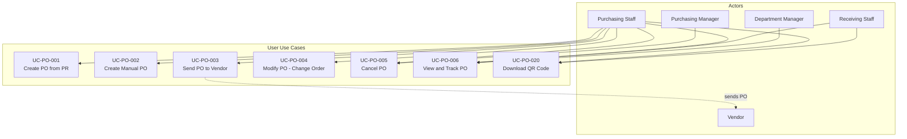
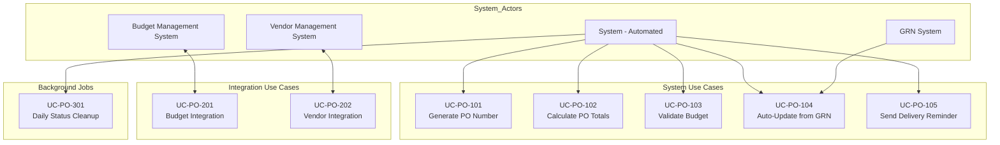
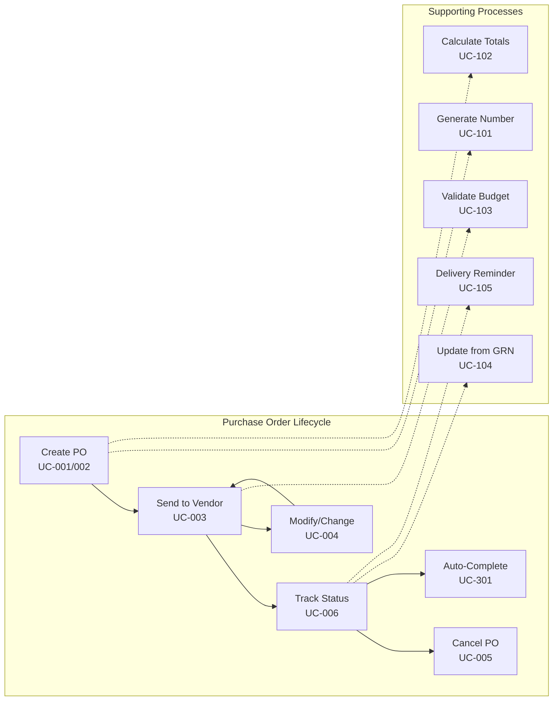

# Use Cases: Purchase Orders

## Document Information
- **Module**: Procurement
- **Sub-Module**: Purchase Orders
- **Document Type**: Use Cases (UC)
- **Version**: 2.5.0
- **Last Updated**: 2025-12-03
- **Status**: Approved

## Related Documents
- [Business Requirements](./BR-purchase-orders.md)
- [Technical Specification](./TS-purchase-orders.md)
- [Data Definition](./DS-purchase-orders.md)
- [Flow Diagrams](./FD-purchase-orders.md)
- [Validations](./VAL-purchase-orders.md)

## Document History

| Version | Date | Author | Changes |
|---------|------|--------|---------|
| 1.1.0 | 2025-12-10 | Documentation Team | Standardized reference number format (XXX-YYMM-NNNN) |
| 2.5.0 | 2025-12-03 | System | Converted ASCII use case diagram to Mermaid format with three diagrams: Primary Actor Use Cases, System/Integration Use Cases, and Use Case Relationships |
| 2.4.0 | 2025-12-02 | System Analyst | Added UC-PO-020: Download QR Code for Mobile Receiving, updated UC-PO-006 to include QR Code section display |
| 2.3.0 | 2025-12-01 | System | Added PO Item Details Dialog to UC-PO-006 with inventory status indicators (On Hand, On Order, Received), related PR links, and financial summary; Added sub-dialogs for On Hand Breakdown, Pending POs, and GRN History |
| 2.2.0 | 2025-12-01 | System | Added Comments & Attachments sidebar feature; Updated UC-PO-006 to include collapsible right sidebar with Comments, Attachments, and Activity Log sections |
| 1.0.0 | 2025-11-19 | Documentation Team | Initial version |
---

## Overview

This document describes the use cases for the Purchase Orders sub-module. Use cases are organized into four categories:
- **User Use Cases (001-099)**: Interactive workflows initiated by users
- **System Use Cases (101-199)**: Automated system processes
- **Integration Use Cases (201-299)**: Integration with external systems
- **Background Job Use Cases (301-399)**: Scheduled automated processes

**IMPORTANT**: Unlike Purchase Requests which require multi-stage approvals, Purchase Orders do NOT have approval workflows. POs are created by authorized purchasing staff (buyers) who have the authority to send POs directly to vendors. This reflects the real-world procurement process where:
- Purchase Requests are internal requests requiring departmental and management approvals
- Purchase Orders are official procurement documents created by authorized buyers who represent already-approved purchasing decisions
- Budget encumbrance occurs when the PO is sent to the vendor (not when "approved" since there is no approval)
- High-value POs (>$50K) may be flagged for purchasing manager review for informational purposes, but this is not a blocking approval

---

## Actors

### Primary Actors
- **Purchasing Staff**: Creates and manages purchase orders (authorized to send POs to vendors)
- **Purchasing Manager**: Oversees purchasing operations, handles high-value PO reviews and amendments
- **Receiving Staff**: Records receipt of goods against purchase orders
- **Vendor**: External supplier receiving purchase orders
- **Department Manager**: Monitors procurement for their department, receives notifications

### Secondary Actors
- **Budget Controller**: Monitors budget utilization
- **Audit Staff**: Reviews compliance and controls
- **System Administrator**: Configures system settings

### System Actors
- **Budget Management System**: External or internal system providing budget checking and encumbrance services
- **Vendor Management System**: Internal module providing vendor master data and contact information
- **GRN System**: Goods Receipt Note module that updates PO status upon receipt

---

## Use Case Diagram

### Primary Actor Use Cases

### System and Integration Use Cases

### Use Case Relationships

**Legend**:
- **Solid arrows (→)**: Direct actor-use case relationships
- **Dashed arrows (-.->)**: Include/extend relationships
- **Double arrows (<-->)**: Bidirectional integration

---

## Use Case Summary

This table provides a quick reference of all 14 use cases in the Purchase Orders module, organized by category and showing priority and complexity at a glance.

| ID | Use Case Name | Actor(s) | Priority | Complexity | Category |
|----|---------------|----------|----------|------------|----------|
| **User Use Cases** | | | | | |
| UC-PO-001 | Create Purchase Order from Purchase Request | Purchasing Staff | High | Complex | User |
| UC-PO-002 | Create Manual Purchase Order | Purchasing Staff | High | Medium | User |
| UC-PO-003 | Send Purchase Order to Vendor | Purchasing Staff | High | Medium | User |
| UC-PO-004 | Modify Purchase Order (Change Order) | Purchasing Staff | High | Medium | User |
| UC-PO-005 | Cancel Purchase Order | Purchasing Staff, Purchasing Manager | Medium | Simple | User |
| UC-PO-006 | View and Track Purchase Order Status | Purchasing Staff, Department Manager, Receiving Staff | High | Simple | User |
| **System Use Cases** | | | | | |
| UC-PO-101 | Automatically Generate Purchase Order Number | System | High | Simple | System |
| UC-PO-102 | Calculate Purchase Order Totals | System | High | Medium | System |
| UC-PO-103 | Validate Budget Availability | System | High | Medium | System |
| UC-PO-104 | Auto-Update PO Status from GRN | System | High | Simple | System |
| UC-PO-105 | Send Automatic Delivery Reminder | System | Medium | Simple | System |
| **Integration Use Cases** | | | | | |
| UC-PO-201 | Integrate with Budget Management System | Budget Management System | High | Medium | Integration |
| UC-PO-202 | Integrate with Vendor Management System | Vendor Management System | High | Medium | Integration |
| **Background Job Use Cases** | | | | | |
| UC-PO-301 | Daily Purchase Order Status Cleanup | System (Scheduled Job) | Medium | Simple | Background |

**Complexity Definitions**:
- **Simple**: Single-step process with minimal logic, 1-3 scenarios
- **Medium**: Multi-step process with business rules, 4-8 scenarios
- **Complex**: Multi-step process with complex validation, multiple integrations, 9+ scenarios

**Priority Definitions**:
- **High**: Core functionality required for system operation, high business value
- **Medium**: Supporting functionality that enhances user experience
- **Low**: Nice-to-have features or edge case handling

---

## User Use Cases (001-099)

### UC-PO-001: Create Purchase Order from Purchase Request

**Actor**: Purchasing Staff

**Preconditions**:
- User is authenticated and has permission to create purchase orders
- One or more approved purchase requests exist in the system
- Purchase requests have vendor assigned
- Budget is available for the purchase

**Main Flow**:
1. User navigates to Purchase Orders module
2. User clicks "Create Purchase Order" button
3. System displays "Select Purchase Requests" dialog
4. System shows list of approved purchase requests not yet converted to PO
5. User filters list by vendor, department, or date range (optional)
6. User selects one or more purchase requests to include
7. System validates all selected PRs have same vendor
8. System displays "Create Purchase Order" form with:
   - Vendor information (pre-filled from PR)
   - Delivery location selector
   - Expected delivery date field
   - Payment terms (pre-filled from vendor master)
   - Delivery terms selector
   - Line items table (pre-populated from selected PRs)
9. User reviews and modifies information as needed:
   - Adjusts delivery date if needed
   - Modifies payment terms if needed
   - Adds notes or special instructions
   - Reviews line items (quantity, price, specifications)
10. System calculates totals (subtotal, tax, shipping, grand total)
11. System validates budget availability for grand total
12. User clicks "Create Purchase Order"
13. System validates all required fields
14. System creates purchase order with status "Draft"
15. System generates unique PO number
16. System creates budget encumbrance
17. System updates source PR status to "Converted to PO"
18. System displays success message with PO number
19. System navigates to purchase order detail page

**Alternative Flow 3a: No Approved Purchase Requests**:
- 3a1. System displays message "No approved purchase requests available"
- 3a2. System offers option to create PO directly (if user has permission)
- 3a3. Use case ends or continues to UC-PO-002

**Alternative Flow 7a: Mixed Vendors Selected**:
- 7a1. System displays error "Selected purchase requests have different vendors"
- 7a2. System highlights PRs with conflicting vendors
- 7a3. User deselects conflicting PRs or groups by vendor
- 7a4. Flow returns to step 7

**Alternative Flow 11a: Insufficient Budget**:
- 11a1. System displays error "Insufficient budget available"
- 11a2. System shows available budget vs. required amount
- 11a3. User can:
   - Reduce quantities to fit budget
   - Request budget increase (separate process)
   - Cancel PO creation
- 11a4. If reduced, flow returns to step 10
- 11a5. If cancelled, use case ends

**Exception Flow 13a: Validation Errors**:
- 13a1. System displays validation errors
- 13a2. System highlights fields with errors
- 13a3. User corrects errors
- 13a4. Flow returns to step 12

**Postconditions**:
- Purchase order created in Draft status
- Budget encumbered for PO amount
- Source purchase requests marked as "Converted to PO"
- PR-PO linkage established in database
- Audit log entry created

**Business Rules**:
- Only approved PRs can be converted to POs
- All line items on selected PRs must have same vendor
- Budget must be available for total PO amount
- PO number generated using format: PO-{YEAR}-{SEQUENCE}
- Expected delivery date must be at least 3 days in future

---

### UC-PO-002: Create Manual Purchase Order

**Actor**: Purchasing Staff

**Preconditions**:
- User is authenticated and has permission to create purchase orders
- User has permission to create POs without purchase request
- Vendor exists in system

**Main Flow**:
1. User navigates to Purchase Orders module
2. User clicks "Create Purchase Order" then "Manual PO" button
3. System displays "Create Purchase Order" form
4. User selects vendor from dropdown
5. System loads vendor details (contact, payment terms, delivery terms)
6. User fills in PO header information:
   - Order date (defaults to today)
   - Expected delivery date
   - Delivery location
   - Payment terms (pre-filled, can modify)
   - Delivery terms
7. User adds line items:
   - Clicks "Add Line Item"
   - Selects product from catalog or enters description
   - Enters quantity and unit price
   - Selects unit of measure
   - Adds specifications or notes (optional)
   - Repeats for each line item
8. System calculates line totals automatically
9. User applies discount if applicable (amount or percentage)
10. User enters shipping cost if applicable
11. System calculates tax based on delivery location
12. System displays grand total
13. System validates budget availability
14. User adds general notes or internal notes (optional)
15. User clicks "Create Purchase Order"
16. System validates all required fields
17. System creates purchase order with status "Draft"
18. System generates unique PO number
19. System creates budget encumbrance
20. System displays success message
21. System navigates to purchase order detail page

**Alternative Flow 4a: Vendor Not Found**:
- 4a1. User clicks "Add New Vendor"
- 4a2. System opens vendor creation form
- 4a3. User creates vendor (see Vendor Management use cases)
- 4a4. Flow returns to step 4 with new vendor selected

**Alternative Flow 13a: Insufficient Budget**:
- 13a1. System displays budget availability warning
- 13a2. System shows available budget vs. required amount
- 13a3. User can:
   - Proceed with override (if has permission)
   - Reduce order to fit budget
   - Cancel creation
- 13a4. If override, requires additional approval
- 13a5. If reduced, flow returns to step 12

**Exception Flow 16a: Validation Errors**:
- 16a1. System displays validation errors
- 16a2. System highlights fields with errors
- 16a3. User corrects errors
- 16a4. Flow returns to step 15

**Postconditions**:
- Purchase order created in Draft status
- Budget encumbered for PO amount
- Audit log entry created
- Manual PO flagged for review (no source PR)

**Business Rules**:
- Manual POs require additional review/approval
- At least one line item required
- All monetary amounts must be non-negative
- Expected delivery date must be reasonable (within 1 year)
- Manual POs over $5,000 require purchasing manager approval

---

### UC-PO-003: Send Purchase Order to Vendor

**Actor**: Purchasing Staff

**Preconditions**:
- User is authenticated and has permission to send purchase orders (authorized purchasing staff)
- Purchase order is in "Draft" status
- PO passes pre-send validations
- Vendor contact email is on file
- Budget is available and will be encumbered upon sending

**Main Flow**:
1. User navigates to purchase order detail page
2. User clicks "Send to Vendor" button
3. System performs pre-send validation:
   - All required fields completed
   - At least one line item exists
   - Budget availability confirmed (will be encumbered)
   - Vendor is active and approved
   - All line items have valid quantities and prices
4. System displays "Send Purchase Order" dialog with:
   - Vendor name and email address (pre-filled)
   - Email subject (pre-filled: "Purchase Order {PO_NUMBER}")
   - Email body template with PO summary
   - PO PDF attachment (preview available)
   - Option to add CC recipients
   - Option to add additional message
   - Option to attach additional documents
   - Budget encumbrance confirmation message
5. User reviews email content
6. User adds CC recipients if needed (optional)
7. User adds custom message if needed (optional)
8. User attaches additional documents if needed (optional)
9. User clicks "Send"
10. System validates:
    - Vendor email address is valid
    - PO PDF can be generated
    - All attachments are accessible
    - Budget still available (real-time check)
11. System creates budget encumbrance for PO amount
12. System generates PO PDF document
13. System sends email to vendor with:
    - Personalized message
    - PO PDF attachment
    - Any additional attachments
14. System changes PO status to "Sent"
15. System records:
    - Sent timestamp
    - Sent by user (authorized purchasing staff)
    - Recipient email address
    - Email content
16. System creates communication log entry
17. System displays success message "Purchase Order sent to vendor"
18. System adds "Sent to Vendor" entry to PO activity log
19. System sets expected acknowledgment date (vendor should respond within 48 hours)
20. System sends notification to department manager (FYI)

**Alternative Flow 3a: Validation Fails**:
- 3a1. System displays validation error messages
- 3a2. System highlights incomplete or invalid fields
- 3a3. User clicks "Edit" to fix issues
- 3a4. User corrects problems
- 3a5. Flow returns to step 2

**Alternative Flow 3b: Insufficient Budget**:
- 3b1. System detects budget is not available
- 3b2. System displays error "Insufficient budget available for this amount"
- 3b3. System shows available budget vs. required amount
- 3b4. User can:
   - Reduce PO amounts to fit budget
   - Request budget increase (separate process)
   - Cancel sending
- 3b5. If reduced, flow returns to step 1 for editing
- 3b6. If cancelled, use case ends

**Alternative Flow 4a: Multiple Vendor Contacts**:
- 4a1. System displays all vendor contacts
- 4a2. User selects primary recipient
- 4a3. User can select additional recipients
- 4a4. Flow continues to step 5

**Alternative Flow 10a: Validation Fails**:
- 10a1. System displays validation error
- 10a2. User corrects issue:
   - Updates vendor email if invalid
   - Removes problematic attachment
   - Waits for PDF generation if failed
- 10a3. Flow returns to step 9

**Alternative Flow 13a: Email Send Fails**:
- 13a1. System attempts to send email
- 13a2. Email service returns error
- 13a3. System logs error details
- 13a4. System displays error message to user
- 13a5. System offers options:
   - Retry sending
   - Download PDF to send manually
   - Update vendor email and retry
- 13a6. User selects option
- 13a7. Based on selection, either retry or end use case

**Alternative Flow 9a: Send Later**:
- 9a1. User clicks "Save as Draft" (don't send yet)
- 9a2. System saves PO without sending
- 9a3. PO status remains "Draft"
- 9a4. User can send later by returning to this use case
- 9a5. Use case ends

**Exception Flow 11a: Budget System Failure**:
- 11a1. System cannot create budget encumbrance
- 11a2. System logs integration error
- 11a3. System displays error "Cannot encumber budget - system unavailable"
- 11a4. System prevents sending PO
- 11a5. User must wait for budget system to be available
- 11a6. Use case ends

**Exception Flow 12a: PDF Generation Fails**:
- 12a1. System cannot generate PO PDF
- 12a2. System displays error "PDF generation failed"
- 12a3. System logs technical error details
- 12a4. User can:
   - Retry PDF generation
   - Contact system administrator
   - Send PO content in email body (not recommended)
- 12a5. Use case ends with manual intervention needed

**Postconditions**:
- PO status changed to "Sent"
- Budget encumbrance created for PO amount
- Email sent to vendor with PO PDF
- Send timestamp and user recorded
- Communication log entry created
- Expected acknowledgment date set
- Activity log updated
- Audit trail entry created
- Department manager notified

**Business Rules**:
- Only authorized purchasing staff can send POs to vendors
- POs are sent directly from Draft status (no multi-stage approval workflow)
- Budget is encumbered at send time, not at creation
- PO must pass all validations before sending
- PO PDF must include all line items, terms, and conditions
- Vendor must have valid email address on file
- All vendor communications logged for audit
- PO number displayed prominently on PDF
- Standard terms and conditions included automatically
- PO cannot be deleted once sent (only cancelled with vendor notification)
- High-value POs (>$50K) may be flagged for purchasing manager review (informational only, not blocking)

---

### UC-PO-004: Modify Purchase Order (Change Order)

**Actor**: Purchasing Staff

**Preconditions**:
- User is authenticated and has permission to modify purchase orders
- Purchase order exists and is in Approved or Sent status
- Change is necessary (quantity, price, delivery date, etc.)
- User has documented reason for change

**Main Flow**:
1. User navigates to purchase order detail page
2. User clicks "Request Change Order" button
3. System displays change order form showing:
   - Current PO details (read-only)
   - Editable fields for changes
   - Change reason field (required)
   - Impact analysis section
4. User makes necessary changes:
   - Modifies quantities
   - Updates prices
   - Changes delivery dates
   - Adds/removes line items
   - Updates shipping or other charges
5. System calculates impact of changes:
   - New subtotal and grand total
   - Change in total amount (increase/decrease)
   - Budget impact
   - Percentage change from original
6. System displays comparison view:
   - Original values vs. new values
   - Highlighting all changes
   - Financial impact summary
7. User enters change reason (required)
8. User adds detailed change justification
9. User clicks "Submit Change Order"
10. System validates changes:
    - Budget availability for increased amounts
    - All required fields completed
    - Changes are reasonable and not excessive
11. System determines if re-approval needed:
    - If total increases by >10%: requires re-approval
    - If total decreases or changes <10%: no re-approval needed
12. If re-approval needed:
    - System creates new approval workflow
    - System changes PO status to "Change Pending Approval"
    - System notifies approvers
13. If no re-approval needed:
    - System applies changes immediately
    - System creates change order revision
14. System assigns revision number (e.g., PO-2401-001234 Rev 1)
15. If PO was already sent:
    - System prepares vendor notification
    - System displays "Send Change Notice to Vendor" prompt
16. System logs all changes in change history
17. System displays success message
18. System shows updated PO with revision indicator

**Alternative Flow 11a: Significant Changes Requiring Re-Approval**:
- 11a1. System detects significant changes (>10% increase or critical field changes)
- 11a2. System displays "These changes require re-approval"
- 11a3. System shows required approvers
- 11a4. User confirms to proceed with approval workflow
- 11a5. System creates approval records
- 11a6. System sends notifications to approvers
- 11a7. Use case continues in approval workflow (see UC-PO-004)

**Alternative Flow 10a: Validation Fails**:
- 10a1. System displays validation errors
- 10a2. Common errors:
   - Insufficient budget for increased amount
   - Invalid delivery dates
   - Negative quantities or prices
   - Missing required justification
- 10a3. User corrects errors
- 10a4. Flow returns to step 9

**Alternative Flow 15a: Send Change Notice to Vendor**:
- 15a1. User confirms to send change notice
- 15a2. System generates revised PO PDF with revision number
- 15a3. System prepares email:
   - Subject: "Revised Purchase Order {PO_NUMBER} - Rev {REV_NUMBER}"
   - Body explains changes made
   - Lists specific changes
   - Requests vendor confirmation
- 15a4. User reviews and sends (similar to UC-PO-005)
- 15a5. System logs vendor notification
- 15a6. Flow continues to step 16

**Alternative Flow 2a: Cannot Modify - Already Received**:
- 2a1. System checks if goods already received (GRN exists)
- 2a2. System displays error "Cannot modify - items already received"
- 2a3. System suggests creating new PO for additional items
- 2a4. Use case ends

**Exception Flow 10b: Budget Exceeded**:
- 10b1. System detects increased amount exceeds available budget
- 10b2. System displays "Insufficient budget for changes"
- 10b3. System shows:
   - Current PO amount
   - New PO amount
   - Available budget
   - Shortfall amount
- 10b4. User can:
   - Reduce changes to fit budget
   - Request budget increase (separate process)
   - Cancel change order
- 10b5. Use case ends or returns to step 4

**Postconditions**:
- Change order created with revision number
- All changes logged in change history
- Original PO data preserved (version history)
- If re-approval needed: Approval workflow initiated
- If approved: Changes applied immediately
- If vendor notified: Communication logged
- Budget encumbrance updated if amount changed
- Audit trail entry created with all change details

**Business Rules**:
- Changes increasing total by >10% require full re-approval
- Changes after goods received are not allowed (create new PO instead)
- Each change creates new revision (Rev 1, Rev 2, etc.)
- Original PO and all revisions maintained in history
- Vendor must be notified of all changes to sent POs
- Change reason is mandatory and cannot be vague
- Frequent changes (>3 revisions) trigger review by purchasing manager
- Line item deletions require vendor acknowledgment
- Price increases require vendor quote or justification

---

### UC-PO-005: Cancel Purchase Order

**Actor**: Purchasing Staff or Purchasing Manager

**Preconditions**:
- User is authenticated and has permission to cancel purchase orders
- Purchase order exists and is not yet completed
- Valid reason for cancellation exists
- Vendor has not yet shipped goods (or return can be arranged)

**Main Flow**:
1. User navigates to purchase order detail page
2. User clicks "Cancel Purchase Order" button
3. System checks PO status and any linked receipts:
   - If status is Draft or Pending Approval: Can cancel without vendor notification
   - If status is Approved, Sent, or Acknowledged: Requires vendor notification
   - If any items received: Cannot cancel (see alternative flow)
4. System displays cancellation confirmation dialog:
   - PO details summary
   - Warning about impact (budget release, vendor notification)
   - Cancellation reason field (required)
   - Additional comments field
   - Checkbox: "Notify vendor" (if applicable)
5. User enters cancellation reason (required)
6. User adds detailed comments explaining cancellation
7. User confirms vendor notification if PO was sent
8. User clicks "Confirm Cancellation"
9. System validates:
   - Cancellation reason is provided
   - User has authority to cancel (amount-based rules)
   - No partial receipts exist
10. If vendor notification required:
    - System prepares cancellation notice email
    - Subject: "CANCELLED - Purchase Order {PO_NUMBER}"
    - Body explains cancellation with reason
    - Requests vendor confirmation of cancellation
11. System performs cancellation actions:
    - Changes PO status to "Cancelled"
    - Records cancellation timestamp and user
    - Releases budget encumbrance
    - Updates linked purchase requests to "Approved - Not Ordered" status
    - Logs cancellation in history
12. If vendor notification required:
    - System sends cancellation email to vendor
    - Logs vendor notification
13. System displays success message "Purchase Order cancelled successfully"
14. System sends notification to:
    - Original PO creator
    - Department manager
    - Any approvers involved
    - Budget controller (about budget release)
15. System creates audit trail entry

**Alternative Flow 3a: Cannot Cancel - Items Received**:
- 3a1. System detects GRN entries exist for this PO
- 3a2. System displays error "Cannot cancel - items already received"
- 3a3. System shows received quantities and GRN references
- 3a4. System offers options:
   - Cancel unreceived line items only (partial cancellation)
   - Create return/credit process for received items
   - Close PO as completed
- 3a5. User selects option
- 3a6. If partial cancellation, flow continues with modified scope
- 3a7. If return process, directs to returns module
- 3a8. If close, use case ends

**Alternative Flow 3b: Cannot Cancel - Items in Transit**:
- 3b1. System detects vendor has confirmed shipment
- 3b2. System displays warning "Items may be in transit"
- 3b3. System shows shipment tracking information (if available)
- 3b4. System requires user confirmation:
   - "Items may arrive. Are you prepared to return them?"
   - Additional approval may be needed
- 3b5. User can:
   - Proceed with cancellation (accept return responsibility)
   - Contact vendor first to stop shipment
   - Cancel the cancellation
- 3b6. Based on choice, flow continues or ends

**Alternative Flow 9a: Insufficient Authority**:
- 9a1. System checks user's cancellation authority based on PO amount
- 9a2. System detects user cannot cancel this amount
- 9a3. System displays "Cancellation requires manager approval"
- 9a4. System creates cancellation request for purchasing manager
- 9a5. System sends notification to purchasing manager
- 9a6. Manager must approve cancellation (separate workflow)
- 9a7. Use case ends pending manager approval

**Exception Flow 10a: Vendor Notification Fails**:
- 10a1. System attempts to send cancellation email
- 10a2. Email delivery fails
- 10a3. System logs email failure
- 10a4. System displays warning "Vendor email failed - manual contact required"
- 10a5. System still processes cancellation in system
- 10a6. System flags PO for manual vendor follow-up
- 10a7. User must contact vendor by phone or other means
- 10a8. Flow continues to step 11

**Exception Flow 9b: Validation Fails**:
- 9b1. System detects missing or invalid information
- 9b2. System displays validation errors:
   - Missing cancellation reason
   - Reason too vague
   - Insufficient authority
- 9b3. User corrects issues
- 9b4. Flow returns to step 8

**Postconditions**:
- PO status changed to "Cancelled"
- Budget encumbrance released
- Linked purchase requests status reverted (if applicable)
- Vendor notified (if PO was sent)
- Cancellation logged with reason and timestamp
- Notifications sent to stakeholders
- Audit trail entry created
- PO locked from further modifications
- Historical data preserved for reporting

**Business Rules**:
- Cannot cancel if any items have been received (GRN exists)
- Cancellation of POs over $10,000 requires purchasing manager approval
- Vendor must be notified if PO was sent
- Budget is released immediately upon cancellation
- Cancelled POs can be referenced but not reactivated
- Frequent cancellations (>3 per month) trigger process review
- Cancellation reason cannot be generic (must be specific)
- Source purchase requests return to "Approved - Not Ordered" status
- Cancelled POs appear in historical reports but not in active PO lists
- Cancellation within 24 hours of sending is expedited
- After vendor ships, cancellation becomes a return (different process)

---

### UC-PO-006: View and Track Purchase Order Status

**Actor**: Purchasing Staff, Department Manager, Receiving Staff

**Preconditions**:
- User is authenticated
- User has permission to view purchase orders
- Purchase orders exist in the system

**Main Flow**:
1. User navigates to Purchase Orders module
2. System displays Purchase Order dashboard with:
   - Summary cards showing counts by status
   - Recent purchase orders list
   - Orders requiring attention (late, pending approval, etc.)
   - Budget utilization chart
3. User views summary statistics:
   - Total Active POs
   - Total PO Value
   - POs Pending Approval
   - POs Sent Awaiting Acknowledgment
   - Late Deliveries
   - Budget Encumbered
4. User clicks on specific status card or searches for PO
5. System displays filtered list of purchase orders
6. User clicks on specific purchase order to view details
7. System displays Purchase Order Detail page showing:
   - Header information (PO number, vendor, dates, status)
   - Status badge with color coding
   - Line items with quantities ordered vs. received
   - Financial summary (subtotal, tax, total)
   - Budget allocation
   - Approval history with timestamps
   - Related documents
   - Communication log with vendor
   - Linked purchase requests
   - Linked GRNs (if any items received)
   - **Collapsible Sidebar** (right side, full-page height):
     * Toggle button in header to show/hide sidebar
     * Sidebar hidden by default
     * **Comments & Attachments Section**:
       - Comments list with user avatar, name, timestamp
       - Blue left-border cards for each comment
       - Add new comment with textarea (Ctrl+Enter to send)
       - Attachments list with file type badges
       - View and Download actions for attachments
       - Attach File button for uploads
     * **Activity Log Section**:
       - Chronological activity entries
       - User avatar, action badge, description, timestamp
       - Actions: Created, Updated, Approved, Sent, Comment
8. User can click on a line item row to view detailed item information:
   - System opens Item Details Dialog showing:
     * Item header with name and description
     * **Inventory Status Indicators** (clickable):
       - **On Hand**: Total quantity on hand (in inventory units) - click to see location breakdown
       - **On Order**: Total quantity on order (in inventory units) - click to see pending POs
       - **Received**: Total quantity received (in inventory units) - click to see GRN history
     * Key Metrics: Order Quantity, Unit Price, Discount
     * Related Purchase Request: Source PR ID and Item ID (links to source PR)
     * Order Summary: Subtotal, Discount Amount, Tax Amount, Line Total
     * Form fields: Name, Description, Status
   - User can click inventory status indicators to open sub-dialogs:
     * On Hand Breakdown: Location, Category, Status, Quantity, Units per location
     * Pending POs: PO#, Vendor, Delivery Date, Remaining Qty, Units, Locations
     * GRN History: GRN#, Received Date, Qty Received, Qty Rejected, Inspected By, Location with comments
10. User can view detailed status information:
    - Current status and timestamp
    - Days in current status
    - Expected next action and by whom
    - Status history with all transitions
11. User can see delivery tracking:
    - Expected delivery date
    - Days until/since expected delivery
    - Quantity ordered vs. received per line item
    - Tracking numbers (if available)
    - Related GRN links
12. User can access related documents:
    - Original PO PDF
    - Revised PO PDFs (if any revisions)
    - Source purchase request
    - Vendor quotes or confirmations
    - Supporting documents
    - Email communications

**Alternative Flow 4a: Search for Specific PO**:
- 4a1. User enters search criteria:
   - PO number
   - Vendor name
   - Date range
   - Status
   - Department
   - Amount range
- 4a2. User clicks "Search"
- 4a3. System displays matching purchase orders
- 4a4. Flow continues to step 6

**Alternative Flow 4b: Filter by Multiple Criteria**:
- 4b1. User applies multiple filters:
   - Status (can select multiple)
   - Date range (created, expected delivery)
   - Vendor
   - Department
   - Created by user
   - Amount range
- 4b2. System applies filters in real-time
- 4b3. User sees filtered results update dynamically
- 4b4. User can save filter as preset for future use
- 4b5. Flow continues to step 6

**Alternative Flow 7a: View Timeline**:
- 7a1. User clicks on "Timeline" tab
- 7a2. System displays visual timeline showing:
   - PO creation date
   - Submission for approval
   - Each approval with approver and timestamp
   - Sent to vendor
   - Vendor acknowledgment (if received)
   - Change orders (if any)
   - GRN receipts (if any)
   - Completion date (if completed)
- 7a3. Each timeline event is clickable for more details
- 7a4. User can export timeline as PDF report

**Alternative Flow 9a: Track Delivery with Alerts**:
- 9a1. User views delivery tracking section
- 9a2. System shows delivery status indicators:
   - Green: Delivery expected within timeline
   - Yellow: Approaching expected delivery date (within 3 days)
   - Red: Past expected delivery date
- 9a3. For late deliveries, system shows:
   - Days overdue
   - Automatic vendor inquiry status
   - Last contact with vendor
   - Options to contact vendor or extend date
- 9a4. User can click "Contact Vendor" to send inquiry
- 9a5. User can click "Extend Delivery Date" to revise

**Exception Flow 6a: PO Not Found**:
- 6a1. System cannot find requested PO
- 6a2. System displays "Purchase Order not found"
- 6a3. System offers suggestions:
   - Verify PO number
   - Check if user has permission to view
   - Search for similar POs
- 6a4. Use case ends or returns to step 4

**Exception Flow 7a: Access Denied**:
- 7a1. System checks user permissions for detailed view
- 7a2. System detects user lacks permission for this PO
- 7a3. System displays "Access denied - insufficient permissions"
- 7a4. System logs access attempt for security
- 7a5. Use case ends

**Postconditions**:
- User has viewed PO status and details
- Access logged for audit purposes
- No changes made to PO data
- User can take informed action based on status

**Business Rules**:
- Users can only view POs for their departments (unless admin)
- Financial details restricted to authorized users
- Vendor contact information visible only to purchasing staff
- Internal notes not visible to all users (role-based)
- Real-time status updates from integrated systems
- Status color coding: Draft (gray), Pending (yellow), Approved (blue), Sent (purple), Received (green), Cancelled (red)
- Timeline shows all activities in chronological order
- Communication log is comprehensive and searchable

---

### UC-PO-020: Download QR Code for Mobile Receiving

**Actor**: Purchasing Staff, Receiving Staff

**Trigger**: User views PO detail page and wants to download QR code for mobile receiving

**Preconditions**:
- User has permission to view purchase orders
- Purchase order exists and has a PO number
- QR code has been auto-generated for the PO
- User is on PO detail page

**Main Flow**:
1. User navigates to PO detail page
2. System displays QRCodeSection component with QR code image
3. System displays QR code containing value: `PO:{orderNumber}` (e.g., "PO:PO-2501-0001")
4. System displays action buttons: Download QR Code, Copy PO Number
5. System displays mobile scanning instructions (5-step guide)
6. **Download QR Code Flow**:
   - User clicks "Download QR Code" button
   - System generates high-resolution QR code (400×400px, 4-module margin)
   - System creates PNG file named `{orderNumber}-QR.png`
   - System triggers browser download
   - User receives confirmation that download started
7. **Copy PO Number Flow**:
   - User clicks "Copy PO Number" button
   - System copies PO number to clipboard
   - System displays "Copied!" confirmation for 2 seconds
   - User can paste PO number elsewhere

**Alternative Flow 1: QR Code Generation Fails**
- At step 2: If QR code generation fails
- System logs error
- System displays error message: "Unable to generate QR code"
- System hides action buttons
- System suggests refreshing the page

**Alternative Flow 2: Copy Not Supported**
- At step 7: If clipboard API not supported by browser
- System displays error: "Clipboard not supported. Please copy manually: {orderNumber}"
- User manually copies PO number

**Alternative Flow 3: Mobile App Not Installed**
- User clicks "Get it here" link in mobile app section
- System navigates to mobile app download page
- User can download and install Carmen mobile app

**Postconditions**:
- QR code PNG file downloaded to user's device (if download action)
- PO number copied to clipboard (if copy action)
- QR code is scannable with mobile app for quick GRN creation
- High-resolution QR code suitable for printing

**Business Rules**:
- QR codes auto-generate when PO created/updated
- QR code format must be exactly: `PO:{orderNumber}`
- Download QR code has higher resolution (400×400px) than display (200×200px)
- QR code error correction level: Medium (M) for 15% data restoration
- Mobile app link points to `/mobile-app` page
- QR code generation timeout: 5 seconds maximum
- Clipboard copy timeout: 2 seconds for confirmation display

**Technical Notes**:
- Component path: `app/(main)/procurement/purchase-orders/components/QRCodeSection.tsx`
- Utility functions: `lib/utils/qr-code.ts`
- QR library: `qrcode` v1.5.3 (npm package)
- QR generation functions:
  * `generatePOQRCode()`: Creates base64 data URL for display
  * `downloadPOQRCode()`: Downloads high-res PNG file
- Mobile integration: cmobile app scans QR → extracts PO number → auto-creates GRN
- See GRN BR document (FR-GRN-016) for complete mobile receiving workflow

**Success Metrics**:
- QR code generation success rate: >99.5%
- Download success rate: >99%
- Copy to clipboard success rate: >95%
- Mobile scan success rate: >98%
- Time from download to mobile GRN creation: <30 seconds

**Related Use Cases**:
- UC-PO-006: View and Track Purchase Order Status (displays QR code)
- UC-GRN-001: Create Goods Receipt Note from Mobile Scan (consumes QR code)

---

## System Use Cases (101-199)

### UC-PO-101: Automatically Generate Purchase Order Number

**Actor**: System

**Trigger**: User creates new purchase order

**Preconditions**:
- Purchase order record is being created
- Sequence table is available and initialized

**Main Flow**:
1. System detects new PO creation request
2. System queries sequence table for next PO number
3. System generates PO number using format: PO-{YYMM}-{SEQUENCE}
   - {YY}: 2-digit year
   - {MM}: 2-digit month
   - {SEQUENCE}: Sequential number with leading zeros (6 digits)
   - Example: PO-2401-000123
4. System increments sequence counter in database
5. System assigns generated PO number to new purchase order record
6. System validates number is unique (collision check)
7. System logs PO number generation in audit trail
8. System returns PO number to calling process

**Alternative Flow 6a: Collision Detected**:
- 6a1. System detects PO number already exists (unlikely but possible)
- 6a2. System increments sequence counter again
- 6a3. System generates new PO number
- 6a4. Flow returns to step 6

**Exception Flow 3a: Sequence Counter Reaches Maximum**:
- 3a1. System detects sequence has reached 999999
- 3a2. System logs critical error
- 3a3. System notifies system administrator
- 3a4. System resets counter to 000001 for new fiscal year (if year changed)
- 3a5. If same year, manual intervention required
- 3a6. Use case ends with error

**Postconditions**:
- Unique PO number generated and assigned
- Sequence counter incremented
- PO number logged in audit trail
- Number follows organizational format

**Business Rules**:
- PO numbers are sequential within fiscal year
- Format: PO-{YEAR}-{6-digit sequence}
- Sequence resets to 000001 each fiscal year
- No gaps allowed in sequence (for audit purposes)
- Number generation is atomic transaction (no concurrent duplicates)
- Generated numbers cannot be reused even if PO is cancelled

---

### UC-PO-102: Calculate Purchase Order Totals

**Actor**: System

**Trigger**: Line items added/modified, discounts applied, or charges updated

**Preconditions**:
- Purchase order exists with at least one line item
- All line items have quantity and unit price

**Main Flow**:
1. System detects change to PO amounts (line item, discount, or charges)
2. System calculates subtotal:
   - Subtotal = SUM(line_item.quantity × line_item.unit_price) for all line items
3. System applies discount (if any):
   - If discount is percentage: discount_amount = subtotal × (discount_percentage / 100)
   - If discount is fixed amount: discount_amount = discount_value
4. System calculates amount after discount:
   - Amount after discount = subtotal - discount_amount
5. System calculates tax:
   - Retrieves tax rate based on delivery location and vendor location
   - Applies tax to taxable items only
   - Tax_amount = (amount after discount) × tax_rate
6. System adds shipping/freight charges (if any)
7. System calculates grand total:
   - Grand total = amount after discount + tax_amount + shipping_amount
8. System rounds all monetary amounts to 2 decimal places
9. System updates PO record with calculated totals
10. System triggers budget validation check
11. System updates UI to display new totals in real-time

**Alternative Flow 5a: Mixed Tax Rates**:
- 5a1. System detects line items have different tax categories
- 5a2. System calculates tax separately for each line item
- 5a3. System sums individual line item taxes for total tax amount
- 5a4. Flow continues to step 6

**Alternative Flow 5b: Tax-Exempt Items**:
- 5b1. System identifies tax-exempt line items (medical supplies, etc.)
- 5b2. System excludes exempt items from tax calculation
- 5b3. System calculates tax only on taxable items
- 5b4. Flow continues to step 6

**Exception Flow 2a: Invalid Line Item Data**:
- 2a1. System detects line item with zero or negative quantity
- 2a2. System displays validation error
- 2a3. System prevents PO submission
- 2a4. Use case ends with error state

**Postconditions**:
- All PO totals calculated correctly
- Subtotal, discount, tax, shipping, and grand total updated
- Budget validation triggered
- UI displays updated amounts
- Calculation details logged for audit

**Business Rules**:
- All monetary calculations to 2 decimal places
- Rounding: Standard rounding rules (0.5 rounds up)
- Tax calculated after discount applied
- Shipping charges not taxable (in most jurisdictions)
- Negative totals not allowed
- Zero-value POs allowed only for no-charge items
- Currency must be consistent across all line items
- Calculation formula: (subtotal - discount + tax + shipping) = grand total

---

### UC-PO-103: Validate Budget Availability

**Actor**: System

**Trigger**: PO created, modified, or submitted for approval

**Preconditions**:
- Purchase order exists with grand total calculated
- Budget accounts specified for PO
- Budget system is available

**Main Flow**:
1. System detects PO amount change or approval request
2. System retrieves budget allocation for PO:
   - Budget account(s)
   - Allocation percentage per account
   - Fiscal year
3. System queries budget system for each budget account:
   - Total budget amount
   - Encumbered amount (other POs)
   - Expended amount (actual expenses)
   - Available amount = total - encumbered - expended
4. System calculates required budget per account:
   - Required = PO grand total × allocation percentage
5. System compares required vs. available for each account:
   - If available >= required: Budget check passes
   - If available < required: Budget check fails
6. System calculates total availability across all accounts
7. If budget check passes:
   - System allows PO to proceed
   - System creates budget encumbrance (if approving)
   - System logs successful budget validation
8. If budget check fails:
   - System prevents PO approval
   - System displays budget shortage details
   - System suggests actions (reduce PO, request budget increase)
   - System logs budget validation failure
9. System returns validation result to calling process

**Alternative Flow 5a: Partial Budget Availability**:
- 5a1. System detects insufficient budget on one account
- 5a2. System checks if other accounts have surplus
- 5a3. System suggests reallocating percentages
- 5a4. System displays proposed reallocation to user
- 5a5. If user accepts, system updates allocation
- 5a6. Flow returns to step 4

**Alternative Flow 7a: Budget Override**:
- 7a1. Budget check fails but user has override permission
- 7a2. System displays override option
- 7a3. User provides override reason (required)
- 7a4. System logs override with reason
- 7a5. System requires additional approval level
- 7a6. System allows PO to proceed with warning flag
- 7a7. Flow continues to step 9

**Exception Flow 3a: Budget System Unavailable**:
- 3a1. System cannot connect to budget system
- 3a2. System logs integration error
- 3a3. System displays warning "Budget validation unavailable"
- 3a4. System offers options:
   - Retry connection
   - Proceed without validation (requires special permission)
   - Save as draft and validate later
- 3a5. Use case ends with manual intervention needed

**Exception Flow 5b: Budget Allocation Totals Don't Equal 100%**:
- 5b1. System detects allocation percentages don't sum to 100%
- 5b2. System displays error "Budget allocation must total 100%"
- 5b3. System prevents PO approval
- 5b4. Use case ends with error

**Postconditions**:
- Budget validation completed
- Validation result returned (pass/fail)
- If passed and approving: Budget encumbered
- If failed: PO blocked from approval with reason
- Validation logged in audit trail
- Budget utilization updated

**Business Rules**:
- Budget checked at PO creation, modification, and approval
- Encumbrance created only upon final approval
- Budget allocation must sum to exactly 100%
- Fiscal year boundaries respected (no cross-year budget usage without approval)
- Budget overrides require purchasing manager approval
- Budget check includes all pending POs against same account
- Real-time budget availability (not cached data)
- Multi-account POs must have sufficient budget on ALL accounts

---

### UC-PO-104: Auto-Update PO Status from GRN

**Actor**: System

**Trigger**: Goods Receipt Note (GRN) is created or updated

**Preconditions**:
- Purchase order exists in Sent or Acknowledged status
- GRN is created referencing PO line items
- GRN is in approved status

**Main Flow**:
1. System detects GRN creation or update event
2. System retrieves referenced purchase order
3. System retrieves all GRN line items linked to this PO
4. For each PO line item:
   - System calculates total quantity received from all GRNs
   - System updates line_item.quantity_received
   - System calculates line_item.quantity_remaining (ordered - received)
5. System evaluates overall PO receipt status:
   - If any line item has quantity_remaining > 0: Status = "Partially Received"
   - If all line items have quantity_remaining = 0: Status = "Fully Received"
   - If all line items have quantity_remaining = 0 AND no pending issues: Status = "Completed" (after grace period)
6. System updates PO status based on evaluation
7. System updates last_activity_date on PO
8. System logs status change in PO history
9. System checks if budget encumbrance should convert to expense:
   - Converts encumbered amount for received quantities to expense
   - Maintains encumbrance for unreceived quantities
10. System sends notifications:
    - If Partially Received: Notify purchasing staff
    - If Fully Received: Notify purchasing staff and department manager
    - If Completed: Notify all stakeholders
11. System evaluates if PO should auto-complete:
    - If Fully Received status for 30 days with no issues: Auto-complete
12. System updates dashboard metrics and reports

**Alternative Flow 5a: Over-Receipt Detected**:
- 5a1. System detects quantity_received > quantity_ordered
- 5a2. System checks over-receipt tolerance (+5% or +2 units)
- 5a3. If within tolerance:
   - System allows receipt
   - System flags line item for review
   - System notifies purchasing staff
- 5a4. If exceeds tolerance:
   - System blocks GRN approval
   - System requires purchasing manager override
- 5a5. Flow continues to step 6

**Alternative Flow 5b: Partial Quantities with Quality Issues**:
- 5b1. System detects GRN has rejected quantities due to quality
- 5b2. System subtracts rejected quantities from received count
- 5b3. System flags line item as having quality issues
- 5b4. System links to quality inspection report
- 5b5. System notifies quality manager and purchasing staff
- 5b6. PO status remains "Partially Received" with issue flag
- 5b7. Flow continues to step 6

**Alternative Flow 11a: Auto-Complete Conditions Met**:
- 11a1. System detects PO has been "Fully Received" for 30+ days
- 11a2. System verifies no open issues or disputes
- 11a3. System verifies all related invoices processed (if integrated)
- 11a4. System changes status to "Completed"
- 11a5. System finalizes budget conversion (all encumbrance to expense)
- 11a6. System archives PO from active list
- 11a7. System sends completion notifications
- 11a8. Flow continues to step 12

**Exception Flow 2a: Purchase Order Not Found**:
- 2a1. System cannot find PO referenced in GRN
- 2a2. System logs data integrity error
- 2a3. System flags GRN for manual review
- 2a4. System notifies system administrator
- 2a5. Use case ends with error

**Exception Flow 9a: Budget System Integration Failure**:
- 9a1. System cannot update budget encumbrance conversion
- 9a2. System logs integration error
- 9a3. System continues with PO status update
- 9a4. System flags PO for manual budget reconciliation
- 9a5. System notifies finance team
- 9a6. Flow continues to step 10

**Postconditions**:
- PO status updated based on receipt quantities
- All line items show current received vs. ordered quantities
- Budget encumbrance partially or fully converted to expense
- Status change logged in PO history
- Stakeholders notified of status changes
- Dashboard and reports updated
- If fully received: PO marked for auto-completion
- Audit trail entry created

**Business Rules**:
- PO status automatically updates based on GRN receipts
- Partially Received: At least one item received, but not all
- Fully Received: All ordered quantities received (within tolerance)
- Completed: Fully received + 30 day grace period + no issues
- Over-receipt tolerance: +5% or +2 units per line item (whichever greater)
- Under-receipt allowed (partial delivery common)
- Budget converts from encumbrance to expense as items received
- Multiple GRNs can reference same PO (partial deliveries)
- Status changes trigger appropriate notifications
- Auto-completion after 30 days of full receipt (configurable)
- Quality-rejected items don't count as received
- PO cannot be completed if disputes or issues are open

---

### UC-PO-105: Send Automatic Delivery Reminder

**Actor**: System

**Trigger**: Scheduled job (runs daily) or approaching expected delivery date

**Preconditions**:
- Purchase orders exist in Sent or Acknowledged status
- Expected delivery dates are set
- Email system is operational

**Main Flow**:
1. System runs scheduled job (every day at 6:00 AM)
2. System queries for purchase orders where:
   - Status = "Sent" OR "Acknowledged"
   - Expected_delivery_date is within 3 days from today
   - No delivery reminder sent in past 7 days
   - No GRN created yet (items not received)
3. For each matching purchase order:
   - System retrieves PO details
   - System retrieves vendor contact information
   - System retrieves purchasing staff assigned to PO
4. System generates reminder email content:
   - Subject: "Delivery Reminder: Purchase Order {PO_NUMBER} - Delivery Expected {DATE}"
   - Body includes:
     - PO number and date
     - Expected delivery date
     - List of items expected
     - Contact information for delivery coordination
     - Request for delivery confirmation or update
5. System sends email to:
   - Vendor primary contact
   - Purchasing staff assigned to PO (CC)
   - Receiving department (CC)
6. System logs email sent in communication log
7. System updates last_reminder_date on PO
8. System creates activity log entry "Delivery reminder sent"
9. System generates summary report of all reminders sent
10. System sends daily summary to purchasing manager

**Alternative Flow 2a: Late Delivery Detected**:
- 2a1. System detects expected_delivery_date is in the past
- 2a2. System calculates days overdue
- 2a3. System changes email subject to "OVERDUE - Purchase Order {PO_NUMBER}"
- 2a4. System escalates reminder:
   - More urgent tone in email
   - CC purchasing manager and department manager
   - Request for immediate status update
- 2a5. System flags PO as "At Risk" in dashboard
- 2a6. Flow continues to step 5

**Alternative Flow 2b: Vendor Previously Responded**:
- 2b1. System checks communication log for vendor responses
- 2b2. System finds recent vendor confirmation with revised delivery date
- 2b3. System uses revised date for reminder logic
- 2b4. System includes vendor's confirmed date in reminder
- 2b5. Flow continues to step 4

**Alternative Flow 5a: Email Send Failure**:
- 5a1. System attempts to send email
- 5a2. Email system returns delivery failure
- 5a3. System logs email failure
- 5a4. System adds PO to manual follow-up list
- 5a5. System notifies purchasing staff of failed email
- 5a6. System retries after 1 hour (up to 3 attempts)
- 5a7. Flow continues to step 7

**Exception Flow 2c: No Purchase Orders Match Criteria**:
- 2c1. System completes query with zero results
- 2c2. System logs "No delivery reminders needed today"
- 2c3. System sends summary report showing "No reminders sent"
- 2c4. Use case ends

**Exception Flow 4a: Missing Vendor Email**:
- 4a1. System detects vendor has no email address on file
- 4a2. System flags PO for manual follow-up
- 4a3. System notifies purchasing staff
- 4a4. System adds to manual contact list in daily summary
- 4a5. Use case ends for this PO

**Postconditions**:
- Reminder emails sent to vendors for approaching deliveries
- All reminders logged in communication log
- Last reminder date updated on POs
- Activity log entries created
- Summary report generated for purchasing manager
- Late deliveries flagged and escalated
- Manual follow-up list updated for failed emails

**Business Rules**:
- Reminders sent 3 days before expected delivery date
- Maximum one reminder per week per PO (avoid spam)
- Late deliveries generate escalated reminders immediately
- Escalated reminders CC purchasing manager and department manager
- System retries failed emails up to 3 times over 24 hours
- Manual follow-up required if all email attempts fail
- Reminders stop once GRN is created (items received)
- Vendor can respond via email to confirm or revise delivery date
- Revised delivery dates from vendor update PO automatically
- Summary report sent daily to purchasing manager at 7:00 AM

---

## Integration Use Cases (201-299)

### UC-PO-201: Integrate with Budget Management System

**Actor**: Budget Management System (External)

**Trigger**: PO created, approved, modified, or cancelled

**Preconditions**:
- Purchase order exists with budget allocation
- Budget management system is operational
- Integration API is available

**Main Flow**:
1. System detects PO event requiring budget update:
   - PO approved (create encumbrance)
   - PO amount modified (adjust encumbrance)
   - PO cancelled (release encumbrance)
   - GRN created (convert encumbrance to expense)
2. System prepares budget transaction payload:
   - Transaction type (encumbrance, adjustment, release, expense)
   - PO number and line item references
   - Budget account(s) and allocation
   - Amount per budget account
   - Fiscal year
   - Transaction date
   - Description and reference
3. System calls budget system API:
   - Endpoint: POST /api/budget/transactions
   - Authentication token included
   - Payload sent as JSON
4. Budget system validates transaction:
   - Budget account exists
   - Fiscal year is valid
   - Sufficient budget available (for encumbrances)
   - Transaction type is appropriate
5. Budget system processes transaction:
   - Updates budget account balance
   - Creates encumbrance or expense record
   - Links transaction to PO reference
6. Budget system returns response:
   - Success: Transaction ID, updated balance
   - Failure: Error code and message
7. System receives response from budget system
8. If successful:
   - System stores budget transaction ID on PO
   - System updates local budget balance cache
   - System logs successful integration
   - System continues with PO workflow
9. If failed:
   - System logs integration error with details
   - System displays error message to user
   - System queues transaction for retry
   - System notifies finance team

**Alternative Flow 4a: Budget System Returns Insufficient Funds**:
- 4a1. Budget system validates but finds insufficient available budget
- 4a2. Budget system returns error: "Insufficient budget available"
- 4a3. System receives error response
- 4a4. System prevents PO approval
- 4a5. System displays budget shortage to user with details
- 4a6. System suggests actions (reduce PO, request budget increase)
- 4a7. Use case ends with PO not approved

**Alternative Flow 3a: Budget System API Unavailable**:
- 3a1. System attempts to call budget API
- 3a2. Network timeout or connection refused error
- 3a3. System logs integration failure
- 3a4. System adds transaction to retry queue
- 3a5. System displays warning to user "Budget integration temporarily unavailable"
- 3a6. System allows workflow to continue with flag (if allowed by policy)
- 3a7. System sends alert to system administrator
- 3a8. System retries transaction every 5 minutes up to 12 times

**Alternative Flow 9a: Transaction Retry Succeeds**:
- 9a1. System retrieves queued transaction from retry queue
- 9a2. System re-attempts budget API call
- 9a3. Budget system successfully processes transaction
- 9a4. System updates PO with transaction ID
- 9a5. System removes transaction from retry queue
- 9a6. System logs successful retry
- 9a7. System sends confirmation to finance team

**Exception Flow 9b: Transaction Retry Exhausted**:
- 9b1. System has retried transaction 12 times over 1 hour
- 9b2. All retry attempts failed
- 9b3. System flags PO as "Budget Integration Failed"
- 9b4. System creates manual reconciliation task for finance team
- 9b5. System sends urgent notification to:
   - Finance manager
   - Purchasing manager
   - System administrator
- 9b6. System logs critical integration failure
- 9b7. Manual intervention required

**Postconditions**:
- Budget transaction created in budget system
- PO linked to budget transaction ID
- Budget account balance updated (encumbrance or expense)
- Integration logged for audit
- If failed: Transaction queued for retry or flagged for manual intervention
- Finance team notified of status
- Local budget balance cache updated (if successful)

**Business Rules**:
- Budget encumbrance created when PO is approved
- Budget expense created when GRN is approved (goods received)
- Budget released when PO is cancelled
- Multiple budget accounts supported (splits encumbrance proportionally)
- Fiscal year boundaries enforced by budget system
- Failed integration attempts retried automatically
- After 12 failed retries, manual reconciliation required
- All budget transactions must be reconcilable to source PO
- Integration logs maintained for audit purposes
- Real-time integration (not batch processing)

---

### UC-PO-202: Integrate with Vendor Management System

**Actor**: Vendor Management System (External or Internal Module)

**Trigger**: User selects vendor or vendor information needs to be retrieved

**Preconditions**:
- Vendor Management system is operational
- Vendor master data is current
- Integration API or database access available

**Main Flow**:
1. System detects need for vendor information:
   - User creating/editing PO and selects vendor
   - System validating vendor status
   - System retrieving vendor contact for communication
2. System requests vendor data from Vendor Management:
   - Vendor ID or name
   - Required fields: contact, payment terms, delivery terms, status
3. Vendor Management system returns vendor details:
   - Vendor ID and name
   - Primary contact information (name, email, phone)
   - Payment terms (e.g., Net 30, 2/10 Net 30)
   - Delivery terms (e.g., FOB, CIF)
   - Vendor status (Active, Inactive, On Hold, Suspended)
   - Preferred vendor flags
   - Contract information (if applicable)
   - Performance ratings
   - Approved product categories
4. System validates vendor eligibility:
   - Vendor status must be "Active"
   - Vendor approved for requested product categories
   - No active holds or suspensions
   - Vendor in good standing
5. System populates PO form with vendor information:
   - Pre-fills contact email
   - Pre-fills payment terms
   - Pre-fills delivery terms
   - Displays vendor performance rating (for user reference)
6. System checks for preferred vendor policies:
   - If items have preferred vendor and selected vendor is not preferred
   - System displays warning "Alternative vendor selected"
   - System requires justification if mandated
7. System maintains real-time link to vendor record:
   - Changes in vendor master reflect in PO immediately
   - Vendor contact updates automatically propagate

**Alternative Flow 4a: Vendor Status Not Active**:
- 4a1. System detects vendor status is not "Active"
- 4a2. System displays error "Cannot use this vendor - Status: {status}"
- 4a3. System prevents vendor selection
- 4a4. System offers options:
   - Select different vendor
   - Contact vendor management to resolve status
   - Request emergency override (special permission required)
- 4a5. Use case ends or user selects different vendor

**Alternative Flow 4b: Vendor Not Approved for Product Category**:
- 4b1. System detects vendor not approved for products being ordered
- 4b2. System displays warning "Vendor not approved for these product categories"
- 4b3. System lists unapproved categories
- 4b4. System offers options:
   - Select different vendor who is approved
   - Remove unapproved items from PO
   - Request approval for vendor to supply these categories
- 4b5. If emergency override: Requires purchasing manager approval
- 4b6. Use case continues or ends based on action

**Alternative Flow 6a: Non-Preferred Vendor Requires Justification**:
- 6a1. System detects non-preferred vendor selected for items with preferred vendor
- 6a2. System displays "Non-preferred vendor justification required"
- 6a3. System shows preferred vendor information
- 6a4. System displays justification form:
   - Reason for not using preferred vendor (dropdown)
   - Detailed explanation (text)
   - Price comparison (if available)
- 6a5. User enters justification
- 6a6. System attaches justification to PO
- 6a7. PO flagged for additional review
- 6a8. Flow continues to step 7

**Exception Flow 3a: Vendor Not Found**:
- 3a1. Vendor Management system returns "Vendor not found"
- 3a2. System displays error message
- 3a3. System offers options:
   - Verify vendor name/ID
   - Search vendor directory
   - Create new vendor (if user has permission)
- 3a4. If create new vendor, launches vendor creation workflow
- 3a5. Use case ends or continues with new vendor

**Exception Flow 2a: Integration Failure**:
- 2a1. System cannot connect to Vendor Management system
- 2a2. System logs integration error
- 2a3. System displays warning "Vendor system temporarily unavailable"
- 2a4. System offers options:
   - Retry connection
   - Enter vendor information manually (validated later)
   - Save PO as draft and complete later
- 2a5. If manual entry, system flags PO for vendor validation when system available
- 2a6. Use case continues with limited vendor data

**Postconditions**:
- Vendor information retrieved and populated on PO
- Vendor eligibility validated
- Payment and delivery terms pre-filled
- Preferred vendor policies checked and enforced
- Non-preferred vendor usage justified (if applicable)
- Real-time link to vendor record maintained
- Integration logged for audit

**Business Rules**:
- Only Active vendors can be selected for new POs
- Vendor must be approved for product categories being ordered
- Preferred vendor policies enforced unless justified
- Vendor contact information sourced from master data
- Payment terms default from vendor master (can be overridden)
- Vendor performance ratings displayed for user reference
- Suspended vendors cannot be used even with override
- Non-preferred vendor usage requires documented justification
- Emergency overrides require purchasing manager approval
- Vendor information updates in master data reflect on open POs

---

## Background Job Use Cases (301-399)

### UC-PO-301: Daily Purchase Order Status Cleanup

**Actor**: System (Scheduled Job)

**Trigger**: Scheduled to run daily at 2:00 AM

**Preconditions**:
- Database is accessible
- System is operational
- No maintenance windows active

**Main Flow**:
1. System initiates scheduled job at 2:00 AM
2. System queries for purchase orders meeting auto-completion criteria:
   - Status = "Fully Received"
   - Last activity date >= 30 days ago
   - No open quality issues
   - No open disputes or returns
   - All related invoices processed (if integrated)
3. For each eligible purchase order:
   - System validates all criteria still met
   - System checks for any pending actions
   - System verifies budget fully converted from encumbrance to expense
4. System changes PO status to "Completed"
5. System updates completed_at timestamp
6. System finalizes budget transactions (if any remaining encumbrance)
7. System archives PO from active lists
8. System logs completion in PO history
9. System sends completion notification to:
   - Purchasing staff who created PO
   - Department manager
   - Budget controller (CC)
10. System generates daily completion report showing:
    - Number of POs auto-completed
    - Total value of completed POs
    - Budget accounts affected
    - Any POs that couldn't be completed with reasons
11. System emails report to purchasing manager
12. System logs job completion with statistics

**Alternative Flow 3a: PO Has Open Issues**:
- 3a1. System detects open quality issues or returns
- 3a2. System skips this PO from auto-completion
- 3a3. System adds PO to "Requires Manual Review" list
- 3a4. System includes in daily report with reason
- 3a5. Flow continues to next PO

**Alternative Flow 3b: Budget Reconciliation Pending**:
- 3b1. System detects budget encumbrance not fully converted
- 3b2. System attempts to finalize budget conversion
- 3b3. If successful:
   - Flow continues to step 4
- 3b4. If failed:
   - System skips this PO
   - System flags for manual budget reconciliation
   - System includes in daily report
- 3b5. Flow continues to next PO

**Alternative Flow 2a: No POs Eligible for Completion**:
- 2a1. System query returns zero results
- 2a2. System logs "No POs ready for auto-completion"
- 2a3. System generates report showing "No completions today"
- 2a4. System sends summary to purchasing manager
- 2a5. Use case ends

**Exception Flow 6a: Budget System Unavailable**:
- 6a1. System cannot connect to budget system for finalization
- 6a2. System logs integration error
- 6a3. System skips budget finalization
- 6a4. System flags PO for manual budget reconciliation
- 6a5. System still completes PO status change (business process complete)
- 6a6. System notifies finance team of pending reconciliation
- 6a7. Flow continues to step 7

**Exception Flow 1a: Job Execution Fails**:
- 1a1. System encounters critical error during job execution
- 1a2. System logs error with stack trace
- 1a3. System sends urgent alert to system administrator
- 1a4. System attempts to complete partial processing
- 1a5. System reports what was accomplished before failure
- 1a6. System schedules retry in 1 hour
- 1a7. Use case ends with failure state

**Postconditions**:
- Eligible POs status changed to "Completed"
- POs archived from active lists
- Budget transactions finalized
- Completion notifications sent to stakeholders
- Daily report generated and sent to purchasing manager
- Job execution logged with statistics
- Any issues flagged for manual review

**Business Rules**:
- Auto-completion requires 30 days after full receipt
- No open issues or disputes allowed
- Budget must be fully reconciled (encumbrance to expense)
- All related invoices processed (if integrated with accounts payable)
- Completed POs remain searchable but removed from active lists
- Completed POs cannot be modified (read-only)
- Manual review required if any completion criteria fails
- Job runs daily at 2:00 AM to minimize impact on business hours
- Report sent by 3:00 AM for purchasing manager review
- Failed completions highlighted in report for follow-up

---

## Summary

This use case document provides comprehensive coverage of all interactive and automated workflows for the Purchase Orders sub-module. The use cases are organized into four categories:

- **User Use Cases (001-099)**: 6 detailed user workflows covering PO creation, sending, modification, cancellation, and tracking
  * **IMPORTANT NOTE**: Purchase Orders do NOT have multi-stage approval workflows like Purchase Requests. POs are created by authorized purchasing staff who have the authority to send POs directly to vendors. Budget encumbrance occurs at send time.
- **System Use Cases (101-199)**: 5 automated system processes for PO number generation, calculations, validations, and status updates
- **Integration Use Cases (201-299)**: 2 integration workflows with budget management and vendor management systems
- **Background Job Use Cases (301-399)**: 1 scheduled job for daily PO status cleanup and auto-completion

Each use case includes:
- Actor identification
- Preconditions and postconditions
- Detailed main flow steps
- Alternative flows for variations
- Exception flows for error handling
- Business rules and validation requirements

These use cases serve as the foundation for system design, development, testing, and user training.

**Key Differences from Purchase Requests**:
- POs are created by authorized purchasing staff (buyers) who have procurement authority
- POs do NOT require multi-level approvals before being sent to vendors
- High-value POs (>$50K) may be flagged for purchasing manager review (informational, not blocking)
- Budget is encumbered when PO is sent to vendor (not when approved, as there is no approval)
- PO workflow is: Draft → Sent → Acknowledged → Partial Received → Fully Received → Closed

---

**Document History**

| Version | Date | Author | Changes |
|---------|------|--------|---------|
| 1.0.0 | 2025-10-30 | System | Initial creation from template |
| 2.0.0 | 2025-10-31 | Claude Code | **MAJOR CORRECTION**: Removed approval workflow use cases (UC-PO-003, UC-PO-004) as POs do NOT have multi-stage approvals. Updated UC-PO-003 (Send to Vendor) to reflect direct sending from Draft status with budget encumbrance at send time. Renumbered subsequent use cases. Updated actors and summary sections. |
| 2.1.0 | 2025-10-31 | Sarah (Product Owner) | **ENHANCEMENT**: Added Use Case Diagram showing actor-use case relationships and visual system overview. Added Use Case Summary Table with all 14 use cases categorized by type, priority, and complexity for quick reference. Added System Actors section. |
