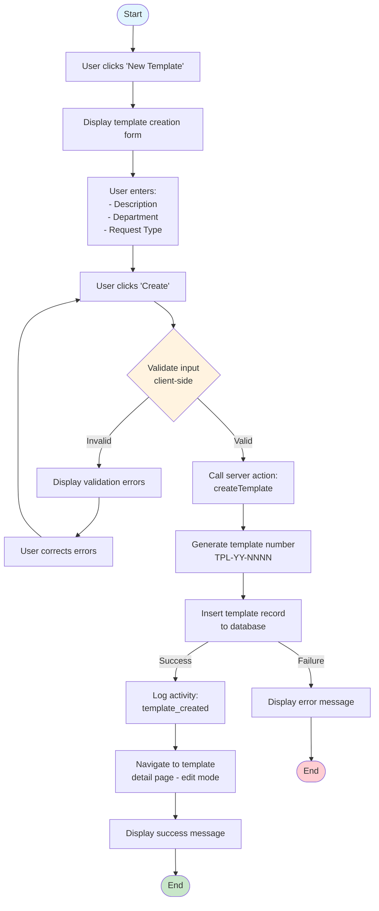
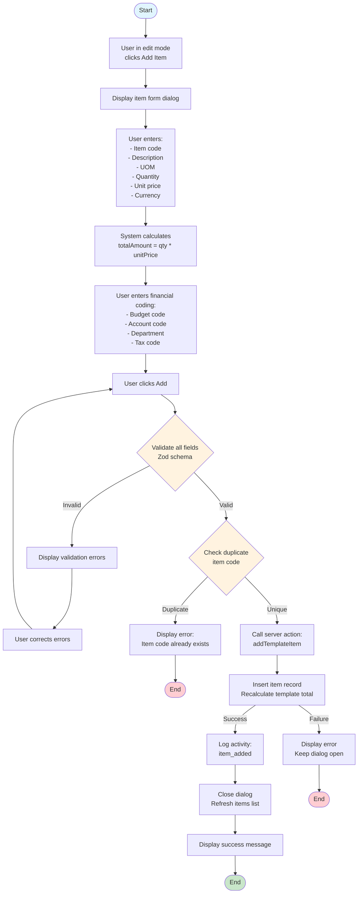
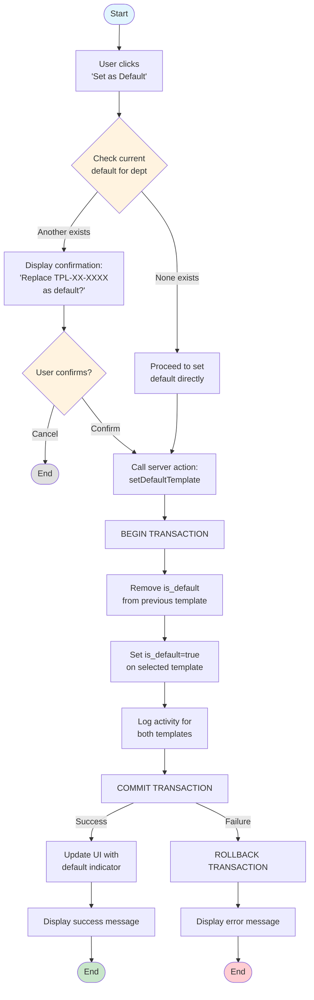
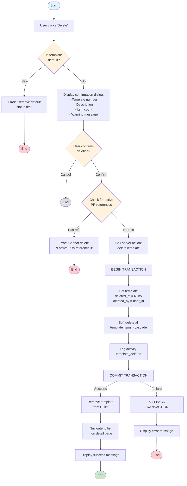
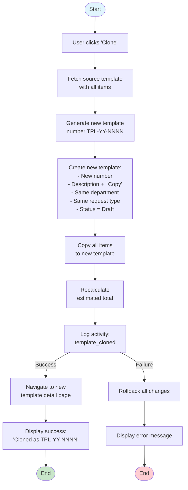
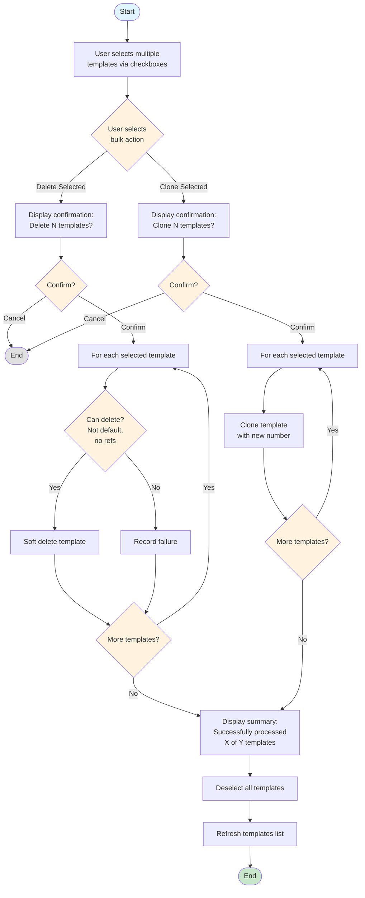
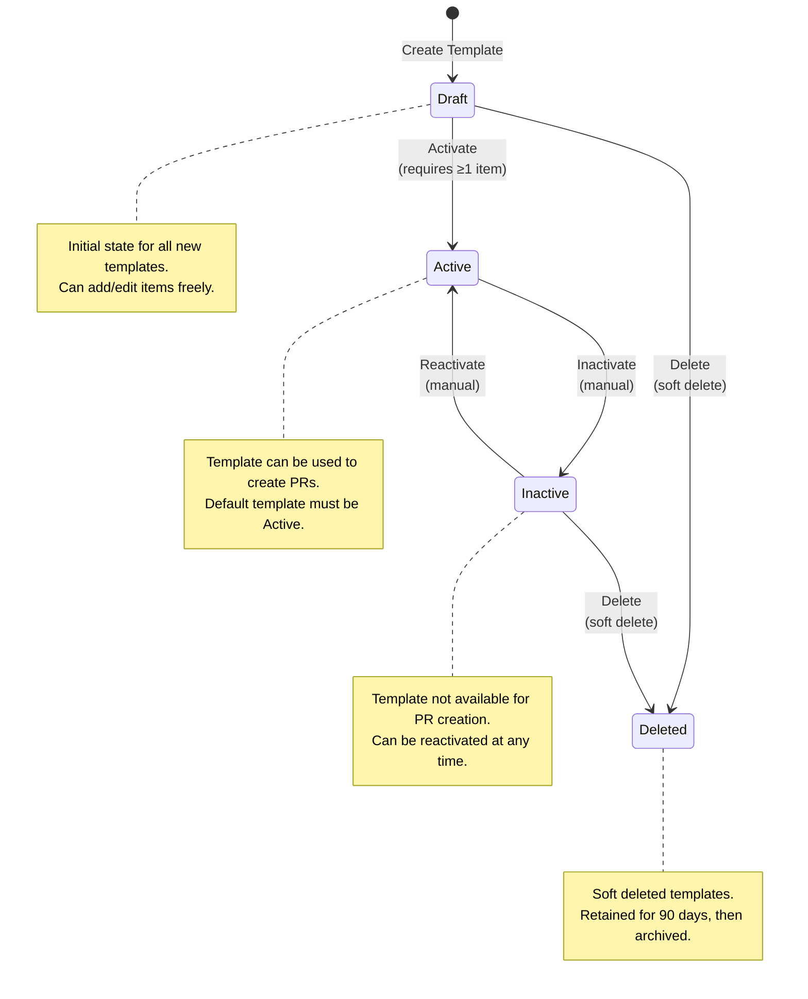
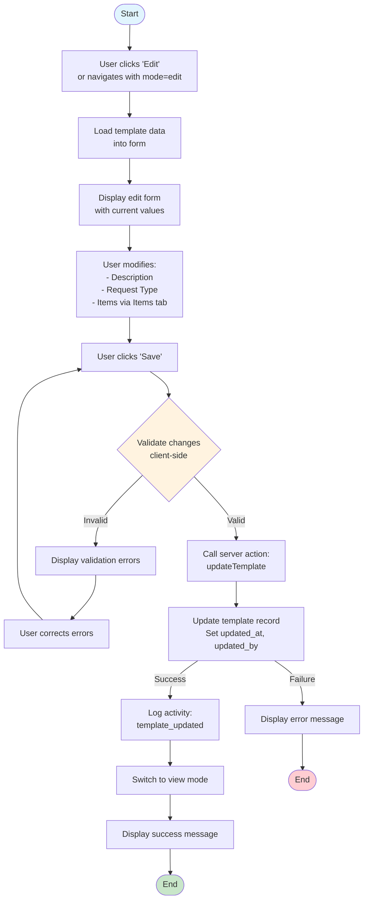
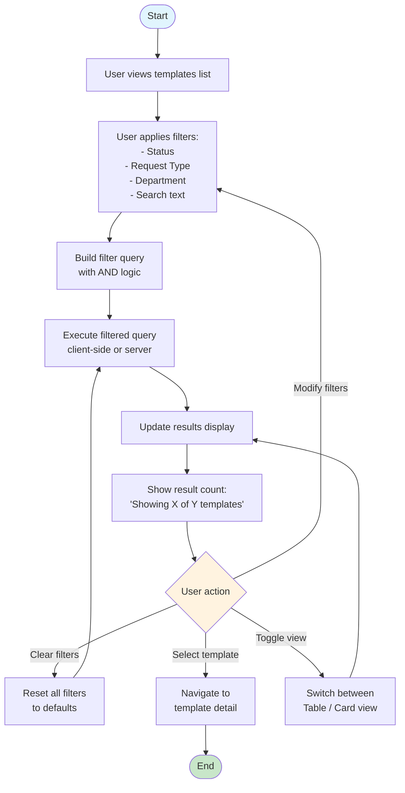

# Flow Diagrams: Purchase Request Templates

## Module Information
- **Module**: Procurement
- **Sub-Module**: Purchase Request Templates
- **Route**: `/procurement/purchase-request-templates`
- **Version**: 1.2.0
- **Last Updated**: 2025-12-04
- **Owner**: Procurement Team
- **Status**: Draft

## Document History
| Version | Date | Author | Changes |
|---------|------|--------|---------|
| 1.0.0 | 2025-02-11 | System Documentation | Initial version |
| 1.1.0 | 2025-12-04 | Documentation Team | Aligned with prototype - simplified item flow, updated state machine |
| 1.2.0 | 2025-12-04 | Documentation Team | Converted to Mermaid 8.8.2 diagrams |

---

## Overview

This document provides visual flow diagrams for all major workflows in the Purchase Request Templates module. Diagrams illustrate user interactions, system processes, decision points, and data flows using Mermaid 8.8.2 syntax.

**Related Documents**:
- [Backend Requirements](./BE-purchase-request-templates.md)
- [Business Requirements](./BR-purchase-request-templates.md)
- [Data Definition](./DD-purchase-request-templates.md)
- [Use Cases](./UC-purchase-request-templates.md)
- [Technical Specification](./TS-purchase-request-templates.md)

---

## 1. Template Creation Workflow

---

## 2. Add Item to Template Workflow

> **Note**: Advanced pricing features (discount rate, tax rate, tax-inclusive pricing) planned for Phase 2.

---

## 3. Set Default Template Workflow

---

## 4. Template to Purchase Request Conversion

> **Phase 2**: This workflow is planned for a future release. Template→PR conversion is not yet implemented in the current prototype.

```mermaid
flowchart TD
    Start([Start<br>in PR module]) --> ClickUse[User clicks<br>'Use Template']
    ClickUse --> ShowModal[Display template<br>selection modal]
    ShowModal --> SelectTemplate[User selects template]
    SelectTemplate --> OptionalSettings[Optional: Select vendor,<br>delivery date, apply<br>current pricing]
    OptionalSettings --> ConfirmConvert[User confirms conversion]
    ConfirmConvert --> CallConversion[PR module calls<br>template conversion service]
    CallConversion --> ValidateTemplate{Validate template<br>exists & is active}

    ValidateTemplate -->|Invalid| InvalidError[Error: 'Template not<br>active or not found']
    InvalidError --> EndInvalid([End])

    ValidateTemplate -->|Valid| FetchTemplate[Fetch template<br>with all items]
    FetchTemplate --> ApplyPricing{Apply current<br>pricing?}

    ApplyPricing -->|Yes| GetCurrentPrices[For each item, call<br>Vendor Management<br>for current price]
    GetCurrentPrices --> UpdatePrices[Update item prices<br>if different]
    UpdatePrices --> GeneratePR

    ApplyPricing -->|No| GeneratePR[Generate PR number<br>PR-YY-NNNN]

    GeneratePR --> CreatePR[Create PR record:<br>- Description<br>- Department<br>- Type<br>- Status = Draft<br>- Source template ID]
    CreatePR --> CreateItems[Create PR line items<br>from template items]
    CreateItems --> IncrementUsage[Increment template<br>usage_count]
    IncrementUsage --> UpdateLastUsed[Update template<br>last_used_at]
    UpdateLastUsed --> LogConversion[Log activity:<br>template_converted_to_pr]

    LogConversion -->|Success| ReturnPR[Return PR data<br>to calling module]
    ReturnPR --> DisplayPR[PR module displays<br>new PR in Draft status]
    DisplayPR --> EndSuccess([End])

    LogConversion -->|Failure| RollbackAll[Rollback all changes]
    RollbackAll --> ReturnError[Return error to PR module]
    ReturnError --> DisplayError[Display error message]
    DisplayError --> EndFail([End])

    style Start fill:#e1f5fe
    style EndSuccess fill:#c8e6c9
    style EndInvalid fill:#ffcdd2
    style EndFail fill:#ffcdd2
    style ValidateTemplate fill:#fff3e0
    style ApplyPricing fill:#fff3e0
```

---

## 5. Delete Template Workflow

---

## 6. Clone Template Workflow

---

## 7. Bulk Operations Workflow

---

## 8. State Machine Diagram

### Template Lifecycle States

### State Transition Rules

| From State | To State | Condition | Action |
|------------|----------|-----------|--------|
| Draft | Active | Template has ≥1 item | Set status = 'active' |
| Active | Inactive | Manual action | Set status = 'inactive' |
| Inactive | Active | Manual action | Set status = 'active' |
| Draft | Deleted | Not default | Set deleted_at timestamp |
| Inactive | Deleted | Not default, no active PR refs | Set deleted_at timestamp |
| Active | Deleted | Not allowed | Must inactivate first |

---

## 9. Edit Template Workflow

---

## 10. Filter and Search Workflow

---

## Appendix: Mermaid Diagram Legend

### Node Shapes

| Shape | Syntax | Usage |
|-------|--------|-------|
| Rounded rectangle | `([Text])` | Start/End nodes |
| Rectangle | `[Text]` | Process/Action steps |
| Diamond | `{Text}` | Decision points |
| Parallelogram | `[/Text/]` | Input/Output |

### Edge Labels

| Syntax | Meaning |
|--------|---------|
| `-->` | Flow direction |
| `-->\|Label\|` | Conditional branch with label |

### Styling

| Style | Color | Usage |
|-------|-------|-------|
| `fill:#e1f5fe` | Light blue | Start nodes |
| `fill:#c8e6c9` | Light green | Success end |
| `fill:#ffcdd2` | Light red | Error/failure end |
| `fill:#fff3e0` | Light orange | Decision points |
| `fill:#e0e0e0` | Light gray | Cancel/neutral end |

---

**Document End**
