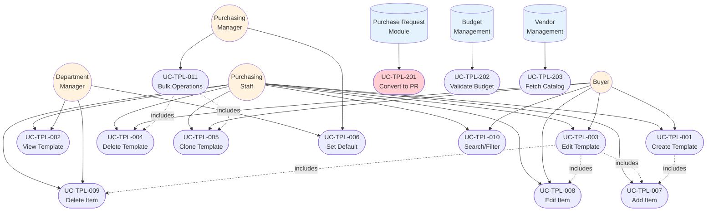
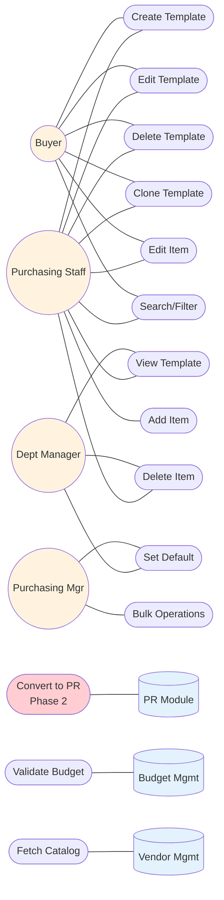
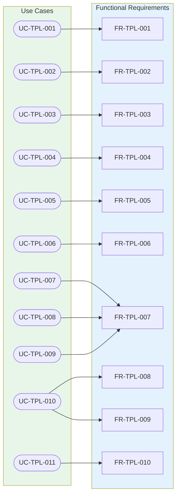

# Use Cases: Purchase Request Templates

## Module Information
- **Module**: Procurement
- **Sub-Module**: Purchase Request Templates
- **Route**: `/procurement/purchase-request-templates`
- **Version**: 1.0.0
- **Last Updated**: 2025-02-11
- **Owner**: Procurement Team
- **Status**: Draft

## Document History
| Version | Date | Author | Changes |
|---------|------|--------|---------|
| 1.0.0 | 2025-02-11 | System Documentation | Initial version |
| 1.1.0 | 2025-12-04 | Documentation Team | Aligned with prototype - simplified item fields, updated status/type values, marked Template→PR as Phase 2 |
| 1.2.0 | 2025-12-04 | Documentation Team | Converted Use Case Diagram to Mermaid 8.8.2 format with actor-use case relationships |
| 1.3.0 | 2025-12-04 | Documentation Team | Added comprehensive Traceability Matrices (Master, Business Rules, Validation Rules, Document Cross-Reference, Test Coverage, Implementation Status) |

---

## Overview

This document describes the use cases for the Purchase Request Templates sub-module within the Carmen ERP Procurement system. These use cases cover all user interactions, system processes, and integrations related to creating, managing, and utilizing purchase request templates for hospitality operations.

The use cases are organized into categories: User Use Cases (interactive workflows initiated by staff), System Use Cases (automated processes), Integration Use Cases (interactions with other modules), and Background Jobs (scheduled or async tasks).

**Related Documents**:
- [Business Requirements](./BR-purchase-request-templates.md)
- [Backend Requirements](./BE-purchase-request-templates.md)
- [Technical Specification](./TS-purchase-request-templates.md)
- [Data Definition](./DD-purchase-request-templates.md)
- [Flow Diagrams](./FD-purchase-request-templates.md)
- [Validation Rules](./VAL-purchase-request-templates.md)

---

## Actors

### Primary Actors
User roles who directly interact with the template system to create, manage, and use templates

| Actor | Description | Role |
|-------|-------------|------|
| Purchasing Staff | Front-line procurement team members | Creates and uses templates for routine purchases |
| Buyer | Specialized purchasing personnel | Manages templates for specific product categories |
| Department Manager | Kitchen, Housekeeping, Maintenance managers | Reviews and approves department-specific templates |
| Purchasing Manager | Procurement department supervisor | Oversees template library and sets department defaults |

### Secondary Actors
Supporting roles who interact with templates indirectly or perform oversight functions

| Actor | Description | Role |
|-------|-------------|------|
| Finance Staff | Financial controllers and accountants | Reviews budget allocations in templates |
| Inventory Manager | Stock control personnel | Monitors template item specifications against inventory |
| System Administrator | IT support personnel | Configures template settings and permissions |

### System Actors
Automated processes and integrations that interact with the template system

| System | Description | Integration Type |
|--------|-------------|------------------|
| Purchase Request Module | Converts templates to actual purchase requests | Module Integration |
| Budget Management | Validates budget codes and availability | Module Integration |
| Vendor Management | Provides vendor catalog data for template items | Module Integration |
| Notification Service | Sends alerts for template usage and approvals | Event |

---

## Use Case Diagram



### Use Case Diagram - Actor Responsibilities



**Legend**:
- **Circle nodes** `(( ))`: Human actors (Primary Actors)
- **Cylinder nodes** `[( )]`: System actors (External modules)
- **Stadium nodes** `([ ])`: Use cases
- **Solid lines** `---`: Actor-to-use-case associations
- **Dashed arrows** `-.->`: Include relationships between use cases
- **Orange fill**: Primary actors
- **Blue fill**: System actors
- **Red fill**: Phase 2 use case (UC-TPL-201 - Template to PR conversion)

---

## Use Case Summary

| ID | Use Case Name | Actor(s) | Priority | Complexity | Category |
|----|---------------|----------|----------|------------|----------|
| **User Use Cases** | | | | | |
| UC-TPL-001 | Create Purchase Request Template | Purchasing Staff, Buyer | High | Medium | User |
| UC-TPL-002 | View Template Details | All Users | High | Simple | User |
| UC-TPL-003 | Edit Template | Purchasing Staff, Buyer | High | Medium | User |
| UC-TPL-004 | Delete Template | Purchasing Staff, Buyer | Medium | Simple | User |
| UC-TPL-005 | Clone Template | Purchasing Staff, Buyer | Medium | Simple | User |
| UC-TPL-006 | Set Default Template | Purchasing Manager | Medium | Simple | User |
| UC-TPL-007 | Add Item to Template | Purchasing Staff, Buyer | High | Simple | User |
| UC-TPL-008 | Edit Template Item | Purchasing Staff, Buyer | High | Simple | User |
| UC-TPL-009 | Delete Template Item | Purchasing Staff, Buyer | Medium | Simple | User |
| UC-TPL-010 | Search and Filter Templates | All Users | High | Simple | User |
| UC-TPL-011 | Bulk Template Operations | Purchasing Staff, Buyer | Medium | Medium | User |
| **Integration Use Cases** | | | | | |
| UC-TPL-201 | Convert Template to Purchase Request | Purchase Request Module | High | Medium | Integration (Phase 2) |
| UC-TPL-202 | Validate Budget Codes | Budget Management | High | Simple | Integration |
| UC-TPL-203 | Fetch Vendor Catalog Data | Vendor Management | Medium | Simple | Integration |

**Complexity Definitions**:
- **Simple**: Single-step process with minimal logic, 1-3 scenarios, straightforward validation
- **Medium**: Multi-step process with business rules, 4-8 scenarios, moderate validation and integration
- **Complex**: Multi-step process with complex validation, multiple integrations, 9+ scenarios, extensive error handling

---

## User Use Cases

### UC-TPL-001: Create Purchase Request Template

**Description**: Enables purchasing staff to create new reusable templates for recurring procurement needs, capturing item specifications, quantities, pricing, and financial coding.

**Actor(s)**: Purchasing Staff, Buyer

**Priority**: High

**Frequency**: Weekly (as new recurring needs are identified)

**Preconditions**:
- User is authenticated and has "Create Purchase Request Template" permission
- User is assigned to at least one department
- At least one department, budget code, and account code exist in the system

**Postconditions**:
- **Success**: New template is created with unique TPL-YY-NNNN number and stored in database; template appears in templates list
- **Failure**: Template not created; user receives clear error message explaining validation failure

**Main Flow** (Happy Path):
1. User clicks "New Template" button from templates list page
2. System displays template creation form with empty fields
3. User enters template description (e.g., "Monthly Office Supplies Order")
4. User selects department from dropdown (e.g., "Kitchen")
5. User selects request type (e.g., "Goods", "Services", or "Capital")
6. User clicks "Create" button
7. System validates input fields against business rules
8. System generates unique template number (e.g., TPL-24-0015)
9. System creates template record with status "Draft"
10. System redirects user to template detail page in edit mode
11. System displays success message "Template created successfully"
12. Use case ends

**Alternative Flows**:

**Alt-1A: Add Items Immediately** (After step 10)
- 10a. User clicks "Add Item" button on Items tab
- 10b. System opens item form dialog
- 10c. Proceed to [UC-TPL-007: Add Item to Template](#uc-tpl-007-add-item-to-template)
- Resume at step 11

**Alt-1B: Save as Active Template** (At step 6)
- 6a. User checks "Activate immediately" checkbox before clicking Create
- 6b. System validates that at least one item exists (for activation)
- 6c. If no items exist, system displays error "Cannot activate template without items"
- 6d. User adds at least one item first
- Resume at step 7 with status "Active" instead of "Draft"

**Exception Flows**:

**Exc-1A: Validation Failure** (At step 7)
- System detects validation errors:
  - Description less than 10 characters
  - Department not selected
  - Request type not selected
- System displays inline validation errors next to affected fields
- User corrects errors
- Resume at step 6

**Exc-1B: Duplicate Template** (At step 8)
- System detects duplicate description for same department
- System displays warning "Similar template exists: TPL-24-0010. Do you want to continue?"
- User chooses: Continue or Cancel
- If Continue, proceed to step 9
- If Cancel, return to step 3 for editing

**Exc-1C: System Error** (At step 9)
- Database insertion fails
- System logs error details
- System displays error message "Unable to create template. Please try again."
- User can retry or cancel
- Use case ends

**Business Rules**:
- **BR-TPL-001**: Template numbers must follow TPL-YY-NNNN pattern
- **BR-TPL-002**: Templates must be assigned to exactly one department
- **BR-TPL-003**: Description must be minimum 10 characters
- **BR-TPL-028**: Requires "Create Purchase Request Template" permission

**Includes**:
- [UC-TPL-007: Add Item to Template](#uc-tpl-007-add-item-to-template) (optional immediate add)

**Related Requirements**:
- FR-TPL-001: Create Purchase Request Template
- NFR-TPL-012: Inline validation with clear error messages

**UI Mockups**: Route: `/procurement/purchase-request-templates` with "New Template" button

**Notes**:
- Templates can be created without items initially (empty templates allowed for gradual setup)
- Template number is auto-generated and cannot be manually edited
- Users typically add items immediately after creation using UC-TPL-007

---

### UC-TPL-002: View Template Details

**Description**: Enables users to view complete template information including metadata, all configured items, budget allocations, and usage history through a tabbed interface.

**Actor(s)**: All Users (Purchasing Staff, Buyer, Department Manager, Finance Staff)

**Priority**: High

**Frequency**: Daily (multiple times per day for active templates)

**Preconditions**:
- User is authenticated and has "View Purchase Request Templates" permission
- Template exists in the system
- User has permission to view templates for the template's department

**Postconditions**:
- **Success**: User views complete template details in read-only mode
- **Failure**: User receives access denied message if lacking permissions

**Main Flow** (Happy Path):
1. User navigates to templates list page
2. User locates desired template using search/filter or browsing
3. User clicks template row or "View" action button
4. System retrieves template data including all related items
5. System displays template detail page with three tabs: Items, Budgets, Activity
6. System shows "Items" tab by default with:
   - Template metadata (number, description, department, type, status)
   - Complete item listing with quantities, prices, budget codes
   - Estimated total amount with proper currency formatting
7. User can switch to "Budgets" tab to see budget allocation summary
8. User can switch to "Activity" tab to see usage history and audit trail
9. User reviews information in read-only mode
10. Use case ends

**Alternative Flows**:

**Alt-2A: Switch to Edit Mode** (After step 9)
- 9a. User clicks "Edit" button (if authorized)
- 9b. System checks user has edit permission and template is editable
- 9c. If authorized, system switches to edit mode
- 9d. Proceed to [UC-TPL-003: Edit Template](#uc-tpl-003-edit-template)

**Alt-2B: Print Template** (After step 9)
- 9a. User clicks "Print" button
- 9b. System opens print preview with formatted template layout
- 9c. User prints or saves as PDF
- Resume at step 9

**Alt-2C: Clone Template** (After step 9)
- 9a. User clicks "Clone" button
- 9b. Proceed to [UC-TPL-005: Clone Template](#uc-tpl-005-clone-template)

**Exception Flows**:

**Exc-2A: Template Not Found** (At step 4)
- Template ID does not exist in database
- System displays "Template not found" message
- System redirects user to templates list
- Use case ends

**Exc-2B: Access Denied** (At step 4)
- User lacks permission to view this template's department
- System displays "Access denied. You don't have permission to view this template."
- System redirects user to templates list
- Use case ends

**Exc-2C: Data Load Error** (At step 4)
- Database query fails
- System logs error
- System displays "Unable to load template. Please try again."
- User can retry or return to list
- Use case ends

**Business Rules**:
- **BR-TPL-032**: Requires minimum "View Purchase Request Templates" permission
- **BR-TPL-005**: Templates in Active status can be edited only with edit permission

**Extends**:
- [UC-TPL-003: Edit Template](#uc-tpl-003-edit-template)
- [UC-TPL-005: Clone Template](#uc-tpl-005-clone-template)

**Related Requirements**:
- FR-TPL-002: View Purchase Request Template
- NFR-TPL-011: Fully responsive on mobile devices

**UI Mockups**: Route: `/procurement/purchase-request-templates/[id]` in view mode

**Notes**:
- All monetary values display with proper currency formatting (2 decimals)
- View mode prevents accidental modifications (read-only)
- Activity tab shows template usage count and last used date

---

### UC-TPL-003: Edit Template

**Description**: Allows authorized users to modify existing template metadata and items, including updating descriptions, adjusting quantities/prices, and changing budget allocations.

**Actor(s)**: Purchasing Staff, Buyer

**Priority**: High

**Frequency**: Weekly (as prices or requirements change)

**Preconditions**:
- User is authenticated and has "Edit Purchase Request Template" permission
- Template exists and is in editable status (Draft or Active)
- User is template creator or has elevated role (Purchasing Manager)

**Postconditions**:
- **Success**: Template modifications saved; updated timestamp and modifier captured; template version incremented
- **Failure**: Changes not saved; user receives validation error messages

**Main Flow** (Happy Path):
1. User views template via [UC-TPL-002](#uc-tpl-002-view-template-details)
2. User clicks "Edit" button in template header
3. System checks user has edit permission
4. System switches page to edit mode with editable fields
5. User modifies template description (e.g., updates from "Office Supplies" to "Office Supplies - Updated 2024")
6. User changes department or request type if needed
7. User modifies items via Items tab:
   - Edits existing items (quantities, prices, budget codes)
   - Adds new items using "Add Item" button
   - Deletes unnecessary items
8. User reviews changes
9. User clicks "Save" button
10. System validates all changes against business rules
11. System updates template record with new values
12. System increments version number for optimistic locking
13. System records modification timestamp and user ID
14. System displays success message "Template updated successfully"
15. System switches back to view mode showing updated data
16. Use case ends

**Alternative Flows**:

**Alt-3A: Cancel Without Saving** (At step 9)
- 9a. User clicks "Cancel" button
- 9b. System detects unsaved changes
- 9c. System displays confirmation dialog "Discard unsaved changes?"
- 9d. User chooses: Discard or Continue Editing
- 9e. If Discard, system reverts to view mode without saving
- 9f. If Continue Editing, resume at step 8
- Use case ends if Discard chosen

**Alt-3B: Save and Activate** (At step 9)
- 9a. User clicks "Save & Activate" button instead of "Save"
- 9b. System validates template has at least one item (BR-TPL-020)
- 9c. If valid, system changes status from "Draft" to "Active"
- 9d. Proceed to step 10

**Alt-3C: Edit Individual Item** (At step 7)
- 7a. User clicks item row in items table
- 7b. System opens item form dialog with current values
- 7c. Proceed to [UC-TPL-008: Edit Template Item](#uc-tpl-008-edit-template-item)
- Resume at step 8

**Exception Flows**:

**Exc-3A: Validation Failure** (At step 10)
- System detects validation errors:
  - Description less than 10 characters
  - Duplicate item codes within template
  - Invalid budget codes
  - Negative quantities or prices
- System displays inline validation errors
- User corrects errors
- Resume at step 9

**Exc-3B: Concurrent Edit Conflict** (At step 11)
- Another user modified template since current user loaded it
- Optimistic locking detects version mismatch
- System displays "Template was modified by another user. Reload and try again?"
- User chooses: Reload (loses changes) or Cancel (keep editing offline)
- If Reload, system refreshes data from database
- Resume at step 4 with fresh data

**Exc-3C: Permission Revoked** (At step 3)
- User's edit permission was revoked after viewing template
- System displays "You no longer have permission to edit this template"
- System keeps template in view mode
- Use case ends

**Exc-3D: Database Update Failure** (At step 11)
- Database update fails due to connection loss or constraint violation
- System logs error details
- System displays "Unable to save changes. Please try again."
- User can retry or cancel
- Unsaved changes remain in form
- Use case ends

**Business Rules**:
- **BR-TPL-005**: Active status templates editable only with edit permission
- **BR-TPL-008** through **BR-TPL-018**: Item validation rules
- **BR-TPL-020**: Template must contain at least one item for Active status
- **BR-TPL-029**: Requires "Edit Purchase Request Template" permission

**Includes**:
- [UC-TPL-008: Edit Template Item](#uc-tpl-008-edit-template-item) (for item modifications)
- [UC-TPL-007: Add Item to Template](#uc-tpl-007-add-item-to-template) (for adding items)
- [UC-TPL-009: Delete Template Item](#uc-tpl-009-delete-template-item) (for removing items)

**Related Requirements**:
- FR-TPL-003: Edit Purchase Request Template
- NFR-TPL-010: Optimistic locking prevents data conflicts
- NFR-TPL-020: Unsaved changes trigger warning before navigation

**UI Mockups**: Same route as view mode with editable fields enabled

**Notes**:
- Template number cannot be changed (system-generated, immutable)
- Department assignment cannot be changed after items are added (BR-TPL-002)
- Concurrent editing prevented through optimistic locking

---

### UC-TPL-004: Delete Template

**Description**: Enables users to remove obsolete or incorrect templates with appropriate safeguards to prevent accidental deletion of actively used templates.

**Actor(s)**: Purchasing Staff, Buyer, Purchasing Manager

**Priority**: Medium

**Frequency**: Monthly (periodic cleanup)

**Preconditions**:
- User is authenticated and has "Delete Purchase Request Template" permission
- Template exists in the system
- Template is not marked as default for its department

**Postconditions**:
- **Success**: Template and all associated items removed from database; audit log entry created
- **Failure**: Template not deleted; user receives clear explanation of blocking conditions

**Main Flow** (Happy Path):
1. User views templates list or template detail page
2. User clicks "Delete" action button for specific template
3. System checks if template is default for department
4. System displays confirmation dialog showing:
   - Template number and description
   - Item count
   - Warning message: "This action cannot be undone"
   - "Delete" and "Cancel" buttons
5. User confirms deletion by clicking "Delete" button
6. System validates no active purchase requests reference this template
7. System soft-deletes template record (sets deletedAt timestamp)
8. System soft-deletes all associated template items
9. System creates audit log entry with deletion timestamp and user ID
10. System removes template from list view
11. System displays success message "Template deleted successfully"
12. Use case ends

**Alternative Flows**:

**Alt-4A: Cancel Deletion** (At step 5)
- 5a. User clicks "Cancel" button in confirmation dialog
- 5b. System closes dialog without deleting
- Template remains unchanged
- Use case ends

**Alt-4B: Delete from Detail Page** (At step 1)
- 1a. User is on template detail page instead of list
- 1b. User clicks "Delete" button in page header
- 1c. Resume at step 3
- After successful deletion, system redirects to templates list

**Exception Flows**:

**Exc-4A: Template is Default** (At step 3)
- System detects template has isDefault flag set to true
- System displays error message "Cannot delete default template. Remove default status first."
- System provides link to [UC-TPL-006: Set Default Template](#uc-tpl-006-set-default-template)
- Use case ends without deletion

**Exc-4B: Active References Exist** (At step 6)
- System detects purchase requests still reference this template
- System displays error: "Cannot delete template. 3 active purchase requests use this template."
- System lists referencing PR numbers
- User can choose to archive template instead of delete
- Use case ends without deletion

**Exc-4C: Permission Denied** (At step 2)
- User lacks delete permission
- System displays "Access denied. You don't have permission to delete this template."
- Delete button remains disabled
- Use case ends

**Exc-4D: Database Error** (At step 7-8)
- Database deletion fails
- System logs error
- System displays "Unable to delete template. Please try again."
- Template remains in system unchanged
- Use case ends

**Business Rules**:
- **BR-TPL-006**: Templates cannot be deleted if marked as default
- **BR-TPL-030**: Requires "Delete Purchase Request Template" permission
- **BR-TPL-009** (implied): Soft delete with 90-day retention before permanent removal

**Related Requirements**:
- FR-TPL-004: Delete Purchase Request Template
- NFR-TPL-009: Soft-delete for 90 days before permanent removal

**UI Mockups**: Delete button with confirmation dialog

**Notes**:
- Soft delete allows recovery within 90-day window if needed
- Deletion removes template from normal views but preserves audit trail
- Bulk delete operation available via UC-TPL-011

---

### UC-TPL-005: Clone Template

**Description**: Creates exact copies of existing templates for modification, enabling quick creation of similar templates for different scenarios or departments.

**Actor(s)**: Purchasing Staff, Buyer

**Priority**: Medium

**Frequency**: Weekly (when creating variants of standard templates)

**Preconditions**:
- User is authenticated and has "Create Purchase Request Template" permission
- Source template exists and is accessible to user
- User can view the source template's department

**Postconditions**:
- **Success**: New template created with unique number, all items copied, ready for editing
- **Failure**: Clone not created; user receives error message

**Main Flow** (Happy Path):
1. User views template detail page via [UC-TPL-002](#uc-tpl-002-view-template-details)
2. User clicks "Clone" button in template header
3. System creates new template record with:
   - New unique template number (e.g., TPL-24-0016)
   - Description appended with "(Copy)" (e.g., "Office Supplies (Copy)")
   - Same department as source
   - Same request type as source
   - Status set to "Draft" regardless of source status
4. System copies all items from source template to new template:
   - Same item codes, descriptions, UOMs
   - Same quantities and unit prices
   - Same budget codes, account codes, departments
   - Same tax codes and currency settings
5. System captures creation timestamp and creator user ID
6. System redirects user to new template's detail page in edit mode
7. System displays success message "Template cloned successfully as TPL-24-0016"
8. User can immediately edit cloned template to make desired changes
9. Use case ends

**Alternative Flows**:

**Alt-5A: Clone Multiple Templates (Bulk Clone)** (At step 1)
- 1a. User selects multiple templates in list view using checkboxes
- 1b. User clicks "Clone Selected" bulk action button
- 1c. System displays confirmation "Clone 5 templates?"
- 1d. User confirms
- 1e. System processes each template sequentially:
  - For each template, execute steps 3-5
- 1f. System displays summary "Successfully cloned 5 templates"
- 1g. User remains on templates list (does not redirect to detail)
- Use case ends

**Alt-5B: Clone to Different Department** (After step 2)
- 2a. System displays "Clone Template" dialog with options:
   - Keep same department (default)
   - Select different department
- 2b. User selects different department from dropdown
- 2c. System clones template with selected department
- 2d. System updates item department assignments to match new template department
- Resume at step 6

**Exception Flows**:

**Exc-5A: Permission Denied** (At step 2)
- User lacks "Create Purchase Request Template" permission
- System displays "Access denied. You cannot create templates."
- Clone button remains disabled
- Use case ends

**Exc-5B: Item Copy Failure** (At step 4)
- Database insertion fails for one or more items
- System rolls back entire clone operation
- System displays "Unable to clone template. Please try again."
- No partial template created
- Use case ends

**Exc-5C: Template Number Generation Failure** (At step 3)
- System cannot generate unique template number (rare)
- System displays "Unable to create template number. Please try again."
- Use case ends

**Business Rules**:
- **BR-TPL-001**: Cloned template receives new unique TPL-YY-NNNN number
- **BR-TPL-004**: Cloned template always starts in "Draft" status
- **BR-TPL-028**: Requires "Create Purchase Request Template" permission

**Includes**:
- [UC-TPL-001: Create Purchase Request Template](#uc-tpl-001-create-purchase-request-template) (template creation logic)
- [UC-TPL-007: Add Item to Template](#uc-tpl-007-add-item-to-template) (item copying logic)

**Related Requirements**:
- FR-TPL-005: Clone Purchase Request Template
- FR-TPL-010: Bulk Operations

**UI Mockups**: Clone button on template detail page; bulk clone in list view

**Notes**:
- Description automatically appended with "(Copy)" to distinguish from original
- All item specifications copied exactly, including pricing and budget codes
- Cloned template can be edited immediately without affecting source template
- Currency settings and exchange rates copied from source

---

### UC-TPL-006: Set Default Purchase Request Template

**Description**: Allows purchasing managers to designate templates as "default" for specific departments, enabling quick access and workflow automation.

**Actor(s)**: Purchasing Manager, Department Manager

**Priority**: Medium

**Frequency**: Monthly (when updating department standards)

**Preconditions**:
- User is authenticated and has "Manage Default Templates" permission
- Template exists and is in Active status
- User has access to template's department

**Postconditions**:
- **Success**: Template marked as default; previous default unmarked; activity logged
- **Failure**: Default status not changed; user receives error message

**Main Flow** (Happy Path):
1. User views template detail page or templates list
2. User clicks "Set as Default" action button for desired template
3. System checks if another template is already default for this department
4. If another default exists, system displays confirmation dialog:
   - "TPL-24-0005 is currently the default template for Kitchen department"
   - "Replace with TPL-24-0016 as the new default?"
   - "Set Default" and "Cancel" buttons
5. User confirms by clicking "Set Default" button
6. System removes default flag (isDefault = false) from previous default template
7. System sets default flag (isDefault = true) on selected template
8. System records activity log entry for both templates (default removed/added)
9. System updates template display with default indicator (star icon/badge)
10. System displays success message "Template set as default for Kitchen department"
11. Use case ends

**Alternative Flows**:

**Alt-6A: No Existing Default** (At step 3)
- 3a. No other template is default for this department
- 3b. System skips confirmation dialog
- 3c. Proceed directly to step 7

**Alt-6B: Remove Default Status** (At step 2)
- 2a. Template is already default
- 2b. User clicks "Remove Default" button instead
- 2c. System displays confirmation "Remove default status from TPL-24-0016?"
- 2d. User confirms
- 2e. System sets isDefault = false
- 2f. System records activity log entry
- 2g. System displays "Default status removed"
- Use case ends

**Alt-6C: Set Default from List View** (At step 1)
- 1a. User is on templates list page (table or card view)
- 1b. User clicks star icon or default action on template row
- 1c. Resume at step 3

**Exception Flows**:

**Exc-6A: Template Not Active** (At step 3)
- Template status is "Draft" or "Inactive"
- System displays error "Only active templates can be set as default"
- System suggests activating template first
- Use case ends without change

**Exc-6B: Permission Denied** (At step 2)
- User lacks "Manage Default Templates" permission
- System displays "Access denied. You cannot manage default templates."
- Set Default button remains disabled
- Use case ends

**Exc-6C: Concurrent Modification** (At step 6-7)
- Another user changed default status simultaneously
- System detects conflict via optimistic locking
- System displays "Default status was changed by another user. Reload and try again."
- User can reload and retry
- Use case ends

**Exc-6D: Database Update Failure** (At step 6-7)
- Database update fails
- System logs error
- System rolls back all changes (no partial update)
- System displays "Unable to update default status. Please try again."
- Default status remains unchanged
- Use case ends

**Business Rules**:
- **BR-TPL-007**: Only one template per department can be default at any time
- **BR-TPL-006**: Default templates cannot be deleted without removing default status first
- **BR-TPL-031**: Requires "Manage Default Templates" permission

**Related Requirements**:
- FR-TPL-006: Set Default Purchase Request Template
- NFR-TPL-034: Activity logged for audit trail

**UI Mockups**: Star icon in list view; "Set as Default" button in detail view

**Notes**:
- Default templates display with visual indicator (star icon, badge, or highlight)
- When users create new purchase requests, system suggests default template
- Default status persists across user sessions
- Activity log tracks all default status changes with timestamp and user

---

### UC-TPL-007: Add Item to Template

**Description**: Enables users to add individual line items to templates with complete specifications including quantities, pricing, and financial coding.

**Actor(s)**: Purchasing Staff, Buyer

**Priority**: High

**Frequency**: Daily (when building or updating templates)

**Preconditions**:
- User is viewing template in edit mode (via UC-TPL-001 or UC-TPL-003)
- User has permission to edit the template
- At least one budget code and account code exist for the department

**Postconditions**:
- **Success**: New item added to template; item appears in items list; template total updated
- **Failure**: Item not added; user receives validation error messages

**Main Flow** (Happy Path):
1. User clicks "Add Item" button on Items tab
2. System displays item form dialog with empty fields
3. User enters basic item information:
   - Item code (e.g., "RAW-001")
   - Description (e.g., "Fresh Vegetables Assortment")
   - UOM (Unit of Measure, e.g., "KG")
   - Quantity (e.g., 100)
4. User enters pricing information:
   - Currency (e.g., "THB") from dropdown
   - Unit price (e.g., 5.50)
5. System calculates Total Amount in real-time:
   - Total Amount = Quantity (100) × Unit Price (5.50) = 550.00
6. User enters financial coding:
   - Budget code (e.g., "BUD-2401-0001") from dropdown
   - Account code (e.g., "5001") from dropdown
   - Department (auto-filled from template)
   - Tax code (e.g., "VAT7", "VAT0", or "EXEMPT") from dropdown
7. User reviews calculated total displayed in form
8. User clicks "Add" button
9. System validates all fields against business rules
10. System checks for duplicate item code within template
11. System creates new TemplateItem record
12. System adds item to template's items collection
13. System recalculates template estimated total
14. System closes item form dialog
15. System refreshes items list showing new item
16. System displays success message "Item added successfully"
17. Use case ends

> **Note**: Advanced pricing features (discount rate, tax rate, tax included, currency exchange rate) are planned for Phase 2.

**Alternative Flows**:

**Alt-7A: Select from Product Catalog** (At step 3)
- 3a. User clicks "Browse Catalog" button
- 3b. System displays product catalog modal
- 3c. User selects product from catalog
- 3d. System auto-fills: item code, description, UOM, unit price
- 3e. User enters quantity
- Resume at step 4 with auto-filled values

> **Phase 2 Planned Flows**: Tax Included in Price, Apply Discount/Tax Adjustments, and Multi-Currency with Exchange Rate will be supported in a future release.

**Exception Flows**:

**Exc-7A: Field Validation Failure** (At step 9)
- System detects validation errors:
  - Item code empty or invalid format
  - Description empty or less than 5 characters
  - UOM not selected
  - Quantity ≤ 0
  - Unit price < 0
  - Budget code not selected
  - Account code not selected
  - Tax code not selected
- System displays inline validation errors next to affected fields
- User corrects errors
- Resume at step 8

**Exc-7B: Duplicate Item Code** (At step 10)
- Item code already exists in this template
- System displays error "Item code RAW-001 already exists in this template"
- System highlights item code field
- User changes item code to unique value
- Resume at step 8

**Exc-7C: Database Insert Failure** (At step 11)
- Database insertion fails
- System logs error
- System displays "Unable to add item. Please try again."
- Item form remains open with entered data
- User can retry or cancel
- Use case ends if cancelled

**Business Rules**:
- **BR-TPL-008**: Item code required, alphanumeric with hyphens
- **BR-TPL-009**: Description required, 5-500 characters
- **BR-TPL-010**: UOM must be from approved list (KG, EA, BTL, CTN, etc.)
- **BR-TPL-011**: Quantity must be positive
- **BR-TPL-012**: Unit price non-negative
- **BR-TPL-013**: Budget code required
- **BR-TPL-014**: Account code required
- **BR-TPL-015**: Tax code required (VAT7, VAT0, EXEMPT)
- **BR-TPL-016**: Total Amount = Quantity × Unit Price

**Related Requirements**:
- FR-TPL-007: Manage Template Items
- NFR-TPL-012: Inline validation with clear error messages

**UI Mockups**: Item form dialog with basic input fields and calculated total

**Notes**:
- Total Amount calculates in real-time as user types
- Item form includes tooltips explaining each field
- User can cancel at any time to discard item without saving
- Advanced pricing (discount, tax calculations) planned for Phase 2

---

### UC-TPL-008: Edit Template Item

**Description**: Allows users to modify existing template items, updating specifications, quantities, prices, or financial coding while maintaining data integrity.

**Actor(s)**: Purchasing Staff, Buyer

**Priority**: High

**Frequency**: Daily (as prices or requirements change)

**Preconditions**:
- User is viewing template in edit mode
- Template contains at least one item
- User has permission to edit the template

**Postconditions**:
- **Success**: Item updated with new values; template total recalculated; modification logged
- **Failure**: Item not updated; user receives validation error messages

**Main Flow** (Happy Path):
1. User clicks item row in items table or clicks "Edit" icon for specific item
2. System retrieves current item data
3. System displays item form dialog pre-filled with existing values
4. User modifies desired fields (any combination of):
   - Quantity (e.g., change from 100 to 150)
   - Unit price (e.g., update to reflect new vendor pricing)
   - Budget code or account code
   - Tax code
5. System recalculates Total Amount in real-time as user modifies fields
6. User reviews updated total
7. User clicks "Save" button
8. System validates modified fields against business rules
9. System checks for duplicate item code (if code was changed)
10. System updates TemplateItem record with new values
11. System recalculates template estimated total
12. System records modification timestamp and user ID for item
13. System closes item form dialog
14. System refreshes items list showing updated values
15. System displays success message "Item updated successfully"
16. Use case ends

**Alternative Flows**:

**Alt-8A: Cancel Edit** (At step 7)
- 7a. User clicks "Cancel" button
- 7b. System detects changes were made
- 7c. System displays confirmation "Discard changes to this item?"
- 7d. User chooses: Discard or Continue Editing
- 7e. If Discard, system closes dialog without saving
- 7f. If Continue Editing, resume at step 6
- Use case ends if Discard chosen

**Alt-8B: Quick Edit from Table** (At step 1)
- 1a. User double-clicks quantity or price field directly in table
- 1b. System enables inline editing for that specific field
- 1c. User types new value
- 1d. User presses Enter or clicks outside field
- 1e. System validates and saves change immediately
- 1f. System displays success indicator (checkmark animation)
- Use case ends (full form dialog not shown)

**Exception Flows**:

**Exc-8A: Validation Failure** (At step 8)
- System detects validation errors (same rules as UC-TPL-007)
- System displays inline validation errors
- User corrects errors
- Resume at step 7

**Exc-8B: Duplicate Item Code** (At step 9)
- User changed item code to one that already exists in template
- System displays error "Item code already exists"
- System highlights item code field
- User changes to unique code or reverts to original
- Resume at step 7

**Exc-8C: Database Update Failure** (At step 10)
- Database update fails
- System logs error
- System displays "Unable to update item. Please try again."
- Item form remains open with modified data
- User can retry or cancel
- Use case ends if cancelled

**Business Rules**:
- Same validation rules as UC-TPL-007 (BR-TPL-008 through BR-TPL-016)
- **BR-TPL-016**: Total Amount = Quantity × Unit Price

**Includes**:
- [UC-TPL-007: Add Item to Template](#uc-tpl-007-add-item-to-template) (shares same validation logic)

**Related Requirements**:
- FR-TPL-007: Manage Template Items
- NFR-TPL-012: Inline validation with clear error messages

**UI Mockups**: Same item form dialog as Add Item, pre-filled with existing values

**Notes**:
- Total Amount recalculates automatically as user edits quantity or unit price
- Inline table editing available for quick quantity/price updates
- Full form required for changing budget codes or tax codes

---

### UC-TPL-009: Delete Template Item

**Description**: Enables users to remove individual items from templates when specifications change or items are no longer needed.

**Actor(s)**: Purchasing Staff, Buyer

**Priority**: Medium

**Frequency**: Weekly (during template maintenance)

**Preconditions**:
- User is viewing template in edit mode
- Template contains at least one item
- User has permission to edit the template

**Postconditions**:
- **Success**: Item removed from template; template total recalculated; deletion logged
- **Failure**: Item not removed; user receives error message

**Main Flow** (Happy Path):
1. User locates item to delete in items table
2. User clicks "Delete" icon or action button for specific item
3. System displays confirmation dialog:
   - "Delete item: RAW-001 - Fresh Vegetables Assortment?"
   - "This action cannot be undone."
   - "Delete" and "Cancel" buttons
4. User confirms deletion by clicking "Delete" button
5. System validates template will still have at least one item after deletion (if template is Active)
6. System removes item from template's items collection
7. System soft-deletes TemplateItem record (sets deletedAt timestamp)
8. System recalculates template estimated total
9. System records deletion in activity log with timestamp and user ID
10. System removes item from items table display
11. System displays success message "Item deleted successfully"
12. Use case ends

**Alternative Flows**:

**Alt-9A: Cancel Deletion** (At step 4)
- 4a. User clicks "Cancel" button
- 4b. System closes dialog without deleting
- Item remains in template unchanged
- Use case ends

**Alt-9B: Delete Multiple Items (Bulk Delete)** (At step 1)
- 1a. User selects multiple items using checkboxes in table
- 1b. User clicks "Delete Selected" button
- 1c. System displays confirmation "Delete 3 items?"
- 1d. User confirms
- 1e. System deletes all selected items in single transaction
- 1f. Resume at step 8

**Alt-9C: Last Item Warning** (At step 5)
- 5a. Template is Active and this is the last or second-to-last item
- 5b. System displays warning "Deleting this item will leave template with less than 1 item. Template will revert to Draft status."
- 5c. User chooses: Continue or Cancel
- 5d. If Continue, system deletes item and changes template status to Draft
- Resume at step 6

**Exception Flows**:

**Exc-9A: Last Item in Active Template** (At step 5)
- Template is Active and this is the only item
- System enforces BR-TPL-020 (Active templates must have at least one item)
- System displays error "Cannot delete the last item from an active template. Change template to Draft first or add another item."
- Use case ends without deletion

**Exc-9B: Database Deletion Failure** (At step 7)
- Database deletion fails
- System logs error
- System displays "Unable to delete item. Please try again."
- Item remains in template unchanged
- Use case ends

**Exc-9C: Concurrent Modification** (At step 6)
- Another user deleted the same item simultaneously
- System detects item no longer exists
- System displays "Item was already deleted by another user"
- System refreshes items list
- Use case ends

**Business Rules**:
- **BR-TPL-020**: Active templates must contain at least one item (prevents deletion of last item)
- Soft delete preserves audit trail (data retained for 90 days)

**Related Requirements**:
- FR-TPL-007: Manage Template Items
- NFR-TPL-009: Soft-delete with retention policy

**UI Mockups**: Delete icon in items table; bulk delete button for selected items

**Notes**:
- Soft delete allows recovery if accidentally deleted
- Deleting all items from Draft template is allowed
- Bulk delete processes all selected items or none (transactional)
- Template total recalculates immediately after deletion

---

### UC-TPL-010: Search and Filter Templates

**Description**: Provides powerful search and filtering capabilities to help users quickly locate specific templates from potentially large template libraries.

**Actor(s)**: All Users (Purchasing Staff, Buyer, Department Manager, Finance Staff)

**Priority**: High

**Frequency**: Daily (multiple times per day)

**Preconditions**:
- User is authenticated and has access to templates list page
- User has permission to view templates
- At least one template exists in the system

**Postconditions**:
- **Success**: Filtered results displayed matching search criteria; filter state preserved
- **Failure**: No templates match criteria; user receives "No results found" message

**Main Flow** (Happy Path):
1. User navigates to templates list page
2. System displays all templates user has permission to view (default view)
3. User clicks search/filter section to expand filter controls
4. User selects filter criteria:
   - Filter by template number (text input with partial match)
   - Filter by description/notes (keyword search)
   - Filter by request type dropdown (goods, services, capital)
   - Filter by status dropdown (draft, active, inactive)
   - Filter by department dropdown (Kitchen, Housekeeping, Maintenance, etc.)
   - Filter by estimated total amount range (min/max inputs)
5. User enters search values (e.g., searches for "office" in description)
6. System applies filters in real-time as user types/selects
7. System queries database with combined filter criteria (AND logic)
8. System returns matching templates
9. System displays filtered results in current view mode (table or card)
10. System shows result count (e.g., "Showing 8 of 45 templates")
11. User reviews filtered results
12. Use case ends

**Alternative Flows**:

**Alt-10A: Clear All Filters** (After step 11)
- 11a. User clicks "Clear Filters" button
- 11b. System resets all filter fields to defaults
- 11c. System displays all templates again (unfiltered view)
- 11d. Result count updates to show total templates
- Resume at step 11 with full list

**Alt-10B: Save Filter Preset** (After step 11)
- 11a. User clicks "Save Filter" button
- 11b. System prompts for filter preset name
- 11c. User enters name (e.g., "Kitchen Monthly Templates")
- 11d. System saves filter criteria with name
- 11e. Filter preset appears in "Saved Filters" dropdown for future use
- Resume at step 11

**Alt-10C: Apply Saved Filter Preset** (At step 4)
- 4a. User selects saved filter preset from dropdown
- 4b. System auto-fills all filter fields with saved criteria
- 4c. Resume at step 6 (system applies filters)

**Alt-10D: Combine with Sorting** (After step 9)
- 9a. User clicks column header to sort results (e.g., sort by Estimated Total descending)
- 9b. System sorts filtered results according to selected column
- 9c. System maintains filter criteria while sorting
- 9d. System displays sorted, filtered results
- Resume at step 11

**Alt-10E: Multi-Value Filter** (At step 4)
- 4a. User selects multiple values for department (e.g., Kitchen AND Housekeeping)
- 4b. System applies OR logic within same filter (templates from either department)
- 4c. System applies AND logic across different filters
- Resume at step 6

**Exception Flows**:

**Exc-10A: No Results Found** (At step 8)
- Query returns zero matching templates
- System displays "No templates match your search criteria"
- System suggests:
  - Clear some filters to broaden search
  - Check spelling in search terms
  - Try different filter combinations
- User can adjust filters or clear all
- Resume at step 4 with adjusted criteria

**Exc-10B: Database Query Timeout** (At step 7)
- Query takes too long (> 5 seconds)
- System cancels query
- System displays "Search taking too long. Please narrow your criteria."
- System suggests adding more specific filters
- User refines search criteria
- Resume at step 4

**Exc-10C: Invalid Amount Range** (At step 5)
- User enters minimum amount > maximum amount
- System displays inline error "Minimum cannot exceed maximum"
- System highlights amount range fields
- User corrects range
- Resume at step 6

**Business Rules**:
- Multiple filters combine with AND logic (all criteria must match)
- Within same filter, multiple values use OR logic
- Text search uses partial matching (contains, case-insensitive)
- Filter state persists during user session via local storage

**Related Requirements**:
- FR-TPL-008: Advanced Filtering and Search
- NFR-TPL-002: Search results within 500 milliseconds

**UI Mockups**: Filter panel with multiple criteria; result count display; clear filters button

**Notes**:
- Filters apply in real-time as user types (debounced 300ms for performance)
- Filter state saved to URL query parameters for shareable links
- Search highlights matching text in results for easy identification
- Filter combinations remembered across user sessions

---

### UC-TPL-011: Bulk Template Operations

**Description**: Supports efficient bulk operations on multiple templates simultaneously, reducing time required for common maintenance tasks.

**Actor(s)**: Purchasing Staff, Buyer, Purchasing Manager

**Priority**: Medium

**Frequency**: Monthly (during periodic template cleanup and maintenance)

**Preconditions**:
- User is authenticated and has appropriate permissions for bulk operations
- Templates list contains multiple templates
- User has "Bulk Operations" permission in addition to individual operation permissions

**Postconditions**:
- **Success**: All selected templates processed; success/failure count displayed
- **Failure**: Operation cancelled or partially completed; detailed error report provided

**Main Flow** (Happy Path):
1. User navigates to templates list page (table or card view)
2. User selects multiple templates using checkboxes (e.g., 15 templates selected)
3. System enables bulk actions toolbar showing selected count
4. User clicks desired bulk action button:
   - "Delete Selected" (requires delete permission)
   - "Clone Selected" (requires create permission)
   - "Export Selected" (generates CSV/Excel file)
5. System displays confirmation dialog:
   - Action description: "Delete 15 templates?"
   - List of affected template numbers and descriptions (scrollable if many)
   - Impact summary (e.g., "This will remove 15 templates and 142 items")
   - "Confirm" and "Cancel" buttons
6. User confirms by clicking "Confirm" button
7. System displays progress indicator showing "Processing 1 of 15..."
8. System processes each template sequentially:
   - For each template:
     - Validates operation is allowed (permissions, business rules)
     - Executes operation (delete, clone, export)
     - Records success or failure
9. System completes all operations
10. System displays summary results:
    - "Successfully processed 14 of 15 templates"
    - "1 template failed: TPL-24-0005 (Default template cannot be deleted)"
11. System deselects all templates
12. System refreshes templates list
13. Use case ends

**Alternative Flows**:

**Alt-11A: Select All Templates** (At step 2)
- 2a. User clicks "Select All" checkbox in table header
- 2b. System selects all templates on current page
- 2c. System displays banner "45 templates selected on this page. Select all 120 templates?"
- 2d. User clicks "Select all 120 templates" link
- 2e. System marks all templates across all pages as selected
- Resume at step 3

**Alt-11B: Bulk Clone** (At step 4)
- 4a. User clicks "Clone Selected" button
- 4b. System confirms "Clone 15 templates?"
- 4c. User confirms
- 4d. System creates copies of all selected templates
- 4e. Each clone gets new TPL-YY-NNNN number
- 4f. Each clone description appended with "(Copy)"
- 4g. All clones start in "Draft" status
- Resume at step 10 with success count

**Alt-11C: Bulk Export** (At step 4)
- 4a. User clicks "Export Selected" button
- 4b. System prompts for export format: CSV or Excel
- 4c. User selects format
- 4d. System generates file containing:
   - Template metadata (number, description, department, status)
   - All items for each template
   - Calculated totals
- 4e. System downloads file to user's device
- 4f. System displays "Export complete: 15 templates exported"
- Use case ends

**Alt-11D: Partial Success** (At step 8)
- 8a. Some templates process successfully, others fail
- 8b. System continues processing remaining templates (doesn't abort on first failure)
- 8c. System collects all errors
- 8d. At step 10, system displays:
   - Success count: 12 templates
   - Failure count: 3 templates
   - Detailed error list with template numbers and reasons
- User can retry failed operations individually

**Exception Flows**:

**Exc-11A: No Templates Selected** (At step 4)
- User clicks bulk action button without selecting templates
- System displays message "No templates selected. Please select templates first."
- Bulk actions toolbar remains disabled
- Use case ends

**Exc-11B: All Operations Fail** (At step 8)
- All selected templates fail validation or processing
- System displays error summary:
   - "0 of 15 templates processed successfully"
   - Detailed error list for each template
- System suggests checking permissions or template status
- Templates remain unchanged
- Use case ends

**Exc-11C: Permission Denied for Some Templates** (At step 8)
- User lacks permission for some but not all selected templates
- System processes templates user has permission for
- System skips templates without permission
- At step 10, system displays:
   - "Successfully processed 10 of 15 templates"
   - "Skipped 5 templates: Insufficient permissions"
- Partial success achieved

**Exc-11D: Database Transaction Failure** (At step 8)
- Database fails during bulk operation
- System rolls back entire transaction (all or nothing)
- System displays "Bulk operation failed. No templates were modified."
- System logs error for support
- Use case ends

**Business Rules**:
- **BR-TPL-033**: Bulk operations require "Bulk Operations" permission plus individual operation permissions
- Bulk delete validates BR-TPL-006 (default templates cannot be deleted)
- Bulk clone follows BR-TPL-001 (unique template numbering)
- Operations process transactionally where possible (all or nothing)

**Includes**:
- [UC-TPL-004: Delete Template](#uc-tpl-004-delete-template) (bulk delete logic)
- [UC-TPL-005: Clone Template](#uc-tpl-005-clone-template) (bulk clone logic)

**Related Requirements**:
- FR-TPL-010: Bulk Operations
- NFR-TPL-004: Process at least 100 templates per minute

**UI Mockups**: Bulk actions toolbar; progress indicator; results summary dialog

**Notes**:
- Progress indicator shows current template number and overall progress
- Bulk operations logged in activity history with user and timestamp
- Export includes all template data in structured format
- Failed operations provide detailed error messages for troubleshooting

---

## Integration Use Cases

### UC-TPL-201: Convert Template to Purchase Request

> **Phase 2**: This integration use case is planned for a future release. Template→PR conversion is not yet implemented in the current prototype.

**Description**: Automated conversion of template to purchase request when user initiates "Use Template" action from Purchase Requests module.

**Actor(s)**:
- **Primary**: Purchase Request Module
- **Secondary**: User (Purchasing Staff, Buyer)

**Trigger**: User clicks "Use Template" or "Create from Template" button in Purchase Requests module

**Integration Type**: Module Integration (Internal)

**Direction**: Outbound (Templates → Purchase Requests)

**Priority**: High

**Frequency**: Daily (multiple times per day)

**Preconditions**:
- Template exists and is in Active status
- User has permission to create purchase requests
- User has permission to view the template
- Template contains at least one item

**Postconditions**:
- **Success**: New purchase request created with all template data copied; PR number generated; status set to Draft
- **Failure**: Purchase request not created; user receives error message explaining failure

**Main Flow**:
1. Purchase Request Module sends request to Templates Module with:
   - Template ID
   - User ID (initiating user)
   - Optional override values (e.g., different vendor, delivery date)
2. Templates Module validates template exists and is accessible
3. Templates Module validates template is Active status
4. Templates Module retrieves complete template data including all items
5. Templates Module prepares data for Purchase Request creation:
   - Maps template fields to PR fields
   - Copies all items with specifications
   - Applies any override values provided
   - Generates new PR number (PR-YYMM-NNNN format)
   - Sets PR status to "Draft" for review
6. Templates Module returns data structure to Purchase Request Module
7. Purchase Request Module creates new PR record
8. Purchase Request Module creates PR line items from template items
9. Purchase Request Module increments template usage count
10. Purchase Request Module records template ID as source in PR metadata
11. Templates Module updates template.lastUsedDate to current timestamp
12. Integration responds with success and new PR number
13. Purchase Request Module displays new PR to user for review
14. Process completes

**Alternative Flows**:

**Alt-201A: Apply Current Pricing** (At step 5)
- 5a. User requested current pricing instead of template pricing
- 5b. Templates Module calls Vendor Management to get current prices
- 5c. For each item:
   - Fetch current unit price from vendor catalog
   - Update unit price if different from template
   - Recalculate amounts with new pricing
- 5d. Resume at step 6 with updated pricing

**Alt-201B: Multi-Currency Conversion** (At step 5)
- 5a. Template items use multiple currencies
- 5b. Templates Module calls Currency Management for current exchange rates
- 5c. System converts all amounts to PR base currency
- 5d. System preserves original currency and rate in line item metadata
- Resume at step 6

**Exception Flows**:

**Exc-201A: Template Not Found** (At step 2)
- Template ID does not exist or was deleted
- Templates Module returns error "Template not found"
- Purchase Request Module displays error to user
- PR creation cancelled
- Process ends

**Exc-201B: Template Inactive** (At step 3)
- Template status is Draft, Inactive, or Archived
- Templates Module returns error "Template is not active"
- Purchase Request Module suggests finding active template
- PR creation cancelled
- Process ends

**Exc-201C: Permission Denied** (At step 2)
- User lacks permission to view template or create PRs
- Templates Module returns error "Access denied"
- Purchase Request Module displays permission error
- PR creation cancelled
- Process ends

**Exc-201D: PR Creation Failure** (At step 7)
- Purchase Request Module fails to create PR record
- System rolls back any partial changes
- Purchase Request Module logs error
- Purchase Request Module displays "Unable to create purchase request. Please try again."
- Template usage count not incremented
- Process ends

**Data Contract**:

**Input (Request from Purchase Request Module)**:
```typescript
interface TemplateConversionRequest {
  templateId: string              // Required: Template to convert
  userId: string                  // Required: User initiating conversion
  overrides?: {
    vendorId?: string             // Optional: Different vendor
    deliveryDate?: Date           // Optional: Requested delivery date
    departmentId?: string         // Optional: Different department
    applyCurrentPricing?: boolean // Optional: Use current prices vs template prices
  }
}
```

**Output (Response to Purchase Request Module)**:
```typescript
interface TemplateConversionResponse {
  success: boolean
  purchaseRequestData?: {
    requestNumber: string         // Generated PR-YYMM-NNNN
    description: string           // From template
    departmentId: string          // From template or override
    requestType: string           // From template
    status: 'draft'               // Always draft for review
    items: Array<{
      itemCode: string
      description: string
      uom: string
      quantity: number
      unitPrice: number
      currency: string
      budgetCode: string
      accountCode: string
      department: string
      taxCode: string
      // ... all other item fields
      totalAmount: number
    }>
    estimatedTotal: number
    sourceTemplateId: string      // Reference to source template
    sourceTemplateNumber: string  // For display
  }
  error?: {
    code: string                  // Error code
    message: string               // User-friendly error message
    details?: any                 // Technical details for logging
  }
}
```

**Business Rules**:
- **BR-TPL-004**: Only Active templates can be converted to PRs
- **BR-TPL-020**: Templates must have at least one item for conversion
- PR inherits all item specifications from template
- Template usage statistics updated on successful conversion

**SLA**:
- **Processing Time**: < 2 seconds for templates with up to 100 items
- **Availability**: 99.5% uptime during business hours
- **Recovery Time**: < 5 minutes if integration fails

**Monitoring**:
- Conversion success rate (target: >99%)
- Average conversion time
- Template usage frequency by template ID
- Error types and frequency

**Rollback Procedure**:
If PR creation fails after template usage count was incremented:
1. Decrement template.usageCount
2. Revert template.lastUsedDate to previous value
3. Log rollback action in audit trail

**Related Requirements**:
- Integration with Purchase Requests module
- FR-TPL-002 (template data retrieval)
- Template usage tracking

---

### UC-TPL-202: Validate Budget Codes

**Description**: Real-time validation of budget codes during template item creation/editing to ensure financial coding accuracy.

**Actor(s)**:
- **Primary**: Budget Management Module
- **Secondary**: Templates Module

**Trigger**: User selects budget code in item form OR template save operation

**Integration Type**: Module Integration (Internal)

**Direction**: Outbound (Templates → Budget Management)

**Priority**: High

**Frequency**: Real-time (during item editing)

**Preconditions**:
- Budget Management module is available
- Budget code exists in system
- User has permission to view budget information

**Postconditions**:
- **Success**: Budget code validated; availability status returned; user can proceed
- **Failure**: Validation error returned; user receives clear error message

**Main Flow**:
1. Templates Module sends validation request to Budget Management with:
   - Budget code (e.g., "BUD-2401-0001")
   - Department ID (to validate department association)
   - Estimated amount (to check availability)
   - Fiscal period (current year/month)
2. Budget Management validates budget code exists
3. Budget Management checks budget code is active
4. Budget Management validates budget code assigned to requested department
5. Budget Management retrieves budget details:
   - Total allocated amount
   - Amount spent to date
   - Amount committed (in pending PRs/POs)
   - Available balance
6. Budget Management calculates: Available = Allocated - Spent - Committed
7. Budget Management compares requested amount against available balance
8. Budget Management returns validation response with:
   - Valid: true/false
   - Status: active/inactive/expired/exhausted
   - Available balance
   - Warning messages if applicable
9. Templates Module displays validation result to user:
   - Green checkmark if valid with sufficient funds
   - Yellow warning if valid but low funds
   - Red error if invalid or exhausted
10. Process completes

**Alternative Flows**:

**Alt-202A: Budget Code Sufficient** (At step 7)
- 7a. Available balance > requested amount (sufficient funds)
- 7b. Budget Management returns: valid=true, status="active", warning=null
- 7c. Templates Module shows success indicator
- User can proceed with item save

**Alt-202B: Budget Code Low Balance** (At step 7)
- 7a. Available balance > requested amount but < 20% of allocated
- 7b. Budget Management returns: valid=true, status="active", warning="Low balance remaining"
- 7c. Templates Module displays yellow warning icon with tooltip
- 7d. User can still proceed but warned of low funds
- Resume at step 10

**Alt-202C: Batch Validation** (At step 1)
- 1a. Templates Module validates multiple budget codes simultaneously (when saving template)
- 1b. Budget Management processes batch request
- 1c. Returns array of validation results (one per budget code)
- Resume at step 9 with multiple results

**Exception Flows**:

**Exc-202A: Budget Code Not Found** (At step 2)
- Budget code does not exist in Budget Management system
- Budget Management returns: valid=false, error="Budget code not found"
- Templates Module displays error: "Invalid budget code. Please select a valid code."
- User must select different budget code
- Process ends

**Exc-202B: Budget Code Inactive** (At step 3)
- Budget code exists but is inactive or expired
- Budget Management returns: valid=false, status="inactive", error="Budget code is inactive"
- Templates Module displays error with suggestion to use current budget code
- User must select active budget code
- Process ends

**Exc-202C: Budget Code Wrong Department** (At step 4)
- Budget code not assigned to template's department
- Budget Management returns: valid=false, error="Budget code not valid for Kitchen department"
- Templates Module displays error with list of valid budget codes for department
- User must select department-appropriate budget code
- Process ends

**Exc-202D: Budget Exhausted** (At step 6-7)
- Available balance ≤ 0 (budget fully spent or over-committed)
- Budget Management returns: valid=false, status="exhausted", available=0
- Templates Module displays error: "Budget exhausted. Allocated: $10,000, Spent: $8,500, Committed: $2,000, Available: -$500"
- User can:
  - Request budget increase (link to budget adjustment workflow)
  - Select different budget code
- Process ends

**Exc-202E: Budget Management Unavailable** (At any step)
- Budget Management module not responding (timeout, error)
- Templates Module uses fallback validation:
  - Checks local budget code cache (if available)
  - Or allows operation with warning: "Unable to validate budget. Please verify manually."
- System logs integration failure for monitoring
- User proceeds with warning
- Process ends

**Data Contract**:

**Request**:
```typescript
interface BudgetValidationRequest {
  budgetCode: string              // Required
  departmentId: string            // Required
  amount?: number                 // Optional: for availability check
  fiscalPeriod?: {
    year: number
    month: number
  }
}
```

**Response**:
```typescript
interface BudgetValidationResponse {
  valid: boolean
  budgetCode: string
  status: 'active' | 'inactive' | 'expired' | 'exhausted'
  details?: {
    allocated: number
    spent: number
    committed: number
    available: number
    currency: string
  }
  warning?: string                // "Low balance" or other warnings
  error?: string                  // Error message if invalid
}
```

**Monitoring**:
- Validation success rate
- Average response time (target: <200ms)
- Cache hit rate for budget code lookups
- Integration failure rate

**Fallback Strategy**:
If Budget Management unavailable:
1. Check local budget code cache (updated hourly)
2. Allow operation with warning message
3. Flag for manual review in Finance module
4. Send alert to system administrators

**Related Requirements**:
- Integration with Budget Management module
- FR-TPL-007 (item budget code validation)
- NFR-TPL-006 (integration logging)

---

### UC-TPL-203: Fetch Vendor Catalog Data

**Description**: Retrieves current product information and pricing from Vendor Management to assist with template item creation and updates.

**Actor(s)**:
- **Primary**: Vendor Management Module
- **Secondary**: Templates Module

**Trigger**: User clicks "Browse Catalog" button in item form OR requests current pricing update

**Integration Type**: Module Integration (Internal)

**Direction**: Outbound (Templates → Vendor Management)

**Priority**: Medium

**Frequency**: Ad-hoc (when users need vendor catalog data)

**Preconditions**:
- Vendor Management module available
- At least one active vendor exists
- Vendor catalogs populated with product data
- User has permission to view vendor catalogs

**Postconditions**:
- **Success**: Catalog data retrieved; user can select products; item fields auto-populated
- **Failure**: Catalog not available; user manually enters item data

**Main Flow**:
1. User clicks "Browse Catalog" button in item form
2. Templates Module sends catalog request to Vendor Management with:
   - Department ID (to filter relevant products)
   - Category (optional filter, e.g., "Food", "Cleaning Supplies")
   - Search query (optional, for keyword search)
3. Vendor Management retrieves products from active vendor catalogs
4. Vendor Management filters products by department relevance
5. Vendor Management returns product list with:
   - Product ID
   - Item code (vendor SKU)
   - Description
   - UOM
   - Current unit price
   - Currency
   - Vendor name
   - Last price update date
6. Templates Module displays product catalog modal with searchable list
7. User searches/filters products in modal
8. User selects desired product
9. Templates Module auto-fills item form fields with product data:
   - Item code from vendor SKU
   - Description from product description
   - UOM from product UOM
   - Unit price from current price
   - Currency from vendor currency
10. System displays note: "Pricing as of {last update date}"
11. User reviews and adjusts quantity, budget codes, etc.
12. Process completes

**Alternative Flows**:

**Alt-203A: Multi-Vendor Search** (At step 3)
- 3a. Multiple vendors offer same or similar products
- 3b. Vendor Management returns products from all vendors
- 3c. Product list shows vendor name for each product
- 3d. User can compare prices across vendors
- 3e. User selects preferred vendor's product
- Resume at step 9

**Alt-203B: Update Template with Current Pricing** (At step 1)
- 1a. User editing existing template clicks "Update Pricing" button
- 1b. Templates Module identifies items with vendor SKU mapping
- 1c. For each item, Templates Module queries Vendor Management for current price
- 1d. Vendor Management returns updated prices
- 1e. Templates Module shows comparison:
   - Template price vs. Current price
   - Percentage change
   - Price change date
- 1f. User selects which items to update
- 1g. System updates selected items with current pricing
- Resume at step 12

**Alt-203C: Vendor Not Available** (At step 3)
- 3a. No active vendors found for department
- 3b. Vendor Management returns empty result
- 3c. Templates Module displays "No vendor catalogs available for this department"
- 3d. System suggests manual item entry
- User proceeds with manual entry
- Use case ends

**Exception Flows**:

**Exc-203A: Vendor Management Unavailable** (At step 2)
- Vendor Management module not responding
- Templates Module displays error "Vendor catalog temporarily unavailable"
- System suggests:
  - Try again later
  - Enter item details manually
- User proceeds with manual entry
- Use case ends

**Exc-203B: No Products Found** (At step 4-5)
- Search/filter criteria return no matching products
- Vendor Management returns empty array
- Templates Module displays "No products found matching your criteria"
- User can:
  - Clear filters
  - Expand search
  - Enter item manually
- Resume at step 7 with adjusted criteria or end use case

**Exc-203C: Stale Pricing Data** (At step 5)
- Product pricing last updated > 90 days ago
- Vendor Management includes warning in response
- Templates Module displays warning icon: "Price may be outdated (last updated {date})"
- User can:
  - Use price with caution
  - Contact vendor for current pricing
  - Enter different price
- Resume at step 9 with warning displayed

**Data Contract**:

**Request**:
```typescript
interface VendorCatalogRequest {
  departmentId: string
  category?: string
  searchQuery?: string
  vendorId?: string              // Optional: specific vendor
  activeOnly?: boolean           // Default: true
}
```

**Response**:
```typescript
interface VendorCatalogResponse {
  products: Array<{
    productId: string
    itemCode: string             // Vendor SKU
    description: string
    uom: string
    unitPrice: number
    currency: string
    vendorId: string
    vendorName: string
    category: string
    lastPriceUpdate: Date
    isActive: boolean
    minimumOrderQuantity?: number
  }>
  totalCount: number
  warnings?: string[]
}
```

**Monitoring**:
- Catalog query response time
- Product selection rate (how often users use catalog vs manual entry)
- Stale pricing detection rate
- Integration availability

**Fallback Strategy**:
If Vendor Management unavailable:
1. Use cached catalog data (if less than 24 hours old)
2. Display warning about using cached data
3. Allow manual item entry
4. Log integration failure

**Related Requirements**:
- Integration with Vendor Management module
- FR-TPL-007 (item management)
- Product catalog browsing

**Notes**:
- Catalog data cached for 4 hours to reduce API calls
- Pricing always shown with last update date for transparency
- Users can override auto-filled values before saving

---

## Traceability Matrices

### Use Case to Requirements Traceability



### Master Traceability Matrix

| Use Case ID | Use Case Name | Functional Req | Business Rules | Validation Rules | Test Cases | UI Components | Status |
|-------------|---------------|----------------|----------------|------------------|------------|---------------|--------|
| UC-TPL-001 | Create Template | FR-TPL-001 | BR-TPL-001, BR-TPL-002, BR-TPL-003, BR-TPL-028 | VR-TPL-001, VR-TPL-002, VR-TPL-003, VR-TPL-004 | TC-TPL-001-01 to TC-TPL-001-08 | CreatePage, TemplateForm | To Implement |
| UC-TPL-002 | View Template | FR-TPL-002 | BR-TPL-032, BR-TPL-005 | - | TC-TPL-002-01 to TC-TPL-002-05 | DetailPage, TemplateDetail | To Implement |
| UC-TPL-003 | Edit Template | FR-TPL-003 | BR-TPL-005, BR-TPL-020, BR-TPL-029 | VR-TPL-002, VR-TPL-003, VR-TPL-004, VR-TPL-005 | TC-TPL-003-01 to TC-TPL-003-10 | EditPage, TemplateForm | To Implement |
| UC-TPL-004 | Delete Template | FR-TPL-004 | BR-TPL-006, BR-TPL-030 | - | TC-TPL-004-01 to TC-TPL-004-06 | DeleteDialog | To Implement |
| UC-TPL-005 | Clone Template | FR-TPL-005 | BR-TPL-001, BR-TPL-004, BR-TPL-028 | VR-TPL-001 | TC-TPL-005-01 to TC-TPL-005-04 | CloneAction | To Implement |
| UC-TPL-006 | Set Default | FR-TPL-006 | BR-TPL-007, BR-TPL-006, BR-TPL-031 | - | TC-TPL-006-01 to TC-TPL-006-05 | DefaultToggle | To Implement |
| UC-TPL-007 | Add Item | FR-TPL-007 | BR-TPL-008 to BR-TPL-017, BR-TPL-021 | VR-ITEM-001 to VR-ITEM-010 | TC-TPL-007-01 to TC-TPL-007-12 | ItemFormDialog | To Implement |
| UC-TPL-008 | Edit Item | FR-TPL-007 | BR-TPL-008 to BR-TPL-017, BR-TPL-021 | VR-ITEM-001 to VR-ITEM-010 | TC-TPL-008-01 to TC-TPL-008-08 | ItemFormDialog | To Implement |
| UC-TPL-009 | Delete Item | FR-TPL-007 | BR-TPL-020 | VR-TPL-020 | TC-TPL-009-01 to TC-TPL-009-05 | ItemDeleteDialog | To Implement |
| UC-TPL-010 | Search/Filter | FR-TPL-008, FR-TPL-009 | - | - | TC-TPL-010-01 to TC-TPL-010-08 | FilterPanel, SearchBar | To Implement |
| UC-TPL-011 | Bulk Operations | FR-TPL-010 | BR-TPL-033, BR-TPL-006, BR-TPL-001 | - | TC-TPL-011-01 to TC-TPL-011-06 | BulkActionsBar | To Implement |
| UC-TPL-201 | Convert to PR | Integration | BR-TPL-004, BR-TPL-020 | - | TC-TPL-201-01 to TC-TPL-201-05 | ConversionService | Phase 2 |
| UC-TPL-202 | Validate Budget | Integration | BR-TPL-013 | VR-ITEM-006 | TC-TPL-202-01 to TC-TPL-202-04 | BudgetValidation | To Implement |
| UC-TPL-203 | Fetch Catalog | Integration | - | - | TC-TPL-203-01 to TC-TPL-203-04 | CatalogBrowser | To Implement |

### Business Rules Traceability

| Business Rule | Description | Use Cases | Validation Rule | Enforcement |
|---------------|-------------|-----------|-----------------|-------------|
| BR-TPL-001 | Template number pattern TPL-YY-NNNN | UC-TPL-001, UC-TPL-005, UC-TPL-011 | VR-TPL-001 | Server-side |
| BR-TPL-002 | Single department assignment | UC-TPL-001, UC-TPL-003 | VR-TPL-003 | Client + Server |
| BR-TPL-003 | Description min 10 chars | UC-TPL-001, UC-TPL-003 | VR-TPL-002 | Client + Server |
| BR-TPL-004 | Valid status values | UC-TPL-001, UC-TPL-003, UC-TPL-005, UC-TPL-201 | VR-TPL-005 | Client + Server |
| BR-TPL-005 | Edit permission rules | UC-TPL-002, UC-TPL-003 | - | Server-side |
| BR-TPL-006 | Default deletion protection | UC-TPL-004, UC-TPL-006, UC-TPL-011 | - | Server-side |
| BR-TPL-007 | One default per department | UC-TPL-006 | - | Server-side |
| BR-TPL-008 | Item code required | UC-TPL-007, UC-TPL-008 | VR-ITEM-001 | Client + Server |
| BR-TPL-009 | Item description required | UC-TPL-007, UC-TPL-008 | VR-ITEM-002 | Client + Server |
| BR-TPL-010 | Valid UOM | UC-TPL-007, UC-TPL-008 | VR-ITEM-003 | Client + Server |
| BR-TPL-011 | Positive quantity | UC-TPL-007, UC-TPL-008 | VR-ITEM-004 | Client + Server |
| BR-TPL-012 | Non-negative unit price | UC-TPL-007, UC-TPL-008 | VR-ITEM-005 | Client + Server |
| BR-TPL-013 | Budget code required | UC-TPL-007, UC-TPL-008, UC-TPL-202 | VR-ITEM-006 | Client + Server |
| BR-TPL-014 | Account code required | UC-TPL-007, UC-TPL-008 | VR-ITEM-007 | Client + Server |
| BR-TPL-015 | Department required | UC-TPL-007, UC-TPL-008 | VR-ITEM-008 | Client + Server |
| BR-TPL-016 | Tax code required | UC-TPL-007, UC-TPL-008 | VR-ITEM-009 | Client + Server |
| BR-TPL-017 | Valid currency | UC-TPL-007, UC-TPL-008 | VR-TPL-006 | Client + Server |
| BR-TPL-019 | Status transitions | UC-TPL-003 | VR-TPL-005 | Server-side |
| BR-TPL-020 | Min items for Active | UC-TPL-003, UC-TPL-009, UC-TPL-201 | VR-TPL-020 | Server-side |
| BR-TPL-021 | Total calculation | UC-TPL-007, UC-TPL-008 | VR-ITEM-010 | Client + Server |
| BR-TPL-022 | Template total sum | UC-TPL-007, UC-TPL-008, UC-TPL-009 | - | Client + Server |
| BR-TPL-023 | Auto-recalculation | UC-TPL-007, UC-TPL-008, UC-TPL-009 | - | Client-side |
| BR-TPL-028 | Create permission | UC-TPL-001, UC-TPL-005 | - | Server-side |
| BR-TPL-029 | Edit permission | UC-TPL-003 | - | Server-side |
| BR-TPL-030 | Delete permission | UC-TPL-004 | - | Server-side |
| BR-TPL-031 | Default management permission | UC-TPL-006 | - | Server-side |
| BR-TPL-032 | View permission | UC-TPL-002 | - | Server-side |
| BR-TPL-033 | Bulk operations permission | UC-TPL-011 | - | Server-side |

### Validation Rules Traceability

| Validation Rule | Field | Use Cases | Business Rule | Error Message | Enforcement |
|-----------------|-------|-----------|---------------|---------------|-------------|
| VR-TPL-001 | templateNumber | UC-TPL-001, UC-TPL-005 | BR-TPL-001 | System-generated | Server |
| VR-TPL-002 | description | UC-TPL-001, UC-TPL-003 | BR-TPL-003 | Description must be at least 10 characters | Client + Server |
| VR-TPL-003 | departmentId | UC-TPL-001, UC-TPL-003 | BR-TPL-002 | Department is required | Client + Server |
| VR-TPL-004 | requestType | UC-TPL-001, UC-TPL-003 | BR-TPL-004 | Request type must be: goods, services, or capital | Client + Server |
| VR-TPL-005 | status | UC-TPL-003 | BR-TPL-004, BR-TPL-019 | Status must be: draft, active, or inactive | Client + Server |
| VR-TPL-006 | currency | UC-TPL-007, UC-TPL-008 | BR-TPL-017 | Currency must be: THB, USD, EUR, or GBP | Client + Server |
| VR-TPL-020 | items | UC-TPL-003, UC-TPL-009 | BR-TPL-020 | Cannot activate template without items | Server |
| VR-ITEM-001 | itemCode | UC-TPL-007, UC-TPL-008 | BR-TPL-008 | Item code must be at least 3 characters | Client + Server |
| VR-ITEM-002 | description | UC-TPL-007, UC-TPL-008 | BR-TPL-009 | Description must be at least 5 characters | Client + Server |
| VR-ITEM-003 | uom | UC-TPL-007, UC-TPL-008 | BR-TPL-010 | Unit of measure is required | Client + Server |
| VR-ITEM-004 | quantity | UC-TPL-007, UC-TPL-008 | BR-TPL-011 | Quantity must be greater than 0 | Client + Server |
| VR-ITEM-005 | unitPrice | UC-TPL-007, UC-TPL-008 | BR-TPL-012 | Unit price cannot be negative | Client + Server |
| VR-ITEM-006 | budgetCode | UC-TPL-007, UC-TPL-008 | BR-TPL-013 | Budget code is required | Client + Server |
| VR-ITEM-007 | accountCode | UC-TPL-007, UC-TPL-008 | BR-TPL-014 | Account code is required | Client + Server |
| VR-ITEM-008 | department | UC-TPL-007, UC-TPL-008 | BR-TPL-015 | Department is required | Client + Server |
| VR-ITEM-009 | taxCode | UC-TPL-007, UC-TPL-008 | BR-TPL-016 | Tax code is required | Client + Server |
| VR-ITEM-010 | totalAmount | UC-TPL-007, UC-TPL-008 | BR-TPL-021 | Total = Quantity × Unit Price | Client |

### Document Cross-Reference Matrix

| Document | Type | Related Use Cases | Purpose |
|----------|------|-------------------|---------|
| BR-purchase-request-templates.md | Business Requirements | All | Business rules, functional requirements |
| DD-purchase-request-templates.md | Data Definition | All | Database schema, entity definitions |
| TS-purchase-request-templates.md | Technical Spec | All | Architecture, component design |
| FD-purchase-request-templates.md | Flow Diagrams | All | Visual workflows, state diagrams |
| VAL-purchase-request-templates.md | Validation Rules | UC-TPL-001, UC-TPL-003, UC-TPL-007, UC-TPL-008 | Field validations, error messages |
| BE-purchase-request-templates.md | Backend Requirements | All | Server actions, API contracts |
| UC-purchase-request-templates.md | Use Cases | - | Actor interactions, scenarios |

### Test Case Coverage Matrix

| Use Case | Unit Tests | Integration Tests | E2E Tests | Total Tests |
|----------|------------|-------------------|-----------|-------------|
| UC-TPL-001 | 5 | 2 | 1 | 8 |
| UC-TPL-002 | 3 | 1 | 1 | 5 |
| UC-TPL-003 | 6 | 3 | 1 | 10 |
| UC-TPL-004 | 4 | 1 | 1 | 6 |
| UC-TPL-005 | 2 | 1 | 1 | 4 |
| UC-TPL-006 | 3 | 1 | 1 | 5 |
| UC-TPL-007 | 8 | 3 | 1 | 12 |
| UC-TPL-008 | 5 | 2 | 1 | 8 |
| UC-TPL-009 | 3 | 1 | 1 | 5 |
| UC-TPL-010 | 5 | 2 | 1 | 8 |
| UC-TPL-011 | 4 | 1 | 1 | 6 |
| UC-TPL-201 | 3 | 1 | 1 | 5 |
| UC-TPL-202 | 2 | 1 | 1 | 4 |
| UC-TPL-203 | 2 | 1 | 1 | 4 |
| **Total** | **55** | **21** | **14** | **90** |

### Implementation Status Summary

| Category | Total | Implemented | In Progress | Planned | Phase 2 |
|----------|-------|-------------|-------------|---------|---------|
| Use Cases | 14 | 0 | 0 | 13 | 1 |
| Functional Requirements | 10 | 0 | 0 | 10 | 0 |
| Business Rules | 26 | 0 | 0 | 26 | 0 |
| Validation Rules | 17 | 0 | 0 | 17 | 0 |
| Test Cases | 90 | 0 | 0 | 85 | 5 |

---

## Appendix

### Glossary
- **Actor**: Person, system, or external entity that interacts with the templates system
- **Use Case**: Specific interaction scenario between actor and system to achieve a goal
- **Precondition**: State or condition that must be true before use case can execute
- **Postcondition**: State of system after use case successfully completes
- **Main Flow**: Primary sequence of steps for successful use case completion (happy path)
- **Alternative Flow**: Valid variation from main flow for different scenarios
- **Exception Flow**: Error handling and recovery paths when problems occur
- **Template**: Reusable blueprint for creating purchase requests with predefined items
- **Line Item**: Individual product entry within a template with item code, description, quantity, unit price, and financial coding
- **Bulk Operation**: Action performed on multiple templates simultaneously
- **Default Template**: Template marked as preferred choice for a department
- **Clone**: Action to create exact copy of existing template

### Common Patterns

**Pattern: Form Submission with Validation**
1. User fills form fields
2. User clicks submit button
3. System validates client-side (inline errors)
4. System submits to server
5. Server validates business rules
6. Server processes and saves data
7. Server responds with success/error
8. System displays result message

**Pattern: List with Pagination and Filtering**
1. User navigates to list page
2. System loads and displays first page
3. User applies filters or enters search
4. System queries filtered data
5. System displays filtered results
6. User clicks pagination controls
7. System loads requested page
8. System maintains filter state

**Pattern: Confirmation Dialog for Destructive Actions**
1. User clicks delete/remove button
2. System displays confirmation dialog with details
3. User reviews impact information
4. User confirms or cancels
5. If confirmed, system executes action
6. System displays success message
7. System updates UI to reflect change

**Pattern: Real-Time Calculation**
1. User enters/modifies numeric field
2. System validates input (non-negative, within range)
3. System triggers calculation function
4. System calculates dependent values using formulas
5. System updates calculated fields in real-time
6. System displays updated totals
7. Process repeats on each field change

---

**Document End**
