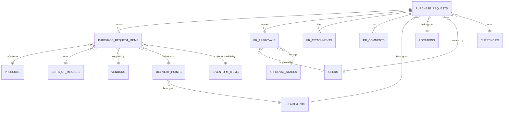

# Data Definition: Purchase Requests

## Module Information
- **Module**: Procurement
- **Sub-Module**: Purchase Requests
- **Database**: Carmen ERP PostgreSQL
- **Schema Version**: 2.4.0
- **Last Updated**: 2025-12-10
- **Owner**: Procurement Team
- **Status**: Active

## Document History
| Version | Date | Author | Changes |
|---------|------|--------|---------|
| 1.1.0 | 2025-12-10 | Documentation Team | Standardized reference number format (XXX-YYMM-NNNN) |
| 1.0.0 | 2025-01-30 | System Architect | Initial SQL-based schema |
| 2.0.0 | 2025-01-01 | Development Team | Converted to text-based DD format + added new fields for 9/7/2025 requirements |
| 2.1.0 | 2025-11-26 | Documentation Team | Synchronized with BR document - updated status values, removed fictional features, added implementation status markers |
| 2.2.0 | 2025-11-28 | Development Team | Added Returned status, return_reason and rejection_reason fields for workflow actions |
| 2.3.0 | 2025-12-03 | Development Team | Added parent_pr_id and split_reason fields for Approver Split capability; added role-based field visibility documentation |
| 2.4.0 | 2025-12-10 | Documentation Team | Synced ref_number format with BR: changed from PR-YYYY-NNNN to PR-YYMM-NNNN |

## Implementation Status

This document defines the **target data model** for Purchase Requests. Each entity and field includes an implementation status marker:

| Status | Meaning |
|--------|---------|
| ✅ Implemented | Data model complete and functional |
| 🔧 Partial | Frontend exists, backend development needed |
| 🚧 Pending | Not yet implemented |
| ⏳ Future | Post-MVP enhancement |

**Current State**: Frontend prototype with mock data. Database schema and API pending development.

---

## Overview

This document defines the complete data model for the Purchase Requests sub-module within the Procurement module. Purchase Requests (PRs) are formal requests submitted by staff members to purchase goods or services for their departments. The data model supports multi-level approval workflows, budget tracking, inventory integration, vendor management, and comprehensive audit trails.

**Key Entities**:
- **PurchaseRequest**: Header information for purchase requests (type, dates, department, totals)
- **PurchaseRequestItem**: Line items with pricing, inventory, and delivery details
- **PRApproval**: Approval workflow tracking and history
- **PRAttachment**: Document and file attachments
- **PRComment**: Comments and discussions with threading
- **DeliveryPoint**: Master data for delivery locations (new)

**Business Processes Supported**:
- Purchase request creation and submission
- Multi-level approval workflows
- Budget validation and tracking
- Inventory availability checking
- Vendor and pricing management
- Role-based data visibility (FOC, pricing)
- Conversion to Purchase Orders

**Related Documents**:
- [Business Requirements](./BR-purchase-requests.md)
- [Technical Specification](./TS-purchase-requests.md)
- [Use Cases](./UC-purchase-requests.md)
- [Flow Diagrams](./FD-purchase-requests.md)
- [Validations](./VAL-purchase-requests.md)

---

## Entity Relationship Diagram



**Relationship Descriptions**:
- **One Purchase Request has many Items**: Each PR can contain multiple line items for different products/services
- **One Purchase Request requires many Approvals**: Approval workflow may have multiple stages and approvers
- **Items reference Products**: Items may link to product catalog or be free-text entries
- **Items reference Vendors**: Each item can specify a preferred vendor/supplier
- **Items reference Delivery Points**: Each item can have a specific delivery location
- **Items check Inventory**: Real-time inventory availability displayed (read-only reference)
- **Delivery Points belong to Departments**: Locations are department-specific for access control

---

## Data Entities

### Entity: PurchaseRequest

**Implementation Status**: 🔧 Partial

**Description**: Represents a formal request submitted by staff to purchase goods or services for their department. The purchase request header contains organizational context, dates, status, approval workflow state, and financial totals.

**Business Purpose**: Centralizes all purchase requisitions, ensures proper approval workflows, maintains budget control, and provides audit trail for procurement activities.

**Data Ownership**: Department that submitted the request; created by requesting staff member

**Access Pattern**: Accessed by reference number (PR-YYMM-NNNN), by department, by status, by date range, by requester, and by approver for workflow tasks

**Data Volume**: Approximately 500-1000 records per month depending on organization size; 6K-12K records per year; archive after 2 years

**Visibility Rules**:
- Requestors see their own PRs and department PRs
- Approvers see PRs pending their approval
- Procurement staff see all PRs for their managed departments
- Finance sees all PRs above approval thresholds

**Field-Level Visibility by Role**:
Legend: ✅ = Editable | 👁️ = Read-only (visible) | ❌ = Hidden

| Field Category | Requestor | Approver | Purchasing Staff |
|----------------|-----------|----------|------------------|
| Request Header (Type, Date, Department) | ✅ | 👁️ | ✅ |
| Item Details (Description, Quantity) | ✅ | 👁️ | ✅ |
| Vendor Selection | ❌ | 👁️ | ✅ |
| Unit Price / Pricing | ❌ | 👁️ | ✅ |
| Approved Quantity | ❌ | ✅ | ✅ |
| Discount | ❌ | 👁️ | ✅ |
| FOC (Free of Charge) | ❌ | 👁️ | ✅ |
| Internal Notes | ✅ | 👁️ | ✅ |
| Budget Code | ❌ | 👁️ | ✅ |

#### Fields Overview

**Primary Identification**:
- **ID Field**: UUID (auto-generated)
- **Business Key**: ref_number - Format: PR-YYMM-NNNN (e.g., PR-2501-0042)
- **Display Name**: ref_number combined with brief description

**Core Business Fields**:
- **Type**: Category of purchase request
  - Required: Yes
  - Allowed values: General, Market List, Asset
  - Default: General
  - Business meaning: Determines approval workflow and processing rules
  - Example: "General" (standard supplies), "Market List" (perishables), "Asset" (capital equipment)

- **Date**: Request creation date
  - Required: Yes
  - Default: Current date
  - Format: YYYY-MM-DD
  - Constraints: Cannot be before 2020-01-01, cannot be more than 30 days in future
  - Example: 2025-01-15

- **Delivery Date**: Expected delivery date for all items
  - Required: Yes
  - Format: YYYY-MM-DD
  - Constraints: Must be >= request date
  - Business rule: Provides planning timeline for procurement
  - Example: 2025-01-22 (one week after request)

**Organizational Context**:
- **Department ID**: Department submitting the request
  - Required: Yes
  - References: departments table
  - Business rule: User must have access to department
  - Used for: Access control, budget allocation, approval routing
  - Example: uuid for "Kitchen Department"

- **Location ID**: Physical location for delivery and inventory allocation
  - Required: Yes
  - References: locations table
  - Constraints: Must belong to selected department
  - Business rule: Determines default currency, delivery addresses
  - Example: uuid for "Main Kitchen - Building A"

**Status and Workflow**:
- **Status**: Current status in PR lifecycle
  - Required: Yes
  - Default: Draft
  - Allowed values: Draft, In-progress, Returned, Approved, Void, Completed, Cancelled
  - Status transitions:
    * Draft → In-progress (when user submits for approval)
    * In-progress → Approved (when all approvals complete)
    * In-progress → Void (when any approver or purchasing staff rejects)
    * In-progress → Returned (when approver/purchaser returns for revision)
    * Returned → In-progress (when requestor resubmits)
    * Draft/Void → Cancelled (user cancels)
    * Approved → Completed (converted to Purchase Order)
  - Status meanings:
    * **Draft**: Saved but not submitted (editable by requestor)
    * **In-progress**: Some approvals received, others pending
    * **Returned**: Returned for revision by approver or purchasing staff (editable by requestor)
    * **Approved**: All approvals received (ready for PO conversion)
    * **Void**: Request rejected by approver or purchasing staff (with reason)
    * **Completed**: Converted to Purchase Order(s) (read-only)
    * **Cancelled**: Manually cancelled by requestor or approver (with reason)
  - Example: "In-progress"

- **Approval Status**: Current approval workflow state
  - Required: No (NULL for Draft status)
  - Allowed values: Pending, Approved, Rejected, Recalled, Returned
  - Business meaning:
    * Pending: Awaiting approval from one or more approvers
    * Approved: All required approvals obtained
    * Rejected: One or more approvers rejected
    * Recalled: Requester recalled for modifications
    * Returned: Sent back to previous stage for revision
  - Example: "Pending"

- **Return Reason**: Reason for returning PR to previous stage
  - Required: No (required when status = Returned)
  - Data type: TEXT
  - Constraints: Minimum 10 characters when provided
  - Business purpose: Documents why PR was returned for revision
  - Example: "Please provide more detailed specifications for item 3"

- **Rejection Reason**: Reason for rejecting/voiding PR
  - Required: No (required when status = Void)
  - Data type: TEXT
  - Constraints: Minimum 10 characters when provided
  - Business purpose: Documents why PR was rejected
  - Example: "Budget exceeded for current fiscal quarter"

- **Current Approval Stage ID**: Reference to current approval stage
  - Required: No (NULL for Draft/Approved/Rejected status)
  - References: approval_stages table
  - Business purpose: Tracks which approval level PR is currently at
  - Example: uuid for "Department Manager Approval"

**Financial Information (Transaction Currency)**:
- **Subtotal**: Sum of all line item totals before tax and discount
  - Required: Yes
  - Default: 0.00
  - Data type: Decimal (15 digits, 2 decimal places)
  - Calculation: Automatically calculated from line items
  - Constraints: Must be >= 0
  - Format: Currency symbol + amount (e.g., $1,234.56)
  - Example: 1500.00

- **Tax Amount**: Total tax amount for all line items
  - Required: Yes
  - Default: 0.00
  - Data type: Decimal (15,2)
  - Calculation: Sum of all line item tax amounts
  - Constraints: Must be >= 0
  - Example: 120.00

- **Discount Amount**: Total discount applied across all items
  - Required: Yes
  - Default: 0.00
  - Data type: Decimal (15,2)
  - Calculation: Sum of all line item discounts
  - Constraints: Must be >= 0
  - Example: 50.00

- **Total Amount**: Final total amount (subtotal + tax - discount)
  - Required: Yes
  - Default: 0.00
  - Data type: Decimal (15,2)
  - Calculation: subtotal + tax_amount - discount_amount
  - Constraints: Must be >= 0
  - Example: 1570.00

- **Currency Code**: ISO 4217 currency code for transaction amounts
  - Required: Yes
  - Default: USD (from location settings)
  - Format: 3-letter uppercase code
  - References: currencies table
  - Examples: USD, EUR, GBP, AED, THB
  - Business rule: Defaults from location's operating currency

**Financial Information (Base Currency)**:
- **Base Subtotal**: Subtotal converted to organization's base currency
  - Required: Yes
  - Default: 0.00
  - Data type: Decimal (15,2)
  - Calculation: subtotal * exchange_rate
  - Purpose: Enables cross-currency reporting and budget tracking

- **Base Tax Amount**: Tax amount in base currency
  - Required: Yes
  - Default: 0.00
  - Data type: Decimal (15,2)
  - Calculation: tax_amount * exchange_rate

- **Base Discount Amount**: Discount in base currency
  - Required: Yes
  - Default: 0.00
  - Data type: Decimal (15,2)
  - Calculation: discount_amount * exchange_rate

- **Base Total Amount**: Total amount in base currency
  - Required: Yes
  - Default: 0.00
  - Data type: Decimal (15,2)
  - Calculation: total_amount * exchange_rate
  - Purpose: Used for budget validation and financial reporting

- **Base Currency Code**: Organization's base currency
  - Required: Yes
  - Default: USD
  - Format: 3-letter ISO code
  - Purpose: Standard currency for all financial reporting

- **Exchange Rate**: Conversion rate from transaction currency to base currency
  - Required: Yes
  - Default: 1.000000
  - Data type: Decimal (15 digits, 6 decimal places)
  - Constraints: Must be > 0
  - Business rule: If currency_code = base_currency_code, rate must be 1.0
  - Example: 1.185432 (EUR to USD conversion)

**Additional Information**:
- **Notes**: Public notes visible to all parties
  - Required: No
  - Data type: Long text (no limit)
  - Purpose: Additional information, special instructions, justification
  - Searchable: Yes (full-text search enabled)
  - Example: "Equipment needed for new menu launch"

- **Internal Notes**: Private notes visible only to requestor and approvers
  - Required: No
  - Data type: Long text
  - Purpose: Internal communication, sensitive information
  - Visibility: Restricted based on user role
  - Example: "Budget code confirmed with Finance Manager"

**Template Information** (⏳ Future):
- **Template ID**: Reference to PR template if created from template
  - Required: No (NULL if created manually)
  - References: pr_templates table
  - Purpose: Tracks template usage, enables repeat orders
  - Implementation: Post-MVP enhancement
  - Example: uuid for "Monthly Kitchen Supplies Template"

- **Parent PR ID**: Reference to original PR if this PR was created via split
  - Required: No (NULL if not a split PR)
  - References: purchase_requests table (self-reference)
  - Purpose: Links split PRs to original PR for traceability
  - Business rule: Set when Approver or Purchasing Staff splits a PR
  - Example: uuid for "PR-2501-0042" (original PR that was split)

- **Split Reason**: Reason for splitting the PR
  - Required: No (required when parent_pr_id is set)
  - Data type: VARCHAR(50)
  - Allowed values: approval_status, vendor, delivery_date, manual
  - Purpose: Documents why PR was split
  - Example: "approval_status" (split to separate approved items from returned items)

**Flexible Data**:
- **Metadata**: Additional flexible data stored as JSON
  - Required: No
  - Default: empty JSON object {}
  - Data type: JSONB
  - Common attributes:
    * approval_comments: Array of approval decision notes
    * custom_fields: Department-specific additional fields
    * integration_data: External system references
  - Example: {"urgency_reason": "event catering", "cost_center": "CC-1234"}

**Audit Fields** (Standard for all entities):
- **Created At**: Record creation timestamp (UTC, immutable)
- **Created By**: User who created the record (UUID reference to users)
- **Updated At**: Last modification timestamp (UTC, auto-updated)
- **Updated By**: User who last modified (UUID reference to users)
- **Version**: Optimistic locking version number, increments on each update
- **Deleted At**: Soft delete timestamp (NULL for active records)
- **Deleted By**: User who deleted the record (NULL for active records)

#### Field Definitions Table

| Field Name | Data Type | Required | Default | Description | Example Values | Constraints |
|-----------|-----------|----------|---------|-------------|----------------|-------------|
| id | UUID | Yes | Auto-generated | Primary key | 550e8400-e29b-41d4-a716-446655440000 | Unique, Non-null |
| ref_number | VARCHAR(50) | Yes | Auto-generated | Business key format PR-YYMM-NNNN | PR-2501-0042 | Unique, Format: PR-YYMM-NNNN |
| type | VARCHAR(20) | Yes | General | PR type category | General, Market List, Asset | Must be in allowed values |
| date | DATE | Yes | Current date | Request creation date | 2025-01-15 | >= 2020-01-01, <= today+30 days |
| delivery_date | DATE | Yes | - | Expected delivery date | 2025-01-22 | >= date field |
| department_id | UUID | Yes | - | Department reference | 550e8400-... | Must exist in departments |
| location_id | UUID | Yes | - | Location reference | 550e8400-... | Must exist in locations, belong to department |
| status | VARCHAR(20) | Yes | Draft | Current PR status | Draft, In-progress, Returned, Approved, Void, Completed, Cancelled | Must be in allowed values |
| approval_status | VARCHAR(20) | No | NULL | Approval workflow status | Pending, Approved, Rejected, Recalled, Returned | Must be in allowed values |
| return_reason | TEXT | No | NULL | Reason for returning PR | "Please provide more details" | Min 10 chars when provided |
| rejection_reason | TEXT | No | NULL | Reason for rejecting PR | "Budget exceeded" | Min 10 chars when provided |
| current_approval_stage_id | UUID | No | NULL | Current approval stage | 550e8400-... | Must exist in approval_stages |
| subtotal | DECIMAL(15,2) | Yes | 0.00 | Sum of line totals | 1500.00 | >= 0, auto-calculated |
| tax_amount | DECIMAL(15,2) | Yes | 0.00 | Total tax | 120.00 | >= 0, auto-calculated |
| discount_amount | DECIMAL(15,2) | Yes | 0.00 | Total discount | 50.00 | >= 0, auto-calculated |
| total_amount | DECIMAL(15,2) | Yes | 0.00 | Final total | 1570.00 | >= 0, calculated |
| currency_code | VARCHAR(3) | Yes | USD | Transaction currency | USD, EUR, GBP | ISO 4217 code |
| base_subtotal | DECIMAL(15,2) | Yes | 0.00 | Subtotal in base currency | 1500.00 | >= 0 |
| base_tax_amount | DECIMAL(15,2) | Yes | 0.00 | Tax in base currency | 120.00 | >= 0 |
| base_discount_amount | DECIMAL(15,2) | Yes | 0.00 | Discount in base currency | 50.00 | >= 0 |
| base_total_amount | DECIMAL(15,2) | Yes | 0.00 | Total in base currency | 1570.00 | >= 0 |
| base_currency_code | VARCHAR(3) | Yes | USD | Base currency | USD | ISO 4217 code |
| exchange_rate | DECIMAL(15,6) | Yes | 1.000000 | Currency conversion rate | 1.185432 | > 0 |
| notes | TEXT | No | NULL | Public notes | "Equipment needed..." | Full-text searchable |
| internal_notes | TEXT | No | NULL | Internal notes | "Budget code confirmed..." | Restricted visibility |
| template_id | UUID | No | NULL | Template reference (⏳ Future) | 550e8400-... | Must exist in pr_templates |
| parent_pr_id | UUID | No | NULL | Reference to original PR if split | 550e8400-... | Must exist in purchase_requests |
| split_reason | VARCHAR(50) | No | NULL | Reason for split | approval_status, vendor | Required when parent_pr_id set |
| metadata | JSONB | No | {} | Flexible data | {"urgency_reason": "..."} | Valid JSON |
| created_at | TIMESTAMPTZ | Yes | NOW() | Creation timestamp | 2025-01-15T10:30:00Z | Immutable |
| created_by | UUID | Yes | - | Creator user reference | 550e8400-... | Must exist in users |
| updated_at | TIMESTAMPTZ | Yes | NOW() | Last update timestamp | 2025-01-15T14:20:00Z | Auto-updated |
| updated_by | UUID | Yes | - | Last modifier reference | 550e8400-... | Must exist in users |
| version | INTEGER | Yes | 1 | Optimistic lock version | 3 | Incremented on update |
| deleted_at | TIMESTAMPTZ | No | NULL | Soft delete timestamp | NULL or timestamp | NULL for active |
| deleted_by | UUID | No | NULL | Deleter user reference | 550e8400-... | NULL for active |

#### Data Constraints and Rules

**Primary Key**:
- Field: `id`
- Type: UUID, auto-generated
- Purpose: Uniquely identifies each purchase request

**Unique Constraints**:
- `ref_number`: Must be unique across all records (including soft-deleted)
  - Format: PR-YYMM-NNNN where YY is 2-digit year, MM is 2-digit month from date field, NNNN is 4-digit sequence
  - Auto-generated using database sequence
  - Example: PR-2501-0001, PR-2506-0042

**Foreign Key Relationships**:
- **Department** (`department_id` → `departments.id`)
  - On Delete: RESTRICT (cannot delete department with active PRs)
  - On Update: CASCADE
  - Business rule: User must have access permission to selected department

- **Location** (`location_id` → `locations.id`)
  - On Delete: RESTRICT (cannot delete location with active PRs)
  - On Update: CASCADE
  - Business rule: Location must belong to selected department

- **User References** (`created_by`, `updated_by`, `deleted_by` → `users.id`)
  - On Delete: SET NULL (preserve records even if user deleted)
  - On Update: CASCADE
  - Business rule: Track accountability and audit trail

- **Currency** (`currency_code`, `base_currency_code` → `currencies.code`)
  - On Delete: RESTRICT (cannot delete currency in use)
  - On Update: CASCADE
  - Business rule: Must be active currency

- **Template** (`template_id` → `pr_templates.id`)
  - On Delete: SET NULL (PR persists even if template deleted)
  - On Update: CASCADE
  - Business rule: Optional tracking of template usage

- **Approval Stage** (`current_approval_stage_id` → `approval_stages.id`)
  - On Delete: SET NULL
  - On Update: CASCADE
  - Business rule: Tracks current approval workflow position

- **Parent PR** (`parent_pr_id` → `purchase_requests.id`)
  - On Delete: SET NULL (split PR persists even if original deleted)
  - On Update: CASCADE
  - Business rule: Links split PRs to their original PR for traceability
  - Constraint: Cannot reference itself (prevents circular references)

**Check Constraints**:
- **Type values**: Must be one of: General, Market List, Asset
- **Status values**: Must be one of: Draft, In-progress, Returned, Approved, Void, Completed, Cancelled
- **Approval status values**: Must be one of: Pending, Approved, Rejected, Recalled, Returned
- **Date validation**: delivery_date >= date
- **Amount validation**: All financial fields (subtotal, tax_amount, discount_amount, total_amount, base amounts) must be >= 0
- **Exchange rate validation**: exchange_rate > 0
- **Currency consistency**: If currency_code = base_currency_code, then exchange_rate must = 1.0
- **Return reason validation**: If status = 'Returned', return_reason must be provided with min 10 characters
- **Rejection reason validation**: If status = 'Void', rejection_reason must be provided with min 10 characters
- **Split reason values**: If parent_pr_id is set, split_reason must be one of: approval_status, vendor, delivery_date, manual
- **Split reason required**: If parent_pr_id is set, split_reason must be provided

**Calculation Rules**:
- `total_amount` = `subtotal` + `tax_amount` - `discount_amount`
- `base_subtotal` = `subtotal` × `exchange_rate`
- `base_tax_amount` = `tax_amount` × `exchange_rate`
- `base_discount_amount` = `discount_amount` × `exchange_rate`
- `base_total_amount` = `total_amount` × `exchange_rate`
- Header totals automatically recalculated when line items change

**Default Values**:
- `type`: General
- `date`: Current date
- `status`: Draft
- All financial amounts: 0.00
- `currency_code`: From location's default currency
- `base_currency_code`: Organization's base currency (USD)
- `exchange_rate`: 1.000000
- `version`: 1
- `metadata`: {}

**Indexing Strategy**:
- Primary index on `id` (automatic)
- Unique index on `ref_number`
- Index on `date` (DESC for recent-first queries)
- Index on `delivery_date`
- Index on `status` (frequent filtering)
- Index on `department_id` (access control)
- Index on `location_id`
- Index on `created_by` (user's PRs)
- Index on `created_at` (DESC for recent-first)
- Index on `approval_status` (workflow queries)
- Composite index on (`department_id`, `status`) for common filtered queries
- Composite index on (`location_id`, `date DESC`)
- Full-text search index on `notes` field

---

### Entity: PurchaseRequestItem

**Implementation Status**: 🔧 Partial

**Description**: Represents individual line items within a purchase request. Each item specifies a product or service to be purchased, including quantity, pricing, vendor information, inventory availability, delivery details, and associated taxes and discounts. Items support both catalog products and free-text descriptions.

**Business Purpose**: Provides detailed specifications for each item being requested, enables accurate cost calculation, facilitates inventory checking, supports vendor selection, and maintains complete pricing breakdown for approval and procurement processes.

**Data Ownership**: Belongs to parent Purchase Request; created by same user who created PR

**Access Pattern**: Accessed via parent PR, filtered by product, sorted by line number

**Data Volume**: Average 3-10 items per PR; approximately 3K-10K items per month

**Visibility Rules**:
- All item details visible to PR creator, approvers, procurement staff
- FOC fields (foc_quantity, foc_unit) hidden from Requestor role, visible to Approver/Procurement/Finance
- Price fields can be hidden by Requestor using hide_price flag; always visible to Approver/Procurement/Finance

#### Fields Overview

**Primary Identification**:
- **ID Field**: UUID (auto-generated)
- **Line Number**: Sequential line number within the purchase request (1, 2, 3, ...)
- **Display Name**: Combination of line number and description

**Product Information**:
- **Product ID**: Reference to product catalog (optional)
  - Required: No (NULL for non-catalog items)
  - References: products table
  - Purpose: Links to master product data for pricing, tax, specifications
  - Example: uuid for "Commercial Blender - Model XYZ"

- **Description**: Item name or description
  - Required: Yes
  - Data type: Long text
  - Purpose: Human-readable item description
  - Searchable: Yes (full-text search)
  - Example: "Commercial Blender - 2L capacity, stainless steel"

- **Specifications**: Detailed technical or quality specifications
  - Required: No
  - Data type: Long text
  - Purpose: Additional details for procurement evaluation
  - Example: "Must be NSF certified, 1200W motor minimum, variable speed control"

**Quantity and Unit of Measure**:
- **Quantity**: Amount being requested
  - Required: Yes
  - Data type: Decimal (15 digits, 3 decimal places)
  - Constraints: Must be > 0
  - Purpose: Quantity to purchase in specified UOM
  - Example: 2.500 (for 2.5 kilograms)

- **Unit of Measure**: Measurement unit for quantity
  - Required: Yes
  - Data type: VARCHAR(20)
  - References: units_of_measure table
  - Examples: EA (each), BOX, KG, L, CASE
  - Business rule: Must be valid UOM from master data
  - Example: "EA"

**Pricing Information** (Enhanced - new fields):
- **Vendor Name**: Supplier or vendor for this item
  - Required: No (optional, but recommended for non-stock items)
  - Data type: VARCHAR(255)
  - Purpose: Identifies supplier for procurement
  - Source: Can link to vendor master data or free-text entry
  - Example: "ABC Hospitality Supplies Inc."

- **Unit Price** (renamed from price_per_unit): Cost per single unit
  - Required: Yes
  - Default: 0.00
  - Data type: Decimal (15 digits, 2 decimal places)
  - Constraints: Must be >= 0
  - Format: Currency with 2 decimals ($25.50)
  - Purpose: Base price before discount and tax
  - Example: 25.50

- **Discount Amount**: Total discount applied to this line item
  - Required: Yes
  - Default: 0.00
  - Data type: Decimal (15,2)
  - Constraints: Must be >= 0 and <= (unit_price × quantity)
  - Calculation: Can be calculated from discount_percentage or entered directly
  - Format: Currency with 2 decimals
  - Example: 5.00 (if 10% discount on $50 subtotal)

- **Discount Percentage**: Percentage discount rate (optional, for reference)
  - Required: No
  - Default: 0.00
  - Data type: Decimal (5,2)
  - Constraints: >= 0 and <= 100
  - Purpose: Reference value, discount_amount takes precedence
  - Example: 10.00 (for 10% discount)

- **Net Amount**: Amount after discount, before tax (NEW FIELD)
  - Required: Yes
  - Default: 0.00
  - Data type: Decimal (15,2)
  - Calculation: (unit_price × quantity) - discount_amount
  - Format: Currency with 2 decimals
  - Read-only: Yes (auto-calculated)
  - Example: 45.00

**Tax Information**:
- **Tax Rate**: Applicable tax percentage
  - Required: Yes
  - Default: 0.00
  - Data type: Decimal (5,2)
  - Constraints: >= 0 and <= 100
  - Source: Defaulted from product tax code or location tax rules
  - Example: 8.00 (for 8% sales tax)

- **Tax Amount**: Calculated tax for this line
  - Required: Yes
  - Default: 0.00
  - Data type: Decimal (15,2)
  - Calculation: net_amount × (tax_rate / 100)
  - Format: Currency with 2 decimals
  - Read-only: Yes (auto-calculated)
  - Example: 3.60

**Line Totals** (Enhanced):
- **Line Total**: Subtotal before discount and tax (original calculation)
  - Required: Yes
  - Default: 0.00
  - Data type: Decimal (15,2)
  - Calculation: unit_price × quantity
  - Format: Currency with 2 decimals
  - Example: 50.00

- **Total Amount**: Final line total including tax (NEW FIELD)
  - Required: Yes
  - Default: 0.00
  - Data type: Decimal (15,2)
  - Calculation: net_amount + tax_amount
  - Format: Currency with 2 decimals
  - Read-only: Yes (auto-calculated)
  - Example: 48.60

**Inventory Integration** (NEW FIELDS):
- **On Hand**: Current inventory quantity available (read-only)
  - Required: No (NULL if inventory system unavailable or non-stock item)
  - Data type: Integer
  - Source: Real-time query to Inventory Management System API
  - Display: Integer with comma separators (e.g., "1,250")
  - Refresh: On item selection, cached for 5 minutes
  - Purpose: Informs user of current stock levels
  - Example: 150

- **On Order**: Quantity currently on order from suppliers (read-only)
  - Required: No (NULL if data unavailable)
  - Data type: Integer
  - Source: Real-time query to Purchase Order System API
  - Display: Integer with comma separators
  - Purpose: Shows incoming stock to inform purchasing decision
  - Example: 50

**Item Metadata** (NEW FIELDS):
- **Comment**: Additional notes or special instructions for this item
  - Required: No
  - Data type: VARCHAR(500)
  - Constraints: Maximum 500 characters
  - Purpose: Item-specific delivery instructions, handling notes, preferences
  - Example: "Deliver to back kitchen entrance, handle with care"

- **Required Date**: Date by which this specific item is needed
  - Required: No
  - Data type: DATE
  - Format: YYYY-MM-DD
  - Constraints: Must be >= current date
  - Purpose: Item-level delivery requirement, may differ from PR delivery_date
  - Example: 2025-01-20

- **Delivery Point**: Specific delivery location for this item
  - Required: No
  - Data type: UUID
  - References: delivery_points table
  - Purpose: Item-level delivery location (may differ per item within same PR)
  - Display: Shows delivery point code and name in dropdown
  - Example: uuid for "Main Kitchen - Loading Dock"

- **Delivery Point Label**: Human-readable delivery location name
  - Required: No
  - Data type: VARCHAR(100)
  - Purpose: Stores display name of selected delivery point for quick reference
  - Auto-populated: From delivery_points.name when delivery_point selected
  - Example: "Main Kitchen - Loading Dock"

**FOC (Free of Charge) Information**:
- **FOC Quantity**: Quantity received free of charge
  - Required: No
  - Data type: Decimal (15,3)
  - Constraints: >= 0
  - Business rule: When FOC quantity > 0, unit_price automatically set to 0
  - Visibility: Hidden from Requestor role, visible to Approver/Procurement/Finance
  - Purpose: Tracks promotional items or supplier bonuses
  - Example: 5.000 (5 units free)

- **FOC Unit**: Unit of measure for FOC quantity
  - Required: No (required if foc_quantity > 0)
  - Data type: VARCHAR(20)
  - References: units_of_measure table
  - Purpose: May differ from order UOM (e.g., order in KG, get BOX free)
  - Visibility: Hidden from Requestor role
  - Example: "BOX"

**Visibility Controls** (NEW FIELD):
- **Hide Price**: Flag to hide pricing details for this item
  - Required: Yes
  - Default: false
  - Data type: Boolean
  - Purpose: Allows Requestor to hide price fields for focus on item selection
  - Scope: Per-item setting
  - Affected fields: When true, hides vendor_name, unit_price, discount_amount, net_amount, tax_amount, total_amount
  - Override: Approver/Procurement/Finance roles always see prices regardless of this flag
  - Example: false

**Budget Information**:
- **Budget Code**: Budget allocation code
  - Required: No
  - Data type: VARCHAR(50)
  - Purpose: Links to budget tracking system
  - Example: "BUD-2025-KITCHEN-001"

- **Cost Center**: Cost center for accounting
  - Required: No
  - Data type: VARCHAR(50)
  - Purpose: Financial reporting and cost allocation
  - Example: "CC-1234"

- **GL Account**: General ledger account code
  - Required: No
  - Data type: VARCHAR(50)
  - Purpose: Accounting integration
  - Example: "GL-5100-SUPPLIES"

**Additional Information**:
- **Notes**: Item-specific notes (separate from comment field)
  - Required: No
  - Data type: Long text
  - Purpose: Additional information, procurement notes
  - Searchable: Yes
  - Example: "Preferred brand: KitchenAid, alternative acceptable if unavailable"

**Flexible Data**:
- **Metadata**: Additional flexible data stored as JSON
  - Required: No
  - Default: {}
  - Data type: JSONB
  - Common attributes:
    * product_attributes: Custom product properties
    * procurement_notes: Internal procurement team notes
    * approval_adjustments: Price override history
  - Example: {"preferred_supplier": "ABC Corp", "substitute_ok": true}

**Audit Fields** (Standard):
- **Created At**: Record creation timestamp (UTC, immutable)
- **Created By**: User who created the item (UUID reference to users)
- **Updated At**: Last modification timestamp (UTC, auto-updated)
- **Updated By**: User who last modified (UUID reference to users)
- **Deleted At**: Soft delete timestamp (NULL for active items)
- **Deleted By**: User who deleted the item (NULL for active items)

#### Field Definitions Table

| Field Name | Data Type | Required | Default | Description | Example Values | Constraints |
|-----------|-----------|----------|---------|-------------|----------------|-------------|
| id | UUID | Yes | Auto-generated | Primary key | 550e8400-... | Unique, Non-null |
| purchase_request_id | UUID | Yes | - | Parent PR reference | 550e8400-... | Must exist in purchase_requests |
| product_id | UUID | No | NULL | Product catalog reference | 550e8400-... | Must exist in products if provided |
| line_number | INTEGER | Yes | - | Sequential line number | 1, 2, 3 | > 0, unique within PR |
| description | TEXT | Yes | - | Item description | "Commercial Blender..." | Non-empty |
| specifications | TEXT | No | NULL | Technical specifications | "NSF certified..." | - |
| quantity | DECIMAL(15,3) | Yes | - | Quantity to purchase | 2.500 | > 0 |
| unit_of_measure | VARCHAR(20) | Yes | - | Unit code | EA, KG, BOX, L | Must exist in UOM table |
| vendor_name | VARCHAR(255) | No | NULL | Supplier/vendor name | "ABC Hospitality Supplies" | - |
| unit_price | DECIMAL(15,2) | Yes | 0.00 | Price per unit | 25.50 | >= 0 |
| discount_amount | DECIMAL(15,2) | Yes | 0.00 | Total discount for line | 5.00 | >= 0, <= (unit_price × quantity) |
| discount_percentage | DECIMAL(5,2) | No | 0.00 | Discount rate % | 10.00 | >= 0, <= 100 |
| net_amount | DECIMAL(15,2) | Yes | 0.00 | Amount after discount | 45.00 | >= 0, auto-calc |
| tax_profile | VARCHAR(20) | No | 'VAT' | Tax profile code | VAT, GST, SST, WHT, None | Must be valid tax profile |
| tax_rate | DECIMAL(5,2) | Yes | 0.00 | Tax percentage from profile | 7.00 | >= 0, <= 100, auto-set from profile |
| tax_amount | DECIMAL(15,2) | Yes | 0.00 | Calculated tax | 3.60 | >= 0, auto-calc |
| tax_amount_override | DECIMAL(15,2) | No | NULL | Manual tax override | 4.00 | >= 0, overrides calculated |
| discount_amount_override | DECIMAL(15,2) | No | NULL | Manual discount override | 10.00 | >= 0, overrides calculated |
| currency_code | VARCHAR(3) | No | 'USD' | ISO currency code | USD, EUR, GBP, THB | Must be valid currency |
| exchange_rate | DECIMAL(15,6) | No | 1.000000 | Currency exchange rate | 1.000000 | > 0 |
| line_total | DECIMAL(15,2) | Yes | 0.00 | Subtotal (price × qty) | 50.00 | >= 0, auto-calc |
| total_amount | DECIMAL(15,2) | Yes | 0.00 | Final line total | 48.60 | >= 0, auto-calc |
| on_hand | INTEGER | No | NULL | Current inventory | 150 | Read-only, from inventory API |
| on_order | INTEGER | No | NULL | Quantity on order | 50 | Read-only, from PO API |
| comment | VARCHAR(500) | No | NULL | Item instructions | "Deliver to back entrance" | Max 500 characters |
| required_date | DATE | No | NULL | Item needed by date | 2025-01-20 | >= current_date |
| delivery_point | UUID | No | NULL | Delivery location ID | 550e8400-... | Must exist in delivery_points |
| delivery_point_label | VARCHAR(100) | No | NULL | Delivery location name | "Main Kitchen - Dock" | Auto-populated from delivery_points |
| foc_quantity | DECIMAL(15,3) | No | NULL | Free of charge quantity | 5.000 | >= 0 |
| foc_unit | VARCHAR(20) | No | NULL | FOC unit of measure | BOX | Must exist in UOM table |
| hide_price | BOOLEAN | Yes | false | Hide pricing flag | true, false | - |
| budget_code | VARCHAR(50) | No | NULL | Budget allocation | "BUD-2025-..." | - |
| cost_center | VARCHAR(50) | No | NULL | Cost center code | "CC-1234" | - |
| gl_account | VARCHAR(50) | No | NULL | GL account code | "GL-5100-..." | - |
| notes | TEXT | No | NULL | Additional notes | "Preferred brand..." | Searchable |
| metadata | JSONB | No | {} | Flexible data | {"preferred_supplier": ...} | Valid JSON |
| created_at | TIMESTAMPTZ | Yes | NOW() | Creation timestamp | 2025-01-15T10:30:00Z | Immutable |
| created_by | UUID | Yes | - | Creator reference | 550e8400-... | Must exist in users |
| updated_at | TIMESTAMPTZ | Yes | NOW() | Update timestamp | 2025-01-15T14:20:00Z | Auto-updated |
| updated_by | UUID | Yes | - | Modifier reference | 550e8400-... | Must exist in users |
| deleted_at | TIMESTAMPTZ | No | NULL | Soft delete timestamp | NULL or timestamp | NULL for active |
| deleted_by | UUID | No | NULL | Deleter reference | NULL or uuid | NULL for active |

#### Data Constraints and Rules

**Primary Key**:
- Field: `id`
- Type: UUID, auto-generated
- Purpose: Uniquely identifies each line item

**Unique Constraints**:
- Combination of (`purchase_request_id`, `line_number`) must be unique
  - Ensures sequential, non-duplicate line numbers within each PR
  - Line numbers are 1-based and sequential

**Foreign Key Relationships**:
- **Purchase Request** (`purchase_request_id` → `purchase_requests.id`)
  - On Delete: CASCADE (deleting PR deletes all items)
  - On Update: CASCADE
  - Business rule: Item cannot exist without parent PR

- **Product** (`product_id` → `products.id`)
  - On Delete: SET NULL (preserve item even if product deleted from catalog)
  - On Update: CASCADE
  - Business rule: Optional link to product master

- **Unit of Measure** (`unit_of_measure`, `foc_unit` → `units_of_measure.code`)
  - On Delete: RESTRICT (cannot delete UOM in use)
  - On Update: CASCADE
  - Business rule: Must be valid UOM from master data

- **Delivery Point** (`delivery_point` → `delivery_points.id`)
  - On Delete: SET NULL (item remains, delivery point reference removed)
  - On Update: CASCADE
  - Business rule: Must be active delivery point in user's department

- **User References** (`created_by`, `updated_by`, `deleted_by` → `users.id`)
  - On Delete: SET NULL
  - On Update: CASCADE
  - Business rule: Audit trail preservation

**Check Constraints**:
- **Quantity**: Must be > 0
- **Unit Price**: Must be >= 0
- **Line Total**: Must be >= 0
- **Discount Amount**: Must be >= 0 AND <= (unit_price × quantity)
- **Discount Percentage**: Must be >= 0 AND <= 100
- **Tax Rate**: Must be >= 0 AND <= 100
- **Tax Amount**: Must be >= 0
- **Net Amount**: Must be >= 0
- **Total Amount**: Must be >= 0
- **Line Number**: Must be > 0
- **FOC Quantity**: Must be >= 0 (if not NULL)
- **Required Date**: Must be >= current_date (if not NULL)
- **Comment**: Maximum 500 characters
- **FOC Business Rule**: If foc_quantity > 0, then foc_unit must not be NULL

**Calculation Rules**:
- `line_total` = `unit_price` × `quantity`
- `discount_amount` = IF `discount_amount_override` IS NOT NULL THEN `discount_amount_override` ELSE (`unit_price` × `quantity`) × (`discount_percentage` / 100)
- `net_amount` = (`unit_price` × `quantity`) - `discount_amount`
- `tax_amount` = IF `tax_amount_override` IS NOT NULL THEN `tax_amount_override` ELSE `net_amount` × (`tax_rate` / 100)
- `total_amount` = `net_amount` + `tax_amount`
- When FOC quantity > 0, `unit_price` automatically set to 0.00
- `tax_rate` auto-populated from `tax_profile` lookup (VAT=7%, GST=10%, SST=6%, WHT=3%, None=0%)

**Tax Profile Defaults**:
| Profile | Rate | Description |
|---------|------|-------------|
| VAT | 7% | Value Added Tax |
| GST | 10% | Goods and Services Tax |
| SST | 6% | Sales and Service Tax |
| WHT | 3% | Withholding Tax |
| None | 0% | No Tax Applied |

**Visibility Rules**:
- **FOC Fields** (`foc_quantity`, `foc_unit`):
  - Hidden from: Requestor role
  - Visible to: Approver, Procurement, Finance roles
  - Implementation: CSS display:none based on user role
  - Data storage: Always saved to database regardless of visibility

- **Price Fields** (`vendor_name`, `unit_price`, `discount_amount`, `net_amount`, `tax_amount`, `total_amount`):
  - Can be hidden: By Requestor role when hide_price = true
  - Always visible: Approver, Procurement, Finance roles (override hide_price flag)
  - Implementation: Conditional rendering based on hide_price flag AND user role
  - Data storage: Always saved regardless of visibility

**Edit Permissions by Role** (in Edit Mode):

| Field | Requestor | Approver | Purchasing Staff |
|-------|-----------|----------|------------------|
| vendor_name | Read-only | Read-only | Editable |
| currency_code | Read-only | Read-only | Editable |
| exchange_rate | Read-only | Read-only | Editable |
| unit_price | Read-only | Read-only | Editable |
| discount_percentage | Read-only | Read-only | Editable |
| discount_amount_override | Hidden | Hidden | Editable |
| tax_profile | Read-only | Read-only | Editable |
| tax_rate | Read-only | Read-only | Read-only (auto from profile) |
| tax_amount_override | Hidden | Hidden | Editable |
| foc_quantity | Hidden | Hidden | Editable |
| quantity (approved) | Read-only | Editable | Editable |
| delivery_point | Editable | Editable | Editable |

**Tax Profile Auto-Population Logic**:
When `tax_profile` is changed by purchasing staff:
1. System retrieves tax rate from tax_profiles configuration table
2. System auto-sets `tax_rate` to the profile's default rate
3. Tax rate field remains read-only (cannot be manually overridden)
4. User can override calculated `tax_amount` using `tax_amount_override` field

**Default Values**:
- All monetary amounts: 0.00
- `hide_price`: false
- `discount_percentage`: 0.00
- `tax_rate`: 0.00 (may be auto-populated from product or location tax rules)
- `metadata`: {}

**Auto-Populated Fields**:
- `on_hand`: Retrieved from Inventory Management System API when product selected
- `on_order`: Retrieved from Purchase Order System API when product selected
- `delivery_point_label`: Auto-filled from delivery_points.name when delivery_point selected
- `tax_rate`: Auto-filled from product.tax_rate or location tax rules when product selected
- `unit_price`: Auto-filled from product.price or price list when product selected (if adjust flag unchecked)

**Indexing Strategy**:
- Primary index on `id`
- Index on `purchase_request_id` (foreign key, frequent joins)
- Index on `product_id` (product-based queries)
- Composite index on (`purchase_request_id`, `line_number`) for ordered item retrieval
- Full-text search index on `description` field
- Index on `created_by`, `created_at` for audit queries

---

### Entity: DeliveryPoint

**Implementation Status**: 🚧 Pending

**Description**: Master data table storing valid delivery locations for purchase request items. Delivery points represent specific physical locations where purchased items can be delivered, such as loading docks, kitchen entrances, storage rooms, or department-specific locations.

**Business Purpose**: Provides standardized, validated delivery locations to ensure accurate routing of deliveries. Enables department-specific location control and supports item-level delivery point selection in purchase requests.

**Data Ownership**: Managed by Department Managers and Procurement staff

**Access Pattern**: Accessed for dropdown selection in PR item entry, filtered by department

**Data Volume**: Approximately 50-200 delivery points per organization depending on size and locations

#### Fields Overview

**Primary Identification**:
- **ID Field**: UUID (auto-generated)
- **Code**: Short, unique code for the delivery point
- **Display Name**: Combination of code and name (e.g., "DOCK-A - Main Kitchen Loading Dock")

**Core Fields**:
- **Code**: Short identifier code
  - Required: Yes
  - Data type: VARCHAR(20)
  - Format: Uppercase alphanumeric with hyphens
  - Unique: Yes (within active records)
  - Example: "DOCK-A", "KITCHEN-MAIN", "STORE-B1"

- **Name**: Full descriptive name
  - Required: Yes
  - Data type: VARCHAR(100)
  - Purpose: Human-readable location description
  - Example: "Main Kitchen - Loading Dock A"

- **Description**: Additional details about the location
  - Required: No
  - Data type: TEXT
  - Purpose: Directions, access instructions, special notes
  - Example: "Located at back of building, accessible from service road, code required for gate access"

**Address Information**:
- **Address**: Physical address or location description
  - Required: No
  - Data type: VARCHAR(500)
  - Purpose: Complete address or building/floor/room location
  - Example: "Building A, Ground Floor, North Loading Dock"

**Organizational Context**:
- **Department ID**: Department that owns/uses this delivery point
  - Required: Yes
  - References: departments table
  - Purpose: Access control - only users from this department can select this delivery point
  - Example: uuid for "Kitchen Department"

**Status**:
- **Active Flag**: Whether delivery point is currently active
  - Required: Yes
  - Default: true
  - Data type: Boolean
  - Purpose: Inactive delivery points hidden from dropdown selections
  - Example: true

**Audit Fields**:
- **Created At**: Creation timestamp
- **Created By**: Creator user reference
- **Updated At**: Last update timestamp
- **Updated By**: Last modifier reference
- **Deleted At**: Soft delete timestamp (NULL for active)

#### Field Definitions Table

| Field Name | Data Type | Required | Default | Description | Example Values | Constraints |
|-----------|-----------|----------|---------|-------------|----------------|-------------|
| id | UUID | Yes | Auto-generated | Primary key | 550e8400-... | Unique, Non-null |
| code | VARCHAR(20) | Yes | - | Short location code | DOCK-A, KITCHEN-MAIN | Unique among active |
| name | VARCHAR(100) | Yes | - | Full location name | "Main Kitchen - Loading Dock" | Non-empty |
| description | TEXT | No | NULL | Location details | "Located at back..." | - |
| address | VARCHAR(500) | No | NULL | Physical address | "Building A, Ground Floor..." | - |
| department_id | UUID | Yes | - | Owner department | 550e8400-... | Must exist in departments |
| active_flag | BOOLEAN | Yes | true | Active status | true, false | - |
| created_at | TIMESTAMPTZ | Yes | NOW() | Creation timestamp | 2025-01-15T10:00:00Z | Immutable |
| created_by | UUID | Yes | - | Creator reference | 550e8400-... | Must exist in users |
| updated_at | TIMESTAMPTZ | Yes | NOW() | Update timestamp | 2025-01-15T10:00:00Z | Auto-updated |
| updated_by | UUID | Yes | - | Modifier reference | 550e8400-... | Must exist in users |
| deleted_at | TIMESTAMPTZ | No | NULL | Soft delete timestamp | NULL or timestamp | NULL for active |

#### Data Constraints and Rules

**Primary Key**:
- Field: `id`
- Type: UUID, auto-generated
- Purpose: Uniquely identifies each delivery point

**Unique Constraints**:
- `code`: Must be unique among active (non-deleted) delivery points
  - Allows code reuse after soft delete
  - Case-insensitive uniqueness

**Foreign Key Relationships**:
- **Department** (`department_id` → `departments.id`)
  - On Delete: RESTRICT (cannot delete department with active delivery points)
  - On Update: CASCADE
  - Business rule: Delivery point belongs to specific department for access control

**Check Constraints**:
- `code`: Must be non-empty, alphanumeric with hyphens only
- `name`: Must be non-empty string

**Business Rules**:
- Only active delivery points (`active_flag` = true AND `deleted_at` IS NULL) appear in dropdowns
- Users can only select delivery points from their accessible departments
- Code format recommended: LOCATION-IDENTIFIER (e.g., DOCK-A, KITCHEN-1)

**Indexing Strategy**:
- Primary index on `id`
- Unique index on `code` (where deleted_at IS NULL)
- Index on `department_id` (for filtered dropdown queries)
- Index on `active_flag` (for active-only filtering)
- Index on (`department_id`, `active_flag`) composite for common queries

---

### Entity: PRApproval

**Implementation Status**: 🔧 Partial

**Description**: Tracks approval workflow records for each purchase request. Each approval record represents one approval stage in the workflow chain, including the assigned approver, current status, and decision comments.

**Business Purpose**: Manages multi-level approval workflows, ensures proper authorization before procurement, provides audit trail of all approval decisions.

**Data Ownership**: System-generated based on approval workflow rules; decisions recorded by approvers

**Access Pattern**: Accessed by approver to see pending approvals, by PR to show approval history

**Data Volume**: Typically 1-5 approval records per PR depending on amount and approval workflow configuration

#### Fields Overview

**Primary Identification**:
- **ID Field**: UUID (auto-generated)

**Core Relationships**:
- **Purchase Request ID**: Reference to parent PR
- **Approval Stage ID**: Reference to approval workflow stage
- **Approver ID**: User assigned to approve at this stage

**Approval Information**:
- **Status**: Current approval status
  - Allowed values: Pending, Approved, Rejected, Skipped, Recalled
- **Sequence Number**: Order in approval chain (1, 2, 3, ...)
- **Comments**: Approver's decision comments (minimum 10 characters required for rejection)
- **Approved At**: Timestamp when approved
- **Rejected At**: Timestamp when rejected
- **Notified At**: When approver was first notified

**Delegation** (⏳ Future):
- Delegation support mentioned in BR but detailed implementation is post-MVP

#### Field Definitions Table

| Field Name | Data Type | Required | Default | Description | Example Values | Constraints |
|-----------|-----------|----------|---------|-------------|----------------|-------------|
| id | UUID | Yes | Auto-generated | Primary key | 550e8400-... | Unique |
| purchase_request_id | UUID | Yes | - | Parent PR | 550e8400-... | Must exist in purchase_requests |
| approval_stage_id | UUID | Yes | - | Workflow stage | 550e8400-... | Must exist in approval_stages |
| approver_id | UUID | Yes | - | Assigned approver | 550e8400-... | Must exist in users |
| status | VARCHAR(20) | Yes | Pending | Approval status | Pending, Approved, Rejected | Must be in allowed values |
| sequence_number | INTEGER | Yes | - | Order in chain | 1, 2, 3 | > 0 |
| comments | TEXT | No | NULL | Decision comments | "Approved for budget..." | Min 10 chars for rejection |
| approved_at | TIMESTAMPTZ | No | NULL | Approval timestamp | 2025-01-15T14:00:00Z | - |
| rejected_at | TIMESTAMPTZ | No | NULL | Rejection timestamp | NULL | - |
| notified_at | TIMESTAMPTZ | No | NULL | First notification | 2025-01-15T10:00:00Z | - |
| metadata | JSONB | No | {} | Flexible data | {} | Valid JSON |
| created_at | TIMESTAMPTZ | Yes | NOW() | Creation timestamp | 2025-01-15T10:00:00Z | Immutable |
| created_by | UUID | Yes | - | Creator reference | 550e8400-... | Must exist in users |
| updated_at | TIMESTAMPTZ | Yes | NOW() | Update timestamp | 2025-01-15T14:00:00Z | Auto-updated |
| updated_by | UUID | Yes | - | Modifier reference | 550e8400-... | Must exist in users |

(Additional entities PRAttachment and PRComment abbreviated for space - follow same text-based descriptive format)

---

## Relationships Between Entities

### PurchaseRequest → PurchaseRequestItem
- **Type**: One-to-Many
- **Relationship**: One purchase request contains multiple line items
- **Cardinality**: 1:N (minimum 1 item per PR)
- **Delete Behavior**: CASCADE (deleting PR deletes all items)
- **Business Rule**: PR must have at least one item to be submitted

### PurchaseRequest → PRApproval
- **Type**: One-to-Many
- **Relationship**: One purchase request may require multiple approvals
- **Cardinality**: 1:N (0 to many approvals)
- **Delete Behavior**: CASCADE
- **Business Rule**: Approval records created automatically based on PR amount and type

### PurchaseRequestItem → Product
- **Type**: Many-to-One (optional)
- **Relationship**: Item may reference catalog product
- **Cardinality**: N:1 (optional)
- **Delete Behavior**: SET NULL
- **Business Rule**: Product reference is optional; item persists even if product deleted

### PurchaseRequestItem → DeliveryPoint
- **Type**: Many-to-One (optional)
- **Relationship**: Item may specify delivery location
- **Cardinality**: N:1 (optional)
- **Delete Behavior**: SET NULL
- **Business Rule**: Delivery point must be active and in user's accessible departments

### PurchaseRequestItem → Vendor
- **Type**: Many-to-One (optional, via vendor_name)
- **Relationship**: Item may reference vendor for sourcing
- **Cardinality**: N:1 (optional)
- **Business Rule**: Vendor name can be free-text or linked to vendor master

### DeliveryPoint → Department
- **Type**: Many-to-One
- **Relationship**: Delivery points belong to departments
- **Cardinality**: N:1
- **Delete Behavior**: RESTRICT
- **Business Rule**: Department controls access to delivery points

---

## Calculation and Business Rules Summary

### Amount Calculations (Item Level)
```
line_total = unit_price × quantity
net_amount = (unit_price × quantity) - discount_amount
tax_amount = net_amount × (tax_rate / 100)
total_amount = net_amount + tax_amount
```

### Amount Calculations (PR Header Level)
```
subtotal = SUM(all items: line_total)
tax_amount = SUM(all items: tax_amount)
discount_amount = SUM(all items: discount_amount)
total_amount = subtotal + tax_amount - discount_amount
```

### Currency Conversion
```
base_subtotal = subtotal × exchange_rate
base_tax_amount = tax_amount × exchange_rate
base_discount_amount = discount_amount × exchange_rate
base_total_amount = total_amount × exchange_rate
```

### Visibility Rules

**FOC Fields** (`foc_quantity`, `foc_unit`):
- **Hidden from**: Requestor role
- **Visible to**: Approver, Procurement, Finance roles
- **Implementation**: UI layer controls visibility; data always saved to database
- **Purpose**: Prevents requestors from creating FOC items; allows approvers/procurement to manage supplier promotions

**Price Fields** (`vendor_name`, `unit_price`, `discount_amount`, `net_amount`, `tax_amount`, `total_amount`):
- **Can be hidden**: Requestor can set hide_price = true to hide from their own view
- **Always visible**: Approver, Procurement, Finance roles see all prices regardless of hide_price flag
- **Implementation**: Conditional rendering based on hide_price flag AND user role check
- **Purpose**: Allows requestors to focus on item selection without price influence; approvers always review pricing

---

## Data Integrity and Constraints

### Referential Integrity
- All foreign keys enforced at database level
- Cascade deletes for dependent data (PR items when PR deleted)
- Restrict deletes for master data (departments, locations, currencies)
- SET NULL for optional references (product, vendor, delivery point)

### Data Validation
- All monetary amounts must be >= 0 and have exactly 2 decimal places
- All percentages must be between 0 and 100
- Dates must follow logical sequence (delivery_date >= date, required_date >= current_date)
- Status transitions follow defined workflow:
  * Draft → In-progress (submission)
  * In-progress → Approved (all approvals complete)
  * In-progress → Void (rejected)
  * Approved → Completed (PO conversion)
  * Draft/Void → Cancelled (user cancellation)
- Unique business keys enforced (PR ref_number, line numbers within PR, delivery point codes)

### Audit Trail
- All entities include created_at, created_by, updated_at, updated_by
- Soft delete maintains historical data (deleted_at, deleted_by)
- Activity logging captures all changes to PR headers
- Version field supports optimistic locking

---

## Indexing and Performance

### Primary Indexes
- All tables have UUID primary key with automatic index
- Unique indexes on business keys (ref_number, line numbers, delivery point codes)

### Foreign Key Indexes
- All foreign key fields indexed for join performance
- Includes: department_id, location_id, product_id, approver_id, etc.

### Composite Indexes
- (department_id, status) for filtered PR lists
- (location_id, date DESC) for location-based recent PRs
- (purchase_request_id, line_number) for ordered item retrieval
- (department_id, active_flag) for delivery point dropdowns

### Full-Text Search Indexes
- PR notes field (full-text search)
- Item description field (product search)
- Comment text field (comment search)

### Query Optimization Strategies
- Use views for complex joins (purchase_requests_with_details)
- Implement pagination for large result sets
- Cache inventory API results for 5 minutes
- Use EXPLAIN ANALYZE for slow query optimization

---

## Security and Access Control

### Row Level Security (RLS)
- Users can view PRs from their accessible departments/locations
- Users can insert PRs only for their accessible departments
- Users can update only their own Draft or Rejected PRs
- Approvers can update only their assigned approval records with Pending status

### Data Encryption
- Sensitive fields can be encrypted at application level
- Database connections use SSL/TLS
- Passwords and secrets stored using pgcrypto

### Audit and Compliance
- Complete audit trail with user, timestamp for all changes
- Activity log captures detailed change history
- Soft delete preserves all historical data
- Version control prevents lost updates

---

## Data Archival and Retention

### Archival Strategy
- Archive PRs older than 2 years with status Converted or Cancelled
- Move to separate archive table (purchase_requests_archive)
- Soft delete from main table after archival
- Maintain archive for 7 years for compliance

### Backup Strategy
- Daily incremental backups of all PR tables
- Weekly full database backups
- Point-in-time recovery enabled with WAL archiving
- Monthly backup restore tests

---

## Related Technical Specifications

### Database Technology
- **DBMS**: PostgreSQL 14+
- **Extensions**: uuid-ossp (UUID generation), pgcrypto (encryption)
- **Features**: Row Level Security, JSONB, Full-Text Search, Triggers, Views

### Integration Points
- **Inventory Management System**: Real-time API for on_hand and on_order quantities
- **Purchase Order System**: Real-time API for on_order data
- **Budget System**: Budget validation during PR submission
- **Vendor Management**: Vendor master data for vendor_name lookup
- **Approval Workflow Engine**: Determines approval routing based on PR amount and type
- **Notification Service**: Email/SMS notifications for approvers

### Performance Targets
- PR list query: < 200ms for 100 records
- PR detail load: < 300ms with all items and approvals
- Item entry with inventory check: < 500ms including API calls
- Approval decision save: < 200ms
- Full-text search: < 500ms across 50K PRs

---

**Document Control**:
- **Created**: 2025-01-30 (Original DS version)
- **Converted to DD**: 2025-01-01
- **Last Synchronized with BR**: 2025-11-26
- **Author**: Development Team
- **Reviewed By**: Database Administrator, Security Team, Procurement Team
- **Next Review**: 2026-02-01
- **Status**: Active - Synchronized with BR-purchase-requests.md
