# FD-PR-001: Purchase Requests Flow Diagrams

**Module**: Procurement
**Sub-Module**: Purchase Requests
**Document Type**: Flow Diagrams (FD)
**Version**: 1.9.0
**Last Updated**: 2025-12-17
**Status**: Active

## Document History

| Version | Date | Author | Changes |
|---------|------|--------|---------|
| 1.0.0 | 2025-11-19 | Documentation Team | Initial version |
| 1.1.0 | 2025-11-26 | Documentation Team | Synchronized with BR - updated status values, added implementation status markers |
| 1.2.0 | 2025-11-28 | Development Team | Added 2.7: Purchasing Staff Edit Mode - Vendor Pricing Flow with calculation detail |
| 1.3.0 | 2025-11-28 | Development Team | Added 2.8: Workflow Action Buttons Flow with role-based button matrix |
| 1.4.0 | 2025-11-28 | Development Team | Updated 2.3: Edit Purchase Request flow to include Returned status as editable |
| 1.5.0 | 2025-11-28 | Development Team | Added 2.9: Bulk Item Actions Flow for line-item level bulk operations |
| 1.6.0 | 2025-11-28 | Development Team | Added 2.10: Budget Tab CRUD Flow for budget allocation management |
| 1.7.0 | 2025-12-03 | Development Team | Updated 2.9.5: Split Items Flow - Approvers can now split PR by approval status; Added Approver Split Workflow |
| 1.8.0 | 2025-12-17 | Development Team | Added 2.11: Auto-Pricing Process Flow - Vendor recommendation, MOQ validation, price normalization |
| 1.9.0 | 2025-12-17 | Development Team | Added 2.12: Multi-Currency Display Flow - Currency conversion visibility, exchange rate handling |

## Implementation Status

This document defines **target process flows** for Purchase Requests. Each major flow includes an implementation status marker:

| Status | Meaning |
|--------|---------|
| ✅ Implemented | Flow complete and functional |
| 🔧 Partial | Frontend exists, backend development needed |
| 🚧 Pending | Not yet implemented |
| ⏳ Future | Post-MVP enhancement |

**Current State**: Frontend prototype with mock data. Backend workflows pending development.

---

## 1. Overview

### 1.1 Purpose
This document provides comprehensive flow diagrams for all processes, data flows, and workflows related to the Purchase Requests sub-module.

### 1.2 Diagram Types
- Process Flow Diagrams: User and system processes
- Data Flow Diagrams: Data movement and transformation
- Sequence Diagrams: Component interactions
- State Diagrams: Status transitions
- Workflow Diagrams: Approval processes
- Integration Diagrams: External system interactions
- Swimlane Diagrams: Multi-actor processes
- Decision Trees: Business logic
- Activity Diagrams: Parallel processes
- Error Handling Flows: Exception management

### 1.3 Conventions
- **Start/End**: Rounded rectangles
- **Process**: Rectangles
- **Decision**: Diamonds
- **Data**: Parallelograms
- **Database**: Cylinder
- **Actor**: Stick figure

---

## 2. Process Flow Diagrams

### 2.1 Create Purchase Request - Main Flow

**Implementation Status**: 🔧 Partial


### 2.2 Use Template to Create PR

**Implementation Status**: 🚧 Pending


### 2.3 Edit Purchase Request

**Implementation Status**: 🔧 Partial

**Editable Statuses**: Draft, Void (Rejected), Returned


---

### 2.4 Create PR with Inventory Context Flow

**Implementation Status**: 🚧 Pending

**Description**: Workflow for creating PR with real-time inventory visibility (on-hand and on-order quantities).


---

### 2.5 Create PR with Item Delivery Details Flow

**Implementation Status**: 🚧 Pending

**Description**: Workflow for adding item-specific delivery metadata (comment, required date, delivery point).


---

### 2.6 Approve PR with Enhanced Pricing Visibility Flow

**Implementation Status**: 🚧 Pending

**Description**: Approval workflow with full visibility of FOC, pricing breakdown, and delivery details.


---

### 2.7 Purchasing Staff Edit Mode - Vendor Pricing Flow

**Implementation Status**: ✅ Implemented

**Description**: Workflow for purchasing staff to edit vendor pricing information, perform vendor allocations, manage tax profiles, and override financial calculations.


#### Calculation Flow Detail


---

### 2.8 Workflow Action Buttons Flow

**Implementation Status**: ✅ Implemented

**Description**: Role-based workflow action buttons (Reject, Return, Submit, Approve) displayed on PR detail page header based on user role and PR status.


#### Button Display Matrix

```mermaid
flowchart LR
    subgraph ButtonMatrix[Workflow Button Visibility by Role]
        direction TB

        subgraph Requestor[Requestor - Own PR]
            R_Draft[Draft: Edit, Delete, Submit]
            R_InProgress[In-progress: Recall only]
            R_Returned[Returned: Edit, Resubmit]
        end

        subgraph Approver[Approver - Pending Task]
            A_Pending[Pending Approval:<br>Reject | Return | Approve]
            A_Completed[Already Actioned:<br>View only]
        end

        subgraph Purchaser[Purchasing Staff]
            P_Processing[Processing PR:<br>Reject | Return | Submit]
            P_Completed[PR Completed:<br>View only]
        end
    end

    style Requestor fill:#cce5ff,stroke:#0066cc,stroke-width:2px
    style Approver fill:#ffe6e6,stroke:#cc0000,stroke-width:2px
    style Purchaser fill:#e6ffcc,stroke:#66cc00,stroke-width:2px
```

#### Button Styling Specifications

| Button | Color | Variant | Icon | Position |
|--------|-------|---------|------|----------|
| Reject | Red (`destructive`) | Solid | XCircle | Left |
| Return | Gray | Outline | RotateCcw | Center |
| Approve | Green (`bg-green-600`) | Solid | CheckCircle | Right |
| Submit | Blue (`default`) | Solid | Send | Right |
| Recall | Yellow (`warning`) | Outline | RotateCcw | Right |

---

### 2.9 Bulk Item Actions Flow

**Status**: 🔧 Partial
**Related BR**: FR-PR-026

This flow describes the process for selecting multiple line items and performing bulk actions on them.

#### 2.9.1 Main Selection Flow

```mermaid
flowchart TB
    Start([User views PR Items Tab]) --> DisplayGrid[Display item grid<br>with selection checkboxes]
    DisplayGrid --> SelectAction{User action}

    SelectAction -->|Click item checkbox| ToggleItem[Toggle item selection]
    SelectAction -->|Click Select All| SelectAll[Select all visible items]
    SelectAction -->|Click Clear| ClearSelection[Clear all selections]

    ToggleItem --> UpdateCount[Update selection count]
    SelectAll --> UpdateCount
    ClearSelection --> HideToolbar[Hide bulk action toolbar]

    UpdateCount --> CheckCount{Items selected?}
    CheckCount -->|Yes| ShowToolbar[Show bulk action toolbar:<br>Selection summary + Action buttons]
    CheckCount -->|No| HideToolbar

    ShowToolbar --> DisplaySummary['Display: {n} items selected: {status breakdown}']
    DisplaySummary --> WaitAction([Wait for action selection])

    HideToolbar --> End([End])

    style Start fill:#e6f3ff,stroke:#0066cc,stroke-width:2px
    style End fill:#e6f3ff,stroke:#0066cc,stroke-width:2px
    style ShowToolbar fill:#ffe6cc,stroke:#cc6600,stroke-width:2px
```

#### 2.9.2 Bulk Approve Flow

```mermaid
flowchart TB
    Start([User clicks Approve Selected]) --> ValidateRole{User has<br>approval permission?}
    ValidateRole -->|No| ShowError1[Display: Permission denied]
    ValidateRole -->|Yes| IdentifyItems[Identify valid items<br>Status: Pending/In-progress]

    IdentifyItems --> CheckValid{All items valid?}
    CheckValid -->|Some invalid| ShowWarning['Display: X of Y cannot be approved<br>[Proceed] [Cancel]']
    CheckValid -->|All valid| ShowConfirm['Display confirmation:<br>Approve {n} items?']

    ShowWarning -->|Proceed| ShowConfirm
    ShowWarning -->|Cancel| End1([End - No changes])

    ShowConfirm --> UserConfirm{User confirms?}
    UserConfirm -->|No| End1
    UserConfirm -->|Yes| BeginTx[Begin transaction]

    BeginTx --> ProcessLoop[For each valid item:]
    ProcessLoop --> UpdateItem['- Status = Approved<br>- approved_qty = requested_qty<br>- approval_timestamp = now<br>- approver_id = current_user']
    UpdateItem --> NextItem{More items?}
    NextItem -->|Yes| ProcessLoop
    NextItem -->|No| CommitTx[Commit transaction]

    CommitTx --> LogActivity[Log bulk approval activity]
    LogActivity --> SendNotify[Send notification to requestor]
    SendNotify --> RefreshGrid[Refresh item grid]
    RefreshGrid --> ShowSuccess['Display: {n} items approved']
    ShowSuccess --> End2([End - Success])

    ShowError1 --> End1

    style Start fill:#e6f3ff,stroke:#0066cc,stroke-width:2px
    style End1 fill:#e6f3ff,stroke:#0066cc,stroke-width:2px
    style End2 fill:#e6f3ff,stroke:#0066cc,stroke-width:2px
    style CommitTx fill:#ccffcc,stroke:#00cc00,stroke-width:2px
    style ShowSuccess fill:#ccffcc,stroke:#00cc00,stroke-width:2px
```

#### 2.9.3 Bulk Reject Flow

```mermaid
flowchart TB
    Start([User clicks Reject Selected]) --> ValidateRole{User has<br>rejection permission?}
    ValidateRole -->|No| ShowError1[Display: Permission denied]
    ValidateRole -->|Yes| IdentifyItems[Identify valid items<br>Status: Pending/In-progress]

    IdentifyItems --> CheckValid{All items valid?}
    CheckValid -->|Some invalid| ShowWarning['Display: X of Y cannot be rejected<br>[Proceed] [Cancel]']
    CheckValid -->|All valid| ShowDialog[Display rejection dialog]

    ShowWarning -->|Proceed| ShowDialog
    ShowWarning -->|Cancel| End1([End - No changes])

    ShowDialog --> EnterReason[User enters rejection reason]
    EnterReason --> ValidateComment{Comment >= 10 chars?}
    ValidateComment -->|No| ShowCommentError[Display: Minimum 10 characters required]
    ShowCommentError --> EnterReason

    ValidateComment -->|Yes| UserConfirm{User confirms?}
    UserConfirm -->|No| End1
    UserConfirm -->|Yes| BeginTx[Begin transaction]

    BeginTx --> ProcessLoop[For each valid item:]
    ProcessLoop --> UpdateItem['- Status = Rejected<br>- rejection_timestamp = now<br>- rejection_reason = comment<br>- rejector_id = current_user']
    UpdateItem --> NextItem{More items?}
    NextItem -->|Yes| ProcessLoop
    NextItem -->|No| CommitTx[Commit transaction]

    CommitTx --> LogActivity[Log bulk rejection activity]
    LogActivity --> SendNotify[Send notification to requestor]
    SendNotify --> RefreshGrid[Refresh item grid]
    RefreshGrid --> ShowSuccess['Display: {n} items rejected']
    ShowSuccess --> End2([End - Success])

    ShowError1 --> End1

    style Start fill:#e6f3ff,stroke:#0066cc,stroke-width:2px
    style End1 fill:#e6f3ff,stroke:#0066cc,stroke-width:2px
    style End2 fill:#e6f3ff,stroke:#0066cc,stroke-width:2px
    style CommitTx fill:#ffcccc,stroke:#cc0000,stroke-width:2px
    style ShowSuccess fill:#ffcccc,stroke:#cc0000,stroke-width:2px
```

#### 2.9.4 Bulk Return Flow

```mermaid
flowchart TB
    Start([User clicks Return Selected]) --> ValidateRole{User has<br>return permission?}
    ValidateRole -->|No| ShowError1[Display: Permission denied]
    ValidateRole -->|Yes| IdentifyItems[Identify valid items<br>Status: Pending/In-progress/Approved]

    IdentifyItems --> CheckValid{All items valid?}
    CheckValid -->|Some invalid| ShowWarning['Display: X of Y cannot be returned<br>[Proceed] [Cancel]']
    CheckValid -->|All valid| ShowDialog[Display return dialog]

    ShowWarning -->|Proceed| ShowDialog
    ShowWarning -->|Cancel| End1([End - No changes])

    ShowDialog --> EnterReason[User enters return reason]
    EnterReason --> ValidateComment{Comment >= 10 chars?}
    ValidateComment -->|No| ShowCommentError[Display: Minimum 10 characters required]
    ShowCommentError --> EnterReason

    ValidateComment -->|Yes| UserConfirm{User confirms?}
    UserConfirm -->|No| End1
    UserConfirm -->|Yes| BeginTx[Begin transaction]

    BeginTx --> ProcessLoop[For each valid item:]
    ProcessLoop --> UpdateItem['- Status = Returned<br>- return_timestamp = now<br>- return_reason = comment<br>- returned_by = current_user']
    UpdateItem --> NextItem{More items?}
    NextItem -->|Yes| ProcessLoop
    NextItem -->|No| CommitTx[Commit transaction]

    CommitTx --> LogActivity[Log bulk return activity]
    LogActivity --> SendNotify[Send notification to requestor]
    SendNotify --> RefreshGrid[Refresh item grid]
    RefreshGrid --> ShowSuccess['Display: {n} items returned for revision']
    ShowSuccess --> End2([End - Success])

    ShowError1 --> End1

    style Start fill:#e6f3ff,stroke:#0066cc,stroke-width:2px
    style End1 fill:#e6f3ff,stroke:#0066cc,stroke-width:2px
    style End2 fill:#e6f3ff,stroke:#0066cc,stroke-width:2px
    style CommitTx fill:#fff0cc,stroke:#cc9900,stroke-width:2px
    style ShowSuccess fill:#fff0cc,stroke:#cc9900,stroke-width:2px
```

#### 2.9.5 Split Items Flow


#### 2.9.5.1 Approver Split by Approval Status Flow


#### 2.9.6 Set Date Required Flow

```mermaid
flowchart TB
    Start([User clicks Set Date Required]) --> ValidateRole{User has<br>edit permission?}
    ValidateRole -->|No| ShowError1[Display: Permission denied]
    ValidateRole -->|Yes| ShowDialog[Display date picker dialog]

    ShowDialog --> SelectDate[User selects date]
    SelectDate --> ValidateDate{Date >= today?}
    ValidateDate -->|No| ShowDateError[Display: Date must be today or later]
    ShowDateError --> SelectDate

    ValidateDate -->|Yes| UserConfirm{User confirms?}
    UserConfirm -->|No| End1([End - No changes])
    UserConfirm -->|Yes| BeginTx[Begin transaction]

    BeginTx --> ProcessLoop[For each selected item:]
    ProcessLoop --> UpdateItem['- delivery_date = selected_date<br>- Record in audit trail']
    UpdateItem --> NextItem{More items?}
    NextItem -->|Yes| ProcessLoop
    NextItem -->|No| CommitTx[Commit transaction]

    CommitTx --> LogActivity[Log bulk date change activity]
    LogActivity --> RefreshGrid[Refresh item grid]
    RefreshGrid --> ShowSuccess['Display: Required date updated for {n} items']
    ShowSuccess --> End2([End - Success])

    ShowError1 --> End1

    style Start fill:#e6f3ff,stroke:#0066cc,stroke-width:2px
    style End1 fill:#e6f3ff,stroke:#0066cc,stroke-width:2px
    style End2 fill:#e6f3ff,stroke:#0066cc,stroke-width:2px
    style CommitTx fill:#ccffcc,stroke:#00cc00,stroke-width:2px
    style ShowSuccess fill:#ccffcc,stroke:#00cc00,stroke-width:2px
```

#### Role-Based Action Availability Matrix

```mermaid
flowchart LR
    subgraph ActionMatrix[Bulk Item Action Availability]
        direction TB

        subgraph Requestor[Requestor - Draft/Void/Returned]
            R_Select[Select Items: ✅]
            R_SetDate[Set Date Required: ✅]
            R_Others[Approve/Reject/Return: ❌]
            R_Split[Split: ❌]
        end

        subgraph Approver[Approver]
            A_Select[Select Items: ✅]
            A_Approve[Approve Selected: ✅]
            A_Reject[Reject Selected: ✅]
            A_Return[Return Selected: ✅]
            A_SetDate[Set Date Required: ✅]
            A_Split[Split: ✅]
            A_View[View Vendor/Pricing: 👁️]
        end

        subgraph Purchasing[Purchasing Staff]
            P_All[All Actions: ✅]
            P_Note[Including Split]
        end
    end

    style Requestor fill:#cce5ff,stroke:#0066cc,stroke-width:2px
    style Approver fill:#ffe6e6,stroke:#cc0000,stroke-width:2px
    style Purchasing fill:#e6ffcc,stroke:#66cc00,stroke-width:2px
```



---

### 2.10 Budget Tab CRUD Flow

**Implementation Status**: ✅ Implemented

**Description**: Process flows for managing budget allocations within the Budget tab of Purchase Requests, including add, edit, and delete operations with real-time calculations.

#### 2.10.1 View Budget Tab Flow

```mermaid
flowchart TB
    Start([User opens Budget tab]) --> CheckRole{User role?}

    CheckRole -->|Requestor/Approver| LoadReadOnly[Load budget data<br>Read-only mode]
    CheckRole -->|Purchasing Staff/Finance Manager| LoadWithActions[Load budget data<br>With CRUD actions]

    LoadReadOnly --> DisplayTable[Display budget allocation table]
    LoadWithActions --> DisplayTableActions[Display table with<br>Add button & row actions]

    DisplayTable --> CalculateTotals[Calculate totals row]
    DisplayTableActions --> CalculateTotals

    CalculateTotals --> RenderStatus[Render status badges:<br>- Over Budget (red)<br>- Near Limit (yellow)<br>- Within Budget (green)]

    RenderStatus --> CheckDevice{Device type?}
    CheckDevice -->|Desktop| ShowTable[Show table layout]
    CheckDevice -->|Mobile| ShowCards[Show card layout]

    ShowTable --> End([End])
    ShowCards --> End

    style Start fill:#e6f3ff,stroke:#0066cc,stroke-width:2px
    style End fill:#e6f3ff,stroke:#0066cc,stroke-width:2px
    style LoadWithActions fill:#ccffcc,stroke:#00cc00,stroke-width:2px
```

#### 2.10.2 Add Budget Allocation Flow

```mermaid
flowchart TB
    Start([User clicks Add Budget]) --> CheckPerm{Has add<br>permission?}
    CheckPerm -->|No| ShowError[Display: Permission denied]
    ShowError --> End1([End])

    CheckPerm -->|Yes| OpenDialog[Open Add Budget dialog]
    OpenDialog --> InitForm[Initialize empty form:<br>- Location (required)<br>- Category (required)<br>- Total Budget (required)<br>- Soft Commitment DH (0)<br>- Soft Commitment PO (0)<br>- Hard Commitment (0)<br>- Current PR Amount (0)]

    InitForm --> UserInput[User fills form]
    UserInput --> UpdatePreview[Update Available Budget preview:<br>Total - Soft(DH) - Soft(PO) - Hard]
    UpdatePreview --> UserInput

    UserInput --> ClickSave{User clicks Save?}
    ClickSave -->|No| ClickCancel{User clicks Cancel?}
    ClickCancel -->|Yes| CloseDialog[Close dialog]
    CloseDialog --> End2([End - No changes])
    ClickCancel -->|No| UserInput

    ClickSave -->|Yes| ValidateForm{Validate form}
    ValidateForm -->|Missing required| ShowFieldError[Show field error message]
    ShowFieldError --> UserInput

    ValidateForm -->|Invalid number| ShowNumError[Show: Must be >= 0]
    ShowNumError --> UserInput

    ValidateForm -->|Duplicate| ShowDupError[Show: Location + Category exists]
    ShowDupError --> UserInput

    ValidateForm -->|Valid| CalcStatus[Calculate status:<br>- Over Budget if Available < 0<br>- Near Limit if <= 20%<br>- Within Budget otherwise]

    CalcStatus --> CreateRecord[Create budget allocation record]
    CreateRecord --> UpdateTable[Update table with new row]
    UpdateTable --> RecalcTotals[Recalculate totals row]
    RecalcTotals --> LogActivity[Log add activity]
    LogActivity --> ShowSuccess[Show toast: Added successfully]
    ShowSuccess --> CloseDialogSuccess[Close dialog]
    CloseDialogSuccess --> End3([End - Success])

    style Start fill:#e6f3ff,stroke:#0066cc,stroke-width:2px
    style End1 fill:#e6f3ff,stroke:#0066cc,stroke-width:2px
    style End2 fill:#e6f3ff,stroke:#0066cc,stroke-width:2px
    style End3 fill:#e6f3ff,stroke:#0066cc,stroke-width:2px
    style CreateRecord fill:#ccffcc,stroke:#00cc00,stroke-width:2px
    style ShowSuccess fill:#ccffcc,stroke:#00cc00,stroke-width:2px
    style ShowFieldError fill:#ffcccc,stroke:#cc0000,stroke-width:2px
    style ShowNumError fill:#ffcccc,stroke:#cc0000,stroke-width:2px
    style ShowDupError fill:#ffcccc,stroke:#cc0000,stroke-width:2px
```

#### 2.10.3 Edit Budget Allocation Flow

```mermaid
flowchart TB
    Start([User clicks Edit in row menu]) --> CheckPerm{Has edit<br>permission?}
    CheckPerm -->|No| ShowError[Display: Permission denied]
    ShowError --> End1([End])

    CheckPerm -->|Yes| LoadData[Load existing budget data]
    LoadData --> OpenDialog[Open Edit Budget dialog<br>Pre-populated with values]

    OpenDialog --> UserModify[User modifies fields]
    UserModify --> UpdatePreview[Update Available Budget preview]
    UpdatePreview --> UserModify

    UserModify --> ClickSave{User clicks Save?}
    ClickSave -->|No| ClickCancel{User clicks Cancel?}
    ClickCancel -->|Yes| CloseDialog[Close dialog]
    CloseDialog --> End2([End - No changes])
    ClickCancel -->|No| UserModify

    ClickSave -->|Yes| ValidateForm{Validate form}
    ValidateForm -->|Invalid| ShowError2[Show validation error]
    ShowError2 --> UserModify

    ValidateForm -->|Duplicate<br>(changed to existing)| ShowDupError[Show: Location + Category exists]
    ShowDupError --> UserModify

    ValidateForm -->|Valid| CalcStatus[Recalculate status]
    CalcStatus --> UpdateRecord[Update budget allocation record]
    UpdateRecord --> RefreshRow[Refresh table row]
    RefreshRow --> RecalcTotals[Recalculate totals]
    RecalcTotals --> LogActivity[Log edit activity]
    LogActivity --> ShowSuccess[Show toast: Updated successfully]
    ShowSuccess --> CloseDialogSuccess[Close dialog]
    CloseDialogSuccess --> End3([End - Success])

    style Start fill:#e6f3ff,stroke:#0066cc,stroke-width:2px
    style End1 fill:#e6f3ff,stroke:#0066cc,stroke-width:2px
    style End2 fill:#e6f3ff,stroke:#0066cc,stroke-width:2px
    style End3 fill:#e6f3ff,stroke:#0066cc,stroke-width:2px
    style UpdateRecord fill:#ccffcc,stroke:#00cc00,stroke-width:2px
    style ShowSuccess fill:#ccffcc,stroke:#00cc00,stroke-width:2px
```

#### 2.10.4 Delete Budget Allocation Flow

```mermaid
flowchart TB
    Start([User clicks Delete in row menu]) --> CheckPerm{Has delete<br>permission?}
    CheckPerm -->|No| ShowError[Display: Permission denied]
    ShowError --> End1([End])

    CheckPerm -->|Yes| ShowConfirm[Show AlertDialog:<br>Delete {Location} - {Category}?<br>This cannot be undone.]

    ShowConfirm --> UserChoice{User choice?}
    UserChoice -->|Cancel| CloseDialog[Close dialog]
    CloseDialog --> End2([End - No changes])

    UserChoice -->|Delete| RemoveRecord[Remove budget allocation]
    RemoveRecord --> UpdateTable[Remove row from table]
    UpdateTable --> RecalcTotals[Recalculate totals]
    RecalcTotals --> LogActivity[Log delete activity]
    LogActivity --> ShowSuccess[Show toast: Deleted]
    ShowSuccess --> End3([End - Success])

    style Start fill:#e6f3ff,stroke:#0066cc,stroke-width:2px
    style End1 fill:#e6f3ff,stroke:#0066cc,stroke-width:2px
    style End2 fill:#e6f3ff,stroke:#0066cc,stroke-width:2px
    style End3 fill:#e6f3ff,stroke:#0066cc,stroke-width:2px
    style ShowConfirm fill:#fff3cd,stroke:#ffc107,stroke-width:2px
    style RemoveRecord fill:#ffcccc,stroke:#cc0000,stroke-width:2px
    style ShowSuccess fill:#ccffcc,stroke:#00cc00,stroke-width:2px
```

#### 2.10.5 Budget Calculation Flow

```mermaid
flowchart LR
    subgraph Inputs
        TB[Total Budget]
        SCDH[Soft Commitment<br>Dept Head]
        SCPO[Soft Commitment<br>PO]
        HC[Hard Commitment]
    end

    subgraph Calculation
        CALC['Available Budget =<br>TB - SCDH - SCPO - HC']
    end

    subgraph StatusLogic[Status Determination]
        CHECK1{Available < 0?}
        CHECK2{Available <= 20% of Total?}
        STATUS1[Over Budget ❌]
        STATUS2[Near Limit ⚠️]
        STATUS3[Within Budget ✅]
    end

    TB --> CALC
    SCDH --> CALC
    SCPO --> CALC
    HC --> CALC

    CALC --> CHECK1
    CHECK1 -->|Yes| STATUS1
    CHECK1 -->|No| CHECK2
    CHECK2 -->|Yes| STATUS2
    CHECK2 -->|No| STATUS3

    style TB fill:#e6f3ff,stroke:#0066cc,stroke-width:2px
    style SCDH fill:#e6f3ff,stroke:#0066cc,stroke-width:2px
    style SCPO fill:#e6f3ff,stroke:#0066cc,stroke-width:2px
    style HC fill:#e6f3ff,stroke:#0066cc,stroke-width:2px
    style CALC fill:#fff3cd,stroke:#ffc107,stroke-width:2px
    style STATUS1 fill:#ffcccc,stroke:#cc0000,stroke-width:2px
    style STATUS2 fill:#fff3cd,stroke:#ffc107,stroke-width:2px
    style STATUS3 fill:#ccffcc,stroke:#00cc00,stroke-width:2px
```

#### Budget Tab Role Access Matrix

```mermaid
flowchart LR
    subgraph AccessMatrix[Budget Tab CRUD Access]
        direction TB

        subgraph ReadOnly[Requestor / Approver]
            RO_View[View Budget Tab: ✅]
            RO_Add[Add Budget: ❌]
            RO_Edit[Edit Budget: ❌]
            RO_Delete[Delete Budget: ❌]
        end

        subgraph FullAccess[Purchasing Staff / Finance Manager]
            FA_View[View Budget Tab: ✅]
            FA_Add[Add Budget: ✅]
            FA_Edit[Edit Budget: ✅]
            FA_Delete[Delete Budget: ✅]
        end
    end

    style ReadOnly fill:#cce5ff,stroke:#0066cc,stroke-width:2px
    style FullAccess fill:#ccffcc,stroke:#00cc00,stroke-width:2px
```

---

### 2.11 Auto-Pricing Process Flow

**Implementation Status**: ✅ Implemented

**Description**: Automated vendor recommendation and pricing system with unit normalization, MOQ validation, and scoring algorithm for optimal vendor selection.

**Related Documentation**: [PR-AUTO-PRICING-PROCESS.md](./PR-AUTO-PRICING-PROCESS.md)

#### 2.11.1 Main Auto-Pricing Flow

```mermaid
flowchart TD
    Start([PR Item Added/Quantity Changed]) --> FetchConfig[Fetch Product Unit Configuration]
    FetchConfig --> CheckConfig{Unit Config<br>Exists?}

    CheckConfig -->|No| ReturnEmpty[Return empty comparison<br>No vendor options]
    ReturnEmpty --> End1([End])

    CheckConfig -->|Yes| FetchVendors[Fetch Active Vendor Price Lists<br>for Product]
    FetchVendors --> ConvertQty[Convert Requested Quantity<br>to Base Inventory Unit]

    ConvertQty --> NormalizeLoop[For Each Vendor Price List:]

    subgraph Normalization[Price & MOQ Normalization]
        NormalizePrice[Normalize Price to<br>Price per Base Unit]
        ConvertMOQ[Convert MOQ to<br>Base Unit]
        ValidateMOQ[Validate MOQ Requirement]
    end

    NormalizeLoop --> NormalizePrice
    NormalizePrice --> ConvertMOQ
    ConvertMOQ --> ValidateMOQ
    ValidateMOQ --> MoreVendors{More<br>Vendors?}
    MoreVendors -->|Yes| NormalizeLoop

    MoreVendors -->|No| AllocateVendor[Allocate Vendor<br>Using Scoring Algorithm]
    AllocateVendor --> GenerateAlerts[Generate MOQ Alerts<br>for Non-Compliant Vendors]
    GenerateAlerts --> BuildResult[Build Price Comparison Result]
    BuildResult --> CacheResult[Cache Result<br>TTL: 5 minutes]
    CacheResult --> ReturnResult[Return PRItemPriceComparison]
    ReturnResult --> End2([End])

    style Start fill:#e6f3ff,stroke:#0066cc,stroke-width:2px
    style Normalization fill:#fff3cd,stroke:#ffc107,stroke-width:2px
    style AllocateVendor fill:#ccffcc,stroke:#00cc00,stroke-width:2px
    style GenerateAlerts fill:#ffe6e6,stroke:#cc0000,stroke-width:2px
```

#### 2.11.2 Vendor Scoring Algorithm

```mermaid
flowchart LR
    subgraph Inputs[Scoring Inputs]
        PI[Preferred Item<br>Weight: 35%]
        PV[Preferred Vendor<br>Weight: 25%]
        Price[Price Score<br>Weight: 25%]
        Rating[Rating<br>Weight: 10%]
        Lead[Lead Time<br>Weight: 5%]
    end

    subgraph Calculation[Score Calculation]
        Calc["score =
        (preferredItem × 0.35) +
        (preferredVendor × 0.25) +
        (priceScore × 0.25) +
        (rating × 0.10) +
        (leadTime × 0.05)"]
    end

    subgraph Output[Result]
        Rank[Rank vendors by score]
        Recommend[Select highest score<br>as recommended]
    end

    PI --> Calc
    PV --> Calc
    Price --> Calc
    Rating --> Calc
    Lead --> Calc
    Calc --> Rank
    Rank --> Recommend

    style Inputs fill:#e6f3ff,stroke:#0066cc,stroke-width:2px
    style Calculation fill:#fff3cd,stroke:#ffc107,stroke-width:2px
    style Output fill:#ccffcc,stroke:#00cc00,stroke-width:2px
```

#### 2.11.3 Unit Conversion & Price Normalization

```mermaid
flowchart TD
    subgraph UnitConversion[Unit Conversion Process]
        Input1[Vendor Price: $28.00/1kg Bag]
        Input2[MOQ: 10 bags]

        GetConfig[Get Product Unit Config]
        FindUnit[Find Order Unit<br>conversionToBase = 1.0]

        CalcPrice["pricePerBaseUnit =
        unitPrice / conversionToBase
        = $28.00 / 1.0 = $28.00/KG"]

        CalcMOQ["moqInBaseUnit =
        moqQuantity × conversionToBase
        = 10 × 1.0 = 10 KG"]
    end

    subgraph Comparison[All Vendors Normalized]
        V1["Vendor A: $28.00/KG<br>MOQ: 10 KG"]
        V2["Vendor B: $32.00/KG<br>MOQ: 12.5 KG (25 × 0.5)"]
        V3["Vendor C: $26.00/KG<br>MOQ: 10 KG (2 × 5)"]
    end

    Input1 --> GetConfig
    Input2 --> GetConfig
    GetConfig --> FindUnit
    FindUnit --> CalcPrice
    FindUnit --> CalcMOQ
    CalcPrice --> V1
    CalcMOQ --> V1

    style UnitConversion fill:#e6f3ff,stroke:#0066cc,stroke-width:2px
    style Comparison fill:#ccffcc,stroke:#00cc00,stroke-width:2px
```

#### 2.11.4 MOQ Validation Flow

```mermaid
flowchart TD
    Start([Check MOQ Requirement]) --> GetValues[Get Values:<br>requestedInBase, moqInBase]

    GetValues --> Compare{requested >= moq?}

    Compare -->|Yes| MeetsMOQ[meetsRequirement = true<br>gap = 0]
    MeetsMOQ --> NoAlert[No MOQ Alert]
    NoAlert --> End1([Valid])

    Compare -->|No| FailsMOQ[meetsRequirement = false<br>gap = moq - requested]
    FailsMOQ --> CalcPercent[Calculate Percentage Met<br>= (requested / moq) × 100]

    CalcPercent --> CheckSeverity{Percentage?}
    CheckSeverity -->|>= 90%| SevInfo[Severity: INFO<br>Color: Blue]
    CheckSeverity -->|50-90%| SevWarn[Severity: WARNING<br>Color: Yellow]
    CheckSeverity -->|< 50%| SevError[Severity: ERROR<br>Color: Red]

    SevInfo --> CreateAlert[Create MOQ Alert:<br>- vendorId, vendorName<br>- gap, gapInBaseUnit<br>- severity, message<br>- suggestedQuantity]
    SevWarn --> CreateAlert
    SevError --> CreateAlert

    CreateAlert --> End2([Alert Generated])

    style MeetsMOQ fill:#ccffcc,stroke:#00cc00,stroke-width:2px
    style SevInfo fill:#cce5ff,stroke:#0066cc,stroke-width:2px
    style SevWarn fill:#fff3cd,stroke:#ffc107,stroke-width:2px
    style SevError fill:#ffcccc,stroke:#cc0000,stroke-width:2px
```

#### 2.11.5 Enhanced Price Comparison UI Flow

```mermaid
flowchart TD
    Start([User Views Item Details]) --> CheckRole{User Role?}

    CheckRole -->|Requestor| HideComparison[Price comparison<br>not visible]
    HideComparison --> End1([End])

    CheckRole -->|Approver| ViewOnly[View-only mode<br>See recommended vendor]
    ViewOnly --> DisplayTable[Display comparison table]

    CheckRole -->|Purchasing Staff| FullAccess[Full access mode<br>Can select vendor]
    FullAccess --> DisplayTable

    DisplayTable --> ShowColumns[Display Columns:<br>- Vendor Name<br>- Price/Base Unit<br>- MOQ Status<br>- Rating<br>- Lead Time<br>- Score/Rank]

    ShowColumns --> HighlightRecommended[Highlight Recommended<br>Vendor Row]

    HighlightRecommended --> ShowFilters[Show Filter Options:<br>- MOQ Met Only<br>- Preferred Only]

    ShowFilters --> ShowSort[Show Sort Options:<br>- Score<br>- Price<br>- Rating<br>- Lead Time<br>- MOQ]

    ShowSort --> UserAction{User Action?}

    UserAction -->|Filter| ApplyFilter[Apply filter<br>Update table]
    ApplyFilter --> ShowSort

    UserAction -->|Sort| ApplySort[Apply sort<br>Re-rank display]
    ApplySort --> ShowSort

    UserAction -->|Select Vendor| SelectVendor{Is Recommended?}
    SelectVendor -->|Yes| ConfirmSelection[Confirm selection]
    SelectVendor -->|No| RequireReason[Require override reason:<br>- Better relationship<br>- Quality preference<br>- Delivery requirement<br>- Other]

    RequireReason --> RecordOverride[Record override<br>for audit]
    RecordOverride --> ConfirmSelection
    ConfirmSelection --> UpdateItem[Update PR Item<br>with vendor selection]
    UpdateItem --> End2([End])

    style ViewOnly fill:#cce5ff,stroke:#0066cc,stroke-width:2px
    style FullAccess fill:#ccffcc,stroke:#00cc00,stroke-width:2px
    style RequireReason fill:#fff3cd,stroke:#ffc107,stroke-width:2px
```

#### 2.11.6 MOQ Warning Banner Flow

```mermaid
flowchart TD
    Start([Render MOQ Warning Banner]) --> CheckAlerts{Any MOQ<br>Alerts?}

    CheckAlerts -->|No| HideBanner[Hide banner component]
    HideBanner --> End1([End])

    CheckAlerts -->|Yes| CheckCritical{Any CRITICAL<br>(ERROR) alerts?}

    CheckCritical -->|Yes| ShowBlocker[Show CriticalMOQBlock:<br>- Red destructive style<br>- AlertTriangle icon<br>- Cannot proceed message<br>- Blocking UI state]
    ShowBlocker --> DisableSubmit[Disable form submission]
    DisableSubmit --> End2([Blocked])

    CheckCritical -->|No| CheckWarning{Any WARNING<br>alerts?}

    CheckWarning -->|Yes| ShowWarning[Show Warning Banner:<br>- Yellow warning style<br>- AlertCircle icon<br>- Vendor list with gaps]
    ShowWarning --> AllowProceed[Allow proceed<br>with confirmation]
    AllowProceed --> End3([Warning shown])

    CheckWarning -->|No| ShowInfo[Show Info Banner:<br>- Blue info style<br>- Info icon<br>- Minor gap notice]
    ShowInfo --> End4([Info shown])

    style ShowBlocker fill:#ffcccc,stroke:#cc0000,stroke-width:2px
    style ShowWarning fill:#fff3cd,stroke:#ffc107,stroke-width:2px
    style ShowInfo fill:#cce5ff,stroke:#0066cc,stroke-width:2px
```

#### Auto-Pricing Role Access Matrix

```mermaid
flowchart LR
    subgraph AccessMatrix[Auto-Pricing Feature Access]
        direction TB

        subgraph Requestor[Requestor]
            R_View[View Pricing: ❌]
            R_Compare[Price Comparison: ❌]
            R_Select[Select Vendor: ❌]
        end

        subgraph Approver[Approver]
            A_View[View Pricing: ✅]
            A_Compare[Price Comparison: 👁️ View-only]
            A_Select[Select Vendor: ❌]
        end

        subgraph Purchasing[Purchasing Staff]
            P_View[View Pricing: ✅]
            P_Compare[Price Comparison: ✅]
            P_Select[Select Vendor: ✅]
            P_Override[Override Recommended: ✅ with reason]
        end
    end

    style Requestor fill:#e6e6e6,stroke:#666,stroke-width:2px
    style Approver fill:#cce5ff,stroke:#0066cc,stroke-width:2px
    style Purchasing fill:#ccffcc,stroke:#00cc00,stroke-width:2px
```

---

### 2.12 Multi-Currency Display Flow

**Implementation Status**: ✅ Implemented

**Description**: Multi-currency support with real-time conversion display, showing both transaction currency and base currency amounts throughout the PR lifecycle.

#### 2.12.1 Currency Display Decision Flow

```mermaid
flowchart TD
    Start([Display Amount]) --> GetCurrencies[Get currencies:<br>- itemCurrency<br>- baseCurrency]

    GetCurrencies --> Compare{itemCurrency ==<br>baseCurrency?}

    Compare -->|Yes| SingleDisplay[Display single amount:<br>USD $100.00]
    SingleDisplay --> End1([End])

    Compare -->|No| DualDisplay[Display dual amounts]
    DualDisplay --> GetRate[Get exchange rate<br>from currency config]

    GetRate --> CalcConverted["convertedAmount =
    originalAmount × exchangeRate"]

    CalcConverted --> ShowBoth[Show both amounts:<br>- Primary: EUR €85.00<br>- Secondary: USD $100.00]

    ShowBoth --> ShowRate[Show exchange badge:<br>Rate: 1 EUR = 1.176 USD]
    ShowRate --> End2([End])

    style SingleDisplay fill:#e6f3ff,stroke:#0066cc,stroke-width:2px
    style DualDisplay fill:#ccffcc,stroke:#00cc00,stroke-width:2px
    style ShowBoth fill:#fff3cd,stroke:#ffc107,stroke-width:2px
```

#### 2.12.2 Currency Conversion Display Pattern

```mermaid
flowchart LR
    subgraph ItemCard[PR Item Card Display]
        direction TB

        subgraph Primary[Transaction Currency - Primary]
            P_Price["Unit Price: EUR €28.00"]
            P_Subtotal["Subtotal: EUR €280.00"]
            P_Discount["Discount: -EUR €28.00"]
            P_Tax["Tax: +EUR €17.64"]
            P_Total["Total: EUR €269.64"]
        end

        subgraph Secondary[Base Currency - Secondary]
            S_Price["USD $32.93 per unit"]
            S_Subtotal["USD $329.28"]
            S_Discount["-USD $32.93"]
            S_Tax["+USD $20.74"]
            S_Total["USD $317.09"]
        end
    end

    Primary --> Secondary

    style Primary fill:#e6f3ff,stroke:#0066cc,stroke-width:2px
    style Secondary fill:#ccffcc,stroke:#00cc00,stroke-width:2px
```

#### 2.12.3 Currency Selection Flow (Requestor & Purchasing Staff)

```mermaid
flowchart TD
    Start([PR Edit Mode]) --> CheckContext{PR Creation<br>or Edit?}

    CheckContext -->|Creation| CheckRequestor{Is Requestor?}
    CheckRequestor -->|Yes| ShowSelectorReq[Show Currency Selector:<br>Requestor can select<br>transaction currency]
    ShowSelectorReq --> SelectCurrency

    CheckContext -->|Edit| CheckRole{Has Purchaser<br>Role?}
    CheckRequestor -->|No| CheckRole

    CheckRole -->|No| ReadOnly[Currency displayed<br>as read-only]
    ReadOnly --> End1([End])

    CheckRole -->|Yes| ShowSelector[Show Currency Selector:<br>Dropdown with active currencies]

    ShowSelector --> SelectCurrency{User selects<br>currency?}

    SelectCurrency -->|No| KeepCurrent[Keep current currency]
    KeepCurrent --> End2([End])

    SelectCurrency -->|Yes| LoadRate[Load exchange rate<br>for selected currency]

    LoadRate --> ShowRateInput[Show Exchange Rate input:<br>- Auto-populated from system<br>- Editable if override needed]

    ShowRateInput --> UpdateRate{User changes<br>rate?}

    UpdateRate -->|No| UseSystemRate[Use system exchange rate]
    UpdateRate -->|Yes| UseCustomRate[Use custom rate<br>Log override]

    UseSystemRate --> RecalcAll[Recalculate all amounts:<br>- Subtotal in base<br>- Discount in base<br>- Tax in base<br>- Total in base]
    UseCustomRate --> RecalcAll

    RecalcAll --> UpdateDisplay[Update display with<br>dual currency amounts]
    UpdateDisplay --> End3([End])

    style ShowSelector fill:#cce5ff,stroke:#0066cc,stroke-width:2px
    style RecalcAll fill:#fff3cd,stroke:#ffc107,stroke-width:2px
    style UpdateDisplay fill:#ccffcc,stroke:#00cc00,stroke-width:2px
```

#### 2.12.4 Summary Total Currency Display

```mermaid
flowchart TD
    Start([Render Summary Total]) --> GetPRData[Get PR Header Data:<br>- currency<br>- baseCurrencyCode<br>- exchangeRate]

    GetPRData --> CheckDifferent{currency !=<br>baseCurrencyCode?}

    CheckDifferent -->|No| SingleCurrencyView[Single Currency View:<br>Show all amounts in base currency]
    SingleCurrencyView --> End1([End])

    CheckDifferent -->|Yes| DualCurrencyView[Dual Currency View]

    DualCurrencyView --> DisplayRows[Display Summary Rows:]

    subgraph Rows[Summary Display Pattern]
        Row1["Subtotal:
        Primary: {currency} {subTotalPrice}
        Secondary: {baseCurrency} {baseSubTotalPrice}"]

        Row2["Discount:
        Primary: -{currency} {discountAmount}
        Secondary: -{baseCurrency} {baseDiscAmount}"]

        Row3["Net Amount:
        Primary: {currency} {netAmount}
        Secondary: {baseCurrency} {baseNetAmount}"]

        Row4["Tax:
        Primary: +{currency} {taxAmount}
        Secondary: +{baseCurrency} {baseTaxAmount}"]

        Row5["TOTAL:
        Primary: {currency} {totalAmount}
        Secondary: {baseCurrency} {baseTotalAmount}"]
    end

    DisplayRows --> Row1
    Row1 --> Row2
    Row2 --> Row3
    Row3 --> Row4
    Row4 --> Row5

    Row5 --> ShowBadges[Show Currency Badges:<br>- Base Currency indicator<br>- Exchange Rate display]
    ShowBadges --> End2([End])

    style DualCurrencyView fill:#ccffcc,stroke:#00cc00,stroke-width:2px
    style Rows fill:#fff3cd,stroke:#ffc107,stroke-width:2px
```

#### Currency Display Styling Guide

| Element | Transaction Currency | Base Currency |
|---------|---------------------|---------------|
| **Text Color** | Default (gray-900) | Green (green-700) |
| **Font Size** | Regular (text-sm, text-base) | Smaller (text-xs) |
| **Position** | Primary (top) | Secondary (below) |
| **Badge** | None | "Base Currency" badge |
| **Exchange Rate** | N/A | Shown in outline badge |

#### Currency Visibility Matrix

```mermaid
flowchart LR
    subgraph VisMatrix[Currency Display Visibility]
        direction TB

        subgraph SingleCurrency[Same Currency]
            SC_Item["Item Card: Single amount"]
            SC_Summary["Summary: Single totals"]
            SC_Badge["Badge: None"]
        end

        subgraph MultiCurrency[Different Currencies]
            MC_Item["Item Card: Dual amounts
            - Primary in item currency
            - Secondary in base (green)"]
            MC_Summary["Summary: Dual totals
            - All rows show both"]
            MC_Badge["Badges:
            - Base Currency indicator
            - Exchange Rate"]
        end
    end

    style SingleCurrency fill:#e6f3ff,stroke:#0066cc,stroke-width:2px
    style MultiCurrency fill:#ccffcc,stroke:#00cc00,stroke-width:2px
```

---

## 3. Data Flow Diagrams

### 3.1 Level 0 - Context Diagram

```mermaid
flowchart LR
    User([User/Requestor]) -->|Create/Edit PR| PR[Purchase Requests<br>System]
    Approver([Approver]) -->|Approve/Reject| PR
    PR -->|PR Data| PO[Purchase Orders<br>System]
    PR -->|Budget Check| Budget[Budget<br>System]
    PR -->|User Data| User
    PR -->|Approval Status| Approver
    Products[(Product<br>Master)] -->|Product Info| PR
    Vendors[(Vendor<br>Master)] -->|Vendor Info| PR
    PR -->|Activity Logs| Audit[(Audit<br>System)]
```

### 3.2 Level 1 - Main Processes

```mermaid
flowchart TD
    User([User]) -->|PR Input| P1[1.0<br>Create/Edit PR]
    P1 -->|PR Data| DS1[(PR Database)]

    DS1 -->|PR for Approval| P2[2.0<br>Approval Workflow]
    Approver([Approver]) -->|Approval Decision| P2
    P2 -->|Updated Status| DS1

    DS1 -->|Approved PR| P3[3.0<br>Convert to PO]
    P3 -->|PO Data| PO[(PO System)]

    P1 -->|Product Request| Products[(Product Master)]
    Products -->|Product Details| P1

    P2 -->|Approval Notification| Notify[Notification<br>Service]
    Notify -->|Email/Alert| Approver

    P1 & P2 & P3 -->|Activity Logs| Audit[(Audit Log)]
```

### 3.3 Level 2 - Create PR Process Detail

```mermaid
flowchart TD
    User([User]) -->|Form Input| P11[1.1<br>Validate Input]
    P11 -->|Valid Data| P12[1.2<br>Calculate Totals]

    Products[(Products)] -->|Product Info| P12
    Currency[(Currency)] -->|Exchange Rate| P12

    P12 -->|Calculated PR| P13[1.3<br>Save PR]
    P13 -->|Header Data| DS1[(PR Table)]
    P13 -->|Line Items| DS2[(PR Items Table)]

    P13 -->|PR ID| P14[1.4<br>Create Approvals]
    ApprovalRules[(Approval<br>Rules)] -->|Required Stages| P14
    P14 -->|Approval Records| DS3[(Approvals Table)]

    P14 -->|Success| User
```

---

## 4. Sequence Diagrams

### 4.1 Create and Submit Purchase Request

```mermaid
sequenceDiagram
    participant User
    participant UI as PR Form
    participant API as Server Action
    participant DB as Database
    participant Approval as Approval Service
    participant Notify as Notification Service

    User->>UI: Click "New PR"
    UI->>API: Load form defaults
    API->>DB: Fetch user context (dept, location)
    DB-->>API: User data
    API-->>UI: Form with defaults

    User->>UI: Fill PR details
    User->>UI: Add line items

    loop For each item
        User->>UI: Add product
        UI->>API: Validate product
        API->>DB: Check product exists
        DB-->>API: Product details
        API-->>UI: Product validated
    end

    User->>UI: Click "Submit"
    UI->>API: Submit PR data

    API->>API: Validate all fields
    API->>API: Calculate totals

    API->>DB: Begin transaction
    API->>DB: Insert PR header
    DB-->>API: PR ID

    loop For each line item
        API->>DB: Insert PR item
    end

    API->>Approval: Determine approval chain
    Approval->>DB: Fetch approval rules
    DB-->>Approval: Rules for amount/dept
    Approval-->>API: Approval chain

    loop For each approver
        API->>DB: Create approval record
        API->>Notify: Send notification
        Notify-->>API: Notification sent
    end

    API->>DB: Update PR status = 'In-progress'
    API->>DB: Commit transaction
    DB-->>API: Success

    API-->>UI: Success response
    UI-->>User: Display success message
```

### 4.2 Approve Purchase Request

```mermaid
sequenceDiagram
    participant Approver
    participant UI as Approval UI
    participant API as Server Action
    participant DB as Database
    participant Workflow as Workflow Engine
    participant Notify as Notification Service

    Approver->>UI: Open pending PR
    UI->>API: Fetch PR details
    API->>DB: Get PR with items
    DB-->>API: PR data
    API->>DB: Get approval record
    DB-->>API: Approval data
    API-->>UI: Display PR for approval

    Approver->>UI: Review PR
    Approver->>UI: Add comments
    Approver->>UI: Click "Approve"

    UI->>API: Submit approval
    API->>DB: Begin transaction

    API->>DB: Update approval record (status='Approved')
    API->>DB: Set approved_at timestamp

    API->>Workflow: Check if all approvals complete
    Workflow->>DB: Count pending approvals
    DB-->>Workflow: Approval count

    alt All approvals complete
        Workflow-->>API: Fully approved
        API->>DB: Update PR status = 'Approved'
        API->>Notify: Notify PR creator
        Notify->>Approver: Email: PR approved
    else More approvals needed
        Workflow-->>API: Pending next stage
        API->>DB: Get next approver
        DB-->>API: Next approver details
        API->>Notify: Notify next approver
    end

    API->>DB: Log activity
    API->>DB: Commit transaction
    DB-->>API: Success

    API-->>UI: Success response
    UI-->>Approver: Display confirmation
```

### 4.3 Convert PR to Purchase Order

```mermaid
sequenceDiagram
    participant User
    participant UI as PR Detail
    participant API as Server Action
    participant DB as Database
    participant PO as PO Service

    User->>UI: Click "Convert to PO"
    UI->>API: Initiate conversion

    API->>DB: Fetch PR with items
    DB-->>API: PR data

    API->>API: Validate PR status (must be Approved)

    alt PR not approved
        API-->>UI: Error: PR must be approved
        UI-->>User: Display error
    else PR approved
        API->>PO: Create PO from PR

        PO->>PO: Map PR fields to PO
        PO->>DB: Begin transaction
        PO->>DB: Insert PO header
        DB-->>PO: PO ID

        loop For each PR item
            PO->>DB: Insert PO item
        end

        PO->>DB: Create PR-PO link
        PO->>DB: Update PR status = 'Completed'
        PO->>DB: Commit transaction
        DB-->>PO: Success

        PO-->>API: PO created (PO number)
        API-->>UI: Success with PO link
        UI-->>User: Display success + redirect to PO
    end
```

### 4.4 Void Purchase Request (Rejection)

**Implementation Status**: 🔧 Partial

**Note**: "Void" is the BR-defined status for rejected PRs (returned to requestor with comments).

```mermaid
sequenceDiagram
    participant Approver
    participant UI as Approval UI
    participant API as Server Action
    participant DB as Database
    participant Workflow as Workflow Engine
    participant Notify as Notification Service

    Approver->>UI: Open pending PR
    UI->>API: Fetch PR details
    API->>DB: Get PR with items and approvals
    DB-->>API: PR data
    API-->>UI: Display PR for review

    Approver->>UI: Review PR
    Approver->>UI: Click "Void" (reject)
    UI->>Approver: Show void/rejection dialog
    Approver->>UI: Enter void reason (min 10 chars)
    Approver->>UI: Click "Confirm"

    UI->>API: Submit void action
    API->>API: Validate reason length

    alt Reason too short
        API-->>UI: Error: Reason required (min 10 chars)
        UI-->>Approver: Display validation error
    else Reason valid
        API->>DB: Begin transaction

        API->>DB: Update approval record
        Note over DB: status='Voided'<br>voided_at=now<br>comments=reason

        API->>DB: Update PR status = 'Void'

        API->>Workflow: Cancel other pending approvals
        Workflow->>DB: Update all pending approvals to 'Cancelled'
        DB-->>Workflow: Approvals cancelled

        API->>DB: Log activity
        Note over DB: Log: PR voided by [approver]<br>with reason

        API->>Notify: Send void notification to creator
        Notify-->>API: Notification sent

        API->>DB: Commit transaction
        DB-->>API: Success

        API-->>UI: Success response
        UI-->>Approver: Display confirmation

        Note over Notify: Email sent to PR creator<br>with void reason<br>and instructions to edit
    end
```

---

## 5. State Diagrams

### 5.1 Purchase Request Status Lifecycle

**Implementation Status**: 🔧 Partial

**BR-Defined Status Values**: Draft, In-progress, Approved, Void, Completed, Cancelled

```mermaid
stateDiagram
    [*] --> Draft: Create new PR

    Draft --> In-progress: Submit for approval
    Draft --> Cancelled: Cancel draft
    Draft --> [*]: Delete

    In-progress --> Approved: All approvals complete
    In-progress --> Void: Any approval rejected
    In-progress --> Draft: Recall/Edit
    In-progress --> Cancelled: Cancel request

    Void --> Draft: Edit and resubmit
    Void --> Cancelled: Cancel
    Void --> [*]: Archive

    Approved --> Completed: Create PO (conversion)
    Approved --> Cancelled: Cancel approved PR

    Completed --> [*]: Archive after retention period
    Cancelled --> [*]: Archive after retention period

    note right of Draft
        Editable by creator
        No approvals required
    end note

    note right of In-progress
        Read-only
        Some approvals received, others pending
        Can be recalled
    end note

    note right of Approved
        Read-only
        All approvals received
        Ready for PO conversion
    end note

    note right of Void
        Approval denied
        Returned to requestor with comments
        Can be edited and resubmitted
    end note

    note right of Completed
        Read-only
        Converted to Purchase Order(s)
        Cannot be modified
    end note
```

### 5.2 Approval Status Lifecycle

```mermaid
stateDiagram
    [*] --> Pending: PR submitted

    Pending --> Approved: Approver approves
    Pending --> Rejected: Approver rejects
    Pending --> Skipped: Auto-skip (delegated/absent)
    Pending --> Recalled: Creator recalls PR

    Approved --> [*]: Process complete
    Rejected --> [*]: Process terminated
    Skipped --> [*]: Moved to next stage
    Recalled --> [*]: PR back to draft

    note right of Pending
        Awaiting approver action
        Notifications sent
        Reminders active
    end note

    note right of Approved
        Timestamp recorded
        Comments saved
        Next stage triggered
    end note

    note right of Rejected
        Reason required
        PR status updated
        Creator notified
    end note
```

---

## 6. Workflow Diagrams

### 6.1 Multi-Stage Sequential Approval Workflow

**Implementation Status**: 🔧 Partial

**Description**: Sequential approval flow where each stage must approve before proceeding to the next stage. The number of stages and specific approvers are determined by the workflow engine configuration.

```mermaid
flowchart TD
    Start([PR In-progress]) --> GetRules[(Query Workflow Engine:<br>pr_type + amount + dept)]
    GetRules --> BuildChain[Build approval chain<br>from workflow config]
    BuildChain --> Stage1[Stage 1 Approver<br>processes PR]

    Stage1 --> Decision1{Stage 1<br>Decision?}
    Decision1 -->|Void| Voided[PR Status = Void]
    Voided --> NotifyCreator1[Notify creator with reason]
    NotifyCreator1 --> End1([End])

    Decision1 -->|Approve| CheckMore{More stages<br>required?}

    CheckMore -->|No| Approved[PR Status = Approved]
    Approved --> NotifyCreator2[Notify creator]
    NotifyCreator2 --> End2([End])

    CheckMore -->|Yes| Stage2[Stage 2 Approver<br>processes PR]
    Stage2 --> Decision2{Stage 2<br>Decision?}
    Decision2 -->|Void| Voided
    Decision2 -->|Approve| CheckMore2{More stages<br>required?}

    CheckMore2 -->|No| Approved
    CheckMore2 -->|Yes| Stage3[Stage 3 Approver<br>processes PR]

    Stage3 --> Decision3{Stage 3<br>Decision?}
    Decision3 -->|Void| Voided
    Decision3 -->|Approve| Approved

    style Stage1 fill:#cce5ff,stroke:#0066cc,stroke-width:2px
    style Stage2 fill:#ffe0b3,stroke:#cc6600,stroke-width:2px
    style Stage3 fill:#ffcccc,stroke:#cc0000,stroke-width:2px
    style GetRules fill:#e8e8e8,stroke:#333,stroke-width:2px
    style Approved fill:#ccffcc,stroke:#00cc00,stroke-width:2px
```

**Note**: The workflow engine determines:
- How many stages are required
- Which roles are assigned to each stage
- Whether approval proceeds to next stage or completes

### 6.2 Parallel Approval Workflow

**Implementation Status**: 🚧 Pending

```mermaid
flowchart TD
    Start([PR In-progress]) --> Split{Amount ><br>threshold AND<br>Type = Asset?}

    Split -->|No| Sequential[Sequential approval]
    Sequential --> Stage1[Department Manager]
    Stage1 --> End1([End])

    Split -->|Yes| Parallel[Parallel approval required]
    Parallel --> Fork[Split]

    Fork --> Path1[Path 1: Department Manager]
    Fork --> Path2[Path 2: Asset Manager]
    Fork --> Path3[Path 3: Finance Manager]

    Path1 --> Check1{Approved?}
    Path2 --> Check2{Approved?}
    Path3 --> Check3{Approved?}

    Check1 -->|No| Voided[PR Void]
    Check2 -->|No| Voided
    Check3 -->|No| Voided

    Check1 -->|Yes| Join[All must approve]
    Check2 -->|Yes| Join
    Check3 -->|Yes| Join

    Join --> AllApproved{All<br>approved?}
    AllApproved -->|Yes| Approved[PR Approved]
    AllApproved -->|No| Wait[Wait for all]
    Wait --> Join

    Approved --> End2([End])
    Voided --> End3([End])
```

---

## 7. System Integration Diagrams

### 7.1 Budget System Integration

```mermaid
flowchart LR
    PR[Purchase Request System] -->|Check budget| Budget[Budget System]
    Budget -->|Budget available| PR
    Budget -->|Insufficient funds| PR

    PR -->|Reserve funds| Budget
    Budget -->|Funds reserved| PR

    PR -->|Release funds rejected| Budget
    Budget -->|Funds released| PR

    PR -->|Commit funds to PO| Budget
    Budget -->|Funds committed| PR

    style PR fill:#cce5ff,stroke:#0066cc,stroke-width:2px
    style Budget fill:#ffe0b3,stroke:#cc6600,stroke-width:2px
```

### 7.2 Product Master Integration

```mermaid
flowchart TD
    User([User]) -->|Search product| PR[PR Form]
    PR -->|Query| PM[Product Master API]
    PM -->|Product list| PR

    User -->|Select product| PR
    PR -->|Get details| PM
    PM -->|Product details| PR

    PR -->|Display in form| User
    User -->|Add to PR| PR
```

### 7.3 Approval Notification Flow

```mermaid
flowchart TD
    PR[PR System] -->|Approval needed| Queue[Message Queue]
    Queue -->|Process| Notify[Notification Service]

    Notify -->|Check preferences| UserPref[(User Preferences)]
    UserPref -->|Email enabled| Email[Email Service]
    UserPref -->|SMS enabled| SMS[SMS Service]
    UserPref -->|In-app enabled| InApp[In-App Notification]

    Email -->|Send email| Approver([Approver])
    SMS -->|Send SMS| Approver
    InApp -->|Push notification| Approver

    Notify -->|Log notification| Log[(Notification Log)]
```

---

## 8. Swimlane Diagrams

### 8.1 End-to-End PR Process

```mermaid
flowchart TD
    subgraph Requestor
        R1[Create PR]
        R2[Submit PR]
        R7[Receive approval notification]
        R8[Convert to PO]
    end

    subgraph System
        S1[Validate input]
        S2[Save PR]
        S3[Determine approval chain]
        S4[Send notifications]
        S5[Update status]
        S6[Log activity]
    end

    subgraph 'Department Manager'
        D1[Receive notification]
        D2[Review PR]
        D3[Approve/Reject]
    end

    subgraph 'Finance Manager'
        F1[Receive notification]
        F2[Review PR]
        F3[Approve/Reject]
    end

    R1 --> S1
    S1 --> S2
    R2 --> S3
    S3 --> S4
    S4 --> D1
    D1 --> D2
    D2 --> D3
    D3 --> S5
    S5 --> F1
    F1 --> F2
    F2 --> F3
    F3 --> S6
    S6 --> R7
    R7 --> R8
```

### 8.2 Multi-Level Approval Workflow with Decision Points

**Implementation Status**: 🔧 Partial

```mermaid
flowchart LR
    subgraph Requestor
        R1[Create PR]
        R2[Fill details &<br>add items]
        R3{Save action?}
        R4[Submit for<br>Approval]
        R10[Receive<br>notification]
        R11{Next action?}
        R12[Edit & Resubmit]
    end

    subgraph System
        S1[Validate PR]
        S2[Save as Draft]
        S3[Determine<br>Approval Chain]
        S4[Create approval<br>records]
        S5[Update status<br>to In-progress]
        S6[Send<br>notifications]
        S9{All approvals<br>complete?}
        S10[Update to<br>Approved]
        S11[Update to<br>Void]
    end

    subgraph DeptMgr
        D1[Receive<br>notification]
        D2[Review PR]
        D3{Decision?}
        D4[Approve]
        D5[Void]
    end

    subgraph FinMgr
        F1[Receive<br>notification]
        F2[Review PR &<br>Budget]
        F3{Decision?}
        F4[Approve]
        F5[Void]
    end

    subgraph GenMgr
        G1[Receive<br>notification]
        G2[Review PR]
        G3{Decision?}
        G4[Approve]
        G5[Void]
    end

    subgraph Purchasing
        P1[Receive<br>notification]
        P2[Convert<br>to PO]
        P3[Send to<br>vendor]
    end

    %% Flow connections
    R1 --> R2
    R2 --> R3
    R3 -->|Save Draft| S2
    R3 -->|Submit| R4
    R4 --> S1
    S1 --> S3
    S3 --> S4
    S4 --> S5
    S5 --> S6

    S6 --> D1
    D1 --> D2
    D2 --> D3
    D3 -->|Approve| D4
    D3 -->|Void| D5
    D5 --> S11
    S11 --> R10

    D4 --> S9
    S9 -->|Next Stage: Finance| F1
    F1 --> F2
    F2 --> F3
    F3 -->|Approve| F4
    F3 -->|Void| F5
    F5 --> S11
    F4 --> S9

    S9 -->|Next Stage: GM| G1
    G1 --> G2
    G2 --> G3
    G3 -->|Approve| G4
    G3 -->|Void| G5
    G5 --> S11
    G4 --> S9

    S9 -->|All Approvals Complete| S10
    S10 --> P1
    P1 --> P2
    P2 --> P3

    R10 --> R11
    R11 -->|Edit| R12
    R12 --> R2

    style System fill:#e8e8e8,stroke:#333,stroke-width:2px
    style Requestor fill:#cce5ff,stroke:#0066cc,stroke-width:2px
    style DeptMgr fill:#ffcccc,stroke:#cc0000,stroke-width:2px
    style FinMgr fill:#ffe0b3,stroke:#cc6600,stroke-width:2px
    style GenMgr fill:#e0ccff,stroke:#6600cc,stroke-width:2px
    style Purchasing fill:#ccffcc,stroke:#00cc00,stroke-width:2px
```

---

## 9. Decision Trees

### 9.1 Workflow Engine Approval Determination

**Description**: Dynamic approval routing based on workflow engine configuration, not hardcoded decision trees.

```mermaid
flowchart TD
    Start([PR Submitted]) --> ExtractParams[Extract Parameters:<br>- pr_type from template<br>- total_amount calculated<br>- department from user]

    ExtractParams --> QueryEngine[Query Workflow Engine]
    QueryEngine --> LookupRules[(Lookup approval_rules table)]

    LookupRules --> MatchCriteria[Match rules WHERE:<br>pr_type matches<br>AND amount in range<br>AND dept matches or NULL]

    MatchCriteria --> CheckMatch{Rule<br>found?}

    CheckMatch -->|No| NoWorkflow[Error: No workflow configured<br>for this combination]
    NoWorkflow --> End1([Submission Failed])

    CheckMatch -->|Yes| GetRule[Get matching rule:<br>- approval_sequence<br>- approver_roles<br>- thresholds<br>- workflow_type]

    GetRule --> CheckWorkflowType{Workflow<br>Type?}

    CheckWorkflowType -->|Auto-Approve| AutoApprove[Set status = Approved<br>No approvers needed]
    AutoApprove --> End2([Auto-Approved])

    CheckWorkflowType -->|Sequential| BuildSequential[Build sequential chain:<br>1. Stage 1 approver<br>2. Stage 2 approver if needed<br>3. Stage 3 approver if needed]
    BuildSequential --> CreateRecords1[Create approval records<br>with sequence numbers]
    CreateRecords1 --> Notify1[Notify first approver only]
    Notify1 --> End3([Approval Chain Created])

    CheckWorkflowType -->|Parallel| BuildParallel[Build parallel chain:<br>Multiple approvers at once]
    BuildParallel --> CreateRecords2[Create approval records<br>with same sequence number]
    CreateRecords2 --> Notify2[Notify all parallel approvers]
    Notify2 --> End4([Approval Chain Created])

    CheckWorkflowType -->|Hybrid| BuildHybrid[Build hybrid chain:<br>Sequential stages with<br>parallel approvers per stage]
    BuildHybrid --> CreateRecords3[Create approval records<br>with stage + sequence]
    CreateRecords3 --> Notify3[Notify first stage approvers]
    Notify3 --> End5([Approval Chain Created])

    style QueryEngine fill:#cce5ff,stroke:#0066cc,stroke-width:2px
    style LookupRules fill:#e8e8e8,stroke:#333,stroke-width:2px
    style CheckMatch fill:#ffe0b3,stroke:#cc6600,stroke-width:2px
    style NoWorkflow fill:#ffcccc,stroke:#cc0000,stroke-width:2px
    style AutoApprove fill:#ccffcc,stroke:#00cc00,stroke-width:2px
```

**Workflow Configuration Note**:

Approval routing is entirely determined by rules configured in the workflow engine. The workflow engine evaluates:
- **PR Type** (from selected template: Market List, Standard Order, Fixed Asset)
- **Total Amount** (calculated from line items)
- **Department** (from requestor context)

Based on these parameters, the workflow engine:
1. Queries the `approval_rules` table for matching configuration
2. Returns the configured approval sequence (sequential, parallel, or hybrid)
3. Identifies required approver roles and stages
4. Handles auto-approve scenarios if configured

**No amount thresholds are hardcoded** - all approval logic is data-driven and configurable by administrators through the workflow engine.

### 9.2 Status Transition Logic

**Implementation Status**: 🔧 Partial

**BR-Defined Status Values**: Draft, In-progress, Approved, Void, Completed, Cancelled

```mermaid
flowchart TD
    Start([User Action]) --> CurrentStatus{Current<br>Status?}

    CurrentStatus -->|Draft| DraftActions{Action?}
    DraftActions -->|Submit| CheckValid{Valid?}
    CheckValid -->|Yes| ToInProgress[Status = In-progress]
    CheckValid -->|No| StayDraft[Stay in Draft]
    DraftActions -->|Cancel| ToCancelled[Status = Cancelled]
    DraftActions -->|Delete| DeletePR[Delete record]

    CurrentStatus -->|In-progress| InProgressActions{Action?}
    InProgressActions -->|Approve all| ToApproved[Status = Approved]
    InProgressActions -->|Reject any| ToVoid[Status = Void]
    InProgressActions -->|Recall| ToDraft[Status = Draft]

    CurrentStatus -->|Approved| ApproveActions{Action?}
    ApproveActions -->|Convert to PO| ToCompleted[Status = Completed]
    ApproveActions -->|Cancel| ToCancelled

    CurrentStatus -->|Void| VoidActions{Action?}
    VoidActions -->|Edit| ToDraft
    VoidActions -->|Cancel| ToCancelled

    CurrentStatus -->|Completed| NoAction[Read-only<br>No actions allowed]
    CurrentStatus -->|Cancelled| NoAction
```

---

## 10. Activity Diagrams

### 10.1 Concurrent Item Processing

```mermaid
flowchart TD
    Start([Save PR with 5 items]) --> Fork[Split]

    Fork --> Item1[Process Item 1]
    Fork --> Item2[Process Item 2]
    Fork --> Item3[Process Item 3]
    Fork --> Item4[Process Item 4]
    Fork --> Item5[Process Item 5]

    Item1 --> V1[Validate]
    Item2 --> V2[Validate]
    Item3 --> V3[Validate]
    Item4 --> V4[Validate]
    Item5 --> V5[Validate]

    V1 --> C1[Calculate]
    V2 --> C2[Calculate]
    V3 --> C3[Calculate]
    V4 --> C4[Calculate]
    V5 --> C5[Calculate]

    C1 --> S1[Save]
    C2 --> S2[Save]
    C3 --> S3[Save]
    C4 --> S4[Save]
    C5 --> S5[Save]

    S1 --> Join[Synchronize]
    S2 --> Join
    S3 --> Join
    S4 --> Join
    S5 --> Join

    Join --> UpdateTotals[Update PR totals]
    UpdateTotals --> End([End])
```

### 10.2 Batch Approval Processing

```mermaid
flowchart TD
    Start([Approver selects multiple PRs]) --> CheckAll{All PRs<br>valid?}

    CheckAll -->|No| ShowError[Show validation errors]
    ShowError --> End1([End])

    CheckAll -->|Yes| ConfirmBatch{Confirm<br>batch action?}
    ConfirmBatch -->|No| End2([End])

    ConfirmBatch -->|Yes| BeginTx[Begin transaction]
    BeginTx --> ProcessLoop[For each PR]

    ProcessLoop --> ValidatePR{PR can be<br>approved?}
    ValidatePR -->|No| SkipPR[Skip this PR]
    ValidatePR -->|Yes| ApprovePR[Approve PR]

    ApprovePR --> UpdateStatus[Update status]
    UpdateStatus --> LogActivity[Log activity]
    LogActivity --> QueueNotify[Queue notification]

    SkipPR --> MorePRs{More PRs?}
    QueueNotify --> MorePRs

    MorePRs -->|Yes| ProcessLoop
    MorePRs -->|No| CommitTx[Commit transaction]

    CommitTx --> SendNotifications[Send all notifications]
    SendNotifications --> ShowResults[Display results summary]
    ShowResults --> End3([End])
```

---

## 11. Error Handling Flows

### 11.1 PR Submission Error Handling

```mermaid
flowchart TD
    Start([Submit PR]) --> TrySubmit{Try submit}

    TrySubmit -->|Success| UpdateStatus[Update status]
    UpdateStatus --> End1([Success])

    TrySubmit -->|Validation Error| ValidError[Validation failed]
    ValidError --> ShowValidation[Show field errors]
    ShowValidation --> AllowFix[Allow user to fix]
    AllowFix --> Retry1{Retry?}
    Retry1 -->|Yes| TrySubmit
    Retry1 -->|No| End2([Cancelled])

    TrySubmit -->|Database Error| DBError[Database error]
    DBError --> Rollback[Rollback transaction]
    Rollback --> LogError1[Log error details]
    LogError1 --> CheckRetry{Transient<br>error?}
    CheckRetry -->|Yes| Retry2[Retry with backoff]
    Retry2 --> TrySubmit
    CheckRetry -->|No| ShowDBError[Show user-friendly error]
    ShowDBError --> End3([Error])

    TrySubmit -->|Network Error| NetError[Network timeout]
    NetError --> LogError2[Log error]
    LogError2 --> RetryPrompt{Retry?}
    RetryPrompt -->|Yes| TrySubmit
    RetryPrompt -->|No| End4([Error])

    TrySubmit -->|Approval Service Error| ApprError[Approval service down]
    ApprError --> SaveDraft[Save as draft instead]
    SaveDraft --> NotifyAdmin[Notify admin]
    NotifyAdmin --> ShowWarning[Show warning to user]
    ShowWarning --> End5([Saved as draft])
```

### 11.2 Concurrent Edit Conflict Resolution

```mermaid
flowchart TD
    Start([User saves changes]) --> CheckVersion{Version<br>matches?}

    CheckVersion -->|Yes| SaveChanges[Save changes]
    SaveChanges --> IncrementVersion[Increment version]
    IncrementVersion --> End1([Success])

    CheckVersion -->|No| Conflict[Conflict detected]
    Conflict --> FetchLatest[Fetch latest version]
    FetchLatest --> ShowConflict[Show conflict dialog]

    ShowConflict --> UserChoice{User choice?}
    UserChoice -->|Discard mine| UseTheirs[Use latest version]
    UseTheirs --> End2([Changes discarded])

    UserChoice -->|Keep mine| Merge{Can auto-merge?}
    Merge -->|Yes| AutoMerge[Merge changes]
    AutoMerge --> SaveMerged[Save merged version]
    SaveMerged --> End3([Merged success])

    Merge -->|No| ManualMerge[Show manual merge UI]
    ManualMerge --> UserResolves[User resolves conflicts]
    UserResolves --> SaveResolved[Save resolved version]
    SaveResolved --> End4([Conflict resolved])

    UserChoice -->|Cancel| End5([Cancelled])
```

---

## 12. Performance Optimization Flows

### 12.1 Lazy Loading PR List

```mermaid
flowchart TD
    Start([User opens PR list]) --> InitialLoad[Load first page<br>20 records]
    InitialLoad --> Display1[Display with skeleton]

    Display1 --> ScrollCheck{User scrolls<br>near bottom?}
    ScrollCheck -->|No| Wait[Wait]
    Wait --> ScrollCheck

    ScrollCheck -->|Yes| LoadMore[Load next page]
    LoadMore --> AppendData[Append to list]
    AppendData --> Display2[Update display]

    Display2 --> MoreData{More data<br>available?}
    MoreData -->|Yes| ScrollCheck
    MoreData -->|No| ShowEnd[Show - End of list]
    ShowEnd --> End([End])
```

### 12.2 Caching Strategy

```mermaid
flowchart TD
    Start([Request PR data]) --> CheckCache{Data in<br>cache?}

    CheckCache -->|Yes| ValidCache{Cache<br>valid?}
    ValidCache -->|Yes| ReturnCache[Return cached data]
    ReturnCache --> End1([Fast response])

    ValidCache -->|No| InvalidateCache[Invalidate cache]
    InvalidateCache --> FetchDB

    CheckCache -->|No| FetchDB[Fetch from database]
    FetchDB --> StoreCache[Store in cache]
    StoreCache --> ReturnData[Return data]
    ReturnData --> End2([Slower response])

    UpdateEvent([Data updated]) --> InvalidateRelated[Invalidate related caches]
    InvalidateRelated --> End3([Cache invalidated])
```

---

## 13. Related Documents

- **Business Requirements**: [BR-purchase-requests.md](./BR-purchase-requests.md)
- **Use Cases**: [UC-purchase-requests.md](./UC-purchase-requests.md)
- **Technical Specification**: [TS-purchase-requests.md](./TS-purchase-requests.md)
- **Data Definition**: [DS-purchase-requests.md](./DS-purchase-requests.md)
- **Validations**: [VAL-purchase-requests.md](./VAL-purchase-requests.md)

---

## 14. Implementation Summary

| Category | Total | ✅ | 🔧 | 🚧 | ⏳ |
|----------|-------|----|----|----|----|
| Process Flows (Section 2) | 6 | 0 | 2 | 4 | 0 |
| Sequence Diagrams (Section 4) | 4 | 0 | 3 | 1 | 0 |
| State Diagrams (Section 5) | 2 | 0 | 2 | 0 | 0 |
| Workflow Diagrams (Section 6) | 2 | 0 | 1 | 1 | 0 |
| Swimlane Diagrams (Section 8) | 2 | 0 | 1 | 1 | 0 |
| Decision Trees (Section 9) | 2 | 0 | 2 | 0 | 0 |

**BR-Defined Status Values**: Draft, In-progress, Approved, Void, Completed, Cancelled

**Status Value Mapping from Previous Documentation**:
- Submitted → In-progress
- Rejected → Void
- Converted → Completed

---

**Document Control**:
- **Created**: 2025-01-30
- **Author**: System Architect
- **Reviewed By**: Development Lead, Business Analyst
- **Last Updated**: 2025-11-26
- **Next Review**: 2025-04-30
