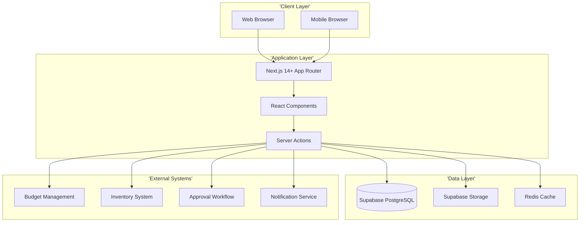
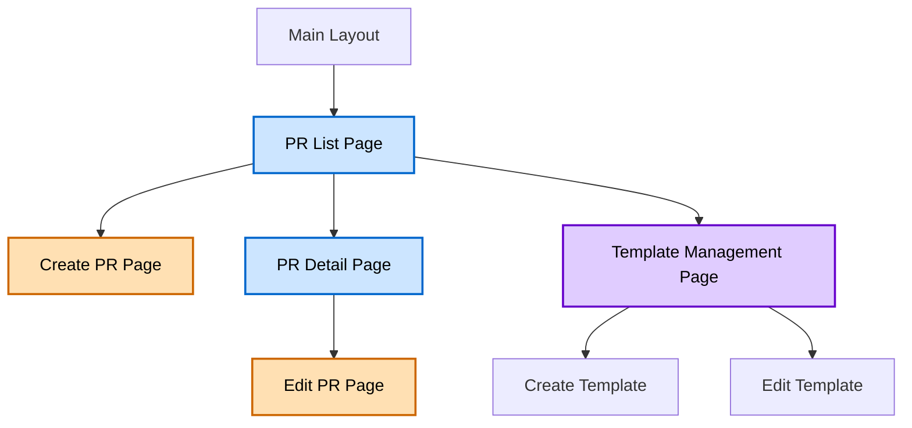
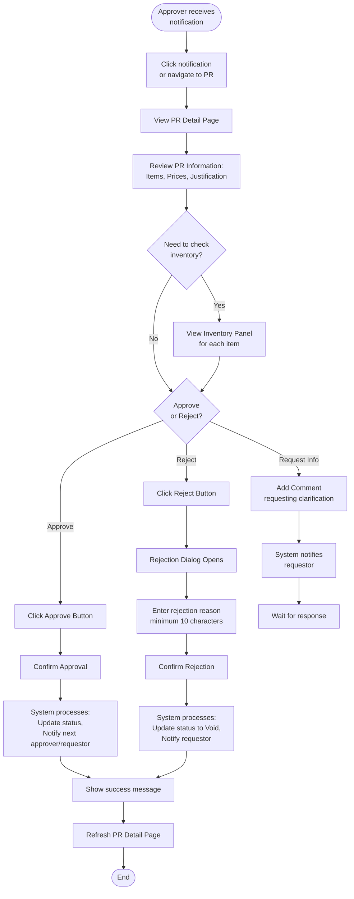
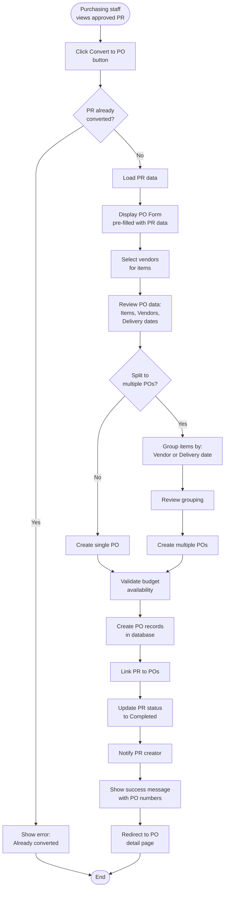

# Technical Specification: Purchase Requests

## Module Information
- **Module**: Procurement
- **Sub-Module**: Purchase Requests
- **Route**: `/procurement/purchase-requests`
- **Version**: 2.0.0
- **Last Updated**: 2025-12-17
- **Owner**: Development Team
- **Status**: Active

## Document History
| Version | Date | Author | Changes |
|---------|------|--------|---------|
| 1.0.0 | 2025-10-30 | Development Team | Initial technical specification |
| 1.1.0 | 2025-11-26 | Documentation Team | Synchronized with BR - updated status values, added implementation status markers |
| 1.2.0 | 2025-11-28 | Development Team | Added 4.1: Purchasing Staff Edit Mode (Vendor Pricing Section) with props interface, tax profiles, and calculation logic |
| 1.3.0 | 2025-11-28 | Development Team | Added Workflow Action Buttons Component specification with role detection and action handlers |
| 1.4.0 | 2025-11-28 | Development Team | Updated Edit PR page to include Returned status, added Resubmit and Return action buttons |
| 1.5.0 | 2025-11-28 | Development Team | Added 4.2: Bulk Item Actions Component with selection, toolbar, and action handlers |
| 1.6.0 | 2025-11-28 | Development Team | Added 4.3: Budget Tab CRUD Component with add/edit/delete dialogs, validation, and calculations |
| 1.7.0 | 2025-12-03 | Development Team | Extended Split capability to Approvers; added role-based field visibility; added Approver Split by Approval Status flow |
| 1.8.0 | 2025-12-10 | Documentation Team | Synced ref_number format with BR: changed from PR-YYYY-NNNN to PR-YYMM-NNNN |
| 1.9.0 | 2025-12-17 | Development Team | Added 4.4: Auto-Pricing System Components - PRAutoPricingService, EnhancedPriceComparison, MOQWarningBanner, usePRAutoPricing hook |
| 2.0.0 | 2025-12-17 | Development Team | Added 4.5: Multi-Currency Display Components - CurrencySelector, dual currency formatting, exchange rate handling |

## Implementation Status

This document defines **target technical specifications** for Purchase Requests. Implementation status markers indicate current development state:

| Status | Meaning |
|--------|---------|
| ✅ Implemented | Feature complete and functional |
| 🔧 Partial | Frontend exists, backend development needed |
| 🚧 Pending | Not yet implemented |
| ⏳ Future | Post-MVP enhancement |

**Current State**: Frontend prototype with mock data. Backend API and integrations pending development.

**BR-Defined Status Values**: Draft, In-progress, Approved, Void, Completed, Cancelled

---

## Overview

This document provides high-level technical implementation guidance for the Purchase Requests sub-module within the Procurement module of the Carmen ERP system. It describes the architecture, page structure, navigation flows, component responsibilities, and integration patterns.

The Purchase Requests module allows users to create, submit, approve, and track purchase requests within the organization. It integrates with budget management, approval workflows, vendor management, and inventory systems.

**Related Documents**:
- [Business Requirements](./BR-purchase-requests.md)
- [Use Cases](./UC-purchase-requests.md)
- [Data Definition](./DS-purchase-requests.md)
- [Flow Diagrams](./FD-purchase-requests.md)
- [Validations](./VAL-purchase-requests.md)

---

## Architecture

### High-Level System Architecture



### Component Architecture

The Purchase Requests module follows a layered architecture:

- **Presentation Layer**: React components for UI rendering and user interaction
- **State Management Layer**: Zustand for global state, React Query for server state
- **Business Logic Layer**: Server Actions containing validation, calculations, and workflow logic
- **Data Access Layer**: Supabase client for database operations
- **Integration Layer**: APIs for external system communication (Budget, Inventory, Workflow)

---

## Technology Stack

### Frontend Technologies
- **Framework**: Next.js 14+ with App Router pattern
- **UI Library**: React 18+
- **Styling**: Tailwind CSS with Shadcn/ui component library
- **State Management**: Zustand (global), React Query (server state)
- **Form Handling**: React Hook Form with Zod validation
- **Icons**: Lucide React
- **Date Handling**: date-fns library

### Backend Technologies
- **Runtime**: Node.js 20+
- **Server Framework**: Next.js Server Actions
- **Database**: PostgreSQL via Supabase
- **Authentication**: Supabase Auth
- **File Storage**: Supabase Storage
- **Caching**: Redis (for inventory data)

### Testing & DevOps
- **Unit Tests**: Vitest
- **E2E Tests**: Playwright
- **Version Control**: Git
- **CI/CD**: GitHub Actions
- **Hosting**: Vercel
- **Database Hosting**: Supabase Cloud

---

## Page Structure & Navigation

### Page Hierarchy



### Main Pages

#### 1. Purchase Request List Page
**Route**: `/procurement/purchase-requests`

**Purpose**: Display all purchase requests with filtering, sorting, and search capabilities

**Layout Components**:
- **Page Header**: Title, breadcrumb, Create button
- **Filter Bar**: Status filter, Date range, Department, Location, Requestor, Amount range
- **Quick Filters**: Primary toggle (My Pending / All Documents), Secondary dropdowns (Status, Stage, Requester)
- **Search Bar**: Search by PR number, item name, description, vendor
- **Data Table**: Paginated list of PRs with sortable columns
- **Action Buttons**: View, Edit (contextual based on status), Delete (draft only)
- **Export Button**: Export to Excel/CSV

**Key Features**:
- Real-time auto-refresh (no manual refresh button)
- Click row to view/edit (no modify button in row)
- Responsive table with column visibility toggle
- Status indicators with color coding
- Pagination (20 items per page default)

---

#### 2. Create Purchase Request Page
**Route**: `/procurement/purchase-requests/new`

**Purpose**: Create new purchase request

**Layout Sections**:
1. **Header Information Form**
   - PR Type selection (Market List, Standard Order, Fixed Asset)
   - Delivery date picker
   - Department and location selectors
   - Description and justification text areas

2. **Line Items Section**
   - Add Item button (opens item dialog)
   - Item list table with inline edit capability
   - FOC quantity and unit fields
   - Price and tax calculation display
   - Remove item button per row

3. **Item Selection Dialog** (when adding items)
   - Product search/select
   - Real-time inventory display panel (UC-PR-012)
   - Quantity and unit input
   - Price input with tax rate auto-fill
   - FOC quantity and unit inputs
   - Adjust checkbox for price lock
   - Budget code, cost center, GL account fields

4. **Financial Summary Panel**
   - Subtotal calculation
   - Discount amount
   - Tax amount
   - Grand total
   - Currency display

5. **Action Buttons**
   - Save as Draft
   - Submit for Approval
   - Cancel

---

#### 3. Purchase Request Detail Page
**Route**: `/procurement/purchase-requests/[id]`

**Purpose**: View complete PR details with status-specific actions

**Layout Sections**:
1. **Header Information Display**
   - PR number, date, status badge
   - Requestor details
   - Department (labeled as "Department", not "Approve by")
   - Location, delivery date
   - PR type

2. **Line Items Table** (read-only)
   - Item details with specifications
   - Quantities, units, prices
   - FOC quantity and unit (if applicable)
   - Line totals
   - Tax rates

3. **Financial Summary**
   - Subtotal, discount, tax, total
   - Display in transaction and base currency

4. **Approval Workflow Section**
   - Visual workflow progress indicator
   - Approval history timeline
   - Current approvers
   - Status of each approval level

5. **Attachments Section**
   - List of attached documents
   - Upload new attachment button (if editable)
   - Download, preview actions

6. **Comments Section**
   - Threaded comment display
   - Add comment input (if user has permission)
   - Internal vs external comment toggle

7. **Activity Log**
   - Chronological log of all activities
   - User actions, timestamp
   - Status changes, field modifications

8. **Related Documents**
   - Links to created POs
   - Links to converted from PRs (if created from template)

9. **Context Action Buttons** (status-dependent)
   - Edit (Draft, Void, Returned status only)
   - Submit for Approval (Draft only)
   - Resubmit (Void, Returned status only)
   - Approve (In-progress, for approvers)
   - Void (In-progress, for approvers)
   - Return (In-progress, for approvers/purchasing staff)
   - Recall (In-progress, for requestor)
   - Convert to PO (Approved, for purchasing staff)
   - Cancel (Draft, In-progress)
   - Save as Template (any status)
   - Print/Export PDF

---

#### 4. Edit Purchase Request Page
**Route**: `/procurement/purchase-requests/[id]/edit`

**Purpose**: Modify existing draft, rejected, or returned PR

**Layout**: Same as Create PR Page, but pre-filled with existing data

**Editable Statuses**:
- **Draft**: Initial state, full editing capability
- **Void**: Rejected PR, can revise and resubmit
- **Returned**: Returned for revision by approver/purchasing staff, can revise and resubmit

**Additional Features**:
- Version conflict detection
- Change tracking indicator
- Restore original values option
- Save changes button
- Discard changes button
- Return/Rejection reason banner (displayed for Void and Returned statuses)

**Access Control**: Only accessible when PR status is "Draft", "Void", or "Returned" and user is the requestor

---

#### 4.1 Purchasing Staff Edit Mode (Vendor Pricing Section)

**Implementation Status**: ✅ Implemented

**Purpose**: Allow purchasing staff to edit vendor pricing information, perform vendor allocations, manage tax profiles, and override financial calculations

**Access Control**: Only available to users with Purchasing Staff, Purchaser, or Procurement Manager role in edit mode

**Component Location**: `ConsolidatedItemDetailsCard` in `ItemDetailCards.tsx`

**Editable Fields Layout** (4-column grid):

**Row 1: Vendor Information**
| Field | Type | Description |
|-------|------|-------------|
| Vendor | Select Dropdown | Approved vendors for item category |
| Pricelist | Read-only | Auto-populated from vendor selection |

**Row 2: Currency and Price**
| Field | Type | Description |
|-------|------|-------------|
| Currency | Select Dropdown | USD, EUR, GBP, THB, JPY, CNY |
| Exchange Rate | Number Input | Decimal (6 places) |
| Unit Price | Number Input | Decimal (2 places) |
| Subtotal | Calculated | Quantity × Unit Price |

**Row 3: Tax Configuration**
| Field | Type | Description |
|-------|------|-------------|
| Tax Profile | Select Dropdown | VAT (7%), GST (10%), SST (6%), WHT (3%), None (0%) |
| Tax Rate | Read-only | Auto-set from Tax Profile |
| Tax Override | Number Input | Manual tax amount override |
| Tax (Calculated) | Calculated | Net Amount × Tax Rate or Override |

**Row 4: Discount Configuration**
| Field | Type | Description |
|-------|------|-------------|
| Discount Rate | Number Input | Percentage (2 decimal places) |
| Discount Override | Number Input | Manual discount amount override |
| Net Amount | Calculated | Subtotal - Discount |
| Total | Calculated | Net Amount + Tax |

**Props Interface**:
```typescript
interface PurchaserEditingProps {
  isPurchaserEditable?: boolean;
  onVendorChange?: (vendor: string) => void;
  onCurrencyChange?: (currency: string) => void;
  onCurrencyRateChange?: (rate: number) => void;
  onUnitPriceChange?: (price: number) => void;
  onDiscountRateChange?: (rate: number) => void;
  onDiscountAmountChange?: (amount: number) => void;
  onTaxTypeChange?: (taxType: string) => void;
  onTaxRateChange?: (rate: number) => void;
  onTaxAmountChange?: (amount: number) => void;
  vendorOptions?: Array<{ value: string; label: string }>;
  currencyOptions?: Array<{ value: string; label: string }>;
  taxTypeOptions?: Array<{ value: string; label: string; rate?: number }>;
}
```

**Tax Profile Configuration**:
```typescript
const taxTypeOptions = [
  { value: 'VAT', label: 'VAT (7%)', rate: 0.07 },
  { value: 'GST', label: 'GST (10%)', rate: 0.10 },
  { value: 'SST', label: 'SST (6%)', rate: 0.06 },
  { value: 'WHT', label: 'WHT (3%)', rate: 0.03 },
  { value: 'None', label: 'No Tax (0%)', rate: 0 },
];
```

**Role Detection Logic**:
```typescript
const isPurchaser = ['Purchasing Staff', 'Purchaser', 'Procurement Manager']
  .some(role => userRole?.toLowerCase().includes(role.toLowerCase()));

const isPurchaserEditable = isPurchaser && formMode === "edit";
```

**Calculation Logic**:
```typescript
// Calculate financials
const subtotal = quantity * unitPrice;
const discountAmount = discountOverride || (subtotal * discountRate);
const netAmount = subtotal - discountAmount;
const taxAmount = taxOverride || (netAmount * taxRate);
const total = netAmount + taxAmount;
```

**UI/UX Requirements**:
- Tax rate field shows "From profile" label indicating auto-population
- Override fields use placeholder "Override" to indicate optional
- Real-time calculation updates as user types
- Currency symbol displayed with amounts
- Validation errors shown inline with red border

---

#### 4.2 Bulk Item Actions Component

**Status**: 🔧 Partial
**Related BR**: FR-PR-026
**Location**: Items tab within PR Detail/Edit page

This component provides multi-select functionality for line items and bulk action operations.

**Component Structure**:
```
BulkItemActions/
├── BulkActionToolbar.tsx        # Floating toolbar with action buttons
├── ItemSelectionContext.tsx     # Selection state management
├── SelectableItemRow.tsx        # Row with selection checkbox
├── BulkApproveDialog.tsx        # Confirm approval dialog
├── BulkRejectDialog.tsx         # Rejection reason dialog
├── BulkReturnDialog.tsx         # Return reason dialog
├── SplitConfigDialog.tsx        # Split configuration dialog
├── SetDateDialog.tsx            # Date picker dialog
└── hooks/
    ├── useBulkSelection.ts      # Selection management hook
    └── useBulkActions.ts        # Action execution hook
```

**Props Interface**:
```typescript
interface BulkItemActionsProps {
  items: PurchaseRequestItem[];
  userRole: UserRole;
  prStatus: PRStatus;
  onBulkApprove?: (itemIds: string[], comment?: string) => Promise<void>;
  onBulkReject?: (itemIds: string[], reason: string) => Promise<void>;
  onBulkReturn?: (itemIds: string[], reason: string) => Promise<void>;
  onSplit?: (itemGroups: ItemGroup[]) => Promise<void>;
  onSetDate?: (itemIds: string[], date: Date) => Promise<void>;
  onSelectionChange?: (selectedIds: string[]) => void;
}

interface PurchaseRequestItem {
  id: string;
  productId: string;
  productName: string;
  quantity: number;
  unitPrice: number;
  status: ItemStatus;
  deliveryDate?: Date;
  vendorId?: string;
  // ... other item fields
}

type ItemStatus = 'Pending' | 'In-progress' | 'Approved' | 'Rejected' | 'Returned';

interface ItemGroup {
  groupId: string;
  groupName: string;
  itemIds: string[];
  groupBy: 'vendor' | 'date' | 'manual';
}
```

**Selection State Management**:
```typescript
interface SelectionState {
  selectedIds: Set<string>;
  isAllSelected: boolean;
  isIndeterminate: boolean;
  selectionSummary: SelectionSummary;
}

interface SelectionSummary {
  total: number;
  byStatus: Record<ItemStatus, number>;
}

const useBulkSelection = (items: PurchaseRequestItem[]) => {
  const [selectedIds, setSelectedIds] = useState<Set<string>>(new Set());

  const toggleItem = (id: string) => {
    setSelectedIds(prev => {
      const next = new Set(prev);
      if (next.has(id)) next.delete(id);
      else next.add(id);
      return next;
    });
  };

  const selectAll = () => {
    setSelectedIds(new Set(items.map(item => item.id)));
  };

  const clearSelection = () => {
    setSelectedIds(new Set());
  };

  const selectionSummary = useMemo(() => {
    const selected = items.filter(item => selectedIds.has(item.id));
    const byStatus = selected.reduce((acc, item) => {
      acc[item.status] = (acc[item.status] || 0) + 1;
      return acc;
    }, {} as Record<ItemStatus, number>);
    return { total: selected.length, byStatus };
  }, [items, selectedIds]);

  return {
    selectedIds,
    toggleItem,
    selectAll,
    clearSelection,
    isAllSelected: selectedIds.size === items.length && items.length > 0,
    isIndeterminate: selectedIds.size > 0 && selectedIds.size < items.length,
    selectionSummary,
  };
};
```

**Bulk Action Toolbar Component**:
```typescript
interface BulkActionToolbarProps {
  selectionSummary: SelectionSummary;
  userRole: UserRole;
  onApprove: () => void;
  onReject: () => void;
  onReturn: () => void;
  onSplit: () => void;
  onSetDate: () => void;
  onClearSelection: () => void;
}

const BulkActionToolbar: React.FC<BulkActionToolbarProps> = ({
  selectionSummary,
  userRole,
  onApprove,
  onReject,
  onReturn,
  onSplit,
  onSetDate,
  onClearSelection,
}) => {
  if (selectionSummary.total === 0) return null;

  const canApprove = ['Approver', 'Purchasing Staff'].includes(userRole);
  const canReject = ['Approver', 'Purchasing Staff'].includes(userRole);
  const canReturn = ['Approver', 'Purchasing Staff'].includes(userRole);
  const canSplit = ['Approver', 'Purchasing Staff'].includes(userRole) && selectionSummary.total >= 2;
  const canSetDate = true; // All roles can set date

  return (
    <div className="sticky top-0 z-10 bg-background border rounded-lg p-3 shadow-md">
      <div className="flex items-center justify-between">
        <div className="flex items-center gap-2">
          <Checkbox checked indeterminate={false} />
          <span className="text-sm font-medium">
            {selectionSummary.total} items selected
            {selectionSummary.byStatus.Approved && (
              <span className="text-muted-foreground ml-1">
                : {selectionSummary.byStatus.Approved} Approved
              </span>
            )}
          </span>
        </div>
        <div className="flex items-center gap-2">
          {canApprove && (
            <Button variant="default" size="sm" onClick={onApprove}
              className="bg-green-600 hover:bg-green-700">
              <CheckCircle className="h-4 w-4 mr-1" />
              Approve Selected
            </Button>
          )}
          {canReject && (
            <Button variant="destructive" size="sm" onClick={onReject}>
              <XCircle className="h-4 w-4 mr-1" />
              Reject Selected
            </Button>
          )}
          {canReturn && (
            <Button variant="outline" size="sm" onClick={onReturn}>
              <RotateCcw className="h-4 w-4 mr-1" />
              Return Selected
            </Button>
          )}
          {canSplit && (
            <Button variant="secondary" size="sm" onClick={onSplit}>
              <Split className="h-4 w-4 mr-1" />
              Split
            </Button>
          )}
          {canSetDate && (
            <Button variant="secondary" size="sm" onClick={onSetDate}>
              <Calendar className="h-4 w-4 mr-1" />
              Set Date Required
            </Button>
          )}
          <Button variant="ghost" size="sm" onClick={onClearSelection}>
            <X className="h-4 w-4" />
          </Button>
        </div>
      </div>
    </div>
  );
};
```

**Bulk Action Handlers**:
```typescript
const useBulkActions = (prId: string) => {
  const queryClient = useQueryClient();

  const bulkApprove = async (itemIds: string[], comment?: string) => {
    const response = await api.post(`/api/purchase-requests/${prId}/items/bulk-approve`, {
      itemIds,
      comment,
    });
    if (response.success) {
      queryClient.invalidateQueries(['purchase-request', prId]);
      toast.success(`${itemIds.length} items approved`);
    }
    return response;
  };

  const bulkReject = async (itemIds: string[], reason: string) => {
    const response = await api.post(`/api/purchase-requests/${prId}/items/bulk-reject`, {
      itemIds,
      reason,
    });
    if (response.success) {
      queryClient.invalidateQueries(['purchase-request', prId]);
      toast.success(`${itemIds.length} items rejected`);
    }
    return response;
  };

  const bulkReturn = async (itemIds: string[], reason: string) => {
    const response = await api.post(`/api/purchase-requests/${prId}/items/bulk-return`, {
      itemIds,
      reason,
    });
    if (response.success) {
      queryClient.invalidateQueries(['purchase-request', prId]);
      toast.success(`${itemIds.length} items returned for revision`);
    }
    return response;
  };

  const splitItems = async (itemGroups: ItemGroup[]) => {
    const response = await api.post(`/api/purchase-requests/${prId}/items/split`, {
      groups: itemGroups,
    });
    if (response.success) {
      queryClient.invalidateQueries(['purchase-requests']);
      toast.success(`PR split into ${itemGroups.length} new PRs`);
    }
    return response;
  };

  const setItemsDate = async (itemIds: string[], date: Date) => {
    const response = await api.post(`/api/purchase-requests/${prId}/items/set-date`, {
      itemIds,
      deliveryDate: date.toISOString(),
    });
    if (response.success) {
      queryClient.invalidateQueries(['purchase-request', prId]);
      toast.success(`Date updated for ${itemIds.length} items`);
    }
    return response;
  };

  return { bulkApprove, bulkReject, bulkReturn, splitItems, setItemsDate };
};
```

**Role-Based Button Visibility**:
```typescript
const getVisibleActions = (userRole: UserRole, prStatus: PRStatus): ActionType[] => {
  const actions: ActionType[] = [];

  // Requestor (limited - only in Draft/Void/Returned)
  if (userRole === 'Requestor') {
    if (['Draft', 'Void', 'Returned'].includes(prStatus)) {
      actions.push('setDate');
    }
    return actions;
  }

  // Approver
  if (['Approver', 'Department Manager', 'Finance Manager'].includes(userRole)) {
    actions.push('approve', 'reject', 'return', 'split', 'setDate');
    return actions;
  }

  // Purchasing Staff - all actions
  if (['Purchasing Staff', 'Purchaser', 'Procurement Manager'].includes(userRole)) {
    actions.push('approve', 'reject', 'return', 'split', 'setDate');
    return actions;
  }

  return actions;
};
```

**Validation Before Action**:
```typescript
const validateBulkAction = (
  action: ActionType,
  items: PurchaseRequestItem[],
  selectedIds: string[]
): ValidationResult => {
  const selectedItems = items.filter(item => selectedIds.includes(item.id));
  const validStatuses = getValidStatusesForAction(action);

  const validItems = selectedItems.filter(item => validStatuses.includes(item.status));
  const invalidItems = selectedItems.filter(item => !validStatuses.includes(item.status));

  if (action === 'split' && validItems.length < 2) {
    return { valid: false, error: 'Minimum 2 items required for split' };
  }

  if (validItems.length === 0) {
    return { valid: false, error: `No items can be ${action}ed` };
  }

  return {
    valid: true,
    validItems,
    invalidItems,
    warning: invalidItems.length > 0
      ? `${invalidItems.length} of ${selectedItems.length} items cannot be ${action}ed`
      : undefined,
  };
};

const getValidStatusesForAction = (action: ActionType): ItemStatus[] => {
  switch (action) {
    case 'approve':
    case 'reject':
      return ['Pending', 'In-progress'];
    case 'return':
      return ['Pending', 'In-progress', 'Approved'];
    case 'split':
    case 'setDate':
      return ['Pending', 'In-progress', 'Approved', 'Returned'];
    default:
      return [];
  }
};
```

**UI/UX Requirements**:
- Checkbox column fixed at 40px width, first column position
- "Select All" checkbox in header with indeterminate state support
- Bulk action toolbar appears with slide-down animation when items selected
- Toolbar uses sticky positioning to remain visible during scroll
- Selection count updates in real-time with status breakdown
- Action buttons show loading state during API calls
- Toast notifications confirm successful/failed operations
- Dialog forms validate before submission
- Split preview shows item groupings before confirmation

**Button Styling**:
| Button | Variant | Color | Icon |
|--------|---------|-------|------|
| Approve Selected | default | green-600 | CheckCircle |
| Reject Selected | destructive | red | XCircle |
| Return Selected | outline | gray | RotateCcw |
| Split | secondary | blue | Split |
| Set Date Required | secondary | blue | Calendar |
| Clear Selection | ghost | gray | X |

---

#### 4.2.1 Approver Split by Approval Status

**Status**: 🚧 Pending
**Related BR**: FR-PR-016.2 (Approver Split Capability)
**Role**: Approver, Department Manager, Finance Manager

This feature enables Approvers to split a Purchase Request based on item approval status, separating approved items from items that need to be returned for revision.

##### Use Case

When reviewing a PR with multiple items, an Approver may:
1. Approve some items that meet requirements
2. Return other items that need revision or more information

Rather than holding the entire PR, the Approver can split it:
- **PR 1 (Original)**: Contains approved items → proceeds to next stage
- **PR 2 (New)**: Contains returned items → sent back to Requestor for revision

##### Split Options for Approvers

| Split Option | Description | Use Case |
|--------------|-------------|----------|
| By Approval Status | Separate approved items from returned items | Partial approval workflow |
| By Vendor | Group items by vendor (inherited from Purchasing Staff) | Multi-vendor PRs |
| By Delivery Date | Group items by delivery date (inherited from Purchasing Staff) | Different timelines |

##### Technical Implementation

**Split by Approval Status Flow**:
```typescript
interface ApproverSplitRequest {
  originalPrId: string;
  splitReason: 'approval_status' | 'vendor' | 'delivery_date' | 'manual';
  approvedItemIds: string[];
  returnedItemIds: string[];
  returnReason: string; // Required for returned items
}

const splitByApprovalStatus = async (request: ApproverSplitRequest) => {
  // 1. Validate items belong to original PR
  // 2. Validate at least 1 item in each group
  // 3. Create new PR for returned items with parent_pr_id reference
  // 4. Update original PR with only approved items
  // 5. Set original PR items to Approved status
  // 6. Set new PR status to Returned
  // 7. Log activity for both PRs
  return { originalPr, newPr };
};
```

**Parent-Child PR Relationship**:
```typescript
interface SplitPRReference {
  parent_pr_id: string;        // Reference to original PR
  split_reason: string;        // 'approval_status', 'vendor', etc.
  split_date: Date;            // When split occurred
  split_by: string;            // User who performed split
}
```

##### UI Components

**ApproverSplitDialog Component**:
```typescript
interface ApproverSplitDialogProps {
  prId: string;
  items: PRItem[];
  isOpen: boolean;
  onClose: () => void;
  onSplit: (request: ApproverSplitRequest) => Promise<void>;
}

// Component shows:
// - List of items with checkboxes for approved/returned selection
// - Summary: "X items approved, Y items to return"
// - Return reason textarea (required)
// - Preview of resulting PRs
// - Confirm/Cancel buttons
```

##### Role-Based Field Visibility

When Approvers view PR items, the following visibility rules apply:

| Field | Visibility | Editable |
|-------|------------|----------|
| Item Description | 👁️ Read-only | No |
| Requested Quantity | 👁️ Read-only | No |
| Approved Quantity | ✅ Editable | Yes |
| Vendor | 👁️ Read-only | No |
| Unit Price | 👁️ Read-only | No |
| Discount | 👁️ Read-only | No |
| FOC (Free of Charge) | 👁️ Read-only | No |
| Budget Code | 👁️ Read-only | No |

---

#### 4.3 Budget Tab CRUD Component

**Status**: ✅ Implemented
**Related BR**: FR-PR-027
**Location**: Budget tab within PR Detail page

This component provides full CRUD functionality for managing budget allocations within a Purchase Request.

##### Component Structure

The Budget Tab component is organized as follows:
- **budget-tab.tsx**: Main component containing the table display and all dialog modals
- **Types**: BudgetItem interface for data structure, BudgetFormData interface for form state
- **Hooks**: useBudgetCalculations for calculation logic

##### Data Model

**BudgetItem Properties**:

| Property | Type | Description |
|----------|------|-------------|
| id | string | Unique identifier for the budget allocation |
| location | string | Department/location name (e.g., Kitchen, Front Office) |
| category | string | Budget category (e.g., F&B, Operating Supplies) |
| totalBudget | number | Total allocated budget amount |
| softCommitmentDeptHead | number | Soft commitment from department head approval |
| softCommitmentPO | number | Soft commitment from purchase orders |
| hardCommitment | number | Hard commitment (confirmed expenditure) |
| availableBudget | number | Calculated: Total minus all commitments |
| currentPRAmount | number | Amount allocated to current PR |
| status | enum | Calculated: "Over Budget", "Within Budget", or "Near Limit" |

**Form Data Properties**:
All form fields are stored as strings for input handling, with numeric conversion on save. Fields include: location, category, totalBudget, softCommitmentDeptHead, softCommitmentPO, hardCommitment, currentPRAmount.

##### State Management

The component maintains several state variables:
- **budgetData**: Array of BudgetItem objects representing all budget allocations
- **isAddEditDialogOpen**: Boolean controlling the add/edit dialog visibility
- **isDeleteDialogOpen**: Boolean controlling the delete confirmation dialog
- **editingItem**: The BudgetItem currently being edited (null for add mode)
- **deletingItem**: The BudgetItem pending deletion confirmation
- **formData**: Current form field values
- **formErrors**: Validation error messages keyed by field name
- **totals**: Memoized calculation of column totals for all numeric fields

##### Calculation Logic

**Available Budget Calculation**:
Available Budget = Total Budget - Soft Commitment (Dept Head) - Soft Commitment (PO) - Hard Commitment

**Status Determination**:

| Condition | Status | Display |
|-----------|--------|---------|
| Available Budget < 0 | Over Budget | Red destructive badge |
| Available Budget ≤ 20% of Total Budget | Near Limit | Yellow warning badge |
| Available Budget > 20% of Total Budget | Within Budget | Green success badge |

**Real-time Preview**: The form displays a live preview of the calculated available budget as the user types, updating on each field change.

##### Form Validation Rules

The form validates the following before submission:

1. **Required Fields**: Location, Category, and Total Budget must not be empty
2. **Numeric Validation**: All amount fields must be valid numbers greater than or equal to zero
3. **Duplicate Prevention**: The combination of Location + Category must be unique within the PR (excluding the current item when editing)

**Error Messages**:
- "Location is required"
- "Category is required"
- "Total Budget is required"
- "Must be a valid number >= 0"
- "Budget allocation for this Location and Category already exists"

##### CRUD Operations

**Add Operation**:
1. User clicks "Add Budget" button
2. System opens dialog with empty form
3. User fills required fields
4. System validates and calculates available budget/status
5. On success, new item added to table and toast notification displayed

**Edit Operation**:
1. User clicks Edit in row dropdown menu
2. System opens dialog pre-populated with existing values
3. User modifies fields as needed
4. System validates (including duplicate check excluding current item)
5. On success, item updated in table and toast notification displayed

**Delete Operation**:
1. User clicks Delete in row dropdown menu
2. System displays AlertDialog confirmation with item details
3. User confirms or cancels
4. On confirm, item removed from table and toast notification displayed

##### Location and Category Options

**Available Locations**: Front Office, Accounting, HouseKeeping, Kitchen, Restaurant, Engineering, IT, HR, Sales, Marketing

**Available Categories**: F&B, Operating Supplies, Maintenance, Equipment, Services

##### Role-Based Access Control

| Role | View | Add | Edit | Delete |
|------|------|-----|------|--------|
| Requestor | ✅ | ❌ | ❌ | ❌ |
| Approver | ✅ | ❌ | ❌ | ❌ |
| Purchasing Staff | ✅ | ✅ | ✅ | ✅ |
| Purchaser | ✅ | ✅ | ✅ | ✅ |
| Procurement Manager | ✅ | ✅ | ✅ | ✅ |
| Finance Manager | ✅ | ✅ | ✅ | ✅ |

The Add Budget button and row action menus are conditionally rendered based on user role. Users without edit permission see a read-only view of the budget data.

##### UI Components

| Component | Purpose |
|-----------|---------|
| Dialog | Add/Edit form modal |
| AlertDialog | Delete confirmation modal |
| DropdownMenu | Row actions (Edit, Delete) |
| Select | Location and Category dropdowns |
| Input | Numeric input fields |
| Label | Form field labels |
| Button | Action buttons (Add Budget, Save, Cancel, Delete) |
| Table | Budget data display (desktop) |
| Card | Budget data display (mobile) |
| Badge | Status indicators with color coding |
| toast (sonner) | Success/error notifications |

##### Currency Formatting

All currency values are formatted using Intl.NumberFormat with USD currency, displaying whole numbers without decimal places (e.g., "$50,000").

##### Responsive Design

- **Desktop View**: Full table layout with all columns visible, row actions in dropdown menu
- **Mobile View**: Card-based layout showing key information (Location, Category, Total, Available, Status), actions accessible via card menu

##### Accessibility Features

- ARIA labels on all interactive elements
- Keyboard navigation support for dialogs and dropdown menus
- Focus trap in AlertDialog for delete confirmation
- Error messages associated with form fields using aria-describedby
- Semantic HTML structure for screen reader compatibility

---

#### 4.4 Auto-Pricing System Components

**Status**: ✅ Implemented
**Related BR**: FR-PR-028
**Location**: Item detail panels and pricing dialogs

##### 4.4.1 PRAutoPricingService

**File**: `lib/services/pr-auto-pricing-service.ts`
**Purpose**: Main orchestrator for auto-pricing functionality, coordinates unit conversion, vendor allocation, and caching.

**Service Interface**:
```typescript
interface VendorPriceListData {
  vendorId: string;
  vendorName: string;
  priceListId: string;
  priceListName: string;
  unitPrice: Money;
  sellingUnitCode: string;
  sellingUnitName: string;
  minimumOrderQuantity: number;
  leadTimeDays: number;
  rating: number;
  isPreferredVendor: boolean;
  isPreferredItem: boolean;
  validFrom: Date;
  validTo: Date;
  isValid: boolean;
}

interface PricingCacheEntry {
  productId: string;
  comparison: PRItemPriceComparison;
  cachedAt: Date;
  expiresAt: Date;
}
```

**Key Methods**:
| Method | Parameters | Returns | Description |
|--------|------------|---------|-------------|
| `fetchPricingOptionsForItem` | `FetchPricingInput` | `Promise<PRItemPriceComparison>` | Main entry point - fetches and normalizes all vendor prices |
| `recalculateOnQuantityChange` | `RecalculatePricingInput` | `Promise<PRItemPriceComparison>` | Recalculates when quantity changes |
| `processPRItems` | `Array<{id, productId, quantity, unit}>` | `Promise<Map<string, PRItemPriceComparison>>` | Batch processing for multiple items |
| `recordOverride` | `prItemId, originalVendorId, selectedVendorId, reasonType, reasonText, userId, priceDifference` | `VendorOverrideRecord` | Records vendor override for audit |
| `clearCache` | none | `void` | Clears all pricing cache |
| `clearCacheForProduct` | `productId: string` | `void` | Clears cache for specific product |

**Configuration**:
- Cache TTL: 5 minutes (`CACHE_TTL_MS = 5 * 60 * 1000`)
- Singleton pattern for shared state

##### 4.4.2 UnitConversionService

**File**: `lib/services/unit-conversion-service.ts`
**Purpose**: Handles unit conversion for price normalization and MOQ validation.

**Key Methods**:
| Method | Description |
|--------|-------------|
| `convertToBaseUnit(quantity, unit, unitConfig)` | Converts quantity to base inventory unit |
| `normalizePrice(unitPrice, sellingUnitCode, unitConfig)` | Normalizes price to price per base unit |
| `convertMOQToBaseUnit(moqQuantity, sellingUnitCode, unitConfig)` | Converts MOQ to base unit |
| `validateMOQRequirement(requestedInBase, baseUnit, moqQuantity, moqUnit, unitConfig)` | Validates if MOQ is met |
| `getMOQAlertSeverity(percentageMet)` | Returns severity level: 'error' (<50%), 'warning' (50-90%), 'info' (≥90%) |

##### 4.4.3 VendorAllocationService

**File**: `lib/services/vendor-allocation-service.ts`
**Purpose**: Vendor scoring and ranking algorithm.

**Scoring Weights**:
```typescript
const SCORING_WEIGHTS = {
  preferredItem: 0.35,      // 35%
  preferredVendor: 0.25,    // 25%
  priceScore: 0.25,         // 25%
  rating: 0.10,             // 10%
  leadTime: 0.05            // 5%
};
```

**Key Methods**:
| Method | Description |
|--------|-------------|
| `allocateVendor(options)` | Scores and ranks all vendors, returns recommended |
| `reRankForQuantity(options, newQuantity)` | Re-ranks vendors for new quantity |
| `calculateVendorScore(option)` | Calculates weighted score for single vendor |

##### 4.4.4 EnhancedPriceComparison Component

**File**: `app/(main)/procurement/purchase-requests/components/enhanced-price-comparison.tsx`
**Purpose**: Multi-vendor comparison table with sorting, filtering, and selection.

**Props Interface**:
```typescript
interface EnhancedPriceComparisonProps {
  comparison: PRItemPriceComparison;
  isReadOnly?: boolean;
  onSelectVendor?: (vendorId: string, vendorName: string) => void;
  onOverrideVendor?: (override: VendorOverrideRecord) => void;
}
```

**Features**:
- **Sorting**: Score, Price, Rating, Lead Time, MOQ
- **Filtering**: MOQ Met Only, Preferred Only
- **Visual Indicators**: Recommended badge, MOQ status badges, preferred vendor star
- **Selection**: Radio button for vendor selection (Purchasing Staff only)

**Table Columns**:
| Column | Description |
|--------|-------------|
| Vendor | Name with preferred badge if applicable |
| Price/Base Unit | Normalized price per base unit |
| MOQ Status | Badge showing met/not met with quantity |
| Rating | Star rating display |
| Lead Time | Days to delivery |
| Score | Overall vendor score |
| Rank | Position in ranking |
| Select | Radio button (if not read-only) |

##### 4.4.5 MOQWarningBanner Component

**File**: `app/(main)/procurement/purchase-requests/components/moq-warning-banner.tsx`
**Purpose**: Displays MOQ validation alerts with severity-based styling.

**Props Interface**:
```typescript
interface MOQWarningBannerProps {
  alerts: MOQAlert[];
  onDismiss?: () => void;
}

interface MOQAlert {
  vendorId: string;
  vendorName: string;
  gap: number;
  gapInBaseUnit: number;
  baseUnit: string;
  severity: 'error' | 'warning' | 'info';
  message: string;
  suggestedQuantity: number;
}
```

**Severity Styling**:
| Severity | Color | Icon | Behavior |
|----------|-------|------|----------|
| ERROR | Red (destructive) | AlertTriangle | Blocks submission, shows CriticalMOQBlock |
| WARNING | Yellow | AlertCircle | Allows proceed with confirmation |
| INFO | Blue | Info | Informational only |

**CriticalMOQBlock Component**:
- Displayed when any alert has severity='error'
- Red background, bold messaging
- Disables form submission controls

##### 4.4.6 usePRAutoPricing Hook

**File**: `app/(main)/procurement/purchase-requests/hooks/use-pr-auto-pricing.ts`
**Purpose**: Client-side hook for managing auto-pricing state and interactions.

**Hook Interface**:
```typescript
interface UsePRAutoPricingOptions {
  prItems: Array<{ id: string; productId: string; quantity: number; unit: string }>;
  autoFetch?: boolean;
}

interface UsePRAutoPricingReturn {
  pricingState: Map<string, PRItemPricingState>;
  isLoading: boolean;
  error: Error | null;
  fetchPricing: (itemId: string) => Promise<void>;
  fetchAllPricing: () => Promise<void>;
  selectVendor: (itemId: string, vendorId: string) => void;
  overrideVendor: (itemId: string, override: VendorOverrideRecord) => void;
  recalculateForQuantity: (itemId: string, newQuantity: number, newUnit?: string) => Promise<void>;
  canSubmit: boolean;
  criticalAlerts: MOQAlert[];
}
```

**State Management**:
- Maintains pricing state for each PR item
- Tracks selected vendor per item
- Aggregates MOQ alerts across items
- Computes `canSubmit` based on critical errors

---

#### 4.5 Multi-Currency Display Components

**Status**: ✅ Implemented
**Related BR**: FR-PR-029
**Location**: Item detail cards, summary totals, pricing forms

##### 4.5.1 Currency Selector Component

**File**: `components/ui/currency-selector.tsx`
**Purpose**: Dropdown for currency selection with search functionality.

**Props Interface**:
```typescript
interface CurrencySelectorProps {
  value?: string;
  onChange: (value: string) => void;
  currencies?: Currency[];
  disabled?: boolean;
  className?: string;
  placeholder?: string;
  emptyText?: string;
}

interface Currency {
  code: string;    // ISO 4217 code (e.g., "USD")
  name: string;    // Full name (e.g., "US Dollar")
  symbol: string;  // Symbol (e.g., "$")
}
```

**Default Currencies**:
USD, EUR, GBP, CAD, AUD, JPY, CNY, CHF, SGD, HKD, NZD, MXN, BRL, INR, THB

**Features**:
- Search/filter by code or name
- Displays code, symbol, and name
- Keyboard navigation support
- ARIA compliant

##### 4.5.2 Dual Currency Display Pattern

**File**: `app/(main)/procurement/purchase-requests/components/tabs/ItemDetailCards.tsx`
**Purpose**: Shows both transaction currency and base currency amounts.

**Implementation Pattern**:
```typescript
// Currency conversion helper
const formatCurrencyConversion = (amount: number) => {
  if (!showCurrencyConversion || !baseCurrency || currency === baseCurrency) return null;
  const convertedAmount = amount * currencyRate;
  return `${baseCurrency} ${convertedAmount.toFixed(2)}`;
};
```

**Display Locations**:
| Location | Primary (Transaction) | Secondary (Base) |
|----------|----------------------|------------------|
| Unit Price | `{currency} {unitPrice.toFixed(2)}` | Green text below |
| Subtotal | `{currency} {subtotal.toFixed(2)}` | Green text below |
| Discount | `-{currency} {discountAmount.toFixed(2)}` | Green text below |
| Net Amount | `{currency} {netAmount.toFixed(2)}` | Green text below |
| Tax | `+{currency} {taxAmount.toFixed(2)}` | Green text below |
| Total | Bold `{currency} {total.toFixed(2)}` | Green text below |

**Styling Specifications**:
```typescript
// Primary (transaction currency)
className="text-sm font-semibold text-gray-900"

// Secondary (base currency)
className="text-xs text-green-700"
```

##### 4.5.3 Summary Total Component

**File**: `app/(main)/procurement/purchase-requests/components/SummaryTotal.tsx`
**Purpose**: PR summary with dual currency display.

**Props Interface**:
```typescript
interface SummaryTotalProps {
  prData: MockPurchaseRequest;
}
```

**Currency Detection**:
```typescript
const currency = mockPrData.currency || "USD";
const baseCurrency = mockPrData.baseCurrencyCode || "USD";
const showBaseCurrency = currency !== baseCurrency;
```

**Visual Elements**:
- Badge: "Base Currency" indicator (`variant="secondary"`)
- Badge: Exchange rate display (`variant="outline"`)
- Dual amount display for all summary rows

##### 4.5.4 Currency-Related Props in ItemDetailCards

**Purchaser Edit Mode Props**:
```typescript
interface ItemDetailCardsProps {
  // Currency props
  currency: string;
  baseCurrency?: string;
  currencyRate?: number;
  showCurrencyConversion?: boolean;

  // Currency edit callbacks
  onCurrencyChange?: (currency: string) => void;
  onCurrencyRateChange?: (rate: number) => void;

  // Currency options
  currencyOptions?: Array<{ value: string; label: string }>;
}
```

**Currency Options Generation**:
```typescript
const defaultCurrencyOptions = mockCurrencies
  .filter(c => c.isActive)
  .map(c => ({
    value: c.code,
    label: `${c.code} - ${c.name}${c.isBaseCurrency ? ' (Base)' : ''}`
  }));
```

##### Role-Based Currency Access

| Feature | Requestor | Approver | Purchasing Staff |
|---------|-----------|----------|------------------|
| View Currency | ✅ | ✅ | ✅ |
| View Dual Display | ✅ | ✅ | ✅ |
| Select Currency (Create) | ✅ | ❌ | ✅ |
| Change Currency (Edit) | ❌ | ❌ | ✅ |
| Change Exchange Rate | ❌ | ❌ | ✅ |

---

#### 5. Template Management Page
**Route**: `/procurement/purchase-requests/templates`

**Purpose**: Manage PR templates for recurring orders

**Layout Sections**:
1. **Template List**
   - Template name, type, last used date
   - Usage count
   - Department/visibility
   - Created by

2. **Filter Bar**
   - Filter by type (Market List, Standard Order, Fixed Asset)
   - Filter by department
   - Filter by tags
   - Sort by recently used, usage count, name

3. **Actions**
   - Create New Template button
   - Edit template
   - Duplicate template
   - Archive template
   - Delete template (with confirmation)
   - View usage history

4. **Template Detail Panel** (when template selected)
   - Template metadata
   - List of items in template
   - Estimated total
   - Usage statistics

---

## Navigation Flow Diagrams

### Create Purchase Request Flow

```mermaid
flowchart TD
    Start([User clicks Create PR]) --> Choice{New from scratch<br>or template?}

    Choice -->|New| SelectType[Select PR Type:<br>Market List, Standard Order,<br>Fixed Asset]
    Choice -->|Template| TemplateDialog[Open Template<br>Selection Dialog]

    TemplateDialog --> SelectTemplate[Select Template]
    SelectTemplate --> TemplateOptions[Configure Template<br>Options]
    TemplateOptions --> LoadTemplate[Load Template Data<br>with Price Updates]
    LoadTemplate --> SelectType

    SelectType --> HeaderForm[Fill Header Info:<br>Delivery Date, Department,<br>Location, Description]

    HeaderForm --> AddItems[Add Line Items]

    AddItems --> ItemDialog[Item Selection Dialog]
    ItemDialog --> SearchProduct[Search/Select Product]
    SearchProduct --> InventoryPanel[View Real-time<br>Inventory & Pricing]
    InventoryPanel --> EnterDetails[Enter Quantity, Price,<br>FOC Qty/Unit, Tax Rate]
    EnterDetails --> MoreItems{Add more<br>items?}

    MoreItems -->|Yes| ItemDialog
    MoreItems -->|No| ReviewItems[Review All Items<br>and Financial Summary]

    ReviewItems --> SaveChoice{Save as Draft<br>or Submit?}

    SaveChoice -->|Draft| SaveDraft[Save as Draft]
    SaveChoice -->|Submit| ValidateSubmit[Validate Required<br>Fields]

    ValidateSubmit --> SubmitPR[Submit for Approval]

    SaveDraft --> SuccessMsg[Show Success Message]
    SubmitPR --> SuccessMsg

    SuccessMsg --> RedirectDetail[Redirect to<br>PR Detail Page]

    RedirectDetail --> End([End])
```



### Approval Workflow Navigation



### Convert PR to PO Flow



---

## Sitemap

### Overview
This section provides a complete navigation structure of all pages, tabs, and dialogues in the Purchase Requests sub-module. It documents user workflows, interaction patterns, and accessibility considerations for the complete PR lifecycle from creation through conversion to Purchase Order.

### Enhanced Page Hierarchy

```mermaid
graph TD
    ListPage['List Page<br>(/procurement/purchase-requests)']
    CreatePage['Create Page<br>(/procurement/purchase-requests/new)']
    DetailPage["Detail Page<br>(/procurement/purchase-requests/[id])"]
    EditPage["Edit Page<br>(/procurement/purchase-requests/[id]/edit)"]
    TemplatePage['Template Management<br>(/procurement/purchase-requests/templates)']

    %% List Page Primary Filters
    ListPage --> PrimaryFilter1['Primary: My Pending (Default)']
    ListPage --> PrimaryFilter2['Primary: All Documents']
    PrimaryFilter1 --> SecondaryFilter1['Secondary: Stage Filter']
    PrimaryFilter2 --> SecondaryFilter2['Secondary: Status Filter']

    %% List Page Dialogs
    ListPage -.-> ListDialog1['Dialog: Quick Create']
    ListPage -.-> ListDialog2['Dialog: Bulk Actions']
    ListPage -.-> ListDialog3['Dialog: Export']
    ListPage -.-> ListDialog4['Dialog: Filter Settings']
    ListPage -.-> ListDialog5['Dialog: Column Preferences']

    %% Create Page Tabs
    CreatePage --> CreateTab1['Tab: General Info']
    CreatePage --> CreateTab2['Tab: Line Items']
    CreatePage --> CreateTab3['Tab: Delivery Details']
    CreatePage --> CreateTab4['Tab: Financial']

    %% Create Page Dialogs
    CreatePage -.-> CreateDialog1['Dialog: Item Selection']
    CreatePage -.-> CreateDialog2['Dialog: Product Search']
    CreatePage -.-> CreateDialog3['Dialog: Inventory Panel']
    CreatePage -.-> CreateDialog4['Dialog: Template Selection']
    CreatePage -.-> CreateDialog5['Dialog: Draft Saved']
    CreatePage -.-> CreateDialog6['Dialog: Cancel Confirm']
    CreatePage -.-> CreateDialog7['Dialog: Validation Error']
    CreatePage -.-> CreateDialog8['Dialog: Budget Check']

    %% Detail Page Tabs
    DetailPage --> DetailTab1['Tab: Overview']
    DetailPage --> DetailTab2['Tab: Line Items']
    DetailPage --> DetailTab3['Tab: Approval Timeline']
    DetailPage --> DetailTab4['Tab: Attachments']
    DetailPage --> DetailTab5['Tab: Comments']
    DetailPage --> DetailTab6['Tab: Activity Log']
    DetailPage --> DetailTab7['Tab: Related Documents']

    %% Detail Page Dialogs
    DetailPage -.-> DetailDialog1['Dialog: Approve PR']
    DetailPage -.-> DetailDialog2['Dialog: Reject PR']
    DetailPage -.-> DetailDialog3['Dialog: Convert to PO']
    DetailPage -.-> DetailDialog4['Dialog: Recall PR']
    DetailPage -.-> DetailDialog5['Dialog: Cancel PR']
    DetailPage -.-> DetailDialog6['Dialog: Add Comment']
    DetailPage -.-> DetailDialog7['Dialog: Upload Attachment']
    DetailPage -.-> DetailDialog8['Dialog: Print PR']
    DetailPage -.-> DetailDialog9['Dialog: Share PR']
    DetailPage -.-> DetailDialog10['Dialog: Clone PR']

    %% Edit Page Tabs (Same as Create)
    EditPage --> EditTab1['Tab: General Info']
    EditPage --> EditTab2['Tab: Line Items']
    EditPage --> EditTab3['Tab: Delivery Details']
    EditPage --> EditTab4['Tab: Financial']

    %% Edit Page Dialogs
    EditPage -.-> EditDialog1['Dialog: Item Selection']
    EditPage -.-> EditDialog2['Dialog: Change Tracking']
    EditPage -.-> EditDialog3['Dialog: Cancel Changes']
    EditPage -.-> EditDialog4['Dialog: Save Draft']

    %% Template Management
    TemplatePage -.-> TempDialog1['Dialog: Create Template']
    TemplatePage -.-> TempDialog2['Dialog: Edit Template']
    TemplatePage -.-> TempDialog3['Dialog: Delete Template']
    TemplatePage -.-> TempDialog4['Dialog: Apply Template']

    %% Navigation arrows
    ListPage --> DetailPage
    ListPage --> CreatePage
    DetailPage --> EditPage
    CreatePage --> DetailPage
    EditPage --> DetailPage
    ListPage --> TemplatePage

    style ListPage fill:#e1f5ff
    style CreatePage fill:#fff4e1
    style DetailPage fill:#e8f5e9
    style EditPage fill:#fce4ec
    style TemplatePage fill:#f3e5f5
```

### Pages

#### 1. List Page
**Route**: `/procurement/purchase-requests`
**File**: `app/(main)/procurement/purchase-requests/page.tsx`
**Purpose**: Display searchable, filterable list of all purchase requests with status indicators and quick actions

**Sections**:
- **Header**: Page title, breadcrumbs, "New PR" button, bulk action button, export button
- **Filters**: Status filter, date range, department filter, requestor filter, amount range
- **Search Bar**: Full-text search across PR number, description, requestor name
- **Data Table**: Sortable columns with PR#, Date, Requestor, Department, Delivery Date, Amount, Status, Actions
- **Pagination**: Page size selector (10/20/50/100), page navigation, total count display

**Tabs**:
- **My Pending** (Default): Shows actionable PRs requiring user attention
  - Filters PRs with statuses: Draft, In-progress, Approved, Void
  - Sort by: Date (newest first)
  - Secondary filters: Stage, Requester
  - Action buttons: View, Edit (if draft), Submit (if draft), Recall (if submitted)

- **All Documents**: Shows comprehensive view of all accessible PRs
  - Displays all PRs based on user role and department permissions
  - Sort by: Date (newest first)
  - Secondary filters: Status, Requester
  - Action buttons: View, Edit (if draft), Delete (if draft)

- **Pending Approval**: Shows PRs awaiting current user's approval
  - Sort by: Submission date (oldest first - urgent first)
  - Filters available: Amount range, Department
  - Action buttons: View, Approve, Reject
  - Badge: Shows count of pending approvals

- **Approved**: Shows all approved PRs
  - Sort by: Approval date (newest first)
  - Filters available: All standard filters
  - Action buttons: View, Convert to PO (if purchasing staff)

- **Drafts**: Shows all draft PRs created by user
  - Sort by: Last modified (newest first)
  - Filters available: Date range
  - Action buttons: Continue Editing, Delete, Clone

**Dialogs**:
- **Quick Create Dialog** (Modal - Full Overlay)
  - Trigger: Click "Quick Create" button or keyboard shortcut (Ctrl+N)
  - Content: Minimal form with essential fields (Type, Department, Description, Justification)
  - Actions: "Create Draft" (saves and opens full form), "Cancel"
  - Validation: Client-side validation with inline errors
  - Keyboard: Enter to submit, Esc to close

- **Bulk Actions Dialog** (Modal - Full Overlay)
  - Trigger: Select multiple PRs, click "Bulk Actions" button
  - Content: Available actions list (Export selected, Print selected, Delete drafts)
  - Actions: "Apply Action", "Cancel"
  - Confirmation: Requires confirmation for destructive actions

- **Export Dialog** (Modal - Medium)
  - Trigger: Click "Export" button
  - Content: Export format selection (Excel, PDF, CSV), date range, columns to include
  - Actions: "Export", "Cancel"
  - Download: Triggers file download on success

- **Filter Settings Dialog** (Drawer - Right Side)
  - Trigger: Click "Advanced Filters" button
  - Content: All available filters with save/load filter presets
  - Actions: "Apply Filters", "Clear All", "Save Preset", "Close"
  - Persistence: Saves filter state in user preferences

- **Column Preferences Dialog** (Modal - Medium)
  - Trigger: Click column settings icon
  - Content: Checklist of available columns, drag to reorder
  - Actions: "Save Preferences", "Reset to Default", "Cancel"
  - Persistence: Saves column visibility and order in user preferences

**Navigation Targets**:
- **To Detail Page**: Click on PR number or "View" action
- **To Create Page**: Click "New PR" button
- **To Edit Page**: Click "Edit" action (for drafts only)
- **To Template Management**: Click "Templates" in toolbar

---

#### 2. Detail Page
**Route**: `/procurement/purchase-requests/[id]`
**File**: `app/(main)/procurement/purchase-requests/[id]/page.tsx`
**Purpose**: Display complete PR details with approval workflow, comments, attachments, and action buttons

**Sections**:
- **Header**: PR number, status badge, action buttons (Edit, Approve/Reject, Convert to PO, Print, Share)
- **Summary Panel**: Key info (Date, Requestor, Department, Location, Delivery Date, Total Amount)
- **Tabbed Content Area**: See tabs below
- **Footer**: Creation/modification info, workflow status indicator

**Tabs**:
- **Overview** (Default): Shows PR header information and financial summary
  - Content: PR details, justification, description, delivery point, financial breakdown
  - Visual: Currency formatting, status badges, delivery date countdown
  - Actions: Quick edit button (if editable), hide/show price toggle (if requestor)

- **Line Items**: Displays all PR line items with pricing and delivery details
  - Content: Item table (Item#, Product, Description, Qty, Unit, Price, Tax, Total)
  - Features: Sortable, expandable rows for specifications, delivery info panel
  - Actions: Edit items (if draft), view inventory (shows panel), adjust pricing

- **Approval Timeline**: Shows approval workflow progress and history
  - Content: Visual timeline with approval levels, approver names, timestamps, comments
  - Features: Current approver highlighted, approval path visualization
  - Actions: Approve/Reject buttons (if current approver), view approval comments

- **Attachments**: Lists all file attachments with preview capability
  - Content: File list (Name, Type, Size, Uploaded By, Date)
  - Features: Preview for images/PDFs, download all as ZIP
  - Actions: Upload new (if permitted), download, delete (if owner or admin)

- **Comments**: Displays threaded conversation with internal/external toggle
  - Content: Comment thread with replies, user avatars, timestamps
  - Features: @mentions, rich text formatting, internal/external toggle
  - Actions: Add comment, reply to comment, edit own comment (5 min window), delete own comment

- **Activity Log**: Complete audit trail of all PR actions
  - Content: Chronological log (Action, User, Date/Time, Details, IP Address)
  - Features: Filterable by action type, expandable details, change tracking
  - Actions: Export log (admin only), filter activities

- **Related Documents**: Shows linked documents (PO, GRN, invoices)
  - Content: Related document list (Type, Number, Date, Status, Link)
  - Features: Auto-linked when PR converted to PO, manual link capability
  - Actions: View related document, navigate to related module

**Dialogs**:
- **Approve PR Dialog** (Modal - Medium)
  - Trigger: Click "Approve" button (visible to current approver only)
  - Content: Approval confirmation, optional comment field, approval level indicator
  - Actions: "Confirm Approval", "Cancel"
  - Validation: Server-side permission check, workflow validation
  - Success: Shows success toast, sends notification, redirects to list

- **Reject PR Dialog** (Modal - Medium)
  - Trigger: Click "Reject" button (visible to current approver only)
  - Content: Rejection reason (required), suggestions for correction
  - Actions: "Confirm Rejection", "Cancel"
  - Validation: Reason field required (min 10 characters)
  - Success: Shows toast, sends notification to requestor, redirects to list

- **Convert to PO Dialog** (Modal - Large)
  - Trigger: Click "Convert to PO" button (purchasing staff only, approved PRs)
  - Content: PO form pre-filled with PR data, vendor selection per item, delivery dates
  - Actions: "Create PO", "Split to Multiple POs", "Cancel"
  - Validation: All items must have vendors selected, budget re-check
  - Success: Creates PO(s), links to PR, updates PR status to "Completed", redirects to PO detail

- **Recall PR Dialog** (Modal - Small)
  - Trigger: Click "Recall" button (visible to requestor, submitted PRs only)
  - Content: Recall confirmation, reason field (optional)
  - Actions: "Confirm Recall", "Cancel"
  - Validation: Can only recall if not yet approved
  - Success: Returns PR to draft status, notifies approvers, redirects to edit page

- **Cancel PR Dialog** (Modal - Medium)
  - Trigger: Click "Cancel" button (visible to authorized users)
  - Content: Cancellation reason (required), impact warning (budget release, notifications)
  - Actions: "Confirm Cancellation", "Cancel"
  - Validation: Reason required, cannot cancel if already converted to PO
  - Success: Updates status to "Cancelled", releases budget, sends notifications

- **Add Comment Dialog** (Modal - Medium)
  - Trigger: Click "Add Comment" button in Comments tab
  - Content: Rich text editor, internal/external toggle, @mention autocomplete
  - Actions: "Post Comment", "Cancel"
  - Features: Auto-save draft, attachment support, preview mode

- **Upload Attachment Dialog** (Modal - Medium)
  - Trigger: Click "Upload" button in Attachments tab
  - Content: Drag-drop zone, file browser, file type/size validation, description field
  - Actions: "Upload", "Cancel"
  - Validation: Max 10MB per file, allowed types (PDF, DOC, XLS, JPG, PNG)
  - Progress: Shows upload progress bar, multiple file support

- **Print PR Dialog** (Modal - Small)
  - Trigger: Click "Print" button
  - Content: Print options (show/hide pricing, include attachments, include comments)
  - Actions: "Print", "Download PDF", "Cancel"
  - Output: Opens print preview or downloads PDF

- **Share PR Dialog** (Modal - Medium)
  - Trigger: Click "Share" button
  - Content: User search/select, permission level (View only, Can comment), message field
  - Actions: "Share", "Cancel"
  - Validation: User must have access to PR department/location
  - Success: Sends notification with PR link

- **Clone PR Dialog** (Modal - Small)
  - Trigger: Click "Clone" action in toolbar
  - Content: Confirmation message, option to include line items, attachments
  - Actions: "Create Clone", "Cancel"
  - Success: Creates new draft PR with copied data, redirects to edit page

**Navigation Targets**:
- **To List Page**: Click breadcrumb or "Back to List" button
- **To Edit Page**: Click "Edit" button (if draft and authorized)
- **To PO Detail Page**: Click PO link in Related Documents tab (after conversion)
- **To Create Page**: Click "Clone" button

---

#### 3. Create Page
**Route**: `/procurement/purchase-requests/new`
**File**: `app/(main)/procurement/purchase-requests/new/page.tsx`
**Purpose**: Multi-step form for creating new purchase requests with validation, inventory integration, and auto-save

**Sections**:
- **Header**: Page title ("New Purchase Request"), progress indicator, action buttons (Save Draft, Submit, Cancel)
- **Form Container**: Tabbed interface with validation indicators
- **Footer**: Auto-save indicator, validation summary, action buttons

**Tabs**:
- **General Info** (Default - Required for submit):
  - Fields: PR Type, PR Date, Department, Location, Requestor (auto-filled), Description, Justification
  - Validation: All fields required except description
  - Features: Auto-populate requestor, department from user context

- **Line Items** (Required - at least 1 item):
  - Content: Line items table with add/edit/remove actions
  - Fields per item: Product, Description, Specifications, Qty, Unit, FOC Qty/Unit, Price, Discount, Tax, Total
  - Features: Product search dialog, inventory panel integration, pricing calculator
  - Validation: At least one line item required, quantity > 0, price ≥ 0

- **Delivery Details** (Optional):
  - Fields: Delivery Date (required), Delivery Point (optional), Special Instructions
  - Per-Item Fields: Item-specific required date, delivery point, delivery comment
  - Features: Calendar picker, delivery point search, auto-populate from header

- **Financial** (Read-only calculated):
  - Fields: Subtotal, Discount, Net Amount, Tax Amount, Total Amount, Currency
  - Features: Real-time calculation, currency selection, exchange rate display
  - Display: Formatted monetary values with currency symbol

**Dialogs**:
- **Item Selection Dialog** (Modal - Large)
  - Trigger: Click "Add Item" button in Line Items tab
  - Content: Product search/browse, product details, item configuration form
  - Fields: Product (search), Qty, Unit, FOC Qty/Unit, Price, Discount, Tax Rate, Adjust checkbox
  - Features: Inventory integration panel (on-hand, on-order, reorder point), price history
  - Actions: "Add to PR", "Cancel"
  - Validation: Product required, qty > 0, price ≥ 0

- **Product Search Dialog** (Modal - Large)
  - Trigger: Click product search field in Item Selection Dialog
  - Content: Search bar, category browse, product list with images
  - Features: Autocomplete, category filter, recent products, favorites
  - Actions: Select product (closes dialog and populates item form)

- **Inventory Panel Dialog** (Drawer - Right Side)
  - Trigger: Click "View Inventory" button for selected product
  - Content: On-hand qty by location, on-order qty with dates, reorder point, consumption history chart
  - Features: Real-time data, location selector, alternative products suggestions
  - Actions: Close panel, switch location
  - Performance: <2s load time, 5-minute cache

- **Template Selection Dialog** (Modal - Medium)
  - Trigger: Click "Apply Template" button
  - Content: User's saved templates list (Name, Last Used, Description)
  - Features: Search templates, preview template details
  - Actions: "Apply Template" (populates form), "Cancel"
  - Success: Populates form with template data, allows editing

- **Draft Saved Dialog** (Toast - Bottom Right)
  - Trigger: Auto-save every 2 minutes or manual "Save Draft"
  - Content: "Draft saved at [time]" message
  - Duration: 3 seconds auto-dismiss
  - Actions: "Undo" (within 10 seconds), dismiss

- **Cancel Confirm Dialog** (Modal - Small)
  - Trigger: Click "Cancel" button with unsaved changes
  - Content: "You have unsaved changes. Discard draft?" warning
  - Actions: "Save Draft", "Discard and Leave", "Stay on Page"
  - Validation: Only shows if form has changes since last save

- **Validation Error Dialog** (Modal - Medium)
  - Trigger: Click "Submit" with validation errors
  - Content: List of all validation errors grouped by tab, jump-to-field links
  - Actions: "Go to First Error", "Review Errors", "Cancel"
  - Navigation: Clicking error jumps to that field and highlights it

- **Budget Check Dialog** (Modal - Medium)
  - Trigger: Click "Submit" - auto-triggered before submission
  - Content: Budget availability check results, over-budget warning, budget details
  - States: "Checking budget...", "Budget available ✓", "Over budget ✗"
  - Actions: "Proceed to Submit" (if available), "Review PR", "Cancel"
  - Error: Shows over-budget error with budget details, prevents submission

**Navigation Targets**:
- **To List Page**: Click "Cancel" (with confirmation if unsaved changes)
- **To Detail Page**: After successful submission (redirects to newly created PR)
- **To Template Management**: Click "Templates" in toolbar

---

#### 4. Edit Page
**Route**: `/procurement/purchase-requests/[id]/edit`
**File**: `app/(main)/procurement/purchase-requests/[id]/edit/page.tsx`
**Purpose**: Edit existing draft or recalled purchase requests with change tracking and validation

**Sections**:
- **Header**: Page title with PR number, status indicator, action buttons (Save Draft, Update, Cancel)
- **Change Indicator**: Visual diff showing modified fields since last save
- **Form Container**: Same tabbed interface as Create Page
- **Footer**: Last saved timestamp, change summary, action buttons

**Tabs**:
- **General Info**: Same fields as Create Page with pre-populated data
  - Features: Change tracking highlights, restore original value button

- **Line Items**: Same as Create Page with existing items
  - Features: Modified items highlighted, deleted items shown as strikethrough, audit log per item

- **Delivery Details**: Same as Create Page with existing data
  - Features: Date change warnings (if approaching delivery date)

- **Financial**: Read-only calculated totals
  - Features: Shows previous total vs. new total if changed

**Dialogs**:
- **Item Selection Dialog**: Same as Create Page (for adding new items)

- **Change Tracking Dialog** (Drawer - Right Side)
  - Trigger: Click "View Changes" button
  - Content: Side-by-side comparison (Original vs. Modified) for all changed fields
  - Features: Field-level diff, revert individual changes, export change summary
  - Actions: "Revert Change", "Revert All", "Close"

- **Cancel Changes Dialog** (Modal - Small)
  - Trigger: Click "Cancel" with unsaved changes
  - Content: "Discard all changes and return to detail view?" warning
  - Actions: "Discard Changes", "Keep Editing"

- **Save Draft Dialog** (Toast - Bottom Right)
  - Trigger: Click "Save Draft" or auto-save (every 2 min)
  - Content: "Changes saved as draft" message
  - Duration: 3 seconds
  - Actions: Dismiss

**Navigation Targets**:
- **To Detail Page**: After successful update or click "Cancel" (with confirmation)
- **To List Page**: Click breadcrumb

---

#### 5. Template Management Page
**Route**: `/procurement/purchase-requests/templates`
**File**: `app/(main)/procurement/purchase-requests/templates/page.tsx`
**Purpose**: Create, edit, and manage PR templates for frequently used purchase patterns

**Sections**:
- **Header**: Page title, "New Template" button
- **Template List**: Cards showing template name, description, last used date, usage count
- **Actions per Template**: Edit, Delete, Apply to New PR

**Dialogs**:
- **Create Template Dialog** (Modal - Large)
  - Trigger: Click "New Template" button
  - Content: Template name, description, PR form (same as Create Page)
  - Actions: "Save Template", "Cancel"
  - Validation: Name required (unique), at least one line item

- **Edit Template Dialog** (Modal - Large)
  - Trigger: Click "Edit" on template card
  - Content: Same as Create Template, pre-populated with template data
  - Actions: "Update Template", "Cancel"

- **Delete Template Dialog** (Modal - Small)
  - Trigger: Click "Delete" on template card
  - Content: Confirmation message with template name
  - Actions: "Delete", "Cancel"
  - Warning: "This action cannot be undone"

- **Apply Template Dialog** (Modal - Small)
  - Trigger: Click "Apply" on template card
  - Content: Confirmation, option to customize before applying
  - Actions: "Create New PR", "Cancel"
  - Success: Redirects to Create Page with template data pre-filled

**Navigation Targets**:
- **To Create Page**: Click "Apply Template" (with template data)
- **To List Page**: Click breadcrumb

---

### Dialog Types Summary

#### Modal Dialogs (Full Overlay - Requires Action)
- **Quick Create**: Fast PR creation with minimal fields
- **Approve PR**: Approval confirmation with comments
- **Reject PR**: Rejection with required reason
- **Convert to PO**: PO creation form with vendor selection
- **Recall PR**: Recall submitted PR to draft
- **Cancel PR**: Cancel PR with reason
- **Print PR**: Print options and PDF generation
- **Share PR**: Share with users and set permissions
- **Clone PR**: Duplicate PR as new draft
- **Item Selection**: Add/edit line items with inventory integration
- **Product Search**: Search and select products
- **Template Selection**: Choose from saved templates
- **Budget Check**: Budget availability verification
- **Validation Error**: Display all validation errors with navigation
- **Bulk Actions**: Apply actions to selected PRs
- **Export**: Export data in various formats
- **Column Preferences**: Customize table columns
- **Create Template**: Save new PR template
- **Edit Template**: Update existing template
- **Delete Template**: Confirm template deletion
- **Apply Template**: Apply template to new PR
- **Cancel Confirm**: Confirm discard of unsaved changes
- **Cancel Changes**: Confirm revert to original data
- **Add Comment**: Compose and post comments
- **Upload Attachment**: Upload files with description

#### Drawer Dialogs (Side Panel - Non-blocking)
- **Filter Settings**: Advanced filtering with presets (Right side)
- **Inventory Panel**: Real-time inventory and pricing data (Right side)
- **Change Tracking**: View all changes made to PR (Right side)

#### Toast Notifications (Non-blocking - Auto-dismiss)
- **Draft Saved**: Confirmation of auto-save or manual save (Bottom right, 3s)
- **Success Messages**: Action completed successfully (Top right, 3s)
- **Error Messages**: Action failed with reason (Top right, 5s)
- **Warning Messages**: Important information requiring attention (Top right, 5s)

---

### Navigation Flow Diagram

```mermaid
flowchart TD
    Start([User lands on<br>PR List Page]) --> ListAction{User Action?}

    ListAction -->|New PR| CreatePage[Create Page]
    ListAction -->|View PR| DetailPage[Detail Page]
    ListAction -->|Edit Draft| EditPage[Edit Page]
    ListAction -->|Manage Templates| TemplatePage[Template Management]
    ListAction -->|Quick Create| QuickCreate[Quick Create Dialog]
    ListAction -->|Bulk Actions| BulkActions[Bulk Actions Dialog]

    QuickCreate -->|Create Draft| CreatePage
    QuickCreate -->|Cancel| ListAction

    CreatePage --> CreateTabs{Which Tab?}
    CreateTabs -->|General Info| GeneralTab[Fill Basic Info]
    CreateTabs -->|Line Items| ItemsTab[Add Line Items]
    CreateTabs -->|Delivery| DeliveryTab[Set Delivery Details]
    CreateTabs -->|Financial| FinancialTab[Review Totals]

    ItemsTab -->|Add Item| ItemDialog[Item Selection Dialog]
    ItemDialog -->|Search Product| ProductSearch[Product Search Dialog]
    ItemDialog -->|View Inventory| InventoryPanel[Inventory Panel Drawer]
    ItemDialog -->|Add to PR| ItemsTab

    CreatePage -->|Save Draft| DraftSaved[Draft Saved Toast]
    CreatePage -->|Submit| BudgetCheck[Budget Check Dialog]
    CreatePage -->|Cancel| CancelConfirm[Cancel Confirm Dialog]

    BudgetCheck -->|Available| SubmitSuccess[PR Created]
    BudgetCheck -->|Over Budget| CreatePage
    BudgetCheck -->|Error| ValidationError[Validation Error Dialog]

    CancelConfirm -->|Discard| ListAction
    CancelConfirm -->|Save Draft| DraftSaved
    CancelConfirm -->|Stay| CreatePage

    SubmitSuccess --> DetailPage
    DraftSaved --> CreatePage

    DetailPage --> DetailTabs{Which Tab?}
    DetailTabs -->|Overview| OverviewTab[View Summary]
    DetailTabs -->|Line Items| DetailItemsTab[View Line Items]
    DetailTabs -->|Approval| ApprovalTab[View Approval Status]
    DetailTabs -->|Attachments| AttachmentsTab[View/Upload Files]
    DetailTabs -->|Comments| CommentsTab[View/Add Comments]
    DetailTabs -->|Activity| ActivityTab[View Audit Log]
    DetailTabs -->|Related| RelatedTab[View Related Docs]

    DetailPage -->|Edit| EditPage
    DetailPage -->|Approve| ApproveDialog[Approve Dialog]
    DetailPage -->|Reject| RejectDialog[Reject Dialog]
    DetailPage -->|Convert to PO| ConvertDialog[Convert to PO Dialog]
    DetailPage -->|Recall| RecallDialog[Recall Dialog]
    DetailPage -->|Cancel| CancelDialog[Cancel Dialog]
    DetailPage -->|Clone| CloneDialog[Clone Dialog]
    DetailPage -->|Print| PrintDialog[Print Dialog]
    DetailPage -->|Share| ShareDialog[Share Dialog]

    ApproveDialog -->|Confirm| ApprovalSuccess[PR Approved]
    RejectDialog -->|Confirm| RejectionSuccess[PR Voided]
    ConvertDialog -->|Create PO| POCreated[PO Created]
    RecallDialog -->|Confirm| EditPage
    CancelDialog -->|Confirm| PRCancelled[PR Cancelled]
    CloneDialog -->|Confirm| CreatePage

    ApprovalSuccess --> ListAction
    RejectionSuccess --> ListAction
    POCreated --> ListAction
    PRCancelled --> ListAction

    AttachmentsTab -->|Upload| UploadDialog[Upload Attachment Dialog]
    CommentsTab -->|Add Comment| CommentDialog[Add Comment Dialog]

    UploadDialog -->|Success| AttachmentsTab
    CommentDialog -->|Post| CommentsTab

    EditPage --> EditTabs{Which Tab?}
    EditTabs -->|Any Tab| EditForm[Edit Form Fields]

    EditPage -->|View Changes| ChangeTracking[Change Tracking Drawer]
    EditPage -->|Save Draft| DraftSavedEdit[Draft Saved Toast]
    EditPage -->|Update| UpdateSuccess[PR Updated]
    EditPage -->|Cancel| CancelChanges[Cancel Changes Dialog]

    ChangeTracking -->|Revert| EditForm
    CancelChanges -->|Discard| DetailPage
    CancelChanges -->|Keep Editing| EditPage
    UpdateSuccess --> DetailPage
    DraftSavedEdit --> EditPage

    TemplatePage -->|New Template| CreateTemplate[Create Template Dialog]
    TemplatePage -->|Edit Template| EditTemplate[Edit Template Dialog]
    TemplatePage -->|Delete Template| DeleteTemplate[Delete Template Dialog]
    TemplatePage -->|Apply Template| ApplyTemplate[Apply Template Dialog]

    CreateTemplate -->|Save| TemplatePage
    EditTemplate -->|Update| TemplatePage
    DeleteTemplate -->|Confirm| TemplatePage
    ApplyTemplate -->|Create PR| CreatePage

    DetailPage -->|Back| ListAction
    CreatePage -->|Back| ListAction
    EditPage -->|Back| DetailPage
    TemplatePage -->|Back| ListAction
```



---

### User Journey Examples

#### Journey 1: Create and Submit Standard Purchase Request

**Scenario**: Kitchen staff creates a PR for weekly food supplies

**Steps**:
1. **Start**: User navigates to PR List Page
2. **Initiate**: Clicks "New PR" button → Redirects to Create Page
3. **General Info Tab**:
   - Selects PR Type: "Standard Order"
   - System auto-fills: PR Date (today), Department (Kitchen), Requestor (current user)
   - Enters Description: "Weekly food supplies"
   - Enters Justification: "Regular weekly order for kitchen operations"
4. **Line Items Tab**:
   - Clicks "Add Item" → Opens Item Selection Dialog
   - Searches for "Fresh Tomatoes" in Product Search Dialog
   - Selects product → Dialog closes, product populated
   - Enters Quantity: 50, Unit: KG
   - Clicks "View Inventory" → Inventory Panel Drawer opens
     - Views on-hand: 20 KG, on-order: 30 KG (arriving tomorrow)
     - Views price history: Last 3 orders averaged $2.50/KG
     - Closes panel
   - Enters Unit Price: $2.50, Tax Rate: 7%
   - System calculates: Net Amount: $125.00, Tax: $8.75, Total: $133.75
   - Clicks "Add to PR" → Item added to table
   - Repeats for 5 more products (Lettuce, Chicken, Olive Oil, etc.)
5. **Delivery Details Tab**:
   - Selects Delivery Date: +3 days from today
   - Searches Delivery Point: "Main Kitchen Loading Dock" (auto-populates label)
   - Enters Special Instructions: "Morning delivery preferred (7-9 AM)"
6. **Financial Tab**:
   - Reviews calculated totals:
     - Subtotal: $550.00
     - Discount: $0.00
     - Net Amount: $550.00
     - Tax: $38.50
     - Total: $588.50
   - Currency: USD (auto-selected)
7. **Submit**:
   - Clicks "Submit" button
   - Budget Check Dialog appears: "Checking budget availability..."
   - Budget Check succeeds: "Budget available ✓"
   - Clicks "Proceed to Submit"
   - System validates form, saves PR, determines approval route
   - Success toast appears: "PR-2501-0042 submitted successfully"
   - Redirects to Detail Page for PR-2501-0042
8. **Detail Page**:
   - Status badge shows: "In-progress" (yellow)
   - Approval Timeline tab shows: Pending approval from "John Smith (Dept Manager)"
   - User clicks "Back to List" → Returns to PR List Page
9. **Notification**: Email sent to approver (John Smith) with PR link

**Accessibility**: Keyboard shortcuts used (Ctrl+N for new PR, Tab for field navigation, Enter to submit)

---

#### Journey 2: Approve Purchase Request

**Scenario**: Department Manager approves a submitted PR

**Steps**:
1. **Start**: Manager receives email notification with PR link
2. **Navigate**: Clicks email link → Opens PR Detail Page directly
3. **Review**:
   - Reads PR Overview tab: Date, Requestor, Justification, Delivery Date
   - Switches to Line Items tab:
     - Reviews all items, quantities, prices
     - Clicks "View Inventory" for key items → Inventory Panel shows stock levels
     - Closes panel
   - Switches to Attachments tab:
     - Sees attached quotation from vendor
     - Clicks "Preview" → Views PDF in browser
     - Closes preview
4. **Decision**:
   - Manager decides to approve
   - Clicks "Approve" button → Approve PR Dialog opens
5. **Approve Dialog**:
   - Dialog shows:
     - PR Number: PR-2501-0042
     - Amount: $588.50
     - Approval Level: 1 (Department Manager)
   - Manager enters comment: "Approved for weekly supplies. Standard order."
   - Clicks "Confirm Approval"
6. **Success**:
   - Dialog closes
   - Success toast appears: "PR-2501-0042 approved successfully"
   - Detail Page status updates: Badge changes to "Approved" (green)
   - Approval Timeline tab updates: Manager's approval recorded with timestamp
   - Manager clicks "Back to List"
7. **Notification**: Email sent to requestor confirming approval

**Accessibility**: Screen reader announces status changes, keyboard navigation (Tab, Enter)

---

#### Journey 3: Convert Approved PR to Purchase Order

**Scenario**: Purchasing staff converts approved PR to PO

**Steps**:
1. **Start**: Purchasing staff opens PR List Page
2. **Filter**: Clicks "Approved" tab → Shows all approved PRs
3. **Select**: Clicks PR-2501-0042 → Opens Detail Page
4. **Verify**:
   - Status: "Approved" ✓
   - Approval Timeline: All approvers have approved ✓
   - Line Items: Reviews all items
5. **Convert**:
   - Clicks "Convert to PO" button → Convert to PO Dialog opens
6. **Convert Dialog**:
   - Dialog pre-fills PO form with PR data:
     - PO Date: Today
     - Line items copied from PR with same quantities, prices
   - For each line item, staff selects vendor:
     - Item 1 (Tomatoes): Selects "ABC Fresh Produce" from dropdown
     - Item 2 (Lettuce): Selects "ABC Fresh Produce"
     - Item 3 (Chicken): Selects "XYZ Meats Inc."
     - Item 4-6: Assigns vendors accordingly
   - System detects multiple vendors
   - Staff clicks "Split to Multiple POs" checkbox
   - System groups items by vendor:
     - PO 1: ABC Fresh Produce (Items 1-2, Total: $250.00)
     - PO 2: XYZ Meats Inc. (Items 3-4, Total: $200.00)
     - PO 3: Others (Items 5-6, Total: $138.50)
   - Reviews grouping
   - Clicks "Create POs"
7. **Budget Re-check**:
   - System validates budget availability (already encumbered from PR approval)
   - Budget check passes
8. **Success**:
   - System creates 3 POs: PO-2501-0088, PO-2501-0089, PO-2501-0090
   - Links POs to PR-2501-0042
   - Updates PR status to "Completed"
   - Success toast: "Created 3 Purchase Orders from PR-2501-0042"
   - Redirects to PO Detail Page (PO-2501-0088)
9. **Verify**:
   - PO Detail Page shows linked PR
   - User navigates back to PR Detail Page
   - Related Documents tab shows all 3 linked POs
   - Status badge: "Completed" (blue)
10. **Notification**: Email sent to requestor with PO numbers

**Accessibility**: Dialog keyboard navigation, vendor selection via keyboard (arrows, Enter)

---

### Accessibility Notes

#### Keyboard Navigation
- **Tab**: Move between interactive elements (buttons, inputs, links)
- **Shift+Tab**: Move backwards
- **Enter**: Activate buttons, submit forms, open dialogs
- **Escape**: Close dialogs, cancel actions
- **Arrow Keys**: Navigate dropdowns, tabs, table rows
- **Ctrl+N**: Quick create new PR (global shortcut on List Page)
- **Ctrl+S**: Save draft (on Create/Edit Page)
- **Ctrl+F**: Focus search field (on List Page)

#### Screen Reader Support
- **ARIA Labels**: All interactive elements have descriptive labels
- **Status Announcements**: Screen reader announces status changes (e.g., "PR approved", "Draft saved")
- **Error Messages**: Validation errors read aloud with field context
- **Loading States**: "Loading..." announced for async operations
- **Dialog Titles**: Dialog purpose announced when opened
- **Table Headers**: Table columns have proper headers for row context
- **Form Labels**: All form fields have visible labels (no placeholder-only fields)

#### Visual Accessibility
- **Color Contrast**: All text meets WCAG 2.1 AA standards (4.5:1 for normal text, 3:1 for large text)
- **Focus Indicators**: Visible focus outline on all interactive elements (2px solid blue)
- **Status Colors**: Color-coded statuses supplemented with icons and text (BR-defined values)
  - Draft: Gray + Draft icon + "Draft" text
  - In-progress: Blue + Clock icon + "In-progress" text
  - Approved: Green + Check icon + "Approved" text
  - Void: Red + X icon + "Void" text
  - Completed: Blue + Check icon + "Completed" text
  - Cancelled: Gray + X icon + "Cancelled" text
- **Error States**: Red borders + error icon + error text (not color alone)
- **Required Fields**: Asterisk (*) + "required" text in label
- **Font Size**: Minimum 14px for body text, 16px for inputs
- **Zoom Support**: Interface remains functional at 200% zoom

#### Mobile Accessibility
- **Touch Targets**: Minimum 44x44 pixels for all interactive elements
- **Gesture Alternatives**: All gestures have button alternatives (e.g., swipe to delete has delete button)
- **Orientation**: Interface works in both portrait and landscape
- **Screen Size**: Responsive breakpoints for phone (320px), tablet (768px), desktop (1024px)

---

## Component Descriptions

### Page Components

#### Purchase Request List Component
**Responsibility**: Display paginated list of purchase requests with filtering and sorting

**Features**:
- Status-based color coding
- Real-time auto-refresh
- Column sorting (client-side for current page)
- Responsive table with mobile view
- Batch operations (future enhancement)

**Data Requirements**:
- Fetch list of PRs with pagination
- Apply filters server-side
- Load user preferences for column visibility

---

#### Purchase Request Form Component
**Responsibility**: Handle PR creation and editing with validation

**Features**:
- Multi-section form layout
- Real-time validation
- Auto-save draft (every 2 minutes)
- Item management with add/edit/remove
- Financial calculations in real-time
- Template application
- Inventory integration panel

**Validation**:
- Client-side: Zod schema validation
- Server-side: Business rule validation
- Field-level validation on blur
- Form-level validation on submit

---

#### Inventory Display Panel Component
**Responsibility**: Show real-time inventory and pricing data during item selection

**Features**:
- Display on-hand, reserved, available quantities
- Show reorder point and reorder quantity
- Display pricing history
- Stock level indicators (green, yellow, red, gray)
- Multi-location inventory view
- Alternative product suggestions
- Historical consumption charts

**Performance**:
- Load data asynchronously (<2 seconds)
- Cache data for 5 minutes
- Show cached data with warning if real-time unavailable

---

#### Approval Workflow Component
**Responsibility**: Display approval progress and enable approval actions

**Features**:
- Visual workflow progress indicator
- Approval history timeline
- Current approvers list
- Approve/Reject action buttons
- Comment/note entry
- Status badges with color coding

**Access Control**:
- Show approve/reject only to current approver
- Display read-only history to others
- Validate approver permissions server-side

---

#### Workflow Action Buttons Component

**Implementation Status**: ✅ Implemented

**Responsibility**: Display role-appropriate workflow action buttons (Reject, Return, Submit, Approve) in PR detail page header.

**Location**: `app/(main)/procurement/purchase-requests/components/PRDetailPage.tsx`

**Features**:
- Role-based button visibility
- All applicable buttons displayed simultaneously
- Consistent button styling across roles
- Dialog confirmation for destructive actions
- Required comment input for Reject/Return actions
- Validation before Submit action

**Props Interface**:
```typescript
interface WorkflowButtonsProps {
  pr: PurchaseRequest;
  userRole: string;
  isPurchaser: boolean;
  isApprover: boolean;
  isRequestor: boolean;
  canSubmit: boolean;
  onReject: (reason: string) => void;
  onReturn: (reason: string) => void;
  onSubmit: () => void;
  onApprove: () => void;
}
```

**Button Configuration by Role**:

| Role | Buttons Displayed | Order | Conditions |
|------|-------------------|-------|------------|
| Requestor | Recall | Right | PR status = In-progress, user is creator |
| Approver | Reject, Return, Approve | Left → Right | PR status = In-progress, has pending task |
| Purchasing Staff | Reject, Return, Submit | Left → Right | Has purchaser role, PR editable |

**Button Styling**:
```typescript
const buttonConfig = {
  reject: {
    variant: 'destructive',
    icon: XCircleIcon,
    className: 'h-9',
    label: 'Reject'
  },
  return: {
    variant: 'outline',
    icon: RotateCcwIcon,
    className: 'h-9',
    label: 'Return'
  },
  approve: {
    variant: 'default',
    icon: CheckCircleIcon,
    className: 'h-9 bg-green-600 hover:bg-green-700',
    label: 'Approve'
  },
  submit: {
    variant: 'default',
    icon: SendIcon,
    className: 'h-9',
    label: 'Submit'
  }
};
```

**Role Detection Logic**:
```typescript
// Approver roles
const approverRoles = [
  'Department Manager',
  'Finance Manager',
  'General Manager',
  'Asset Manager'
];

// Purchasing staff roles
const purchaserRoles = [
  'Purchasing Staff',
  'Purchaser',
  'Procurement Manager',
  'Purchasing Agent'
];

const isApprover = approverRoles.includes(userRoleName);
const isPurchaser = purchaserRoles.includes(userRoleName);
```

**Action Handlers**:
```typescript
// Reject action - requires confirmation dialog with reason
const handleReject = async (reason: string) => {
  if (reason.length < 10) {
    toast.error('Rejection reason must be at least 10 characters');
    return;
  }
  await updatePRStatus(pr.id, 'Void', { rejectionReason: reason });
  toast.success('Purchase request rejected');
};

// Return action - requires confirmation dialog with reason
const handleReturn = async (reason: string) => {
  if (reason.length < 10) {
    toast.error('Return reason must be at least 10 characters');
    return;
  }
  await returnPRToPreviousStage(pr.id, { returnReason: reason });
  toast.success('Purchase request returned for revision');
};

// Submit action - validates items before submission
const handleSubmit = async () => {
  const incompleteItems = pr.items.filter(
    item => !item.vendor || !item.unitPrice
  );
  if (incompleteItems.length > 0) {
    toast.error('All items must have vendor and price allocated');
    return;
  }
  await advancePRToNextStage(pr.id);
  toast.success('Purchase request submitted to next stage');
};

// Approve action - advances workflow
const handleApprove = async () => {
  await approvePR(pr.id);
  toast.success('Purchase request approved');
};
```

**State Management**:
```typescript
const [isRejectDialogOpen, setIsRejectDialogOpen] = useState(false);
const [isReturnDialogOpen, setIsReturnDialogOpen] = useState(false);
const [rejectReason, setRejectReason] = useState('');
const [returnReason, setReturnReason] = useState('');
```

---

#### Financial Summary Component
**Responsibility**: Display calculated financial totals

**Features**:
- Real-time calculation as items change
- Display in transaction currency
- Display in base currency (if different)
- Breakdown: Subtotal, Discount, Tax, Total
- Currency conversion rate display
- Visual highlight of total amount

**Calculations**:
- Triggered on item add/edit/remove
- Uses business rules from BR document
- Validated server-side on submit

---

### Shared Components

#### Item Selection Dialog
**Responsibility**: Enable product search and item configuration

**Features**:
- Product search with autocomplete
- Product catalog browse
- Inventory integration
- Quantity and unit selection
- Price entry with tax auto-fill
- FOC quantity and unit fields
- Budget code selection
- Adjust checkbox for price lock

---

#### Comment Thread Component
**Responsibility**: Display and manage comments

**Features**:
- Threaded conversation display
- Add new comment
- Mention users with @ notation
- Internal vs external comment toggle
- Rich text editor (basic formatting)
- Attachment support

---

#### Attachment Manager Component
**Responsibility**: Handle file uploads and display attachments

**Features**:
- Drag-and-drop upload
- File type validation
- File size limit (10MB per file)
- Preview for images and PDFs
- Download attachment
- Delete attachment (if permitted)
- Multiple file upload

**Supported File Types**: PDF, DOC, DOCX, XLS, XLSX, JPG, PNG, TXT

---

#### Inventory Integration Service Component
**Responsibility**: Fetch and display real-time inventory data (on-hand and on-order quantities) from external Inventory Management System and Purchase Order System APIs.

**Features**:
- Real-time API integration with Inventory Management System
- Real-time API integration with Purchase Order System
- Caching with 5-minute TTL for frequently accessed products
- Asynchronous data loading with loading indicators
- Graceful error handling when APIs are unavailable
- Display "N/A" when inventory data is not available
- Visual indicators for stock levels (green/yellow/red for healthy/low/critical)
- Tooltip with expected delivery dates for on-order quantities
- Batch API calls for multiple items to optimize performance
- Retry mechanism for failed API calls

**API Endpoints**:
- `GET /api/inventory/on-hand?product_id={id}&location_id={id}`: Fetch on-hand quantity
- `GET /api/inventory/on-order?product_id={id}`: Fetch on-order quantity with expected dates

**Data Structure**:
```typescript
interface InventoryData {
  product_id: string
  on_hand: number | null
  on_order: number | null
  stock_status: 'healthy' | 'low' | 'critical' | 'out_of_stock' | 'no_data'
  expected_delivery_dates?: Date[]
  last_updated: Date
}
```

**Performance**:
- Load within 2 seconds (95th percentile)
- Support 50+ concurrent queries without degradation
- Cache inventory data with timestamp display

**Error Handling**:
- Display cached data with "Last updated: XX minutes ago" when API is slow
- Show "Unable to load inventory data" with retry button on failure
- Log API failures for investigation
- Allow PR creation to proceed even if inventory data unavailable

---

#### Price Visibility Controller Component
**Responsibility**: Manage role-based price visibility and hide_price toggle functionality for Requestors, ensuring approvers always see full pricing.

**Features**:
- "Hide Price" toggle in PR header (visible only to Requestor role)
- Hide pricing fields when hide_price = true for Requestor:
  * vendor_name
  * unit_price
  * discount_amount
  * net_amount
  * tax_amount
  * total_amount
- Display all pricing fields for Approver, Procurement, Finance roles (override hide_price flag)
- Display indicator badge when hide_price = true for authorized viewers: "Requestor chose to hide prices"
- Persist hide_price flag with PR record
- Prevent toggle changes after PR submission
- API enforces role-based pricing visibility server-side

**Role-Based Logic**:
```typescript
interface PriceVisibilityRules {
  canToggleHidePrice: boolean  // True for Requestor during creation only
  canSeePricing: boolean        // Always true for Approver/Procurement/Finance
  hidePrice: boolean            // PR-level flag, only affects Requestor view
}

function getPriceVisibility(user: User, pr: PurchaseRequest): PriceVisibilityRules {
  return {
    canToggleHidePrice: user.role === 'requestor' && pr.status === 'draft',
    canSeePricing: user.role in ['approver', 'procurement', 'finance'] || !pr.hide_price,
    hidePrice: pr.hide_price && user.role === 'requestor'
  }
}
```

**UI Behavior**:
- Toggle with tooltip: "Hide pricing fields from view. Approvers will still see prices."
- Visual confirmation when toggle is changed
- Clear messaging that pricing data is preserved in database
- Mobile-responsive layout for toggle

**Security**:
- Server-side validation of hide_price field access
- API returns 403 if unauthorized role attempts to set hide_price after submission
- Audit log records all hide_price toggle actions

---

#### Delivery Point Manager Component
**Responsibility**: Manage delivery point selection, auto-population of delivery point labels, and integration with delivery_points master data.

**Features**:
- Searchable/typeahead dropdown for delivery point selection
- Load only active delivery points (active_flag = true)
- Filter by user's department (if applicable)
- Display format: "{code} - {name}" (e.g., "DOCK-A - Main Kitchen Loading Dock")
- Sort alphabetically by name
- Tooltip showing full delivery point details (description, address)
- Auto-populate delivery_point_label when delivery_point is selected
- Clear button to remove selection
- Cache delivery point list with 15-minute TTL
- Loading state while fetching delivery points
- Mobile-friendly dropdown (native select on mobile)

**Data Structure**:
```typescript
interface DeliveryPoint {
  id: string              // UUID
  code: string            // VARCHAR(20), e.g., "DOCK-A"
  name: string            // VARCHAR(100), e.g., "Main Kitchen Loading Dock"
  description: string     // TEXT
  address: string         // VARCHAR(500)
  department_id: string   // UUID
  active_flag: boolean
  created_at: Date
  created_by: string
}

interface ItemDeliveryInfo {
  delivery_point: string | null          // UUID reference
  delivery_point_label: string | null    // Auto-populated, read-only
  comment: string | null                 // VARCHAR(500)
  required_date: Date | null             // DATE
}
```

**API Endpoints**:
- `GET /api/delivery-points?department_id={id}&active=true`: Fetch active delivery points
- `GET /api/delivery-points/{id}`: Fetch specific delivery point details

**Validation**:
- Selected delivery_point must exist in master data
- Selected delivery_point must be active
- delivery_point_label cannot be manually edited (read-only)
- Server verifies delivery_point_label matches delivery_points.name

**Performance**:
- Dropdown loads within 1 second
- Typeahead search filters in real-time
- Refresh delivery point list when master data changes

---

#### Monetary Format Service Component
**Responsibility**: Ensure consistent formatting of all monetary amounts with proper currency symbols, thousands separators, and decimal places.

**Features**:
- Auto-format monetary fields with 2 decimal places
- Add comma thousands separators (e.g., "1,234.56")
- Position currency symbol based on locale (e.g., "$1,234.56" or "1.234,56 €")
- Display negative amounts with minus sign or parentheses (configurable)
- Display zero amounts as "0.00" (never "-" or blank)
- Accept input with or without currency symbols and commas
- Round to 2 decimal places automatically
- Validate numeric input only
- Right-align monetary amounts in tables
- Use tabular/monospace numbers for alignment

**Locale Support**:
```typescript
interface LocaleFormatConfig {
  currency_code: string          // USD, EUR, GBP, etc.
  currency_symbol: string        // $, €, £, etc.
  symbol_position: 'before' | 'after'
  decimal_separator: string      // . or ,
  thousands_separator: string    // , or . or space
  decimal_places: number         // Always 2 for monetary
}

function formatMoney(amount: number, locale: LocaleFormatConfig): string {
  // Format: $1,234.56 or 1.234,56 € based on locale
}
```

**Affected Fields**:
- unit_price
- discount_amount
- net_amount (calculated)
- tax_amount (calculated)
- total_amount (calculated)
- override_amount
- All header totals (subtotal, grand total, etc.)

**Multi-Currency Support**:
- Display transaction currency by default
- Show base currency equivalent in tooltip
- Display currency code alongside amount (e.g., "1,234.56 USD")
- Show exchange rate when viewing foreign currency

**Export Formatting**:
- PDF: Maintain visual formatting with currency symbols
- Excel: Numeric format with 2 decimals (no symbols)
- CSV: Unformatted numbers for data processing
- Print: Formatted for readability

**Performance**:
- Client-side formatting with immediate feedback
- Minimal overhead (<10ms per field)
- Batch format operations for table rendering

---

#### Enhanced Pricing Calculator Component
**Responsibility**: Auto-calculate net_amount, tax_amount, and total_amount with real-time updates and server-side verification.

**Features**:
- Real-time calculation as user inputs unit_price, quantity, discount, or tax_rate
- Display calculated fields as read-only
- Visual feedback when calculations update
- Server-side recalculation and verification
- Reject submissions if client/server calculation mismatch > $0.01
- Highlight override_amount when it differs from calculated total
- Display calculated vs. override amount for comparison
- Warning when override differs by >20% from calculated amount

**Calculation Formulas**:
```typescript
interface PricingCalculations {
  // Step 1: Net Amount (after discount, before tax)
  net_amount = (unit_price × quantity) - discount_amount

  // Step 2: Tax Amount
  tax_amount = net_amount × (tax_rate / 100)

  // Step 3: Total Amount (including tax)
  total_amount = net_amount + tax_amount

  // Step 4: Override handling
  final_amount = override_amount ?? total_amount
}

function calculatePricing(item: PRItem): ItemPricing {
  const netAmount = (item.unit_price * item.quantity) - (item.discount_amount || 0)
  const taxAmount = netAmount * (item.tax_rate / 100)
  const totalAmount = netAmount + taxAmount

  return {
    net_amount: round(netAmount, 2),
    tax_amount: round(taxAmount, 2),
    total_amount: round(totalAmount, 2),
    calculated_total: round(totalAmount, 2), // For override comparison
    final_amount: item.override_amount ?? round(totalAmount, 2)
  }
}
```

**Validation Rules**:
- net_amount cannot be negative (discount cannot exceed unit_price × quantity)
- tax_amount must be non-negative
- total_amount must be non-negative
- override_amount must be > 0 if specified
- Server recalculates and verifies all amounts
- Precision: 2 decimal places (DECIMAL(15,2))

**Visual Indicators**:
- Calculated fields have subtle background color
- Real-time update animation when values change
- Override amount highlighted with warning color (yellow)
- Tooltip showing calculation formula on hover
- "Calculated: $XX.XX" label next to override field

**Error Handling**:
- Display "Net amount calculation is incorrect. Expected: $XX.XX" if mismatch
- System auto-corrects calculation errors
- User cannot manually edit calculated fields
- Validation errors displayed inline with field

**Performance**:
- Instant calculation (<50ms)
- Debounced input for smooth UX
- No server round-trip for calculations (client-side only)
- Server verification on submit only

**Integration**:
- Works with MonetaryFormatService for display formatting
- Integrates with PriceVisibilityController for conditional display
- Supports multi-currency with exchange rates
- Header totals calculated by summing all line item amounts

---

## Data Flow Patterns

### Read Operations Flow

```
User Action (view list/detail)
    ↓
Component renders
    ↓
React Query checks cache
    ↓ (cache miss or stale)
Server Action called
    ↓
Validate user permissions
    ↓
Query database (Supabase)
    ↓
Apply business logic/transformations
    ↓
Return data to client
    ↓
React Query caches data
    ↓
Component displays data
```

### Write Operations Flow

```
User submits form
    ↓
Client-side validation (Zod)
    ↓ (validation passes)
Server Action called
    ↓
Server-side validation
    ↓ (validation passes)
Check user permissions
    ↓ (authorized)
Start database transaction
    ↓
Execute business logic
    ↓
Write to database
    ↓
Trigger integrations (Budget, Workflow, Notifications)
    ↓
Commit transaction
    ↓ (success)
Return success response
    ↓
Invalidate React Query cache
    ↓
Update UI / Redirect
    ↓
Show success message
```

---

## Database Schema

### Entity Relationship Diagram (ERD)

The following ERD illustrates the database schema for the Purchase Request module, showing all tables, columns, data types, and relationships.

```mermaid
erDiagram
    purchase_requests ||--o{ pr_line_items : "contains"
    purchase_requests ||--o{ pr_approvals : "requires"
    purchase_requests ||--o{ pr_attachments : "has"
    purchase_requests ||--o{ pr_comments : "has"
    purchase_requests ||--o{ pr_activity_log : "tracks"
    purchase_requests }o--|| users : "created_by"
    purchase_requests }o--o| users : "submitted_by"
    purchase_requests }o--|| departments : "belongs_to"
    purchase_requests }o--|| locations : "requested_for"
    purchase_requests }o--o| delivery_points : "delivers_to"
    purchase_requests }o--o| currencies : "uses"
    pr_line_items }o--|| products : "references"
    pr_line_items }o--|| units : "measured_in"
    pr_line_items }o--o| units : "foc_unit"
    pr_line_items }o--o| delivery_points : "delivers_to"
    pr_line_items }o--o| budget_codes : "charged_to"
    pr_line_items }o--o| cost_centers : "allocated_to"
    pr_line_items }o--o| gl_accounts : "posted_to"
    pr_approvals }o--|| users : "approved_by"
    pr_approvals }o--|| purchase_requests : "approves"
    pr_attachments }o--|| users : "uploaded_by"
    pr_comments }o--|| users : "authored_by"
    pr_activity_log }o--|| users : "performed_by"

    purchase_requests {
        uuid id PK
        varchar pr_number UK "Auto-generated unique identifier"
        date pr_date "Date of PR creation"
        varchar pr_type "Market List, Standard Order, Fixed Asset"
        uuid department_id FK
        uuid location_id FK
        uuid requestor_id FK "User who created PR"
        uuid submitted_by_id FK "User who submitted PR (nullable)"
        date delivery_date "Requested delivery date"
        text description
        text justification
        varchar status "Draft, In-progress, Approved, Void, Completed, Cancelled"
        boolean hide_price "Hide pricing from requestor view"
        uuid delivery_point FK "Header-level delivery point (nullable)"
        decimal subtotal "DECIMAL(15,2)"
        decimal discount_amount "DECIMAL(15,2)"
        decimal net_amount "DECIMAL(15,2)"
        decimal tax_amount "DECIMAL(15,2)"
        decimal total_amount "DECIMAL(15,2)"
        uuid currency_id FK
        decimal exchange_rate "DECIMAL(10,4)"
        decimal base_currency_total "DECIMAL(15,2)"
        uuid created_by FK
        timestamp created_at
        uuid updated_by FK
        timestamp updated_at
        uuid approved_by FK "Final approver (nullable)"
        timestamp approved_at
        uuid rejected_by FK "Rejector (nullable)"
        timestamp rejected_at
        text rejection_reason
        uuid converted_to_po_id FK "PO reference (nullable)"
        timestamp converted_at
        varchar workflow_status "Approval workflow tracking"
        integer approval_level "Current approval level (0-based)"
    }

    pr_line_items {
        uuid id PK
        uuid pr_id FK
        integer line_number "Sequence number within PR"
        uuid product_id FK
        text description "Item description"
        text specifications "Detailed specifications"
        decimal quantity "DECIMAL(15,3)"
        uuid unit_id FK
        decimal foc_quantity "DECIMAL(15,3) - Free of charge qty"
        uuid foc_unit_id FK "Free of charge unit (nullable)"
        decimal unit_price "DECIMAL(15,2)"
        decimal discount_amount "DECIMAL(15,2)"
        decimal net_amount "DECIMAL(15,2) - Calculated"
        decimal tax_rate "DECIMAL(5,2) - Percentage"
        decimal tax_amount "DECIMAL(15,2) - Calculated"
        decimal total_amount "DECIMAL(15,2) - Calculated"
        decimal override_amount "DECIMAL(15,2) - Manual override (nullable)"
        boolean adjust "Price lock flag"
        uuid delivery_point FK "Item-level delivery point (nullable)"
        varchar delivery_point_label "Auto-populated name (read-only)"
        text comment "Delivery instructions"
        date required_date "Item-specific required date"
        uuid budget_code_id FK
        uuid cost_center_id FK
        uuid gl_account_id FK
        uuid created_by FK
        timestamp created_at
        uuid updated_by FK
        timestamp updated_at
    }

    pr_approvals {
        uuid id PK
        uuid pr_id FK
        integer approval_level "Level in approval hierarchy (0-based)"
        uuid approver_id FK
        varchar approver_role "Department Manager, Finance Manager, General Manager"
        decimal approval_threshold "Amount threshold for this level (nullable)"
        varchar status "Pending, Approved, Voided, Cancelled"
        timestamp approved_at
        timestamp rejected_at
        text comments "Approval/rejection comments"
        integer sequence "Order within same level (for parallel approvals)"
        uuid created_by FK
        timestamp created_at
        uuid updated_by FK
        timestamp updated_at
    }

    pr_attachments {
        uuid id PK
        uuid pr_id FK
        varchar file_name
        varchar file_type "PDF, DOC, DOCX, XLS, XLSX, JPG, PNG, TXT"
        varchar file_path "Storage path (Supabase Storage)"
        integer file_size "Size in bytes"
        text description
        uuid uploaded_by FK
        timestamp uploaded_at
    }

    pr_comments {
        uuid id PK
        uuid pr_id FK
        uuid parent_comment_id FK "For threaded replies (nullable)"
        text comment_text
        boolean is_internal "Internal vs external visibility"
        uuid author_id FK
        timestamp created_at
        uuid updated_by FK
        timestamp updated_at
        boolean is_deleted "Soft delete flag"
    }

    pr_activity_log {
        uuid id PK
        uuid pr_id FK
        varchar activity_type "Created, Submitted, Approved, Voided, Edited, Commented, Completed, Cancelled, etc."
        text description "Human-readable activity description"
        jsonb changes "Before/after values for edits"
        uuid performed_by FK
        timestamp performed_at
        varchar ip_address
        varchar user_agent
    }

    users {
        uuid id PK
        varchar username
        varchar email
        varchar full_name
        varchar role
        uuid department_id FK
        uuid location_id FK
        boolean active_flag
    }

    departments {
        uuid id PK
        varchar code
        varchar name
        boolean active_flag
    }

    locations {
        uuid id PK
        varchar code
        varchar name
        varchar address
        boolean active_flag
    }

    delivery_points {
        uuid id PK
        varchar code
        varchar name
        text description
        varchar address
        uuid department_id FK
        boolean active_flag
    }

    currencies {
        uuid id PK
        varchar code "USD, EUR, GBP, etc."
        varchar symbol
        boolean is_base_currency
        boolean active_flag
    }

    products {
        uuid id PK
        varchar code
        varchar name
        text description
        uuid default_unit_id FK
        boolean active_flag
    }

    units {
        uuid id PK
        varchar code "EA, KG, LB, L, etc."
        varchar name
        boolean active_flag
    }

    budget_codes {
        uuid id PK
        varchar code
        varchar name
        boolean active_flag
    }

    cost_centers {
        uuid id PK
        varchar code
        varchar name
        boolean active_flag
    }

    gl_accounts {
        uuid id PK
        varchar account_number
        varchar account_name
        boolean active_flag
    }
```



### Database Design Notes

**Primary Keys**:
- All tables use UUID as primary key for global uniqueness and security
- Auto-generated at application level or database level (uuid_generate_v4())

**Foreign Key Relationships**:
- **purchase_requests**: References users (creator, submitter, approver, rejector), departments, locations, delivery_points, currencies
- **pr_line_items**: References purchase_requests (parent), products, units (quantity and FOC), delivery_points, budget_codes, cost_centers, gl_accounts
- **pr_approvals**: References purchase_requests, users (approver)
- **pr_attachments**: References purchase_requests, users (uploader)
- **pr_comments**: References purchase_requests, users (author), self-reference for threading
- **pr_activity_log**: References purchase_requests, users (performer)

**Indexes** (Recommended):
- `purchase_requests(pr_number)` - Unique index for PR number lookups
- `purchase_requests(status, pr_date)` - Composite index for status filtering with date sorting
- `purchase_requests(requestor_id, status)` - For "My Pending" and user-specific queries
- `purchase_requests(department_id, status)` - For department-based filtering
- `pr_line_items(pr_id, line_number)` - For ordered line item retrieval
- `pr_approvals(pr_id, approval_level)` - For approval workflow queries
- `pr_approvals(approver_id, status)` - For approval-related queries
- `pr_activity_log(pr_id, performed_at)` - For activity timeline retrieval

**Constraints**:
- `pr_number` must be unique across all purchase requests
- `status` must be one of: Draft, In-progress, Approved, Void, Completed, Cancelled
- `pr_type` must be one of: Market List, Standard Order, Fixed Asset
- All monetary amounts use DECIMAL(15,2) for precision
- All quantity fields use DECIMAL(15,3) to support fractional quantities
- Exchange rates use DECIMAL(10,4) for precision
- Tax rates use DECIMAL(5,2) to support percentages up to 999.99%

**Calculated Fields**:
- `net_amount = (unit_price × quantity) - discount_amount`
- `tax_amount = net_amount × (tax_rate / 100)`
- `total_amount = net_amount + tax_amount`
- `final_amount = override_amount ?? total_amount`
- Header-level totals are sums of line item amounts

**Soft Deletes**:
- `pr_comments.is_deleted` - Comments are soft-deleted, not physically removed
- Other tables use status changes instead of deletes (e.g., status='Cancelled')

**Audit Fields**:
- All primary tables include: created_by, created_at, updated_by, updated_at
- Activity log provides comprehensive audit trail for all changes

**Data Validation**:
- Server-side validation enforces business rules (see VAL-purchase-requests.md)
- Database constraints provide last line of defense
- Triggers can enforce complex business rules (e.g., approval workflow integrity)

---

## Data Models

### Class Diagram

The following class diagram illustrates the data model structure for the Purchase Request module, showing classes, properties, methods, and relationships.

```mermaid
classDiagram
    class PurchaseRequest {
        +UUID id
        +String prNumber
        +Date prDate
        +PRType prType
        +UUID departmentId
        +UUID locationId
        +UUID requestorId
        +UUID submittedById
        +Date deliveryDate
        +String description
        +String justification
        +DocumentStatus status
        +Boolean hidePrice
        +UUID deliveryPoint
        +Money subtotal
        +Money discountAmount
        +Money netAmount
        +Money taxAmount
        +Money totalAmount
        +UUID currencyId
        +Decimal exchangeRate
        +Money baseCurrencyTotal
        +UUID createdBy
        +DateTime createdAt
        +UUID updatedBy
        +DateTime updatedAt
        +UUID approvedBy
        +DateTime approvedAt
        +UUID rejectedBy
        +DateTime rejectedAt
        +String rejectionReason
        +UUID convertedToPoId
        +DateTime convertedAt
        +String workflowStatus
        +Integer approvalLevel
        +LineItem[] lineItems
        +Approval[] approvals
        +Attachment[] attachments
        +Comment[] comments
        +ActivityLog[] activityLog
        +submit() Boolean
        +approve(userId, comments) Boolean
        +reject(userId, reason) Boolean
        +recall(userId) Boolean
        +cancel(userId, reason) Boolean
        +convertToPO(userId) UUID
        +calculateTotals() void
        +validateBusinessRules() ValidationResult
        +canEdit(userId) Boolean
        +canApprove(userId) Boolean
        +canReject(userId) Boolean
        +getCurrentApprovers() User[]
        +getNextApprovalLevel() Integer
        +addLineItem(item) void
        +removeLineItem(lineNumber) void
        +updateLineItem(lineNumber, item) void
        +addComment(userId, text, isInternal) void
        +addAttachment(userId, file) void
        +logActivity(userId, activityType, description) void
    }

    class LineItem {
        +UUID id
        +UUID prId
        +Integer lineNumber
        +UUID productId
        +String description
        +String specifications
        +Decimal quantity
        +UUID unitId
        +Decimal focQuantity
        +UUID focUnitId
        +Money unitPrice
        +Money discountAmount
        +Money netAmount
        +Decimal taxRate
        +Money taxAmount
        +Money totalAmount
        +Money overrideAmount
        +Boolean adjust
        +UUID deliveryPoint
        +String deliveryPointLabel
        +String comment
        +Date requiredDate
        +UUID budgetCodeId
        +UUID costCenterId
        +UUID glAccountId
        +UUID createdBy
        +DateTime createdAt
        +UUID updatedBy
        +DateTime updatedAt
        +Product product
        +Unit unit
        +Unit focUnit
        +calculateNetAmount() Money
        +calculateTaxAmount() Money
        +calculateTotalAmount() Money
        +getFinalAmount() Money
        +validate() ValidationResult
        +hasOverride() Boolean
        +getOverrideVariance() Decimal
    }

    class Approval {
        +UUID id
        +UUID prId
        +Integer approvalLevel
        +UUID approverId
        +String approverRole
        +Money approvalThreshold
        +ApprovalStatus status
        +DateTime approvedAt
        +DateTime rejectedAt
        +String comments
        +Integer sequence
        +UUID createdBy
        +DateTime createdAt
        +UUID updatedBy
        +DateTime updatedAt
        +User approver
        +approve(userId, comments) Boolean
        +reject(userId, reason) Boolean
        +cancel() Boolean
        +isPending() Boolean
        +isApproved() Boolean
        +isVoided() Boolean
        +canApprove(userId) Boolean
    }

    class Attachment {
        +UUID id
        +UUID prId
        +String fileName
        +FileType fileType
        +String filePath
        +Integer fileSize
        +String description
        +UUID uploadedBy
        +DateTime uploadedAt
        +User uploader
        +download() Blob
        +preview() String
        +delete(userId) Boolean
        +validateFileType() Boolean
        +validateFileSize() Boolean
        +getStorageUrl() String
    }

    class Comment {
        +UUID id
        +UUID prId
        +UUID parentCommentId
        +String commentText
        +Boolean isInternal
        +UUID authorId
        +DateTime createdAt
        +UUID updatedBy
        +DateTime updatedAt
        +Boolean isDeleted
        +User author
        +Comment parentComment
        +Comment[] replies
        +edit(userId, newText) Boolean
        +delete(userId) Boolean
        +addReply(userId, text) Comment
        +canEdit(userId) Boolean
        +canDelete(userId) Boolean
        +isReply() Boolean
    }

    class ActivityLog {
        +UUID id
        +UUID prId
        +ActivityType activityType
        +String description
        +JSON changes
        +UUID performedBy
        +DateTime performedAt
        +String ipAddress
        +String userAgent
        +User performer
        +getChangesSummary() String
        +getFieldChanges() Map
    }

    class User {
        +UUID id
        +String username
        +String email
        +String fullName
        +UserRole role
        +UUID departmentId
        +UUID locationId
        +Boolean activeFlag
        +Department department
        +Location location
        +hasPermission(permission) Boolean
        +canApprovePR(pr) Boolean
        +canEditPR(pr) Boolean
        +getApprovalLevel() Integer
    }

    class Department {
        +UUID id
        +String code
        +String name
        +Boolean activeFlag
    }

    class Location {
        +UUID id
        +String code
        +String name
        +String address
        +Boolean activeFlag
    }

    class DeliveryPoint {
        +UUID id
        +String code
        +String name
        +String description
        +String address
        +UUID departmentId
        +Boolean activeFlag
        +Department department
    }

    class Currency {
        +UUID id
        +String code
        +String symbol
        +Boolean isBaseCurrency
        +Boolean activeFlag
        +getExchangeRate() Decimal
    }

    class Product {
        +UUID id
        +String code
        +String name
        +String description
        +UUID defaultUnitId
        +Boolean activeFlag
        +Unit defaultUnit
        +getInventoryLevel(locationId) Decimal
        +getLastPurchasePrice() Money
    }

    class Unit {
        +UUID id
        +String code
        +String name
        +Boolean activeFlag
    }

    class BudgetCode {
        +UUID id
        +String code
        +String name
        +Boolean activeFlag
        +checkAvailability(amount) Boolean
    }

    class CostCenter {
        +UUID id
        +String code
        +String name
        +Boolean activeFlag
    }

    class GLAccount {
        +UUID id
        +String accountNumber
        +String accountName
        +Boolean activeFlag
    }

    class Money {
        <<value object>>
        +Decimal amount
        +UUID currencyId
        +Currency currency
        +add(other) Money
        +subtract(other) Money
        +multiply(factor) Money
        +divide(divisor) Money
        +convertTo(targetCurrency, rate) Money
        +format() String
        +isZero() Boolean
        +isPositive() Boolean
        +isNegative() Boolean
    }

    class ValidationResult {
        <<value object>>
        +Boolean isValid
        +String[] errors
        +String[] warnings
        +addError(message) void
        +addWarning(message) void
        +hasErrors() Boolean
        +hasWarnings() Boolean
    }

    PurchaseRequest "1" --> "*" LineItem : contains
    PurchaseRequest "1" --> "*" Approval : requires
    PurchaseRequest "1" --> "*" Attachment : has
    PurchaseRequest "1" --> "*" Comment : has
    PurchaseRequest "1" --> "*" ActivityLog : tracks
    PurchaseRequest "*" --> "1" User : created_by
    PurchaseRequest "*" --> "0..1" User : submitted_by
    PurchaseRequest "*" --> "1" Department : belongs_to
    PurchaseRequest "*" --> "1" Location : requested_for
    PurchaseRequest "*" --> "0..1" DeliveryPoint : delivers_to
    PurchaseRequest "*" --> "0..1" Currency : uses
    LineItem "*" --> "1" Product : references
    LineItem "*" --> "1" Unit : measured_in
    LineItem "*" --> "0..1" Unit : foc_unit
    LineItem "*" --> "0..1" DeliveryPoint : delivers_to
    LineItem "*" --> "0..1" BudgetCode : charged_to
    LineItem "*" --> "0..1" CostCenter : allocated_to
    LineItem "*" --> "0..1" GLAccount : posted_to
    Approval "*" --> "1" User : approved_by
    Attachment "*" --> "1" User : uploaded_by
    Comment "*" --> "1" User : authored_by
    Comment "*" --> "0..1" Comment : replies_to
    ActivityLog "*" --> "1" User : performed_by
    User "*" --> "1" Department : belongs_to
    User "*" --> "1" Location : works_at
    DeliveryPoint "*" --> "1" Department : belongs_to
    Product "*" --> "1" Unit : default_unit
    PurchaseRequest ..> Money : uses
    LineItem ..> Money : uses
    PurchaseRequest ..> ValidationResult : returns
    LineItem ..> ValidationResult : returns

    <<enumeration>> PRType
    PRType : MARKET_LIST
    PRType : STANDARD_ORDER
    PRType : FIXED_ASSET

    <<enumeration>> DocumentStatus
    DocumentStatus : DRAFT
    DocumentStatus : SUBMITTED
    DocumentStatus : APPROVED
    DocumentStatus : REJECTED
    DocumentStatus : CANCELLED
    DocumentStatus : CONVERTED

    <<enumeration>> ApprovalStatus
    ApprovalStatus : PENDING
    ApprovalStatus : APPROVED
    ApprovalStatus : REJECTED
    ApprovalStatus : CANCELLED

    <<enumeration>> FileType
    FileType : PDF
    FileType : DOC
    FileType : DOCX
    FileType : XLS
    FileType : XLSX
    FileType : JPG
    FileType : PNG
    FileType : TXT

    <<enumeration>> ActivityType
    ActivityType : CREATED
    ActivityType : SUBMITTED
    ActivityType : APPROVED
    ActivityType : REJECTED
    ActivityType : EDITED
    ActivityType : COMMENTED
    ActivityType : ATTACHED
    ActivityType : RECALLED
    ActivityType : CANCELLED
    ActivityType : CONVERTED

    <<enumeration>> UserRole
    UserRole : STAFF
    UserRole : DEPARTMENT_MANAGER
    UserRole : FINANCE_MANAGER
    UserRole : PURCHASING_STAFF
    UserRole : ADMIN
```

### Design Patterns

**Domain-Driven Design**:
- **Entities**: PurchaseRequest, LineItem, Approval, User, Product
- **Value Objects**: Money, ValidationResult
- **Aggregates**: PurchaseRequest is the aggregate root containing LineItems, Approvals, Comments, Attachments
- **Repositories**: PRRepository, UserRepository, ProductRepository for data access abstraction

**Business Logic Encapsulation**:
- **PurchaseRequest** class encapsulates all PR-related business logic (submit, approve, reject, convert)
- **LineItem** class handles pricing calculations and validation
- **Approval** class manages approval workflow state transitions

**Validation Pattern**:
- **ValidationResult** value object provides structured validation feedback
- Each entity has a `validate()` method returning ValidationResult
- Business rule validation is centralized in domain models

**Factory Pattern**:
- Create complex objects like PurchaseRequest with proper initialization
- Ensure all required relationships are established
- Generate auto-calculated fields (PR number, totals)

**Repository Pattern**:
- Abstract data access layer from domain logic
- Support for querying, filtering, and persistence
- Transaction management for complex operations

**Observer Pattern**:
- Activity logging observes all state changes
- Notification service observes workflow events
- Audit trail automatically captures modifications

**State Pattern**:
- DocumentStatus defines valid PR states
- ApprovalStatus defines approval record states
- State transitions enforce workflow rules

**Money Pattern**:
- Money value object encapsulates amount + currency
- Arithmetic operations maintain currency consistency
- Format and conversion methods centralized

### Key Relationships

**Composition** (Strong ownership):
- PurchaseRequest ◆─ LineItem (PR owns line items, cascade delete)
- PurchaseRequest ◆─ Approval (PR owns approvals, cascade delete)
- PurchaseRequest ◆─ Attachment (PR owns attachments, cascade delete)
- PurchaseRequest ◆─ Comment (PR owns comments, soft delete)
- PurchaseRequest ◆─ ActivityLog (PR owns activity log, cascade delete)

**Association** (Reference):
- PurchaseRequest → User (creator, submitter, approver)
- PurchaseRequest → Department (many PRs to one department)
- PurchaseRequest → Location (many PRs to one location)
- LineItem → Product (many line items reference one product)
- Approval → User (many approvals reference one approver)

**Aggregation** (Weak ownership):
- PurchaseRequest ◇─ DeliveryPoint (optional, shared across PRs)
- PurchaseRequest ◇─ Currency (shared, independent lifecycle)
- LineItem ◇─ BudgetCode (shared financial codes)

**Self-Reference**:
- Comment → Comment (parent-child for threading)

### Method Categories

**Command Methods** (Modify state):
- `submit()`, `approve()`, `reject()`, `cancel()`, `convertToPO()`
- `addLineItem()`, `removeLineItem()`, `updateLineItem()`
- `addComment()`, `addAttachment()`, `logActivity()`

**Query Methods** (Read state):
- `canEdit()`, `canApprove()`, `canReject()`
- `getCurrentApprovers()`, `getNextApprovalLevel()`
- `getFinalAmount()`, `getOverrideVariance()`

**Calculation Methods** (Compute values):
- `calculateTotals()`, `calculateNetAmount()`, `calculateTaxAmount()`

**Validation Methods** (Check rules):
- `validate()`, `validateBusinessRules()`
- `validateFileType()`, `validateFileSize()`

---

## Integration Points

### Budget Management Integration
**Purpose**: Check budget availability and create budget encumbrances

**Integration Type**: REST API calls

**Operations**:
- Check budget availability (before PR submission)
- Create soft commitment (on PR submission)
- Update commitment (on PR modification)
- Release funds (on PR rejection/cancellation)
- Convert to hard commitment (on PO creation)

**Error Handling**:
- Display budget error messages to user
- Prevent submission if insufficient budget
- Retry logic for transient failures

---

### Inventory System Integration
**Purpose**: Display real-time inventory data during PR creation

**Integration Type**: REST API with Redis caching

**Operations**:
- Fetch on-hand quantities by location
- Get reserved quantities
- Calculate available quantities
- Retrieve reorder points and quantities
- Get last purchase prices
- Fetch consumption history

**Performance Requirements**:
- Response time <2 seconds
- Cache data for 5 minutes
- Support 50+ concurrent requests

---

### Approval Workflow Integration
**Purpose**: Route PRs through approval hierarchy

**Integration Type**: Workflow engine API

**Operations**:
- Determine approval route (based on amount)
- Get next approver(s)
- Update approval status
- Send notifications to approvers
- Track approval history

**Business Rules**:
- Amount-based routing (see BR-PR-009, BR-PR-012)
- Sequential approval (department → finance → GM)
- Parallel approval at same level (optional)

---

### Notification Service Integration
**Purpose**: Send email and in-app notifications

**Integration Type**: Message queue (async)

**Notification Types**:
- PR submitted → notify first approver
- PR approved → notify next approver or requestor
- PR rejected → notify requestor with comments
- PR converted to PO → notify requestor
- Comment added → notify mentioned users

**Delivery Channels**:
- Email (with template)
- In-app notification
- SMS (optional, for urgent)

---

## Security Considerations

### Authentication
- All users must be authenticated via Supabase Auth
- Session-based authentication with JWT tokens
- Token refresh on expiry
- Logout on session timeout (30 minutes inactive)

### Authorization
- Role-based access control (RBAC)
- Permission checks at page level
- Permission checks at action level (server-side)
- Department-based data filtering
- Location-based data filtering

**Roles & Permissions**:
- **Staff**: Create PR, view own PRs
- **Department Manager**: Approve PRs for department, view department PRs
- **Finance Manager**: Approve high-value PRs, view all PRs
- **Purchasing Staff**: Convert PR to PO, view all PRs
- **Admin**: Full access

### Data Protection
- Sensitive data encrypted at rest (database)
- Sensitive data encrypted in transit (HTTPS)
- Audit logging for all write operations
- Personal data handling per GDPR requirements
- Price data access controlled by role

---

## Performance Requirements

### Page Load Performance
- **List Page**: <2 seconds (for 20 items)
- **Detail Page**: <1.5 seconds
- **Create/Edit Page**: <1 second (initial load)
- **Search Results**: <500ms

### API Response Times
- **Read Operations**: <500ms (95th percentile)
- **Write Operations**: <1 second (95th percentile)
- **Inventory Integration**: <2 seconds (95th percentile)
- **Budget Check**: <1 second

### Concurrent Users
- Support 100+ concurrent users
- Support 50+ concurrent PR creations
- Support 200+ concurrent read operations

### Scalability
- Horizontal scaling via Vercel
- Database connection pooling
- Redis caching for frequently accessed data
- Pagination for large data sets

---

## Error Handling

### Client-Side Errors
- Form validation errors → Display inline with field
- API errors → Display toast notification
- Network errors → Display retry option
- Session timeout → Redirect to login with return URL

### Server-Side Errors
- Validation errors → Return structured error with field mapping
- Business rule violations → Return error with explanation
- Database errors → Log error, return generic message to user
- Integration errors → Log error, attempt retry, fallback behavior

### User-Friendly Error Messages
- Avoid technical jargon
- Provide actionable guidance
- Include error code for support reference
- Log detailed error server-side

---

## Monitoring & Logging

### Application Logging
- Log all write operations (create, update, delete)
- Log approval actions (approve, reject)
- Log integration calls (success, failure, latency)
- Log authentication events (login, logout, failed attempts)

### Performance Monitoring
- Track page load times
- Track API response times
- Track database query performance
- Alert on performance degradation

### Error Monitoring
- Capture client-side errors
- Capture server-side errors
- Track error rates and patterns
- Alert on error spikes

### Business Metrics
- Track PR creation rate
- Track approval times
- Track conversion rate (PR to PO)
- Track user activity patterns

---

## Deployment Strategy

### Environment Setup
- **Development**: Local development environment
- **Staging**: Pre-production testing environment
- **Production**: Live production environment

### Deployment Process
1. Code pushed to Git repository
2. GitHub Actions CI/CD triggered
3. Run automated tests (unit, integration)
4. Build Next.js application
5. Deploy to Vercel (staging first)
6. Run smoke tests on staging
7. Promote to production (manual approval)
8. Monitor production metrics

### Database Migrations
- Migrations versioned in repository
- Apply migrations before code deployment
- Test migrations on staging first
- Rollback plan for each migration

### Feature Flags
- Use feature flags for gradual rollout
- Toggle features without code deployment
- A/B testing capability
- Emergency feature disable

---

## Testing Strategy

### Unit Testing
- Test business logic functions
- Test utility functions
- Test validation schemas
- Target coverage: >80%

### Integration Testing
- Test server actions with database
- Test form submission flows
- Test approval workflow
- Target coverage: >70%

### End-to-End Testing
- Test critical user journeys
- Test PR creation flow
- Test approval flow
- Test PR to PO conversion
- Run on staging before production deploy

### Manual Testing
- Exploratory testing on staging
- User acceptance testing (UAT)
- Cross-browser testing
- Mobile responsiveness testing

---

## Future Enhancements

### Phase 2 Enhancements
- Bulk PR creation from Excel upload
- Advanced search with saved filters
- PR duplication feature
- Email notifications with embedded actions
- Mobile app (native or PWA)

### Phase 3 Enhancements
- AI-powered price suggestions
- Automated vendor selection
- Predictive inventory reordering
- Advanced analytics dashboard
- Integration with accounting systems

---

## Appendix

### Glossary
- **PR**: Purchase Request
- **PO**: Purchase Order
- **FOC**: Free of Charge
- **GRN**: Goods Receipt Note
- **GL**: General Ledger

### References
- [Next.js Documentation](https://nextjs.org/docs)
- [Supabase Documentation](https://supabase.com/docs)
- [Shadcn/ui Documentation](https://ui.shadcn.com)
- [React Query Documentation](https://tanstack.com/query)

---

**Document End**
