# UC-PR: Purchase Requests Use Cases

**Module**: Procurement
**Sub-Module**: Purchase Requests
**Document Type**: Use Cases (UC)
**Version**: 1.8.0
**Last Updated**: 2025-12-10
**Status**: Active

## Document History

| Version | Date | Author | Changes |
|---------|------|--------|---------|
| 1.0.0 | 2025-11-19 | Documentation Team | Initial version |
| 1.1.0 | 2025-11-26 | Documentation Team | Synchronized with BR - updated status values, added implementation status markers |
| 1.2.0 | 2025-11-28 | Development Team | Added UC-PR-017: Purchasing Staff Edit Mode - Vendor Pricing and Allocations |
| 1.3.0 | 2025-11-28 | Development Team | Added UC-PR-018: Return PR for Revision, UC-PR-019: Submit PR to Next Stage, UC-PR-020: Purchasing Staff Reject PR |
| 1.4.0 | 2025-11-28 | Development Team | Enhanced UC-PR-002 with Returned status as editable, added detailed sub-flows for Add/Edit/Remove line items, added Requestor Editable Fields matrix |
| 1.5.0 | 2025-11-28 | Development Team | Added UC-PR-021: Bulk Item Actions for line-item level bulk operations (Approve Selected, Reject Selected, Return Selected, Split, Set Date Required) |
| 1.6.0 | 2025-11-28 | Development Team | Added UC-PR-022: Budget Tab CRUD Operations for managing budget allocations within Purchase Requests |
| 1.7.0 | 2025-12-03 | Development Team | Extended Split capability to Approvers; added UC-PR-023: Approver Split by Approval Status; added role-based field visibility for Approvers |
| 1.8.0 | 2025-12-10 | Documentation Team | Synced ref_number format with BR: changed from PR-YYYY-NNNN to PR-YYMM-NNNN |

## Implementation Status

This document defines **target use cases** for Purchase Requests. Implementation status markers indicate current development state:

| Status | Meaning |
|--------|---------|
| ✅ Implemented | Use case complete and functional |
| 🔧 Partial | Frontend exists, backend development needed |
| 🚧 Pending | Not yet implemented |
| ⏳ Future | Post-MVP enhancement |

**Current State**: Frontend prototype with mock data. Backend workflows pending development.

**BR-Defined Status Values**: Draft, In-progress, Approved, Void, Completed, Cancelled

---

## 1. Overview

### 1.1 Purpose
This document defines all use cases for the Purchase Requests sub-module, including user interactions, system processes, integrations, and background jobs.

### 1.2 Scope
- User use cases (UC-PR-001 to UC-PR-099): Human-system interactions
- System use cases (UC-PR-101 to UC-PR-199): Automated processes
- Integration use cases (UC-PR-201 to UC-PR-299): External system interactions
- Background job use cases (UC-PR-301 to UC-PR-399): Asynchronous processes

### 1.3 Actors

#### Primary Actors
- **Requestor**: Staff member creating purchase requests
- **Department Manager**: Approver for department-level PRs
- **Finance Manager**: Approver for high-value PRs
- **General Manager**: Approver for very high-value PRs
- **Asset Manager**: Approver for asset purchases
- **Purchasing Staff**: Converts PRs to POs

#### Secondary Actors
- **System Administrator**: Configures workflows
- **Budget Manager**: Views budget impact

#### System Actors
- **PR System**: Purchase request management system
- **Approval Engine**: Workflow automation
- **Budget System**: Budget tracking and validation
- **Notification Service**: Email/SMS notifications
- **Reporting Engine**: Analytics and reports

---

## 2. Use Case Diagram (Standard UML Format)

**Note**: View this Mermaid diagram at https://mermaid.live/ if preview is not working in your markdown viewer.


```mermaid
graph TB
    %% Actors
    Requestor([👤 Requestor])
    DeptMgr([👔 Dept Manager])
    FinMgr([💼 Finance Manager])
    GenMgr([🎩 General Manager])
    Purchasing([🛒 Purchasing Staff])

    %% System Boundary
    subgraph PRS['Purchase Request System']
        direction TB

        %% Primary Use Cases
        UC001((Create PR))
        UC002((Edit Draft PR))
        UC003((Submit PR))
        UC004((View PR Status))
        UC005((Approve PR))
        UC006((Reject PR))
        UC007((Recall PR))
        UC008((Cancel PR))
        UC009((Add Attachment))
        UC010((Add Comment))
        UC011((Convert to PO))
        UC012((View Inventory<br>& Pricing))
        UC013((Use Template))
        UC014((Create with<br>Inventory Context))
        UC015((Approve with<br>Price Visibility))
        UC016((Approve with<br>FOC & Pricing))

        %% System Use Cases
        UC101((Auto-generate<br>Ref Number))
        UC102((Calculate<br>Totals))
        UC103((Determine<br>Approval Chain))
        UC104((Check<br>Budget))
        UC105((Send<br>Notifications))
        UC301((Reminder<br>Notifications))
        UC302((Escalation<br>Process))
        UC303((Archive<br>Old PRs))
    end

    %% Actor-Use Case Relationships
    Requestor --- UC001
    Requestor --- UC002
    Requestor --- UC003
    Requestor --- UC004
    Requestor --- UC007
    Requestor --- UC008
    Requestor --- UC009
    Requestor --- UC010
    Requestor --- UC012
    Requestor --- UC013
    Requestor --- UC014

    DeptMgr --- UC005
    DeptMgr --- UC006
    DeptMgr --- UC015
    DeptMgr --- UC016

    FinMgr --- UC005
    FinMgr --- UC006
    FinMgr --- UC015
    FinMgr --- UC016

    GenMgr --- UC005
    GenMgr --- UC006
    GenMgr --- UC015
    GenMgr --- UC016

    Purchasing --- UC011

    %% Include Relationships
    UC001 -.->|include| UC101
    UC001 -.->|include| UC102
    UC003 -.->|include| UC103
    UC003 -.->|include| UC104
    UC003 -.->|include| UC105
    UC005 -.->|include| UC105
    UC006 -.->|include| UC105
    UC011 -.->|include| UC105

    %% Extend Relationships
    UC014 -.->|extend| UC001
    UC015 -.->|extend| UC005
    UC016 -.->|extend| UC005

    %% Styling
    classDef actor fill:#ffe6e6,stroke:#cc0000,stroke-width:2px
    classDef usecase fill:#e6f3ff,stroke:#0066cc,stroke-width:2px
    classDef system fill:#f0f0f0,stroke:#666666,stroke-width:1px

    class Requestor,DeptMgr,FinMgr,GenMgr,Purchasing actor
    class UC001,UC002,UC003,UC004,UC005,UC006,UC007,UC008,UC009,UC010,UC011,UC012,UC013,UC014,UC015,UC016 usecase
    class UC101,UC102,UC103,UC104,UC105,UC301,UC302,UC303 system

    style PRS fill:#ffffff,stroke:#333333,stroke-width:3px
```

---

## 3. User Use Cases (001-099)

### UC-PR-001: Create Purchase Request

**Priority**: Critical | **Status**: 🔧 Partial
**Frequency**: Daily (50-100 per day)
**Actors**: Requestor

#### Use Case Diagram

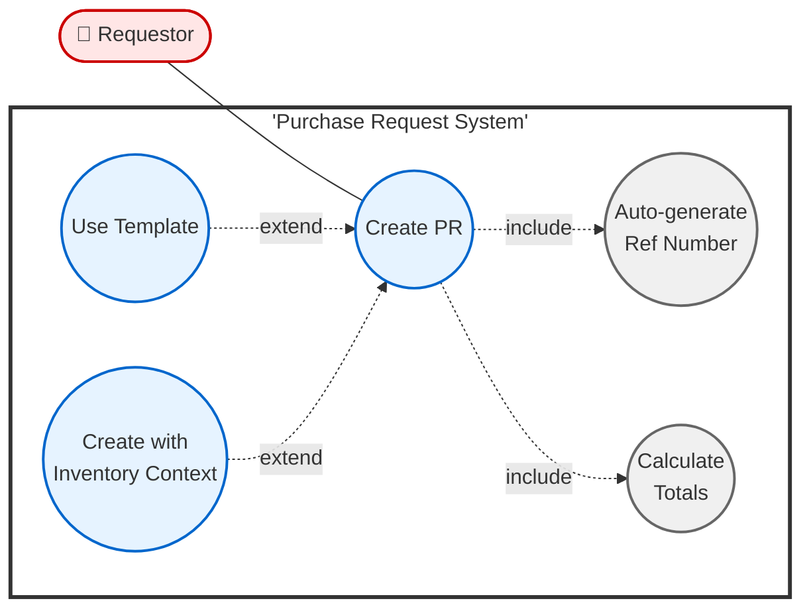
```mermaid
graph LR
    Requestor([👤 Requestor])

    subgraph PRS['Purchase Request System']
        UC001((Create PR))
        UC101((Auto-generate<br>Ref Number))
        UC102((Calculate<br>Totals))
        UC013((Use Template))
        UC014((Create with<br>Inventory Context))
    end

    Requestor --- UC001
    UC001 -.->|include| UC101
    UC001 -.->|include| UC102
    UC013 -.->|extend| UC001
    UC014 -.->|extend| UC001

    classDef actor fill:#ffe6e6,stroke:#cc0000,stroke-width:2px
    classDef usecase fill:#e6f3ff,stroke:#0066cc,stroke-width:2px
    classDef system fill:#f0f0f0,stroke:#666666,stroke-width:2px

    class Requestor actor
    class UC001,UC013,UC014 usecase
    class UC101,UC102 system

    style PRS fill:#ffffff,stroke:#333333,stroke-width:3px
```

#### Description
Allows staff to create a new purchase request by entering header information and adding line items for products or services they need to procure.

#### Preconditions
- User must be authenticated
- User must have 'create_purchase_request' permission
- User must have access to at least one department

#### Postconditions
- **Success**: PR saved as Draft with auto-generated reference number
- **Failure**: Error message displayed, no PR created

#### Main Flow
1. User clicks "New Purchase Request" button
2. System displays PR form with default values:
   - Today's date as PR date
   - User's default department selected
   - User's default location selected
   - Currency from user's location
   - Status set to "Draft"
3. User selects PR type (General/Market List/Asset)
4. User enters delivery date
5. User optionally modifies department, location, or other header fields
6. User adds line items:
   a. Clicks "Add Item" button
   b. Searches for and selects product (optional):
      - If **product manually selected from catalog**:
        * System loads product details
        * System defaults tax rate from **product table**
        * System loads price from product master (if available)
        * System displays "Adjust" checkbox (unchecked by default)
      - If **auto-allocate** triggered:
        * System retrieves tax rate from **price list**
        * System retrieves price from price list
        * System auto-fills item details
      - If **manual allocate**:
        * System assigns tax rate from **price list**
        * User manually enters or modifies values
   c. Enters description and specifications
   d. Enters quantity and unit of measure
   e. Enters unit price (optional for draft)
   f. System applies tax rate based on selection method (see step 6b)
   g. If FOC (Free of Charge) item applies:
      - User enters FOC quantity in dedicated FOC field (e.g., "FOC Qty: 5")
      - System automatically detects item as FOC when focQuantity > 0
      - User selects FOC unit from dropdown (may differ from order unit)
        * Examples: box, case, pallet, each, dozen
        * Required when FOC quantity is entered
      - System automatically sets unit price to 0 when FOC quantity > 0
      - System tracks both order quantity and FOC quantity for inventory conversion
      - Example: Order 100 kg at $12/kg, get 5 boxes FOC
   h. User can check "Adjust" checkbox:
      - When checked: Prevents automatic price updates
      - When unchecked: Allows system to update price from product/price list
   i. Optionally enters budget code, cost center, GL account
   j. Clicks "Add" to add item to PR
7. User repeats step 6 for additional items
8. System calculates line totals and PR total automatically
9. User optionally adds notes or internal notes
10. User clicks "Save as Draft"
11. System validates input (see VAL-PR-001)
12. System generates reference number (see UC-PR-101)
13. System saves PR to database
14. System logs activity
15. System displays success message with PR reference number
16. System redirects to PR detail page

#### Alternative Flows

**A1: Use Template** (Step 1)
1a. User clicks "New from Template" button
2a. System displays template selection dialog with:
   - List of available templates
   - Template metadata (name, type, last used date, item count)
   - Filter by template type (Market List, Standard Order, Fixed Asset)
   - Search by template name or description
   - Preview pane showing template details
3a. User optionally filters templates:
   - By type: Market List / Standard Order / Fixed Asset
   - By department: User's department or "All Departments" (if permission allows)
   - By last used: Recently used templates appear at top
4a. User hovers over or clicks template for preview:
   - Template header information (name, description, created by, last used)
   - List of items included in template with quantities and estimated prices
   - Total item count and estimated total amount
   - Notes or special instructions
5a. User selects desired template
6a. System displays template options dialog:
   ```
   ┌─ Apply Template: "Weekly Market List - Vegetables" ───────┐
   │                                                             │
   │ ☑ Copy all line items (15 items)                          │
   │ ☑ Use template quantities                                 │
   │ ☑ Update prices from last purchase                        │
   │ ☐ Include template notes                                  │
   │ ☐ Apply to specific delivery date: [________]             │
   │                                                             │
   │ 💡 Price Update Options:                                   │
   │ ◉ Use last purchase price (recommended)                    │
   │ ○ Use template saved price                                │
   │ ○ Leave prices blank for manual entry                     │
   │                                                             │
   │ ℹ️ Last used: 3 days ago                                  │
   │ ℹ️ Prices will be updated from purchases within last 30d  │
   │                                                             │
   │              [Cancel]  [Apply Template]                    │
   └─────────────────────────────────────────────────────────────┘
   ```
7a. User selects template options and clicks "Apply Template"
8a. System loads template data:
   - Copies all header fields from template (type, department, location if applicable)
   - Populates line items with template items
   - If "Update prices from last purchase" selected:
     * System queries last purchase price for each item from purchase history
     * System applies prices from last 30 days (most recent)
     * System marks items with updated prices
     * System notes items where no recent price found
   - If "Use template quantities" selected:
     * System copies quantities as-is from template
   - If "Include template notes" selected:
     * System copies notes field from template
9a. System displays loaded PR form with template data
10a. System shows notification: "Template applied. Review and modify as needed. Prices updated from recent purchases."
11a. System highlights items with price changes:
    ```
    ┌─ Line Item: Tomatoes (Roma, Fresh) ────────────────────┐
    │ Quantity: 25 kg                                         │
    │ Unit Price: $3.20/kg ⚡ Updated from last purchase     │
    │ Previous template price: $2.95/kg                      │
    │ Last purchase: 3 days ago from Vendor ABC             │
    └─────────────────────────────────────────────────────────┘
    ```
12a. User reviews pre-filled data and makes any necessary modifications:
    - Adjust quantities based on current needs
    - Verify/modify updated prices
    - Add or remove items as needed
    - Update delivery date
13a. Resume at step 6 (Add/modify line items)

**A2: Validation Errors** (Step 11)
11a. System detects validation errors
12a. System displays error messages inline
13a. User corrects errors
14a. Resume at step 10

**A3: Cancel Creation** (Any step)
1. User clicks "Cancel"
2. System prompts for confirmation
3. If confirmed:
   a. System discards unsaved changes
   b. System redirects to PR list
4. If not confirmed, resume at previous step

#### Exception Flows

**E1: Network Error** (Step 13)
1. System displays "Network error. Please try again."
2. System retains form data
3. User clicks "Retry"
4. Resume at step 10

**E2: Database Error** (Step 13)
1. System logs error details
2. System displays "Unable to save PR. Please contact support."
3. Use case ends

**E3: Session Expired** (Any step)
1. System detects expired session
2. System redirects to login
3. After login, system restores form data if possible
4. Resume at previous step

#### Business Rules
- BR-PR-001: Reference number auto-generated in format PR-YYMM-NNNN
- BR-PR-002: Delivery date must be after PR date
- BR-PR-003: At least one line item required before submission (not for draft)
- BR-PR-005: Only certain statuses allow editing
- BR-PR-011: Department and location required

#### Related Requirements
- FR-PR-001: Create purchase request
- FR-PR-002: Auto-generate reference numbers
- FR-PR-007: Multi-currency support

---

### UC-PR-002: Edit Purchase Request (Requestor)

**Priority**: High | **Status**: ✅ Implemented
**Frequency**: Daily (30-50 per day)
**Actors**: Requestor

#### Use Case Diagram

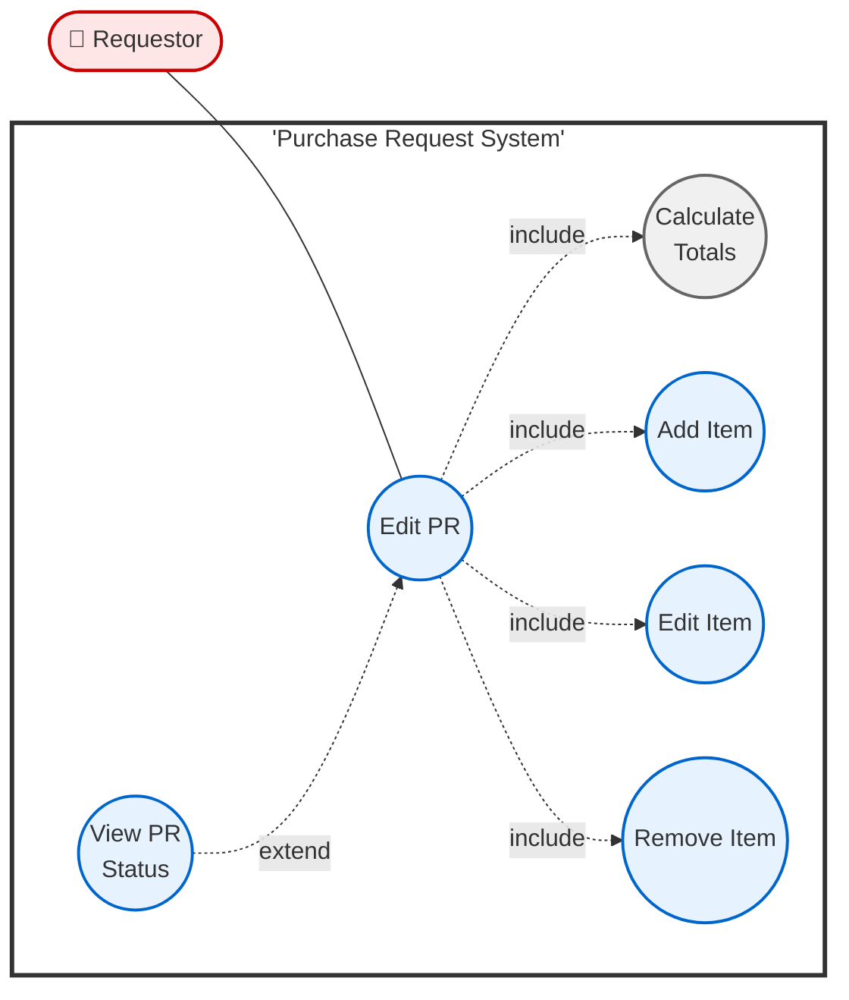
```mermaid
graph LR
    Requestor([👤 Requestor])

    subgraph PRS['Purchase Request System']
        UC002((Edit PR))
        UC102((Calculate<br>Totals))
        UC004((View PR<br>Status))
        UC002A((Add Item))
        UC002B((Edit Item))
        UC002C((Remove Item))
    end

    Requestor --- UC002
    UC002 -.->|include| UC102
    UC002 -.->|include| UC002A
    UC002 -.->|include| UC002B
    UC002 -.->|include| UC002C
    UC004 -.->|extend| UC002

    classDef actor fill:#ffe6e6,stroke:#cc0000,stroke-width:2px
    classDef usecase fill:#e6f3ff,stroke:#0066cc,stroke-width:2px
    classDef system fill:#f0f0f0,stroke:#666666,stroke-width:2px

    class Requestor actor
    class UC002,UC004,UC002A,UC002B,UC002C usecase
    class UC102 system

    style PRS fill:#ffffff,stroke:#333333,stroke-width:3px
```

#### Description
Allows requestor to modify a purchase request that is in Draft, Void, or Returned status. The requestor can edit header information, add/edit/remove line items, and save or submit the PR.

#### Preconditions
- User must be authenticated
- PR must exist
- PR status must be "Draft", "Void", or "Returned"
- User must be the creator of the PR

#### Postconditions
- **Success**: PR updated with new values, version incremented
- **Failure**: Error message displayed, PR unchanged

#### Editable Statuses

| Status | Can Edit | Can Submit | Notes |
|--------|----------|------------|-------|
| Draft | ✅ | ✅ | Initial state, full editing |
| Void | ✅ | ✅ | Rejected PR, can revise and resubmit |
| Returned | ✅ | ✅ | Returned for revision, address feedback |
| In-progress | ❌ | ❌ | Under approval, read-only |
| Approved | ❌ | ❌ | Approved, read-only |
| Completed | ❌ | ❌ | Converted to PO, read-only |
| Cancelled | ❌ | ❌ | Cancelled, read-only |

#### Main Flow
1. User opens PR from list or search
2. System checks PR status and ownership
3. System verifies status is editable (Draft, Void, or Returned)
4. System displays editable PR form with current values
5. System shows return/rejection reason if status is Returned or Void
6. User modifies header fields as needed:
   - Delivery Date
   - Notes/Description
   - Priority (if applicable)
7. User manages line items (see sub-flows below)
8. System recalculates totals automatically after each change
9. User chooses action:
   - **Save Draft**: Save without submitting
   - **Submit**: Submit for approval
10. System validates all fields (see VAL-PR-001)
11. System checks for version conflicts
12. System updates PR in database
13. System increments version number
14. If submitted: System changes status to "In-progress" and creates approval records
15. System logs activity with old/new values
16. System displays success message
17. System refreshes PR detail page

#### Sub-Flow: Add Line Item

**Trigger**: User clicks "Add Item" button

1. System displays item entry form/dialog
2. User searches for or selects product:
   - Search by name, SKU, or category
   - Browse product catalog
   - Enter free-text description (if allowed)
3. System displays product details and inventory info:
   - On-hand quantity
   - On-order quantity
   - Reorder point
   - Last purchase price (if visible to role)
4. User enters item details:
   - **Quantity** (required): Number of units needed
   - **Unit of Measure** (required): Selected from product's allowed UOMs
   - **Requested Delivery Date** (optional): Item-specific date
   - **Delivery Point** (optional): Specific delivery location
   - **Notes** (optional): Special instructions
5. System validates item fields:
   - Quantity > 0
   - Valid UOM for product
   - Delivery date >= PR date (if specified)
6. User clicks "Add" or "Add & Continue"
7. System adds item to PR item list
8. System recalculates PR totals
9. If "Add & Continue": Return to step 1
10. If "Add": Close dialog, return to main form

#### Sub-Flow: Edit Line Item

**Trigger**: User clicks on existing item row or "Edit" button

1. System displays item edit form with current values
2. User modifies allowed fields:
   - Quantity
   - Unit of Measure
   - Requested Delivery Date
   - Delivery Point
   - Notes
3. System validates changes
4. User clicks "Save" or "Cancel"
5. If Save: System updates item and recalculates totals
6. If Cancel: System discards changes

#### Sub-Flow: Remove Line Item

**Trigger**: User clicks "Remove" or delete icon on item row

1. System displays confirmation dialog:
   "Are you sure you want to remove [Item Name] from this PR?"
2. User confirms or cancels
3. If confirmed:
   - System removes item from PR
   - System recalculates totals
   - System logs removal
4. If cancelled: No action taken

#### Alternative Flows

**A1: Version Conflict** (Step 11)
11a. System detects version mismatch
12a. System displays "This PR was modified by another user"
13a. System shows option to:
   - View latest version and discard changes
   - Overwrite with user's changes (if admin)
14a. User selects option
15a. System processes accordingly

**A2: Cancel Editing** (Any step)
1. User clicks "Cancel"
2. System prompts for confirmation if changes made
3. If confirmed, system discards changes and shows read-only view
4. If not confirmed, resume editing

**A3: Edit Returned PR** (Step 5)
5a. System displays return reason prominently at top of form
5b. System highlights fields mentioned in return reason (if identifiable)
5c. User addresses feedback and makes corrections
5d. Resume at step 6

**A4: Edit Void PR** (Step 5)
5a. System displays rejection reason prominently at top of form
5b. User reviews rejection feedback
5c. User decides to revise or abandon PR
5d. If revising: Resume at step 6
5e. If abandoning: User cancels PR (separate use case)

#### Exception Flows

**E1: PR Status Changed** (Step 2)
1. System detects status changed to non-editable status
2. System displays "This PR can no longer be edited"
3. System shows read-only view
4. Use case ends

**E2: Permission Revoked** (Step 2)
1. System detects user no longer has edit permission
2. System displays "You no longer have permission to edit this PR"
3. System shows read-only view
4. Use case ends

**E3: Minimum Items Required** (Step 10)
1. System detects PR has no items
2. System displays "At least one item is required"
3. User must add at least one item before saving/submitting
4. Resume at step 7

**E4: Product No Longer Available** (Sub-Flow Add Item, Step 2)
1. System detects selected product is discontinued or inactive
2. System displays warning "This product is no longer available"
3. User must select different product
4. Resume at step 2

#### Requestor Editable Fields

| Field | Draft | Void | Returned | Notes |
|-------|-------|------|----------|-------|
| Delivery Date | ✅ | ✅ | ✅ | Header level |
| Notes/Description | ✅ | ✅ | ✅ | Header level |
| Priority | ✅ | ✅ | ✅ | If enabled |
| Item Quantity | ✅ | ✅ | ✅ | Line item |
| Item UOM | ✅ | ✅ | ✅ | Line item |
| Item Delivery Date | ✅ | ✅ | ✅ | Line item |
| Item Delivery Point | ✅ | ✅ | ✅ | Line item |
| Item Notes | ✅ | ✅ | ✅ | Line item |
| Add Items | ✅ | ✅ | ✅ | Can add new |
| Remove Items | ✅ | ✅ | ✅ | Can remove |
| Vendor | ❌ | ❌ | ❌ | Purchasing only |
| Unit Price | ❌ | ❌ | ❌ | Purchasing only |
| Tax Profile | ❌ | ❌ | ❌ | Purchasing only |
| Discount | ❌ | ❌ | ❌ | Purchasing only |

#### Business Rules
- BR-PR-005: Draft, Void, and Returned PRs can be edited by requestor
- BR-PR-005B: Returned PR allows editing of all requestor fields
- BR-PR-006: Only creator can edit their PRs
- BR-PR-015: Version control prevents concurrent edit conflicts
- BR-PR-ITEM-001: At least one item required to save/submit

#### Related Requirements
- FR-PR-003: Edit purchase request
- FR-PR-002: Item Management
- FR-PR-015: Version control

---

### UC-PR-003: Submit Purchase Request for Approval

**Priority**: Critical | **Status**: 🔧 Partial
**Frequency**: Daily (40-80 per day)
**Actors**: Requestor

#### Use Case Diagram

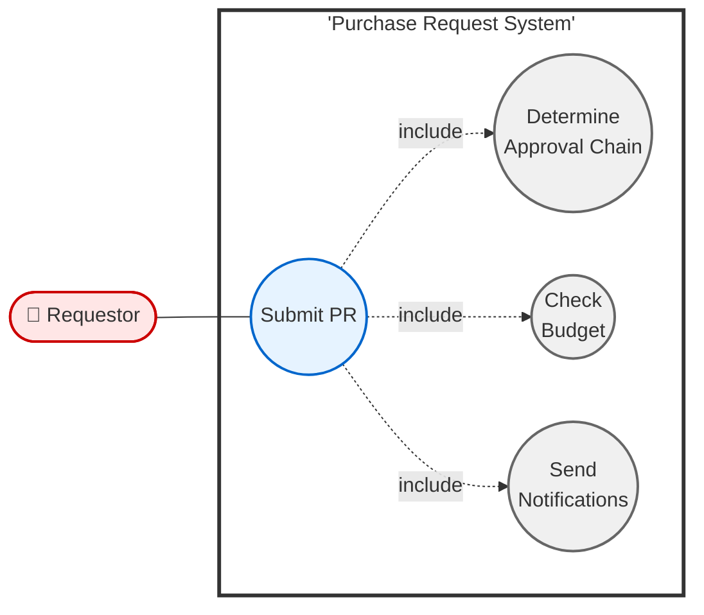
```mermaid
graph LR
    Requestor([👤 Requestor])

    subgraph PRS['Purchase Request System']
        UC003((Submit PR))
        UC103((Determine<br>Approval Chain))
        UC104((Check<br>Budget))
        UC105((Send<br>Notifications))
    end

    Requestor --- UC003
    UC003 -.->|include| UC103
    UC003 -.->|include| UC104
    UC003 -.->|include| UC105

    classDef actor fill:#ffe6e6,stroke:#cc0000,stroke-width:2px
    classDef usecase fill:#e6f3ff,stroke:#0066cc,stroke-width:2px
    classDef system fill:#f0f0f0,stroke:#666666,stroke-width:2px

    class Requestor actor
    class UC003 usecase
    class UC103,UC104,UC105 system

    style PRS fill:#ffffff,stroke:#333333,stroke-width:3px
```

#### Description
Allows requestor to submit a draft PR for approval, triggering the approval workflow.

#### Preconditions
- User must be authenticated
- PR must exist in "Draft" status
- User must be the creator of the PR
- PR must have at least one line item
- All line items must have unit prices
- Delivery date must be in the future
- Approval workflow must be configured

#### Postconditions
- **Success**: PR status changed to "In-progress", approval records created, notifications sent
- **Failure**: Error message displayed, PR remains in Draft

#### Main Flow
1. User opens Draft PR
2. User clicks "Submit for Approval" button
3. System validates PR completeness (see VAL-PR-107, VAL-PR-108, VAL-PR-109)
4. System determines approval chain (see UC-PR-103)
5. System displays preview of approval chain
6. User confirms submission
7. System begins transaction
8. System creates approval records for each stage
9. System updates PR status to "In-progress"
10. System updates approval status to "Pending"
11. System commits transaction
12. System sends notification to first approver (see UC-PR-105)
13. System logs activity
14. System displays success message
15. System updates PR detail page to show submission status

#### Alternative Flows

**A1: Review Before Submit** (Step 2)
2a. User clicks "Preview Approval Chain"
3a. System displays who will approve and order
4a. User reviews chain
5a. User clicks "Submit"
6a. Resume at step 3

**A2: Auto-Approve** (Step 4)
4a. System determines no approval required (e.g., Market List < $500)
5a. System updates PR status directly to "Approved"
6a. System displays "PR auto-approved"
7a. Use case ends

#### Exception Flows

**E1: Validation Failed** (Step 3)
1. System detects validation errors
2. System displays specific error messages
3. System highlights problematic fields
4. User must correct errors
5. Resume at step 2

**E2: No Approval Workflow** (Step 4)
1. System detects no approval workflow configured
2. System displays "No approval workflow configured. Contact administrator."
3. PR remains in Draft
4. Use case ends

**E3: Notification Failure** (Step 12)
1. System logs notification failure
2. System queues notification for retry
3. System still marks PR as In-progress
4. System displays warning: "PR submitted but notification may be delayed"
5. Use case continues

#### Business Rules
- BR-PR-003: At least one item required
- BR-PR-004: All items must have prices
- BR-PR-006: Approval chain required
- BR-PR-007: Market List auto-approve under threshold
- BR-PR-008: Budget availability check if budget code provided
- BR-PR-009: Asset type requires asset manager

#### Related Requirements
- FR-PR-004: Submit for approval
- FR-PR-005: Approval workflow
- FR-PR-006: Notifications

---

### UC-PR-004: View Purchase Request Status

**Priority**: High | **Status**: ✅ Implemented
**Frequency**: Continuous (monitoring)
**Actors**: Requestor, Approvers, Purchasing Staff

#### Use Case Diagram

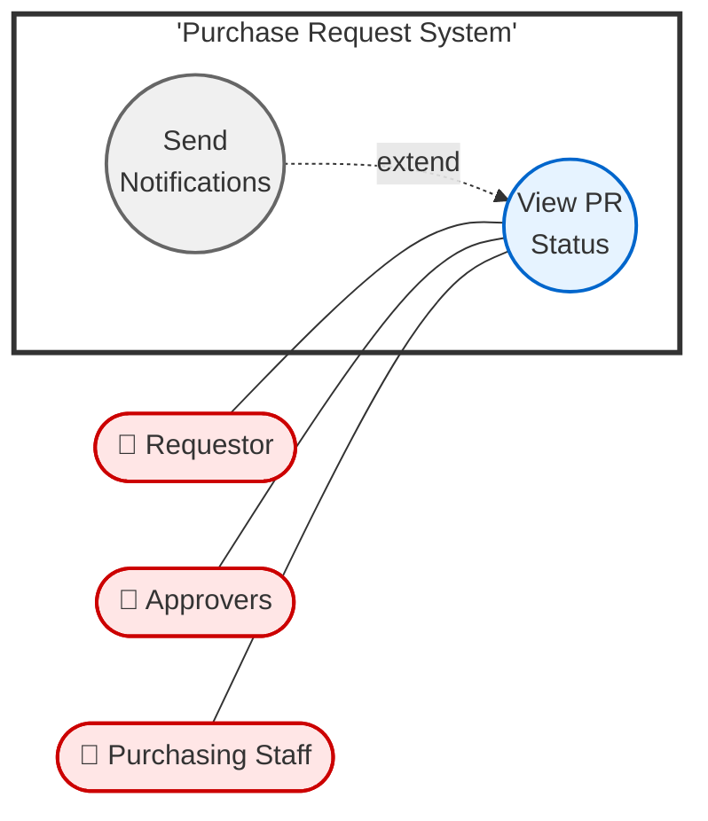
```mermaid
graph LR
    Requestor([👤 Requestor])
    Approvers([👔 Approvers])
    Purchasing([🛒 Purchasing Staff])

    subgraph PRS['Purchase Request System']
        UC004((View PR<br>Status))
        UC105((Send<br>Notifications))
    end

    Requestor --- UC004
    Approvers --- UC004
    Purchasing --- UC004
    UC105 -.->|extend| UC004

    classDef actor fill:#ffe6e6,stroke:#cc0000,stroke-width:2px
    classDef usecase fill:#e6f3ff,stroke:#0066cc,stroke-width:2px
    classDef system fill:#f0f0f0,stroke:#666666,stroke-width:2px

    class Requestor,Approvers,Purchasing actor
    class UC004 usecase
    class UC105 system

    style PRS fill:#ffffff,stroke:#333333,stroke-width:3px
```

#### Description
Allows users to view the current status of a purchase request, including approval progress, comments, and history.

#### Preconditions
- User must be authenticated
- PR must exist
- User must have view permission (creator, approver, or purchasing staff)

#### Postconditions
- **Success**: PR details and status displayed
- **Failure**: Access denied message or PR not found

#### Main Flow
1. User navigates to PR list or searches for PR
2. User clicks on PR reference number
3. System checks user permissions
4. System retrieves PR data with related records
5. System displays PR detail page showing:
   - Header information (type, dates, department, amounts)
   - Status badge (Draft, In-progress, Approved, etc.)
   - Line items with quantities and prices
   - Approval progress:
     * List of approval stages
     * Current stage highlighted
     * Status of each approval (Pending/Approved/Void)
     * Approver names and timestamps
     * Comments from approvers
   - Attachments list
   - Comments/notes
   - Activity log
   - Related documents (PO if converted)
6. User views information
7. User optionally:
   - Exports to PDF
   - Prints
   - Shares link
   - Takes action (if permitted)

#### Alternative Flows

**A1: Track PR from Email** (Step 1)
1a. User clicks PR link in email notification
2a. System validates link and authentication
3a. Resume at step 4

**A2: Real-time Updates** (Step 6)
6a. While viewing, another user updates PR
7a. System displays notification "This PR was updated"
8a. System shows option to refresh
9a. If user refreshes, system reloads latest data

#### Exception Flows

**E1: Access Denied** (Step 3)
1. System detects user lacks permission
2. System displays "You do not have access to this PR"
3. Use case ends

**E2: PR Not Found** (Step 4)
1. System cannot find PR with given ID
2. System displays "Purchase request not found"
3. System redirects to PR list
4. Use case ends

#### Business Rules
- BR-PR-012: View access based on department/location
- BR-PR-013: Approvers can view PRs pending their approval
- BR-PR-014: Purchasing staff can view all submitted PRs

#### Related Requirements
- FR-PR-008: View PR details
- FR-PR-009: Track approval status

---

### UC-PR-005: Approve Purchase Request

**Priority**: Critical | **Status**: 🔧 Partial
**Frequency**: Daily (30-60 per day)
**Actors**: Department Manager, Finance Manager, General Manager, Asset Manager

#### Use Case Diagram

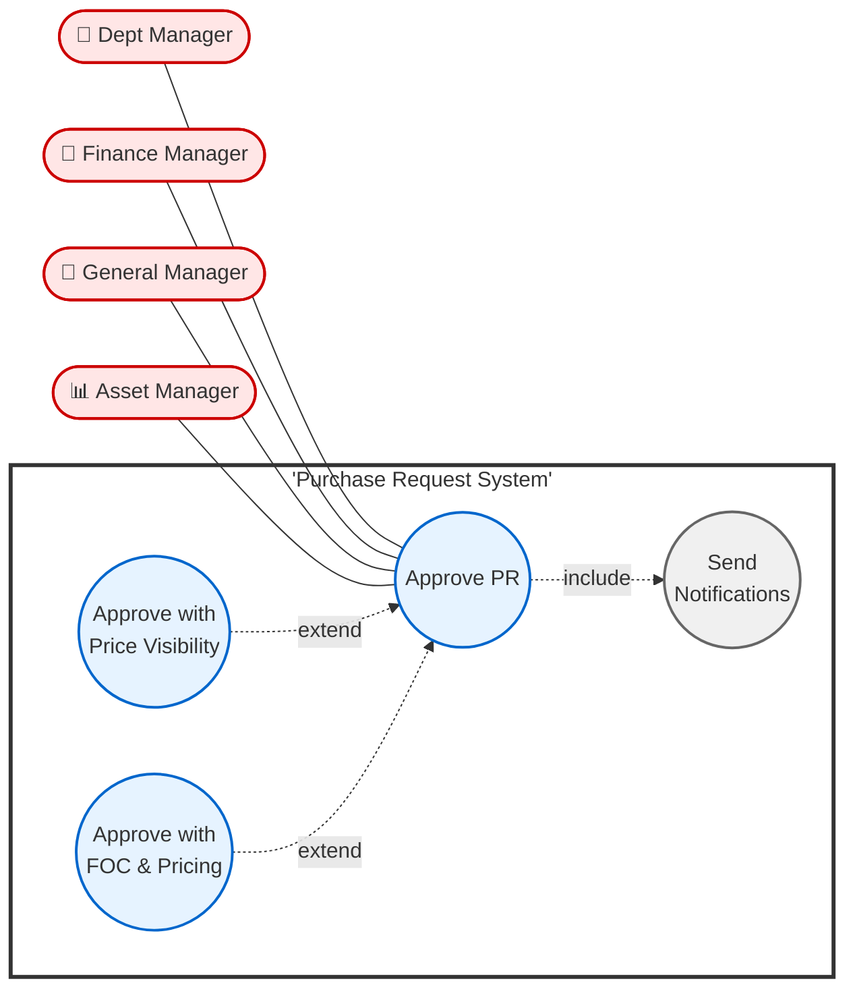
```mermaid
graph LR
    DeptMgr([👔 Dept Manager])
    FinMgr([💼 Finance Manager])
    GenMgr([🎩 General Manager])
    AssetMgr([📊 Asset Manager])

    subgraph PRS['Purchase Request System']
        UC005((Approve PR))
        UC105((Send<br>Notifications))
        UC015((Approve with<br>Price Visibility))
        UC016((Approve with<br>FOC & Pricing))
    end

    DeptMgr --- UC005
    FinMgr --- UC005
    GenMgr --- UC005
    AssetMgr --- UC005
    UC005 -.->|include| UC105
    UC015 -.->|extend| UC005
    UC016 -.->|extend| UC005

    classDef actor fill:#ffe6e6,stroke:#cc0000,stroke-width:2px
    classDef usecase fill:#e6f3ff,stroke:#0066cc,stroke-width:2px
    classDef system fill:#f0f0f0,stroke:#666666,stroke-width:2px

    class DeptMgr,FinMgr,GenMgr,AssetMgr actor
    class UC005,UC015,UC016 usecase
    class UC105 system

    style PRS fill:#ffffff,stroke:#333333,stroke-width:3px
```

#### Description
Allows designated approver to review and approve a purchase request at their approval stage.

#### Preconditions
- User must be authenticated
- User must be the designated approver for current stage
- PR must be in "In-progress" status
- Approval record must be in "Pending" status
- User's turn in sequential approval chain (if applicable)

#### Postconditions
- **Success**: Approval recorded, PR advances to next stage or becomes fully approved
- **Failure**: Error message displayed, approval unchanged

#### Main Flow
1. Approver receives notification (email/app)
2. Approver clicks link to view PR
3. System displays PR details with approval options
4. Approver reviews:
   - Items and quantities
   - Prices and totals
   - Justification/notes
   - Budget impact
   - Previous approval comments (if any)
5. Approver optionally adds comments
6. Approver clicks "Approve" button
7. System validates approver authority
8. System begins transaction
9. System updates approval record:
   - Status = "Approved"
   - Timestamp = current time
   - Comments saved
10. System checks if all required approvals complete
11. If all approvals complete:
    a. System updates PR status to "Approved"
    b. System sends notification to PR creator
    c. System notifies purchasing staff
12. If more approvals needed:
    a. System identifies next approver
    b. System sends notification to next approver
13. System commits transaction
14. System logs approval activity
15. System displays success message
16. System updates approval status display

#### Alternative Flows

**A1: Approve with Conditions** (Step 6)
6a. Approver clicks "Approve with Conditions"
7a. System prompts for conditions/comments (required)
8a. Approver enters conditions
9a. Resume at step 7 (approval still proceeds but flagged)

**A2: Request More Information** (Step 6)
6a. Approver clicks "Request Information"
7a. System prompts for questions/comments (required)
8a. Approver enters questions
9a. System sends notification to PR creator
10a. Approval remains "Pending"
11a. Use case ends (creator must respond)

**A3: Delegate Approval** (Step 6)
6a. Approver clicks "Delegate"
7a. System displays list of possible delegates
8a. Approver selects delegate and enters reason
9a. System updates approver for this record
10a. System sends notification to delegate
11a. Use case ends

#### Exception Flows

**E1: Already Approved** (Step 7)
1. System detects approval already processed
2. System displays "This PR has already been approved"
3. System shows read-only approval status
4. Use case ends

**E2: PR Status Changed** (Step 7)
1. System detects PR status changed (e.g., Cancelled)
2. System displays "This PR is no longer pending approval"
3. System shows current status
4. Use case ends

**E3: Approver Changed** (Step 7)
1. System detects approver was changed/delegated
2. System displays "You are no longer the approver for this PR"
3. Use case ends

#### Business Rules
- BR-PR-016: Approver must be designated for current stage
- BR-PR-017: Sequential approvals must follow order
- BR-PR-018: Parallel approvals can be done in any order
- BR-PR-019: All parallel approvals must complete before next stage

#### Related Requirements
- FR-PR-005: Approval workflow
- FR-PR-010: Delegation
- FR-PR-006: Notifications

---

### UC-PR-006: Reject Purchase Request

**Priority**: High | **Status**: 🔧 Partial
**Frequency**: Weekly (5-15 per week)
**Actors**: Department Manager, Finance Manager, General Manager, Asset Manager

#### Use Case Diagram

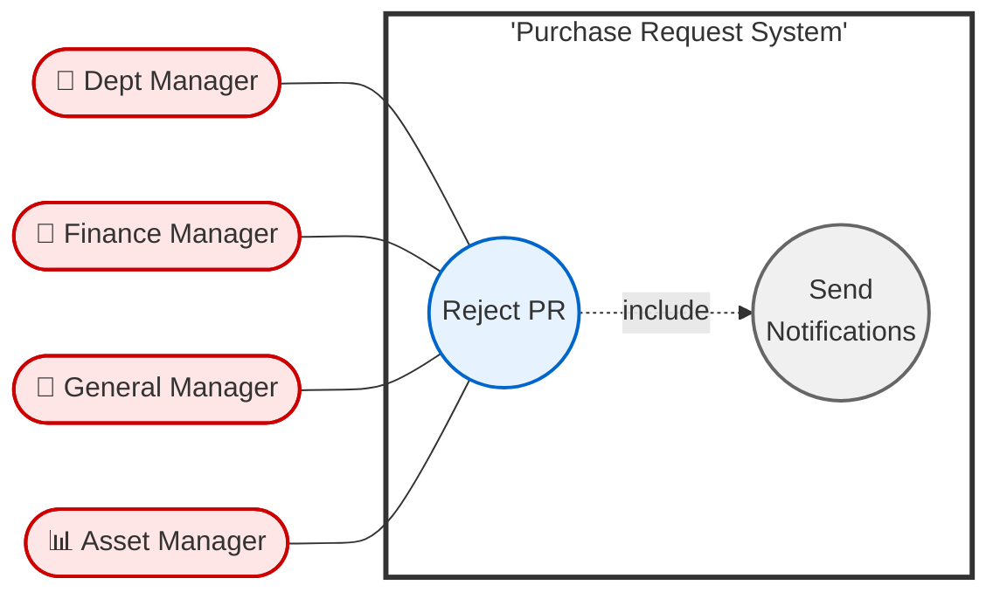
```mermaid
graph LR
    DeptMgr([👔 Dept Manager])
    FinMgr([💼 Finance Manager])
    GenMgr([🎩 General Manager])
    AssetMgr([📊 Asset Manager])

    subgraph PRS['Purchase Request System']
        UC006((Reject PR))
        UC105((Send<br>Notifications))
    end

    DeptMgr --- UC006
    FinMgr --- UC006
    GenMgr --- UC006
    AssetMgr --- UC006
    UC006 -.->|include| UC105

    classDef actor fill:#ffe6e6,stroke:#cc0000,stroke-width:2px
    classDef usecase fill:#e6f3ff,stroke:#0066cc,stroke-width:2px
    classDef system fill:#f0f0f0,stroke:#666666,stroke-width:2px

    class DeptMgr,FinMgr,GenMgr,AssetMgr actor
    class UC006 usecase
    class UC105 system

    style PRS fill:#ffffff,stroke:#333333,stroke-width:3px
```

#### Description
Allows approver to reject a purchase request with required justification, returning it to the requestor.

#### Preconditions
- Same as UC-PR-005 (Approve PR)
- Comments must be provided (minimum 10 characters)

#### Postconditions
- **Success**: PR status changed to "Void", requestor notified
- **Failure**: Error message displayed, approval unchanged

#### Main Flow
1. Approver receives notification and views PR (same as UC-PR-005 steps 1-4)
2. Approver identifies reason for rejection
3. Approver clicks "Reject" button
4. System displays rejection dialog
5. System prompts for rejection reason (required)
6. Approver enters detailed reason (minimum 10 characters)
7. Approver clicks "Confirm Rejection"
8. System validates comments length
9. System begins transaction
10. System updates approval record:
    - Status = "Void"
    - Timestamp = current time
    - Comments saved
11. System updates PR status to "Void"
12. System cancels all other pending approvals
13. System commits transaction
14. System sends rejection notification to PR creator with comments
15. System logs rejection activity
16. System displays confirmation message
17. System updates PR detail page

#### Alternative Flows

**A1: Cancel Rejection** (Step 7)
7a. Approver clicks "Cancel"
8a. System closes dialog
9a. PR remains in pending state
10a. Use case ends

#### Exception Flows

**E1: Insufficient Comments** (Step 8)
1. System detects comments < 10 characters
2. System displays "Please provide detailed reason (minimum 10 characters)"
3. System keeps dialog open
4. Resume at step 6

**E2: Already Processed** (Step 9)
1. System detects approval already approved/rejected
2. System displays "This approval was already processed"
3. Use case ends

#### Business Rules
- BR-PR-010: Rejection comments required (min 10 chars)
- BR-PR-020: Rejection returns PR to Draft or Void status
- BR-PR-021: Void PR can be edited and resubmitted

#### Related Requirements
- FR-PR-005: Approval workflow
- FR-PR-011: Rejection handling
- FR-PR-006: Notifications

---

### UC-PR-007: Recall Purchase Request

**Priority**: Medium | **Status**: 🚧 Pending
**Frequency**: Weekly (5-10 per week)
**Actors**: Requestor

#### Use Case Diagram

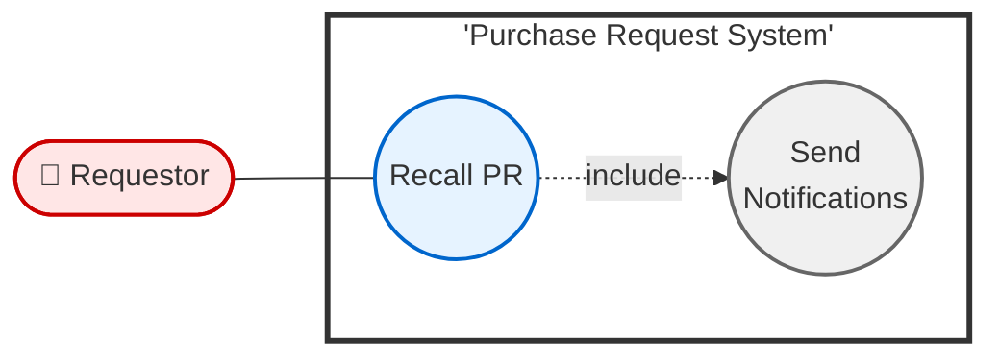
```mermaid
graph LR
    Requestor([👤 Requestor])

    subgraph PRS['Purchase Request System']
        UC007((Recall PR))
        UC105((Send<br>Notifications))
    end

    Requestor --- UC007
    UC007 -.->|include| UC105

    classDef actor fill:#ffe6e6,stroke:#cc0000,stroke-width:2px
    classDef usecase fill:#e6f3ff,stroke:#0066cc,stroke-width:2px
    classDef system fill:#f0f0f0,stroke:#666666,stroke-width:2px

    class Requestor actor
    class UC007 usecase
    class UC105 system

    style PRS fill:#ffffff,stroke:#333333,stroke-width:3px
```

#### Description
Allows requestor to recall a submitted PR before it is fully approved, returning it to Draft status for editing.

#### Preconditions
- User must be authenticated
- User must be the PR creator
- PR status must be "In-progress"
- PR must not be fully approved yet

#### Postconditions
- **Success**: PR status changed to "Draft", pending approvals cancelled
- **Failure**: Error message displayed, PR unchanged

#### Main Flow
1. Requestor opens submitted PR
2. Requestor reviews current approval status
3. Requestor clicks "Recall" button
4. System displays confirmation dialog with warning
5. System prompts for recall reason (optional)
6. Requestor confirms recall
7. System begins transaction
8. System updates all pending approval records to "Recalled"
9. System updates PR status to "Draft"
10. System commits transaction
11. System sends notifications to pending approvers (cancellation)
12. System logs recall activity with reason
13. System displays success message
14. System displays editable PR form

#### Alternative Flows

**A1: Cancel Recall** (Step 6)
6a. Requestor clicks "Cancel"
7a. System closes dialog
8a. PR remains In-progress
9a. Use case ends

#### Exception Flows

**E1: Already Approved** (Step 7)
1. System detects all approvals complete
2. System displays "Cannot recall. PR already fully approved."
3. Use case ends

**E2: In Final Stage** (Step 7)
1. System detects PR in final approval stage
2. System displays additional warning "PR in final approval stage"
3. System asks for confirmation
4. If confirmed, proceed with recall
5. If cancelled, use case ends

#### Business Rules
- BR-PR-022: Only creator can recall
- BR-PR-023: Cannot recall if fully approved
- BR-PR-024: Recalled PR returns to Draft status

#### Related Requirements
- FR-PR-012: Recall functionality

---

### UC-PR-008: Cancel Purchase Request

**Priority**: Medium | **Status**: 🚧 Pending
**Frequency**: Monthly (10-20 per month)
**Actors**: Requestor, Department Manager

#### Use Case Diagram

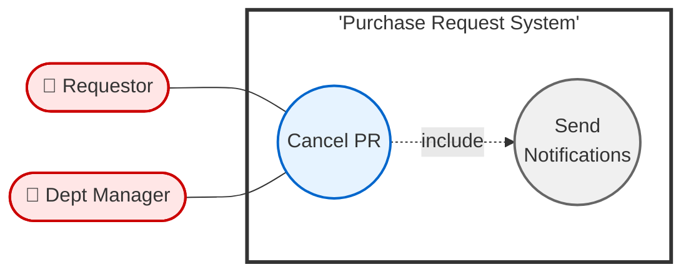
```mermaid
graph LR
    Requestor([👤 Requestor])
    DeptMgr([👔 Dept Manager])

    subgraph PRS['Purchase Request System']
        UC008((Cancel PR))
        UC105((Send<br>Notifications))
    end

    Requestor --- UC008
    DeptMgr --- UC008
    UC008 -.->|include| UC105

    classDef actor fill:#ffe6e6,stroke:#cc0000,stroke-width:2px
    classDef usecase fill:#e6f3ff,stroke:#0066cc,stroke-width:2px
    classDef system fill:#f0f0f0,stroke:#666666,stroke-width:2px

    class Requestor,DeptMgr actor
    class UC008 usecase
    class UC105 system

    style PRS fill:#ffffff,stroke:#333333,stroke-width:3px
```

#### Description
Allows authorized user to cancel a PR at any status except Completed.

#### Preconditions
- User must be authenticated
- User must be PR creator OR have cancel permission
- PR status must not be "Completed" or "Cancelled"

#### Postconditions
- **Success**: PR status changed to "Cancelled"
- **Failure**: Error message displayed, PR unchanged

#### Main Flow
1. User opens PR
2. User clicks "Cancel PR" button
3. System checks if PR can be cancelled
4. System displays confirmation dialog
5. System prompts for cancellation reason (required)
6. User enters reason
7. User confirms cancellation
8. System begins transaction
9. System updates PR status to "Cancelled"
10. System cancels all pending approvals
11. If budget was reserved, system releases budget
12. System commits transaction
13. System sends cancellation notifications
14. System logs cancellation activity
15. System displays confirmation message
16. System shows cancelled PR (read-only)

#### Alternative Flows

**A1: Cancel After Approval** (Step 3)
3a. PR is already approved
4a. System checks for linked PO
5a. If PO exists, display "Cannot cancel. PR converted to PO-XXXX"
6a. Use case ends
7a. If no PO, continue with cancellation

#### Exception Flows

**E1: PR Already Completed** (Step 3)
1. System detects PR has linked PO
2. System displays "Cannot cancel. PR converted to PO. Please cancel PO instead."
3. Use case ends

#### Business Rules
- BR-PR-025: Cannot cancel converted PRs
- BR-PR-026: Budget released on cancellation
- BR-PR-027: Cancellation reason required

#### Related Requirements
- FR-PR-013: Cancellation functionality

---

### UC-PR-009: Add Attachment to PR

**Priority**: Medium | **Status**: 🚧 Pending
**Frequency**: Weekly (20-40 per week)
**Actors**: Requestor, Approvers

#### Use Case Diagram

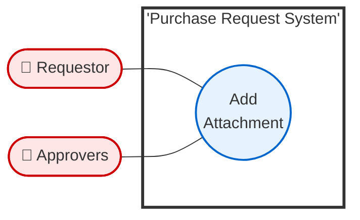
```mermaid
graph LR
    Requestor([👤 Requestor])
    Approvers([👔 Approvers])

    subgraph PRS['Purchase Request System']
        UC009((Add<br>Attachment))
    end

    Requestor --- UC009
    Approvers --- UC009

    classDef actor fill:#ffe6e6,stroke:#cc0000,stroke-width:2px
    classDef usecase fill:#e6f3ff,stroke:#0066cc,stroke-width:2px

    class Requestor,Approvers actor
    class UC009 usecase

    style PRS fill:#ffffff,stroke:#333333,stroke-width:3px
```

#### Description
Allows authorized users to attach files (quotes, specifications, images) to a PR.

#### Preconditions
- User must be authenticated
- User must be PR creator or approver
- PR must exist
- File size must be < 10MB
- File type must be allowed (PDF, DOC, XLS, JPG, PNG)

#### Postconditions
- **Success**: File uploaded and linked to PR
- **Failure**: Error message displayed, no file attached

#### Main Flow
1. User opens PR detail page
2. User scrolls to Attachments section
3. User clicks "Add Attachment" button
4. System opens file picker dialog
5. User selects file from device
6. System validates file (size, type)
7. User optionally enters description
8. User selects attachment type (Quote/Specification/Drawing/Image/Other)
9. User clicks "Upload"
10. System displays upload progress
11. System uploads file to storage (Supabase)
12. System creates attachment record in database
13. System logs activity
14. System displays success message
15. System refreshes attachments list

#### Alternative Flows

**A1: Drag and Drop** (Step 4)
4a. User drags file onto attachment area
5a. System detects file drop
6a. Resume at step 6

**A2: Multiple Files** (Step 5)
5a. User selects multiple files
6a. System validates each file
7a. System uploads files sequentially
8a. System displays progress for each
9a. Resume at step 15

#### Exception Flows

**E1: File Too Large** (Step 6)
1. System detects file > 10MB
2. System displays "File size exceeds 10MB limit"
3. Resume at step 4

**E2: Invalid File Type** (Step 6)
1. System detects invalid file extension
2. System displays "File type not allowed"
3. Resume at step 4

**E3: Upload Failed** (Step 11)
1. System encounters upload error
2. System displays "Upload failed. Please try again."
3. System provides retry option
4. Resume at step 9

#### Business Rules
- BR-PR-028: Max file size 10MB
- BR-PR-029: Allowed file types only
- BR-PR-030: Attachments visible to all with PR access

#### Related Requirements
- FR-PR-014: Attachment management

---

### UC-PR-010: Add Comment to PR

**Priority**: Medium | **Status**: 🚧 Pending
**Frequency**: Daily (30-50 per day)
**Actors**: Requestor, Approvers, Purchasing Staff

#### Use Case Diagram

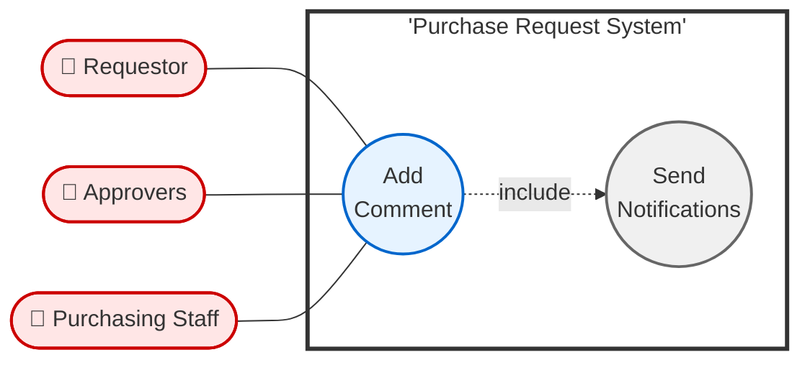
```mermaid
graph LR
    Requestor([👤 Requestor])
    Approvers([👔 Approvers])
    Purchasing([🛒 Purchasing Staff])

    subgraph PRS['Purchase Request System']
        UC010((Add<br>Comment))
        UC105((Send<br>Notifications))
    end

    Requestor --- UC010
    Approvers --- UC010
    Purchasing --- UC010
    UC010 -.->|include| UC105

    classDef actor fill:#ffe6e6,stroke:#cc0000,stroke-width:2px
    classDef usecase fill:#e6f3ff,stroke:#0066cc,stroke-width:2px
    classDef system fill:#f0f0f0,stroke:#666666,stroke-width:2px

    class Requestor,Approvers,Purchasing actor
    class UC010 usecase
    class UC105 system

    style PRS fill:#ffffff,stroke:#333333,stroke-width:3px
```

#### Description
Allows users to add comments and questions to a PR, supporting threaded discussions.

#### Preconditions
- User must be authenticated
- User must have view access to PR
- PR must exist

#### Postconditions
- **Success**: Comment added and visible to authorized users
- **Failure**: Error message displayed, comment not saved

#### Main Flow
1. User opens PR detail page
2. User scrolls to Comments section
3. User clicks "Add Comment" button
4. System displays comment form
5. User types comment text
6. User optionally:
   - Marks as internal (visible to approvers only)
   - Mentions other users with @username
   - Attaches files
7. User clicks "Post Comment"
8. System validates comment (not empty, length < 2000 chars)
9. System saves comment to database
10. System sends notifications to mentioned users
11. System logs activity
12. System displays success message
13. System refreshes comments list showing new comment

#### Alternative Flows

**A1: Reply to Comment** (Step 3)
3a. User clicks "Reply" on existing comment
4a. System displays reply form with parent comment context
5a. User types reply
6a. Resume at step 7

**A2: Edit Comment** (Step 3)
3a. User clicks "Edit" on their own comment
4a. System loads comment text into form
5a. User modifies text
6a. User clicks "Update"
7a. System marks comment as edited
8a. System saves changes
9a. Use case ends

**A3: Delete Comment** (Step 3)
3a. User clicks "Delete" on their own comment
4a. System prompts for confirmation
5a. User confirms
6a. System soft-deletes comment
7a. System displays "[Comment deleted]"
8a. Use case ends

#### Exception Flows

**E1: Empty Comment** (Step 8)
1. System detects empty comment
2. System displays "Comment cannot be empty"
3. Resume at step 5

**E2: Comment Too Long** (Step 8)
1. System detects comment > 2000 characters
2. System displays "Comment exceeds maximum length"
3. System shows character count
4. Resume at step 5

#### Business Rules
- BR-PR-031: Comments support threading (replies)
- BR-PR-032: Internal comments visible to staff only
- BR-PR-033: User mentions send notifications

#### Related Requirements
- FR-PR-015: Comments and collaboration

---

### UC-PR-011: Convert Purchase Request to Purchase Order

**Priority**: Critical | **Status**: 🚧 Pending
**Frequency**: Daily (30-50 per day)
**Actors**: Purchasing Staff

#### Use Case Diagram

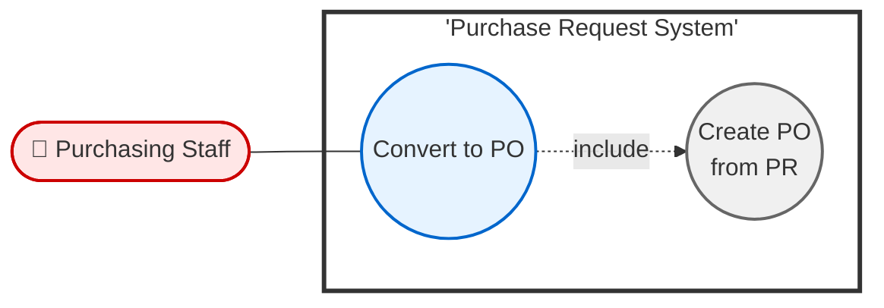
```mermaid
graph LR
    Purchasing([🛒 Purchasing Staff])

    subgraph PRS['Purchase Request System']
        UC011((Convert to PO))
        UC201((Create PO<br>from PR))
    end

    Purchasing --- UC011
    UC011 -.->|include| UC201

    classDef actor fill:#ffe6e6,stroke:#cc0000,stroke-width:2px
    classDef usecase fill:#e6f3ff,stroke:#0066cc,stroke-width:2px
    classDef system fill:#f0f0f0,stroke:#666666,stroke-width:2px

    class Purchasing actor
    class UC011 usecase
    class UC201 system

    style PRS fill:#ffffff,stroke:#333333,stroke-width:3px
```

#### Description
Allows purchasing staff to convert an approved PR into a PO for sending to vendors.

#### Preconditions
- User must be authenticated
- User must have purchasing staff role
- PR must be in "Approved" status
- PR must not already be converted

#### Postconditions
- **Success**: PO created, PR status changed to "Completed", PR-PO link established
- **Failure**: Error message displayed, no PO created

#### Main Flow
1. Purchasing staff opens approved PR
2. System displays "Convert to PO" button
3. User clicks "Convert to PO"
4. System begins conversion process:
   a. System validates PR is approved
   b. System checks for existing PO link
   c. System retrieves PR data
5. System displays PO creation form pre-filled with PR data:
   - Items from PR
   - Delivery date from PR
   - Department/location from PR
   - Total amount from PR
6. User reviews and modifies PO as needed:
   - Selects vendor(s)
   - Adjusts delivery dates
   - Splits items across vendors if needed
   - Adds PO-specific fields (payment terms, delivery address)
7. User clicks "Create PO"
8. System begins transaction
9. System creates PO header and items
10. System creates PR-PO link record
11. System updates PR status to "Completed"
12. System commits transaction
13. System sends notification to PR creator
14. System logs activity
15. System displays success message with PO number
16. System provides link to new PO

#### Alternative Flows

**A1: Split to Multiple POs** (Step 6)
6a. User selects "Split to Multiple POs"
7a. System groups items by vendor or delivery date
8a. User reviews grouping
9a. System creates multiple POs
10a. System links all POs to PR
11a. Resume at step 11

**A2: Partial Conversion** (Step 6)
6a. User selects only some items to convert
7a. System creates PO with selected items
8a. System marks PR as "Partially Completed"
9a. Remaining items can be converted later
10a. Resume at step 11

#### Exception Flows

**E1: Already Completed** (Step 4b)
1. System detects existing PO link
2. System displays "This PR was already converted to PO-XXXX"
3. System provides link to existing PO
4. Use case ends

**E2: PR Status Changed** (Step 4a)
1. System detects PR no longer approved
2. System displays "PR status changed. Cannot convert."
3. Use case ends

#### Business Rules
- BR-PR-034: Only approved PRs can be converted
- BR-PR-035: PR-PO link maintained for traceability
- BR-PR-036: PR cannot be edited after conversion

#### Related Requirements
- FR-PR-016: Convert to PO
- FR-PO-001: Create PO (cross-reference)

---

### UC-PR-012: View On-Hand Inventory and Price During PR Creation

**Priority**: High | **Status**: 🚧 Pending
**Frequency**: Continuous during PR creation/editing
**Actors**: All PR creators (Staff, Department Managers, Purchasing Staff)

#### Use Case Diagram

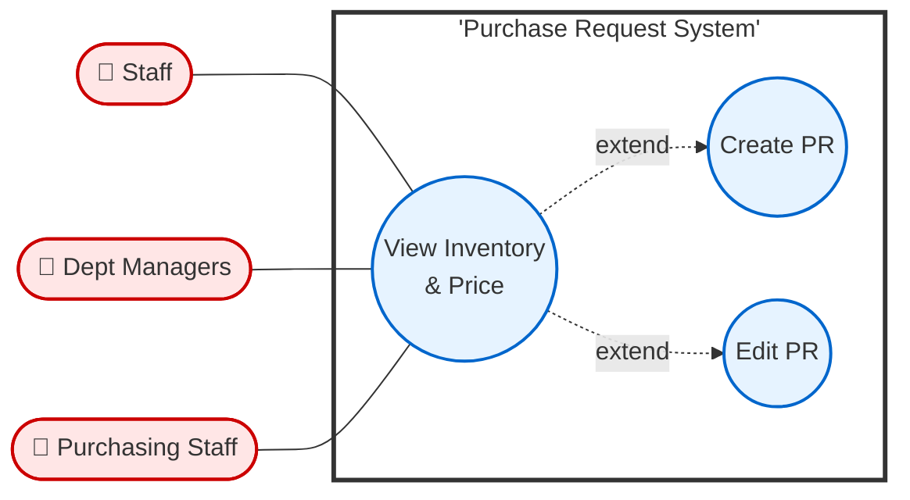
```mermaid
graph LR
    Staff([👤 Staff])
    DeptMgr([👔 Dept Managers])
    Purchasing([🛒 Purchasing Staff])

    subgraph PRS['Purchase Request System']
        UC012((View Inventory<br>& Price))
        UC001((Create PR))
        UC002((Edit PR))
    end

    Staff --- UC012
    DeptMgr --- UC012
    Purchasing --- UC012
    UC012 -.->|extend| UC001
    UC012 -.->|extend| UC002

    classDef actor fill:#ffe6e6,stroke:#cc0000,stroke-width:2px
    classDef usecase fill:#e6f3ff,stroke:#0066cc,stroke-width:2px

    class Staff,DeptMgr,Purchasing actor
    class UC012,UC001,UC002 usecase

    style PRS fill:#ffffff,stroke:#333333,stroke-width:3px
```

#### Description
Allows users to view real-time on-hand inventory levels and current prices while creating or editing purchase request line items. This enables informed decision-making about requested quantities based on current stock availability and cost data.

#### Inventory Terms Definitions

**On-Hand Quantity**
- Definition: The physical quantity of an item currently present in the inventory location
- Calculation: Sum of all received items minus all items issued/consumed
- Includes: Items in storage, on shelves, in designated locations
- Excludes: Items in transit, items not yet received, items already issued
- Example: If 100 units were received and 55 units were issued, On-Hand = 45 units

**Reserved Quantity**
- Definition: Items that are on-hand but allocated/committed to specific orders or purposes
- Calculation: Sum of quantities allocated to pending sales orders, production orders, or transfers
- Status: Physically present but not available for new requests
- Example: Of 45 units on-hand, 12 units reserved for pending orders leaves 33 available

**Available Quantity**
- Definition: Items that are on-hand and not reserved, available for new requests
- Calculation: **Available = On-Hand - Reserved**
- This is the actual quantity that can be requested without affecting other commitments
- Example: On-Hand 45 - Reserved 12 = Available 33 units

**Reorder Point (Minimum Stock Level)**
- Definition: The inventory level that triggers a replenishment order
- Purpose: Prevents stockouts by signaling when to reorder
- Calculation: Based on lead time demand + safety stock
- Formula: Reorder Point = (Average Daily Usage × Lead Time Days) + Safety Stock
- Example: If daily usage is 5 units, lead time is 7 days, safety stock is 15 units: Reorder Point = (5 × 7) + 15 = 50 units
- Action: When On-Hand or Available falls to or below this level, system recommends reordering

**Reorder Quantity (Economic Order Quantity)**
- Definition: The recommended quantity to order when reorder point is reached
- Purpose: Balances ordering costs with holding costs for optimal inventory levels
- Calculation: Based on demand forecasting, order frequency, and economic factors
- Factors: Average consumption rate, order costs, holding costs, supplier MOQ (Minimum Order Quantity)
- Example: If reorder point is 50 units and optimal order quantity is 100 units, order 100 when stock hits 50
- Note: Reorder quantity may differ from the amount needed to reach max stock level

**Restock (not a standard inventory term, clarify if needed)**
- If used, likely refers to: The act of replenishing inventory to normal levels
- May mean: Target stock level after reordering
- Please clarify intended meaning if this term is used in the system

#### Stock Level Indicators

The system provides visual indicators based on inventory levels:

- 🟢 **Green (Healthy)**: Available quantity > Reorder Point (no action needed)
- 🟡 **Yellow (Caution)**: Available quantity ≤ Reorder Point and > Minimum Level (reorder recommended)
- 🔴 **Red (Critical)**: Available quantity ≤ Minimum Level (urgent reorder required)
- ⚪ **Gray (No Data)**: No inventory data available for this item

#### Preconditions
- User must be authenticated
- User must have permission to create/edit PRs
- User is on PR creation/edit screen
- Inventory management system is accessible
- Product catalog is available

#### Postconditions
- **Success**: User sees current inventory and pricing data, can make informed quantity decisions
- **Failure**: System displays cached data or indication that real-time data is unavailable

#### Main Flow
1. User begins creating or editing a PR (UC-PR-001 or UC-PR-002)
2. User starts adding a line item
3. User searches for or selects a product
4. System retrieves product from catalog
5. System simultaneously queries inventory management system:
   a. Fetches on-hand quantity for user's location
   b. Fetches on-hand quantities for all locations (summary view)
   c. Fetches available quantity (on-hand minus reserved)
   d. Fetches current average cost
   e. Fetches last purchase price
   f. Fetches suggested reorder point and reorder quantity
6. System displays inventory panel alongside product selection:
   ```
   ┌─ Product: Chicken Breast (Fresh, Grade A) ───────────┐
   │                                                       │
   │ 📊 Inventory at Your Location (Main Kitchen)         │
   │ ├─ On-Hand: 45 kg                                   │
   │ ├─ Reserved: 12 kg (for pending orders)            │
   │ └─ Available: 33 kg ⚠️ Below reorder point (50 kg)  │
   │                                                       │
   │ 📍 Other Locations                                    │
   │ ├─ Pastry Kitchen: 8 kg                             │
   │ ├─ Banquet Kitchen: 22 kg                           │
   │ └─ Total System: 75 kg                              │
   │                                                       │
   │ 💰 Pricing Information                                │
   │ ├─ Current Avg Cost: $12.50/kg                      │
   │ ├─ Last Purchase: $11.80/kg (5 days ago)           │
   │ └─ Suggested Reorder: 100 kg                        │
   │                                                       │
   │ 📈 Stock Status: ⚠️ Low Stock - Reorder Recommended │
   │                                                       │
   │ Quantity to Request: [___] kg                        │
   │ Unit Price: $12.50 (suggested) [Edit]               │
   └───────────────────────────────────────────────────────┘
   ```
7. System provides visual indicators for stock levels:
   - 🟢 **Green**: Stock above reorder point (healthy)
   - 🟡 **Yellow**: Stock at or near reorder point (caution)
   - 🔴 **Red**: Stock below minimum level (critical)
   - ⚪ **Gray**: No stock data available
8. User reviews inventory information
9. User enters requested quantity based on:
   - Current available stock
   - Anticipated consumption/usage
   - Reorder recommendations
10. System validates requested quantity against business rules
11. System auto-fills unit price with last purchase price or average cost
12. User can override suggested price if needed
13. User confirms line item addition
14. System adds line item to PR with snapshot of inventory data at time of request
15. System stores inventory snapshot metadata:
    ```typescript
    {
      snapshotAt: "2025-01-15T10:30:00Z",
      onHandAtRequest: 45,
      availableAtRequest: 33,
      lastPurchasePrice: 11.80,
      averageCost: 12.50
    }
    ```
16. System continues with PR creation process

#### Alternative Flows

**A1: View Detailed Inventory History** (Step 8)
8a. User clicks "View Inventory History" link
9a. System displays modal with:
   - Last 30 days consumption chart
   - Stock level trends
   - Recent transactions (receipts, issues, adjustments)
   - Average daily/weekly usage
10a. User reviews historical data for better forecasting
11a. User closes modal
12a. Resume at step 9

**A2: Check Multiple Locations** (Step 8)
8a. User clicks "Check All Locations" button
9a. System displays detailed breakdown:
   - Quantity at each location
   - Location type (kitchen, storage, banquet)
   - Distance/transfer time from user's location
   - Transfer restrictions (temperature-controlled, hazmat, etc.)
10a. User identifies potential internal transfer options
11a. User may note to request internal transfer instead of purchase
12a. Resume at step 9

**A3: No Stock but Available Alternatives** (Step 6)
6a. System detects zero on-hand quantity
7a. System queries for alternative/substitute products
8a. System displays "Out of Stock - View Alternatives" button
9a. User clicks button
10a. System shows alternative products with price comparison table:

    ┌─ Alternative Products for: Original Item ──────────────────────┐
    │                                                                 │
    │ Product Name       │ Unit │ Last Price │ Qty │ FOC Qty│ Unit  │
    │────────────────────┼──────┼────────────┼─────┼────────┼───────│
    │ Alternative A      │ kg   │ $12.50     │ 80  │  5     │ box   │
    │ Alternative B      │ kg   │ $11.80     │ 120 │  -     │ -     │
    │ Alternative C      │ lb   │ $5.50      │ 200 │  2     │ ea    │
    │ Original (OOS)     │ kg   │ $12.00     │  0  │  -     │ -     │
    └─────────────────────────────────────────────────────────────────┘

    Price Comparison Table Columns:
    - Product Name: Name and description of alternative item
    - Unit: Standard unit of measure for ordering
    - Last Price: Most recent purchase price per unit
    - Qty Available: Current on-hand quantity
    - FOC Qty: Free of charge quantity (shows actual number, not Yes/No)
    - FOC Unit: Unit of measure for FOC quantity

    Note: FOC Qty and FOC Unit columns display:
    - Actual FOC quantity and unit if item has FOC promotion (e.g., "5 box")
    - "-" (dash) if not a FOC item (focQuantity = 0 or null)
    - Examples: "5 box", "2 ea" (each), "1 case", "10 pallet"
    - The FOC unit may differ from the standard ordering unit

11a. User reviews specifications, prices, availability, and FOC details
12a. User selects alternative or proceeds with original item
13a. Resume at step 9

**A4: Price Variance Alert** (Step 11)
11a. User enters price significantly different from last purchase (>15%)
12a. System displays warning: "Price variance detected: entered $15.00 vs last purchase $11.80 (+27%)"
13a. System requires justification comment
14a. User enters justification (e.g., "Market price increase", "Premium grade", "Rush order")
15a. Resume at step 13

**A5: Reorder Suggestion Auto-Fill** (Step 9)
9a. User clicks "Use Suggested Reorder Quantity" button
10a. System auto-fills quantity with reorder quantity (e.g., 100 kg)
11a. System provides justification: "Calculated based on reorder point and average consumption"
12a. Resume at step 10

#### Exception Flows

**E1: Inventory System Unavailable** (Step 5)
1. System fails to connect to inventory management system
2. System displays warning: "⚠️ Real-time inventory data unavailable. Showing cached data from [timestamp]"
3. System retrieves last cached inventory snapshot (max 24 hours old)
4. System displays cached data with timestamp and warning icon
5. System sets flag for offline mode
6. Resume at step 6 with cached data

**E2: No Inventory Data for Product** (Step 5)
1. System finds no inventory records for selected product
2. System displays: "ℹ️ No inventory data available for this product"
3. System shows only pricing information (if available)
4. System provides message: "This item is not currently stocked. Stock levels will be zero after purchase."
5. System allows PR creation to proceed
6. Resume at step 9 (skip inventory display)

**E3: Price Data Unavailable** (Step 5)
1. System finds no pricing history for product
2. System displays: "No pricing history available"
3. System leaves unit price field empty
4. System requires user to enter unit price manually
5. System mandates justification comment for pricing basis
6. Resume at step 11

**E4: Stale Data Warning** (Step 6)
1. System detects inventory data is >2 hours old
2. System displays warning: "⚠️ Inventory data may be outdated. Last updated: [timestamp]"
3. System provides "Refresh Data" button
4. User clicks refresh or proceeds with shown data
5. If refresh clicked:
   a. System re-queries inventory system
   b. System updates display with fresh data
   c. Resume at step 6
6. If proceeding without refresh: Resume at step 7

**E5: Permission Restricted - Cannot View Pricing** (Step 5e)
1. System checks user permissions for viewing cost data
2. User lacks permission to view pricing information
3. System displays inventory data only (quantities)
4. System hides all price-related fields
5. System displays: "ℹ️ Contact purchasing department for pricing information"
6. Resume at step 6 with limited data

#### Business Rules
- BR-PR-039: Inventory data must be displayed within 2 seconds of product selection
- BR-PR-040: Stock level indicators update in real-time as user modifies quantities
- BR-PR-041: Inventory snapshot preserved with PR for audit trail
- BR-PR-042: Cached inventory data max age: 24 hours before warning required
- BR-PR-043: Price variance >15% triggers mandatory justification
- BR-PR-044: Users can only view inventory for locations they have permission to access
- BR-PR-045: Alternative product suggestions limited to same category and similar price range (±30%)
- BR-PR-046: Historical consumption data limited to 90 days for performance

#### UI/UX Requirements
- Inventory panel should not obstruct product selection workflow
- Data should load asynchronously without blocking user input
- Stock level indicators must be color-blind accessible (use icons + colors)
- Refresh button should show loading spinner during data fetch
- Inventory history charts should be interactive (zoom, hover for details)
- Mobile view: inventory panel collapses to expandable accordion

#### Performance Requirements
- Initial inventory data load: <2 seconds (95th percentile)
- Inventory data refresh: <1 second
- Concurrent inventory queries: Support 50+ simultaneous users
- Cache strategy: Redis-backed with 5-minute TTL for active products
- Database query optimization: Indexed queries on product_id + location_id

#### Integration Points
- **Inventory Management System**: Real-time stock level queries via REST API
- **Product Catalog**: Product master data and specifications
- **Pricing System**: Historical pricing data and cost calculations
- **Analytics System**: Consumption patterns and forecasting data
- **Location Master**: Location hierarchy and transfer rules

#### Security Requirements
- User can only view inventory for locations within their department/permission scope
- Pricing information access controlled by role-based permissions
- API calls authenticated with service account tokens
- Audit log all inventory data access for compliance
- Rate limiting: Max 100 inventory queries per user per minute

#### Related Requirements
- FR-PR-016: Real-time inventory integration
- FR-INV-001: Inventory tracking (cross-reference to Inventory module)
- FR-PRD-001: Product catalog (cross-reference to Product module)

---

### UC-PR-013: Manage PR Templates

**Priority**: Medium | **Status**: 🚧 Pending
**Frequency**: Weekly (5-10 template operations per week)
**Actors**: Purchasing Staff, Department Managers

#### Use Case Diagram

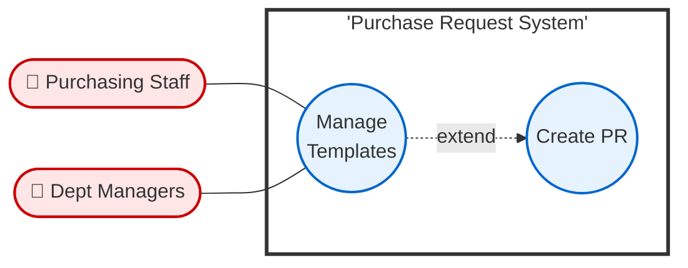
```mermaid
graph LR
    Purchasing([🛒 Purchasing Staff])
    DeptMgr([👔 Dept Managers])

    subgraph PRS['Purchase Request System']
        UC013((Manage<br>Templates))
        UC001((Create PR))
    end

    Purchasing --- UC013
    DeptMgr --- UC013
    UC013 -.->|extend| UC001

    classDef actor fill:#ffe6e6,stroke:#cc0000,stroke-width:2px
    classDef usecase fill:#e6f3ff,stroke:#0066cc,stroke-width:2px

    class Purchasing,DeptMgr actor
    class UC013,UC001 usecase

    style PRS fill:#ffffff,stroke:#333333,stroke-width:3px
```

#### Description
Allows authorized users to create, edit, view, and delete purchase request templates to streamline recurring procurement needs. Templates can be created from existing PRs or built from scratch.

#### Preconditions
- User must be authenticated
- User must have 'manage_pr_templates' permission
- User must have access to at least one department

#### Postconditions
- **Success**: Template created/updated/deleted successfully
- **Failure**: Error message displayed, template unchanged

---

#### Sub-Use Case 1: Create Template from Existing PR

**Trigger**: User wants to save a recurring PR as a template

##### Main Flow
1. User opens an existing PR (any status)
2. System displays PR details
3. User clicks "Save as Template" button
4. System displays template creation dialog:
   ```
   ┌─ Create Template from PR-2501-0042 ────────────────────┐
   │                                                          │
   │ Template Name: *[________________________]              │
   │ Template Type: ◉ Market List                            │
   │                ○ Standard Order                         │
   │                ○ Fixed Asset                            │
   │                                                          │
   │ Description: [_________________________________]         │
   │              [_________________________________]         │
   │                                                          │
   │ Department: [Current Department ▼]                      │
   │                                                          │
   │ ☑ Include all line items (8 items)                     │
   │ ☑ Save current quantities                              │
   │ ☑ Save current prices                                  │
   │ ☐ Include notes and attachments                        │
   │                                                          │
   │ Visibility: ◉ Department Only                           │
   │             ○ Organization Wide (requires approval)     │
   │                                                          │
   │ Tags: [____________________________]                     │
   │ (comma-separated, e.g., weekly, vegetables, perishable) │
   │                                                          │
   │ ℹ️ Template will be available in "New from Template"   │
   │                                                          │
   │              [Cancel]  [Create Template]                │
   └──────────────────────────────────────────────────────────┘
   ```
5. User enters template name (required)
6. User selects template type matching the PR type
7. User enters description explaining template purpose and usage
8. User optionally modifies department or changes to org-wide
9. User selects which data to include in template
10. User optionally adds tags for easier searching
11. User clicks "Create Template"
12. System validates template data:
    - Template name is unique within department
    - Template name is 3-100 characters
    - Description provided (recommended)
    - At least one line item included
13. System creates template record:
    ```typescript
    {
      id: "uuid",
      name: "Weekly Market List - Vegetables",
      type: "Market List",
      description: "Standard weekly order for fresh vegetables",
      department_id: "dept-uuid",
      visibility: "department",
      created_by: "user-uuid",
      created_at: "2025-01-15T10:30:00Z",
      last_used_at: null,
      usage_count: 0,
      tags: ['weekly', 'vegetables', 'perishable']
    }
    ```
14. System copies line items to template_items table
15. System logs activity: "Template created from PR-2501-0042"
16. System displays success message: "Template created successfully"
17. System provides link to view/edit template

##### Alternative Flows

**A1: Modify Items Before Saving** (Step 9)
9a. User clicks "Customize Items"
10a. System displays item selection interface
11a. User:
    - Deselects items to exclude from template
    - Modifies quantities or descriptions
    - Removes pricing information if desired
12a. User clicks "Apply"
13a. Resume at step 10

**A2: Organization-Wide Template Requires Approval** (Step 8)
8a. User selects "Organization Wide" visibility
9a. System displays note: "Org-wide templates require purchasing manager approval"
10a. System sets template status to "Pending Approval"
11a. User proceeds with creation
12a. System creates template in "Pending" state
13a. System sends approval request to purchasing manager
14a. Template becomes available after approval

##### Exception Flows

**E1: Duplicate Template Name** (Step 12)
1. System detects template name already exists in department
2. System displays error: "A template with this name already exists in your department"
3. System suggests: "Try adding a date or version number to the name"
4. Resume at step 5

---

#### Sub-Use Case 2: Create Template from Scratch

**Trigger**: User wants to create a new template without basing it on existing PR

##### Main Flow
1. User navigates to "Templates" section
2. User clicks "Create New Template" button
3. System displays template creation form:
   - Template name (required)
   - Template type: Market List / Standard Order / Fixed Asset
   - Description
   - Department selection
   - Visibility (Department / Organization)
   - Tags
4. User fills in header information
5. User clicks "Add Items" to add template items
6. System displays item addition interface (similar to PR line item)
7. User adds items:
   - Search/select product
   - Enter description
   - Enter default quantity
   - Enter expected unit price (optional)
   - Set default budget code (optional)
8. User repeats step 7 for all desired items
9. System calculates estimated total for reference
10. User reviews template items
11. User clicks "Create Template"
12. System validates and saves template (same validation as Sub-UC 1)
13. System displays success message
14. System redirects to template detail view

##### Alternative Flows

**A1: Import Items from Another Template** (Step 5)
5a. User clicks "Import from Template"
6a. System displays template selection dialog
7a. User selects source template
8a. System copies all items from source template
9a. User reviews and modifies imported items
10a. Resume at step 10

---

#### Sub-Use Case 3: Edit Existing Template

**Trigger**: User needs to update a template

##### Main Flow
1. User navigates to "Templates" section
2. System displays list of templates with:
   - Template name and type
   - Last used date
   - Usage count
   - Created by
   - Department/visibility
3. User searches or filters templates:
   - By type
   - By department
   - By recently used
   - By tags
4. User clicks "Edit" on desired template
5. System displays template in edit mode
6. User modifies:
   - Template name or description
   - Line items (add, remove, modify quantities/prices)
   - Tags
   - Visibility (if has permission)
7. User clicks "Save Changes"
8. System validates changes
9. System creates template version history entry
10. System updates template record
11. System logs activity: "Template updated"
12. System displays success message
13. System refreshes template detail view

##### Alternative Flows

**A1: Template in Use - Warn Before Major Changes** (Step 6)
6a. System detects template has been used >10 times in last 30 days
7a. If user removes >50% of items or changes template type:
    * System displays warning: "⚠️ This template is frequently used. Consider creating a new version instead of modifying."
    * System offers options:
      - "Save as New Template"
      - "Continue with Changes"
      - "Cancel"
8a. User chooses action
9a. If "Save as New Template": Create copy and edit copy
10a. If "Continue with Changes": Resume at step 7

**A2: View Template Usage History** (Step 4)
4a. User clicks "View Usage" on template
5a. System displays:
   - List of PRs created from this template
   - Usage timeline chart
   - Average order value
   - Most frequent users
6a. User reviews usage data
7a. User closes usage view
8a. Resume at step 4

##### Exception Flows

**E1: Template Currently in Use** (Step 8)
1. System detects PRs being created from this template right now
2. System displays warning: "Someone is currently using this template"
3. System shows count of active sessions
4. System offers options:
   - "Save Anyway" (may affect active users)
   - "Wait and Retry"
   - "Cancel"
5. User chooses action

---

#### Sub-Use Case 4: Delete Template

**Trigger**: User wants to remove obsolete template

##### Main Flow
1. User navigates to template detail or template list
2. User clicks "Delete" button
3. System displays confirmation dialog:
   ```
   ┌─ Delete Template ────────────────────────────────────┐
   │                                                       │
   │ ⚠️ Are you sure you want to delete this template?   │
   │                                                       │
   │ Template: "Weekly Market List - Vegetables"          │
   │ Type: Market List                                    │
   │                                                       │
   │ This template has been used 45 times                 │
   │ Last used: 2 days ago                                │
   │                                                       │
   │ ⚠️ This action cannot be undone.                     │
   │                                                       │
   │ ☐ I understand this template will be permanently    │
   │   deleted                                            │
   │                                                       │
   │              [Cancel]  [Delete Template]             │
   └───────────────────────────────────────────────────────┘
   ```
4. User checks confirmation checkbox
5. User clicks "Delete Template"
6. System performs soft delete:
   - Sets template status to "Deleted"
   - Sets deleted_at timestamp
   - Sets deleted_by user
   - Retains all data for audit purposes
7. System removes template from active template lists
8. System logs activity: "Template deleted"
9. System displays success message: "Template deleted successfully"
10. System redirects to template list

##### Alternative Flows

**A1: Archive Instead of Delete** (Step 3)
3a. System offers "Archive" option alongside delete
4a. User clicks "Archive Template" instead
5a. System sets template status to "Archived"
6a. Template hidden from default lists but can be restored
7a. System displays "Template archived. Can be restored from Archives."
8a. Resume at step 10

**A2: Frequently Used Template - Recommend Archive** (Step 3)
3a. System detects template used >20 times or used within last 7 days
4a. System recommends: "💡 This template is frequently used. Consider archiving instead of deleting."
5a. User chooses to archive or proceed with deletion
6a. Continue based on user choice

##### Exception Flows

**E1: Template in Active Use** (Step 6)
1. System detects open PRs being created from this template
2. System displays error: "Cannot delete template. Currently being used by [X] users."
3. System provides options:
   - "View Active Sessions"
   - "Archive Instead" (recommended)
   - "Force Delete" (admin only, will break active sessions)
4. Deletion cancelled or delayed

---

#### Business Rules
- BR-PR-047: Template names must be unique within department scope
- BR-PR-048: Templates can be department-specific or organization-wide
- BR-PR-049: Organization-wide templates require purchasing manager approval
- BR-PR-050: Templates automatically include last purchase pricing option
- BR-PR-051: Deleted templates are soft-deleted and retained for audit purposes
- BR-PR-052: Template usage tracked for analytics and optimization
- BR-PR-053: Templates can have tags for easier discovery (max 10 tags)
- BR-PR-054: Template items retain product references for automatic price updates

#### UI/UX Requirements
- Template list should be sortable by name, type, last used, usage count
- Recently used templates appear at top of template selection dialog
- Template preview shows estimated total for budgeting purposes
- Visual indicators for template status (Active, Archived, Pending Approval)
- Quick actions menu for common operations (Edit, Duplicate, Archive, Delete)
- Template usage statistics visible to authorized users

#### Performance Requirements
- Template list load: <1 second for up to 500 templates
- Template application to PR: <2 seconds including price updates
- Template search/filter: <500ms response time
- Support 20+ concurrent template operations

#### Integration Points
- **Product Catalog**: Product references for automatic price updates
- **Purchase History**: Last purchase price lookups
- **Department Master**: Department access control
- **User Management**: Permission checks and creator tracking
- **Analytics System**: Template usage tracking and reporting

#### Security Requirements
- Templates inherit department-level access controls
- Organization-wide templates require elevated permissions
- Template deletion logged with user and timestamp
- Soft delete prevents accidental data loss
- Audit trail of all template modifications

#### Related Requirements
- FR-PR-012: Copy and template functionality
- FR-PR-016: Real-time inventory integration
- BR-PR-047 through BR-PR-054: Template business rules

---

### UC-PR-014: Create PR with Inventory Context and Price Visibility Control

**Priority**: High | **Status**: 🚧 Pending
**Trigger**: Requestor initiates PR creation workflow
**Frequency**: Daily (multiple times per day)
**Duration**: 5-10 minutes

#### Use Case Diagram

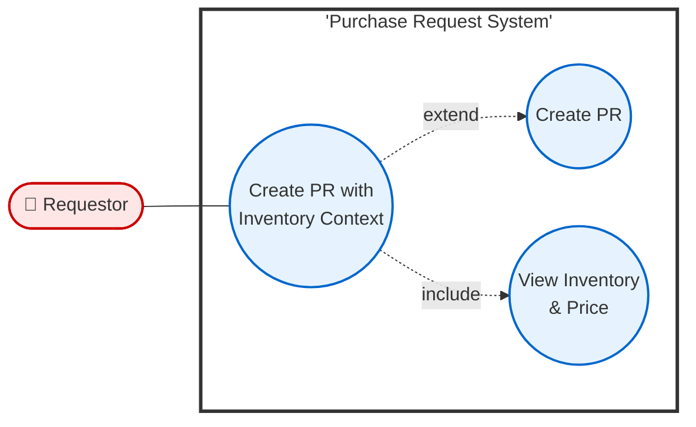
```mermaid
graph LR
    Requestor([👤 Requestor])

    subgraph PRS['Purchase Request System']
        UC014((Create PR with<br>Inventory Context))
        UC001((Create PR))
        UC012((View Inventory<br>& Price))
    end

    Requestor --- UC014
    UC014 -.->|extend| UC001
    UC014 -.->|include| UC012

    classDef actor fill:#ffe6e6,stroke:#cc0000,stroke-width:2px
    classDef usecase fill:#e6f3ff,stroke:#0066cc,stroke-width:2px

    class Requestor actor
    class UC014,UC001,UC012 usecase

    style PRS fill:#ffffff,stroke:#333333,stroke-width:3px
```

#### Description
Requestor creates a new purchase request with real-time inventory visibility (on-hand and on-order quantities) and optional price hiding to focus on item specifications rather than costs.

#### Actors
- **Primary**: Requestor (Chef, Department Manager, Staff)
- **Secondary**: Inventory Management System API, Purchase Order System API

#### Preconditions
- User is authenticated with Requestor role or higher
- User has permission to create PRs for their department
- Inventory Management System and PO System APIs are available
- User has selected a department and location context

#### Main Flow
1. Requestor navigates to **Purchase Requests > Create New**
2. System displays PR creation form with header fields
3. Requestor optionally enables **"Hide Price"** toggle in header
   - System notes: "Prices will be hidden from you but visible to approvers"
4. Requestor fills in required header fields:
   - **Department**: Pre-filled from user context
   - **Delivery Date**: Future date (required)
   - **Description**: Brief PR description
   - **Justification**: Business reason for purchase
5. Requestor clicks **"Add Item"**
6. System displays item detail modal/form
7. Requestor searches for and selects **Product**
8. **System automatically loads inventory context**:
   - Queries Inventory API for **on-hand quantity** at user's location
   - Queries PO System API for **on-order quantity**
   - Displays both as read-only fields with visual indicators:
     * **On-Hand**: "1,250" (green if healthy, yellow if low, red if critical)
     * **On-Order**: "50" with tooltip showing expected delivery dates
   - If API unavailable, displays "N/A" with retry option
9. Requestor fills in item fields:
   - **Quantity**: Required, positive integer
   - **Unit of Measure**: Dropdown (PC, KG, L, etc.)
   - **Vendor Name**: Optional text field (typeahead suggestions)
   - **Unit Price**: Optional decimal (visible if hide_price = false)
   - **Discount**: Optional decimal
   - **Tax Rate**: Dropdown or auto-populated
10. **System auto-calculates** (if pricing fields filled):
    - **Net Amount** = (unit_price × quantity) - discount_amount
    - **Tax Amount** = net_amount × (tax_rate / 100)
    - **Total Amount** = net_amount + tax_amount
11. If **hide_price = true**:
    - System hides vendor, pricing, and calculation fields from Requestor
    - Data is still saved to database for approvers
12. Requestor saves item
13. Repeat steps 5-12 for additional items
14. Requestor submits PR
15. System validates all fields and calculations
16. System creates PR with status = "Pending Approval"
17. System initiates approval workflow
18. System displays confirmation message with PR reference number

#### Alternate Flows
**A1: Inventory API Unavailable (Step 8)**
- System displays "Unable to load inventory data" message
- Displays cached data with timestamp if available
- Allows Requestor to proceed without inventory context
- Logs API failure for investigation

**A2: Requestor Changes Hide Price After Adding Items (Step 3)**
- System warns: "Changing price visibility will affect all items"
- If confirmed, system immediately hides/shows pricing fields
- Data remains intact in database

**A3: Low Inventory Warning (Step 8)**
- If on-hand quantity < reorder point:
  * System displays warning icon with message: "Low stock - Consider ordering larger quantity"
- If on-hand = 0 and on-order > 0:
  * System displays info: "Out of stock, but XX units on order (expected: DATE)"

**A4: Pricing Fields Not Filled (Step 10)**
- System skips auto-calculations
- Net Amount, Tax Amount, Total Amount remain NULL
- Requestor can submit PR without pricing (procurement will fill later)

#### Postconditions
- **Success**:
  * New PR created with all inventory context captured at creation time
  * hide_price flag saved with PR
  * Approval workflow initiated
  * Requestor receives confirmation
- **Failure**:
  * No PR created
  * User informed of validation errors
  * Draft auto-saved if possible

#### Business Rules
- BR-PR-001: Reference number auto-generated
- BR-PR-002: Requestor, department, delivery date required
- BR-PR-003: At least one item required
- VAL-PR-030: On-hand quantity display validation
- VAL-PR-031: On-order quantity display validation
- VAL-PR-033: Price visibility toggle validation
- VAL-PR-034: Vendor name required if unit price entered
- VAL-PR-035 through VAL-PR-037: Calculation validations

#### Integration Points
- **Inventory Management System API**: Real-time on-hand queries
- **Purchase Order System API**: On-order quantity and expected dates
- **Product Catalog**: Product details and specifications
- **Approval Workflow Engine**: Initiate approval process
- **Budget Service**: Budget validation (if applicable)

#### UI/UX Notes
- Inventory data loads asynchronously with loading spinners
- Visual indicators for stock levels (icons + colors for accessibility)
- Hide Price toggle prominent in header with helpful tooltip
- Cached inventory data shows "Last updated: XX minutes ago"
- Mobile responsive layout for inventory display

---

### UC-PR-015: Create PR with Item-Specific Delivery Details

**Priority**: Medium | **Status**: 🚧 Pending
**Trigger**: Requestor needs to specify delivery instructions, dates, or locations per item
**Frequency**: Daily (for complex multi-item PRs)
**Duration**: 5-12 minutes

#### Use Case Diagram

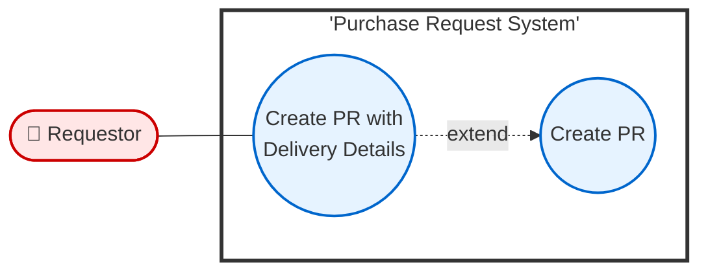
```mermaid
graph LR
    Requestor([👤 Requestor])

    subgraph PRS['Purchase Request System']
        UC015((Create PR with<br>Delivery Details))
        UC001((Create PR))
    end

    Requestor --- UC015
    UC015 -.->|extend| UC001

    classDef actor fill:#ffe6e6,stroke:#cc0000,stroke-width:2px
    classDef usecase fill:#e6f3ff,stroke:#0066cc,stroke-width:2px

    class Requestor actor
    class UC015,UC001 usecase

    style PRS fill:#ffffff,stroke:#333333,stroke-width:3px
```

#### Description
Requestor creates a purchase request with item-specific delivery metadata including comments, required dates, and delivery points to ensure accurate fulfillment.

#### Actors
- **Primary**: Requestor (Chef, Department Manager, Procurement Staff)
- **Secondary**: DeliveryPoint Master Data Service

#### Preconditions
- User is authenticated with Requestor role or higher
- User has permission to create PRs for their department
- DeliveryPoint master data is configured and active
- User has selected department and location context

#### Main Flow
1. Requestor navigates to **Purchase Requests > Create New**
2. System displays PR creation form
3. Requestor fills in required header fields (department, delivery date, description, justification)
4. Requestor clicks **"Add Item"**
5. System displays item detail form with expanded metadata section
6. Requestor searches for and selects **Product**
7. Requestor fills in standard item fields (quantity, UOM, vendor, pricing)
8. **Requestor expands "Item Details" section**
9. Requestor enters **Comment** (optional):
   - Multi-line text area (3-4 rows)
   - Character counter displays "0/500"
   - Example: "Deliver to back kitchen entrance, handle with care, keep refrigerated"
10. Requestor selects **Required Date** (optional):
    - Calendar picker opens with past dates disabled
    - Constraint: Must be >= current date
    - Example: 2025-02-15
    - System displays "Days remaining: 30" if date entered
11. Requestor selects **Delivery Point** (optional):
    - Dropdown loads active delivery points from master data
    - Filtered by user's department (if applicable)
    - Display format: "DOCK-A - Main Kitchen Loading Dock"
    - Typeahead search for easy selection
    - Tooltip shows full address on hover
12. System auto-populates **Delivery Point Label**:
    - Read-only field
    - Displays human-readable name from selected delivery point
    - Updates automatically when selection changes
13. Requestor saves item
14. Repeat steps 4-13 for additional items with different delivery requirements
15. Requestor reviews all items with delivery details summary
16. Requestor submits PR
17. System validates all fields (comment length, required date, delivery point exists)
18. System creates PR with status = "Pending Approval"
19. System includes delivery metadata in approval notifications
20. System displays confirmation message

#### Alternate Flows
**A1: Comment Exceeds 500 Characters (Step 9)**
- System displays error: "Comment cannot exceed 500 characters. Current: 523"
- Input disabled at 500 characters
- Requestor must shorten comment to proceed

**A2: Required Date in Past (Step 10)**
- System displays error: "Required date cannot be in the past. Please select today or a future date."
- Calendar picker prevents past date selection
- Requestor must select valid date

**A3: Delivery Point Inactive or Deleted (Step 11)**
- System filters out inactive delivery points
- If previously selected delivery point becomes inactive:
  * System warns: "Selected delivery point is no longer active. Please select another."
  * Clears selection and delivery point label

**A4: No Delivery Points Available (Step 11)**
- System displays message: "No delivery points configured for your department"
- Dropdown shows empty state with link to request configuration
- Requestor can proceed without delivery point selection

**A5: Clear Delivery Point Selection (Step 11)**
- Requestor clicks "Clear" button
- System sets delivery_point = NULL
- System sets delivery_point_label = NULL
- Fields become empty

#### Postconditions
- **Success**:
  * New PR created with item-specific delivery metadata
  * Delivery details visible in approval workflow
  * Procurement and receiving teams informed
  * Confirmation displayed to Requestor
- **Failure**:
  * No PR created
  * Validation errors displayed
  * Draft auto-saved if possible

#### Business Rules
- VAL-PR-038: Comment field length validation (500 chars max)
- VAL-PR-039: Required date future validation
- VAL-PR-040: Delivery point selection validation (must be active)
- VAL-PR-041: Delivery point label auto-population
- FR-PR-021: Item metadata enhancement
- FR-PR-022: Delivery point dropdown

#### Integration Points
- **DeliveryPoint Master Data**: Load active delivery locations
- **User Department Service**: Filter delivery points by department
- **Approval Workflow**: Include delivery metadata in notifications
- **Procurement System**: Forward delivery instructions

#### UI/UX Notes
- "Item Details" section collapsible to reduce clutter
- Character counter updates in real-time
- Calendar picker highlights current date
- Delivery point dropdown shows address in tooltip
- Mobile layout stacks fields vertically
- Summary view shows delivery details per item clearly

---

### UC-PR-016: Approve PR with FOC and Enhanced Pricing Visibility

**Priority**: High | **Status**: 🚧 Pending
**Trigger**: Approver reviews PR for approval decision
**Frequency**: Daily (multiple times per day)
**Duration**: 3-7 minutes

#### Use Case Diagram

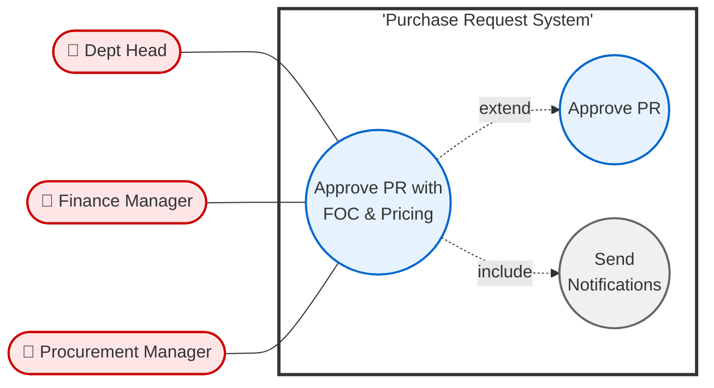
```mermaid
graph LR
    DeptHead([👔 Dept Head])
    FinMgr([💼 Finance Manager])
    ProcMgr([🛒 Procurement Manager])

    subgraph PRS['Purchase Request System']
        UC016((Approve PR with<br>FOC & Pricing))
        UC005((Approve PR))
        UC105((Send<br>Notifications))
    end

    DeptHead --- UC016
    FinMgr --- UC016
    ProcMgr --- UC016
    UC016 -.->|extend| UC005
    UC016 -.->|include| UC105

    classDef actor fill:#ffe6e6,stroke:#cc0000,stroke-width:2px
    classDef usecase fill:#e6f3ff,stroke:#0066cc,stroke-width:2px
    classDef system fill:#f0f0f0,stroke:#666666,stroke-width:2px

    class DeptHead,FinMgr,ProcMgr actor
    class UC016,UC005 usecase
    class UC105 system

    style PRS fill:#ffffff,stroke:#333333,stroke-width:3px
```

#### Description
Approver reviews purchase request with full visibility of FOC fields, complete pricing breakdown (vendor, net amount, tax), and item delivery details, regardless of Requestor's hide_price setting.

#### Actors
- **Primary**: Approver (Department Head, Finance Manager, Procurement Manager)
- **Secondary**: Budget Service, Approval Workflow Engine

#### Preconditions
- User is authenticated with Approver role or higher
- PR exists with status = "Pending Approval"
- User has permission to approve for the PR's department
- PR is in user's approval queue based on workflow rules

#### Main Flow
1. Approver navigates to **Purchase Requests > My Approvals**
2. System displays list of pending PRs
3. Approver clicks on PR reference number (e.g., PR-2501-0001)
4. System displays PR detail view with **full approver visibility**:
   - All header fields (requestor, department, dates, description, justification)
   - **Hide Price Indicator**: Badge if hide_price = true: "Requestor chose to hide prices"
   - Budget summary and availability
5. **System displays PR items table with enhanced columns**:
   - Product Code & Description
   - Quantity & UOM
   - **FOC Quantity & UOM** (visible only to Approver/Procurement/Finance)
   - **Vendor Name** (visible even if hide_price = true)
   - **Unit Price** (visible even if hide_price = true)
   - **Discount Amount**
   - **Net Amount** (calculated: unit_price × quantity - discount)
   - **Tax Rate & Tax Amount** (calculated)
   - **Total Amount** (calculated: net_amount + tax_amount)
   - **Override Amount** (if set, highlighted with warning icon)
   - **Comment** (delivery instructions)
   - **Required Date**
   - **Delivery Point Label**
6. Approver reviews each line item:
   - Verifies vendor name and pricing reasonableness
   - Checks FOC quantities if applicable
   - Reviews net amount, tax, and total calculations
   - Examines delivery details (comment, required date, delivery point)
   - Notes any override amounts with variance >20%
7. **System displays PR totals** in summary panel:
   - **Subtotal** (sum of all net amounts)
   - **Total Discount** (sum of all discounts)
   - **Net Amount** (subtotal - total discount)
   - **Total Tax** (sum of all tax amounts)
   - **Grand Total** (sum of all total amounts)
8. Approver reviews budget impact:
   - Budget category and account
   - Available budget vs. PR total
   - Budget warnings if applicable
9. Approver makes decision:
   - **Option A**: Approve with optional comment
   - **Option B**: Reject with required comment (min 10 characters)
   - **Option C**: Return for revision with comment
10. If **Approving**:
    - Approver clicks "Approve" button
    - Optional: Adds approval comment
    - Confirms approval action
11. System updates PR status based on approval chain:
    - If more approvals needed: Status = "Partially Approved"
    - If final approval: Status = "Approved"
12. System sends notifications to next approver or requestor
13. System logs approval action with timestamp and user
14. System displays confirmation message
15. Approver returns to approval queue

#### Alternate Flows
**A1: Override Amount Detected (Step 6)**
- System highlights override_amount with warning icon
- Tooltip displays: "Override amount differs from calculated total by XX%"
- Displays calculated amount for comparison: "Calculated: $45.00, Override: $50.00"
- Approver can approve or reject based on justification

**A2: Budget Exceeded (Step 8)**
- System displays budget warning: "This PR exceeds available budget by $X,XXX.XX"
- Approver with budget override authority can still approve
- System logs budget override in audit trail
- Finance notified of budget override

**A3: FOC Items Require Additional Approval (Step 6)**
- If FOC quantity > 0:
  * System flags item with FOC indicator
  * May require additional procurement approval (per business rules)
  * System routes PR to procurement queue

**A4: Multiple Delivery Points Detected (Step 6)**
- System displays delivery point summary: "Items will be delivered to 3 different locations"
- Approver can expand to see per-item delivery details
- May trigger split PO creation after approval

**A5: Reject PR (Step 9)**
- Approver clicks "Reject" button
- System requires comment (min 10 characters)
- System changes PR status to "Void"
- System notifies Requestor with rejection reason
- Requestor can edit and resubmit

#### Postconditions
- **Success**:
  * PR status updated (Partially Approved or Approved)
  * Next approver notified (if applicable)
  * Approval logged in audit trail
  * Budget soft commitment updated
  * Confirmation displayed to Approver
- **Failure**:
  * PR status unchanged
  * Error message displayed
  * Approver can retry

#### Business Rules
- FR-PR-018: FOC visibility controls (Approver always sees FOC)
- FR-PR-019: Price visibility controls (Approver always sees prices)
- FR-PR-020: Enhanced item pricing breakdown
- FR-PR-023: Header total display for approvers
- BR-PR-011: Department head approval always required
- BR-PR-014: Rejection requires comments (min 10 characters)
- BR-PR-015: Approver cannot approve own PR
- VAL-PR-032: FOC field visibility validation
- VAL-PR-033: Price visibility toggle validation

#### Integration Points
- **Approval Workflow Engine**: Determine approval chain and next approver
- **Budget Service**: Real-time budget availability check
- **Notification Service**: Send approval/rejection notifications
- **Audit Service**: Log all approval actions
- **Procurement System**: Forward approved PRs for PO creation

#### UI/UX Notes
- Hide price indicator badge clearly visible
- FOC fields highlighted with distinct background color
- Override amounts highlighted with warning color (yellow)
- Budget warnings displayed prominently
- Monetary amounts right-aligned with tabular numbers
- Mobile layout: collapsible sections for item details
- Summary panel sticky/fixed for easy reference
- Approval buttons prominent and clearly labeled
- Rejection requires confirmation modal

---

### UC-PR-017: Purchasing Staff Edit Mode - Vendor Pricing and Allocations

**Priority**: High | **Status**: ✅ Implemented
**Frequency**: Daily (20-40 per day)
**Actors**: Purchasing Staff, Procurement Manager

#### Use Case Diagram

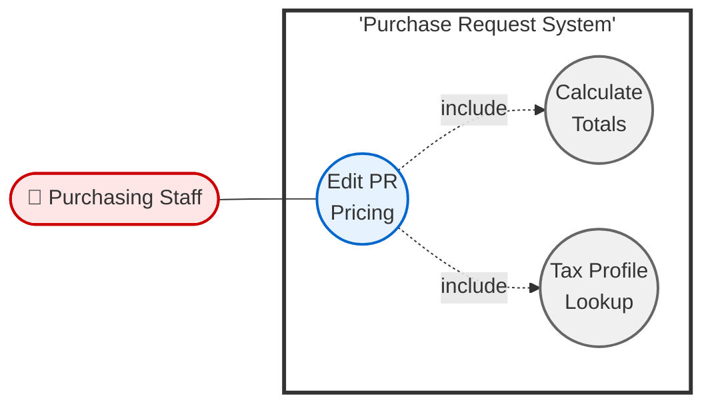
```mermaid
graph LR
    Purchasing([🛒 Purchasing Staff])

    subgraph PRS['Purchase Request System']
        UC017((Edit PR<br>Pricing))
        UC102((Calculate<br>Totals))
        UC103((Tax Profile<br>Lookup))
    end

    Purchasing --- UC017
    UC017 -.->|include| UC102
    UC017 -.->|include| UC103

    classDef actor fill:#ffe6e6,stroke:#cc0000,stroke-width:2px
    classDef usecase fill:#e6f3ff,stroke:#0066cc,stroke-width:2px
    classDef system fill:#f0f0f0,stroke:#666666,stroke-width:2px

    class Purchasing actor
    class UC017 usecase
    class UC102,UC103 system

    style PRS fill:#ffffff,stroke:#333333,stroke-width:3px
```

#### Description
Allows purchasing staff to edit vendor pricing information, perform vendor allocations, manage tax profiles, and override financial calculations when processing a purchase request in edit mode.

#### Preconditions
- User must be authenticated
- User must have Purchasing Staff, Purchaser, or Procurement Manager role
- PR must exist and be in an editable status (Draft, In-progress, or other status allowing purchaser edits)
- PR must be accessed in edit mode

#### Postconditions
- **Success**: PR item pricing updated with vendor, currency, prices, tax, and discount information
- **Failure**: Error message displayed, PR item unchanged

#### Main Flow
1. Purchasing Staff opens PR detail page and enters edit mode
2. System verifies user has purchasing staff role
3. System displays item details with editable pricing fields:
   - Vendor selection dropdown
   - Currency selection dropdown
   - Exchange rate input
   - Unit price input
   - Tax profile selection
   - Tax rate display (read-only, from profile)
   - Tax amount override input
   - Discount rate input
   - Discount amount override input
4. Purchasing Staff selects vendor from dropdown
   - System shows approved vendors for item category
5. Purchasing Staff selects currency
   - System looks up current exchange rate
   - System updates exchange rate field
6. Purchasing Staff enters unit price
   - System calculates subtotal (quantity × unit price)
7. Purchasing Staff selects tax profile
   - System retrieves tax rate from profile configuration
   - System displays tax rate (read-only)
   - System calculates tax amount (net amount × tax rate)
8. Optionally, Purchasing Staff overrides tax amount
   - User enters manual tax amount
   - System uses override instead of calculated value
9. Purchasing Staff enters discount rate
   - System calculates discount amount (subtotal × discount rate)
10. Optionally, Purchasing Staff overrides discount amount
    - User enters manual discount amount
    - System uses override instead of calculated value
11. System recalculates all financial totals in real-time:
    - Subtotal = quantity × unit price
    - Discount = subtotal × discount rate (or override)
    - Net Amount = subtotal - discount
    - Tax = net amount × tax rate (or override)
    - Total = net amount + tax
12. Purchasing Staff clicks "Save"
13. System validates all pricing fields
14. System updates PR item with new pricing information
15. System logs all changes in audit trail
16. System displays success message

#### Alternative Flows

**A1: Vendor Not in Approved List** (Step 4)
4a. Required vendor not in dropdown
5a. Purchasing Staff can request vendor addition through vendor management
6a. Resume at step 4 after vendor approved

**A2: Currency Conversion Required** (Step 5)
5a. System displays base currency equivalent
6a. System shows converted amounts in both currencies
7a. Resume at step 6

**A3: FOC Item Detected** (Step 6)
6a. System detects FOC quantity > 0
7a. System automatically sets unit price to 0
8a. System displays FOC indicator
9a. Resume at step 7

**A4: Tax Profile Not Found** (Step 7)
7a. System displays "Select tax profile" prompt
8a. User must select valid tax profile before saving
9a. Resume at step 7

#### Exception Flows

**E1: Permission Denied** (Step 2)
1. System detects user does not have purchasing staff role
2. System displays pricing fields as read-only
3. System shows message: "Pricing fields are only editable by purchasing staff"
4. Use case ends

**E2: Validation Error** (Step 13)
1. System detects invalid values (negative price, invalid tax rate, etc.)
2. System displays specific validation errors inline
3. User corrects errors
4. Resume at step 12

**E3: Concurrent Edit Conflict** (Step 14)
1. System detects PR was modified by another user
2. System displays conflict warning
3. User can reload and re-enter changes
4. Resume at step 3

#### Business Rules
- BR-PR-011A: Only Purchasing Staff, Purchaser, and Procurement Manager roles can edit pricing fields
- BR-PR-TAX-001: Tax rate is determined by selected tax profile and cannot be manually edited
- BR-PR-TAX-002: Tax profiles have default rates: VAT (7%), GST (10%), SST (6%), WHT (3%), None (0%)
- BR-PR-FOC-001: FOC items automatically set unit price to 0
- BR-PR-OVERRIDE-001: Override amounts take precedence over calculated amounts
- FR-PR-011A: Purchasing Staff Edit Mode Capabilities

#### Tax Profile Configuration

| Profile | Default Rate | Description |
|---------|--------------|-------------|
| VAT | 7% | Value Added Tax |
| GST | 10% | Goods and Services Tax |
| SST | 6% | Sales and Service Tax |
| WHT | 3% | Withholding Tax |
| None | 0% | No Tax Applied |

#### Field Permissions

| Field | Requestor | Approver | Purchasing Staff |
|-------|-----------|----------|------------------|
| Vendor | Read-only | Read-only | Editable |
| Currency | Read-only | Read-only | Editable |
| Exchange Rate | Read-only | Read-only | Editable |
| Unit Price | Read-only | Read-only | Editable |
| Discount Rate | Read-only | Read-only | Editable |
| Discount Override | Hidden | Hidden | Editable |
| Tax Profile | Read-only | Read-only | Editable |
| Tax Rate | Read-only | Read-only | Read-only (from profile) |
| Tax Override | Hidden | Hidden | Editable |

#### Integration Points
- **Vendor Management**: Retrieve approved vendor list
- **Currency Service**: Exchange rate lookup
- **Tax Configuration**: Tax profile and rate retrieval
- **Audit Service**: Log all pricing changes

#### UI/UX Notes
- Pricing fields displayed in organized grid layout (4 columns)
- Tax rate field shows "From profile" label to indicate auto-population
- Override fields have placeholder "Override" to indicate optional
- Currency symbol displayed with amounts
- Real-time calculation updates as user types
- Validation errors shown inline with red border and message
- Save button disabled until all required fields valid

---

### UC-PR-018: Return Purchase Request for Revision

**Priority**: High | **Status**: ✅ Implemented
**Frequency**: Daily (10-20 per day)
**Actors**: Department Manager, Finance Manager, General Manager, Asset Manager, Purchasing Staff

#### Use Case Diagram

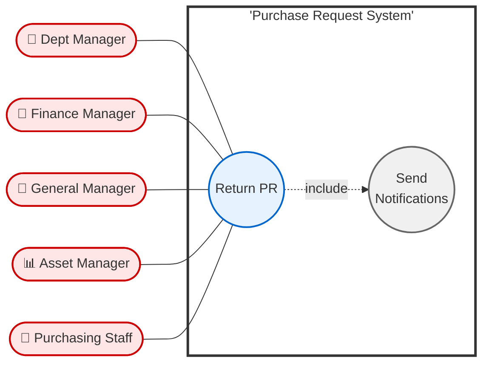
```mermaid
graph LR
    DeptMgr([👔 Dept Manager])
    FinMgr([💼 Finance Manager])
    GenMgr([🎩 General Manager])
    AssetMgr([📊 Asset Manager])
    Purchasing([🛒 Purchasing Staff])

    subgraph PRS['Purchase Request System']
        UC018((Return PR))
        UC105((Send<br>Notifications))
    end

    DeptMgr --- UC018
    FinMgr --- UC018
    GenMgr --- UC018
    AssetMgr --- UC018
    Purchasing --- UC018
    UC018 -.->|include| UC105

    classDef actor fill:#ffe6e6,stroke:#cc0000,stroke-width:2px
    classDef usecase fill:#e6f3ff,stroke:#0066cc,stroke-width:2px
    classDef system fill:#f0f0f0,stroke:#666666,stroke-width:2px

    class DeptMgr,FinMgr,GenMgr,AssetMgr,Purchasing actor
    class UC018 usecase
    class UC105 system

    style PRS fill:#ffffff,stroke:#333333,stroke-width:3px
```

#### Description
Allows approvers or purchasing staff to return a purchase request to the previous stage for revision, enabling corrections without full rejection. The PR is returned to the requestor or previous approver for editing while maintaining workflow continuity.

#### Preconditions
- User must be authenticated
- User must have Approver role OR Purchasing Staff role
- PR must be in "In-progress" status
- PR must be at the current user's workflow stage
- User must have pending approval task for this PR

#### Postconditions
- **Success**: PR status set to "Returned", returned to previous stage, requestor/previous approver notified
- **Failure**: Error message displayed, PR unchanged

#### Main Flow
1. Approver/Purchasing Staff opens PR detail page
2. System displays PR with current approval status
3. Approver identifies issues requiring revision
4. Approver clicks "Return" button
5. System displays return dialog
6. System prompts for return reason (required, minimum 10 characters)
7. Approver enters detailed reason for return
8. Approver clicks "Confirm Return"
9. System validates comments length
10. System begins transaction
11. System updates current approval record:
    - Status = "Returned"
    - Timestamp = current time
    - Comments saved
12. System updates PR status to "Returned"
13. System determines return target:
    - If Purchasing Staff returning → Return to Requestor
    - If First Approver returning → Return to Requestor
    - If Subsequent Approver returning → Return to Previous Approver
14. System commits transaction
15. System sends return notification with comments to appropriate party
16. System logs return activity
17. System displays confirmation message
18. System updates PR detail page

#### Alternative Flows

**A1: Cancel Return** (Step 8)
8a. Approver clicks "Cancel"
9a. System closes dialog
10a. PR remains in current state
11a. Use case ends

**A2: Return to Specific Stage** (Step 13)
13a. System displays stage selection dropdown
14a. Approver selects specific stage to return to
15a. System validates selection
16a. Resume at step 14

#### Exception Flows

**E1: Insufficient Comments** (Step 9)
1. System detects comments < 10 characters
2. System displays "Please provide detailed reason (minimum 10 characters)"
3. System keeps dialog open
4. Resume at step 7

**E2: Already Processed** (Step 10)
1. System detects approval already approved/rejected
2. System displays "This approval was already processed"
3. Use case ends

**E3: PR Already at First Stage** (Step 13)
1. System detects PR at initial stage with no previous approver
2. System returns to Requestor only
3. Resume at step 14

#### Business Rules
- BR-PR-005A: Return action requires comment (min 10 chars)
- BR-PR-005B: Returned PR allows editing of all fields by recipient
- BR-PR-005C: Return preserves PR reference number
- BR-PR-005D: Return resets current approval stage

#### Return Flow Matrix

| Returning Role | PR Stage | Return Target |
|---------------|----------|---------------|
| Department Manager | First Approval | Requestor |
| Finance Manager | Second Approval | Department Manager |
| General Manager | Third Approval | Finance Manager |
| Purchasing Staff | Processing | Requestor |
| Purchasing Staff | After Approval | Last Approver |

#### Related Requirements
- FR-PR-005A: Workflow Actions by Role
- FR-PR-011: Rejection/Return handling
- FR-PR-006: Notifications

---

### UC-PR-019: Submit Purchase Request to Next Stage

**Priority**: High | **Status**: ✅ Implemented
**Frequency**: Daily (30-50 per day)
**Actors**: Purchasing Staff

#### Use Case Diagram

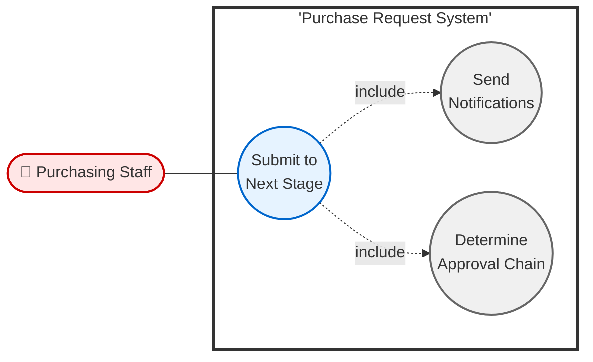
```mermaid
graph LR
    Purchasing([🛒 Purchasing Staff])

    subgraph PRS['Purchase Request System']
        UC019((Submit to<br>Next Stage))
        UC105((Send<br>Notifications))
        UC103((Determine<br>Approval Chain))
    end

    Purchasing --- UC019
    UC019 -.->|include| UC105
    UC019 -.->|include| UC103

    classDef actor fill:#ffe6e6,stroke:#cc0000,stroke-width:2px
    classDef usecase fill:#e6f3ff,stroke:#0066cc,stroke-width:2px
    classDef system fill:#f0f0f0,stroke:#666666,stroke-width:2px

    class Purchasing actor
    class UC019 usecase
    class UC105,UC103 system

    style PRS fill:#ffffff,stroke:#333333,stroke-width:3px
```

#### Description
Allows purchasing staff to submit a purchase request to the next workflow stage after completing vendor allocation and pricing. This forwards the PR for final approval or PO conversion.

#### Preconditions
- User must be authenticated
- User must have Purchasing Staff, Purchaser, or Procurement Manager role
- PR must be in "In-progress" or "Approved" status
- All required pricing fields must be completed
- At least one item must have vendor allocated

#### Postconditions
- **Success**: PR forwarded to next stage, appropriate party notified
- **Failure**: Error message displayed, PR unchanged

#### Main Flow
1. Purchasing Staff opens PR detail page
2. System verifies user has purchasing staff role
3. Purchasing Staff reviews completed vendor allocations
4. Purchasing Staff clicks "Submit" button
5. System validates all items have required pricing:
   - Vendor selected
   - Unit price entered
   - Currency selected
   - Tax profile selected
6. System displays confirmation dialog
7. System shows summary of next stage/recipient
8. Purchasing Staff clicks "Confirm Submit"
9. System begins transaction
10. System updates PR record:
    - Advances workflow stage
    - Updates timestamp
    - Records submitter
11. System determines next stage:
    - If pricing approval required → Route to Finance Manager
    - If final approval required → Route to designated approver
    - If ready for PO → Mark as "Ready for Conversion"
12. System commits transaction
13. System sends notification to next stage recipient
14. System logs submit activity
15. System displays success message
16. System updates PR detail page with new status

#### Alternative Flows

**A1: Cancel Submit** (Step 8)
8a. Purchasing Staff clicks "Cancel"
9a. System closes dialog
10a. PR remains in current state
11a. Use case ends

**A2: Save as Draft First** (Step 4)
4a. Purchasing Staff clicks "Save Draft"
5a. System saves current changes without advancing
6a. Resume at step 3 when ready

#### Exception Flows

**E1: Missing Vendor Allocation** (Step 5)
1. System detects items without vendor
2. System displays "All items must have vendor allocated before submit"
3. System highlights incomplete items
4. Use case ends - user must complete allocations

**E2: Missing Required Fields** (Step 5)
1. System detects missing required pricing fields
2. System displays specific validation errors
3. System shows list of incomplete items
4. Use case ends - user must complete fields

**E3: Budget Exceeded** (Step 10)
1. System detects total exceeds budget allocation
2. System displays budget warning
3. System allows override with justification
4. If justified, resume at step 11
5. If not justified, use case ends

#### Business Rules
- BR-PR-005A: Submit requires all pricing fields complete
- BR-PR-011A: Only Purchasing Staff can submit after vendor allocation
- BR-PR-SUBMIT-001: Submit advances PR to next workflow stage
- BR-PR-SUBMIT-002: Submit triggers notification to next recipient

#### Related Requirements
- FR-PR-005A: Workflow Actions by Role
- FR-PR-005: Approval workflow
- FR-PR-006: Notifications

---

### UC-PR-020: Purchasing Staff Reject Purchase Request

**Priority**: High | **Status**: ✅ Implemented
**Frequency**: Weekly (5-10 per week)
**Actors**: Purchasing Staff

#### Use Case Diagram

```mermaid
graph LR
    Purchasing([🛒 Purchasing Staff])

    subgraph PRS['Purchase Request System']
        UC020((Purchaser<br>Reject PR))
        UC105((Send<br>Notifications))
    end

    Purchasing --- UC020
    UC020 -.->|include| UC105

    classDef actor fill:#ffe6e6,stroke:#cc0000,stroke-width:2px
    classDef usecase fill:#e6f3ff,stroke:#0066cc,stroke-width:2px
    classDef system fill:#f0f0f0,stroke:#666666,stroke-width:2px

    class Purchasing actor
    class UC020 usecase
    class UC105 system

    style PRS fill:#ffffff,stroke:#333333,stroke-width:3px
```

#### Description
Allows purchasing staff to reject a purchase request when it cannot be fulfilled (e.g., no vendors available, items discontinued, budget constraints). This terminates the PR workflow.

#### Preconditions
- User must be authenticated
- User must have Purchasing Staff, Purchaser, or Procurement Manager role
- PR must be in "In-progress" or "Approved" status
- PR must be assigned to purchasing staff for processing

#### Postconditions
- **Success**: PR status changed to "Void", requestor notified
- **Failure**: Error message displayed, PR unchanged

#### Main Flow
1. Purchasing Staff opens PR detail page
2. System verifies user has purchasing staff role
3. Purchasing Staff identifies reason for rejection
4. Purchasing Staff clicks "Reject" button
5. System displays rejection dialog
6. System prompts for rejection reason (required, minimum 10 characters)
7. Purchasing Staff enters detailed reason:
   - No vendors available
   - Items discontinued
   - Budget constraints
   - Other business reason
8. Purchasing Staff clicks "Confirm Rejection"
9. System validates comments length
10. System begins transaction
11. System updates PR record:
    - Status = "Void"
    - Rejection timestamp = current time
    - Rejection reason saved
    - Rejector = current user
12. System cancels any pending workflow tasks
13. System commits transaction
14. System sends rejection notification to:
    - PR creator (Requestor)
    - Previous approvers (for visibility)
15. System logs rejection activity
16. System displays confirmation message
17. System updates PR detail page

#### Alternative Flows

**A1: Cancel Rejection** (Step 8)
8a. Purchasing Staff clicks "Cancel"
9a. System closes dialog
10a. PR remains in current state
11a. Use case ends

#### Exception Flows

**E1: Insufficient Comments** (Step 9)
1. System detects comments < 10 characters
2. System displays "Please provide detailed reason (minimum 10 characters)"
3. System keeps dialog open
4. Resume at step 7

**E2: PR Already Processed** (Step 10)
1. System detects PR already voided or completed
2. System displays "This PR was already processed"
3. Use case ends

#### Business Rules
- BR-PR-010: Rejection comments required (min 10 chars)
- BR-PR-REJECT-001: Purchasing Staff rejection voids the PR
- BR-PR-REJECT-002: Voided PR cannot be edited or resubmitted
- BR-PR-REJECT-003: All stakeholders notified on rejection

#### Rejection Reason Categories

| Category | Description | Example |
|----------|-------------|---------|
| No Vendors | No approved vendors for items | "No suppliers for specialty equipment" |
| Discontinued | Items no longer available | "Product EOL by manufacturer" |
| Budget | Exceeds available budget | "Exceeds department allocation by 50%" |
| Compliance | Does not meet requirements | "Items don't meet safety standards" |
| Duplicate | Duplicate request exists | "Same items in PR-2401-1234" |
| Other | Other business reason | "Project cancelled" |

#### Related Requirements
- FR-PR-005A: Workflow Actions by Role
- FR-PR-011: Rejection handling
- FR-PR-006: Notifications

---

### UC-PR-021: Bulk Item Actions

**Priority**: High | **Status**: 🔧 Partial
**Frequency**: Daily (20-50 per day during approval)
**Actors**: Approver, Purchasing Staff, Requestor (limited)

#### Use Case Diagram

```mermaid
graph LR
    Approver([👔 Approver])
    Purchasing([🛒 Purchasing Staff])
    Requestor([👤 Requestor])

    subgraph PRS['Purchase Request System']
        UC021((Bulk Item<br>Actions))
        UC021A((Approve<br>Selected))
        UC021B((Reject<br>Selected))
        UC021C((Return<br>Selected))
        UC021D((Split<br>Items))
        UC021E((Set Date<br>Required))
        UC105((Send<br>Notifications))
        UC108((Log<br>Activity))
    end

    Approver --- UC021
    Purchasing --- UC021
    Requestor -.->|limited| UC021

    UC021 -.->|extends| UC021A
    UC021 -.->|extends| UC021B
    UC021 -.->|extends| UC021C
    UC021 -.->|extends| UC021D
    UC021 -.->|extends| UC021E
    UC021 -.->|include| UC105
    UC021 -.->|include| UC108

    classDef actor fill:#ffe6e6,stroke:#cc0000,stroke-width:2px
    classDef usecase fill:#e6f3ff,stroke:#0066cc,stroke-width:2px
    classDef system fill:#f0f0f0,stroke:#666666,stroke-width:2px
    classDef extension fill:#fff0e6,stroke:#cc6600,stroke-width:2px

    class Approver,Purchasing,Requestor actor
    class UC021 usecase
    class UC021A,UC021B,UC021C,UC021D,UC021E extension
    class UC105,UC108 system

    style PRS fill:#ffffff,stroke:#333333,stroke-width:3px
```

#### Description
Allows authorized users to select multiple line items within a purchase request and perform bulk actions (approve, reject, return, split, set date required) on them simultaneously, improving efficiency when processing PRs with many items.

#### Preconditions
- User must be authenticated
- User must have appropriate role (Approver, Purchasing Staff, or Requestor for limited actions)
- PR must be in appropriate status for the action
- At least one item must be selected for action
- For Split action: minimum 2 items must be selected

#### Postconditions
- **Success**: Selected items updated, activity logged, notifications sent
- **Failure**: Error message displayed, items unchanged

#### Main Flow: Item Selection

1. User opens PR detail page with Items tab
2. System displays item grid with selection checkboxes
3. User selects individual items via checkboxes OR uses "Select All" checkbox
4. System updates selection count in toolbar
5. System displays bulk action toolbar with:
   - Selection summary: "{n} items selected: {status breakdown}"
   - Available action buttons based on user role and item statuses
6. User clicks desired action button
7. System proceeds to appropriate sub-flow (A through E)

#### Sub-Flow A: Approve Selected Items

**Actors**: Approver, Purchasing Staff
**Preconditions**: Items in "Pending" or "In-progress" status

1. User clicks "Approve Selected" button
2. System validates user has approval permission
3. System identifies valid items (Pending/In-progress status)
4. If some items invalid:
   - System displays: "X of Y items cannot be approved"
   - User chooses "Proceed with valid items" or "Cancel"
5. System displays confirmation dialog:
   - "Approve {n} items?"
   - Optional comment field
6. User confirms approval
7. System begins transaction
8. For each valid item:
   - Updates item status to "Approved"
   - Sets approved_quantity = requested_quantity
   - Records approval timestamp
   - Records approver user ID
9. System commits transaction
10. System logs bulk approval activity
11. System sends notification to requestor
12. System refreshes item grid with updated statuses
13. System displays success: "{n} items approved"

#### Sub-Flow B: Reject Selected Items

**Actors**: Approver, Purchasing Staff
**Preconditions**: Items in "Pending" or "In-progress" status

1. User clicks "Reject Selected" button
2. System validates user has rejection permission
3. System identifies valid items (Pending/In-progress status)
4. If some items invalid:
   - System displays: "X of Y items cannot be rejected"
   - User chooses "Proceed with valid items" or "Cancel"
5. System displays rejection dialog:
   - Rejection reason field (required, min 10 characters)
   - Comment applies to all selected items
6. User enters rejection reason
7. User confirms rejection
8. System validates comment length
9. System begins transaction
10. For each valid item:
    - Updates item status to "Rejected"
    - Records rejection timestamp
    - Records rejection reason
    - Records rejector user ID
11. System commits transaction
12. System logs bulk rejection activity
13. System sends notification to requestor
14. System refreshes item grid with updated statuses
15. System displays success: "{n} items rejected"

#### Sub-Flow C: Return Selected Items

**Actors**: Approver, Purchasing Staff
**Preconditions**: Items in "Pending", "In-progress", or "Approved" status

1. User clicks "Return Selected" button
2. System validates user has return permission
3. System identifies valid items
4. If some items invalid:
   - System displays: "X of Y items cannot be returned"
   - User chooses "Proceed with valid items" or "Cancel"
5. System displays return dialog:
   - Return reason field (required, min 10 characters)
   - Comment applies to all selected items
6. User enters return reason
7. User confirms return
8. System validates comment length
9. System begins transaction
10. For each valid item:
    - Updates item status to "Returned"
    - Records return timestamp
    - Records return reason
    - Records returning user ID
11. System commits transaction
12. System logs bulk return activity
13. System sends notification to requestor
14. System refreshes item grid with updated statuses
15. System displays success: "{n} items returned for revision"

#### Sub-Flow D: Split Selected Items

**Actors**: Purchasing Staff only
**Preconditions**: Minimum 2 items selected, PR in "In-progress" or "Approved" status

1. User clicks "Split" button
2. System validates user has purchasing staff role
3. System validates minimum 2 items selected
4. System displays split configuration dialog:
   - Split options:
     * By Vendor: Group by assigned vendor
     * By Delivery Date: Group by required date
     * Manual Split: User-defined groupings
   - Preview of resulting PR groups
5. User selects split method
6. System generates split preview:
   - Shows items grouped by selected criteria
   - Displays new PR count
7. User reviews and confirms split
8. System begins transaction
9. System creates new PR(s) for split item groups:
   - Copies header information from original PR
   - Assigns new reference numbers (PR-YYMM-NNNN-A, -B, etc.)
   - Links to original PR for audit trail
10. System updates original PR:
    - Removes split items
    - Recalculates totals
    - Adds split reference note
11. System commits transaction
12. System logs split activity
13. System sends notifications:
    - Requestor: PR split notification
    - Purchasing Staff: New PRs created
14. System displays success with links to new PRs

#### Sub-Flow E: Set Date Required

**Actors**: Requestor (Draft/Void/Returned), Approver, Purchasing Staff
**Preconditions**: User has edit permission for items

1. User clicks "Set Date Required" button
2. System validates user has permission
3. System displays date picker dialog:
   - Calendar with date >= today restriction
   - Shows currently selected items count
4. User selects new required date
5. User confirms date change
6. System validates date is not in the past
7. System begins transaction
8. For each selected item:
   - Updates delivery_date field
   - Records date change in audit trail
9. System commits transaction
10. System logs bulk date change activity
11. System refreshes item grid with updated dates
12. System displays success: "Required date updated for {n} items"

#### Alternative Flows

**A1: Cancel Action** (Any sub-flow)
1. User clicks "Cancel" in confirmation dialog
2. System closes dialog
3. Items remain unchanged
4. Use case ends

**A2: Clear Selection** (Main Flow)
1. User clicks "Clear Selection" or deselects all items
2. System hides bulk action toolbar
3. Use case ends

**A3: No Valid Items** (Any sub-flow)
1. System determines all selected items are invalid for action
2. System displays: "No items can be {action}ed"
3. Action button disabled
4. User must adjust selection
5. Use case ends

#### Exception Flows

**E1: Concurrent Modification** (Any sub-flow)
1. System detects item was modified by another user
2. System displays: "Some items were modified. Please refresh and try again."
3. System rolls back transaction
4. Use case ends

**E2: Insufficient Comments** (Sub-flow B, C)
1. System detects comment < 10 characters
2. System displays: "Please provide detailed reason (minimum 10 characters)"
3. System keeps dialog open
4. Resume at comment entry step

**E3: Invalid Date** (Sub-Flow E)
1. System detects date is in the past
2. System displays: "Date must be today or later"
3. System keeps dialog open
4. Resume at date selection step

**E4: Split Minimum Not Met** (Sub-Flow D)
1. System detects fewer than 2 items selected
2. System displays: "Minimum 2 items required for split"
3. Split button disabled
4. Use case ends

#### Business Rules

- BR-PR-BULK-001: Bulk actions apply same comment/date to all selected items
- BR-PR-BULK-002: Invalid items are skipped during bulk processing
- BR-PR-BULK-003: User notified of skipped items count
- BR-PR-BULK-004: All bulk actions logged with operation identifier
- BR-PR-BULK-005: Split maintains audit trail linking original and new PRs
- BR-PR-BULK-006: Performance target: 50 items processed within 3 seconds

#### Role-Based Action Availability

| Action | Requestor | Approver | Purchasing Staff | Conditions |
|--------|-----------|----------|------------------|------------|
| Select Items | ✅ (limited) | ✅ | ✅ | Based on edit permissions |
| Approve Selected | ❌ | ✅ | ✅ | Items: Pending/In-progress |
| Reject Selected | ❌ | ✅ | ✅ | Items: Pending/In-progress |
| Return Selected | ❌ | ✅ | ✅ | Items: Pending/In-progress/Approved |
| Split | ❌ | ✅ | ✅ | Min 2 items, PR: In-progress/Approved |
| Set Date Required | ✅ (Draft/Void/Returned) | ✅ | ✅ | Date >= today |

#### UI Specifications

**Bulk Action Toolbar**:
```
┌─────────────────────────────────────────────────────────────────────────┐
│ ☑ 10 items selected: 3 Approved, 5 Pending, 2 Returned                 │
│ [Approve Selected] [Reject Selected] [Return Selected] [Split] [Set Date Required] │
└─────────────────────────────────────────────────────────────────────────┘
```

**Button States**:
- Enabled: User has permission AND valid items exist for action
- Disabled: No permission OR no valid items OR conditions not met
- Hidden: User role cannot perform action

#### Related Requirements
- FR-PR-026: Bulk Item Actions
- FR-PR-005A: Workflow Actions by Role
- FR-PR-011: Edit and Modify
- FR-PR-006: Notifications

---

### UC-PR-022: Budget Tab CRUD Operations

**Priority**: High | **Status**: ✅ Implemented
**Frequency**: Daily (10-30 per day during PR processing)
**Actors**: Finance Manager, Purchasing Staff

#### Use Case Diagram

```mermaid
graph LR
    FinMgr([💼 Finance Manager])
    Purchasing([🛒 Purchasing Staff])
    Requestor([👤 Requestor])

    subgraph PRS['Purchase Request System']
        UC022((Budget Tab<br>CRUD))
        UC022A((Add Budget<br>Allocation))
        UC022B((Edit Budget<br>Allocation))
        UC022C((Delete Budget<br>Allocation))
        UC022D((View Budget<br>Summary))
        UC102((Calculate<br>Totals))
        UC108((Log<br>Activity))
    end

    FinMgr --- UC022
    Purchasing --- UC022
    Requestor -.->|view only| UC022D

    UC022 -.->|extends| UC022A
    UC022 -.->|extends| UC022B
    UC022 -.->|extends| UC022C
    UC022 -.->|extends| UC022D
    UC022 -.->|include| UC102
    UC022 -.->|include| UC108

    classDef actor fill:#ffe6e6,stroke:#cc0000,stroke-width:2px
    classDef usecase fill:#e6f3ff,stroke:#0066cc,stroke-width:2px
    classDef system fill:#f0f0f0,stroke:#666666,stroke-width:2px
    classDef extension fill:#fff0e6,stroke:#cc6600,stroke-width:2px

    class FinMgr,Purchasing,Requestor actor
    class UC022 usecase
    class UC022A,UC022B,UC022C,UC022D extension
    class UC102,UC108 system

    style PRS fill:#ffffff,stroke:#333333,stroke-width:3px
```

#### Description
Allows authorized users (Finance Manager, Purchasing Staff) to manage budget allocations within a Purchase Request's Budget tab, including adding new allocations, editing existing ones, and deleting entries, with real-time calculation of available budget and status indicators.

#### Preconditions
- User must be authenticated
- User must have Finance Manager or Purchasing Staff role (for CRUD operations)
- PR must exist and user has access to view it
- Budget tab is accessible on the PR detail page

#### Postconditions
- **Success**: Budget allocation created/updated/deleted, totals recalculated, activity logged
- **Failure**: Error message displayed, data unchanged

#### Main Flow: View Budget Tab

1. User opens PR detail page
2. User navigates to Budget tab
3. System displays budget allocation table with columns:
   - Location, Category, Total Budget
   - Soft Commitment (Dept Head), Soft Commitment (PO), Hard Commitment
   - Available Budget (calculated), Current PR Amount, Status (calculated)
4. System displays totals row with sum of all numeric columns
5. System shows "Add Budget" button (if user has permission)
6. System displays row actions menu for each entry (if user has permission)

#### Sub-Flow A: Add Budget Allocation

**Actors**: Finance Manager, Purchasing Staff
**Preconditions**: User has add permission

1. User clicks "Add Budget" button
2. System displays Add Budget dialog with form fields:
   - Location (dropdown, required)
   - Category (dropdown, required)
   - Total Budget (currency input, required)
   - Soft Commitment - Dept Head (currency input, optional, default 0)
   - Soft Commitment - PO (currency input, optional, default 0)
   - Hard Commitment (currency input, optional, default 0)
   - Current PR Amount (currency input, optional, default 0)
3. System displays real-time Available Budget preview:
   - Formula: Total Budget - Soft (DH) - Soft (PO) - Hard Commitment
4. User fills in required and optional fields
5. User clicks "Save" button
6. System validates form:
   - Location is required
   - Category is required
   - Total Budget is required and >= 0
   - All numeric fields are valid numbers >= 0
   - Location + Category combination is unique
7. If validation fails:
   - System displays error messages for invalid fields
   - User corrects errors and retries
8. System calculates:
   - Available Budget = Total - Soft (DH) - Soft (PO) - Hard
   - Status based on utilization:
     * "Over Budget" if Available < 0
     * "Near Limit" if Available <= 20% of Total
     * "Within Budget" otherwise
9. System creates new budget allocation record
10. System updates table with new entry
11. System recalculates totals row
12. System logs add activity
13. System displays success toast: "Budget allocation added successfully"
14. System closes dialog

#### Sub-Flow B: Edit Budget Allocation

**Actors**: Finance Manager, Purchasing Staff
**Preconditions**: User has edit permission, budget allocation exists

1. User clicks row actions menu (MoreHorizontal icon)
2. User selects "Edit" option
3. System displays Edit Budget dialog pre-populated with current values
4. User modifies fields as needed
5. System updates Available Budget preview in real-time
6. User clicks "Save" button
7. System validates form (same rules as Add)
8. If validation fails:
   - System displays error messages
   - User corrects errors and retries
9. System recalculates Available Budget and Status
10. System updates budget allocation record
11. System updates table with modified entry
12. System recalculates totals row
13. System logs edit activity
14. System displays success toast: "Budget allocation updated successfully"
15. System closes dialog

#### Sub-Flow C: Delete Budget Allocation

**Actors**: Finance Manager, Purchasing Staff
**Preconditions**: User has delete permission, budget allocation exists

1. User clicks row actions menu (MoreHorizontal icon)
2. User selects "Delete" option (destructive styling)
3. System displays AlertDialog confirmation:
   - Title: "Delete Budget Allocation"
   - Message: "Are you sure you want to delete the budget allocation for {Location} - {Category}? This action cannot be undone."
   - Buttons: "Cancel" (outline), "Delete" (destructive red)
4. User clicks "Delete" to confirm
5. System removes budget allocation record
6. System updates table (removes row)
7. System recalculates totals row
8. System logs delete activity
9. System displays success toast: "Budget allocation deleted"
10. System closes dialog

#### Sub-Flow D: View Budget Summary

**Actors**: All users with PR view access
**Preconditions**: PR exists, user has view permission

1. User views Budget tab (read-only for Requestor/Approver)
2. System displays all budget allocations in table format
3. System shows calculated fields:
   - Available Budget per row
   - Status with color-coded badge:
     * Red: "Over Budget"
     * Yellow: "Near Limit"
     * Green: "Within Budget"
4. System displays totals row
5. Mobile view: System displays data in card format

#### Alternative Flows

**A1: Cancel Add/Edit** (Sub-flow A, B)
1. User clicks "Cancel" in dialog
2. System closes dialog without saving
3. Data remains unchanged
4. Use case ends

**A2: Cancel Delete** (Sub-flow C)
1. User clicks "Cancel" in AlertDialog
2. System closes dialog
3. Budget allocation remains unchanged
4. Use case ends

**A3: Duplicate Entry Attempt** (Sub-flow A)
1. User attempts to add Location + Category that already exists
2. System displays error: "Budget allocation for this Location and Category already exists"
3. User must select different Location or Category
4. Resume at step 4

#### Exception Flows

**E1: Invalid Numeric Input** (Sub-flow A, B)
1. User enters non-numeric or negative value
2. System displays error: "Must be a valid number >= 0"
3. System keeps dialog open
4. Resume at data entry step

**E2: Missing Required Field** (Sub-flow A, B)
1. User leaves required field empty
2. System displays error: "{Field} is required"
3. System keeps dialog open
4. Resume at data entry step

**E3: Concurrent Modification** (Sub-flow B, C)
1. Another user modified/deleted the budget allocation
2. System detects stale data
3. System displays: "This budget allocation was modified. Please refresh and try again."
4. System refreshes table data
5. Use case ends

#### Business Rules

- BR-PR-066: Budget allocations must have unique Location + Category combinations per PR
- BR-PR-067: Available Budget = Total Budget - Soft Commitment (DH) - Soft Commitment (PO) - Hard Commitment
- BR-PR-068: Status "Over Budget" when Available Budget < 0
- BR-PR-069: Status "Near Limit" when Available Budget <= 20% of Total Budget
- BR-PR-070: Status "Within Budget" when Available Budget > 20% of Total Budget
- BR-PR-071: Only Purchasing Staff and Finance Manager can add/edit/delete budget allocations
- BR-PR-072: All numeric budget fields must be >= 0
- BR-PR-073: Location and Category are required fields
- BR-PR-074: Total Budget is required and must be > 0
- BR-PR-075: Budget deletion requires confirmation dialog
- BR-PR-076: Budget totals recalculate dynamically on any CRUD operation

#### Role-Based Access

| Action | Requestor | Approver | Purchasing Staff | Finance Manager |
|--------|-----------|----------|------------------|-----------------|
| View Budget Tab | ✅ | ✅ | ✅ | ✅ |
| Add Budget | ❌ | ❌ | ✅ | ✅ |
| Edit Budget | ❌ | ❌ | ✅ | ✅ |
| Delete Budget | ❌ | ❌ | ✅ | ✅ |

#### UI Specifications

**Budget Tab Layout**:
```
┌────────────────────────────────────────────────────────────────────────────────────────┐
│ Budget Allocation                                                    [+ Add Budget]    │
├────────────────────────────────────────────────────────────────────────────────────────┤
│ Location    │ Category │ Total    │ Soft(DH) │ Soft(PO) │ Hard    │ Available │ Status │ ⋮ │
├─────────────┼──────────┼──────────┼──────────┼──────────┼─────────┼───────────┼────────┼───┤
│ Kitchen     │ F&B      │ $50,000  │ $10,000  │ $5,000   │ $8,000  │ $27,000   │ ✅     │ ⋮ │
│ Front Office│ Supplies │ $15,000  │ $3,000   │ $2,000   │ $9,500  │ $500      │ ⚠️     │ ⋮ │
│ Engineering │ Equipment│ $25,000  │ $8,000   │ $10,000  │ $10,000 │ -$3,000   │ ❌     │ ⋮ │
├─────────────┴──────────┴──────────┴──────────┴──────────┴─────────┴───────────┴────────┴───┤
│ TOTAL                  │ $90,000  │ $21,000  │ $17,000  │ $27,500 │ $24,500   │            │
└────────────────────────────────────────────────────────────────────────────────────────────┘
```

**Status Badges**:
- ✅ "Within Budget" - Green badge
- ⚠️ "Near Limit" - Yellow/Warning badge
- ❌ "Over Budget" - Red/Destructive badge

**Row Actions Menu**:
```
┌──────────────┐
│ ✏️ Edit      │
│ ─────────────│
│ 🗑️ Delete    │  (red text)
└──────────────┘
```

#### Related Requirements
- FR-PR-027: Budget Tab CRUD Operations
- FR-PR-004: Budget Control
- BR-PR-066 to BR-PR-076: Budget Tab CRUD Rules

---

### UC-PR-023: Approver Split by Approval Status

**Priority**: High | **Status**: 🚧 Pending
**Actor**: Approver (Department Manager, Finance Manager, General Manager)
**Goal**: Split a Purchase Request to separate approved items from items that need revision, enabling parallel processing

#### Use Case Diagram

```mermaid
graph TB
    subgraph Actors
        Approver([👤 Approver])
    end

    subgraph 'Purchase Request System'
        UC023((UC-PR-023<br>Approver Split<br>by Status))
        UC005((UC-PR-005<br>Approve PR))
        UC018((UC-PR-018<br>Return PR))
    end

    Approver --> UC023
    UC023 -.->|extends| UC005
    UC023 -.->|extends| UC018
```

#### Preconditions
1. Approver is logged in with valid session
2. PR status is "In-progress"
3. PR has at least 2 items
4. At least one item should be approved and at least one should be returned
5. Approver has approval authority for the PR

#### Postconditions
1. Original PR contains only approved items with status "Approved" or "In-progress" (to next approver)
2. New PR created with returned items and status "Returned"
3. New PR linked to original via `parent_pr_id`
4. Both PRs have activity logged
5. Requestor notified about the returned PR

#### Main Flow

| Step | Actor | Action | System Response |
|------|-------|--------|-----------------|
| 1 | Approver | Opens PR detail page | System displays PR with all items |
| 2 | Approver | Reviews items and identifies which to approve vs return | System displays item list with status indicators |
| 3 | Approver | Selects items to split (min 2 required) | System enables Split button |
| 4 | Approver | Clicks "Split" button | System displays Split Dialog |
| 5 | Approver | Selects "By Approval Status" split option | System shows item categorization interface |
| 6 | Approver | Assigns items to "Approved" or "Return for Revision" groups | System updates preview of resulting PRs |
| 7 | Approver | Enters return reason for returned items (min 10 chars) | System validates input |
| 8 | Approver | Reviews split preview showing both resulting PRs | System displays summary |
| 9 | Approver | Clicks "Confirm Split" | System processes split |
| 10 | System | Creates new PR for returned items | New PR created with parent_pr_id set |
| 11 | System | Updates original PR with only approved items | Original PR updated |
| 12 | System | Sets original PR items to "Approved" status | Items updated |
| 13 | System | Sets new PR status to "Returned" | Status updated |
| 14 | System | Logs activity on both PRs | Audit trail created |
| 15 | System | Sends notification to Requestor about returned items | Notification sent |
| 16 | System | Displays success message with links to both PRs | Approver sees confirmation |

#### Alternative Flows

**A1: Split by Vendor** (Step 5)
5a. Approver selects "By Vendor" split option
5b. System groups items by vendor
5c. Continue from step 8

**A2: Split by Delivery Date** (Step 5)
5a. Approver selects "By Delivery Date" split option
5b. System groups items by delivery date
5c. Continue from step 8

**A3: Cancel Split** (Any step before 9)
Xa. Approver clicks Cancel
Xb. System closes dialog without changes
Xc. Use case ends

#### Exception Flows

**E1: Minimum Items Not Met** (Step 3)
3a. Only 1 item selected
3b. System keeps Split button disabled
3c. Tooltip shows "Minimum 2 items required for split"

**E2: Single Group After Split** (Step 6)
6a. All items assigned to same group
6b. System shows validation error
6c. Message: "Items must be distributed between at least two groups"

**E3: Return Reason Too Short** (Step 7)
7a. Return reason less than 10 characters
7b. System shows validation error
7c. Message: "Return reason must be at least 10 characters"

**E4: Network Error During Split** (Step 9)
9a. API call fails
9b. System shows error message
9c. No changes made (transaction rollback)
9d. Approver can retry

#### Role-Based Field Visibility During Review

When Approvers view PR items before splitting:

| Field | Visibility | Editable |
|-------|------------|----------|
| Item Description | 👁️ Read-only | No |
| Requested Quantity | 👁️ Read-only | No |
| Approved Quantity | ✅ Editable | Yes |
| Vendor | 👁️ Read-only | No |
| Unit Price | 👁️ Read-only | No |
| Discount | 👁️ Read-only | No |
| FOC (Free of Charge) | 👁️ Read-only | No |
| Budget Code | 👁️ Read-only | No |

Legend: ✅ = Editable | 👁️ = Read-only (visible) | ❌ = Hidden

#### UI Specifications

**Split Dialog**:
```
┌────────────────────────────────────────────────────────────────┐
│ Split Purchase Request                                    [X]  │
├────────────────────────────────────────────────────────────────┤
│ Split Option: ○ By Approval Status                             │
│               ○ By Vendor                                      │
│               ○ By Delivery Date                               │
├────────────────────────────────────────────────────────────────┤
│ Item Assignment:                                               │
│ ┌────────────────────────────────────────────────────────────┐ │
│ │ □ Item 1 - Office Supplies    [Approve ▼] [Return ▼]       │ │
│ │ □ Item 2 - Kitchen Equipment  [Approve ▼] [Return ▼]       │ │
│ │ □ Item 3 - Cleaning Products  [Approve ▼] [Return ▼]       │ │
│ └────────────────────────────────────────────────────────────┘ │
├────────────────────────────────────────────────────────────────┤
│ Return Reason (required for returned items):                   │
│ ┌────────────────────────────────────────────────────────────┐ │
│ │ Please provide more detailed specifications...             │ │
│ └────────────────────────────────────────────────────────────┘ │
├────────────────────────────────────────────────────────────────┤
│ Preview:                                                       │
│ PR-2501-0042 (Original): 2 items → Approved                    │
│ PR-2501-0043 (New): 1 item → Returned to Requestor             │
├────────────────────────────────────────────────────────────────┤
│                              [Cancel]  [Confirm Split]         │
└────────────────────────────────────────────────────────────────┘
```

#### Business Rules
- BR-PR-SPLIT-001: Approvers can split PRs during approval workflow
- BR-PR-SPLIT-002: Split by Approval Status creates parent-child PR relationship
- BR-PR-SPLIT-003: Original PR proceeds with approved items only
- BR-PR-SPLIT-004: New PR inherits header details but has "Returned" status
- BR-PR-SPLIT-005: Requestor can edit and resubmit the returned PR
- BR-PR-SPLIT-006: Both PRs maintain link via parent_pr_id for traceability
- BR-PR-SPLIT-007: Activity log tracks split action with user and timestamp

#### Related Requirements
- FR-PR-016.2: Approver Split Capability
- FR-PR-005A: Workflow Actions by Role
- BR-PR-BULK-005: Split maintains audit trail
- DD: parent_pr_id, split_reason fields

---

## 4. System Use Cases (101-199)

### UC-PR-101: Auto-generate Reference Number

**Priority**: Critical | **Status**: 🚧 Pending
**Trigger**: PR creation (UC-PR-001 step 12)
**Frequency**: Every PR creation

#### Use Case Diagram

```mermaid
graph LR
    subgraph PRS['Purchase Request System']
        UC001((Create PR))
        UC101((Auto-generate<br>Ref Number))
    end

    UC001 -.->|include| UC101

    classDef usecase fill:#e6f3ff,stroke:#0066cc,stroke-width:2px
    classDef system fill:#f0f0f0,stroke:#666666,stroke-width:2px

    class UC001 usecase
    class UC101 system

    style PRS fill:#ffffff,stroke:#333333,stroke-width:3px
```

#### Description
System automatically generates unique sequential reference numbers for new purchase requests.

#### Preconditions
- PR is being created
- Database sequence exists

#### Postconditions
- **Success**: Unique reference number assigned in format PR-YYMM-NNNN
- **Failure**: Database error, transaction rolled back

#### Main Flow
1. System receives new PR data without reference number
2. System extracts PR date year and month (YY = 2-digit year, MM = 2-digit month)
3. System queries database for next sequence number for that year-month:
   ```sql
   SELECT COALESCE(MAX(CAST(SUBSTRING(ref_number FROM 9) AS INT)), 0) + 1
   FROM purchase_requests
   WHERE ref_number LIKE 'PR-2501-%'
   ```
4. System formats reference number: `PR-{YYMM}-{SEQUENCE:04d}`
   - Example: PR-2501-0042
5. System assigns reference number to PR
6. System continues with PR creation

#### Alternative Flows

**A1: First PR of Year** (Step 3)
3a. No PRs exist for current year
4a. System returns sequence = 1
5a. Resume at step 4

#### Exception Flows

**E1: Sequence Exhausted** (Step 4)
1. Sequence reaches 9999
2. System logs error "PR sequence exhausted for year YYYY"
3. System notifies administrator
4. Transaction fails

**E2: Duplicate Detection** (Step 5)
1. System detects duplicate reference (race condition)
2. System retries with next sequence number
3. Max 3 retries
4. If still fails, transaction rolled back

#### Business Rules
- BR-PR-001: Format PR-YYMM-NNNN
- BR-PR-037: Sequence resets each month
- BR-PR-038: Reference numbers are immutable

#### Related Requirements
- FR-PR-002: Auto-generate reference numbers

---

### UC-PR-102: Calculate Purchase Request Totals

**Priority**: Critical | **Status**: 🔧 Partial
**Trigger**: Line item added/modified/deleted
**Frequency**: Continuous during PR editing

#### Use Case Diagram

```mermaid
graph LR
    subgraph PRS['Purchase Request System']
        UC001((Create PR))
        UC002((Edit PR))
        UC102((Calculate<br>Totals))
    end

    UC001 -.->|include| UC102
    UC002 -.->|include| UC102

    classDef usecase fill:#e6f3ff,stroke:#0066cc,stroke-width:2px
    classDef system fill:#f0f0f0,stroke:#666666,stroke-width:2px

    class UC001,UC002 usecase
    class UC102 system

    style PRS fill:#ffffff,stroke:#333333,stroke-width:3px
```

#### Description
System automatically calculates line totals and PR totals based on quantities, prices, taxes, and discounts.

#### Preconditions
- PR exists
- Line items exist

#### Postconditions
- **Success**: All totals calculated and updated
- **Failure**: Calculation error logged

#### Main Flow
1. System receives trigger (item add/edit/delete)
2. For each affected line item:
   a. System calculates: `line_subtotal = quantity × unit_price`
   b. System calculates: `discount_amount = line_subtotal × (discount_percentage / 100)`
   c. System calculates: `line_total = line_subtotal - discount_amount`
   d. System calculates: `tax_amount = line_total × (tax_rate / 100)`
   e. System calculates: `line_total_with_tax = line_total + tax_amount`
3. System aggregates all line items:
   ```typescript
   subtotal = Σ(line_total)
   total_tax = Σ(tax_amount)
   total_discount = Σ(discount_amount)
   ```
4. System calculates PR totals:
   ```typescript
   total_amount = subtotal + total_tax
   ```
5. System applies exchange rate if multi-currency:
   ```typescript
   base_total_amount = total_amount × exchange_rate
   ```
6. System updates PR record with calculated totals
7. System triggers UI update if user is viewing PR

#### Alternative Flows

**A1: Rounding** (Step 2)
2a. System rounds all monetary values to 2 decimal places
2b. System uses banker's rounding (round half to even)

#### Exception Flows

**E1: Invalid Values** (Step 2)
1. System detects negative or null values
2. System sets calculated values to 0
3. System logs validation error
4. System continues with other items

#### Business Rules
- BR-PR-039: Totals calculated in real-time
- BR-PR-040: Rounding to 2 decimal places
- BR-PR-041: Multi-currency conversion using exchange rate

#### Related Requirements
- FR-PR-017: Automatic calculations
- FR-PR-007: Multi-currency support

---

### UC-PR-103: Determine Approval Chain

**Priority**: Critical | **Status**: 🚧 Pending
**Trigger**: PR submission (UC-PR-003 step 4)
**Frequency**: Every PR submission

#### Use Case Diagram

```mermaid
graph LR
    subgraph PRS['Purchase Request System']
        UC003((Submit PR))
        UC103((Determine<br>Approval Chain))
    end

    UC003 -.->|include| UC103

    classDef usecase fill:#e6f3ff,stroke:#0066cc,stroke-width:2px
    classDef system fill:#f0f0f0,stroke:#666666,stroke-width:2px

    class UC003 usecase
    class UC103 system

    style PRS fill:#ffffff,stroke:#333333,stroke-width:3px
```

#### Description
System automatically determines the required approval chain based on PR type, amount, department, and configured rules.

#### Preconditions
- PR is being submitted
- Approval rules are configured
- Approvers are assigned to departments/roles

#### Postconditions
- **Success**: Approval chain determined with sequence of approvers
- **Failure**: No approval chain configured error

#### Main Flow
1. System receives PR submission request
2. System retrieves PR details:
   - Type (General/Market List/Asset)
   - Total amount
   - Department ID
   - Location ID
3. System queries approval rules:
   ```sql
   SELECT * FROM approval_rules
   WHERE pr_type = ?
     AND min_amount <= total_amount
     AND max_amount >= total_amount
     AND (department_id = ? OR department_id IS NULL)
   ORDER BY priority
   ```
4. System applies matching rule
5. System builds approval chain:
   - For sequential workflow:
     * Stage 1: Department Manager
     * Stage 2: Finance Manager (if amount > $10,000)
     * Stage 3: General Manager (if amount > $50,000)
   - For parallel workflow (Asset type):
     * Stage 1: Department Manager + Asset Manager + Finance Manager (parallel)
6. System verifies all roles have assigned users
7. System creates approval stage records
8. System returns approval chain

#### Alternative Flows

**A1: Market List Auto-Approve** (Step 4)
4a. PR type is Market List AND amount < $500
5a. System returns empty approval chain (auto-approve)
6a. Use case ends

**A2: No Rule Match** (Step 4)
4a. No approval rule matches criteria
5a. System applies default rule (department manager only)

#### Exception Flows

**E1: No Approver Assigned** (Step 6)
1. System detects required role has no assigned user
2. System checks for fallback approver
3. If no fallback, system returns error
4. PR submission fails with error message

**E2: Circular Approval** (Step 5)
1. System detects creator is also approver
2. System auto-approves that stage
3. System moves to next stage

#### Business Rules
- BR-PR-006: Approval chain required for submission
- BR-PR-007: Market List auto-approve under threshold
- BR-PR-042: Amount-based approval tiers
- BR-PR-043: Asset type requires asset manager
- BR-PR-044: Parallel approvals for high-value assets

#### Related Requirements
- FR-PR-005: Approval workflow
- FR-PR-018: Configurable approval rules

---

### UC-PR-104: Check Budget Availability

**Priority**: High | **Status**: 🚧 Pending
**Trigger**: PR submission with budget code (UC-PR-003 step 8)
**Frequency**: When budget codes used (60% of PRs)

#### Use Case Diagram

```mermaid
graph LR
    subgraph PRS['Purchase Request System']
        UC003((Submit PR))
        UC104((Check<br>Budget))
    end

    UC003 -.->|include| UC104

    classDef usecase fill:#e6f3ff,stroke:#0066cc,stroke-width:2px
    classDef system fill:#f0f0f0,stroke:#666666,stroke-width:2px

    class UC003 usecase
    class UC104 system

    style PRS fill:#ffffff,stroke:#333333,stroke-width:3px
```

#### Description
System checks if sufficient budget is available for items with budget codes before allowing PR submission.

#### Preconditions
- PR is being submitted
- Line items have budget codes
- Budget system is available

#### Postconditions
- **Success**: Budget available, funds reserved
- **Failure**: Insufficient budget error

#### Main Flow
1. System identifies line items with budget codes
2. System groups items by budget code
3. For each budget code:
   a. System queries budget system for available balance
   b. System calculates requested amount for that budget code
   c. System compares: `available >= requested`
4. System aggregates results
5. If all budget codes have sufficient funds:
   a. System reserves funds in budget system
   b. System records reservation ID
6. System returns success

#### Alternative Flows

**A1: No Budget Codes** (Step 1)
1a. No items have budget codes
2a. System skips budget check
3a. System returns success immediately

**A2: Partial Budget** (Step 5)
5a. Some budget codes sufficient, others not
5b. System returns detailed breakdown
5c. System suggests which items to remove
5d. Submission fails

#### Exception Flows

**E1: Insufficient Budget** (Step 3c)
1. System detects insufficient budget for one or more codes
2. System returns detailed error:
   - Budget code
   - Available amount
   - Requested amount
   - Shortfall amount
3. System provides option to:
   - Remove over-budget items
   - Request budget increase
   - Use different budget code
4. Submission fails

**E2: Budget System Unavailable** (Step 3a)
1. System cannot connect to budget system
2. System logs error
3. System provides options:
   - Submit without budget check (requires approval)
   - Retry later
4. Submission paused

#### Business Rules
- BR-PR-008: Budget check required if budget code provided
- BR-PR-045: Funds reserved on submission, committed on conversion
- BR-PR-046: Funds released on rejection/cancellation

#### Related Requirements
- FR-PR-019: Budget integration
- INT-BR-001: Budget system integration

---

### UC-PR-105: Send Approval Notifications

**Priority**: Critical | **Status**: 🚧 Pending
**Trigger**: PR submitted, approval completed (UC-PR-003, UC-PR-005)
**Frequency**: Every status change requiring notification

#### Use Case Diagram

```mermaid
graph LR
    subgraph PRS['Purchase Request System']
        UC003((Submit PR))
        UC005((Approve PR))
        UC006((Reject PR))
        UC105((Send<br>Notifications))
    end

    UC003 -.->|include| UC105
    UC005 -.->|include| UC105
    UC006 -.->|include| UC105

    classDef usecase fill:#e6f3ff,stroke:#0066cc,stroke-width:2px
    classDef system fill:#f0f0f0,stroke:#666666,stroke-width:2px

    class UC003,UC005,UC006 usecase
    class UC105 system

    style PRS fill:#ffffff,stroke:#333333,stroke-width:3px
```

#### Description
System sends notifications to relevant users when PR status changes or action is required.

#### Preconditions
- PR exists
- Status change event occurred
- User preferences are configured

#### Postconditions
- **Success**: Notifications sent via configured channels
- **Failure**: Notification queued for retry

#### Main Flow
1. System receives notification trigger event:
   - PR submitted → Notify first approver
   - PR approved → Notify next approver or creator
   - PR rejected → Notify creator
   - PR cancelled → Notify all pending approvers
2. System identifies recipient users
3. System retrieves user notification preferences
4. System builds notification content:
   - Subject: "[Action Required] PR-2501-0042 awaiting your approval"
   - Body: PR details, amounts, link to PR
5. For each recipient and their preferences:
   a. If email enabled: Queue email
   b. If SMS enabled: Queue SMS
   c. If in-app enabled: Create in-app notification
6. System sends notifications via configured services
7. System logs notification delivery
8. System updates notification_sent timestamp
9. System marks notification as delivered

#### Alternative Flows

**A1: Batch Notifications** (Step 6)
6a. Multiple notifications for same user
6b. System groups into digest email
6c. System sends single notification

**A2: No Preferences** (Step 3)
3a. User has no preferences configured
3b. System uses default (email + in-app)

#### Exception Flows

**E1: Email Delivery Failed** (Step 6a)
1. Email service returns error
2. System logs error details
3. System queues for retry (max 3 attempts)
4. System tries alternate channels (SMS, in-app)

**E2: Invalid Email/Phone** (Step 6)
1. System detects invalid contact info
2. System logs warning
3. System notifies admin
4. System sends in-app notification only

#### Business Rules
- BR-PR-047: Notifications sent within 5 minutes
- BR-PR-048: Failed notifications retried up to 3 times
- BR-PR-049: Users can configure notification preferences

#### Related Requirements
- FR-PR-006: Notifications
- INT-NOT-001: Notification service integration

---

## 5. Integration Use Cases (201-299)

### UC-PR-201: Sync PR Data to ERP System

**Priority**: Medium | **Status**: 🚧 Pending
**Trigger**: PR status changes to Approved or Completed
**Frequency**: Daily (30-50 times)

#### Use Case Diagram

```mermaid
graph LR
    subgraph PRS['Purchase Request System']
        UC005((Approve PR))
        UC011((Convert to PO))
        UC201((Sync to<br>ERP))
    end

    UC005 -.->|trigger| UC201
    UC011 -.->|trigger| UC201

    classDef usecase fill:#e6f3ff,stroke:#0066cc,stroke-width:2px
    classDef system fill:#f0f0f0,stroke:#666666,stroke-width:2px

    class UC005,UC011 usecase
    class UC201 system

    style PRS fill:#ffffff,stroke:#333333,stroke-width:3px
```

#### Description
System synchronizes approved PR data to external ERP system for financial tracking and reporting.

#### Preconditions
- PR is approved or converted
- ERP integration is enabled
- ERP system is accessible

#### Postconditions
- **Success**: PR data synced to ERP, sync ID recorded
- **Failure**: Sync error logged, queued for retry

#### Main Flow
1. System detects PR status change to Approved/Completed
2. System checks if ERP sync is enabled
3. System prepares PR data in ERP format:
   ```json
   {
     "document_type": "PR",
     "reference": "PR-2501-0042",
     "date": "2025-01-30",
     "department": "F&B",
     "total_amount": 15750.00,
     "currency": "USD",
     "items": [...]
   }
   ```
4. System calls ERP API endpoint
5. System receives ERP document ID
6. System saves sync record:
   - PR ID
   - ERP document ID
   - Sync timestamp
   - Status: Synced
7. System logs sync activity

#### Alternative Flows

**A1: Update Existing Record** (Step 4)
4a. PR was previously synced
5a. System calls ERP update endpoint
6a. System updates existing sync record

#### Exception Flows

**E1: ERP API Error** (Step 4)
1. ERP returns error response
2. System logs error details
3. System queues for retry
4. System updates sync status: Failed
5. System sends alert to admin

**E2: Network Timeout** (Step 4)
1. API call times out
2. System checks ERP for duplicate
3. If not found, queue for retry
4. Max 3 retry attempts

#### Business Rules
- BR-PR-050: Sync occurs after approval
- BR-PR-051: Failed syncs retried automatically
- BR-PR-052: Sync can be disabled per department

#### Related Requirements
- INT-ERP-001: ERP integration
- FR-PR-020: External system sync

---

### UC-PR-202: Import PR Data from External System

**Priority**: Low | **Status**: 🚧 Pending
**Trigger**: Scheduled import job or manual trigger
**Frequency**: Monthly (for bulk imports)

#### Use Case Diagram

```mermaid
graph LR
    Admin([👨‍💼 Admin])

    subgraph PRS['Purchase Request System']
        UC202((Import PR Data))
        UC001((Create PR))
    end

    Admin --- UC202
    UC202 -.->|include| UC001

    classDef actor fill:#ffe6e6,stroke:#cc0000,stroke-width:2px
    classDef usecase fill:#e6f3ff,stroke:#0066cc,stroke-width:2px
    classDef system fill:#f0f0f0,stroke:#666666,stroke-width:2px

    class Admin actor
    class UC202 usecase
    class UC001 system

    style PRS fill:#ffffff,stroke:#333333,stroke-width:3px
```

#### Description
System imports purchase request data from external systems (e.g., legacy system migration, vendor portal).

#### Preconditions
- Import file available
- File format validated
- Import mapping configured

#### Postconditions
- **Success**: PRs created/updated, import log generated
- **Failure**: Import errors logged, rollback if needed

#### Main Flow
1. System receives import file (CSV/Excel/JSON)
2. System validates file format and schema
3. System parses file records
4. For each record:
   a. System validates data against business rules
   b. System checks for duplicates (by reference number)
   c. If valid:
      - System creates new PR
      - System sets status appropriately
      - System logs import
   d. If invalid:
      - System logs error with line number
      - System continues to next record
5. System generates import summary:
   - Total records processed
   - Success count
   - Error count
   - List of errors
6. System sends summary to user

#### Alternative Flows

**A1: Update Mode** (Step 4c)
4ca. Import mode is "Update"
4cb. System updates existing PRs by reference number
4cc. System preserves audit trail

**A2: Validation-Only Mode** (Step 4c)
4ca. Import mode is "Validate Only"
4cb. System does not create/update records
4cc. System generates validation report

#### Exception Flows

**E1: Invalid File Format** (Step 2)
1. System cannot parse file
2. System returns error "Invalid file format"
3. Import fails immediately

**E2: Critical Validation Error** (Step 4a)
1. Required field missing
2. System logs error with details
3. System skips record
4. System continues with next record

#### Business Rules
- BR-PR-053: Import preserves audit trail
- BR-PR-054: Duplicate detection by reference number
- BR-PR-055: Validation-only mode for testing

#### Related Requirements
- FR-PR-021: Data import
- INT-IMP-001: Import framework

---

## 6. Background Job Use Cases (301-399)

### UC-PR-301: Send Approval Reminder Notifications

**Priority**: Medium | **Status**: 🚧 Pending
**Trigger**: Scheduled job (daily at 9:00 AM)
**Frequency**: Daily

#### Use Case Diagram

```mermaid
graph LR
    subgraph PRS['Purchase Request System']
        UC301((Send Approval<br>Reminders))
        UC105((Send<br>Notifications))
    end

    UC301 -.->|include| UC105

    classDef system fill:#f0f0f0,stroke:#666666,stroke-width:2px

    class UC301,UC105 system

    style PRS fill:#ffffff,stroke:#333333,stroke-width:3px
```

#### Description
System automatically sends reminder notifications to approvers who have pending approvals older than configured threshold.

#### Preconditions
- Scheduled job is enabled
- Pending approvals exist
- Reminder threshold configured (default: 48 hours)

#### Postconditions
- **Success**: Reminders sent, reminder count incremented
- **Failure**: Errors logged, retry next run

#### Main Flow
1. Job starts at scheduled time
2. System queries pending approvals:
   ```sql
   SELECT *
   FROM pr_approvals pra
   JOIN purchase_requests pr ON pra.purchase_request_id = pr.id
   WHERE pra.status = 'Pending'
     AND pra.created_at < NOW() - INTERVAL '48 hours'
     AND pra.reminder_count < 3
   ```
3. System groups approvals by approver
4. For each approver with pending approvals:
   a. System builds reminder email listing all pending PRs
   b. System sends reminder email
   c. System increments reminder_count
   d. System updates last_reminder_at timestamp
5. System logs reminder activity
6. System generates summary report
7. Job completes

#### Alternative Flows

**A1: Escalation Threshold** (Step 3)
3a. Some approvals exceed escalation threshold (e.g., 5 days)
3b. System includes manager in notification
3c. System flags for escalation process (UC-PR-302)

#### Exception Flows

**E1: Email Failure** (Step 4b)
1. Email send fails
2. System logs error
3. System continues with next approver
4. Failed reminders retried next run

#### Business Rules
- BR-PR-056: Reminders sent after 48 hours
- BR-PR-057: Max 3 reminders per approval
- BR-PR-058: Reminders include all pending PRs for approver

#### Related Requirements
- FR-PR-022: Reminder notifications
- SYS-JOB-001: Scheduled jobs framework

---

### UC-PR-302: Escalate Overdue Approvals

**Priority**: Medium | **Status**: 🚧 Pending
**Trigger**: Scheduled job (daily at 10:00 AM)
**Frequency**: Daily

#### Use Case Diagram

```mermaid
graph LR
    subgraph PRS['Purchase Request System']
        UC302((Escalate Overdue<br>Approvals))
        UC105((Send<br>Notifications))
    end

    UC302 -.->|include| UC105

    classDef system fill:#f0f0f0,stroke:#666666,stroke-width:2px

    class UC302,UC105 system

    style PRS fill:#ffffff,stroke:#333333,stroke-width:3px
```

#### Description
System escalates approvals that remain pending beyond critical threshold, notifying approver's manager.

#### Preconditions
- Escalation is enabled
- Overdue approvals exist (> 5 days pending)
- Manager hierarchy configured

#### Postconditions
- **Success**: Escalation notifications sent, status updated
- **Failure**: Errors logged, retry next run

#### Main Flow
1. Job starts at scheduled time
2. System queries overdue approvals:
   ```sql
   SELECT *
   FROM pr_approvals pra
   WHERE pra.status = 'Pending'
     AND pra.created_at < NOW() - INTERVAL '5 days'
     AND pra.escalated_at IS NULL
   ```
3. For each overdue approval:
   a. System identifies approver's manager
   b. System sends escalation notification to manager
   c. System sends urgent reminder to approver
   d. System marks approval as escalated
   e. System logs escalation
4. System generates escalation report
5. Job completes

#### Alternative Flows

**A1: Auto-Delegation** (Step 3a)
3aa. Approver is absent (vacation/leave)
3ab. System auto-delegates to configured backup
3ac. System sends notification to backup approver

#### Exception Flows

**E1: No Manager Found** (Step 3a)
1. System cannot identify manager
2. System escalates to department head
3. If no department head, escalates to admin

#### Business Rules
- BR-PR-059: Escalation after 5 days pending
- BR-PR-060: Manager notified of overdue approvals
- BR-PR-061: Escalation recorded in audit log

#### Related Requirements
- FR-PR-023: Approval escalation
- SYS-JOB-002: Escalation framework

---

### UC-PR-303: Archive Old Purchase Requests

**Priority**: Low | **Status**: 🚧 Pending
**Trigger**: Scheduled job (monthly, first Sunday at 2:00 AM)
**Frequency**: Monthly

#### Use Case Diagram

```mermaid
graph LR
    subgraph PRS['Purchase Request System']
        UC303((Archive Old<br>PRs))
    end

    classDef system fill:#f0f0f0,stroke:#666666,stroke-width:2px

    class UC303 system

    style PRS fill:#ffffff,stroke:#333333,stroke-width:3px
```

#### Description
System archives purchase requests older than retention period to maintain database performance.

#### Preconditions
- Archive job is enabled
- Retention period configured (default: 2 years)
- Archive storage available

#### Postconditions
- **Success**: Old PRs moved to archive, database size reduced
- **Failure**: Errors logged, no data loss

#### Main Flow
1. Job starts at scheduled time
2. System identifies PRs eligible for archiving:
   ```sql
   SELECT id
   FROM purchase_requests
   WHERE date < CURRENT_DATE - INTERVAL '2 years'
     AND status IN ('Completed', 'Cancelled')
     AND deleted_at IS NULL
     AND archived_at IS NULL
   ```
3. System begins transaction
4. For each eligible PR:
   a. System copies PR and related records to archive tables
   b. System soft-deletes from main tables
   c. System updates archived_at timestamp
5. System commits transaction
6. System generates archive report:
   - Count of PRs archived
   - Total size reduced
   - Archive location
7. System sends report to admin
8. Job completes

#### Alternative Flows

**A1: Partial Archive** (Step 4)
4a. Some PRs have recent activity (comments/views)
4b. System skips those PRs
4c. System continues with others

#### Exception Flows

**E1: Archive Storage Full** (Step 4a)
1. System detects insufficient storage
2. System pauses archiving
3. System sends alert to admin
4. Job fails, retries next run

**E2: Transaction Error** (Step 5)
1. Database error occurs
2. System rolls back transaction
3. System logs error details
4. No data lost, retries next run

#### Business Rules
- BR-PR-062: Archive after 2 years
- BR-PR-063: Only Completed/Cancelled PRs archived
- BR-PR-064: Archived data can be restored

#### Related Requirements
- FR-PR-024: Data archival
- SYS-JOB-003: Archive framework

---

## 7. Use Case Priority Matrix

| Priority | User UC Count | System UC Count | Integration UC Count | Background UC Count | Total |
|----------|---------------|-----------------|----------------------|---------------------|-------|
| Critical | 5 | 4 | 0 | 0 | 9 |
| High | 3 | 1 | 0 | 0 | 4 |
| Medium | 3 | 0 | 1 | 3 | 7 |
| Low | 0 | 0 | 1 | 1 | 2 |
| **Total** | **11** | **5** | **2** | **4** | **22** |

---

## 8. Use Case Dependencies

```mermaid
flowchart TD
    UC001[UC-PR-001: Create PR] --> UC002[UC-PR-002: Edit PR]
    UC001 --> UC003[UC-PR-003: Submit PR]
    UC002 --> UC003

    UC003 --> UC101[UC-PR-101: Generate Ref]
    UC003 --> UC102[UC-PR-102: Calculate Totals]
    UC003 --> UC103[UC-PR-103: Determine Approval]
    UC003 --> UC104[UC-PR-104: Check Budget]
    UC003 --> UC105[UC-PR-105: Send Notifications]

    UC003 --> UC005[UC-PR-005: Approve PR]
    UC005 --> UC105
    UC005 --> UC011[UC-PR-011: Convert to PO]

    UC003 --> UC006[UC-PR-006: Reject PR]
    UC006 --> UC105
    UC006 --> UC002

    UC003 --> UC007[UC-PR-007: Recall PR]
    UC007 --> UC002

    UC005 --> UC301[UC-PR-301: Reminders]
    UC301 --> UC302[UC-PR-302: Escalation]

    UC011 --> UC201[UC-PR-201: Sync to ERP]
    UC011 --> UC303[UC-PR-303: Archive]
```

---

## 9. Implementation Summary

| Category | Total | ✅ | 🔧 | 🚧 | ⏳ |
|----------|-------|----|----|----|-----|
| User Use Cases (001-016) | 16 | 1 | 5 | 10 | 0 |
| System Use Cases (101-105) | 5 | 0 | 1 | 4 | 0 |
| Integration Use Cases (201-202) | 2 | 0 | 0 | 2 | 0 |
| Background Jobs (301-303) | 3 | 0 | 0 | 3 | 0 |
| **Total** | **26** | **1** | **6** | **19** | **0** |

**Implementation Notes**:
- ✅ **Implemented**: UC-PR-004 (View PR Status) - List and detail views functional
- 🔧 **Partial**: Form creation, editing, approval display, rejection display, total calculations - frontend exists, backend APIs pending
- 🚧 **Pending**: Workflow engine, notifications, templates, attachments, comments, conversions, integrations, background jobs

---

## 10. Related Documents

- **Business Requirements**: [BR-purchase-requests.md](./BR-purchase-requests.md)
- **Technical Specification**: [TS-purchase-requests.md](./TS-purchase-requests.md)
- **Data Definition**: [DS-purchase-requests.md](./DS-purchase-requests.md)
- **Flow Diagrams**: [FD-purchase-requests.md](./FD-purchase-requests.md)
- **Validations**: [VAL-purchase-requests.md](./VAL-purchase-requests.md)

---

**Document Control**:
- **Created**: 2025-01-30
- **Author**: Business Analyst
- **Reviewed By**: Product Owner, Development Lead, QA Lead
- **Next Review**: 2025-04-30
