# Flow Diagrams: Product Categories

## Module Information

- **Module**: Product Management
- **Sub-Module**: Product Categories
- **Route**: `/product-management/categories`
- **Document Type**: Flow Diagrams (FD)
- **Version**: 1.0.0
- **Last Updated**: 2025-11-26
- **Status**: Approved

---

## Document History

| Version | Date | Author | Changes |
|---------|------|--------|---------|
| 1.1.0 | 2025-12-10 | Documentation Team | Standardized reference number format (XXX-YYMM-NNNN) |
| 1.0.0 | 2025-02-11 | System | Initial flow diagrams documentation |

---

## Overview

This document provides comprehensive visual representations of the Product Categories sub-module's processes, data flows, and system interactions using Mermaid diagrams. These diagrams illustrate:

- **Process flows**: Step-by-step operation sequences
- **Data flows**: Information movement through system layers
- **Sequence diagrams**: Actor interactions over time
- **State diagrams**: Category lifecycle and transitions
- **System integrations**: Cross-module interactions
- **Error handling**: Validation and exception flows

**Purpose**: Enable developers, business analysts, and stakeholders to understand system behavior through visual documentation.

**Audience**: Development team, QA engineers, business analysts, system architects, technical documentation users.

---

## High-Level System Architecture

### Three-Tier Architecture Overview

**Purpose**: Shows the layered architecture for the Categories sub-module.


---

## Entity Relationship Diagram

### Category Data Model

**Purpose**: Illustrates the database relationships for the categories table.


---

## Process Flows

### 1. Create Category Process

**Purpose**: Documents the complete flow for creating a new category in the three-level hierarchy.


---

### 2. Update Category Process

**Purpose**: Shows the flow for updating an existing category with validation and cascade updates.


---

### 3. Delete Category Process (Soft Delete)

**Purpose**: Illustrates the soft delete flow with cascade handling and constraint validation.


---

### 4. Drag-and-Drop Reorder Process

**Purpose**: Documents the real-time reordering flow when users drag categories to change sort order.


---

### 5. Hierarchy Navigation Flow

**Purpose**: Shows how users navigate the three-level category hierarchy with expand/collapse functionality.


---

## Data Flow Diagrams

### 1. Category CRUD Data Flow

**Purpose**: Shows how data flows through system layers during CRUD operations.


---

### 2. Item Count Aggregation Data Flow

**Purpose**: Documents how item counts are calculated and propagated through the hierarchy.


---

## Sequence Diagrams

### 1. Create Category Sequence

**Purpose**: Shows the interaction sequence when creating a new category.


---

### 2. Update Category with Children Sequence

**Purpose**: Illustrates the update flow when modifying a category that has children.


---

### 3. Soft Delete with Cascade Sequence

**Purpose**: Documents the soft delete process with cascading deletion of children.


---

## State Diagrams

### Category Lifecycle State Diagram

**Purpose**: Shows the states a category can be in and valid transitions between states.


---

## Workflow Diagrams

### Category Management Workflow

**Purpose**: Comprehensive workflow showing complete category lifecycle management.


---

## System Integration Diagrams

### 1. Categories ↔ Products Integration

**Purpose**: Shows how Categories module integrates with Products module.


---

### 2. Categories ↔ User Management Integration

**Purpose**: Documents integration with user management for authentication and authorization.


---

## Swimlane Diagrams

### Category Creation Across Roles

**Purpose**: Shows responsibilities of different actors in the category creation process.

```mermaid
flowchart TB
    subgraph User['👤 User (Product Manager)']
        U1[Access category page]
        U2[Click Create Category]
        U3[Fill form fields]
        U4[Submit form]
        U5[Review success/error]
    end

    subgraph Frontend['💻 Frontend Application']
        F1[Render category list]
        F2[Display create form]
        F3[Validate form inputs]
        F4[Send API request]
        F5[Display response]
    end

    subgraph Backend['⚙️ Backend Service']
        B1[Authenticate request]
        B2[Authorize action]
        B3[Validate business rules]
        B4[Execute database operation]
        B5[Return response]
    end

    subgraph Database['🗄️ Database']
        D1[Check constraints]
        D2[Insert record]
        D3[Execute triggers]
        D4[Return result]
    end

    U1 --> F1
    F1 --> U2
    U2 --> F2
    F2 --> U3
    U3 --> F3
    F3 --> U4
    U4 --> F4

    F4 --> B1
    B1 --> B2
    B2 --> B3
    B3 --> B4

    B4 --> D1
    D1 --> D2
    D2 --> D3
    D3 --> D4

    D4 --> B5
    B5 --> F5
    F5 --> U5

    style U1 fill:#cce5ff,stroke:#0066cc,stroke-width:2px,color:#000
    style U2 fill:#cce5ff,stroke:#0066cc,stroke-width:2px,color:#000
    style U3 fill:#cce5ff,stroke:#0066cc,stroke-width:2px,color:#000
    style U4 fill:#cce5ff,stroke:#0066cc,stroke-width:2px,color:#000
    style U5 fill:#cce5ff,stroke:#0066cc,stroke-width:2px,color:#000
    style F3 fill:#ffe0b3,stroke:#cc6600,stroke-width:2px,color:#000
    style B3 fill:#ffe0b3,stroke:#cc6600,stroke-width:2px,color:#000
    style D1 fill:#e0ccff,stroke:#6600cc,stroke-width:2px,color:#000
    style D3 fill:#e0ccff,stroke:#6600cc,stroke-width:2px,color:#000
```

---

## Decision Trees

### Category Deletion Decision Tree

**Purpose**: Documents the decision logic for determining if a category can be deleted.

```mermaid
flowchart TD
    Start{Delete Category<br>Request} --> CheckAuth{User has<br>delete permission?}

    CheckAuth -->|No| ResultDeny[❌ DENY<br>Permission Error]
    CheckAuth -->|Yes| CheckProducts{Has assigned<br>products?}

    CheckProducts -->|Yes| ResultBlock[❌ BLOCK<br>Remove products first]
    CheckProducts -->|No| CheckChildren{Has child<br>categories?}

    CheckChildren -->|No| AllowSimple[✅ ALLOW<br>Simple soft delete]
    CheckChildren -->|Yes| CountChildren[Count descendants:<br>Level 2 + Level 3]

    CountChildren --> ShowImpact{Show impact:<br>N children<br>will be deleted}

    ShowImpact --> UserConfirm{User confirms<br>cascade delete?}

    UserConfirm -->|No| ResultCancel[⏸️ CANCEL<br>User cancelled]
    UserConfirm -->|Yes| AllowCascade[✅ ALLOW<br>Cascade soft delete]

    AllowSimple --> CheckSystem{System<br>category?}
    AllowCascade --> CheckSystem

    CheckSystem -->|Yes| ResultProtect[❌ PROTECT<br>System category]
    CheckSystem -->|No| FinalAllow[✅ PROCEED<br>Execute delete]

    style Start fill:#cce5ff,stroke:#0066cc,stroke-width:2px,color:#000
    style ResultDeny fill:#ffcccc,stroke:#cc0000,stroke-width:2px,color:#000
    style ResultBlock fill:#ffcccc,stroke:#cc0000,stroke-width:2px,color:#000
    style ResultCancel fill:#e8e8e8,stroke:#333,stroke-width:2px,color:#000
    style ResultProtect fill:#ffcccc,stroke:#cc0000,stroke-width:2px,color:#000
    style AllowSimple fill:#ccffcc,stroke:#00cc00,stroke-width:2px,color:#000
    style AllowCascade fill:#ccffcc,stroke:#00cc00,stroke-width:2px,color:#000
    style FinalAllow fill:#ccffcc,stroke:#00cc00,stroke-width:2px,color:#000
```



---

### Category Update Validation Decision Tree

**Purpose**: Shows validation logic for category updates.

```mermaid
flowchart TD
    Start{Update Category<br>Request} --> CheckAuth{User has<br>edit permission?}

    CheckAuth -->|No| ResultDeny[❌ DENY<br>Permission Error]
    CheckAuth -->|Yes| CheckExists{Category<br>exists?}

    CheckExists -->|No| Result404[❌ NOT FOUND<br>Category does not exist]
    CheckExists -->|Yes| CheckDeleted{Is soft<br>deleted?}

    CheckDeleted -->|Yes| ResultDeleted[❌ INVALID<br>Cannot edit deleted]
    CheckDeleted -->|No| ValidateName{Name valid?<br>1-100 chars}

    ValidateName -->|No| ResultInvalidName[❌ INVALID<br>Name validation failed]
    ValidateName -->|Yes| CheckNameUnique{Name unique<br>within parent?}

    CheckNameUnique -->|No| ResultDuplicate[❌ DUPLICATE<br>Name already exists]
    CheckNameUnique -->|Yes| CheckParentChange{Parent ID<br>changed?}

    CheckParentChange -->|No| AllowUpdate[✅ ALLOW<br>Standard update]
    CheckParentChange -->|Yes| CheckChildren{Has<br>children?}

    CheckChildren -->|Yes| ResultMoveBlock[❌ BLOCK<br>Cannot move with children]
    CheckChildren -->|No| ValidateNewParent{New parent<br>valid?}

    ValidateNewParent -->|No| ResultInvalidParent[❌ INVALID<br>Invalid parent]
    ValidateNewParent -->|Yes| CheckLoop{Would create<br>circular reference?}

    CheckLoop -->|Yes| ResultCircular[❌ INVALID<br>Circular reference]
    CheckLoop -->|No| CheckLevel{New level<br>valid? (1-3)}

    CheckLevel -->|No| ResultInvalidLevel[❌ INVALID<br>Level out of range]
    CheckLevel -->|Yes| AllowMove[✅ ALLOW<br>Update with move]

    AllowUpdate --> Proceed[✅ PROCEED<br>Execute update]
    AllowMove --> Proceed

    style Start fill:#cce5ff,stroke:#0066cc,stroke-width:2px,color:#000
    style ResultDeny fill:#ffcccc,stroke:#cc0000,stroke-width:2px,color:#000
    style Result404 fill:#ffcccc,stroke:#cc0000,stroke-width:2px,color:#000
    style ResultDeleted fill:#ffcccc,stroke:#cc0000,stroke-width:2px,color:#000
    style ResultInvalidName fill:#ffcccc,stroke:#cc0000,stroke-width:2px,color:#000
    style ResultDuplicate fill:#ffcccc,stroke:#cc0000,stroke-width:2px,color:#000
    style ResultMoveBlock fill:#ffcccc,stroke:#cc0000,stroke-width:2px,color:#000
    style ResultInvalidParent fill:#ffcccc,stroke:#cc0000,stroke-width:2px,color:#000
    style ResultCircular fill:#ffcccc,stroke:#cc0000,stroke-width:2px,color:#000
    style ResultInvalidLevel fill:#ffcccc,stroke:#cc0000,stroke-width:2px,color:#000
    style AllowUpdate fill:#ccffcc,stroke:#00cc00,stroke-width:2px,color:#000
    style AllowMove fill:#ccffcc,stroke:#00cc00,stroke-width:2px,color:#000
    style Proceed fill:#ccffcc,stroke:#00cc00,stroke-width:2px,color:#000
```

---

## Activity Diagrams

### User Activity: Managing Categories End-to-End

**Purpose**: Shows the complete user journey for managing categories from login to completion.


---

## Component Interaction Diagrams

### Frontend Component Interaction

**Purpose**: Shows how React components interact in the Category Management UI.

```mermaid
flowchart TB
    subgraph 'Page Level'
        CatPage[CategoryManagementPage]
    end

    subgraph 'Container Components'
        CatList[CategoryListContainer]
        CatForm[CategoryFormContainer]
        CatDetail[CategoryDetailContainer]
    end

    subgraph 'Presentational Components'
        TreeView[CategoryTreeView]
        TreeNode[CategoryTreeNode]
        FormFields[CategoryFormFields]
        Breadcrumb[BreadcrumbNav]
        ActionBar[ActionButtons]
        ConfirmDialog[ConfirmDialog]
    end

    subgraph 'State Management'
        Store[Zustand Store]
        CatState[categoryState]
        UIState[uiState]
    end

    subgraph 'Hooks'
        UseCategories[useCategories]
        UseCategoryMutations[useCategoryMutations]
        UseTreeNavigation[useTreeNavigation]
    end

    subgraph 'API Layer'
        QueryClient[React Query Client]
        API[Category API Service]
    end

    CatPage --> CatList
    CatPage --> CatForm
    CatPage --> CatDetail

    CatList --> TreeView
    TreeView --> TreeNode
    TreeNode --> TreeNode

    CatForm --> FormFields
    CatForm --> ActionBar

    CatDetail --> Breadcrumb
    CatDetail --> ActionBar

    CatList --> UseCategories
    CatForm --> UseCategoryMutations
    CatDetail --> UseCategories
    TreeView --> UseTreeNavigation

    UseCategories --> QueryClient
    UseCategoryMutations --> QueryClient

    QueryClient <--> API

    UseCategories --> Store
    UseCategoryMutations --> Store
    UseTreeNavigation --> Store

    Store --> CatState
    Store --> UIState

    ActionBar --> ConfirmDialog

    style CatPage fill:#cce5ff,stroke:#0066cc,stroke-width:2px,color:#000
    style CatList fill:#cce5ff,stroke:#0066cc,stroke-width:2px,color:#000
    style CatForm fill:#cce5ff,stroke:#0066cc,stroke-width:2px,color:#000
    style CatDetail fill:#cce5ff,stroke:#0066cc,stroke-width:2px,color:#000
    style Store fill:#e0ccff,stroke:#6600cc,stroke-width:2px,color:#000
    style QueryClient fill:#ffe0b3,stroke:#cc6600,stroke-width:2px,color:#000
    style API fill:#ffe0b3,stroke:#cc6600,stroke-width:2px,color:#000
```

---

## Error Handling Flow

### Category Validation Error Handling

**Purpose**: Documents error handling for various validation failures.

```mermaid
flowchart TD
    Start[Category Operation] --> Try{Execute<br>Operation}

    Try -->|Success| Success([✅ Success<br>Return result])
    Try -->|Error| ClassifyError{Error Type}

    ClassifyError -->|Validation Error| ValError[Validation Error Handler]
    ClassifyError -->|Duplicate Name| DupError[Duplicate Error Handler]
    ClassifyError -->|Constraint Violation| ConstraintError[Constraint Error Handler]
    ClassifyError -->|Permission Error| PermError[Permission Error Handler]
    ClassifyError -->|Network Error| NetError[Network Error Handler]
    ClassifyError -->|Database Error| DBError[Database Error Handler]

    ValError --> FormatVal[Format Validation Messages:<br>- Field-specific errors<br>- User-friendly text]
    FormatVal --> ReturnVal[Return 400 Bad Request<br>with error details]
    ReturnVal --> UserFixVal[User corrects input]
    UserFixVal --> Try

    DupError --> FormatDup[Format Duplicate Message:<br>'Category name already exists']
    FormatDup --> ReturnDup[Return 409 Conflict]
    ReturnDup --> UserFixDup[User changes name]
    UserFixDup --> Try

    ConstraintError --> CheckType{Constraint<br>Type}
    CheckType -->|Hierarchy| HierMsg['Cannot move category<br>with children']
    CheckType -->|Foreign Key| FKMsg['Cannot delete:<br>products assigned']
    CheckType -->|Check| CheckMsg['Invalid level<br>or sort order']

    HierMsg --> ReturnConstraint[Return 400 Bad Request]
    FKMsg --> ReturnConstraint
    CheckMsg --> ReturnConstraint
    ReturnConstraint --> UserFixConstraint[User resolves constraint]
    UserFixConstraint --> Try

    PermError --> LogPermission[Log unauthorized attempt]
    LogPermission --> ReturnPerm[Return 403 Forbidden]
    ReturnPerm --> UserContact[User contacts admin]
    UserContact --> EndPerm([End - No retry])

    NetError --> CheckRetry{Retryable?}
    CheckRetry -->|Yes| CountRetry{Retry count<br>< 3?}
    CheckRetry -->|No| ReturnNet[Return 503 Service Unavailable]
    ReturnNet --> ShowOffline[Show offline message]
    ShowOffline --> EndNet([End - Manual retry])

    CountRetry -->|Yes| WaitBackoff[Wait with exponential backoff:<br>1s, 2s, 4s]
    CountRetry -->|No| ReturnNet
    WaitBackoff --> Try

    DBError --> LogDB[Log database error<br>with stack trace]
    LogDB --> AlertOps[Alert operations team]
    AlertOps --> ReturnDB[Return 500 Internal Error]
    ReturnDB --> ShowGeneric[Show generic error message]
    ShowGeneric --> EndDB([End - Ops intervention])

    style Start fill:#cce5ff,stroke:#0066cc,stroke-width:2px,color:#000
    style Success fill:#ccffcc,stroke:#00cc00,stroke-width:2px,color:#000
    style ReturnVal fill:#ffe0b3,stroke:#cc6600,stroke-width:2px,color:#000
    style ReturnDup fill:#ffe0b3,stroke:#cc6600,stroke-width:2px,color:#000
    style ReturnConstraint fill:#ffe0b3,stroke:#cc6600,stroke-width:2px,color:#000
    style ReturnPerm fill:#ffcccc,stroke:#cc0000,stroke-width:2px,color:#000
    style ReturnNet fill:#ffcccc,stroke:#cc0000,stroke-width:2px,color:#000
    style ReturnDB fill:#ffcccc,stroke:#cc0000,stroke-width:2px,color:#000
    style EndPerm fill:#e8e8e8,stroke:#333,stroke-width:2px,color:#000
    style EndNet fill:#e8e8e8,stroke:#333,stroke-width:2px,color:#000
    style EndDB fill:#e8e8e8,stroke:#333,stroke-width:2px,color:#000
```

---

## Glossary

- **Actor**: Entity (user, system, or service) that interacts with the Categories system
- **Cascade Delete**: Soft delete operation that recursively marks all descendant categories as deleted
- **Decision Point**: Point in a flow where the path branches based on conditions or validations
- **Fork/Join**: Parallel processing pattern where operations split and later synchronize
- **Guard**: Condition that must be true for a transition or operation to proceed
- **Hierarchy Path**: Breadcrumb trail showing full category ancestry (e.g., "Food → Beverages → Coffee")
- **Item Count**: Number of products directly assigned to a category
- **Level**: Numeric indicator of category depth in hierarchy (1 = Category, 2 = Subcategory, 3 = Item Group)
- **Optimistic UI**: UI pattern where changes are shown immediately before server confirmation
- **Parent-Child Relationship**: Self-referencing foreign key relationship forming the category hierarchy
- **Soft Delete**: Logical deletion using deleted_at timestamp without physically removing the record
- **Sort Order**: Zero-based integer determining display order within a parent category
- **State**: Distinct condition or stage in the category lifecycle (Active, Inactive, Deleted)
- **Swimlane**: Visual separation in diagrams showing actor or component responsibilities
- **Total Item Count**: Aggregated count of products in category plus all descendants
- **Transition**: Movement from one state to another based on user action or system event
- **Tree View**: Hierarchical visual representation of categories with expand/collapse functionality

---

## Diagram Conventions

### Color Coding

This document uses consistent colors across all diagrams:

- **Blue (#cce5ff)**: User interface elements, start points, user actions
- **Orange (#ffe0b3)**: Application logic, validation, warnings, business processes
- **Purple (#e0ccff)**: Data layer, database operations, storage
- **Green (#ccffcc)**: Success states, completion, positive outcomes
- **Red (#ffcccc)**: Error states, failures, blocked operations, denial
- **Gray (#e8e8e8)**: Cancelled operations, neutral states, intermediary steps

### Arrow Styles

- **Solid arrows (→)**: Direct control flow or data flow
- **Dashed arrows (-→)**: Return flow, callback, or lookup operations
- **Bidirectional arrows (↔)**: Two-way communication or synchronization

### Node Shapes

- **Rectangle**: Process step or action
- **Diamond**: Decision point or conditional branch
- **Rounded rectangle**: Start or end point
- **Cylinder**: Database or storage
- **Cloud**: External system or service

---

## Tools Used

- **Mermaid**: All diagrams rendered using Mermaid syntax for version control and easy updates
- **Markdown**: Documentation format for readability and GitHub integration
- **Export Options**: Diagrams can be exported as PNG/SVG using Mermaid CLI or online tools

---

## Maintenance

### Update Triggers

This flow diagram document should be updated when:

- New category operations are added (e.g., bulk operations, import/export)
- Business rules change (e.g., hierarchy depth increased to 4 levels)
- Integration points are modified (e.g., new module dependencies)
- State transitions are altered (e.g., new approval workflow added)
- Error handling logic changes (e.g., new validation rules)
- Performance optimizations affect data flow (e.g., caching strategy changes)
- UI/UX changes impact user workflows (e.g., new navigation patterns)

### Review Schedule

- **Monthly**: Quick review to verify diagram accuracy with current implementation
- **Quarterly**: Comprehensive review and update of all diagrams
- **On Major Change**: Immediate update when system architecture or business logic changes significantly
- **Post-Release**: Review and update within 1 week after major feature releases

### Version Control

All diagram changes should be:
1. Documented in the Document History table at the top of this file
2. Reviewed by technical lead before committing
3. Synced with related documentation (BR, UC, TS, DS, VAL files)
4. Tested for Mermaid rendering in target environments

---

## Related Documents

- **[Business Requirements](./BR-categories.md)**: Business rules and functional requirements for Categories
- **[Use Cases](./UC-categories.md)**: Detailed use case scenarios and user interactions
- **[Technical Specification](./TS-categories.md)**: Technical implementation details and architecture
- **[Data Dictionary](./DD-categories.md)**: Complete database schema and field definitions
- **[Validation Rules](./VAL-categories.md)**: Input validation and business rule validation logic

---

## Approval

| Role | Name | Signature | Date |
|------|------|-----------|------|
| Business Analyst | | | |
| Technical Lead | | | |
| Product Manager | | | |
| QA Lead | | | |

---

**Document End**

> 📝 **Notes for Developers**:
> - All Mermaid diagrams render correctly in GitHub, GitLab, and most modern markdown viewers
> - To edit diagrams, modify the Mermaid syntax directly in this markdown file
> - Test rendering using Mermaid Live Editor (https://mermaid.live/) before committing
> - Maintain consistent color scheme and notation across all diagrams
> - Keep diagrams focused - create separate diagrams rather than overcrowding a single one
> - Update the Document History table whenever changes are made
> - Ensure all cross-references to other documents remain valid
