# Flow Diagrams: Products

**Module**: Product Management
**Sub-Module**: Products
**Route**: `/product-management/products`
**Document Version**: 1.2
**Last Updated**: 2025-12-17

## Document History

| Version | Date | Author | Changes |
|---------|------|--------|---------|
| 1.2.0 | 2025-12-17 | Documentation Team | Added tag management workflows for location assignment |
| 1.1.0 | 2025-11-26 | Documentation Team | Added route reference, aligned with BR-products.md |
| 1.0.0 | 2025-11-19 | Documentation Team | Initial version |
---

## 1. Overview

This document provides visual representations of the key workflows and processes within the Products module using Mermaid diagrams. Each flow diagram illustrates the step-by-step progression of user interactions, system processing, validations, and data flows.

**Diagram Types**:
- User workflow diagrams (product CRUD operations)
- Data flow diagrams (data relationships and dependencies)
- State transition diagrams (product lifecycle)
- System interaction diagrams (integration points)

---

## 2. Product Creation Flow

### 2.1 Create New Product Workflow

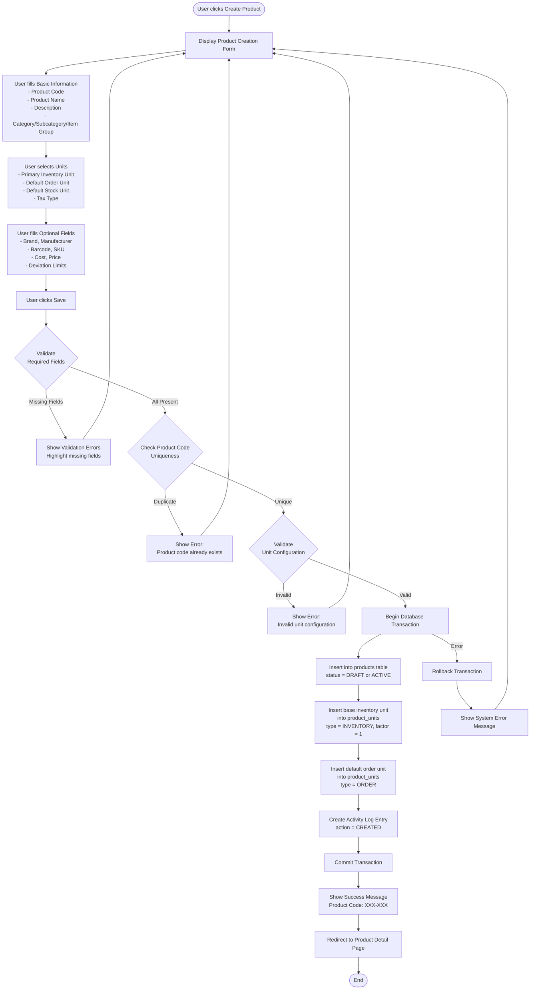

### 2.2 Product Creation Data Flow

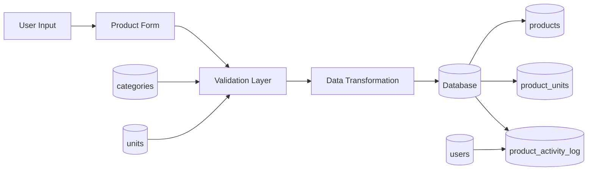

---

## 3. Product Update Flow

### 3.1 Edit Product Workflow

```mermaid
flowchart TD
    Start([User clicks Edit on Product Detail]) --> LoadCurrent[Load Current Product Data]
    LoadCurrent --> EnableEdit[Enable Inline Editing Mode<br>Convert display fields to inputs]
    EnableEdit --> ModifyFields[User modifies fields]
    ModifyFields --> UserAction{User Action}

    UserAction -->|Clicks Cancel| ConfirmCancel{Unsaved Changes?}
    ConfirmCancel -->|No Changes| DisableEdit[Disable Edit Mode<br>Restore Display Mode]
    ConfirmCancel -->|Has Changes| ShowConfirm[Show Confirmation Dialog:<br>Discard unsaved changes?]
    ShowConfirm -->|Cancel| ModifyFields
    ShowConfirm -->|Discard| DisableEdit

    UserAction -->|Clicks Save| ValidateChanges{Validate<br>Modified Fields}
    ValidateChanges -->|Invalid| ShowErrors[Show Validation Errors<br>Inline with fields]
    ShowErrors --> ModifyFields

    ValidateChanges -->|Valid| DetectChanges{Detect<br>Changed Fields}
    DetectChanges -->|No Changes| InfoMsg[Show Info Message:<br>No changes to save]
    InfoMsg --> DisableEdit

    DetectChanges -->|Has Changes| BeginTx[Begin Database Transaction]
    BeginTx --> UpdateProduct[Update modified fields<br>in products table]
    UpdateProduct --> UpdateTimestamp[Set updated_at = NOW()<br>updated_by = current_user]
    UpdateTimestamp --> LogChanges[Create Activity Log Entries<br>For each changed field]
    LogChanges --> CommitTx[Commit Transaction]

    CommitTx --> SuccessMsg[Show Success Message<br>Updated fields: X, Y, Z]
    SuccessMsg --> RefreshDisplay[Refresh Display Mode<br>Show updated values]
    RefreshDisplay --> DisableEdit
    DisableEdit --> End([End])

    BeginTx -->|Error| RollbackTx[Rollback Transaction]
    RollbackTx --> SystemErr[Show System Error]
    SystemErr --> ModifyFields
```

---

## 4. Product Unit Management Flow

### 4.1 Add Unit Conversion Workflow

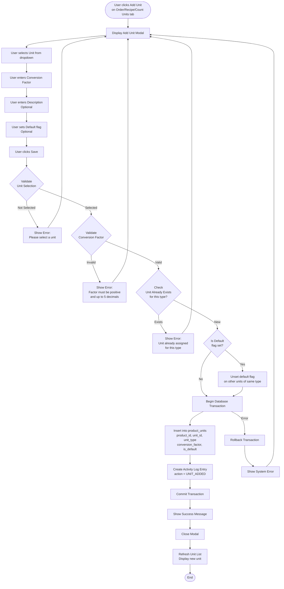

### 4.2 Unit Conversion Calculator Flow

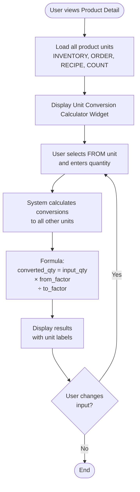

---

## 5. Product Location Assignment Flow

### 5.1 Assign Product to Location Workflow

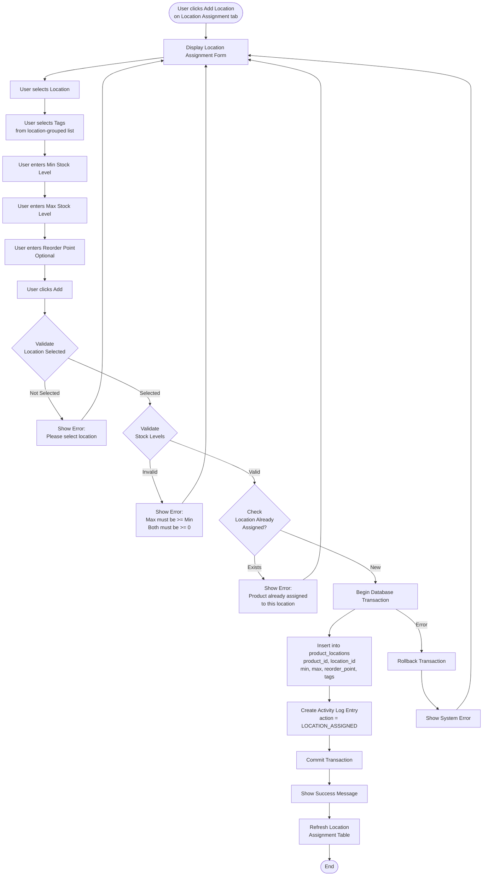

### 5.2 Location Tag Management Workflow

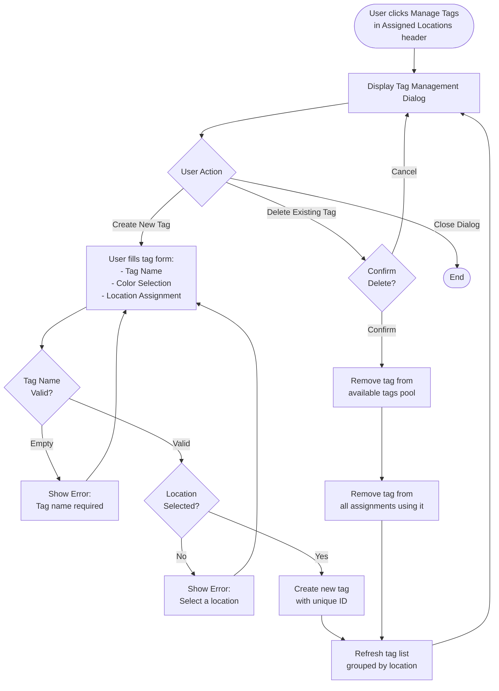

### 5.3 Add/Remove Tags on Assignment Workflow

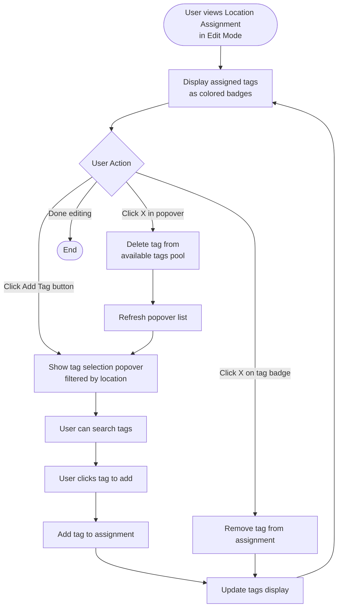

---

## 6. Product Search and Filter Flow

### 6.1 Product List Search Workflow

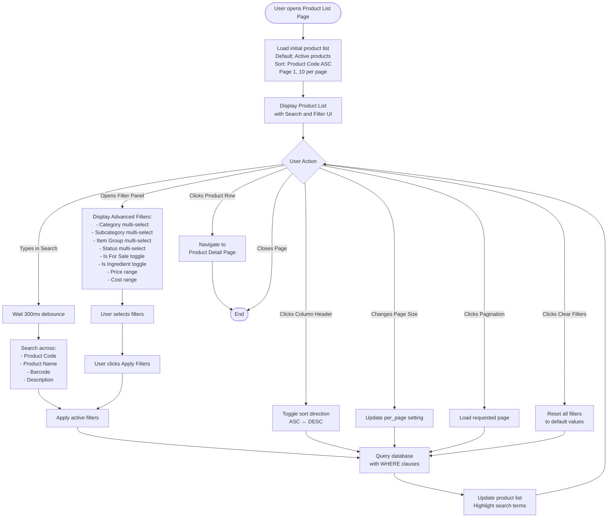

### 6.2 Product List Data Flow

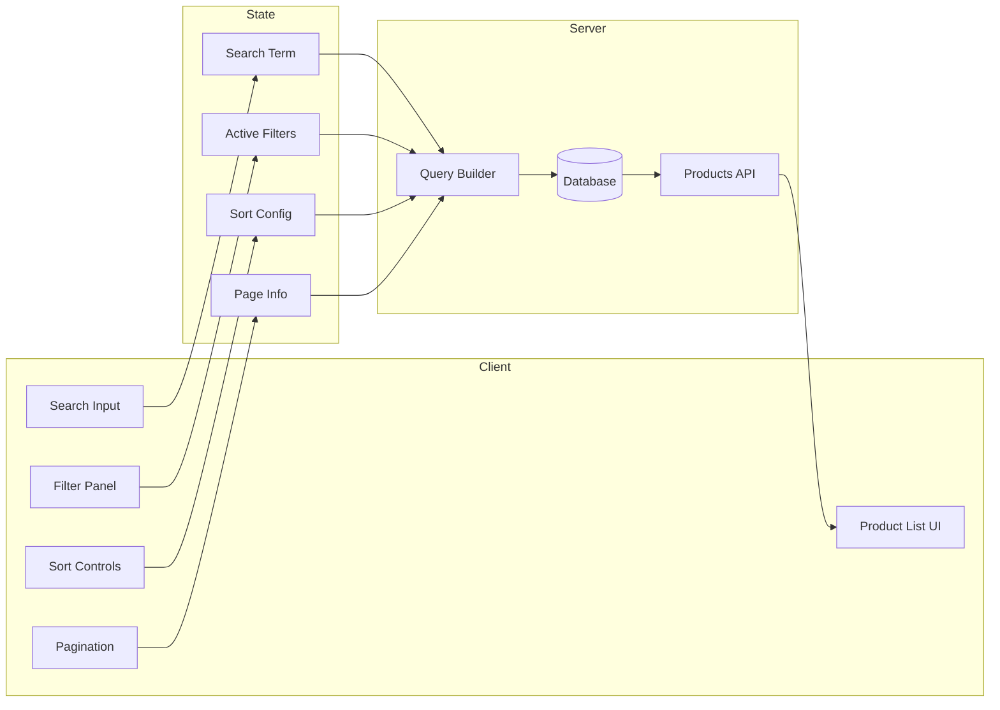

---

## 7. Product Status Lifecycle Flow

### 7.1 Product Status State Diagram

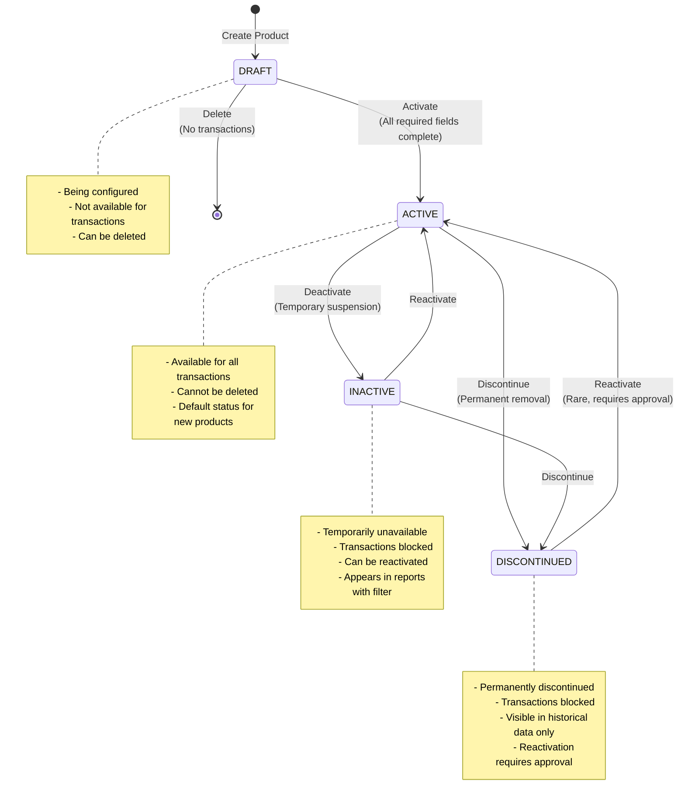

### 7.2 Status Change Workflow

```mermaid
flowchart TD
    Start([User clicks Change Status button]) --> CurrentStatus{Current<br>Status}

    CurrentStatus -->|DRAFT| DraftOptions[Show options:<br>- Activate<br>- Delete]
    CurrentStatus -->|ACTIVE| ActiveOptions[Show options:<br>- Deactivate<br>- Discontinue]
    CurrentStatus -->|INACTIVE| InactiveOptions[Show options:<br>- Activate<br>- Discontinue]
    CurrentStatus -->|DISCONTINUED| DiscOptions[Show options:<br>- Reactivate with approval]

    DraftOptions --> SelectAction[User selects action]
    ActiveOptions --> SelectAction
    InactiveOptions --> SelectAction
    DiscOptions --> SelectAction

    SelectAction --> ActionType{Action Type}

    ActionType -->|Activate| ValidateComplete{All required<br>fields complete?}
    ValidateComplete -->|No| ErrIncomplete[Show Error:<br>Complete required fields first]
    ErrIncomplete --> End([End])

    ValidateComplete -->|Yes| ConfirmActivate[Show Confirmation:<br>Activate product?]
    ConfirmActivate -->|Cancel| End
    ConfirmActivate -->|Confirm| UpdateStatus[Update status to ACTIVE]
    UpdateStatus --> LogChange[Log status change<br>action = STATUS_CHANGED<br>old = DRAFT, new = ACTIVE]
    LogChange --> ShowSuccess[Show success message]
    ShowSuccess --> RefreshPage[Refresh product detail]
    RefreshPage --> End

    ActionType -->|Deactivate| ConfirmDeactivate[Show Confirmation:<br>Deactivate product?<br>Transactions will be blocked]
    ConfirmDeactivate -->|Cancel| End
    ConfirmDeactivate -->|Confirm| UpdateInactive[Update status to INACTIVE]
    UpdateInactive --> LogChange

    ActionType -->|Discontinue| ConfirmDisc[Show Confirmation:<br>Discontinue product?<br>This is permanent]
    ConfirmDisc -->|Cancel| End
    ConfirmDisc -->|Confirm| UpdateDisc[Update status to DISCONTINUED]
    UpdateDisc --> LogChange

    ActionType -->|Delete| CheckTransactions{Has<br>transactions?}
    CheckTransactions -->|Yes| ErrCannotDelete[Show Error:<br>Cannot delete product<br>with transactions.<br>Use Inactive/Discontinued instead]
    ErrCannotDelete --> End

    CheckTransactions -->|No| ConfirmDelete[Show Confirmation:<br>Permanently delete product?<br>This cannot be undone]
    ConfirmDelete -->|Cancel| End
    ConfirmDelete -->|Confirm| SoftDelete[Set deleted_at = NOW()<br>deleted_by = current_user]
    SoftDelete --> LogDelete[Log deletion<br>action = DELETED]
    LogDelete --> Redirect[Redirect to product list]
    Redirect --> End
```

---

## 8. Product Detail View Flow

### 8.1 Product Detail Page Navigation

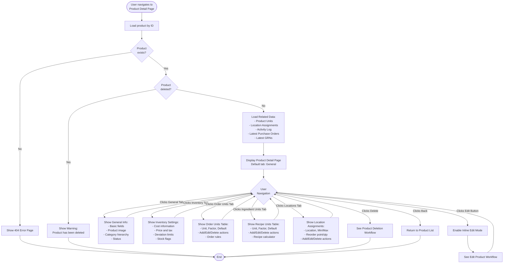

---

## 9. Product Import Flow

### 9.1 Bulk Product Import Workflow

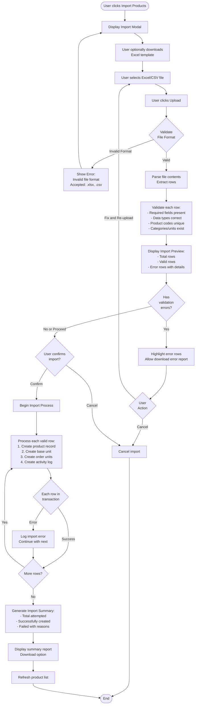

---

## 10. Integration Flow Diagrams

### 10.1 Product-Procurement Integration

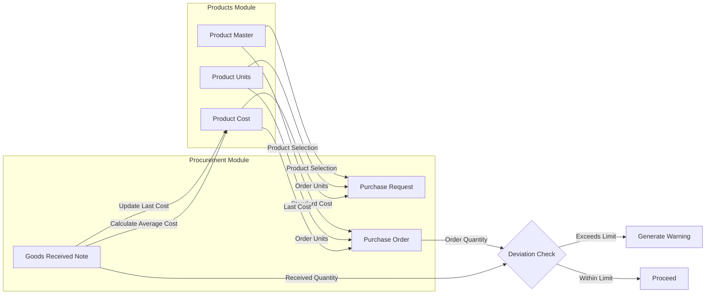

### 10.2 Product-Inventory Integration

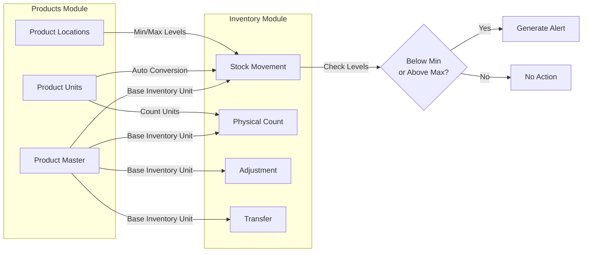

### 10.3 Product-Recipe Integration

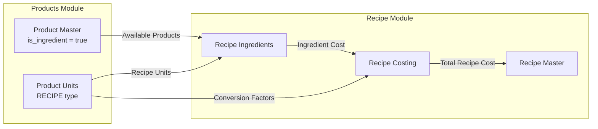

---

## 11. Error Handling Flows

### 11.1 Validation Error Handling

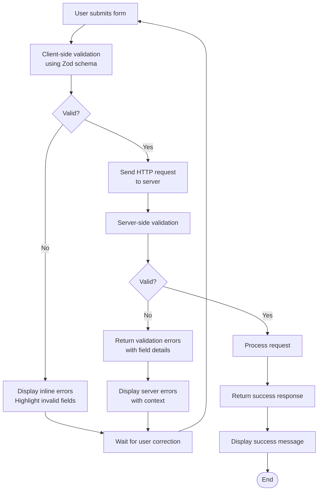

### 11.2 Database Error Handling

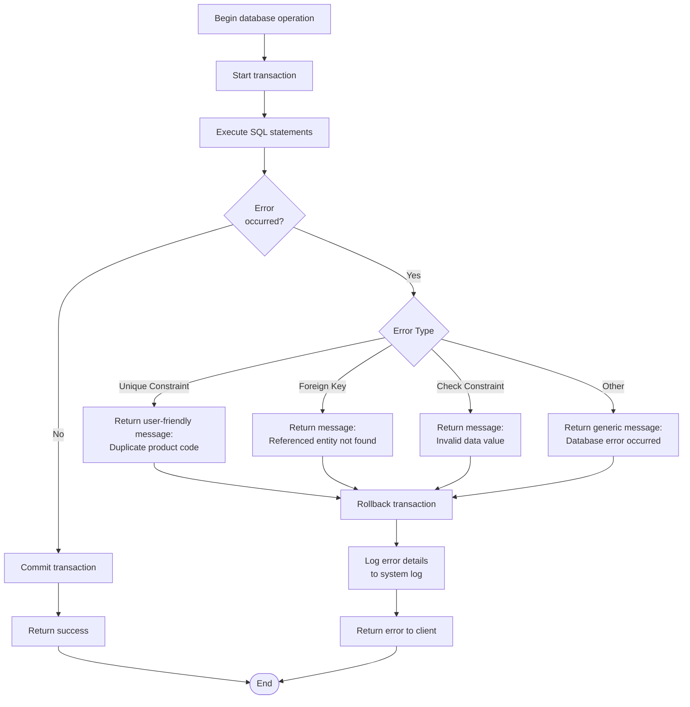

---

## 12. Activity Log Flow

### 12.1 Activity Logging Workflow

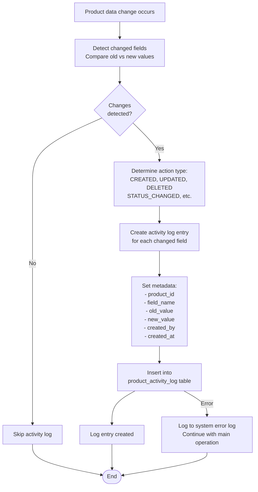

---

## 13. Related Documents

- **Business Requirements**: [BR-products.md](./BR-products.md)
- **Use Cases**: [UC-products.md](./UC-products.md)
- **Data Definitions**: [DD-products.md](./DD-products.md)
- **Technical Specification**: [TS-products.md](./TS-products.md)
- **Validations**: [VAL-products.md](./VAL-products.md)

---

**Document Control**:
- **Created By**: System Documentation Team
- **Approved By**: [Pending]
- **Next Review Date**: [To be determined]
