# Flow Diagrams: Units Management

## Module Information
- **Module**: Product Management
- **Sub-Module**: Units Management
- **Version**: 1.0.0
- **Last Updated**: 2025-11-02
- **Owner**: Product Management Team
- **Status**: Approved

## Document History
| Version | Date | Author | Changes |
|---------|------|--------|---------|
| 1.1.0 | 2025-12-10 | Documentation Team | Standardized reference number format (XXX-YYMM-NNNN) |
| 1.0.0 | 2025-11-02 | Documentation Team | Initial version |

---

## Overview

This document provides comprehensive flow diagrams for the Units Management sub-module within the CARMEN ERP system. These diagrams illustrate the processes, data flows, and interactions involved in managing measurement units used throughout the hospitality operations.

The Units Management module supports three types of measurement units:
- **INVENTORY Units**: For stock measurement and tracking (e.g., KG, L, PC)
- **ORDER Units**: For purchasing and procurement (e.g., BOX, CASE, PALLET)
- **RECIPE Units**: For kitchen and culinary operations (e.g., TSP, TBSP, CUP)

**Related Documents**:
- [Business Requirements](./BR-units.md)
- [Use Cases](./UC-units.md)
- [Technical Specification](./TS-units.md)
- [Data Dictionary](./DD-units.md)
- [Validation Rules](./VAL-units.md)

---

## Diagram Index

| Diagram | Type | Purpose | Complexity |
|---------|------|---------|------------|
| [Entity Relationship](#entity-relationship-diagram) | ER | Unit relationships with system entities | Medium |
| [Unit List View Flow](#unit-list-view-flow) | Process | Unit listing, search, and filtering | Low |
| [Create Unit Flow](#create-unit-flow) | Process | New unit creation workflow | Medium |
| [Edit Unit Flow](#edit-unit-flow) | Process | Unit modification workflow | Medium |
| [Delete Unit Flow](#delete-unit-flow) | Process | Unit soft-delete workflow | High |
| [Search and Filter Flow](#search-and-filter-flow) | Data | Real-time search and filtering | Low |
| [View Mode Toggle Flow](#view-mode-toggle-flow) | Interaction | Table/Card view switching | Low |
| [Unit Lifecycle States](#unit-lifecycle-state-diagram) | State | Unit status transitions | Medium |
| [Component Interaction](#component-interaction-diagram) | Integration | Frontend component communication | Medium |
| [Data Flow](#data-flow-diagram) | Data | Data movement through system layers | Medium |
| [Integration Flows](#integration-flow-diagrams) | Integration | Unit integration with other modules | High |
| [Error Handling Flow](#error-handling-flow) | Process | Error detection and recovery | Medium |

---

## Entity Relationship Diagram

### Unit Entity Relationships

**Purpose**: Show how Unit entity relates to other entities in the CARMEN system

**Key Relationships**:
- Unit serves as a reference entity for Products, Recipes, Inventory, and Procurement modules
- Multiple entities reference units through foreign key relationships
- Unit code immutability protects referential integrity across the system

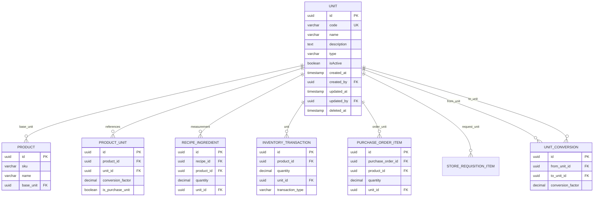

**Relationship Descriptions**:

1. **UNIT → PRODUCT (base_unit)**
   - Type: One-to-Many
   - Description: Each product has one base unit for inventory valuation
   - Constraint: Cannot delete unit if referenced by active products

2. **UNIT → PRODUCT_UNIT**
   - Type: One-to-Many
   - Description: Products can have multiple alternative units with conversion factors
   - Constraint: Cannot delete unit if used in product unit conversions

3. **UNIT → RECIPE_INGREDIENT**
   - Type: One-to-Many
   - Description: Recipe ingredients specify quantities in various units
   - Constraint: Cannot delete unit if used in active recipes

4. **UNIT → INVENTORY_TRANSACTION**
   - Type: One-to-Many
   - Description: All inventory movements are tracked with their units
   - Constraint: Cannot delete unit if historical transactions exist

5. **UNIT → PURCHASE_ORDER_ITEM**
   - Type: One-to-Many
   - Description: Purchase orders specify item quantities with order units
   - Constraint: Cannot delete unit if referenced in purchase orders

6. **UNIT → UNIT_CONVERSION**
   - Type: One-to-Many (both from and to)
   - Description: Unit conversions define relationships between different units
   - Constraint: Cannot delete unit if part of conversion definitions

---

## Unit List View Flow

### High-Level List View Process

**Purpose**: Document the end-to-end process of viewing and browsing units

**Actors**:
- Purchasing Manager (primary user)
- Head Chef (recipe unit viewer)
- Storekeeper (inventory unit viewer)
- System Administrator (full access)

**Trigger**: User navigates to Product Management → Units page

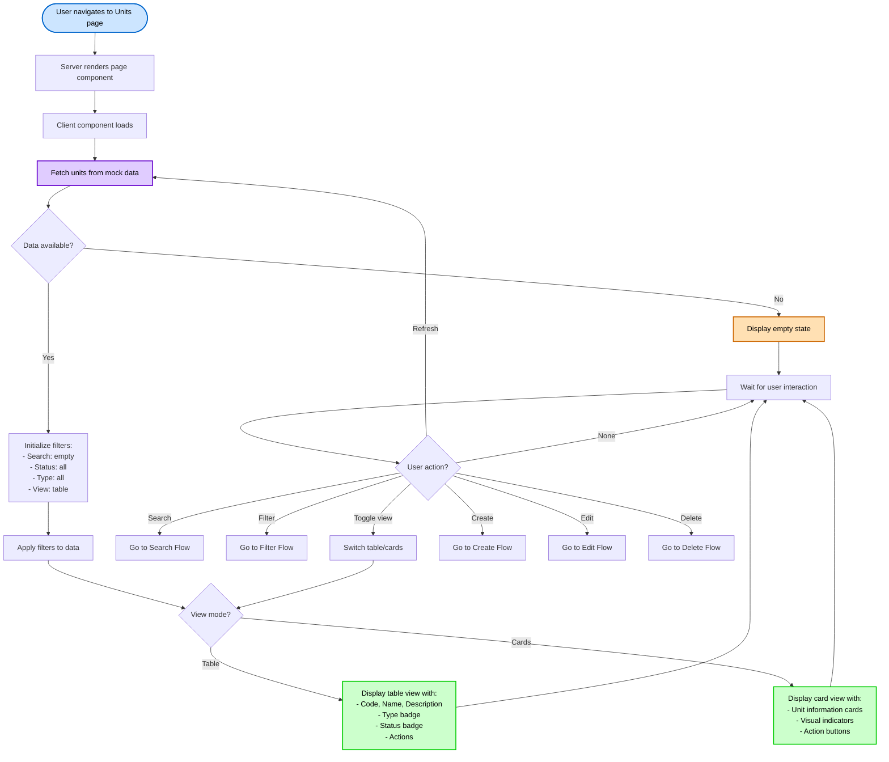

**Flow Steps**:

1. **Start**: User clicks "Product Management" → "Units" in navigation
2. **LoadPage**: Next.js server renders the page component (Server Component)
3. **FetchData**: Client component mounts and initializes
4. **GetUnits**: System retrieves unit data from mock data source
5. **CheckData**: Verify data is available
   - If no data: Display empty state with "Add Unit" prompt
   - If data exists: Continue to filtering
6. **InitFilters**: Set initial filter states (all active, table view)
7. **ApplyFilters**: Apply any default filters to the dataset
8. **RenderView**: Choose rendering based on view mode preference
   - Table: Render tabular layout with sortable columns
   - Cards: Render card-based grid layout
9. **UserInteraction**: Wait for user to perform action
10. **Action**: Route to appropriate workflow based on user action

**Performance Considerations**:
- Initial load: < 1 second for up to 100 units
- Filter application: Real-time (< 100ms)
- View mode switch: < 50ms (no data refetch)

---

## Create Unit Flow

### Unit Creation Process Flow

**Purpose**: Document the complete process of creating a new measurement unit

**Actors**: System Administrator, Purchasing Manager

**Trigger**: User clicks "Add Unit" button

```mermaid
flowchart TD
    Start([User clicks Add Unit]) --> OpenDialog[Open unit creation dialog]
    OpenDialog --> ShowForm[Display form with fields:<br>- Code (required)<br>- Name (required)<br>- Description (optional)<br>- Type (required)<br>- Status (default: Active)]

    ShowForm --> UserFill[User fills form fields]
    UserFill --> UserAction{User action?}

    UserAction -->|Cancel| CloseDialog[Close dialog]
    CloseDialog --> End1([End: Cancelled])

    UserAction -->|Save| ValidateClient[Client-side validation]
    ValidateClient --> CheckRequired{All required<br>fields filled?}

    CheckRequired -->|No| ShowErrors1[Highlight missing fields<br>Show error messages]
    ShowErrors1 --> UserFill

    CheckRequired -->|Yes| CheckFormat{Valid format?}
    CheckFormat -->|No| ShowErrors2[Show format errors:<br>- Code: 2-10 chars<br>- Name: 1-100 chars<br>- Type: valid enum]
    ShowErrors2 --> UserFill

    CheckFormat -->|Yes| TransformData[Transform data:<br>- Uppercase code<br>- Trim whitespace<br>- Set timestamps]

    TransformData --> CheckDuplicate{Code already<br>exists?}
    CheckDuplicate -->|Yes| ShowDupError[Show duplicate error:<br>Unit code must be unique]
    ShowDupError --> UserFill

    CheckDuplicate -->|No| GenerateID[Generate UUID for new unit]
    GenerateID --> SetAudit[Set audit fields:<br>- created_at: NOW<br>- created_by: current user<br>- updated_at: NOW<br>- updated_by: current user]

    SetAudit --> SaveData[(Save to data store)]
    SaveData --> CheckSave{Save<br>successful?}

    CheckSave -->|No| ShowSaveError[Show error message:<br>Failed to save unit]
    ShowSaveError --> UserFill

    CheckSave -->|Yes| RefreshList[Refresh unit list]
    RefreshList --> ShowSuccess[Show success message:<br>Unit created successfully]
    ShowSuccess --> CloseDialog2[Close dialog]
    CloseDialog2 --> End2([End: Success])

    style Start fill:#cce5ff,stroke:#0066cc,stroke-width:2px,color:#000
    style End1 fill:#e8e8e8,stroke:#333,stroke-width:2px,color:#000
    style End2 fill:#ccffcc,stroke:#00cc00,stroke-width:2px,color:#000
    style ShowErrors1 fill:#ffe0b3,stroke:#cc6600,stroke-width:2px,color:#000
    style ShowErrors2 fill:#ffe0b3,stroke:#cc6600,stroke-width:2px,color:#000
    style ShowDupError fill:#ffcccc,stroke:#cc0000,stroke-width:2px,color:#000
    style ShowSaveError fill:#ffcccc,stroke:#cc0000,stroke-width:2px,color:#000
    style SaveData fill:#e0ccff,stroke:#6600cc,stroke-width:2px,color:#000
    style ShowSuccess fill:#ccffcc,stroke:#00cc00,stroke-width:2px,color:#000
```

**Validation Rules Applied**:

| Field | Validation | Error Message |
|-------|------------|---------------|
| Code | Required, 2-10 chars, alphanumeric | "Code is required and must be 2-10 characters" |
| Code | Unique (case-insensitive) | "Unit code {CODE} already exists" |
| Name | Required, 1-100 chars | "Name is required and must be 1-100 characters" |
| Type | Required, valid enum | "Type must be INVENTORY, ORDER, or RECIPE" |
| Description | Optional, max 500 chars | "Description must be less than 500 characters" |

**Business Rules Enforced**:
- BR-UNIT-001: Unit code uniqueness (case-insensitive)
- BR-UNIT-002: Code auto-uppercase transformation
- BR-UNIT-004: Default status is Active
- BR-UNIT-017: Audit trail creation (created_by, created_at)

**Exception Handling**:
- Duplicate code: Show error, allow user to modify
- Validation failure: Highlight fields, show inline errors
- Database error: Show generic error, log details for admin
- Network timeout: Show retry option

---

## Edit Unit Flow

### Unit Modification Process Flow

**Purpose**: Document the process of modifying an existing unit's details

**Actors**: System Administrator, Purchasing Manager

**Trigger**: User clicks "Edit" action on a unit row

```mermaid
flowchart TD
    Start([User clicks Edit]) --> CheckRefs{Unit has<br>references?}

    CheckRefs -->|Yes| CheckCode[Check if code change attempted]
    CheckRefs -->|No| LoadData[Load unit data]

    CheckCode --> LoadData
    LoadData --> OpenDialog[Open edit dialog]
    OpenDialog --> PreFill[Pre-fill form with current values:<br>- Code (read-only if referenced)<br>- Name<br>- Description<br>- Type (read-only if referenced)<br>- Status]

    PreFill --> UserEdit[User modifies fields]
    UserEdit --> UserAction{User action?}

    UserAction -->|Cancel| CloseDialog[Close dialog]
    CloseDialog --> End1([End: Cancelled])

    UserAction -->|Save| CheckChanges{Any changes<br>made?}
    CheckChanges -->|No| CloseDialog

    CheckChanges -->|Yes| ValidateClient[Client-side validation]
    ValidateClient --> CheckRequired{All required<br>fields valid?}

    CheckRequired -->|No| ShowErrors1[Show validation errors]
    ShowErrors1 --> UserEdit

    CheckRequired -->|Yes| CheckCodeChange{Code<br>changed?}

    CheckCodeChange -->|Yes| HasRefs{Has<br>references?}
    HasRefs -->|Yes| BlockChange[Show error:<br>Cannot change code<br>of referenced unit]
    BlockChange --> UserEdit

    HasRefs -->|No| CheckDuplicate{New code<br>exists?}
    CheckDuplicate -->|Yes| ShowDupError[Show duplicate error]
    ShowDupError --> UserEdit

    CheckDuplicate -->|No| UpdateData[Prepare update]
    CheckCodeChange -->|No| UpdateData

    UpdateData --> SetAudit[Update audit fields:<br>- updated_at: NOW<br>- updated_by: current user]

    SetAudit --> SaveChanges[(Save changes to database)]
    SaveChanges --> CheckSave{Save<br>successful?}

    CheckSave -->|No| ShowSaveError[Show save error]
    ShowSaveError --> UserEdit

    CheckSave -->|Yes| RefreshList[Refresh unit list]
    RefreshList --> ShowSuccess[Show success message:<br>Unit updated successfully]
    ShowSuccess --> CloseDialog2[Close dialog]
    CloseDialog2 --> End2([End: Success])

    style Start fill:#cce5ff,stroke:#0066cc,stroke-width:2px,color:#000
    style End1 fill:#e8e8e8,stroke:#333,stroke-width:2px,color:#000
    style End2 fill:#ccffcc,stroke:#00cc00,stroke-width:2px,color:#000
    style ShowErrors1 fill:#ffe0b3,stroke:#cc6600,stroke-width:2px,color:#000
    style BlockChange fill:#ffcccc,stroke:#cc0000,stroke-width:2px,color:#000
    style ShowDupError fill:#ffcccc,stroke:#cc0000,stroke-width:2px,color:#000
    style ShowSaveError fill:#ffcccc,stroke:#cc0000,stroke-width:2px,color:#000
    style SaveChanges fill:#e0ccff,stroke:#6600cc,stroke-width:2px,color:#000
    style ShowSuccess fill:#ccffcc,stroke:#00cc00,stroke-width:2px,color:#000
```

**Code Immutability Protection**:

The flow includes special handling for code changes based on unit references:

1. **Check References**: System checks if unit is referenced by:
   - Products (as base_unit or in product_units)
   - Recipe ingredients
   - Inventory transactions
   - Purchase orders
   - Store requisitions

2. **Code Change Restrictions**:
   - **No References**: Code can be changed (with uniqueness validation)
   - **Has References**: Code field is read-only, changes are blocked
   - **Error Message**: "Cannot modify code for unit {CODE}. It is referenced by {COUNT} records."

3. **Other Field Changes**:
   - Name: Always editable
   - Description: Always editable
   - Type: Read-only if referenced (prevents breaking conversions)
   - Status: Always editable (activating/deactivating)

**Business Rules Enforced**:
- BR-UNIT-001: Code immutability when referenced
- BR-UNIT-003: Type immutability when referenced
- BR-UNIT-018: Audit trail update (updated_by, updated_at)

---

## Delete Unit Flow

### Unit Soft-Delete Process Flow

**Purpose**: Document the process of soft-deleting a unit with reference checking

**Actors**: System Administrator

**Trigger**: User clicks "Delete" action on a unit row

```mermaid
flowchart TD
    Start([User clicks Delete]) --> ShowConfirm[Show confirmation dialog:<br>Are you sure you want<br>to delete this unit?]

    ShowConfirm --> UserConfirm{User confirms?}
    UserConfirm -->|No| End1([End: Cancelled])

    UserConfirm -->|Yes| CheckRefs[Check for references in:<br>- Products<br>- Recipes<br>- Inventory<br>- Purchase Orders<br>- Conversions]

    CheckRefs --> HasRefs{Has active<br>references?}

    HasRefs -->|Yes| CountRefs[Count references by type]
    CountRefs --> ShowBlockMsg[Show blocking message:<br>Cannot delete unit {CODE}<br><br>Referenced by:<br>- X products<br>- Y recipes<br>- Z transactions]
    ShowBlockMsg --> OfferDeactivate[Offer alternative:<br>Deactivate instead of delete?]

    OfferDeactivate --> UserChoice{User choice?}
    UserChoice -->|Cancel| End2([End: Cancelled])
    UserChoice -->|Deactivate| DeactivateFlow[Go to Deactivate Flow]

    HasRefs -->|No| CheckHistorical{Has historical<br>references?}

    CheckHistorical -->|Yes| ShowWarning[Show warning:<br>Unit has historical data<br>Will be soft-deleted<br>(deleted_at set)]
    ShowWarning --> UserProceed{Proceed?}
    UserProceed -->|No| End3([End: Cancelled])

    CheckHistorical -->|No| UserProceed
    UserProceed -->|Yes| SetDeletedAt[Set deleted_at = NOW]

    SetDeletedAt --> SetAudit[Set updated_at = NOW<br>Set updated_by = current user]
    SetAudit --> SaveSoftDelete[(Save soft delete)]

    SaveSoftDelete --> CheckSave{Save<br>successful?}
    CheckSave -->|No| ShowError[Show error message:<br>Failed to delete unit]
    ShowError --> End4([End: Error])

    CheckSave -->|Yes| RemoveFromList[Remove unit from active list]
    RemoveFromList --> ShowSuccess[Show success message:<br>Unit deleted successfully]
    ShowSuccess --> RefreshList[Refresh unit list]
    RefreshList --> End5([End: Success])

    DeactivateFlow --> SetInactive[Set isActive = false]
    SetInactive --> SetAudit2[Update audit fields]
    SetAudit2 --> SaveDeactivate[(Save deactivation)]
    SaveDeactivate --> ShowDeactivateSuccess[Show success:<br>Unit deactivated]
    ShowDeactivateSuccess --> RefreshList

    style Start fill:#cce5ff,stroke:#0066cc,stroke-width:2px,color:#000
    style End1 fill:#e8e8e8,stroke:#333,stroke-width:2px,color:#000
    style End2 fill:#e8e8e8,stroke:#333,stroke-width:2px,color:#000
    style End3 fill:#e8e8e8,stroke:#333,stroke-width:2px,color:#000
    style End4 fill:#ffcccc,stroke:#cc0000,stroke-width:2px,color:#000
    style End5 fill:#ccffcc,stroke:#00cc00,stroke-width:2px,color:#000
    style ShowBlockMsg fill:#ffcccc,stroke:#cc0000,stroke-width:2px,color:#000
    style ShowWarning fill:#ffe0b3,stroke:#cc6600,stroke-width:2px,color:#000
    style ShowError fill:#ffcccc,stroke:#cc0000,stroke-width:2px,color:#000
    style SaveSoftDelete fill:#e0ccff,stroke:#6600cc,stroke-width:2px,color:#000
    style SaveDeactivate fill:#e0ccff,stroke:#6600cc,stroke-width:2px,color:#000
    style ShowSuccess fill:#ccffcc,stroke:#00cc00,stroke-width:2px,color:#000
    style ShowDeactivateSuccess fill:#ccffcc,stroke:#00cc00,stroke-width:2px,color:#000
```

**Deletion Rules and Reference Checking**:

| Reference Type | Check Query | Blocks Delete? | Alternative |
|----------------|-------------|----------------|-------------|
| Products (base_unit) | `WHERE base_unit = unit.id AND deleted_at IS NULL` | Yes | Deactivate unit |
| Product Units | `WHERE unit_id = unit.id AND deleted_at IS NULL` | Yes | Deactivate unit |
| Recipe Ingredients (active) | `WHERE unit_id = unit.id AND recipe.deleted_at IS NULL` | Yes | Deactivate unit |
| Inventory Transactions | `WHERE unit_id = unit.id` | No (historical) | Soft delete |
| Purchase Orders (active) | `WHERE unit_id = unit.id AND status NOT IN ('completed', 'cancelled')` | Yes | Deactivate unit |
| Store Requisitions (active) | `WHERE unit_id = unit.id AND status NOT IN ('fulfilled', 'cancelled')` | Yes | Deactivate unit |

**Soft Delete vs Deactivation**:

- **Soft Delete** (deleted_at timestamp):
  - Unit hidden from all active lists
  - Historical data preserved
  - Cannot be reactivated (must restore via admin)
  - Used when unit truly obsolete

- **Deactivation** (isActive = false):
  - Unit visible in system but marked inactive
  - Cannot be selected for new records
  - Can be reactivated easily
  - Preferred when unit has active references

**Business Rules Enforced**:
- BR-UNIT-007: Soft delete with deleted_at timestamp
- BR-UNIT-008: Block deletion if active references exist
- BR-UNIT-009: Allow deletion if only historical references
- BR-UNIT-019: Audit trail on deletion

---

## Search and Filter Flow

### Real-Time Search and Filter Process

**Purpose**: Document the client-side search and filtering mechanism

**Actors**: All unit management users

**Trigger**: User types in search box or changes filter dropdowns

```mermaid
flowchart LR
    subgraph User Input
        Search[Search text input]
        StatusFilter[Status filter dropdown]
        TypeFilter[Type filter dropdown]
    end

    subgraph State Management
        SearchState[searchTerm state]
        StatusState[statusFilter state]
        TypeState[typeFilter state]
    end

    subgraph Processing
        UseMemo[useMemo hook triggers]
        FilterLogic{Apply filter logic}
    end

    subgraph Results
        FilteredData[Filtered dataset]
        RenderView[Re-render view]
        UpdateCount[Update count display]
    end

    Search -->|onChange| SearchState
    StatusFilter -->|onChange| StatusState
    TypeFilter -->|onChange| TypeState

    SearchState --> UseMemo
    StatusState --> UseMemo
    TypeState --> UseMemo

    UseMemo --> FilterLogic

    FilterLogic -->|Test each unit| TestSearch{Matches<br>search term?}
    TestSearch -->|Yes| TestStatus{Matches<br>status filter?}
    TestSearch -->|No| Exclude1[Exclude from results]

    TestStatus -->|Yes| TestType{Matches<br>type filter?}
    TestStatus -->|No| Exclude2[Exclude from results]

    TestType -->|Yes| Include[Include in results]
    TestType -->|No| Exclude3[Exclude from results]

    Include --> FilteredData
    Exclude1 --> FilteredData
    Exclude2 --> FilteredData
    Exclude3 --> FilteredData

    FilteredData --> RenderView
    FilteredData --> UpdateCount

    style Search fill:#cce5ff,stroke:#0066cc,stroke-width:2px,color:#000
    style StatusFilter fill:#cce5ff,stroke:#0066cc,stroke-width:2px,color:#000
    style TypeFilter fill:#cce5ff,stroke:#0066cc,stroke-width:2px,color:#000
    style UseMemo fill:#ffe0b3,stroke:#cc6600,stroke-width:2px,color:#000
    style FilteredData fill:#ccffcc,stroke:#00cc00,stroke-width:2px,color:#000
    style RenderView fill:#e0ccff,stroke:#6600cc,stroke-width:2px,color:#000
```

**Filter Logic Implementation**:

```
Filtering Algorithm (executed in useMemo):

FOR each unit in allUnits:
  // Search term matching (case-insensitive)
  matchesSearch =
    unit.code.toLowerCase().includes(searchTerm.toLowerCase()) OR
    unit.name.toLowerCase().includes(searchTerm.toLowerCase()) OR
    unit.description.toLowerCase().includes(searchTerm.toLowerCase())

  // Status filter matching
  IF statusFilter === "all":
    matchesStatus = true
  ELSE IF statusFilter === "active":
    matchesStatus = unit.isActive === true
  ELSE IF statusFilter === "inactive":
    matchesStatus = unit.isActive === false

  // Type filter matching
  IF typeFilter === "all":
    matchesType = true
  ELSE:
    matchesType = unit.type === typeFilter

  // Include unit if all conditions match
  IF matchesSearch AND matchesStatus AND matchesType:
    INCLUDE unit in filteredUnits
  ELSE:
    EXCLUDE unit from filteredUnits

RETURN filteredUnits
```

**Filter Options**:

| Filter | Options | Default | Description |
|--------|---------|---------|-------------|
| Search | Free text | "" | Searches code, name, description |
| Status | All, Active, Inactive | All | Filters by isActive flag |
| Type | All, INVENTORY, ORDER, RECIPE | All | Filters by unit type |

**Performance Characteristics**:
- Filtering: Client-side, no server requests
- Response time: < 50ms for 100 units
- Debouncing: Not needed (fast enough without)
- Memory: Filtered array created via useMemo (memoized)

---

## View Mode Toggle Flow

### Table/Card View Switching

**Purpose**: Document the view mode switching mechanism

**Actors**: All users

**Trigger**: User clicks table/card view toggle button

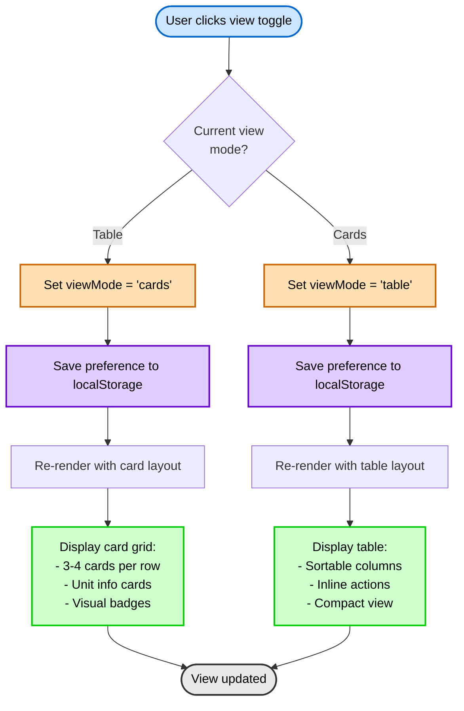

**View Mode Comparison**:

| Aspect | Table View | Card View |
|--------|-----------|-----------|
| **Layout** | Tabular rows and columns | Grid of cards (3-4 per row) |
| **Information Density** | High (more units visible) | Medium (larger cards, less per screen) |
| **Actions** | Inline buttons in Actions column | Buttons on card footer |
| **Sorting** | Column headers clickable | Not available in card view |
| **Scanning** | Easy to scan down columns | Easy to see complete unit info |
| **Mobile** | Horizontal scroll may be needed | Responsive grid (1-2 cards wide) |
| **Best For** | Quick scanning, data entry tasks | Detailed viewing, presentations |

**Persistence**:
- User preference saved to browser localStorage
- Key: `units_view_mode`
- Values: `"table"` or `"cards"`
- Restored on page reload

---

## Unit Lifecycle State Diagram

### Unit Status State Transitions

**Purpose**: Document all possible states and transitions for a unit throughout its lifecycle

**Entity**: Unit

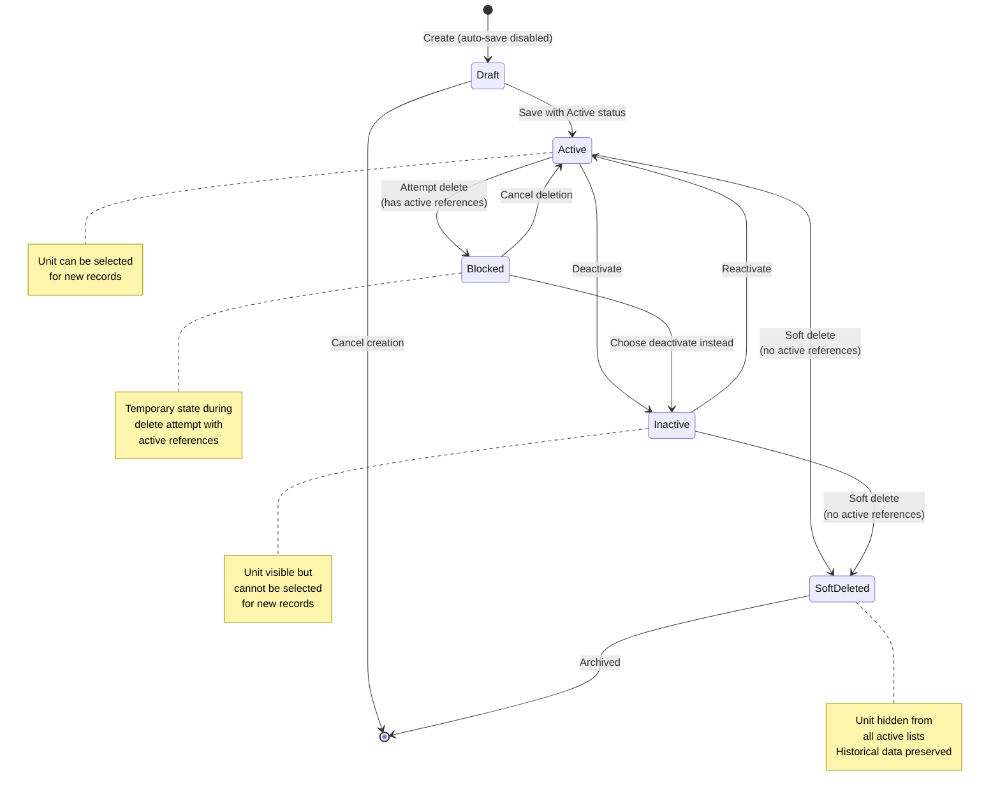

**State Definitions**:

| State | Description | Can Transition To | Entry Actions | Exit Actions |
|-------|-------------|-------------------|---------------|--------------|
| **Draft** | Being created, not saved | Active, Cancelled | Initialize form with defaults | Validate completeness |
| **Active** | Normal operational state | Inactive, Soft Deleted, Blocked | Set isActive=true | - |
| **Inactive** | Deactivated but not deleted | Active, Soft Deleted | Set isActive=false | - |
| **Blocked** | Delete blocked by references | Active, Inactive | Show reference count | - |
| **Soft Deleted** | Marked as deleted | Archived | Set deleted_at timestamp | Remove from active queries |
| **Archived** | Permanently archived | None | Move to archive storage | - |

**Transition Rules**:

1. **Draft → Active**
   - **Condition**: All required fields completed, validation passed
   - **Who**: Creator
   - **Action**: Save unit record with isActive=true

2. **Active → Inactive**
   - **Condition**: No conditions (always allowed)
   - **Who**: System Administrator, Purchasing Manager
   - **Action**: Set isActive=false, update audit trail
   - **Use Case**: Temporarily stop using unit without deleting

3. **Inactive → Active**
   - **Condition**: No conditions (always allowed)
   - **Who**: System Administrator, Purchasing Manager
   - **Action**: Set isActive=true, update audit trail
   - **Use Case**: Resume using previously deactivated unit

4. **Active/Inactive → Soft Deleted**
   - **Condition**: No active references (only historical allowed)
   - **Who**: System Administrator only
   - **Action**: Set deleted_at timestamp, update audit trail
   - **Use Case**: Remove obsolete unit from system

5. **Active → Blocked**
   - **Condition**: Delete attempted but active references exist
   - **Who**: System (automatic during delete attempt)
   - **Action**: Show blocking message with reference counts
   - **Use Case**: Prevent data integrity violations

6. **Blocked → Active**
   - **Condition**: User cancels deletion
   - **Who**: User
   - **Action**: Cancel delete operation, return to normal state

7. **Blocked → Inactive**
   - **Condition**: User chooses deactivation instead of deletion
   - **Who**: User
   - **Action**: Set isActive=false as alternative to delete

8. **Soft Deleted → Archived**
   - **Condition**: Automated archival process (30+ days deleted)
   - **Who**: System (scheduled job)
   - **Action**: Move to archive storage, remove from main database

**State Guards** (Conditions):

**Can Delete Guard**:
- **Condition Name**: Can Soft Delete
- **Description**: Unit can only be soft-deleted if no active references exist
- **Required Checks**:
  - No products using unit as base_unit (where deleted_at IS NULL)
  - No active product_units referencing this unit
  - No active recipe_ingredients using this unit
  - No active purchase_orders or store_requisitions using this unit
- **Implementation**: System queries all related tables before allowing deletion

**Can Change Code Guard**:
- **Condition Name**: Can Modify Code
- **Description**: Unit code can only be changed if unit has no references
- **Required Checks**:
  - No products, recipes, transactions, or orders reference this unit
  - Unit is not part of any unit conversions
- **Implementation**: System checks all foreign key relationships

**Can Change Type Guard**:
- **Condition Name**: Can Modify Type
- **Description**: Unit type can only be changed if unit has no references
- **Required Checks**:
  - Same as Can Modify Code guard
  - Type changes could break conversion logic and business rules
- **Implementation**: System checks all foreign key relationships

---

## Component Interaction Diagram

### Frontend Component Communication Flow

**Purpose**: Show how React components interact in the Units Management UI

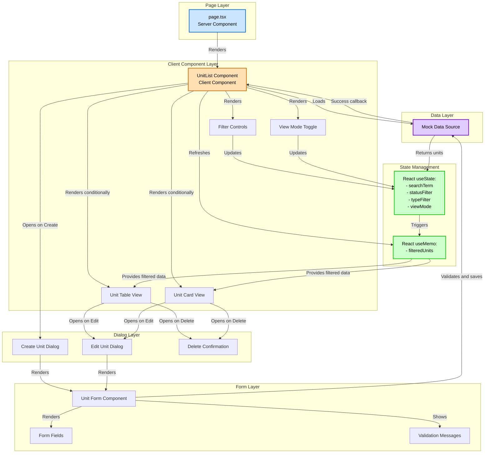

**Component Responsibilities**:

1. **page.tsx (Server Component)**
   - Role: Entry point, server-side rendering
   - Props: None
   - Responsibilities: Render UnitList client component

2. **UnitList Component**
   - Role: Main container, state management
   - State: searchTerm, statusFilter, typeFilter, viewMode
   - Responsibilities: Data loading, filter coordination, view switching

3. **Filter Controls**
   - Role: User input for filtering
   - Props: Current filter values, onChange callbacks
   - Responsibilities: Search input, status dropdown, type dropdown

4. **View Toggle**
   - Role: Switch between table and card views
   - Props: Current view mode, onChange callback
   - Responsibilities: Toggle button, localStorage persistence

5. **Unit Table View**
   - Role: Display units in table format
   - Props: filteredUnits array, action callbacks
   - Responsibilities: Render rows, handle sorting, action buttons

6. **Unit Card View**
   - Role: Display units in card grid
   - Props: filteredUnits array, action callbacks
   - Responsibilities: Render cards, responsive grid, action buttons

7. **Create/Edit Dialogs**
   - Role: Modal containers for forms
   - Props: open state, onClose callback, initial data (edit only)
   - Responsibilities: Dialog visibility, form containment

8. **Unit Form Component**
   - Role: Form logic and validation
   - Props: initialData, onSubmit, onCancel
   - Responsibilities: Form state, validation, submission

**Data Flow Pattern**:

```
User Action → State Update → useMemo Recompute → View Re-render → UI Update
```

**Performance Optimizations**:
- useMemo: Memoize filtered results (only recompute when dependencies change)
- React.memo: Wrap expensive child components
- Debouncing: Not needed (filtering is fast enough)
- Virtual scrolling: Not needed (dataset size < 100 units)

---

## Data Flow Diagram

### Level 0: Context Diagram

**Purpose**: Show the Units Management system in context with external entities

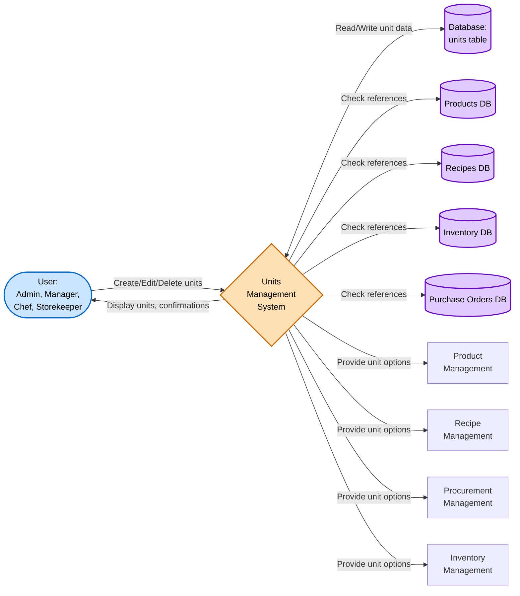

**External Entities**:
- **Users**: Staff who create and manage measurement units
- **Database**: PostgreSQL database storing unit records
- **Product Management**: Module that references units for product definitions
- **Recipe Management**: Module that uses units for ingredient quantities
- **Procurement Management**: Module that uses units for order quantities
- **Inventory Management**: Module that uses units for stock tracking

---

### Level 1: System Decomposition

**Purpose**: Show major processes and data stores within Units Management

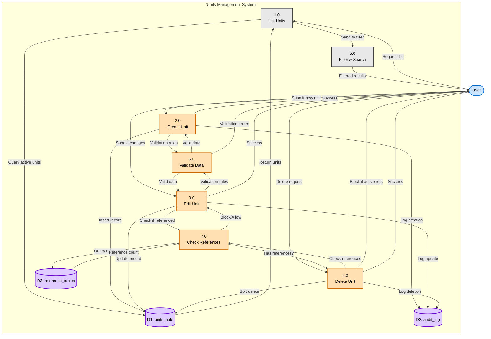

**Data Stores**:
- **D1: units table**: Main storage for unit records
- **D2: audit_log**: Audit trail of all unit operations
- **D3: reference_tables**: Products, recipes, inventory, purchase orders tables

**Processes**:
1. **1.0 List Units**: Retrieve and display active units
2. **2.0 Create Unit**: Validate and insert new unit record
3. **3.0 Edit Unit**: Update existing unit with validation
4. **4.0 Delete Unit**: Soft delete with reference checking
5. **5.0 Filter & Search**: Apply client-side filtering
6. **6.0 Validate Data**: Apply business rule validation
7. **7.0 Check References**: Query for unit usage across system

---

## Integration Flow Diagrams

### Product Management Integration

**Purpose**: Show how units integrate with Product Management module

**Integration Points**:
- Products reference units as base_unit (foreign key)
- Products have alternative units with conversion factors
- Unit changes must not break product definitions

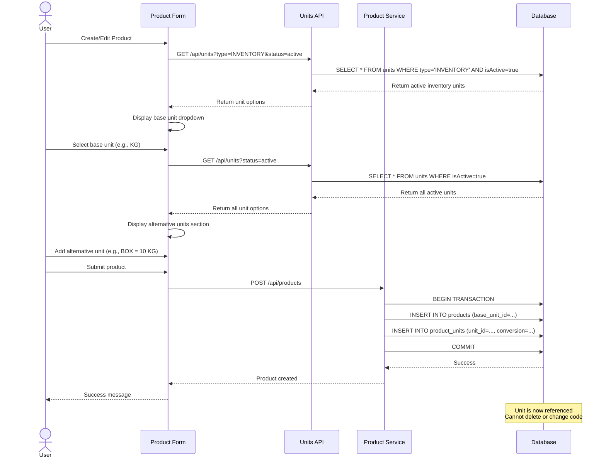

**Integration Rules**:
- Only INVENTORY units can be used as base_unit
- All unit types can be used as alternative units
- Conversion factors are stored in product_units table
- Unit code changes blocked if product references exist

---

### Recipe Management Integration

**Purpose**: Show how units integrate with Recipe Management module

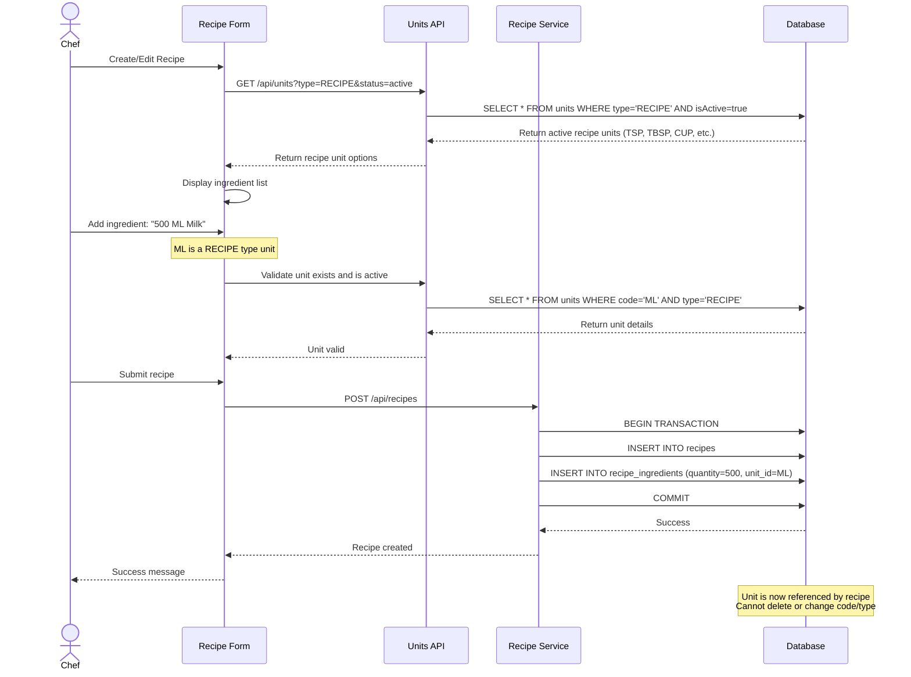

**Integration Rules**:
- Only RECIPE and INVENTORY units can be used in recipes
- Recipe ingredients store quantity and unit_id
- Unit deactivation prevents selection in new recipes
- Existing recipes continue to display deactivated units

---

### Inventory Management Integration

**Purpose**: Show how units integrate with Inventory tracking

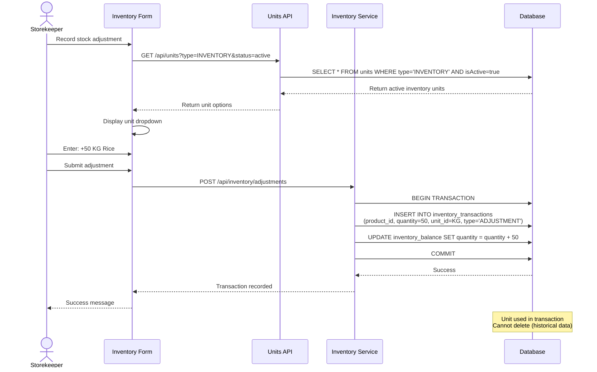

**Integration Rules**:
- Only INVENTORY units can be used for stock transactions
- All inventory movements are recorded with their units
- Unit must match product's base unit or have conversion defined
- Historical transactions preserve unit even if deactivated

---

### Procurement Integration

**Purpose**: Show how units integrate with Purchase Orders

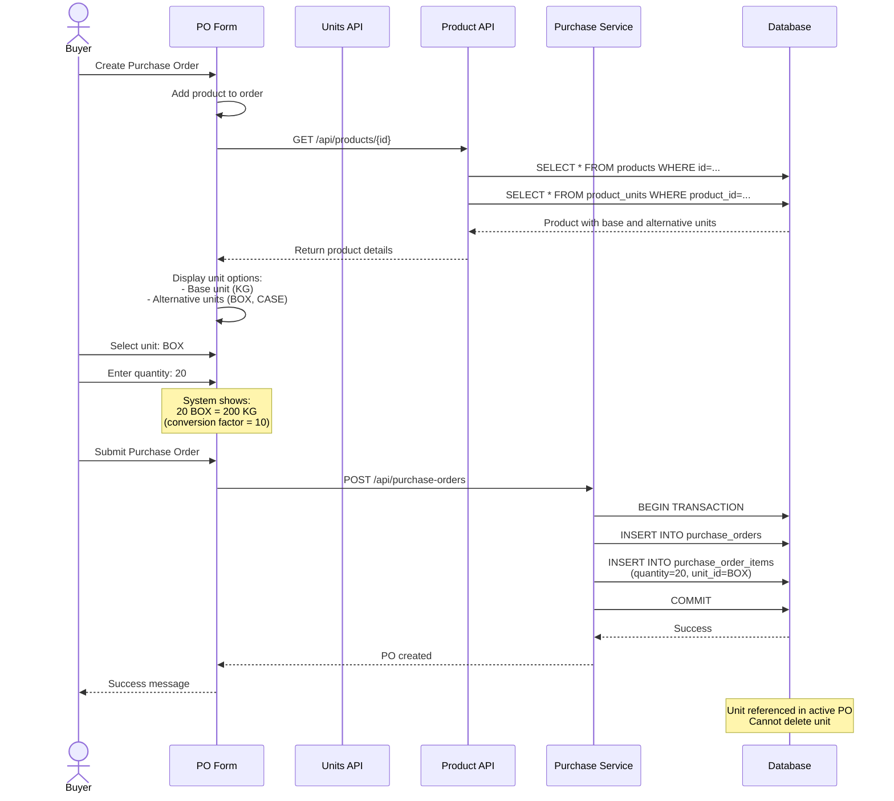

**Integration Rules**:
- ORDER and INVENTORY units can be used in purchase orders
- Purchase units must be defined in product's unit list
- Conversion to base unit is stored for costing
- Active purchase orders block unit deletion

---

## Error Handling Flow

### Comprehensive Error Detection and Recovery

**Purpose**: Document how the system detects, classifies, and handles errors

```mermaid
flowchart TD
    Start[Operation Start] --> Try{Execute Operation}

    Try -->|Success| Success([Operation Successful])
    Try -->|Error Caught| ClassifyError{Error Type?}

    ClassifyError -->|Validation Error| ValError[Validation Error Handler]
    ClassifyError -->|Duplicate Error| DupError[Duplicate Error Handler]
    ClassifyError -->|Reference Error| RefError[Reference Check Error]
    ClassifyError -->|Permission Error| PermError[Permission Denied]
    ClassifyError -->|Database Error| DBError[Database Error Handler]
    ClassifyError -->|Network Error| NetError[Network Error Handler]
    ClassifyError -->|Unknown Error| UnknownError[Unknown Error Handler]

    ValError --> ShowValMsg[Show validation messages:<br>- Highlight invalid fields<br>- Display inline errors<br>- Keep form open]
    ShowValMsg --> UserFix[User corrects input]
    UserFix --> Try

    DupError --> ShowDupMsg[Show duplicate error:<br>Unit code already exists<br>Suggest alternative codes]
    ShowDupMsg --> UserFix

    RefError --> ShowRefMsg[Show reference error:<br>Cannot delete/modify<br>Referenced by X records<br>Offer deactivation option]
    ShowRefMsg --> UserDecision{User decision?}
    UserDecision -->|Deactivate| DeactivateFlow[Deactivate instead of delete]
    UserDecision -->|Cancel| Cancel([Cancelled])
    DeactivateFlow --> Try

    PermError --> ShowPermMsg[Show permission error:<br>Insufficient permissions<br>Contact administrator]
    ShowPermMsg --> LogPermError[Log security event]
    LogPermError --> BlockOp([Operation Blocked])

    DBError --> CheckRetry{Retryable?}
    CheckRetry -->|Yes| RetryLogic{Retry count<br>< 3?}
    RetryLogic -->|Yes| WaitBackoff[Wait with exponential backoff]
    WaitBackoff --> Try
    RetryLogic -->|No| LogDBError[Log database error]

    CheckRetry -->|No| LogDBError
    LogDBError --> ShowDBMsg[Show user-friendly error:<br>Database error occurred<br>Please try again]
    ShowDBMsg --> NotifyAdmin[Notify administrator]
    NotifyAdmin --> ManualFix[Manual Intervention Required]

    NetError --> RetryNet{Retry count<br>< 3?}
    RetryNet -->|Yes| WaitNet[Wait 2 seconds]
    WaitNet --> Try
    RetryNet -->|No| ShowNetMsg[Show network error:<br>Connection failed<br>Check internet connection]
    ShowNetMsg --> OfferRetry[Offer manual retry button]
    OfferRetry --> UserRetry{User retries?}
    UserRetry -->|Yes| Try
    UserRetry -->|No| Cancel

    UnknownError --> LogUnknown[Log full error details]
    LogUnknown --> ShowGenericMsg[Show generic error:<br>Unexpected error occurred<br>Error ID: {uuid}]
    ShowGenericMsg --> NotifyDev[Alert development team]
    NotifyDev --> OfferSupport[Offer support contact]
    OfferSupport --> ManualFix

    style Start fill:#cce5ff,stroke:#0066cc,stroke-width:2px,color:#000
    style Success fill:#ccffcc,stroke:#00cc00,stroke-width:2px,color:#000
    style Cancel fill:#e8e8e8,stroke:#333,stroke-width:2px,color:#000
    style BlockOp fill:#ffcccc,stroke:#cc0000,stroke-width:2px,color:#000
    style ManualFix fill:#ffcccc,stroke:#cc0000,stroke-width:2px,color:#000
    style ShowValMsg fill:#ffe0b3,stroke:#cc6600,stroke-width:2px,color:#000
    style ShowDupMsg fill:#ffe0b3,stroke:#cc6600,stroke-width:2px,color:#000
    style ShowRefMsg fill:#ffe0b3,stroke:#cc6600,stroke-width:2px,color:#000
    style ShowPermMsg fill:#ffcccc,stroke:#cc0000,stroke-width:2px,color:#000
    style ShowDBMsg fill:#ffcccc,stroke:#cc0000,stroke-width:2px,color:#000
    style ShowNetMsg fill:#ffe0b3,stroke:#cc6600,stroke-width:2px,color:#000
    style ShowGenericMsg fill:#ffcccc,stroke:#cc0000,stroke-width:2px,color:#000
```

**Error Classification and Handling**:

| Error Type | Detection | User Message | System Action | Recovery |
|------------|-----------|--------------|---------------|----------|
| **Validation Error** | Zod schema validation | Field-specific errors | Highlight fields | User corrects |
| **Duplicate Error** | Unique constraint check | "Unit code {CODE} already exists" | None | User changes code |
| **Reference Error** | Foreign key query | "Cannot delete, referenced by {N} records" | Offer deactivation | User decides |
| **Permission Error** | Role check | "Insufficient permissions" | Log security event | Admin grants access |
| **Database Error** | Database exception | "Database error, please try again" | Log error, retry 3x | Manual admin fix |
| **Network Error** | Fetch failure | "Connection failed" | Retry with backoff | User retries |
| **Unknown Error** | Catch-all | "Unexpected error: {ID}" | Full error log | Developer fixes |

**Retry Logic**:

```
Exponential Backoff Algorithm:

FOR retry_count = 1 to 3:
  wait_time = 2^(retry_count - 1) seconds  // 1s, 2s, 4s
  WAIT wait_time
  RETRY operation
  IF success:
    RETURN success
  END IF
END FOR

IF still failing:
  LOG error
  NOTIFY admin
  SHOW user-friendly error
  RETURN failure
END IF
```

**Error Messages**:

**Client-Side Errors**:
- Validation: "Code is required and must be 2-10 characters"
- Format: "Code must contain only letters and numbers"
- Required: "This field is required"

**Server-Side Errors**:
- Duplicate: "Unit code {CODE} already exists. Please choose a different code."
- Reference: "Cannot delete unit {CODE}. It is referenced by {N} products, {M} recipes, and {P} purchase orders. Consider deactivating instead."
- Permission: "You do not have permission to perform this action. Contact your system administrator."
- Database: "A database error occurred. Please try again in a few moments. If the problem persists, contact support."
- Network: "Connection failed. Please check your internet connection and try again."
- Unknown: "An unexpected error occurred (Error ID: {uuid}). Our team has been notified. Please contact support if the issue persists."

---

## Glossary

- **Actor**: User or system that interacts with the process
- **Alternative Units**: Units other than base unit that can be used for a product
- **Base Unit**: Primary unit for inventory valuation (must be INVENTORY type)
- **Client-Side Filtering**: Filtering performed in browser without server requests
- **Conversion Factor**: Ratio between alternative unit and base unit
- **Decision Point**: Point where flow branches based on conditions
- **Foreign Key**: Database field that references another table's primary key
- **Integration Point**: Location where Units module connects with other modules
- **Reference**: Usage of a unit by another entity (product, recipe, transaction)
- **Sequence Diagram**: Time-ordered interaction diagram
- **Soft Delete**: Marking record as deleted without physical removal (deleted_at timestamp)
- **State**: Distinct condition or stage in unit lifecycle
- **State Guard**: Condition that must be true for state transition
- **Transition**: Movement from one state to another
- **useMemo**: React hook for memoizing computed values
- **Validation**: Checking data against business rules before processing

---

## Diagram Conventions

### Notation Guide

**Flowchart Symbols**:
- **Rectangle**: Process step
- **Diamond**: Decision point
- **Rounded Rectangle**: Start/End point
- **Parallelogram**: Input/Output
- **Cylinder**: Database
- **Subgraph**: Grouped related components

**Arrow Styles**:
- **Solid**: Direct flow
- **Dashed**: Optional or callback flow
- **Thick**: Primary path
- **Thin**: Alternative path

**Colors Used**:
- **Blue (#cce5ff)**: Start points, user interactions
- **Green (#ccffcc)**: Success outcomes
- **Red (#ffcccc)**: Error outcomes
- **Orange (#ffe0b3)**: Warning or validation states
- **Purple (#e0ccff)**: Database operations
- **Gray (#e8e8e8)**: Neutral or cancelled states

**Mermaid Diagram Types**:
- **flowchart**: Process flows and workflows
- **sequenceDiagram**: Time-ordered interactions
- **stateDiagram-v2**: State transitions
- **erDiagram**: Entity relationships

---

## Tools Used

- **Mermaid**: Primary diagramming tool (renders in markdown)
  - Version: 10.x
  - Syntax: Mermaid markdown code blocks
  - Rendering: GitHub, GitLab, documentation tools

---

## Maintenance

### Update Triggers

Diagrams should be updated when:
- Unit creation/edit/delete processes change
- New unit types are added
- Integration points with other modules change
- Validation rules are modified
- State transitions are added or removed
- Error handling procedures change
- Component structure is refactored

### Review Schedule

- **Weekly**: Quick review during sprint planning
- **Monthly**: Comprehensive review of all diagrams
- **On Change**: Immediate update when processes change
- **Quarterly**: Validate diagrams against actual implementation

### Maintenance Checklist

- [ ] Verify all diagrams render correctly
- [ ] Check that flows match current implementation
- [ ] Update version history and last updated date
- [ ] Review error handling paths for accuracy
- [ ] Validate integration flows with related modules
- [ ] Ensure state diagrams reflect all possible states
- [ ] Confirm data flows match database schema

---

## Related Documents

- [Business Requirements](./BR-units.md) - Functional requirements and business rules
- [Use Cases](./UC-units.md) - Detailed user scenarios and workflows
- [Technical Specification](./TS-units.md) - Technical implementation details
- [Data Dictionary](./DD-units.md) - Database structure and relationships
- [Validation Rules](./VAL-units.md) - Input validation and business rule enforcement

---

**Document End**

> 📝 **Note to Maintainers**:
> - Keep diagrams simple and focused on specific processes
> - Use consistent notation and colors throughout
> - Update diagrams immediately when processes change
> - Test mermaid syntax in a renderer before committing
> - Include alt text descriptions for accessibility
> - Maintain high-resolution exports for presentations
> - Version control diagram source code
> - Review with stakeholders for accuracy and completeness
