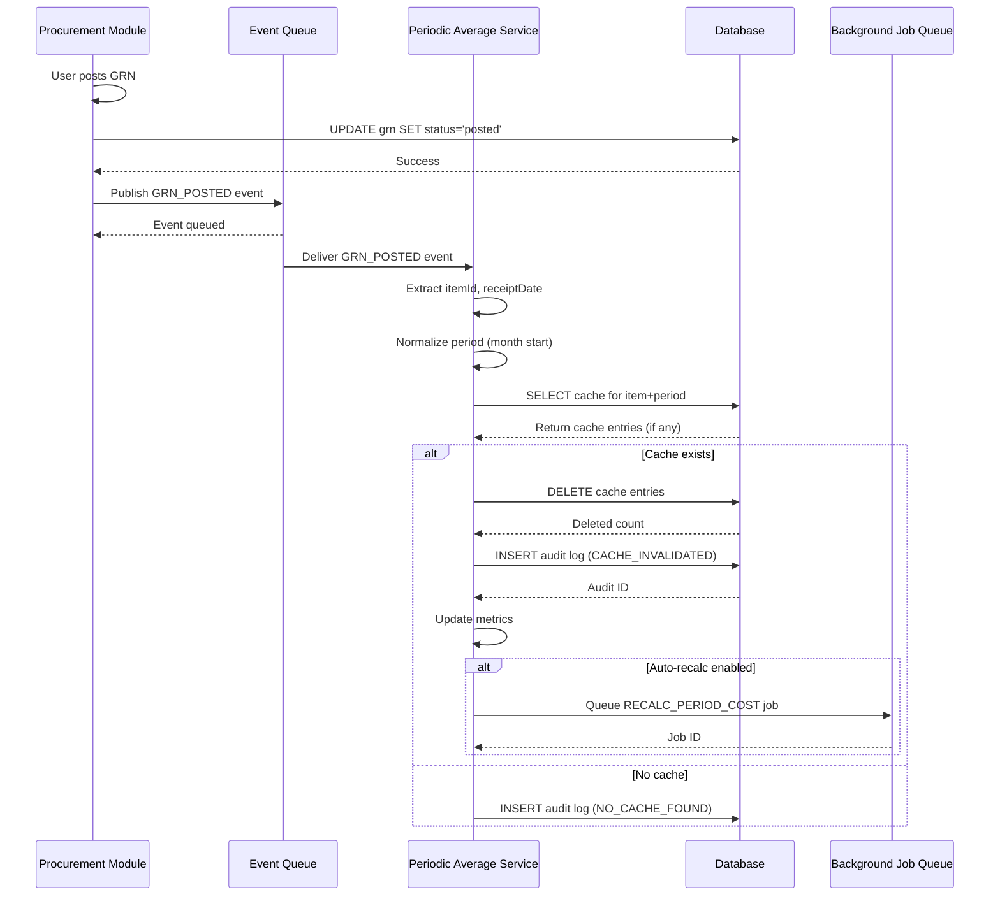
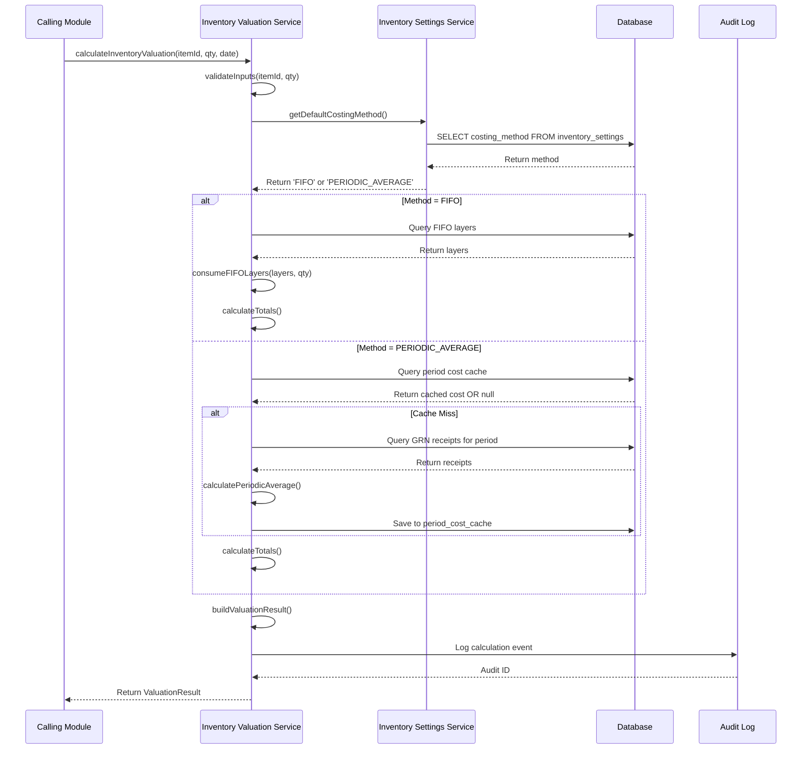
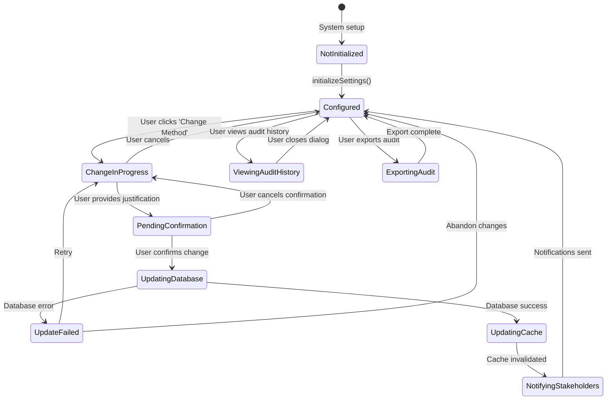
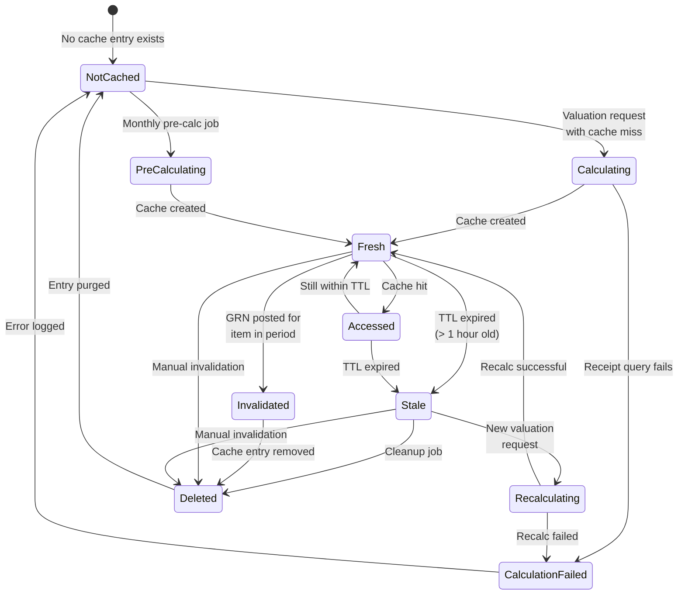

# Flow Diagrams: Inventory Valuation System

**📌 Schema Reference**: Data structures defined in `/app/data-struc/schema.prisma`

## Module Information
- **Module**: Shared Methods
- **Sub-Module**: Inventory Valuation
- **Version**: 1.1.0
- **Last Updated**: 2025-11-03
- **Owner**: Finance & Operations Team
- **Status**: Draft

## Document History
| Version | Date | Author | Changes |
|---------|------|--------|---------|
| 1.0.0 | 2025-01-15 | System | Initial version |
| 1.1.0 | 2025-11-03 | System | Schema alignment - updated enum values and precision |

---

## Overview

This document provides comprehensive flow diagrams for the Inventory Valuation system. It illustrates all key workflows, data flows, state transitions, and integration patterns for centralized inventory costing using **FIFO** and **AVG (Periodic Average)** methods.

**Database Enum**: `enum_calculation_method` with values `FIFO` and `AVG` (see schema.prisma:42-45)

The diagrams cover:
- **Configuration workflows**: How administrators change costing methods
- **Calculation flows**: FIFO layer consumption and Periodic Average calculations
- **Cache management**: Period cost caching and invalidation strategies
- **Audit workflows**: Immutable audit trail creation and access
- **Integration flows**: How other modules consume valuation services
- **Background jobs**: Automated cache pre-calculation and cleanup
- **Error handling**: Fallback strategies and error recovery

**Related Documents**:
- [Business Requirements](./BR-inventory-valuation.md)
- [Use Cases](./UC-inventory-valuation.md)
- [System Method Specification](./SM-inventory-valuation.md)
- [Data Definition](./DD-inventory-valuation.md)
- [Validations](./VAL-inventory-valuation.md)

---

## Diagram Index

| Diagram | Type | Purpose | Complexity |
|---------|------|---------|------------|
| [Costing Method Change](#costing-method-change-workflow) | Workflow | Configuration change process | Medium |
| [FIFO Cost Calculation](#fifo-cost-calculation-flow) | Process | Layer-based cost calculation | High |
| [Periodic Average Calculation](#periodic-average-cost-calculation-flow) | Process | Monthly average cost calculation | High |
| [Cache Invalidation](#grn-posting-and-cache-invalidation-flow) | Data Flow | Event-driven cache updates | Medium |
| [Fallback Decision Tree](#fallback-strategy-decision-tree) | Decision | Multi-level fallback logic | High |
| [Audit Trail Creation](#audit-trail-creation-flow) | Process | Immutable audit logging | Low |
| [Monthly Pre-calculation](#monthly-pre-calculation-job-flow) | Process | Background cache building | Medium |
| [Valuation Request](#valuation-request-processing-flow) | Process | Main API workflow | High |
| [Credit Note Integration](#credit-note-integration-flow) | Integration | Credit note costing | Medium |
| [Stock Adjustment Integration](#stock-adjustment-integration-flow) | Integration | Adjustment costing | Medium |
| [Settings State Diagram](#inventory-settings-state-diagram) | State | Configuration lifecycle | Low |
| [Cache Lifecycle](#period-cost-cache-lifecycle) | State | Cache state transitions | Medium |

---

## Costing Method Change Workflow

### Purpose
Documents the complete workflow for changing the system-wide inventory costing method from FIFO to Periodic Average or vice versa.

### Actors
- **Financial Manager**: User with permission to change costing method
- **System Administrator**: User with admin privileges
- **System**: Inventory Valuation Service
- **Stakeholders**: Finance managers, operations managers who receive notifications

### Trigger
User navigates to System Administration > Inventory Settings and selects "Change Costing Method"

```mermaid
flowchart TD
    Start([User navigates to<br>Inventory Settings]) --> LoadCurrent[Load Current Configuration]
    LoadCurrent --> Display[Display Current Method:<br>FIFO or Periodic Average]

    Display --> UserSelect{User selects<br>new method?}
    UserSelect -->|No change| Cancel1([No action taken])
    UserSelect -->|Yes| CheckSame{New method =<br>Current method?}

    CheckSame -->|Yes| ShowInfo[Show info message:<br>'Method unchanged']
    ShowInfo --> Cancel1

    CheckSame -->|No| ShowImpact[Show Impact Analysis]
    ShowImpact --> ImpactContent[Display:<br>- Affected modules<br>- Historical data policy<br>- Performance impact<br>- Audit requirements]

    ImpactContent --> RequireJustify[Require Justification Field]
    RequireJustify --> UserFills{User provides<br>justification?}

    UserFills -->|No| Cancel2([User cancels])
    UserFills -->|Yes| ShowConfirm[Show Confirmation Dialog]

    ShowConfirm --> ConfirmContent['Display:<br>- Old method → New method<br>- Justification text<br>- Warning: Cannot be undone<br>- Require explicit confirmation']

    ConfirmContent --> UserConfirm{User confirms?}
    UserConfirm -->|No| Cancel2
    UserConfirm -->|Yes| ValidateAuth{User has<br>permission?}

    ValidateAuth -->|No| ShowError1[Show error:<br>'Insufficient permissions']
    ShowError1 --> End1([End: Denied])

    ValidateAuth -->|Yes| CreateAudit[Create Audit Entry<br>BEFORE change]
    CreateAudit --> AuditData['Log:<br>- Event: COSTING_METHOD_CHANGED<br>- Old value<br>- New value<br>- Justification<br>- User ID<br>- Timestamp<br>- IP address<br>- Session ID']

    AuditData --> UpdateDB[(Update inventory_settings<br>table in database)]
    UpdateDB --> SaveSuccess{Save<br>successful?}

    SaveSuccess -->|No| ShowError2[Show error:<br>'Database update failed']
    ShowError2 --> End2([End: Failed])

    SaveSuccess -->|Yes| InvalidateCache[Invalidate Settings Cache]
    InvalidateCache --> NotifyStakeholders[Send Notifications]

    NotifyStakeholders --> NotifyContent['Email to:<br>- Finance managers<br>- Operations managers<br>- System administrators<br><br>Content:<br>- What changed<br>- Who made change<br>- When it was changed<br>- Justification']

    NotifyContent --> ShowSuccess[Show success message:<br>'Costing method updated']
    ShowSuccess --> RefreshUI[Refresh UI to show<br>new configuration]
    RefreshUI --> End3([End: Success])

    style Start fill:#cce5ff,stroke:#0066cc,stroke-width:2px,color:#000
    style End1 fill:#ffcccc,stroke:#cc0000,stroke-width:2px,color:#000
    style End2 fill:#ffcccc,stroke:#cc0000,stroke-width:2px,color:#000
    style End3 fill:#ccffcc,stroke:#00cc00,stroke-width:2px,color:#000
    style Cancel1 fill:#e8e8e8,stroke:#333,stroke-width:2px,color:#000
    style Cancel2 fill:#e8e8e8,stroke:#333,stroke-width:2px,color:#000
    style ShowError1 fill:#ffe0b3,stroke:#cc6600,stroke-width:2px,color:#000
    style ShowError2 fill:#ffe0b3,stroke:#cc6600,stroke-width:2px,color:#000
    style CreateAudit fill:#e0ccff,stroke:#6600cc,stroke-width:2px,color:#000
    style UpdateDB fill:#e0ccff,stroke:#6600cc,stroke-width:2px,color:#000
```



### Flow Steps

1. **Start**: User navigates to System Administration > Inventory Settings page
2. **Load Current**: System loads current costing method configuration from database
3. **Display**: UI displays current method (FIFO or AVG) with radio button selection (display as "Periodic Average")
4. **User Select**: User may select a different costing method or leave unchanged
5. **Check Same**: System validates if new selection differs from current method
6. **Show Impact**: If changing, display impact analysis panel showing:
   - Affected modules (credit notes, stock adjustments, reporting)
   - Historical data policy (existing costs unchanged, new transactions only)
   - Performance implications (FIFO: real-time layer lookup, Periodic: cached lookups)
   - Audit and compliance requirements
7. **Require Justify**: System requires mandatory justification text field (min 20 characters)
8. **User Fills**: User must provide business justification for the change
9. **Show Confirm**: Display confirmation dialog with all change details
10. **User Confirm**: User must explicitly confirm the change (cannot be undone warning)
11. **Validate Auth**: System checks user has 'financial-manager' or 'system-admin' role
12. **Create Audit**: **CRITICAL**: Audit entry created BEFORE making the change
13. **Update DB**: Database transaction updates inventory_settings table
14. **Invalidate Cache**: Clear application-level settings cache
15. **Notify Stakeholders**: Send email notifications to all relevant parties
16. **Show Success**: Display success message with confirmation
17. **Refresh UI**: Update UI to reflect new configuration

### Exception Handling

- **Permission Denied**: User lacks required role → Show error, block change
- **Database Failure**: Update fails → Rollback, show error, log incident
- **Network Timeout**: Notification fails → Log warning, allow change to proceed
- **Validation Errors**: Missing justification → Prevent submission until provided

### Business Rules Applied

- BR-INV-001: Only financial-manager or system-admin can change costing method
- BR-INV-002: Justification required for all changes (min 20 characters)
- BR-INV-041: Audit entry created BEFORE configuration change
- BR-INV-042: Notification sent to finance-managers and operations-managers
- BR-INV-013: Historical costs remain unchanged (forward-looking only)

---

## FIFO Cost Calculation Flow

### Purpose
Detailed process flow for calculating inventory costs using the First-In-First-Out (FIFO) method by consuming oldest inventory layers first.

### Actors
- **Calling Module**: Credit Note, Stock Adjustment, or other module requesting valuation
- **Inventory Valuation Service**: Main centralized service
- **Database**: FIFO layers and consumption records

### Trigger
Module calls `calculateInventoryValuation(itemId, quantity, date)` when costing method is FIFO

```mermaid
flowchart TD
    Start([Module requests<br>valuation]) --> Receive['Receive parameters:<br>- itemId<br>- quantity<br>- date']

    Receive --> ValidateInput{Validate<br>inputs?}
    ValidateInput -->|itemId empty| E1[Error: Item ID required]
    ValidateInput -->|quantity ≤ 0| E2[Error: Quantity must be > 0]
    ValidateInput -->|quantity not finite| E3[Error: Invalid quantity]
    E1 --> End1([Throw error])
    E2 --> End1
    E3 --> End1

    ValidateInput -->|Valid| CheckMethod{Get costing<br>method from<br>settings}
    CheckMethod -->|AVG| OtherFlow[Route to Periodic<br>Average flow]
    CheckMethod -->|FIFO| GetLayers['Query FIFO layers:<br><br>SELECT * FROM fifo_layers<br>WHERE item_id = ?<br>  AND remaining_quantity > 0<br>ORDER BY lot_number ASC<br>(Natural chronological sort)']

    GetLayers --> CheckLayersExist{Layers<br>found?}
    CheckLayersExist -->|No| E4[Error: No FIFO layers<br>available for item]
    E4 --> End1

    CheckLayersExist -->|Yes| InitConsumption[Initialize consumption:<br>- layersConsumed = []<br>- remainingQty = quantity<br>- totalCost = 0]

    InitConsumption --> LoopLayers{For each layer<br>while remainingQty > 0}

    LoopLayers -->|No more layers| CheckSufficient{totalConsumed<br>>= quantity?}

    CheckSufficient -->|No| E5['Error: Insufficient layers<br>Required: {quantity}<br>Available: {totalConsumed}']
    E5 --> End1

    CheckSufficient -->|Yes| CalculateTotals[Calculate totals:<br>totalValue = Σ(layer.totalCost)<br>unitCost = totalValue / quantity]

    LoopLayers -->|Next layer| CalcConsume['Calculate consumption:<br>quantityToConsume =<br>  MIN(layer.remainingQuantity,<br>      remainingQty)']

    CalcConsume --> CreateRecord['Create consumption record:<br>- layerId<br>- lotNumber<br>- quantityConsumed<br>- unitCost (from layer)<br>- totalCost = qty × unitCost<br>- receiptDate']

    CreateRecord --> AddToList[Add record to<br>layersConsumed array]
    AddToList --> UpdateRemaining['Update remainingQty:<br>remainingQty -= quantityToConsume']
    UpdateRemaining --> LoopLayers

    CalculateTotals --> RoundValues['Round values:<br>- unitCost to 5 decimals (DECIMAL 20,5)<br>- totalValue to 2 decimals']

    RoundValues --> BuildResult['Build ValuationResult:<br>- itemId<br>- quantity<br>- unitCost<br>- totalValue<br>- method: 'FIFO'<br>- layersConsumed<br>- calculatedAt: now()']

    BuildResult --> LogEvent[Log calculation event<br>to audit log]
    LogEvent --> ReturnResult[Return ValuationResult<br>to calling module]
    ReturnResult --> End2([End: Success])

    style Start fill:#cce5ff,stroke:#0066cc,stroke-width:2px,color:#000
    style End1 fill:#ffcccc,stroke:#cc0000,stroke-width:2px,color:#000
    style End2 fill:#ccffcc,stroke:#00cc00,stroke-width:2px,color:#000
    style GetLayers fill:#e0ccff,stroke:#6600cc,stroke-width:2px,color:#000
    style InitConsumption fill:#ffe0b3,stroke:#cc6600,stroke-width:2px,color:#000
    style LoopLayers fill:#ffe0b3,stroke:#cc6600,stroke-width:2px,color:#000
    style CalculateTotals fill:#ffe0b3,stroke:#cc6600,stroke-width:2px,color:#000
    style E1 fill:#ffe0b3,stroke:#cc6600,stroke-width:2px,color:#000
    style E2 fill:#ffe0b3,stroke:#cc6600,stroke-width:2px,color:#000
    style E3 fill:#ffe0b3,stroke:#cc6600,stroke-width:2px,color:#000
    style E4 fill:#ffe0b3,stroke:#cc6600,stroke-width:2px,color:#000
    style E5 fill:#ffe0b3,stroke:#cc6600,stroke-width:2px,color:#000
```

### FIFO Layer Consumption Algorithm

**Algorithm**: Oldest-first consumption

```
FOR each layer in layers (sorted by receipt_date ASC, lot_number ASC):
    IF remainingQuantity <= 0:
        BREAK

    quantityToConsume = MIN(layer.remainingQuantity, remainingQuantity)

    consumption = {
        layerId: layer.id,
        lotNumber: layer.lotNumber,
        quantityConsumed: quantityToConsume,
        unitCost: layer.unitCost,
        totalCost: quantityToConsume × layer.unitCost,
        receiptDate: layer.receiptDate
    }

    layersConsumed.push(consumption)
    remainingQuantity -= quantityToConsume

totalValue = SUM(consumption.totalCost for each consumption)
unitCost = totalValue / quantity
```

### Decision Points

| Decision | Criteria | Outcome |
|----------|----------|---------|
| Input Validation | itemId not empty, quantity > 0, quantity finite | Pass/Fail |
| Costing Method | Current method = FIFO | Continue/Route to other flow |
| Layers Exist | At least one layer with remaining_quantity > 0 | Continue/Error |
| Sufficient Quantity | Total available >= requested quantity | Calculate/Error |

### Exception Handling

- **No FIFO Layers**: No layers available for item → Throw error, suggest checking GRN posting
- **Insufficient Layers**: Available quantity < requested → Throw error with details
- **Database Error**: Query fails → Log error, throw exception with context
- **Invalid Input**: Empty itemId, invalid quantity → Throw validation error

### Business Rules Applied

- BR-INV-019: FIFO consumes oldest layers first (ORDER BY lot_number ASC via natural chronological sort)
- BR-INV-020: Layer consumption tracked in detail (all fields captured)
- BR-INV-021: Consumption stops when required quantity satisfied
- BR-INV-017: Significant events logged (layer consumption patterns)
- BR-INV-015: Unit cost rounded to 4 decimals, total value to 2 decimals

---

## Periodic Average Cost Calculation Flow

### Purpose
Process flow for calculating inventory costs using the Periodic Average method with monthly cost caching and fallback strategies.

### Actors
- **Calling Module**: Module requesting valuation
- **Inventory Valuation Service**: Main service
- **Periodic Average Service**: Specialized calculation service
- **Database**: Period cost cache and receipt data

### Trigger
Module calls `calculateInventoryValuation(itemId, quantity, date)` when costing method is PERIODIC_AVERAGE

```mermaid
flowchart TD
    Start([Module requests<br>valuation]) --> Receive['Receive parameters:<br>- itemId<br>- quantity<br>- date']

    Receive --> ValidateInput{Validate<br>inputs?}
    ValidateInput -->|Invalid| E1[Error: Validation failed]
    E1 --> End1([Throw error])

    ValidateInput -->|Valid| CheckMethod{Get costing<br>method}
    CheckMethod -->|FIFO| OtherFlow[Route to FIFO flow]
    CheckMethod -->|AVG| NormalizePeriod['Normalize period:<br>periodStart =<br>  new Date(date.year,<br>           date.month, 1)']

    NormalizePeriod --> TryCache{Check cache<br>for period}

    TryCache -->|Hit| GetCached['Retrieve from cache:<br><br>SELECT average_cost<br>FROM period_cost_cache<br>WHERE item_id = ?<br>  AND period = ?<br>  AND calculated_at > (now - 1 hour)']

    GetCached --> UseCached[Use cached<br>average cost]

    TryCache -->|Miss| CalculateFresh['Calculate fresh:<br><br>Get all receipts for period']

    CalculateFresh --> QueryReceipts['Query receipts:<br><br>SELECT<br>  SUM(quantity) as totalQty,<br>  SUM(total_cost) as totalCost,<br>  COUNT(*) as receiptCount<br>FROM goods_received_notes<br>WHERE item_id = ?<br>  AND receipt_date >= ?<br>  AND receipt_date < ?<br>  AND status = 'posted'']

    QueryReceipts --> CheckReceipts{Receipts<br>found?}

    CheckReceipts -->|No| NoReceipts[No receipts in period]
    NoReceipts --> TryFallback[Trigger fallback<br>strategy]

    CheckReceipts -->|Yes| CalcAverage['Calculate average:<br>averageCost =<br>  totalCost / totalQty']

    CalcAverage --> SaveCache['Save to cache:<br><br>INSERT INTO period_cost_cache<br>(item_id, period,<br> average_cost, total_quantity,<br> total_cost, receipt_count,<br> calculated_at, created_by)<br>VALUES (...)']

    SaveCache --> UseCached

    UseCached --> Calculate['Calculate totals:<br>totalValue = quantity × averageCost<br>unitCost = averageCost']

    Calculate --> RoundValues['Round values:<br>- unitCost to 5 decimals (DECIMAL 20,5)<br>- averageCost to 5 decimals (DECIMAL 20,5)<br>- totalValue to 2 decimals']

    RoundValues --> BuildResult['Build ValuationResult:<br>- itemId<br>- quantity<br>- unitCost<br>- totalValue<br>- method: 'AVG' // enum_calculation_method.AVG<br>- period<br>- averageCost<br>- calculatedAt: now()']

    BuildResult --> LogEvent[Log calculation event]
    LogEvent --> ReturnResult[Return ValuationResult]
    ReturnResult --> End2([End: Success])

    TryFallback --> FallbackTree[Execute Fallback<br>Decision Tree]
    FallbackTree --> FallbackSuccess{Fallback<br>succeeded?}
    FallbackSuccess -->|Yes| UseFallback[Use fallback cost]
    FallbackSuccess -->|No| E2[Error: Cannot determine cost]
    E2 --> End1

    UseFallback --> Calculate

    style Start fill:#cce5ff,stroke:#0066cc,stroke-width:2px,color:#000
    style End1 fill:#ffcccc,stroke:#cc0000,stroke-width:2px,color:#000
    style End2 fill:#ccffcc,stroke:#00cc00,stroke-width:2px,color:#000
    style QueryReceipts fill:#e0ccff,stroke:#6600cc,stroke-width:2px,color:#000
    style SaveCache fill:#e0ccff,stroke:#6600cc,stroke-width:2px,color:#000
    style TryCache fill:#ffe0b3,stroke:#cc6600,stroke-width:2px,color:#000
    style TryFallback fill:#ffe0b3,stroke:#cc6600,stroke-width:2px,color:#000
    style E1 fill:#ffe0b3,stroke:#cc6600,stroke-width:2px,color:#000
    style E2 fill:#ffe0b3,stroke:#cc6600,stroke-width:2px,color:#000
```

### Periodic Average Calculation Formula

**Formula**: Weighted average of all receipts in the period

```
totalCost = SUM(grn.total_cost WHERE grn.receipt_date IN period AND grn.status = 'posted')
totalQuantity = SUM(grn.quantity WHERE grn.receipt_date IN period AND grn.status = 'posted')
averageCost = totalCost / totalQuantity

totalValue = quantity × averageCost
unitCost = averageCost
```

### Cache Strategy

**Cache Key**: `{itemId}_{period}` (e.g., "ITEM-123_2025-01-01")

**Cache TTL**: 1 hour (sliding expiration)

**Cache Invalidation Triggers**:
- New GRN posted for item in period
- GRN status changed to 'posted'
- Manual cache invalidation by admin

### Decision Points

| Decision | Criteria | Outcome |
|----------|----------|---------|
| Cache Hit | Valid cache entry exists and < 1 hour old | Use cached/Calculate fresh |
| Receipts Found | At least one posted GRN in period | Calculate/Try fallback |
| Fallback Success | Fallback strategy returns valid cost | Use fallback/Error |

### Exception Handling

- **No Receipts**: No GRNs in period → Execute fallback strategy
- **Database Error**: Query fails → Log error, try fallback
- **Division by Zero**: Total quantity = 0 → Try fallback
- **All Fallbacks Fail**: No valid cost found → Throw error with detailed context

### Business Rules Applied

- BR-INV-022: Period normalized to calendar month start (1st day)
- BR-INV-023: Only posted GRNs included in calculation
- BR-INV-024: Formula: totalCost ÷ totalQuantity
- BR-INV-025: Cache entry created with all metadata
- BR-INV-026: Cache TTL of 1 hour
- BR-INV-027: Fallback strategies attempted in order
- BR-INV-015: Precision: unit cost 4 decimals, total value 2 decimals

---

## GRN Posting and Cache Invalidation Flow

### Purpose
Event-driven flow showing how Goods Received Note (GRN) posting triggers cache invalidation to ensure cost calculations use fresh data.

### Actors
- **Procurement Module**: Posts GRN
- **Event System**: Message queue or event bus
- **Periodic Average Service**: Handles cache invalidation
- **Database**: Period cost cache

### Trigger
GRN status changes to 'posted' in the procurement module

```mermaid
flowchart TD
    Start([GRN posted in<br>Procurement Module]) --> ExtractData['Extract GRN data:<br>- itemId<br>- receiptDate<br>- quantity<br>- totalCost']

    ExtractData --> PublishEvent['Publish event:<br><br>Event Type: 'GRN_POSTED'<br>Payload: {<br>  grnId,<br>  itemId,<br>  receiptDate,<br>  quantity,<br>  totalCost<br>}']

    PublishEvent --> EventQueue[Event Queue/<br>Message Bus]

    EventQueue --> Subscribe[Periodic Average Service<br>subscribes to GRN_POSTED]

    Subscribe --> ReceiveEvent[Receive event payload]

    ReceiveEvent --> NormalizePeriod['Normalize period:<br>period =<br>  new Date(receiptDate.year,<br>           receiptDate.month, 1)']

    NormalizePeriod --> FindCache['Find cached entries:<br><br>SELECT id FROM period_cost_cache<br>WHERE item_id = ?<br>  AND period = ?']

    FindCache --> CheckExists{Cache entries<br>exist?}

    CheckExists -->|No| LogNoAction[Log: No cache to invalidate]
    LogNoAction --> End1([End: No action needed])

    CheckExists -->|Yes| DeleteCache['Delete cache entries:<br><br>DELETE FROM period_cost_cache<br>WHERE item_id = ?<br>  AND period = ?']

    DeleteCache --> LogInvalidation['Log invalidation:<br><br>INSERT INTO valuation_audit_log<br>(event_type, item_id, period,<br> reason, triggered_by)<br>VALUES<br>('CACHE_INVALIDATED',<br> itemId, period,<br> 'GRN posted', grnId)']

    LogInvalidation --> UpdateMetrics[Update cache<br>invalidation metrics]

    UpdateMetrics --> CheckAutoRecalc{Auto-recalc<br>enabled?}

    CheckAutoRecalc -->|No| End2([End: Cache invalidated])

    CheckAutoRecalc -->|Yes| TriggerRecalc[Trigger background<br>recalculation job]

    TriggerRecalc --> QueueJob['Queue job:<br><br>Job Type: 'RECALC_PERIOD_COST'<br>Params: {<br>  itemId,<br>  period<br>}']

    QueueJob --> End3([End: Recalc queued])

    style Start fill:#cce5ff,stroke:#0066cc,stroke-width:2px,color:#000
    style End1 fill:#e8e8e8,stroke:#333,stroke-width:2px,color:#000
    style End2 fill:#ccffcc,stroke:#00cc00,stroke-width:2px,color:#000
    style End3 fill:#ccffcc,stroke:#00cc00,stroke-width:2px,color:#000
    style PublishEvent fill:#ffe0b3,stroke:#cc6600,stroke-width:2px,color:#000
    style EventQueue fill:#e0ccff,stroke:#6600cc,stroke-width:2px,color:#000
    style DeleteCache fill:#e0ccff,stroke:#6600cc,stroke-width:2px,color:#000
    style LogInvalidation fill:#e0ccff,stroke:#6600cc,stroke-width:2px,color:#000
```

### Event Flow Sequence



### Integration Points

1. **Event Publishing**: Procurement module publishes GRN_POSTED event
2. **Event Delivery**: Message queue delivers to subscribers
3. **Cache Invalidation**: Periodic Average Service deletes cache
4. **Audit Logging**: All invalidations logged for traceability
5. **Auto-Recalculation**: Optional background job for eager cache rebuilding

### Exception Handling

- **Event Delivery Failure**: Retry with exponential backoff (3 attempts)
- **Database Error**: Log error, alert administrators, continue
- **Invalid Event Data**: Log warning, skip processing
- **Cache Delete Failure**: Log error, alert, but allow GRN posting to succeed

### Business Rules Applied

- BR-INV-028: GRN posting triggers cache invalidation
- BR-INV-029: Period normalized to calendar month
- BR-INV-030: All invalidations logged in audit trail
- BR-INV-031: Auto-recalculation optional (configurable)
- BR-INV-017: Significant events logged

---

## Fallback Strategy Decision Tree

### Purpose
Multi-level fallback logic used when primary Periodic Average calculation fails (no receipts in period).

### Trigger
Periodic Average calculation cannot find receipts in the requested period

```mermaid
graph TD
    Start{Primary calculation<br>failed:<br>No receipts in period} --> Strategy1[Strategy 1:<br>Previous Month Cost]

    Strategy1 --> Query1['Query cache:<br><br>SELECT average_cost<br>FROM period_cost_cache<br>WHERE item_id = ?<br>  AND period = (current_month - 1)<br>  AND calculated_at > (now - 24 hours)']

    Query1 --> Check1{Previous month<br>cost found?}

    Check1 -->|Yes| Use1['Use previous month cost<br><br>Log warning:<br>'Using previous month cost<br> for {itemId} in {period}'']
    Use1 --> Success([Return cost with<br>fallback flag])

    Check1 -->|No| Strategy2[Strategy 2:<br>Standard Cost]

    Strategy2 --> Query2['Query standard cost:<br><br>SELECT standard_cost<br>FROM inventory_items<br>WHERE id = ?<br>  AND standard_cost IS NOT NULL<br>  AND standard_cost > 0']

    Query2 --> Check2{Standard cost<br>configured?}

    Check2 -->|Yes| Use2['Use standard cost<br><br>Log warning:<br>'Using standard cost<br> for {itemId} in {period}'']
    Use2 --> Success

    Check2 -->|No| Strategy3[Strategy 3:<br>Latest Purchase Price]

    Strategy3 --> Query3['Query latest purchase:<br><br>SELECT unit_cost<br>FROM goods_received_notes<br>WHERE item_id = ?<br>  AND status = 'posted'<br>  AND transaction_date <= ?<br>ORDER BY transaction_date DESC<br>LIMIT 1']

    Query3 --> Check3{Latest purchase<br>found?}

    Check3 -->|Yes| Use3['Use latest purchase price<br><br>Log warning:<br>'Using latest purchase price<br> for {itemId} in {period}'']
    Use3 --> Success

    Check3 -->|No| Strategy4[Strategy 4:<br>Moving Average<br>(Last 3 months)]

    Strategy4 --> Query4['Calculate moving average:<br><br>SELECT AVG(average_cost)<br>FROM period_cost_cache<br>WHERE item_id = ?<br>  AND period >= (current_month - 3)<br>  AND period < current_month']

    Query4 --> Check4{Moving average<br>calculated?}

    Check4 -->|Yes| Use4['Use moving average<br><br>Log warning:<br>'Using 3-month moving average<br> for {itemId} in {period}'']
    Use4 --> Success

    Check4 -->|No| AllFailed[All fallback<br>strategies failed]

    AllFailed --> BuildError['Build comprehensive error:<br><br>Error: Cannot determine cost<br>Item: {itemId}<br>Period: {period}<br>Reason: No receipts found<br>Fallbacks tried:<br>  1. Previous month - not found<br>  2. Standard cost - not configured<br>  3. Latest purchase - none found<br>  4. Moving average - insufficient data<br><br>Suggestion: Check GRN posting<br>           or configure standard cost']

    BuildError --> LogError[Log error with<br>full context]
    LogError --> AlertAdmin[Send alert to<br>system administrators]
    AlertAdmin --> Fail([Throw error])

    style Start fill:#cce5ff,stroke:#0066cc,stroke-width:2px,color:#000
    style Success fill:#ccffcc,stroke:#00cc00,stroke-width:2px,color:#000
    style Fail fill:#ffcccc,stroke:#cc0000,stroke-width:2px,color:#000
    style Strategy1 fill:#ffe0b3,stroke:#cc6600,stroke-width:2px,color:#000
    style Strategy2 fill:#ffe0b3,stroke:#cc6600,stroke-width:2px,color:#000
    style Strategy3 fill:#ffe0b3,stroke:#cc6600,stroke-width:2px,color:#000
    style Strategy4 fill:#ffe0b3,stroke:#cc6600,stroke-width:2px,color:#000
    style Query1 fill:#e0ccff,stroke:#6600cc,stroke-width:2px,color:#000
    style Query2 fill:#e0ccff,stroke:#6600cc,stroke-width:2px,color:#000
    style Query3 fill:#e0ccff,stroke:#6600cc,stroke-width:2px,color:#000
    style Query4 fill:#e0ccff,stroke:#6600cc,stroke-width:2px,color:#000
    style AllFailed fill:#ffcccc,stroke:#cc0000,stroke-width:2px,color:#000
```

### Fallback Strategy Priority

| Priority | Strategy | Data Source | Reliability | Cache TTL |
|----------|----------|-------------|-------------|-----------|
| 1 | Previous Month Cost | period_cost_cache | High | 24 hours |
| 2 | Standard Cost | inventory_items.standard_cost | Medium | N/A (static) |
| 3 | Latest Purchase Price | goods_received_notes | Medium | N/A |
| 4 | 3-Month Moving Average | period_cost_cache | Low | N/A |

### Fallback Result Format

When fallback succeeds, the ValuationResult includes additional fields:

```typescript
{
  itemId: "ITEM-123",
  quantity: 100,
  unitCost: 25.50,
  totalValue: 2550.00,
  method: "PERIODIC_AVERAGE",
  period: "2025-01-01T00:00:00Z",
  averageCost: 25.50,
  calculatedAt: "2025-01-15T10:30:00Z",

  // Fallback indicators
  fallbackUsed: true,
  fallbackStrategy: "previous_month",
  warning: "Using previous month cost for ITEM-123 in 2025-01. No receipts found in current period."
}
```

### Exception Handling

- **Strategy 1 Fails**: Try Strategy 2
- **Strategy 2 Fails**: Try Strategy 3
- **Strategy 3 Fails**: Try Strategy 4
- **All Strategies Fail**: Throw comprehensive error with suggestions

### Business Rules Applied

- BR-INV-027: Fallback strategies attempted in priority order
- BR-INV-032: Previous month cost preferred (most recent data)
- BR-INV-033: Standard cost as secondary fallback (configured by finance)
- BR-INV-034: Latest purchase price as tertiary fallback
- BR-INV-035: Moving average as last resort (smooths volatility)
- BR-INV-036: All fallback usage logged with warnings
- BR-INV-037: Comprehensive error if all fallbacks fail

---

## Audit Trail Creation Flow

### Purpose
Process for creating immutable audit log entries for all significant system events and configuration changes.

### Actors
- **Any Service**: Inventory Valuation Service, Inventory Settings Service
- **Audit Log System**: Centralized logging service
- **Database**: valuation_audit_log table

### Trigger
Significant event occurs (costing method change, cache invalidation, calculation error, etc.)

```mermaid
flowchart TD
    Start([Significant event<br>occurs]) --> Identify{Event<br>type?}

    Identify -->|Config Change| BuildConfigEvent['Build audit entry:<br><br>Event: COSTING_METHOD_CHANGED<br>Data:<br>- oldValue<br>- newValue<br>- reason<br>- userId<br>- timestamp<br>- ipAddress<br>- sessionId<br>- browser']

    Identify -->|Cache Invalidation| BuildCacheEvent['Build audit entry:<br><br>Event: CACHE_INVALIDATED<br>Data:<br>- itemId<br>- period<br>- reason<br>- triggeredBy (GRN ID)<br>- timestamp']

    Identify -->|Calculation Error| BuildErrorEvent['Build audit entry:<br><br>Event: CALCULATION_FAILED<br>Data:<br>- itemId<br>- quantity<br>- date<br>- errorMessage<br>- errorCode<br>- timestamp']

    Identify -->|Fallback Used| BuildFallbackEvent['Build audit entry:<br><br>Event: FALLBACK_STRATEGY_USED<br>Data:<br>- itemId<br>- period<br>- strategy<br>- cost<br>- reason<br>- timestamp']

    BuildConfigEvent --> ValidateEntry{Validate<br>audit entry?}
    BuildCacheEvent --> ValidateEntry
    BuildErrorEvent --> ValidateEntry
    BuildFallbackEvent --> ValidateEntry

    ValidateEntry -->|Missing required fields| E1[Error: Invalid audit entry]
    E1 --> End1([Log error, skip audit])

    ValidateEntry -->|Valid| GenerateID[Generate unique<br>audit entry ID]

    GenerateID --> InsertDB['Insert into database:<br><br>INSERT INTO valuation_audit_log<br>(id, event_type, event_data,<br> user_id, timestamp, ip_address,<br> session_id, browser)<br>VALUES (...)']

    InsertDB --> CheckSuccess{Insert<br>successful?}

    CheckSuccess -->|No| E2[Error: Database insert failed]
    E2 --> RetryLogic{Retry<br>count < 3?}
    RetryLogic -->|Yes| Wait[Wait 1 second]
    Wait --> InsertDB
    RetryLogic -->|No| E3[All retries failed]
    E3 --> FallbackLog[Log to file system<br>as backup]
    FallbackLog --> AlertAdmin[Alert administrators]
    AlertAdmin --> End1

    CheckSuccess -->|Yes| UpdateMetrics[Update audit<br>metrics counters]

    UpdateMetrics --> CheckNotify{Notification<br>required?}

    CheckNotify -->|No| End2([End: Audit logged])

    CheckNotify -->|Yes| SendNotification['Send notifications:<br><br>- Email to stakeholders<br>- Slack/Teams message<br>- SMS for critical events']

    SendNotification --> End2

    style Start fill:#cce5ff,stroke:#0066cc,stroke-width:2px,color:#000
    style End1 fill:#ffcccc,stroke:#cc0000,stroke-width:2px,color:#000
    style End2 fill:#ccffcc,stroke:#00cc00,stroke-width:2px,color:#000
    style InsertDB fill:#e0ccff,stroke:#6600cc,stroke-width:2px,color:#000
    style E1 fill:#ffe0b3,stroke:#cc6600,stroke-width:2px,color:#000
    style E2 fill:#ffe0b3,stroke:#cc6600,stroke-width:2px,color:#000
    style E3 fill:#ffcccc,stroke:#cc0000,stroke-width:2px,color:#000
```

### Audit Entry Structure

**Standard Fields** (all events):
```typescript
{
  id: string;              // UUID
  eventType: string;       // Event type code
  timestamp: Date;         // When event occurred
  userId?: string;         // User who triggered (if applicable)
  ipAddress?: string;      // Source IP
  sessionId?: string;      // Session identifier
  browser?: string;        // User agent
}
```

**Event-Specific Data** (stored in event_data JSON field):

**COSTING_METHOD_CHANGED**:
```json
{
  "oldValue": "FIFO",
  "newValue": "PERIODIC_AVERAGE",
  "reason": "Switching to periodic for better performance",
  "companyId": "COMPANY-001"
}
```

**CACHE_INVALIDATED**:
```json
{
  "itemId": "ITEM-123",
  "period": "2025-01-01T00:00:00Z",
  "reason": "GRN posted",
  "triggeredBy": "GRN-456"
}
```

**FALLBACK_STRATEGY_USED**:
```json
{
  "itemId": "ITEM-123",
  "period": "2025-01-01T00:00:00Z",
  "strategy": "previous_month",
  "cost": 25.50,
  "reason": "No receipts in current period",
  "originalError": "No GRNs found for period"
}
```

### Immutability Guarantees

1. **No UPDATE allowed**: Audit entries can only be INSERTed, never UPDATEd
2. **No DELETE allowed**: Audit entries cannot be deleted (retention policy applies)
3. **Append-only**: All changes create new entries
4. **Database constraints**: UPDATE and DELETE triggers blocked at database level

### Exception Handling

- **Validation Error**: Skip audit, log warning, continue operation
- **Database Error**: Retry 3 times with backoff
- **All Retries Fail**: Log to filesystem as backup, alert administrators
- **Notification Failure**: Log warning, but don't fail audit creation

### Business Rules Applied

- BR-INV-018: Audit entry created BEFORE configuration change
- BR-INV-019: Audit entries are immutable (append-only)
- BR-INV-038: All significant events logged
- BR-INV-039: Audit includes full context (user, IP, session)
- BR-INV-040: Notifications sent for critical events

---

## Monthly Pre-calculation Job Flow

### Purpose
Background job that pre-calculates and caches period average costs for all items to improve query performance.

### Actors
- **Scheduler**: Cron or scheduled task system
- **Background Job Worker**: Processes the pre-calculation
- **Periodic Average Service**: Calculation logic
- **Database**: Period cost cache and receipts

### Trigger
Scheduled to run on 1st day of each month at 2:00 AM (configurable)

```mermaid
flowchart TD
    Start([Scheduled trigger:<br>1st of month at 2:00 AM]) --> InitJob[Initialize job<br>execution context]

    InitJob --> DeterminePeriod['Determine period:<br>period = previous month<br>(e.g., if today is 2025-02-01,<br> calculate for 2025-01-01)']

    DeterminePeriod --> GetActiveItems['Get all active items:<br><br>SELECT DISTINCT item_id<br>FROM goods_received_notes<br>WHERE receipt_date >= period_start<br>  AND receipt_date < period_end<br>  AND status = 'posted'']

    GetActiveItems --> CheckItems{Items<br>found?}

    CheckItems -->|No| LogNoItems[Log: No active items<br>for period]
    LogNoItems --> End1([End: No work needed])

    CheckItems -->|Yes| InitCounters[Initialize counters:<br>- totalItems<br>- processedItems<br>- successCount<br>- errorCount]

    InitCounters --> LoopItems{For each<br>item}

    LoopItems -->|No more items| FinalReport[Generate summary report]

    LoopItems -->|Next item| CheckExisting['Check if cache exists:<br><br>SELECT id FROM period_cost_cache<br>WHERE item_id = ?<br>  AND period = ?']

    CheckExisting --> CacheExists{Cache<br>exists?}

    CacheExists -->|Yes| LogSkip[Log: Cache already exists,<br>skipping]
    LogSkip --> IncrementProcessed1[processedItems++]
    IncrementProcessed1 --> LoopItems

    CacheExists -->|No| QueryReceipts['Query receipts:<br><br>SELECT<br>  SUM(quantity) as totalQty,<br>  SUM(total_cost) as totalCost,<br>  COUNT(*) as receiptCount<br>FROM goods_received_notes<br>WHERE item_id = ?<br>  AND receipt_date >= ?<br>  AND receipt_date < ?<br>  AND status = 'posted'']

    QueryReceipts --> ValidateData{Data<br>valid?}

    ValidateData -->|No| LogError1[Log error:<br>Invalid receipt data]
    LogError1 --> IncrementError1[errorCount++]
    IncrementError1 --> LoopItems

    ValidateData -->|Yes| Calculate['Calculate average:<br>averageCost = totalCost / totalQty']

    Calculate --> InsertCache['Insert cache:<br><br>INSERT INTO period_cost_cache<br>(id, item_id, period,<br> average_cost, total_quantity,<br> total_cost, receipt_count,<br> calculated_at, created_by)<br>VALUES (...)']

    InsertCache --> InsertSuccess{Insert<br>successful?}

    InsertSuccess -->|No| LogError2[Log error:<br>Cache insert failed]
    LogError2 --> IncrementError2[errorCount++]
    IncrementError2 --> LoopItems

    InsertSuccess -->|Yes| LogSuccess[Log success]
    LogSuccess --> IncrementSuccess[successCount++]
    IncrementSuccess --> IncrementProcessed2[processedItems++]
    IncrementProcessed2 --> UpdateProgress['Update progress:<br>(processedItems / totalItems)']
    UpdateProgress --> LoopItems

    FinalReport --> BuildReport['Build summary:<br><br>Job: Monthly Pre-calculation<br>Period: {period}<br>Total Items: {totalItems}<br>Successful: {successCount}<br>Errors: {errorCount}<br>Duration: {duration}<br>Completion: {completion_percentage}']

    BuildReport --> LogReport[Log summary report]
    LogReport --> SendReport['Send report:<br><br>Email to:<br>- System administrators<br>- Finance managers<br><br>Attach error details if any']

    SendReport --> UpdateMetrics[Update job metrics<br>in monitoring system]
    UpdateMetrics --> CheckErrors{Errors<br>occurred?}

    CheckErrors -->|Yes| AlertAdmin[Send alert with<br>error details]
    AlertAdmin --> End2([End: Completed with errors])

    CheckErrors -->|No| End3([End: Completed successfully])

    style Start fill:#cce5ff,stroke:#0066cc,stroke-width:2px,color:#000
    style End1 fill:#e8e8e8,stroke:#333,stroke-width:2px,color:#000
    style End2 fill:#ffe0b3,stroke:#cc6600,stroke-width:2px,color:#000
    style End3 fill:#ccffcc,stroke:#00cc00,stroke-width:2px,color:#000
    style QueryReceipts fill:#e0ccff,stroke:#6600cc,stroke-width:2px,color:#000
    style InsertCache fill:#e0ccff,stroke:#6600cc,stroke-width:2px,color:#000
    style LogError1 fill:#ffe0b3,stroke:#cc6600,stroke-width:2px,color:#000
    style LogError2 fill:#ffe0b3,stroke:#cc6600,stroke-width:2px,color:#000
```

### Job Configuration

**Schedule**: Cron expression `0 2 1 * *` (2:00 AM on 1st of each month)

**Timeout**: 2 hours

**Retry Policy**: If job fails, retry once after 1 hour

**Concurrency**: Single instance only (prevent duplicate execution)

**Performance**:
- Batch size: Process 100 items per batch
- Throttling: 10ms delay between items to avoid database overload
- Parallelization: Optional (up to 4 concurrent workers)

### Job Monitoring

**Metrics Tracked**:
- Total items processed
- Success count
- Error count
- Duration
- Database query performance
- Cache hit/miss ratio

**Alerting Thresholds**:
- Error rate > 5% → Send warning
- Error rate > 20% → Send critical alert
- Duration > 90 minutes → Send performance alert
- Job failure → Send immediate alert

### Exception Handling

- **No Items Found**: Log info, complete job successfully
- **Database Query Failure**: Log error, skip item, continue
- **Cache Insert Failure**: Log error, skip item, continue
- **Job Timeout**: Send alert, mark as failed, retry later
- **Database Connection Lost**: Retry connection 3 times, then fail job

### Business Rules Applied

- BR-INV-043: Job runs on 1st of month for previous month
- BR-INV-044: Only processes items with posted GRNs
- BR-INV-045: Skips items with existing cache entries
- BR-INV-046: Generates comprehensive summary report
- BR-INV-047: Alerts on errors exceeding threshold

---

## Valuation Request Processing Flow

### Purpose
Main workflow showing how calling modules request inventory valuations through the centralized API.

### Actors
- **Calling Module**: Credit Note, Stock Adjustment, Report, etc.
- **Inventory Valuation Service**: Main centralized service
- **Inventory Settings Service**: Configuration provider
- **Database**: Settings, FIFO layers, period cache

### Trigger
Module calls `InventoryValuationService.calculateInventoryValuation(itemId, quantity, date)`

```mermaid
flowchart TD
    Start([Module calls<br>calculateInventoryValuation]) --> Receive['Receive request:<br>- itemId<br>- quantity<br>- date']

    Receive --> ValidateInput['Validate inputs:<br>- itemId not empty<br>- quantity > 0<br>- quantity finite<br>- date valid']

    ValidateInput --> InputValid{Validation<br>passed?}
    InputValid -->|No| E1['Throw ValidationError:<br>'Invalid input parameters'']
    E1 --> End1([Return error])

    InputValid -->|Yes| GetMethod['Get costing method:<br><br>settingsService<br>  .getDefaultCostingMethod()']

    GetMethod --> MethodRetrieved{Method<br>retrieved?}
    MethodRetrieved -->|No| E2['Throw ConfigError:<br>'Costing method not configured'']
    E2 --> End1

    MethodRetrieved -->|Yes| RouteMethod{Which<br>method?}

    RouteMethod -->|FIFO| CallFIFO['Call FIFO calculation:<br><br>calculateFIFOCost(<br>  itemId,<br>  quantity,<br>  date<br>)']

    RouteMethod -->|PERIODIC_AVERAGE| CallPeriodic['Call Periodic Average:<br><br>calculatePeriodicAverageCost(<br>  itemId,<br>  quantity,<br>  date<br>)']

    CallFIFO --> FIFOSuccess{Calculation<br>successful?}
    CallPeriodic --> PeriodicSuccess{Calculation<br>successful?}

    FIFOSuccess -->|No| E3[FIFO error thrown]
    E3 --> End1

    FIFOSuccess -->|Yes| BuildFIFOResult['Build ValuationResult:<br>- method: 'FIFO'<br>- layersConsumed<br>- unitCost<br>- totalValue<br>- calculatedAt']

    PeriodicSuccess -->|No| TryFallback{Fallback<br>enabled?}
    TryFallback -->|No| E4[Periodic error thrown]
    E4 --> End1

    TryFallback -->|Yes| ExecuteFallback[Execute fallback<br>strategy]
    ExecuteFallback --> FallbackSuccess{Fallback<br>succeeded?}

    FallbackSuccess -->|No| E5['Throw CostingError:<br>'Cannot determine cost'']
    E5 --> End1

    FallbackSuccess -->|Yes| BuildFallbackResult['Build ValuationResult:<br>- method: 'AVG' // enum_calculation_method.AVG<br>- fallbackUsed: true<br>- fallbackStrategy<br>- warning<br>- unitCost<br>- totalValue']

    PeriodicSuccess -->|Yes| BuildPeriodicResult['Build ValuationResult:<br>- method: 'AVG' // enum_calculation_method.AVG<br>- period<br>- averageCost<br>- unitCost<br>- totalValue']

    BuildFIFOResult --> LogCalculation
    BuildPeriodicResult --> LogCalculation
    BuildFallbackResult --> LogCalculation

    LogCalculation['Log calculation:<br><br>INSERT INTO valuation_audit_log<br>(event_type, item_id, quantity,<br> date, method, unit_cost,<br> total_value, calculation_time)<br>VALUES (...)']

    LogCalculation --> ReturnResult[Return ValuationResult<br>to calling module]
    ReturnResult --> End2([End: Success])

    style Start fill:#cce5ff,stroke:#0066cc,stroke-width:2px,color:#000
    style End1 fill:#ffcccc,stroke:#cc0000,stroke-width:2px,color:#000
    style End2 fill:#ccffcc,stroke:#00cc00,stroke-width:2px,color:#000
    style GetMethod fill:#ffe0b3,stroke:#cc6600,stroke-width:2px,color:#000
    style CallFIFO fill:#ffe0b3,stroke:#cc6600,stroke-width:2px,color:#000
    style CallPeriodic fill:#ffe0b3,stroke:#cc6600,stroke-width:2px,color:#000
    style LogCalculation fill:#e0ccff,stroke:#6600cc,stroke-width:2px,color:#000
    style E1 fill:#ffe0b3,stroke:#cc6600,stroke-width:2px,color:#000
    style E2 fill:#ffe0b3,stroke:#cc6600,stroke-width:2px,color:#000
    style E3 fill:#ffe0b3,stroke:#cc6600,stroke-width:2px,color:#000
    style E4 fill:#ffe0b3,stroke:#cc6600,stroke-width:2px,color:#000
    style E5 fill:#ffe0b3,stroke:#cc6600,stroke-width:2px,color:#000
```

### Sequence Diagram: Valuation Request



### Exception Handling

- **Invalid Input**: Throw ValidationError immediately
- **Configuration Missing**: Throw ConfigurationError
- **FIFO Calculation Error**: Throw with layer details
- **Periodic Average Error**: Try fallback strategies
- **All Fallbacks Fail**: Throw comprehensive CostingError
- **Database Error**: Throw with connection details

### Business Rules Applied

- BR-INV-008: Centralized valuation through single service
- BR-INV-009: Input validation before processing
- BR-INV-010: Route to correct costing method
- BR-INV-011: FIFO uses layer consumption
- BR-INV-012: Periodic Average uses monthly average
- BR-INV-013: Fallback strategies when primary fails
- BR-INV-017: All calculations logged in audit trail

---

## Credit Note Integration Flow

### Purpose
Shows how the Credit Note module integrates with centralized inventory valuation for return cost calculations.

### Actors
- **Credit Note Module**: Initiates valuation request
- **Inventory Valuation Service**: Provides cost calculation
- **Database**: Credit note data

### Trigger
User posts a credit note with returned items

```mermaid
flowchart TD
    Start([User posts<br>Credit Note]) --> ExtractItems[Extract returned items<br>from credit note]

    ExtractItems --> InitTotal[Initialize:<br>totalCreditAmount = 0]

    InitTotal --> LoopItems{For each<br>returned item}

    LoopItems -->|No more items| CalculateTax[Calculate tax on<br>credit amount]

    LoopItems -->|Next item| PrepareRequest['Prepare valuation request:<br>- itemId = item.product_id<br>- quantity = item.return_quantity<br>- date = creditNote.return_date']

    PrepareRequest --> CallValuation['Call Inventory Valuation:<br><br>result = await<br>  inventoryValuationService<br>    .calculateInventoryValuation(<br>      itemId,<br>      quantity,<br>      date<br>    )']

    CallValuation --> ValuationSuccess{Valuation<br>successful?}

    ValuationSuccess -->|No| HandleError[Handle valuation error]
    HandleError --> ShowError['Show user error:<br>'Cannot calculate return cost<br> for {item.name}'<br><br>Options:<br>- Skip item<br>- Enter manual cost<br>- Cancel credit note']

    ShowError --> UserChoice{User<br>choice?}
    UserChoice -->|Skip| LoopItems
    UserChoice -->|Manual| GetManual[User enters<br>manual unit cost]
    GetManual --> UseManual[Use manual cost<br>for this item]
    UseManual --> UpdateItem
    UserChoice -->|Cancel| End1([Credit note cancelled])

    ValuationSuccess -->|Yes| ExtractCost['Extract cost:<br>unitCost = result.unitCost<br>totalValue = result.totalValue<br>method = result.method']

    ExtractCost --> UpdateItem['Update credit note item:<br>- unit_cost = unitCost<br>- total_cost = totalValue<br>- costing_method = method<br>- layers_consumed (if FIFO)<br>- cost_calculated_at = now()']

    UpdateItem --> AddToTotal['Add to total:<br>totalCreditAmount += totalValue']

    AddToTotal --> LogItem['Log item valuation:<br>- item_id<br>- quantity<br>- unit_cost<br>- method used']

    LogItem --> LoopItems

    CalculateTax --> SaveCreditNote['Save credit note:<br>- total_credit_amount<br>- tax_amount<br>- grand_total<br>- status = 'posted'']

    SaveCreditNote --> UpdateInventory[Update inventory:<br>Add returned qty<br>back to stock]

    UpdateInventory --> UpdateFIFO{Costing method<br>= FIFO?}

    UpdateFIFO -->|Yes| CreateFIFOLayers['Create FIFO layers:<br>For each returned item,<br>create new layer with<br>return cost']

    CreateFIFOLayers --> InvalidateCache1

    UpdateFIFO -->|No| InvalidateCache1['Invalidate cache:<br>For PERIODIC_AVERAGE,<br>trigger cache invalidation<br>for return period']

    InvalidateCache1 --> SendNotifications['Send notifications:<br>- Customer: Credit note issued<br>- Finance: New credit note<br>- Inventory: Stock updated']

    SendNotifications --> End2([End: Credit note posted])

    style Start fill:#cce5ff,stroke:#0066cc,stroke-width:2px,color:#000
    style End1 fill:#ffcccc,stroke:#cc0000,stroke-width:2px,color:#000
    style End2 fill:#ccffcc,stroke:#00cc00,stroke-width:2px,color:#000
    style CallValuation fill:#ffe0b3,stroke:#cc6600,stroke-width:2px,color:#000
    style SaveCreditNote fill:#e0ccff,stroke:#6600cc,stroke-width:2px,color:#000
    style CreateFIFOLayers fill:#e0ccff,stroke:#6600cc,stroke-width:2px,color:#000
    style ShowError fill:#ffe0b3,stroke:#cc6600,stroke-width:2px,color:#000
```

### Integration Points

1. **Valuation Request**: Credit Note module calls centralized service for each returned item
2. **Cost Application**: Returned cost applied to credit note line items
3. **Inventory Update**: Returned quantity added back to stock
4. **FIFO Layer Creation**: New layers created for returned items (if FIFO method)
5. **Cache Invalidation**: Cache invalidated for return period (if Periodic Average)

### Error Handling

- **Valuation Service Unavailable**: Offer manual cost entry option
- **Item Not Found**: Show error, allow skip or cancel
- **Cost Calculation Fails**: Show error with fallback options
- **Database Error**: Rollback transaction, show error

### Business Rules Applied

- BR-INV-048: Credit notes use centralized valuation
- BR-INV-049: Return date used for cost calculation
- BR-INV-050: User can override with manual cost if automatic fails
- BR-INV-051: FIFO creates new layers for returns
- BR-INV-052: Periodic Average invalidates cache on return

---

## Stock Adjustment Integration Flow

### Purpose
Shows how the Stock Adjustment module integrates with centralized inventory valuation for adjustment cost calculations.

### Actors
- **Stock Adjustment Module**: Initiates valuation request
- **Inventory Valuation Service**: Provides cost calculation
- **Database**: Stock adjustment data

### Trigger
User posts a stock adjustment (increase or decrease)

```mermaid
flowchart TD
    Start([User posts<br>Stock Adjustment]) --> ExtractType{Adjustment<br>type?}

    ExtractType -->|Increase| IncreaseFlow[Increase Adjustment Flow]
    ExtractType -->|Decrease| DecreaseFlow[Decrease Adjustment Flow]

    DecreaseFlow --> ExtractItems[Extract adjustment items]
    ExtractItems --> LoopItems{For each<br>adjustment item}

    LoopItems -->|No more items| SaveAdjustment

    LoopItems -->|Next item| PrepareRequest['Prepare valuation request:<br>- itemId = item.product_id<br>- quantity = item.quantity<br>- date = adjustment.adjustment_date']

    PrepareRequest --> CallValuation['Call Inventory Valuation:<br><br>result =<br>  inventoryValuationService<br>    .calculateInventoryValuation(<br>      itemId,<br>      quantity,<br>      date<br>    )']

    CallValuation --> ValuationSuccess{Valuation<br>successful?}

    ValuationSuccess -->|No| HandleError[Show error with<br>fallback options]
    HandleError --> UserChoice{User<br>choice?}
    UserChoice -->|Cancel| End1([Adjustment cancelled])
    UserChoice -->|Manual| GetManual[User enters<br>manual cost]
    GetManual --> UseManual[Use manual cost]
    UseManual --> UpdateItem

    ValuationSuccess -->|Yes| ExtractCost['Extract cost:<br>unitCost = result.unitCost<br>totalValue = result.totalValue']

    ExtractCost --> UpdateItem['Update adjustment item:<br>- unit_cost = unitCost<br>- total_cost = totalValue<br>- costing_method = method']

    UpdateItem --> LoopItems

    IncreaseFlow --> RequireManual['For stock increases,<br>require manual cost entry<br>(new stock acquisition)']

    RequireManual --> UserEntersCost[User enters unit cost<br>for new stock]
    UserEntersCost --> SaveAdjustment

    SaveAdjustment['Save stock adjustment:<br>- total_cost<br>- status = 'posted'']

    SaveAdjustment --> UpdateInventory[Update inventory<br>stock levels]

    UpdateInventory --> UpdateFIFO{Costing method<br>= FIFO?}

    UpdateFIFO -->|Yes & Increase| CreateLayers[Create new FIFO layers<br>for increased stock]
    CreateLayers --> InvalidateCache

    UpdateFIFO -->|Yes & Decrease| ConsumeLayers[Consume FIFO layers<br>for decreased stock]
    ConsumeLayers --> InvalidateCache

    UpdateFIFO -->|No| InvalidateCache['Invalidate period cache<br>for adjustment period']

    InvalidateCache --> PostToGL['Post to General Ledger:<br>- Inventory account<br>- Adjustment account<br>- Amount: total_cost']

    PostToGL --> SendNotifications['Send notifications:<br>- Operations: Stock adjusted<br>- Finance: GL impact<br>- Warehouse: Stock change']

    SendNotifications --> End2([End: Adjustment posted])

    style Start fill:#cce5ff,stroke:#0066cc,stroke-width:2px,color:#000
    style End1 fill:#ffcccc,stroke:#cc0000,stroke-width:2px,color:#000
    style End2 fill:#ccffcc,stroke:#00cc00,stroke-width:2px,color:#000
    style CallValuation fill:#ffe0b3,stroke:#cc6600,stroke-width:2px,color:#000
    style SaveAdjustment fill:#e0ccff,stroke:#6600cc,stroke-width:2px,color:#000
    style CreateLayers fill:#e0ccff,stroke:#6600cc,stroke-width:2px,color:#000
    style ConsumeLayers fill:#e0ccff,stroke:#6600cc,stroke-width:2px,color:#000
```

### Stock Adjustment Types

**Decrease Adjustments** (reduce stock):
- Use centralized valuation to determine cost of lost/damaged stock
- Consume FIFO layers (if FIFO method)
- Invalidate period cache (if Periodic Average)

**Increase Adjustments** (add stock):
- Require manual cost entry (new stock being added to inventory)
- Create new FIFO layers (if FIFO method)
- Invalidate period cache (if Periodic Average)

### Integration Points

1. **Valuation Request**: For decreases, call centralized service to determine cost
2. **Manual Entry**: For increases, require user to specify acquisition cost
3. **Inventory Update**: Update stock levels based on adjustment
4. **FIFO Layer Management**: Create or consume layers as appropriate
5. **Cache Invalidation**: Invalidate cache for adjustment period
6. **GL Posting**: Post cost impact to General Ledger

### Exception Handling

- **Valuation Fails for Decrease**: Offer manual cost override
- **User Cancels Manual Entry**: Cancel adjustment
- **Insufficient FIFO Layers**: Show error, cannot post decrease
- **Database Error**: Rollback transaction

### Business Rules Applied

- BR-INV-053: Decreases use centralized valuation
- BR-INV-054: Increases require manual cost entry
- BR-INV-055: Adjustment date used for cost calculation
- BR-INV-056: FIFO layers created/consumed as appropriate
- BR-INV-057: Period cache invalidated on adjustment

---

## Inventory Settings State Diagram

### Purpose
Documents all possible states and transitions for the inventory configuration settings.

### Entity
InventorySettings (company-wide configuration)



### State Definitions

| State | Description | Entry Actions | Exit Actions | Can Transition To |
|-------|-------------|---------------|--------------|-------------------|
| Not Initialized | No configuration exists | None | None | Configured |
| Configured | Settings exist and active | Load current method | None | Change In Progress, Viewing Audit, Exporting Audit |
| Change In Progress | User editing configuration | Lock settings for editing | Unlock settings | Pending Confirmation, Configured |
| Pending Confirmation | Awaiting user confirmation | Show confirmation dialog | Close dialog | Change In Progress, Updating Database |
| Updating Database | Saving new configuration | Start transaction, Create audit entry | Commit/rollback transaction | Updating Cache, Update Failed |
| Update Failed | Database update failed | Log error | None | Change In Progress, Configured |
| Updating Cache | Invalidating settings cache | Clear cache entries | None | Notifying Stakeholders |
| Notifying Stakeholders | Sending notifications | Queue emails | None | Configured |
| Viewing Audit History | User viewing audit log | Load audit entries, Apply filters | None | Configured |
| Exporting Audit | User downloading audit CSV | Generate CSV file | None | Configured |

### Transition Rules

1. **NotInitialized → Configured**: First-time setup, requires admin user and default method selection
2. **Configured → ChangeInProgress**: User has 'financial-manager' or 'system-admin' role
3. **ChangeInProgress → PendingConfirmation**: Justification text provided (min 20 chars)
4. **PendingConfirmation → UpdatingDatabase**: User explicitly confirms (cannot be undone)
5. **UpdatingDatabase → UpdateFailed**: Database error or constraint violation
6. **UpdatingDatabase → UpdatingCache**: Database commit successful
7. **UpdateFailed → ChangeInProgress**: User chooses to retry with corrections
8. **UpdateFailed → Configured**: User abandons change attempt
9. **UpdatingCache → NotifyingStakeholders**: Cache invalidation successful
10. **NotifyingStakeholders → Configured**: All notifications sent (failures logged but don't block)

### State Guards (Conditions)

**Can Initiate Change**:
- User must have 'financial-manager' OR 'system-admin' role
- Settings must not already be in 'Change In Progress' state
- User must be in same company as settings

**Can Confirm Change**:
- Justification text minimum 20 characters
- New method different from current method
- User session still valid

**Can Update Database**:
- Database connection available
- No blocking transactions on inventory_settings table
- Audit log table writable

**Can View Audit**:
- User has 'financial-manager', 'system-admin', OR 'auditor' role
- Audit log table readable

**Can Export Audit**:
- User has 'financial-manager', 'system-admin', OR 'auditor' role
- Audit entries exist

---

## Period Cost Cache Lifecycle

### Purpose
State diagram showing the lifecycle of cached period average costs from creation to expiration.

### Entity
PeriodCostCache entry



### State Definitions

| State | Description | TTL Status | Usable | Entry Actions | Exit Actions |
|-------|-------------|-----------|---------|---------------|--------------|
| Not Cached | No entry exists | N/A | No | None | None |
| Calculating | Being calculated | N/A | No | Query receipts | None |
| Calculation Failed | Query failed | N/A | No | Log error | None |
| Fresh | Valid and current | < 1 hour | Yes | Set calculated_at timestamp | None |
| Accessed | Recently retrieved | < 1 hour | Yes | Log access | None |
| Stale | Expired | > 1 hour | No | None | None |
| Recalculating | Being refreshed | N/A | No | Query receipts | None |
| Invalidated | Marked for deletion | N/A | No | Log invalidation reason | None |
| Deleted | Removed from database | N/A | No | Delete from table | None |

### Transition Triggers

1. **NotCached → Calculating**: Valuation request with cache miss
2. **NotCached → PreCalculating**: Monthly background job runs
3. **Calculating → Fresh**: Successful calculation and cache insert
4. **Calculating → CalculationFailed**: Receipt query fails or no receipts found
5. **Fresh → Stale**: calculated_at timestamp > 1 hour ago
6. **Fresh → Invalidated**: GRN_POSTED event received for item+period
7. **Fresh → Accessed**: Cache hit on valuation request
8. **Accessed → Fresh**: TTL still valid (< 1 hour)
9. **Stale → Recalculating**: New valuation request for expired cache
10. **Stale → Deleted**: Cleanup job removes old entries
11. **Recalculating → Fresh**: Successful recalculation
12. **Invalidated → Deleted**: Invalidation event processed
13. **Deleted → NotCached**: Entry fully removed from database

### Cache Management Rules

**TTL Policy**:
- Fresh: calculated_at < 1 hour ago
- Stale: calculated_at >= 1 hour ago
- Expired: calculated_at > 24 hours ago (eligible for cleanup)

**Invalidation Triggers**:
- GRN posted for item in period
- Manual invalidation by admin
- Stock adjustment posted for item in period
- Cleanup job removes entries > 90 days old

**Recalculation Policy**:
- Automatic: On cache miss (stale or invalidated)
- Manual: Admin can trigger via settings UI
- Scheduled: Monthly pre-calc job on 1st of month

### Exception Handling

- **Calculation Fails**: Log error, return to NotCached state
- **Delete Fails**: Log error, retry 3 times
- **Invalidation Event Lost**: Cache becomes stale naturally (1 hour TTL)
- **Cleanup Job Fails**: Alert admin, retry on next schedule

---

## Glossary

- **FIFO (First-In-First-Out)**: Costing method consuming oldest inventory layers first
- **Periodic Average**: Costing method using monthly average of all receipts
- **Cache Invalidation**: Process of removing stale cached data
- **Fallback Strategy**: Alternative cost calculation when primary method fails
- **Audit Trail**: Immutable log of all system events and changes
- **GRN (Goods Received Note)**: Receipt document for inventory purchases
- **Valuation Result**: Output object containing calculated costs
- **Layer Consumption**: FIFO process of consuming inventory layers
- **Period Normalization**: Converting date to calendar month start
- **Pre-calculation**: Background job building cache ahead of requests

---

## Diagram Conventions

### Color Coding

**Process Flows**:
- **Blue** (#cce5ff): Start/Entry points
- **Green** (#ccffcc): Success/Completion
- **Red** (#ffcccc): Error/Failure
- **Orange** (#ffe0b3): Warning/Attention
- **Purple** (#e0ccff): Database operations
- **Gray** (#e8e8e8): Neutral/Informational

### Symbol Meanings

**Flowchart**:
- **Rounded Rectangle**: Start/End
- **Rectangle**: Process step
- **Diamond**: Decision point
- **Parallelogram**: Input/Output
- **Cylinder**: Database
- **Dotted Line**: Asynchronous/Event

**Sequence Diagram**:
- **Solid Arrow**: Synchronous call
- **Dashed Arrow**: Response
- **Alt Box**: Alternative paths

**State Diagram**:
- **Rounded Rectangle**: State
- **Arrow**: Transition
- **[*]**: Initial/Final state

---

## Related Documents

- [Business Requirements](./BR-inventory-valuation.md)
- [Use Cases](./UC-inventory-valuation.md)
- [System Method Specification](./SM-inventory-valuation.md)
- [Data Definition](./DD-inventory-valuation.md)
- [Page Content Specification](./PC-inventory-settings.md)
- [Validations](./VAL-inventory-valuation.md)

---

## Document Revision Notes

**✅ Schema Alignment Completed** (2025-11-03)

This document has been updated to accurately reflect the **actual Prisma database schema** defined in `/app/data-struc/schema.prisma`.

**Key Updates**:
- Costing method enum values clarified: Database uses `FIFO` and `AVG` (display as "Periodic Average")
- Updated cost precision from 4 to 5 decimal places (DECIMAL(20,5))
- Updated all flowchart method references from `PERIODIC_AVERAGE` to `AVG`
- Updated all precision references in calculation flows
- Added schema references throughout document with line number citations

---

**Document End**

> 📝 **Note to Developers**:
> - All diagrams use mermaid syntax for version control and easy updates
> - Keep flows focused on single responsibility
> - Update diagrams when business rules or processes change
> - Review with stakeholders before implementation
> - Use consistent color coding and symbols throughout
> - Test all decision paths for completeness
> - Maintain traceability to business requirements (BR codes)
