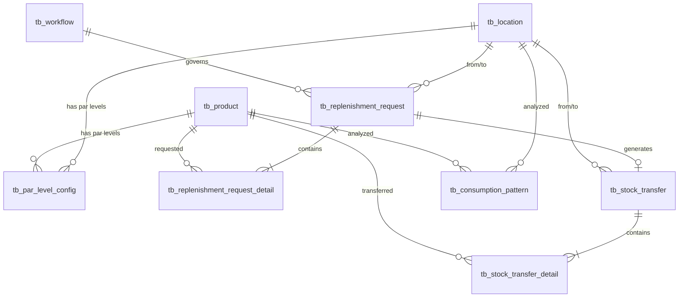

# DS-SREP: Stock Replenishment Data Definition

**Module**: Store Operations
**Sub-Module**: Stock Replenishment
**Document Type**: Data Schema (DS)
**Version**: 1.2.0
**Last Updated**: 2025-12-09
**Status**: Partially Implemented
**Implementation Status**: FRONTEND IMPLEMENTED (Mock data exists, database tables pending)

## Document History

| Version | Date | Author | Changes |
|---------|------|--------|---------|
| 1.2.0 | 2025-12-09 | Documentation Team | Updated to reflect implemented mock data structures |
| 1.1.0 | 2025-12-05 | Documentation Team | Added implementation status, clarified proposed state |
| 1.0.0 | 2025-11-19 | Documentation Team | Initial version |

---

**✅ IMPLEMENTATION NOTE**: The Stock Replenishment module has been implemented with:

**Implemented (Mock Data)**:
- ✅ Mock data structures in `lib/mock-data/stock-replenishment.ts`
- ✅ Status values: `pending`, `approved`, `in_transit`, `completed`, `rejected`, `cancelled`
- ✅ Priority values: `standard`, `high`, `urgent`
- ✅ Critical alerts data
- ✅ Par level configurations
- ✅ Stock level data by location
- ✅ Replenishment requests with status tracking
- ✅ Transfer history data

**Pending (Database)**:
- ❌ Database tables not yet created
- ❌ Prisma migrations pending
- ❌ Server actions pending

See BR-stock-replenishment.md Section 1.4 for full implementation status.

---

## 1. Overview

### 1.1 Purpose

| 1.1.0 | 2025-11-15 | Documentation Team | Migrated from DS to DD format |

This document defines the complete database schema for the Stock Replenishment module. As these tables do not exist in the current schema, this represents a **proposed** design based on business requirements.

### 1.2 Schema Summary

**Proposed Tables**: 6 new tables
- `tb_par_level_config` - Par level configurations
- `tb_replenishment_request` - Replenishment requests (header)
- `tb_replenishment_request_detail` - Request line items
- `tb_stock_transfer` - Stock transfers (header)
- `tb_stock_transfer_detail` - Transfer line items
- `tb_consumption_pattern` - Consumption analytics cache

**Relationships with Existing Tables**:
- `tb_location` - Locations (from/to)
- `tb_product` - Products
- `tb_workflow` - Approval workflows
- `tb_inventory_transaction` - Inventory movements

---

## 2. Entity Relationship Diagram



---

## 3. Table Definitions

### 3.1 tb_par_level_config

**Purpose**: Stores par level, reorder point, and minimum level configurations for products at specific locations.

**Table Structure**:

| Column | Type | Constraints | Description |
|--------|------|-------------|-------------|
| id | UUID | PK, DEFAULT gen_random_uuid() | Primary key |
| location_id | UUID | NOT NULL, FK → tb_location | Location reference |
| location_name | VARCHAR | | Denormalized location name |
| product_id | UUID | NOT NULL | Product reference |
| product_name | VARCHAR | | Denormalized product name |
| product_code | VARCHAR | | Denormalized product code |
| par_level | DECIMAL(20,5) | NOT NULL | Target inventory level (maximum) |
| reorder_point | DECIMAL(20,5) | NOT NULL | Level to trigger replenishment |
| minimum_level | DECIMAL(20,5) | NOT NULL | Critical threshold (30% of par) |
| maximum_level | DECIMAL(20,5) | | Optional ceiling level |
| lead_time_days | INTEGER | DEFAULT 2 | Days from request to receipt |
| safety_stock | DECIMAL(20,5) | | Buffer for demand variability |
| seasonal_config | JSON | | Seasonal multipliers configuration |
| special_notes | VARCHAR | | Configuration notes |
| status | enum_par_status | DEFAULT 'active' | active, inactive, pending_review |
| approval_status | enum_approval_status | DEFAULT 'approved' | pending, approved, rejected |
| approved_by_id | UUID | | Approver user ID |
| approved_by_name | VARCHAR | | Approver name |
| approved_at | TIMESTAMPTZ(6) | | Approval timestamp |
| last_reviewed_at | TIMESTAMPTZ(6) | | Last review date |
| next_review_date | TIMESTAMPTZ(6) | | Scheduled review date |
| created_at | TIMESTAMPTZ(6) | DEFAULT now() | Creation timestamp |
| created_by_id | UUID | | Creator user ID |
| updated_at | TIMESTAMPTZ(6) | DEFAULT now() | Last update timestamp |
| updated_by_id | UUID | | Last updater user ID |
| deleted_at | TIMESTAMPTZ(6) | | Soft delete timestamp |
| deleted_by_id | UUID | | Deleter user ID |

**Constraints**:
- `UNIQUE (location_id, product_id)` - One par level per product per location
- `CHECK (par_level > 0)` - Par level must be positive
- `CHECK (reorder_point < par_level)` - Reorder point below par level
- `CHECK (minimum_level < reorder_point)` - Minimum below reorder point

**Indexes**:
```sql
CREATE UNIQUE INDEX par_level_location_product_unique ON tb_par_level_config(location_id, product_id);
CREATE INDEX par_level_location_idx ON tb_par_level_config(location_id);
CREATE INDEX par_level_product_idx ON tb_par_level_config(product_id);
CREATE INDEX par_level_status_idx ON tb_par_level_config(status);
CREATE INDEX par_level_approval_idx ON tb_par_level_config(approval_status) WHERE approval_status = 'pending';
```

**Seasonal Config JSON Structure**:
```json
{
  "summer": {
    "months": [6, 7, 8],
    "multiplier": 1.5
  },
  "winter": {
    "months": [12, 1, 2],
    "multiplier": 0.7
  },
  "holiday": {
    "dates": ['2025-12-24', '2025-12-25', '2025-12-31'],
    "multiplier": 1.8
  }
}
```

**Sample Data**:
```sql
INSERT INTO tb_par_level_config (
  id, location_id, location_name, product_id, product_name, product_code,
  par_level, reorder_point, minimum_level, lead_time_days, safety_stock,
  status, approval_status, created_by_id
) VALUES
(
  '550e8400-e29b-41d4-a716-446655440001',
  '550e8400-e29b-41d4-a716-446655440100', -- Downtown Kitchen
  'Downtown Kitchen',
  '550e8400-e29b-41d4-a716-446655440200', -- Olive Oil Premium
  'Olive Oil - Premium',
  'OLV-PREM-001',
  20.0, -- Par level: 20 liters
  8.0,  -- Reorder at 40%: 8 liters
  6.0,  -- Minimum at 30%: 6 liters
  2,    -- Lead time: 2 days
  4.0,  -- Safety stock: 4 liters
  'active',
  'approved',
  '550e8400-e29b-41d4-a716-446655440300' -- Maria (Store Manager)
);
```

---

### 3.2 tb_replenishment_request

**Purpose**: Header table for transfer requests from locations.

**Table Structure**:

| Column | Type | Constraints | Description |
|--------|------|-------------|-------------|
| id | UUID | PK, DEFAULT gen_random_uuid() | Primary key |
| request_no | VARCHAR | UNIQUE, NOT NULL | Format: REP-YYMM-NNNN |
| request_date | TIMESTAMPTZ(6) | NOT NULL | Request creation date |
| required_by_date | TIMESTAMPTZ(6) | NOT NULL | Required delivery date |
| from_location_id | UUID | NOT NULL, FK → tb_location | Source (warehouse) |
| from_location_name | VARCHAR | | Denormalized name |
| to_location_id | UUID | NOT NULL, FK → tb_location | Destination (requesting location) |
| to_location_name | VARCHAR | | Denormalized name |
| priority | enum_request_priority | DEFAULT 'standard' | emergency, high, standard, low |
| status | enum_request_status | DEFAULT 'pending' | Lifecycle status |
| reason | VARCHAR | | Request justification |
| special_instructions | VARCHAR | | Special handling notes |
| total_items | INTEGER | DEFAULT 0 | Count of line items |
| total_value_estimated | DECIMAL(20,2) | | Estimated total value |
| workflow_id | UUID | FK → tb_workflow | Approval workflow |
| workflow_name | VARCHAR | | Workflow name |
| workflow_history | JSON | | Approval tracking |
| workflow_current_stage | VARCHAR | | Current approval stage |
| requestor_id | UUID | NOT NULL | Requesting user |
| requestor_name | VARCHAR | | Requestor name |
| department_id | UUID | | Requesting department |
| department_name | VARCHAR | | Department name |
| approved_by_id | UUID | | Approver user ID |
| approved_by_name | VARCHAR | | Approver name |
| approved_at | TIMESTAMPTZ(6) | | Approval timestamp |
| approval_comments | VARCHAR | | Approval notes |
| rejected_by_id | UUID | | Rejector user ID |
| rejected_by_name | VARCHAR | | Rejector name |
| rejected_at | TIMESTAMPTZ(6) | | Rejection timestamp |
| rejection_reason | VARCHAR | | Rejection explanation |
| transfer_id | UUID | FK → tb_stock_transfer | Linked transfer |
| doc_version | DECIMAL | DEFAULT 0 | Optimistic locking |
| created_at | TIMESTAMPTZ(6) | DEFAULT now() | Creation timestamp |
| created_by_id | UUID | | Creator user ID |
| updated_at | TIMESTAMPTZ(6) | DEFAULT now() | Update timestamp |
| updated_by_id | UUID | | Updater user ID |
| deleted_at | TIMESTAMPTZ(6) | | Soft delete timestamp |
| deleted_by_id | UUID | | Deleter user ID |

**Enums**:
```sql
CREATE TYPE enum_request_priority AS ENUM ('emergency', 'high', 'standard', 'low');
CREATE TYPE enum_request_status AS ENUM (
  'draft', 'pending', 'approved', 'partially_approved',
  'rejected', 'in_transit', 'completed', 'cancelled'
);
```

**Indexes**:
```sql
CREATE UNIQUE INDEX replenishment_request_no_unique ON tb_replenishment_request(request_no);
CREATE INDEX replenishment_request_no_idx ON tb_replenishment_request(request_no);
CREATE INDEX replenishment_status_idx ON tb_replenishment_request(status);
CREATE INDEX replenishment_priority_idx ON tb_replenishment_request(priority);
CREATE INDEX replenishment_to_location_idx ON tb_replenishment_request(to_location_id);
CREATE INDEX replenishment_required_by_idx ON tb_replenishment_request(required_by_date);
CREATE INDEX replenishment_requestor_idx ON tb_replenishment_request(requestor_id);
```

**Sample Data**:
```sql
INSERT INTO tb_replenishment_request (
  id, request_no, request_date, required_by_date,
  from_location_id, from_location_name,
  to_location_id, to_location_name,
  priority, status, reason, total_items,
  requestor_id, requestor_name, created_by_id
) VALUES
(
  '550e8400-e29b-41d4-a716-446655440010',
  'TRF-2501-0001',
  '2025-01-30 10:00:00+00',
  '2025-01-31 12:00:00+00',
  '550e8400-e29b-41d4-a716-446655440101', -- Central Warehouse
  'Central Warehouse',
  '550e8400-e29b-41d4-a716-446655440100', -- Downtown Kitchen
  'Downtown Kitchen',
  'high',
  'pending',
  'Critical items below minimum + special event Friday',
  4,
  '550e8400-e29b-41d4-a716-446655440300', -- Maria
  'Maria Santos',
  '550e8400-e29b-41d4-a716-446655440300'
);
```

---

### 3.3 tb_replenishment_request_detail

**Purpose**: Line items for transfer requests.

**Table Structure**:

| Column | Type | Constraints | Description |
|--------|------|-------------|-------------|
| id | UUID | PK, DEFAULT gen_random_uuid() | Primary key |
| replenishment_request_id | UUID | NOT NULL, FK → tb_replenishment_request | Parent request |
| sequence_no | INTEGER | DEFAULT 1 | Line item order |
| product_id | UUID | NOT NULL | Product reference |
| product_name | VARCHAR | | Denormalized product name |
| product_code | VARCHAR | | Denormalized product code |
| current_stock_level | DECIMAL(20,5) | | Stock at request time |
| par_level | DECIMAL(20,5) | | Par level reference |
| requested_qty | DECIMAL(20,5) | NOT NULL | Quantity requested |
| approved_qty | DECIMAL(20,5) | | Quantity approved |
| transferred_qty | DECIMAL(20,5) | | Quantity actually transferred |
| unit_cost_estimated | DECIMAL(20,2) | | Estimated unit cost |
| total_cost_estimated | DECIMAL(20,2) | | Line total cost |
| warehouse_availability | DECIMAL(20,5) | | Available at warehouse |
| item_status | enum_line_item_status | DEFAULT 'pending' | Line item status |
| approval_comments | VARCHAR | | Item-level approval notes |
| rejection_reason | VARCHAR | | Item-level rejection reason |
| approved_by_id | UUID | | Item approver |
| approved_by_name | VARCHAR | | Approver name |
| approved_at | TIMESTAMPTZ(6) | | Item approval time |
| created_at | TIMESTAMPTZ(6) | DEFAULT now() | Creation timestamp |
| created_by_id | UUID | | Creator user ID |
| updated_at | TIMESTAMPTZ(6) | DEFAULT now() | Update timestamp |
| updated_by_id | UUID | | Updater user ID |

**Enum**:
```sql
CREATE TYPE enum_line_item_status AS ENUM (
  'pending', 'approved', 'partially_approved', 'rejected', 'transferred'
);
```

**Indexes**:
```sql
CREATE INDEX replenishment_detail_request_idx ON tb_replenishment_request_detail(replenishment_request_id);
CREATE INDEX replenishment_detail_product_idx ON tb_replenishment_request_detail(product_id);
CREATE INDEX replenishment_detail_status_idx ON tb_replenishment_request_detail(item_status);
```

**Foreign Key**:
```sql
ALTER TABLE tb_replenishment_request_detail
  ADD CONSTRAINT fk_replenishment_detail_request
  FOREIGN KEY (replenishment_request_id)
  REFERENCES tb_replenishment_request(id)
  ON DELETE CASCADE;
```

---

### 3.4 tb_stock_transfer

**Purpose**: Header table for stock transfers between locations.

**Table Structure**:

| Column | Type | Constraints | Description |
|--------|------|-------------|-------------|
| id | UUID | PK, DEFAULT gen_random_uuid() | Primary key |
| transfer_no | VARCHAR | UNIQUE, NOT NULL | Format: TRF-YYMM-NNNN |
| transfer_date | TIMESTAMPTZ(6) | NOT NULL | Transfer creation date |
| from_location_id | UUID | NOT NULL, FK → tb_location | Source location |
| from_location_name | VARCHAR | | Source name |
| to_location_id | UUID | NOT NULL, FK → tb_location | Destination location |
| to_location_name | VARCHAR | | Destination name |
| status | enum_transfer_status | DEFAULT 'scheduled' | Transfer lifecycle status |
| scheduled_date | TIMESTAMPTZ(6) | | Planned transfer date |
| dispatched_at | TIMESTAMPTZ(6) | | Actual dispatch timestamp |
| delivered_at | TIMESTAMPTZ(6) | | Delivery timestamp |
| received_at | TIMESTAMPTZ(6) | | Receipt confirmation time |
| total_items | INTEGER | DEFAULT 0 | Count of items |
| total_weight_kg | DECIMAL(10,2) | | Total shipment weight |
| packing_notes | VARCHAR | | Packing instructions |
| delivery_notes | VARCHAR | | Delivery notes |
| receiving_notes | VARCHAR | | Receipt notes |
| driver_name | VARCHAR | | Delivery driver name |
| vehicle_number | VARCHAR | | Vehicle registration |
| prepared_by_id | UUID | | Warehouse picker |
| prepared_by_name | VARCHAR | | Picker name |
| dispatched_by_id | UUID | | Dispatcher |
| dispatched_by_name | VARCHAR | | Dispatcher name |
| received_by_id | UUID | | Receiver |
| received_by_name | VARCHAR | | Receiver name |
| discrepancy_reported | BOOLEAN | DEFAULT false | Has discrepancies |
| discrepancy_notes | VARCHAR | | Discrepancy details |
| created_at | TIMESTAMPTZ(6) | DEFAULT now() | Creation timestamp |
| created_by_id | UUID | | Creator user ID |
| updated_at | TIMESTAMPTZ(6) | DEFAULT now() | Update timestamp |
| updated_by_id | UUID | | Updater user ID |

**Enum**:
```sql
CREATE TYPE enum_transfer_status AS ENUM (
  'scheduled', 'preparing', 'ready_for_dispatch',
  'in_transit', 'partially_received', 'completed', 'cancelled'
);
```

**Indexes**:
```sql
CREATE UNIQUE INDEX stock_transfer_no_unique ON tb_stock_transfer(transfer_no);
CREATE INDEX stock_transfer_no_idx ON tb_stock_transfer(transfer_no);
CREATE INDEX stock_transfer_status_idx ON tb_stock_transfer(status);
CREATE INDEX stock_transfer_to_location_idx ON tb_stock_transfer(to_location_id);
CREATE INDEX stock_transfer_from_location_idx ON tb_stock_transfer(from_location_id);
CREATE INDEX stock_transfer_scheduled_idx ON tb_stock_transfer(scheduled_date);
```

---

### 3.5 tb_stock_transfer_detail

**Purpose**: Line items for stock transfers.

**Table Structure**:

| Column | Type | Constraints | Description |
|--------|------|-------------|-------------|
| id | UUID | PK, DEFAULT gen_random_uuid() | Primary key |
| stock_transfer_id | UUID | NOT NULL, FK → tb_stock_transfer | Parent transfer |
| sequence_no | INTEGER | DEFAULT 1 | Line item order |
| product_id | UUID | NOT NULL | Product reference |
| product_name | VARCHAR | | Product name |
| product_code | VARCHAR | | Product code |
| requested_qty | DECIMAL(20,5) | NOT NULL | Quantity requested |
| dispatched_qty | DECIMAL(20,5) | | Quantity dispatched |
| received_qty | DECIMAL(20,5) | | Quantity received |
| batch_lot_no | VARCHAR | | Batch/lot number |
| expiry_date | TIMESTAMPTZ(6) | | Product expiry date |
| quality_check_passed | BOOLEAN | DEFAULT true | QC result |
| quality_notes | VARCHAR | | Quality observations |
| discrepancy | BOOLEAN | DEFAULT false | Quantity mismatch |
| discrepancy_qty | DECIMAL(20,5) | | Difference amount |
| discrepancy_reason | VARCHAR | | Discrepancy explanation |
| inventory_issue_txn_id | UUID | | Issue transaction ID |
| inventory_receipt_txn_id | UUID | | Receipt transaction ID |
| created_at | TIMESTAMPTZ(6) | DEFAULT now() | Creation timestamp |
| created_by_id | UUID | | Creator user ID |
| updated_at | TIMESTAMPTZ(6) | DEFAULT now() | Update timestamp |
| updated_by_id | UUID | | Updater user ID |

**Indexes**:
```sql
CREATE INDEX stock_transfer_detail_transfer_idx ON tb_stock_transfer_detail(stock_transfer_id);
CREATE INDEX stock_transfer_detail_product_idx ON tb_stock_transfer_detail(product_id);
CREATE INDEX stock_transfer_detail_discrepancy_idx ON tb_stock_transfer_detail(discrepancy) WHERE discrepancy = true;
```

---

### 3.6 tb_consumption_pattern

**Purpose**: Cached consumption analytics (updated daily by background job).

**Table Structure**:

| Column | Type | Constraints | Description |
|--------|------|-------------|-------------|
| id | UUID | PK, DEFAULT gen_random_uuid() | Primary key |
| location_id | UUID | NOT NULL | Location analyzed |
| product_id | UUID | NOT NULL | Product analyzed |
| analysis_period_start | TIMESTAMPTZ(6) | NOT NULL | Period start date |
| analysis_period_end | TIMESTAMPTZ(6) | NOT NULL | Period end date |
| period_days | INTEGER | NOT NULL | Days in analysis period |
| total_consumption | DECIMAL(20,5) | NOT NULL | Total consumed |
| average_daily_consumption | DECIMAL(20,5) | NOT NULL | Daily average |
| peak_daily_consumption | DECIMAL(20,5) | NOT NULL | Maximum day |
| minimum_daily_consumption | DECIMAL(20,5) | NOT NULL | Minimum day |
| consumption_trend | VARCHAR | | increasing, stable, decreasing |
| trend_percentage | DECIMAL(10,2) | | % change |
| variability_coefficient | DECIMAL(10,4) | | Standard deviation / mean |
| stockout_incidents | INTEGER | DEFAULT 0 | Count of stockouts |
| days_out_of_stock | INTEGER | DEFAULT 0 | Total days OOS |
| recommended_par_level | DECIMAL(20,5) | | System recommendation |
| recommended_reorder_point | DECIMAL(20,5) | | System recommendation |
| last_calculated_at | TIMESTAMPTZ(6) | NOT NULL | Last analysis run |
| created_at | TIMESTAMPTZ(6) | DEFAULT now() | Creation timestamp |
| updated_at | TIMESTAMPTZ(6) | DEFAULT now() | Update timestamp |

**Constraints**:
```sql
ALTER TABLE tb_consumption_pattern
  ADD CONSTRAINT consumption_location_product_period_unique
  UNIQUE (location_id, product_id, analysis_period_start);
```

**Indexes**:
```sql
CREATE INDEX consumption_location_idx ON tb_consumption_pattern(location_id);
CREATE INDEX consumption_product_idx ON tb_consumption_pattern(product_id);
CREATE INDEX consumption_calculated_idx ON tb_consumption_pattern(last_calculated_at);
CREATE INDEX consumption_trend_idx ON tb_consumption_pattern(consumption_trend);
```

---

## 4. Enums Summary

```sql
-- Par Level Status
CREATE TYPE enum_par_status AS ENUM ('active', 'inactive', 'pending_review');

-- Approval Status
CREATE TYPE enum_approval_status AS ENUM ('pending', 'approved', 'rejected');

-- Request Priority
CREATE TYPE enum_request_priority AS ENUM ('emergency', 'high', 'standard', 'low');

-- Request Status
CREATE TYPE enum_request_status AS ENUM (
  'draft', 'pending', 'approved', 'partially_approved',
  'rejected', 'in_transit', 'completed', 'cancelled'
);

-- Line Item Status
CREATE TYPE enum_line_item_status AS ENUM (
  'pending', 'approved', 'partially_approved', 'rejected', 'transferred'
);

-- Transfer Status
CREATE TYPE enum_transfer_status AS ENUM (
  'scheduled', 'preparing', 'ready_for_dispatch',
  'in_transit', 'partially_received', 'completed', 'cancelled'
);
```

---

## 5. Relationships Summary

**One-to-Many Relationships**:
- `tb_location` → `tb_par_level_config` (location has many par levels)
- `tb_product` → `tb_par_level_config` (product has many par levels across locations)
- `tb_location` → `tb_replenishment_request` (location has many requests as from/to)
- `tb_replenishment_request` → `tb_replenishment_request_detail` (request has many items)
- `tb_product` → `tb_replenishment_request_detail` (product in many requests)
- `tb_location` → `tb_stock_transfer` (location has many transfers as from/to)
- `tb_stock_transfer` → `tb_stock_transfer_detail` (transfer has many items)
- `tb_product` → `tb_stock_transfer_detail` (product in many transfers)
- `tb_location` → `tb_consumption_pattern` (location has many consumption patterns)
- `tb_product` → `tb_consumption_pattern` (product has many consumption patterns)
- `tb_workflow` → `tb_replenishment_request` (workflow governs many requests)

**One-to-One Relationships**:
- `tb_replenishment_request` → `tb_stock_transfer` (request generates one transfer)

---

## 6. Indexing Strategy

### 6.1 Primary Indexes
All tables use UUID primary key with `gen_random_uuid()` default.

### 6.2 Business Key Indexes
- `request_no` and `transfer_no` - Unique constraints with indexes for lookups

### 6.3 Foreign Key Indexes
- Indexes on all `location_id` and `product_id` columns for join performance

### 6.4 Status Indexes
- Indexes on `status`, `priority`, and `approval_status` for filtering active records

### 6.5 Date Indexes
- `required_by_date`, `scheduled_date` for date-range queries
- `last_calculated_at` for analytics cache freshness

### 6.6 Composite Indexes
```sql
-- For par level uniqueness
CREATE UNIQUE INDEX par_level_location_product_unique
  ON tb_par_level_config(location_id, product_id);

-- For consumption pattern uniqueness
CREATE UNIQUE INDEX consumption_location_product_period_unique
  ON tb_consumption_pattern(location_id, product_id, analysis_period_start);
```

### 6.7 Partial Indexes
```sql
-- Index only pending approvals
CREATE INDEX par_level_approval_idx
  ON tb_par_level_config(approval_status)
  WHERE approval_status = 'pending';

-- Index only active discrepancies
CREATE INDEX stock_transfer_detail_discrepancy_idx
  ON tb_stock_transfer_detail(discrepancy)
  WHERE discrepancy = true;
```

---

## 7. Data Integrity Rules

### 7.1 Referential Integrity
- Foreign keys enforce relationships to `tb_location`, `tb_product`, `tb_workflow`
- Cascade delete on detail tables when header deleted
- Cannot delete locations/products with active par levels or requests

### 7.2 Domain Integrity
- CHECK constraints ensure positive quantities and logical value ranges
- ENUM types restrict status fields to valid values
- NOT NULL constraints on critical fields

### 7.3 Entity Integrity
- Primary key constraints on all tables
- Unique constraints on business keys (request_no, transfer_no)
- Composite unique constraints for natural keys

### 7.4 Business Rule Integrity
```sql
-- Par level relationships
ALTER TABLE tb_par_level_config
  ADD CONSTRAINT chk_par_level_positive CHECK (par_level > 0);

ALTER TABLE tb_par_level_config
  ADD CONSTRAINT chk_reorder_below_par CHECK (reorder_point < par_level);

ALTER TABLE tb_par_level_config
  ADD CONSTRAINT chk_minimum_below_reorder CHECK (minimum_level < reorder_point);

-- Request quantities
ALTER TABLE tb_replenishment_request_detail
  ADD CONSTRAINT chk_requested_qty_positive CHECK (requested_qty > 0);

ALTER TABLE tb_replenishment_request_detail
  ADD CONSTRAINT chk_approved_lte_requested
  CHECK (approved_qty IS NULL OR approved_qty <= requested_qty);

-- Transfer quantities
ALTER TABLE tb_stock_transfer_detail
  ADD CONSTRAINT chk_dispatched_lte_requested
  CHECK (dispatched_qty IS NULL OR dispatched_qty <= requested_qty);
```

---

## 8. Sample Data Examples

### 8.1 Complete Par Level Configuration

```sql
-- Par Level for Olive Oil at Downtown Kitchen
INSERT INTO tb_par_level_config VALUES (
  '550e8400-e29b-41d4-a716-446655440001',
  '550e8400-e29b-41d4-a716-446655440100', -- Downtown Kitchen
  'Downtown Kitchen',
  '550e8400-e29b-41d4-a716-446655440200', -- Olive Oil Premium
  'Olive Oil - Premium',
  'OLV-PREM-001',
  20.0, 8.0, 6.0, NULL, 2, 4.0,
  '{"summer": {"months": [6,7,8], "multiplier": 1.2}}',
  'High demand on weekends',
  'active', 'approved',
  '550e8400-e29b-41d4-a716-446655440300',
  'Maria Santos',
  '2025-01-15 09:00:00+00',
  '2025-01-15 09:00:00+00',
  '2025-04-15 09:00:00+00',
  '2025-01-15 09:00:00+00',
  '550e8400-e29b-41d4-a716-446655440300',
  '2025-01-15 09:00:00+00',
  '550e8400-e29b-41d4-a716-446655440300',
  NULL, NULL
);
```

### 8.2 Complete Transfer Request

```sql
-- Transfer Request
INSERT INTO tb_replenishment_request VALUES (
  '550e8400-e29b-41d4-a716-446655440010',
  'TRF-2501-0001',
  '2025-01-30 10:00:00+00',
  '2025-01-31 12:00:00+00',
  '550e8400-e29b-41d4-a716-446655440101', 'Central Warehouse',
  '550e8400-e29b-41d4-a716-446655440100', 'Downtown Kitchen',
  'high', 'approved',
  'Critical items below minimum + special event Friday',
  'Refrigerated items - maintain cold chain',
  4, 320.00,
  NULL, NULL, NULL, NULL,
  '550e8400-e29b-41d4-a716-446655440300', 'Maria Santos',
  '550e8400-e29b-41d4-a716-446655440400', 'Food & Beverage',
  '550e8400-e29b-41d4-a716-446655440500', 'William Chen',
  '2025-01-30 11:00:00+00',
  'All items approved as requested',
  NULL, NULL, NULL, NULL,
  '550e8400-e29b-41d4-a716-446655440020', -- transfer_id
  0,
  '2025-01-30 10:00:00+00', '550e8400-e29b-41d4-a716-446655440300',
  '2025-01-30 11:00:00+00', '550e8400-e29b-41d4-a716-446655440500',
  NULL, NULL
);

-- Request Detail (Line Item)
INSERT INTO tb_replenishment_request_detail VALUES (
  '550e8400-e29b-41d4-a716-446655440011',
  '550e8400-e29b-41d4-a716-446655440010', 1,
  '550e8400-e29b-41d4-a716-446655440200',
  'Olive Oil - Premium', 'OLV-PREM-001',
  9.0, 20.0,
  15.0, 15.0, 15.0,
  5.00, 75.00,
  45.0,
  'approved',
  NULL, NULL,
  '550e8400-e29b-41d4-a716-446655440500', 'William Chen',
  '2025-01-30 11:00:00+00',
  '2025-01-30 10:00:00+00', '550e8400-e29b-41d4-a716-446655440300',
  '2025-01-30 11:00:00+00', '550e8400-e29b-41d4-a716-446655440500'
);
```

### 8.3 Complete Stock Transfer

```sql
-- Stock Transfer
INSERT INTO tb_stock_transfer VALUES (
  '550e8400-e29b-41d4-a716-446655440020',
  'TRF-2501-0001',
  '2025-01-30 11:00:00+00',
  '550e8400-e29b-41d4-a716-446655440101', 'Central Warehouse',
  '550e8400-e29b-41d4-a716-446655440100', 'Downtown Kitchen',
  'completed',
  '2025-01-31 08:00:00+00',
  '2025-01-31 08:00:00+00',
  '2025-01-31 09:00:00+00',
  '2025-01-31 09:15:00+00',
  4, 42.0,
  '2 boxes - 1 refrigerated, 1 ambient',
  'Courier delivery - John Doe',
  'All items received in good condition',
  'John Doe', 'VAN-001',
  '550e8400-e29b-41d4-a716-446655440501', 'Warehouse Staff A',
  '550e8400-e29b-41d4-a716-446655440502', 'Warehouse Staff B',
  '550e8400-e29b-41d4-a716-446655440300', 'Maria Santos',
  false, NULL,
  '2025-01-30 11:00:00+00', '550e8400-e29b-41d4-a716-446655440500',
  '2025-01-31 09:15:00+00', '550e8400-e29b-41d4-a716-446655440300'
);

-- Transfer Detail
INSERT INTO tb_stock_transfer_detail VALUES (
  '550e8400-e29b-41d4-a716-446655440021',
  '550e8400-e29b-41d4-a716-446655440020', 1,
  '550e8400-e29b-41d4-a716-446655440200',
  'Olive Oil - Premium', 'OLV-PREM-001',
  15.0, 15.0, 15.0,
  'LOT-2025-01-15', '2026-01-15 00:00:00+00',
  true, NULL,
  false, NULL, NULL,
  '550e8400-e29b-41d4-a716-446655440901', -- issue txn
  '550e8400-e29b-41d4-a716-446655440902', -- receipt txn
  '2025-01-30 11:00:00+00', '550e8400-e29b-41d4-a716-446655440500',
  '2025-01-31 09:15:00+00', '550e8400-e29b-41d4-a716-446655440300'
);
```

### 8.4 Consumption Pattern

```sql
INSERT INTO tb_consumption_pattern VALUES (
  '550e8400-e29b-41d4-a716-446655440030',
  '550e8400-e29b-41d4-a716-446655440100', -- Downtown Kitchen
  '550e8400-e29b-41d4-a716-446655440200', -- Olive Oil Premium
  '2024-12-31 00:00:00+00', '2025-01-30 00:00:00+00', 30,
  75.0, 2.5, 4.0, 1.2,
  'increasing', 12.0,
  0.35,
  0, 0,
  28.0, 11.2,
  '2025-01-30 02:00:00+00',
  '2025-01-30 02:00:00+00', '2025-01-30 02:00:00+00'
);
```

---

## 9. Performance Considerations

### 9.1 Query Optimization
- Use covering indexes for common query patterns
- Materialized view for replenishment dashboard (refresh hourly)
- Partition `tb_consumption_pattern` by year if data volume grows

### 9.2 Data Archival
- Archive completed requests/transfers older than 12 months
- Keep consumption patterns for 24 months (2 years for trending)
- Soft delete par levels (deleted_at) with periodic hard delete

### 9.3 Monitoring
- Track table growth rates
- Monitor slow queries
- Index usage statistics

---

## 10. Security Considerations

### 10.1 Row-Level Security (RLS)

```sql
-- Example RLS policies
ALTER TABLE tb_par_level_config ENABLE ROW LEVEL SECURITY;

CREATE POLICY par_level_location_access ON tb_par_level_config
  USING (location_id IN (
    SELECT location_id FROM user_location_access WHERE user_id = current_user_id()
  ));

ALTER TABLE tb_replenishment_request ENABLE ROW LEVEL SECURITY;

CREATE POLICY request_requester_or_approver ON tb_replenishment_request
  USING (
    requestor_id = current_user_id() OR
    approved_by_id = current_user_id() OR
    has_permission(current_user_id(), 'view_all_requests')
  );
```

### 10.2 Audit Fields
All tables include:
- `created_at`, `created_by_id`
- `updated_at`, `updated_by_id`
- `deleted_at`, `deleted_by_id` (soft delete pattern)

---

## 11. Related Documents

- **Business Requirements**: [BR-stock-replenishment.md](./BR-stock-replenishment.md)
- **Use Cases**: [UC-stock-replenishment.md](./UC-stock-replenishment.md)
- **Technical Specification**: [TS-stock-replenishment.md](./TS-stock-replenishment.md)
- **Flow Diagrams**: [FD-stock-replenishment.md](./FD-stock-replenishment.md)
- **Validations**: [VAL-stock-replenishment.md](./VAL-stock-replenishment.md)
- **Schema Reference**: `/docs/app/data-struc/schema.prisma`

---

**Document Control**:
- **Created**: 2025-11-12
- **Author**: Documentation Team
- **Reviewed By**: Database Architect, Technical Lead
- **Approved By**: Chief Technology Officer
- **Next Review**: 2026-01-09
- **Version History**:
  - v1.2.0 (2025-12-09): Updated to reflect implemented mock data structures
  - v1.0.0 (2025-11-12): Initial proposed schema documentation

---

**End of Document**
