# Flow Diagrams: Stock Replenishment

## Module Information
- **Module**: Store Operations
- **Sub-Module**: Stock Replenishment
- **Version**: 1.2.0
- **Last Updated**: 2025-12-09
- **Owner**: Operations Team
- **Status**: Active
- **Implementation Status**: IMPLEMENTED (Frontend UI Complete with Mock Data)

## Document History
| Version | Date | Author | Changes |
|---------|------|--------|---------|
| 1.2.0 | 2025-12-09 | Documentation Team | Updated to reflect implemented frontend UI and workflows |
| 1.1.0 | 2025-12-05 | Documentation Team | Updated Mermaid diagrams for 8.8.2 compatibility, added implementation status |
| 1.0.0 | 2025-11-12 | Documentation Team | Initial version |

---

**✅ IMPLEMENTATION NOTE**: The Stock Replenishment module frontend has been fully implemented with comprehensive UI pages that follow these flow patterns. The workflows operate with mock data while backend integration is pending.

**Implemented Pages**:
- ✅ **Dashboard** (`/store-operations/stock-replenishment/`) - Critical alerts, consumption analytics, stock trends
- ✅ **New Request** (`/store-operations/stock-replenishment/new/`) - Request creation workflow
- ✅ **Requests List** (`/store-operations/stock-replenishment/requests/`) - Request queue with filters
- ✅ **Request Detail** (`/store-operations/stock-replenishment/requests/[id]/`) - Approval workflow
- ✅ **Stock Levels** (`/store-operations/stock-replenishment/stock-levels/`) - Par level monitoring
- ✅ **History** (`/store-operations/stock-replenishment/history/`) - Completed transfers

See BR-stock-replenishment.md Section 1.4 for complete implementation details.

---

## Overview

This document provides comprehensive flow diagrams for the Stock Replenishment module, visualizing all processes, data flows, and system interactions. These diagrams support proactive inventory management through automated monitoring, intelligent replenishment recommendations, and efficient stock transfer workflows.

**Key Processes Documented**:
- Par level configuration and management
- Automated inventory monitoring and alerting
- Replenishment request creation and approval
- Stock transfer execution and receipt
- Emergency replenishment procedures
- Consumption pattern analysis
- System integrations

**Related Documents**:
- [Business Requirements](./BR-stock-replenishment.md)
- [Use Cases](./UC-stock-replenishment.md)
- [Technical Specification](./TS-stock-replenishment.md)
- [Data Schema](./DD-stock-replenishment.md)
- [Validations](./VAL-stock-replenishment.md)

---

## Diagram Index

| Diagram | Type | Purpose | Complexity |
|---------|------|---------|------------|
| [High-Level Process Flow](#high-level-process-flow) | Process | End-to-end replenishment lifecycle | Medium |
| [Par Level Configuration](#par-level-configuration-flow) | Process | Configure and adjust par levels | Low |
| [Automated Monitoring](#automated-inventory-monitoring-flow) | Process | Real-time stock monitoring | Medium |
| [Replenishment Request Creation](#replenishment-request-creation-flow) | Process | Create from recommendations | Medium |
| [Manual Request Creation](#manual-replenishment-request-flow) | Process | Ad-hoc replenishment requests | Low |
| [Request Approval](#replenishment-request-approval-flow) | Process | Warehouse manager approval | High |
| [Stock Transfer Execution](#stock-transfer-execution-flow) | Process | Pick, pack, and dispatch | Medium |
| [Transfer Receipt](#stock-transfer-receipt-flow) | Process | Receive and confirm items | Medium |
| [Emergency Replenishment](#emergency-replenishment-flow) | Process | Urgent stockout handling | High |
| [Consumption Analysis](#consumption-pattern-analysis-flow) | Process | Pattern analysis and forecasting | Medium |
| [Request State Diagram](#replenishment-request-state-diagram) | State | Request status transitions | Medium |
| [Transfer State Diagram](#stock-transfer-state-diagram) | State | Transfer status transitions | Medium |
| [Context Diagram](#level-0-context-diagram) | Data | System context view | Low |
| [System Decomposition](#level-1-system-decomposition) | Data | Internal processes | Medium |
| [Approval Sequence](#request-approval-sequence-diagram) | Interaction | Approval workflow timing | High |
| [Transfer Sequence](#transfer-execution-sequence-diagram) | Interaction | Transfer execution timing | High |
| [Inventory Integration](#inventory-system-integration-flow) | Integration | Inventory sync | Medium |
| [Workflow Integration](#workflow-engine-integration-flow) | Integration | Approval routing | High |
| [Purchasing Integration](#purchasing-integration-flow) | Integration | Warehouse replenishment | Medium |

---

## Process Flow

### High-Level Process Flow

**Purpose**: Overview of the complete stock replenishment lifecycle from monitoring to receipt

**Actors**: Store Manager, Warehouse Manager, System

**Trigger**: Continuous monitoring or manual request

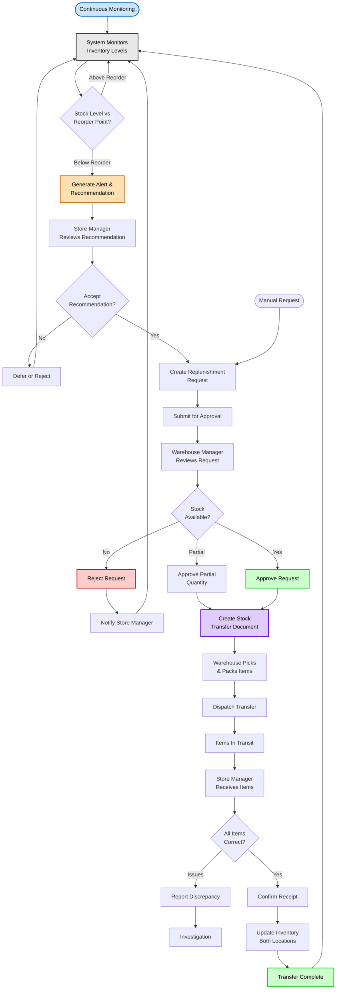

**Flow Steps**:

1. **Continuous Monitoring**: System monitors inventory levels in real-time
2. **Check Level**: Compare current stock against reorder point threshold
3. **Generate Alert**: Create recommendation when below reorder point
4. **Review**: Store Manager evaluates system recommendation
5. **Create Request**: Formal replenishment request generated
6. **Submit**: Request sent to Warehouse Manager for approval
7. **Check Stock**: Verify warehouse inventory availability
8. **Approve/Reject**: Warehouse Manager makes approval decision
9. **Create Transfer**: System generates stock transfer document
10. **Pick & Pack**: Warehouse team prepares items for transfer
11. **Dispatch**: Items loaded and sent to requesting location
12. **Receive**: Store Manager receives and verifies items
13. **Confirm**: Receipt confirmed and inventory updated
14. **Complete**: Process returns to continuous monitoring

**Exception Handling**:
- Stock unavailable: Request rejected with reason, purchasing alerted
- Partial availability: Partial approval with remainder tracked
- Receipt discrepancies: Investigation process triggered
- Emergency scenarios: Expedited path with immediate notifications

---

### Par Level Configuration Flow

**Purpose**: Configure target inventory levels (par) for items at locations

**Actor**: Store Manager Maria, Department Manager Daniel

**Trigger**: New item assignment, periodic review, or pattern changes

```mermaid
flowchart TD
    Start([Store Manager<br/>Initiates Configuration]) --> Search[Search for Item]
    Search --> SelectItem[Select Item]
    SelectItem --> GetDetails[System Retrieves:<br/>- Current stock<br/>- Historical consumption<br/>- Category averages]

    GetDetails --> Suggest[System Suggests<br/>Initial Par Level]
    Suggest --> Display[Display Suggestion<br/>with Rationale]

    Display --> Review[Store Manager<br/>Reviews Suggestion]
    Review --> Decision{Accept or<br/>Modify?}

    Decision -->|Accept| EnterPar[Enter Par Level<br/>as Suggested]
    Decision -->|Modify| CustomPar[Enter Custom<br/>Par Level]

    EnterPar --> EnterDetails
    CustomPar --> CheckChange{Change > 20%<br/>from Suggestion?}

    CheckChange -->|No| EnterDetails[Enter Additional Details:<br/>- Lead time<br/>- Special notes<br/>- Seasonal config]
    CheckChange -->|Yes| RequireJustify[Require Justification]
    RequireJustify --> EnterJustify[Enter Justification]
    EnterJustify --> EnterDetails

    EnterDetails --> Validate{Validation<br/>Passes?}

    Validate -->|Fail| ShowError[Show Validation<br/>Errors]
    ShowError --> Review

    Validate -->|Pass| Calculate[System Calculates:<br/>- Reorder Point = Par × 0.4<br/>- Minimum Level = Par × 0.3<br/>- Maximum = Par]

    Calculate --> NeedApproval{Requires<br/>Approval?}

    NeedApproval -->|No| Save[Save Configuration]
    NeedApproval -->|Yes| PendingApproval[Save as<br/>"Pending Approval"]

    PendingApproval --> NotifyMgr[Notify Department<br/>Manager]
    NotifyMgr --> MgrReview[Department Manager<br/>Reviews Request]
    MgrReview --> MgrDecision{Approve?}

    MgrDecision -->|No| Rejected[Reject with Feedback]
    Rejected --> NotifyStore[Notify Store Manager]
    NotifyStore --> End1([End: Rejected])

    MgrDecision -->|Yes| Approved[Approve Configuration]
    Approved --> Save

    Save --> Activate[Activate Monitoring<br/>with New Levels]
    Activate --> AuditLog[Record in Audit Log]
    AuditLog --> Success([End: Configured])

    style Start fill:#cce5ff,stroke:#0066cc,stroke-width:2px,color:#000
    style Suggest fill:#ffe0b3,stroke:#cc6600,stroke-width:2px,color:#000
    style Calculate fill:#e0ccff,stroke:#6600cc,stroke-width:2px,color:#000
    style Approved fill:#ccffcc,stroke:#00cc00,stroke-width:2px,color:#000
    style Rejected fill:#ffcccc,stroke:#cc0000,stroke-width:2px,color:#000
    style Success fill:#ccffcc,stroke:#00cc00,stroke-width:2px,color:#000
    style End1 fill:#ffcccc,stroke:#cc0000,stroke-width:2px,color:#000
```

**Decision Points**:

| Decision | Criteria | Outcome |
|----------|----------|---------|
| Accept or Modify | Store Manager judgment | Accept suggestion or enter custom value |
| Change > 20% | Absolute percentage difference | Requires justification and approval |
| Validation Passes | Par > 0, Par < capacity, etc. | Proceed or show errors |
| Requires Approval | Change >20% OR high-value item | Direct save or pending approval |
| Manager Approve | Business justification review | Approve or reject with feedback |

---

### Automated Inventory Monitoring Flow

**Purpose**: Real-time monitoring of stock levels with automated alert generation

**Actor**: System (automated), Store Manager (notification recipient)

**Trigger**: Inventory transaction (issue, transfer, adjustment) or scheduled check

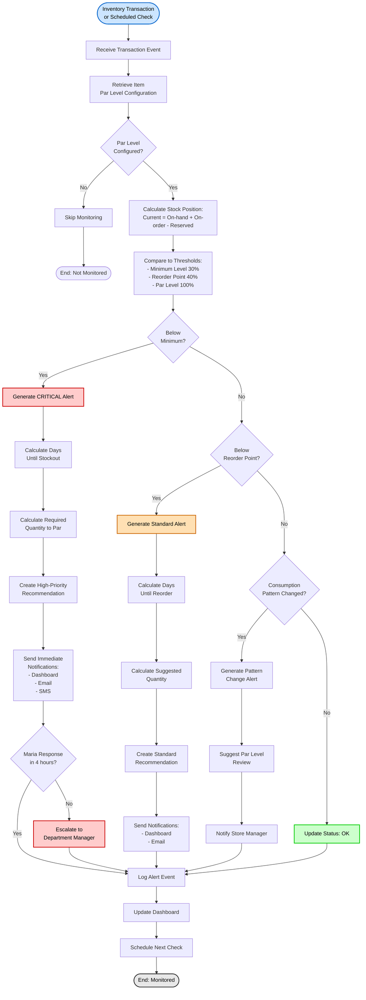

**Alert Levels**:

| Level | Threshold | Priority | Notifications | SLA Response |
|-------|-----------|----------|---------------|--------------|
| Critical | < 30% of par (minimum level) | High | Dashboard + Email + SMS | 4 hours |
| Standard | < 40% of par (reorder point) | Medium | Dashboard + Email | 24 hours |
| Pattern Change | Consumption ±25% over 7 days | Low | Dashboard + Email | 7 days |
| OK | Above reorder point | None | Dashboard status only | N/A |

---

### Replenishment Request Creation Flow

**Purpose**: Create replenishment request from system recommendations

**Actor**: Store Manager Maria

**Trigger**: Alert notification or dashboard review

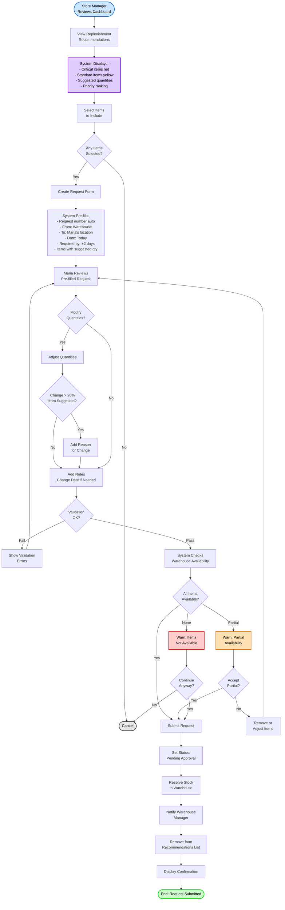

---

### Manual Replenishment Request Flow

**Purpose**: Create ad-hoc replenishment request without system recommendation

**Actor**: Store Manager Maria

**Trigger**: Special event, manual override, or new requirement

```mermaid
flowchart TD
    Start([Store Manager<br/>Initiates Manual Request]) --> BlankForm[Display Blank<br/>Request Form]
    BlankForm --> EnterDate[Enter Required Date<br/>& Priority]
    EnterDate --> EnterReason[Enter Justification/<br/>Reason for Request]

    EnterReason --> AddItems[Click "Add Items"]
    AddItems --> SearchItem[Search for Product]
    SearchItem --> SelectProd[Select Product]

    SelectProd --> ShowStock[System Shows:<br/>- Current stock<br/>- Par level if configured<br/>- Warehouse availability]

    ShowStock --> EnterQty[Enter Requested<br/>Quantity]
    EnterQty --> ItemNotes[Add Item-level<br/>Notes optional]
    ItemNotes --> AddToList[Add to Request List]

    AddToList --> MoreItems{Add More<br/>Items?}
    MoreItems -->|Yes| SearchItem
    MoreItems -->|No| ReviewList[Review Complete<br/>Request]

    ReviewList --> HasItems{Has at Least<br/>1 Item?}
    HasItems -->|No| Error1[Error: Minimum<br/>1 item required]
    Error1 --> AddItems

    HasItems -->|Yes| ValidateReq{Validation<br/>Passes?}

    ValidateReq -->|Fail| ShowErrors[Show Errors:<br/>- Quantities > 0<br/>- Future date<br/>- Justification provided]
    ShowErrors --> ReviewList

    ValidateReq -->|Pass| CalcValue[Calculate Total<br/>Estimated Value]
    CalcValue --> DetermineApproval[Determine Approval<br/>Requirements]

    DetermineApproval --> CheckValue{Total<br/>Value?}

    CheckValue -->|< $1,000| Tier1[Tier 1:<br/>Warehouse Manager Only]
    CheckValue -->|$1K - $5K| Tier2[Tier 2:<br/>Warehouse + Store Manager]
    CheckValue -->|> $5,000| Tier3[Tier 3:<br/>+ Department Manager]

    Tier1 --> CheckPriority
    Tier2 --> CheckPriority
    Tier3 --> CheckPriority{Priority =<br/>Urgent?}

    CheckPriority -->|Yes| RequireMgrApproval[Require Dept Manager<br/>Pre-approval]
    RequireMgrApproval --> NotifyMgr[Notify Department<br/>Manager]
    NotifyMgr --> WaitMgr[Wait for Manager<br/>Pre-approval]
    WaitMgr --> MgrApproved{Manager<br/>Approved?}

    MgrApproved -->|No| Rejected([End: Rejected])
    MgrApproved -->|Yes| Submit

    CheckPriority -->|No| Submit[Submit Request]

    Submit --> SetPending[Set Status:<br/>Pending Approval]
    SetPending --> NotifyWH[Notify Appropriate<br/>Approvers]
    NotifyWH --> Confirm[Display Confirmation<br/>& Tracking Info]
    Confirm --> Success([End: Submitted])

    style Start fill:#cce5ff,stroke:#0066cc,stroke-width:2px,color:#000
    style Tier1 fill:#ccffcc,stroke:#00cc00,stroke-width:2px,color:#000
    style Tier2 fill:#ffe0b3,stroke:#cc6600,stroke-width:2px,color:#000
    style Tier3 fill:#ffcccc,stroke:#cc0000,stroke-width:2px,color:#000
    style Success fill:#ccffcc,stroke:#00cc00,stroke-width:2px,color:#000
    style Rejected fill:#ffcccc,stroke:#cc0000,stroke-width:2px,color:#000
```

---

### Replenishment Request Approval Flow

**Purpose**: Warehouse Manager reviews and approves/rejects replenishment requests

**Actor**: Warehouse Manager William

**Trigger**: New pending replenishment request

```mermaid
flowchart TD
    Trigger([New Request<br/>Notification]) --> Queue[View Approval<br/>Queue]
    Queue --> Sort[Sort by:<br/>- Priority<br/>- Required date<br/>- Age]

    Sort --> SelectReq[Select Request<br/>to Review]
    SelectReq --> ViewDetails[View Request Details:<br/>- Requestor & location<br/>- Items and quantities<br/>- Required by date<br/>- Justification]

    ViewDetails --> CheckAvail[Check Real-time<br/>Warehouse Availability]
    CheckAvail --> ReviewItems[Review Each<br/>Line Item]

    ReviewItems --> Item1{Item 1<br/>Stock Status?}

    Item1 -->|Sufficient| Approve1[Approve Full<br/>Quantity]
    Item1 -->|Partial| ApprovePartial1[Approve Partial<br/>Quantity]
    Item1 -->|None| Reject1[Reject Item]

    Approve1 --> NextItem
    ApprovePartial1 --> AddComment1[Add Comment<br/>Explaining Partial]
    AddComment1 --> AlertPurch1[Create Alert<br/>for Purchasing]
    AlertPurch1 --> NextItem{More<br/>Items?}

    Reject1 --> AddReason1[Add Rejection<br/>Reason]
    AddReason1 --> AlertPurch1

    NextItem -->|Yes| ReviewItems
    NextItem -->|No| Evaluate[Evaluate Overall<br/>Request]

    Evaluate --> CalcFulfill[Calculate Fulfillment<br/>Percentage]
    CalcFulfill --> FulfillCheck{Fulfillment<br/>Rate?}

    FulfillCheck -->|100%| FullApprove[Status:<br/>Fully Approved]
    FulfillCheck -->|50-99%| PartialApprove[Status:<br/>Partially Approved]
    FulfillCheck -->|< 50%| ConsiderReject[Consider Full<br/>Rejection]

    ConsiderReject --> ContactStore{Contact Store<br/>Manager?}
    ContactStore -->|Yes| CallStore[Discuss Options:<br/>- Accept partial<br/>- Wait for stock<br/>- Alternative items]
    CallStore --> StoreDecision{Store Manager<br/>Decision?}
    StoreDecision -->|Accept| PartialApprove
    StoreDecision -->|Reject| FullReject[Reject Entire<br/>Request]
    ContactStore -->|No| FullReject

    FullApprove --> AddComments
    PartialApprove --> AddComments[Add Overall<br/>Comments]

    AddComments --> FinalValidate{Validation<br/>OK?}
    FinalValidate -->|Fail| Error[Show Validation<br/>Errors]
    Error --> AddComments

    FinalValidate -->|Pass| ReserveStock[Reserve Approved<br/>Stock in Warehouse]
    ReserveStock --> CreateTransfer[Create Stock<br/>Transfer Document]
    CreateTransfer --> ScheduleDate[Set Scheduled<br/>Transfer Date]
    ScheduleDate --> NotifyParties[Notify:<br/>- Store Manager<br/>- Warehouse team<br/>- Purchasing if needed]
    NotifyParties --> UpdateQueue[Remove from<br/>Approval Queue]
    UpdateQueue --> AuditLog[Record Approval<br/>in Audit Log]
    AuditLog --> Metrics[Update Performance<br/>Metrics]
    Metrics --> ApprovedEnd([End: Approved])

    FullReject --> AddRejectReason[Add Comprehensive<br/>Rejection Reason]
    AddRejectReason --> SuggestAlt[Suggest Alternatives:<br/>- Wait for stock<br/>- Inter-location transfer<br/>- Emergency purchase]
    SuggestAlt --> NotifyReject[Notify Store<br/>Manager]
    NotifyReject --> LogReject[Log Rejection]
    LogReject --> RejectedEnd([End: Rejected])

    style Trigger fill:#cce5ff,stroke:#0066cc,stroke-width:2px,color:#000
    style FullApprove fill:#ccffcc,stroke:#00cc00,stroke-width:2px,color:#000
    style PartialApprove fill:#ffe0b3,stroke:#cc6600,stroke-width:2px,color:#000
    style FullReject fill:#ffcccc,stroke:#cc0000,stroke-width:2px,color:#000
    style ApprovedEnd fill:#ccffcc,stroke:#00cc00,stroke-width:2px,color:#000
    style RejectedEnd fill:#ffcccc,stroke:#cc0000,stroke-width:2px,color:#000
    style CreateTransfer fill:#e0ccff,stroke:#6600cc,stroke-width:2px,color:#000
```

**Approval Decision Matrix**:

| Stock Available | Fulfillment % | Action | Next Steps |
|-----------------|---------------|--------|------------|
| 100% all items | 100% | Fully approve | Create transfer immediately |
| 50-99% of requested | 50-99% | Partial approve | Alert purchasing, contact store manager |
| < 50% of requested | < 50% | Contact store first | Discuss options, may reject |
| 0% available | 0% | Reject | Suggest alternatives, alert purchasing |

---

### Stock Transfer Execution Flow

**Purpose**: Warehouse staff picks, packs, and dispatches stock transfer

**Actor**: Warehouse Staff, Driver

**Trigger**: Approved replenishment request with scheduled transfer date

```mermaid
flowchart TD
    Start([Scheduled Transfer<br/>Date Reached]) --> PickList[Generate Daily<br/>Picking List]
    PickList --> SelectTransfer[Staff Selects<br/>Transfer to Prepare]

    SelectTransfer --> ViewItems[View Detailed<br/>Picking List:<br/>- Items<br/>- Quantities<br/>- Locations<br/>- Batch/Lot info]

    ViewItems --> StartPick[Begin Picking<br/>Process]
    StartPick --> PickItem[Navigate to<br/>Item Location]

    PickItem --> FindItem{Item Found<br/>at Location?}

    FindItem -->|No| SearchNearby[Search Nearby<br/>Locations]
    SearchNearby --> FoundElse{Found<br/>Elsewhere?}
    FoundElse -->|Yes| UpdateLoc[Update Location<br/>in System]
    UpdateLoc --> PickPhysical
    FoundElse -->|No| LogDiscrepancy[Log Inventory<br/>Discrepancy]
    LogDiscrepancy --> NotifySup[Notify Supervisor]
    NotifySup --> FindAlt[Find Alternative<br/>Batch or Item]

    FindItem -->|Yes| PickPhysical[Pick Physical<br/>Items]
    PickPhysical --> ScanBarcode[Scan Barcode<br/>to Confirm]
    ScanBarcode --> VerifyBatch{Batch/Lot<br/>Correct?}

    VerifyBatch -->|No| CheckExp[Check Expiry Date]
    CheckExp --> ExpOK{Expiry<br/>Acceptable?}
    ExpOK -->|No| RejectBatch[Reject Batch]
    RejectBatch --> FindAlt
    ExpOK -->|Yes| UpdateDoc[Update Packing Doc<br/>with Actual Batch]
    UpdateDoc --> QualCheck

    VerifyBatch -->|Yes| QualCheck[Perform Quality<br/>Check]
    QualCheck --> QualOK{Quality<br/>Acceptable?}

    QualOK -->|No| RejectQual[Reject Item<br/>for Quality Issue]
    RejectQual --> DocQual[Document Quality<br/>Issue]
    DocQual --> FindAlt

    QualOK -->|Yes| MarkPicked[Mark Item<br/>as Picked]
    MarkPicked --> MoreItems{More Items<br/>to Pick?}

    MoreItems -->|Yes| PickItem
    MoreItems -->|No| AllPicked[All Items Picked]

    AllPicked --> PackItems[Pack Items by<br/>Temperature Zone]
    PackItems --> Label[Label Boxes:<br/>- Transfer number<br/>- Destination<br/>- Special handling]

    Label --> FinalQC[Final Quality<br/>Check]
    FinalQC --> QCPass{QC<br/>Passes?}

    QCPass -->|No| RepackFix[Repack or Fix<br/>Issues]
    RepackFix --> FinalQC

    QCPass -->|Yes| GenSlip[Generate Packing<br/>Slip 2 copies]
    GenSlip --> InsertSlip[Insert 1 Copy<br/>in Shipment]
    InsertSlip --> ReadyDispatch[Update Status:<br/>Ready for Dispatch]

    ReadyDispatch --> NotifyDriver[Notify Driver]
    NotifyDriver --> DriverLoad[Driver Loads<br/>Items on Vehicle]
    DriverLoad --> ScanLoad[Driver Scans<br/>Transfer Barcode]
    ScanLoad --> UpdateTransit[Update Status:<br/>In Transit]

    UpdateTransit --> CreateIssue[Create Inventory<br/>Issue Transaction]
    CreateIssue --> ReduceWH[Reduce Warehouse<br/>Inventory]
    ReduceWH --> NotifyStore[Notify Store Manager:<br/>- ETA<br/>- Driver info<br/>- Tracking]
    NotifyStore --> Deliver[Driver Delivers<br/>to Location]
    Deliver --> Complete([End: Dispatched])

    style Start fill:#cce5ff,stroke:#0066cc,stroke-width:2px,color:#000
    style RejectBatch fill:#ffcccc,stroke:#cc0000,stroke-width:2px,color:#000
    style RejectQual fill:#ffcccc,stroke:#cc0000,stroke-width:2px,color:#000
    style QualCheck fill:#ffe0b3,stroke:#cc6600,stroke-width:2px,color:#000
    style Complete fill:#ccffcc,stroke:#00cc00,stroke-width:2px,color:#000
    style CreateIssue fill:#e0ccff,stroke:#6600cc,stroke-width:2px,color:#000
```

**Quality Gates**:

| Gate | Checks | Action if Fail |
|------|--------|----------------|
| Location Verification | Item at specified location | Search nearby, update location |
| Batch/Lot Verification | Correct batch, expiry acceptable | Find alternative batch |
| Quality Inspection | Visual inspection, temperature | Reject item, find replacement |
| Final QC | All quantities, packaging, documentation | Repack or fix issues |

---

### Stock Transfer Receipt Flow

**Purpose**: Store Manager receives and confirms stock transfer

**Actor**: Store Manager Maria

**Trigger**: Transfer arrives at location

```mermaid
flowchart TD
    Arrive([Driver Arrives<br/>with Transfer]) --> Notify[System Notifies<br/>Store Manager]
    Notify --> OpenApp[Open Mobile App<br/>Receipt Function]

    OpenApp --> ViewPending[View Pending<br/>Receipts]
    ViewPending --> SelectTrans[Select Transfer<br/>to Receive]
    SelectTrans --> ViewItems[View Items<br/>to Receive]

    ViewItems --> OpenBox[Open First Box]
    OpenBox --> VerifyItem[Verify Item]
    VerifyItem --> VisualCheck[Visual Inspection:<br/>- Condition<br/>- No damage<br/>- Quality]

    VisualCheck --> VisualOK{Visual<br/>OK?}

    VisualOK -->|No| TakePhoto[Take Photo<br/>of Issue]
    TakePhoto --> RejectItem[Reject Item]
    RejectItem --> AddRejectReason[Add Rejection<br/>Reason]
    AddRejectReason --> ReturnDriver[Return Item<br/>to Driver]
    ReturnDriver --> NextItem

    VisualOK -->|Yes| WeightCheck[Check Weight/<br/>Count]
    WeightCheck --> WeightMatch{Quantity<br/>Matches?}

    WeightMatch -->|No| EnterActual[Enter Actual<br/>Quantity]
    EnterActual --> Discrepancy[Flag Discrepancy]
    Discrepancy --> DiscrepReason[Add Reason for<br/>Difference]
    DiscrepReason --> ScanItem

    WeightMatch -->|Yes| ScanItem[Scan Item<br/>Barcode]
    ScanItem --> VerifyBatch{Batch/Lot<br/>Matches?}

    VerifyBatch -->|No| WarnBatch[Warn: Different<br/>Batch than Expected]
    WarnBatch --> CheckExpiry[Check Expiry<br/>Date]
    CheckExpiry --> ExpiryOK{Expiry<br/>Acceptable?}
    ExpiryOK -->|No| RejectExpiry[Reject: Short<br/>Shelf Life]
    RejectExpiry --> AddRejectReason
    ExpiryOK -->|Yes| AcceptDiff[Accept Different<br/>Batch]
    AcceptDiff --> UpdateBatch[Update System<br/>with Actual Batch]
    UpdateBatch --> TempCheck

    VerifyBatch -->|Yes| TempCheck{Temperature-<br/>Sensitive?}

    TempCheck -->|Yes| CheckTemp[Check Temperature]
    CheckTemp --> TempOK{Temperature<br/>Acceptable?}
    TempOK -->|No| RejectTemp[Reject: Temperature<br/>Control Failure]
    RejectTemp --> TakePhoto
    TempOK -->|Yes| ConfirmItem

    TempCheck -->|No| ConfirmItem[Confirm Item<br/>Receipt]
    ConfirmItem --> NextItem{More<br/>Items?}

    NextItem -->|Yes| OpenBox
    NextItem -->|No| ReviewAll[Review All<br/>Items]

    ReviewAll --> Summary[View Receipt<br/>Summary:<br/>- Ordered<br/>- Received<br/>- Rejected<br/>- Discrepancies]

    Summary --> AllOK{All Items<br/>Acceptable?}

    AllOK -->|No| PartialReceipt[Partial Receipt]
    PartialReceipt --> DocIssues[Document All<br/>Issues]
    DocIssues --> NotifyWH[Notify Warehouse<br/>of Issues]
    NotifyWH --> Signature

    AllOK -->|Yes| FullReceipt[Complete Receipt]
    FullReceipt --> Signature[Digital Signature]

    Signature --> Confirm[Confirm Receipt]
    Confirm --> UpdateStatus[Update Transfer<br/>Status: Completed]
    UpdateStatus --> CreateReceipt[Create Inventory<br/>Receipt Transaction]
    CreateReceipt --> IncreaseInv[Increase Location<br/>Inventory]
    IncreaseInv --> UpdateDash[Update Dashboard:<br/>- Remove from alerts<br/>- Update stock levels]
    UpdateDash --> NotifyComplete[Notify Warehouse<br/>of Completion]
    NotifyComplete --> Archive[Archive Transfer<br/>Documents]
    Archive --> Success([End: Received])

    style Arrive fill:#cce5ff,stroke:#0066cc,stroke-width:2px,color:#000
    style RejectItem fill:#ffcccc,stroke:#cc0000,stroke-width:2px,color:#000
    style RejectTemp fill:#ffcccc,stroke:#cc0000,stroke-width:2px,color:#000
    style RejectExpiry fill:#ffcccc,stroke:#cc0000,stroke-width:2px,color:#000
    style ConfirmItem fill:#ccffcc,stroke:#00cc00,stroke-width:2px,color:#000
    style Success fill:#ccffcc,stroke:#00cc00,stroke-width:2px,color:#000
    style CreateReceipt fill:#e0ccff,stroke:#6600cc,stroke-width:2px,color:#000
```

**Receipt Validations**:

| Check | Expected | Action if Fail |
|-------|----------|----------------|
| Visual condition | No damage, proper quality | Reject item with photo |
| Quantity match | Ordered = Received | Document discrepancy |
| Batch/Lot match | Expected batch | Accept if expiry OK, else reject |
| Expiry date | Sufficient shelf life | Reject if too short |
| Temperature | <4°C for refrigerated | Reject entire batch if compromised |

---

### Emergency Replenishment Flow

**Purpose**: Handle critical stockouts requiring immediate replenishment

**Actor**: Store Manager Maria, Warehouse Manager William, Department Manager Daniel

**Trigger**: Critical stockout during operations

```mermaid
flowchart TD
    Crisis([Critical Stockout<br/>Discovered]) --> Assess[Store Manager<br/>Assesses Situation]
    Assess --> Evaluate[Evaluate:<br/>- Impact on service<br/>- Time sensitivity<br/>- Alternative options<br/>- Customer commitments]

    Evaluate --> Critical{Genuinely<br/>Critical?}

    Critical -->|No| UseStandard[Use Standard<br/>Replenishment Process]
    UseStandard --> EndStd([End: Standard Process])

    Critical -->|Yes| CheckHistory[System Checks<br/>Emergency History]
    CheckHistory --> HistoryOK{Within<br/>Limit?}

    HistoryOK -->|No| WarnLimit[Warn: Exceeded<br/>Emergency Limit]
    WarnLimit --> ReqDeptMgr[Require Department<br/>Manager Pre-approval]
    ReqDeptMgr --> DeptReview[Dept Manager<br/>Reviews]
    DeptReview --> DeptDecision{Dept Mgr<br/>Approves?}
    DeptDecision -->|No| DenyEmg[Deny Emergency<br/>Status]
    DenyEmg --> Feedback[Provide Feedback<br/>& Alternatives]
    Feedback --> EndDeny([End: Denied])
    DeptDecision -->|Yes| CreateEmg

    HistoryOK -->|Yes| CreateEmg[Create Emergency<br/>Request]
    CreateEmg --> EnterDetails[Enter:<br/>- Item & quantity<br/>- Required timeframe<br/>- Urgency reason<br/>- Business impact<br/>- Alternatives tried]

    EnterDetails --> ValidateEmg{Valid Emergency<br/>Criteria?}
    ValidateEmg -->|No| RejectEmg[Reject: Not<br/>Legitimate Emergency]
    RejectEmg --> Feedback

    ValidateEmg -->|Yes| SubmitEmg[Submit Emergency<br/>Request]
    SubmitEmg --> ImmediateAlert[Send IMMEDIATE<br/>Alerts:<br/>- SMS to Warehouse Mgr<br/>- SMS to Dept Mgr<br/>- App notifications]

    ImmediateAlert --> WHReceive[Warehouse Manager<br/>Receives Alert]
    WHReceive --> Timer[Start 30-min<br/>Response Timer]
    Timer --> WHReview[WH Manager<br/>Reviews Request]

    WHReview --> CheckWHStock{WH Stock<br/>Available?}

    CheckWHStock -->|No| ExploreAlt[Explore Alternatives]
    ExploreAlt --> AltOptions{Alternative<br/>Found?}

    AltOptions -->|Transfer| InterLocation[Arrange Inter-<br/>Location Transfer]
    AltOptions -->|Purchase| EmgPurchase[Emergency Local<br/>Purchase]
    AltOptions -->|None| RejectEmgReq[Reject: Cannot<br/>Fulfill]

    RejectEmgReq --> SuggestBackup[Suggest Backup<br/>Options to Store]
    SuggestBackup --> NotifyReject[Notify Store<br/>Manager]
    NotifyReject --> StoreContingency[Store Implements<br/>Contingency Plan]
    StoreContingency --> EndReject([End: Rejected])

    CheckWHStock -->|Yes| ApproveEmg[Approve Emergency<br/>Request]
    InterLocation --> ApproveEmg
    EmgPurchase --> ApproveEmg

    ApproveEmg --> AssignExpress[Assign Express<br/>Delivery Method]
    AssignExpress --> PriorityPick[Priority Warehouse<br/>Pick]
    PriorityPick --> ExpressPrep[Expedited Packing<br/>& Quality Check]
    ExpressPrep --> DispatchNow[Immediate Dispatch]
    DispatchNow --> TrackExpress[Real-time Tracking<br/>& Updates]

    TrackExpress --> StoreReady[Store Prepares<br/>for Receipt]
    StoreReady --> ExpressDeliver[Express Delivery<br/>Arrives]
    ExpressDeliver --> QuickReceipt[Quick Receipt<br/>Verification]
    QuickReceipt --> UseImmediately[Items to Operations<br/>Immediately]

    UseImmediately --> PostEvent[Post-Event<br/>Documentation]
    PostEvent --> IncidentReport[Generate Incident<br/>Report:<br/>- Cause<br/>- Response time<br/>- Outcome<br/>- Cost<br/>- Prevention]

    IncidentReport --> RootCause[Root Cause<br/>Analysis]
    RootCause --> FlagReview[Flag for Review:<br/>- Supplier issues<br/>- Process gaps<br/>- Par level adequacy]
    FlagReview --> TrackUsage[Track Emergency<br/>Usage Count]
    TrackUsage --> Success([End: Resolved])

    style Crisis fill:#ffcccc,stroke:#cc0000,stroke-width:2px,color:#000
    style ImmediateAlert fill:#ffcccc,stroke:#cc0000,stroke-width:2px,color:#000
    style ApproveEmg fill:#ccffcc,stroke:#00cc00,stroke-width:2px,color:#000
    style RejectEmgReq fill:#ffcccc,stroke:#cc0000,stroke-width:2px,color:#000
    style Success fill:#ccffcc,stroke:#00cc00,stroke-width:2px,color:#000
    style EndDeny fill:#ffcccc,stroke:#cc0000,stroke-width:2px,color:#000
    style PriorityPick fill:#ffe0b3,stroke:#cc6600,stroke-width:2px,color:#000
```

**Emergency Criteria**:

| Criterion | Valid | Invalid |
|-----------|-------|---------|
| Time Sensitivity | Immediate service impact | Next-day delivery acceptable |
| Customer Impact | Confirmed orders affected | Speculative future need |
| Alternatives Exhausted | Tried substitutes, suppliers | Didn't check other options |
| Frequency | < 2 emergencies/week | Habitual poor planning |
| Business Justification | Revenue loss, reputation risk | Convenience, impatience |

---

### Consumption Pattern Analysis Flow

**Purpose**: Analyze consumption patterns and update replenishment parameters

**Actor**: System (automated), Store Manager (receives insights)

**Trigger**: Daily scheduled job or manual analysis request

```mermaid
flowchart TD
    Start([Daily Scheduled<br/>Analysis Job]) --> SelectPeriod[Select Analysis<br/>Period: 30 days]
    SelectPeriod --> RetrieveTx[Retrieve Inventory<br/>Transactions:<br/>- Issues only<br/>- Group by item<br/>- Group by location]

    RetrieveTx --> FilterData[Filter & Clean Data:<br/>- Remove outliers<br/>- Exclude special events<br/>- Validate quantities]

    FilterData --> ForEachItem[For Each Item<br/>with Par Level]
    ForEachItem --> CalcMetrics[Calculate Metrics]

    CalcMetrics --> AvgDaily[Average Daily<br/>Consumption:<br/>Total / Days]
    AvgDaily --> PeakDaily[Peak Daily<br/>Consumption:<br/>Maximum day]
    PeakDaily --> CalcTrend[Calculate Trend:<br/>Linear Regression]
    CalcTrend --> CalcVar[Calculate Variability:<br/>Standard Deviation]
    CalcVar --> CalcDays[Days of Supply:<br/>Current Stock / Avg Daily]

    CalcDays --> UpdateFormulas[Update Formulas]
    UpdateFormulas --> CalcSafety[Safety Stock =<br/>Peak - Avg × Lead Factor]
    CalcSafety --> CalcReorder[Reorder Point =<br/>Avg Daily × Lead Days + Safety]
    CalcReorder --> CalcNewPar[Suggested Par =<br/>Reorder + Avg Daily × Review]

    CalcNewPar --> CompareChange[Compare to<br/>Current Par Level]
    CompareChange --> ChangePercent[Calculate Change<br/>Percentage]

    ChangePercent --> SignificantChange{Change<br/>> 25%?}

    SignificantChange -->|Yes| GenAlert[Generate Alert:<br/>Pattern Changed]
    GenAlert --> SuggestReview[Suggest Par Level<br/>Review]
    SuggestReview --> CreateRec[Create Recommendation:<br/>- Current vs Suggested<br/>- Trend data<br/>- Impact analysis]
    CreateRec --> NotifyMgr[Notify Store<br/>Manager]
    NotifyMgr --> SavePattern

    SignificantChange -->|No| CheckTrend{Trend<br/>Direction?}

    CheckTrend -->|Increasing| IncreasingTrend[Flag: Upward Trend]
    IncreasingTrend --> MonitorClose[Monitor Closely]
    MonitorClose --> SavePattern

    CheckTrend -->|Decreasing| DecreasingTrend[Flag: Downward Trend]
    DecreasingTrend --> ConsiderReduce[Consider Par<br/>Level Reduction]
    ConsiderReduce --> SavePattern

    CheckTrend -->|Stable| StableTrend[Flag: Stable]
    StableTrend --> SavePattern[Save Pattern<br/>to Database]

    SavePattern --> UpdatePar[(Update Consumption<br/>Pattern Table)]
    UpdatePar --> CheckSlow{Turn Ratio<br/>< 2?}

    CheckSlow -->|Yes| SlowMover[Flag as<br/>Slow-Moving Item]
    SlowMover --> CalcCarrying[Calculate Carrying<br/>Cost]
    CalcCarrying --> SuggestDisc[Suggest Review<br/>for Discontinuation]
    SuggestDisc --> NextItem

    CheckSlow -->|No| CheckFast{Turn Ratio<br/>> 8?}

    CheckFast -->|Yes| FastMover[Flag as<br/>Fast-Moving Item]
    FastMover --> EnsurePar[Ensure Adequate<br/>Par Level]
    EnsurePar --> NextItem{More<br/>Items?}

    CheckFast -->|No| NextItem

    NextItem -->|Yes| ForEachItem
    NextItem -->|No| GenReports[Generate Reports]

    GenReports --> MonthlyReport[Monthly Consumption<br/>Report by Location]
    MonthlyReport --> TrendReport[Trending Analysis<br/>Report]
    TrendReport --> SlowFastReport[Slow/Fast Movers<br/>Report]
    SlowFastReport --> ParAdjustReport[Par Level Adjustment<br/>Recommendations]

    ParAdjustReport --> DistributeReports[Distribute Reports:<br/>- Store Managers<br/>- Dept Managers<br/>- Purchasing]
    DistributeReports --> Complete([End: Analysis<br/>Complete])

    style Start fill:#cce5ff,stroke:#0066cc,stroke-width:2px,color:#000
    style GenAlert fill:#ffe0b3,stroke:#cc6600,stroke-width:2px,color:#000
    style SlowMover fill:#ffcccc,stroke:#cc0000,stroke-width:2px,color:#000
    style FastMover fill:#ccffcc,stroke:#00cc00,stroke-width:2px,color:#000
    style Complete fill:#ccffcc,stroke:#00cc00,stroke-width:2px,color:#000
    style UpdatePar fill:#e0ccff,stroke:#6600cc,stroke-width:2px,color:#000
```

**Analysis Metrics**:

| Metric | Formula | Use |
|--------|---------|-----|
| Average Daily Consumption | Total consumption ÷ Days in period | Base for all calculations |
| Peak Daily Consumption | Maximum single-day consumption | Safety stock calculation |
| Consumption Trend | Linear regression slope | Identify increases/decreases |
| Variability | Standard deviation of daily consumption | Risk assessment |
| Days of Supply | Current stock ÷ Average daily | Urgency indicator |
| Turn Ratio | Total consumption ÷ Average inventory | Efficiency measure |

---

## State Diagrams

### Replenishment Request State Diagram

**Purpose**: Document all possible states and transitions for replenishment requests

**Entity**: Replenishment Request

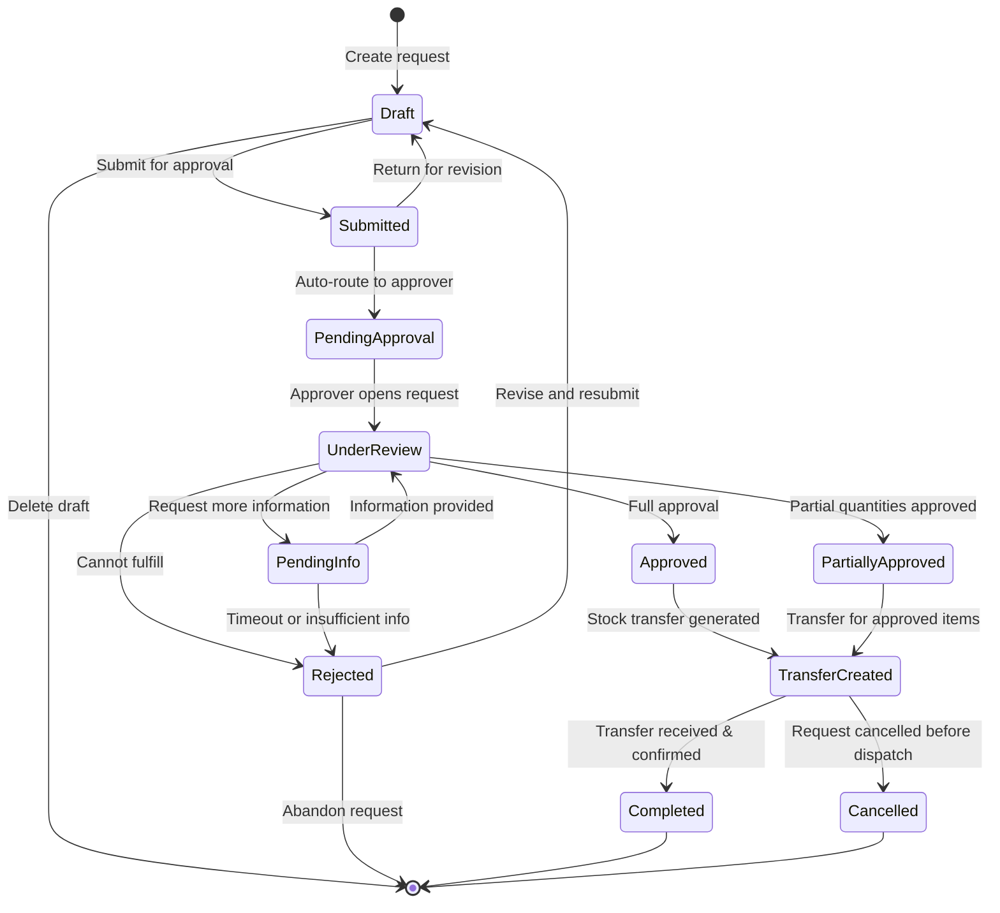

**State Definitions**:

| State | Description | Can Transition To | Entry Actions | Exit Actions |
|-------|-------------|-------------------|---------------|--------------|
| Draft | Initial state, being created | Submitted, Deleted | Assign request number, Set creator | Validate completeness |
| Submitted | Awaiting routing | Pending Approval, Draft | Route to approver, Send notification | Lock for editing |
| Pending Approval | In approval queue | Under Review | Queue position assigned | - |
| Under Review | Being reviewed by approver | Approved, Partially Approved, Rejected, Pending Info | Assign to reviewer | Update SLA timer |
| Pending Info | Waiting for additional details | Under Review, Rejected | Send info request, Set reminder | Clear reminder |
| Approved | Full approval granted | Transfer Created | Reserve stock, Create transfer | Notify warehouse team |
| Partially Approved | Some items approved | Transfer Created | Reserve approved stock, Alert purchasing | Notify requestor of partial |
| Rejected | Approval denied | Draft, Abandoned | Notify requestor, Release reserved stock | Log reason |
| Transfer Created | Transfer document generated | Completed, Cancelled | Link to transfer, Schedule dispatch | - |
| Completed | Transfer received successfully | None | Archive documents, Update metrics | - |
| Cancelled | Manually cancelled | None | Release stock, Notify parties | Document reason |

---

### Stock Transfer State Diagram

**Purpose**: Document all possible states and transitions for stock transfers

**Entity**: Stock Transfer

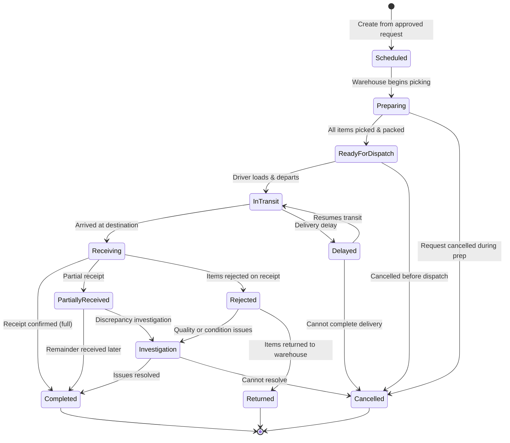

**State Definitions**:

| State | Description | Can Transition To | Entry Actions | Exit Actions |
|-------|-------------|-------------------|---------------|--------------|
| Scheduled | Transfer scheduled | Preparing, Cancelled | Generate transfer number, Schedule date | Notify warehouse team |
| Preparing | Items being picked | Ready for Dispatch, Cancelled | Print picking list, Assign staff | - |
| Ready for Dispatch | Packed, awaiting loading | In Transit, Cancelled | Generate packing slip, Notify driver | - |
| In Transit | En route to destination | Receiving, Delayed, Cancelled | Issue inventory from warehouse, Track location | - |
| Delayed | Delivery delayed | In Transit, Cancelled | Notify receiving location, Update ETA | - |
| Receiving | Being received at destination | Completed, Partially Received, Rejected | Notify receiver | - |
| Partially Received | Some items confirmed | Completed, Investigation | Log discrepancy, Partial inventory increase | - |
| Rejected | Items rejected on receipt | Investigation, Returned | Document rejection reason, Notify warehouse | - |
| Investigation | Discrepancy being investigated | Completed, Cancelled | Create investigation ticket | - |
| Returned | Items returned to warehouse | None | Reverse inventory transactions | - |
| Completed | Successfully received | None | Inventory increased at destination, Archive | Update metrics |
| Cancelled | Transfer cancelled | None | Release reserved stock, Notify parties | Document reason |

---

## Data Flow Diagrams

### Level 0: Context Diagram

**Purpose**: Show the Stock Replenishment System in context with external entities

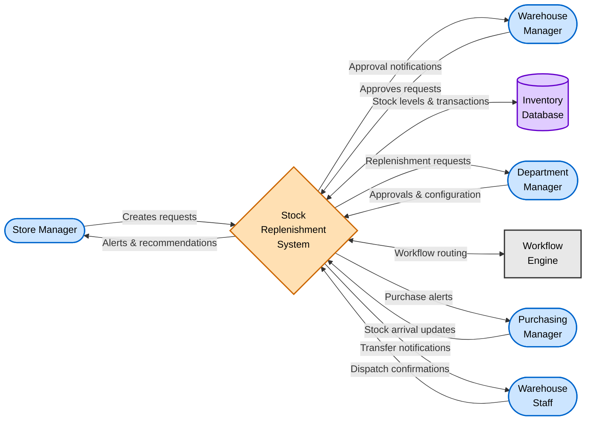

**External Entities**:
- **Store Manager**: Creates requests, receives alerts, manages par levels
- **Warehouse Manager**: Approves requests, manages transfers
- **Department Manager**: Approves par level changes, oversees operations
- **Purchasing Manager**: Handles warehouse stock replenishment
- **Warehouse Staff**: Executes transfer preparation and dispatch
- **Inventory Database**: Source of truth for stock levels
- **Workflow Engine**: Routes approvals based on business rules

---

### Level 1: System Decomposition

**Purpose**: Show major processes and data stores within the replenishment system

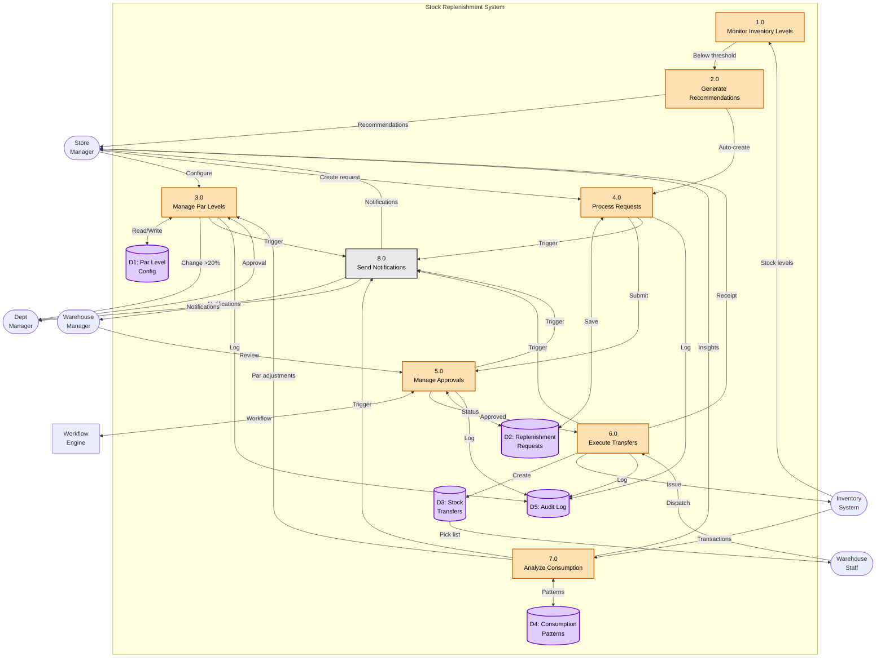

**Data Stores**:
- **D1: Par Level Config**: Target inventory levels and calculation parameters
- **D2: Replenishment Requests**: All replenishment requests and their status
- **D3: Stock Transfers**: Transfer documents and execution details
- **D4: Consumption Patterns**: Historical consumption analysis and trends
- **D5: Audit Log**: All system events and changes for compliance

**Processes**:
1. **1.0 Monitor Inventory Levels**: Real-time stock monitoring against thresholds
2. **2.0 Generate Recommendations**: Create replenishment suggestions based on rules
3. **3.0 Manage Par Levels**: Configuration and adjustment of target levels
4. **4.0 Process Requests**: Request creation, validation, and submission
5. **5.0 Manage Approvals**: Approval workflow execution and decision routing
6. **6.0 Execute Transfers**: Stock transfer preparation, dispatch, and receipt
7. **7.0 Analyze Consumption**: Pattern analysis and forecasting
8. **8.0 Send Notifications**: Alert and notification delivery

---

## Sequence Diagrams

### Request Approval Sequence Diagram

**Purpose**: Show time-ordered interaction for replenishment request approval

**Scenario**: Store Manager creates request from recommendation through approval

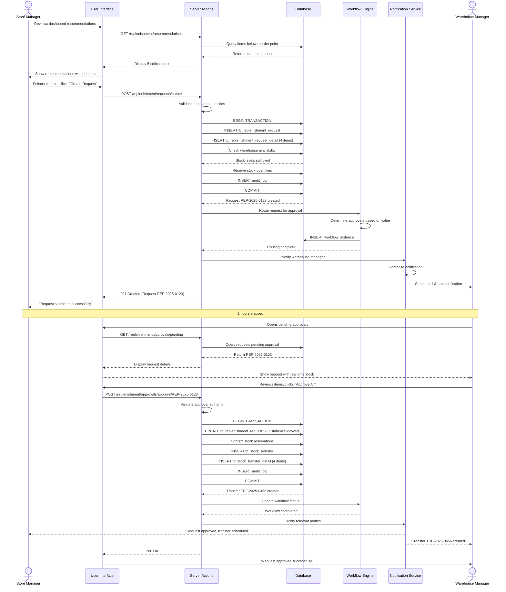

**Key Interactions**:

1. **Maria → UI**: User initiates request from recommendations
2. **UI → API**: Frontend calls server action to create request
3. **API → DB**: Server creates request with transactional integrity
4. **API → Workflow**: Request routed through approval workflow
5. **API → NotifSvc**: Notifications sent to approvers
6. **William → UI**: Warehouse manager reviews request
7. **UI → API**: Approval submitted to backend
8. **API → DB**: Request approved, transfer document created
9. **API → NotifSvc**: Parties notified of approval and transfer

**Timing Considerations**:
- Request creation: < 1 second (synchronous)
- Notification delivery: < 5 seconds (asynchronous)
- Approval SLA: 4 hours for urgent, 24 hours for standard
- Transfer creation: < 1 second after approval

---

### Transfer Execution Sequence Diagram

**Purpose**: Show time-ordered interaction for stock transfer execution

**Scenario**: From approved request through receipt and inventory update

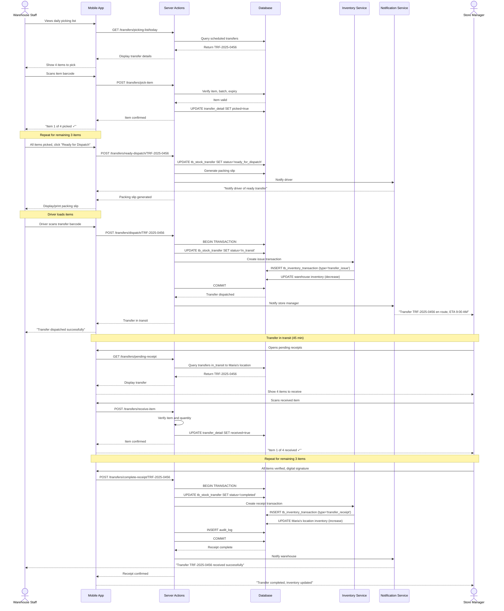

---

## System Integration Flows

### Inventory System Integration Flow

**Purpose**: Document integration with core inventory management system

**Systems Involved**:
- Internal: Stock Replenishment System
- External: Inventory Management System
- Integration Method: Direct database access + event-driven

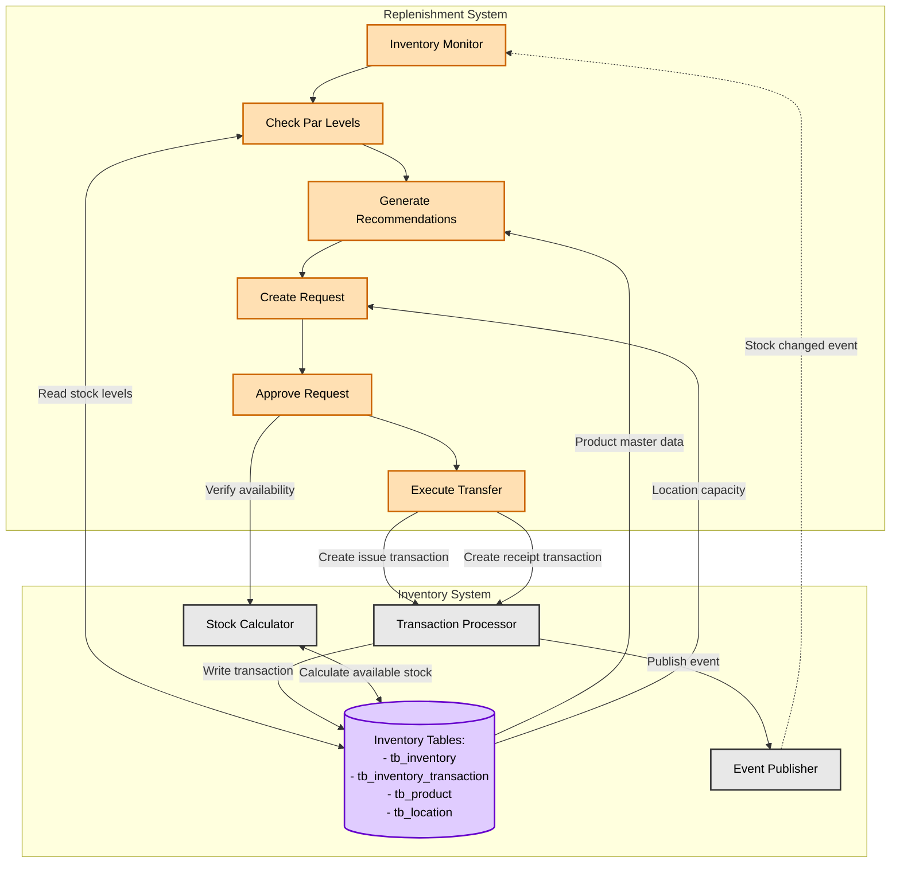

**Integration Points**:

1. **Real-Time Stock Levels**:
   - Replenishment reads from `tb_inventory` table
   - Updates reflected immediately after transactions
   - Stock position = on_hand + on_order - reserved

2. **Transaction Creation**:
   - Transfer dispatch creates issue transaction at warehouse
   - Transfer receipt creates receipt transaction at destination
   - Both transactions linked via transfer_reference_id

3. **Event-Driven Updates**:
   - Inventory publishes stock_changed events
   - Replenishment subscribes to events for monitoring
   - Real-time threshold checking triggered by events

4. **Master Data Access**:
   - Product information from `tb_product`
   - UOM, packaging, shelf life data
   - Location information from `tb_location`
   - Storage capacity and operational characteristics

---

### Workflow Engine Integration Flow

**Purpose**: Document integration with workflow engine for approval routing

**Systems Involved**:
- Internal: Stock Replenishment System
- External: Workflow Engine
- Integration Method: API calls + webhook callbacks

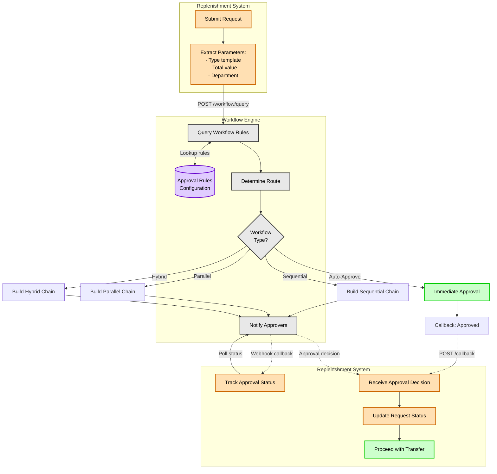

**Workflow Types**:

| Type | Description | Use Case |
|------|-------------|----------|
| Auto-Approve | No approval required | Low-value, routine requests |
| Sequential | Linear approval chain | Multi-level approvals required |
| Parallel | Concurrent approvals | Multiple approvers at same level |
| Hybrid | Mixed sequential and parallel | Complex approval scenarios |

**Integration Flow**:
1. Request submitted with type and value
2. Query workflow engine for applicable rules
3. Workflow engine determines routing
4. Approvers notified via workflow engine
5. Replenishment system polls or receives callbacks
6. Approval decision updates request status
7. Proceed with transfer execution

---

### Purchasing Integration Flow

**Purpose**: Document integration with purchasing system for warehouse replenishment

**Systems Involved**:
- Internal: Stock Replenishment System
- External: Purchase Request System
- Integration Method: Event-driven + API calls

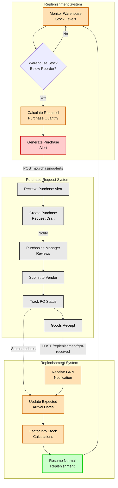

**Integration Flow**:

1. **Warehouse Monitoring**:
   - Replenishment monitors warehouse stock levels
   - Checks against warehouse par levels and reorder points
   - Same monitoring logic as location-level

2. **Purchase Alert Generation**:
   - When warehouse stock below reorder point
   - System calculates required quantity
   - Creates purchase alert with details:
     * Items and quantities
     * Priority and urgency
     * Suggested vendors
     * Required delivery date

3. **Purchase Request Creation**:
   - Purchasing system receives alert
   - Auto-creates draft purchase request
   - Assigned to Purchasing Manager for review
   - Manager can adjust quantities and select vendor

4. **Order Tracking**:
   - Purchase order submitted to vendor
   - Expected delivery dates tracked
   - Replenishment system factors expected arrivals
   - Stock calculations include "on order" quantities

5. **Goods Receipt**:
   - GRN created when items received
   - Replenishment system notified
   - Warehouse stock levels updated
   - Normal replenishment resumes

**Business Rules**:
- Automatic PR creation only for items with configured vendors
- Consolidate multiple alerts into single daily PR
- Consider MOQ and packaging when calculating quantities
- Manual review required for high-value items (>$5,000)

---

## Glossary

- **Actor**: Entity (user, system) that interacts with the process
- **Decision Point**: Point where flow branches based on conditions
- **Fork/Join**: Parallel processing split and synchronization
- **Guard**: Condition that must be true for transition
- **State**: Distinct condition or stage in a lifecycle
- **Transition**: Movement from one state to another
- **Par Level**: Target inventory level to maintain
- **Reorder Point**: Threshold triggering replenishment (typically 40% of par)
- **Minimum Level**: Critical threshold (typically 30% of par)
- **Safety Stock**: Buffer stock for demand variability
- **Lead Time**: Days from request to receipt
- **FEFO**: First Expired, First Out (inventory rotation)

---

## Diagram Conventions

### Notation Guide

**Flowchart Symbols**:
- **Rectangle**: Process step or action
- **Diamond**: Decision point
- **Rounded Rectangle**: Start/End point
- **Parallelogram**: Input/Output
- **Cylinder**: Database
- **Cloud**: External system

**Arrow Styles**:
- **Solid**: Direct flow or synchronous call
- **Dashed**: Async call, callback, or optional path
- **Thick**: Primary/happy path
- **Thin**: Alternative or exception path

**Colors** (Mermaid style classes):
- **Blue (cce5ff)**: Start points, actors
- **Green (ccffcc)**: Success outcomes, approvals
- **Red (ffcccc)**: Error outcomes, rejections, critical alerts
- **Orange (ffe0b3)**: Warnings, partial outcomes, standard processing
- **Purple (e0ccff)**: Database operations, data stores
- **Gray (e8e8e8)**: System processes, neutral outcomes

---

## Tools Used

- **Mermaid**: Primary diagramming tool (renders in markdown)
  - Flowchart: Process flows
  - Sequence Diagram: Time-ordered interactions
  - State Diagram: Status transitions
  - Supported natively by GitHub, GitLab, and many documentation platforms

---

## Maintenance

### Update Triggers
- Business process changes
- New features or functionality added
- Integration points modified
- State transitions updated
- Approval workflows changed
- Performance optimizations implemented

### Review Schedule
- **Monthly**: Quick review for minor changes
- **Quarterly**: Comprehensive review with stakeholders
- **On Major Change**: Immediate update for significant process modifications
- **Annual**: Full documentation audit and update

### Change Management
1. Identify impacted diagrams
2. Update diagrams with changes
3. Validate with stakeholders
4. Update related documents (BR, UC, TS)
5. Version control and approval
6. Communicate changes to users

---

## Related Documents

- [Business Requirements](./BR-stock-replenishment.md)
- [Use Cases](./UC-stock-replenishment.md)
- [Technical Specification](./TS-stock-replenishment.md)
- [Data Schema](./DD-stock-replenishment.md)
- [Validations](./VAL-stock-replenishment.md)
- [Store Requisitions Flow Diagrams](../store-requisitions/FD-store-requisitions.md)
- [Inventory Overview](../../inventory-management/inventory-overview/FD-inventory-overview.md)

---

**Document End**

> 📝 **Note to Authors**:
> - Keep diagrams simple and focused on clarity
> - Use consistent notation and colors throughout
> - Update diagrams when processes change
> - Include legend for custom symbols if needed
> - Validate diagrams render correctly in target platforms
> - Review with stakeholders for accuracy
> - Maintain source files for future editing

---

**Document Control**:
- **Created**: 2025-11-12
- **Author**: Documentation Team
- **Reviewed By**: Operations Manager, Warehouse Manager, Store Managers
- **Approved By**: Chief Operations Officer
- **Next Review**: 2026-01-09
- **Version History**:
  - v1.2.0 (2025-12-09): Updated to reflect implemented frontend UI and workflows
  - v1.1.0 (2025-12-05): Updated Mermaid diagrams for 8.8.2 compatibility
  - v1.0.0 (2025-11-12): Initial comprehensive flow diagrams document

---

**End of Document**
