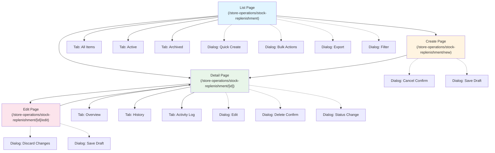

# TS-SREP: Stock Replenishment Technical Specification

**Module**: Store Operations
**Sub-Module**: Stock Replenishment
**Document Type**: Technical Specification (TS)
**Version**: 1.2.0
**Last Updated**: 2025-12-09
**Status**: Active
**Implementation Status**: IMPLEMENTED (Frontend UI Complete with Mock Data)

## Document History

| Version | Date | Author | Changes |
|---------|------|--------|---------|
| 1.2.0 | 2025-12-09 | Documentation Team | Updated to reflect implemented frontend pages |
| 1.1.0 | 2025-12-05 | Documentation Team | Added implementation status, backend requirements reference |
| 1.0.0 | 2025-11-19 | Documentation Team | Initial version |

---

**✅ IMPLEMENTATION NOTE**: The Stock Replenishment module frontend has been fully implemented with 6 pages and mock data infrastructure:

**Implemented Pages**:
- Dashboard (`/store-operations/stock-replenishment`) - Critical alerts, analytics, trends
- New Request (`/store-operations/stock-replenishment/new`) - Create replenishment requests
- Requests List (`/store-operations/stock-replenishment/requests`) - View/filter requests
- Request Detail (`/store-operations/stock-replenishment/requests/[id]`) - Approval workflow
- Stock Levels (`/store-operations/stock-replenishment/stock-levels`) - Par level monitoring
- History (`/store-operations/stock-replenishment/history`) - Completed transfers

**Status Values**: `pending`, `approved`, `in_transit`, `completed`, `rejected`, `cancelled`
**Priority Values**: `standard`, `high`, `urgent`

**Pending Backend Implementation**: Database schema, server actions, real-time monitoring, and integrations. See BR-stock-replenishment.md Section 9 for detailed backend requirements.

---

## 1. Overview

### 1.1 Purpose

This document provides comprehensive technical specifications for implementing the Stock Replenishment module in the Carmen ERP system. It defines system architecture, components, APIs, integrations, and implementation details for developers.

### 1.2 Technical Stack

**Framework & Runtime**:
- Next.js 14.2+ (App Router)
- React 18.2+ (Server Components)
- TypeScript 5.8+
- Node.js v20.14.0+

**Database & ORM**:
- PostgreSQL 14+
- Prisma ORM 5.8+

**State Management**:
- Zustand (client state)
- React Query / TanStack Query (server state)

**Validation**:
- Zod 3.22+ (schema validation)

**UI Components**:
- Radix UI (primitives)
- Shadcn/ui (component library)
- Tailwind CSS (styling)

**Utilities**:
- Date-fns (date manipulation)
- Recharts (analytics charts)
- React Hook Form (form management)

###  1.3 System Architecture

```
┌─────────────────────────────────────────────────────────────┐
│                     Client Layer (Browser)                   │
│  ┌──────────────┐  ┌──────────────┐  ┌──────────────┐      │
│  │  Dashboard   │  │ Par Config   │  │  Analytics   │      │
│  │  Components  │  │  Components  │  │  Components  │      │
│  └──────────────┘  └──────────────┘  └──────────────┘      │
│         │                 │                  │               │
│         └────────────── Zustand Store ──────────────┘       │
│                           │                                  │
│                     React Query                              │
└─────────────────────────────│────────────────────────────────┘
                              │
                              │ HTTP / Server Actions
┌─────────────────────────────│────────────────────────────────┐
│                    Application Layer (Next.js)               │
│  ┌──────────────────────────│──────────────────────────┐    │
│  │        Server Components & Server Actions           │    │
│  │  ┌────────┐ ┌────────┐ ┌────────┐  ┌────────┐     │    │
│  │  │  Par   │ │Request │ │Transfer│  │Analytic│     │    │
│  │  │ Actions│ │Actions │ │Actions │  │Actions │     │    │
│  │  └────────┘ └────────┘ └────────┘  └────────┘     │    │
│  └───────────────────────────────────────────────────┘    │
│         │                  │                 │              │
│  ┌──────────────────────────────────────────────────┐     │
│  │         Business Logic Services                    │     │
│  │  ┌──────────┐  ┌──────────┐  ┌──────────┐        │     │
│  │  │Monitoring│  │Recommenda│  │Consumption│        │     │
│  │  │ Service  │  │  tion    │  │ Analytics │        │     │
│  │  └──────────┘  └──────────┘  └──────────┘        │     │
│  └──────────────────────────────────────────────────┘     │
└─────────────────────────────│──────────────────────────────┘
                              │
                              │ Prisma ORM
┌─────────────────────────────│──────────────────────────────┐
│                     Data Layer (PostgreSQL)                 │
│  ┌──────────────┐  ┌──────────────┐  ┌──────────────┐    │
│  │tb_par_level  │  │tb_replenish  │  │tb_stock      │    │
│  │              │  │_request      │  │_transfer     │    │
│  └──────────────┘  └──────────────┘  └──────────────┘    │
│  ┌──────────────┐  ┌──────────────┐                       │
│  │tb_consumption│  │tb_inventory  │                       │
│  │_pattern      │  │_transaction  │                       │
│  └──────────────┘  └──────────────┘                       │
└────────────────────────────────────────────────────────────┘
```

---

## 2. Database Schema

### 2.1 Tables Overview

**Proposed Tables** (not in current schema):
1. `tb_par_level_config` - Par level configurations
2. `tb_replenishment_request` - Replenishment requests (header)
3. `tb_replenishment_request_detail` - Request line items
4. `tb_stock_transfer` - Stock transfers (header)
5. `tb_stock_transfer_detail` - Transfer line items
6. `tb_consumption_pattern` - Consumption analytics cache

**Existing Tables Used**:
- `tb_inventory_transaction` - Inventory movements
- `tb_location` - Locations
- `tb_product` - Products
- `tb_workflow` - Approval workflows

### 2.2 Table: tb_par_level_config

**Purpose**: Store par level, reorder point, and minimum level configurations for items at locations.

```prisma
model tb_par_level_config {
  id                    String    @id @default(dbgenerated("gen_random_uuid()")) @db.Uuid

  location_id           String    @db.Uuid
  location_name         String?   @db.VarChar

  product_id            String    @db.Uuid
  product_name          String?   @db.VarChar
  product_code          String?   @db.VarChar

  par_level             Decimal   @db.Decimal(20, 5)
  reorder_point         Decimal   @db.Decimal(20, 5)
  minimum_level         Decimal   @db.Decimal(20, 5)
  maximum_level         Decimal?  @db.Decimal(20, 5)

  lead_time_days        Int       @default(2)
  safety_stock          Decimal?  @db.Decimal(20, 5)

  seasonal_config       Json?     @db.Json
  special_notes         String?   @db.VarChar

  status                enum_par_status @default(active)
  approval_status       enum_approval_status? @default(approved)

  approved_by_id        String?   @db.Uuid
  approved_by_name      String?   @db.VarChar
  approved_at           DateTime? @db.Timestamptz(6)

  last_reviewed_at      DateTime? @db.Timestamptz(6)
  next_review_date      DateTime? @db.Timestamptz(6)

  created_at            DateTime  @default(now()) @db.Timestamptz(6)
  created_by_id         String?   @db.Uuid
  updated_at            DateTime  @default(now()) @db.Timestamptz(6)
  updated_by_id         String?   @db.Uuid
  deleted_at            DateTime? @db.Timestamptz(6)
  deleted_by_id         String?   @db.Uuid

  tb_location           tb_location? @relation(fields: [location_id], references: [id])

  @@unique([location_id, product_id], name: "par_level_location_product_unique")
  @@index([location_id], map: "par_level_location_idx")
  @@index([product_id], map: "par_level_product_idx")
  @@index([status], map: "par_level_status_idx")
}

enum enum_par_status {
  active
  inactive
  pending_review
}

enum enum_approval_status {
  pending
  approved
  rejected
}
```

**Key Fields**:
- `par_level`: Target inventory level (maximum)
- `reorder_point`: Level at which replenishment should be initiated (typically 40% of par)
- `minimum_level`: Critical threshold (typically 30% of par)
- `lead_time_days`: Days from request to receipt
- `seasonal_config`: JSON for seasonal multipliers
- `safety_stock`: Buffer stock for demand variability

**Indexes**:
- Unique constraint on (location_id, product_id)
- Index on location_id for location-based queries
- Index on product_id for product-based queries
- Index on status for active config filtering

### 2.3 Table: tb_replenishment_request

**Purpose**: Header table for replenishment requests from locations to warehouse.

```prisma
model tb_replenishment_request {
  id                     String    @id @default(dbgenerated("gen_random_uuid()")) @db.Uuid
  request_no             String    @db.VarChar
  request_date           DateTime  @db.Timestamptz(6)
  required_by_date       DateTime  @db.Timestamptz(6)

  from_location_id       String    @db.Uuid
  from_location_name     String?   @db.VarChar
  to_location_id         String    @db.Uuid
  to_location_name       String?   @db.VarChar

  priority               enum_request_priority @default(standard)
  status                 enum_request_status @default(pending)

  reason                 String?   @db.VarChar
  special_instructions   String?   @db.VarChar

  total_items            Int       @default(0)
  total_value_estimated  Decimal?  @db.Decimal(20, 2)

  workflow_id            String?   @db.Uuid
  workflow_name          String?   @db.VarChar
  workflow_history       Json?     @db.Json
  workflow_current_stage String?   @db.VarChar

  requestor_id           String    @db.Uuid
  requestor_name         String?   @db.VarChar
  department_id          String?   @db.Uuid
  department_name        String?   @db.VarChar

  approved_by_id         String?   @db.Uuid
  approved_by_name       String?   @db.VarChar
  approved_at            DateTime? @db.Timestamptz(6)
  approval_comments      String?   @db.VarChar

  rejected_by_id         String?   @db.Uuid
  rejected_by_name       String?   @db.VarChar
  rejected_at            DateTime? @db.Timestamptz(6)
  rejection_reason       String?   @db.VarChar

  transfer_id            String?   @db.Uuid

  doc_version            Decimal   @default(0) @db.Decimal

  created_at             DateTime  @default(now()) @db.Timestamptz(6)
  created_by_id          String?   @db.Uuid
  updated_at             DateTime  @default(now()) @db.Timestamptz(6)
  updated_by_id          String?   @db.Uuid
  deleted_at             DateTime? @db.Timestamptz(6)
  deleted_by_id          String?   @db.Uuid

  tb_replenishment_request_detail tb_replenishment_request_detail[]
  tb_from_location       tb_location? @relation("from_location", fields: [from_location_id], references: [id])
  tb_to_location         tb_location? @relation("to_location", fields: [to_location_id], references: [id])
  tb_stock_transfer      tb_stock_transfer? @relation(fields: [transfer_id], references: [id])

  @@unique([request_no], name: "replenishment_request_no_unique")
  @@index([request_no], map: "replenishment_request_no_idx")
  @@index([status], map: "replenishment_status_idx")
  @@index([priority], map: "replenishment_priority_idx")
  @@index([to_location_id], map: "replenishment_to_location_idx")
  @@index([required_by_date], map: "replenishment_required_by_idx")
}

enum enum_request_priority {
  emergency
  high
  standard
  low
}

enum enum_request_status {
  draft
  pending
  approved
  partially_approved
  rejected
  in_transit
  completed
  cancelled
}
```

**Key Fields**:
- `request_no`: Format REP-YYYY-NNNN
- `priority`: Emergency, high, standard, or low
- `status`: Request lifecycle status
- `workflow_history`: JSON tracking approval stages
- `transfer_id`: Link to created transfer document

### 2.4 Table: tb_replenishment_request_detail

**Purpose**: Line items for replenishment requests.

```prisma
model tb_replenishment_request_detail {
  id                          String    @id @default(dbgenerated("gen_random_uuid()")) @db.Uuid
  replenishment_request_id    String    @db.Uuid
  sequence_no                 Int       @default(1)

  product_id                  String    @db.Uuid
  product_name                String?   @db.VarChar
  product_code                String?   @db.VarChar

  current_stock_level         Decimal?  @db.Decimal(20, 5)
  par_level                   Decimal?  @db.Decimal(20, 5)

  requested_qty               Decimal   @db.Decimal(20, 5)
  approved_qty                Decimal?  @db.Decimal(20, 5)
  transferred_qty             Decimal?  @db.Decimal(20, 5)

  unit_cost_estimated         Decimal?  @db.Decimal(20, 2)
  total_cost_estimated        Decimal?  @db.Decimal(20, 2)

  warehouse_availability      Decimal?  @db.Decimal(20, 5)

  item_status                 enum_line_item_status @default(pending)

  approval_comments           String?   @db.VarChar
  rejection_reason            String?   @db.VarChar

  approved_by_id              String?   @db.Uuid
  approved_by_name            String?   @db.VarChar
  approved_at                 DateTime? @db.Timestamptz(6)

  created_at                  DateTime  @default(now()) @db.Timestamptz(6)
  created_by_id               String?   @db.Uuid
  updated_at                  DateTime  @default(now()) @db.Timestamptz(6)
  updated_by_id               String?   @db.Uuid

  tb_replenishment_request    tb_replenishment_request @relation(fields: [replenishment_request_id], references: [id], onDelete: Cascade)

  @@index([replenishment_request_id], map: "replenishment_detail_request_idx")
  @@index([product_id], map: "replenishment_detail_product_idx")
}

enum enum_line_item_status {
  pending
  approved
  partially_approved
  rejected
  transferred
}
```

### 2.5 Table: tb_stock_transfer

**Purpose**: Header table for stock transfers between locations.

```prisma
model tb_stock_transfer {
  id                    String    @id @default(dbgenerated("gen_random_uuid()")) @db.Uuid
  transfer_no           String    @db.VarChar
  transfer_date         DateTime  @db.Timestamptz(6)

  from_location_id      String    @db.Uuid
  from_location_name    String?   @db.VarChar
  to_location_id        String    @db.Uuid
  to_location_name      String?   @db.VarChar

  status                enum_transfer_status @default(scheduled)

  scheduled_date        DateTime? @db.Timestamptz(6)
  dispatched_at         DateTime? @db.Timestamptz(6)
  delivered_at          DateTime? @db.Timestamptz(6)
  received_at           DateTime? @db.Timestamptz(6)

  total_items           Int       @default(0)
  total_weight_kg       Decimal?  @db.Decimal(10, 2)

  packing_notes         String?   @db.VarChar
  delivery_notes        String?   @db.VarChar
  receiving_notes       String?   @db.VarChar

  driver_name           String?   @db.VarChar
  vehicle_number        String?   @db.VarChar

  prepared_by_id        String?   @db.Uuid
  prepared_by_name      String?   @db.VarChar
  dispatched_by_id      String?   @db.Uuid
  dispatched_by_name    String?   @db.VarChar
  received_by_id        String?   @db.Uuid
  received_by_name      String?   @db.VarChar

  discrepancy_reported  Boolean   @default(false)
  discrepancy_notes     String?   @db.VarChar

  created_at            DateTime  @default(now()) @db.Timestamptz(6)
  created_by_id         String?   @db.Uuid
  updated_at            DateTime  @default(now()) @db.Timestamptz(6)
  updated_by_id         String?   @db.Uuid

  tb_stock_transfer_detail tb_stock_transfer_detail[]
  tb_replenishment_request tb_replenishment_request[]
  tb_from_location      tb_location? @relation("transfer_from", fields: [from_location_id], references: [id])
  tb_to_location        tb_location? @relation("transfer_to", fields: [to_location_id], references: [id])

  @@unique([transfer_no], name: "stock_transfer_no_unique")
  @@index([transfer_no], map: "stock_transfer_no_idx")
  @@index([status], map: "stock_transfer_status_idx")
  @@index([to_location_id], map: "stock_transfer_to_location_idx")
}

enum enum_transfer_status {
  scheduled
  preparing
  ready_for_dispatch
  in_transit
  partially_received
  completed
  cancelled
}
```

### 2.6 Table: tb_stock_transfer_detail

**Purpose**: Line items for stock transfers.

```prisma
model tb_stock_transfer_detail {
  id                      String    @id @default(dbgenerated("gen_random_uuid()")) @db.Uuid
  stock_transfer_id       String    @db.Uuid
  sequence_no             Int       @default(1)

  product_id              String    @db.Uuid
  product_name            String?   @db.VarChar
  product_code            String?   @db.VarChar

  requested_qty           Decimal   @db.Decimal(20, 5)
  dispatched_qty          Decimal?  @db.Decimal(20, 5)
  received_qty            Decimal?  @db.Decimal(20, 5)

  batch_lot_no            String?   @db.VarChar
  expiry_date             DateTime? @db.Timestamptz(6)

  quality_check_passed    Boolean?  @default(true)
  quality_notes           String?   @db.VarChar

  discrepancy             Boolean   @default(false)
  discrepancy_qty         Decimal?  @db.Decimal(20, 5)
  discrepancy_reason      String?   @db.VarChar

  inventory_issue_txn_id  String?   @db.Uuid
  inventory_receipt_txn_id String?  @db.Uuid

  created_at              DateTime  @default(now()) @db.Timestamptz(6)
  created_by_id           String?   @db.Uuid
  updated_at              DateTime  @default(now()) @db.Timestamptz(6)
  updated_by_id           String?   @db.Uuid

  tb_stock_transfer       tb_stock_transfer @relation(fields: [stock_transfer_id], references: [id], onDelete: Cascade)

  @@index([stock_transfer_id], map: "stock_transfer_detail_transfer_idx")
  @@index([product_id], map: "stock_transfer_detail_product_idx")
}
```

### 2.7 Table: tb_consumption_pattern

**Purpose**: Cache table for consumption analytics and patterns (updated daily).

```prisma
model tb_consumption_pattern {
  id                      String    @id @default(dbgenerated("gen_random_uuid()")) @db.Uuid

  location_id             String    @db.Uuid
  product_id              String    @db.Uuid

  analysis_period_start   DateTime  @db.Timestamptz(6)
  analysis_period_end     DateTime  @db.Timestamptz(6)
  period_days             Int

  total_consumption       Decimal   @db.Decimal(20, 5)
  average_daily_consumption Decimal @db.Decimal(20, 5)
  peak_daily_consumption  Decimal   @db.Decimal(20, 5)
  minimum_daily_consumption Decimal @db.Decimal(20, 5)

  consumption_trend       String?   @db.VarChar
  trend_percentage        Decimal?  @db.Decimal(10, 2)

  variability_coefficient Decimal?  @db.Decimal(10, 4)

  stockout_incidents      Int       @default(0)
  days_out_of_stock       Int       @default(0)

  recommended_par_level   Decimal?  @db.Decimal(20, 5)
  recommended_reorder_point Decimal? @db.Decimal(20, 5)

  last_calculated_at      DateTime  @db.Timestamptz(6)

  created_at              DateTime  @default(now()) @db.Timestamptz(6)
  updated_at              DateTime  @default(now()) @db.Timestamptz(6)

  @@unique([location_id, product_id, analysis_period_start], name: "consumption_location_product_period_unique")
  @@index([location_id], map: "consumption_location_idx")
  @@index([product_id], map: "consumption_product_idx")
  @@index([last_calculated_at], map: "consumption_calculated_idx")
}
```

---

## 3. Server Actions

### 3.1 Par Level Management Actions

**File**: `app/(main)/store-operations/stock-replenishment/par-levels/actions.ts`

```typescript
'use server'

import { z } from 'zod';
import { prisma } from '@/lib/prisma';
import { auth } from '@/lib/auth';
import { revalidatePath } from 'next/cache';

// Zod Schemas
const ParLevelConfigSchema = z.object({
  location_id: z.string().uuid(),
  product_id: z.string().uuid(),
  par_level: z.number().positive(),
  lead_time_days: z.number().int().min(1).max(30).default(2),
  special_notes: z.string().optional(),
  seasonal_config: z.object({
    summer_multiplier: z.number().optional(),
    winter_multiplier: z.number().optional(),
    holiday_multiplier: z.number().optional()
  }).optional()
});

/**
 * Create or update par level configuration
 */
export async function saveParLevelConfig(data: z.infer<typeof ParLevelConfigSchema>) {
  try {
    // 1. Authentication & Authorization
    const session = await auth();
    if (!session) {
      return { success: false, error: 'Unauthorized' };
    }

    // 2. Validate input
    const validated = ParLevelConfigSchema.parse(data);

    // 3. Check for existing configuration
    const existing = await prisma.tb_par_level_config.findUnique({
      where: {
        par_level_location_product_unique: {
          location_id: validated.location_id,
          product_id: validated.product_id
        }
      }
    });

    // 4. Calculate reorder point and minimum level
    const reorderPoint = validated.par_level * 0.4; // 40% of par
    const minimumLevel = validated.par_level * 0.3; // 30% of par

    // 5. Calculate safety stock
    // Safety stock = (Peak consumption - Avg consumption) × Lead time factor
    // For now, using simple formula: 20% of par level
    const safetyStock = validated.par_level * 0.2;

    // 6. Determine if approval needed (>20% change from existing)
    let approvalStatus: 'approved' | 'pending' = 'approved';
    if (existing) {
      const changePercentage = Math.abs(
        (validated.par_level - Number(existing.par_level)) / Number(existing.par_level) * 100
      );
      if (changePercentage > 20) {
        approvalStatus = 'pending';
      }
    }

    // 7. Get product and location names
    const [product, location] = await Promise.all([
      prisma.tb_product.findUnique({
        where: { id: validated.product_id },
        select: { name: true, code: true }
      }),
      prisma.tb_location.findUnique({
        where: { id: validated.location_id },
        select: { name: true }
      })
    ]);

    // 8. Upsert par level configuration
    const parLevel = await prisma.tb_par_level_config.upsert({
      where: {
        par_level_location_product_unique: {
          location_id: validated.location_id,
          product_id: validated.product_id
        }
      },
      create: {
        location_id: validated.location_id,
        location_name: location?.name,
        product_id: validated.product_id,
        product_name: product?.name,
        product_code: product?.code,
        par_level: validated.par_level,
        reorder_point: reorderPoint,
        minimum_level: minimumLevel,
        safety_stock: safetyStock,
        lead_time_days: validated.lead_time_days,
        seasonal_config: validated.seasonal_config as any,
        special_notes: validated.special_notes,
        status: 'active',
        approval_status: approvalStatus,
        created_by_id: session.user.id,
        updated_by_id: session.user.id
      },
      update: {
        par_level: validated.par_level,
        reorder_point: reorderPoint,
        minimum_level: minimumLevel,
        safety_stock: safetyStock,
        lead_time_days: validated.lead_time_days,
        seasonal_config: validated.seasonal_config as any,
        special_notes: validated.special_notes,
        approval_status: approvalStatus,
        updated_by_id: session.user.id,
        updated_at: new Date()
      }
    });

    // 9. If approval needed, notify Department Manager
    if (approvalStatus === 'pending') {
      // TODO: Create notification for Department Manager
      // await createNotification({
      //   user_id: departmentManager.id,
      //   type: 'PAR_LEVEL_APPROVAL_REQUIRED',
      //   title: 'Par Level Approval Required',
      //   message: `Par level change >20% for ${product?.name} at ${location?.name}`,
      //   link: `/store-operations/stock-replenishment/par-levels/approvals/${parLevel.id}`
      // });
    }

    // 10. Revalidate relevant paths
    revalidatePath('/store-operations/stock-replenishment/par-levels');
    revalidatePath('/store-operations/stock-replenishment/dashboard');

    return {
      success: true,
      data: parLevel,
      message: approvalStatus === 'pending'
        ? 'Par level saved. Requires manager approval.'
        : 'Par level configured successfully'
    };

  } catch (error) {
    console.error('Error saving par level:', error);
    if (error instanceof z.ZodError) {
      return { success: false, error: 'Validation failed', details: error.errors };
    }
    return { success: false, error: 'Failed to save par level configuration' };
  }
}

/**
 * Get par level configurations for a location
 */
export async function getParLevels(locationId: string) {
  try {
    const session = await auth();
    if (!session) {
      return { success: false, error: 'Unauthorized' };
    }

    const parLevels = await prisma.tb_par_level_config.findMany({
      where: {
        location_id: locationId,
        status: 'active',
        deleted_at: null
      },
      orderBy: [
        { approval_status: 'asc' }, // pending first
        { product_name: 'asc' }
      ]
    });

    return { success: true, data: parLevels };

  } catch (error) {
    console.error('Error fetching par levels:', error);
    return { success: false, error: 'Failed to fetch par levels' };
  }
}

/**
 * Approve par level configuration change
 */
export async function approveParLevel(parLevelId: string, comments?: string) {
  try {
    const session = await auth();
    if (!session) {
      return { success: false, error: 'Unauthorized' };
    }

    // TODO: Check if user has approval permission
    // if (!hasPermission(session.user, 'approve_par_levels')) {
    //   return { success: false, error: 'Insufficient permissions' };
    // }

    const parLevel = await prisma.tb_par_level_config.update({
      where: { id: parLevelId },
      data: {
        approval_status: 'approved',
        approved_by_id: session.user.id,
        approved_by_name: session.user.name,
        approved_at: new Date(),
        special_notes: comments ? `${comments}\n---\nPrevious notes: ` : undefined
      }
    });

    // Notify requestor
    // await createNotification({...});

    revalidatePath('/store-operations/stock-replenishment/par-levels');

    return { success: true, data: parLevel, message: 'Par level approved successfully' };

  } catch (error) {
    console.error('Error approving par level:', error);
    return { success: false, error: 'Failed to approve par level' };
  }
}

/**
 * Bulk update par levels from recommendations
 */
export async function applyParLevelRecommendations(
  locationId: string,
  productIds: string[]
) {
  try {
    const session = await auth();
    if (!session) {
      return { success: false, error: 'Unauthorized' };
    }

    // Get consumption patterns for products
    const patterns = await prisma.tb_consumption_pattern.findMany({
      where: {
        location_id: locationId,
        product_id: { in: productIds }
      },
      orderBy: { last_calculated_at: 'desc' }
    });

    // Apply recommended par levels
    const updates = await Promise.all(
      patterns.map(pattern =>
        prisma.tb_par_level_config.update({
          where: {
            par_level_location_product_unique: {
              location_id: pattern.location_id,
              product_id: pattern.product_id
            }
          },
          data: {
            par_level: pattern.recommended_par_level || 0,
            reorder_point: pattern.recommended_reorder_point || 0,
            minimum_level: (pattern.recommended_par_level || 0) * 0.3,
            updated_by_id: session.user.id,
            updated_at: new Date()
          }
        })
      )
    );

    revalidatePath('/store-operations/stock-replenishment/par-levels');

    return {
      success: true,
      data: { updated: updates.length },
      message: `${updates.length} par levels updated successfully`
    };

  } catch (error) {
    console.error('Error applying recommendations:', error);
    return { success: false, error: 'Failed to apply recommendations' };
  }
}
```

### 3.2 Replenishment Request Actions

**File**: `app/(main)/store-operations/stock-replenishment/requests/actions.ts`

```typescript
'use server'

import { z } from 'zod';
import { prisma } from '@/lib/prisma';
import { auth } from '@/lib/auth';
import { revalidatePath } from 'next/cache';

// Zod Schemas
const ReplenishmentRequestItemSchema = z.object({
  product_id: z.string().uuid(),
  requested_qty: z.number().positive(),
  current_stock_level: z.number().optional(),
  par_level: z.number().optional()
});

const CreateReplenishmentRequestSchema = z.object({
  from_location_id: z.string().uuid(),
  to_location_id: z.string().uuid(),
  required_by_date: z.string().or(z.date()),
  priority: z.enum(['emergency', 'high', 'standard', 'low']).default('standard'),
  reason: z.string().optional(),
  items: z.array(ReplenishmentRequestItemSchema).min(1).max(100)
});

/**
 * Generate unique request number
 */
async function generateRequestNumber(): Promise<string> {
  const year = new Date().getFullYear();
  const count = await prisma.tb_replenishment_request.count({
    where: {
      request_no: {
        startsWith: `REP-${year}-`
      }
    }
  });
  const sequence = (count + 1).toString().padStart(4, '0');
  return `REP-${year}-${sequence}`;
}

/**
 * Create replenishment request
 */
export async function createReplenishmentRequest(
  data: z.infer<typeof CreateReplenishmentRequestSchema>
) {
  try {
    // 1. Authentication
    const session = await auth();
    if (!session) {
      return { success: false, error: 'Unauthorized' };
    }

    // 2. Validate input
    const validated = CreateReplenishmentRequestSchema.parse(data);

    // 3. Get location names
    const [fromLocation, toLocation] = await Promise.all([
      prisma.tb_location.findUnique({
        where: { id: validated.from_location_id },
        select: { name: true }
      }),
      prisma.tb_location.findUnique({
        where: { id: validated.to_location_id },
        select: { name: true }
      })
    ]);

    // 4. Generate request number
    const requestNo = await generateRequestNumber();

    // 5. Check warehouse availability for each item
    const itemsWithAvailability = await Promise.all(
      validated.items.map(async (item) => {
        // Get product details
        const product = await prisma.tb_product.findUnique({
          where: { id: item.product_id },
          select: { name: true, code: true }
        });

        // Get warehouse stock (from inventory)
        const warehouseStock = await prisma.tb_inventory_transaction.aggregate({
          where: {
            product_id: item.product_id,
            location_id: validated.from_location_id
          },
          _sum: {
            quantity: true
          }
        });

        return {
          ...item,
          product_name: product?.name,
          product_code: product?.code,
          warehouse_availability: warehouseStock._sum.quantity || 0
        };
      })
    );

    // 6. Calculate totals
    const totalItems = validated.items.length;
    // TODO: Calculate total_value_estimated based on product costs

    // 7. Create request with details
    const request = await prisma.tb_replenishment_request.create({
      data: {
        request_no: requestNo,
        request_date: new Date(),
        required_by_date: new Date(validated.required_by_date),
        from_location_id: validated.from_location_id,
        from_location_name: fromLocation?.name,
        to_location_id: validated.to_location_id,
        to_location_name: toLocation?.name,
        priority: validated.priority,
        status: 'pending',
        reason: validated.reason,
        total_items: totalItems,
        requestor_id: session.user.id,
        requestor_name: session.user.name,
        created_by_id: session.user.id,
        tb_replenishment_request_detail: {
          create: itemsWithAvailability.map((item, index) => ({
            sequence_no: index + 1,
            product_id: item.product_id,
            product_name: item.product_name,
            product_code: item.product_code,
            requested_qty: item.requested_qty,
            current_stock_level: item.current_stock_level,
            par_level: item.par_level,
            warehouse_availability: item.warehouse_availability,
            item_status: 'pending',
            created_by_id: session.user.id
          }))
        }
      },
      include: {
        tb_replenishment_request_detail: true
      }
    });

    // 8. Notify warehouse manager
    // await createNotification({
    //   type: 'REPLENISHMENT_REQUEST_PENDING',
    //   user_id: warehouseManagerId,
    //   title: `New ${validated.priority} priority request`,
    //   message: `Request ${requestNo} from ${toLocation?.name}`,
    //   link: `/store-operations/stock-replenishment/requests/${request.id}`
    // });

    // 9. If emergency, also notify department manager
    if (validated.priority === 'emergency') {
      // await createNotification({...});
    }

    // 10. Revalidate paths
    revalidatePath('/store-operations/stock-replenishment/requests');
    revalidatePath('/store-operations/stock-replenishment/dashboard');

    return {
      success: true,
      data: request,
      message: `Replenishment request ${requestNo} created successfully`
    };

  } catch (error) {
    console.error('Error creating request:', error);
    if (error instanceof z.ZodError) {
      return { success: false, error: 'Validation failed', details: error.errors };
    }
    return { success: false, error: 'Failed to create replenishment request' };
  }
}

/**
 * Approve replenishment request
 */
export async function approveReplenishmentRequest(
  requestId: string,
  lineItemApprovals: Array<{
    id: string;
    approved_qty: number;
    approval_comments?: string;
  }>
) {
  try {
    const session = await auth();
    if (!session) {
      return { success: false, error: 'Unauthorized' };
    }

    // 1. Get request
    const request = await prisma.tb_replenishment_request.findUnique({
      where: { id: requestId },
      include: {
        tb_replenishment_request_detail: true
      }
    });

    if (!request) {
      return { success: false, error: 'Request not found' };
    }

    // 2. Update line items with approved quantities
    await Promise.all(
      lineItemApprovals.map(approval =>
        prisma.tb_replenishment_request_detail.update({
          where: { id: approval.id },
          data: {
            approved_qty: approval.approved_qty,
            approval_comments: approval.approval_comments,
            item_status: approval.approved_qty > 0 ? 'approved' : 'rejected',
            approved_by_id: session.user.id,
            approved_by_name: session.user.name,
            approved_at: new Date()
          }
        })
      )
    );

    // 3. Determine overall request status
    const allApproved = lineItemApprovals.every(a => a.approved_qty > 0);
    const someApproved = lineItemApprovals.some(a => a.approved_qty > 0);
    const noneApproved = lineItemApprovals.every(a => a.approved_qty === 0);

    let requestStatus: 'approved' | 'partially_approved' | 'rejected' = 'approved';
    if (noneApproved) {
      requestStatus = 'rejected';
    } else if (!allApproved && someApproved) {
      requestStatus = 'partially_approved';
    }

    // 4. Update request
    const updatedRequest = await prisma.tb_replenishment_request.update({
      where: { id: requestId },
      data: {
        status: requestStatus,
        approved_by_id: session.user.id,
        approved_by_name: session.user.name,
        approved_at: new Date(),
        updated_by_id: session.user.id,
        updated_at: new Date()
      }
    });

    // 5. If approved, create stock transfer
    if (requestStatus === 'approved' || requestStatus === 'partially_approved') {
      const transfer = await createStockTransferFromRequest(requestId, session.user.id);

      // Update request with transfer ID
      await prisma.tb_replenishment_request.update({
        where: { id: requestId },
        data: { transfer_id: transfer.id }
      });
    }

    // 6. Notify requestor
    // await createNotification({...});

    revalidatePath('/store-operations/stock-replenishment/requests');

    return {
      success: true,
      data: updatedRequest,
      message: `Request ${requestStatus} successfully`
    };

  } catch (error) {
    console.error('Error approving request:', error);
    return { success: false, error: 'Failed to approve request' };
  }
}

/**
 * Create stock transfer from approved request
 */
async function createStockTransferFromRequest(requestId: string, userId: string) {
  // Get request with approved items
  const request = await prisma.tb_replenishment_request.findUnique({
    where: { id: requestId },
    include: {
      tb_replenishment_request_detail: {
        where: {
          item_status: 'approved',
          approved_qty: { gt: 0 }
        }
      }
    }
  });

  if (!request) {
    throw new Error('Request not found');
  }

  // Generate transfer number
  const year = new Date().getFullYear();
  const count = await prisma.tb_stock_transfer.count({
    where: {
      transfer_no: { startsWith: `TRF-${year}-` }
    }
  });
  const sequence = (count + 1).toString().padStart(4, '0');
  const transferNo = `TRF-${year}-${sequence}`;

  // Create transfer
  const transfer = await prisma.tb_stock_transfer.create({
    data: {
      transfer_no: transferNo,
      transfer_date: new Date(),
      from_location_id: request.from_location_id,
      from_location_name: request.from_location_name,
      to_location_id: request.to_location_id,
      to_location_name: request.to_location_name,
      status: 'scheduled',
      scheduled_date: request.required_by_date,
      total_items: request.tb_replenishment_request_detail.length,
      created_by_id: userId,
      tb_stock_transfer_detail: {
        create: request.tb_replenishment_request_detail.map((item, index) => ({
          sequence_no: index + 1,
          product_id: item.product_id,
          product_name: item.product_name,
          product_code: item.product_code,
          requested_qty: item.approved_qty || 0,
          created_by_id: userId
        }))
      }
    }
  });

  return transfer;
}
```

---

## 4. Client Components

### 4.1 Replenishment Dashboard Component

**File**: `app/(main)/store-operations/stock-replenishment/dashboard/page.tsx`

```typescript
import { Suspense } from 'react';
import { Card, CardContent, CardDescription, CardHeader, CardTitle } from '@/components/ui/card';
import { Tabs, TabsContent, TabsList, TabsTrigger } from '@/components/ui/tabs';
import { Alert, AlertDescription } from '@/components/ui/alert';
import { Badge } from '@/components/ui/badge';
import { Button } from '@/components/ui/button';
import { AlertCircle, TrendingUp, Package, Clock } from 'lucide-react';

// Server Component
export default async function ReplenishmentDashboard() {
  return (
    <div className="flex flex-col gap-6 p-6">
      <div className="flex justify-between items-center">
        <div>
          <h1 className="text-3xl font-bold tracking-tight">Stock Replenishment</h1>
          <p className="text-muted-foreground">
            Monitor stock levels and manage replenishment requests
          </p>
        </div>
        <Button>
          <Package className="mr-2 h-4 w-4" />
          Create Request
        </Button>
      </div>

      {/* Critical Alerts Section */}
      <Suspense fallback={<div>Loading critical alerts...</div>}>
        <CriticalAlertsSection />
      </Suspense>

      {/* Main Dashboard Tabs */}
      <Tabs defaultValue="recommendations" className="w-full">
        <TabsList>
          <TabsTrigger value="recommendations">Recommendations</TabsTrigger>
          <TabsTrigger value="pending">Pending Requests</TabsTrigger>
          <TabsTrigger value="transfers">Active Transfers</TabsTrigger>
          <TabsTrigger value="analytics">Analytics</TabsTrigger>
        </TabsList>

        <TabsContent value="recommendations">
          <Suspense fallback={<div>Loading recommendations...</div>}>
            <RecommendationsSection />
          </Suspense>
        </TabsContent>

        <TabsContent value="pending">
          <Suspense fallback={<div>Loading pending requests...</div>}>
            <PendingRequestsSection />
          </Suspense>
        </TabsContent>

        <TabsContent value="transfers">
          <Suspense fallback={<div>Loading transfers...</div>}>
            <ActiveTransfersSection />
          </Suspense>
        </TabsContent>

        <TabsContent value="analytics">
          <Suspense fallback={<div>Loading analytics...</div>}>
            <AnalyticsSection />
          </Suspense>
        </TabsContent>
      </Tabs>
    </div>
  );
}

// Critical Alerts Component
async function CriticalAlertsSection() {
  // Fetch critical items (below minimum level)
  const criticalItems = await getCriticalItems();

  if (criticalItems.length === 0) {
    return (
      <Alert>
        <AlertDescription>
          ✅ No critical stock levels. All items are above minimum thresholds.
        </AlertDescription>
      </Alert>
    );
  }

  return (
    <Alert variant="destructive">
      <AlertCircle className="h-4 w-4" />
      <AlertDescription>
        <strong>{criticalItems.length} items below minimum level</strong>
        {' '}require immediate attention
      </AlertDescription>
    </Alert>
  );
}

// Recommendations Component
async function RecommendationsSection() {
  const recommendations = await getReplenishmentRecommendations();

  return (
    <Card>
      <CardHeader>
        <CardTitle>Replenishment Recommendations</CardTitle>
        <CardDescription>
          Items below reorder point that need replenishment
        </CardDescription>
      </CardHeader>
      <CardContent>
        {/* Recommendations table */}
        <RecommendationsTable recommendations={recommendations} />
      </CardContent>
    </Card>
  );
}
```

### 4.2 Par Level Configuration Component

**File**: `app/(main)/store-operations/stock-replenishment/par-levels/components/ParLevelForm.tsx`

```typescript
'use client'

import { useState } from 'react';
import { useForm } from 'react-hook-form';
import { zodResolver } from '@hookform/resolvers/zod';
import { z } from 'zod';
import { Button } from '@/components/ui/button';
import {
  Form,
  FormControl,
  FormDescription,
  FormField,
  FormItem,
  FormLabel,
  FormMessage,
} from '@/components/ui/form';
import { Input } from '@/components/ui/input';
import { Textarea } from '@/components/ui/textarea';
import { toast } from '@/components/ui/use-toast';
import { saveParLevelConfig } from '../actions';

const parLevelSchema = z.object({
  location_id: z.string().uuid(),
  product_id: z.string().uuid(),
  par_level: z.number().positive('Par level must be greater than 0'),
  lead_time_days: z.number().int().min(1).max(30),
  special_notes: z.string().optional(),
});

type ParLevelFormData = z.infer<typeof parLevelSchema>;

interface ParLevelFormProps {
  locationId: string;
  productId: string;
  initialData?: Partial<ParLevelFormData>;
  onSuccess?: () => void;
}

export function ParLevelForm({
  locationId,
  productId,
  initialData,
  onSuccess
}: ParLevelFormProps) {
  const [isSubmitting, setIsSubmitting] = useState(false);

  const form = useForm<ParLevelFormData>({
    resolver: zodResolver(parLevelSchema),
    defaultValues: {
      location_id: locationId,
      product_id: productId,
      par_level: initialData?.par_level || 0,
      lead_time_days: initialData?.lead_time_days || 2,
      special_notes: initialData?.special_notes || '',
    },
  });

  const onSubmit = async (data: ParLevelFormData) => {
    setIsSubmitting(true);

    try {
      const result = await saveParLevelConfig(data);

      if (result.success) {
        toast({
          title: 'Success',
          description: result.message,
        });
        onSuccess?.();
      } else {
        toast({
          title: 'Error',
          description: result.error,
          variant: 'destructive',
        });
      }
    } catch (error) {
      toast({
        title: 'Error',
        description: 'An unexpected error occurred',
        variant: 'destructive',
      });
    } finally {
      setIsSubmitting(false);
    }
  };

  // Calculate automatic thresholds
  const parLevel = form.watch('par_level');
  const reorderPoint = parLevel * 0.4;
  const minimumLevel = parLevel * 0.3;

  return (
    <Form {...form}>
      <form onSubmit={form.handleSubmit(onSubmit)} className="space-y-6">
        <FormField
          control={form.control}
          name="par_level"
          render={({ field }) => (
            <FormItem>
              <FormLabel>Par Level *</FormLabel>
              <FormControl>
                <Input
                  type="number"
                  step="0.01"
                  placeholder="Enter par level"
                  {...field}
                  onChange={(e) => field.onChange(parseFloat(e.target.value))}
                />
              </FormControl>
              <FormDescription>
                Target inventory level (maximum stock to maintain)
              </FormDescription>
              <FormMessage />
            </FormItem>
          )}
        />

        {/* Calculated Thresholds Display */}
        {parLevel > 0 && (
          <div className="rounded-md border p-4 space-y-2 bg-muted/30">
            <p className="text-sm font-medium">Calculated Thresholds:</p>
            <div className="grid grid-cols-2 gap-4 text-sm">
              <div>
                <span className="text-muted-foreground">Reorder Point:</span>
                <span className="ml-2 font-medium">{reorderPoint.toFixed(2)}</span>
                <span className="text-muted-foreground ml-1">(40%)</span>
              </div>
              <div>
                <span className="text-muted-foreground">Minimum Level:</span>
                <span className="ml-2 font-medium">{minimumLevel.toFixed(2)}</span>
                <span className="text-muted-foreground ml-1">(30%)</span>
              </div>
            </div>
          </div>
        )}

        <FormField
          control={form.control}
          name="lead_time_days"
          render={({ field }) => (
            <FormItem>
              <FormLabel>Lead Time (Days) *</FormLabel>
              <FormControl>
                <Input
                  type="number"
                  placeholder="Enter lead time"
                  {...field}
                  onChange={(e) => field.onChange(parseInt(e.target.value))}
                />
              </FormControl>
              <FormDescription>
                Days from request to receipt (typically 1-7 days)
              </FormDescription>
              <FormMessage />
            </FormItem>
          )}
        />

        <FormField
          control={form.control}
          name="special_notes"
          render={({ field }) => (
            <FormItem>
              <FormLabel>Special Notes</FormLabel>
              <FormControl>
                <Textarea
                  placeholder="Enter any special instructions or notes"
                  className="min-h-[100px]"
                  {...field}
                />
              </FormControl>
              <FormDescription>
                Optional notes about this par level configuration
              </FormDescription>
              <FormMessage />
            </FormItem>
          )}
        />

        <div className="flex gap-4">
          <Button type="submit" disabled={isSubmitting}>
            {isSubmitting ? 'Saving...' : 'Save Configuration'}
          </Button>
          <Button type="button" variant="outline" onClick={() => form.reset()}>
            Reset
          </Button>
        </div>
      </form>
    </Form>
  );
}
```

---

## 5. Integration Points

### 5.1 Inventory Management Integration

**Purpose**: Real-time stock level monitoring and transaction creation

**Integration Approach**:
1. **Read Stock Levels**: Query `tb_inventory_transaction` aggregated by location and product
2. **Monitor Transactions**: Subscribe to inventory transaction events to trigger replenishment checks
3. **Create Transactions**: Generate inventory transactions for transfers (issue and receipt)

**Implementation**:
```typescript
// Monitor inventory for replenishment needs
async function monitorInventoryLevels(locationId: string) {
  // Get all par level configs for location
  const configs = await prisma.tb_par_level_config.findMany({
    where: { location_id: locationId, status: 'active' }
  });

  for (const config of configs) {
    // Get current stock level
    const currentStock = await getCurrentStockLevel(locationId, config.product_id);

    // Check against reorder point
    if (currentStock <= config.reorder_point) {
      await generateReplenishmentRecommendation(config, currentStock);
    }

    // Check against minimum level (critical)
    if (currentStock <= config.minimum_level) {
      await generateCriticalAlert(config, currentStock);
    }
  }
}

// Get current stock level
async function getCurrentStockLevel(locationId: string, productId: string): Promise<number> {
  const result = await prisma.tb_inventory_transaction.aggregate({
    where: {
      location_id: locationId,
      product_id: productId
    },
    _sum: {
      quantity: true
    }
  });

  return Number(result._sum.quantity || 0);
}
```

### 5.2 Workflow Engine Integration

**Purpose**: Multi-stage approval routing for high-value or emergency requests

**Integration Approach**:
1. Determine workflow based on request criteria (department, value, priority)
2. Initialize workflow stages from `tb_workflow`
3. Track approvals in `workflow_history` JSON field
4. Advance to next stage upon approval

**Implementation**:
```typescript
async function determineWorkflow(request: ReplenishmentRequest) {
  // Find matching workflow
  const workflow = await prisma.tb_workflow.findFirst({
    where: {
      module: 'stock_replenishment',
      department_id: request.department_id,
      // Additional criteria based on value, priority, etc.
    }
  });

  if (!workflow) {
    // Use default single-stage approval
    return null;
  }

  return workflow;
}

async function initializeWorkflow(requestId: string, workflowId: string) {
  const workflow = await prisma.tb_workflow.findUnique({
    where: { id: workflowId }
  });

  // Initialize workflow_history
  const history = {
    workflow_id: workflowId,
    stages: workflow.stages, // Array of stages from workflow config
    current_stage_index: 0,
    approvals: []
  };

  await prisma.tb_replenishment_request.update({
    where: { id: requestId },
    data: {
      workflow_id: workflowId,
      workflow_name: workflow.name,
      workflow_current_stage: history.stages[0].name,
      workflow_history: history as any
    }
  });
}
```

### 5.3 Purchasing Integration

**Purpose**: Create purchase requests when warehouse stock is low

**Integration Approach**:
1. Monitor warehouse stock levels against reorder points
2. Automatically generate purchase request when threshold crossed
3. Link purchase request to replenishment system for tracking

**Implementation**:
```typescript
async function checkWarehouseStockAndCreatePR(warehouseLocationId: string) {
  // Get all items with par levels at warehouse
  const configs = await prisma.tb_par_level_config.findMany({
    where: { location_id: warehouseLocationId, status: 'active' }
  });

  const itemsNeedingPurchase = [];

  for (const config of configs) {
    const currentStock = await getCurrentStockLevel(warehouseLocationId, config.product_id);

    if (currentStock <= config.reorder_point) {
      itemsNeedingPurchase.push({
        product_id: config.product_id,
        current_stock: currentStock,
        par_level: config.par_level,
        quantity_needed: Number(config.par_level) - currentStock
      });
    }
  }

  if (itemsNeedingPurchase.length > 0) {
    // Create purchase request
    await createPurchaseRequestForWarehouse(itemsNeedingPurchase);
  }
}
```

---

## 6. Background Jobs

### 6.1 Scheduled Jobs

**Job Scheduler**: Use cron jobs or Next.js scheduled tasks

**Jobs**:

1. **Daily Inventory Monitoring** (Every 1 hour during business hours)
```typescript
// app/api/cron/monitor-inventory/route.ts
export async function GET() {
  // Run monitoring for all active locations
  const locations = await prisma.tb_location.findMany({
    where: { is_active: true }
  });

  for (const location of locations) {
    await monitorInventoryLevels(location.id);
  }

  return Response.json({ success: true });
}
```

2. **Daily Consumption Pattern Analysis** (Runs at 2:00 AM)
```typescript
// app/api/cron/analyze-consumption/route.ts
export async function GET() {
  await analyzeConsumptionPatterns();
  return Response.json({ success: true });
}

async function analyzeConsumptionPatterns() {
  const thirtyDaysAgo = new Date();
  thirtyDaysAgo.setDate(thirtyDaysAgo.getDate() - 30);

  // Get all active par level configs
  const configs = await prisma.tb_par_level_config.findMany({
    where: { status: 'active' }
  });

  for (const config of configs) {
    // Get consumption data for last 30 days
    const transactions = await prisma.tb_inventory_transaction.findMany({
      where: {
        location_id: config.location_id,
        product_id: config.product_id,
        transaction_type: 'issue',
        transaction_date: { gte: thirtyDaysAgo }
      },
      orderBy: { transaction_date: 'asc' }
    });

    if (transactions.length < 10) {
      // Insufficient data
      continue;
    }

    // Calculate analytics
    const totalConsumption = transactions.reduce((sum, tx) => sum + Number(tx.quantity), 0);
    const avgDaily = totalConsumption / 30;
    const peakDaily = Math.max(...transactions.map(tx => Number(tx.quantity)));
    const minDaily = Math.min(...transactions.map(tx => Number(tx.quantity)));

    // Calculate trend
    const trend = calculateTrend(transactions);

    // Update consumption pattern
    await prisma.tb_consumption_pattern.upsert({
      where: {
        consumption_location_product_period_unique: {
          location_id: config.location_id,
          product_id: config.product_id,
          analysis_period_start: thirtyDaysAgo
        }
      },
      create: {
        location_id: config.location_id,
        product_id: config.product_id,
        analysis_period_start: thirtyDaysAgo,
        analysis_period_end: new Date(),
        period_days: 30,
        total_consumption: totalConsumption,
        average_daily_consumption: avgDaily,
        peak_daily_consumption: peakDaily,
        minimum_daily_consumption: minDaily,
        consumption_trend: trend.direction,
        trend_percentage: trend.percentage,
        last_calculated_at: new Date()
      },
      update: {
        total_consumption: totalConsumption,
        average_daily_consumption: avgDaily,
        peak_daily_consumption: peakDaily,
        minimum_daily_consumption: minDaily,
        consumption_trend: trend.direction,
        trend_percentage: trend.percentage,
        last_calculated_at: new Date()
      }
    });
  }
}

function calculateTrend(transactions: any[]) {
  // Simple linear regression or comparison of first half vs second half
  const midpoint = Math.floor(transactions.length / 2);
  const firstHalf = transactions.slice(0, midpoint);
  const secondHalf = transactions.slice(midpoint);

  const firstAvg = firstHalf.reduce((sum, tx) => sum + Number(tx.quantity), 0) / firstHalf.length;
  const secondAvg = secondHalf.reduce((sum, tx) => sum + Number(tx.quantity), 0) / secondHalf.length;

  const percentage = ((secondAvg - firstAvg) / firstAvg) * 100;

  let direction = 'stable';
  if (percentage > 5) direction = 'increasing';
  if (percentage < -5) direction = 'decreasing';

  return { direction, percentage };
}
```

3. **Alert Reminder Job** (Every 4 hours)
```typescript
// Send reminder notifications for pending approvals and overdue transfers
export async function GET() {
  await sendApprovalReminders();
  await sendOverdueTransferAlerts();
  return Response.json({ success: true });
}
```

---

## 7. Performance Considerations

### 7.1 Optimization Strategies

**Database Optimization**:
- Indexes on frequently queried fields (location_id, product_id, status, dates)
- Composite indexes for common query patterns
- Aggregate and cache consumption patterns (tb_consumption_pattern)
- Use database views for complex replenishment dashboard queries

**Query Optimization**:
- Use `select` to limit returned fields
- Implement pagination for large lists (20-50 items per page)
- Use React Query for client-side caching with stale-while-revalidate
- Batch database queries using Promise.all() where possible

**Caching Strategy**:
- Server-side caching for stock levels (Redis/Memcached) with 5-minute TTL
- Client-side caching with React Query (staleTime: 5 minutes)
- Cache consumption analytics (updated daily)
- Invalidate cache on inventory transactions

**Real-Time Updates**:
- Use Server-Sent Events (SSE) or WebSockets for critical stock alerts
- Implement optimistic updates for better UX
- Background sync for mobile offline capability

---

## 8. Security Considerations

### 8.1 Authentication & Authorization

**Authentication**:
- JWT-based authentication via Next-Auth
- Session management with secure HTTP-only cookies
- Token refresh on expiration

**Authorization**:
- Role-Based Access Control (RBAC)
- Row-Level Security (RLS) in PostgreSQL
- Permission checks in server actions before operations

**Permissions**:
```typescript
enum ReplenishmentPermissions {
  // Par Levels
  'configure_par_levels',
  'approve_par_levels',
  'view_par_levels',

  // Requests
  'create_replenishment_request',
  'approve_replenishment_request',
  'reject_replenishment_request',
  'view_replenishment_requests',

  // Transfers
  'create_transfer',
  'dispatch_transfer',
  'receive_transfer',
  'view_transfers',

  // Analytics
  'view_consumption_analytics',
  'export_replenishment_reports'
}
```

### 8.2 Data Validation

**Input Validation**:
- Zod schemas for all user inputs
- Server-side validation (never trust client)
- Sanitize text inputs to prevent XSS
- Validate file uploads (if applicable)

**Business Rule Validation**:
- Par level within reasonable range (> 0, < storage capacity)
- Requested quantities don't exceed par level × 2
- Required dates are in the future
- Approval authority validation

---

## 9. Error Handling

### 9.1 Error Types

**Application Errors**:
- Validation errors (Zod)
- Business logic errors (insufficient stock, invalid status transitions)
- Permission errors (unauthorized access)
- Database errors (connection, constraint violations)

**Error Response Format**:
```typescript
type ErrorResponse = {
  success: false;
  error: string;
  code?: string;
  details?: any;
}

type SuccessResponse<T> = {
  success: true;
  data: T;
  message?: string;
}
```

### 9.2 Error Handling Strategy

**Server Actions**:
```typescript
try {
  // Validate input
  const validated = schema.parse(input);

  // Check permissions
  if (!hasPermission(user, 'required_permission')) {
    return { success: false, error: 'Unauthorized', code: 'UNAUTHORIZED' };
  }

  // Business logic
  const result = await performOperation(validated);

  return { success: true, data: result, message: 'Operation successful' };

} catch (error) {
  console.error('Operation failed:', error);

  if (error instanceof z.ZodError) {
    return { success: false, error: 'Validation failed', details: error.errors };
  }

  if (error instanceof PrismaClientKnownRequestError) {
    // Handle specific Prisma errors
    if (error.code === 'P2002') {
      return { success: false, error: 'Duplicate entry', code: 'DUPLICATE' };
    }
  }

  return { success: false, error: 'An unexpected error occurred' };
}
```

---

## 10. Testing Strategy

### 10.1 Unit Tests

**Test Server Actions**:
```typescript
// __tests__/replenishment/actions.test.ts
describe('createReplenishmentRequest', () => {
  it('should create request with valid data', async () => {
    const result = await createReplenishmentRequest(validData);
    expect(result.success).toBe(true);
    expect(result.data).toHaveProperty('request_no');
  });

  it('should reject invalid data', async () => {
    const result = await createReplenishmentRequest(invalidData);
    expect(result.success).toBe(false);
    expect(result.error).toBe('Validation failed');
  });
});
```

### 10.2 Integration Tests

**Test End-to-End Workflows**:
- Create request → Approve → Generate transfer → Complete
- Monitor inventory → Generate alert → Create request
- Configure par level → Trigger approval → Apply

### 10.3 Performance Tests

- Load test: 1000+ concurrent users
- Stress test: Monitor 10,000+ SKUs
- Response time: Dashboard loads < 3 seconds

---

## Sitemap

### Overview
This section provides a complete navigation structure of all pages, tabs, and dialogues in the Stock Replenishment sub-module.

### Page Hierarchy



### Pages

#### 1. List Page
**Route**: `/store-operations/stock-replenishment`
**File**: `page.tsx`
**Purpose**: Display paginated list of all replenishment requests

**Sections**:
- Header: Title, breadcrumbs, primary actions
- Filters: Quick filters, advanced filter panel
- Search: Global search with autocomplete
- Data Table: Sortable columns, row actions, bulk selection
- Pagination: Page size selector, page navigation

**Tabs**:
- **All Items**: Complete list of all replenishment requests
- **Active**: Filter active items only
- **Archived**: View archived items

**Dialogues**:
- **Quick Create**: Fast creation form with essential fields only
- **Bulk Actions**: Multi-select actions (delete, export, status change)
- **Export**: Export data in various formats (CSV, Excel, PDF)
- **Filter**: Advanced filtering with multiple criteria

#### 2. Detail Page
**Route**: `/store-operations/stock-replenishment/[id]`
**File**: `[id]/page.tsx`
**Purpose**: Display comprehensive replenishment request details

**Sections**:
- Header: Breadcrumbs, replenishment request title, action buttons
- Info Cards: Multiple cards showing different aspects
- Related Data: Associated records and relationships

**Tabs**:
- **Overview**: Key information and summary
- **History**: Change history and audit trail
- **Activity Log**: User actions and system events

**Dialogues**:
- **Edit**: Navigate to edit form
- **Delete Confirm**: Confirmation before deletion
- **Status Change**: Change replenishment request status with reason

#### 3. Create Page
**Route**: `/store-operations/stock-replenishment/new`
**File**: `new/page.tsx`
**Purpose**: Create new replenishment request

**Sections**:
- Form Header: Title, Save/Cancel actions
- Form Fields: All required and optional fields
- Validation: Real-time field validation

**Dialogues**:
- **Cancel Confirm**: Confirm discarding unsaved changes
- **Save Draft**: Save incomplete form as draft

#### 4. Edit Page
**Route**: `/store-operations/stock-replenishment/[id]/edit`
**File**: `[id]/edit/page.tsx`
**Purpose**: Modify existing replenishment request

**Sections**:
- Form Header: Title, Save/Cancel/Delete actions
- Form Fields: Pre-populated with existing data
- Change Tracking: Highlight modified fields

**Dialogues**:
- **Discard Changes**: Confirm discarding modifications
- **Save Draft**: Save changes as draft


## 11. Related Documents

- **Business Requirements**: [BR-stock-replenishment.md](./BR-stock-replenishment.md)
- **Use Cases**: [UC-stock-replenishment.md](./UC-stock-replenishment.md)
- **Data Schema**: [DD-stock-replenishment.md](./DD-stock-replenishment.md)
- **Flow Diagrams**: [FD-stock-replenishment.md](./FD-stock-replenishment.md)
- **Validations**: [VAL-stock-replenishment.md](./VAL-stock-replenishment.md)

---

**Document Control**:
- **Created**: 2025-11-12
- **Author**: Documentation Team
- **Reviewed By**: Technical Lead, Senior Developers
- **Approved By**: Chief Technology Officer
- **Next Review**: 2026-01-09
- **Version History**:
  - v1.2.0 (2025-12-09): Updated to reflect implemented frontend pages
  - v1.1.0 (2025-12-05): Added implementation status, backend requirements reference
  - v1.0.0 (2025-11-12): Initial technical specification

---

**End of Document**
