# Flow Diagrams: Store Requisitions

## Module Information
- **Module**: Store Operations
- **Sub-Module**: Store Requisitions
- **Version**: 1.4.0
- **Last Updated**: 2025-12-19
- **Owner**: Store Operations Team
- **Status**: Active - Implementation Complete

## Document History
| Version | Date | Author | Changes |
|---------|------|--------|---------|
| 1.0.0 | 2025-01-12 | Documentation Team | Initial version |
| 1.1.0 | 2025-12-05 | Documentation Team | Synced related documents with BR, added shared methods references |
| 1.2.0 | 2025-12-10 | Documentation Team | Synced with source code - verified workflow stages and status transitions |
| 1.3.0 | 2025-12-13 | Documentation Team | Updated creation flow for dedicated page, inline add item pattern, "Requested By" field, "Request From" terminology, Location Type handling |
| 1.4.0 | 2025-12-19 | Documentation Team | Added receipt signature capture flow to Item Issuance Flow diagram, updated Issuance Sequence Diagram with signature dialog interaction |

---

## Overview

This document provides comprehensive visual workflows for the Store Requisitions module, which manages internal material requests from hotel departments (Kitchen, Housekeeping, Maintenance) to central stores. The diagrams cover the complete requisition lifecycle from creation through multi-level approval to final item issuance, including system integrations with Inventory Management and Workflow Engine modules.

**Key Processes Documented**:
- Requisition creation and submission workflow
- Multi-stage approval workflow with workflow engine integration
- Item-level approval and partial approval scenarios
- Stock issuance and inventory transaction creation
- Status transitions and state management
- System integrations (Inventory, Workflow Engine, User Management)
- Error handling and exception flows

**Related Documents**:
- [Business Requirements](./BR-store-requisitions.md) - Business rules, functional requirements, and backend specifications
- [Use Cases](./UC-store-requisitions.md) - Detailed user scenarios
- [Technical Specification](./TS-store-requisitions.md) - System architecture
- [Data Definition](./DD-store-requisitions.md) - Database entity descriptions
- [Validations](./VAL-store-requisitions.md) - Validation rules and Zod schemas
- [Backend Requirements](./BR-store-requisitions.md#10-backend-requirements) - API endpoints, database schema (Section 10 of BR)
- [Inventory Operations Shared Method](../../shared-methods/inventory-operations/SM-inventory-operations.md) - Inventory transaction patterns
- [Costing Methods Shared Method](../../shared-methods/inventory-valuation/SM-costing-methods.md) - FIFO/AVG costing integration

---

## Diagram Index

| Diagram | Type | Purpose | Complexity |
|---------|------|---------|------------|
| [High-Level Process Flow](#high-level-process-flow) | Process | End-to-end requisition lifecycle | Medium |
| [Requisition Creation Flow](#requisition-creation-flow) | Process | Create and add items to requisition | Low |
| [Approval Workflow](#approval-workflow-diagram) | Workflow | Multi-stage approval with workflow engine | High |
| [Item Issuance Flow](#item-issuance-flow) | Process | Issue items to department | Medium |
| [Context Diagram](#level-0-context-diagram) | Data Flow | System boundaries and external entities | Low |
| [System Decomposition](#level-1-system-decomposition) | Data Flow | Major processes and data stores | Medium |
| [Create Requisition Sequence](#create-requisition-sequence) | Interaction | Component interactions for creation | Medium |
| [Approval Sequence](#approval-sequence-diagram) | Interaction | Component interactions for approval | Medium |
| [Issuance Sequence](#issuance-sequence-diagram) | Interaction | Component interactions for issuance | High |
| [Status State Diagram](#requisition-status-state-diagram) | State | Status transitions for requisitions | Medium |
| [Item Status State Diagram](#line-item-status-state-diagram) | State | Status transitions for line items | Medium |
| [Inventory Integration](#inventory-integration-flow) | Integration | Integration with Inventory Management | High |
| [Workflow Engine Integration](#workflow-engine-integration) | Integration | Integration with Workflow Engine | High |
| [Error Handling Flow](#error-handling-flow) | Error | Error processing and recovery | Medium |

---

## Process Flow

### High-Level Process Flow

**Purpose**: End-to-end business process showing the complete requisition lifecycle from creation to completion

**Actors**:
- **Requestor**: Chef, Housekeeper, Engineering Technician (creates requisition)
- **Department Manager**: Approves departmental requisitions
- **Storekeeper**: Issues materials from store
- **Purchasing Manager**: Approves high-value or emergency requisitions
- **System**: Automated processes (workflow routing, inventory checks, notifications)

**Trigger**: Staff member needs materials from central store

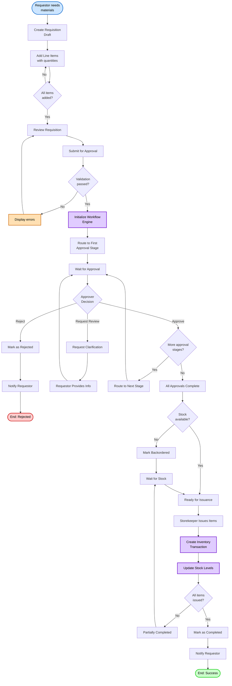

**Flow Steps**:

1. **Start**: Requestor (Chef, Housekeeper, Engineer) identifies need for materials
2. **Create**: User creates draft requisition with basic information
3. **Add Items**: User adds products with requested quantities
4. **Review**: User reviews requisition for completeness
5. **Submit**: User submits requisition for approval
6. **Validate**: System validates data against business rules
7. **Initialize Workflow**: System queries workflow engine for approval routing
8. **Route**: System routes to first approval stage (e.g., Department Manager)
9. **Wait for Approval**: System waits for approver action
10. **Approver Action**: Approver reviews and makes decision:
    - **Approve**: Continue to next stage or completion
    - **Reject**: End process with rejection notification
    - **Request Review**: Request clarification from requestor
11. **Check Stage**: System determines if more approval stages required
12. **All Approved**: All workflow stages completed successfully
13. **Check Stock**: System verifies stock availability
14. **Issue**: Storekeeper issues items to department
15. **Create Transaction**: System creates inventory transaction records
16. **Update Stock**: System updates stock levels (reduce source, increase destination)
17. **Complete**: System marks requisition as completed
18. **Notify**: System sends completion notification to requestor

**Exception Handling**:
- **Validation errors**: Display errors, return to review step
- **Rejection at any stage**: Notify requestor, end process
- **Stock unavailable**: Mark as backordered, wait for stock arrival
- **Partial issuance**: Track issued quantities, allow multiple issuance batches
- **Database failure**: Rollback transaction, log error, retry
- **Workflow engine error**: Fallback to default workflow, alert admin

---

### Requisition Creation Flow

**Purpose**: Detailed view of requisition creation process including inline item addition and validation

**Route**: `/store-operations/store-requisitions/new`

```mermaid
flowchart TD
    Start([User clicks<br>'New Requisition']) --> Navigate[Navigate to<br>/store-requisitions/new]
    Navigate --> InitForm[Initialize Form<br>with Defaults]
    InitForm --> AutoPopulate[Auto-populate:<br>- Requisition Number<br>- Date<br>- Requested By]

    AutoPopulate --> HeaderInput[User Enters Header Info:<br>- Expected Delivery Date<br>- Request From Location<br>- Description<br>- Job Code/Project]

    HeaderInput --> DetermineLocType[Determine Location Type<br>INVENTORY/DIRECT/CONSIGNMENT]
    DetermineLocType --> DisplayLocType[Display Location Type Badge]

    DisplayLocType --> SaveDraft{User saves<br>draft?}
    SaveDraft -->|Yes| ValidateHeader{Valid header<br>data?}
    ValidateHeader -->|No| HeaderError[Display validation errors]
    HeaderError --> HeaderInput

    ValidateHeader -->|Yes| GenerateSRNo[Generate SR Number<br>SR-YYMM-NNNN]
    GenerateSRNo --> SaveHeader[(Save Header<br>status=draft)]
    SaveHeader --> ItemSection[Enable Inline Item Addition]

    SaveDraft -->|No| ItemSection

    ItemSection --> ClickAddItem[User clicks 'Add Item' button]
    ClickAddItem --> ActivateInline[Activate Inline Add Row<br>isAddingItem=true]
    ActivateInline --> ShowPopover[Show Popover with<br>Command Search]
    ShowPopover --> SearchProduct[User types in<br>CommandInput]
    SearchProduct --> FilterProducts[Filter CommandList<br>in real-time]
    FilterProducts --> SelectProduct[User selects product<br>from CommandItem]
    SelectProduct --> CheckStock[Real-time Stock<br>Availability Check]
    CheckStock --> ShowStock[Display Available Qty]
    ShowStock --> EnterQty[User enters quantity<br>in inline input]
    EnterQty --> ValidateInline{Valid item<br>data?}
    ValidateInline -->|No| InlineError[Display inline error]
    InlineError --> EnterQty

    ValidateInline -->|Yes| ClickConfirm{User clicks<br>Add or Cancel?}
    ClickConfirm -->|Cancel| ResetInline[Reset inline state<br>isAddingItem=false]
    ResetInline --> ItemSection

    ClickConfirm -->|Add| SaveItem[(Save Line Item<br>sequence_no++)]
    SaveItem --> ClearInline[Clear inline row<br>Reset state]
    ClearInline --> MoreItems{Add more<br>items?}
    MoreItems -->|Yes| ClickAddItem
    MoreItems -->|No| ReviewAll[Review All Items<br>in Table]

    ReviewAll --> EditItem{Need to<br>edit items?}
    EditItem -->|Yes| InlineEdit[Edit item inline<br>or Delete]
    InlineEdit --> ReviewAll

    EditItem -->|No| ReadySubmit{Ready to<br>submit?}
    ReadySubmit -->|No| SaveDraft2[(Save Draft)]
    SaveDraft2 --> End1([End: Draft Saved])

    ReadySubmit -->|Yes| FinalValidate{Final validation<br>passed?}
    FinalValidate -->|No| ValidationErrors[Display all errors]
    ValidationErrors --> ReviewAll

    FinalValidate -->|Yes| ConfirmSubmit[Confirmation Dialog]
    ConfirmSubmit --> SubmitReq[(Submit Requisition<br>status=in_progress)]
    SubmitReq --> InitWorkflow[Initialize Workflow]
    InitWorkflow --> NotifyApprover[Notify First Approver]
    NotifyApprover --> RedirectDetail[Navigate to Detail Page]
    RedirectDetail --> Success([End: Submitted])

    style Start fill:#cce5ff,stroke:#0066cc,stroke-width:2px,color:#000
    style Navigate fill:#cce5ff,stroke:#0066cc,stroke-width:2px,color:#000
    style Success fill:#ccffcc,stroke:#00cc00,stroke-width:2px,color:#000
    style End1 fill:#e8e8e8,stroke:#333,stroke-width:2px,color:#000
    style HeaderError fill:#ffe0b3,stroke:#cc6600,stroke-width:2px,color:#000
    style InlineError fill:#ffe0b3,stroke:#cc6600,stroke-width:2px,color:#000
    style ValidationErrors fill:#ffe0b3,stroke:#cc6600,stroke-width:2px,color:#000
    style SaveHeader fill:#e0ccff,stroke:#6600cc,stroke-width:2px,color:#000
    style SaveItem fill:#e0ccff,stroke:#6600cc,stroke-width:2px,color:#000
    style SubmitReq fill:#e0ccff,stroke:#6600cc,stroke-width:2px,color:#000
    style ActivateInline fill:#d4edda,stroke:#28a745,stroke-width:2px,color:#000
    style ShowPopover fill:#d4edda,stroke:#28a745,stroke-width:2px,color:#000
    style DetermineLocType fill:#fff3cd,stroke:#ffc107,stroke-width:2px,color:#000
```

**Key Features**:
- **Dedicated creation page**: User navigates to `/store-requisitions/new` instead of using a modal
- **Auto-populated fields**: "Requested By" displays current user's name automatically
- **"Request From" terminology**: Source location dropdown labeled as "Request From"
- **Location Type handling**: System determines INVENTORY, DIRECT, or CONSIGNMENT based on location
- **Inline add item pattern**: Product selection uses Popover with Command component for searchable dropdown
- **Real-time stock check**: System shows available stock when selecting products
- **Sequential item addition**: Items numbered sequentially (1, 2, 3...)
- **Validation at multiple stages**: Header validation, inline item validation, final submission validation
- **SR Number generation**: System auto-generates requisition number in format SR-YYMM-NNNN

**State Management**:
```typescript
// Key inline add item state variables
isAddingItem: boolean      // Controls inline row visibility
newItemProductId: string   // Selected product ID
newItemQty: number         // Entered quantity
productSearchOpen: boolean // Controls Popover visibility
```

---

### Item Issuance Flow

**Purpose**: Process of issuing approved items from store to department with receipt signature capture and inventory transaction creation

```mermaid
flowchart TD
    Start([Storekeeper opens<br>approved requisition]) --> ViewItems[View Approved Items]
    ViewItems --> SelectItems[Select Items to Issue]
    SelectItems --> ItemLoop[For Each Selected Item]

    ItemLoop --> VerifyStock{Stock available<br>in location?}
    VerifyStock -->|No| MarkBackorder[Mark Item Backordered]
    MarkBackorder --> NextItem{More items<br>to process?}

    VerifyStock -->|Yes| EnterIssuedQty[Enter Issued Quantity<br>≤ approved_qty]
    EnterIssuedQty --> OptionalBatch[Enter Batch/Lot Number<br>if applicable]
    OptionalBatch --> ValidateIssuance{Valid issuance<br>data?}

    ValidateIssuance -->|No| IssuanceError[Display error]
    IssuanceError --> EnterIssuedQty

    ValidateIssuance -->|Yes| ClickIssue[Click Issue Button]
    ClickIssue --> ShowSignatureDialog[Display Receipt<br>Signature Dialog]
    ShowSignatureDialog --> DisplayItems[Show Items Summary:<br>- Item descriptions<br>- Qty to issue<br>- Units]

    DisplayItems --> SignatureCanvas[Requestor Signs<br>on Canvas]
    SignatureCanvas --> HasSignature{Signature<br>drawn?}

    HasSignature -->|No| WaitSignature[Wait for Signature<br>Confirm disabled]
    WaitSignature --> SignatureActions{User Action?}
    SignatureActions -->|Draw| SignatureCanvas
    SignatureActions -->|Cancel| CancelSignature[Close Dialog<br>No Action]
    CancelSignature --> ViewItems

    HasSignature -->|Yes| EnableConfirm[Enable Confirm Button]
    EnableConfirm --> ConfirmReceipt{User clicks<br>Confirm Receipt?}
    ConfirmReceipt -->|Cancel| CancelSignature
    ConfirmReceipt -->|Confirm| CaptureSignature[Capture Signature Data:<br>- Base64 PNG image<br>- Timestamp]

    CaptureSignature --> StartTxn[(BEGIN TRANSACTION)]
    StartTxn --> CreateInventoryTxn[Create Inventory Transaction:<br>- Type: store_requisition<br>- From: source location<br>- To: destination location<br>- Qty: issued_qty<br>- Ref: SR number]

    CreateInventoryTxn --> UpdateStock1[Reduce Stock at<br>Source Location]
    UpdateStock1 --> UpdateStock2[Increase Stock at<br>Destination Location]
    UpdateStock2 --> UpdateItem[Update Line Item:<br>- issued_qty<br>- inventory_transaction_id<br>- last_action=issued]

    UpdateItem --> StoreSignature[Store Receipt Data:<br>- receipt_signature<br>- receipt_timestamp<br>- received_by]

    StoreSignature --> CheckFullyIssued{issued_qty ==<br>approved_qty?}
    CheckFullyIssued -->|Yes| MarkItemComplete[Mark Item Fully Issued]
    CheckFullyIssued -->|No| MarkItemPartial[Mark Item Partially Issued]

    MarkItemComplete --> CommitTxn[(COMMIT TRANSACTION)]
    MarkItemPartial --> CommitTxn

    CommitTxn --> LogIssuance[Log Issuance in History<br>with Signature]
    LogIssuance --> NextItem

    NextItem -->|Yes| ItemLoop
    NextItem -->|No| CheckAllIssued{All items<br>fully issued?}

    CheckAllIssued -->|Yes| MarkReqComplete[(Update Requisition<br>status=completed)]
    CheckAllIssued -->|No| MarkReqPartial[(Update Requisition<br>status=in_progress)]

    MarkReqComplete --> NotifyRequestor[Notify Requestor<br>Items Issued]
    MarkReqPartial --> NotifyRequestor
    NotifyRequestor --> Success([End: Items Issued])

    StartTxn -->|Error| RollbackTxn[(ROLLBACK TRANSACTION)]
    RollbackTxn --> ErrorHandle[Log Error & Alert]
    ErrorHandle --> Fail([End: Issuance Failed])

    style Start fill:#cce5ff,stroke:#0066cc,stroke-width:2px,color:#000
    style Success fill:#ccffcc,stroke:#00cc00,stroke-width:2px,color:#000
    style Fail fill:#ffcccc,stroke:#cc0000,stroke-width:2px,color:#000
    style IssuanceError fill:#ffe0b3,stroke:#cc6600,stroke-width:2px,color:#000
    style ShowSignatureDialog fill:#fff3cd,stroke:#ffc107,stroke-width:2px,color:#000
    style SignatureCanvas fill:#d4edda,stroke:#28a745,stroke-width:2px,color:#000
    style CaptureSignature fill:#d4edda,stroke:#28a745,stroke-width:2px,color:#000
    style StoreSignature fill:#e0ccff,stroke:#6600cc,stroke-width:2px,color:#000
    style CreateInventoryTxn fill:#e0ccff,stroke:#6600cc,stroke-width:2px,color:#000
    style UpdateStock1 fill:#e0ccff,stroke:#6600cc,stroke-width:2px,color:#000
    style UpdateStock2 fill:#e0ccff,stroke:#6600cc,stroke-width:2px,color:#000
```

**Receipt Signature Capture**:
- Dialog displays items summary table with quantities to be issued
- Canvas-based signature capture with mouse and touch support
- Confirm button disabled until signature is drawn
- Clear button to reset signature canvas
- Signature encoded as Base64 PNG via `canvas.toDataURL('image/png')`
- Timestamp captured at confirmation

**Transaction Safety**:
- All database operations in single transaction (BEGIN → COMMIT/ROLLBACK)
- Atomic updates: Inventory transaction + stock updates + line item update all succeed or all fail
- Rollback on any error preserves data integrity

**Partial Issuance Support**:
- Can issue less than approved quantity
- Track issued_qty separately from approved_qty
- Allow multiple issuance batches over time
- Requisition remains "in_progress" until all items fully issued

---

## Approval Workflow Diagram

### Multi-Stage Approval with Workflow Engine

**Purpose**: Dynamic approval routing based on workflow engine configuration, supporting multi-stage sequential and parallel approvals

**Usage**: Store Requisitions use workflow engine integration via tb_workflow table

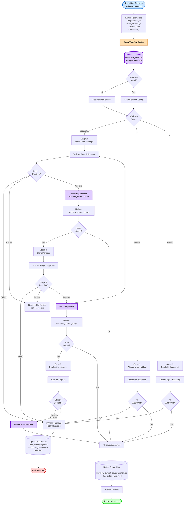

**Workflow Engine Features**:
- **Dynamic routing**: Approval stages determined at runtime based on department, amount, priority
- **Workflow history tracking**: All approvals recorded in workflow_history JSON field
- **Current stage tracking**: workflow_current_stage, workflow_previous_stage, workflow_next_stage fields
- **Flexible stages**: Number and type of approval stages configurable per workflow
- **Review action**: Approvers can request clarification without rejecting
- **Sequential**: Each stage approves before moving to next
- **Parallel**: Multiple approvers at same stage approve concurrently
- **Hybrid**: Mix of sequential and parallel stages

**Workflow Data Storage**:
```json
workflow_history example:
[
  {
    "stage": "Department Manager Approval",
    "stage_order": 1,
    "action": "approved",
    "actor_id": "user-uuid-123",
    "actor_name": "John Smith",
    "actor_role": "Department Manager",
    "timestamp": "2025-01-16T09:15:00Z",
    "comments": "Approved for kitchen supplies",
    "approved_items": ['all']
  },
  {
    "stage": "Store Manager Review",
    "stage_order": 2,
    "action": "approved",
    "actor_id": "user-uuid-456",
    "actor_name": "Jane Doe",
    "actor_role": "Store Manager",
    "timestamp": "2025-01-16T14:30:00Z",
    "comments": "Stock available, approved for issuance",
    "approved_items": ['all']
  }
]
```

---

### Item-Level Approval Flow

**Purpose**: Approve or reject individual line items independently, support partial approvals

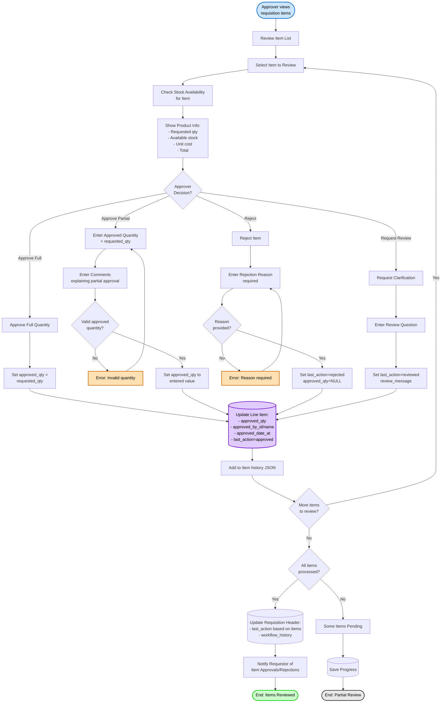

**Item-Level Tracking**:
- Each item has independent approval status (approved, rejected, reviewed)
- Approver can approve full quantity or partial quantity
- Comments required for partial approvals and rejections
- Item history JSON tracks all actions on each item
- Requisition can have mixed item statuses (some approved, some rejected)

---

## Data Flow Diagram

### Level 0: Context Diagram

**Purpose**: Show the Store Requisitions system in context with external entities

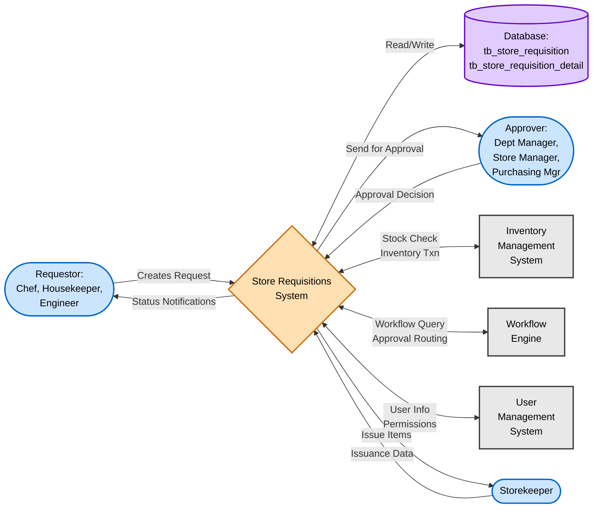

**External Entities**:
- **Requestor**: Department staff who create requisitions (Chef, Housekeeper, Engineering Technician)
- **Approver**: Managers who approve requisitions (Department Manager, Store Manager, Purchasing Manager)
- **Storekeeper**: Staff who issue materials from store to departments
- **Database**: PostgreSQL database storing requisition data
- **Inventory Management System**: External module managing stock levels and transactions
- **Workflow Engine**: External module managing approval workflows
- **User Management System**: External module managing users, roles, permissions

---

### Level 1: System Decomposition

**Purpose**: Show major processes and data stores within Store Requisitions system

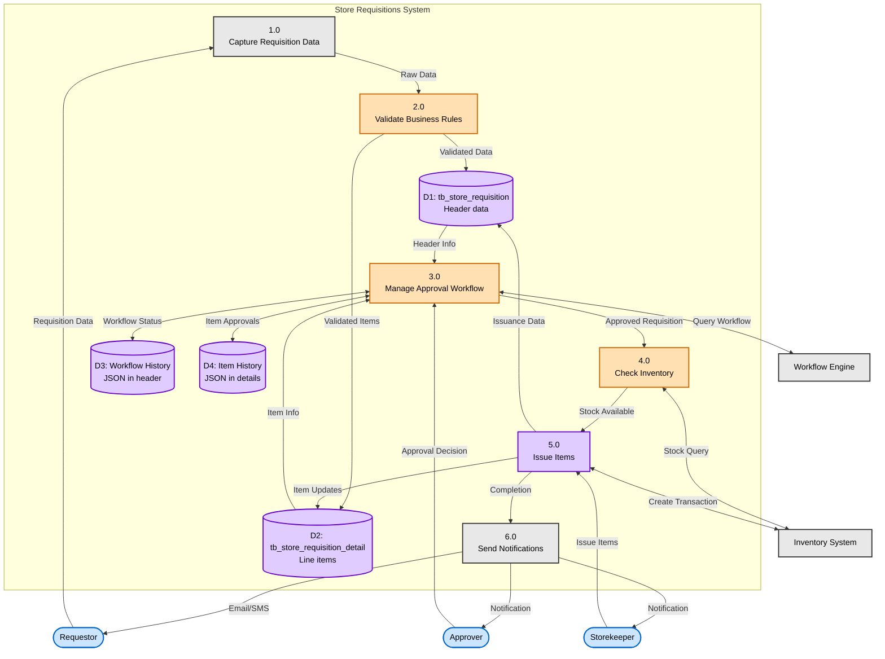

**Data Stores**:
- **D1: tb_store_requisition**: Main requisition header data (SR number, status, workflow tracking, audit fields)
- **D2: tb_store_requisition_detail**: Line item data (products, quantities, approval status)
- **D3: Workflow History**: Approval history stored in workflow_history JSON field
- **D4: Item History**: Item-level action history stored in history JSON field

**Processes**:
1. **1.0 Capture Requisition Data**: Receive and collect user input for header and line items
2. **2.0 Validate Business Rules**: Validate against business rules (required fields, quantities, stock availability)
3. **3.0 Manage Approval Workflow**: Handle multi-stage approval workflow with workflow engine
4. **4.0 Check Inventory**: Verify stock availability and reserve stock if needed
5. **5.0 Issue Items**: Process item issuance, create inventory transactions, update stock levels
6. **6.0 Send Notifications**: Notify relevant parties at each stage (submission, approval, issuance)

---

## Sequence Diagram

### Create Requisition Sequence

**Purpose**: Time-ordered sequence of component interactions when creating a new requisition

**Scenario**: Chef creates new requisition for kitchen supplies

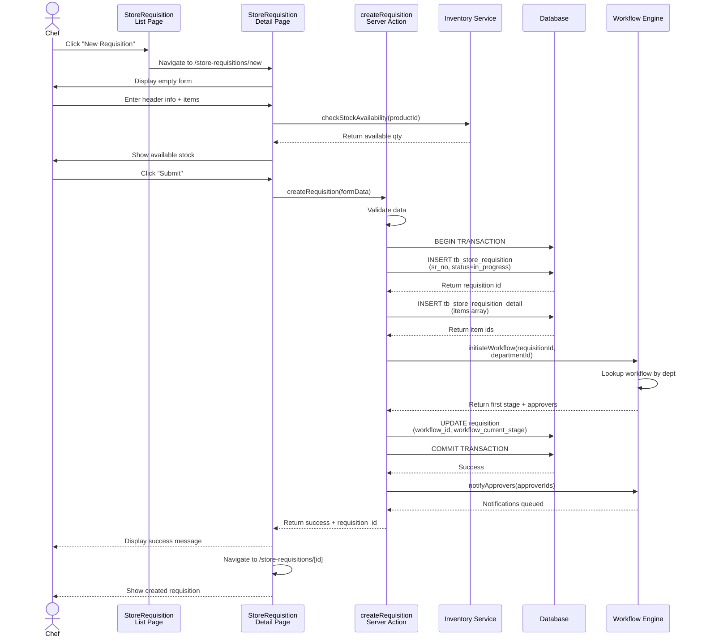

**Key Interactions**:
1. Chef initiates action through UI
2. UI navigates to detail page with empty form
3. Detail page queries inventory service for stock availability
4. Chef submits completed form
5. Server action validates data
6. Server action creates requisition and items in database transaction
7. Server action initializes workflow via workflow engine
8. Workflow engine returns first approval stage and approvers
9. Server action updates requisition with workflow info
10. Server action triggers notifications to approvers
11. UI displays success and navigates to created requisition

**Timing**:
- Synchronous operations (1-10): ~500ms total
- Asynchronous operations (notifications): Background, ~5-10 seconds

---

### Approval Sequence Diagram

**Purpose**: Component interactions during approval process

**Scenario**: Department Manager approves requisition

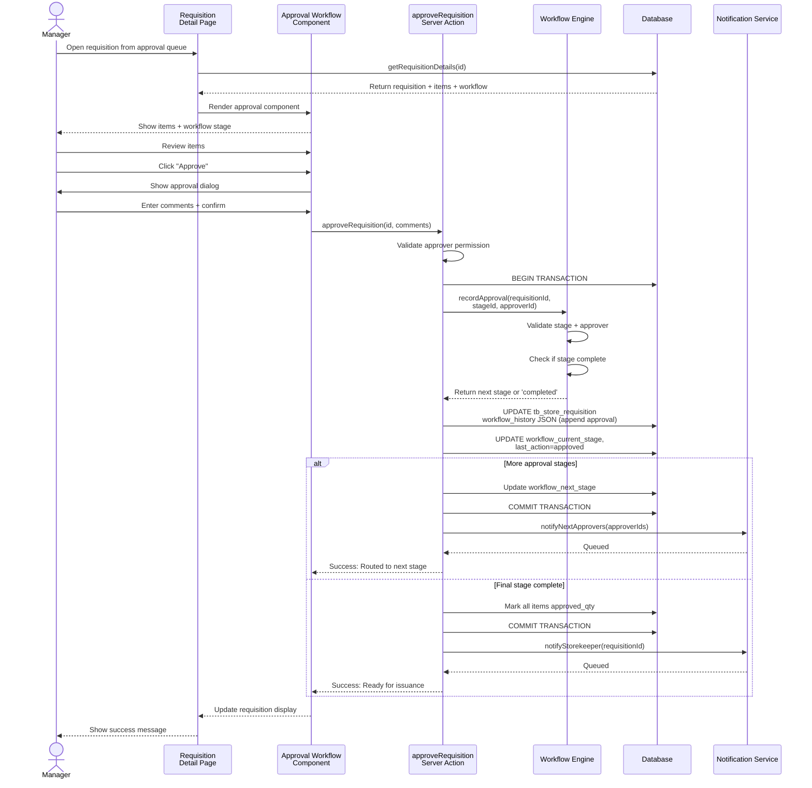

**Key Decision Points**:
- **Validate approver permission**: Server action verifies user has authority for current workflow stage
- **Check stage complete**: Workflow engine determines if all approvers at current stage have approved
- **More stages?**: Workflow engine determines if additional approval stages required
- **Next stage or completed**: Routes to next approval stage or marks as ready for issuance

---

### Issuance Sequence Diagram

**Purpose**: Component interactions during item issuance with receipt signature capture and inventory transaction creation

**Scenario**: Storekeeper issues approved items to department with requestor signature

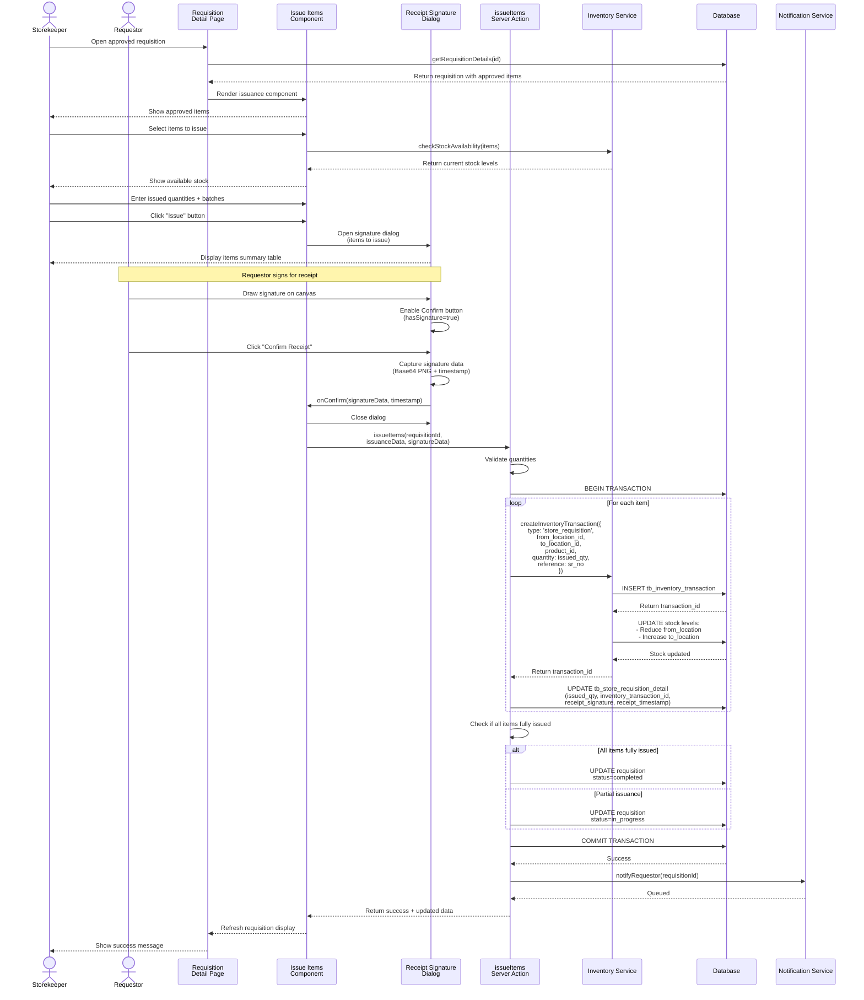

**Receipt Signature Sequence**:
1. Storekeeper clicks "Issue" button in Issue workflow stage
2. System displays ReceiptSignatureDialog with items summary
3. Requestor draws signature on canvas (mouse or touch)
4. System enables "Confirm Receipt" button when signature detected
5. Requestor clicks "Confirm Receipt"
6. System captures signature as Base64 PNG and timestamp
7. System proceeds with inventory transaction
8. Signature data stored with issuance record

**Transaction Flow**:
1. All issuance operations in single database transaction
2. For each item:
   - Create inventory transaction record
   - Update stock at source location (reduce)
   - Update stock at destination location (increase)
   - Update line item with issued_qty and transaction_id
3. Update requisition status (completed or in_progress)
4. Commit transaction (all succeed or all fail)
5. Send notification to requestor

**Atomicity**:
- If any step fails, entire transaction rolled back
- Stock levels remain consistent
- No partial inventory updates

---

## State Diagram

### Requisition Status State Diagram

**Purpose**: Document all possible status states and transitions for requisition header

**Entity**: tb_store_requisition (status field: doc_status)

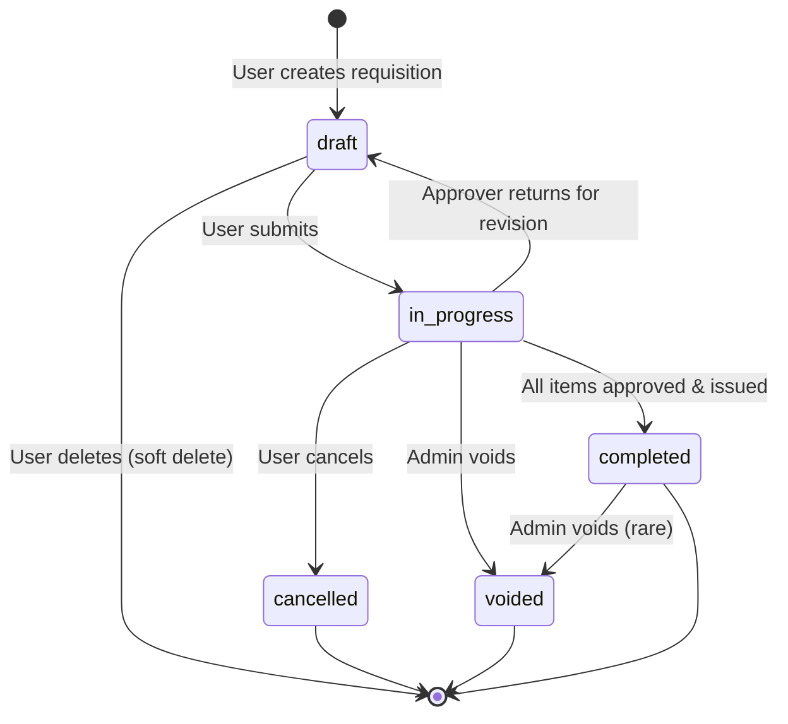

**State Definitions**:

| State | Description | Can Transition To | Entry Actions | Exit Actions |
|-------|-------------|-------------------|---------------|--------------|
| draft | Initial state, user editing | in_progress, Deleted | Set doc_status=draft, Generate SR number | Validate completeness |
| in_progress | Submitted, in approval workflow | completed, cancelled, voided, draft | Initialize workflow, Notify approvers, Lock editing | - |
| completed | All items approved and issued | voided | Mark all items issued, Close workflow | Archive after 12 months |
| cancelled | User cancelled before completion | None | Release reserved stock, Notify parties, Close workflow | - |
| voided | Admin voided (error correction) | None | Reverse transactions if needed, Log reason | - |

**Transition Rules**:

1. **draft → in_progress**:
   - **Trigger**: User clicks "Submit"
   - **Guards**: All required fields complete, at least 1 line item, valid source location, valid department
   - **Actions**: Generate SR number if not exists, initialize workflow, notify first approvers, set status=in_progress

2. **in_progress → completed**:
   - **Trigger**: Last item fully issued
   - **Guards**: All items have issued_qty == approved_qty, all workflow stages complete
   - **Actions**: Set status=completed, close workflow, notify requestor

3. **in_progress → cancelled**:
   - **Trigger**: User clicks "Cancel" or admin cancels
   - **Guards**: User is creator OR user is admin, no items issued yet
   - **Actions**: Set status=cancelled, release any reserved stock, notify parties, close workflow

4. **in_progress → draft**:
   - **Trigger**: Approver clicks "Return for Revision"
   - **Guards**: Workflow allows returns, no items issued
   - **Actions**: Set status=draft, clear workflow data, notify requestor

5. **Any → voided**:
   - **Trigger**: Admin voids requisition
   - **Guards**: User has admin role, reason provided
   - **Actions**: Set status=voided, reverse inventory transactions if issued, log reason, notify parties

**State Guards** (Conditions that must be met for transitions):

**Can Submit Guard**:
- **Condition Name**: Can Submit Requisition
- **Required Checks**:
  - Header: sr_date provided, from_location_id set, department_id set, requestor_id set
  - Items: At least 1 line item exists, all items have product_id and requested_qty > 0
  - Validation: No validation errors
- **Implementation**: Application validates before allowing submission

**Can Cancel Guard**:
- **Condition Name**: Can Cancel Requisition
- **Required Checks**:
  - User is creator (created_by_id) OR user has 'admin' role
  - Status is 'in_progress' (not completed/voided/cancelled)
  - No items have been issued (all issued_qty IS NULL or = 0)
- **Implementation**: Application checks user permission and issued quantities

**Can Void Guard**:
- **Condition Name**: Can Void Requisition
- **Required Checks**:
  - User has 'admin' role
  - Reason for voiding provided (mandatory for audit)
  - Status is not already 'voided'
- **Implementation**: Application restricts void action to admin users only

---

### Line Item Status State Diagram

**Purpose**: Document status states and transitions for individual line items

**Entity**: tb_store_requisition_detail (status field: last_action)

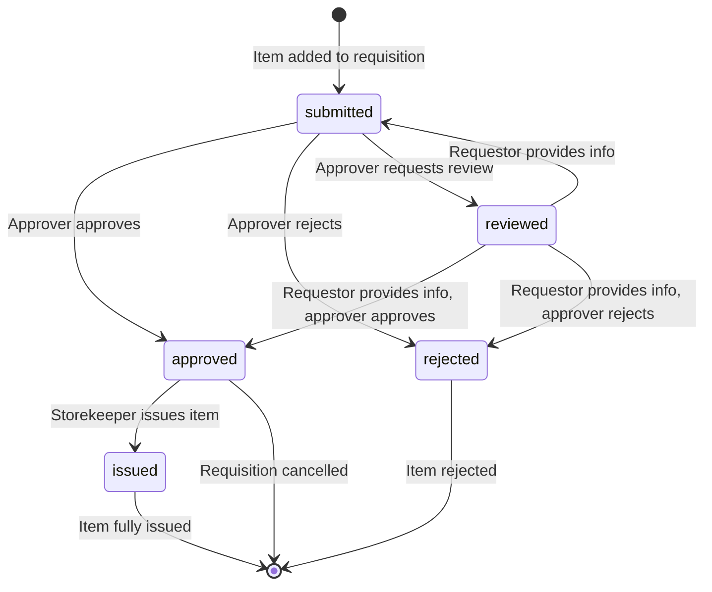

**State Definitions**:

| State | Description | Can Transition To | Entry Actions | Exit Actions |
|-------|-------------|-------------------|---------------|--------------|
| submitted | Item added, awaiting approval | approved, rejected, reviewed | Set last_action=submitted, requested_qty set | - |
| approved | Approver approved item | issued | Set approved_qty, approved_by_id/name, approved_date_at, last_action=approved | - |
| rejected | Approver rejected item | None | Set reject_message, reject_by_id/name, reject_date_at, last_action=rejected | - |
| reviewed | Approver requests clarification | approved, rejected, submitted | Set review_message, review_by_id/name, review_date_at, last_action=reviewed | - |
| issued | Item issued to department | None | Set issued_qty, inventory_transaction_id, update stock | - |

**Item-Level Transition Rules**:

1. **submitted → approved**:
   - **Guards**: Approver has permission for current workflow stage, approved_qty ≤ requested_qty
   - **Actions**: Set approved_qty (full or partial), record approver details, update last_action=approved

2. **submitted → rejected**:
   - **Guards**: Approver has permission, rejection reason provided
   - **Actions**: Set reject_message, record rejector details, set last_action=rejected, approved_qty remains NULL

3. **submitted → reviewed**:
   - **Guards**: Approver has permission, review question provided
   - **Actions**: Set review_message, record reviewer details, set last_action=reviewed, notify requestor

4. **reviewed → approved/rejected**:
   - **Guards**: Requestor provided clarification, approver re-reviews
   - **Actions**: Follow normal approval or rejection flow

5. **approved → issued**:
   - **Guards**: Requisition workflow complete, stock available, issued_qty ≤ approved_qty
   - **Actions**: Set issued_qty, link to inventory_transaction_id, update stock levels

**Parallel Item States**:
- Different items within same requisition can have different states simultaneously
- Example: Item 1 approved, Item 2 rejected, Item 3 under review, Item 4 issued
- Requisition remains "in_progress" until all items reach terminal state (issued, rejected, or cancelled)

---

## System Integration Flow

### Inventory Integration Flow

**Purpose**: Integration with Inventory Management module for stock checks and inventory transactions

**Systems Involved**:
- **Internal**: Store Requisitions module
- **External**: Inventory Management module
- **Integration Method**: Direct service calls (shared database, service layer)

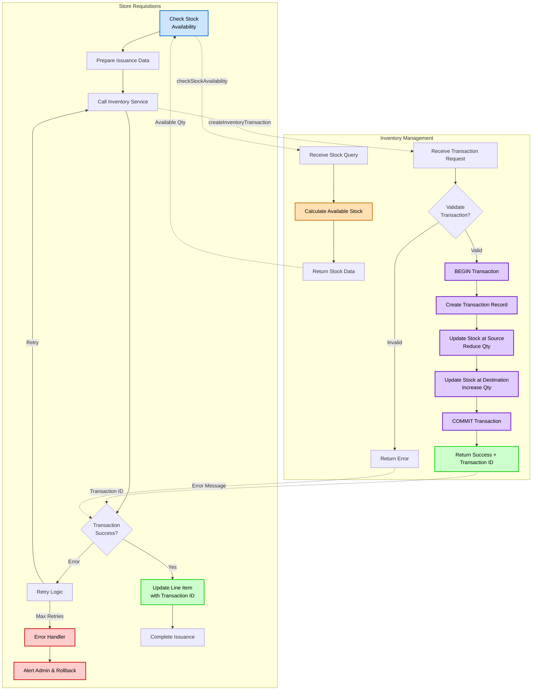

**Integration Points**:

**1. Stock Availability Check**:
- **Method**: `checkStockAvailability(productId, locationId)`
- **When**: During requisition creation (real-time), before approval, before issuance
- **Request**: `{ product_id: UUID, location_id: UUID }`
- **Response**: `{ available_qty: Decimal, on_order: Decimal, reserved: Decimal }`
- **Purpose**: Display available stock to user, validate quantities

**2. Create Inventory Transaction**:
- **Method**: `createInventoryTransaction(transactionData)`
- **When**: When storekeeper issues items
- **Request**:
```json
{
  "type": "store_requisition",
  "from_location_id": "uuid",
  "to_location_id": "uuid",
  "product_id": "uuid",
  "quantity": 10.00000,
  "reference_type": "store_requisition",
  "reference_id": "requisition_uuid",
  "reference_number": "SR-2501-0001",
  "batch_lot_number": "BATCH-123 (optional)",
  "performed_by_id": "user_uuid"
}
```
- **Response**: `{ transaction_id: UUID, success: boolean, error?: string }`
- **Purpose**: Record stock movement, update stock levels atomically

**3. Validate Stock Availability**:
- **Method**: `validateStockAvailability(productId, locationId, requestedQty)`
- **When**: Before approval, before issuance
- **Request**: `{ product_id: UUID, location_id: UUID, requested_qty: Decimal }`
- **Response**: `{ is_available: boolean, available_qty: Decimal, message?: string }`
- **Purpose**: Prevent issuing more than available stock

**Error Handling**:
- **Retry Policy**: Exponential backoff (1s, 2s, 4s) for transient errors
- **Timeout**: 10 seconds per inventory service call
- **Rollback**: Transaction rolled back if inventory update fails
- **Logging**: All inventory calls logged for audit
- **Alerting**: Admin alerted on repeated failures

---

### Workflow Engine Integration

**Purpose**: Integration with Workflow Engine for dynamic approval routing

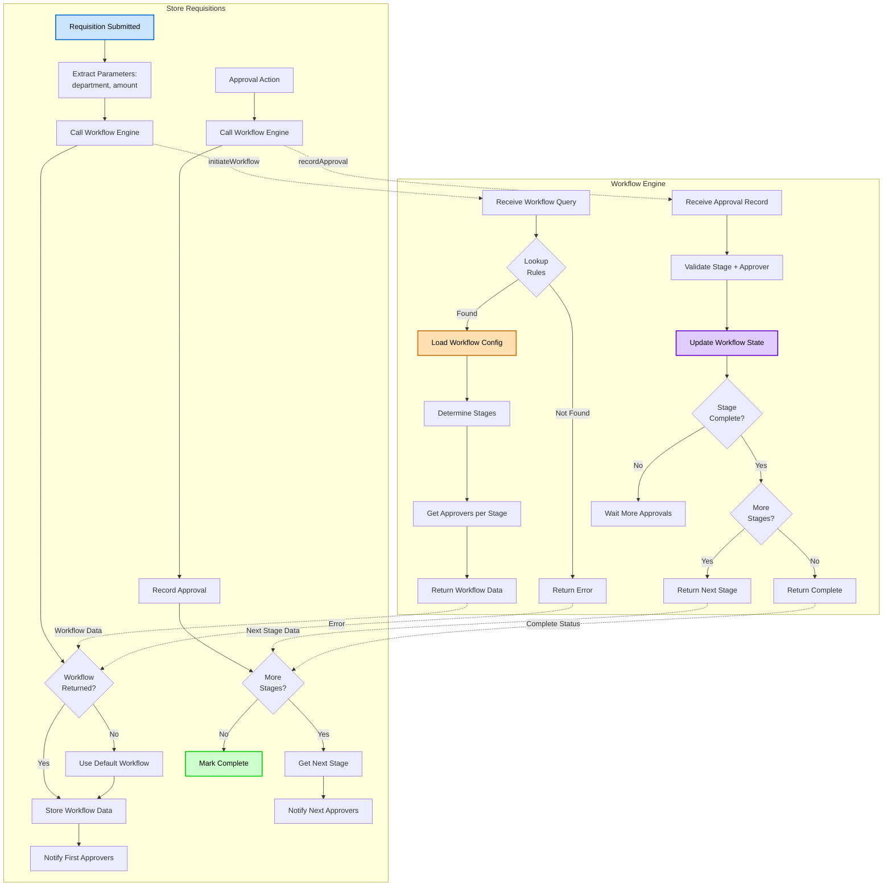

**Integration Methods**:

**1. Initiate Workflow**:
- **Method**: `initiateWorkflow(requisitionId, departmentId, amount?, priority?)`
- **When**: When requisition submitted (status draft → in_progress)
- **Request**: `{ requisition_id: UUID, department_id: UUID, amount?: Decimal, priority?: string }`
- **Response**:
```json
{
  "workflow_id": "uuid",
  "workflow_name": "Standard Department Workflow",
  "workflow_type": "sequential",
  "stages": [
    {
      "stage_id": "uuid",
      "stage_name": "Department Manager Approval",
      "stage_order": 1,
      "approvers": [
        {'user_id': 'uuid', 'user_name': 'John Smith', 'role': 'Department Manager'}
      ]
    },
    {
      "stage_id": "uuid",
      "stage_name": "Store Manager Review",
      "stage_order": 2,
      "approvers": [...]
    }
  ]
}
```

**2. Record Approval**:
- **Method**: `recordApproval(requisitionId, stageId, approverId, comments)`
- **When**: When approver approves/rejects at a stage
- **Request**: `{ requisition_id: UUID, stage_id: UUID, approver_id: UUID, action: 'approved'|'rejected', comments?: string }`
- **Response**:
```json
{
  "stage_complete": true,
  "workflow_complete": false,
  "next_stage": {
    "stage_id": "uuid",
    "stage_name": "Store Manager Review",
    "approvers": [...]
  }
}
```

**3. Get Workflow Status**:
- **Method**: `getWorkflowStatus(requisitionId)`
- **When**: When displaying requisition details
- **Response**: Current workflow state, completed stages, pending stages

---

## Error Handling Flow

### Error Processing Flow

**Purpose**: Document how errors are handled and recovered throughout the requisition lifecycle

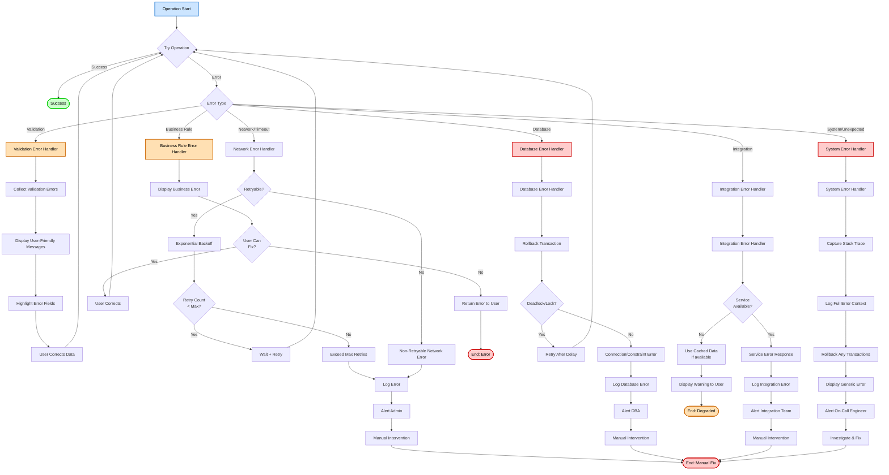

**Error Types and Handling**:

**1. Validation Errors**:
- **Examples**: Missing required fields, invalid quantities, invalid dates
- **Handling**: Collect all errors, display user-friendly messages, highlight fields
- **Recovery**: User corrects data and resubmits
- **Logging**: Not logged (expected user errors)

**2. Network/Timeout Errors**:
- **Examples**: API timeout, service unavailable, connection refused
- **Handling**: Retry with exponential backoff (1s, 2s, 4s, 8s, 16s max)
- **Max Retries**: 5 attempts
- **Recovery**: If retries exhausted, alert admin for manual intervention
- **Logging**: Log all network errors with full context

**3. Business Rule Errors**:
- **Examples**: Stock not available, workflow not configured, user lacks permission
- **Handling**: Display clear business error message to user
- **Recovery**: If user can fix (e.g., select different product), allow correction; otherwise return error
- **Logging**: Log business rule violations for analytics

**4. Database Errors**:
- **Examples**: Deadlock, connection error, constraint violation, timeout
- **Handling**: Immediate transaction rollback
- **Deadlock**: Retry after short delay (200ms)
- **Other DB Errors**: Alert DBA, manual intervention
- **Recovery**: Retry for transient errors, manual fix for persistent errors
- **Logging**: Log all database errors with query context

**5. Integration Errors**:
- **Examples**: Inventory service down, workflow engine error, external API failure
- **Handling**: Use cached data if available, display warning
- **Recovery**: Degrade gracefully, retry periodically, alert integration team
- **Logging**: Log all integration failures with request/response

**6. System/Unexpected Errors**:
- **Examples**: Null pointer exception, unhandled exception, out of memory
- **Handling**: Capture full stack trace, rollback transactions, display generic error
- **Recovery**: Alert on-call engineer, investigate root cause, deploy fix
- **Logging**: Log full error context including user action, stack trace, environment

**Error Response Format** (API):
```json
{
  "success": false,
  "error": {
    "type": "VALIDATION_ERROR",
    "message": "Validation failed",
    "code": "VAL_001",
    "details": [
      {
        "field": "sr_date",
        "message": "Requisition date is required",
        "code": "REQUIRED_FIELD"
      },
      {
        "field": "items",
        "message": "At least one line item is required",
        "code": "MIN_ITEMS"
      }
    ]
  }
}
```

---

## Glossary

- **Actor**: User or system that interacts with the process (Chef, Approver, System)
- **Decision Point**: Point where flow branches based on conditions (diamond shape)
- **Fork/Join**: Parallel processing split and synchronization (concurrent activities)
- **Guard**: Condition that must be true for transition to occur (e.g., "Can Submit")
- **State**: Distinct condition or stage in lifecycle (draft, in_progress, completed)
- **Transition**: Movement from one state to another (draft → in_progress)
- **Swimlane**: Visual separation showing actor responsibilities
- **Sequence Diagram**: Shows time-ordered interactions between components
- **Data Flow Diagram**: Shows how data moves through system processes
- **State Diagram**: Shows all possible states and valid transitions
- **Integration Flow**: Shows interaction with external systems

**Store Requisitions Specific**:
- **SR Number**: Requisition business identifier (format: SR-YYMM-NNNN where YY is 2-digit year and MM is month)
- **Workflow Stage**: Approval stage in multi-level workflow
- **Item-Level Approval**: Approving individual line items independently
- **Partial Approval**: Approving less than requested quantity
- **Partial Issuance**: Issuing items in multiple batches
- **Inventory Transaction**: Record of stock movement between locations
- **Workflow Engine**: External module managing approval workflows
- **Stock Availability**: Current available quantity at location

---

## Diagram Conventions

### Notation Guide

**Flowchart Symbols**:
- **Rectangle**: Process step or action
- **Diamond**: Decision point (yes/no branch)
- **Rounded Rectangle**: Start/End point
- **Parallelogram**: Input/Output operation
- **Cylinder**: Database or data store
- **Hexagon**: Subgraph/container for related steps

**Arrow Styles**:
- **Solid Arrow** (→): Direct flow, synchronous
- **Dashed Arrow** (-.->): Return flow, callback, or asynchronous
- **Thick Arrow**: Primary or happy path
- **Thin Arrow**: Alternative or error path

**Colors** (used in diagrams):
- **Blue (#cce5ff)**: Start point, user actors, information
- **Green (#ccffcc)**: Success endpoint, positive outcomes
- **Red (#ffcccc)**: Error endpoint, failures, critical issues
- **Orange (#ffe0b3)**: Warning, validation errors, partial success
- **Purple (#e0ccff)**: Database operations, data storage
- **Gray (#e8e8e8)**: Neutral operations, system processes

**Mermaid Diagram Types Used**:
- **flowchart TD/LR**: Top-down or left-right flowcharts for processes
- **sequenceDiagram**: Time-ordered component interactions
- **stateDiagram-v2**: State machines showing status transitions
- **graph TD**: Decision trees and hierarchical flows

---

## Tools Used

- **Mermaid**: Primary diagramming tool (renders in markdown)
  - Version: Latest (compatible with GitHub/GitLab)
  - Benefits: Text-based, version controlled, renders in documentation
  - All diagrams in this document use Mermaid syntax

---

## Maintenance

### Update Triggers

Update these flow diagrams when:
- **Process changes**: Approval workflow modified, new stages added
- **New features**: Emergency requisitions, bulk requisitions
- **Business rules modified**: Quantity validations, approval thresholds changed
- **System integrations changed**: New integration with accounting system
- **State transitions updated**: New statuses added (e.g., "on_hold")
- **Database schema changes**: New tables, fields affecting flows
- **Error handling changes**: New error types, retry logic modified

### Review Schedule

- **Monthly**: Quick review for any process changes
- **Quarterly**: Comprehensive review of all diagrams
- **On Change**: Immediate update for major changes (new workflow stages, status changes)
- **Annual**: Complete documentation review with stakeholders

### Diagram Update Process

1. Identify which diagrams affected by change
2. Update Mermaid diagram source code
3. Test diagram rendering (preview in markdown viewer)
4. Update related text descriptions and flow steps
5. Cross-reference with other documents (BR, UC, TS, DS, VAL)
6. Review with team for accuracy
7. Commit changes with clear description

---

## Related Documents

- [Business Requirements](./BR-store-requisitions.md) - Functional requirements and business rules
- [Use Cases](./UC-store-requisitions.md) - Detailed user workflows and scenarios
- [Technical Specification](./TS-store-requisitions.md) - System architecture and component design
- [Data Schema](./DS-store-requisitions.md) - Database structure and relationships
- [Validations](./VAL-store-requisitions.md) - Validation rules and Zod schemas
- [Backend Requirements](./BR-store-requisitions.md#10-backend-requirements) - Backend API and service requirements (Section 10 of BR)
- [Inventory Operations Shared Method](../../shared-methods/inventory-operations/SM-inventory-operations.md) - Inventory transaction patterns
- [Costing Methods Shared Method](../../shared-methods/inventory-valuation/SM-costing-methods.md) - FIFO/AVG costing integration

---

**Document End**

> 📝 **Note to Authors**:
> - Keep diagrams focused and not overly complex (max 20-25 nodes per diagram)
> - Use consistent notation and colors throughout all diagrams
> - Update diagrams immediately when process or business rules change
> - Test diagram rendering in target platform (GitHub, GitLab, documentation site)
> - Maintain text descriptions alongside diagrams for accessibility
> - Review diagrams with stakeholders quarterly for accuracy
> - Use subgraphs to group related steps and improve readability
> - Add alt/notes to sequence diagrams for conditional flows
