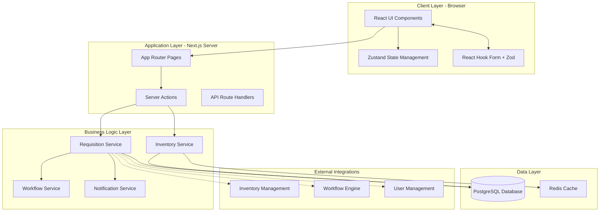
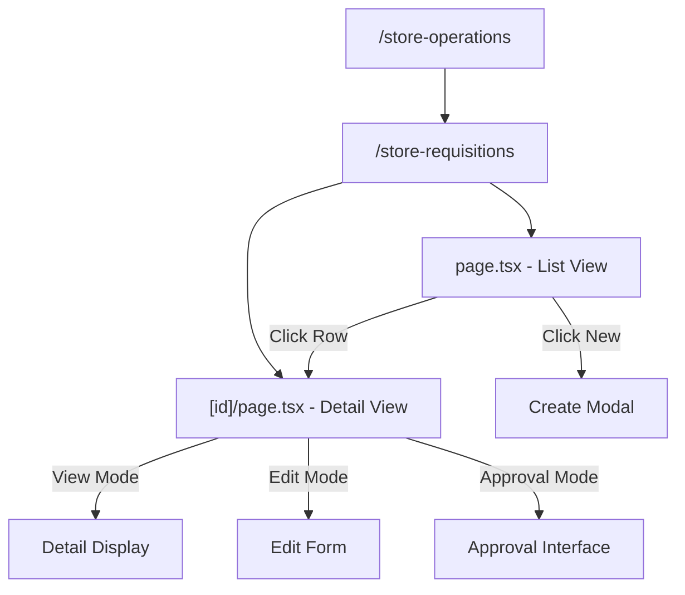
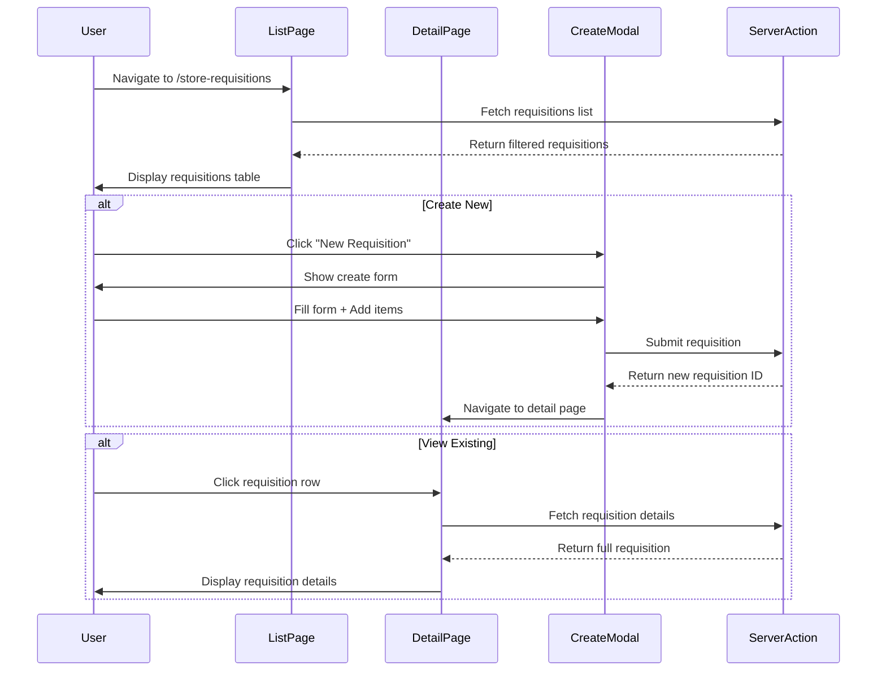
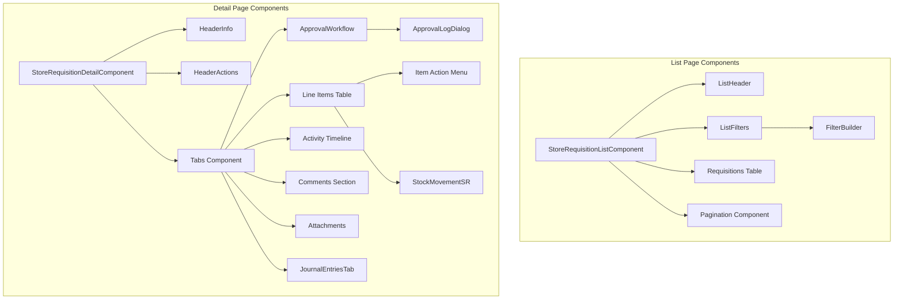
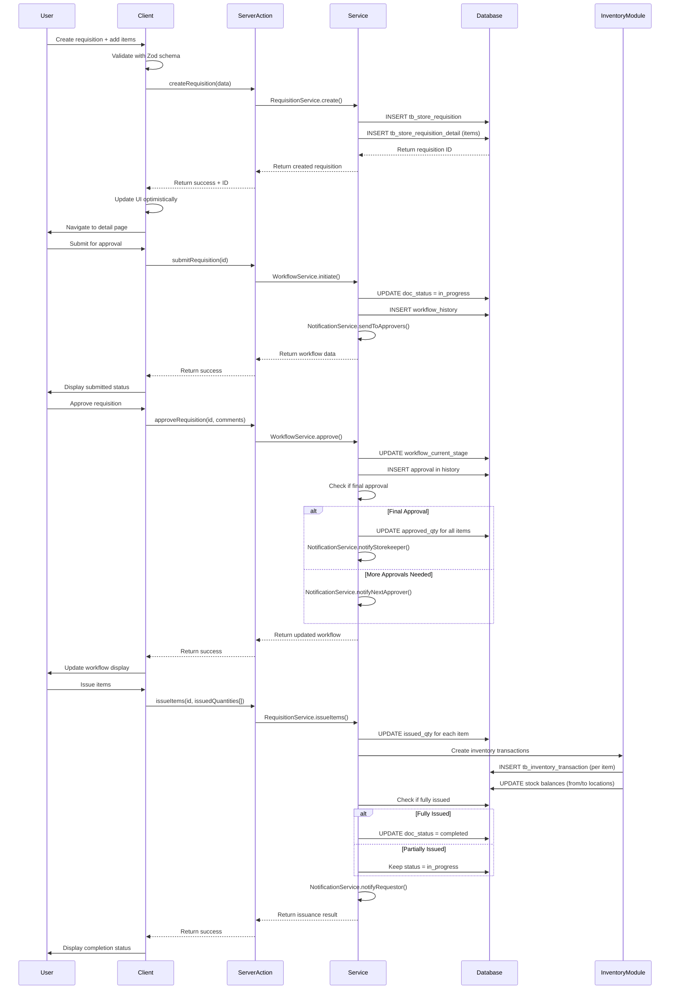
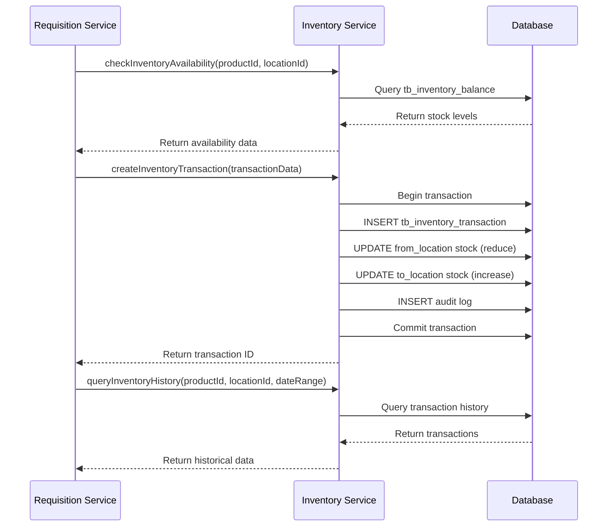
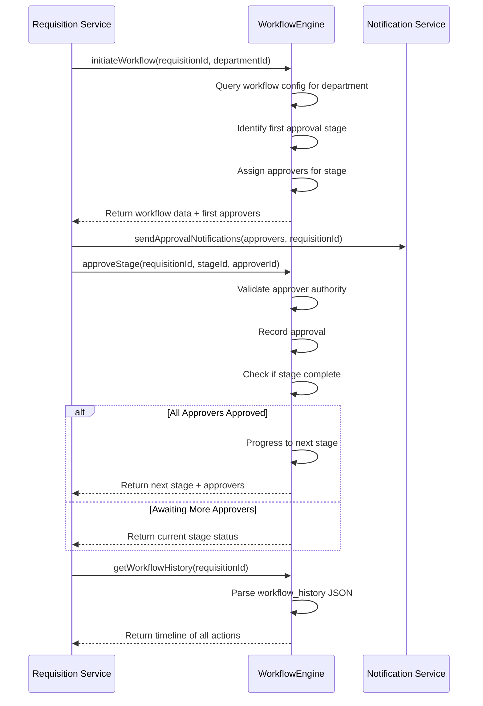
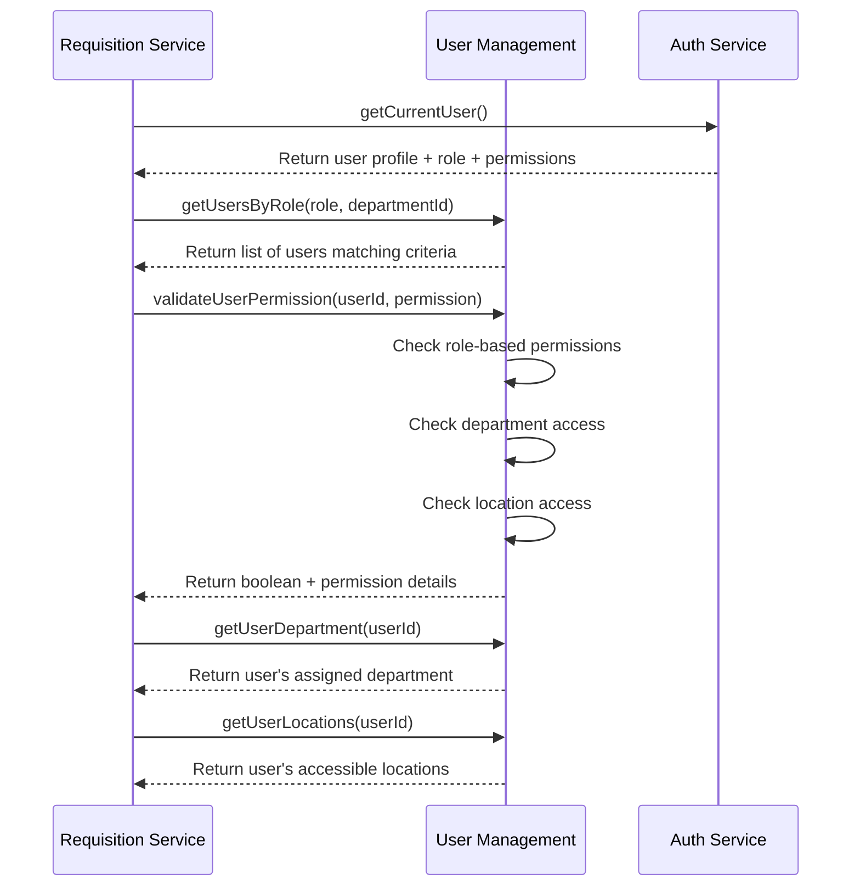
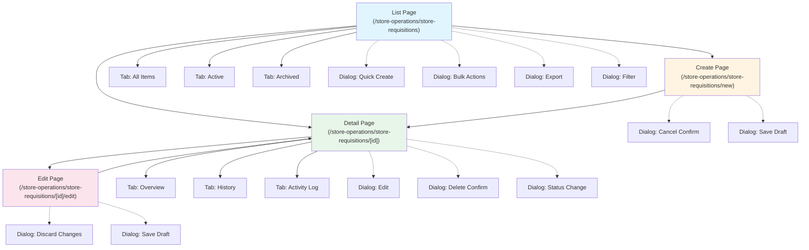

# Technical Specification: Store Requisitions

## Document Information
- **Module**: Store Operations
- **Component**: Store Requisitions
- **Version**: 1.0.0
- **Last Updated**: 2025-11-12
- **Status**: Active - For Implementation

## Related Documents
- [Business Requirements](./BR-store-requisitions.md) - Business rules, requirements, and backend specifications
- [Use Cases](./UC-store-requisitions.md) - User workflows and scenarios
- [Data Definition](./DD-store-requisitions.md) - Database entity descriptions
- [Flow Diagrams](./FD-store-requisitions.md) - Visual workflow diagrams
- [Validations](./VAL-store-requisitions.md) - Validation rules and Zod schemas
- [Backend Requirements](./BR-store-requisitions.md#10-backend-requirements) - API endpoints, server actions (Section 10 of BR)
- [Inventory Operations Shared Method](../../shared-methods/inventory-operations/SM-inventory-operations.md) - Inventory transaction patterns
- [Costing Methods Shared Method](../../shared-methods/inventory-valuation/SM-costing-methods.md) - FIFO/AVG costing integration

## Document History

| Version | Date | Author | Changes |
|---------|------|--------|---------|
| 1.0.0 | 2025-11-19 | Documentation Team | Initial version |
| 1.1.0 | 2025-12-05 | Documentation Team | Synced related documents with BR, added shared methods references |
---

## 1. System Architecture

### 1.1 Architecture Overview

The Store Requisitions module follows Next.js 14 App Router architecture with clear separation between client and server components. The system integrates with Inventory Management, Workflow Engine, and User Management modules through well-defined service interfaces.

### 1.2 Technology Stack

**Frontend**:
- React 18.2+ with Server Components
- Next.js 14.2+ App Router
- TypeScript 5.8+ (strict mode)
- Tailwind CSS for styling
- Shadcn/ui component library
- Radix UI primitives
- Lucide React icons
- React Hook Form for form management
- Zod 3.22+ for validation

**Backend**:
- Next.js Server Actions (primary data mutation pattern)
- PostgreSQL 14+ database
- Prisma ORM 5.8+ for database access
- Server-side rendering and data fetching

**State Management**:
- Zustand 4.5+ for client state
- React Query 5.0+ for server state
- Server Components for data fetching

**Real-time Features**:
- Polling for approval status updates
- WebSocket for live notifications (future enhancement)

---

## 2. Page Hierarchy and Routes

### 2.1 Route Structure

### 2.2 Pages Description

#### 2.2.1 Store Requisitions List Page
**Route**: /store-operations/store-requisitions
**File**: app/(main)/store-operations/store-requisitions/page.tsx
**Component**: StoreRequisitionListComponent

**Purpose**: Display filterable list of requisitions with status-based tabs and search functionality.

**Key Features**:
- Tabbed view: All | My Drafts | Pending Approval | Completed
- Advanced filtering with filter builder
- Sortable columns (date, requisition number, status, value)
- Pagination with page size selector
- Bulk actions (export, print)
- Quick actions per row (view, edit, delete)
- Status badges with color coding
- Priority indicators for emergency requisitions

**Data Loading**: Server-side data fetching with filtering params, client-side state management for UI interactions.

**Access Control**: Users see requisitions based on role and department assignment. Storekeepers see all for their locations, requestors see own requisitions, managers see department requisitions.

---

#### 2.2.2 Store Requisition Detail Page
**Route**: /store-operations/store-requisitions/[id]
**File**: app/(main)/store-operations/store-requisitions/[id]/page.tsx
**Component**: StoreRequisitionDetailComponent

**Purpose**: Display complete requisition details with context-sensitive actions based on status and user role.

**Key Features**:
- Header section with requisition info (number, date, requestor, department, status)
- Line items table with:
  - Product details
  - Requested/Approved/Issued quantities
  - Per-item approval status
  - Inventory availability indicators
  - Item-level actions
- Tabbed interface:
  - **Items Tab**: Line items with actions
  - **Approval Workflow Tab**: Workflow stages and history
  - **Activity Tab**: Timeline of all actions
  - **Comments Tab**: Threaded comments
  - **Attachments Tab**: Document uploads
  - **Journal Entries Tab**: Accounting integration (future)
- Approval component (ApprovalWorkflow):
  - Current stage indicator
  - Available actions (Approve/Reject/Review)
  - Approval history timeline
- Context-sensitive action buttons:
  - **Draft**: Edit, Submit, Delete
  - **In Progress**: View workflow, Add comments
  - **Approvers**: Approve, Reject, Request Review
  - **Storekeeper**: Issue Items
  - **Complete**: View only, Print

**Data Loading**: Server component fetches requisition with all related data (items, workflow history, approvals). Client components handle interactive elements.

**Real-time Updates**: Polling every 30 seconds for approval status changes when in approval workflow.

---

### 2.3 Navigation Flow

---

## 3. Component Architecture

### 3.1 Component Hierarchy

### 3.2 Key Components Description

#### 3.2.1 StoreRequisitionListComponent
**File**: app/(main)/store-operations/components/store-requisition-list.tsx
**Type**: Client Component

**Responsibilities**:
- Render filterable requisitions table
- Handle client-side filtering and sorting
- Manage pagination state
- Provide quick actions (view, edit, delete)
- Display status badges and priority indicators
- Support bulk selection and actions

**State Management**:
- Local state for filters, sorting, pagination
- URL search params for shareable filter states

**Key Interactions**:
- Fetches data via server actions
- Navigates to detail page on row click
- Opens create modal for new requisitions

---

#### 3.2.2 StoreRequisitionDetailComponent
**File**: app/(main)/store-operations/store-requisitions/components/store-requisition-detail.tsx
**Type**: Client Component

**Responsibilities**:
- Display complete requisition information
- Manage tabbed interface for different views
- Provide context-sensitive action buttons
- Handle real-time status updates
- Support item-level actions

**Props**:
- id: Requisition UUID

**State Management**:
- Local state for active tab
- Polling state for real-time updates
- Item selection state for bulk actions

**Key Interactions**:
- Calls server actions for approve/reject/issue
- Opens dialogs for various actions
- Updates UI optimistically with server confirmation

---

#### 3.2.3 ApprovalWorkflow Component
**File**: app/(main)/store-operations/store-requisitions/components/approval-workflow.tsx
**Type**: Client Component

**Responsibilities**:
- Display workflow stages and current position
- Show approval history timeline
- Provide approve/reject/review actions for approvers
- Visualize workflow progression

**Props**:
- workflowHistory: JSON object with approval history
- currentStage: String indicating current workflow position
- userRole: Current user's role for action availability

**Display Elements**:
- Stage indicators (completed, current, pending)
- Approver names and timestamps
- Action buttons (visible only to current approvers)
- Approval comments and reasons

**Action Handlers**:
- onApprove: Triggers approval server action
- onReject: Opens rejection dialog
- onRequestReview: Opens review request dialog

---

#### 3.2.4 ListFilters Component
**File**: app/(main)/store-operations/store-requisitions/components/list-filters.tsx
**Type**: Client Component

**Responsibilities**:
- Provide quick filter chips (status, date range, department)
- Display active filters with remove option
- Open advanced filter builder
- Save and load filter presets

**Filter Types**:
- Status multi-select
- Date range picker
- Department selector (auto-filtered by user access)
- Source location selector
- Requestor search
- Value range slider

**State Management**:
- Maintains current filter state
- Syncs with URL search params
- Persists saved filters in local storage

---

#### 3.2.5 FilterBuilder Component
**File**: app/(main)/store-operations/store-requisitions/components/filter-builder.tsx
**Type**: Client Component

**Responsibilities**:
- Advanced filter construction with AND/OR logic
- Support multiple conditions per field
- Preview filtered results count
- Save custom filter combinations

**Filter Conditions**:
- Field selector (requisition number, date, department, status, value)
- Operator selector (equals, contains, greater than, less than, between, in)
- Value input (varies by field type)
- Logical connector (AND/OR)

**Features**:
- Add/remove conditions dynamically
- Grouped conditions with nested logic
- Named filter presets for reuse
- Export filter as URL for sharing

---

#### 3.2.6 HeaderInfo Component
**File**: app/(main)/store-operations/store-requisitions/components/header-info.tsx
**Type**: Client Component

**Responsibilities**:
- Display requisition header information
- Show status badge with appropriate styling
- Display priority indicator if emergency
- Show requestor and department details

**Displayed Information**:
- Requisition number with auto-generated format
- Requisition date and expected delivery date
- Requestor name (linked to profile)
- Department name
- Source location (from_location)
- Description/purpose
- Status badge (color-coded)
- Emergency flag (if applicable)
- Document version

**Styling**:
- Card-based layout with icon
- Color-coded status badges:
  - Draft: Gray
  - In Progress: Blue
  - Complete: Green
  - Reject: Red
  - Void: Gray with strikethrough

---

#### 3.2.7 HeaderActions Component
**File**: app/(main)/store-operations/store-requisitions/components/header-actions.tsx
**Type**: Client Component

**Responsibilities**:
- Display context-sensitive action buttons
- Handle primary actions (Edit, Submit, Approve, Issue)
- Show dropdown menu for secondary actions
- Enforce permission-based button visibility

**Action Buttons by Status**:
- **Draft**:
  - Edit (redirects to edit mode)
  - Submit for Approval (opens confirmation)
  - Delete (with confirmation)
  - Save (if in edit mode)
- **In Progress (Requestor)**:
  - View Workflow
  - Add Comment
  - Cancel (with justification)
- **In Progress (Approver)**:
  - Approve (opens approval dialog)
  - Reject (opens rejection dialog)
  - Request Review (opens review dialog)
- **In Progress (Storekeeper)**:
  - Issue Items (navigates to issuance interface)
  - View Picking List
- **Complete**:
  - Print
  - Download PDF
  - View Audit Trail

**Permission Checks**:
- Buttons only visible if user has required permission
- Disabled state with tooltip if action unavailable
- Real-time permission validation before action

---

#### 3.2.8 StockMovementSR Component
**File**: app/(main)/store-operations/store-requisitions/components/stock-movement-sr.tsx
**Type**: Client Component

**Responsibilities**:
- Display inventory information for line items
- Show current stock levels at source location
- Indicate stock availability status
- Provide link to check alternate locations

**Displayed Information**:
- On Hand quantity at source location
- On Order quantity (incoming stock)
- Reserved/Allocated quantities
- Available quantity (calculated)
- Last purchase price
- Last vendor name
- Stock status indicator (Sufficient/Low/Out of Stock)

**Visual Indicators**:
- Green: Sufficient stock (available >= requested)
- Yellow: Low stock (0 < available < requested)
- Red: Out of stock (available = 0)
- Blue: On order with expected date

**Interactions**:
- Click to expand full inventory details
- Link to view alternate locations
- Refresh button for real-time stock check

---

#### 3.2.9 ApprovalLogDialog Component
**File**: app/(main)/store-operations/store-requisitions/components/approval-log-dialog.tsx
**Type**: Client Component

**Responsibilities**:
- Display complete approval history in dialog
- Show approval timeline with stages
- List approvers with timestamps and actions
- Display approval comments and reasons

**Timeline Display**:
- Chronological list of approval events
- Stage names with completion status
- Approver names and roles
- Timestamps for each action
- Comments/reasons for approve/reject/review
- Visual indicators (checkmark, X, clock)

**Triggered By**:
- Click "View History" link in ApprovalWorkflow component
- Accessible from detail page workflow tab

---

#### 3.2.10 JournalEntriesTab Component
**File**: app/(main)/store-operations/store-requisitions/components/tabs/journal-entries-tab.tsx
**Type**: Client Component (Future Enhancement)

**Responsibilities**:
- Display accounting journal entries generated from requisition
- Show debit/credit entries per issued item
- Link to financial accounting module
- Display cost allocation to departments

**Displayed Information** (Placeholder for future):
- Journal entry number
- Entry date
- Account codes (debit/credit)
- Amounts
- Department cost allocation
- Link to general ledger

**Current State**: Placeholder component, displays "Journal entries integration coming soon"

---

## 4. Data Flow and Server Actions

### 4.1 Data Flow Diagram

### 4.2 Server Actions Description

Server actions are the primary method for data mutations in Next.js 14 App Router. All database operations are performed server-side through these actions.

#### 4.2.1 createRequisition
**Purpose**: Create new requisition with header and line items

**Input**:
- Requisition header data (date, expected_date, description, from_location_id, department_id, requestor_id)
- Line items array (product_id, requested_qty, to_location_id, description per item)

**Processing**:
- Generate unique requisition number (SR-YYYY-NNNN format)
- Validate all input data with Zod schema
- Begin database transaction
- Insert requisition header with status = draft
- Insert line items with sequence numbers
- Query inventory for each item to cache availability
- Commit transaction
- Return requisition ID

**Output**:
- Created requisition ID
- Auto-generated requisition number
- Success/error message

**Error Handling**:
- Validation errors: Return field-specific error messages
- Database errors: Rollback transaction, return generic error
- Duplicate requisition number: Regenerate and retry

---

#### 4.2.2 updateRequisition
**Purpose**: Update requisition header or line items (draft only)

**Input**:
- Requisition ID
- Updated fields (header and/or items)
- Document version (for optimistic locking)

**Processing**:
- Validate requisition is in draft status
- Validate user is requisition creator
- Check document version matches (prevent concurrent updates)
- Update header fields if provided
- For line items:
  - Update existing items (quantity, description)
  - Insert new items with next sequence number
  - Soft delete removed items (deleted_at timestamp)
- Increment document version
- Update last_updated timestamp and user

**Output**:
- Updated requisition data
- New document version
- Success message

**Validation**:
- Only draft requisitions can be edited
- User must be creator or have admin role
- Document version must match for concurrent edit protection

---

#### 4.2.3 submitRequisition
**Purpose**: Submit draft requisition for approval workflow

**Input**:
- Requisition ID

**Processing**:
- Validate requisition exists and is draft status
- Validate at least one line item exists
- Validate all line items have quantities > 0
- Update requisition status from draft to in_progress
- Record last_action = submitted with timestamp and user
- Query workflow configuration for department
- Identify first approval stage and assigned approvers
- Insert workflow initialization in workflow_history JSON
- Send notifications to first-stage approvers
- Return workflow data

**Output**:
- Updated requisition with in_progress status
- Workflow data with current stage
- Approver list
- Success message

**Error Cases**:
- No line items: "Cannot submit requisition without items"
- Workflow not configured: "Approval workflow not found for department"
- Invalid quantities: "All items must have quantity greater than zero"

---

#### 4.2.4 approveRequisition
**Purpose**: Approve requisition at current workflow stage

**Input**:
- Requisition ID
- Approver comments (optional)
- Approved quantities per item (optional, for quantity adjustments)

**Processing**:
- Validate user is assigned to current workflow stage
- Validate requisition is in in_progress status
- Record approval in workflow_history JSON:
  - Stage name
  - Approver ID and name
  - Approval timestamp
  - Comments
- Update workflow_previous_stage = workflow_current_stage
- Determine next workflow stage
- If next stage exists:
  - Update workflow_current_stage = next stage
  - Send notifications to next approvers
- If final approval stage:
  - Update workflow_current_stage = "Completed"
  - Set all line items approved_qty = requested_qty (unless adjusted)
  - Send notification to storekeeper for issuance
- Update last_action = approved with timestamp
- Return updated workflow data

**Output**:
- Updated workflow with new current stage
- Approval recorded in history
- Notifications sent
- Success message

**Special Cases**:
- Quantity adjustments: Update approved_qty per item with reason
- Conditional approval: Record conditions in comments
- Emergency bypass: Skip intermediate stages with authorization

---

#### 4.2.5 rejectRequisition
**Purpose**: Reject requisition with reason

**Input**:
- Requisition ID
- Rejection reason (mandatory, minimum 50 characters)

**Processing**:
- Validate user is assigned to current workflow stage
- Validate requisition is in in_progress status
- Validate rejection reason meets minimum length
- Update requisition:
  - doc_status = rejected
  - last_action = rejected
  - reject_message = reason
  - reject_by_id, reject_by_name, reject_date_at
- Record rejection in workflow_history JSON
- Terminate workflow (no further progression)
- Send rejection notification to requestor with reason
- Send notification to department manager (if not rejector)

**Output**:
- Updated requisition with rejected status
- Rejection details recorded
- Workflow terminated
- Notifications sent
- Success message

**No Undo**: Rejected requisitions cannot be reactivated. Requestor must create new requisition.

---

#### 4.2.6 requestReviewForRequisition
**Purpose**: Request changes/clarification from requestor

**Input**:
- Requisition ID
- Review comments (mandatory)
- Item IDs requiring review (optional)

**Processing**:
- Validate user is assigned to current workflow stage
- Validate review comments provided (minimum 20 characters)
- Update requisition last_action = reviewed
- Record review request in workflow_history JSON
- If specific items marked:
  - Update line items last_action = reviewed
  - Record review_message per item
  - Record reviewer details (review_by_id, review_by_name, review_date_at)
- Send notification to requestor with review comments
- Requisition remains in current workflow stage (awaits requestor action)

**Output**:
- Requisition marked for review
- Review comments recorded
- Specific items flagged (if applicable)
- Requestor notified
- Success message

**Next Steps**: Requestor addresses review comments, updates requisition, and resubmits (re-enter workflow at same stage).

---

#### 4.2.7 approveItems
**Purpose**: Approve individual line items with optional quantity adjustments

**Input**:
- Requisition ID
- Item IDs to approve (array)
- Approved quantities per item (optional adjustments)
- Approval comments per item (mandatory if quantity adjusted)

**Processing**:
- Validate user has approval authority
- For each item in input:
  - Validate item belongs to requisition
  - Validate approved_qty <= requested_qty
  - Validate approved_qty > 0
  - Update line item:
    - approved_qty = input quantity (or requested_qty if not provided)
    - last_action = approved
    - approved_message = comments (if quantity adjusted)
    - approved_by_id, approved_by_name, approved_date_at
  - Record approval in item history JSON
- Check if all requisition items approved:
  - If yes: Enable overall requisition approval
  - If no: Keep requisition in current state
- Send notification to requestor for quantity adjustments

**Output**:
- Updated line items with approved quantities
- Approval details recorded per item
- Notifications sent for adjustments
- Success message

**Partial Approvals**: Some items can be approved while others remain pending/rejected. Approved items can proceed to issuance independently.

---

#### 4.2.8 issueItems
**Purpose**: Record issuance of approved items to department

**Input**:
- Requisition ID
- Issued quantities per item (array)
- Batch/lot numbers per item (optional)
- Issuance notes (optional)
- Storekeeper ID

**Processing**:
- Validate user has storekeeper role
- Validate requisition has approved items
- For each item in input:
  - Validate issued_qty <= approved_qty
  - Validate sufficient stock exists at source location
  - Create inventory transaction:
    - Type: store_requisition
    - From location: requisition from_location_id
    - To location: item to_location_id
    - Product ID
    - Quantity: issued_qty
    - Batch/lot number (if provided)
    - Reference: requisition number
  - Update inventory balances:
    - Reduce stock at source location
    - Increase stock at destination location
  - Update line item:
    - issued_qty = cumulative issued
    - last_action = issued
    - Record batch/lot if applicable
    - Update issuance timestamp
- Check if requisition fully issued:
  - If all items: issued_qty = approved_qty for all items
    - Update requisition doc_status = completed
    - Complete workflow
  - If partial: issued_qty < approved_qty for any item
    - Requisition remains in_progress
    - Track remaining quantities
- Generate issuance document (SI-YYYY-NNNN)
- Send notification to requestor with issuance details

**Output**:
- Updated line items with issued quantities
- Inventory transactions created
- Stock balances updated
- Requisition status updated (completed if fully issued)
- Issuance document generated
- Notifications sent
- Success message

**Error Handling**:
- Insufficient stock: Prevent issuance, return specific error per item
- Inventory system unavailable: Rollback transaction, return error with retry option
- Partial issuance: Allow and record remaining quantities

---

#### 4.2.9 cancelRequisition
**Purpose**: Cancel draft or void approved requisition

**Input**:
- Requisition ID
- Cancellation reason (mandatory)

**Processing**:
- Validate user is creator, approver, or admin
- Validate requisition is not in completed or rejected status
- If requisition is draft:
  - Soft delete (set deleted_at timestamp)
  - Record deletion_reason in info JSON
- If requisition is in_progress or completed:
  - Update doc_status = voided
  - Record void_reason, voided_by, voided_at
  - If items already issued:
    - Create reversal inventory transactions (optional)
    - Notify storekeeper of void
- Send notification to relevant parties (requestor, approvers, storekeeper)

**Output**:
- Requisition cancelled/voided
- Reason recorded
- Notifications sent
- Success message

**Restrictions**:
- Completed requisitions with issued items: Require inventory reversal process
- Only authorized users can void approved requisitions

---

#### 4.2.10 getRequisitionDetails
**Purpose**: Fetch complete requisition data for display

**Input**:
- Requisition ID

**Processing**:
- Query requisition header from tb_store_requisition
- Query all line items from tb_store_requisition_detail
- Join with related tables:
  - tb_location (from and to locations)
  - tb_product (product details)
  - tb_workflow (workflow configuration)
  - User records (requestor, approvers)
- For each line item, query current inventory availability
- Parse workflow_history JSON for approval timeline
- Check user permissions for available actions
- Return complete requisition object

**Output**:
- Complete requisition with all related data
- Line items with inventory information
- Workflow data with history
- Available actions based on user role and requisition status

**Caching**: Results cached for 30 seconds to improve performance. Cache invalidated on any update.

---

#### 4.2.11 searchRequisitions
**Purpose**: Search and filter requisitions with pagination

**Input**:
- Filter criteria (status, date range, department, requestor, item, value range)
- Sort parameters (field, direction)
- Pagination (page number, page size)
- User context (role, department, location access)

**Processing**:
- Build dynamic SQL query based on filters
- Apply user access control filters:
  - Requestors: Own requisitions only
  - Department Managers: Department requisitions
  - Storekeepers: All requisitions for assigned locations
  - Admins: All requisitions
- Join with required tables for filter/display fields
- Apply sorting
- Calculate total count for pagination
- Fetch paginated results
- Return requisitions with summary metrics

**Output**:
- Array of requisitions matching criteria
- Total count
- Summary metrics (total value, status counts)
- Pagination metadata

**Performance**: Indexed queries with optimized joins, results typically return in < 1 second for 10,000+ requisitions.

---

## 5. Integration Points

### 5.1 Inventory Management Module Integration

**Integration Methods**:

**checkInventoryAvailability**:
- Input: Product ID, Location ID
- Returns: Stock on hand, on order, reserved, available, last price, last vendor
- Used during requisition creation and approval
- Real-time query, cached for 5 minutes

**createInventoryTransaction**:
- Input: Transaction type, product, from/to locations, quantity, reference
- Creates: Inventory transaction record, updates balances
- Used during item issuance
- Atomic transaction with rollback on failure

**validateStockAvailability**:
- Input: Product ID, Location ID, Requested Quantity
- Returns: Boolean (sufficient/insufficient) + available quantity
- Used during issuance validation
- Real-time check, no caching

**getProductDetails**:
- Input: Product ID
- Returns: Product name, unit, category, status, pricing
- Used for requisition item display
- Cached for 1 hour

---

### 5.2 Workflow Engine Integration

**Integration Methods**:

**initiateWorkflow**:
- Input: Requisition ID, Department ID
- Queries department workflow configuration
- Identifies approval stages and assigned roles/users
- Returns: First approval stage, assigned approvers
- Used upon requisition submission

**approveStage**:
- Input: Requisition ID, Stage ID, Approver ID, Comments
- Validates approver authority for current stage
- Records approval with timestamp
- Determines next stage or completion
- Returns: Updated workflow state, next approvers (if applicable)
- Used during approval process

**rejectWorkflow**:
- Input: Requisition ID, Rejector ID, Reason
- Terminates workflow
- Records rejection reason
- Returns: Terminated workflow data
- Used during rejection

**requestReview**:
- Input: Requisition ID, Reviewer ID, Review Comments
- Pauses workflow progression
- Notifies requestor
- Returns: Workflow paused state
- Used when clarification needed

**getWorkflowStatus**:
- Input: Requisition ID
- Returns: Current stage, stage approvers, approval status per approver, history
- Used for workflow display in UI
- Cached for 2 minutes

---

### 5.3 User Management Integration

**Integration Methods**:

**getCurrentUser**:
- Returns: User ID, name, email, role, department, accessible locations, permissions
- Used for access control and user context throughout requisitions

**validateUserPermission**:
- Input: User ID, Permission Name (e.g., "requisition:approve")
- Returns: Boolean (has permission) + permission details
- Used to control button visibility and action authorization

**getUsersByRole**:
- Input: Role Name, Department ID (optional)
- Returns: List of users with specified role in department
- Used for approver assignments, delegation

**getUserDepartment**:
- Input: User ID
- Returns: Department ID, Name
- Used for department-based filtering and authorization

**getUserLocations**:
- Input: User ID
- Returns: Array of accessible location IDs and names
- Used for location-based access control

---

### 5.4 Notification Service Integration

**Integration Methods**:

**sendApprovalNotification**:
- Input: Approver IDs, Requisition ID, Requisition Summary
- Sends: Email + in-app notification
- Template: "You have a new requisition to approve: SR-YYYY-NNNN"
- Includes: Direct link to requisition, requestor name, item count, summary

**sendRejectionNotification**:
- Input: Requestor ID, Requisition ID, Rejection Reason
- Sends: Email + in-app notification
- Template: "Your requisition SR-YYYY-NNNN was rejected"
- Includes: Full rejection reason, rejector name, guidance for resubmission

**sendReviewRequestNotification**:
- Input: Requestor ID, Requisition ID, Review Comments
- Sends: Email + in-app notification
- Template: "Your requisition SR-YYYY-NNNN requires changes"
- Includes: Detailed review comments, specific items needing attention

**sendIssuanceNotification**:
- Input: Requestor ID, Requisition ID, Issued Items List
- Sends: Email + in-app notification
- Template: "Items issued for SR-YYYY-NNNN"
- Includes: Issued quantities, pickup location, contact person

---

## 6. Security and Access Control

### 6.1 Role-Based Access Control (RBAC)

**Permission Matrix**:

| Action | Requestor | Dept Manager | Storekeeper | Purchasing Mgr | Admin |
|--------|-----------|--------------|-------------|----------------|-------|
| Create Requisition | ✅ Own Dept | ✅ Own Dept | ❌ | ❌ | ✅ All Depts |
| View Requisition | ✅ Own Only | ✅ Own Dept | ✅ All for Locations | ✅ All | ✅ All |
| Edit Draft | ✅ Own Only | ❌ | ❌ | ❌ | ✅ All |
| Submit for Approval | ✅ Own Only | ❌ | ❌ | ❌ | ✅ All |
| Approve | ❌ | ✅ Own Dept | ✅ Stock Validation | ✅ High Value | ✅ All |
| Reject | ❌ | ✅ Own Dept | ✅ Stock Issues | ✅ High Value | ✅ All |
| Request Review | ❌ | ✅ Own Dept | ✅ Own Locations | ✅ All | ✅ All |
| Issue Items | ❌ | ❌ | ✅ Own Locations | ❌ | ✅ All |
| Cancel/Void | ✅ Own Draft | ✅ Own Dept | ❌ | ✅ Approved | ✅ All |

### 6.2 Data Access Control

**Filtering Rules**:
- Requestors see only their own requisitions
- Department Managers see all requisitions from their department
- Storekeepers see all requisitions for locations they manage
- Purchasing Managers see all requisitions across departments
- Admins see all requisitions

**Implemented At**:
- Server action level (enforced in database queries)
- Component level (buttons hidden if no permission)
- UI level (lists filtered based on user role)

### 6.3 Data Protection

**Encryption**:
- All data encrypted at rest (database encryption)
- TLS 1.3 for data in transit
- Sensitive fields (costs, values) encrypted at application level for non-authorized users

**Audit Trail**:
- All actions logged with user ID, timestamp, IP address
- Audit records immutable (no deletion, soft delete only)
- Full history queryable for compliance

**Session Management**:
- Session timeout: 30 minutes inactivity
- Concurrent session detection and prevention
- Secure session tokens with rotation

---

## 7. Performance Optimization

### 7.1 Database Optimization

**Indexes**:
- tb_store_requisition: sr_no, doc_status, from_location_id, department_id, created_at
- tb_store_requisition_detail: store_requisition_id, product_id, to_location_id

**Query Optimization**:
- Use selective indexes for filter queries
- Avoid N+1 queries with proper joins
- Paginate large result sets
- Use database-level aggregation for summaries

**Caching Strategy**:
- Requisition list: Cache for 1 minute (invalidate on create/update)
- Requisition detail: Cache for 30 seconds (invalidate on update)
- Inventory availability: Cache for 5 minutes per product/location
- User permissions: Cache for session duration

### 7.2 Frontend Optimization

**Code Splitting**:
- Server components for data fetching (no client bundle)
- Client components lazy-loaded on demand
- Separate bundles for list and detail pages

**React Optimization**:
- useMemo for expensive calculations (filtering, sorting)
- useCallback for event handlers to prevent re-renders
- React.memo for pure components (status badges, icons)
- Virtualization for large item lists (react-window)

**Image Optimization**:
- Next.js Image component for automatic optimization
- Lazy loading for below-fold images
- WebP format with PNG fallback

### 7.3 Real-Time Updates

**Polling Strategy**:
- Requisition detail page polls every 30 seconds for approval status when in_progress
- Pending approvals badge updates every 60 seconds
- Stop polling when requisition reaches terminal state (completed/rejected/voided)

**Future Enhancement**:
- WebSocket for real-time notifications
- Server-Sent Events for approval status updates
- Optimistic UI updates with server confirmation

---

## 8. Error Handling and Logging

### 8.1 Error Handling Strategy

**Client-Side Errors**:
- Form validation errors displayed inline with field highlighting
- Network errors: Show retry button with exponential backoff
- Unexpected errors: Display user-friendly message with error ID for support

**Server-Side Errors**:
- Database errors: Log full stack trace, return sanitized error to client
- Business logic errors: Return specific error code and user-actionable message
- Integration errors: Retry with exponential backoff (max 3 retries)

**Error Recovery**:
- Transactional operations with automatic rollback
- Idempotent server actions (safe to retry)
- Graceful degradation for non-critical features

### 8.2 Logging

**Log Levels**:
- ERROR: Application errors, failed operations
- WARN: Business rule violations, validation failures
- INFO: Major events (requisition created, approved, issued)
- DEBUG: Detailed execution flow (development only)

**Log Entries Include**:
- Timestamp
- User ID and IP address
- Action performed
- Requisition ID (if applicable)
- Request/response data
- Execution time
- Error stack trace (if error)

**Log Aggregation**:
- Centralized logging service
- Searchable by requisition number, user, date range
- Alerts for critical errors
- Performance monitoring dashboards

---

## 9. Testing Strategy

### 9.1 Unit Tests

**Components**:
- Test component rendering with different props
- Test user interactions (clicks, form inputs)
- Test conditional rendering based on status/role
- Mock server actions with controlled responses

**Server Actions**:
- Test successful execution paths
- Test validation failures
- Test error handling
- Test permission enforcement
- Mock database and external services

**Coverage Target**: > 80% code coverage

### 9.2 Integration Tests

**Workflows**:
- Test complete requisition creation flow
- Test approval workflow progression
- Test item issuance with inventory updates
- Test rejection and cancellation flows

**Database**:
- Test data integrity constraints
- Test transaction rollback on errors
- Test concurrent update handling

**External Integrations**:
- Test inventory module integration
- Test workflow engine integration
- Test notification delivery

### 9.3 End-to-End Tests

**Critical Paths**:
- Requestor creates requisition, adds items, submits
- Manager approves requisition with quantity adjustments
- Storekeeper issues items, inventory updates
- Requisition completes successfully

**Tools**: Playwright for automated E2E testing

**Execution**: Run before each deployment to production

---

## Sitemap

### Overview
This section provides a complete navigation structure of all pages, tabs, and dialogues in the Store Requisitions sub-module.

### Page Hierarchy

### Pages

#### 1. List Page
**Route**: `/store-operations/store-requisitions`
**File**: `page.tsx`
**Purpose**: Display paginated list of all requisitions

**Sections**:
- Header: Title, breadcrumbs, primary actions
- Filters: Quick filters, advanced filter panel
- Search: Global search with autocomplete
- Data Table: Sortable columns, row actions, bulk selection
- Pagination: Page size selector, page navigation

**Tabs**:
- **All Items**: Complete list of all requisitions
- **Active**: Filter active items only
- **Archived**: View archived items

**Dialogues**:
- **Quick Create**: Fast creation form with essential fields only
- **Bulk Actions**: Multi-select actions (delete, export, status change)
- **Export**: Export data in various formats (CSV, Excel, PDF)
- **Filter**: Advanced filtering with multiple criteria

#### 2. Detail Page
**Route**: `/store-operations/store-requisitions/[id]`
**File**: `[id]/page.tsx`
**Purpose**: Display comprehensive requisition details

**Sections**:
- Header: Breadcrumbs, requisition title, action buttons
- Info Cards: Multiple cards showing different aspects
- Related Data: Associated records and relationships

**Tabs**:
- **Overview**: Key information and summary
- **History**: Change history and audit trail
- **Activity Log**: User actions and system events

**Dialogues**:
- **Edit**: Navigate to edit form
- **Delete Confirm**: Confirmation before deletion
- **Status Change**: Change requisition status with reason

#### 3. Create Page
**Route**: `/store-operations/store-requisitions/new`
**File**: `new/page.tsx`
**Purpose**: Create new requisition

**Sections**:
- Form Header: Title, Save/Cancel actions
- Form Fields: All required and optional fields
- Validation: Real-time field validation

**Dialogues**:
- **Cancel Confirm**: Confirm discarding unsaved changes
- **Save Draft**: Save incomplete form as draft

#### 4. Edit Page
**Route**: `/store-operations/store-requisitions/[id]/edit`
**File**: `[id]/edit/page.tsx`
**Purpose**: Modify existing requisition

**Sections**:
- Form Header: Title, Save/Cancel/Delete actions
- Form Fields: Pre-populated with existing data
- Change Tracking: Highlight modified fields

**Dialogues**:
- **Discard Changes**: Confirm discarding modifications
- **Save Draft**: Save changes as draft

## 10. Deployment and DevOps

### 10.1 Deployment Strategy

**Environment**:
- Development: Local with Docker PostgreSQL
- Staging: Vercel preview deployments
- Production: Vercel production with managed PostgreSQL

**Build Process**:
- TypeScript compilation with strict checks
- ESLint validation
- Prisma client generation
- Next.js build with optimization
- Bundle size analysis

**Deployment Steps**:
1. Run all tests (unit + integration + E2E)
2. Build application
3. Run database migrations
4. Deploy to Vercel
5. Smoke tests on deployed environment
6. Monitor error rates and performance

### 10.2 Monitoring

**Application Monitoring**:
- Error tracking with Sentry
- Performance monitoring with Vercel Analytics
- Custom metrics for key operations (requisition creation time, approval time)

**Database Monitoring**:
- Query performance tracking
- Slow query alerts (> 1 second)
- Connection pool monitoring

**Alerts**:
- Error rate > 1% over 5 minutes
- Response time > 3 seconds (P95)
- Database connection errors
- Inventory integration failures

---

**Document Status**: Active - For Implementation
**Technical Stack**: Next.js 14 + React 18 + TypeScript 5 + PostgreSQL 14 + Prisma 5
**Estimated Implementation**: 6-8 weeks for full feature set
