# Flow Diagrams: Wastage Reporting

## Module Information
- **Module**: Store Operations
- **Sub-Module**: Wastage Reporting
- **Version**: 1.2.0
- **Last Updated**: 2025-12-09
- **Owner**: Store Operations Team
- **Status**: Active
- **Implementation Status**: IMPLEMENTED (Frontend UI Complete with Mock Data)

## Document History
| Version | Date | Author | Changes |
|---------|------|--------|---------|
| 1.2.0 | 2025-12-09 | Documentation Team | Updated to reflect implemented frontend workflows |
| 1.1.0 | 2025-12-05 | Documentation Team | Added implementation status warning, verified Mermaid 8.8.2 compatibility |
| 1.0.0 | 2025-01-12 | Store Operations Team | Initial version |

---

## ✅ IMPLEMENTATION NOTE

The Wastage Reporting module frontend has been fully implemented with workflows that follow these flow diagrams. Backend processing is pending.

**Implemented Workflows**:
- ✅ **Record Wastage Flow** - New Report page: Select location → Search/add items → Set quantity/reason → Add notes → Upload photos → Submit
- ✅ **View Reports Flow** - Reports list: Filter by status → Search → Select items → Bulk actions or view detail
- ✅ **Approval Flow** - Report detail: Review item details → Check attachments → Add review notes → Approve/Reject
- ✅ **Analytics Flow** - Analytics page: Select date range → View trends → Analyze by reason/location/category → Review insights
- ✅ **Category Management Flow** - Categories page: View categories → Add/Edit category → Configure approval rules → Toggle active status

**Status Transitions Implemented**: `pending` → `under_review` → `approved` OR `rejected`

See [BR-wastage-reporting.md](./BR-wastage-reporting.md) for complete implementation details.

---

## Overview

This document provides comprehensive visual flow diagrams for the Wastage Reporting module. The diagrams illustrate end-to-end business processes, data flows, user interactions, state transitions, approval workflows, and system integrations. These flows support the business objectives of accurate wastage tracking, multi-level approvals, photo evidence requirements, inventory synchronization, and financial reporting.

The Wastage Reporting module involves multiple actors (kitchen staff, store managers, finance managers), complex approval workflows based on value thresholds, photo capture and processing, real-time inventory adjustments, and GL posting. These diagrams provide a visual reference for developers, business analysts, and system architects to understand how data flows through the system and how different components interact.

**Related Documents**:
- [Business Requirements](./BR-wastage-reporting.md) - Functional requirements driving these flows
- [Use Cases](./UC-wastage-reporting.md) - Detailed user scenarios supported by these flows
- [Technical Specification](./TS-wastage-reporting.md) - Technical implementation of these flows
- [Data Schema](./DS-wastage-reporting.md) - Database entities involved in these flows
- [Validations](./VAL-wastage-reporting.md) - Validation rules enforced during flow execution

---

## Diagram Index

| Diagram | Type | Purpose | Complexity |
|---------|------|---------|------------|
| [Record Wastage Process](#record-wastage-process-flow) | Process | End-to-end wastage recording process | High |
| [Approval Workflow](#approval-workflow-process) | Workflow | Multi-level approval routing and decisions | High |
| [Photo Upload Process](#photo-upload-process-flow) | Process | Photo capture, watermark, and upload | Medium |
| [Data Flow Diagram](#data-flow-diagram) | Data | Data movement through system components | Medium |
| [Wastage Submission Sequence](#wastage-submission-sequence-diagram) | Interaction | Component interactions during submission | High |
| [Approval Processing Sequence](#approval-processing-sequence-diagram) | Interaction | Approval workflow interactions | High |
| [State Transition Diagram](#wastage-state-transition-diagram) | State | Wastage document status lifecycle | Medium |
| [Inventory Integration Flow](#inventory-integration-flow) | Integration | Inventory adjustment integration | Medium |
| [GL Posting Integration](#gl-posting-integration-flow) | Integration | Financial system integration | Medium |
| [Batch Wastage Process](#batch-wastage-process-flow) | Process | Recording multiple products in single transaction | Medium |
| [Partial Approval Flow](#partial-approval-process-flow) | Process | Approver reducing wastage quantities | Medium |

---

## Record Wastage Process Flow

### High-Level Wastage Recording Process

**Purpose**: Illustrates the complete end-to-end process of recording a wastage transaction from kitchen staff initiation through photo upload, validation, and submission.

**Actors**:
- Kitchen Staff (Chef, Kitchen Supervisor)
- System (validation, auto-calculation, auto-approval rules)
- Approvers (Department Manager, Store Manager, Finance Manager)

**Trigger**: Kitchen staff identifies wasted food/beverage and needs to record it

```mermaid
flowchart TD
    Start([Kitchen Staff identifies wastage]) --> Navigate[Navigate to Wastage Reporting]
    Navigate --> RecordType{Single or<br>Batch?}

    RecordType -->|Single| SingleForm[Fill Single Product Form]
    RecordType -->|Batch| BatchForm[Fill Batch Wastage Form]

    SingleForm --> SelectProduct[Select Product]
    BatchForm --> SelectMultiple[Select Multiple Products]

    SelectProduct --> EnterQty[Enter Quantity & Reason]
    SelectMultiple --> EnterQty

    EnterQty --> CategorySelect[Select Wastage Category]
    CategorySelect --> CheckSupplier{Supplier<br>Issue?}

    CheckSupplier -->|Yes| SelectVendor[Select Vendor & Quality Issue Type]
    CheckSupplier -->|No| CheckValue{Value > $100?}
    SelectVendor --> CheckValue

    CheckValue -->|Yes| PhotoRequired[Photo Required - Proceed to Upload]
    CheckValue -->|No| PhotoOptional[Photo Optional]

    PhotoRequired --> PhotoUpload[Upload Photos with Watermark]
    PhotoOptional --> PhotoChoice{Add<br>Photo?}
    PhotoChoice -->|Yes| PhotoUpload
    PhotoChoice -->|No| ValidateForm

    PhotoUpload --> ValidateForm{Valid?}

    ValidateForm -->|No| ShowErrors[Display Validation Errors]
    ShowErrors --> EnterQty

    ValidateForm -->|Yes| CalculateTotal[System Calculates Total Value]
    CalculateTotal --> StockCheck{Sufficient<br>Stock?}

    StockCheck -->|No| StockError[Display Stock Insufficient Error]
    StockError --> EnterQty

    StockCheck -->|Yes| DetermineApproval[Determine Approval Level Required]
    DetermineApproval --> CheckThreshold{Value vs<br>Thresholds?}

    CheckThreshold -->|< $50| AutoApprove{Auto-Approve<br>Rules?}
    AutoApprove -->|Yes| SetAutoApprove[Set is_auto_approved=true]
    AutoApprove -->|No| SetLevel1[Approval Level = 1]

    CheckThreshold -->|$50-200| SetLevel1
    CheckThreshold -->|$200-500| SetLevel2[Approval Level = 2]
    CheckThreshold -->|> $500| SetLevel3[Approval Level = 3]

    SetAutoApprove --> SaveDraft[(Save as Draft)]
    SetLevel1 --> SaveDraft
    SetLevel2 --> SaveDraft
    SetLevel3 --> SaveDraft

    SaveDraft --> ReviewScreen[Display Review Screen]
    ReviewScreen --> ConfirmSubmit{Confirm<br>Submit?}

    ConfirmSubmit -->|No| SaveAsDraft([Saved as Draft])
    ConfirmSubmit -->|Yes| Submit[Submit Wastage]

    Submit --> StatusUpdate[Update Status to pending_approval or approved]
    StatusUpdate --> NotifyApprovers[Notify Approvers if needed]
    NotifyApprovers --> SubmitSuccess([Submitted Successfully])

    style Start fill:#cce5ff,stroke:#0066cc,stroke-width:2px,color:#000
    style SubmitSuccess fill:#ccffcc,stroke:#00cc00,stroke-width:2px,color:#000
    style SaveAsDraft fill:#fff9cc,stroke:#cccc00,stroke-width:2px,color:#000
    style ShowErrors fill:#ffcccc,stroke:#cc0000,stroke-width:2px,color:#000
    style StockError fill:#ffcccc,stroke:#cc0000,stroke-width:2px,color:#000
    style CalculateTotal fill:#e8e8e8,stroke:#333,stroke-width:2px,color:#000
    style SaveDraft fill:#e0ccff,stroke:#6600cc,stroke-width:2px,color:#000
    style Submit fill:#ffe0b3,stroke:#cc6600,stroke-width:2px,color:#000
```

**Flow Steps**:

1. **Start**: Kitchen staff identifies food/beverage wastage during operations
2. **Navigate**: User navigates to Wastage Reporting module
3. **Record Type**: System presents option for single product or batch wastage
   - Single: Recording one product
   - Batch: Recording multiple products in one transaction
4. **Select Product(s)**: User searches and selects product(s) from inventory
5. **Enter Quantity**: User enters wasted quantity and initial reason
6. **Category Selection**: User selects wastage category (preparation_error, spoilage, expired, etc.)
7. **Supplier Check**: System asks if this is supplier quality issue
   - If yes: User selects vendor and quality issue type
   - If no: Continue to value check
8. **Value Check**: System calculates total value and checks photo requirements
   - If > $100: Photos mandatory
   - If ≤ $100: Photos optional
9. **Photo Upload**: User uploads photos (if required or optional chosen)
   - System watermarks photos with wastage metadata
   - Stores in Supabase Storage with signed URLs
10. **Validation**: System validates all input against business rules
    - If invalid: Display errors and return to form
    - If valid: Continue to calculations
11. **Calculate Total**: System calculates total value (quantity × unit cost)
12. **Stock Check**: System verifies sufficient stock on hand
    - If insufficient: Display error and block submission
    - If sufficient: Continue to approval determination
13. **Determine Approval**: System determines required approval level based on value
    - < $50: Check auto-approve rules (e.g., expired items within 24h)
    - $50-$200: Level 1 (Department Manager)
    - $200-$500: Level 2 (Store Manager)
    - > $500: Level 3 (Finance Manager)
14. **Save Draft**: System saves wastage as draft with calculated approval level
15. **Review Screen**: User reviews all entered information
16. **Confirm Submit**: User chooses to save as draft or submit
    - Save as draft: Remains in draft status for later submission
    - Submit: Changes status to pending_approval (or approved if auto-approved)
17. **Notify Approvers**: System sends notifications to appropriate approver(s)
18. **Success**: Process completes with wastage submitted

**Exception Handling**:
- **Validation Errors**: Display field-level errors, user corrects and resubmits
- **Stock Insufficient**: Display error message, user adjusts quantity or contacts inventory team
- **Photo Upload Failure**: Display error, user retries upload or contacts support
- **Save Failure**: Display error, system retains form data, user retries save
- **Network Timeout**: Display timeout error, system auto-saves draft, user can retry when connection restored

**Business Rules Applied**:
- **BR-WAST-004**: Product must exist in inventory system
- **BR-WAST-005**: Quantity cannot exceed current stock on hand
- **BR-WAST-006**: Reason must be minimum 20 characters
- **BR-WAST-007**: Approval thresholds determine routing (configurable)
- **BR-WAST-010**: Photos mandatory for wastage > $100
- **BR-WAST-012**: Supplier quality issues require vendor selection

---

## Approval Workflow Process

### Multi-Level Approval Routing

**Purpose**: Illustrates how wastage transactions are routed through approval workflow based on value thresholds, including auto-approval, single-level, and multi-level approvals.

**Actors**:
- Workflow Engine
- Department Manager (Level 1)
- Store Manager (Level 2)
- Finance Manager (Level 3)
- Inventory System
- Finance System

**Trigger**: Wastage transaction submitted with status pending_approval

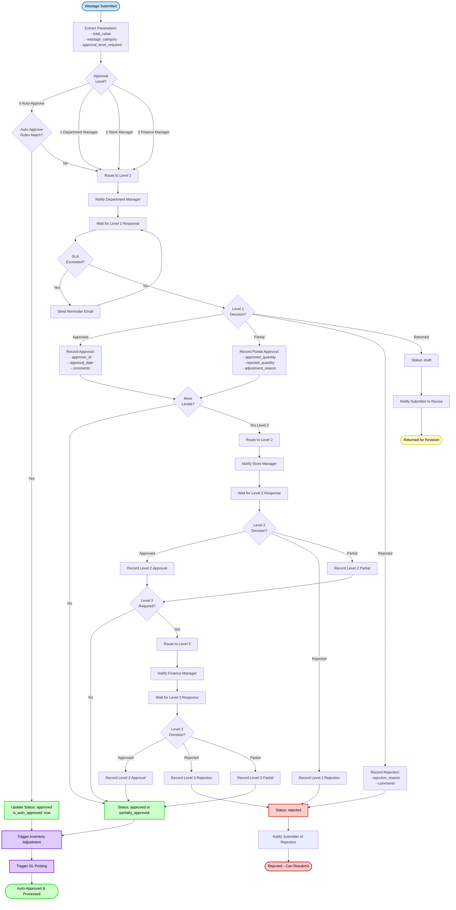

**Approval Decision Matrix**:

| Decision | Action | Next Step | Notification |
|----------|--------|-----------|--------------|
| Approved | Full approval of wastage | Next level or inventory adjustment | Submitter notified of approval |
| Partial | Approve reduced quantity | Next level or inventory adjustment | Submitter notified of partial approval |
| Rejected | Deny wastage with reason | End workflow, status=rejected | Submitter notified with rejection reason |
| Returned | Send back for revision | Status=draft, editable | Submitter notified to make changes |

**SLA Monitoring**:
- Level 1: 24 hours (reminder sent at 18 hours)
- Level 2: 48 hours (reminder sent at 36 hours)
- Level 3: 72 hours (reminder sent at 60 hours)
- Overdue flag set if SLA exceeded

**Approval Authority Validation**:
- System checks approver's `approval_authority_limit`
- If wastage value > authority limit: Error, escalate to higher authority
- If approver is submitter: Error, cannot approve own wastage (BR-WAST-008)

---

## Photo Upload Process Flow

### Photo Capture, Watermark, and Storage

**Purpose**: Illustrates the process of capturing, processing, watermarking, and storing photo evidence for wastage transactions.

**Actors**:
- User (Kitchen Staff)
- Browser/Mobile Camera
- Application Frontend
- Backend API
- Sharp Image Processing Library
- Supabase Storage

**Trigger**: User clicks "Add Photo" button during wastage recording

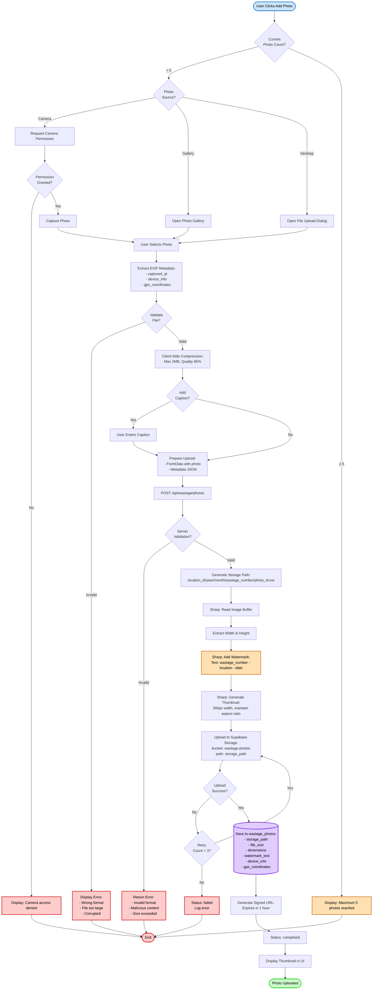

**Photo Processing Steps**:

1. **Validation**: Client and server-side validation
   - Format: JPEG, PNG, HEIC, WebP only
   - Size: Maximum 10MB per photo
   - Malware scan: Server-side check

2. **Compression**: Optimize file size while maintaining quality
   - Target: 2MB maximum after compression
   - Quality: 85% JPEG quality
   - Method: Sharp library lossy compression

3. **Watermarking**: Add transparent watermark to prevent misuse
   - Position: Bottom-right corner
   - Text: "{wastage_number} | {location_name} | {date} {time}"
   - Opacity: 70% white text with black outline
   - Font: 14px Arial Bold

4. **Thumbnail Generation**: Create preview thumbnail
   - Width: 300px
   - Height: Auto (maintain aspect ratio)
   - Format: JPEG
   - Quality: 75%

5. **Storage**: Upload to Supabase Storage
   - Bucket: wastage-photos (private bucket)
   - Path: {location_id}/{year}/{month}/{wastage_number}/{photo_id}.{ext}
   - Security: Row-Level Security enforced
   - Access: Via signed URLs only

6. **Metadata Storage**: Save to database
   - Table: wastage_photos
   - Fields: storage_path, file_size, width, height, captured_at, device_info, gps_latitude, gps_longitude
   - Watermark tracking: is_watermarked, watermark_text, watermark_position

**Security Measures**:
- Private bucket: No public access
- Signed URLs: Time-limited (1 hour expiration)
- Watermarking: Server-side, cannot be bypassed
- Malware scanning: Before storage
- GPS validation: Verify photo location matches restaurant location (warning if mismatch)

---

## Data Flow Diagram

### Level 0: Context Diagram

**Purpose**: Shows the Wastage Reporting system in context with external entities and data flows

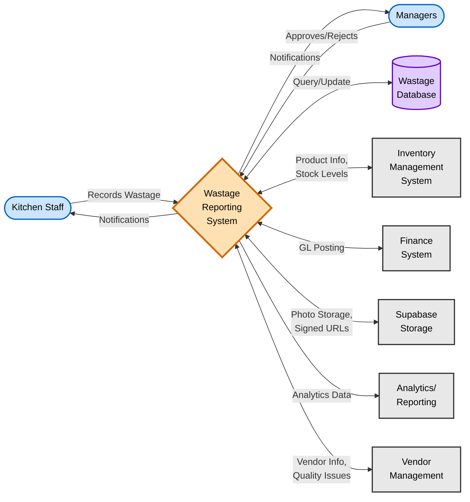

**External Entities**:
- **Kitchen Staff**: Primary users who record wastage transactions
- **Managers**: Department Managers, Store Managers, Finance Managers who approve wastage
- **Inventory Management System**: Provides product info, validates stock, receives inventory adjustments
- **Finance System**: Receives GL journal entries for wastage expense posting
- **Supabase Storage**: Stores photo evidence files with secure access
- **Analytics/Reporting**: Consumes wastage data for trend analysis and reports
- **Vendor Management**: Provides vendor information, receives quality issue reports

**Key Data Flows**:
1. Kitchen Staff → System: Wastage details, photos, reasons
2. System → Kitchen Staff: Confirmations, notifications, validation errors
3. System → Managers: Approval requests, wastage details
4. Managers → System: Approval decisions, comments, adjustments
5. System ↔ Database: CRUD operations on wastage entities
6. System ↔ Inventory: Stock validation, inventory adjustments
7. System ↔ Finance: GL posting for wastage expense
8. System ↔ Storage: Photo uploads, signed URL generation
9. System → Analytics: Wastage metrics for trend analysis

---

### Level 1: System Decomposition

**Purpose**: Shows major processes and data stores within the Wastage Reporting system

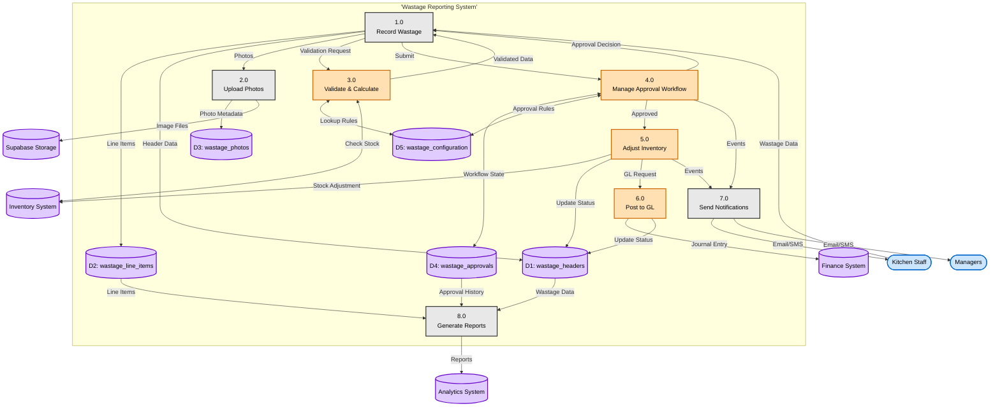

**Data Stores**:
- **D1: wastage_headers**: Main wastage transaction records with status and approval state
- **D2: wastage_line_items**: Individual products wasted with quantities and costs
- **D3: wastage_photos**: Photo evidence metadata and storage references
- **D4: wastage_approvals**: Multi-level approval workflow history
- **D5: wastage_configuration**: System configuration for thresholds and rules

**Processes**:
1. **1.0 Record Wastage**: Capture wastage details from kitchen staff
2. **2.0 Upload Photos**: Handle photo capture, watermarking, and storage
3. **3.0 Validate & Calculate**: Validate input, check stock, calculate totals
4. **4.0 Manage Approval Workflow**: Route through approval levels based on value
5. **5.0 Adjust Inventory**: Create inventory adjustment transaction
6. **6.0 Post to GL**: Create GL journal entry for wastage expense
7. **7.0 Send Notifications**: Notify relevant parties of events
8. **8.0 Generate Reports**: Produce analytics and trend reports

---

## Wastage Submission Sequence Diagram

### User Interaction Sequence for Wastage Submission

**Purpose**: Illustrates the detailed time-ordered sequence of interactions between user, frontend, backend, and external systems during wastage submission.

**Scenario**: Kitchen staff records a single-product wastage transaction with photo evidence and submits for approval

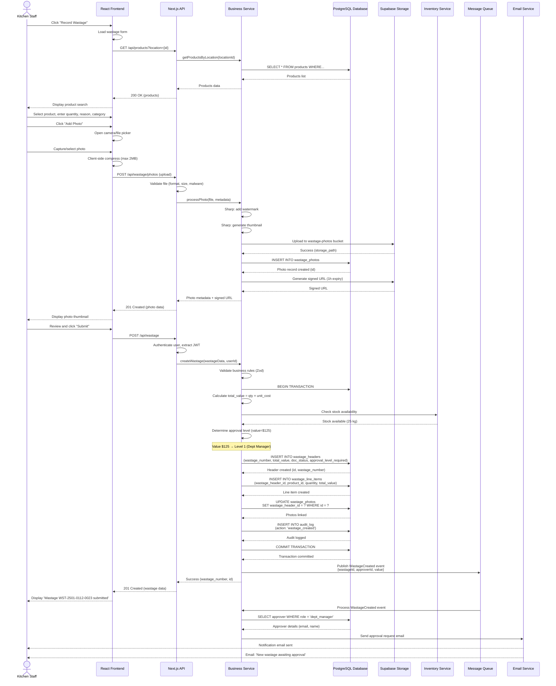

**Key Timing Metrics**:
- **Synchronous Operations** (Steps 1-34): 1-2 seconds
  - Product lookup: 50-100ms
  - Photo upload & processing: 500-1000ms
  - Wastage creation: 200-300ms
  - Total user-facing time: <2 seconds

- **Asynchronous Operations** (Steps 35-40): Background, 5-30 seconds
  - Event publishing: Immediate (non-blocking)
  - Email sending: 5-30 seconds (background job)

**Error Handling Scenarios**:
- **Photo upload fails**: Retry 3 times, show error if all fail, allow continue without photo
- **Stock check fails**: Display error "Product unavailable or insufficient stock", block submission
- **Database transaction fails**: Rollback transaction, show error, retain form data for retry
- **Email notification fails**: Log error, continue processing, retry notification in background

---

## Approval Processing Sequence Diagram

### Approver Interaction Sequence

**Purpose**: Shows the detailed sequence when an approver reviews and approves/rejects a wastage transaction

**Scenario**: Department Manager approves a wastage transaction, triggering inventory adjustment and GL posting

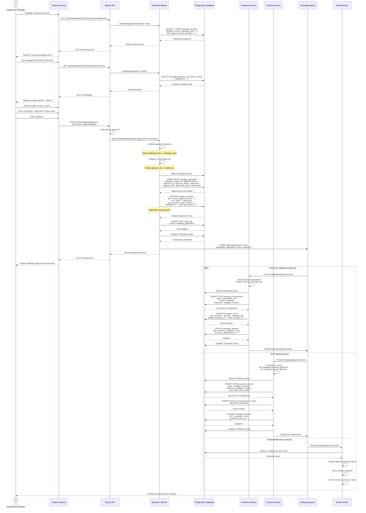

**Approval Validation Checks**:

1. **Authority Check**: Approver's `approval_authority_limit` must be >= wastage `total_value`
2. **Self-Approval Check**: Approver cannot be the wastage creator (BR-WAST-008)
3. **Status Check**: Wastage must be in `pending_approval` status
4. **Level Check**: Approver must have permission for current approval level
5. **Optimistic Locking**: `doc_version` check prevents concurrent approval conflicts

**Parallel Processing**:
- **Inventory Adjustment**: Creates inventory transaction, reduces stock
- **GL Posting**: Creates journal entry (DR: Wastage Expense, CR: Inventory)
- **Email Notifications**: Notifies submitter and finance team

These operations run asynchronously (5-30 seconds) to avoid blocking the approver's UI response.

---

## Wastage State Transition Diagram

### Wastage Document Status Lifecycle

**Purpose**: Documents all possible states and transitions for a wastage transaction throughout its lifecycle

**Entity**: wastage_headers.doc_status

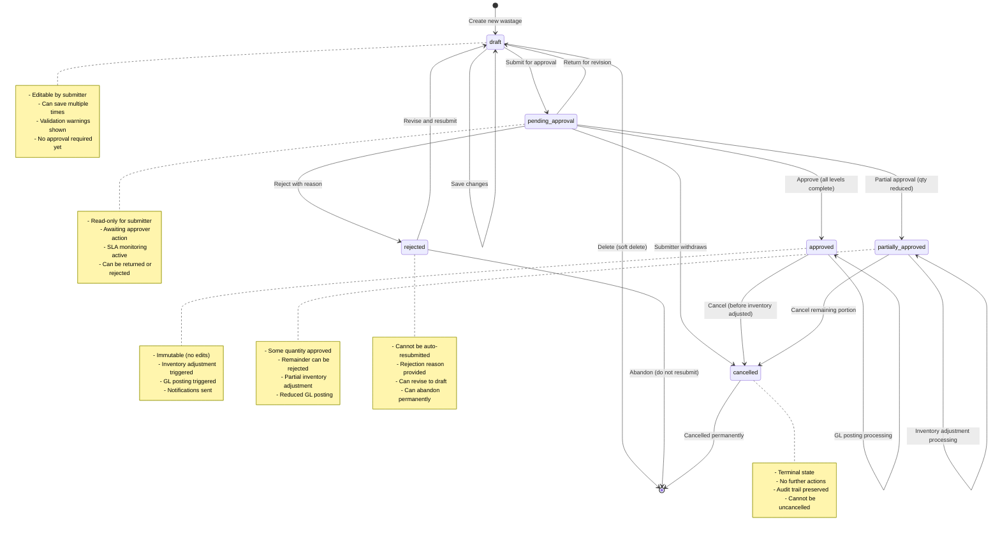

**State Definitions**:

| State | Description | Allowed Actions | Can Transition To | Entry Actions | Exit Actions |
|-------|-------------|-----------------|-------------------|---------------|--------------|
| **draft** | Initial state, user editing | Save, Submit, Delete | pending_approval, [deleted] | Set status, Assign creator, Initialize fields | Validate completeness, Lock editing |
| **pending_approval** | Awaiting approval | Approve, Reject, Return, Cancel | approved, partially_approved, rejected, draft, cancelled | Route to approver(s), Send notifications, Start SLA timer | Stop SLA timer, Record decision |
| **approved** | Fully approved | (View only), Cancel (if not adjusted) | cancelled | Update approval_level_complete, Trigger inventory adjustment, Trigger GL posting, Notify submitter | - |
| **partially_approved** | Some quantity approved, remainder rejected | (View only), Cancel remaining | cancelled | Record approved vs rejected quantities, Trigger partial inventory adjustment, Trigger partial GL posting | - |
| **rejected** | Approval denied | Revise to draft, Abandon | draft, [abandoned] | Notify submitter with reason, Log rejection comments, Release pending approval | - |
| **cancelled** | Manually cancelled | (None - terminal state) | [*] | Release any locks, Notify relevant parties, Update audit log | - |

**Transition Rules and Guards**:

1. **draft → pending_approval** (Submit):
   - Guard: All required fields completed AND stock available AND photos uploaded (if required)
   - Action: Lock editing, determine approval level, route to first approver, send notification
   - Example: User fills form completely and clicks "Submit"

2. **pending_approval → approved** (Approve):
   - Guard: User has approver role AND approval_authority_limit >= total_value AND user_id != created_by AND all required levels approved
   - Action: Record approval, update status, trigger inventory/GL, send notifications
   - Example: Department Manager approves $125 wastage (within authority)

3. **pending_approval → partially_approved** (Partial Approve):
   - Guard: User has approver role AND approved_quantity < original_quantity AND approved_quantity > 0
   - Action: Record partial approval, update line item quantities, trigger partial inventory/GL
   - Example: Approver approves 2kg instead of requested 2.5kg

4. **pending_approval → rejected** (Reject):
   - Guard: User has approver role AND rejection_reason provided (min 20 chars)
   - Action: Record rejection, update status, notify submitter with reason
   - Example: Store Manager rejects due to insufficient photo evidence

5. **pending_approval → draft** (Return):
   - Guard: User has approver role AND return_reason provided
   - Action: Reset status to draft, unlock editing, notify submitter to revise
   - Example: Approver returns wastage asking for better photos

6. **approved → cancelled** (Cancel):
   - Guard: User is creator OR user has admin role AND inventory_adjusted = false
   - Action: Update status, release any locks, notify parties
   - Example: Submitter cancels approved wastage before inventory adjusted

7. **rejected → draft** (Revise):
   - Guard: User is original creator
   - Action: Reset to draft, allow editing, clear rejection reason
   - Example: Kitchen staff revises wastage based on rejection feedback

8. **draft → [*]** (Delete):
   - Guard: User is creator OR user has admin role
   - Action: Soft delete (set deleted_at timestamp), preserve for audit
   - Example: User decides not to proceed with wastage recording

**Immutability Rules**:
- Once status = `approved` AND `inventory_adjusted` = true: No further status changes allowed (except audit fields)
- All transitions logged in audit_log table with timestamp, user, before_value, after_value
- State transitions triggered by user actions (Submit, Approve, Reject) or system actions (Auto-approve rules)

**SLA Monitoring**:
- `pending_approval` state tracks time in status
- SLA thresholds: L1=24h, L2=48h, L3=72h
- Reminder emails sent at 75% of SLA (18h, 36h, 60h)
- `is_overdue` flag set in `wastage_approvals` if SLA exceeded

---

## Inventory Integration Flow

### Inventory Adjustment Process

**Purpose**: Shows how approved wastage triggers inventory stock adjustment

**Trigger**: Wastage status changes to `approved` or `partially_approved`

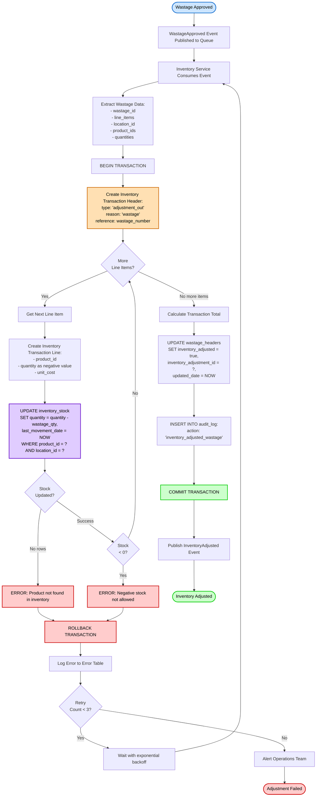

**Inventory Transaction Structure**:

**Header Record** (inventory_transactions table):
```typescript
{
  id: uuid,
  transaction_number: "INV-ADJ-2501-0112-0045",
  transaction_type: "adjustment_out",
  transaction_date: "2025-01-12",
  location_id: uuid,
  reference_type: "wastage",
  reference_id: wastage_header_id,
  reference_number: "WST-2501-0112-0023",
  total_value: -31.25,
  status: "completed",
  notes: "Inventory adjustment for approved wastage",
  created_by: system_user_id,
  created_date: timestamp
}
```

**Line Records** (inventory_transaction_lines table):
```typescript
[
  {
    id: uuid,
    transaction_header_id: uuid,
    line_number: 1,
    product_id: uuid,
    product_code: "SALM-ATL-001",
    product_name: "Atlantic Salmon Fillet",
    quantity: -2.5, // Negative for outbound
    unit_of_measure: "kg",
    unit_cost: 12.50,
    total_value: -31.25,
    stock_before: 25.0,
    stock_after: 22.5
  }
]
```

**Stock Update** (inventory_stock table):
```sql
UPDATE inventory_stock
SET
  quantity = quantity - 2.5,  -- Reduce stock
  last_movement_date = NOW(),
  last_movement_type = 'adjustment_out',
  last_movement_reference = 'WST-2501-0112-0023'
WHERE
  product_id = {product_id}
  AND location_id = {location_id}
```

**Error Handling**:
1. **Product not found**: Alert operations, wastage remains approved but flagged
2. **Negative stock**: Block adjustment, alert operations, require manual resolution
3. **Database error**: Retry with exponential backoff (3 attempts), then alert
4. **Concurrent update**: Retry transaction with optimistic locking

**Reconciliation**:
- Daily job compares wastage_headers.total_value with inventory_transactions.total_value
- Discrepancies flagged for investigation
- Manual adjustment button available for operations team if auto-adjustment fails

---

## GL Posting Integration Flow

### General Ledger Posting Process

**Purpose**: Shows how approved wastage creates GL journal entries for financial reporting

**Trigger**: Wastage status changes to `approved` or `partially_approved`

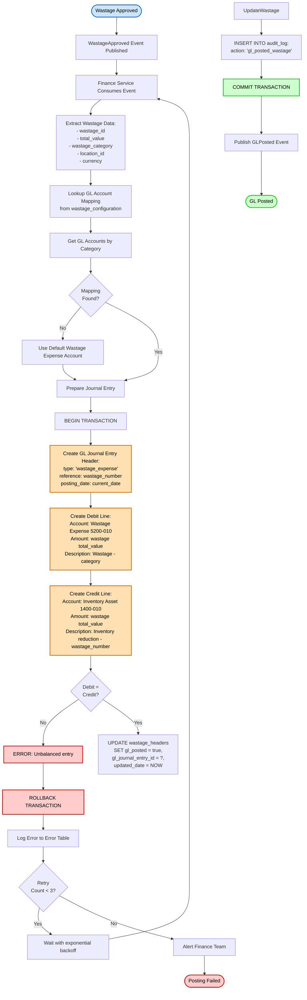

**GL Journal Entry Structure**:

**Header Record** (gl_journal_entries table):
```typescript
{
  id: uuid,
  entry_number: "JE-2501-0112-1234",
  entry_type: "wastage_expense",
  posting_date: "2025-01-12",
  period: "2025-01",
  fiscal_year: 2025,
  reference_type: "wastage",
  reference_id: wastage_header_id,
  reference_number: "WST-2501-0112-0023",
  description: "Wastage expense - Preparation error",
  currency: "USD",
  total_debit: 31.25,
  total_credit: 31.25,
  status: "posted",
  created_by: system_user_id,
  posted_by: system_user_id,
  posted_date: timestamp
}
```

**Line Records** (gl_journal_lines table):
```typescript
[
  {
    id: uuid,
    journal_entry_id: uuid,
    line_number: 1,
    account_code: "5200-010",
    account_name: "Food Cost - Wastage - Kitchen Error",
    debit_amount: 31.25,
    credit_amount: 0.00,
    cost_center: "Kitchen",
    department: "Operations",
    location_id: uuid,
    description: "Wastage - Preparation Error - Atlantic Salmon"
  },
  {
    id: uuid,
    journal_entry_id: uuid,
    line_number: 2,
    account_code: "1400-010",
    account_name: "Inventory - Food & Beverage",
    debit_amount: 0.00,
    credit_amount: 31.25,
    cost_center: "Kitchen",
    department: "Operations",
    location_id: uuid,
    description: "Inventory reduction - WST-2501-0112-0023"
  }
]
```

**GL Account Mapping by Category** (from wastage_configuration):

| Wastage Category | Debit Account | Debit Description | Credit Account |
|------------------|---------------|-------------------|----------------|
| preparation_error | 5200-010 | Food Cost - Wastage - Kitchen Error | 1400-010 (Inventory) |
| spoilage | 5200-020 | Food Cost - Wastage - Spoilage | 1400-010 (Inventory) |
| overproduction | 5200-030 | Food Cost - Wastage - Overproduction | 1400-010 (Inventory) |
| expired | 5200-040 | Food Cost - Wastage - Expired Items | 1400-010 (Inventory) |
| supplier_quality | 1500-025 | Vendor Claims Receivable | 1400-010 (Inventory) |

**Note**: Supplier quality issues create receivable (expect credit/refund from vendor) instead of expense.

**Accounting Treatment**:
- **Normal Wastage**: Debit Expense, Credit Inventory Asset
- **Supplier Quality**: Debit Receivable, Credit Inventory Asset (expect vendor refund)
- **Currency**: All amounts in wastage currency, converted to functional currency if needed
- **Cost Center**: Maps to department performing wastage (Kitchen, Bar, etc.)

**Reconciliation**:
- Monthly: Sum gl_journal_lines (account 5200-xxx) should equal wastage_headers.total_value for period
- Unposted wastage report: Lists approved wastage where gl_posted = false
- Manual posting button for finance team if auto-posting fails

---

## Batch Wastage Process Flow

### Recording Multiple Products in Single Transaction

**Purpose**: Illustrates the process for recording multiple products wasted together (e.g., end-of-day buffet wastage, weekly expired items cleanup)

**Actors**: Kitchen Staff, System

**Trigger**: User selects "Batch Wastage" option

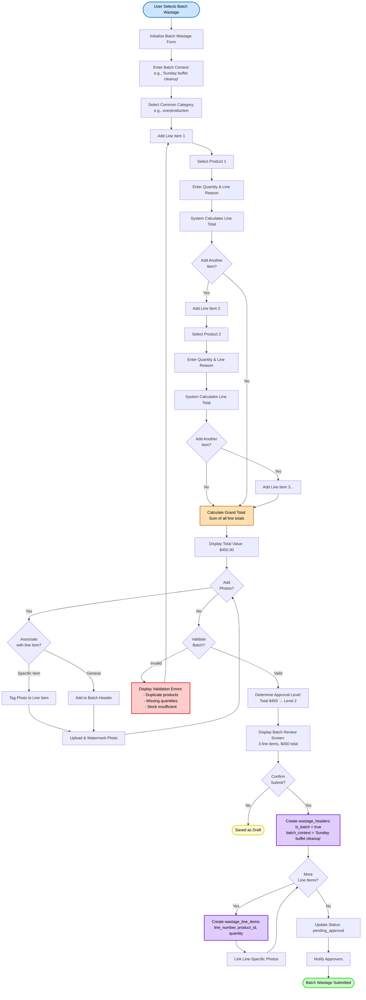

**Batch Wastage Example**:

**Batch Header**:
```typescript
{
  wastage_number: "WST-2501-0112-0045",
  wastage_date: "2025-01-12",
  location_id: "Hotel Grand Restaurant",
  wastage_category: "overproduction",
  is_batch: true,
  batch_context: "Sunday dinner buffet cleanup",
  reason: "Production quantities exceeded actual customer count by 30%. Adjusting forecasting model.",
  total_value: 450.00,
  doc_status: "pending_approval",
  approval_level_required: 2
}
```

**Batch Line Items**:
```typescript
[
  {
    line_number: 1,
    product_code: "BEEF-RIB-001",
    product_name: "Beef Ribeye Steak",
    quantity: 3.0,
    unit_of_measure: "kg",
    unit_cost: 45.00,
    total_value: 135.00,
    line_reason: "15 portions unserved, 3kg total",
    line_photos: ['photo-001-uuid', 'photo-002-uuid']
  },
  {
    line_number: 2,
    product_code: "SALM-ATL-001",
    product_name: "Atlantic Salmon Fillet",
    quantity: 2.5,
    unit_of_measure: "kg",
    unit_cost: 50.00,
    total_value: 125.00,
    line_reason: "10 portions unserved, 2.5kg total",
    line_photos: ['photo-003-uuid']
  },
  {
    line_number: 3,
    product_code: "PAST-PENNE-001",
    product_name: "Fresh Penne Pasta",
    quantity: 5.0,
    unit_of_measure: "kg",
    unit_cost: 38.00,
    total_value: 190.00,
    line_reason: "Large batch prepared, 5kg excess",
    line_photos: []
  }
]
```

**Batch Validation Rules**:
- Minimum 2 line items required
- Maximum 20 line items per batch
- No duplicate products (same product_id in multiple lines)
- Each line must have valid stock on hand
- Total value calculated as sum of all line item values
- At least 1 photo recommended (not mandatory unless total > $100)

**Batch Photo Management**:
- Photos can be tagged to specific line items (`wastage_line_item_id`)
- Photos without line item tag belong to batch header
- Line item photos displayed when viewing specific product in batch
- Header photos displayed in batch overview

---

## Partial Approval Process Flow

### Approver Reducing Wastage Quantity

**Purpose**: Illustrates the process when an approver approves a reduced quantity instead of rejecting or approving full amount

**Actors**: Approver (Department Manager, Store Manager, Finance Manager), System

**Trigger**: Approver reviews wastage and determines only partial quantity is justified

```mermaid
flowchart TD
    Start([Approver Reviews Wastage]) --> ViewDetails[View Wastage Details:<br>Product: Beef Ribeye<br>Quantity: 5 kg<br>Value: $225]
    ViewDetails --> ViewPhotos[View Photo Evidence]
    ViewPhotos --> ApproverDecision{Approver<br>Decision?}

    ApproverDecision -->|Full Approval| FullApprove[Approve Full Quantity]
    ApproverDecision -->|Rejection| FullReject[Reject Entire Wastage]
    ApproverDecision -->|Partial| ClickPartial[Click 'Partial Approval' Button]

    ClickPartial --> ShowDialog[Display Partial Approval Dialog]
    ShowDialog --> EnterApproved[Enter Approved Quantity: 4 kg]
    EnterApproved --> CalcRejected[System Calculates:<br>Rejected Quantity: 1 kg<br>Rejected Value: $45]

    CalcRejected --> DisplaySplit[Display Split Summary:<br>✓ Approved: 4 kg - $180<br>✗ Rejected: 1 kg - $45]
    DisplaySplit --> EnterReason[Enter Adjustment Reason:<br>'Only 4 kg clearly visible in photos.<br>Resubmit remaining 1 kg with better documentation.']

    EnterReason --> ValidatePartial{Validate<br>Partial?}
    ValidatePartial -->|Invalid| ShowPartialErrors[Display Errors:<br>- Approved qty must be > 0<br>- Approved qty must be < original<br>- Reason must be provided]
    ShowPartialErrors --> EnterApproved

    ValidatePartial -->|Valid| ConfirmPartial{Confirm<br>Partial?}
    ConfirmPartial -->|No| ViewDetails
    ConfirmPartial -->|Yes| StartTxn[BEGIN TRANSACTION]

    StartTxn --> CreateApproval[CREATE wastage_approvals:<br>approval_action: 'partially_approved'<br>original_value: 225.00<br>approved_value: 180.00<br>rejected_value: 45.00<br>adjustment_reason: 'Only 4kg...']

    CreateApproval --> UpdateHeader[UPDATE wastage_headers:<br>doc_status: 'partially_approved'<br>current_approval_level: 1]

    UpdateHeader --> UpdateLineItem[UPDATE wastage_line_items:<br>approved_quantity: 4.0<br>rejected_quantity: 1.0<br>line_status: 'partially_approved']

    UpdateLineItem --> RecordLineAdj[Store Line Item Adjustments JSON:<br>{<br>  'line_item_id': '...',<br>  'product_name': 'Beef Ribeye',<br>  'original_quantity': 5.0,<br>  'approved_quantity': 4.0,<br>  'rejected_quantity': 1.0,<br>  'reason': 'Only 4 kg visible...'<br>}]

    RecordLineAdj --> LogAudit[INSERT INTO audit_log:<br>action: 'partial_approval']
    LogAudit --> CommitTxn[COMMIT TRANSACTION]
    CommitTxn --> NotifySubmitter[Notify Submitter:<br>'Partial Approval - 4kg approved, 1kg rejected']

    NotifySubmitter --> CheckMore{More<br>Approval Levels?}
    CheckMore -->|Yes| RouteNext[Route to Next Level with Approved Value]
    CheckMore -->|No| TriggerInventory[Trigger Inventory Adjustment:<br>Reduce stock by approved_quantity only]

    RouteNext --> TriggerInventory
    TriggerInventory --> TriggerGL[Trigger GL Posting:<br>Post approved_value only]
    TriggerGL --> Success([Partially Approved])

    style Start fill:#cce5ff,stroke:#0066cc,stroke-width:2px,color:#000
    style Success fill:#ffcc99,stroke:#cc6600,stroke-width:2px,color:#000
    style ShowPartialErrors fill:#ffcccc,stroke:#cc0000,stroke-width:2px,color:#000
    style CalcRejected fill:#ffe0b3,stroke:#cc6600,stroke-width:2px,color:#000
    style DisplaySplit fill:#fff9cc,stroke:#cccc00,stroke-width:2px,color:#000
    style UpdateLineItem fill:#e0ccff,stroke:#6600cc,stroke-width:2px,color:#000
    style CommitTxn fill:#ccffcc,stroke:#00cc00,stroke-width:2px,color:#000
```

**Partial Approval Scenarios**:

**Scenario 1: Photo Evidence Insufficient**
```
Original: 5 kg Beef Ribeye ($225)
Approved: 4 kg ($180)
Rejected: 1 kg ($45)
Reason: "Only 4 kg clearly visible in photos. Please resubmit remaining 1 kg with clearer photos showing all affected portions."
```

**Scenario 2: Quantity Appears Excessive**
```
Original: 10 portions Fresh Pasta ($95)
Approved: 8 portions ($76)
Rejected: 2 portions ($19)
Reason: "Approved 8 portions based on visual evidence. Quantity seems high for single meal service. Please review preparation quantities with kitchen staff."
```

**Scenario 3: Batch Wastage with Mixed Approval**
```
Batch Context: "End of day buffet wastage"
Line 1 - Beef Ribeye 3 kg: Fully Approved (photos clear)
Line 2 - Salmon 2.5 kg: Partially Approved 2 kg (0.5 kg rejected, unclear in photos)
Line 3 - Pasta 5 kg: Fully Approved (photos clear)

Overall Status: partially_approved
Total Original: $450
Total Approved: $425
Total Rejected: $25
```

**Partial Approval Impact**:

1. **Inventory Adjustment**: Only approved quantity reduces stock
   - Original: 5 kg wastage
   - Inventory reduction: 4 kg only
   - Remaining 1 kg stays in inventory (can be resubmitted)

2. **GL Posting**: Only approved value posted to expense
   - Original value: $225
   - GL entry: $180 (approved portion)
   - Rejected $45 not posted (no expense recognized)

3. **Submitter Actions**:
   - Can view partial approval details
   - Can create new wastage for rejected portion (1 kg) with better evidence
   - Original wastage remains in `partially_approved` status (immutable)

4. **Approval Chain**: If multi-level approval required:
   - Next level approves based on approved_value ($180), not original ($225)
   - Next level can further reduce if needed
   - Final approved amount is cumulative reduction from all levels

**Validation Rules**:
- `approved_quantity` must be > 0 (cannot approve zero)
- `approved_quantity` must be < `original_quantity` (if equal, use full approval)
- `rejected_quantity` = `original_quantity` - `approved_quantity` (calculated)
- `adjustment_reason` required (minimum 20 characters)
- For batch: Can partially approve individual line items independently

---

## Summary

This Flow Diagrams document provides 11 comprehensive visual flows for the Wastage Reporting module:

1. **Record Wastage Process**: End-to-end flow from kitchen staff identifying wastage through photo upload and submission
2. **Approval Workflow**: Multi-level approval routing with auto-approve, single-level, and multi-level scenarios
3. **Photo Upload Process**: Photo capture, watermarking, compression, and secure storage
4. **Data Flow Diagrams**: Context diagram and system decomposition showing data movement
5. **Wastage Submission Sequence**: Detailed component interactions during wastage creation
6. **Approval Processing Sequence**: Approver interactions with parallel inventory and GL processing
7. **State Transition Diagram**: Complete lifecycle of wastage document status
8. **Inventory Integration**: Automated stock adjustment process
9. **GL Posting Integration**: Financial system integration for expense posting
10. **Batch Wastage Process**: Recording multiple products in single transaction
11. **Partial Approval Flow**: Approver reducing wastage quantities with split tracking

### Diagram Usage Guidelines

**For Developers**:
- Use sequence diagrams to understand API call flows and error handling
- Reference state diagram for status transition logic implementation
- Follow data flow diagrams for component integration

**For Business Analysts**:
- Use process flows to explain business processes to stakeholders
- Reference approval workflow for training materials
- Use examples in flows for user documentation

**For Testers**:
- Use flows to create test scenarios covering all paths
- Reference exception handling sections for negative test cases
- Use state diagram to verify all transition rules

**For Operations**:
- Use integration flows to understand system dependencies
- Reference error handling for troubleshooting guides
- Use SLA monitoring sections for operational procedures

### Related Implementation

All flows documented here are implemented in the Technical Specification (TS-wastage-reporting.md) with detailed component architecture, server actions, and state management patterns. The Data Schema (DS-wastage-reporting.md) defines the database entities that support these flows. Validation rules enforcing business logic in these flows are documented in Validations (VAL-wastage-reporting.md).
