# FD-SYSADMIN: System Administration Flow Diagrams

## Module Information
- **Module**: System Administration
- **Sub-Module**: ABAC Permission Management, User Management, Workflow Configuration
- **Document Type**: Flow Diagrams (FD)
- **Version**: 1.0.0
- **Last Updated**: 2025-11-13
- **Status**: Draft

## Document History
| Version | Date | Author | Changes |
|---------|------|--------|---------|
| 1.1.0 | 2025-12-10 | Documentation Team | Standardized reference number format (XXX-YYMM-NNNN) |
| 1.0.0 | 2025-11-13 | Documentation Team | Initial version |

---

## Overview

This document provides comprehensive visual representations of the System Administration module's workflows, data flows, and integrations. The diagrams cover the complete ABAC (Attribute-Based Access Control) lifecycle from policy creation through access evaluation, role management, workflow routing, and system integration. These flows support the business objectives of dynamic permission management, contextual access control, and automated workflow routing for hospitality operations.

**Related Documents**:
- [Business Requirements](./BR-system-administration.md)
- [Use Cases](./UC-system-administration.md)
- [Technical Specification](./TS-system-administration.md)
- [Data Schema](./DS-system-administration.md)
- [Validations](./VAL-system-administration.md)

---

## Diagram Index

| Diagram | Type | Purpose | Complexity |
|---------|------|---------|------------|
| [High-Level System Flow](#high-level-system-flow) | Process | Complete ABAC lifecycle | High |
| [Policy Creation & Activation](#policy-creation--activation-flow) | Process | Policy management workflow | Medium |
| [Access Request Evaluation](#access-request-evaluation-flow) | Process | Policy evaluation engine | High |
| [Role Hierarchy Management](#role-hierarchy-management-flow) | Process | Role creation with inheritance | Medium |
| [User Role Assignment](#user-role-assignment-flow) | Process | Contextual role assignment | Medium |
| [Workflow Routing](#workflow-routing-flow) | Process | Dynamic approval routing | High |
| [Cache Management](#permission-cache-flow) | Process | Cache lifecycle and invalidation | Medium |
| [Data Flow Diagram](#data-flow-diagram) | Data | Data movement through system | High |
| [Sequence Diagrams](#sequence-diagrams) | Interaction | Component interactions | High |
| [State Diagrams](#state-diagrams) | State | Status transitions | Medium |
| [Integration Flows](#integration-flows) | Integration | External system interactions | High |

---

## Process Flows

### High-Level System Flow

**Purpose**: End-to-end ABAC system lifecycle from setup through operations

**Actors**: IT Manager, System Administrator, Users, Policy Engine, Workflow Engine

**Trigger**: Organization setup or operational access requests

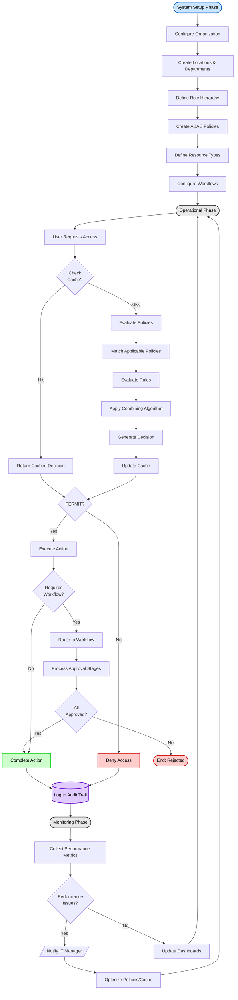

**Flow Steps**:

1. **Setup Phase**: Initial system configuration
   - Configure organization, locations, and departments
   - Define role hierarchy with inheritance
   - Create ABAC policies with target, rules, obligations
   - Define resource types and available actions
   - Configure workflow routing rules

2. **Operational Phase**: Runtime access control
   - User requests access to resource
   - Check permission cache for existing decision
   - On cache miss: Evaluate policies by priority
   - Apply combining algorithm for multiple policy results
   - Cache decision for 15 minutes
   - Grant or deny access based on decision
   - If approved, route to workflow if required

3. **Monitoring Phase**: System health and optimization
   - Collect policy evaluation metrics
   - Monitor cache performance and hit rates
   - Alert on performance degradation
   - Optimize policies and cache based on metrics

---

### Policy Creation & Activation Flow

**Purpose**: Guide IT Manager through policy creation, testing, and activation

**Actors**: IT Manager, Policy Management UI, Policy Database, Policy Engine

**Trigger**: IT Manager initiates policy creation

```mermaid
flowchart TD
    Start([IT Manager Opens Policy Form]) --> Template{Use<br>Template?}

    Template -->|Yes| SelectTemplate[Select Policy Template]
    SelectTemplate --> LoadTemplate[Load Template Data]
    LoadTemplate --> BasicInfo

    Template -->|No| BasicInfo[Enter Basic Info]
    BasicInfo --> Name[Policy Name & Description]
    Name --> Effect{Policy<br>Effect?}
    Effect -->|PERMIT| EffectSet1[Set Effect = PERMIT]
    Effect -->|DENY| EffectSet2[Set Effect = DENY]

    EffectSet1 --> Priority[Set Priority 0-1000]
    EffectSet2 --> Priority
    Priority --> Algo[Select Combining Algorithm]

    Algo --> Target[Define Target Criteria]
    Target --> SubjectCriteria[Subject Criteria]
    SubjectCriteria --> ResourceCriteria[Resource Criteria]
    ResourceCriteria --> ActionCriteria[Action Criteria]
    ActionCriteria --> EnvCriteria[Environment Criteria]

    EnvCriteria --> Rules[Define Rules]
    Rules --> AddRule[Add Rule Condition]
    AddRule --> RuleLogic[Enter Rule Logic]
    RuleLogic --> MoreRules{More<br>Rules?}
    MoreRules -->|Yes| AddRule
    MoreRules -->|No| Obligations{Add<br>Obligations?}

    Obligations -->|Yes| DefineOblig[Define Obligations]
    DefineOblig --> ObligType[Select Type: Log/Notify/Validate]
    ObligType --> Advice{Add<br>Advice?}

    Obligations -->|No| Advice
    Advice -->|Yes| DefineAdvice[Define Advice Messages]
    DefineAdvice --> Validity
    Advice -->|No| Validity

    Validity[Set Validity Period]
    Validity --> Tags[Add Tags for Organization]
    Tags --> Version[Set Version Number]

    Version --> Save[Save as Draft]
    Save --> Draft[(Policy Status: DRAFT)]
    Draft --> Test[Run Test Scenarios]

    Test --> CreateScenarios[Create Test Cases]
    CreateScenarios --> RunTests[Execute Tests]
    RunTests --> Results{All Tests<br>Pass?}
    Results -->|No| Analyze[Analyze Failures]
    Analyze --> Fix[Modify Policy Rules]
    Fix --> Save

    Results -->|Yes| Review[Request Review]
    Review --> Reviewer{Reviewer<br>Approves?}
    Reviewer -->|No| Comments[Provide Feedback]
    Comments --> Fix

    Reviewer -->|Yes| Activate[Activate Policy]
    Activate --> CheckConflicts[Check for Conflicts]
    CheckConflicts --> Conflicts{Conflicts<br>Found?}

    Conflicts -->|Yes| Resolve[Resolve or Adjust Priority]
    Resolve --> CheckConflicts

    Conflicts -->|No| UpdateStatus[Set Status = ACTIVE]
    UpdateStatus --> InvalidateCache[Invalidate Permission Cache]
    InvalidateCache --> Publish[/Publish Policy Activated Event/]
    Publish --> Monitor[Monitor Policy Performance]
    Monitor --> Success([End: Policy Active])

    style Start fill:#cce5ff,stroke:#0066cc,stroke-width:2px,color:#000
    style Success fill:#ccffcc,stroke:#00cc00,stroke-width:2px,color:#000
    style Draft fill:#e0ccff,stroke:#6600cc,stroke-width:2px,color:#000
    style UpdateStatus fill:#ccffcc,stroke:#00cc00,stroke-width:2px,color:#000
```

**Decision Points**:

| Decision | Criteria | Outcome |
|----------|----------|---------|
| Use Template | Existing template available | Load template/Start from scratch |
| Policy Effect | Grant or deny access | PERMIT/DENY |
| All Tests Pass | Test scenarios match expected outcomes | Continue/Fix policy |
| Reviewer Approves | Policy meets requirements | Activate/Return for changes |
| Conflicts Found | Multiple policies match same criteria | Resolve conflicts/Proceed |

**Key Validations**:
- Policy name must be unique
- Priority must be 0-1000
- At least one rule must be defined
- All rule conditions must be valid expressions
- Test coverage must include edge cases
- No conflicting policies with same priority

---

### Access Request Evaluation Flow

**Purpose**: Evaluate access request against ABAC policies and return decision

**Actors**: Application, Policy Evaluation Engine, Cache Service, Database

**Trigger**: Application requests access check (e.g., Chef approves purchase request)

```mermaid
flowchart TD
    Start([Application Requests Access]) --> Construct[Construct Access Request]
    Construct --> Subject[Extract Subject Attributes]
    Subject --> Resource[Extract Resource Attributes]
    Resource --> Action[Extract Action]
    Action --> Environment[Extract Environment Attributes]

    Environment --> HashKey[Generate Context Hash]
    HashKey --> CheckCache{Check<br>Cache?}

    CheckCache -->|Hit| ValidTTL{TTL<br>Valid?}
    ValidTTL -->|Yes| HitCount[Increment Hit Count]
    HitCount --> CachedDecision[Return Cached Decision]
    CachedDecision --> Metrics1[Record Hit Metric]
    Metrics1 --> ReturnCached([Return: Cached <10ms])

    ValidTTL -->|No| Expired[Cache Expired]
    Expired --> Evaluate

    CheckCache -->|Miss| Evaluate[Query Applicable Policies]
    Evaluate --> OrderPolicies[Order by Priority ASC]
    OrderPolicies --> FilterActive{Has Active<br>Policies?}

    FilterActive -->|No| NotApplicable[Decision: NOT_APPLICABLE]
    NotApplicable --> LogNA[Log Access Request]
    LogNA --> ReturnNA([Return: NOT_APPLICABLE])

    FilterActive -->|Yes| Loop{More Policies<br>to Evaluate?}
    Loop -->|No| ApplyCombining[Apply Combining Algorithm]
    Loop -->|Yes| NextPolicy[Get Next Policy]

    NextPolicy --> ValidDates{Valid<br>Date Range?}
    ValidDates -->|No| Loop
    ValidDates -->|Yes| MatchTarget[Evaluate Target Match]

    MatchTarget --> SubjectMatch{Subject<br>Match?}
    SubjectMatch -->|No| Loop
    SubjectMatch -->|Yes| ResourceMatch{Resource<br>Match?}
    ResourceMatch -->|No| Loop
    ResourceMatch -->|Yes| ActionMatch{Action<br>Match?}
    ActionMatch -->|No| Loop
    ActionMatch -->|Yes| EnvMatch{Environment<br>Match?}
    EnvMatch -->|No| Loop

    EnvMatch -->|Yes| EvalRules[Evaluate Policy Rules]
    EvalRules --> RuleLoop{More<br>Rules?}
    RuleLoop -->|Yes| NextRule[Get Next Rule]
    NextRule --> RuleCondition[Evaluate Condition]
    RuleCondition --> RuleResult{Condition<br>True?}
    RuleResult -->|No| RuleLoop
    RuleResult -->|Yes| RuleEffect[Get Rule Effect]
    RuleEffect --> StoreResult[Add to Results]
    StoreResult --> RuleLoop

    RuleLoop -->|No| PolicyResult[Determine Policy Result]
    PolicyResult --> Loop

    ApplyCombining --> Algorithm{Algorithm<br>Type?}
    Algorithm -->|DENY_OVERRIDES| CheckDeny{Any<br>DENY?}
    CheckDeny -->|Yes| FinalDeny[Decision: DENY]
    CheckDeny -->|No| CheckPermit{Any<br>PERMIT?}
    CheckPermit -->|Yes| FinalPermit[Decision: PERMIT]
    CheckPermit -->|No| FinalNA[Decision: NOT_APPLICABLE]

    Algorithm -->|PERMIT_OVERRIDES| CheckPermit2{Any<br>PERMIT?}
    CheckPermit2 -->|Yes| FinalPermit
    CheckPermit2 -->|No| CheckDeny2{Any<br>DENY?}
    CheckDeny2 -->|Yes| FinalDeny
    CheckDeny2 -->|No| FinalNA

    Algorithm -->|FIRST_APPLICABLE| FirstResult[Use First Match]
    FirstResult --> FirstType{First<br>Type?}
    FirstType -->|PERMIT| FinalPermit
    FirstType -->|DENY| FinalDeny
    FirstType -->|NOT_APPLICABLE| FinalNA

    FinalPermit --> Obligations[Collect Obligations]
    FinalDeny --> Obligations
    FinalNA --> Obligations

    Obligations --> Advice[Collect Advice]
    Advice --> Package[Package Decision]
    Package --> CacheDecision[Cache Decision]
    CacheDecision --> LogRequest[Log Access Request]
    LogRequest --> Metrics2[Record Evaluation Metric]
    Metrics2 --> Return[Return Decision]
    Return --> End([Return: Decision <200ms])

    style Start fill:#cce5ff,stroke:#0066cc,stroke-width:2px,color:#000
    style End fill:#ccffcc,stroke:#00cc00,stroke-width:2px,color:#000
    style ReturnCached fill:#ccffcc,stroke:#00cc00,stroke-width:2px,color:#000
    style ReturnNA fill:#ffe0b3,stroke:#cc6600,stroke-width:2px,color:#000
    style FinalPermit fill:#ccffcc,stroke:#00cc00,stroke-width:2px,color:#000
    style FinalDeny fill:#ffcccc,stroke:#cc0000,stroke-width:2px,color:#000
    style FinalNA fill:#ffe0b3,stroke:#cc6600,stroke-width:2px,color:#000
```

**Performance Targets**:
- **Cache Hit**: <10ms response time, >80% hit rate
- **Cache Miss**: <200ms evaluation time
- **Policy Evaluation**: <5ms per policy
- **Rule Evaluation**: <1ms per rule
- **Cache TTL**: 15 minutes default

**Combining Algorithms**:
1. **DENY_OVERRIDES**: Any DENY result overrides all PERMIT results (most secure)
2. **PERMIT_OVERRIDES**: Any PERMIT result overrides all DENY results (most permissive)
3. **FIRST_APPLICABLE**: Use result of first matching policy (fastest)
4. **ONLY_ONE_APPLICABLE**: Error if multiple policies match (most strict)

---

### Role Hierarchy Management Flow

**Purpose**: Create and manage role hierarchy with inheritance

**Actors**: IT Manager, Role Management UI, Role Database

**Trigger**: IT Manager creates new role

```mermaid
flowchart TD
    Start([IT Manager Opens Role Form]) --> BasicInfo[Enter Role Name & Display Name]
    BasicInfo --> Parent{Select<br>Parent Role?}

    Parent -->|Yes| SelectParent[Choose Parent from Hierarchy]
    SelectParent --> CalculateLevel[Calculate Level = Parent.level + 1]
    CalculateLevel --> CheckDepth{Level ><br>10?}
    CheckDepth -->|Yes| ErrorDepth[/Error: Max Depth Exceeded/]
    ErrorDepth --> Parent
    CheckDepth -->|No| BuildPath[Build Path = Parent.path + /name]

    Parent -->|No| RootRole[Set Level = 0, Path = /name]

    BuildPath --> Attributes
    RootRole --> Attributes[Define Role Attributes]

    Attributes --> Department[Assign Departments]
    Department --> Clearance[Set Clearance Level]
    Clearance --> ApprovalLimit[Set Approval Limit]
    ApprovalLimit --> Locations[Assign Locations]
    Locations --> Shifts[Define Work Shifts]

    Shifts --> Permissions{Inherit<br>Permissions?}
    Permissions -->|Yes| LoadParent[Load Parent Permissions]
    LoadParent --> BasePerms[Base Permissions Loaded]
    BasePerms --> Override{Override<br>Any?}
    Override -->|Yes| ModifyPerms[Modify Specific Permissions]
    Override -->|No| AddNew{Add New<br>Permissions?}

    Permissions -->|No| AddNew
    AddNew -->|Yes| DefinePerms[Define Base Permissions]
    DefinePerms --> ResourceType[Select Resource Type]
    ResourceType --> Actions[Select Actions]
    Actions --> Conditions[Add Conditions]
    Conditions --> MorePerms{More<br>Permissions?}
    MorePerms -->|Yes| DefinePerms
    MorePerms -->|No| Constraints

    ModifyPerms --> Constraints
    AddNew -->|No| Constraints

    Constraints[Define Time & Location Constraints]
    Constraints --> TimeRestrict{Time<br>Restrictions?}
    TimeRestrict -->|Yes| TimeRange[Define Business Hours]
    TimeRestrict -->|No| LocRestrict{Location<br>Restrictions?}
    TimeRange --> LocRestrict

    LocRestrict -->|Yes| AllowedLocs[Define Allowed Locations]
    LocRestrict -->|No| SystemRole{System<br>Role?}
    AllowedLocs --> SystemRole

    SystemRole -->|Yes| ProtectRole[Set isSystemRole = true]
    SystemRole -->|No| StandardRole[Set isSystemRole = false]

    ProtectRole --> Display
    StandardRole --> Display[Configure Display]
    Display --> Color[Select Color]
    Color --> Icon[Select Icon]
    Icon --> Active[Set isActive = true]

    Active --> Validate[Validate Role Data]
    Validate --> Valid{Valid?}
    Valid -->|No| Errors[/Display Validation Errors/]
    Errors --> BasicInfo

    Valid -->|Yes| Circular{Check<br>Circular Ref?}
    Circular -->|Found| ErrorCircular[/Error: Circular Reference/]
    ErrorCircular --> Parent

    Circular -->|None| Save[Save Role]
    Save --> UpdateChildren{Has<br>Children?}
    UpdateChildren -->|Yes| PropagateChanges[Propagate Inheritance Changes]
    PropagateChanges --> InvalidateCache[Invalidate Permission Cache]
    UpdateChildren -->|No| InvalidateCache

    InvalidateCache --> Publish[/Publish Role Created Event/]
    Publish --> Success([End: Role Created])

    style Start fill:#cce5ff,stroke:#0066cc,stroke-width:2px,color:#000
    style Success fill:#ccffcc,stroke:#00cc00,stroke-width:2px,color:#000
    style ErrorDepth fill:#ffcccc,stroke:#cc0000,stroke-width:2px,color:#000
    style ErrorCircular fill:#ffcccc,stroke:#cc0000,stroke-width:2px,color:#000
```

**Role Hierarchy Rules**:
- Maximum depth: 10 levels
- Child inherits parent permissions (can override or extend)
- Role path format: `/staff/chef/sous-chef`
- System roles cannot be deleted
- Circular references prevented by validation
- Changes propagate to all descendants

---

### User Role Assignment Flow

**Purpose**: Assign role to user with contextual scope and constraints

**Actors**: Department Manager, User Management UI, Assignment Database

**Trigger**: Manager assigns role to user

```mermaid
flowchart TD
    Start([Manager Opens Assignment Form]) --> SelectUser[Select User]
    SelectUser --> SelectRole[Select Role to Assign]
    SelectRole --> CheckExisting{User Already<br>Has Role?}

    CheckExisting -->|Yes| Duplicate[/Warning: Duplicate Assignment/]
    Duplicate --> Continue1{Continue<br>Anyway?}
    Continue1 -->|No| SelectRole
    Continue1 -->|Yes| Primary

    CheckExisting -->|No| Primary{Set as<br>Primary Role?}
    Primary -->|Yes| CheckCurrent{User Has<br>Primary?}
    CheckCurrent -->|Yes| Confirm[/Confirm Change Primary Role?/]
    Confirm --> Confirmed{Confirmed?}
    Confirmed -->|No| Primary
    Confirmed -->|Yes| SetPrimary[Set isPrimary = true]

    CheckCurrent -->|No| SetPrimary
    Primary -->|No| SetSecondary[Set isPrimary = false]

    SetPrimary --> Scope
    SetSecondary --> Scope[Define Assignment Scope]

    Scope --> Departments{Scope to<br>Departments?}
    Departments -->|Yes| SelectDepts[Select Departments]
    SelectDepts --> ValidDepts{Valid for<br>Role?}
    ValidDepts -->|No| ErrorDept[/Error: Invalid Department/]
    ErrorDept --> SelectDepts
    ValidDepts -->|Yes| ScopeLocs

    Departments -->|No| ScopeLocs{Scope to<br>Locations?}
    ScopeLocs -->|Yes| SelectLocs[Select Locations]
    SelectLocs --> ValidLocs{Valid for<br>Role?}
    ValidLocs -->|No| ErrorLoc[/Error: Invalid Location/]
    ErrorLoc --> SelectLocs
    ValidLocs -->|Yes| ScopeRes

    ScopeLocs -->|No| ScopeRes{Scope to<br>Resources?}
    ScopeRes -->|Yes| SelectRes[Select Resource Types]
    SelectRes --> Constraints
    ScopeRes -->|No| Constraints

    Constraints[Define Constraints]
    Constraints --> Effective{Set<br>Effective Dates?}
    Effective -->|Yes| StartDate[Set effectiveFrom]
    StartDate --> EndDate[Set effectiveTo]
    EndDate --> WorkShifts
    Effective -->|No| WorkShifts{Restrict<br>Work Shifts?}

    WorkShifts -->|Yes| SelectShifts[Select Allowed Shifts]
    SelectShifts --> CustomApproval
    WorkShifts -->|No| CustomApproval{Custom<br>Approval Limit?}

    CustomApproval -->|Yes| ApprovalAmount[Set maxApprovalValue]
    ApprovalAmount --> CheckLimit{Within Role<br>Limit?}
    CheckLimit -->|No| ErrorLimit[/Error: Exceeds Role Limit/]
    ErrorLimit --> ApprovalAmount
    CheckLimit -->|Yes| Training

    CustomApproval -->|No| Training{Required<br>Training?}
    Training -->|Yes| SelectTraining[Specify Training Requirements]
    SelectTraining --> Certifications{Required<br>Certifications?}

    Training -->|No| Certifications
    Certifications -->|Yes| SelectCerts[Specify Certifications]
    SelectCerts --> Delegation
    Certifications -->|No| Delegation{Delegated<br>Authorities?}

    Delegation -->|Yes| DefineDelegation[Define Delegation Rules]
    DefineDelegation --> Validate
    Delegation -->|No| Validate[Validate Assignment]

    Validate --> Valid{Valid?}
    Valid -->|No| Errors[/Display Validation Errors/]
    Errors --> Scope

    Valid -->|Yes| Save[Save Assignment]
    Save --> UpdatePrimary{Changed<br>Primary?}
    UpdatePrimary -->|Yes| UnsetOldPrimary[Unset Old Primary]
    UnsetOldPrimary --> InvalidateCache[Invalidate User's Permission Cache]

    UpdatePrimary -->|No| InvalidateCache
    InvalidateCache --> Publish[/Publish Assignment Created Event/]
    Publish --> Notify[/Send Notification to User/]
    Notify --> Success([End: Assignment Created])

    style Start fill:#cce5ff,stroke:#0066cc,stroke-width:2px,color:#000
    style Success fill:#ccffcc,stroke:#00cc00,stroke-width:2px,color:#000
    style ErrorDept fill:#ffcccc,stroke:#cc0000,stroke-width:2px,color:#000
    style ErrorLoc fill:#ffcccc,stroke:#cc0000,stroke-width:2px,color:#000
    style ErrorLimit fill:#ffcccc,stroke:#cc0000,stroke-width:2px,color:#000
```

**Assignment Context**:
- **Scope**: Departments, locations, resources
- **Constraints**: Effective dates, work shifts, approval limits
- **Requirements**: Training completed, certifications held
- **Delegation**: Authorities delegated to this user

**Validation Rules**:
- User approval limit ≤ role's max approval limit
- Departments must be valid for role's department list
- Locations must be valid for role's location list
- Only one primary role per user
- Effective dates must be valid (from < to)

---

### Workflow Routing Flow

**Purpose**: Dynamically route approval requests based on workflow configuration

**Actors**: Workflow Engine, Routing Rules, User Database, Notification Service

**Trigger**: Approval request submitted (e.g., Purchase Request)

```mermaid
flowchart TD
    Start([Request Submitted]) --> Extract[Extract Request Parameters]
    Extract --> Type[Get Document Type]
    Type --> Amount[Get Total Amount]
    Amount --> Dept[Get Department]
    Dept --> Location[Get Location]

    Location --> Query[Query Workflow Engine]
    Query --> LookupWorkflow[(Lookup workflow_configs)]
    LookupWorkflow --> Found{Workflow<br>Found?}

    Found -->|No| ErrorNoWorkflow[/Error: No Workflow Configured/]
    ErrorNoWorkflow --> Notify1[/Notify IT Manager/]
    Notify1 --> End1([End: Configuration Error])

    Found -->|Yes| LoadStages[Load Workflow Stages]
    LoadStages --> InitStage[Set Current Stage = 1]
    InitStage --> StageLoop{More<br>Stages?}

    StageLoop -->|No| AllComplete[All Stages Complete]
    AllComplete --> FinalStatus[Set Status = Approved]
    FinalStatus --> Success([End: Approved])

    StageLoop -->|Yes| CurrentStage[Get Current Stage Config]
    CurrentStage --> CheckRouting{Has Routing<br>Rules?}

    CheckRouting -->|Yes| EvalRouting[Evaluate Routing Conditions]
    EvalRouting --> RoutingLoop{More<br>Rules?}
    RoutingLoop -->|Yes| NextRule[Get Next Rule]
    NextRule --> Field[Get Field Value]
    Field --> Operator[Apply Operator]
    Operator --> Compare[Compare with Rule Value]
    Compare --> Match{Condition<br>Met?}
    Match -->|No| RoutingLoop
    Match -->|Yes| Action{Routing<br>Action?}

    Action -->|SKIP_STAGE| SkipStage[Skip to Next Stage]
    SkipStage --> AdvanceStage[Stage = Stage + 1]
    AdvanceStage --> StageLoop

    Action -->|NEXT_STAGE| RoutingComplete
    Action -->|ADD_APPROVER| AddApprover[Add Additional Approver]
    AddApprover --> RoutingComplete
    Action -->|CHANGE_SLA| UpdateSLA[Update SLA Hours]
    UpdateSLA --> RoutingComplete

    RoutingLoop -->|No| RoutingComplete[Routing Complete]
    CheckRouting -->|No| RoutingComplete

    RoutingComplete --> FindApprovers[Find Eligible Approvers]
    FindApprovers --> StageAssignments[(Query abac_workflow_stage_assignments)]
    StageAssignments --> FilterUsers[Filter by Stage & Role]
    FilterUsers --> FilterDept{Department<br>Match?}
    FilterDept -->|No| NextUser
    FilterDept -->|Yes| FilterLoc{Location<br>Match?}
    FilterLoc -->|No| NextUser
    FilterLoc -->|Yes| FilterLimit{Approval Limit<br>Sufficient?}
    FilterLimit -->|No| NextUser
    FilterLimit -->|Yes| Eligible[Add to Eligible List]

    Eligible --> NextUser{More<br>Users?}
    NextUser -->|Yes| FilterUsers
    NextUser -->|No| CountEligible{Count<br>Eligible?}

    CountEligible -->|0| ErrorNoApprover[/Error: No Eligible Approver/]
    ErrorNoApprover --> Escalate[Escalate to Manager]
    Escalate --> End2([End: Escalated])

    CountEligible -->|1+| Assignment{Assignment<br>Type?}
    Assignment -->|Round Robin| RoundRobin[Assign to Next in Rotation]
    Assignment -->|Load Balance| LoadBalance[Assign to User with Fewest Pending]
    Assignment -->|All| AssignAll[Assign to All Eligible]

    RoundRobin --> Assigned
    LoadBalance --> Assigned
    AssignAll --> Assigned[Approver(s) Assigned]

    Assigned --> StartSLA[Start SLA Timer]
    StartSLA --> HideFields{Hide<br>Sensitive Fields?}
    HideFields -->|Yes| Mask[Mask Price Fields]
    HideFields -->|No| SendNotif
    Mask --> SendNotif[/Send Notification/]

    SendNotif --> NotifType{Notification<br>Channel?}
    NotifType -->|Email| SendEmail[Send Email Notification]
    NotifType -->|System| SendSystem[Create System Notification]
    NotifType -->|Both| SendBoth[Send Both Notifications]

    SendEmail --> WaitApproval
    SendSystem --> WaitApproval
    SendBoth --> WaitApproval[Status: Pending Approval]

    WaitApproval --> MonitorSLA[Monitor SLA]
    MonitorSLA --> SLAExpired{SLA<br>Expired?}
    SLAExpired -->|Yes| SLANotif[/Send SLA Alert/]
    SLANotif --> Escalate2[Escalate to Next Level]
    Escalate2 --> WaitApproval

    SLAExpired -->|No| CheckAction{Approver<br>Action?}
    CheckAction -->|Waiting| WaitApproval

    CheckAction -->|Approve| RecordApproval[Record Approval]
    RecordApproval --> AdvanceStage

    CheckAction -->|Reject| RecordRejection[Record Rejection]
    RecordRejection --> Rejected([End: Rejected])

    CheckAction -->|Send Back| RecordSendBack[Record Send Back]
    RecordSendBack --> NotifyRequester[/Notify Requester/]
    NotifyRequester --> End3([End: Sent Back])

    style Start fill:#cce5ff,stroke:#0066cc,stroke-width:2px,color:#000
    style Success fill:#ccffcc,stroke:#00cc00,stroke-width:2px,color:#000
    style Rejected fill:#ffcccc,stroke:#cc0000,stroke-width:2px,color:#000
    style End1 fill:#ffcccc,stroke:#cc0000,stroke-width:2px,color:#000
    style End2 fill:#ffe0b3,stroke:#cc6600,stroke-width:2px,color:#000
    style End3 fill:#ffe0b3,stroke:#cc6600,stroke-width:2px,color:#000
    style ErrorNoWorkflow fill:#ffcccc,stroke:#cc0000,stroke-width:2px,color:#000
    style ErrorNoApprover fill:#ffcccc,stroke:#cc0000,stroke-width:2px,color:#000
```

**Routing Actions**:
- **SKIP_STAGE**: Skip current stage based on condition (e.g., amount < $1000)
- **NEXT_STAGE**: Proceed to next stage normally
- **ADD_APPROVER**: Add additional approver based on condition (e.g., international vendor)
- **CHANGE_SLA**: Modify SLA hours based on urgency

**Stage Assignment Strategies**:
- **Round Robin**: Distribute evenly across approvers
- **Load Balance**: Assign to approver with fewest pending requests
- **All**: Require all eligible approvers to approve

**SLA Management**:
- SLA countdown starts when stage becomes active
- Business hours only (excludes weekends unless configured)
- Alerts at 50%, 75%, 100% of SLA
- Auto-escalation on SLA breach

---

### Permission Cache Flow

**Purpose**: Manage permission cache lifecycle and invalidation

**Actors**: Cache Service, Policy Engine, Database

**Trigger**: Access request or cache invalidation event

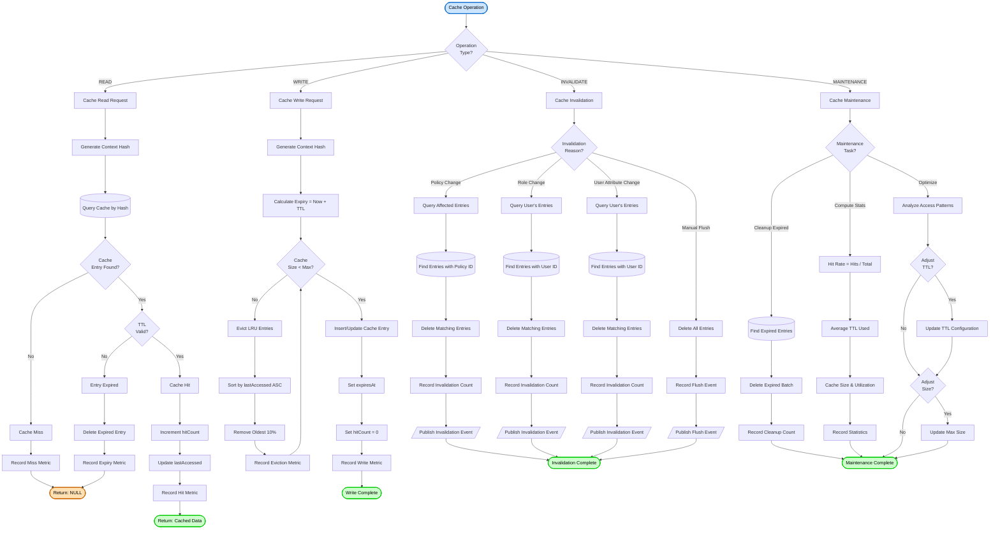

**Cache Configuration**:
- **TTL**: 15 minutes default (900 seconds)
- **Max Size**: 10,000 entries default
- **Eviction**: LRU (Least Recently Used)
- **Target Hit Rate**: >80%
- **Cleanup Interval**: Every 5 minutes

**Invalidation Triggers**:
1. **Policy Change**: Policy updated, activated, or deactivated
2. **Role Change**: Role modified or deleted
3. **User Role Assignment**: User assigned new role or existing role modified
4. **User Attribute Change**: User attributes updated (approval limit, clearance, etc.)
5. **Manual Flush**: Admin manually flushes cache
6. **TTL Expiry**: Entry exceeds 15-minute lifetime

---

## Data Flow Diagram

### Level 0: Context Diagram

**Purpose**: Show System Administration in context with external entities

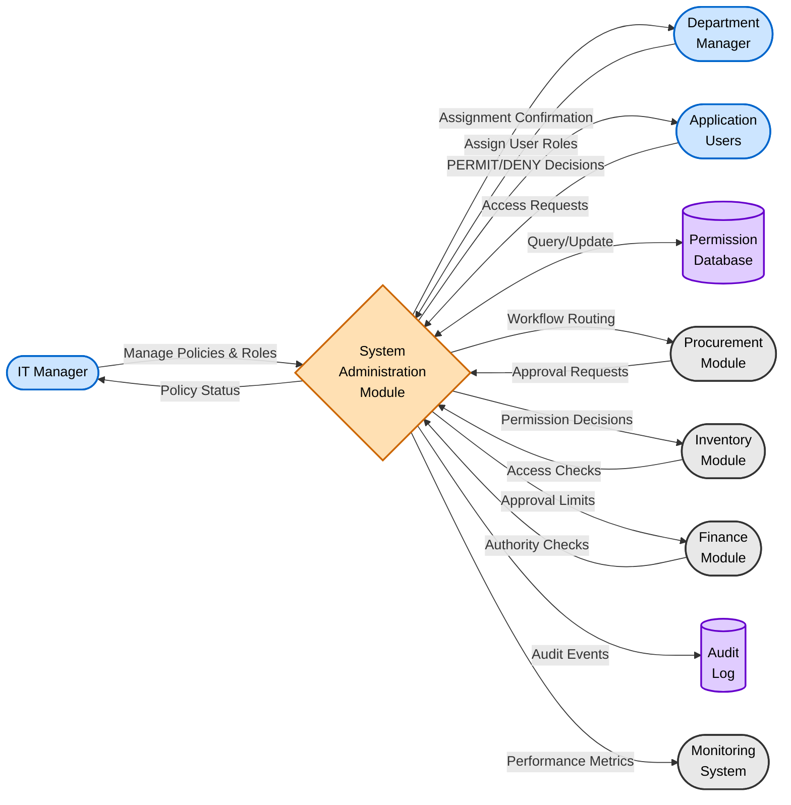

**External Entities**:
- **IT Manager**: Configure policies, roles, workflows, resource definitions
- **Department Manager**: Assign roles to users with contextual scope
- **Application Users**: Request access to protected resources
- **Procurement Module**: Submit approval requests, check user permissions
- **Inventory Module**: Validate access to inventory operations
- **Finance Module**: Enforce approval limits and budget authority
- **Audit Log**: Store immutable audit trail of all permission events
- **Monitoring System**: Track performance metrics and system health

---

### Level 1: System Decomposition

**Purpose**: Decompose System Administration into major subsystems

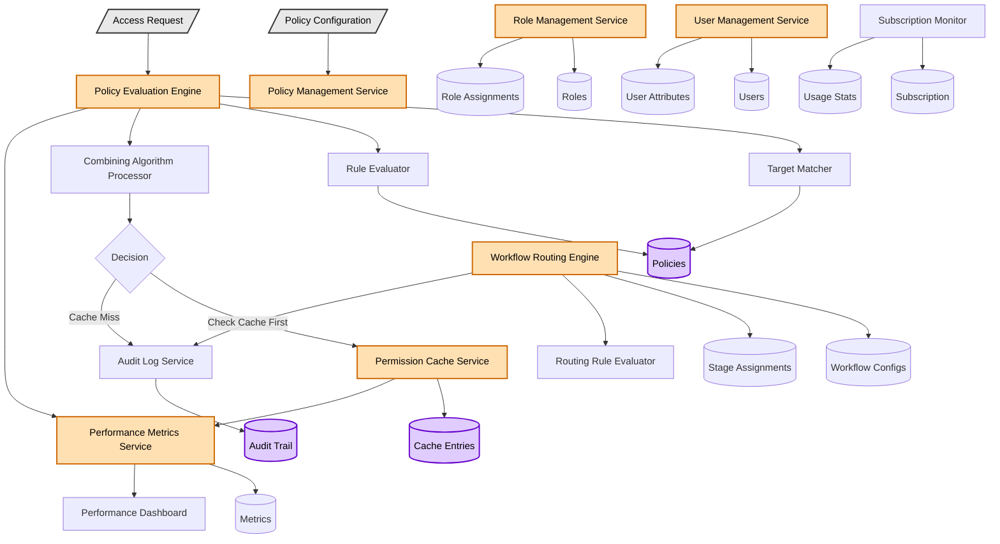

**Subsystem Descriptions**:

1. **Policy Evaluation Engine**: Core ABAC decision engine
   - Target Matcher: Evaluates if request matches policy target criteria
   - Rule Evaluator: Executes policy rules with condition logic
   - Combining Algorithm: Resolves multiple policy results into single decision

2. **Permission Cache Service**: High-performance caching layer
   - LRU eviction policy for memory management
   - 15-minute TTL with automatic cleanup
   - >80% hit rate target for performance

3. **Role Management Service**: Role hierarchy and inheritance
   - Parent-child role relationships (max 10 levels)
   - Permission inheritance with override capability
   - Bulk operations for role updates

4. **User Management Service**: User lifecycle and attributes
   - User profile management
   - Attribute storage and validation
   - Status management (active, inactive, suspended)

5. **Workflow Routing Engine**: Dynamic approval routing
   - Stage-based workflow execution
   - Conditional routing rules
   - SLA tracking and escalation
   - Eligible approver finder with load balancing

6. **Audit Log Service**: Comprehensive event logging
   - Immutable audit trail
   - 7-year retention for compliance
   - Searchable with indexed fields

7. **Performance Metrics Service**: System monitoring
   - Real-time metrics collection
   - Dashboard updates
   - Alert generation on performance degradation

8. **Subscription Monitor**: License and usage tracking
   - Enforcement of subscription limits
   - Usage statistics and trends
   - Automatic alerts when approaching limits

---

## Sequence Diagrams

### Sequence 1: Access Request with Cache Hit

**Purpose**: Show fast path for cached permission decision

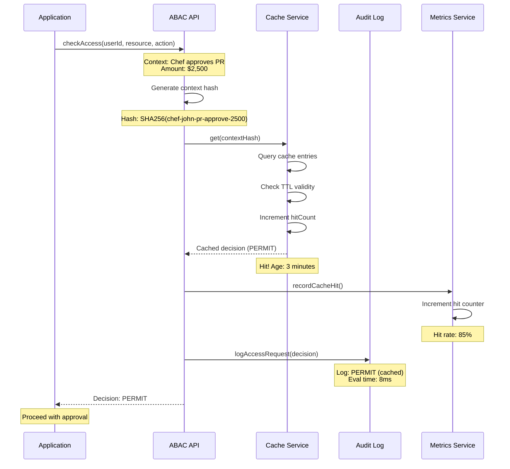

**Performance**:
- **Cache Hit Time**: 3-10ms
- **Total Response Time**: <10ms
- **No Policy Evaluation**: Skipped on cache hit
- **Audit Logged**: Yes, with cache hit indicator

---

### Sequence 2: Access Request with Cache Miss

**Purpose**: Show complete policy evaluation flow on cache miss

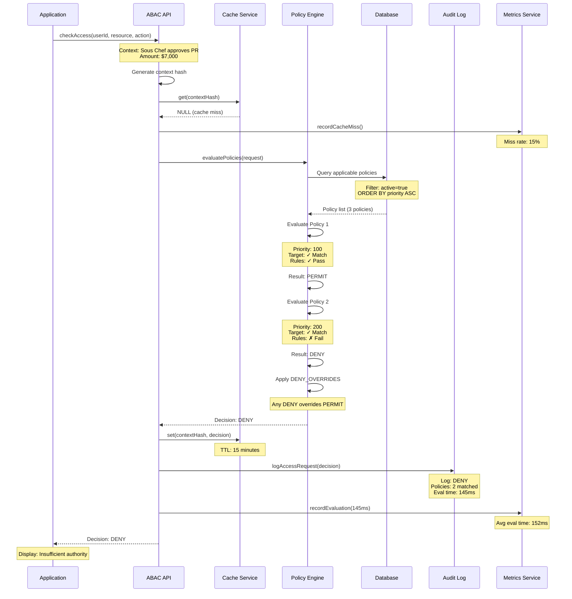

**Performance**:
- **Cache Miss Time**: 0ms (lookup only)
- **Policy Evaluation**: 100-200ms
- **Total Response Time**: <200ms
- **Policies Evaluated**: 2-10 policies (average)
- **Cache Updated**: Yes, for subsequent requests

---

### Sequence 3: User Role Assignment

**Purpose**: Show role assignment with permission cache invalidation

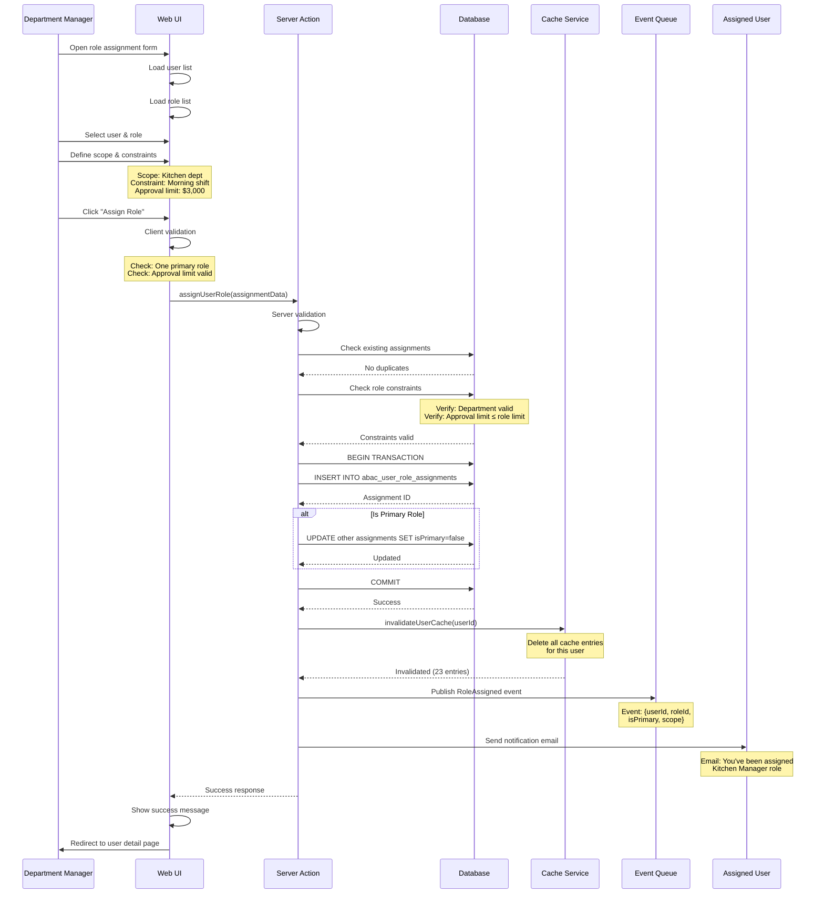

**Key Interactions**:
1. Manager defines role assignment with scope and constraints
2. Client and server validation ensure data integrity
3. Database transaction ensures atomic update
4. Permission cache invalidated for user (all entries deleted)
5. Event published for other systems to consume
6. User notified of new role assignment

---

## State Diagrams

### State 1: Policy Status Transitions

**Purpose**: Show valid status transitions for ABAC policies

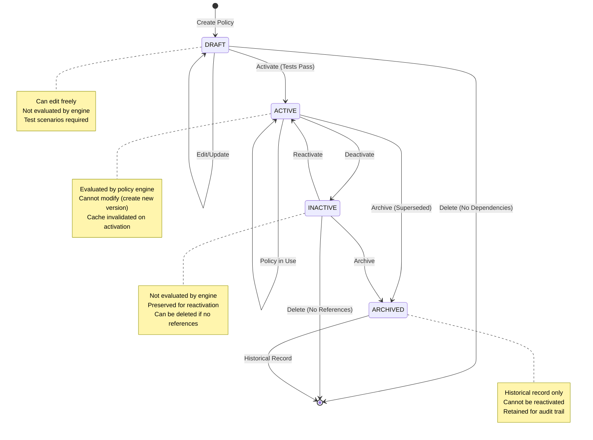

**Status Definitions**:
- **DRAFT**: Policy created but not activated, can be edited or deleted
- **ACTIVE**: Policy in use by evaluation engine, immutable
- **INACTIVE**: Policy deactivated but preserved, can be reactivated
- **ARCHIVED**: Policy superseded by newer version, historical record only

**Transition Rules**:
- DRAFT → ACTIVE: Requires all test scenarios to pass
- ACTIVE → INACTIVE: Immediate effect, cache invalidated
- INACTIVE → ACTIVE: Reactivation, cache invalidated
- ACTIVE/INACTIVE → ARCHIVED: Permanent state, cannot undo
- Delete: Only allowed for DRAFT or INACTIVE with no references

---

### State 2: User Status Transitions

**Purpose**: Show valid status transitions for user accounts

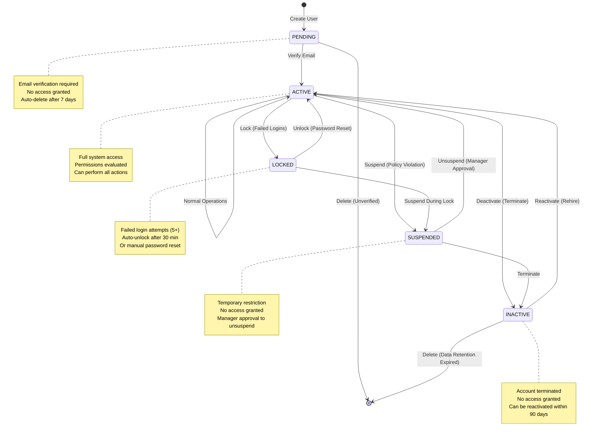

**Status Definitions**:
- **PENDING**: User created, awaiting email verification
- **ACTIVE**: User verified and can access system normally
- **SUSPENDED**: Temporarily restricted due to policy violation
- **LOCKED**: Account locked due to failed login attempts
- **INACTIVE**: Account deactivated (terminated, resigned)

**Transition Triggers**:
- PENDING → ACTIVE: Email verification link clicked
- ACTIVE → SUSPENDED: Manual suspension by manager
- ACTIVE → LOCKED: 5 failed login attempts within 15 minutes
- LOCKED → ACTIVE: Password reset or 30-minute auto-unlock
- ACTIVE → INACTIVE: Manual deactivation by HR/manager
- INACTIVE → ACTIVE: Rehire process within 90 days

---

## Integration Flows

### Integration 1: Procurement Module - Purchase Request Approval

**Purpose**: Show end-to-end flow from PR submission to approval via ABAC and workflow

```mermaid
flowchart LR
    subgraph Procurement
        CreatePR[Create Purchase Request]
        FillDetails[Fill Details]
        Submit[Submit for Approval]
    end

    subgraph ABAC Permission Check
        CheckSubmit[Check: Can Submit?]
        EvalPolicy1[Evaluate Submit Policy]
        SubmitPermit{PERMIT?}
    end

    subgraph Workflow Routing
        RouteWF[Route to Workflow]
        FindApprovers[Find Eligible Approvers]
        Stage1[Stage 1: Kitchen Manager]
        Stage2[Stage 2: Purchasing Manager]
    end

    subgraph ABAC Approval Check
        CheckApprove1[Check: Can Approve Stage 1?]
        EvalPolicy2[Evaluate Approval Policy]
        ApprovePermit1{PERMIT?}

        CheckApprove2[Check: Can Approve Stage 2?]
        EvalPolicy3[Evaluate Approval Policy]
        ApprovePermit2{PERMIT?}
    end

    subgraph Completion
        AllApproved[All Stages Approved]
        CreatePO[Create Purchase Order]
        Notify[/Notify Requester/]
    end

    CreatePR --> FillDetails
    FillDetails --> Submit
    Submit --> CheckSubmit
    CheckSubmit --> EvalPolicy1
    EvalPolicy1 --> SubmitPermit
    SubmitPermit -->|Yes| RouteWF
    SubmitPermit -->|No| Denied1([Denied])

    RouteWF --> FindApprovers
    FindApprovers --> Stage1
    Stage1 --> CheckApprove1
    CheckApprove1 --> EvalPolicy2
    EvalPolicy2 --> ApprovePermit1
    ApprovePermit1 -->|Yes| Stage2
    ApprovePermit1 -->|No| Denied2([Denied])

    Stage2 --> CheckApprove2
    CheckApprove2 --> EvalPolicy3
    EvalPolicy3 --> ApprovePermit2
    ApprovePermit2 -->|Yes| AllApproved
    ApprovePermit2 -->|No| Denied3([Denied])

    AllApproved --> CreatePO
    CreatePO --> Notify

    style CreatePR fill:#e8e8e8,stroke:#333,stroke-width:2px,color:#000
    style Submit fill:#ccffcc,stroke:#00cc00,stroke-width:2px,color:#000
    style RouteWF fill:#ffe0b3,stroke:#cc6600,stroke-width:2px,color:#000
    style AllApproved fill:#ccffcc,stroke:#00cc00,stroke-width:2px,color:#000
    style Denied1 fill:#ffcccc,stroke:#cc0000,stroke-width:2px,color:#000
    style Denied2 fill:#ffcccc,stroke:#cc0000,stroke-width:2px,color:#000
    style Denied3 fill:#ffcccc,stroke:#cc0000,stroke-width:2px,color:#000
```

**Integration Points**:
1. **Submit Check**: ABAC verifies user can submit PR (role + department + limits)
2. **Workflow Routing**: ABAC workflow engine routes to appropriate approvers
3. **Stage 1 Approval**: ABAC verifies Kitchen Manager can approve (role + approval limit)
4. **Stage 2 Approval**: ABAC verifies Purchasing Manager can approve (role + approval limit)
5. **Completion**: Procurement creates PO after all approvals

**Permission Policies**:
- **Submit Policy**: Requires "purchaser" or "requester" role + department match
- **Approve Stage 1**: Requires "kitchen-manager" role + approval limit ≥ amount
- **Approve Stage 2**: Requires "purchasing-manager" role + no approval limit

---

### Integration 2: Inventory Module - Stock Adjustment Authority

**Purpose**: Show inventory adjustment with ABAC permission check

```mermaid
flowchart LR
    subgraph Inventory
        CreateAdj[Create Stock Adjustment]
        FillReason[Fill Reason & Amount]
        Submit2[Submit Adjustment]
    end

    subgraph ABAC Permission Check
        CheckCreate[Check: Can Create Adjustment?]
        EvalPolicy4[Evaluate Adjustment Policy]
        CreatePermit{PERMIT?}

        CheckAmount[Check: Amount Within Authority?]
        CompareLimit[Compare to User Approval Limit]
        LimitOK{Within<br>Limit?}
    end

    subgraph Approval Required
        RouteApproval[Route for Manager Approval]
        ManagerCheck[Manager: Can Approve?]
        EvalPolicy5[Evaluate Manager Policy]
        ManagerPermit{PERMIT?}
    end

    subgraph Posting
        PostAdj[Post Adjustment to Inventory]
        JEGeneration[Generate Journal Entry]
        UpdateGL[Update GL Accounts]
    end

    CreateAdj --> FillReason
    FillReason --> Submit2
    Submit2 --> CheckCreate
    CheckCreate --> EvalPolicy4
    EvalPolicy4 --> CreatePermit
    CreatePermit -->|Yes| CheckAmount
    CreatePermit -->|No| Denied4([Denied])

    CheckAmount --> CompareLimit
    CompareLimit --> LimitOK
    LimitOK -->|Yes| PostAdj
    LimitOK -->|No| RouteApproval

    RouteApproval --> ManagerCheck
    ManagerCheck --> EvalPolicy5
    EvalPolicy5 --> ManagerPermit
    ManagerPermit -->|Yes| PostAdj
    ManagerPermit -->|No| Denied5([Denied])

    PostAdj --> JEGeneration
    JEGeneration --> UpdateGL

    style CreateAdj fill:#e8e8e8,stroke:#333,stroke-width:2px,color:#000
    style Submit2 fill:#ccffcc,stroke:#00cc00,stroke-width:2px,color:#000
    style PostAdj fill:#ccffcc,stroke:#00cc00,stroke-width:2px,color:#000
    style Denied4 fill:#ffcccc,stroke:#cc0000,stroke-width:2px,color:#000
    style Denied5 fill:#ffcccc,stroke:#cc0000,stroke-width:2px,color:#000
```

**Integration Points**:
1. **Create Check**: ABAC verifies user can create adjustments (role + location)
2. **Amount Check**: ABAC compares adjustment value to user's authority limit
3. **Approval Required**: If exceeds limit, route to manager with higher authority
4. **Manager Check**: ABAC verifies manager has sufficient approval limit
5. **Posting**: Inventory posts adjustment and generates journal entry

**Authority Rules**:
- **Store Staff**: Can adjust up to $500 without approval
- **Store Manager**: Can adjust up to $5,000 without approval
- **Operations Manager**: Can adjust up to $50,000 without approval
- **CFO Approval**: Required for adjustments > $50,000

---

## Appendix

### Diagram Legend

**Shape Meanings**:
- **Rounded Rectangle**: Start/End points
- **Rectangle**: Process steps
- **Diamond**: Decision points
- **Parallelogram**: Input/Output
- **Cylinder**: Database storage
- **Cloud**: External systems
- **Hexagon**: Subsystems

**Color Meanings**:
- **Light Blue** (#cce5ff): Start points, actors
- **Light Green** (#ccffcc): Success outcomes, approvals
- **Light Red** (#ffcccc): Error outcomes, denials
- **Light Orange** (#ffe0b3): Warnings, pending states
- **Light Purple** (#e0ccff): Database operations
- **Light Gray** (#e8e8e8): Standard processes

### Performance Benchmarks

**Policy Evaluation**:
- Cache Hit: <10ms (target), <50ms (acceptable)
- Cache Miss: <200ms (target), <500ms (acceptable)
- Policy Count: 1,000+ active policies supported
- Concurrent Evaluations: 100+ simultaneous requests

**Cache Performance**:
- Hit Rate: >80% target, >70% acceptable
- Cache Size: 10,000 entries default
- TTL: 15 minutes default
- Eviction: LRU policy
- Cleanup: Every 5 minutes

**Workflow Routing**:
- Stage Assignment: <100ms
- Eligible Approver Search: <50ms
- SLA Tracking: 1-minute intervals
- Notification Delivery: <5 seconds

### Related Documents

- [Business Requirements](./BR-system-administration.md)
- [Use Cases](./UC-system-administration.md)
- [Technical Specification](./TS-system-administration.md)
- [Data Schema](./DS-system-administration.md)
- [Validations](./VAL-system-administration.md)

---

**Document End**
