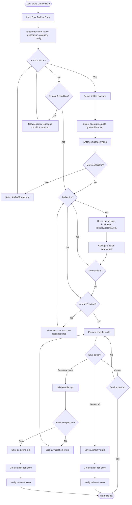
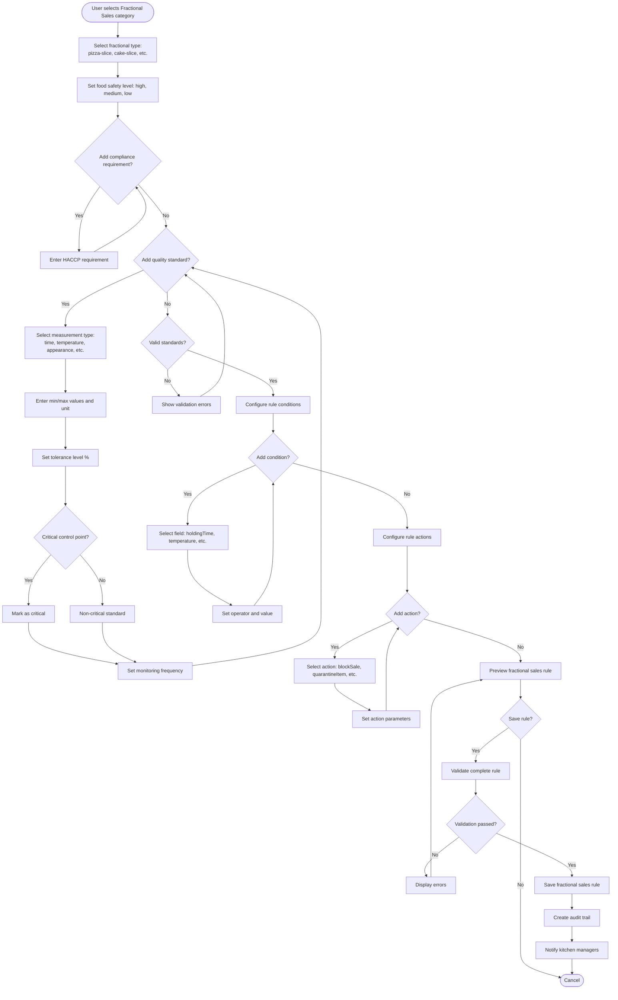
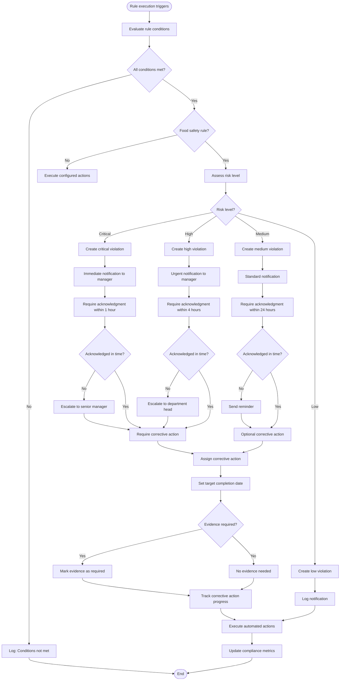
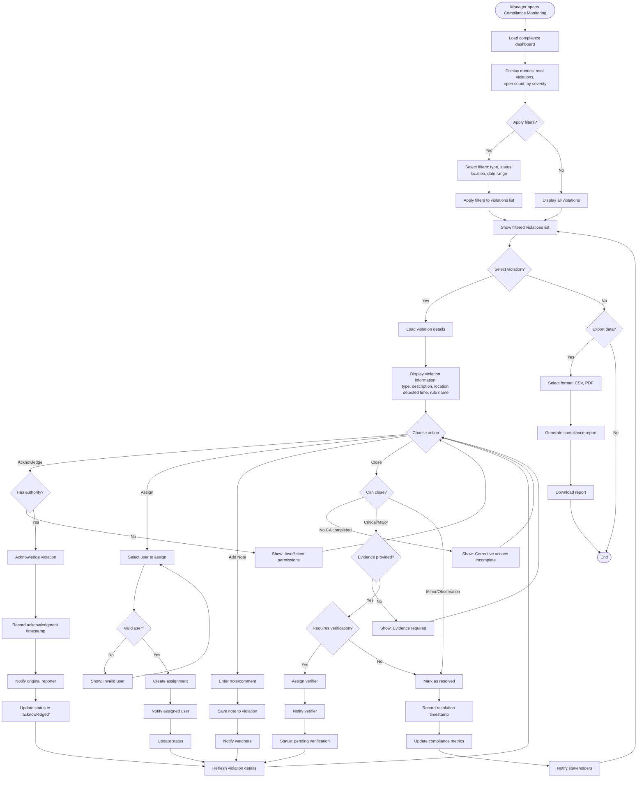
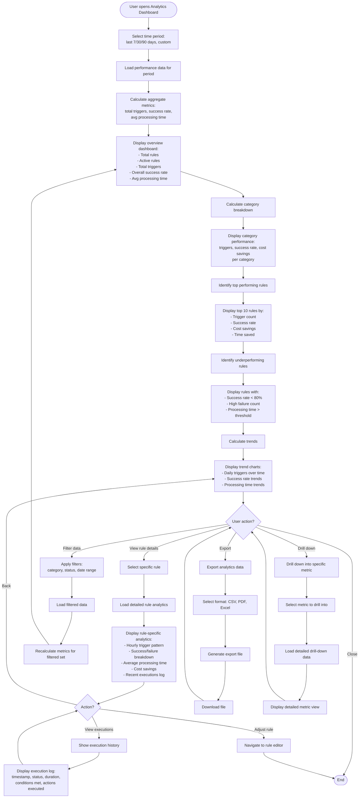
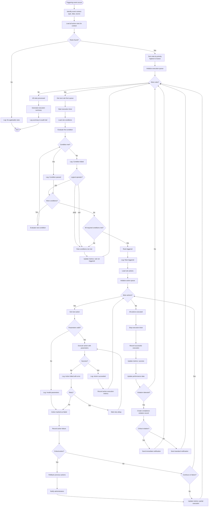
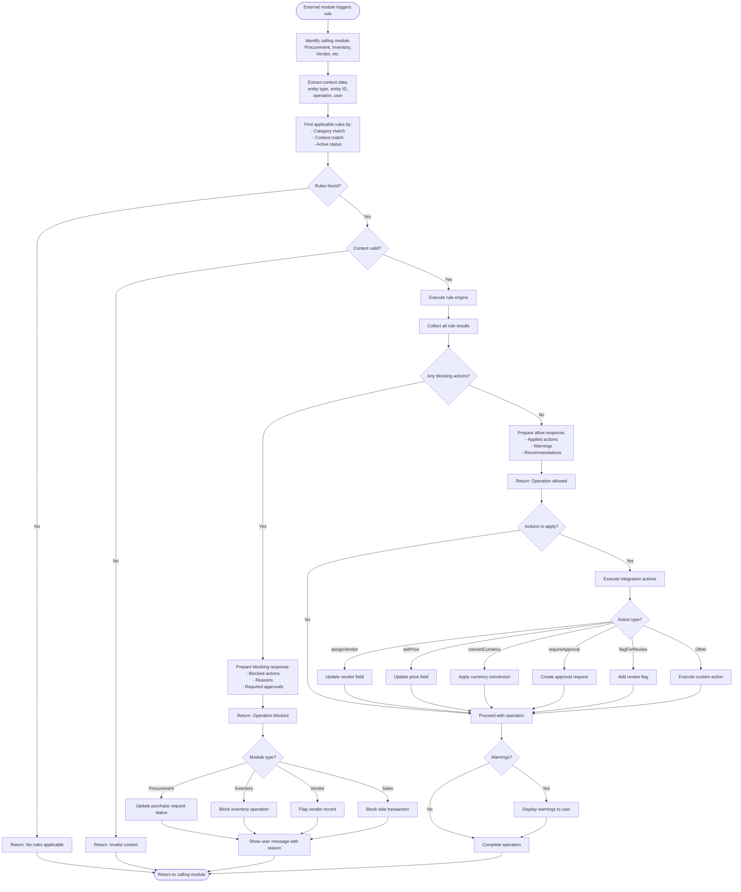

# Business Rules - Flow Diagrams (FD)

**Module**: System Administration - Business Rules
**Version**: 1.0
**Last Updated**: 2025-01-16

## Document History

| Version | Date | Author | Changes |
|---------|------|--------|---------|
| 1.1.0 | 2025-12-10 | Documentation Team | Standardized reference number format (XXX-YYMM-NNNN) |
| 1.0.0 | 2025-11-19 | Documentation Team | Initial version |
---

## 1. Overview

This document contains comprehensive flow diagrams for all major workflows in the Business Rules Management module using Mermaid notation.

---

## 2. Rule Management Workflows

### 2.1 Create Business Rule

---

### 2.2 Configure Fractional Sales Rule

---

### 2.3 Monitor Food Safety Compliance

---

### 2.4 Manage Compliance Violations

---

### 2.5 Execute Corrective Actions

```mermaid
flowchart TD
    Start([Corrective action assigned]) --> NotifyAssignee[Send notification to assignee]
    NotifyAssignee --> AssigneeReceives[Assignee receives assignment]

    AssigneeReceives --> ViewAction[View action details:<br>violation, description,<br>target date, evidence req]

    ViewAction --> AssigneeAction{Assignee chooses}
    AssigneeAction -->|Accept| AcceptAction[Accept assignment]
    AssigneeAction -->|Request Help| RequestHelp[Request additional resources]
    AssigneeAction -->|Escalate| EscalateAction[Escalate to manager]

    AcceptAction --> UpdateStatus1[Update status to 'in-progress']
    UpdateStatus1 --> RecordStartTime[Record start timestamp]
    RecordStartTime --> BeginWork[Begin corrective work]

    RequestHelp --> NotifyManager1[Notify manager of help request]
    NotifyManager1 --> ManagerResponds{Manager responds?}
    ManagerResponds -->|Assign help| AssignHelper[Assign additional resource]
    ManagerResponds -->|Extend deadline| ExtendDeadline[Extend target date]
    ManagerResponds -->|Reassign| ReassignAction[Reassign to different user]
    AssignHelper --> BeginWork
    ExtendDeadline --> BeginWork
    ReassignAction --> NotifyNewAssignee[Notify new assignee]
    NotifyNewAssignee --> ViewAction

    EscalateAction --> NotifyManager2[Notify manager of escalation]
    NotifyManager2 --> ManagerDecision{Manager decision}
    ManagerDecision -->|Approve escalation| ReassignAction
    ManagerDecision -->|Reject escalation| ReturnToAssignee[Return to original assignee]
    ReturnToAssignee --> ViewAction

    BeginWork --> PerformAction[Perform corrective action steps]
    PerformAction --> MonitorDeadline{Before deadline?}

    MonitorDeadline -->|No| MarkOverdue[Mark as overdue]
    MarkOverdue --> SendReminder[Send overdue reminder]
    SendReminder --> EscalateOverdue[Escalate to manager]
    EscalateOverdue --> PerformAction

    MonitorDeadline -->|Yes| ActionComplete{Action completed?}
    ActionComplete -->|No| UpdateProgress[Update progress notes]
    UpdateProgress --> PerformAction

    ActionComplete -->|Yes| EvidenceReq{Evidence required?}
    EvidenceReq -->|No| MarkCompleted
    EvidenceReq -->|Yes| UploadEvidence[Upload evidence:<br>photos, documents, logs]

    UploadEvidence --> ValidateEvidence{Evidence valid?}
    ValidateEvidence -->|No| ShowEvidenceError[Show: Invalid evidence format]
    ShowEvidenceError --> UploadEvidence
    ValidateEvidence -->|Yes| SaveEvidence[Save evidence with action]
    SaveEvidence --> MarkCompleted[Mark action as completed]

    MarkCompleted --> RecordCompletionTime[Record completion timestamp]
    RecordCompletionTime --> NotifyManager3[Notify manager of completion]

    NotifyManager3 --> VerificationReq{Verification required?}
    VerificationReq -->|No| CloseAction[Close corrective action]
    VerificationReq -->|Yes| AssignVerifier[Assign verifier]

    AssignVerifier --> NotifyVerifier[Notify verifier]
    NotifyVerifier --> VerifierReviews[Verifier reviews action and evidence]

    VerifierReviews --> VerifierDecision{Verification passed?}
    VerifierDecision -->|No| RequestRework[Request rework]
    RequestRework --> NotifyAssigneeRework[Notify assignee of rework]
    NotifyAssigneeRework --> UpdateStatus2[Update status to 'in-progress']
    UpdateStatus2 --> PerformAction

    VerifierDecision -->|Yes| ApproveAction[Approve corrective action]
    ApproveAction --> RecordVerificationTime[Record verification timestamp]
    RecordVerificationTime --> CloseAction

    CloseAction --> UpdateViolation[Update parent violation status]
    UpdateViolation --> UpdateMetrics[Update performance metrics]
    UpdateMetrics --> NotifyStakeholders[Notify all stakeholders]
    NotifyStakeholders --> CreateAuditLog[Create audit log entry]
    CreateAuditLog --> End([End])
```

---

## 3. Rule Testing and Analytics

### 3.1 Test Business Rule

```mermaid
flowchart TD
    Start([User clicks Test Rule]) --> SelectRule[Select rule to test]
    SelectRule --> LoadRuleConfig[Load rule configuration:<br>conditions and actions]

    LoadRuleConfig --> TestMode{Test mode?}
    TestMode -->|Use test scenario| SelectScenario[Select predefined test scenario]
    TestMode -->|Manual input| EnterTestData[Enter test data manually]

    SelectScenario --> LoadScenarioData[Load scenario data]
    LoadScenarioData --> DisplayExpected[Display expected results]
    DisplayExpected --> RunTest

    EnterTestData --> ValidateInput{Input valid?}
    ValidateInput -->|No| ShowInputError[Show validation errors]
    ShowInputError --> EnterTestData
    ValidateInput -->|Yes| RunTest[Run rule evaluation]

    RunTest --> StartTimer[Start execution timer]
    StartTimer --> EvaluateConditions[Evaluate all conditions]

    EvaluateConditions --> CondResult{Conditions met?}
    CondResult -->|No| LogNoTrigger[Log: Rule not triggered]
    CondResult -->|Yes| LogTrigger[Log: Rule triggered]

    LogNoTrigger --> RecordResult1
    LogTrigger --> ExecuteActions[Execute all actions in sequence]

    ExecuteActions --> TrackActions[Track each action execution]
    TrackActions --> ActionSuccess{All actions succeeded?}

    ActionSuccess -->|No| LogFailures[Log failed actions with errors]
    ActionSuccess -->|Yes| LogSuccess[Log all successful actions]

    LogFailures --> RecordResult2
    LogSuccess --> RecordResult2[Stop timer and record execution time]
    RecordResult1 --> RecordResult2

    RecordResult2 --> CompareExpected{Has expected results?}
    CompareExpected -->|Yes| CompareResults[Compare actual vs expected]
    CompareExpected -->|No| DisplayResults

    CompareResults --> ResultsMatch{Results match?}
    ResultsMatch -->|Yes| MarkPassed[Mark test as PASSED]
    ResultsMatch -->|No| MarkFailed[Mark test as FAILED]

    MarkPassed --> DisplayResults[Display test results:<br>status, execution time,<br>triggered conditions,<br>executed actions]
    MarkFailed --> DisplayDifferences[Display differences:<br>expected vs actual]
    DisplayDifferences --> DisplayResults

    DisplayResults --> SaveResults{Save results?}
    SaveResults -->|Yes| SaveTestLog[Save test log with timestamp]
    SaveResults -->|No| DiscardResults

    SaveTestLog --> UpdateTestMetrics[Update rule test metrics]
    UpdateTestMetrics --> MoreTests
    DiscardResults --> MoreTests{Run more tests?}

    MoreTests -->|Yes| TestMode
    MoreTests -->|No| GenerateReport{Generate test report?}

    GenerateReport -->|Yes| CreateReport[Create comprehensive test report]
    CreateReport --> DownloadReport[Download report]
    DownloadReport --> End([End])
    GenerateReport -->|No| End
```

---

### 3.2 Analyze Rule Performance

---

## 4. Rule Execution Engine

### 4.1 Rule Evaluation and Execution

---

## 5. Audit and Compliance Workflows

### 5.1 Audit Rule Changes

```mermaid
flowchart TD
    Start([Rule change initiated]) --> CaptureChange[Capture change details:<br>field, old value, new value]
    CaptureChange --> IdentifyAction[Identify action type:<br>create, modify, activate,<br>deactivate, delete]

    IdentifyAction --> RequireJustification{Justification required?}
    RequireJustification -->|Yes| PromptReason[Prompt for reason and<br>business justification]
    RequireJustification -->|No| AutoJustification[Generate auto justification]

    PromptReason --> ValidateReason{Reason provided?}
    ValidateReason -->|No| ShowReasonError[Show: Reason required]
    ShowReasonError --> PromptReason
    ValidateReason -->|Yes| CaptureJustification

    AutoJustification --> CaptureJustification[Capture justification]
    CaptureJustification --> AssessImpact[Assess change impact]

    AssessImpact --> ImpactLevel{Impact level?}
    ImpactLevel -->|High| RequireApproval[Require manager approval]
    ImpactLevel -->|Medium| OptionalApproval[Optional approval]
    ImpactLevel -->|Low| DirectSave[Save without approval]

    RequireApproval --> NotifyApprover[Notify approver]
    NotifyApprover --> WaitApproval{Approved?}

    WaitApproval -->|Timeout| EscalateApproval[Escalate to senior manager]
    EscalateApproval --> WaitApproval

    WaitApproval -->|Rejected| NotifyRejection[Notify user of rejection]
    NotifyRejection --> LogRejection[Log rejection in audit trail]
    LogRejection --> End([End])

    WaitApproval -->|Approved| RecordApprover[Record approver ID and timestamp]
    RecordApprover --> DirectSave

    OptionalApproval --> UserChoice{Request approval?}
    UserChoice -->|Yes| NotifyApprover
    UserChoice -->|No| DirectSave

    DirectSave --> CreateAuditEntry[Create audit trail entry]
    CreateAuditEntry --> RecordMetadata[Record metadata:<br>- IP address<br>- User agent<br>- Timestamp<br>- User ID]

    RecordMetadata --> StoreChanges[Store before/after values in JSON]
    StoreChanges --> ApplyChange[Apply change to rule]

    ApplyChange --> ChangeSuccess{Change successful?}
    ChangeSuccess -->|No| LogError[Log error in audit trail]
    LogError --> RollbackAudit[Rollback audit entry]
    RollbackAudit --> NotifyFailure[Notify user of failure]
    NotifyFailure --> End

    ChangeSuccess -->|Yes| UpdateAuditStatus[Update audit entry status]
    UpdateAuditStatus --> NotifyWatchers[Notify rule watchers]
    NotifyWatchers --> UpdateVersion[Increment rule version]
    UpdateVersion --> GenerateReport[Generate change report]
    GenerateReport --> ArchiveOldVersion[Archive previous version]
    ArchiveOldVersion --> End
```

---

## 6. Integration Workflows

### 6.1 Rule Integration with Other Modules

---

**Document Control**:
- **Created**: 2025-01-16
- **Version**: 1.0
- **Status**: Complete
- **Diagrams**: 10 comprehensive flow diagrams
