# Flow Diagrams: Location Management

## Document Information
- **Module**: System Administration / Location Management
- **Version**: 1.2
- **Last Updated**: 2025-12-17
- **Status**: Active

## Document History

| Version | Date | Author | Changes |
|---------|------|--------|---------|
| 1.0.0 | 2025-11-19 | Documentation Team | Initial version |
| 1.1.0 | 2025-11-26 | Documentation Team | Code compliance review - aligned with BR document, simplified flows |
| 1.2.0 | 2025-12-17 | Documentation Team | Removed Department column from location list - department assignment now managed from Department module |

## Overview

This document provides comprehensive flow diagrams for all Location Management workflows using Mermaid notation. Each diagram illustrates the complete user journey, system interactions, and decision points.

---

## FD-001: Create Location Flow

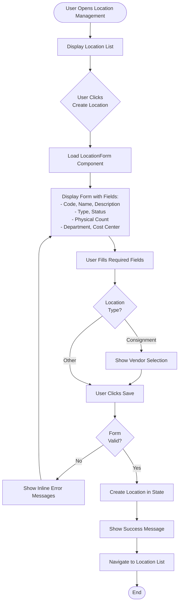

---

## FD-002: Edit Location Flow

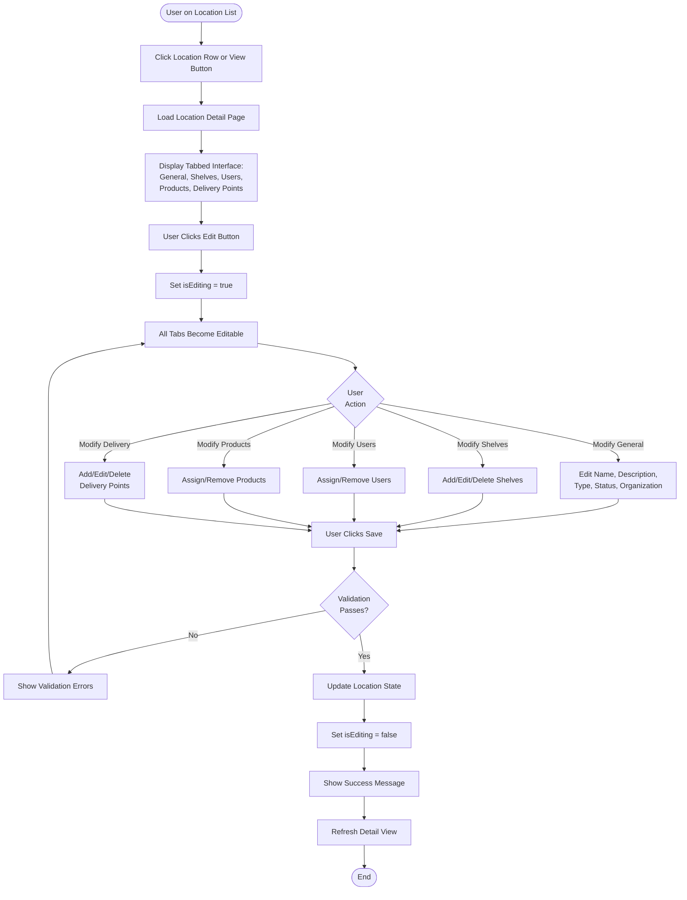

---

## FD-003: View Location Detail Flow

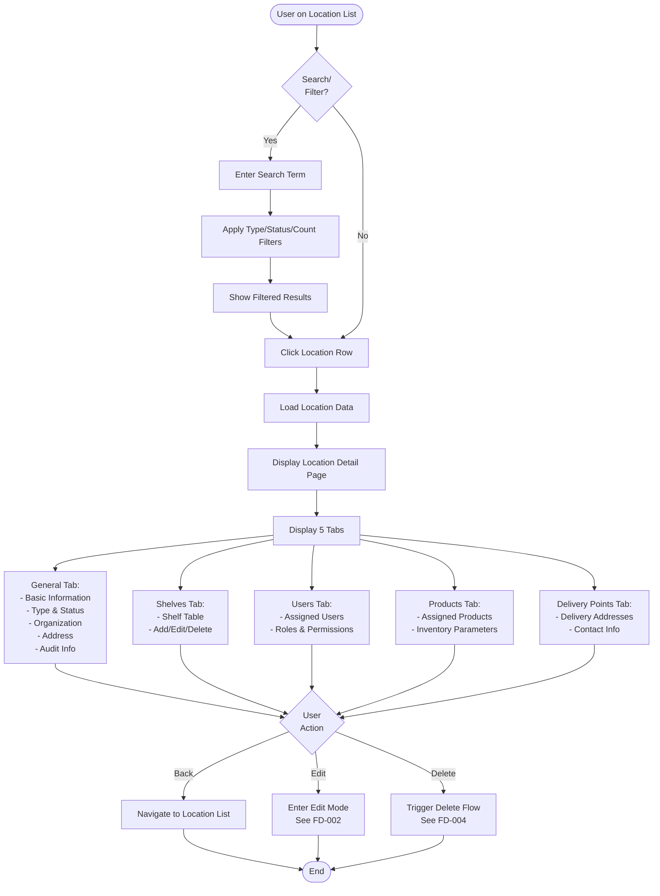

---

## FD-004: Delete Location Flow

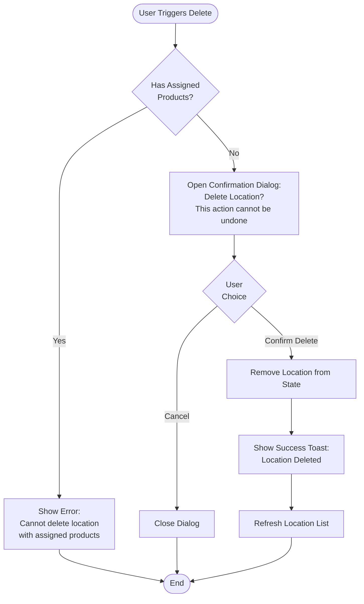

---

## FD-005: Search and Filter Flow

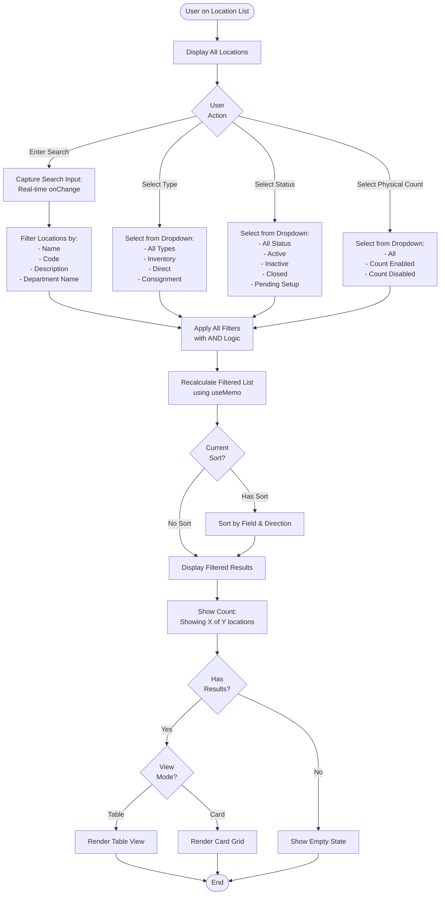

---

## FD-006: Sort Location List Flow

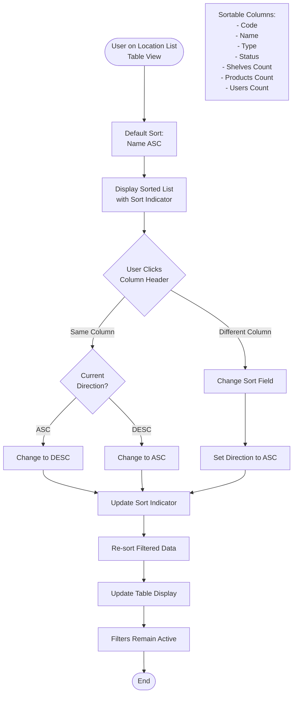

---

## FD-007: Toggle View Mode Flow

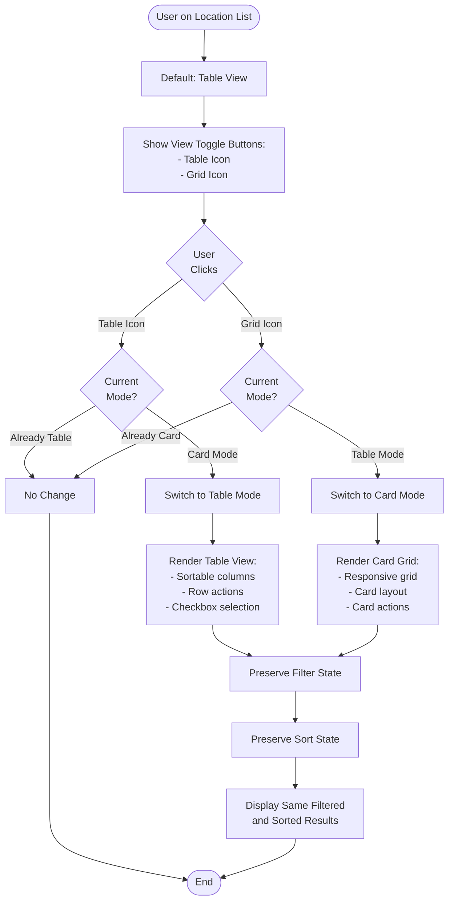

---

## FD-008: Shelf Management Flow

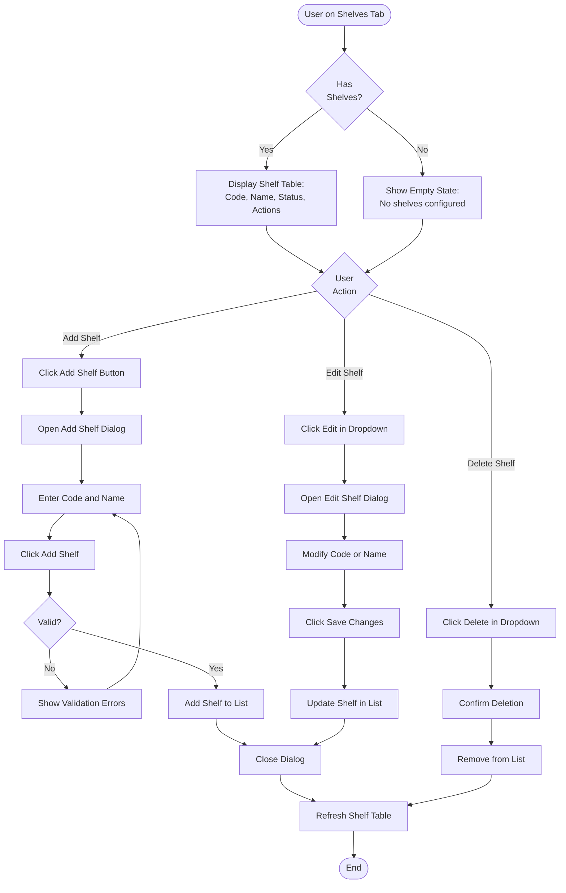

---

## FD-009: User Assignment Flow

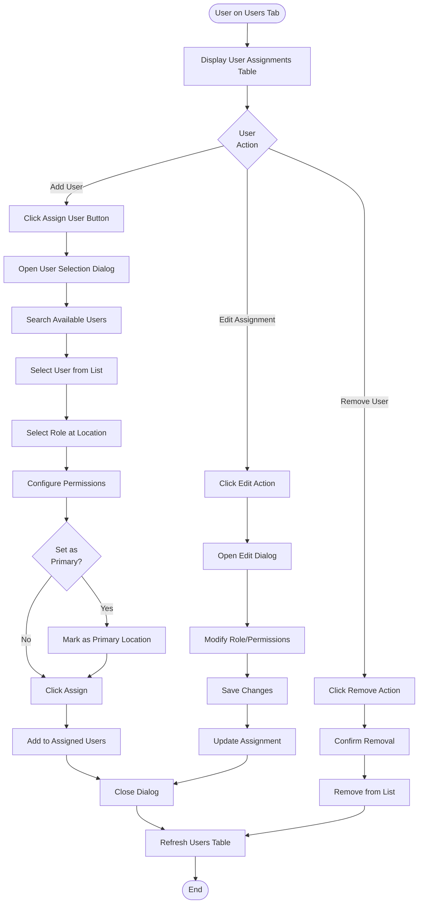

---

## FD-010: Product Assignment Flow

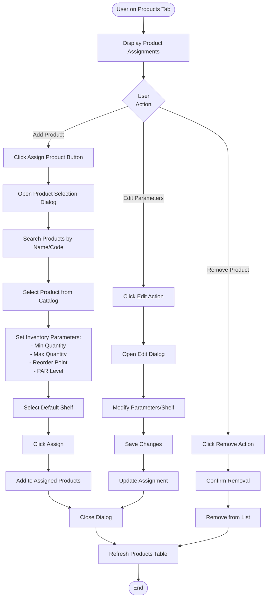

---

## FD-011: Delivery Point Management Flow

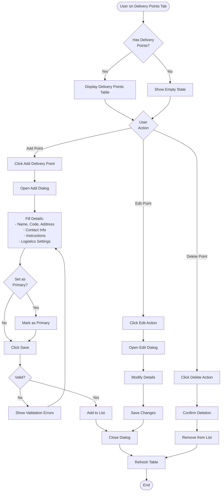

---

## FD-012: Bulk Actions Flow

```mermaid
flowchart TD
    Start([User on Location List]) --> SelectLocations[Select Locations via Checkboxes]
    SelectLocations --> ShowSelected[Show: X location(s) selected]
    ShowSelected --> BulkAction{Select<br>Bulk Action}

    BulkAction -->|Activate| ConfirmActivate[Confirm Activation]
    ConfirmActivate --> ActivateAll[Set Status = Active for Selected]
    ActivateAll --> ShowSuccess[Show Success Message]
    ShowSuccess --> ClearSelection[Clear Selection]
    ClearSelection --> RefreshList[Refresh List]
    RefreshList --> End([End])

    BulkAction -->|Deactivate| ConfirmDeactivate[Confirm Deactivation]
    ConfirmDeactivate --> DeactivateAll[Set Status = Inactive for Selected]
    DeactivateAll --> ShowSuccess

    BulkAction -->|Delete| CheckProducts{Any Have<br>Products?}
    CheckProducts -->|Yes| ShowWarning[Show Warning:<br>Some locations have products]
    ShowWarning --> End
    CheckProducts -->|No| ConfirmDelete[Confirm Deletion]
    ConfirmDelete --> DeleteAll[Delete Selected Locations]
    DeleteAll --> ShowSuccess

    BulkAction -->|Clear Selection| ClearAll[Clear All Selections]
    ClearAll --> RefreshList

    BulkAction -->|Export CSV| GenerateCSV[Generate CSV File]
    GenerateCSV --> DownloadCSV[Download CSV]
    DownloadCSV --> End

    BulkAction -->|Print| OpenPrint[Open Browser Print Dialog]
    OpenPrint --> End
```

---

## Workflow Summary

### Critical Paths

1. **Create Location**: FD-001 (4-6 steps)
2. **Edit Location**: FD-002 (6-8 steps with tabbed interface)
3. **View Details**: FD-003 (3-4 steps)
4. **Delete Location**: FD-004 (3-5 steps with validation)
5. **Search & Filter**: FD-005 (2-4 steps for each filter)

### Tab-Based Workflows

- **Shelf Management**: FD-008 (Add/Edit/Delete shelves)
- **User Assignment**: FD-009 (Assign users with roles)
- **Product Assignment**: FD-010 (Assign products with parameters)
- **Delivery Points**: FD-011 (Manage delivery addresses)

### Bulk Operations

- **Bulk Actions**: FD-012 (Activate/Deactivate/Delete/Export/Print)

### Integration Points

**With User Management**:
- FD-009: User assignment workflow

**With Product Management**:
- FD-010: Product assignment workflow

**With Vendor Management**:
- FD-001, FD-002: Consignment vendor selection

### Error Handling Flows

All flows include error handling for:
- Validation errors (inline display)
- Business rule violations (cannot delete with products)
- Network errors (toast notifications)
