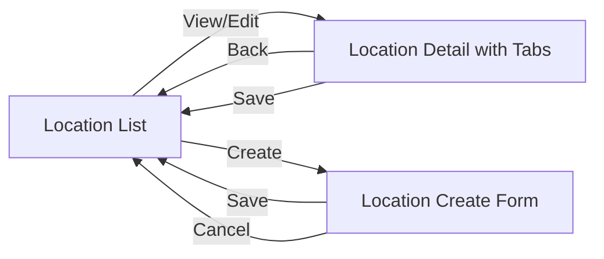
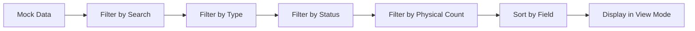
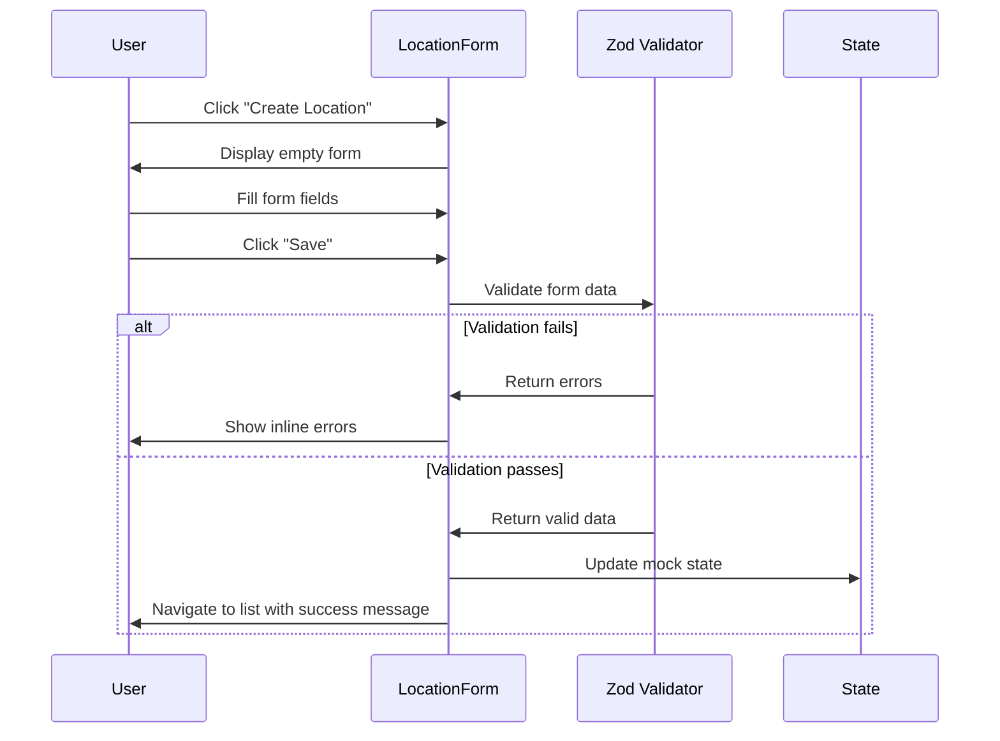
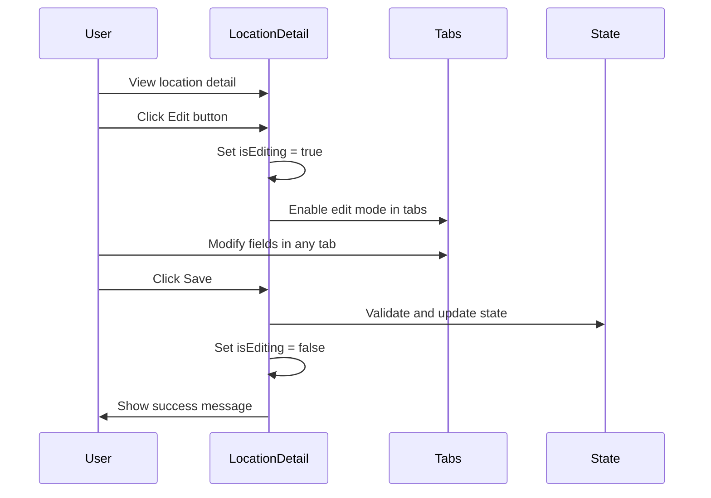
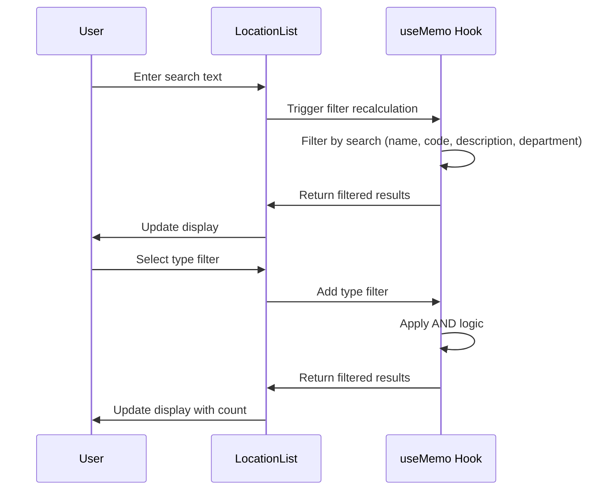

# Technical Specification: Location Management

## Document Information
- **Module**: System Administration / Location Management
- **Version**: 1.1
- **Last Updated**: 2025-11-26
- **Status**: Active
- **Tech Stack**: Next.js 14 (App Router), TypeScript, React, Tailwind CSS, Shadcn/ui, Zod, React Hook Form

## Document History

| Version | Date | Author | Changes |
|---------|------|--------|---------|
| 1.0.0 | 2025-11-19 | Documentation Team | Initial version |
| 1.1.0 | 2025-11-26 | Documentation Team | Code compliance review - aligned with BR document, removed fictional features |

## System Architecture

### Component Hierarchy

```mermaid
graph TD
    A[app/system-administration/location-management] --> B[page.tsx]
    B --> C[LocationList Component]

    A --> D[[id]/page.tsx]
    D --> E[Location Detail Page]
    E --> F[Tabs: General, Shelves, Users, Products, Delivery]

    A --> G[new/page.tsx]
    G --> H[LocationForm Component]

    A --> I[components/]
    I --> J[location-list.tsx]
    I --> K[location-form.tsx]
    I --> L[tabs/general-tab.tsx]
    I --> M[tabs/shelves-tab.tsx]
    I --> N[tabs/users-tab.tsx]
    I --> O[tabs/products-tab.tsx]
    I --> P[tabs/delivery-points-tab.tsx]
```

## Page Structure and Routes

### Route Configuration

| Route | Component | Purpose |
|-------|-----------|---------|
| `/system-administration/location-management` | page.tsx → LocationList | Main location list view |
| `/system-administration/location-management/[id]` | [id]/page.tsx | View/Edit location details with tabs |
| `/system-administration/location-management/new` | new/page.tsx → LocationForm | Create new location |

### Navigation Flow



## Component Specifications

### 1. LocationList Component

**File**: `components/location-list.tsx`

**Purpose**: Main list view with search, filter, sort, bulk actions, and dual-view capabilities

**State Management**:
```typescript
// Sort configuration
const [sortConfig, setSortConfig] = useState<SortConfig>({
  field: 'name',
  direction: 'asc'
})

// View mode (table or card)
const [viewMode, setViewMode] = useState<'table' | 'card'>('table')

// Filter configuration
const [filters, setFilters] = useState({
  search: '',
  type: 'all',      // 'all' | 'inventory' | 'direct' | 'consignment'
  status: 'all',    // 'all' | 'active' | 'inactive' | 'closed' | 'pending_setup'
  physicalCount: 'all'  // 'all' | 'enabled' | 'disabled'
})

// Selection state for bulk actions
const [selectedLocationIds, setSelectedLocationIds] = useState<string[]>([])
```

**Key Features**:
- Real-time search across name, code, description, department name
- Filter by type (Inventory, Direct, Consignment)
- Filter by status (Active, Inactive, Closed, Pending Setup)
- Filter by physical count (Enabled, Disabled)
- Sortable columns (code, name, type, status, shelves count, products count, users count)
- Table and card view modes
- Bulk actions (activate, deactivate, delete)
- Export to CSV
- Print functionality

**Data Flow**:


**Performance Optimizations**:
- `useMemo` for filtered and sorted data
- Separate state for view mode to prevent re-renders
- Lazy filtering with real-time updates

### 2. Location Detail Page

**File**: `[id]/page.tsx`

**Purpose**: Display and edit comprehensive location information with tabbed interface

**Tabs Structure**:
1. **General Tab**: Basic info, type, status, organization, address
2. **Shelves Tab**: Storage shelf management
3. **Users Tab**: User assignment with roles and permissions
4. **Products Tab**: Product assignment with inventory parameters
5. **Delivery Points Tab**: Delivery point configuration

**State Management**:
```typescript
const [isEditing, setIsEditing] = useState(false)
const [activeTab, setActiveTab] = useState('general')
```

### 3. GeneralTab Component

**File**: `components/tabs/general-tab.tsx`

**Purpose**: Display and edit location basic information

**Sections**:
1. **Basic Information Card**: Code, Name, Description
2. **Type & Status Card**: Location type, status, physical count enabled
3. **Organization Card**: Department, Cost Center, Consignment Vendor (conditional)
4. **Address Card** (if address exists): Address lines, city, postal code, country
5. **Audit Information Card**: Created/Updated timestamps and users

### 4. ShelvesTab Component

**File**: `components/tabs/shelves-tab.tsx`

**Purpose**: Manage storage shelves within a location

**Features**:
- Add/Edit/Delete shelves via dialog
- Shelf fields: Code (max 20 chars), Name
- Active/Inactive status badge
- Table display with dropdown actions

### 5. UsersTab Component

**File**: `components/tabs/users-tab.tsx`

**Purpose**: Assign users to location with roles and permissions

**Features**:
- Dual-pane interface (Assigned | Available)
- Search in each pane
- Role selection per user (location_manager, inventory_controller, receiver, picker, counter, viewer)
- Permission checkboxes
- Primary location indicator
- Edit/Remove actions

### 6. ProductsTab Component

**File**: `components/tabs/products-tab.tsx`

**Purpose**: Assign products to location with inventory parameters

**Features**:
- Search and select products from catalog
- Set inventory parameters: min quantity, max quantity, reorder point, PAR level
- Assign default shelf
- View current stock quantity
- Low stock indicator

### 7. DeliveryPointsTab Component

**File**: `components/tabs/delivery-points-tab.tsx`

**Purpose**: Manage delivery points per location

**Features**:
- Add/Edit/Delete delivery points
- Fields: name, code, address, contact info, instructions, logistics settings
- Primary delivery point indicator
- Active/Inactive status

### 8. LocationForm Component

**File**: `components/location-form.tsx`

**Purpose**: Form for creating new locations

**Form Schema** (Zod):
```typescript
const locationFormSchema = z.object({
  code: z.string()
    .min(1, 'Code is required')
    .max(10, 'Code must be 10 characters or less')
    .regex(/^[A-Z0-9-]+$/, 'Code must be uppercase alphanumeric with hyphens'),
  name: z.string()
    .min(1, 'Name is required')
    .max(100, 'Name must be 100 characters or less'),
  description: z.string().optional(),
  type: z.enum(['inventory', 'direct', 'consignment']),
  status: z.enum(['active', 'inactive', 'closed', 'pending_setup']),
  physicalCountEnabled: z.boolean(),
  departmentId: z.string().optional(),
  costCenterId: z.string().optional(),
  consignmentVendorId: z.string().optional(),
})
```

## Data Models

### InventoryLocation Interface

```typescript
interface InventoryLocation {
  id: string
  code: string                    // Max 10 chars, uppercase alphanumeric with hyphens
  name: string                    // Max 100 chars
  description?: string
  type: InventoryLocationType     // 'inventory' | 'direct' | 'consignment'
  status: LocationStatus          // 'active' | 'inactive' | 'closed' | 'pending_setup'
  physicalCountEnabled: boolean

  // Organization
  departmentId?: string
  departmentName?: string
  costCenterId?: string
  costCenterName?: string

  // Consignment
  consignmentVendorId?: string
  consignmentVendorName?: string

  // Address (optional)
  address?: LocationAddress

  // Counts
  shelvesCount: number
  assignedUsersCount: number
  assignedProductsCount: number

  // Audit fields
  createdAt: Date
  createdBy: string
  updatedAt?: Date
  updatedBy?: string
}
```

### Shelf Interface

```typescript
interface Shelf {
  id: string
  locationId: string
  code: string                    // Max 20 chars
  name: string
  zoneType?: StorageZoneType      // 'dry' | 'cold' | 'frozen' | 'hazmat'
  isActive: boolean
  createdAt: Date
  createdBy: string
}
```

### UserLocationAssignment Interface

```typescript
interface UserLocationAssignment {
  id: string
  userId: string
  userName: string
  userEmail: string
  locationId: string
  roleAtLocation: LocationRole
  permissions: LocationPermission[]
  isPrimary: boolean
  isActive: boolean
  assignedAt: Date
  assignedBy: string
}
```

### ProductLocationAssignment Interface

```typescript
interface ProductLocationAssignment {
  id: string
  productId: string
  productCode: string
  productName: string
  categoryName: string
  baseUnit: string
  locationId: string
  shelfId?: string
  shelfName?: string
  minQuantity?: number
  maxQuantity?: number
  reorderPoint?: number
  parLevel?: number
  currentQuantity: number
  isActive: boolean
  isStocked: boolean
  assignedAt: Date
  assignedBy: string
}
```

### DeliveryPoint Interface

```typescript
interface DeliveryPoint {
  id: string
  locationId: string
  name: string
  code: string
  address: string
  city: string
  postalCode: string
  country: string
  contactName?: string
  contactPhone?: string
  contactEmail?: string
  deliveryInstructions?: string
  accessInstructions?: string
  operatingHours?: string
  maxVehicleSize?: string
  hasDockLeveler: boolean
  hasForklift: boolean
  isPrimary: boolean
  isActive: boolean
  createdAt: Date
  createdBy: string
}
```

### Enum Types

```typescript
enum InventoryLocationType {
  INVENTORY = 'inventory',
  DIRECT = 'direct',
  CONSIGNMENT = 'consignment'
}

enum LocationStatus {
  ACTIVE = 'active',
  INACTIVE = 'inactive',
  CLOSED = 'closed',
  PENDING_SETUP = 'pending_setup'
}

type LocationRole =
  | 'location_manager'
  | 'inventory_controller'
  | 'receiver'
  | 'picker'
  | 'counter'
  | 'viewer'

type LocationPermission =
  | 'location:view'
  | 'location:edit'
  | 'inventory:view'
  | 'inventory:receive'
  | 'inventory:issue'
  | 'inventory:adjust'
  | 'inventory:transfer'
  | 'count:view'
  | 'count:participate'
  | 'count:finalize'
  | 'shelf:manage'
```

## Data Flow Diagrams

### Create Location Flow



### Edit Location Flow



### Search and Filter Flow



## Integration Points

### 1. User Management Integration

**Purpose**: Fetch user data for assignment

**Interface**:
```typescript
import { mockUsers } from '@/lib/mock-data'
import { User } from '@/lib/types'
```

**Data Flow**:
- UsersTab component imports mockUsers
- Filters out already assigned users
- Displays user with role and location info

### 2. Product Management Integration

**Purpose**: Fetch product catalog for assignment

**Interface**:
```typescript
import { mockProducts } from '@/lib/mock-data'
import { Product } from '@/lib/types'
```

**Data Flow**:
- ProductsTab component imports mockProducts
- Supports search by code or name
- Creates product-location association

### 3. Vendor Management Integration

**Purpose**: Fetch vendors for consignment type locations

**Interface**:
```typescript
import { mockVendors } from '@/lib/mock-data'
import { Vendor } from '@/lib/types'
```

**Data Flow**:
- GeneralTab shows vendor dropdown for consignment type
- Filters to active vendors only

## UI/UX Specifications

### Table View

**Column Configuration**:
| Column | Width | Sortable | Alignment |
|--------|-------|----------|-----------|
| Checkbox | Fixed (40px) | No | Center |
| Code | Auto | Yes | Left |
| Name | Auto | Yes | Left |
| Type | Fixed (100px) | Yes | Left |
| Status | Fixed (100px) | Yes | Left |
| Physical Count | Fixed (80px) | No | Center |
| Department | Auto | No | Left |
| Shelves | Fixed (60px) | Yes | Center |
| Products | Fixed (60px) | Yes | Center |
| Users | Fixed (60px) | Yes | Center |
| Actions | Fixed (80px) | No | Right |

**Row Actions**:
- View/Edit (navigate to detail page)
- Delete (with confirmation dialog)

**Bulk Actions**:
- Activate Selected
- Deactivate Selected
- Delete Selected
- Clear Selection

### Card View

**Card Layout**:
```
┌─────────────────────────────────────┐
│ [Type Badge]    [Status Badge]       │
│ Location Name                        │
│ Code: WH-001                        │
│                                     │
│ Department: Warehouse               │
│ Physical Count: ✓ Enabled           │
│                                     │
│ Shelves: 5  Products: 120  Users: 3 │
│                                     │
│              [View] [Delete]         │
└─────────────────────────────────────┘
```

**Responsive Grid**:
- Mobile: 1 column
- Tablet: 2 columns
- Desktop: 3 columns

### Color Coding

**Type Badges**:
- Inventory: `variant="default"` (blue)
- Direct: `variant="secondary"` (gray)
- Consignment: `variant="outline"` (border only)

**Status Badges**:
- Active: `variant="default"` (green)
- Inactive: `variant="secondary"` (gray)
- Closed: `variant="destructive"` (red)
- Pending Setup: `variant="outline"` (yellow/amber)

### Accessibility

**ARIA Labels**:
- Sort buttons: `aria-label="Sort by [field]"`
- View toggle: `aria-label="Table view" / "Card view"`
- Action buttons: `aria-label="Edit location / Delete location"`
- Checkboxes: `aria-label="Select [location name]"`

**Keyboard Navigation**:
- Tab through all interactive elements
- Enter to activate buttons
- Escape to close dialogs
- Space for checkboxes

## Performance Optimization

### Memoization Strategy

**Filtered and Sorted Data**:
```typescript
const filteredAndSortedData = useMemo(() => {
  let filtered = locations.filter(location => {
    const matchesSearch = !filters.search ||
      location.name.toLowerCase().includes(filters.search.toLowerCase()) ||
      location.code.toLowerCase().includes(filters.search.toLowerCase()) ||
      location.description?.toLowerCase().includes(filters.search.toLowerCase()) ||
      location.departmentName?.toLowerCase().includes(filters.search.toLowerCase())

    const matchesType = filters.type === 'all' || location.type === filters.type
    const matchesStatus = filters.status === 'all' || location.status === filters.status
    const matchesCount = filters.physicalCount === 'all' ||
      (filters.physicalCount === 'enabled' && location.physicalCountEnabled) ||
      (filters.physicalCount === 'disabled' && !location.physicalCountEnabled)

    return matchesSearch && matchesType && matchesStatus && matchesCount
  })

  return filtered.sort((a, b) => {
    const aValue = a[sortConfig.field]
    const bValue = b[sortConfig.field]
    const direction = sortConfig.direction === 'asc' ? 1 : -1
    return String(aValue).localeCompare(String(bValue)) * direction
  })
}, [locations, filters, sortConfig])
```

## Security Considerations

### Authorization

**Permission Requirements**:
- View locations: All authenticated users
- Create location: Operations Manager, System Administrator
- Edit location: Operations Manager, System Administrator, Store Manager
- Delete location: System Administrator only
- Assign users: Operations Manager, System Administrator
- Assign products: Store Manager, Inventory Manager

### Input Validation

**Client-Side** (Zod):
- Field length limits
- Required field validation
- Type validation (enum values)
- Format validation (code regex)

## Error Handling

### Client-Side Errors

**Form Validation Errors**:
```typescript
{errors.code && (
  <p className="text-sm text-destructive mt-1">
    {errors.code.message}
  </p>
)}
```

**Deletion Constraints**:
```typescript
if (location.assignedProductsCount > 0) {
  toast.error('Cannot delete location with assigned products. Remove product assignments first.')
  return
}
```

## Testing Strategy

### Unit Tests

**Component Tests** (Vitest + React Testing Library):
```typescript
describe('LocationList', () => {
  it('should render location list', () => {})
  it('should filter locations by search', () => {})
  it('should sort locations by column', () => {})
  it('should toggle view mode', () => {})
  it('should handle bulk selection', () => {})
})

describe('LocationForm', () => {
  it('should validate required fields', () => {})
  it('should validate code format', () => {})
  it('should submit valid form data', () => {})
})

describe('ShelvesTab', () => {
  it('should display shelves in table', () => {})
  it('should add new shelf', () => {})
  it('should edit existing shelf', () => {})
})
```

### Integration Tests

**End-to-End Flows**:
1. Create location flow
2. Edit location flow with tabs
3. Delete location flow
4. Search and filter flow
5. Bulk actions flow

### E2E Tests (Playwright)

**Critical User Journeys**:
```typescript
test('Create location with all tabs', async ({ page }) => {
  await page.goto('/system-administration/location-management')
  await page.click('text=Create Location')
  await page.fill('[name='code']', 'TEST001')
  await page.fill('[name='name']', 'Test Location')
  await page.selectOption('[name='type']', 'inventory')
  await page.click('text=Save')
  await expect(page).toHaveURL(/.*\/system-administration\/location-management/)
})
```
