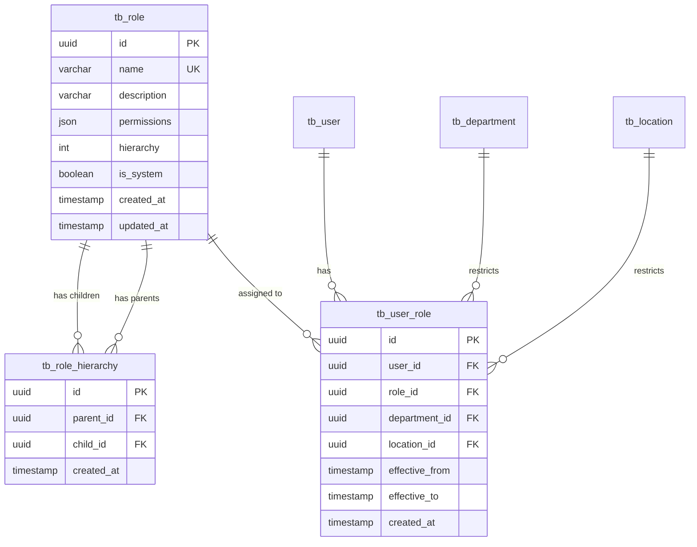

# Permission Management - Data Definition (DS)

**Module**: System Administration - Permission Management
**Version**: 1.0
**Last Updated**: 2025-01-16
## Document History

| Version | Date | Author | Changes |
|---------|------|--------|---------|
| 1.1.0 | 2025-12-10 | Documentation Team | Standardized reference number format (XXX-YYMM-NNNN) |
| 1.0.0 | 2025-11-19 | Documentation Team | Initial version |
**Implementation Status**: Planned (Mock Data Currently)

---

## 1. Overview

### 1.1 Current State
- **Status**: Mock data implementation
- **Storage**: In-memory TypeScript objects
- **Location**: `lib/mock-data/permission-*.ts`

### 1.2 Planned Implementation
- **Database**: PostgreSQL 15+
- **ORM**: Prisma 5.x
- **Migration**: Q1 2025
- **Schema Location**: `prisma/schema.prisma` (to be created)

---

## 2. Planned Database Schema

### 2.1 Core Tables

#### tb_role
Stores role definitions with permissions and hierarchy.

```prisma
model tb_role {
  id            String    @id @default(dbgenerated("gen_random_uuid()")) @db.Uuid
  name          String    @unique @db.VarChar(100)
  description   String?   @db.VarChar(500)
  permissions   Json      @db.Json // Array of "resource:action" strings
  hierarchy     Int       @db.Integer
  is_system     Boolean   @default(false)

  // Audit fields
  created_at    DateTime  @default(now()) @db.Timestamptz(6)
  created_by_id String?   @db.Uuid
  updated_at    DateTime  @default(now()) @db.Timestamptz(6)
  updated_by_id String?   @db.Uuid
  deleted_at    DateTime? @db.Timestamptz(6)
  deleted_by_id String?   @db.Uuid

  // Relations
  user_roles         tb_user_role[]
  parent_hierarchies tb_role_hierarchy[] @relation("ParentRoles")
  child_hierarchies  tb_role_hierarchy[] @relation("ChildRoles")

  @@index([name])
  @@index([hierarchy])
  @@index([is_system])
  @@map("tb_role")
}
```

**Constraints**:
- Primary Key: `id` (UUID)
- Unique: `name`
- Check: `hierarchy BETWEEN 1 AND 10`
- Check: `deleted_at IS NULL OR deleted_by_id IS NOT NULL`

**Sample Data**:
```json
{
  "id": "550e8400-e29b-41d4-a716-446655440000",
  "name": "System Administrator",
  "description": "Full system access",
  "permissions": ['*'],
  "hierarchy": 1,
  "is_system": true
}
```

---

#### tb_role_hierarchy
Manages parent-child relationships between roles for permission inheritance.

```prisma
model tb_role_hierarchy {
  id           String    @id @default(dbgenerated("gen_random_uuid()")) @db.Uuid
  parent_id    String    @db.Uuid
  child_id     String    @db.Uuid

  // Audit fields
  created_at   DateTime  @default(now()) @db.Timestamptz(6)
  created_by_id String?  @db.Uuid

  // Relations
  parent_role  tb_role   @relation("ParentRoles", fields: [parent_id], references: [id], onDelete: Cascade)
  child_role   tb_role   @relation("ChildRoles", fields: [child_id], references: [id], onDelete: Cascade)

  @@unique([parent_id, child_id])
  @@index([parent_id])
  @@index([child_id])
  @@map("tb_role_hierarchy")
}
```

**Constraints**:
- Primary Key: `id` (UUID)
- Unique: `(parent_id, child_id)` - prevent duplicate relationships
- Foreign Keys: `parent_id` → `tb_role.id`, `child_id` → `tb_role.id`
- Check: `parent_id != child_id` - prevent self-reference

---

#### tb_user_role
Links users to roles with optional context restrictions.

```prisma
model tb_user_role {
  id             String    @id @default(dbgenerated("gen_random_uuid()")) @db.Uuid
  user_id        String    @db.Uuid
  role_id        String    @db.Uuid

  // Context restrictions (optional)
  department_id  String?   @db.Uuid
  location_id    String?   @db.Uuid

  // Time restrictions (optional)
  effective_from DateTime  @default(now()) @db.Timestamptz(6)
  effective_to   DateTime? @db.Timestamptz(6)

  // Audit fields
  created_at     DateTime  @default(now()) @db.Timestamptz(6)
  created_by_id  String?   @db.Uuid
  deleted_at     DateTime? @db.Timestamptz(6)
  deleted_by_id  String?   @db.Uuid

  // Relations
  user       tb_user       @relation(fields: [user_id], references: [id], onDelete: Cascade)
  role       tb_role       @relation(fields: [role_id], references: [id], onDelete: Restrict)
  department tb_department? @relation(fields: [department_id], references: [id])
  location   tb_location?   @relation(fields: [location_id], references: [id])

  @@unique([user_id, role_id, department_id, location_id])
  @@index([user_id])
  @@index([role_id])
  @@index([effective_from, effective_to])
  @@map("tb_user_role")
}
```

**Constraints**:
- Foreign Keys with Cascade: `user_id` → `tb_user.id`
- Foreign Keys with Restrict: `role_id` → `tb_role.id` (prevent role deletion if assigned)
- Check: `effective_to IS NULL OR effective_to > effective_from`

---

#### tb_permission_audit
Audit trail for all permission-related changes.

```prisma
model tb_permission_audit {
  id            String   @id @default(dbgenerated("gen_random_uuid()")) @db.Uuid
  entity_type   String   @db.VarChar(50) // 'role', 'user_role', 'policy'
  entity_id     String   @db.Uuid
  action        String   @db.VarChar(50) // 'create', 'update', 'delete', 'assign'
  changes       Json     @db.Json // Before/after values

  performed_by  String   @db.Uuid
  performed_at  DateTime @default(now()) @db.Timestamptz(6)
  ip_address    String?  @db.VarChar(45)
  user_agent    String?  @db.VarChar(255)

  @@index([entity_type, entity_id])
  @@index([performed_by])
  @@index([performed_at])
  @@map("tb_permission_audit")
}
```

---

### 2.2 Future ABAC Tables (Q2 2025)

#### tb_policy
Stores attribute-based access control policies.

```prisma
model tb_policy {
  id          String   @id @default(dbgenerated("gen_random_uuid()")) @db.Uuid
  name        String   @unique @db.VarChar(100)
  description String?  @db.VarChar(500)
  priority    Int      @db.Integer // Higher = evaluated first
  enabled     Boolean  @default(true)

  // Policy definition (JSON)
  target      Json     @db.Json // When policy applies
  rules       Json     @db.Json // Conditions
  effect      String   @db.VarChar(10) // 'permit' or 'deny'
  obligations Json?    @db.Json // Required actions
  advice      Json?    @db.Json // Recommendations

  // Lifecycle
  version        String    @db.VarChar(20)
  effective_from DateTime? @db.Timestamptz(6)
  effective_to   DateTime? @db.Timestamptz(6)

  // Audit
  created_at    DateTime  @default(now()) @db.Timestamptz(6)
  created_by_id String?   @db.Uuid
  updated_at    DateTime  @default(now()) @db.Timestamptz(6)
  updated_by_id String?   @db.Uuid

  @@index([priority])
  @@index([enabled])
  @@map("tb_policy")
}
```

---

## 3. Enumerations

### 3.1 Planned Enums

```prisma
enum enum_audit_action {
  create
  update
  delete
  assign
  unassign
  activate
  deactivate
}

enum enum_policy_effect {
  permit
  deny
}

enum enum_entity_type {
  role
  user_role
  policy
  permission
}
```

---

## 4. Relationships & ERD

### 4.1 Entity Relationships

```
tb_role (1) ──< (N) tb_role_hierarchy (parent)
tb_role (1) ──< (N) tb_role_hierarchy (child)
tb_role (1) ──< (N) tb_user_role
tb_user (1) ──< (N) tb_user_role
tb_department (1) ──< (N) tb_user_role
tb_location (1) ──< (N) tb_user_role
```

### 4.2 ERD Diagram



---

## 5. Indexes

### 5.1 Performance Indexes

```sql
-- Role lookup by name (frequent)
CREATE INDEX idx_role_name ON tb_role(name);

-- Role lookup by hierarchy (for inheritance)
CREATE INDEX idx_role_hierarchy ON tb_role(hierarchy);

-- System role filter
CREATE INDEX idx_role_is_system ON tb_role(is_system);

-- User role assignments (very frequent)
CREATE INDEX idx_user_role_user_id ON tb_user_role(user_id);
CREATE INDEX idx_user_role_role_id ON tb_user_role(role_id);

-- Time-based role filtering
CREATE INDEX idx_user_role_effective ON tb_user_role(effective_from, effective_to);

-- Hierarchy relationship queries
CREATE INDEX idx_role_hierarchy_parent ON tb_role_hierarchy(parent_id);
CREATE INDEX idx_role_hierarchy_child ON tb_role_hierarchy(child_id);

-- Audit queries
CREATE INDEX idx_audit_entity ON tb_permission_audit(entity_type, entity_id);
CREATE INDEX idx_audit_timestamp ON tb_permission_audit(performed_at);
```

---

## 6. Sample Queries

### 6.1 Get User's Effective Permissions

```sql
-- Get all permissions for a user (including inherited)
WITH RECURSIVE role_tree AS (
  -- Base: User's direct roles
  SELECT r.id, r.permissions, r.hierarchy
  FROM tb_role r
  JOIN tb_user_role ur ON ur.role_id = r.id
  WHERE ur.user_id = $1
    AND ur.deleted_at IS NULL
    AND (ur.effective_to IS NULL OR ur.effective_to > NOW())

  UNION

  -- Recursive: Parent roles
  SELECT r.id, r.permissions, r.hierarchy
  FROM tb_role r
  JOIN tb_role_hierarchy rh ON rh.parent_id = r.id
  JOIN role_tree rt ON rt.id = rh.child_id
)
SELECT DISTINCT jsonb_array_elements_text(permissions::jsonb) AS permission
FROM role_tree;
```

### 6.2 Find Roles by Permission

```sql
-- Find all roles that have a specific permission
SELECT r.id, r.name, r.hierarchy
FROM tb_role r
WHERE r.permissions::jsonb @> '['purchase_request:approve']'::jsonb
  AND r.deleted_at IS NULL
ORDER BY r.hierarchy;
```

### 6.3 Get Role Hierarchy Tree

```sql
-- Get complete hierarchy tree for a role
WITH RECURSIVE hierarchy AS (
  -- Base: Starting role
  SELECT id, name, hierarchy, ARRAY[id] AS path
  FROM tb_role
  WHERE id = $1

  UNION

  -- Recursive: Child roles
  SELECT r.id, r.name, r.hierarchy, path || r.id
  FROM tb_role r
  JOIN tb_role_hierarchy rh ON rh.child_id = r.id
  JOIN hierarchy h ON h.id = rh.parent_id
  WHERE NOT r.id = ANY(path) -- Prevent cycles
)
SELECT * FROM hierarchy
ORDER BY hierarchy;
```

### 6.4 Check Permission

```sql
-- Check if user has specific permission
SELECT EXISTS (
  WITH RECURSIVE role_tree AS (
    SELECT r.permissions
    FROM tb_role r
    JOIN tb_user_role ur ON ur.role_id = r.id
    WHERE ur.user_id = $1
      AND ur.deleted_at IS NULL
      AND (ur.effective_to IS NULL OR ur.effective_to > NOW())

    UNION

    SELECT r.permissions
    FROM tb_role r
    JOIN tb_role_hierarchy rh ON rh.parent_id = r.id
    JOIN role_tree rt ON EXISTS (
      SELECT 1 FROM tb_user_role ur2
      WHERE ur2.role_id = rt.id
        AND ur2.user_id = $1
        AND ur2.deleted_at IS NULL
    )
  )
  SELECT 1 FROM role_tree
  WHERE permissions::jsonb @> $2::jsonb -- e.g., '['purchase_request:create']'
     OR permissions::jsonb @> '['*']'::jsonb
);
```

---

## 7. Data Constraints

### 7.1 Database Constraints

```sql
-- Role name must be unique (case-insensitive)
ALTER TABLE tb_role
ADD CONSTRAINT tb_role_name_unique UNIQUE (LOWER(name));

-- Hierarchy must be 1-10
ALTER TABLE tb_role
ADD CONSTRAINT tb_role_hierarchy_range CHECK (hierarchy BETWEEN 1 AND 10);

-- Effective dates must be valid
ALTER TABLE tb_user_role
ADD CONSTRAINT tb_user_role_dates_valid
CHECK (effective_to IS NULL OR effective_to > effective_from);

-- Prevent self-reference in hierarchy
ALTER TABLE tb_role_hierarchy
ADD CONSTRAINT tb_role_hierarchy_no_self
CHECK (parent_id != child_id);

-- Soft delete consistency
ALTER TABLE tb_role
ADD CONSTRAINT tb_role_soft_delete
CHECK ((deleted_at IS NULL AND deleted_by_id IS NULL) OR
       (deleted_at IS NOT NULL AND deleted_by_id IS NOT NULL));
```

### 7.2 Application-Level Constraints

- Circular inheritance detection (recursive query)
- Permission format validation: `/^[a-z_]+:[a-z_*]+$/`
- System role protection (cannot delete)
- Active user check before role deletion

---

## 8. Migration Strategy

### 8.1 Data Migration Steps

**Phase 1: Schema Creation (Week 1)**
1. Create tables: `tb_role`, `tb_role_hierarchy`, `tb_user_role`, `tb_permission_audit`
2. Add indexes and constraints
3. Test schema integrity

**Phase 2: Mock Data Migration (Week 2)**
1. Export current mock roles to SQL
2. Import into database
3. Create role hierarchy relationships
4. Validate effective permission calculations

**Phase 3: Application Updates (Week 3-4)**
1. Replace Zustand stores with Prisma queries
2. Update permission check logic
3. Add audit logging
4. Test all CRUD operations

**Phase 4: Production Deployment (Week 5)**
1. Backup existing user-role assignments (from tb_user if any)
2. Deploy schema to production
3. Migrate data
4. Monitor for issues

---

## 9. Performance Considerations

### 9.1 Query Optimization

- **Permission Checks**: Cache results for 5 minutes
- **Role Hierarchy**: Cache inheritance tree for 15 minutes
- **Effective Permissions**: Precompute and cache for active users
- **Audit Logs**: Partition by month for large datasets

### 9.2 Caching Strategy

```typescript
// Cache configuration
const cacheConfig = {
  permissionCheck: { ttl: 300 }, // 5 minutes
  roleHierarchy: { ttl: 900 },   // 15 minutes
  effectivePerms: { ttl: 600 },  // 10 minutes
  roleList: { ttl: 1800 }        // 30 minutes
}
```

---

## 10. Validation Rules

### 10.1 Field Validation

| Field | Type | Rules |
|-------|------|-------|
| role.name | String | Required, 3-100 chars, unique, alphanumeric |
| role.description | String | Optional, max 500 chars |
| role.permissions | JSON Array | Required, valid format, non-empty |
| role.hierarchy | Integer | Required, 1-10 range |
| user_role.effective_from | Timestamp | Required, not in past |
| user_role.effective_to | Timestamp | Optional, > effective_from |

### 10.2 Business Rule Validation

- Role name uniqueness (case-insensitive)
- Permission format: `resource:action`
- No circular role inheritance
- System roles cannot be deleted
- Cannot delete role with assigned users

---

**Document Control**:
- **Created**: 2025-01-16
- **Version**: 1.0
- **Status**: Planned Schema
- **Target Implementation**: Q1 2025
