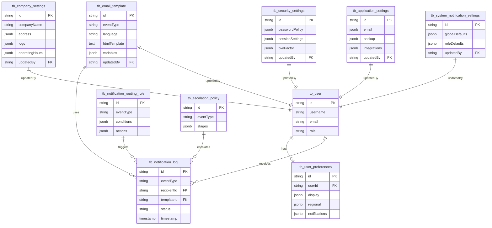

# Settings - Data Definition (DS)

**Module**: System Administration - Settings
**Version**: 1.0
**Last Updated**: 2025-01-16
**Status**: Active Development

## Document History

| Version | Date | Author | Changes |
|---------|------|--------|---------|
| 1.1.0 | 2025-12-10 | Documentation Team | Standardized reference number format (XXX-YYMM-NNNN) |
| 1.0.0 | 2025-11-19 | Documentation Team | Initial version |
---

## 1. Overview

The Settings module requires multiple database tables to store company-wide configuration, security policies, notification settings, user preferences, and audit trails. This document defines the complete database schema using PostgreSQL 15+ with JSONB support for flexible configuration storage.

**Technology Stack**:
- **Database**: PostgreSQL 15+
- **ORM**: Prisma 5.x
- **Schema Format**: Prisma Schema Language + PostgreSQL DDL

---

## 2. Core Tables

### 2.1 Company Settings Table

**Table**: `tb_company_settings`

**Purpose**: Store organization-wide company information, branding, and operational configuration

**Prisma Schema**:
```prisma
model CompanySettings {
  id                  String   @id @default(cuid())

  // Basic Information
  companyName         String   @db.VarChar(100)
  legalName           String   @db.VarChar(100)
  taxId               String   @db.VarChar(50)
  registrationNumber  String   @db.VarChar(50)
  industry            String?  @db.VarChar(100)

  // Contact Information (stored as JSONB)
  address             Json     // { street, city, state, postalCode, country }
  phone               String   @db.VarChar(20)
  email               String   @db.VarChar(100)
  website             String?  @db.VarChar(200)

  // Branding (stored as JSONB)
  logo                Json     // { url, darkUrl, faviconUrl }
  primaryColor        String   @db.VarChar(7)  // Hex color
  secondaryColor      String   @db.VarChar(7)  // Hex color

  // Business Settings
  fiscalYearStart     String   @db.VarChar(5)  // Format: MM-DD
  defaultCurrency     String   @db.VarChar(3)  // ISO 4217
  defaultTimezone     String   @db.VarChar(50) // IANA timezone
  defaultLanguage     String   @db.VarChar(10) // ISO 639-1

  // Operating Hours (stored as JSONB)
  operatingHours      Json     // { monday: { open, start, end }, ... }

  // Feature Flags
  multiLocation       Boolean  @default(false)
  multiDepartment     Boolean  @default(false)

  // Audit Fields
  updatedAt           DateTime @updatedAt
  updatedBy           String
  createdAt           DateTime @default(now())

  @@map("tb_company_settings")
}
```

**PostgreSQL DDL**:
```sql
CREATE TABLE tb_company_settings (
  id                  VARCHAR(50) PRIMARY KEY,

  -- Basic Information
  company_name        VARCHAR(100) NOT NULL,
  legal_name          VARCHAR(100) NOT NULL,
  tax_id              VARCHAR(50) NOT NULL,
  registration_number VARCHAR(50) NOT NULL,
  industry            VARCHAR(100),

  -- Contact Information
  address             JSONB NOT NULL,
  phone               VARCHAR(20) NOT NULL,
  email               VARCHAR(100) NOT NULL,
  website             VARCHAR(200),

  -- Branding
  logo                JSONB NOT NULL,
  primary_color       VARCHAR(7) NOT NULL CHECK (primary_color ~ '^#[0-9A-Fa-f]{6}$'),
  secondary_color     VARCHAR(7) NOT NULL CHECK (secondary_color ~ '^#[0-9A-Fa-f]{6}$'),

  -- Business Settings
  fiscal_year_start   VARCHAR(5) NOT NULL CHECK (fiscal_year_start ~ '^\d{2}-\d{2}$'),
  default_currency    VARCHAR(3) NOT NULL,
  default_timezone    VARCHAR(50) NOT NULL,
  default_language    VARCHAR(10) NOT NULL,

  -- Operating Hours
  operating_hours     JSONB NOT NULL,

  -- Feature Flags
  multi_location      BOOLEAN DEFAULT FALSE,
  multi_department    BOOLEAN DEFAULT FALSE,

  -- Audit Fields
  updated_at          TIMESTAMP NOT NULL DEFAULT NOW(),
  updated_by          VARCHAR(50) NOT NULL,
  created_at          TIMESTAMP NOT NULL DEFAULT NOW(),

  -- Indexes
  CONSTRAINT check_email CHECK (email ~ '^[A-Za-z0-9._%+-]+@[A-Za-z0-9.-]+\.[A-Z|a-z]{2,}$')
);

CREATE INDEX idx_company_settings_updated_at ON tb_company_settings(updated_at DESC);

-- JSONB Indexes for address fields
CREATE INDEX idx_company_settings_city ON tb_company_settings USING GIN ((address->'city'));
CREATE INDEX idx_company_settings_country ON tb_company_settings USING GIN ((address->'country'));
```

**Sample JSONB Structures**:

```json
// address
{
  "street": "123 Hospitality Boulevard",
  "city": "New York",
  "state": "NY",
  "postalCode": "10001",
  "country": "United States"
}

// logo
{
  "url": "/logos/carmen-logo.svg",
  "darkUrl": "/logos/carmen-logo-dark.svg",
  "faviconUrl": "/favicon.ico"
}

// operatingHours
{
  "monday": { "open": true, "start": "06:00", "end": "23:00" },
  "tuesday": { "open": true, "start": "06:00", "end": "23:00" },
  "wednesday": { "open": true, "start": "06:00", "end": "23:00" },
  "thursday": { "open": true, "start": "06:00", "end": "23:00" },
  "friday": { "open": true, "start": "06:00", "end": "23:00" },
  "saturday": { "open": true, "start": "07:00", "end": "22:00" },
  "sunday": { "open": true, "start": "07:00", "end": "22:00" }
}
```

---

### 2.2 Security Settings Table

**Table**: `tb_security_settings`

**Purpose**: Store security policies, authentication settings, and access control configuration

**Prisma Schema**:
```prisma
model SecuritySettings {
  id                  String   @id @default(cuid())

  // Password Policy (stored as JSONB)
  passwordPolicy      Json     // { minLength, requireUppercase, requireLowercase, ... }

  // Session Settings (stored as JSONB)
  sessionSettings     Json     // { timeout, maxConcurrentSessions, rememberMe, ... }

  // Two-Factor Authentication (stored as JSONB)
  twoFactor           Json     // { enabled, required, requiredForRoles, methods, ... }

  // IP Access Control (stored as JSONB)
  ipAccessControl     Json     // { enabled, whitelist, blacklist, allowVPN }

  // Login Attempts (stored as JSONB)
  loginAttempts       Json     // { maxAttempts, lockoutDuration, resetAfter, notifyAdmin }

  // Security Questions (stored as JSONB)
  securityQuestions   Json     // { enabled, required, minRequired }

  // Audit Logging (stored as JSONB)
  auditLogging        Json     // { enabled, events, retentionDays }

  // Data Encryption (stored as JSONB)
  dataEncryption      Json     // { atRest, inTransit, algorithm }

  // Audit Fields
  updatedAt           DateTime @updatedAt
  updatedBy           String
  createdAt           DateTime @default(now())

  @@map("tb_security_settings")
}
```

**PostgreSQL DDL**:
```sql
CREATE TABLE tb_security_settings (
  id                   VARCHAR(50) PRIMARY KEY,

  -- Security Policies (stored as JSONB)
  password_policy      JSONB NOT NULL,
  session_settings     JSONB NOT NULL,
  two_factor           JSONB NOT NULL,
  ip_access_control    JSONB NOT NULL,
  login_attempts       JSONB NOT NULL,
  security_questions   JSONB NOT NULL,
  audit_logging        JSONB NOT NULL,
  data_encryption      JSONB NOT NULL,

  -- Audit Fields
  updated_at           TIMESTAMP NOT NULL DEFAULT NOW(),
  updated_by           VARCHAR(50) NOT NULL,
  created_at           TIMESTAMP NOT NULL DEFAULT NOW()
);

CREATE INDEX idx_security_settings_updated_at ON tb_security_settings(updated_at DESC);

-- JSONB Indexes for frequently queried fields
CREATE INDEX idx_security_settings_2fa_enabled ON tb_security_settings USING GIN ((two_factor->'enabled'));
CREATE INDEX idx_security_settings_ip_enabled ON tb_security_settings USING GIN ((ip_access_control->'enabled'));
```

**Sample JSONB Structures**:

```json
// passwordPolicy
{
  "minLength": 12,
  "requireUppercase": true,
  "requireLowercase": true,
  "requireNumbers": true,
  "requireSpecialChars": true,
  "preventReuse": 5,
  "historyCount": 5,
  "expiryDays": 90,
  "complexityScore": 3
}

// sessionSettings
{
  "timeout": 30,
  "maxConcurrentSessions": 3,
  "rememberMeEnabled": true,
  "rememberMe": true,
  "rememberMeDuration": 30,
  "absoluteTimeout": false
}

// twoFactor
{
  "enabled": true,
  "required": false,
  "requiredForRoles": ['system-admin', 'financial-manager'],
  "methods": ['authenticator', 'sms', 'email'],
  "gracePeriodDays": 7
}

// ipAccessControl
{
  "enabled": false,
  "whitelist": [],
  "blacklist": [],
  "allowVPN": true
}

// loginAttempts
{
  "maxAttempts": 5,
  "lockoutDuration": 15,
  "resetAfter": 60,
  "notifyAdmin": true
}

// securityQuestions
{
  "enabled": true,
  "required": false,
  "minRequired": 3
}

// auditLogging
{
  "enabled": true,
  "events": ["login", "logout", 'dataAccess', 'dataModification', 'settingsChange'],
  "retentionDays": 365
}

// dataEncryption
{
  "atRest": true,
  "inTransit": true,
  "algorithm": "AES-256"
}
```

---

### 2.3 Application Settings Table

**Table**: `tb_application_settings`

**Purpose**: Store application-wide configuration including email, backup, integrations, and performance settings

**Prisma Schema**:
```prisma
model ApplicationSettings {
  id                String   @id @default(cuid())

  // Email Configuration (stored as JSONB)
  email             Json     // { enabled, provider, smtp, fromEmail, ... }

  // Backup Settings (stored as JSONB)
  backup            Json     // { enabled, schedule, retention, storage, ... }

  // Data Retention (stored as JSONB)
  dataRetention     Json     // { documents, logs, archived }

  // Integrations (stored as JSONB)
  integrations      Json     // { api, webhooks, thirdParty }

  // System Features (stored as JSONB)
  features          Json     // { maintenanceMode, registrationEnabled, ... }

  // Performance Settings (stored as JSONB)
  performance       Json     // { cacheEnabled, cacheTTL, sessionStorage, ... }

  // Audit Fields
  updatedAt         DateTime @updatedAt
  updatedBy         String
  createdAt         DateTime @default(now())

  @@map("tb_application_settings")
}
```

**PostgreSQL DDL**:
```sql
CREATE TABLE tb_application_settings (
  id                VARCHAR(50) PRIMARY KEY,

  -- Application Configuration (stored as JSONB)
  email             JSONB NOT NULL,
  backup            JSONB NOT NULL,
  data_retention    JSONB NOT NULL,
  integrations      JSONB NOT NULL,
  features          JSONB NOT NULL,
  performance       JSONB NOT NULL,

  -- Audit Fields
  updated_at        TIMESTAMP NOT NULL DEFAULT NOW(),
  updated_by        VARCHAR(50) NOT NULL,
  created_at        TIMESTAMP NOT NULL DEFAULT NOW()
);

CREATE INDEX idx_application_settings_updated_at ON tb_application_settings(updated_at DESC);

-- JSONB Indexes for feature flags
CREATE INDEX idx_application_settings_maintenance ON tb_application_settings USING GIN ((features->'maintenanceMode'));
CREATE INDEX idx_application_settings_api_enabled ON tb_application_settings USING GIN ((integrations->'api'->'enabled'));
```

**Sample JSONB Structures**: (See detailed structures in mock-data/settings.ts)

---

### 2.4 User Preferences Table

**Table**: `tb_user_preferences`

**Purpose**: Store individual user preferences for display, regional settings, notifications, and accessibility

**Prisma Schema**:
```prisma
model UserPreferences {
  id                String   @id @default(cuid())
  userId            String   @unique

  // Display Settings (stored as JSONB)
  display           Json     // { theme, fontSize, highContrast, ... }

  // Regional Settings (stored as JSONB)
  regional          Json     // { language, timezone, currency, dateFormat, ... }

  // Notification Settings (stored as JSONB)
  notifications     Json     // { preferences, emailDigest, doNotDisturb, ... }

  // Default Views (stored as JSONB)
  defaultViews      Json     // { landingPage, listPageSize, defaultFilterView, ... }

  // Accessibility Settings (stored as JSONB)
  accessibility     Json     // { screenReaderOptimized, keyboardNavigationHints, ... }

  // Audit Fields
  updatedAt         DateTime @updatedAt
  createdAt         DateTime @default(now())

  // Relations
  user              User     @relation(fields: [userId], references: [id], onDelete: Cascade)

  @@map("tb_user_preferences")
}
```

**PostgreSQL DDL**:
```sql
CREATE TABLE tb_user_preferences (
  id                VARCHAR(50) PRIMARY KEY,
  user_id           VARCHAR(50) NOT NULL UNIQUE,

  -- User Settings (stored as JSONB)
  display           JSONB NOT NULL,
  regional          JSONB NOT NULL,
  notifications     JSONB NOT NULL,
  default_views     JSONB NOT NULL,
  accessibility     JSONB NOT NULL,

  -- Audit Fields
  updated_at        TIMESTAMP NOT NULL DEFAULT NOW(),
  created_at        TIMESTAMP NOT NULL DEFAULT NOW(),

  -- Foreign Keys
  CONSTRAINT fk_user_preferences_user FOREIGN KEY (user_id)
    REFERENCES tb_user(id) ON DELETE CASCADE
);

CREATE INDEX idx_user_preferences_user_id ON tb_user_preferences(user_id);
CREATE INDEX idx_user_preferences_updated_at ON tb_user_preferences(updated_at DESC);

-- JSONB Indexes for common queries
CREATE INDEX idx_user_preferences_theme ON tb_user_preferences USING GIN ((display->'theme'));
CREATE INDEX idx_user_preferences_language ON tb_user_preferences USING GIN ((regional->'language'));
```

---

## 3. Notification System Tables

### 3.1 Email Template Table

**Table**: `tb_email_template`

**Purpose**: Store email notification templates with versioning and multi-language support

**Prisma Schema**:
```prisma
model EmailTemplate {
  id              String   @id @default(cuid())
  eventType       String   @db.VarChar(100)
  name            String   @db.VarChar(100)
  description     String?  @db.VarChar(500)
  language        String   @db.VarChar(10)
  subject         String   @db.VarChar(200)
  htmlTemplate    String   @db.Text
  textTemplate    String   @db.Text

  // Template Variables (stored as JSONB array)
  variables       Json     // [{ name, description, example, required }]

  version         Int      @default(1)
  isActive        Boolean  @default(true)

  // Audit Fields
  createdAt       DateTime @default(now())
  updatedAt       DateTime @updatedAt
  updatedBy       String

  @@unique([eventType, language, version])
  @@index([eventType])
  @@index([isActive])
  @@map("tb_email_template")
}
```

**PostgreSQL DDL**:
```sql
CREATE TABLE tb_email_template (
  id               VARCHAR(50) PRIMARY KEY,
  event_type       VARCHAR(100) NOT NULL,
  name             VARCHAR(100) NOT NULL,
  description      VARCHAR(500),
  language         VARCHAR(10) NOT NULL,
  subject          VARCHAR(200) NOT NULL,
  html_template    TEXT NOT NULL,
  text_template    TEXT NOT NULL,
  variables        JSONB NOT NULL,
  version          INTEGER NOT NULL DEFAULT 1,
  is_active        BOOLEAN NOT NULL DEFAULT TRUE,

  -- Audit Fields
  created_at       TIMESTAMP NOT NULL DEFAULT NOW(),
  updated_at       TIMESTAMP NOT NULL DEFAULT NOW(),
  updated_by       VARCHAR(50) NOT NULL,

  -- Constraints
  CONSTRAINT uq_email_template_event_lang_version
    UNIQUE (event_type, language, version)
);

CREATE INDEX idx_email_template_event_type ON tb_email_template(event_type);
CREATE INDEX idx_email_template_is_active ON tb_email_template(is_active);
CREATE INDEX idx_email_template_language ON tb_email_template(language);
CREATE INDEX idx_email_template_updated_at ON tb_email_template(updated_at DESC);

-- Full-text search on template content
CREATE INDEX idx_email_template_search ON tb_email_template
  USING GIN (to_tsvector('english', name || ' ' || description || ' ' || subject));
```

**Sample JSONB Structure** (variables):
```json
[
  {
    "name": "recipientName",
    "description": "Recipient name",
    "example": "John Doe",
    "required": true
  },
  {
    "name": "requestId",
    "description": "Purchase request ID",
    "example": "PR-2401-0001",
    "required": true
  }
]
```

---

### 3.2 Notification Routing Rule Table

**Table**: `tb_notification_routing_rule`

**Purpose**: Store conditional routing rules for notifications

**Prisma Schema**:
```prisma
model NotificationRoutingRule {
  id          String   @id @default(cuid())
  name        String   @db.VarChar(100)
  eventType   String   @db.VarChar(100)

  // Conditions (stored as JSONB array)
  conditions  Json     // [{ field, operator, value }]

  // Actions (stored as JSONB array)
  actions     Json     // [{ type, recipientType, recipient, channels }]

  priority    Int      @default(50)
  enabled     Boolean  @default(true)

  // Audit Fields
  createdAt   DateTime @default(now())
  updatedAt   DateTime @updatedAt

  @@index([eventType])
  @@index([enabled])
  @@index([priority])
  @@map("tb_notification_routing_rule")
}
```

**PostgreSQL DDL**:
```sql
CREATE TABLE tb_notification_routing_rule (
  id             VARCHAR(50) PRIMARY KEY,
  name           VARCHAR(100) NOT NULL,
  event_type     VARCHAR(100) NOT NULL,
  conditions     JSONB NOT NULL,
  actions        JSONB NOT NULL,
  priority       INTEGER NOT NULL DEFAULT 50,
  enabled        BOOLEAN NOT NULL DEFAULT TRUE,

  -- Audit Fields
  created_at     TIMESTAMP NOT NULL DEFAULT NOW(),
  updated_at     TIMESTAMP NOT NULL DEFAULT NOW()
);

CREATE INDEX idx_routing_rule_event_type ON tb_notification_routing_rule(event_type);
CREATE INDEX idx_routing_rule_enabled ON tb_notification_routing_rule(enabled);
CREATE INDEX idx_routing_rule_priority ON tb_notification_routing_rule(priority DESC);
CREATE INDEX idx_routing_rule_event_enabled ON tb_notification_routing_rule(event_type, enabled);

-- JSONB indexes for condition evaluation
CREATE INDEX idx_routing_rule_conditions ON tb_notification_routing_rule USING GIN (conditions);
```

**Sample JSONB Structures**:

```json
// conditions
[
  {
    "field": "totalAmount",
    "operator": "greaterThan",
    "value": 10000
  }
]

// actions
[
  {
    "type": "notify",
    "recipientType": "role",
    "recipient": "role-002",
    "channels": ['email', 'sms']
  }
]
```

---

### 3.3 Escalation Policy Table

**Table**: `tb_escalation_policy`

**Purpose**: Store multi-stage escalation workflows for notifications

**Prisma Schema**:
```prisma
model EscalationPolicy {
  id          String   @id @default(cuid())
  name        String   @db.VarChar(100)
  description String?  @db.VarChar(500)
  eventType   String   @db.VarChar(100)

  // Escalation Stages (stored as JSONB array)
  stages      Json     // [{ level, delayMinutes, recipientRole, channels, condition }]

  enabled     Boolean  @default(true)

  // Audit Fields
  createdAt   DateTime @default(now())
  updatedAt   DateTime @updatedAt

  @@index([eventType])
  @@index([enabled])
  @@map("tb_escalation_policy")
}
```

**PostgreSQL DDL**:
```sql
CREATE TABLE tb_escalation_policy (
  id             VARCHAR(50) PRIMARY KEY,
  name           VARCHAR(100) NOT NULL,
  description    VARCHAR(500),
  event_type     VARCHAR(100) NOT NULL,
  stages         JSONB NOT NULL,
  enabled        BOOLEAN NOT NULL DEFAULT TRUE,

  -- Audit Fields
  created_at     TIMESTAMP NOT NULL DEFAULT NOW(),
  updated_at     TIMESTAMP NOT NULL DEFAULT NOW()
);

CREATE INDEX idx_escalation_policy_event_type ON tb_escalation_policy(event_type);
CREATE INDEX idx_escalation_policy_enabled ON tb_escalation_policy(enabled);

-- JSONB index for stage queries
CREATE INDEX idx_escalation_policy_stages ON tb_escalation_policy USING GIN (stages);
```

**Sample JSONB Structure** (stages):
```json
[
  {
    "level": 1,
    "delayMinutes": 0,
    "recipientRole": "role-018",
    "channels": ['email', 'in-app'],
    "condition": "unacknowledged"
  },
  {
    "level": 2,
    "delayMinutes": 1440,
    "recipientRole": "role-008",
    "channels": ['email', 'sms', 'in-app'],
    "condition": "unacknowledged"
  }
]
```

---

### 3.4 Notification Log Table

**Table**: `tb_notification_log`

**Purpose**: Store notification delivery history and tracking

**Prisma Schema**:
```prisma
model NotificationLog {
  id              String    @id @default(cuid())
  timestamp       DateTime  @default(now())
  eventType       String    @db.VarChar(100)
  recipientId     String
  recipientEmail  String?   @db.VarChar(100)
  channel         String    @db.VarChar(20)
  status          String    @db.VarChar(20)
  templateId      String?

  // Metadata (stored as JSONB)
  metadata        Json?     // Event-specific data

  retryCount      Int       @default(0)
  errorMessage    String?   @db.Text

  // Delivery Tracking
  sentAt          DateTime?
  deliveredAt     DateTime?
  openedAt        DateTime?
  clickedAt       DateTime?

  @@index([eventType])
  @@index([recipientId])
  @@index([status])
  @@index([timestamp])
  @@index([channel])
  @@map("tb_notification_log")
}
```

**PostgreSQL DDL**:
```sql
CREATE TABLE tb_notification_log (
  id                VARCHAR(50) PRIMARY KEY,
  timestamp         TIMESTAMP NOT NULL DEFAULT NOW(),
  event_type        VARCHAR(100) NOT NULL,
  recipient_id      VARCHAR(50) NOT NULL,
  recipient_email   VARCHAR(100),
  channel           VARCHAR(20) NOT NULL,
  status            VARCHAR(20) NOT NULL,
  template_id       VARCHAR(50),
  metadata          JSONB,
  retry_count       INTEGER NOT NULL DEFAULT 0,
  error_message     TEXT,

  -- Delivery Tracking
  sent_at           TIMESTAMP,
  delivered_at      TIMESTAMP,
  opened_at         TIMESTAMP,
  clicked_at        TIMESTAMP
);

-- Performance indexes for common queries
CREATE INDEX idx_notification_log_event_type ON tb_notification_log(event_type);
CREATE INDEX idx_notification_log_recipient_id ON tb_notification_log(recipient_id);
CREATE INDEX idx_notification_log_status ON tb_notification_log(status);
CREATE INDEX idx_notification_log_timestamp ON tb_notification_log(timestamp DESC);
CREATE INDEX idx_notification_log_channel ON tb_notification_log(channel);

-- Composite indexes for analytics
CREATE INDEX idx_notification_log_event_status ON tb_notification_log(event_type, status);
CREATE INDEX idx_notification_log_recipient_timestamp ON tb_notification_log(recipient_id, timestamp DESC);
CREATE INDEX idx_notification_log_channel_status ON tb_notification_log(channel, status);

-- JSONB index for metadata queries
CREATE INDEX idx_notification_log_metadata ON tb_notification_log USING GIN (metadata);

-- Partial indexes for active/failed notifications
CREATE INDEX idx_notification_log_pending ON tb_notification_log(timestamp DESC)
  WHERE status = 'pending';
CREATE INDEX idx_notification_log_failed ON tb_notification_log(timestamp DESC)
  WHERE status = 'failed';
```

---

### 3.5 System Notification Settings Table

**Table**: `tb_system_notification_settings`

**Purpose**: Store system-wide notification configuration

**Prisma Schema**:
```prisma
model SystemNotificationSettings {
  id                String   @id @default(cuid())

  // Global Defaults (stored as JSONB array)
  globalDefaults    Json     // [{ eventType, channels, frequency, enabled }]

  // Role Defaults (stored as JSONB array)
  roleDefaults      Json     // [{ roleId, roleName, eventDefaults }]

  // Delivery Settings (stored as JSONB)
  deliverySettings  Json     // { rateLimiting, retryPolicy, batching, channels }

  // Audit Fields
  updatedAt         DateTime @updatedAt
  updatedBy         String

  @@map("tb_system_notification_settings")
}
```

**PostgreSQL DDL**:
```sql
CREATE TABLE tb_system_notification_settings (
  id                  VARCHAR(50) PRIMARY KEY,
  global_defaults     JSONB NOT NULL,
  role_defaults       JSONB NOT NULL,
  delivery_settings   JSONB NOT NULL,

  -- Audit Fields
  updated_at          TIMESTAMP NOT NULL DEFAULT NOW(),
  updated_by          VARCHAR(50) NOT NULL
);

-- JSONB indexes for notification lookups
CREATE INDEX idx_system_notification_global ON tb_system_notification_settings USING GIN (global_defaults);
CREATE INDEX idx_system_notification_roles ON tb_system_notification_settings USING GIN (role_defaults);
```

---

## 4. Enums

### 4.1 Notification Event Types

```sql
CREATE TYPE enum_notification_event_type AS ENUM (
  'purchase-request-submitted',
  'purchase-request-approved',
  'purchase-request-rejected',
  'purchase-order-created',
  'purchase-order-approved',
  'goods-received',
  'invoice-received',
  'payment-due',
  'low-stock-alert',
  'stock-count-required',
  'workflow-assignment',
  'comment-mention',
  'document-shared',
  'price-update',
  'vendor-update',
  'system-maintenance',
  'security-alert'
);
```

### 4.2 Notification Channels

```sql
CREATE TYPE enum_notification_channel AS ENUM (
  'email',
  'in-app',
  'sms',
  'push'
);
```

### 4.3 Notification Status

```sql
CREATE TYPE enum_notification_status AS ENUM (
  'pending',
  'sent',
  'failed',
  'delivered',
  'bounced',
  'opened',
  'clicked'
);
```

### 4.4 Notification Frequency

```sql
CREATE TYPE enum_notification_frequency AS ENUM (
  'instant',
  'hourly',
  'daily',
  'weekly'
);
```

### 4.5 Language Codes

```sql
CREATE TYPE enum_language AS ENUM (
  'en',
  'es',
  'fr',
  'de',
  'ja',
  'zh',
  'pt',
  'it',
  'ru'
);
```

### 4.6 Day of Week

```sql
CREATE TYPE enum_day_of_week AS ENUM (
  'monday',
  'tuesday',
  'wednesday',
  'thursday',
  'friday',
  'saturday',
  'sunday'
);
```

### 4.7 Theme Mode

```sql
CREATE TYPE enum_theme_mode AS ENUM (
  'light',
  'dark',
  'system'
);
```

### 4.8 Audit Event Types

```sql
CREATE TYPE enum_audit_event_type AS ENUM (
  'login',
  'logout',
  'dataAccess',
  'dataModification',
  'settingsChange'
);
```

---

## 5. Relationships

### 5.1 Entity Relationship Diagram



---

## 6. Sample Queries

### 6.1 Company Settings Queries

**Get current company settings**:
```sql
SELECT * FROM tb_company_settings
ORDER BY updated_at DESC
LIMIT 1;
```

**Get operating hours for a specific day**:
```sql
SELECT
  company_name,
  operating_hours->>'monday' AS monday_hours
FROM tb_company_settings
WHERE (operating_hours->'monday'->>'open')::boolean = true;
```

**Search companies by city**:
```sql
SELECT
  company_name,
  address->>'city' AS city,
  address->>'country' AS country
FROM tb_company_settings
WHERE address->>'city' = 'New York';
```

---

### 6.2 Security Settings Queries

**Get current security settings**:
```sql
SELECT * FROM tb_security_settings
ORDER BY updated_at DESC
LIMIT 1;
```

**Check if 2FA is enabled**:
```sql
SELECT
  (two_factor->>'enabled')::boolean AS tfa_enabled,
  (two_factor->>'required')::boolean AS tfa_required
FROM tb_security_settings
ORDER BY updated_at DESC
LIMIT 1;
```

**Get password policy requirements**:
```sql
SELECT
  (password_policy->>'minLength')::int AS min_length,
  (password_policy->>'requireUppercase')::boolean AS require_uppercase,
  (password_policy->>'requireNumbers')::boolean AS require_numbers,
  (password_policy->>'expiryDays')::int AS expiry_days
FROM tb_security_settings
ORDER BY updated_at DESC
LIMIT 1;
```

---

### 6.3 User Preferences Queries

**Get user preferences**:
```sql
SELECT * FROM tb_user_preferences
WHERE user_id = $1;
```

**Get all users with dark theme enabled**:
```sql
SELECT
  up.user_id,
  u.username,
  up.display->>'theme' AS theme
FROM tb_user_preferences up
JOIN tb_user u ON up.user_id = u.id
WHERE up.display->>'theme' = 'dark';
```

**Get notification preferences for specific event**:
```sql
SELECT
  user_id,
  jsonb_array_elements(notifications->'preferences') AS pref
FROM tb_user_preferences
WHERE jsonb_array_elements(notifications->'preferences')->>'eventType' = 'purchase-request-submitted';
```

---

### 6.4 Email Template Queries

**Get active template for event type and language**:
```sql
SELECT * FROM tb_email_template
WHERE event_type = $1
  AND language = $2
  AND is_active = true
ORDER BY version DESC
LIMIT 1;
```

**Search templates by keyword**:
```sql
SELECT
  id,
  name,
  event_type,
  language,
  ts_rank(
    to_tsvector('english', name || ' ' || description || ' ' || subject),
    plainto_tsquery('english', $1)
  ) AS rank
FROM tb_email_template
WHERE to_tsvector('english', name || ' ' || description || ' ' || subject) @@ plainto_tsquery('english', $1)
ORDER BY rank DESC;
```

**Get template usage statistics**:
```sql
SELECT
  t.id,
  t.name,
  t.event_type,
  COUNT(nl.id) AS total_sent,
  COUNT(CASE WHEN nl.status = 'sent' THEN 1 END) AS successful,
  COUNT(CASE WHEN nl.status = 'failed' THEN 1 END) AS failed
FROM tb_email_template t
LEFT JOIN tb_notification_log nl ON t.id = nl.template_id
GROUP BY t.id, t.name, t.event_type
ORDER BY total_sent DESC;
```

---

### 6.5 Notification Routing Rule Queries

**Get active rules for event type**:
```sql
SELECT * FROM tb_notification_routing_rule
WHERE event_type = $1
  AND enabled = true
ORDER BY priority DESC;
```

**Evaluate routing conditions**:
```sql
-- Check if document amount exceeds threshold in any rule
SELECT
  id,
  name,
  conditions,
  actions
FROM tb_notification_routing_rule
WHERE event_type = 'purchase-order-created'
  AND enabled = true
  AND EXISTS (
    SELECT 1
    FROM jsonb_array_elements(conditions) AS cond
    WHERE cond->>'field' = 'totalAmount'
      AND cond->>'operator' = 'greaterThan'
      AND (cond->>'value')::numeric < $1
  )
ORDER BY priority DESC;
```

---

### 6.6 Notification Log Queries

**Get notification delivery statistics**:
```sql
SELECT
  event_type,
  channel,
  status,
  COUNT(*) AS count,
  AVG(EXTRACT(EPOCH FROM (delivered_at - sent_at))) AS avg_delivery_seconds
FROM tb_notification_log
WHERE sent_at >= NOW() - INTERVAL '7 days'
GROUP BY event_type, channel, status
ORDER BY event_type, channel;
```

**Get failed notifications for retry**:
```sql
SELECT * FROM tb_notification_log
WHERE status = 'failed'
  AND retry_count < 3
  AND timestamp >= NOW() - INTERVAL '24 hours'
ORDER BY timestamp ASC
LIMIT 100;
```

**Get notification timeline for recipient**:
```sql
SELECT
  event_type,
  channel,
  status,
  sent_at,
  delivered_at,
  opened_at,
  clicked_at
FROM tb_notification_log
WHERE recipient_id = $1
ORDER BY timestamp DESC
LIMIT 50;
```

**Get open rate by event type**:
```sql
SELECT
  event_type,
  COUNT(*) AS total_sent,
  COUNT(opened_at) AS total_opened,
  ROUND(COUNT(opened_at)::numeric / COUNT(*)::numeric * 100, 2) AS open_rate_percent
FROM tb_notification_log
WHERE channel = 'email'
  AND status = 'sent'
  AND sent_at >= NOW() - INTERVAL '30 days'
GROUP BY event_type
ORDER BY open_rate_percent DESC;
```

---

## 7. Indexes Strategy

### 7.1 Performance Optimization

**JSONB Indexes**:
- GIN indexes on JSONB columns for efficient queries on nested data
- Partial indexes on specific JSONB fields for frequently accessed data
- Expression indexes for computed JSONB values

**Composite Indexes**:
- Multi-column indexes for common query patterns
- Covering indexes to avoid table lookups

**Partial Indexes**:
- Indexes on filtered subsets of data (e.g., active templates, failed notifications)

**Text Search Indexes**:
- Full-text search on email template content
- Trigram indexes for fuzzy search

---

### 7.2 Index Maintenance

**Statistics Update**:
```sql
-- Update table statistics for query optimizer
ANALYZE tb_notification_log;
ANALYZE tb_email_template;
ANALYZE tb_notification_routing_rule;
```

**Index Rebuild** (if needed):
```sql
-- Rebuild indexes to improve performance
REINDEX TABLE tb_notification_log;
```

**Monitor Index Usage**:
```sql
SELECT
  schemaname,
  tablename,
  indexname,
  idx_scan,
  idx_tup_read,
  idx_tup_fetch
FROM pg_stat_user_indexes
WHERE schemaname = 'public'
  AND tablename LIKE 'tb_%'
ORDER BY idx_scan DESC;
```

---

## 8. Data Retention and Archival

### 8.1 Notification Log Retention

**Automatic Archival** (via cron job or background task):
```sql
-- Archive old notification logs to separate table
INSERT INTO tb_notification_log_archive
SELECT * FROM tb_notification_log
WHERE timestamp < NOW() - INTERVAL '90 days';

-- Delete archived logs from main table
DELETE FROM tb_notification_log
WHERE timestamp < NOW() - INTERVAL '90 days';
```

**Partition Strategy** (for large datasets):
```sql
-- Create partitioned table for notification logs
CREATE TABLE tb_notification_log_partitioned (
  LIKE tb_notification_log INCLUDING ALL
) PARTITION BY RANGE (timestamp);

-- Create monthly partitions
CREATE TABLE tb_notification_log_2025_01 PARTITION OF tb_notification_log_partitioned
  FOR VALUES FROM ('2025-01-01') TO ('2025-02-01');

CREATE TABLE tb_notification_log_2025_02 PARTITION OF tb_notification_log_partitioned
  FOR VALUES FROM ('2025-02-01') TO ('2025-03-01');
```

---

## 9. Migration Scripts

### 9.1 Initial Migration

**Prisma Migration**:
```bash
# Generate migration from schema
npx prisma migrate dev --name init_settings_module

# Apply migration to database
npx prisma migrate deploy
```

**Migration File** (`migrations/xxx_init_settings_module/migration.sql`):
```sql
-- Create company settings table
CREATE TABLE tb_company_settings (
  -- DDL as defined above
);

-- Create security settings table
CREATE TABLE tb_security_settings (
  -- DDL as defined above
);

-- Create all other tables
-- ...

-- Create indexes
CREATE INDEX idx_company_settings_updated_at ON tb_company_settings(updated_at DESC);
-- ... all other indexes

-- Insert default data
INSERT INTO tb_company_settings (id, company_name, legal_name, ...)
VALUES ('company-001', 'Carmen Hospitality Group', 'Carmen Hospitality Group Ltd.', ...);
```

---

### 9.2 Seed Data Script

```typescript
// prisma/seed-settings.ts
import { PrismaClient } from '@prisma/client';
import {
  mockCompanySettings,
  mockSecuritySettings,
  mockApplicationSettings,
  mockEmailTemplates,
  mockRoutingRules,
  mockEscalationPolicies
} from '../lib/mock-data/settings';

const prisma = new PrismaClient();

async function main() {
  // Seed company settings
  await prisma.companySettings.upsert({
    where: { id: mockCompanySettings.id },
    update: mockCompanySettings,
    create: mockCompanySettings
  });

  // Seed security settings
  await prisma.securitySettings.upsert({
    where: { id: mockSecuritySettings.id },
    update: mockSecuritySettings,
    create: mockSecuritySettings
  });

  // Seed application settings
  await prisma.applicationSettings.upsert({
    where: { id: mockApplicationSettings.id },
    update: mockApplicationSettings,
    create: mockApplicationSettings
  });

  // Seed email templates
  for (const template of mockEmailTemplates) {
    await prisma.emailTemplate.upsert({
      where: { id: template.id },
      update: template,
      create: template
    });
  }

  // Seed routing rules
  for (const rule of mockRoutingRules) {
    await prisma.notificationRoutingRule.upsert({
      where: { id: rule.id },
      update: rule,
      create: rule
    });
  }

  // Seed escalation policies
  for (const policy of mockEscalationPolicies) {
    await prisma.escalationPolicy.upsert({
      where: { id: policy.id },
      update: policy,
      create: policy
    });
  }

  console.log('Settings seed data created successfully');
}

main()
  .catch((e) => {
    console.error(e);
    process.exit(1);
  })
  .finally(async () => {
    await prisma.$disconnect();
  });
```

---

**Document Control**:
- **Created**: 2025-01-16
- **Version**: 1.0
- **Status**: Active Development
- **Next Review**: Q2 2025
