# Settings - Flow Diagrams (FD)

**Module**: System Administration - Settings
**Version**: 1.0
**Last Updated**: 2025-01-16
**Status**: Active Development

## Document History

| Version | Date | Author | Changes |
|---------|------|--------|---------|
| 1.1.0 | 2025-12-10 | Documentation Team | Standardized reference number format (XXX-YYMM-NNNN) |
| 1.0.0 | 2025-11-19 | Documentation Team | Initial version |
---

## 1. Overview

This document contains comprehensive flow diagrams for all major workflows in the Settings module using Mermaid syntax. Each diagram illustrates the complete process flow, decision points, error handling, and validation steps.

---

## 2. Company Settings Workflows

### 2.1 Configure Company Settings

**Flow**: Administrator configures company-wide settings including general information, branding, and operational parameters

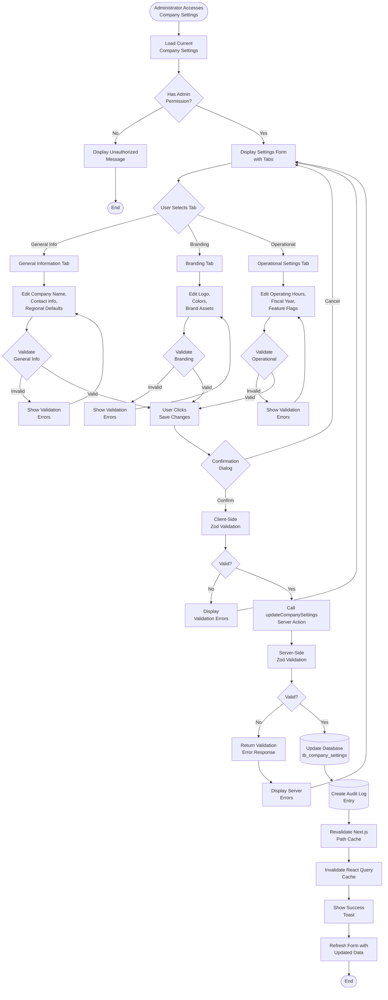

---

### 2.2 Upload Company Logo

**Flow**: Administrator uploads company logo for branding

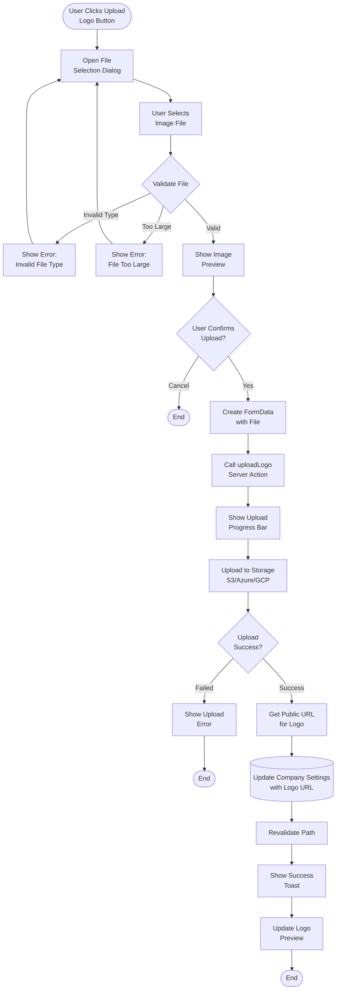

---

## 3. Security Settings Workflows

### 3.1 Update Security Policies

**Flow**: Administrator configures security policies including password requirements, 2FA, and session settings

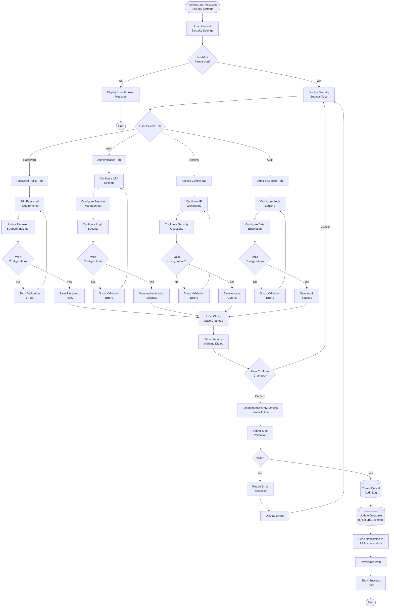

---

## 4. Notification Settings Workflows

### 4.1 Create Email Template

**Flow**: Administrator creates a new email notification template

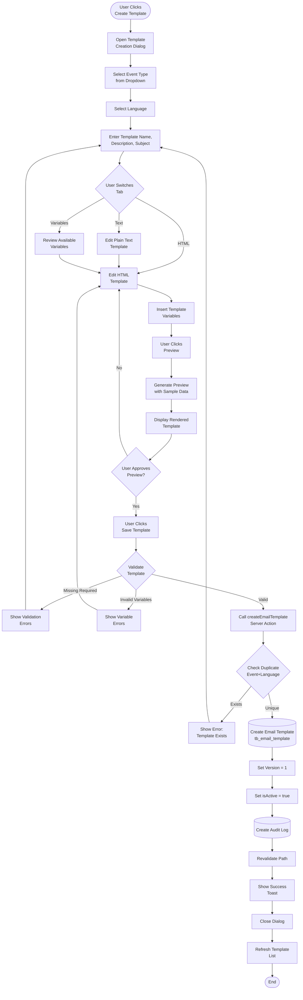

---

### 4.2 Configure Notification Routing Rule

**Flow**: Administrator creates conditional routing rules for notifications

```mermaid
flowchart TD
    Start([User Clicks<br>Create Rule]) --> OpenBuilder[Open Rule<br>Builder Dialog]
    OpenBuilder --> EnterName[Enter Rule Name]
    EnterName --> SelectEvent[Select Event Type]
    SelectEvent --> AddConditions[Add Conditions]

    AddConditions --> ConditionBuilder[Condition Builder]
    ConditionBuilder --> SelectField[Select Field<br>e.g., totalAmount]
    SelectField --> SelectOperator[Select Operator<br>e.g., greaterThan]
    SelectOperator --> EnterValue[Enter Value<br>e.g., 10000]
    EnterValue --> AddMore{Add More<br>Conditions?}

    AddMore -->|Yes| ConditionBuilder
    AddMore -->|No| AddActions[Add Actions]

    AddActions --> ActionBuilder[Action Builder]
    ActionBuilder --> SelectActionType[Select Action Type<br>notify/escalate/skip]
    SelectActionType --> SelectRecipient[Select Recipient Type<br>user/role/department]
    SelectRecipient --> SelectChannels[Select Notification<br>Channels]
    SelectChannels --> AddMoreActions{Add More<br>Actions?}

    AddMoreActions -->|Yes| ActionBuilder
    AddMoreActions -->|No| SetPriority[Set Priority<br>1-100]
    SetPriority --> EnableRule[Enable Rule<br>Toggle]
    EnableRule --> TestRule[User Clicks<br>Test Rule]

    TestRule --> ShowTestDialog[Show Test<br>Dialog]
    ShowTestDialog --> EnterTestData[Enter Test<br>Event Data]
    EnterTestData --> EvaluateConditions[Evaluate Rule<br>Conditions]
    EvaluateConditions --> ConditionsMet{Conditions<br>Met?}

    ConditionsMet -->|No| ShowNoMatch[Show: Rule Would<br>Not Trigger]
    ShowNoMatch --> UserAdjusts{Adjust Rule?}
    UserAdjusts -->|Yes| AddConditions
    UserAdjusts -->|No| ClickSave[User Clicks<br>Save Rule]

    ConditionsMet -->|Yes| ShowWouldTrigger[Show: Rule Would<br>Trigger Actions]
    ShowWouldTrigger --> DisplayActions[Display Actions<br>That Would Execute]
    DisplayActions --> UserSatisfied{User Satisfied?}

    UserSatisfied -->|No| AddActions
    UserSatisfied -->|Yes| ClickSave

    ClickSave --> ValidateRule{Validate<br>Rule}
    ValidateRule -->|Invalid| ShowError[Show Validation<br>Errors]
    ShowError --> OpenBuilder

    ValidateRule -->|Valid| ServerAction[Call createRoutingRule<br>Server Action]
    ServerAction --> ServerValidation[Server-Side<br>Validation]
    ServerValidation --> Valid{Valid?}

    Valid -->|No| ReturnError[Return Error]
    ReturnError --> ShowServerError[Display Error]
    ShowServerError --> OpenBuilder

    Valid -->|Yes| CreateRule[(Create Routing Rule<br>tb_notification_routing_rule)]
    CreateRule --> RevalidatePath[Revalidate Path]
    RevalidatePath --> ShowSuccess[Show Success<br>Toast]
    ShowSuccess --> CloseDialog[Close Dialog]
    CloseDialog --> RefreshList[Refresh Rule<br>List]
    RefreshList --> End1([End])
```

---

### 4.3 Test Email Template

**Flow**: Administrator tests email template before deploying

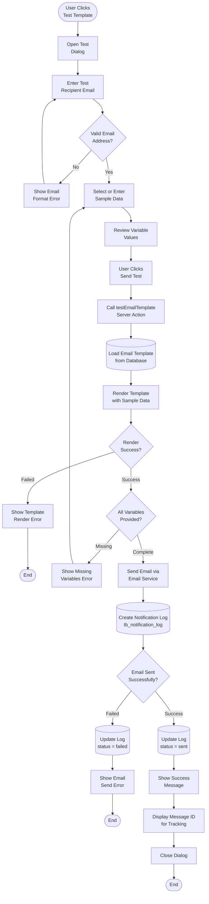

---

## 5. User Preference Workflows

### 5.1 Update User Preferences

**Flow**: User customizes their individual preferences

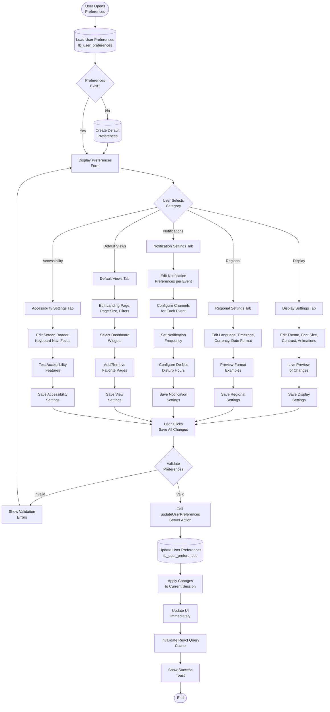

---

## 6. Backup Configuration Workflows

### 6.1 Configure Backup Settings

**Flow**: Administrator configures automated backup schedule and retention

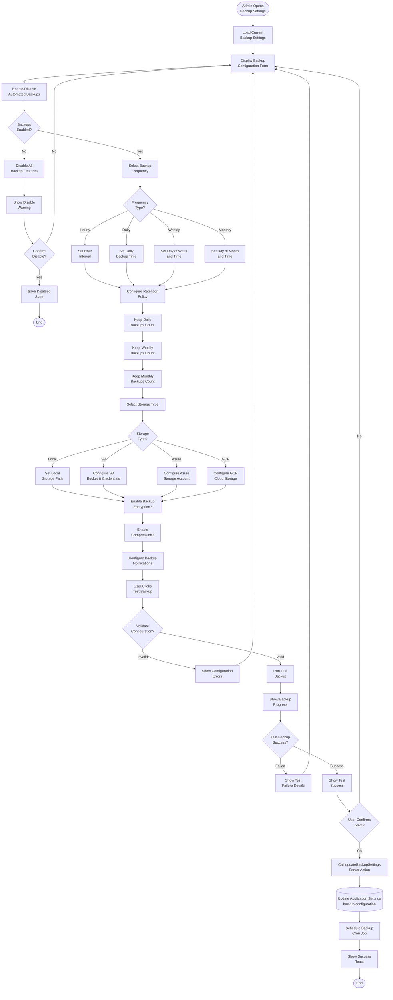

---

## 7. Escalation Policy Workflows

### 7.1 Escalation Policy Execution

**Flow**: System executes multi-stage escalation for unacknowledged notifications

```mermaid
flowchart TD
    Start([Notification Event<br>Triggered]) --> CheckRouting{Routing Rules<br>Apply?}
    CheckRouting -->|No| UseDefaults[Use Default<br>Notification Settings]
    CheckRouting -->|Yes| EvaluateRules[Evaluate Routing<br>Rules by Priority]

    EvaluateRules --> ExecuteActions[Execute Routing<br>Actions]
    ExecuteActions --> SendNotifications[Send Initial<br>Notifications]

    UseDefaults --> SendNotifications

    SendNotifications --> CreateLog[(Create Notification Log<br>tb_notification_log)]
    CreateLog --> CheckEscalation{Escalation Policy<br>Exists?}

    CheckEscalation -->|No| End1([End])

    CheckEscalation -->|Yes| LoadPolicy[(Load Escalation Policy<br>tb_escalation_policy)]
    LoadPolicy --> CheckEnabled{Policy<br>Enabled?}
    CheckEnabled -->|No| End2([End])

    CheckEnabled -->|Yes| Stage1[Stage 1:<br>Initial Notification]
    Stage1 --> SendStage1[Send to Level 1<br>Recipients]
    SendStage1 --> LogStage1[(Log Stage 1<br>Notification)]
    LogStage1 --> WaitStage1[Wait for Delay<br>Minutes]

    WaitStage1 --> CheckStage1{Stage 1<br>Acknowledged?}
    CheckStage1 -->|Yes| Resolved[Mark as<br>Resolved]
    Resolved --> End3([End])

    CheckStage1 -->|No| Stage2[Stage 2:<br>Escalation]
    Stage2 --> SendStage2[Send to Level 2<br>Recipients]
    SendStage2 --> LogStage2[(Log Stage 2<br>Notification)]
    LogStage2 --> WaitStage2[Wait for Delay<br>Minutes]

    WaitStage2 --> CheckStage2{Stage 2<br>Acknowledged?}
    CheckStage2 -->|Yes| Resolved

    CheckStage2 -->|No| HasStage3{More Stages<br>Exist?}
    HasStage3 -->|No| FinalEscalation[Mark as Final<br>Escalation]
    FinalEscalation --> End4([End])

    HasStage3 -->|Yes| Stage3[Stage 3:<br>Final Escalation]
    Stage3 --> SendStage3[Send to Level 3<br>Recipients]
    SendStage3 --> LogStage3[(Log Stage 3<br>Notification)]
    LogStage3 --> CreateAlert[Create Critical<br>Alert]
    CreateAlert --> NotifyManagement[Notify Senior<br>Management]
    NotifyManagement --> End5([End])
```

---

## 8. Notification Delivery Workflows

### 8.1 Notification Delivery Flow

**Flow**: System processes and delivers notification through selected channels

```mermaid
flowchart TD
    Start([Notification Event<br>Triggered]) --> DetermineRecipients[Determine Recipients<br>from Event Context]
    DetermineRecipients --> LoadPreferences[(Load User<br>Notification Preferences)]
    LoadPreferences --> LoadSystemSettings[(Load System<br>Notification Settings)]

    LoadSystemSettings --> CheckGlobalEnabled{Global Notifications<br>Enabled?}
    CheckGlobalEnabled -->|No| End1([End -<br>Notifications Disabled])

    CheckGlobalEnabled -->|Yes| EvaluateRouting[Evaluate Routing<br>Rules]
    EvaluateRouting --> ApplyRules{Rules<br>Match?}

    ApplyRules -->|Yes| UseRuleRecipients[Use Rule-Defined<br>Recipients & Channels]
    ApplyRules -->|No| UseDefaultRecipients[Use Default<br>Recipients]

    UseRuleRecipients --> MergePreferences[Merge with User<br>Preferences]
    UseDefaultRecipients --> MergePreferences

    MergePreferences --> CheckDND{User in Do Not<br>Disturb Window?}
    CheckDND -->|Yes| QueueForLater[Queue Notification<br>for Later Delivery]
    QueueForLater --> End2([End -<br>Queued])

    CheckDND -->|No| CheckRateLimit{Rate Limit<br>Exceeded?}
    CheckRateLimit -->|Yes| QueueForBatch[Add to Batch<br>Queue]
    QueueForBatch --> End3([End -<br>Batched])

    CheckRateLimit -->|No| SelectChannels[Select Notification<br>Channels]
    SelectChannels --> LoadTemplate[(Load Email Template<br>if Email Channel)]
    LoadTemplate --> RenderTemplate[Render Template<br>with Event Data]

    RenderTemplate --> ParallelSend{Send to<br>All Channels}

    ParallelSend -->|Email| SendEmail[Send via Email<br>Service]
    ParallelSend -->|In-App| CreateInApp[(Create In-App<br>Notification)]
    ParallelSend -->|SMS| SendSMS[Send via SMS<br>Service]
    ParallelSend -->|Push| SendPush[Send Push<br>Notification]

    SendEmail --> LogEmail[(Log Email<br>Notification)]
    CreateInApp --> LogInApp[(Log In-App<br>Notification)]
    SendSMS --> LogSMS[(Log SMS<br>Notification)]
    SendPush --> LogPush[(Log Push<br>Notification)]

    LogEmail --> CheckSuccess{All Channels<br>Sent?}
    LogInApp --> CheckSuccess
    LogSMS --> CheckSuccess
    LogPush --> CheckSuccess

    CheckSuccess -->|Failed| HandleFailure[Handle Delivery<br>Failure]
    HandleFailure --> CheckRetry{Retry Count<br>< Max?}
    CheckRetry -->|Yes| ScheduleRetry[Schedule Retry<br>with Backoff]
    ScheduleRetry --> End4([End -<br>Retry Scheduled])

    CheckRetry -->|No| MarkFailed[(Mark as<br>Permanently Failed)]
    MarkFailed --> NotifyAdmin[Notify Admin of<br>Delivery Failure]
    NotifyAdmin --> End5([End -<br>Failed])

    CheckSuccess -->|Success| UpdateMetrics[Update Delivery<br>Metrics]
    UpdateMetrics --> End6([End -<br>Delivered])
```

---

## 9. Settings Audit Workflows

### 9.1 Settings Change Audit Trail

**Flow**: System captures and logs all settings changes for audit compliance

```mermaid
flowchart TD
    Start([User Modifies<br>Settings]) --> ValidateChange[Validate Change<br>Request]
    ValidateChange --> Valid{Validation<br>Passed?}

    Valid -->|No| RejectChange[Reject Change]
    RejectChange --> End1([End])

    Valid -->|Yes| CheckCritical{Critical Setting<br>Change?}
    CheckCritical -->|Yes| RequireApproval[Require Senior<br>Admin Approval]
    RequireApproval --> NotifyApprovers[Notify Approvers]
    NotifyApprovers --> WaitApproval[Wait for<br>Approval]
    WaitApproval --> ApprovalDecision{Approved?}

    ApprovalDecision -->|Denied| LogDenial[(Log Approval<br>Denial)]
    LogDenial --> NotifyUser[Notify User of<br>Denial]
    NotifyUser --> End2([End])

    ApprovalDecision -->|Approved| LogApproval[(Log Approval)]
    LogApproval --> ProceedChange[Proceed with<br>Change]

    CheckCritical -->|No| ProceedChange

    ProceedChange --> CaptureOldValue[Capture Current<br>Setting Value]
    CaptureOldValue --> ApplyChange[Apply New<br>Setting Value]
    ApplyChange --> CaptureNewValue[Capture Updated<br>Setting Value]
    CaptureNewValue --> CreateAuditLog[(Create Audit Log Entry)]

    CreateAuditLog --> LogDetails[Log Details:<br>- User ID<br>- Timestamp<br>- Setting Name<br>- Old Value<br>- New Value<br>- Change Reason]

    LogDetails --> DetermineImpact[Determine Change<br>Impact]
    DetermineImpact --> ImpactLevel{Impact<br>Level?}

    ImpactLevel -->|High| NotifyAllAdmins[Notify All<br>Administrators]
    ImpactLevel -->|Medium| NotifyRelevantAdmins[Notify Relevant<br>Administrators]
    ImpactLevel -->|Low| NoNotification[No Additional<br>Notifications]

    NotifyAllAdmins --> UpdateCache[Invalidate Related<br>Caches]
    NotifyRelevantAdmins --> UpdateCache
    NoNotification --> UpdateCache

    UpdateCache --> PropagateChange[Propagate Change<br>to System]
    PropagateChange --> VerifyChange{Change Applied<br>Successfully?}

    VerifyChange -->|No| RollbackChange[Rollback to<br>Previous Value]
    RollbackChange --> LogRollback[(Log Rollback<br>Event)]
    LogRollback --> NotifyFailure[Notify User of<br>Failure]
    NotifyFailure --> End3([End])

    VerifyChange -->|Yes| UpdateAuditStatus[(Update Audit Log:<br>status = success)]
    UpdateAuditStatus --> NotifySuccess[Notify User of<br>Success]
    NotifySuccess --> End4([End])
```

---

## 10. System Integration Workflows

### 10.1 Notification to External System via Webhook

**Flow**: System sends notification to external system using configured webhooks

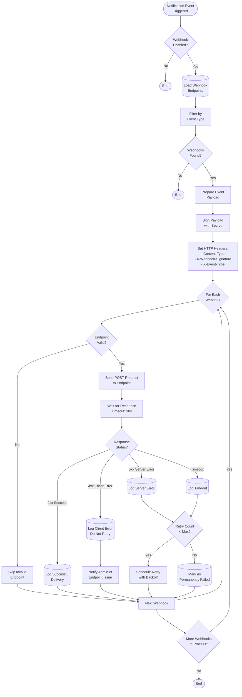

---

**Document Control**:
- **Created**: 2025-01-16
- **Version**: 1.0
- **Status**: Active Development
- **Next Review**: Q2 2025
