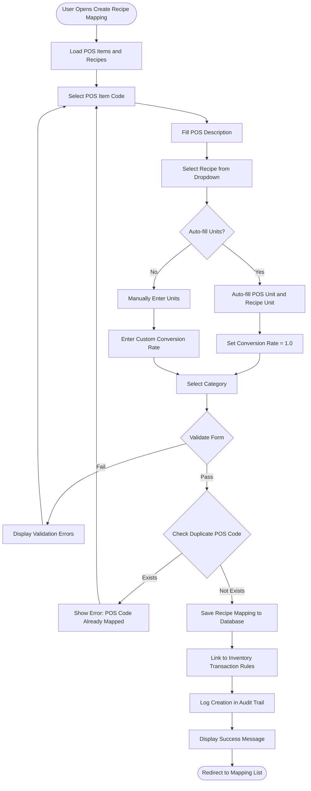
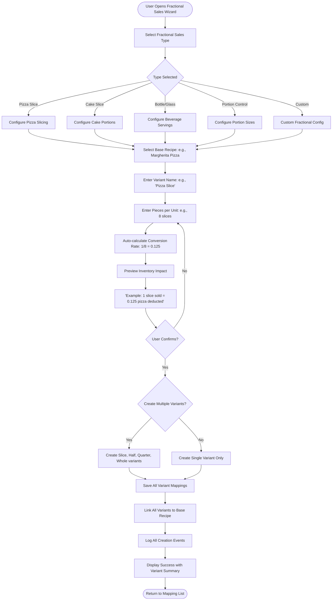
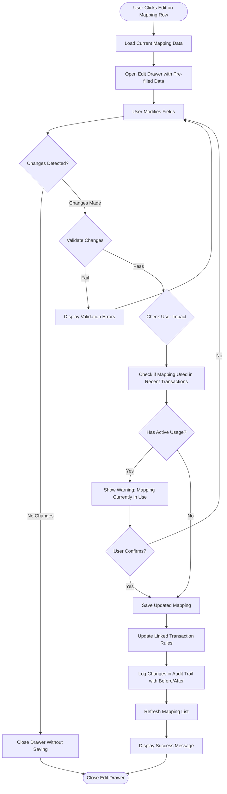
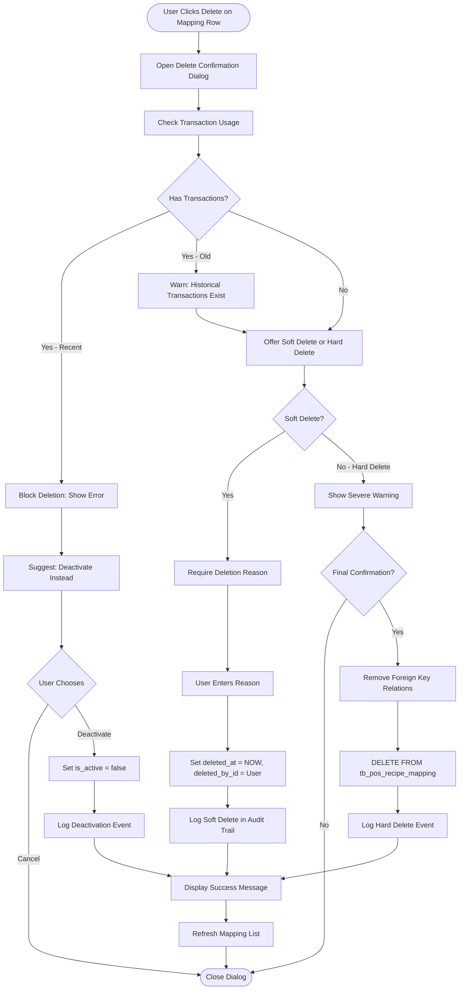
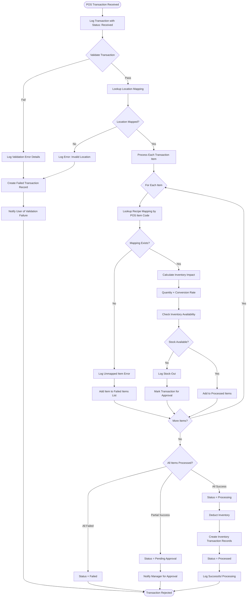
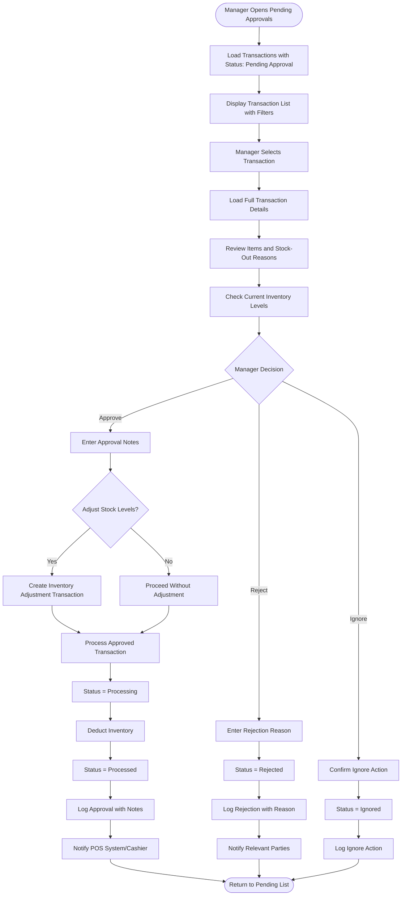
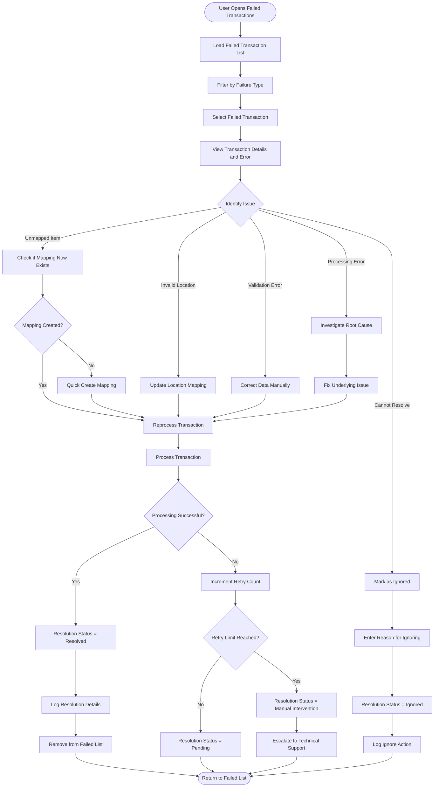
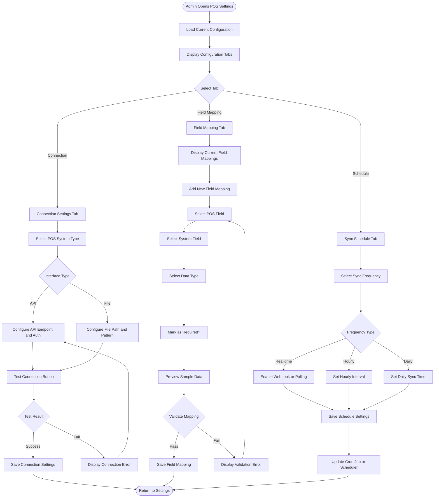
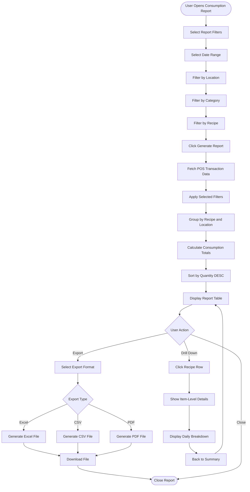
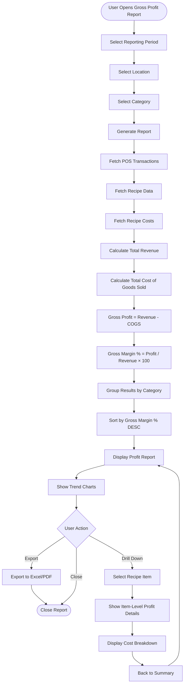

# System Integrations - Flow Diagrams (FD)

**Module**: System Administration - System Integrations
**Version**: 1.0
**Last Updated**: 2025-01-16
## Document History

| Version | Date | Author | Changes |
|---------|------|--------|---------|
| 1.1.0 | 2025-12-10 | Documentation Team | Standardized reference number format (XXX-YYMM-NNNN) |
| 1.0.0 | 2025-11-19 | Documentation Team | Initial version |
**Implementation Status**: Partially Implemented (POS Integration)

---

## 1. Overview

This document provides comprehensive flow diagrams for all system integration workflows, focusing on POS integration processes including recipe mapping, transaction processing, and error handling.

---

## 2. Recipe Mapping Flows

### FD-001: Create Standard Recipe Mapping Flow



**Key Decision Points**:
- Auto-fill units based on recipe configuration
- Validation of required fields
- Duplicate POS code detection
- Conversion rate validation (must be > 0)

**Performance Metrics**:
- Target completion time: < 30 seconds
- Form validation: < 100ms
- Duplicate check query: < 50ms
- Database insert: < 200ms

---

### FD-002: Create Fractional Sales Mapping Flow



**Key Decision Points**:
- Fractional sales type selection (5 types)
- Pieces per unit configuration
- Auto-calculation of conversion rate
- Bulk vs. single variant creation

**Fractional Sales Calculations**:
```
Conversion Rate = 1 / Pieces per Unit

Examples:
- Pizza: 8 slices → 1/8 = 0.125
- Cake: 16 slices → 1/16 = 0.0625
- Bottle: 4 glasses → 1/4 = 0.25

Inventory Impact = Quantity Sold × Conversion Rate
- 5 pizza slices sold × 0.125 = 0.625 pizzas deducted
```

---

### FD-003: Edit Recipe Mapping Flow



**Key Decision Points**:
- Change detection to prevent unnecessary saves
- Validation of modified fields
- Usage impact analysis (warn if mapping is actively used)
- Confirmation required for high-impact changes

**Audit Trail Logged**:
- User ID and timestamp
- Before/after values for all changed fields
- IP address and user agent
- Reason for change (if provided)

---

### FD-004: Delete Recipe Mapping Flow



**Key Decision Points**:
- Transaction usage check (recent vs. historical)
- Soft delete vs. hard delete option
- Deletion reason requirement for soft delete
- Multiple confirmation steps for hard delete

**Delete Types**:
- **Soft Delete**: Sets `deleted_at` timestamp, preserves data for audit
- **Hard Delete**: Permanently removes record (only if no foreign key constraints)
- **Deactivate**: Sets `is_active = false`, keeps mapping visible but inactive

---

## 3. Transaction Processing Flows

### FD-005: Automated Transaction Processing Flow



**Key Decision Points**:
- Transaction validation (required fields, data types)
- Location mapping lookup
- Item-by-item recipe mapping lookup
- Stock availability check
- Partial success handling (some items succeed, some fail)

**Status Transitions**:
1. **Received** → Initial state when transaction arrives
2. **Validating** → Basic data validation in progress
3. **Pending Approval** → Stock-out or manual review required
4. **Processing** → All validations passed, updating inventory
5. **Processed** → Successfully completed
6. **Failed** → Unable to process due to errors

**Performance Targets**:
- Single transaction processing: < 500ms
- Batch processing (100 transactions): < 30 seconds
- Validation step: < 100ms
- Inventory update: < 200ms per item

---

### FD-006: Manual Transaction Review and Approval Flow



**Key Decision Points**:
- Approval or rejection decision
- Stock adjustment requirement
- Notification of approval/rejection
- Audit trail for all decisions

**Approval Scenarios**:
- **Stock-Out**: Item sold but insufficient inventory
- **Manual Review**: Transaction flagged for review
- **Exception Handling**: Unusual quantity or pricing
- **New Item**: First-time sale of newly mapped item

---

### FD-007: Failed Transaction Resolution Flow



**Key Decision Points**:
- Failure type identification (unmapped item, invalid location, validation error, processing error)
- Resolution method selection
- Retry attempt tracking
- Escalation to technical support if needed

**Failure Types**:
1. **Unmapped Item**: POS item code not found in recipe mappings → Create mapping
2. **Invalid Location**: POS location not mapped to Carmen location → Update location mapping
3. **Validation Error**: Data format or missing required fields → Correct data
4. **Processing Error**: System error during processing → Investigate and fix

**Bulk Resolution**:
- Users can select multiple failed transactions of the same type
- Apply same resolution action to all selected transactions
- Batch reprocessing for efficiency

---

## 4. Configuration and Settings Flows

### FD-008: Configure POS Integration Settings Flow



**Key Decision Points**:
- POS system selection (Oracle Simphony, Micros, Toast, Square, Clover)
- Interface type (API vs. File-based)
- Field mapping configuration
- Sync frequency selection

**Validation Rules**:
- Connection settings: Valid URL format, reachable endpoint
- Field mappings: No duplicate mappings, all required fields mapped
- Schedule: Valid cron expression or time format

---

## 5. Reporting Flows

### FD-009: Generate Consumption Report Flow



**Report Columns**:
- Recipe Name
- Category
- Location
- Total Quantity Consumed
- Unit
- Period (Date Range)
- Transactions Count
- Average per Transaction

**Performance Targets**:
- Report generation: < 2 seconds for 30 days
- Export Excel: < 5 seconds
- Drill-down query: < 500ms

---

### FD-010: Generate Gross Profit Report Flow



**Report Metrics**:
- Revenue: Total sales amount
- COGS: Cost of goods sold (recipe cost × quantity)
- Gross Profit: Revenue - COGS
- Gross Margin %: (Gross Profit / Revenue) × 100
- Contribution per Item
- Top/Bottom performers by margin

**Calculations**:
```
For each transaction:
1. Sales Amount = POS Transaction Amount
2. Recipe Cost = Recipe.cost_per_unit × Conversion Rate × Quantity
3. Gross Profit = Sales Amount - Recipe Cost
4. Gross Margin % = (Gross Profit / Sales Amount) × 100
```

---

## 6. Performance Metrics Summary

| Flow | Target Time | Critical Path | Optimization Strategy |
|------|------------|---------------|----------------------|
| FD-001: Create Mapping | < 30 sec | Form validation, duplicate check | Client-side validation, indexed queries |
| FD-002: Fractional Sales | < 45 sec | Conversion calculation, bulk create | Batch insert, optimistic UI updates |
| FD-003: Edit Mapping | < 20 sec | Usage check, update transaction rules | Cached usage data, async rule updates |
| FD-004: Delete Mapping | < 15 sec | Transaction count query, soft delete | Indexed transaction queries |
| FD-005: Process Transaction | < 500 ms | Mapping lookups, inventory deduction | Indexed lookups, batch inventory updates |
| FD-006: Approve Transaction | < 10 sec | Inventory check, stock adjustment | Real-time inventory cache |
| FD-007: Resolve Failed Tx | < 30 sec | Mapping creation, reprocessing | Quick create forms, batch retry |
| FD-008: Configure Settings | < 20 sec | Connection test, field mapping save | Async connection test, debounced saves |
| FD-009: Consumption Report | < 2 sec | Transaction aggregation, grouping | Materialized views, pre-aggregation |
| FD-010: Gross Profit Report | < 3 sec | Cost calculation, profit computation | Cached recipe costs, indexed joins |

---

## 7. Error Handling & Recovery

### Common Error Scenarios

**Mapping Errors**:
- Duplicate POS item code → Prevent save, show error
- Invalid conversion rate → Client validation before save
- Missing required fields → Highlight fields, block save

**Transaction Errors**:
- Unmapped item → Log to failed transactions, notify user
- Invalid location → Reject transaction, alert admin
- Stock-out → Flag for approval, hold transaction
- Processing timeout → Retry with exponential backoff

**Configuration Errors**:
- Connection failure → Display error, suggest troubleshooting
- Invalid field mapping → Prevent save, show validation errors
- Sync failure → Log error, retry on next schedule

---

**Document Control**:
- **Created**: 2025-01-16
- **Version**: 1.0
- **Status**: Active (POS Integration)
- **Next Review**: Q2 2025
