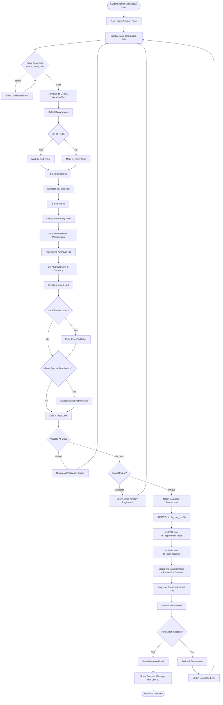
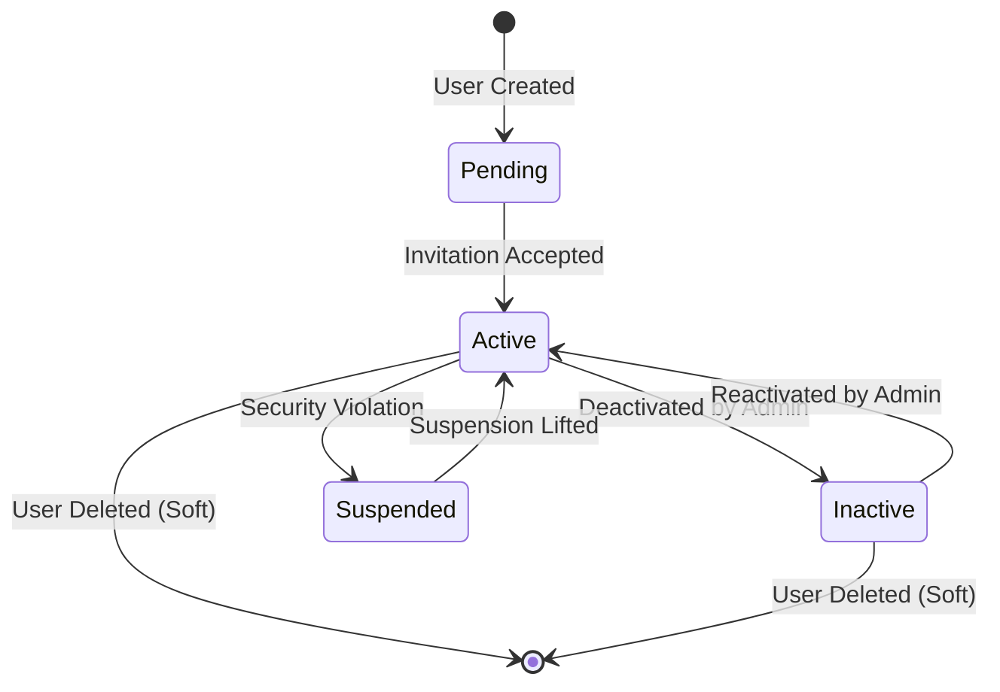
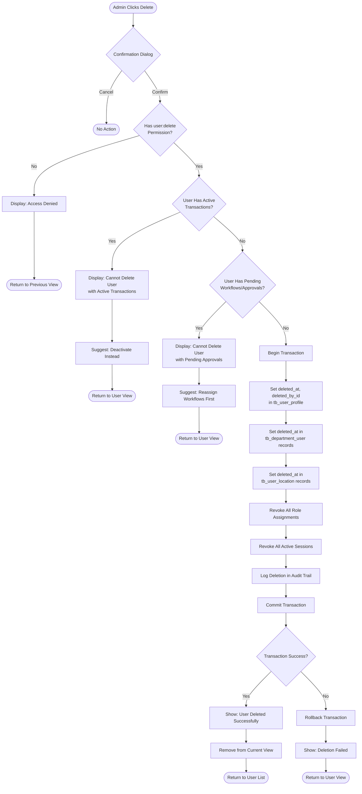
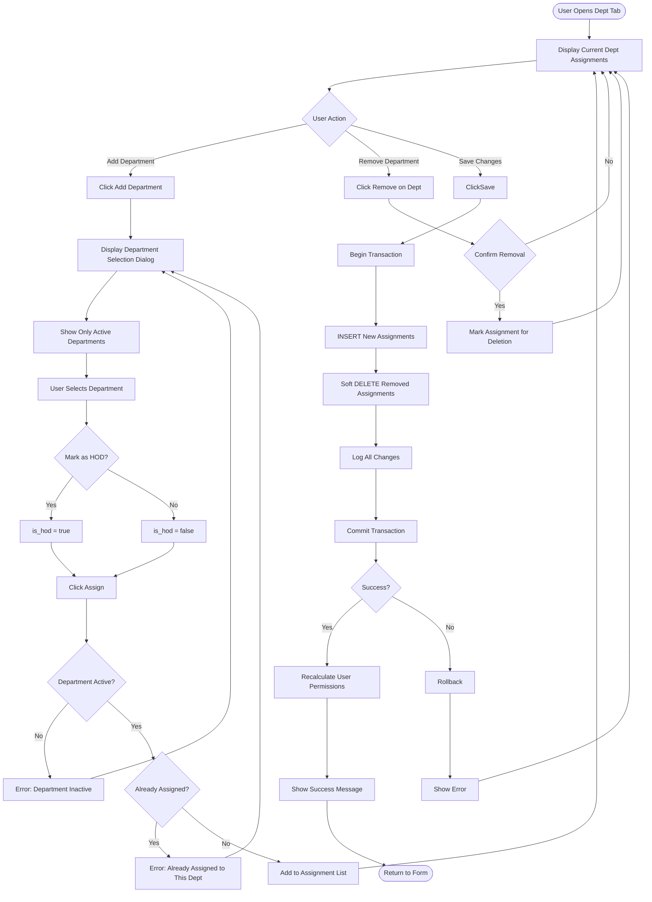
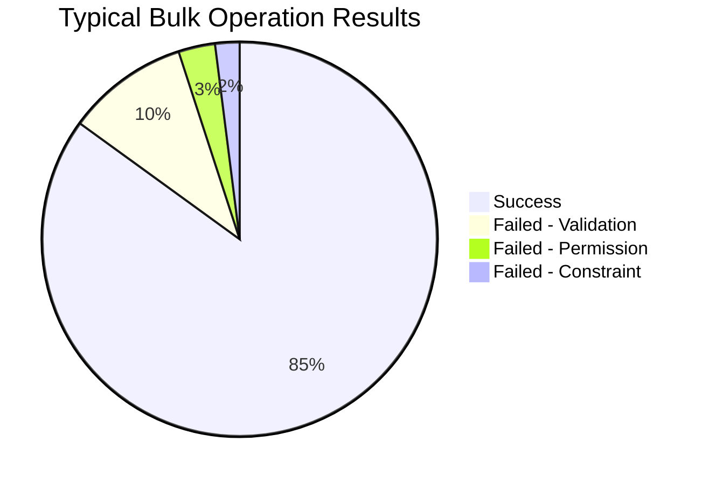
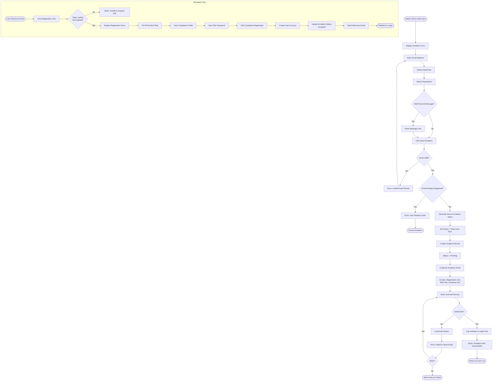
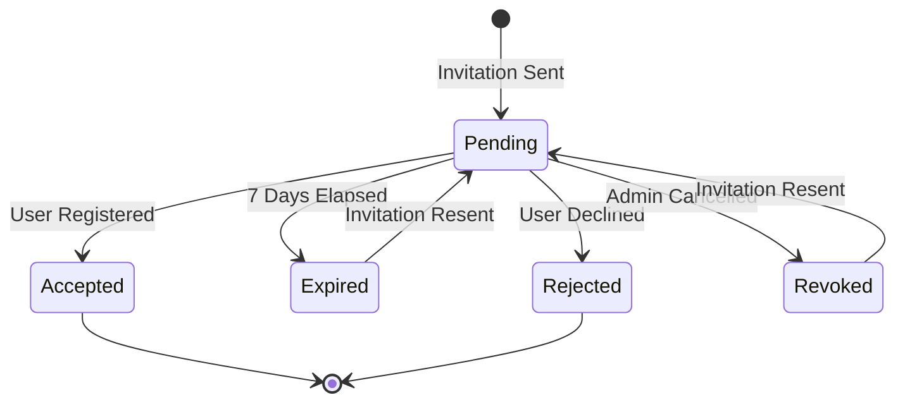
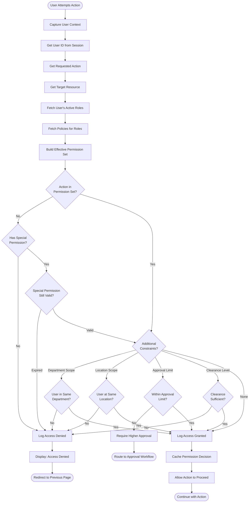
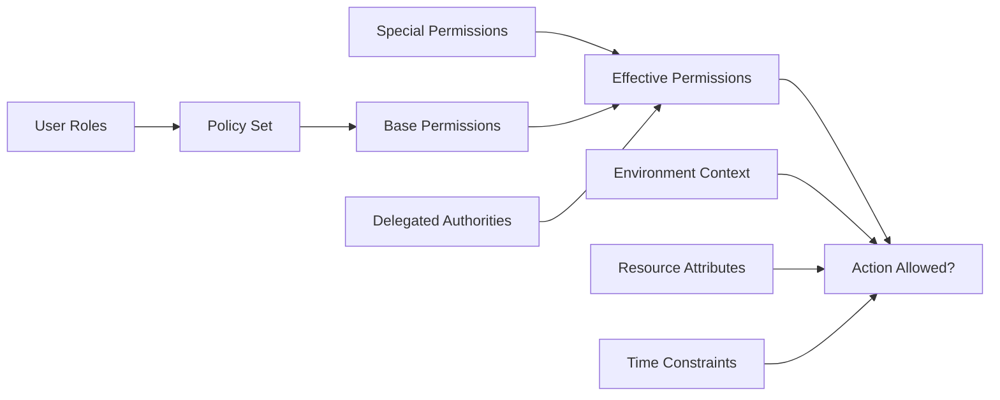

# Flow Diagrams: User Management

## Document Information
- **Module**: System Administration / User Management
- **Version**: 1.0
- **Last Updated**: 2025-01-16
- **Diagram Tool**: Mermaid

## Flow Diagram Index

1. User Creation Workflow
2. User Edit Workflow
3. User Deletion Workflow
4. Department Assignment Workflow
5. Location Assignment Workflow
6. Role Assignment Workflow
7. Bulk Operations Workflow
8. Search and Filter Workflow
9. User Invitation Workflow
10. Permission Validation Workflow

## Document History

| Version | Date | Author | Changes |
|---------|------|--------|---------|
| 1.1.0 | 2025-12-10 | Documentation Team | Standardized reference number format (XXX-YYMM-NNNN) |
| 1.0.0 | 2025-11-19 | Documentation Team | Initial version |
---

## 1. User Creation Workflow

### Overview
Complete flow for creating a new user account with department, location, and role assignments.



### Decision Points

| Decision | Condition | Outcome |
|----------|-----------|---------|
| Validation Check | All required fields valid | Proceed to next tab |
| Email Uniqueness | Email not in database | Allow user creation |
| HOD Designation | User is department head | Set is_hod = true |
| Special Permissions | Sensitive permission requested | Require justification |
| Transaction Commit | All inserts successful | User created |

### Error Handling

- **Validation Errors**: Inline errors shown on form, user cannot proceed
- **Duplicate Email**: Navigate to Basic Info tab with highlighted error
- **Database Errors**: Rollback transaction, preserve form data, allow retry
- **Network Errors**: Display toast notification with retry option

---

## 2. User Edit Workflow

### Overview
Modify existing user profile with full audit trail.

```mermaid
flowchart TD
    Start([User Clicks Edit]) --> CheckPerm{Has user:update<br>Permission?}
    CheckPerm -->|No| Denied[Display: Access Denied]
    Denied --> End1([Redirect to Dashboard])

    CheckPerm -->|Yes| LoadUser[Fetch User Data from Database]
    LoadUser --> LoadDepts[Fetch Department Assignments]
    LoadDepts --> LoadLocs[Fetch Location Assignments]
    LoadLocs --> LoadRoles[Fetch Role Assignments]
    LoadRoles --> PopulateForm[Pre-populate Edit Form]

    PopulateForm --> SetEditMode[Set URL: mode=edit]
    SetEditMode --> DisplayForm[Display Editable Form]

    DisplayForm --> UserEdits{User Makes Changes}
    UserEdits --> ValidateRealtime[Real-time Field Validation]
    ValidateRealtime -->|Invalid| ShowFieldError[Show Inline Error]
    ShowFieldError --> UserEdits
    ValidateRealtime -->|Valid| ContinueEdit{More Changes?}

    ContinueEdit -->|Yes| UserEdits
    ContinueEdit -->|No| ClickSave[User Clicks Save]

    ClickSave --> RevalidateAll{Revalidate All Fields}
    RevalidateAll -->|Failed| ShowAllErrors[Display All Errors]
    ShowAllErrors --> UserEdits

    RevalidateAll -->|Success| CheckVersion{doc_version Matches?}
    CheckVersion -->|No| ConcurrentModError[Display: Data Modified by Another User]
    ConcurrentModError --> OfferReload{Reload or Override?}
    OfferReload -->|Reload| LoadUser
    OfferReload -->|Override| ForceUpdate[Force Update with Confirmation]

    CheckVersion -->|Yes| StartTxn[Begin Transaction]
    ForceUpdate --> StartTxn

    StartTxn --> UpdateProfile[UPDATE tb_user_profile]
    UpdateProfile --> UpdateDepts{Departments Changed?}
    UpdateDepts -->|Yes| SyncDepts[Soft Delete Old + Insert New in tb_department_user]
    UpdateDepts -->|No| UpdateLocs
    SyncDepts --> UpdateLocs{Locations Changed?}

    UpdateLocs -->|Yes| SyncLocs[Soft Delete Old + Insert New in tb_user_location]
    UpdateLocs -->|No| UpdateRoles
    SyncLocs --> UpdateRoles{Roles Changed?}

    UpdateRoles -->|Yes| SyncRoles[Update Role Assignments in Permission System]
    UpdateRoles -->|No| LogChanges
    SyncRoles --> LogChanges[Log All Changes in Audit Trail]

    LogChanges --> CommitTxn[Commit Transaction]
    CommitTxn --> Success{Transaction Success?}
    Success -->|Yes| NotifyWorkflow[Notify Workflow Engine of Changes]
    NotifyWorkflow --> ShowSuccess[Show Success Message]
    ShowSuccess --> RedirectView[Redirect to View Mode]
    RedirectView --> End2([Display Updated User])

    Success -->|No| Rollback[Rollback Transaction]
    Rollback --> ShowError[Show: Update Failed]
    ShowError --> DisplayForm
```



### Status Transitions



---

## 3. User Deletion Workflow

### Overview
Soft delete user with validation to prevent data integrity issues.



### Deletion Constraints

| Constraint | Check | Action if Failed |
|------------|-------|------------------|
| Active Transactions | Purchase requests, orders, GRNs | Block deletion, suggest deactivation |
| Pending Approvals | Approval workflows | Block deletion, suggest reassignment |
| HOD Status | User is HOD of department | Allow (HOD flag removed automatically) |
| Historical Data | User in audit logs | Allow (soft delete preserves history) |

---

## 4. Department Assignment Workflow

### Overview
Assign user to one or more departments with optional HOD designation.



---

## 5. Location Assignment Workflow

### Overview
Assign user to multiple locations for access control.

```mermaid
flowchart TD
    Start([User Opens Location Tab]) --> DisplayCurrent[Display Current Location Assignments]
    DisplayCurrent --> Action{User Action}

    Action -->|Add Location| ClickAdd[Click Add Location]
    Action -->|Remove Location| ClickRemove[Click Remove]
    Action -->|Save| ClickSave

    ClickAdd --> ShowLocList[Display Location Selection Dialog]
    ShowLocList --> FilterByType{Filter by Type?}

    FilterByType -->|Inventory| ShowInventory[Show Inventory Locations]
    FilterByType -->|Direct| ShowDirect[Show Direct Locations]
    FilterByType -->|Consignment| ShowConsignment[Show Consignment Locations]
    FilterByType -->|All| ShowAll[Show All Active Locations]

    ShowInventory --> UserSelects[User Selects Location(s)]
    ShowDirect --> UserSelects
    ShowConsignment --> UserSelects
    ShowAll --> UserSelects

    UserSelects --> ClickAssign[Click Assign]
    ClickAssign --> ValidateActive{Locations Active?}

    ValidateActive -->|No| ShowInactiveError[Error: Inactive Location Selected]
    ShowInactiveError --> ShowLocList

    ValidateActive -->|Yes| CheckDuplicates[Filter Out Duplicates]
    CheckDuplicates --> AddToForm[Add to Assignment List]
    AddToForm --> DisplayCurrent

    ClickRemove --> ConfirmRemove{Confirm Removal}
    ConfirmRemove -->|No| DisplayCurrent
    ConfirmRemove -->|Yes| MarkForDelete[Mark for Deletion]
    MarkForDelete --> DisplayCurrent

    ClickSave --> ValidateMinimum{At Least 1 Location?}
    ValidateMinimum -->|No| ShowMinError[Error: Must Have At Least 1 Location]
    ShowMinError --> DisplayCurrent

    ValidateMinimum -->|Yes| StartTxn[Begin Transaction]
    StartTxn --> ProcessNew[INSERT New Assignments]
    ProcessNew --> ProcessDeleted[Soft DELETE Removed Assignments]
    ProcessDeleted --> LogChanges[Log Changes]
    LogChanges --> CommitTxn[Commit Transaction]

    CommitTxn --> Success{Success?}
    Success -->|Yes| NotifyFilters[Update Data Filters for User]
    NotifyFilters --> ShowSuccess[Show Success]
    ShowSuccess --> End1([Return to Form])

    Success -->|No| Rollback[Rollback]
    Rollback --> ShowError[Show Error]
    ShowError --> DisplayCurrent
```

---

## 6. Role Assignment Workflow

### Overview
Assign multiple roles to user with primary role designation.

```mermaid
flowchart TD
    Start([User Opens Roles Tab]) --> DisplayCurrent[Display Current Roles]
    DisplayCurrent --> ShowPrimary[Highlight Primary Role]
    ShowPrimary --> ShowEffective[Display Effective Permissions]

    ShowEffective --> Action{User Action}
    Action -->|Add Role| ClickAdd[Click Add Role]
    Action -->|Remove Role| ClickRemove
    Action -->|Set Primary| ChangePrimary
    Action -->|Save| ClickSave

    ClickAdd --> ShowRoleList[Display Role Selection Dialog]
    ShowRoleList --> ShowRoleDetails[Show Role Descriptions & Permissions]
    ShowRoleDetails --> UserSelects[User Selects Role(s)]
    UserSelects --> ClickAssign[Click Assign]

    ClickAssign --> ValidateConflict{Check Role Conflicts}
    ValidateConflict -->|Conflict| ShowConflictWarning[Warning: Conflicting Roles Detected]
    ShowConflictWarning --> UserOverride{Override Warning?}
    UserOverride -->|No| ShowRoleList
    UserOverride -->|Yes| AddToForm

    ValidateConflict -->|No Conflict| AddToForm[Add to Role List]
    AddToForm --> RecalcPerms[Recalculate Effective Permissions]
    RecalcPerms --> DisplayCurrent

    ClickRemove --> CheckPrimary{Is Primary Role?}
    CheckPrimary -->|Yes| CheckOthers{Other Roles Exist?}
    CheckOthers -->|No| ShowError[Error: Must Have At Least 1 Role]
    ShowError --> DisplayCurrent
    CheckOthers -->|Yes| PromotePrimary[Promote Next Role to Primary]
    PromotePrimary --> RemoveRole[Mark Role for Removal]

    CheckPrimary -->|No| RemoveRole
    RemoveRole --> RecalcPerms

    ChangePrimary --> SelectNewPrimary[User Selects New Primary]
    SelectNewPrimary --> UpdatePrimaryFlag[Update Primary Role Flag]
    UpdatePrimaryFlag --> DisplayCurrent

    ClickSave --> ValidateAtLeastOne{At Least 1 Role?}
    ValidateAtLeastOne -->|No| ShowMinError[Error: User Must Have At Least 1 Role]
    ShowMinError --> DisplayCurrent

    ValidateAtLeastOne -->|Yes| ValidatePrimary{Primary Role Set?}
    ValidatePrimary -->|No| AutoSetPrimary[Auto-Set First Role as Primary]
    AutoSetPrimary --> StartTxn
    ValidatePrimary -->|Yes| StartTxn[Begin Transaction]

    StartTxn --> SyncRoles[Sync Role Assignments in Permission System]
    SyncRoles --> RecalcFinal[Recalculate Final Effective Permissions]
    RecalcFinal --> UpdateClearance[Update Clearance Level from Highest Role]
    UpdateClearance --> LogChanges[Log Role Changes]
    LogChanges --> CommitTxn[Commit Transaction]

    CommitTxn --> Success{Success?}
    Success -->|Yes| NotifyWorkflows[Notify Workflow Engine]
    NotifyWorkflows --> ShowSuccess[Show Success]
    ShowSuccess --> End1([Return to Form])

    Success -->|No| Rollback[Rollback]
    Rollback --> ShowError2[Show Error]
    ShowError2 --> DisplayCurrent
```

---

## 7. Bulk Operations Workflow

### Overview
Apply operations to multiple users simultaneously.

```mermaid
flowchart TD
    Start([Admin Selects Multiple Users]) --> ShowToolbar[Display Bulk Actions Toolbar]
    ShowToolbar --> ShowCount[Show Selected Count]
    ShowCount --> SelectAction{Choose Bulk Action}

    SelectAction -->|Assign Roles| RoleBulk[Open Bulk Role Dialog]
    SelectAction -->|Change Status| StatusBulk[Open Bulk Status Dialog]
    SelectAction -->|Delete| DeleteBulk[Open Bulk Delete Confirmation]
    SelectAction -->|Clear Selection| ClearSelection[Clear All Selections]

    ClearSelection --> End1([Hide Toolbar])

    RoleBulk --> SelectRoles[Select Roles to Assign]
    SelectRoles --> SelectMode{Assignment Mode}
    SelectMode -->|Add to Existing| AddMode[mode = add]
    SelectMode -->|Replace All| ReplaceMode[mode = replace]

    AddMode --> ConfirmBulk
    ReplaceMode --> ConfirmBulk

    StatusBulk --> SelectStatus[Select New Status]
    SelectStatus --> EnterReason{Provide Reason?}
    EnterReason -->|Yes| EnterReasonText[Enter Reason Text]
    EnterReason -->|No| ConfirmBulk
    EnterReasonText --> ConfirmBulk

    DeleteBulk --> ShowDeleteWarning[Show: Delete [N] Users Warning]
    ShowDeleteWarning --> ConfirmBulk

    ConfirmBulk{Confirm Action?}
    ConfirmBulk -->|Cancel| End2([No Changes])
    ConfirmBulk -->|Confirm| StartBulk[Initialize Bulk Processor]

    StartBulk --> ProcessLoop[For Each Selected User]
    ProcessLoop --> ValidateUser{User Valid?}

    ValidateUser -->|No| LogFail[Log Failure with Reason]
    ValidateUser -->|Yes| ApplyAction[Apply Action to User]

    LogFail --> CheckMore1
    ApplyAction --> ActionSuccess{Action Success?}

    ActionSuccess -->|Yes| LogSuccess[Log Success]
    ActionSuccess -->|No| LogFail

    LogSuccess --> CheckMore1{More Users?}
    CheckMore1 -->|Yes| ProcessLoop
    CheckMore1 -->|No| CompileResults[Compile Success/Failure Summary]

    CompileResults --> ShowSummary[Display Results Dialog]
    ShowSummary --> ShowSuccessCount[Success: [N] Users]
    ShowSuccessCount --> ShowFailCount[Failed: [M] Users]
    ShowFailCount --> ShowFailDetails{Failures Exist?}

    ShowFailDetails -->|Yes| DisplayFailures[Display Failure Details with Reasons]
    ShowFailDetails -->|No| End3
    DisplayFailures --> OfferRetry{Retry Failed?}

    OfferRetry -->|Yes| RetryFailed[Extract Failed User IDs]
    RetryFailed --> ProcessLoop
    OfferRetry -->|No| End3[Clear Selection]
    End3 --> RefreshList[Refresh User List]
    RefreshList --> End4([Show Updated Data])
```

### Bulk Operation Results



---

## 8. Search and Filter Workflow

### Overview
Real-time search and multi-criteria filtering.

```mermaid
flowchart TD
    Start([User on User List Page]) --> DisplayAll[Display All Users]
    DisplayAll --> Action{User Action}

    Action -->|Type in Search| TypeSearch[Enter Search Term]
    Action -->|Apply Filter| ClickFilter[Click Filter Option]
    Action -->|Advanced Filter| ClickAdvanced[Click Advanced Filters]
    Action -->|Clear Filters| ClickClear

    TypeSearch --> Debounce[Wait 300ms Debounce]
    Debounce --> SearchFields[Search: Name, Email]
    SearchFields --> UpdateResults

    ClickFilter --> SelectFilter{Filter Type}
    SelectFilter -->|Business Unit| SelectBU[Select Business Unit]
    SelectFilter -->|Department| SelectDept[Select Department(s)]
    SelectFilter -->|Role| SelectRole[Select Role(s)]
    SelectFilter -->|Status| SelectStatus[Select Status(es)]
    SelectFilter -->|HOD Only| CheckHOD[is_hod = true]
    SelectFilter -->|Clearance Level| SelectClearance[Select Clearance Level]

    SelectBU --> CombineFilters
    SelectDept --> CombineFilters
    SelectRole --> CombineFilters
    SelectStatus --> CombineFilters
    CheckHOD --> CombineFilters
    SelectClearance --> CombineFilters

    CombineFilters[Apply Filters with AND Logic] --> UpdateResults

    ClickAdvanced --> ShowBuilder[Display Advanced Filter Builder]
    ShowBuilder --> AddCondition[Add Filter Condition]
    AddCondition --> SelectField[Select Field]
    SelectField --> SelectOperator[Select Operator:<br>equals, contains, >, <, etc.]
    SelectOperator --> EnterValue[Enter Value]
    EnterValue --> MoreConditions{Add More Conditions?}

    MoreConditions -->|Yes| AddCondition
    MoreConditions -->|No| SelectLogic{Choose AND/OR Logic}
    SelectLogic --> ApplyAdvanced[Apply Advanced Filter]
    ApplyAdvanced --> CombineFilters

    UpdateResults[Execute Filter Query] --> CheckCount{Results Count}
    CheckCount -->|0| ShowNoResults[Display: No Users Found]
    ShowNoResults --> SuggestClear[Suggest: Clear Filters]
    SuggestClear --> Action

    CheckCount -->|>0| ShowResults[Display Filtered Users]
    ShowResults --> ShowCount[Show: X of Y Users]
    ShowCount --> UpdateURL[Update URL with Filter State]
    UpdateURL --> Action

    ClickClear --> ResetAllFilters[Clear All Filters]
    ResetAllFilters --> ResetSearch[Clear Search Term]
    ResetSearch --> DisplayAll
```

---

## 9. User Invitation Workflow

### Overview
Invite external users via email to register.



### Invitation States



---

## 10. Permission Validation Workflow

### Overview
Real-time permission checking during user operations.



### Permission Evaluation



---

## Summary

These flow diagrams represent the actual workflows implemented in the User Management module. All flows include:

- **Permission Checks**: Every operation validates user permissions
- **Validation**: Client-side and server-side data validation
- **Error Handling**: Graceful error handling with user-friendly messages
- **Audit Logging**: All state changes logged for compliance
- **Transaction Management**: Database transactions ensure data consistency
- **Soft Deletes**: Preservation of historical data through soft delete pattern

The diagrams use consistent notation:
- **Rectangles**: Process steps
- **Diamonds**: Decision points
- **Rounded Rectangles**: Start/End points
- **Dashed Lines**: Optional flows
- **Bold Lines**: Critical paths
