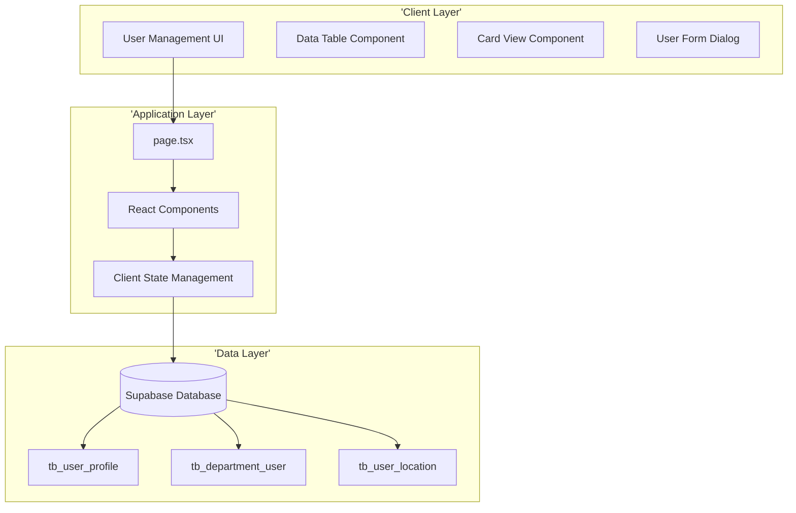
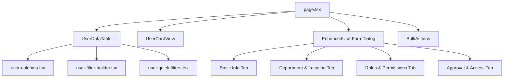
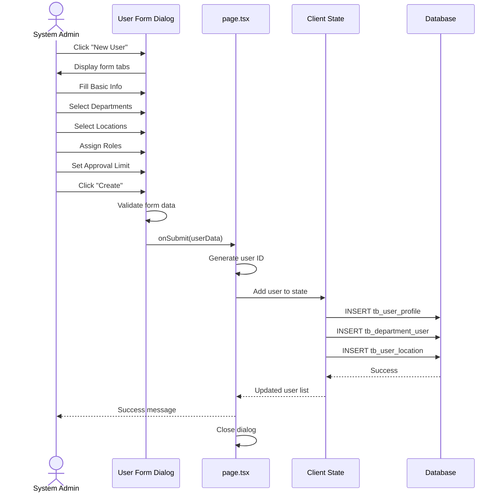
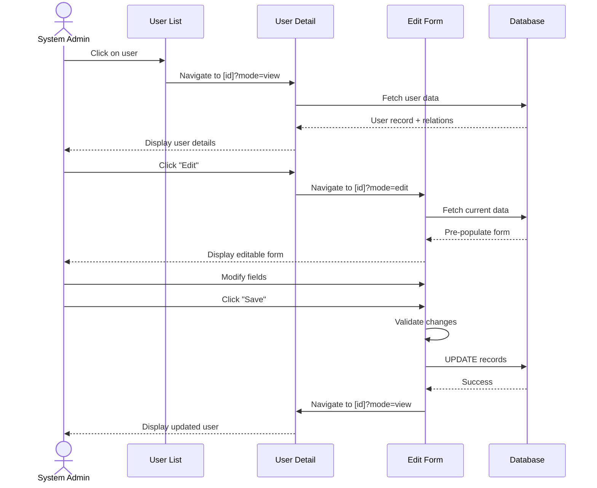
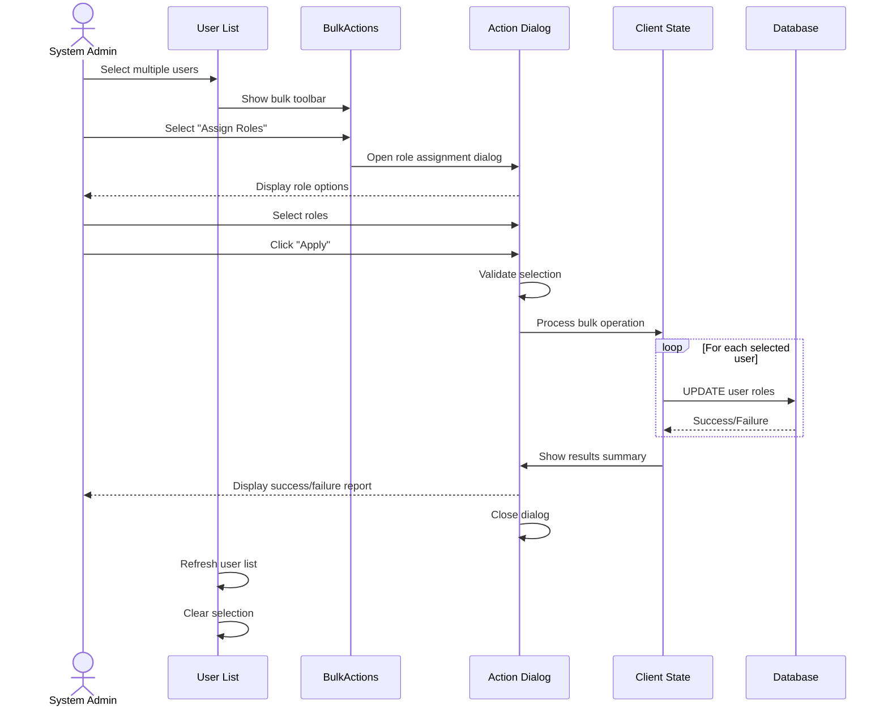

# Technical Specification: User Management

## Document Information
- **Module**: System Administration / User Management
- **Version**: 1.0
- **Last Updated**: 2025-01-16
- **Technology Stack**: Next.js 14 App Router, TypeScript, React, Supabase

## System Architecture

### High-Level Architecture

### Component Hierarchy

## Page Structure

### Main User Management Page

**Route**: `/system-administration/user-management/page.tsx`

**Purpose**: Primary user list view with search, filter, and bulk operations

**Key Features**:
- User list display (table and card view modes)
- Real-time search across name and email
- Multi-criteria filtering (business unit, department, role, status)
- Bulk selection and operations
- Export to CSV
- Print functionality
- User creation dialog

**State Management**:
- `users`: Array of user objects (currently mock data)
- `selectedUsers`: Array of selected user IDs
- `viewMode`: Toggle between 'table' and 'card' view

**Data Flow**:
1. Component mounts and loads mock users
2. User applies filters/search
3. `useMemo` recalculates filtered list
4. DataTable or CardView renders filtered users
5. User actions (view/edit/delete) trigger navigation or state updates

### User Detail Page

**Route**: `/system-administration/user-management/[id]/page.tsx`

**Purpose**: Display detailed user information in view or edit mode

**Query Parameters**:
- `mode`: 'view' or 'edit'

**Sections**:
- **Profile Information**: Name, email, bio, account status
- **Department Assignments**: List of departments with HOD flags
- **Location Assignments**: List of assigned locations
- **Roles & Permissions**: Primary role, all roles, effective permissions
- **Approval Configuration**: Approval limit, currency, clearance level
- **Special Permissions**: Granted special permissions with expiry
- **Audit Information**: Created date, modified date, last login

## Component Specifications

### UserDataTable Component

**File**: `components/user-data-table.tsx`

**Purpose**: Render user list in table format with sorting, filtering, and pagination

**Props**:
- `columns`: Column definitions from `user-columns.tsx`
- `data`: Array of user objects
- `viewMode`: Current view mode ('table' | 'card')
- `onViewModeChange`: Callback to toggle view mode
- `cardView`: React element for card view rendering

**Features**:
- Column-based sorting
- Column visibility toggle
- Pagination controls
- Row selection
- Context menu for row actions

**Integration**:
- Uses shadcn/ui Table components
- Integrates with TanStack Table for data operations
- Renders `cardView` when `viewMode === 'card'`

## Document History

| Version | Date | Author | Changes |
|---------|------|--------|---------|
| 1.1.0 | 2025-12-10 | Documentation Team | Standardized reference number format (XXX-YYMM-NNNN) |
| 1.0.0 | 2025-11-19 | Documentation Team | Initial version |
---

### UserCardView Component

**File**: `components/user-card-view.tsx`

**Purpose**: Render user list in card/grid format for visual browsing

**Props**:
- `data`: Array of user objects
- `selectedItems`: Array of selected user IDs
- `onSelectItem`: Callback when user card is selected
- `onSelectAll`: Callback to select/deselect all users
- `onView`: Callback to view user details
- `onEdit`: Callback to edit user
- `onDelete`: Callback to delete user

**Features**:
- Grid layout responsive to screen size
- Visual badges for status, HOD, roles
- Quick actions on card hover
- Checkbox selection for bulk operations

**Card Data Display**:
- User avatar (generated from initials)
- Name and email
- Business unit and department
- Primary role badge
- Account status indicator
- Last login timestamp
- HOD status badge (if applicable)

---

### EnhancedUserFormDialog Component

**File**: `components/enhanced-user-form-dialog.tsx`

**Purpose**: Multi-step user creation/edit form with validation

**Props**:
- `onSubmit`: Callback when form is submitted
- `trigger`: React element to trigger dialog open
- `initialData`: Optional user data for edit mode

**Form Tabs**:
1. **Basic Information**
   - Firstname, Middlename, Lastname
   - Email
   - Bio (JSON field for extended attributes)
   - Account Status

2. **Department & Location**
   - Department multi-select with HOD checkboxes
   - Location multi-select by type (inventory, direct, consignment)

3. **Roles & Permissions**
   - Role multi-select
   - Primary role designation
   - Effective permissions preview (read-only)
   - Clearance level dropdown

4. **Approval & Access**
   - Approval limit amount
   - Approval limit currency
   - Effective date range (from/to)
   - Special permissions multi-select
   - Delegated authorities multi-select

**Validation**:
- Email format validation
- Required field validation
- Unique email constraint (client-side check)
- Positive number validation for approval limit
- Date range logic validation (from < to)

**State Management**:
- Form state via React Hook Form
- Zod schema for validation
- Tab navigation state
- Submission loading state

---

### User Columns Configuration

**File**: `components/user-columns.tsx`

**Purpose**: Define table columns with sorting, filtering, and actions

**Exported Function**: `createUserColumns(actions)`

**Columns**:
- Checkbox (selection)
- Name (sortable, searchable)
- Email (sortable, searchable)
- Business Unit (filterable)
- Department (filterable)
- Roles (multi-value, filterable)
- Account Status (badge, filterable)
- Last Login (sortable, formatted timestamp)
- Actions (view, edit, delete dropdown menu)

**Actions Parameter**:
- `onView`: Function to handle view action
- `onEdit`: Function to handle edit action
- `onDelete`: Function to handle delete action

**Column Features**:
- Conditional formatting (status colors, badges)
- Tooltip on hover for truncated text
- Icons for visual indicators (HOD badge, status icon)
- Responsive column hiding on mobile

---

### BulkActions Component

**File**: `components/bulk-actions.tsx`

**Purpose**: Action toolbar for bulk user operations

**Props**:
- `selectedCount`: Number of selected users
- `onAction`: Callback when bulk action is selected

**Actions**:
- **Assign Roles**: Bulk role assignment dialog
- **Change Status**: Bulk status change dialog
- **Assign Department**: Bulk department assignment dialog
- **Assign Location**: Bulk location assignment dialog
- **Delete Users**: Bulk delete with confirmation

**UI Elements**:
- Selected count badge
- Action dropdown menu
- Clear selection button

**Behavior**:
- Appears only when users are selected
- Fixed position at top of table
- Dismissible on clear action

---

### UserFilterBuilder Component

**File**: `components/user-filter-builder.tsx`

**Purpose**: Advanced filter builder for complex user queries

**Filter Operators**:
- equals, not equals
- contains, not contains
- greater than, less than
- in (multi-select)
- is null, is not null

**Filter Fields**:
- Name
- Email
- Business Unit
- Department
- Role
- Account Status
- Clearance Level
- Last Login Date
- Approval Limit

**Features**:
- Add/remove filter conditions
- AND/OR logic between conditions
- Save filters as "Quick Filters"
- Load saved filters
- Clear all filters

---

### UserQuickFilters Component

**File**: `components/user-quick-filters.tsx`

**Purpose**: Pre-configured quick filter buttons

**Quick Filters**:
- Active Users (account_status = 'active')
- Inactive Users (account_status = 'inactive')
- HOD Only (hodStatus = true)
- Pending Invites (inviteStatus = 'pending')
- Recently Active (lastLogin within 7 days)
- High Clearance (clearanceLevel = 'confidential' or 'restricted')

**Features**:
- One-click filter application
- Visual active state
- Combinable with other filters

## Data Flow Diagrams

### User Creation Flow

### User Edit Flow

### Bulk Operation Flow

## Integration Points

### Permission Management Integration

**Purpose**: Verify user permissions and retrieve role definitions

**Integration Type**: Module-to-Module

**Data Exchange**:
- User Management requests role definitions
- Permission Management provides role metadata and permissions
- User Management validates role assignments against policies

**API Contract**:
- `getRoles()`: Fetch all available roles
- `getRoleById(roleId)`: Fetch specific role details
- `validateRoleAssignment(userId, roleIds)`: Validate role assignment
- `calculateEffectivePermissions(roleIds)`: Compute union of role permissions

---

### Department Management Integration

**Purpose**: Retrieve valid departments for user assignment

**Integration Type**: Database Foreign Key

**Data Exchange**:
- User Management queries `tb_department` for active departments
- Department changes cascade to `tb_department_user` soft deletes

**API Contract**:
- `getActiveDepartments()`: Fetch all active departments
- `getDepartmentById(deptId)`: Fetch specific department details
- `validateDepartmentAccess(userId, deptId)`: Check user department access

---

### Location Management Integration

**Purpose**: Retrieve valid locations for user assignment

**Integration Type**: Database Foreign Key

**Data Exchange**:
- User Management queries `tb_location` for active locations
- Location types filter available options (inventory, direct, consignment)

**API Contract**:
- `getActiveLocations()`: Fetch all active locations
- `getLocationsByType(locationType)`: Filter locations by type
- `validateLocationAccess(userId, locationId)`: Check user location access

---

### Workflow Engine Integration

**Purpose**: Notify workflow engine of user permission changes

**Integration Type**: Event-Driven

**Events Published**:
- `user.created`: New user account created
- `user.role_changed`: User roles modified
- `user.approval_limit_changed`: Approval limit modified
- `user.deactivated`: User account deactivated
- `user.activated`: User account activated

**Workflow Engine Actions**:
- Recalculate workflow routes for pending approvals
- Notify affected users of permission changes
- Reassign workflows if approver deactivated

---

### Audit Service Integration

**Purpose**: Log all user management activities

**Integration Type**: Event-Driven

**Events Logged**:
- All CRUD operations on users
- Role assignments/removals
- Department assignments/removals
- Location assignments/removals
- Approval limit changes
- Bulk operations with individual user changes

**Audit Data Structure**:
- Event type
- Actor (who made the change)
- Target (which user was changed)
- Timestamp
- Change details (old values, new values)
- Justification (if provided)

## Performance Considerations

### Caching Strategy

**User List Caching**:
- Cache active user list for 5 minutes
- Invalidate on user CRUD operations
- Use ETag for conditional requests

**Role and Department Caching**:
- Cache role definitions for 15 minutes
- Cache department list for 15 minutes
- Invalidate on respective module updates

### Query Optimization

**User List Query**:
- Index on `name`, `email`, `account_status`
- Composite index on `department_id`, `is_active`
- Limit query results to 1000 users per request
- Implement pagination for large result sets

**Search Optimization**:
- Use full-text search on `name` and `email`
- Implement debounce on search input (300ms)
- Client-side filtering for < 100 users
- Server-side filtering for > 100 users

### Rendering Performance

**Virtual Scrolling**:
- Implement virtual scrolling for > 500 users in table view
- Lazy load user cards in card view
- Render only visible rows/cards

**Memoization**:
- Use `useMemo` for filtered user list
- Use `useCallback` for event handlers
- Memoize column definitions

## Security Specifications

### Authorization Checks

**Page-Level Authorization**:
- Verify `user:view` permission on page load
- Redirect to dashboard if unauthorized

**Action-Level Authorization**:
- Create: Requires `user:create` permission
- Edit: Requires `user:update` permission
- Delete: Requires `user:delete` permission
- Bulk Operations: Requires `user:bulk_update` permission
- Role Assignment: Requires `user:assign_role` permission

### Data Validation

**Client-Side Validation**:
- Email format (RFC 5322 compliant)
- Required fields presence
- Numeric field ranges
- Date range logic

**Server-Side Validation**:
- Email uniqueness
- Foreign key existence (departments, locations, roles)
- Permission authorization
- Business rule enforcement

### Data Sanitization

**Input Sanitization**:
- HTML entity encoding for text inputs
- SQL injection prevention (parameterized queries)
- XSS prevention (React automatic escaping)

**Output Sanitization**:
- Sensitive data redaction (partial email masking for non-admins)
- Permission-based field visibility

## Error Handling

### Client-Side Errors

**Validation Errors**:
- Display inline error messages below fields
- Highlight invalid fields in red
- Prevent form submission until errors resolved

**Network Errors**:
- Display toast notification with retry option
- Preserve form data during retry
- Log error to client-side error tracking

### Server-Side Errors

**Database Errors**:
- Unique constraint violation: "Email already registered"
- Foreign key violation: "Invalid department or location"
- Connection timeout: "Database connection lost. Please retry."

**Business Logic Errors**:
- "Cannot delete user with active transactions"
- "Cannot assign inactive department"
- "Approval limit exceeds organizational maximum"

### Error Recovery

**Transaction Rollback**:
- All multi-table operations wrapped in database transactions
- Automatic rollback on any failure

**Retry Logic**:
- Automatic retry for transient network errors (3 attempts)
- Exponential backoff between retries

**User Notification**:
- Clear, actionable error messages
- Suggest corrective actions where possible
- Provide support contact for unresolved errors

## Testing Strategy

### Unit Testing

**Components**:
- UserDataTable rendering with various data states
- EnhancedUserFormDialog validation logic
- BulkActions action dispatching
- UserFilterBuilder filter construction

**Utilities**:
- Email validation
- Date formatting
- Permission calculation
- Filter logic

### Integration Testing

**User Flows**:
- Create user end-to-end
- Edit existing user
- Delete user with validation
- Bulk role assignment
- Export to CSV

**Data Integrity**:
- Cascade delete handling
- Foreign key constraint enforcement
- Unique constraint validation

### End-to-End Testing

**Critical Paths**:
- Admin creates new user → User can login
- Admin assigns department → User sees department data
- Admin sets approval limit → Workflows route correctly
- Admin deactivates user → User cannot login

**Browser Compatibility**:
- Chrome, Firefox, Safari, Edge
- Mobile browsers (iOS Safari, Chrome Mobile)

## Deployment Considerations

### Environment Configuration

**Environment Variables**:
- `DATABASE_URL`: Supabase connection string
- `NEXT_PUBLIC_SUPABASE_URL`: Public Supabase URL
- `NEXT_PUBLIC_SUPABASE_ANON_KEY`: Supabase anonymous key

### Database Migrations

**Required Tables**:
- `tb_user_profile`
- `tb_department_user`
- `tb_user_location`

**Migration Scripts**:
- Create tables with proper indexes
- Set up foreign key constraints
- Create audit triggers
- Seed initial admin user

### Monitoring

**Performance Metrics**:
- Page load time
- Search query response time
- Bulk operation duration
- Database query performance

**Error Monitoring**:
- Client-side error tracking (Sentry, LogRocket)
- Server-side error logging
- Database error alerts

**Usage Analytics**:
- User creation frequency
- Most used filters
- Average bulk operation size
- Export frequency

## Future Technical Enhancements

1. **Real-Time Updates**: WebSocket integration for live user list updates
2. **Advanced Search**: Elasticsearch integration for full-text search
3. **Audit Trail UI**: Dedicated page for viewing user change history
4. **Profile Photos**: S3 integration for user avatar uploads
5. **CSV Template Generator**: Dynamic CSV template based on current fields
6. **Undo/Redo**: Operation history with undo capability
7. **Keyboard Shortcuts**: Power user shortcuts for common actions
8. **Mobile App**: Dedicated mobile app for user management on-the-go
