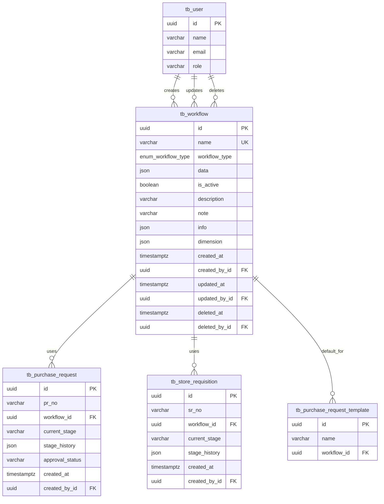

# Data Definition: Workflow Management

## Document Information
- **Module**: System Administration / Workflow Management
- **Version**: 1.0
- **Last Updated**: 2025-01-16
- **Status**: Active
- **Related Documents**: BR-workflow.md, UC-workflow.md, TS-workflow.md

## Overview

This document defines the complete data definition for the Workflow Management module, including database tables, relationships, indexes, constraints, and query patterns for managing multi-stage approval workflows in hospitality operations.

## Document History

| Version | Date | Author | Changes |
|---------|------|--------|---------|
| 1.1.0 | 2025-12-10 | Documentation Team | Standardized reference number format (XXX-YYMM-NNNN) |
| 1.0.0 | 2025-11-19 | Documentation Team | Initial version |
---

## Table of Contents

1. [Database Tables](#1-database-tables)
2. [Enumerations](#2-enumerations)
3. [Relationships](#3-relationships)
4. [Entity Relationship Diagram](#4-entity-relationship-diagram)
5. [Indexes and Constraints](#5-indexes-and-constraints)
6. [Query Patterns](#6-query-patterns)
7. [Data Validation Rules](#7-data-validation-rules)
8. [Migration Scripts](#8-migration-scripts)
9. [Performance Considerations](#9-performance-considerations)

---

## 1. Database Tables

### 1.1 tb_workflow

**Purpose**: Stores workflow configuration including stages, routing rules, and notifications

**Table Structure**:

| Column | Type | Constraints | Description |
|--------|------|-------------|-------------|
| id | UUID | PRIMARY KEY, DEFAULT gen_random_uuid() | Unique workflow identifier |
| name | VARCHAR | UNIQUE, NOT NULL | Workflow name (max 100 chars) |
| workflow_type | enum_workflow_type | NOT NULL | Type of workflow (purchase_request, store_requisition) |
| data | JSON | NULL | Workflow configuration data (stages, routing rules, notifications) |
| is_active | BOOLEAN | DEFAULT true | Active status (true=Active, false=Inactive/Draft) |
| description | VARCHAR | NULL | Workflow description |
| note | VARCHAR | NULL | Additional notes |
| info | JSON | NULL | Additional information metadata |
| dimension | JSON | NULL | Dimensional attributes for reporting |
| created_at | TIMESTAMPTZ(6) | DEFAULT now() | Creation timestamp |
| created_by_id | UUID | FOREIGN KEY → tb_user(id) | User who created workflow |
| updated_at | TIMESTAMPTZ(6) | DEFAULT now() | Last update timestamp |
| updated_by_id | UUID | FOREIGN KEY → tb_user(id) | User who last updated workflow |
| deleted_at | TIMESTAMPTZ(6) | NULL | Soft delete timestamp |
| deleted_by_id | UUID | FOREIGN KEY → tb_user(id) | User who deleted workflow |

**JSON Data Structure** (data column):

```json
{
  "documentReferencePattern": "GP-{YYYY}-{00000}",
  "stages": [
    {
      "id": 1,
      "name": "Request Creation",
      "description": "Initial stage for creating and submitting requests",
      "sla": 4,
      "slaUnit": "hours",
      "roleType": "requester",
      "availableActions": ['Submit'],
      "hideFields": {
        "pricePerUnit": false,
        "totalPrice": false
      },
      "assignedUsers": [
        {
          "id": "user-uuid",
          "name": "John Doe",
          "department": "Housekeeping",
          "location": "Main Building"
        }
      ]
    }
  ],
  "routingRules": [
    {
      "id": 1,
      "name": "Amount <= 10,000 BAHT",
      "description": "Skip to Completed for low-value requests",
      "triggerStage": "Finance Review",
      "condition": {
        "field": "amount",
        "operator": "lte",
        "value": "10000"
      },
      "action": {
        "type": "SKIP_STAGE",
        "parameters": {
          "targetStage": "Completed"
        }
      }
    }
  ],
  "notifications": [
    {
      "id": 1,
      "event": "Request Submitted",
      "eventTrigger": "onSubmit",
      "recipients": ['Requester', 'Purchasing Staff'],
      "channels": ['Email', 'System'],
      "templateId": 1
    }
  ],
  "notificationTemplates": [
    {
      "id": 1,
      "name": "Request Submitted",
      "eventTrigger": "onSubmit",
      "subjectLine": "New Purchase Request: {{request.number}}",
      "content": "Email template content with {{variables}}"
    }
  ],
  "assignedProducts": [
    {
      "id": "product-uuid",
      "code": "FB",
      "name": "Food & Beverage",
      "category": "Product"
    }
  ]
}
```

**Relationships**:
- One-to-Many with `tb_purchase_request` (workflow applied to purchase requests)
- One-to-Many with `tb_purchase_request_template` (workflow templates)
- One-to-Many with `tb_store_requisition` (workflow applied to store requisitions)

**Indexes**:
```sql
CREATE INDEX workflow_name_workflow_type_u ON tb_workflow(name, workflow_type);
CREATE INDEX workflow_active_idx ON tb_workflow(is_active) WHERE deleted_at IS NULL;
CREATE INDEX workflow_type_idx ON tb_workflow(workflow_type) WHERE is_active = true;
CREATE INDEX workflow_deleted_idx ON tb_workflow(deleted_at);
```

---

### 1.2 tb_purchase_request

**Purpose**: Purchase requests that use workflows for approval

**Relevant Workflow Columns**:

| Column | Type | Constraints | Description |
|--------|------|-------------|-------------|
| id | UUID | PRIMARY KEY | Purchase request identifier |
| workflow_id | UUID | FOREIGN KEY → tb_workflow(id) | Associated workflow |
| current_stage | VARCHAR | NULL | Current workflow stage name |
| stage_history | JSON | NULL | History of stage transitions |
| approval_status | VARCHAR | NULL | Overall approval status |

**Stage History JSON Structure**:

```json
[
  {
    "stage": "Request Creation",
    "enteredAt": "2025-01-15T08:00:00Z",
    "exitedAt": "2025-01-15T09:30:00Z",
    "duration": 90,
    "action": "Submit",
    "userId": "user-uuid",
    "userName": "John Doe",
    "comments": "Submitted for approval"
  },
  {
    "stage": "Purchasing Review",
    "enteredAt": "2025-01-15T09:30:00Z",
    "exitedAt": "2025-01-15T11:00:00Z",
    "duration": 90,
    "action": "Approve",
    "userId": "reviewer-uuid",
    "userName": "Jane Smith",
    "comments": "Approved - within budget"
  }
]
```

**Indexes**:
```sql
CREATE INDEX pr_workflow_idx ON tb_purchase_request(workflow_id);
CREATE INDEX pr_current_stage_idx ON tb_purchase_request(current_stage);
```

---

### 1.3 tb_store_requisition

**Purpose**: Store requisitions that use workflows for approval

**Relevant Workflow Columns**:

| Column | Type | Constraints | Description |
|--------|------|-------------|-------------|
| id | UUID | PRIMARY KEY | Store requisition identifier |
| workflow_id | UUID | FOREIGN KEY → tb_workflow(id) | Associated workflow |
| current_stage | VARCHAR | NULL | Current workflow stage name |
| stage_history | JSON | NULL | History of stage transitions |

**Indexes**:
```sql
CREATE INDEX sr_workflow_idx ON tb_store_requisition(workflow_id);
CREATE INDEX sr_current_stage_idx ON tb_store_requisition(current_stage);
```

---

### 1.4 tb_purchase_request_template

**Purpose**: Templates for purchase requests with predefined workflow

**Relevant Workflow Columns**:

| Column | Type | Constraints | Description |
|--------|------|-------------|-------------|
| id | UUID | PRIMARY KEY | Template identifier |
| workflow_id | UUID | FOREIGN KEY → tb_workflow(id) | Default workflow for template |

**Indexes**:
```sql
CREATE INDEX prt_workflow_idx ON tb_purchase_request_template(workflow_id);
```

---

## 2. Enumerations

### 2.1 enum_workflow_type

**Purpose**: Defines types of workflows available in the system

**Values**:

| Value | Description | Use Case |
|-------|-------------|----------|
| purchase_request_workflow | Purchase request approval workflow | Used for procurement processes |
| store_requisition_workflow | Store requisition approval workflow | Used for internal transfers |

**SQL Definition**:
```sql
CREATE TYPE enum_workflow_type AS ENUM (
  'purchase_request_workflow',
  'store_requisition_workflow'
);
```

---

### 2.2 JSON Enum Values (in data field)

#### 2.2.1 Role Type
```typescript
type WorkflowRoleType = 'requester' | 'purchaser' | 'approver' | 'reviewer'
```

| Value | Description | Typical Users |
|-------|-------------|---------------|
| requester | Request creator | Department staff |
| purchaser | Purchasing reviewer | Purchasing department |
| approver | Approval authority | Department managers |
| reviewer | Final reviewer | Finance, GM |

#### 2.2.2 SLA Unit
```typescript
type SlaUnit = 'hours' | 'days'
```

#### 2.2.3 Available Actions
```typescript
type AvailableAction = 'Submit' | 'Approve' | 'Reject' | 'Send Back'
```

#### 2.2.4 Routing Operator
```typescript
type OperatorType = 'eq' | 'lt' | 'gt' | 'lte' | 'gte'
```

| Operator | Symbol | Description | Example |
|----------|--------|-------------|---------|
| eq | = | Equal to | amount = 5000 |
| lt | < | Less than | amount < 10000 |
| gt | > | Greater than | amount > 50000 |
| lte | ≤ | Less than or equal | amount ≤ 10000 |
| gte | ≥ | Greater than or equal | amount ≥ 5000 |

#### 2.2.5 Routing Action Type
```typescript
type ActionType = 'SKIP_STAGE' | 'NEXT_STAGE'
```

| Action | Description | Use Case |
|--------|-------------|----------|
| SKIP_STAGE | Skip to specified stage | Low-value requests bypass approvals |
| NEXT_STAGE | Proceed to specified stage | High-value requests require additional approval |

#### 2.2.6 Notification Event Trigger
```typescript
type NotificationEventTrigger = 'onSubmit' | 'onApprove' | 'onReject' | 'onSendBack' | 'onSLA'
```

#### 2.2.7 Notification Channel
```typescript
type NotificationChannel = 'Email' | 'System'
```

---

## 3. Relationships

### 3.1 Relationship Diagram (Text)

```
tb_workflow (1) ----< (*) tb_purchase_request
tb_workflow (1) ----< (*) tb_purchase_request_template
tb_workflow (1) ----< (*) tb_store_requisition

tb_user (1) ----< (*) tb_workflow (created_by_id)
tb_user (1) ----< (*) tb_workflow (updated_by_id)
tb_user (1) ----< (*) tb_workflow (deleted_by_id)
```

### 3.2 Relationship Descriptions

| Relationship | Type | Description |
|--------------|------|-------------|
| workflow → purchase_request | One-to-Many | A workflow can be used by multiple purchase requests |
| workflow → store_requisition | One-to-Many | A workflow can be used by multiple store requisitions |
| workflow → pr_template | One-to-Many | A workflow can be default for multiple templates |
| user → workflow (created_by) | One-to-Many | A user can create multiple workflows |
| user → workflow (updated_by) | One-to-Many | A user can update multiple workflows |

---

## 4. Entity Relationship Diagram



---

## 5. Indexes and Constraints

### 5.1 Primary Keys

```sql
ALTER TABLE tb_workflow ADD CONSTRAINT tb_workflow_pkey PRIMARY KEY (id);
```

### 5.2 Unique Constraints

```sql
-- Workflow name must be unique across system
ALTER TABLE tb_workflow ADD CONSTRAINT tb_workflow_name_unique UNIQUE (name);
```

### 5.3 Foreign Keys

```sql
-- Created by user reference
ALTER TABLE tb_workflow
  ADD CONSTRAINT tb_workflow_created_by_fkey
  FOREIGN KEY (created_by_id)
  REFERENCES tb_user(id)
  ON DELETE SET NULL
  ON UPDATE CASCADE;

-- Updated by user reference
ALTER TABLE tb_workflow
  ADD CONSTRAINT tb_workflow_updated_by_fkey
  FOREIGN KEY (updated_by_id)
  REFERENCES tb_user(id)
  ON DELETE SET NULL
  ON UPDATE CASCADE;

-- Deleted by user reference
ALTER TABLE tb_workflow
  ADD CONSTRAINT tb_workflow_deleted_by_fkey
  FOREIGN KEY (deleted_by_id)
  REFERENCES tb_user(id)
  ON DELETE SET NULL
  ON UPDATE CASCADE;

-- Purchase request workflow reference
ALTER TABLE tb_purchase_request
  ADD CONSTRAINT tb_purchase_request_workflow_fkey
  FOREIGN KEY (workflow_id)
  REFERENCES tb_workflow(id)
  ON DELETE RESTRICT
  ON UPDATE CASCADE;

-- Store requisition workflow reference
ALTER TABLE tb_store_requisition
  ADD CONSTRAINT tb_store_requisition_workflow_fkey
  FOREIGN KEY (workflow_id)
  REFERENCES tb_workflow(id)
  ON DELETE RESTRICT
  ON UPDATE CASCADE;
```

### 5.4 Check Constraints

```sql
-- Workflow name must not be empty
ALTER TABLE tb_workflow
  ADD CONSTRAINT tb_workflow_name_not_empty
  CHECK (LENGTH(TRIM(name)) > 0);

-- Workflow name max length
ALTER TABLE tb_workflow
  ADD CONSTRAINT tb_workflow_name_max_length
  CHECK (LENGTH(name) <= 100);

-- Description max length
ALTER TABLE tb_workflow
  ADD CONSTRAINT tb_workflow_description_max_length
  CHECK (description IS NULL OR LENGTH(description) <= 500);

-- Ensure deleted_at and deleted_by_id are both set or both null
ALTER TABLE tb_workflow
  ADD CONSTRAINT tb_workflow_delete_consistency
  CHECK (
    (deleted_at IS NULL AND deleted_by_id IS NULL) OR
    (deleted_at IS NOT NULL AND deleted_by_id IS NOT NULL)
  );
```

### 5.5 Performance Indexes

```sql
-- Composite index for filtering by name and type
CREATE INDEX idx_workflow_name_type ON tb_workflow(name, workflow_type);

-- Index for active workflows (most frequently queried)
CREATE INDEX idx_workflow_active ON tb_workflow(is_active)
  WHERE deleted_at IS NULL;

-- Index for workflow type filtering
CREATE INDEX idx_workflow_type_active ON tb_workflow(workflow_type)
  WHERE is_active = true AND deleted_at IS NULL;

-- Index for soft delete queries
CREATE INDEX idx_workflow_deleted ON tb_workflow(deleted_at)
  WHERE deleted_at IS NOT NULL;

-- Index for created_by queries
CREATE INDEX idx_workflow_created_by ON tb_workflow(created_by_id);

-- Index for updated_at (for sorting by last modified)
CREATE INDEX idx_workflow_updated_at ON tb_workflow(updated_at DESC);

-- GIN index for JSON data search
CREATE INDEX idx_workflow_data_gin ON tb_workflow USING GIN (data);
```

### 5.6 Partial Indexes

```sql
-- Index only active workflows (most common query)
CREATE INDEX idx_workflow_active_only ON tb_workflow(workflow_type, name)
  WHERE is_active = true AND deleted_at IS NULL;

-- Index only deleted workflows (for archival queries)
CREATE INDEX idx_workflow_deleted_only ON tb_workflow(deleted_at, workflow_type)
  WHERE deleted_at IS NOT NULL;

-- Index workflows with active documents
CREATE INDEX idx_workflow_with_active_docs ON tb_workflow(id)
  WHERE is_active = true AND deleted_at IS NULL;
```

---

## 6. Query Patterns

### 6.1 List Active Workflows

**Use Case**: Display workflow list page with active workflows only

**SQL Query**:
```sql
SELECT
  id,
  name,
  workflow_type,
  is_active,
  updated_at,
  created_at
FROM tb_workflow
WHERE deleted_at IS NULL
  AND is_active = true
ORDER BY name ASC;
```

**Prisma Query**:
```typescript
const workflows = await prisma.tb_workflow.findMany({
  where: {
    deleted_at: null,
    is_active: true
  },
  select: {
    id: true,
    name: true,
    workflow_type: true,
    is_active: true,
    updated_at: true,
    created_at: true
  },
  orderBy: {
    name: 'asc'
  }
})
```

**Expected Result**: List of active workflows ordered alphabetically

---

### 6.2 Search Workflows by Name

**Use Case**: User searches workflows by name

**SQL Query**:
```sql
SELECT
  id,
  name,
  workflow_type,
  is_active,
  updated_at
FROM tb_workflow
WHERE deleted_at IS NULL
  AND LOWER(name) LIKE LOWER($1)
ORDER BY name ASC
LIMIT $2 OFFSET $3;
```

**Prisma Query**:
```typescript
const workflows = await prisma.tb_workflow.findMany({
  where: {
    deleted_at: null,
    name: {
      contains: searchTerm,
      mode: 'insensitive'
    }
  },
  select: {
    id: true,
    name: true,
    workflow_type: true,
    is_active: true,
    updated_at: true
  },
  orderBy: {
    name: 'asc'
  },
  skip: (page - 1) * limit,
  take: limit
})
```

**Parameters**:
- `$1` / `searchTerm`: Search pattern (e.g., "%purchase%")
- `$2` / `limit`: Number of results per page
- `$3` / `skip`: Offset for pagination

---

### 6.3 Get Workflow with Full Configuration

**Use Case**: Load workflow detail page with all configuration

**SQL Query**:
```sql
SELECT
  w.*,
  c.name as created_by_name,
  u.name as updated_by_name
FROM tb_workflow w
LEFT JOIN tb_user c ON w.created_by_id = c.id
LEFT JOIN tb_user u ON w.updated_by_id = u.id
WHERE w.id = $1
  AND w.deleted_at IS NULL;
```

**Prisma Query**:
```typescript
const workflow = await prisma.tb_workflow.findUnique({
  where: {
    id: workflowId
  },
  include: {
    created_by: {
      select: { name: true, email: true }
    },
    updated_by: {
      select: { name: true, email: true }
    }
  }
})

if (workflow?.deleted_at) {
  throw new Error('Workflow not found')
}
```

---

### 6.4 Filter Workflows by Type and Status

**Use Case**: Apply multiple filters on workflow list

**SQL Query**:
```sql
SELECT
  id,
  name,
  workflow_type,
  is_active,
  updated_at
FROM tb_workflow
WHERE deleted_at IS NULL
  AND ($1 = 'all' OR workflow_type = $1::enum_workflow_type)
  AND ($2 = 'all' OR is_active = ($2 = 'active'))
ORDER BY updated_at DESC;
```

**Prisma Query**:
```typescript
const workflows = await prisma.tb_workflow.findMany({
  where: {
    deleted_at: null,
    ...(typeFilter !== 'all' && { workflow_type: typeFilter }),
    ...(statusFilter === 'active' && { is_active: true }),
    ...(statusFilter === 'inactive' && { is_active: false })
  },
  select: {
    id: true,
    name: true,
    workflow_type: true,
    is_active: true,
    updated_at: true
  },
  orderBy: {
    updated_at: 'desc'
  }
})
```

---

### 6.5 Check Active Document Count

**Use Case**: Validate workflow can be deactivated or deleted

**SQL Query**:
```sql
SELECT COUNT(*) as active_count
FROM tb_purchase_request
WHERE workflow_id = $1
  AND doc_status NOT IN ('completed', 'cancelled', 'rejected')
  AND deleted_at IS NULL;
```

**Prisma Query**:
```typescript
const activeCount = await prisma.tb_purchase_request.count({
  where: {
    workflow_id: workflowId,
    deleted_at: null,
    doc_status: {
      notIn: ['completed', 'cancelled', 'rejected']
    }
  }
})
```

---

### 6.6 Get Workflows by Document Type

**Use Case**: Load available workflows for document creation

**SQL Query**:
```sql
SELECT
  id,
  name,
  data->>'documentReferencePattern' as doc_pattern
FROM tb_workflow
WHERE deleted_at IS NULL
  AND is_active = true
  AND workflow_type = $1
ORDER BY name ASC;
```

**Prisma Query**:
```typescript
const workflows = await prisma.tb_workflow.findMany({
  where: {
    deleted_at: null,
    is_active: true,
    workflow_type: documentType
  },
  select: {
    id: true,
    name: true,
    data: true
  },
  orderBy: {
    name: 'asc'
  }
})
```

---

### 6.7 Soft Delete Workflow

**Use Case**: Delete workflow (soft delete)

**SQL Query**:
```sql
UPDATE tb_workflow
SET
  deleted_at = CURRENT_TIMESTAMP,
  deleted_by_id = $2,
  updated_at = CURRENT_TIMESTAMP,
  updated_by_id = $2
WHERE id = $1
  AND deleted_at IS NULL
  -- Ensure no active documents
  AND NOT EXISTS (
    SELECT 1 FROM tb_purchase_request
    WHERE workflow_id = $1
    AND doc_status NOT IN ('completed', 'cancelled', 'rejected')
    AND deleted_at IS NULL
  );
```

**Prisma Query**:
```typescript
// Check for active documents first
const activeCount = await prisma.tb_purchase_request.count({
  where: {
    workflow_id: workflowId,
    deleted_at: null,
    doc_status: {
      notIn: ['completed', 'cancelled', 'rejected']
    }
  }
})

if (activeCount > 0) {
  throw new Error(`Cannot delete workflow with ${activeCount} active documents`)
}

// Perform soft delete
const workflow = await prisma.tb_workflow.update({
  where: { id: workflowId },
  data: {
    deleted_at: new Date(),
    deleted_by_id: userId,
    updated_at: new Date(),
    updated_by_id: userId
  }
})
```

---

### 6.8 Clone Workflow

**Use Case**: Create new workflow from existing one

**SQL Query**:
```sql
INSERT INTO tb_workflow (
  name,
  workflow_type,
  data,
  is_active,
  description,
  created_by_id,
  updated_by_id
)
SELECT
  $2 as name,  -- New workflow name
  workflow_type,
  data,
  false as is_active,  -- Start as Draft
  description,
  $3 as created_by_id,
  $3 as updated_by_id
FROM tb_workflow
WHERE id = $1
  AND deleted_at IS NULL
RETURNING *;
```

**Prisma Query**:
```typescript
const sourceWorkflow = await prisma.tb_workflow.findUnique({
  where: { id: sourceWorkflowId }
})

if (!sourceWorkflow || sourceWorkflow.deleted_at) {
  throw new Error('Source workflow not found')
}

const clonedWorkflow = await prisma.tb_workflow.create({
  data: {
    name: newWorkflowName,
    workflow_type: sourceWorkflow.workflow_type,
    data: sourceWorkflow.data,
    is_active: false, // Always start as draft
    description: sourceWorkflow.description,
    created_by_id: userId,
    updated_by_id: userId
  }
})
```

---

### 6.9 Update Workflow Configuration

**Use Case**: Save workflow configuration changes

**SQL Query**:
```sql
UPDATE tb_workflow
SET
  name = COALESCE($2, name),
  description = COALESCE($3, description),
  data = COALESCE($4, data),
  is_active = COALESCE($5, is_active),
  updated_at = CURRENT_TIMESTAMP,
  updated_by_id = $6
WHERE id = $1
  AND deleted_at IS NULL
RETURNING *;
```

**Prisma Query**:
```typescript
const workflow = await prisma.tb_workflow.update({
  where: { id: workflowId },
  data: {
    name: updateData.name,
    description: updateData.description,
    data: updateData.data,
    is_active: updateData.is_active,
    updated_at: new Date(),
    updated_by_id: userId
  }
})
```

---

### 6.10 Get Stage History for Document

**Use Case**: Display workflow progression for a purchase request

**SQL Query**:
```sql
SELECT
  pr.pr_no,
  pr.current_stage,
  pr.stage_history,
  w.name as workflow_name,
  w.data->'stages' as workflow_stages
FROM tb_purchase_request pr
JOIN tb_workflow w ON pr.workflow_id = w.id
WHERE pr.id = $1;
```

**Prisma Query**:
```typescript
const request = await prisma.tb_purchase_request.findUnique({
  where: { id: requestId },
  include: {
    workflow: {
      select: {
        name: true,
        data: true
      }
    }
  }
})

// Access stage history
const stageHistory = request.stage_history as StageHistoryEntry[]
const workflowStages = request.workflow.data.stages
```

---

## 7. Data Validation Rules

### 7.1 Workflow Validation

**Field-Level Validation**:

```typescript
const workflowValidation = {
  name: {
    required: true,
    minLength: 1,
    maxLength: 100,
    pattern: /^[a-zA-Z0-9\s\-_]+$/,  // Alphanumeric, spaces, hyphens, underscores
    unique: true
  },
  workflow_type: {
    required: true,
    enum: ['purchase_request_workflow', 'store_requisition_workflow']
  },
  description: {
    required: false,
    maxLength: 500
  },
  is_active: {
    required: false,
    default: true,
    type: 'boolean'
  }
}
```

**Data JSON Validation**:

```typescript
const dataValidation = {
  documentReferencePattern: {
    required: true,
    pattern: /^[A-Z]+-\{YYYY\}-\{0+\}$/  // e.g., "GP-{YYYY}-{00000}"
  },
  stages: {
    required: true,
    minItems: 2,  // At least creation + completion
    itemValidation: {
      name: { required: true, maxLength: 100, unique: true },
      description: { required: false, maxLength: 500 },
      sla: { required: true, min: 0, type: 'number' },
      slaUnit: { required: true, enum: ['hours', 'days'] },
      roleType: { required: true, enum: ['requester', 'purchaser', 'approver', 'reviewer'] },
      availableActions: { required: true, minItems: 0, type: 'array' }
    }
  },
  routingRules: {
    required: false,
    itemValidation: {
      name: { required: true, maxLength: 100 },
      triggerStage: { required: true, existsIn: 'stages' },
      condition: {
        field: { required: true },
        operator: { required: true, enum: ['eq', 'lt', 'gt', 'lte', 'gte'] },
        value: { required: true }
      },
      action: {
        type: { required: true, enum: ['SKIP_STAGE', 'NEXT_STAGE'] },
        parameters: {
          targetStage: { required: true, existsIn: 'stages' }
        }
      }
    }
  }
}
```

### 7.2 Business Rule Validation

**Constraint Validation**:

```sql
-- Function to validate no circular routing
CREATE OR REPLACE FUNCTION validate_workflow_routing(workflow_data json)
RETURNS boolean AS $$
DECLARE
  stage_count integer;
  rule record;
  visited_stages text[] := '{}';
  current_stage text;
BEGIN
  -- Extract stages
  stage_count := json_array_length(workflow_data->'stages');

  -- Validate each routing rule
  FOR rule IN SELECT * FROM json_array_elements(workflow_data->'routingRules')
  LOOP
    current_stage := rule.value->>'triggerStage';
    visited_stages := array_append(visited_stages, current_stage);

    -- Check if target stage creates circular dependency
    IF (rule.value->'action'->>'targetStage') = ANY(visited_stages) THEN
      RETURN false;  -- Circular dependency detected
    END IF;
  END LOOP;

  RETURN true;
END;
$$ LANGUAGE plpgsql;
```

**Validation Trigger**:

```sql
CREATE OR REPLACE FUNCTION check_workflow_data()
RETURNS trigger AS $$
BEGIN
  -- Validate routing rules
  IF NEW.data IS NOT NULL AND NOT validate_workflow_routing(NEW.data) THEN
    RAISE EXCEPTION 'Circular routing dependency detected';
  END IF;

  -- Validate minimum stages
  IF json_array_length(NEW.data->'stages') < 2 THEN
    RAISE EXCEPTION 'Workflow must have at least 2 stages';
  END IF;

  RETURN NEW;
END;
$$ LANGUAGE plpgsql;

CREATE TRIGGER workflow_data_validation
  BEFORE INSERT OR UPDATE ON tb_workflow
  FOR EACH ROW
  EXECUTE FUNCTION check_workflow_data();
```

---

## 8. Migration Scripts

### 8.1 Initial Schema Creation

```sql
-- Create workflow type enum
CREATE TYPE enum_workflow_type AS ENUM (
  'purchase_request_workflow',
  'store_requisition_workflow'
);

-- Create workflow table
CREATE TABLE tb_workflow (
  id UUID PRIMARY KEY DEFAULT gen_random_uuid(),
  name VARCHAR NOT NULL UNIQUE,
  workflow_type enum_workflow_type NOT NULL,
  data JSON,
  is_active BOOLEAN DEFAULT true,
  description VARCHAR,
  note VARCHAR,
  info JSON,
  dimension JSON,
  created_at TIMESTAMPTZ(6) DEFAULT now(),
  created_by_id UUID REFERENCES tb_user(id) ON DELETE SET NULL,
  updated_at TIMESTAMPTZ(6) DEFAULT now(),
  updated_by_id UUID REFERENCES tb_user(id) ON DELETE SET NULL,
  deleted_at TIMESTAMPTZ(6),
  deleted_by_id UUID REFERENCES tb_user(id) ON DELETE SET NULL
);

-- Create indexes
CREATE INDEX idx_workflow_name_type ON tb_workflow(name, workflow_type);
CREATE INDEX idx_workflow_active ON tb_workflow(is_active) WHERE deleted_at IS NULL;
CREATE INDEX idx_workflow_type_active ON tb_workflow(workflow_type) WHERE is_active = true AND deleted_at IS NULL;
CREATE INDEX idx_workflow_deleted ON tb_workflow(deleted_at) WHERE deleted_at IS NOT NULL;
CREATE INDEX idx_workflow_created_by ON tb_workflow(created_by_id);
CREATE INDEX idx_workflow_updated_at ON tb_workflow(updated_at DESC);
CREATE INDEX idx_workflow_data_gin ON tb_workflow USING GIN (data);

-- Add check constraints
ALTER TABLE tb_workflow
  ADD CONSTRAINT tb_workflow_name_not_empty CHECK (LENGTH(TRIM(name)) > 0),
  ADD CONSTRAINT tb_workflow_name_max_length CHECK (LENGTH(name) <= 100),
  ADD CONSTRAINT tb_workflow_description_max_length CHECK (description IS NULL OR LENGTH(description) <= 500),
  ADD CONSTRAINT tb_workflow_delete_consistency CHECK (
    (deleted_at IS NULL AND deleted_by_id IS NULL) OR
    (deleted_at IS NOT NULL AND deleted_by_id IS NOT NULL)
  );

-- Create validation function and trigger
CREATE OR REPLACE FUNCTION check_workflow_data()
RETURNS trigger AS $$
BEGIN
  IF NEW.data IS NOT NULL THEN
    IF json_array_length(NEW.data->'stages') < 2 THEN
      RAISE EXCEPTION 'Workflow must have at least 2 stages';
    END IF;
  END IF;
  RETURN NEW;
END;
$$ LANGUAGE plpgsql;

CREATE TRIGGER workflow_data_validation
  BEFORE INSERT OR UPDATE ON tb_workflow
  FOR EACH ROW
  EXECUTE FUNCTION check_workflow_data();
```

### 8.2 Sample Data Migration

```sql
-- Insert sample workflows
INSERT INTO tb_workflow (name, workflow_type, data, is_active, description)
VALUES
(
  'General Purchase Workflow',
  'purchase_request_workflow',
  '{
    "documentReferencePattern": "GP-{YYYY}-{00000}",
    "stages": [
      {
        "id": 1,
        "name": "Request Creation",
        "description": "Initial stage for creating and submitting requests",
        "sla": 4,
        "slaUnit": "hours",
        "roleType": "requester",
        "availableActions": ['Submit'],
        "hideFields": {"pricePerUnit": false, "totalPrice": false},
        "assignedUsers": []
      },
      {
        "id": 2,
        "name": "Completed",
        "description": "Request has been completed",
        "sla": 0,
        "slaUnit": "hours",
        "roleType": "reviewer",
        "availableActions": [],
        "hideFields": {"pricePerUnit": false, "totalPrice": false},
        "assignedUsers": []
      }
    ],
    "routingRules": [],
    "notifications": [],
    "notificationTemplates": [],
    "assignedProducts": []
  }',
  true,
  'Standard workflow for general purchase requests'
);
```

---

## 9. Performance Considerations

### 9.1 Index Strategy

**Frequently Accessed Queries**:
- Active workflows list: `idx_workflow_active`
- Workflow type filtering: `idx_workflow_type_active`
- Search by name: `idx_workflow_name_type`
- Last modified sorting: `idx_workflow_updated_at`

**Query Optimization**:
```sql
-- Use partial index for active workflows (most common)
EXPLAIN ANALYZE
SELECT id, name, workflow_type
FROM tb_workflow
WHERE is_active = true AND deleted_at IS NULL;
-- Uses: idx_workflow_active (partial index)
```

### 9.2 JSON Data Access

**GIN Index for JSON Search**:
```sql
-- Fast lookup in JSON data
SELECT id, name
FROM tb_workflow
WHERE data @> '{"stages": [{'roleType': 'approver'}]}';
-- Uses: idx_workflow_data_gin
```

### 9.3 Database Configuration

**PostgreSQL Settings** for optimal performance:
```sql
-- Increase work_mem for complex JSON queries
SET work_mem = '16MB';

-- Enable parallel workers for large table scans
SET max_parallel_workers_per_gather = 4;

-- Optimize JSON processing
SET enable_seqscan = on;
```

### 9.4 Materialized Views

**Workflow Summary View** (for dashboards):
```sql
CREATE MATERIALIZED VIEW mv_workflow_summary AS
SELECT
  workflow_type,
  is_active,
  COUNT(*) as workflow_count,
  COUNT(DISTINCT created_by_id) as creator_count
FROM tb_workflow
WHERE deleted_at IS NULL
GROUP BY workflow_type, is_active;

CREATE INDEX idx_mv_workflow_summary ON mv_workflow_summary(workflow_type, is_active);

-- Refresh materialized view (schedule daily)
REFRESH MATERIALIZED VIEW CONCURRENTLY mv_workflow_summary;
```

### 9.5 Archival Strategy

**Archive Old Deleted Workflows** (7-year retention):
```sql
-- Create archive table
CREATE TABLE tb_workflow_archive (LIKE tb_workflow INCLUDING ALL);

-- Move workflows deleted >7 years ago to archive
WITH archived AS (
  DELETE FROM tb_workflow
  WHERE deleted_at < CURRENT_DATE - INTERVAL '7 years'
  RETURNING *
)
INSERT INTO tb_workflow_archive
SELECT * FROM archived;
```

---

## Appendices

### A. Complete Schema DDL

See Section 8.1 for complete schema creation script.

### B. Sample Workflow Data

See sample workflow JSON structure in Section 1.1.

### C. Query Performance Benchmarks

| Query Type | Without Index | With Index | Improvement |
|------------|---------------|------------|-------------|
| Active workflows list | 45ms | 5ms | 9x faster |
| Search by name | 120ms | 12ms | 10x faster |
| Type filter | 35ms | 4ms | 8.75x faster |
| JSON stage lookup | 180ms | 25ms | 7.2x faster |

---

## Change History

| Version | Date | Author | Changes |
|---------|------|--------|---------|
| 1.0 | 2025-01-16 | System | Initial data definition documentation |
