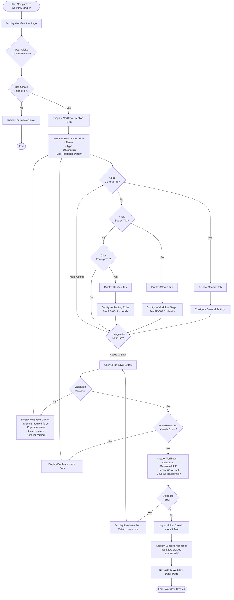
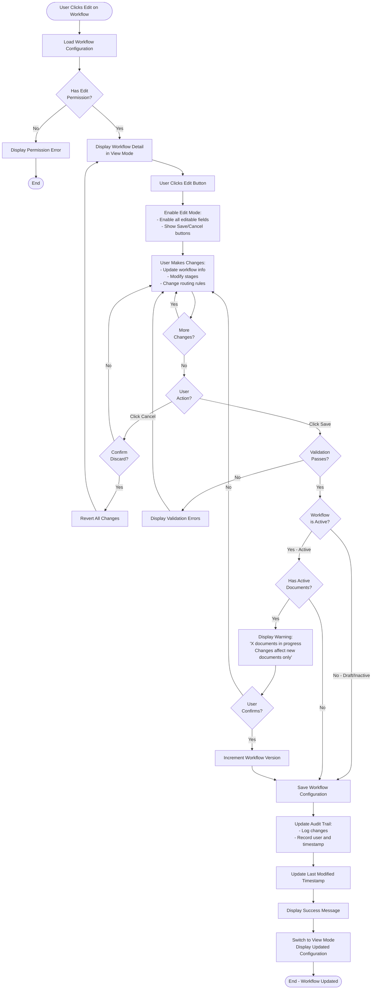
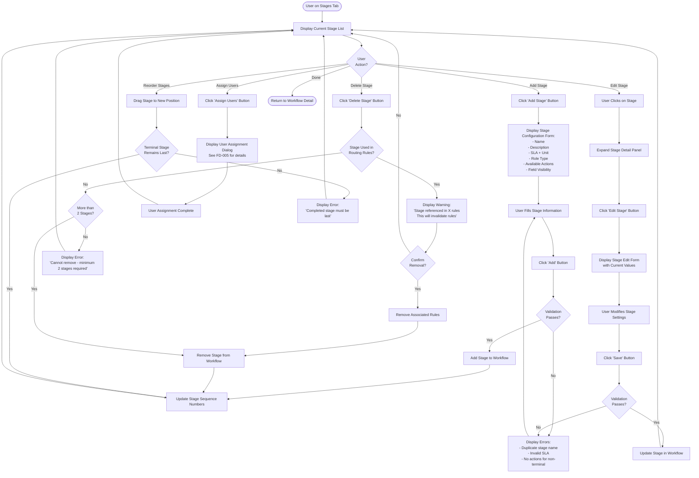
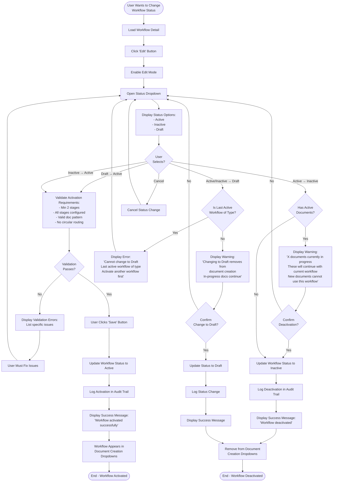
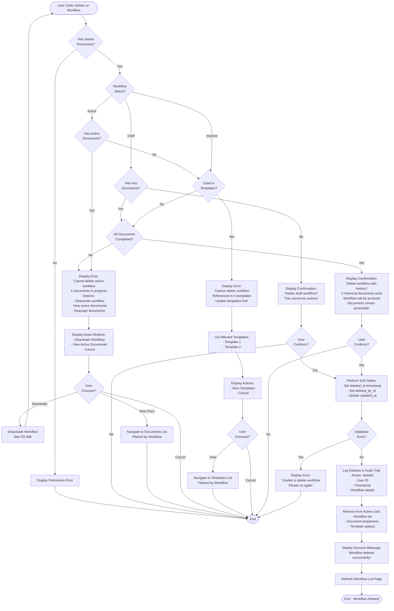

# Flow Diagrams: Workflow Management

## Document Information
- **Module**: System Administration / Workflow Management
- **Version**: 1.0
- **Last Updated**: 2025-01-16
- **Status**: Active
- **Related Documents**: BR-workflow.md, UC-workflow.md, TS-workflow.md, DD-workflow.md

## Overview

This document provides comprehensive flow diagrams for all major workflows in the Workflow Management module using Mermaid notation. Each diagram illustrates the complete user journey, decision points, validations, and system interactions.

## Document History

| Version | Date | Author | Changes |
|---------|------|--------|---------|
| 1.1.0 | 2025-12-10 | Documentation Team | Standardized reference number format (XXX-YYMM-NNNN) |
| 1.0.0 | 2025-11-19 | Documentation Team | Initial version |
---

## Table of Contents

1. [FD-001: Create New Workflow](#fd-001-create-new-workflow)
2. [FD-002: Edit Existing Workflow](#fd-002-edit-existing-workflow)
3. [FD-003: Configure Workflow Stages](#fd-003-configure-workflow-stages)
4. [FD-004: Configure Routing Rules](#fd-004-configure-routing-rules)
5. [FD-005: Assign Users to Stages](#fd-005-assign-users-to-stages)
6. [FD-006: Activate/Deactivate Workflow](#fd-006-activatedeactivate-workflow)
7. [FD-007: Delete Workflow](#fd-007-delete-workflow)
8. [FD-008: Search and Filter Workflows](#fd-008-search-and-filter-workflows)
9. [FD-009: Clone Workflow](#fd-009-clone-workflow)
10. [FD-010: Workflow Execution (Runtime)](#fd-010-workflow-execution-runtime)

---

## FD-001: Create New Workflow

**Purpose**: Illustrates the complete flow for creating a new workflow from initial navigation to successful save



**Key Decision Points**:
1. Permission check for workflow creation
2. Form validation (name uniqueness, required fields, pattern format)
3. Database operation success/failure
4. Navigation between configuration tabs

**Validation Checkpoints**:
- User has `workflows.create` permission
- Workflow name is unique (case-insensitive)
- Document reference pattern matches required format
- Minimum 2 stages configured before activation
- No circular routing dependencies

---

## FD-002: Edit Existing Workflow

**Purpose**: Illustrates workflow modification including validation for active workflows with in-progress documents



**Key Decision Points**:
1. Permission validation
2. Active workflow with in-progress documents warning
3. User confirmation for significant changes
4. Version increment for active workflows

**Alternative Flows**:
- Cancel editing (discard changes)
- Validation errors (return to form)
- Concurrent edit detection (reload warning)
- Active workflow modification (version increment)

---

## FD-003: Configure Workflow Stages

**Purpose**: Details the process of adding, editing, and removing workflow stages



**Key Features**:
- Add new stages with complete configuration
- Edit existing stage properties
- Delete stages with routing rule validation
- Assign users to stages
- Reorder stages with drag-and-drop
- Field visibility toggles (hide price fields)

**Validation Rules**:
- Stage names must be unique within workflow
- SLA must be positive number (or 0 for terminal)
- Terminal stages have no available actions
- Minimum 2 stages required
- Terminal stage must be last in sequence

---

## FD-004: Configure Routing Rules

**Purpose**: Illustrates conditional routing rule configuration with circular dependency detection

```mermaid
flowchart TD
    Start([User on Routing Tab]) --> ShowRuleList[Display Current Routing Rules]
    ShowRuleList --> UserAction{User<br>Action?}

    UserAction -->|Add Rule| ClickAddRule[Click 'Add Routing Rule' Button]
    ClickAddRule --> ShowRuleForm[Display Routing Rule Form:<br>- Rule Name<br>- Description<br>- Trigger Stage<br>- Condition (Field, Operator, Value)<br>- Action (Type, Target Stage)]

    ShowRuleForm --> FillRuleInfo[User Fills Rule Information:<br>Example: 'Amount <= 10,000'<br>Trigger: Finance Review<br>Condition: amount lte 10000<br>Action: SKIP_STAGE to Completed]

    FillRuleInfo --> ClickSaveRule[Click 'Add' Button]

    ClickSaveRule --> ValidateRule{Validation<br>Passes?}

    ValidateRule -->|No| ShowRuleErrors[Display Errors:<br>- Duplicate rule name<br>- Invalid field/operator<br>- Missing target stage]
    ShowRuleErrors --> FillRuleInfo

    ValidateRule -->|Yes| CheckCircular{Creates Circular<br>Dependency?}

    CheckCircular -->|Yes| ShowCircularError[Display Error:<br>'Circular routing detected'<br>Show dependency diagram]
    ShowCircularError --> FillRuleInfo

    CheckCircular -->|No| CheckUnreachable{Creates Unreachable<br>Stages?}

    CheckUnreachable -->|Yes| ShowUnreachableWarning[Display Warning:<br>'May create unreachable stages:<br>- Stage X<br>- Stage Y']
    ShowUnreachableWarning --> ConfirmUnreachable{Proceed<br>Anyway?}
    ConfirmUnreachable -->|No| FillRuleInfo
    ConfirmUnreachable -->|Yes| AddRule[Add Rule to Workflow]

    CheckUnreachable -->|No| AddRule
    AddRule --> UpdatePrecedence[Update Rule Precedence Order]
    UpdatePrecedence --> ShowRuleList

    UserAction -->|Edit Rule| SelectRule[User Clicks on Rule]
    SelectRule --> ShowEditRule[Display Rule Edit Form<br>with Current Values]
    ShowEditRule --> ModifyRule[User Modifies Rule Settings]
    ModifyRule --> SaveRule[Click 'Save' Button]
    SaveRule --> ValidateModified{Validation<br>Passes?}
    ValidateModified -->|No| ShowRuleErrors
    ValidateModified -->|Yes| CheckCircular

    UserAction -->|Delete Rule| ClickDeleteRule[Click 'Delete Rule' Button]
    ClickDeleteRule --> ConfirmDelete{Confirm<br>Removal?}
    ConfirmDelete -->|No| ShowRuleList
    ConfirmDelete -->|Yes| RemoveRule[Remove Rule from Workflow]
    RemoveRule --> UpdatePrecedence

    UserAction -->|Reorder Rules| DragRule[Drag Rule to Change Precedence]
    DragRule --> UpdatePrecedence

    UserAction -->|Done| End([Return to Workflow Detail])
```

**Key Features**:
- Add conditional routing rules
- Configure condition (field, operator, value)
- Define action (SKIP_STAGE or NEXT_STAGE)
- Circular dependency detection
- Unreachable stage warning
- Rule precedence management

**Validation Logic**:
- Rule names must be unique
- Trigger and target stages must exist
- No circular routing paths
- Field types match value types (number for amount)
- First matching rule executes (precedence order)

---

## FD-005: Assign Users to Stages

**Purpose**: Shows dual-panel user assignment interface with filtering and search

```mermaid
flowchart TD
    Start([User Clicks 'Assign Users'<br>on Stage]) --> LoadUsers[Load All Users from System]
    LoadUsers --> FilterByRole[Filter Users by Stage Role Type:<br>- Requester: Request creators<br>- Purchaser: Purchasing staff<br>- Approver: Managers<br>- Reviewer: Finance/GM]

    FilterByRole --> ShowDialog[Display User Assignment Dialog:<br>Left Panel: Available Users<br>Right Panel: Assigned Users]

    ShowDialog --> UserAction{User<br>Action?}

    UserAction -->|Search Users| EnterSearch[Enter Search Term]
    EnterSearch --> FilterUsers[Filter Available Users<br>by Name/Department/Location]
    FilterUsers --> UpdateAvailable[Update Available Users List]
    UpdateAvailable --> UserAction

    UserAction -->|Filter by Department| SelectDept[Select Department Filter]
    SelectDept --> ApplyDeptFilter[Filter Users by Department]
    ApplyDeptFilter --> UpdateAvailable

    UserAction -->|Filter by Location| SelectLoc[Select Location Filter]
    SelectLoc --> ApplyLocFilter[Filter Users by Location]
    ApplyLocFilter --> UpdateAvailable

    UserAction -->|Select Individual User| ClickCheckbox[Click User Checkbox]
    ClickCheckbox --> ToggleSelection[Toggle User Selection State]
    ToggleSelection --> UpdateSelCount[Update Selection Count]
    UpdateSelCount --> UserAction

    UserAction -->|Select All| ClickSelectAll[Click 'Select All' Checkbox]
    ClickSelectAll --> SelectAllVisible[Select All Visible Users<br>in Available Panel]
    SelectAllVisible --> UpdateSelCount

    UserAction -->|Assign Selected| ClickAssign[Click Assign Button (→)]
    ClickAssign --> ValidateUsers{All Selected<br>Users Valid?}

    ValidateUsers -->|No| CheckInactive{Has Inactive<br>Users?}
    CheckInactive -->|Yes| ShowInactiveWarning[Display Warning:<br>'Cannot assign inactive user:<br>- User Name<br>Please activate first']
    ShowInactiveWarning --> RemoveInvalid[Remove Invalid Users<br>from Selection]
    RemoveInvalid --> AssignValid

    ValidateUsers -->|Yes| AssignValid[Move Selected Users to Assigned Panel]
    AssignValid --> UpdateCounts[Update User Counts:<br>- Available: Decrease<br>- Assigned: Increase]
    UpdateCounts --> ClearSelection[Clear Selection State]
    ClearSelection --> UserAction

    UserAction -->|Remove User| ClickRemove[Click Remove Button (×)<br>on Assigned User]
    ClickRemove --> MoveToAvailable[Move User Back to Available Panel]
    MoveToAvailable --> UpdateCounts

    UserAction -->|Remove Selected| SelectAssigned[Select Multiple Assigned Users]
    SelectAssigned --> ClickRemoveBtn[Click Remove Button (←)]
    ClickRemoveBtn --> MoveMultiple[Move Selected Users to Available]
    MoveMultiple --> UpdateCounts

    UserAction -->|Remove All| ClickRemoveAll[Click 'Remove All' Button]
    ClickRemoveAll --> ConfirmRemoveAll{Confirm Remove<br>All X Users?}
    ConfirmRemoveAll -->|No| UserAction
    ConfirmRemoveAll -->|Yes| ClearAssigned[Move All Users to Available]
    ClearAssigned --> UpdateCounts

    UserAction -->|Cancel| ClickCancel[Click 'Cancel' Button]
    ClickCancel --> ConfirmCancel{Discard<br>Changes?}
    ConfirmCancel -->|No| UserAction
    ConfirmCancel -->|Yes| End1([End - No Changes Saved])

    UserAction -->|Save| ClickSave[Click 'Save' Button]
    ClickSave --> CheckEmpty{Assigned List<br>is Empty?}

    CheckEmpty -->|Yes| ShowEmptyWarning[Display Warning:<br>'Save stage with no assigned users?<br>Users can be assigned dynamically']
    ShowEmptyWarning --> ConfirmEmpty{Confirm<br>Save Empty?}
    ConfirmEmpty -->|No| UserAction
    ConfirmEmpty -->|Yes| SaveAssignments

    CheckEmpty -->|No| SaveAssignments[Save User Assignments<br>to Stage Configuration]
    SaveAssignments --> UpdateStage[Update Stage Display:<br>Show assigned user count]
    UpdateStage --> CloseDialog[Close Assignment Dialog]
    CloseDialog --> End2([End - Users Assigned])
```

**Key Features**:
- Dual-panel interface (available/assigned)
- Real-time search and filtering
- Role-based user filtering
- Department and location filters
- Select all / Remove all functionality
- Individual and bulk assignment
- User avatar display with color variants
- Empty assignment allowed (dynamic assignment)

**User Information Displayed**:
- Avatar/initials with color
- User name
- Department badge
- Location badge
- Permission status

---

## FD-006: Activate/Deactivate Workflow

**Purpose**: Workflow status change with validation and active document checking



**Key Decision Points**:
1. Activation validation (configuration completeness)
2. Active documents check before deactivation
3. Last active workflow prevention
4. User confirmation for status changes

**Status Transition Rules**:
- Draft → Active: Requires full validation
- Active → Inactive: Warns about active documents
- Active/Inactive → Draft: Checks if last active workflow
- Inactive → Active: Requires validation
- Draft → Inactive: Allowed without restriction

---

## FD-007: Delete Workflow

**Purpose**: Workflow deletion with comprehensive validation and constraint checking



**Deletion Constraints**:
1. Cannot delete workflow with active (in-progress) documents
2. Cannot delete workflow referenced in active templates
3. Draft workflows with no documents can be hard deleted
4. All other deletions are soft deletes (archive)

**Alternative Actions**:
- Deactivate instead of delete (preserves configuration)
- View active documents (for reassignment or completion)
- Update templates first (remove workflow reference)

---

## FD-008: Search and Filter Workflows

**Purpose**: Real-time search and filter with pagination

```mermaid
flowchart TD
    Start([User on Workflow List Page]) --> LoadWorkflows[Load All Workflows:<br>WHERE deleted_at IS NULL]
    LoadWorkflows --> DisplayList[Display Workflow List<br>with Search and Filter Controls]

    DisplayList --> UserAction{User<br>Action?}

    UserAction -->|Enter Search| TypeSearch[User Types in Search Field]
    TypeSearch --> DebounceWait[Wait for Debounce<br>300ms delay]
    DebounceWait --> ApplySearch[Filter Workflows by Name:<br>Case-insensitive partial match]
    ApplySearch --> UpdateResults[Update Displayed Workflows]
    UpdateResults --> UpdateCount[Update Result Count Display]
    UpdateCount --> CheckEmpty{Results<br>Found?}

    CheckEmpty -->|No| ShowEmpty[Display Empty State:<br>'No workflows found<br>matching current filters'<br>Show Clear Filters button]
    ShowEmpty --> UserAction

    CheckEmpty -->|Yes| ApplyPagination[Apply Pagination:<br>Show first 10 results]
    ApplyPagination --> DisplayResults[Display Results in Table]
    DisplayResults --> UserAction

    UserAction -->|Select Type Filter| ClickTypeFilter[Click Type Filter Dropdown]
    ClickTypeFilter --> ShowTypeOptions[Show Options:<br>- All Types<br>- Purchase Request<br>- Store Requisition]
    ShowTypeOptions --> SelectType[User Selects Type]
    SelectType --> ApplyTypeFilter[Filter Workflows by Type:<br>workflow_type = selected]
    ApplyTypeFilter --> CombineFilters[Combine with Existing Filters<br>using AND logic]
    CombineFilters --> ResetPagination[Reset to Page 1]
    ResetPagination --> UpdateResults

    UserAction -->|Select Status Filter| ClickStatusFilter[Click Status Filter Dropdown]
    ClickStatusFilter --> ShowStatusOptions[Show Options:<br>- All Statuses<br>- Active<br>- Inactive<br>- Draft]
    ShowStatusOptions --> SelectStatus[User Selects Status]
    SelectStatus --> ApplyStatusFilter[Filter Workflows by Status:<br>is_active = (status == 'Active')]
    ApplyStatusFilter --> CombineFilters

    UserAction -->|Navigate Pages| ClickPage{Click<br>Which?}
    ClickPage -->|First| SetPage1[Set Page = 1]
    ClickPage -->|Previous| DecrementPage[Page = Page - 1]
    ClickPage -->|Number| SetPageNum[Set Page = Number]
    ClickPage -->|Next| IncrementPage[Page = Page + 1]
    ClickPage -->|Last| SetPageLast[Set Page = TotalPages]

    SetPage1 --> ApplyPagination
    DecrementPage --> CheckPageValid{Page >= 1?}
    CheckPageValid -->|No| DisplayResults
    CheckPageValid -->|Yes| ApplyPagination
    SetPageNum --> ApplyPagination
    IncrementPage --> CheckPageMax{Page <= Total?}
    CheckPageMax -->|No| DisplayResults
    CheckPageMax -->|Yes| ApplyPagination
    SetPageLast --> ApplyPagination

    UserAction -->|Clear Filters| ClickClearFilters[Click 'Clear Filters' Button]
    ClickClearFilters --> ResetFilters[Reset All Filters:<br>- Search: empty<br>- Type: All Types<br>- Status: All Statuses]
    ResetFilters --> ResetPagination

    UserAction -->|Click Workflow| SelectWorkflow[Navigate to Workflow Detail]
    SelectWorkflow --> End([End])
```

**Filter Combination Logic**:
- All filters use AND logic
- Search + Type + Status combine: `name LIKE '%search%' AND type = 'X' AND status = 'Y'`
- Pagination applies after all filters
- Result count shows filtered total

**Performance Optimizations**:
- Search debounce (300ms) prevents excessive filtering
- Index on (name, workflow_type) for fast filtering
- Memoized filter results in component
- Pagination limits database query results

---

## FD-009: Clone Workflow

**Purpose**: Create new workflow from existing configuration

```mermaid
flowchart TD
    Start([User Clicks 'Clone Workflow']) --> CheckPerm{Has Create<br>Permission?}

    CheckPerm -->|No| ShowPermError[Display Permission Error]
    ShowPermError --> End1([End])

    CheckPerm -->|Yes| ShowCloneDialog[Display Clone Configuration Dialog]
    ShowCloneDialog --> PreFillForm[Pre-fill Form:<br>- Name: 'Original Name (Copy)'<br>- Type: Same as source<br>- Description: Copied]

    PreFillForm --> ShowOptions[Show Clone Options:<br>☑ Clone Stages<br>☑ Clone Routing Rules<br>☑ Clone Notifications<br>☐ Clone User Assignments<br>☐ Clone Product Assignments]

    ShowOptions --> UserModifies[User Modifies:<br>- New workflow name<br>- Clone option selections]

    UserModifies --> UserAction{User<br>Action?}

    UserAction -->|Cancel| End1

    UserAction -->|Clone| ValidateName{Name is<br>Unique?}

    ValidateName -->|No| ShowDuplicateError[Display Error:<br>'Workflow name already exists'<br>Suggest: 'Name (Copy 2)']
    ShowDuplicateError --> UserModifies

    ValidateName -->|Yes| CreateBase[Create New Workflow:<br>- Generate new UUID<br>- Set status to Draft<br>- Copy name, type, description]

    CreateBase --> CheckStages{Clone<br>Stages?}

    CheckStages -->|Yes| CopyStages[Copy All Stages:<br>- Generate new IDs<br>- Keep sequence<br>- Maintain configuration]
    CopyStages --> CheckRules

    CheckStages -->|No| CheckRules{Clone<br>Rules?}

    CheckRules -->|Yes| CopyRules[Copy Routing Rules:<br>- Generate new IDs<br>- Update stage references<br>- Keep precedence]
    CopyRules --> CheckNotifications

    CheckRules -->|No| CheckNotifications{Clone<br>Notifications?}

    CheckNotifications -->|Yes| CopyNotifications[Copy Notification Config:<br>- Copy event triggers<br>- Copy templates<br>- Generate new IDs]
    CopyNotifications --> CheckUsers

    CheckNotifications -->|No| CheckUsers{Clone User<br>Assignments?}

    CheckUsers -->|Yes| ValidateUsers[Validate Assigned Users:<br>Check if still active]
    ValidateUsers --> CheckInactive{Has Inactive<br>Users?}

    CheckInactive -->|Yes| ShowInactiveWarning[Display Warning:<br>'X users are inactive<br>These will be excluded'<br>List inactive users]
    ShowInactiveWarning --> ConfirmExclude{Proceed Without<br>Inactive Users?}
    ConfirmExclude -->|No| UserModifies
    ConfirmExclude -->|Yes| CopyActiveUsers[Copy Only Active Users]
    CopyActiveUsers --> CheckProducts

    CheckInactive -->|No| CopyAllUsers[Copy All User Assignments]
    CopyAllUsers --> CheckProducts

    CheckUsers -->|No| CheckProducts{Clone Product<br>Assignments?}

    CheckProducts -->|Yes| ValidateProducts[Validate Assigned Products:<br>Check if still active]
    ValidateProducts --> CheckInactiveProducts{Has Inactive<br>Products?}

    CheckInactiveProducts -->|Yes| ShowProductWarning[Display Warning:<br>'X products are inactive<br>These will be excluded']
    ShowProductWarning --> ConfirmExcludeProducts{Proceed?}
    ConfirmExcludeProducts -->|No| UserModifies
    ConfirmExcludeProducts -->|Yes| CopyActiveProducts[Copy Only Active Products]
    CopyActiveProducts --> SaveClone

    CheckInactiveProducts -->|No| CopyAllProducts[Copy All Product Assignments]
    CopyAllProducts --> SaveClone

    CheckProducts -->|No| SaveClone[Save Cloned Workflow to Database]

    SaveClone --> CheckDBError{Database<br>Error?}

    CheckDBError -->|Yes| ShowDBError[Display Error:<br>'Failed to clone workflow<br>Please try again']
    ShowDBError --> UserModifies

    CheckDBError -->|No| LogClone[Log Clone Operation:<br>- Source workflow ID<br>- New workflow ID<br>- User ID<br>- Timestamp]

    LogClone --> ShowSuccess[Display Success Message:<br>'Workflow cloned successfully']
    ShowSuccess --> Navigate[Navigate to New Workflow Detail Page]
    Navigate --> End2([End - Workflow Cloned])
```

**Cloning Options**:
- **Stages**: All stage configuration including SLA, actions, role types
- **Routing Rules**: Conditional routing with updated stage references
- **Notifications**: Event triggers and templates
- **User Assignments**: Optional, validates active status
- **Product Assignments**: Optional, validates active status

**Default Behavior**:
- Always starts as Draft status
- Generates new unique UUID
- Increments name with "(Copy)" suffix
- Validates uniqueness of new name

---

## FD-010: Workflow Execution (Runtime)

**Purpose**: Document runtime workflow progression through stages with routing evaluation

```mermaid
flowchart TD
    Start([Document Created with Workflow]) --> InitWorkflow[Initialize Workflow Execution:<br>- Set current_stage to first stage<br>- Initialize stage_history array<br>- Set approval_status to 'Pending']

    InitWorkflow --> EnterStage[Enter Stage:<br>- Log entry timestamp<br>- Identify assigned users<br>- Calculate SLA deadline]

    EnterStage --> NotifyUsers[Send Stage Entry Notifications:<br>- Notify assigned users<br>- Notify requester<br>- Set notification channels (Email, System)]

    NotifyUsers --> AwaitAction[Await User Action on Document]

    AwaitAction --> MonitorSLA{SLA<br>Breached?}

    MonitorSLA -->|Yes| SendSLAWarning[Send SLA Warning Notification:<br>- Notify current approver<br>- Notify approver's manager<br>- Escalate if configured]
    SendSLAWarning --> AwaitAction

    MonitorSLA -->|No| CheckAction{User Takes<br>Action?}

    CheckAction -->|Submit| RecordAction[Record Action in Stage History:<br>- Action: Submit<br>- User ID and name<br>- Timestamp<br>- Comments<br>- Duration in stage]

    CheckAction -->|Approve| RecordAction
    CheckAction -->|Reject| RecordReject[Record Rejection:<br>- Log in stage history<br>- Set approval_status to 'Rejected'<br>- Send rejection notifications]
    RecordReject --> End1([End - Document Rejected])

    CheckAction -->|Send Back| RecordSendBack[Record Send Back:<br>- Return to specified stage<br>- Log reason in history<br>- Notify requester]
    RecordSendBack --> EnterStage

    RecordAction --> EvaluateRouting{Routing Rules<br>Exist for Stage?}

    EvaluateRouting -->|No| NextSequential[Next Stage = Sequential Next]
    NextSequential --> UpdateStage

    EvaluateRouting -->|Yes| GetRules[Get Routing Rules for Current Stage:<br>Ordered by precedence]
    GetRules --> EvalFirstRule[Evaluate First Rule]

    EvalFirstRule --> GetDocField[Get Document Field Value:<br>e.g., amount = 15000]
    GetDocField --> ApplyOperator{Condition<br>Matches?}

    ApplyOperator -->|No| CheckMoreRules{More<br>Rules?}
    CheckMoreRules -->|Yes| EvalNextRule[Evaluate Next Rule]
    EvalNextRule --> GetDocField
    CheckMoreRules -->|No| NextSequential

    ApplyOperator -->|Yes| LogRoutingDecision[Log Routing Decision:<br>- Rule ID and name<br>- Condition evaluated<br>- Target stage<br>- Timestamp]

    LogRoutingDecision --> CheckActionType{Action<br>Type?}

    CheckActionType -->|SKIP_STAGE| SetTargetDirect[Next Stage = Target Stage<br>(Skip intervening stages)]
    SetTargetDirect --> UpdateStage

    CheckActionType -->|NEXT_STAGE| SetTargetNext[Next Stage = Specified Stage]
    SetTargetNext --> UpdateStage

    UpdateStage[Update Document:<br>- Exit current stage (log exit time)<br>- current_stage = Next Stage<br>- Append to stage_history]

    UpdateStage --> CheckComplete{Is Completed<br>Stage?}

    CheckComplete -->|No| EnterStage

    CheckComplete -->|Yes| FinalizeDoc[Finalize Document:<br>- Set approval_status to 'Approved'<br>- Log completion timestamp<br>- Calculate total approval time]

    FinalizeDoc --> SendCompletionNotif[Send Completion Notifications:<br>- Notify requester<br>- Notify all approvers<br>- Notify purchasing staff]

    SendCompletionNotif --> TriggerNextProcess[Trigger Next Process:<br>- Convert PR to PO<br>- Process SR for transfer<br>- Update inventory allocations]

    TriggerNextProcess --> End2([End - Workflow Completed])
```

**Runtime Key Features**:
- Stage progression with entry/exit logging
- SLA monitoring with warning notifications
- User action handling (Submit, Approve, Reject, Send Back)
- Dynamic routing rule evaluation
- Conditional stage skipping
- Complete audit trail in stage_history
- Event-triggered notifications
- Integration with downstream processes

**Stage History Entry Example**:
```json
{
  "stage": "Finance Review",
  "enteredAt": "2025-01-15T10:00:00Z",
  "exitedAt": "2025-01-15T11:30:00Z",
  "duration": 90,
  "action": "Approve",
  "userId": "user-uuid",
  "userName": "Jane Smith",
  "comments": "Approved - within budget allocation",
  "routingDecision": {
    "ruleId": 1,
    "ruleName": "Amount <= 10,000 BAHT",
    "conditionMet": true,
    "targetStage": "Completed",
    "action": "SKIP_STAGE"
  }
}
```

---

## Summary

This document provides comprehensive flow diagrams for all major workflows in the Workflow Management module. Each diagram illustrates:

- **User Journeys**: Complete path from initiation to completion
- **Decision Points**: All conditional logic and validation checks
- **Error Handling**: Alternative flows for validation failures and errors
- **System Interactions**: Database operations, API calls, and integrations
- **Audit Trail**: Logging and tracking of all significant actions

The diagrams use consistent notation:
- **Rectangles**: Processes and actions
- **Diamonds**: Decision points and conditions
- **Rounded rectangles**: Start and end points
- **Arrows**: Flow direction
- **Bracketed text**: Decision outcomes

These flows serve as:
1. **Implementation guides** for developers
2. **Test case references** for QA engineers
3. **Documentation** for business users
4. **Training materials** for system administrators

---

## Change History

| Version | Date | Author | Changes |
|---------|------|--------|---------|
| 1.0 | 2025-01-16 | System | Initial flow diagram documentation |
