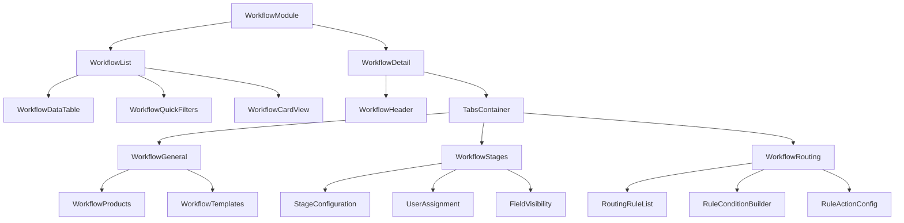

# Technical Specification: Workflow Management

## Document Information
- **Module**: System Administration / Workflow Management
- **Version**: 1.0
- **Last Updated**: 2025-01-16
- **Status**: Active
- **Related Documents**: BR-workflow.md, UC-workflow.md, DD-workflow.md

## Overview

This document provides the technical specification for the Workflow Management module, including component architecture, data structures, interfaces, and implementation details for configuring and managing multi-stage approval workflows in hospitality operations.

## Document History

| Version | Date | Author | Changes |
|---------|------|--------|---------|
| 1.1.0 | 2025-12-10 | Documentation Team | Standardized reference number format (XXX-YYMM-NNNN) |
| 1.0.0 | 2025-11-19 | Documentation Team | Initial version |
---

## Table of Contents

1. [System Architecture](#system-architecture)
2. [Component Specifications](#component-specifications)
3. [Data Models](#data-models)
4. [API Interfaces](#api-interfaces)
5. [State Management](#state-management)
6. [UI/UX Specifications](#uiux-specifications)
7. [Integration Points](#integration-points)
8. [Performance Considerations](#performance-considerations)
9. [Security](#security)
10. [Error Handling](#error-handling)
11. [Testing Strategy](#testing-strategy)

---

## 1. System Architecture

### 1.1 Module Structure

```
workflow/
├── workflow-configuration/
│   ├── [id]/
│   │   └── page.tsx                    # Workflow detail page
│   ├── components/
│   │   ├── workflow-list.tsx           # List view with search/filter/pagination
│   │   ├── workflow-detail.tsx         # Detail view with tabs
│   │   ├── workflow-header.tsx         # Header with edit controls
│   │   ├── workflow-general.tsx        # General configuration
│   │   ├── workflow-stages.tsx         # Stage configuration
│   │   ├── workflow-routing.tsx        # Routing rules configuration
│   │   ├── workflow-notifications.tsx  # Notification configuration
│   │   ├── workflow-products.tsx       # Product assignment
│   │   └── ...additional components
│   ├── types/
│   │   └── workflow.ts                 # TypeScript interfaces
│   ├── data/
│   │   └── mockData.ts                 # Mock workflows and sample data
│   └── page.tsx                        # List page
├── role-assignment/
│   ├── components/
│   │   ├── role-configuration.tsx      # Role configuration interface
│   │   └── user-assignment-dialog.tsx  # User assignment UI
│   ├── types/
│   │   └── approver.ts                 # Role and user types
│   └── data/
│       └── mockData.ts                 # Mock roles and users
└── page.tsx                            # Workflow module entry
```

### 1.2 Component Hierarchy



### 1.3 Technology Stack

| Layer | Technology | Version | Purpose |
|-------|-----------|---------|---------|
| Framework | Next.js | 14.x | React framework with App Router |
| Language | TypeScript | 5.x | Type-safe development |
| UI Components | shadcn/ui | Latest | Accessible component library |
| Primitives | Radix UI | Latest | Headless UI primitives |
| Styling | Tailwind CSS | 3.x | Utility-first CSS |
| State Management | React Hooks | 18.x | Local component state |
| Form Handling | React Hook Form | 7.x | Form state management |
| Validation | Zod | 3.x | Schema validation |
| Icons | Lucide React | Latest | Icon library |

---

## 2. Component Specifications

### 2.1 WorkflowList Component

**File**: `workflow-configuration/components/workflow-list.tsx`
**Purpose**: Main list view for browsing, searching, and filtering workflows

#### Props Interface
```typescript
interface WorkflowListProps {
  workflows: Workflow[]
}

interface Workflow {
  id: string
  name: string
  type: string
  status: string
  lastModified: string
}
```

#### State Management
```typescript
const [searchTerm, setSearchTerm] = useState("")
const [typeFilter, setTypeFilter] = useState("all")
const [statusFilter, setStatusFilter] = useState("all")
const [currentPage, setCurrentPage] = useState(1)
const [mounted, setMounted] = useState(false)
const itemsPerPage = 10
```

#### Core Functionality

**1. Search and Filter Logic**
```typescript
const filteredWorkflows = useMemo(() => {
  return workflows.filter((workflow) => {
    const matchesSearch = workflow.name.toLowerCase().includes(searchTerm.toLowerCase())
    const matchesType = typeFilter === "all" || workflow.type === typeFilter
    const matchesStatus = statusFilter === "all" || workflow.status === statusFilter
    return matchesSearch && matchesType && matchesStatus
  })
}, [workflows, searchTerm, typeFilter, statusFilter])
```

**2. Pagination Logic**
```typescript
const totalPages = Math.ceil(filteredWorkflows.length / itemsPerPage)
const paginatedWorkflows = filteredWorkflows.slice(
  (currentPage - 1) * itemsPerPage,
  currentPage * itemsPerPage
)
```

**3. Date Formatting (Hydration-Safe)**
```typescript
const formatDate = (dateString: string) => {
  if (!mounted) return '' // Prevent hydration mismatch
  return new Date(dateString).toLocaleString()
}
```

#### UI Structure
- Header with title and "Create Workflow" button
- Search input with icon (real-time filtering)
- Filter dropdowns:
  - Type filter (All Types, Purchase Request, Store Requisition)
  - Status filter (All Statuses, Active, Inactive, Draft)
- Table view with columns:
  - Name (clickable)
  - Type
  - Status (badge with color coding)
  - Last Modified (formatted date)
  - Actions (Edit button linking to detail page)
- Pagination controls:
  - First, Previous, Page Numbers, Next, Last buttons
  - Result count display
- Empty state when no results

#### Routing
- List page: `/system-administration/workflow/workflow-configuration`
- Detail page: `/system-administration/workflow/workflow-configuration/[id]`

---

### 2.2 WorkflowDetail Component

**File**: `workflow-configuration/components/workflow-detail.tsx`
**Purpose**: Comprehensive workflow configuration interface with tabbed navigation

#### Props Interface
```typescript
interface WorkflowDetailProps {
  workflowId: string
}
```

#### State Management
```typescript
const [workflow, setWorkflow] = useState<Workflow | undefined>(
  sampleWorkflows.find(w => w.id === workflowId)
)
const [isEditing, setIsEditing] = useState(false)
```

#### Tab Structure
```typescript
<Tabs defaultValue="general">
  <TabsList>
    <TabsTrigger value="general">General</TabsTrigger>
    <TabsTrigger value="stages">Stages</TabsTrigger>
    <TabsTrigger value="routing">Routing</TabsTrigger>
  </TabsList>

  <TabsContent value="general">
    <WorkflowGeneral workflow={workflow} isEditing={isEditing} onSave={handleSave} />
  </TabsContent>

  <TabsContent value="stages">
    <WorkflowStages stages={workflow.stages} isEditing={isEditing} onSave={handleStagesSave} />
  </TabsContent>

  <TabsContent value="routing">
    <WorkflowRouting rules={workflow.routingRules} stages={stageNames} isEditing={isEditing} onSave={handleRoutingSave} />
  </TabsContent>
</Tabs>
```

#### Edit Mode Toggle
```typescript
const handleEditToggle = () => {
  setIsEditing(!isEditing)
}

const handleSave = (updatedWorkflow: Workflow) => {
  setWorkflow(updatedWorkflow)
  setIsEditing(false)
  // TODO: API call to save workflow
}
```

#### Error Handling
```typescript
if (!workflow) {
  return (
    <Alert variant="destructive">
      <AlertCircle className="h-4 w-4" />
      <AlertTitle>Error</AlertTitle>
      <AlertDescription>
        Workflow not found. Please check the provided workflow ID: {workflowId}
      </AlertDescription>
    </Alert>
  )
}
```

---

### 2.3 WorkflowStages Component

**File**: `workflow-configuration/components/workflow-stages.tsx`
**Purpose**: Configure workflow stages with SLA, actions, users, and field visibility

#### Props Interface
```typescript
interface WorkflowStagesProps {
  stages: Stage[]
  isEditing: boolean
  onSave: (stages: Stage[]) => void
}

interface Stage {
  id: number
  name: string
  description: string
  sla: string
  slaUnit: string
  availableActions: string[]
  hideFields: {
    pricePerUnit: boolean
    totalPrice: boolean
  }
  assignedUsers: {
    id: number
    name: string
    department: string
    location: string
  }[]
  roleType: WorkflowRoleType
}
```

#### State Management
```typescript
const [stages, setStages] = useState<Stage[]>(initialStages)
const [selectedStageId, setSelectedStageId] = useState<number | null>(null)
const [isStageEditing, setIsStageEditing] = useState(false)
const [userFilter, setUserFilter] = useState<'all' | 'assigned' | 'unassigned'>('all')
```

#### Stage Manipulation Functions

**Add Stage**
```typescript
const handleAddStage = () => {
  const newStage: Stage = {
    id: stages.length + 1,
    name: `Stage ${stages.length + 1}`,
    description: "",
    sla: "24",
    slaUnit: "hours",
    availableActions: ['Submit'],
    hideFields: {
      pricePerUnit: false,
      totalPrice: false
    },
    assignedUsers: [],
    roleType: 'requester'
  }
  setStages([...stages, newStage])
  setSelectedStageId(newStage.id)
  setIsStageEditing(true)
}
```

**Update Stage Field**
```typescript
const handleInputChange = (e: React.ChangeEvent<HTMLInputElement>) => {
  if (!selectedStage) return

  const updatedStages = stages.map(stage => {
    if (stage.id === selectedStage.id) {
      return { ...stage, [e.target.name]: e.target.value }
    }
    return stage
  })
  setStages(updatedStages)
}
```

**Toggle Available Action**
```typescript
const handleActionToggle = (action: string) => {
  if (!selectedStage) return

  const updatedStages = stages.map(stage => {
    if (stage.id === selectedStage.id) {
      const updatedActions = stage.availableActions.includes(action)
        ? stage.availableActions.filter(a => a !== action)
        : [...stage.availableActions, action]
      return { ...stage, availableActions: updatedActions }
    }
    return stage
  })
  setStages(updatedStages)
}
```

**Assign/Unassign User**
```typescript
const handleAssignUser = (user: {id: number; name: string; department: string; location: string}) => {
  if (!selectedStage) return

  const updatedStages = stages.map(stage => {
    if (stage.id === selectedStage.id) {
      const isUserAssigned = stage.assignedUsers.some(u => u.id === user.id)
      const updatedUsers = isUserAssigned
        ? stage.assignedUsers.filter(u => u.id !== user.id)
        : [...stage.assignedUsers, user]
      return { ...stage, assignedUsers: updatedUsers }
    }
    return stage
  })
  setStages(updatedStages)
}
```

**Toggle Field Visibility**
```typescript
const handleHideFieldToggle = (field: 'pricePerUnit' | 'totalPrice') => {
  if (!selectedStage) return

  const updatedStages = stages.map(stage => {
    if (stage.id === selectedStage.id) {
      return {
        ...stage,
        hideFields: {
          ...stage.hideFields,
          [field]: !stage.hideFields[field]
        }
      }
    }
    return stage
  })
  setStages(updatedStages)
}
```

#### UI Organization
- Two-panel layout:
  - Left panel: Stage list with sequence numbers
  - Right panel: Selected stage configuration
- Stage configuration fields:
  - Name (text input)
  - Description (textarea)
  - SLA Duration (number input) + SLA Unit (dropdown)
  - Role Type (dropdown with badge display)
  - Available Actions (multi-checkbox)
  - Field Visibility (switches for price fields)
  - Assigned Users (expandable list with avatars)
- User assignment section:
  - Filter: All / Assigned / Unassigned
  - User list with avatar, name, department, location
  - Assign/Remove toggle per user
- Add/Delete/Save/Cancel controls

---

### 2.4 WorkflowRouting Component

**File**: `workflow-configuration/components/workflow-routing.tsx`
**Purpose**: Configure conditional routing rules for dynamic workflow paths

#### Props Interface
```typescript
interface WorkflowRoutingProps {
  rules: RoutingRule[]
  stages: string[]
  isEditing: boolean
  onSave: (rules: RoutingRule[]) => void
}

interface RoutingRule {
  id: number
  name: string
  description: string
  triggerStage: string
  condition: {
    field: string
    operator: OperatorType
    value: string
  }
  action: {
    type: ActionType
    parameters: {
      targetStage: string
    }
  }
}

type OperatorType = "eq" | "lt" | "gt" | "lte" | "gte"
type ActionType = "SKIP_STAGE" | "NEXT_STAGE"
```

#### State Management
```typescript
const [rules, setRules] = useState<RoutingRule[]>(initialRules)
const [selectedRuleId, setSelectedRuleId] = useState<number | null>(null)
const [isRuleEditing, setIsRuleEditing] = useState(false)
```

#### Rule Manipulation Functions

**Add Rule**
```typescript
const handleAddRule = () => {
  const newRule: RoutingRule = {
    id: Math.max(0, ...rules.map(r => r.id)) + 1,
    name: "",
    description: "",
    triggerStage: stages[0] || "",
    condition: { field: '', operator: 'eq', value: '' },
    action: { type: 'NEXT_STAGE', parameters: { targetStage: '' } }
  }
  const updatedRules = [...rules, newRule]
  setRules(updatedRules)
  setSelectedRuleId(newRule.id)
  setIsRuleEditing(true)
}
```

**Update Condition**
```typescript
const handleConditionChange = (field: keyof RoutingRule['condition'], value: string) => {
  if (!selectedRule || !isRuleEditing) return

  const updatedRules = rules.map(rule => {
    if (rule.id === selectedRule.id) {
      return {
        ...rule,
        condition: {
          ...rule.condition,
          [field]: field === 'operator' ? value as OperatorType : value
        }
      }
    }
    return rule
  })
  setRules(updatedRules)
}
```

**Update Action**
```typescript
const handleActionChange = (field: keyof RoutingRule['action'] | keyof RoutingRule['action']['parameters'], value: string) => {
  if (!selectedRule || !isRuleEditing) return

  const updatedRules = rules.map(rule => {
    if (rule.id === selectedRule.id) {
      if (field === 'type') {
        return {
          ...rule,
          action: {
            type: value as ActionType,
            parameters: { targetStage: '' }
          }
        }
      } else {
        return {
          ...rule,
          action: {
            ...rule.action,
            parameters: { ...rule.action.parameters, [field]: value }
          }
        }
      }
    }
    return rule
  })
  setRules(updatedRules)
}
```

#### UI Organization
- Three-column layout:
  - Column 1: Rule list (card view)
  - Column 2-3: Selected rule configuration
- Rule configuration sections:
  - **Basic Info**:
    - Rule Name (text input)
    - Description (textarea)
  - **Trigger**:
    - Trigger Stage (dropdown from workflow stages)
  - **Condition**:
    - Field (dropdown: amount, category, priority, etc.)
    - Operator (dropdown: eq, lt, gt, lte, gte)
    - Value (text/number input based on field type)
  - **Action**:
    - Action Type (dropdown: SKIP_STAGE, NEXT_STAGE)
    - Target Stage (dropdown from workflow stages)
- Add/Delete/Save/Cancel controls

---

## 3. Data Models

### 3.1 Core Types

```typescript
// Workflow Type
export interface Workflow {
  id: string
  name: string
  type: string
  description: string
  documentReferencePattern: string
  status: string
  stages: Stage[]
  routingRules: RoutingRule[]
  notifications: WorkflowNotification[]
  notificationTemplates: Template[]
  products: Product[]
}

// Stage Type
export interface Stage {
  id: number
  name: string
  description: string
  sla: string
  slaUnit: string
  availableActions: string[]
  hideFields: {
    pricePerUnit: boolean
    totalPrice: boolean
  }
  assignedUsers: {
    id: number
    name: string
    department: string
    location: string
  }[]
  roleType: WorkflowRoleType
}

// Role Type Enum
export type WorkflowRoleType = 'requester' | 'purchaser' | 'approver' | 'reviewer'

// Routing Rule Type
export interface RoutingRule {
  id: number
  name: string
  description: string
  triggerStage: string
  condition: RoutingCondition
  action: RoutingAction
}

export interface RoutingCondition {
  field: string
  operator: OperatorType
  value: string
}

export type OperatorType = "eq" | "lt" | "gt" | "lte" | "gte"

export interface RoutingAction {
  type: ActionType
  parameters: {
    targetStage: string
  }
}

export type ActionType = "SKIP_STAGE" | "NEXT_STAGE"

// Notification Type
export interface WorkflowNotification {
  id: number
  event: string
  eventTrigger: NotificationEventTrigger
  description?: string
  recipients: string[]
  channels: NotificationChannel[]
}

export type NotificationEventTrigger = "onSubmit" | "onApprove" | "onReject" | "onSendBack" | "onSLA"
export type NotificationChannel = "Email" | "System"

// Template Type
export interface Template {
  id: number
  name: string
  eventTrigger: NotificationEventTrigger
  description?: string
  subjectLine: string
  content: string
}

// Product Type
export interface Product {
  id: number
  name: string
  code: string
  category: string
  subCategory?: string
  itemGroup?: string
}
```

### 3.2 Filter and Sort Types

```typescript
// List Filter Configuration
interface FilterConfig {
  search: string
  type: 'all' | 'Purchase Request' | 'Store Requisition'
  status: 'all' | 'Active' | 'Inactive' | 'Draft'
}

// User Filter Type
type UserFilterType = 'all' | 'assigned' | 'unassigned'
```

### 3.3 Form Data Types

```typescript
// Workflow Form Data (for creation/editing)
interface WorkflowFormData {
  name: string
  type: string
  description: string
  documentReferencePattern: string
  status: 'Active' | 'Inactive' | 'Draft'
}

// Stage Form Data
interface StageFormData {
  name: string
  description: string
  sla: string
  slaUnit: 'hours' | 'days'
  availableActions: string[]
  roleType: WorkflowRoleType
  hideFields: {
    pricePerUnit: boolean
    totalPrice: boolean
  }
}

// Routing Rule Form Data
interface RoutingRuleFormData {
  name: string
  description: string
  triggerStage: string
  conditionField: string
  operator: OperatorType
  conditionValue: string
  actionType: ActionType
  targetStage: string
}
```

---

## 4. API Interfaces

### 4.1 REST API Endpoints

#### Workflow Endpoints

```typescript
// GET /api/workflows - List all workflows
interface GetWorkflowsRequest {
  search?: string
  type?: string
  status?: string
  page?: number
  limit?: number
}

interface GetWorkflowsResponse {
  workflows: Workflow[]
  total: number
  page: number
  limit: number
}

// GET /api/workflows/[id] - Get workflow by ID
interface GetWorkflowResponse {
  workflow: Workflow
}

// POST /api/workflows - Create new workflow
interface CreateWorkflowRequest {
  name: string
  type: string
  description: string
  documentReferencePattern: string
  status: 'Draft' // Always starts as Draft
}

interface CreateWorkflowResponse {
  workflow: Workflow
  message: string
}

// PUT /api/workflows/[id] - Update workflow
interface UpdateWorkflowRequest {
  name?: string
  description?: string
  documentReferencePattern?: string
  status?: 'Active' | 'Inactive' | 'Draft'
  stages?: Stage[]
  routingRules?: RoutingRule[]
  notifications?: WorkflowNotification[]
  products?: number[]
}

interface UpdateWorkflowResponse {
  workflow: Workflow
  message: string
}

// DELETE /api/workflows/[id] - Delete workflow (soft delete)
interface DeleteWorkflowRequest {
  force?: boolean
}

interface DeleteWorkflowResponse {
  success: boolean
  message: string
}
```

#### Stage Endpoints

```typescript
// POST /api/workflows/[id]/stages - Add stage to workflow
interface AddStageRequest {
  name: string
  description: string
  sla: number
  slaUnit: 'hours' | 'days'
  roleType: WorkflowRoleType
  availableActions: string[]
  hideFields: {
    pricePerUnit: boolean
    totalPrice: boolean
  }
}

// PUT /api/workflows/[id]/stages/[stageId] - Update stage
interface UpdateStageRequest {
  name?: string
  description?: string
  sla?: number
  slaUnit?: 'hours' | 'days'
  availableActions?: string[]
  assignedUsers?: number[]
}

// DELETE /api/workflows/[id]/stages/[stageId] - Remove stage
interface DeleteStageResponse {
  success: boolean
  message: string
}
```

#### Routing Rule Endpoints

```typescript
// POST /api/workflows/[id]/routing-rules - Add routing rule
interface AddRoutingRuleRequest {
  name: string
  description: string
  triggerStage: string
  condition: {
    field: string
    operator: OperatorType
    value: string
  }
  action: {
    type: ActionType
    parameters: {
      targetStage: string
    }
  }
}

// PUT /api/workflows/[id]/routing-rules/[ruleId] - Update rule
// DELETE /api/workflows/[id]/routing-rules/[ruleId] - Delete rule
```

### 4.2 Server Actions (Next.js 14)

```typescript
// Server Actions for Workflow Operations
'use server'

export async function createWorkflow(data: CreateWorkflowRequest): Promise<CreateWorkflowResponse> {
  // Validate input
  const validated = workflowSchema.parse(data)

  // Create workflow in database
  const workflow = await prisma.tb_workflow.create({
    data: {
      name: validated.name,
      workflow_type: validated.type,
      description: validated.description,
      data: {
        documentReferencePattern: validated.documentReferencePattern
      },
      is_active: false, // Draft status
      created_by_id: userId
    }
  })

  return {
    workflow: transformWorkflow(workflow),
    message: 'Workflow created successfully'
  }
}

export async function updateWorkflow(id: string, data: UpdateWorkflowRequest): Promise<UpdateWorkflowResponse> {
  // Validate permissions
  await checkPermission(userId, 'workflows.edit')

  // Validate input
  const validated = updateWorkflowSchema.parse(data)

  // Check for active documents if changing status
  if (validated.status === 'Inactive') {
    const activeCount = await getActiveDocumentCount(id)
    if (activeCount > 0) {
      throw new Error(`Cannot deactivate workflow with ${activeCount} active documents`)
    }
  }

  // Update workflow
  const workflow = await prisma.tb_workflow.update({
    where: { id },
    data: {
      name: validated.name,
      description: validated.description,
      data: validated.data,
      is_active: validated.status === 'Active',
      updated_by_id: userId,
      updated_at: new Date()
    }
  })

  return {
    workflow: transformWorkflow(workflow),
    message: 'Workflow updated successfully'
  }
}

export async function deleteWorkflow(id: string): Promise<DeleteWorkflowResponse> {
  // Validate permissions
  await checkPermission(userId, 'workflows.delete')

  // Check constraints
  const activeCount = await getActiveDocumentCount(id)
  if (activeCount > 0) {
    throw new Error(`Cannot delete workflow with ${activeCount} active documents`)
  }

  // Soft delete
  await prisma.tb_workflow.update({
    where: { id },
    data: {
      deleted_at: new Date(),
      deleted_by_id: userId
    }
  })

  return {
    success: true,
    message: 'Workflow deleted successfully'
  }
}
```

---

## 5. State Management

### 5.1 Component State Patterns

**WorkflowList Component State**
```typescript
// Search and Filter State
const [searchTerm, setSearchTerm] = useState("")
const [typeFilter, setTypeFilter] = useState<FilterType>("all")
const [statusFilter, setStatusFilter] = useState<StatusType>("all")

// Pagination State
const [currentPage, setCurrentPage] = useState(1)
const itemsPerPage = 10

// Derived State (memoized)
const filteredWorkflows = useMemo(() => {
  return workflows.filter(workflow =>
    matchesAllFilters(workflow, { searchTerm, typeFilter, statusFilter })
  )
}, [workflows, searchTerm, typeFilter, statusFilter])

const paginatedWorkflows = useMemo(() => {
  return filteredWorkflows.slice(
    (currentPage - 1) * itemsPerPage,
    currentPage * itemsPerPage
  )
}, [filteredWorkflows, currentPage])
```

**WorkflowDetail Component State**
```typescript
// Workflow Data State
const [workflow, setWorkflow] = useState<Workflow | undefined>()

// Edit Mode State
const [isEditing, setIsEditing] = useState(false)

// Tab State (managed by Radix UI Tabs)
const [activeTab, setActiveTab] = useState<'general' | 'stages' | 'routing'>('general')

// Unsaved Changes Tracking
const [hasUnsavedChanges, setHasUnsavedChanges] = useState(false)
```

**WorkflowStages Component State**
```typescript
// Stages Data State
const [stages, setStages] = useState<Stage[]>(initialStages)

// Selection State
const [selectedStageId, setSelectedStageId] = useState<number | null>(null)

// Edit Mode State (nested within parent edit mode)
const [isStageEditing, setIsStageEditing] = useState(false)

// User Filter State
const [userFilter, setUserFilter] = useState<UserFilterType>('all')

// Filtered Users (derived state)
const filteredUsers = useMemo(() => {
  if (!selectedStage) return []
  switch (userFilter) {
    case 'assigned':
      return selectedStage.assignedUsers
    case 'unassigned':
      return users.filter(u => !selectedStage.assignedUsers.some(au => au.id === u.id))
    default:
      return users
  }
}, [selectedStage, userFilter, users])
```

### 5.2 State Update Patterns

**Immutable Updates**
```typescript
// Update specific stage in array
const updateStage = (stageId: number, updates: Partial<Stage>) => {
  setStages(prevStages =>
    prevStages.map(stage =>
      stage.id === stageId ? { ...stage, ...updates } : stage
    )
  )
}

// Add item to array
const addStage = (newStage: Stage) => {
  setStages(prevStages => [...prevStages, newStage])
}

// Remove item from array
const removeStage = (stageId: number) => {
  setStages(prevStages => prevStages.filter(s => s.id !== stageId))
}

// Toggle item in array
const toggleAction = (stageId: number, action: string) => {
  setStages(prevStages =>
    prevStages.map(stage =>
      stage.id === stageId
        ? {
            ...stage,
            availableActions: stage.availableActions.includes(action)
              ? stage.availableActions.filter(a => a !== action)
              : [...stage.availableActions, action]
          }
        : stage
    )
  )
}
```

### 5.3 Effect Hooks

**Sync State with Props**
```typescript
useEffect(() => {
  setStages(initialStages)
}, [initialStages])
```

**Hydration-Safe Mount Detection**
```typescript
const [mounted, setMounted] = useState(false)

useEffect(() => {
  setMounted(true)
}, [])

// Use mounted flag before date formatting to prevent hydration mismatch
const formattedDate = mounted ? formatDate(dateString) : ''
```

**Reset Edit Mode on Parent Change**
```typescript
useEffect(() => {
  if (!parentIsEditing) {
    setIsStageEditing(false)
    setSelectedStageId(null)
  }
}, [parentIsEditing])
```

---

## 6. UI/UX Specifications

### 6.1 Layout and Responsiveness

**Workflow List Layout**
- Full-width container with max-width constraint
- Responsive grid for filters (1 col mobile, 4 cols desktop)
- Table view on desktop, card view option for mobile
- Sticky pagination controls

**Workflow Detail Layout**
- Header section (fixed/sticky):
  - Workflow name and ID
  - Status badge
  - Edit/Save/Cancel controls
  - Back navigation
- Tabbed content area:
  - Tab navigation (horizontal scroll on mobile)
  - Tab content with padding
- Responsive breakpoints:
  - Mobile (< 768px): Single column, collapsible sections
  - Tablet (768px - 1024px): Two columns where applicable
  - Desktop (> 1024px): Full multi-column layouts

### 6.2 Color Coding and Visual Indicators

**Status Badges**
```typescript
const statusColors = {
  Active: 'bg-green-100 text-green-800 border-green-200',
  Inactive: 'bg-gray-100 text-gray-800 border-gray-200',
  Draft: 'bg-yellow-100 text-yellow-800 border-yellow-200'
}
```

**Role Type Badges**
```typescript
const roleTypeColors = {
  requester: 'bg-blue-100 text-blue-800',
  purchaser: 'bg-purple-100 text-purple-800',
  approver: 'bg-orange-100 text-orange-800',
  reviewer: 'bg-teal-100 text-teal-800'
}
```

**User Avatar Colors**
```typescript
// 7 color variants based on user ID hash
const avatarColors = [
  'bg-red-500',
  'bg-blue-500',
  'bg-green-500',
  'bg-yellow-500',
  'bg-purple-500',
  'bg-pink-500',
  'bg-indigo-500'
]

const getAvatarColor = (userId: number) => {
  return avatarColors[userId % avatarColors.length]
}
```

### 6.3 Interactive Elements

**Buttons**
- Primary: Create Workflow, Save (solid background)
- Secondary: Edit, Cancel (outline variant)
- Destructive: Delete (red variant)
- Ghost: Close, Navigate back (minimal styling)

**Form Controls**
- Text inputs with labels and placeholder text
- Dropdowns (Select component) with clear value display
- Checkboxes for multi-select (Available Actions)
- Switches for boolean toggles (Field Visibility)
- Number inputs for SLA duration

**Table Interactions**
- Sortable columns (click header to sort)
- Clickable rows (navigate to detail)
- Hover states on rows and action buttons
- Loading states during data fetch

### 6.4 Empty States

**No Workflows Found**
```tsx
<div className="text-center py-4 text-muted-foreground">
  No workflows found matching the current filters.
</div>
```

**No Routing Rules**
```tsx
<div className="text-center py-8">
  <p className="text-muted-foreground">No routing rules configured</p>
  <p className="text-sm text-muted-foreground mt-2">
    Routing rules allow conditional workflow paths based on document properties
  </p>
  {isEditing && (
    <Button onClick={handleAddRule} className="mt-4">
      Add Routing Rule
    </Button>
  )}
</div>
```

### 6.5 Loading and Error States

**Loading State**
```tsx
{isLoading && (
  <div className="flex items-center justify-center py-8">
    <Spinner className="h-8 w-8 animate-spin" />
    <span className="ml-2">Loading workflows...</span>
  </div>
)}
```

**Error State**
```tsx
<Alert variant="destructive">
  <AlertCircle className="h-4 w-4" />
  <AlertTitle>Error</AlertTitle>
  <AlertDescription>{error.message}</AlertDescription>
</Alert>
```

---

## 7. Integration Points

### 7.1 User Management Integration

**User Assignment**
- Fetch users from User Management module
- Filter users by role type for stage assignments
- Display user department and location
- Validate user permissions before assignment

**Integration Points**:
- `GET /api/users?role={roleType}&department={dept}&location={loc}`
- User selection interface in WorkflowStages component
- Permission validation: `workflows.assign_users`

### 7.2 Product Management Integration

**Product Assignment**
- Fetch products from Product Management module
- Filter products by category
- Assign products to workflows for automatic workflow selection

**Integration Points**:
- `GET /api/products?category={category}&status=active`
- Product assignment interface in WorkflowGeneral component
- Workflow selection logic based on product assignments

### 7.3 Procurement Integration

**Purchase Request Workflow Execution**
- Apply workflow when creating purchase request
- Progress through stages based on approval actions
- Evaluate routing rules at each stage
- Trigger notifications on workflow events

**Integration Points**:
- `GET /api/workflows?type=purchase_request&status=active`
- Workflow engine: stage progression logic
- Notification service: event-triggered notifications
- SLA monitoring service

### 7.4 Store Operations Integration

**Store Requisition Workflow Execution**
- Apply workflow when creating store requisition
- Similar stage progression as purchase requests
- Department-specific routing rules

**Integration Points**:
- `GET /api/workflows?type=store_requisition&status=active`
- Workflow engine integration
- Internal transfer approval logic

### 7.5 Notification Service Integration

**Email Notifications**
- Send emails on workflow events (submit, approve, reject, SLA warning)
- Use configured notification templates
- Variable substitution in templates

**Integration Points**:
- Email service API: `POST /api/notifications/email`
- Template engine for variable substitution
- Queue for asynchronous email delivery

**System Notifications**
- In-app notifications for workflow events
- Display in notification panel
- Mark as read/unread

**Integration Points**:
- `POST /api/notifications/system`
- WebSocket or polling for real-time updates
- Notification count badge

---

## 8. Performance Considerations

### 8.1 Optimization Strategies

**Memoization**
```typescript
// Memo expensive filtering operations
const filteredWorkflows = useMemo(() => {
  return workflows.filter(matchFilters)
}, [workflows, searchTerm, typeFilter, statusFilter])

// Memo complex calculations
const availableUsers = useMemo(() => {
  return users.filter(u =>
    !stage.assignedUsers.some(au => au.id === u.id) &&
    hasRolePermission(u, stage.roleType)
  )
}, [users, stage])
```

**Pagination**
- Limit records per page (default: 10)
- Server-side pagination for large datasets
- Lazy load additional data as needed

**Debouncing**
```typescript
// Debounce search input
const debouncedSearch = useMemo(
  () => debounce((value: string) => {
    setSearchTerm(value)
  }, 300),
  []
)
```

### 8.2 Database Query Optimization

**Indexes**
```sql
CREATE INDEX idx_workflow_name_type ON tb_workflow(name, workflow_type);
CREATE INDEX idx_workflow_active ON tb_workflow(is_active) WHERE deleted_at IS NULL;
CREATE INDEX idx_workflow_deleted ON tb_workflow(deleted_at);
```

**Efficient Queries**
```typescript
// Fetch workflow with stages in single query
const workflow = await prisma.tb_workflow.findUnique({
  where: { id },
  include: {
    // Include related data in JSON fields
  }
})

// Count active documents efficiently
const activeCount = await prisma.tb_purchase_request.count({
  where: {
    workflow_id: id,
    doc_status: { notIn: ['completed', 'cancelled'] }
  }
})
```

### 8.3 Caching Strategy

**Client-Side Caching**
- Cache workflow list in React Query/SWR
- Stale-while-revalidate pattern
- Cache duration: 5 minutes

**Server-Side Caching**
- Cache active workflows list (frequently accessed)
- Cache user permissions and roles
- Invalidate cache on workflow updates

---

## 9. Security

### 9.1 Authentication and Authorization

**Permission Checks**
```typescript
// Required permissions by operation
const workflowPermissions = {
  view: 'workflows.view',
  create: 'workflows.create',
  edit: 'workflows.edit',
  delete: 'workflows.delete',
  activate: 'workflows.activate',
  assign_users: 'workflows.assign_users'
}

// Permission check middleware
async function checkWorkflowPermission(userId: string, permission: string) {
  const userPermissions = await getUserPermissions(userId)
  if (!userPermissions.includes(permission)) {
    throw new ForbiddenError(`Missing permission: ${permission}`)
  }
}
```

**Row-Level Security (Supabase)**
```sql
-- Only show workflows for user's organization
CREATE POLICY workflow_view_policy ON tb_workflow
  FOR SELECT
  USING (organization_id = auth.jwt() ->> 'organization_id');

-- Only allow admins to modify workflows
CREATE POLICY workflow_update_policy ON tb_workflow
  FOR UPDATE
  USING (
    EXISTS (
      SELECT 1 FROM tb_user
      WHERE id = auth.uid()
      AND role IN ('admin', 'super_admin')
    )
  );
```

### 9.2 Data Validation

**Input Validation with Zod**
```typescript
const workflowSchema = z.object({
  name: z.string().min(1).max(100),
  type: z.enum(['purchase_request_workflow', 'store_requisition_workflow']),
  description: z.string().max(500).optional(),
  documentReferencePattern: z.string()
    .regex(/^[A-Z]+-\{YYYY\}-\{0+\}$/, 'Invalid pattern format')
})

const stageSchema = z.object({
  name: z.string().min(1).max(100),
  description: z.string().max(500).optional(),
  sla: z.number().min(0),
  slaUnit: z.enum(['hours', 'days']),
  roleType: z.enum(['requester', 'purchaser', 'approver', 'reviewer']),
  availableActions: z.array(z.string()).min(1)
})

const routingRuleSchema = z.object({
  name: z.string().min(1).max(100),
  triggerStage: z.string(),
  condition: z.object({
    field: z.string(),
    operator: z.enum(['eq', 'lt', 'gt', 'lte', 'gte']),
    value: z.string()
  }),
  action: z.object({
    type: z.enum(['SKIP_STAGE', 'NEXT_STAGE']),
    parameters: z.object({
      targetStage: z.string()
    })
  })
})
```

### 9.3 Audit Trail

**Audit Logging**
```typescript
// Log all workflow configuration changes
interface WorkflowAuditLog {
  workflow_id: string
  action: 'created' | 'updated' | 'deleted' | 'activated' | 'deactivated'
  user_id: string
  timestamp: Date
  changes: {
    field: string
    old_value: any
    new_value: any
  }[]
  ip_address: string
  user_agent: string
}

// Create audit log entry
async function logWorkflowChange(
  workflowId: string,
  action: string,
  changes: any[],
  userId: string
) {
  await prisma.tb_audit_log.create({
    data: {
      entity_type: 'workflow',
      entity_id: workflowId,
      action,
      user_id: userId,
      changes: changes,
      timestamp: new Date()
    }
  })
}
```

---

## 10. Error Handling

### 10.1 Error Types

```typescript
// Custom error classes
class WorkflowError extends Error {
  constructor(message: string, public code: string, public statusCode: number) {
    super(message)
    this.name = 'WorkflowError'
  }
}

class WorkflowNotFoundError extends WorkflowError {
  constructor(workflowId: string) {
    super(`Workflow not found: ${workflowId}`, 'WORKFLOW_NOT_FOUND', 404)
  }
}

class WorkflowValidationError extends WorkflowError {
  constructor(message: string, public errors: Record<string, string>) {
    super(message, 'VALIDATION_ERROR', 400)
  }
}

class WorkflowConflictError extends WorkflowError {
  constructor(message: string) {
    super(message, 'CONFLICT', 409)
  }
}
```

### 10.2 Error Handling Patterns

**Try-Catch in Server Actions**
```typescript
export async function createWorkflow(data: CreateWorkflowRequest) {
  try {
    // Validate input
    const validated = workflowSchema.parse(data)

    // Check for duplicate name
    const existing = await prisma.tb_workflow.findUnique({
      where: { name: validated.name }
    })
    if (existing) {
      throw new WorkflowConflictError('Workflow name already exists')
    }

    // Create workflow
    const workflow = await prisma.tb_workflow.create({
      data: validated
    })

    return { success: true, workflow }

  } catch (error) {
    if (error instanceof z.ZodError) {
      throw new WorkflowValidationError('Invalid input', error.flatten().fieldErrors)
    }
    throw error
  }
}
```

**Client-Side Error Display**
```typescript
// Form-level errors
{error && (
  <Alert variant="destructive">
    <AlertCircle className="h-4 w-4" />
    <AlertTitle>Error</AlertTitle>
    <AlertDescription>{error.message}</AlertDescription>
  </Alert>
)}

// Field-level errors
{errors.name && (
  <p className="text-sm text-destructive">{errors.name.message}</p>
)}
```

### 10.3 Error Recovery

**Retry Logic**
```typescript
async function fetchWorkflowWithRetry(id: string, maxRetries = 3) {
  for (let attempt = 1; attempt <= maxRetries; attempt++) {
    try {
      return await fetchWorkflow(id)
    } catch (error) {
      if (attempt === maxRetries) throw error
      await delay(1000 * attempt) // Exponential backoff
    }
  }
}
```

**Fallback UI**
```typescript
{error ? (
  <ErrorBoundary
    fallback={
      <div className="text-center py-8">
        <p className="text-destructive">Failed to load workflow</p>
        <Button onClick={retry} variant="outline" className="mt-4">
          Try Again
        </Button>
      </div>
    }
  >
    <WorkflowDetail />
  </ErrorBoundary>
) : (
  <WorkflowDetail />
)}
```

---

## 11. Testing Strategy

### 11.1 Unit Tests

**Component Tests**
```typescript
describe('WorkflowList', () => {
  it('filters workflows by search term', () => {
    const workflows = [
      { id: '1', name: 'General Purchase', type: 'PR', status: 'Active' },
      { id: '2', name: 'Market List', type: 'PR', status: 'Active' }
    ]

    render(<WorkflowList workflows={workflows} />)

    const searchInput = screen.getByPlaceholderText('Search workflows...')
    fireEvent.change(searchInput, { target: { value: 'Market' } })

    expect(screen.queryByText('General Purchase')).not.toBeInTheDocument()
    expect(screen.getByText('Market List')).toBeInTheDocument()
  })

  it('filters workflows by type', () => {
    // Test type filtering logic
  })

  it('paginates results correctly', () => {
    // Test pagination logic
  })
})

describe('WorkflowStages', () => {
  it('adds new stage', () => {
    // Test stage addition
  })

  it('updates stage configuration', () => {
    // Test stage updates
  })

  it('assigns users to stage', () => {
    // Test user assignment
  })
})
```

**Utility Function Tests**
```typescript
describe('filterWorkflows', () => {
  it('filters by search term case-insensitively', () => {
    const result = filterWorkflows(mockWorkflows, { search: 'purchase' })
    expect(result).toHaveLength(2)
  })

  it('combines multiple filters with AND logic', () => {
    const result = filterWorkflows(mockWorkflows, {
      search: 'purchase',
      type: 'PR',
      status: 'Active'
    })
    expect(result).toHaveLength(1)
  })
})
```

### 11.2 Integration Tests

**API Integration Tests**
```typescript
describe('Workflow API', () => {
  it('creates workflow successfully', async () => {
    const response = await createWorkflow({
      name: 'Test Workflow',
      type: 'purchase_request_workflow',
      description: 'Test description',
      documentReferencePattern: 'TEST-{YYYY}-{00000}'
    })

    expect(response.success).toBe(true)
    expect(response.workflow.name).toBe('Test Workflow')
    expect(response.workflow.status).toBe('Draft')
  })

  it('prevents duplicate workflow names', async () => {
    await createWorkflow({ name: 'Duplicate Test', /* ... */ })

    await expect(
      createWorkflow({ name: 'Duplicate Test', /* ... */ })
    ).rejects.toThrow('Workflow name already exists')
  })

  it('validates routing rules for circular dependencies', async () => {
    // Test circular dependency detection
  })
})
```

### 11.3 End-to-End Tests

**User Workflow Tests**
```typescript
describe('Workflow Configuration E2E', () => {
  it('creates complete workflow with stages and routing', async () => {
    // Navigate to workflow list
    await page.goto('/system-administration/workflow/workflow-configuration')

    // Click create workflow
    await page.click('button:has-text("Create Workflow")')

    // Fill general information
    await page.fill('input[name='name']', 'E2E Test Workflow')
    await page.selectOption('select[name='type']', 'Purchase Request')

    // Add stages
    await page.click('text=Stages')
    await page.click('button:has-text("Add Stage")')
    await page.fill('input[name='stageName']', 'Stage 1')
    // ... configure stage

    // Add routing rules
    await page.click('text=Routing')
    await page.click('button:has-text("Add Rule")')
    // ... configure rule

    // Save workflow
    await page.click('button:has-text("Save")')

    // Verify success
    await expect(page.locator('text=Workflow created successfully')).toBeVisible()
  })
})
```

### 11.4 Performance Tests

**Load Testing**
```typescript
describe('Workflow Performance', () => {
  it('handles large workflow list efficiently', async () => {
    const startTime = performance.now()

    const workflows = generateMockWorkflows(1000)
    render(<WorkflowList workflows={workflows} />)

    const endTime = performance.now()
    expect(endTime - startTime).toBeLessThan(2000) // < 2 seconds
  })

  it('filters large dataset quickly', async () => {
    const workflows = generateMockWorkflows(1000)
    const { rerender } = render(<WorkflowList workflows={workflows} />)

    const startTime = performance.now()
    rerender(<WorkflowList workflows={workflows} searchTerm="test" />)
    const endTime = performance.now()

    expect(endTime - startTime).toBeLessThan(500) // < 500ms
  })
})
```

---

## Appendices

### A. Type Definitions Summary

See [Section 3: Data Models](#3-data-models) for complete type definitions.

### B. Component File Mapping

| Component | File Path | Lines of Code (approx) |
|-----------|-----------|------------------------|
| WorkflowList | `workflow-configuration/components/workflow-list.tsx` | 210 |
| WorkflowDetail | `workflow-configuration/components/workflow-detail.tsx` | 78 |
| WorkflowStages | `workflow-configuration/components/workflow-stages.tsx` | 300+ |
| WorkflowRouting | `workflow-configuration/components/workflow-routing.tsx` | 250+ |
| WorkflowGeneral | `workflow-configuration/components/workflow-general.tsx` | 200+ |

### C. Database Schema Reference

See `DD-workflow.md` for complete database schema documentation including:
- tb_workflow table structure
- Relationships with purchase requests and requisitions
- Indexes and constraints
- Query patterns

### D. Future Enhancements

**Phase 1: Workflow Engine Enhancements**
- Parallel approval stages
- Conditional stage skipping based on multiple conditions
- Workflow versioning with rollback capability
- Workflow templates for quick setup

**Phase 2: Advanced Features**
- Workflow analytics and performance metrics
- SLA breach notifications and escalations
- Dynamic user assignment based on workload
- Workflow simulation and testing mode

**Phase 3: Integration Enhancements**
- External system integrations (ERP, accounting)
- Mobile app support for workflow approvals
- Offline mode with sync capability
- API webhooks for workflow events

**Phase 4: AI/ML Enhancements**
- Intelligent routing based on historical data
- Predicted approval times
- Anomaly detection in workflow patterns
- Automated workflow optimization suggestions

---

## Sitemap

### Overview
This section provides a complete navigation structure of all pages, tabs, and dialogues in the Workflow sub-module.

### Page Hierarchy

```mermaid
graph TD
    ListPage['List Page<br>(/system-administration/workflow)']
    CreatePage['Create Page<br>(/system-administration/workflow/new)']
    DetailPage["Detail Page<br>(/system-administration/workflow/[id])"]
    EditPage["Edit Page<br>(/system-administration/workflow/[id]/edit)"]

    %% List Page Tabs
    ListPage --> ListTab1['Tab: All Items']
    ListPage --> ListTab2['Tab: Active']
    ListPage --> ListTab3['Tab: Archived']

    %% List Page Dialogues
    ListPage -.-> ListDialog1['Dialog: Quick Create']
    ListPage -.-> ListDialog2['Dialog: Bulk Actions']
    ListPage -.-> ListDialog3['Dialog: Export']
    ListPage -.-> ListDialog4['Dialog: Filter']

    %% Detail Page Tabs
    DetailPage --> DetailTab1['Tab: Overview']
    DetailPage --> DetailTab2['Tab: History']
    DetailPage --> DetailTab3['Tab: Activity Log']

    %% Detail Page Dialogues
    DetailPage -.-> DetailDialog1['Dialog: Edit']
    DetailPage -.-> DetailDialog2['Dialog: Delete Confirm']
    DetailPage -.-> DetailDialog3['Dialog: Status Change']

    %% Create/Edit Dialogues
    CreatePage -.-> CreateDialog1['Dialog: Cancel Confirm']
    CreatePage -.-> CreateDialog2['Dialog: Save Draft']

    EditPage -.-> EditDialog1['Dialog: Discard Changes']
    EditPage -.-> EditDialog2['Dialog: Save Draft']

    %% Navigation Flow
    ListPage --> DetailPage
    ListPage --> CreatePage
    DetailPage --> EditPage
    CreatePage --> DetailPage
    EditPage --> DetailPage

    style ListPage fill:#e1f5ff
    style CreatePage fill:#fff4e1
    style DetailPage fill:#e8f5e9
    style EditPage fill:#fce4ec
```

### Pages

#### 1. List Page
**Route**: `/system-administration/workflow`
**File**: `page.tsx`
**Purpose**: Display paginated list of all workflows

**Sections**:
- Header: Title, breadcrumbs, primary actions
- Filters: Quick filters, advanced filter panel
- Search: Global search with autocomplete
- Data Table: Sortable columns, row actions, bulk selection
- Pagination: Page size selector, page navigation

**Tabs**:
- **All Items**: Complete list of all workflows
- **Active**: Filter active items only
- **Archived**: View archived items

**Dialogues**:
- **Quick Create**: Fast creation form with essential fields only
- **Bulk Actions**: Multi-select actions (delete, export, status change)
- **Export**: Export data in various formats (CSV, Excel, PDF)
- **Filter**: Advanced filtering with multiple criteria

#### 2. Detail Page
**Route**: `/system-administration/workflow/[id]`
**File**: `[id]/page.tsx`
**Purpose**: Display comprehensive workflow details

**Sections**:
- Header: Breadcrumbs, workflow title, action buttons
- Info Cards: Multiple cards showing different aspects
- Related Data: Associated records and relationships

**Tabs**:
- **Overview**: Key information and summary
- **History**: Change history and audit trail
- **Activity Log**: User actions and system events

**Dialogues**:
- **Edit**: Navigate to edit form
- **Delete Confirm**: Confirmation before deletion
- **Status Change**: Change workflow status with reason

#### 3. Create Page
**Route**: `/system-administration/workflow/new`
**File**: `new/page.tsx`
**Purpose**: Create new workflow

**Sections**:
- Form Header: Title, Save/Cancel actions
- Form Fields: All required and optional fields
- Validation: Real-time field validation

**Dialogues**:
- **Cancel Confirm**: Confirm discarding unsaved changes
- **Save Draft**: Save incomplete form as draft

#### 4. Edit Page
**Route**: `/system-administration/workflow/[id]/edit`
**File**: `[id]/edit/page.tsx`
**Purpose**: Modify existing workflow

**Sections**:
- Form Header: Title, Save/Cancel/Delete actions
- Form Fields: Pre-populated with existing data
- Change Tracking: Highlight modified fields

**Dialogues**:
- **Discard Changes**: Confirm discarding modifications
- **Save Draft**: Save changes as draft


## Change History

| Version | Date | Author | Changes |
|---------|------|--------|---------|
| 1.0 | 2025-01-16 | System | Initial technical specification |
