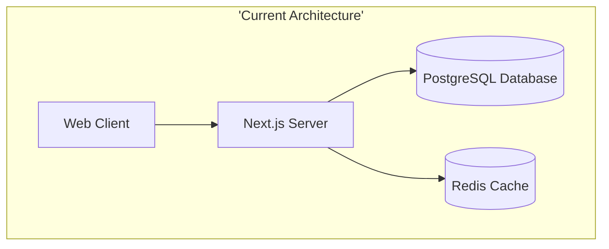
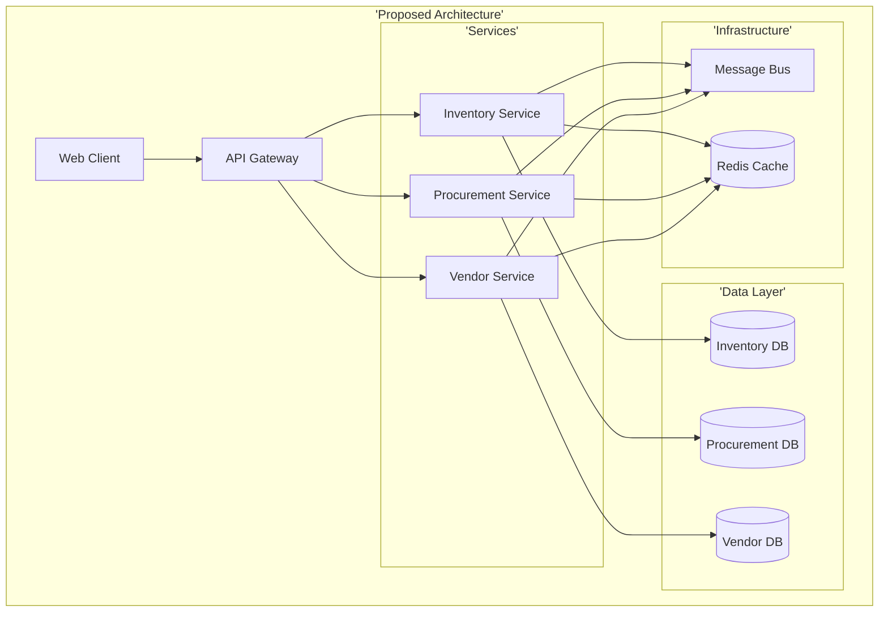
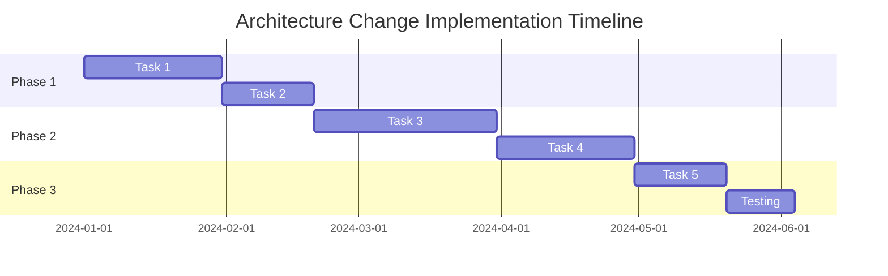
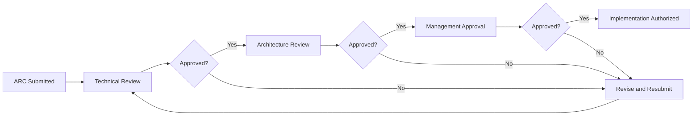

# Architecture Change Request (ARC) - ISO/IEC 29110

## Document Information

| Field | Value |
|-------|-------|
| **ARC ID** | ARC-{YYYY}-{NNN} |
| **Module** | {Module Name} |
| **Sub-Module** | {Sub-Module Name} |
| **Document Type** | Architecture Change Request (ARC) |
| **ISO Standard** | ISO/IEC 29110-4-1 (Software Implementation) |
| **Version** | 1.0.0 |
| **Status** | Draft \| Under Review \| Approved \| Rejected \| Implemented |
| **Created Date** | {YYYY-MM-DD} |
| **Last Updated** | {YYYY-MM-DD} |
| **Requestor** | {Name, Role} |
| **Assigned To** | {Developer/Team Name} |

## Document History

| Version | Date | Author | Changes | Approver |
|---------|------|--------|---------|----------|
| 1.1.0 | 2025-12-10 | Documentation Team | Standardized reference number format (XXX-YYMM-NNNN) |
| 1.0.0 | {YYYY-MM-DD} | {Author Name} | Initial request | {Name} |

---

# 1. CHANGE REQUEST SUMMARY

## 1.1 Change Title
**Title**: {Concise, descriptive title of the architecture change}

**Example**: "Migration from Monolithic to Microservices Architecture for Inventory Module"

## 1.2 Change Type

Select one or more:
- [ ] Architecture Pattern Change
- [ ] Technology Stack Change
- [ ] Component Structure Change
- [ ] Integration Architecture Change
- [ ] Database Architecture Change
- [ ] Security Architecture Change
- [ ] Performance Architecture Change
- [ ] Deployment Architecture Change

## 1.3 Priority Classification

**Priority**: High \| Medium \| Low

**Urgency**: Critical \| Urgent \| Normal \| Low

**Business Criticality**:
- [ ] System Down / Critical Business Impact
- [ ] Major Feature Blocked
- [ ] Performance Degradation
- [ ] Security Vulnerability
- [ ] Planned Enhancement
- [ ] Technical Debt Reduction

## 1.4 Change Justification

**Business Driver**:
{Explain the business need driving this change}

**Example**:
```
Current monolithic architecture cannot scale to support multiple hotel locations
simultaneously. Need to support 50+ locations with independent operations while
maintaining centralized reporting and inventory management.
```

**Technical Driver**:
{Explain the technical reasons for this change}

**Example**:
```
- Current architecture creates bottlenecks at 1000+ concurrent users
- Deployment of updates requires full system downtime
- Module dependencies prevent independent feature releases
- Database queries timeout during peak hours
```

---

# 2. CURRENT STATE ANALYSIS

## 2.1 Current Architecture Overview

**Architecture Pattern**: {Current pattern - e.g., Monolithic, Layered, etc.}

**Technology Stack**:
- **Frontend**: {Technologies}
- **Backend**: {Technologies}
- **Database**: {Technologies}
- **Cache**: {Technologies}
- **Infrastructure**: {Technologies}

## 2.2 Current Architecture Diagram



**Description**: {Describe the current architecture in detail}

## 2.3 Current Pain Points

| Pain Point | Impact | Severity | Frequency |
|------------|--------|----------|-----------|
| {Pain Point 1} | {Business/Technical Impact} | High/Medium/Low | Daily/Weekly/Monthly |
| {Pain Point 2} | {Business/Technical Impact} | High/Medium/Low | Daily/Weekly/Monthly |

**Example**:
| Pain Point | Impact | Severity | Frequency |
|------------|--------|----------|-----------|
| Deployment downtime | All users affected for 2-3 hours | High | Weekly |
| Database query timeout | Inventory updates fail during peak | High | Daily |
| Module coupling | Cannot release inventory without procurement | Medium | Monthly |

## 2.4 Current Performance Metrics

| Metric | Current Value | Target Value | Gap |
|--------|---------------|--------------|-----|
| Response Time (avg) | {X ms} | {Y ms} | {Difference} |
| Throughput (requests/sec) | {X} | {Y} | {Difference} |
| Concurrent Users | {X} | {Y} | {Difference} |
| System Availability | {X%} | {Y%} | {Difference} |
| Deployment Time | {X hours} | {Y hours} | {Difference} |

---

# 3. PROPOSED ARCHITECTURE

## 3.1 Proposed Architecture Overview

**Architecture Pattern**: {New pattern - e.g., Microservices, Event-Driven, etc.}

**Design Principles**:
1. {Principle 1 - e.g., Single Responsibility}
2. {Principle 2 - e.g., Loose Coupling}
3. {Principle 3 - e.g., High Cohesion}
4. {Principle 4 - e.g., Scalability}

## 3.2 Proposed Architecture Diagram



**Description**: {Describe the proposed architecture in detail}

## 3.3 Key Architecture Changes

### Change 1: {Change Name}

**Current State**:
{How it works now}

**Proposed State**:
{How it will work}

**Rationale**:
{Why this change is necessary}

**Implementation Approach**:
{How it will be implemented}

### Change 2: {Change Name}
{Repeat structure above}

## 3.4 Technology Stack Changes

| Component | Current | Proposed | Rationale |
|-----------|---------|----------|-----------|
| {Component 1} | {Current tech} | {New tech} | {Why change} |
| {Component 2} | {Current tech} | {New tech} | {Why change} |

**Example**:
| Component | Current | Proposed | Rationale |
|-----------|---------|----------|-----------|
| Application Server | Single Next.js | Next.js + Node.js services | Enable independent service scaling |
| Database | Single PostgreSQL | PostgreSQL per service | Data isolation and independent scaling |
| Communication | Direct calls | Message Bus (RabbitMQ) | Asynchronous processing and decoupling |

---

# 4. IMPACT ANALYSIS

## 4.1 ISO 29110 Traceability

### 4.1.1 Requirements Traceability

| Requirement ID | Requirement Name | Impact | Change Required |
|----------------|------------------|--------|-----------------|
| REQ-{MOD}-001 | {Requirement} | Modified \| Unaffected | {Description} |
| REQ-{MOD}-002 | {Requirement} | New \| Deleted | {Description} |

### 4.1.2 Design Document Updates

| Document | Document ID | Section | Update Required |
|----------|-------------|---------|-----------------|
| Business Requirements | BR-{module} | {Section number} | {Description of update} |
| Technical Specification | TS-{module} | {Section number} | {Description of update} |
| Data Schema | DS-{module} | {Section number} | {Description of update} |
| Use Cases | UC-{module} | {Section number} | {Description of update} |

## 4.2 Affected Components

### 4.2.1 Component Impact Matrix

| Component | Impact Level | Change Type | Effort | Risk |
|-----------|--------------|-------------|--------|------|
| {Component 1} | High/Medium/Low | Modify/Replace/New | {Story points} | High/Medium/Low |
| {Component 2} | High/Medium/Low | Modify/Replace/New | {Story points} | High/Medium/Low |

**Impact Level Definitions**:
- **High**: Component requires significant redesign or replacement
- **Medium**: Component requires moderate changes
- **Low**: Component requires minor updates or configuration changes

### 4.2.2 Module Dependencies

**Upstream Dependencies** (Modules that depend on changed modules):
- {Module Name}: {Impact description}
- {Module Name}: {Impact description}

**Downstream Dependencies** (Modules that changed modules depend on):
- {Module Name}: {Impact description}
- {Module Name}: {Impact description}

## 4.3 Data Impact Analysis

### 4.3.1 Database Changes

| Database Object | Change Type | Migration Required | Data Loss Risk |
|-----------------|-------------|-------------------|----------------|
| {table_name} | Modify \| New \| Delete | Yes \| No | High \| Medium \| Low \| None |
| {view_name} | Modify \| New \| Delete | Yes \| No | High \| Medium \| Low \| None |

### 4.3.2 Data Migration Strategy

**Migration Approach**: {Online \| Offline \| Hybrid}

**Migration Steps**:
1. {Step 1}
2. {Step 2}
3. {Step 3}

**Rollback Plan**:
{Describe how to revert data changes if needed}

**Data Validation**:
- [ ] Data integrity checks defined
- [ ] Row count validation
- [ ] Data quality validation
- [ ] Reference integrity validation

## 4.4 Integration Impact

### 4.4.1 Internal Integrations

| Integration Point | Current Method | New Method | Impact | Update Required |
|-------------------|----------------|------------|--------|-----------------|
| {Module A ↔ Module B} | {Method} | {Method} | High/Medium/Low | {Description} |

### 4.4.2 External Integrations

| External System | Integration Type | Impact | Action Required |
|-----------------|------------------|--------|-----------------|
| Accounting System | {Type} | High/Medium/Low | {Description} |
| POS System | {Type} | High/Medium/Low | {Description} |
| Asset Management | {Type} | High/Medium/Low | {Description} |

## 4.5 User Impact

### 4.5.1 User Experience Changes

| User Role | Current UX | New UX | Training Required |
|-----------|-----------|---------|-------------------|
| {Role 1} | {Description} | {Description} | Yes \| No |
| {Role 2} | {Description} | {Description} | Yes \| No |

### 4.5.2 User Workflow Changes

**Affected Workflows**:
1. {Workflow 1}: {Impact description}
2. {Workflow 2}: {Impact description}

**User Communication Plan**:
- [ ] User notification prepared
- [ ] Training materials prepared
- [ ] User acceptance testing planned
- [ ] Feedback collection mechanism defined

## 4.6 Performance Impact

### 4.6.1 Expected Performance Changes

| Metric | Current | Expected | Change | Validation Method |
|--------|---------|----------|--------|-------------------|
| Response Time | {X ms} | {Y ms} | +/- {Z%} | {How to measure} |
| Throughput | {X req/s} | {Y req/s} | +/- {Z%} | {How to measure} |
| Resource Usage | {X%} | {Y%} | +/- {Z%} | {How to measure} |

### 4.6.2 Scalability Improvements

**Current Limitations**:
{Describe current scalability constraints}

**New Capabilities**:
{Describe new scalability capabilities}

## 4.7 Security Impact

### 4.7.1 Security Changes

| Security Aspect | Current State | New State | Risk Level |
|-----------------|---------------|-----------|------------|
| Authentication | {Description} | {Description} | High/Medium/Low |
| Authorization | {Description} | {Description} | High/Medium/Low |
| Data Encryption | {Description} | {Description} | High/Medium/Low |
| API Security | {Description} | {Description} | High/Medium/Low |

### 4.7.2 Security Review Requirements

- [ ] Security architecture review completed
- [ ] Threat modeling completed
- [ ] Vulnerability assessment planned
- [ ] Penetration testing planned
- [ ] Security compliance verified

---

# 5. RISK ASSESSMENT (ISO 29110 Risk Management)

## 5.1 Risk Identification

| Risk ID | Risk Description | Probability | Impact | Risk Level | Mitigation Strategy |
|---------|------------------|-------------|--------|------------|---------------------|
| RISK-001 | {Risk description} | High/Medium/Low | High/Medium/Low | Critical/High/Medium/Low | {Strategy} |
| RISK-002 | {Risk description} | High/Medium/Low | High/Medium/Low | Critical/High/Medium/Low | {Strategy} |

**Risk Level Calculation**:
- **Critical**: High Probability + High Impact
- **High**: High Probability + Medium Impact OR Medium Probability + High Impact
- **Medium**: Medium Probability + Medium Impact OR Low Probability + High Impact
- **Low**: Low Probability + Low/Medium Impact

## 5.2 Technical Risks

### Risk 1: {Risk Name}

**Description**: {Detailed risk description}

**Probability**: High \| Medium \| Low

**Impact**: High \| Medium \| Low

**Risk Level**: Critical \| High \| Medium \| Low

**Mitigation Strategy**:
1. {Mitigation step 1}
2. {Mitigation step 2}

**Contingency Plan**:
{What to do if risk materializes}

**Risk Owner**: {Name/Role}

## 5.3 Business Risks

{Repeat Risk 1 structure for each business risk}

## 5.4 Operational Risks

{Repeat Risk 1 structure for each operational risk}

## 5.5 Risk Monitoring

| Risk ID | Monitoring Method | Frequency | Trigger for Escalation |
|---------|-------------------|-----------|------------------------|
| RISK-001 | {Method} | Daily/Weekly/Monthly | {Trigger condition} |
| RISK-002 | {Method} | Daily/Weekly/Monthly | {Trigger condition} |

---

# 6. IMPLEMENTATION PLAN

## 6.1 Implementation Approach

**Strategy**: Big Bang \| Phased \| Parallel \| Strangler Fig Pattern

**Rationale**: {Why this approach was chosen}

## 6.2 Implementation Phases

### Phase 1: {Phase Name}

**Objective**: {What this phase achieves}

**Duration**: {Estimated time}

**Tasks**:
1. {Task 1}
2. {Task 2}
3. {Task 3}

**Deliverables**:
- {Deliverable 1}
- {Deliverable 2}

**Success Criteria**:
- [ ] {Criterion 1}
- [ ] {Criterion 2}

**Dependencies**:
- {Dependency 1}
- {Dependency 2}

### Phase 2: {Phase Name}
{Repeat Phase 1 structure}

### Phase 3: {Phase Name}
{Repeat Phase 1 structure}

## 6.3 Implementation Timeline



| Phase | Start Date | End Date | Duration | Dependencies |
|-------|------------|----------|----------|--------------|
| Phase 1 | {YYYY-MM-DD} | {YYYY-MM-DD} | {X weeks} | {Dependencies} |
| Phase 2 | {YYYY-MM-DD} | {YYYY-MM-DD} | {X weeks} | {Dependencies} |
| Phase 3 | {YYYY-MM-DD} | {YYYY-MM-DD} | {X weeks} | {Dependencies} |

## 6.4 Resource Requirements

### 6.4.1 Team Resources

| Role | Count | Allocation % | Duration | Skills Required |
|------|-------|--------------|----------|-----------------|
| Solution Architect | 1 | 50% | {Duration} | {Skills} |
| Backend Developer | {N} |  | {Duration} | {Skills} |
| Database Administrator | {N} |  | {Duration} | {Skills} |
| QA Engineer | {N} | {%} | {Duration} | {Skills} |

### 6.4.2 Infrastructure Resources

| Resource | Current | Required | Cost Implication |
|----------|---------|----------|------------------|
| Servers/Instances | {N} | {N} | ${Amount}/month |
| Database Instances | {N} | {N} | ${Amount}/month |
| Storage | {X GB} | {Y GB} | ${Amount}/month |
| Bandwidth | {X GB} | {Y GB} | ${Amount}/month |

### 6.4.3 Tools and Licenses

| Tool/License | Purpose | Cost | Procurement Lead Time |
|--------------|---------|------|----------------------|
| {Tool 1} | {Purpose} | ${Amount} | {Time} |
| {Tool 2} | {Purpose} | ${Amount} | {Time} |

## 6.5 Rollback Strategy

### 6.5.1 Rollback Decision Criteria

**Rollback Triggers**:
- [ ] Critical errors affecting > {X}% of users
- [ ] Data corruption detected
- [ ] Performance degradation > {X}%
- [ ] Security vulnerability introduced
- [ ] Integration failures > {X}% of calls
- [ ] Business operations blocked

### 6.5.2 Rollback Procedures

**Immediate Rollback** (< 1 hour):
1. {Step 1}
2. {Step 2}
3. {Step 3}

**Planned Rollback** (> 1 hour):
1. {Step 1}
2. {Step 2}
3. {Step 3}

**Data Rollback**:
{Describe how to revert data changes}

### 6.5.3 Post-Rollback Actions

- [ ] Incident report created
- [ ] Root cause analysis initiated
- [ ] Stakeholders notified
- [ ] Revised implementation plan prepared
- [ ] Lessons learned documented

---

# 7. TESTING STRATEGY (ISO 29110 Software Verification)

## 7.1 Testing Levels

### 7.1.1 Unit Testing

**Scope**: {What will be unit tested}

**Coverage Target**: {X%}

**Tools**: {Testing frameworks}

**Responsible**: {Team/Role}

### 7.1.2 Integration Testing

**Scope**: {What integrations will be tested}

**Test Scenarios**:
1. {Scenario 1}
2. {Scenario 2}
3. {Scenario 3}

**Tools**: {Testing frameworks}

**Responsible**: {Team/Role}

### 7.1.3 System Testing

**Scope**: {What system-level functionality will be tested}

**Test Scenarios**:
1. {Scenario 1}
2. {Scenario 2}

**Tools**: {Testing frameworks}

**Responsible**: {Team/Role}

### 7.1.4 Performance Testing

**Load Testing**:
- Concurrent users: {N}
- Duration: {X hours}
- Expected response time: < {X ms}

**Stress Testing**:
- Peak load: {N users/requests}
- Breaking point: {Condition}

**Endurance Testing**:
- Duration: {X hours}
- Expected stability: {Criteria}

### 7.1.5 Security Testing

**Test Types**:
- [ ] Authentication testing
- [ ] Authorization testing
- [ ] Input validation testing
- [ ] SQL injection testing
- [ ] XSS testing
- [ ] API security testing
- [ ] Penetration testing

### 7.1.6 User Acceptance Testing

**UAT Participants**: {User roles/names}

**UAT Duration**: {X weeks}

**UAT Scenarios**:
1. {Scenario 1}
2. {Scenario 2}

**Acceptance Criteria**:
- [ ] All critical workflows functional
- [ ] Performance meets requirements
- [ ] No critical or high-severity bugs
- [ ] User satisfaction > {X%}

## 7.2 Test Environment

| Environment | Purpose | Configuration | Data |
|-------------|---------|---------------|------|
| Development | Developer testing | {Config} | Mock data |
| Testing | QA testing | {Config} | Test data |
| Staging | UAT and final validation | {Config} | Anonymized production data |
| Production | Live environment | {Config} | Live data |

## 7.3 Test Data Management

**Test Data Requirements**:
- Volume: {X records}
- Variety: {Data types}
- Validity: {Data quality}

**Data Privacy**:
- [ ] Personal data anonymized
- [ ] Sensitive data masked
- [ ] Compliance requirements met

---

# 8. DEPLOYMENT PLAN

## 8.1 Deployment Strategy

**Deployment Type**: Blue-Green \| Rolling \| Canary \| Big Bang

**Rationale**: {Why this deployment strategy}

## 8.2 Deployment Steps

### Pre-Deployment Checklist

- [ ] All tests passed (unit, integration, system, UAT)
- [ ] Code review completed
- [ ] Security review completed
- [ ] Performance benchmarks met
- [ ] Documentation updated
- [ ] Rollback plan tested
- [ ] Stakeholders notified
- [ ] Deployment window approved
- [ ] Backup completed
- [ ] Monitoring configured

### Deployment Procedure

**Step-by-Step Deployment**:

1. **Pre-Deployment** (T-2 hours):
   - {Action 1}
   - {Action 2}

2. **Deployment Start** (T-0):
   - {Action 1}
   - {Action 2}

3. **Deployment Execution** (T+15 min):
   - {Action 1}
   - {Action 2}

4. **Verification** (T+30 min):
   - {Verification 1}
   - {Verification 2}

5. **Monitoring** (T+1 hour):
   - {Monitoring activity 1}
   - {Monitoring activity 2}

6. **Post-Deployment** (T+2 hours):
   - {Action 1}
   - {Action 2}

### Post-Deployment Checklist

- [ ] Application accessible and functional
- [ ] All integrations working
- [ ] Performance within acceptable range
- [ ] No critical errors in logs
- [ ] Monitoring alerts configured
- [ ] User notifications sent
- [ ] Documentation published
- [ ] Deployment report completed

## 8.3 Communication Plan

### Stakeholder Communication

| Stakeholder Group | Communication Method | Timing | Message |
|-------------------|---------------------|--------|---------|
| End Users | Email + In-app notification | T-24 hours | {Message} |
| Management | Email + Dashboard | T-24 hours | {Message} |
| Support Team | Email + Training session | T-48 hours | {Message} |
| Technical Team | Slack + Email | T-1 week | {Message} |

### Deployment Announcement Template

```
Subject: [Scheduled] Architecture Change Deployment - {Module Name}

Date: {YYYY-MM-DD}
Time: {HH:MM} - {HH:MM} {Timezone}
Impact: {Expected impact description}

Changes:
- {Change 1}
- {Change 2}

Expected Benefits:
- {Benefit 1}
- {Benefit 2}

Action Required:
- {Action if any}

Support:
- Contact: {Contact information}
- Documentation: {Link}
```

---

# 9. MONITORING AND VALIDATION

## 9.1 Success Metrics

| Metric | Baseline | Target | Measurement Method | Frequency |
|--------|----------|--------|-------------------|-----------|
| Response Time | {X ms} | {Y ms} | APM tool | Real-time |
| Error Rate | {X%} | {Y%} | Log analysis | Hourly |
| User Satisfaction | {X/5} | {Y/5} | Survey | Weekly |
| System Availability | {X%} | {Y%} | Uptime monitoring | Real-time |

## 9.2 Monitoring Configuration

### 9.2.1 Application Monitoring

**Metrics to Monitor**:
- Response time (p50, p95, p99)
- Error rate and error types
- Request throughput
- Active users
- Background job status

**Alerting Thresholds**:
- Warning: {Condition}
- Critical: {Condition}

### 9.2.2 Infrastructure Monitoring

**Metrics to Monitor**:
- CPU utilization
- Memory usage
- Disk I/O
- Network traffic
- Database connections

**Alerting Thresholds**:
- Warning: > {X%} utilization
- Critical: > {Y%} utilization

### 9.2.3 Business Metrics

**Metrics to Monitor**:
- Transaction completion rate
- Feature usage statistics
- User workflow completion
- Data quality metrics

## 9.3 Post-Implementation Review

**Review Schedule**: {X weeks} after deployment

**Review Participants**:
- {Role 1}
- {Role 2}
- {Role 3}

**Review Agenda**:
1. Objectives achievement assessment
2. Success metrics review
3. Issues and challenges encountered
4. Lessons learned
5. Improvement opportunities
6. Documentation updates required

**Review Deliverables**:
- [ ] Implementation report
- [ ] Lessons learned document
- [ ] Updated architecture documentation
- [ ] Performance benchmark report
- [ ] User feedback summary

---

# 10. ISO 29110 COMPLIANCE CHECKLIST

## 10.1 Software Implementation Management Process

### SI.1 Software Implementation Initiation

- [ ] **SI.1.1**: Change request formally documented
- [ ] **SI.1.2**: Architecture requirements defined
- [ ] **SI.1.3**: Technical approach documented
- [ ] **SI.1.4**: Resources identified and allocated
- [ ] **SI.1.5**: Schedule created and approved

### SI.2 Software Construction

- [ ] **SI.2.1**: Design specifications completed
- [ ] **SI.2.2**: Code developed according to standards
- [ ] **SI.2.3**: Unit testing completed
- [ ] **SI.2.4**: Code review performed
- [ ] **SI.2.5**: Documentation updated

### SI.3 Software Integration and Tests

- [ ] **SI.3.1**: Integration test plan created
- [ ] **SI.3.2**: Integration testing performed
- [ ] **SI.3.3**: Test results documented
- [ ] **SI.3.4**: Defects tracked and resolved
- [ ] **SI.3.5**: Regression testing completed

### SI.4 Product Delivery

- [ ] **SI.4.1**: Deployment plan created
- [ ] **SI.4.2**: User documentation prepared
- [ ] **SI.4.3**: Training materials ready
- [ ] **SI.4.4**: Acceptance testing completed
- [ ] **SI.4.5**: Product delivered and accepted

## 10.2 Configuration Management

- [ ] **CM.1**: Architecture artifacts under version control
- [ ] **CM.2**: Configuration baselines established
- [ ] **CM.3**: Change tracking implemented
- [ ] **CM.4**: Traceability maintained
- [ ] **CM.5**: Configuration audits planned

## 10.3 Quality Assurance

- [ ] **QA.1**: Quality standards defined
- [ ] **QA.2**: Review procedures established
- [ ] **QA.3**: Testing strategy documented
- [ ] **QA.4**: Defect management process defined
- [ ] **QA.5**: Quality metrics tracked

## 10.4 Documentation Requirements

- [ ] **DOC.1**: Architecture diagrams created
- [ ] **DOC.2**: Technical specifications updated
- [ ] **DOC.3**: User documentation prepared
- [ ] **DOC.4**: Operation manuals updated
- [ ] **DOC.5**: Training materials prepared

---

# 11. APPROVALS AND SIGN-OFF

## 11.1 Review and Approval Workflow



## 11.2 Technical Review

**Reviewer**: {Name, Role}

**Review Date**: {YYYY-MM-DD}

**Review Checklist**:
- [ ] Technical approach is sound
- [ ] Technology choices are appropriate
- [ ] Architecture patterns follow best practices
- [ ] Performance requirements can be met
- [ ] Security requirements addressed
- [ ] Integration points identified
- [ ] Technical risks assessed

**Review Comments**:
{Comments and feedback}

**Decision**: Approved \| Approved with Conditions \| Rejected

**Signature**: _________________________ Date: _____________

## 11.3 Architecture Review

**Reviewer**: {Name, Role - Architecture Review Board Chair}

**Review Date**: {YYYY-MM-DD}

**Review Checklist**:
- [ ] Aligns with enterprise architecture
- [ ] Maintains architectural consistency
- [ ] Follows architecture governance policies
- [ ] Long-term maintainability considered
- [ ] Scalability requirements addressed
- [ ] Reusability opportunities identified

**Review Comments**:
{Comments and feedback}

**Decision**: Approved \| Approved with Conditions \| Rejected

**Signature**: _________________________ Date: _____________

## 11.4 Management Approval

**Approver**: {Name, Role}

**Approval Date**: {YYYY-MM-DD}

**Approval Checklist**:
- [ ] Business justification is clear
- [ ] Budget allocation approved
- [ ] Resource allocation approved
- [ ] Timeline is acceptable
- [ ] Risks are acceptable
- [ ] ROI is justified

**Approval Comments**:
{Comments and feedback}

**Decision**: Approved \| Approved with Conditions \| Rejected

**Signature**: _________________________ Date: _____________

## 11.5 Implementation Authorization

**Authorized By**: {Name, Role}

**Authorization Date**: {YYYY-MM-DD}

**Implementation Start Date**: {YYYY-MM-DD}

**Expected Completion Date**: {YYYY-MM-DD}

**Conditions and Constraints**:
{Any conditions or constraints on implementation}

**Signature**: _________________________ Date: _____________

---

# 12. APPENDICES

## Appendix A: References

### Architecture Standards
- ISO/IEC 29110-4-1: Software Engineering - Lifecycle Profiles for VSEs - Part 4-1
- ISO/IEC 29110-5-1-2: Software Engineering - Lifecycle Profiles for VSEs - Part 5-1-2
- ISO/IEC/IEEE 42010: Systems and Software Engineering - Architecture Description

### Internal Documents
- [Enterprise Architecture Framework](../../../02-architecture/system-architecture.md)
- [Technology Stack Guidelines](../../../01-overview/tech-stack.md)
- [Security Architecture Standards](../../../05-cross-cutting/security/README.md)

### External Resources
- {External reference 1}
- {External reference 2}

## Appendix B: Glossary

| Term | Definition |
|------|------------|
| ARC | Architecture Change Request |
| VSE | Very Small Entity (up to 25 people) |
| ISO 29110 | Software engineering standard for VSEs |
| {Term} | {Definition} |

## Appendix C: Architecture Decision Records (ADRs)

### ADR-001: {Decision Title}

**Context**: {Context that led to this decision}

**Decision**: {The architecture decision made}

**Rationale**: {Why this decision was made}

**Consequences**: {Positive and negative consequences}

**Alternatives Considered**:
1. {Alternative 1}: {Why not chosen}
2. {Alternative 2}: {Why not chosen}

## Appendix D: Detailed Technical Specifications

{Include detailed technical specifications that don't fit in main sections}

## Appendix E: Cost-Benefit Analysis

### Development Costs

| Cost Item | Estimated Cost | Actual Cost |
|-----------|----------------|-------------|
| Development effort | ${Amount} | ${Amount} |
| Infrastructure | ${Amount} | ${Amount} |
| Tools and licenses | ${Amount} | ${Amount} |
| Training | ${Amount} | ${Amount} |
| **Total** | **${Amount}** | **${Amount}** |

### Expected Benefits

| Benefit Category | Annual Value | 5-Year Value |
|------------------|--------------|--------------|
| Operational efficiency | ${Amount} | ${Amount} |
| Reduced downtime | ${Amount} | ${Amount} |
| Performance improvement | ${Amount} | ${Amount} |
| Reduced technical debt | ${Amount} | ${Amount} |
| **Total** | **${Amount}** | **${Amount}** |

### ROI Calculation

- **Total Investment**: ${Amount}
- **5-Year Benefits**: ${Amount}
- **Net Present Value**: ${Amount}
- **ROI**: {X%}
- **Payback Period**: {X months/years}

---

# DOCUMENT END

## Quick Reference

**ARC ID**: ARC-{YYYY}-{NNN}
**Status**: {Current Status}
**Priority**: {Priority Level}
**Assigned To**: {Assignee}
**Target Completion**: {YYYY-MM-DD}

## Next Steps

1. [ ] Submit for technical review
2. [ ] Submit for architecture review
3. [ ] Submit for management approval
4. [ ] Schedule implementation
5. [ ] Execute deployment plan
6. [ ] Conduct post-implementation review

---

**ISO/IEC 29110 Compliance**: This Architecture Change Request template follows ISO/IEC 29110-4-1 Software Implementation management process and ISO/IEC 29110-5-1-2 guidelines for Very Small Entities (VSEs).

**Template Version**: 1.0.0
**Last Updated**: 2024-11-17
**Maintained By**: Architecture Team
