# Flow Diagrams: {Sub-Module Name}

## Module Information
- **Module**: {Module Name}
- **Sub-Module**: {Sub-Module Name}
- **Version**: 1.0.0
- **Last Updated**: {YYYY-MM-DD}
- **Owner**: {Team/Person Name}
- **Status**: Draft | Review | Approved | Deprecated

## Document History
| Version | Date | Author | Changes |
|---------|------|--------|---------|
| 1.1.0 | 2025-12-10 | Documentation Team | Standardized reference number format (XXX-YYMM-NNNN) |
| 1.0.0 | {YYYY-MM-DD} | {Author} | Initial version |

---

## Overview

{Brief description of what flows are documented in this document. What processes, data flows, and interactions are covered? How do these flows support the business objectives?}

**Related Documents**:
- [Business Requirements](./BR-template.md)
- [Use Cases](./UC-template.md)
- [Technical Specification](./TS-template.md)
- [Data Definition](./DD-template.md)
- [Validations](./VAL-template.md)

---

## Diagram Index

| Diagram | Type | Purpose | Complexity |
|---------|------|---------|------------|
| [Process Flow](#process-flow) | Process | End-to-end business process | Medium |
| [Data Flow](#data-flow-diagram) | Data | Data movement through system | Low |
| [Sequence Diagram](#sequence-diagram) | Interaction | Component interactions | High |
| [State Diagram](#state-diagram) | State | Status transitions | Medium |
| [Workflow](#workflow-diagram) | Workflow | Approval workflows | Medium |
| [System Integration](#system-integration-flow) | Integration | External system interactions | High |

---

## Process Flow

### High-Level Process Flow

**Purpose**: {Describe the end-to-end business process this flow represents}

**Actors**: {List all actors involved: users, systems, external parties}

**Trigger**: {What initiates this process}


**Flow Steps**:

1. **Start**: User initiates action by clicking "Create New {Entity}"
2. **Input**: User provides required information through form
3. **Validate**: System validates input against business rules
   - If invalid: Display error messages and return to input
   - If valid: Continue to processing
4. **Process**: System processes and prepares data for storage
5. **Check**: System determines if approval is required based on business rules
   - If yes: Route to approval workflow
   - If no: Skip to save
6. **Approval**: Request is sent to appropriate approver(s)
7. **Wait**: System waits for approver action
8. **Approved**: Approver reviews and makes decision
   - If rejected: End process with rejection notification
   - If approved: Continue processing
9. **Save**: Data is persisted to database
10. **Notify**: Relevant parties are notified of outcome
11. **Success**: Process completes successfully

**Exception Handling**:
- Database failure: {How system handles}
- Network timeout: {How system handles}
- Validation errors: {How system handles}

---

### Detailed Process Flow: {Specific Process Name}

**Purpose**: {More detailed view of a specific sub-process}


**Decision Points**:

| Decision | Criteria | Outcome |
|----------|----------|---------|
| Budget Check | Available budget >= request amount | Pass/Fail |
| Amount Threshold | Total amount < $5,000 | Single/Multi approval |
| Manager Response | Approved/Rejected | Continue/End |

---

## Data Flow Diagram

### Level 0: Context Diagram

**Purpose**: {Show the system in context with external entities}


**External Entities**:
- **User**: End users who interact with the system
- **Approver**: Users who review and approve requests
- **External System**: Third-party systems that integrate
- **Database**: Data storage layer

---

### Level 1: System Decomposition

**Purpose**: {Show major processes and data stores within the system}

```mermaid
flowchart TD
    subgraph '{Sub-Module} System'
        P1[1.0<br>Capture Input]
        P2[2.0<br>Validate Data]
        P3[3.0<br>Process Business Logic]
        P4[4.0<br>Manage Approval]
        P5[5.0<br>Store Data]
        P6[6.0<br>Send Notifications]

        DS1[(D1: {Entity} Table)]
        DS2[(D2: Audit Log)]
        DS3[(D3: Workflow Table)]
    end

    User([User]) -->|Input Data| P1
    P1 -->|Raw Data| P2
    P2 -->|Validated Data| P3
    P3 -->|Processed Data| P4
    P4 <-->|Workflow Status| DS3
    P4 -->|Approved Data| P5
    P5 -->|Stored Data| DS1
    P5 -->|Audit Entry| DS2
    P5 -->|Trigger| P6
    P6 -->|Notification| User
    P6 -->|Notification| Approver([Approver])

    style User fill:#cce5ff,stroke:#0066cc,stroke-width:2px,color:#000
    style Approver fill:#cce5ff,stroke:#0066cc,stroke-width:2px,color:#000
    style P1 fill:#e8e8e8,stroke:#333,stroke-width:2px,color:#000
    style P2 fill:#ffe0b3,stroke:#cc6600,stroke-width:2px,color:#000
    style P3 fill:#ffe0b3,stroke:#cc6600,stroke-width:2px,color:#000
    style P4 fill:#ffe0b3,stroke:#cc6600,stroke-width:2px,color:#000
    style P5 fill:#e0ccff,stroke:#6600cc,stroke-width:2px,color:#000
    style P6 fill:#e8e8e8,stroke:#333,stroke-width:2px,color:#000
    style DS1 fill:#e0ccff,stroke:#6600cc,stroke-width:2px,color:#000
    style DS2 fill:#e0ccff,stroke:#6600cc,stroke-width:2px,color:#000
    style DS3 fill:#e0ccff,stroke:#6600cc,stroke-width:2px,color:#000
```

**Data Stores**:
- **D1: {Entity} Table**: Main business data storage
- **D2: Audit Log**: All system events and changes
- **D3: Workflow Table**: Approval workflow state

**Processes**:
1. **1.0 Capture Input**: Receive and collect user input
2. **2.0 Validate Data**: Validate against business rules
3. **3.0 Process Business Logic**: Apply calculations and transformations
4. **4.0 Manage Approval**: Handle approval workflow
5. **5.0 Store Data**: Persist to database
6. **6.0 Send Notifications**: Notify relevant parties

---

### Level 2: Detailed Data Flow

**Purpose**: {Detailed view of a specific process}


---

## Sequence Diagram

### User Interaction Sequence

**Purpose**: {Describe the time-ordered sequence of interactions}

**Scenario**: {Specific user scenario being documented}


**Key Interactions**:

1. **User → UI**: User initiates action through interface
2. **UI → API**: Frontend calls backend API endpoint
3. **API → Service**: API layer delegates to business service
4. **Service → DB**: Service executes database transactions
5. **Service → Queue**: Service publishes events for async processing
6. **Queue → Email**: Background job processes email notifications

**Timing Considerations**:
- Synchronous operations: Steps 1-8 (< 1 second)
- Asynchronous operations: Steps 9-11 (background, < 30 seconds)

---

### System Integration Sequence

**Purpose**: {Show interaction with external systems}


---

## State Diagram

### Entity State Transitions

**Purpose**: {Document all possible states and transitions for an entity}

**Entity**: {Entity name}


**State Definitions**:

| State | Description | Can Transition To | Entry Actions | Exit Actions |
|-------|-------------|-------------------|---------------|--------------|
| Draft | Initial state, being edited | Submitted, Deleted | Set status, Assign creator | Validate completeness |
| Submitted | Awaiting assignment | Under Review, Draft | Route to approver, Send notification | Lock editing |
| Under Review | Being reviewed | Approved, Rejected, Pending Info | Assign reviewer | - |
| Pending Info | Waiting for additional info | Under Review, Rejected | Send request, Set reminder | Clear reminder |
| Approved | Approval granted | Completed, Cancelled | Update budget, Notify requester | - |
| Rejected | Approval denied | Draft, Abandoned | Notify requester, Log reason | - |
| Completed | Process finished | None | Archive, Final notification | - |
| Cancelled | Manually cancelled | None | Release budget, Notify parties | - |

**Transition Rules**:

1. **Draft → Submitted**: Requires all required fields completed and budget available
2. **Submitted → Under Review**: Automatic routing based on amount and type
3. **Under Review → Approved**: Requires approver approval and no blocking issues
4. **Under Review → Rejected**: Approver can reject with comments
5. **Approved → Completed**: Requires all fulfillment actions completed
6. **Any → Cancelled**: User with appropriate permission can cancel before completion

**State Guards** (Conditions):

These are the conditions that must be met for state transitions to occur:

**Submit Transition Guard**:
- **Condition Name**: Can Submit
- **Description**: Entity can only be submitted if it is complete and has available budget
- **Required Checks**:
  - All required fields must be completed
  - Budget must be available for the requested amount
  - No blocking validation errors exist
- **Implementation**: System validates these conditions before allowing submission

**Approve Transition Guard**:
- **Condition Name**: Can Approve
- **Description**: User can only approve if they have approver role and entity is under review
- **Required Checks**:
  - User must have 'approver' role or permission
  - Entity status must be 'under_review'
  - User must have authority level appropriate for the amount
- **Implementation**: System checks user permissions and entity status before allowing approval

**Cancel Transition Guard**:
- **Condition Name**: Can Cancel
- **Description**: Entity can be cancelled by creator or admin before completion
- **Required Checks**:
  - User must be either the creator of the entity OR have 'admin' role
  - Entity must not be in 'completed' status
  - No dependent processes must be in progress
- **Implementation**: System verifies user permissions and entity status before allowing cancellation

---

## Workflow Diagram

### Approval Workflow - Option A: Workflow Engine Pattern

**Purpose**: Dynamic approval routing based on workflow engine configuration

**Usage**: Use this pattern for modules with workflow engine integration (Store Requisitions, Purchase Requests)


**Note**: This pattern queries the workflow engine at runtime to determine approval routing. Rules are configured in the workflow engine admin panel, not hardcoded in the application.

---

### Approval Workflow - Option B: Traditional Threshold Pattern

**Purpose**: Fixed approval routing based on predefined thresholds

**Usage**: Use this pattern for modules without workflow engine integration

```mermaid
flowchart TD
    Start([Request Submitted]) --> Check1{Amount<br>< {Threshold 1}?}

    Check1 -->|Yes| Auto[Auto-Approve]
    Auto --> Complete([Approved])

    Check1 -->|No| Check2{Amount<br>< {Threshold 2}?}

    Check2 -->|Yes| L1[Level 1:<br>Department Manager]
    L1 --> D1{Decision}
    D1 -->|Approve| Complete
    D1 -->|Reject| Rejected([Rejected])
    D1 -->|Return| Start

    Check2 -->|No| Check3{Amount<br>< {Threshold 3}?}

    Check3 -->|Yes| L2A[Level 2A:<br>Department Manager]
    L2A --> D2A{Decision}
    D2A -->|Approve| L2B[Level 2B:<br>Finance Manager]
    D2A -->|Reject| Rejected
    D2A -->|Return| Start

    L2B --> D2B{Decision}
    D2B -->|Approve| Complete
    D2B -->|Reject| Rejected
    D2B -->|Return| L2A

    Check3 -->|No| L3A[Level 3A:<br>Department Manager]
    L3A --> L3B[Level 3B:<br>Finance Manager]
    L3B --> L3C[Level 3C:<br>CFO]
    L3C --> D3{Decision}
    D3 -->|Approve| Complete
    D3 -->|Reject| Rejected

    style Start fill:#cce5ff,stroke:#0066cc,stroke-width:2px,color:#000
    style Complete fill:#ccffcc,stroke:#00cc00,stroke-width:2px,color:#000
    style Rejected fill:#ffcccc,stroke:#cc0000,stroke-width:2px,color:#000
    style L1 fill:#ffe0b3,stroke:#cc6600,stroke-width:2px,color:#000
    style L2A fill:#ffe0b3,stroke:#cc6600,stroke-width:2px,color:#000
    style L2B fill:#e0ccff,stroke:#6600cc,stroke-width:2px,color:#000
    style L3A fill:#ffe0b3,stroke:#cc6600,stroke-width:2px,color:#000
    style L3B fill:#e0ccff,stroke:#6600cc,stroke-width:2px,color:#000
    style L3C fill:#ffcccc,stroke:#cc0000,stroke-width:2px,color:#000
```

**Note**: Replace `{Threshold 1}`, `{Threshold 2}`, and `{Threshold 3}` with your module's actual threshold values (e.g., $1,000, $5,000, $50,000).

**Workflow Rules**:

| Amount Range | Required Approvals | SLA | Escalation |
|--------------|-------------------|-----|------------|
| < $1,000 | Auto-approved | Immediate | N/A |
| $1,000 - $4,999 | Department Manager | 24 hours | After 48 hours |
| $5,000 - $49,999 | Department Manager + Finance Manager | 48 hours | After 72 hours |
| ≥ $50,000 | Department Manager + Finance Manager + CFO | 72 hours | After 96 hours |

**Parallel vs Sequential**:
- **Sequential**: Each level must approve before moving to next
- **Parallel**: Multiple approvers at same level can approve concurrently

---

## System Integration Flow

### External System Integration

**Purpose**: {Document integration with external systems}

**Systems Involved**:
- Internal System: {System name}
- External System: {System name}
- Integration Method: {REST API, Message Queue, etc.}


**Integration Points**:

1. **Authentication**: OAuth 2.0 token-based authentication
2. **Request Format**: JSON payload over HTTPS
3. **Response Format**: JSON with standard error codes
4. **Retry Policy**: Exponential backoff (1s, 2s, 4s, 8s, 16s)
5. **Timeout**: 30 seconds per request
6. **Error Handling**: Log and alert on failures

---

## Swimlane Diagram

### Multi-Actor Process Flow

**Purpose**: {Show responsibilities across different actors}


---

## Decision Trees

### Business Rule Decision Tree

**Purpose**: {Document complex business logic decisions}

```mermaid
graph TD
    A{User Role?} -->|Staff| B{Department?}
    A -->|Manager| C{Budget Available?}
    A -->|Admin| D[Allow All]

    B -->|Finance| E[Allow Financial Items]
    B -->|Operations| F[Allow Operational Items]
    B -->|IT| G[Allow IT Items]

    C -->|Yes| H{Amount?}
    C -->|No| I[Deny]

    H -->|< $10K| J[Approve]
    H -->|≥ $10K| K[Require CFO Approval]

    E --> L{Amount?}
    L -->|< $5K| J
    L -->|≥ $5K| M[Require Manager Approval]

    style D fill:#ccffcc,stroke:#00cc00,stroke-width:2px,color:#000
    style E fill:#ffe0b3,stroke:#cc6600,stroke-width:2px,color:#000
    style F fill:#ffe0b3,stroke:#cc6600,stroke-width:2px,color:#000
    style G fill:#ffe0b3,stroke:#cc6600,stroke-width:2px,color:#000
    style I fill:#ffcccc,stroke:#cc0000,stroke-width:2px,color:#000
    style J fill:#ccffcc,stroke:#00cc00,stroke-width:2px,color:#000
    style K fill:#ffe0b3,stroke:#cc6600,stroke-width:2px,color:#000
    style M fill:#ffe0b3,stroke:#cc6600,stroke-width:2px,color:#000
```



---

## Activity Diagram

### Concurrent Activities

**Purpose**: {Show parallel processing and synchronization}


---

## Component Interaction Diagram

### Frontend-Backend Interaction

**Purpose**: {Show how frontend and backend components interact}


---

## Error Handling Flow

### Error Processing Flow

**Purpose**: {Document how errors are handled and recovered}


---

## Glossary

- **Actor**: Entity (user, system) that interacts with the process
- **Decision Point**: Point where flow branches based on conditions
- **Fork/Join**: Parallel processing split and synchronization
- **Guard**: Condition that must be true for transition
- **State**: Distinct condition or stage in a lifecycle
- **Transition**: Movement from one state to another
- **Swimlane**: Visual separation showing actor responsibilities

---

## Diagram Conventions

### Notation Guide

**Flowchart Symbols**:
- **Rectangle**: Process step
- **Diamond**: Decision point
- **Circle**: Start/End point
- **Parallelogram**: Input/Output
- **Cylinder**: Database
- **Cloud**: External system

**Arrow Styles**:
- **Solid**: Direct flow
- **Dashed**: Return or callback
- **Thick**: Primary path
- **Thin**: Alternative path

**Colors** (if used):
- **Green**: Success path
- **Red**: Error path
- **Blue**: Information flow
- **Yellow**: Warning/attention

---

## Tools Used

- **Mermaid**: Primary diagramming tool (renders in markdown)
- **Draw.io**: Complex diagrams (export as PNG/SVG)
- **PlantUML**: Sequence diagrams (if preferred)
- **Lucidchart**: Collaborative diagramming (export as image)

---

## Maintenance

### Update Triggers
- Process changes
- New features added
- Business rules modified
- System integrations changed
- State transitions updated

### Review Schedule
- **Monthly**: Quick review for changes
- **Quarterly**: Comprehensive review
- **On Change**: Immediate update for major changes

---

## Related Documents

- [Business Requirements](./BR-template.md)
- [Use Cases](./UC-template.md)
- [Technical Specification](./TS-template.md)
- [Data Definition](./DD-template.md)
- [Validations](./VAL-template.md)

---

**Document End**

> 📝 **Note to Authors**:
> - Keep diagrams simple and focused
> - Use consistent notation throughout
> - Update diagrams when process changes
> - Include legend for custom symbols
> - Export diagrams as images for presentations
> - Maintain source files for editing
> - Review with stakeholders for accuracy
