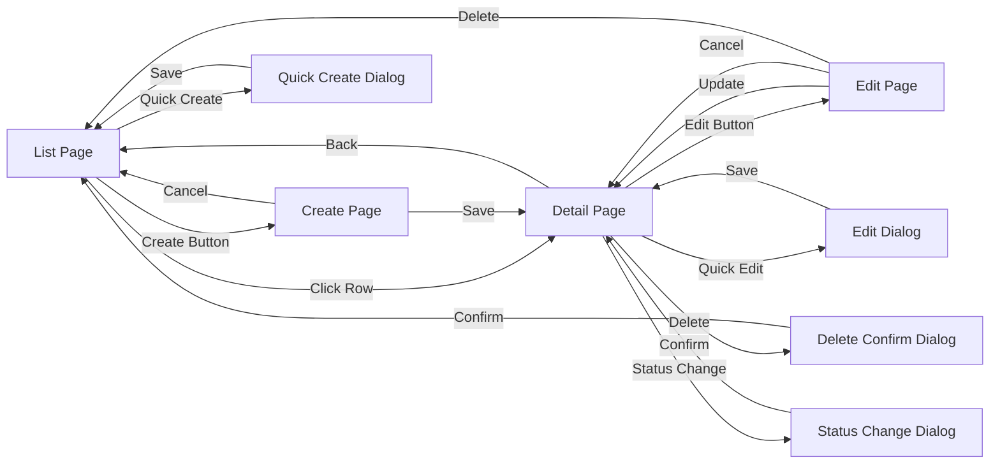

# Technical Specification: {Sub-Module Name}

## Module Information
- **Module**: {Module Name}
- **Sub-Module**: {Sub-Module Name}
- **Route**: {Application Route Path}
- **Version**: 1.0.0
- **Last Updated**: {YYYY-MM-DD}
- **Owner**: {Team/Person Name}
- **Status**: Draft | Review | Approved | Deprecated

## Document History
| Version | Date | Author | Changes |
|---------|------|--------|---------|
| 1.1.0 | 2025-12-10 | Documentation Team | Standardized reference number format (XXX-YYMM-NNNN) |
| 1.0.0 | {YYYY-MM-DD} | {Author} | Initial version |

---

## Overview

{Provide technical overview of the implementation. How does this sub-module work technically? What technologies are used? How does it fit into the overall architecture?}

**⚠️ IMPORTANT: This is a Technical Specification Document - TEXT FORMAT ONLY**
- **DO NOT include actual code** - describe implementation patterns in text
- **DO NOT include TypeScript/JavaScript code** - describe component responsibilities
- **DO NOT include SQL code** - refer to DD (Data Definition) document for database descriptions
- **DO include**: Architecture descriptions, component responsibilities, data flow descriptions, integration patterns
- **Focus on**: WHAT components do, HOW they interact, WHERE data flows - all in descriptive text

**Related Documents**:
- [Business Requirements](./BR-template.md) - Requirements in text format (no code)
- [Use Cases](./UC-template.md) - Use cases in text format (no code)
- [Data Definition](./DD-template.md) - Data definitions in text format (no SQL code)
- [Flow Diagrams](./FD-template.md) - Visual diagrams (no code)
- [Validations](./VAL-template.md) - Validation rules in text format (no code)

---

## Architecture

### High-Level Architecture

{Describe the architectural pattern used. Include diagram if helpful.}

```
┌─────────────┐
│   Client    │
│  (Browser)  │
└──────┬──────┘
       │ HTTP/HTTPS
       ▼
┌─────────────┐
│  Next.js    │
│   Server    │
├─────────────┤
│   React     │
│ Components  │
└──────┬──────┘
       │
       ▼
┌─────────────┐
│   Supabase  │
│  Database   │
└─────────────┘
```

### Component Architecture

{Describe major components and their relationships}

- **Frontend Layer**
  - Page Components
  - UI Components
  - State Management
  - API Client

- **Backend Layer**
  - API Routes / Server Actions
  - Business Logic
  - Data Access Layer
  - External Integrations

- **Data Layer**
  - Database Tables
  - Views
  - Stored Procedures
  - Triggers

---

## Technology Stack

### Frontend
- **Framework**: Next.js 14+ (App Router)
- **UI Library**: React 18+
- **Styling**: Tailwind CSS, Shadcn/ui components
- **State Management**: Zustand, React Query
- **Form Handling**: React Hook Form, Zod validation
- **Icons**: Lucide React
- **Date Handling**: date-fns

### Backend
- **Runtime**: Node.js 20+
- **Framework**: Next.js Server Actions / API Routes
- **Database**: PostgreSQL (via Supabase)
- **ORM**: Prisma (if applicable)
- **Authentication**: NextAuth.js / Supabase Auth
- **File Storage**: Supabase Storage

### Testing
- **Unit Tests**: Vitest
- **E2E Tests**: Playwright
- **API Tests**: Supertest

### DevOps
- **Version Control**: Git
- **CI/CD**: GitHub Actions
- **Hosting**: Vercel
- **Monitoring**: {Tool name}

---

## Component Structure

### Directory Structure

```
app/(main)/{module}/{sub-module}/
├── page.tsx                      # Main page component
├── [id]/
│   └── page.tsx                  # Detail page
├── components/
│   ├── {SubModule}List.tsx       # List component
│   ├── {SubModule}Detail.tsx     # Detail component
│   ├── {SubModule}Form.tsx       # Form component
│   ├── {SubModule}Filters.tsx    # Filter component
│   └── ...
├── types.ts                      # TypeScript types
├── actions.ts                    # Server actions
├── api.ts                        # API client functions
└── hooks/
    ├── use{SubModule}.ts         # Custom hooks
    └── ...
```

### Key Components

#### Page Component
**File**: `page.tsx`
**Purpose**: {Main page purpose}
**Responsibilities**:
- Render main page layout
- Fetch initial data via server actions
- Handle client-side routing
- Manage page-level state

#### List Component
**File**: `components/{SubModule}List.tsx`
**Purpose**: {Display list of items}
**Responsibilities**:
- Display paginated list of entities
- Handle sorting and filtering
- Manage selection state
- Trigger actions (view, edit, delete)
**Props**: Accepts array of items, selection handler, filter state

#### Form Component
**File**: `components/{SubModule}Form.tsx`
**Purpose**: {Create/edit form}
**Responsibilities**:
- Render form fields with validation
- Handle form submission
- Display validation errors
- Support draft saving
**Props**: Accepts initial data (for edit mode), submit handler, cancel handler

---

## Sitemap

### Overview
This section provides a complete navigation structure of all pages, tabs, and dialogues in the sub-module. The sitemap helps understand the user journey and the relationship between different UI elements.

### Page Hierarchy

```mermaid
graph TD
    A['{Sub-Module} Module'] --> B['List Page']
    A --> C['Detail Page']
    A --> D['Create Page']
    A --> E['Edit Page']

    B --> B1['Tab: All Items']
    B --> B2['Tab: Active']
    B --> B3['Tab: Archived']

    C --> C1['Tab: Overview']
    C --> C2['Tab: History']
    C --> C3['Tab: Related']

    B --> BD1['Dialog: Quick Create']
    B --> BD2['Dialog: Bulk Actions']
    B --> BD3['Dialog: Export']

    C --> CD1['Dialog: Edit']
    C --> CD2['Dialog: Delete Confirm']
    C --> CD3['Dialog: Status Change']

    D --> DD1['Dialog: Cancel Confirm']

    E --> ED1['Dialog: Save Draft']
    E --> ED2['Dialog: Discard Changes']
```

### Pages

#### 1. List Page
**Route**: `/app/(main)/{module}/{sub-module}`
**File**: `page.tsx`
**Purpose**: Display paginated list of all entities with filtering and sorting capabilities

**Sections**:
- Header: Title, breadcrumbs, primary actions (Create New, Import, Export)
- Filters: Quick filters, advanced filter panel
- Search: Global search with autocomplete
- Data Table: Sortable columns, row actions, bulk selection
- Pagination: Page size selector, page navigation

**Tabs** (if applicable):
- **All Items**: Shows all entities regardless of status
- **Active**: Filtered view showing only active entities
- **Draft**: Entities in draft status
- **Archived**: Soft-deleted or archived entities
- **Custom Filters**: User-saved filter combinations

**Dialogs Accessible From This Page**:
- **Quick Create Dialog**: Rapid entity creation with minimal fields
- **Bulk Actions Dialog**: Apply actions to multiple selected entities
- **Export Dialog**: Configure and download data exports
- **Filter Save Dialog**: Save current filter configuration
- **Import Dialog**: Upload and import bulk data

**Navigation Targets**:
- Click row → Navigate to Detail Page
- Create button → Navigate to Create Page
- Edit action → Navigate to Edit Page

---

#### 2. Detail Page
**Route**: `/app/(main)/{module}/{sub-module}/[id]`
**File**: `[id]/page.tsx`
**Purpose**: Display comprehensive view of a single entity with all related information

**Sections**:
- Header: Entity title, status badge, action menu
- Summary Card: Key information at a glance
- Tabbed Content Area: Organized information sections
- Activity Timeline: Recent changes and actions
- Related Entities: Links to associated records

**Tabs**:
- **Overview**: Main entity details, core fields, status information
- **Details**: Extended fields, additional information, metadata
- **History**: Audit trail, change log, approval history
- **Related Items**: Associated entities, references, dependencies
- **Documents**: Attached files, images, supporting documents
- **Comments**: Discussion thread, notes, internal communication
- **Activity**: Timeline of all actions and changes

**Dialogs Accessible From This Page**:
- **Edit Dialog**: Quick edit for specific fields (alternative to full edit page)
- **Delete Confirmation**: Confirm deletion with reason and impact warning
- **Status Change Dialog**: Change entity status with notes and validation
- **Share Dialog**: Configure sharing and permissions
- **Print Preview Dialog**: Configure and preview printable format
- **Clone Dialog**: Create copy with field selection
- **Archive Confirmation**: Soft delete with reason requirement
- **Approval Dialog**: Submit for approval with comments
- **Rejection Dialog**: Reject with reason and feedback

**Navigation Targets**:
- Edit button → Navigate to Edit Page
- Related entity links → Navigate to related Detail Pages
- Back to list → Navigate to List Page

---

#### 3. Create Page
**Route**: `/app/(main)/{module}/{sub-module}/new`
**File**: `new/page.tsx`
**Purpose**: Form interface for creating a new entity with full validation

**Sections**:
- Header: "Create New {Entity}" title, breadcrumbs
- Form Sections: Organized field groups with progressive disclosure
- Required Fields Indicator: Visual distinction for mandatory fields
- Validation Messages: Real-time field-level validation feedback
- Actions Footer: Save, Save as Draft, Cancel buttons

**Form Structure**:
- **Basic Information**: Core required fields
- **Details**: Extended optional fields
- **Configuration**: Settings and preferences
- **Attachments**: File upload area
- **Notes**: Free-text notes field

**Tabs** (for complex entities):
- **General**: Basic entity information
- **Advanced**: Additional configuration options
- **Permissions**: Access control settings
- **Metadata**: Tags, categories, custom fields

**Dialogs Accessible From This Page**:
- **Cancel Confirmation**: Confirm abandoning form with unsaved changes
- **Draft Saved Notification**: Confirmation of draft save
- **Lookup Dialog**: Search and select related entities
- **Field Help Dialog**: Contextual help for complex fields
- **Validation Error Summary**: Scrollable list of all validation errors
- **Template Selection**: Choose from predefined templates

**Navigation Targets**:
- Cancel → Navigate back to List Page
- Save → Navigate to Detail Page of created entity
- Save as Draft → Stay on page with success message

---

#### 4. Edit Page
**Route**: `/app/(main)/{module}/{sub-module}/[id]/edit`
**File**: `[id]/edit/page.tsx`
**Purpose**: Form interface for modifying an existing entity

**Sections**:
- Header: "Edit {Entity Name}" title, breadcrumbs, entity status
- Form Sections: Pre-populated fields with current values
- Change Tracking: Visual indicators for modified fields
- Version Warning: Alert if entity was modified by another user
- Actions Footer: Update, Cancel, Delete buttons

**Form Structure**: (Same as Create Page)

**Tabs**: (Same as Create Page)

**Dialogs Accessible From This Page**:
- **Discard Changes Confirmation**: Confirm abandoning unsaved modifications
- **Save Draft Dialog**: Save current state without validation
- **Delete Confirmation**: Confirm entity deletion with impact analysis
- **Concurrent Edit Warning**: Alert when entity modified by another user
- **Field Comparison**: Compare current values with original values
- **Validation Override**: Request approval for validation rule exceptions

**Navigation Targets**:
- Cancel → Navigate back to Detail Page
- Update → Navigate to Detail Page with success message
- Delete → Navigate to List Page with success message

---

### Dialogs

#### Modal Dialogs (Full Overlay)

##### Quick Create Dialog
**Trigger**: "Quick Create" button on List Page
**Purpose**: Rapid entity creation with only required fields
**Fields**: Minimal required fields only (3-5 fields)
**Actions**: Create, Cancel
**Behavior**: Creates entity and closes dialog, remains on List Page

##### Edit Dialog
**Trigger**: "Quick Edit" action on Detail Page or List row
**Purpose**: Edit specific fields without full edit page navigation
**Fields**: Editable subset of entity fields
**Actions**: Save, Cancel
**Behavior**: Updates entity and closes dialog, remains on current page

##### Delete Confirmation Dialog
**Trigger**: Delete action on Detail Page or List row
**Purpose**: Confirm deletion with impact assessment
**Content**:
- Warning message about irreversibility
- Impact summary (related entities, dependencies)
- Reason text field (optional or required)
- Checkbox: "I understand this action cannot be undone"
**Actions**: Delete (destructive), Cancel
**Behavior**: Deletes entity, navigates to List Page

##### Status Change Dialog
**Trigger**: Status change action on Detail Page
**Purpose**: Change entity status with validation and notes
**Content**:
- Current status → New status transition display
- Validation checks and warnings
- Required/optional comment field
- Additional required fields (based on status)
**Actions**: Confirm, Cancel
**Behavior**: Updates status, closes dialog, refreshes page

##### Bulk Actions Dialog
**Trigger**: Bulk actions menu on List Page (after selecting multiple rows)
**Purpose**: Apply action to multiple entities simultaneously
**Content**:
- Selected items count and preview list
- Action selector (Status change, Delete, Export, etc.)
- Action-specific fields
- Progress indicator during processing
**Actions**: Apply, Cancel
**Behavior**: Processes all selected items, shows results summary

##### Export Dialog
**Trigger**: Export button on List Page
**Purpose**: Configure data export parameters
**Content**:
- Format selector (CSV, Excel, PDF)
- Column selection
- Filter application option
- Date range selector
**Actions**: Export, Cancel
**Behavior**: Generates file, triggers download, closes dialog

---

#### Drawer Dialogs (Side Panel)

##### Filter Panel
**Trigger**: Filter button on List Page
**Purpose**: Apply advanced filtering criteria
**Sections**:
- Quick filters (predefined)
- Field-specific filters
- Date range filters
- Custom filter builder
**Actions**: Apply, Reset, Save Filter
**Behavior**: Filters list, remains open for refinement

##### Activity Timeline
**Trigger**: Activity icon on Detail Page
**Purpose**: View chronological history of entity changes
**Content**:
- Timeline of all actions
- User avatars and timestamps
- Change details with before/after values
- Filtering by action type or user
**Actions**: Close
**Behavior**: Read-only view, closes on outside click

##### Comments Panel
**Trigger**: Comments icon on Detail Page
**Purpose**: View and add comments on entity
**Content**:
- Comment thread (newest first)
- Rich text editor for new comment
- Mention functionality (@user)
- File attachment support
**Actions**: Post Comment, Close
**Behavior**: Adds comment, updates thread in real-time

---

#### Toast Notifications (Non-blocking)

##### Success Notifications
**Triggers**: Successful operations (Create, Update, Delete)
**Duration**: 3-5 seconds auto-dismiss
**Content**: Success icon, brief message, optional action link
**Position**: Top-right corner
**Actions**: Dismiss (X), Undo (if applicable)

##### Error Notifications
**Triggers**: Failed operations, validation errors
**Duration**: Auto-dismiss after 8 seconds or manual dismiss
**Content**: Error icon, error message, optional help link
**Position**: Top-right corner
**Actions**: Dismiss (X), Retry (if applicable)

##### Warning Notifications
**Triggers**: Important notices that don't block workflow
**Duration**: Manual dismiss only
**Content**: Warning icon, warning message, recommended action
**Position**: Top-right corner
**Actions**: Dismiss (X), View Details

---

### Navigation Flow Diagram



---

### User Journey Examples

#### Journey 1: Create New Entity
1. User lands on **List Page**
2. Clicks "Create New" button
3. Navigates to **Create Page**
4. Fills required fields across tabs
5. Clicks "Save"
6. Success toast appears
7. Navigates to **Detail Page** of new entity

#### Journey 2: Quick Edit from List
1. User on **List Page**
2. Clicks quick edit icon on row
3. **Edit Dialog** opens
4. Modifies fields
5. Clicks "Save"
6. Dialog closes
7. Success toast appears
8. List refreshes with updated data

#### Journey 3: Bulk Status Change
1. User on **List Page**
2. Selects multiple rows (checkboxes)
3. Clicks "Bulk Actions" button
4. **Bulk Actions Dialog** opens
5. Selects "Change Status" action
6. Selects new status
7. Clicks "Apply"
8. Progress indicator shows
9. Success summary appears
10. Dialog closes
11. List refreshes

---

### Accessibility Notes

**Keyboard Navigation**:
- List Page: Tab through rows, Enter to open detail
- Forms: Tab order follows logical field sequence
- Dialogs: Focus trap, Escape to close, Enter to confirm
- Filters: Keyboard shortcuts for common actions

**Screen Reader Support**:
- ARIA labels on all interactive elements
- Status announcements for async operations
- Meaningful heading hierarchy
- Form field associations with labels

**Focus Management**:
- Return focus to trigger element after dialog close
- Logical focus sequence in forms
- Skip links for main content areas
- Focus indicators on all interactive elements

---

## Data Flow

**NOTE**: Detailed data flow diagrams including read/write operations, system integrations, and data transformations are documented in the [Flow Diagrams (FD) document](./FD-template.md).

For quick reference, the general data flow follows:
- **Read**: Component → React Query → Server Action → Database → Cache Update → Component Update
- **Write**: Form → Validation → Server Action → Database → Cache Invalidation → UI Update

---

## Server Actions

### Overview
Server actions are located in `actions.ts` and handle all server-side operations including data validation, business logic execution, and database transactions.

### Create Operations

#### create{Entity}
**Purpose**: Create new entity
**Input**: Entity data conforming to input schema
**Validation**: Zod schema validation on server
**Returns**: Success result with created entity or error response
**Errors**: Validation errors, database constraint violations, business rule violations

### Read Operations

#### get{Entity}ById
**Purpose**: Fetch single entity by ID
**Input**: Entity UUID
**Returns**: Entity object or null if not found
**Authorization**: Check user has permission to view entity

#### list{Entities}
**Purpose**: Fetch filtered list of entities
**Input**: Filter options (status, date range, department, etc.)
**Returns**: Array of entities matching filters
**Pagination**: Supports page size and offset parameters

### Update Operations

#### update{Entity}
**Purpose**: Update existing entity
**Input**: Entity ID and partial entity data
**Validation**: Validate changed fields only
**Returns**: Updated entity or error response
**Concurrency**: Version checking to prevent concurrent update conflicts

### Delete Operations

#### delete{Entity}
**Purpose**: Soft delete or hard delete entity
**Input**: Entity ID
**Validation**: Check entity can be deleted (no dependencies)
**Returns**: Success confirmation or error response

---

## Database Schema

**NOTE**: Complete database definitions including entities, relationships, constraints, indexes, and stored procedures are documented in the [Data Definition (DD) document](./DD-template.md).

---

## State Management

### Global State (Zustand)

**Purpose**: Manage UI state that needs to be shared across multiple components
**Usage**: Used for filters, selected items, UI preferences, sidebar state
**Store Structure**:
- State properties: items array, selected item, filter state, UI flags
- Action methods: setters for state updates, filter updates, selection handlers
**When to Use**: Cross-component UI state, user preferences, temporary selections

### Server State (React Query)

**Purpose**: Manage server data with automatic caching and revalidation
**Query Keys**: Hierarchical key structure for cache invalidation
**Cache Strategy**: Stale-while-revalidate pattern
**Hooks Pattern**: Custom hooks wrap useQuery for each data type
**Invalidation**: Manual invalidation on mutations, automatic background refetch

---

## Security Implementation

### Authentication
{How authentication is implemented}

- Session management
- Token handling
- Refresh mechanism

### Authorization
{How authorization is enforced}

- Role-based access control
- Permission checks
- Resource-level security

### Data Protection
{How data is protected}

- Input validation
- SQL injection prevention
- XSS protection
- CSRF protection

### Audit Logging
All write operations are logged to audit trail including:
- Action type (CREATE, UPDATE, DELETE, APPROVE, REJECT)
- Entity type and ID
- User ID and timestamp
- Changes made (before/after values)
- IP address and session information

---

## Error Handling

### Client-Side Error Handling

**Try-Catch Pattern**: All server action calls wrapped in try-catch blocks
**User Feedback**: Toast notifications for success and error messages
**Error Display**: Inline validation errors on form fields
**Navigation**: Redirect on success, stay on page with errors
**Error Types Handled**:
- Validation errors: Display field-specific messages
- Authorization errors: Redirect to login or show access denied
- Network errors: Show retry option
- Generic errors: User-friendly message with support contact

### Server-Side Error Handling

**Validation Layer**: Zod schema validation before business logic
**Error Response Pattern**: Structured response with success flag, data or error message
**Error Logging**: All errors logged with context for debugging
**Database Transaction Rollback**: Automatic rollback on error
**Error Types**:
- ValidationError: Input validation failures
- AuthorizationError: Permission denied
- NotFoundError: Resource not found
- ConflictError: Duplicate or constraint violation
- DatabaseError: Database operation failures
- NetworkError**: External service connectivity issues

---

## Performance Optimization

### Frontend Optimization
- **Code Splitting**: Dynamic imports for large components
- **Lazy Loading**: Load data on demand
- **Memoization**: useMemo, useCallback for expensive operations
- **Virtualization**: For long lists
- **Debouncing**: Search and filter inputs

### Backend Optimization
- **Database Indexing**: Proper indexes on frequently queried fields
- **Query Optimization**: Efficient SQL queries
- **Caching**: React Query cache, server-side caching
- **Pagination**: Limit data returned per request
- **Batch Operations**: Reduce round trips

### Pagination Implementation

**Approach**: Server-side pagination with page number and page size parameters
**Calculation**: Calculate offset based on page and page size
**Query**: Parallel queries for data and total count
**Response**: Return data with pagination metadata (total, page, pageSize, totalPages)

---

## Testing Strategy

### Unit Tests

**Location**: `__tests__/unit/`
**Framework**: Vitest
**Coverage Target**: >80%
**Focus**:
- Test server actions with mock database
- Test business logic functions
- Test validation schemas
- Test utility functions
**Patterns**:
- Describe blocks group related tests
- Test success cases and error cases
- Mock external dependencies
- Use test fixtures for consistent data

### Integration Tests

**Location**: `__tests__/integration/`
**Framework**: Vitest with test database
**Coverage Target**: >70%
**Focus**:
- Test complete CRUD workflows
- Test database queries and transactions
- Test data validation at integration level
- Test error handling with real database
**Setup**: Test database setup before each test, cleanup after

### E2E Tests

**Location**: `e2e/`
**Framework**: Playwright
**Focus**:
- Test critical user workflows end-to-end
- Test cross-browser compatibility
- Test responsive design
- Test form submissions and validations
**Execution**: Run on staging before production deployment
**Patterns**:
- Use data-testid attributes for element selection
- Test happy paths and error paths
- Verify user feedback (messages, redirects)
- Take screenshots on failure

---

## Deployment Configuration

### Environment Variables

```env
# Database
DATABASE_URL="postgresql://..."
DIRECT_URL="postgresql://..."

# Authentication
NEXTAUTH_SECRET="..."
NEXTAUTH_URL="..."

# External Services
{SERVICE}_API_KEY='...'
{SERVICE}_API_URL='...'
```

### Build Configuration

Next.js configuration includes module-specific settings such as:
- Environment variable declarations
- Webpack customizations (if needed)
- Redirect rules
- Header configurations

### Database Migrations

```bash
# Create migration
npm run db:migrate:create {migration-name}

# Run migrations
npm run db:migrate

# Rollback
npm run db:migrate:rollback
```

---

## Dependencies

### npm Packages

| Package | Version | Purpose |
|---------|---------|---------|
| react | ^18.0.0 | UI library |
| next | ^14.0.0 | Framework |
| @tanstack/react-query | ^5.0.0 | Server state |
| zod | ^3.0.0 | Validation |
| ... | ... | ... |

### Internal Dependencies

- **Module**: {Dependent module name and reason}
- **Component**: {Shared component usage}
- **Utility**: {Shared utility functions}

---

## Monitoring and Logging

### Application Logging

All significant operations are logged using centralized logging utility:
- Info level: Successful operations with context
- Warning level: Recoverable errors or unusual conditions
- Error level: Failed operations with error details and context
- Debug level: Detailed execution information (development only)
**Log Structure**: Includes timestamp, log level, message, user ID, entity details, error stack traces

### Performance Monitoring

- Page load times
- API response times
- Database query performance
- Error rates

### Alerts

- Critical errors
- Performance degradation
- Security events
- Capacity warnings

---

## Technical Debt

{Document known technical debt and improvement opportunities}

| Item | Priority | Effort | Notes |
|------|----------|--------|-------|
| {Description} | High/Medium/Low | Small/Medium/Large | {Details} |

---

## Migration Guide

{If this replaces existing functionality, document migration steps}

### Migration Steps
1. {Step 1}
2. {Step 2}
3. {Step 3}

### Data Migration

Migration scripts handle data transformation from old structure to new structure. Scripts are idempotent and include rollback capability.

### Rollback Plan

{How to rollback if issues occur}

---

## Appendix

### Related Documents
- [Business Requirements](./BR-template.md)
- [Use Cases](./UC-template.md)
- [Data Definition](./DD-template.md)
- [Flow Diagrams](./FD-template.md)
- [Validations](./VAL-template.md)

### Useful Commands

```bash
# Development
npm run dev

# Testing
npm run test
npm run test:e2e

# Database
npm run db:migrate
npm run db:seed

# Deployment
npm run build
npm run start
```

---

**Document End**

> 📝 **Note to Authors**:
> - Remove all placeholder text and instructions
> - Ensure code examples are accurate and tested
> - Include actual database schemas and API contracts
> - Update diagrams to reflect actual architecture
> - Have document reviewed by tech lead
