# Price Lists - Flow Diagrams (FD)

## Document Information
- **Document Type**: Flow Diagrams Document
- **Module**: Vendor Management > Price Lists
- **Version**: 2.0.0
- **Last Updated**: 2025-11-26
- **Document Status**: Updated

## Document History

| Version | Date | Author | Changes |
|---------|------|--------|---------|
| 1.1.0 | 2025-12-10 | Documentation Team | Standardized reference number format (XXX-YYMM-NNNN) |
| 2.0.0 | 2025-11-26 | System | Complete rewrite to match BR v2.0.0 and actual code; Removed fictional flow diagrams (5-step wizard, bulk import, price comparison, approval workflows, price alerts, RFQ integration, scheduled jobs); Updated to reflect implemented functionality using Mermaid 8.8.2 syntax |
| 1.0.0 | 2025-11-19 | Documentation Team | Initial version |

**Note**: This document uses Mermaid 8.8.2 syntax for all diagrams. It reflects the actual implemented flows only.

---

## 1. Introduction

This document provides visual representations of workflows and processes in the Price Lists module using Mermaid diagrams. These diagrams complement the use cases and technical specifications by illustrating the flow of operations, decision points, and system interactions.

The Price Lists module enables procurement staff to view, create, and manage vendor price lists with MOQ-based pricing tiers.

---

## 2. System Architecture Diagram

### 2.1 High-Level Architecture

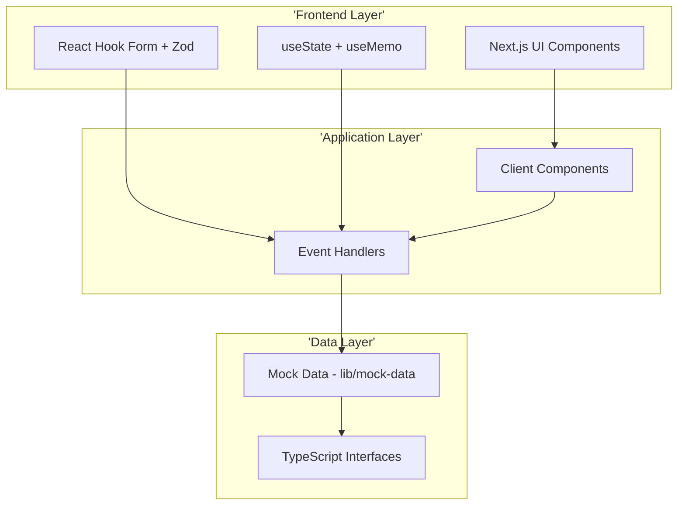

---

## 3. Navigation Flow

### 3.1 Module Navigation

```mermaid
graph LR
    Sidebar[Sidebar Navigation] --> VendorMgmt[Vendor Management]
    VendorMgmt --> PriceLists[Price Lists]
    PriceLists --> ListPage['/vendor-management/pricelists']
    ListPage --> AddPage['/vendor-management/pricelists/add']
    ListPage --> DetailPage['/vendor-management/pricelists/[id]']
```

### 3.2 Page Navigation Flow

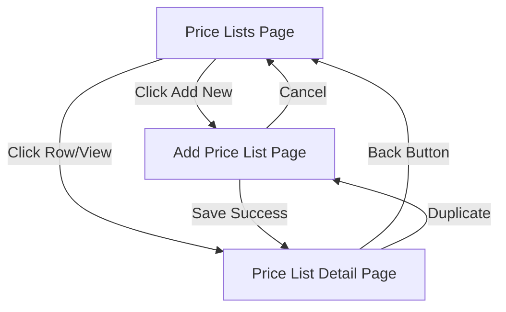

---

## 4. Price List Page Flows

### 4.1 View Price Lists Flow

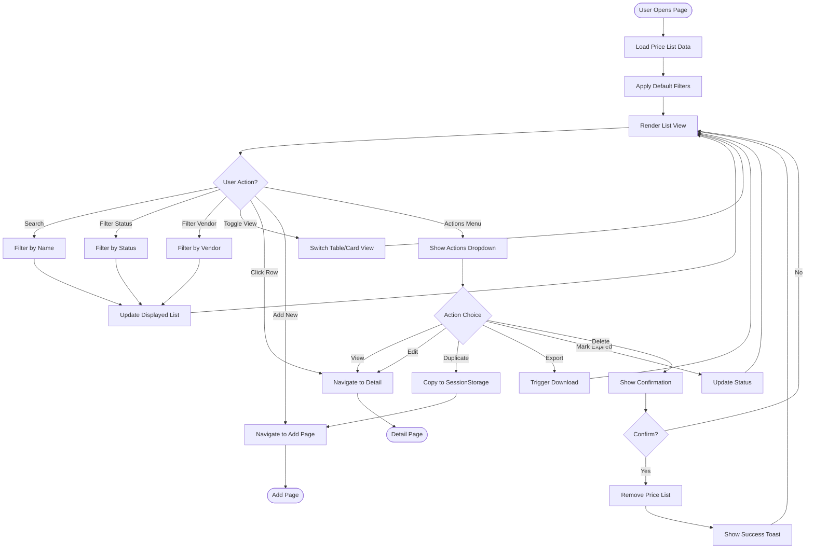

### 4.2 Filter Logic Flow

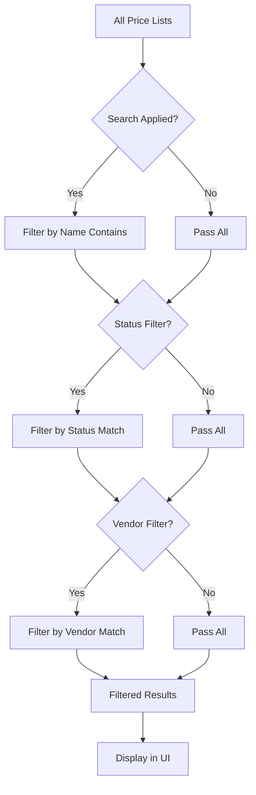

---

## 5. Create Price List Flow

### 5.1 Main Creation Flow

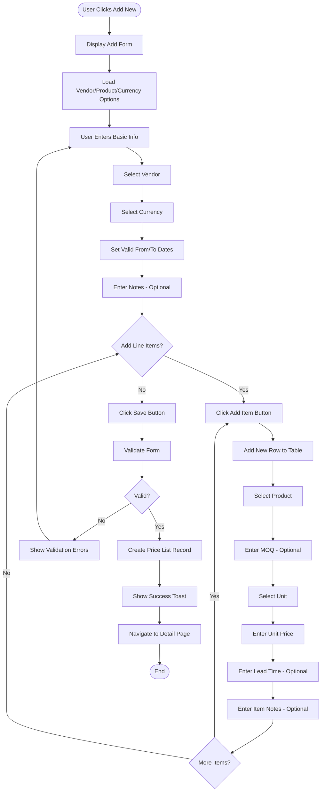

### 5.2 Form Validation Flow

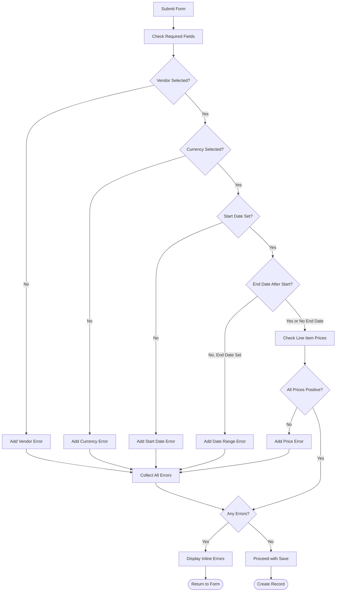

---

## 6. Price List Detail Flow

### 6.1 View Detail Flow

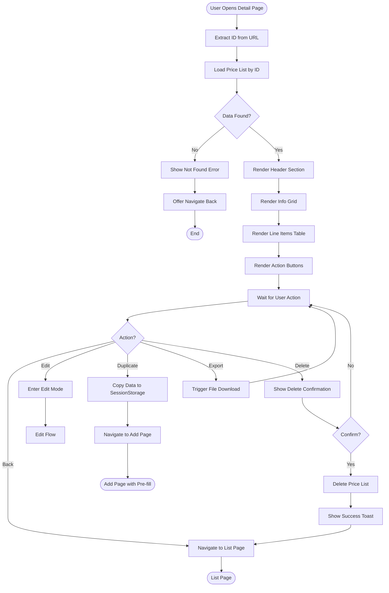

### 6.2 Actions Menu Flow

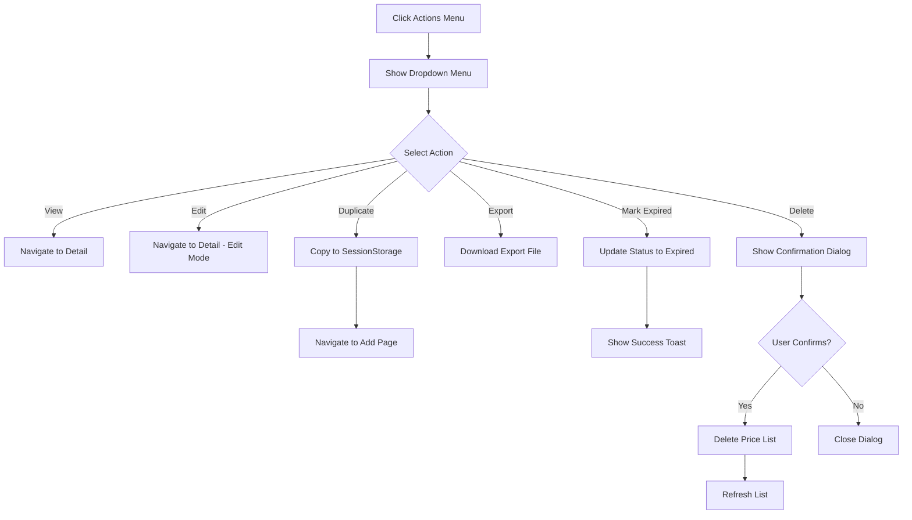

---

## 7. Duplicate Price List Flow

### 7.1 Duplicate Flow

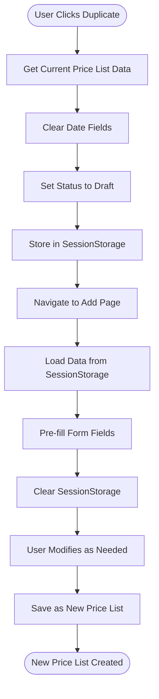

---

## 8. State Management Flow

### 8.1 Filter State Flow

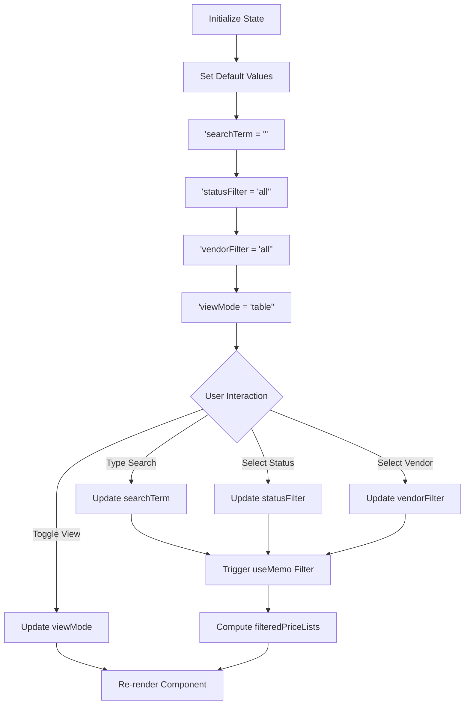

### 8.2 Form State Flow

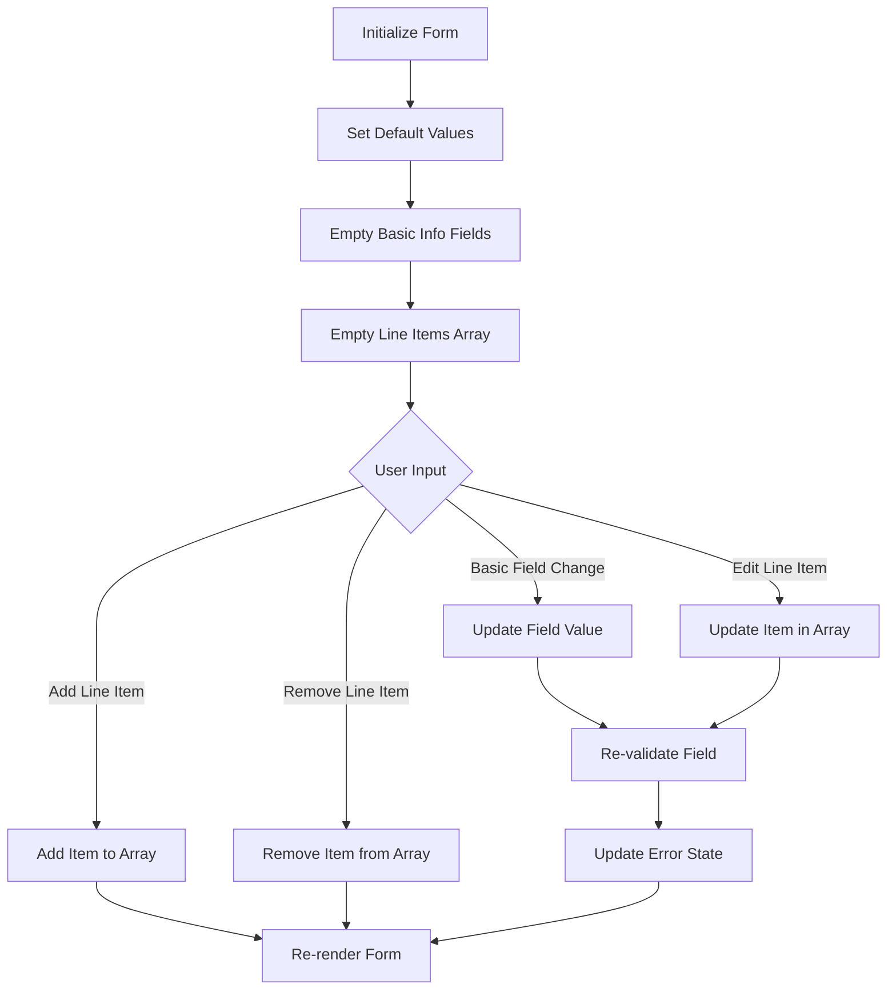

---

## 9. Component Hierarchy

### 9.1 Price List Page Components

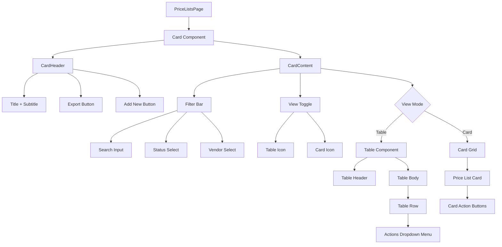

### 9.2 Add Page Components

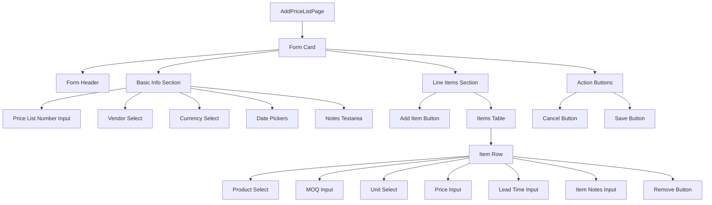

### 9.3 Detail Page Components

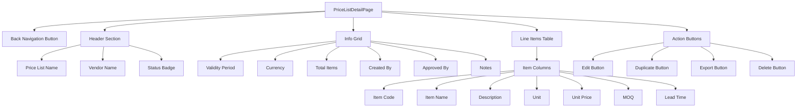

---

## 10. Status Display Flow

### 10.1 Status Badge Rendering

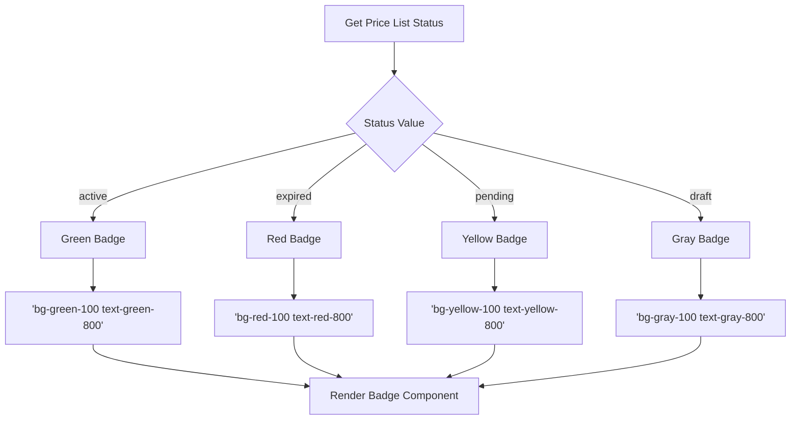

---

## 11. Error Handling Flow

### 11.1 Form Error Flow

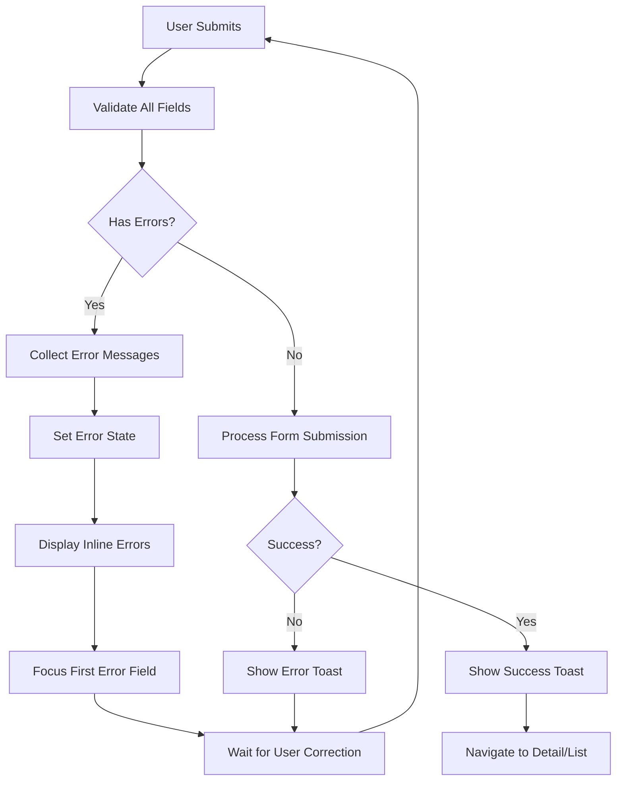

### 11.2 Data Loading Error Flow

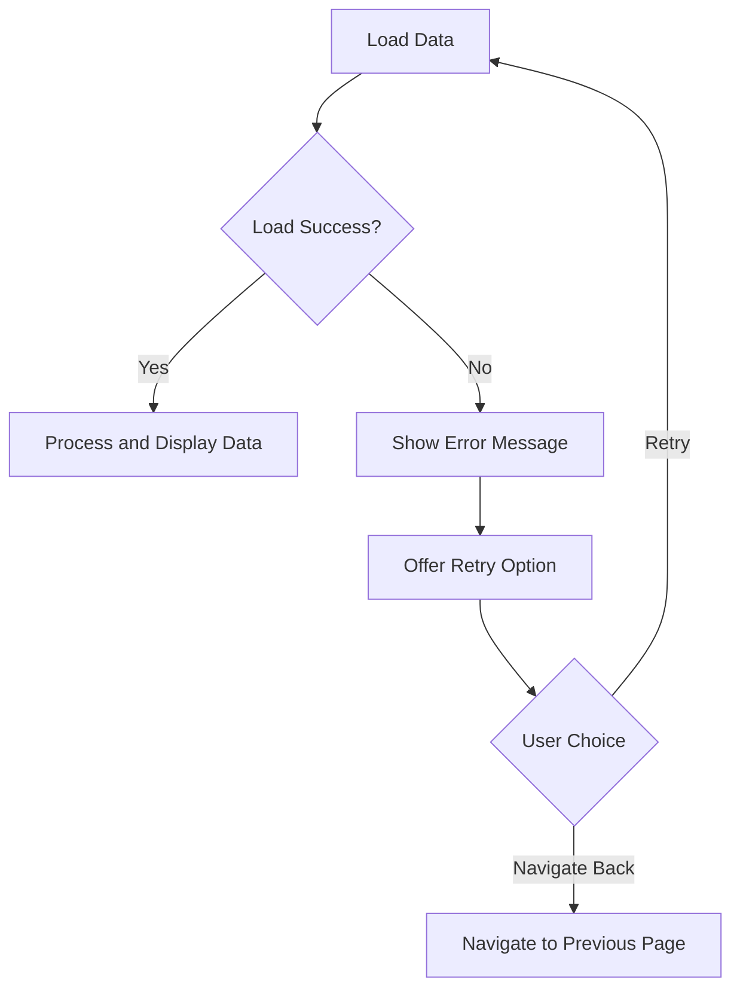

---

## 12. Related Documents

- [BR-price-lists.md](./BR-price-lists.md) - Business Requirements v2.0.0
- [DD-price-lists.md](./DD-price-lists.md) - Data Definition v2.1.0
- [TS-price-lists.md](./TS-price-lists.md) - Technical Specification v2.0.0
- [UC-price-lists.md](./UC-price-lists.md) - Use Cases v2.0.0
- [VAL-price-lists.md](./VAL-price-lists.md) - Validations v2.0.0

---

**End of Flow Diagrams Document**
