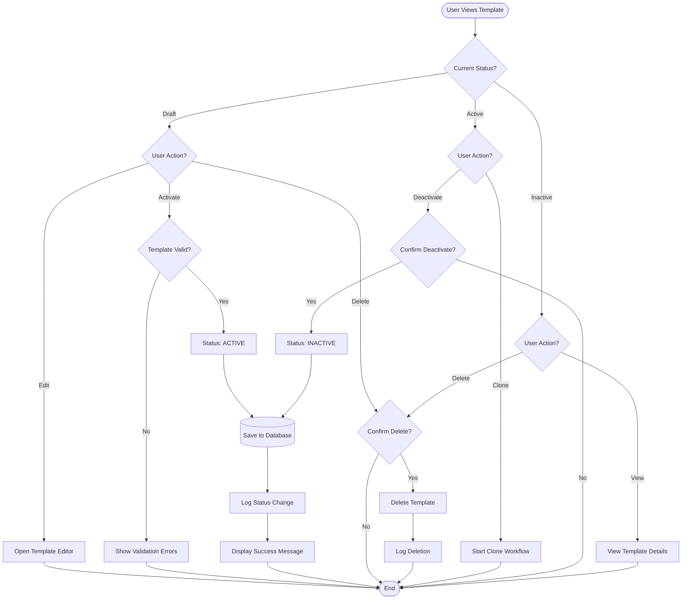

# Pricelist Templates - Flow Diagrams (FD)

## Document Information
- **Document Type**: Flow Diagrams Document
- **Module**: Vendor Management > Pricelist Templates
- **Version**: 2.0.0
- **Last Updated**: 2025-11-25
- **Document Status**: Active
- **Mermaid Compatibility**: 8.8.2+

## Document History

| Version | Date | Author | Changes |
|---------|------|--------|---------|
| 1.1.0 | 2025-12-10 | Documentation Team | Standardized reference number format (XXX-YYMM-NNNN) |
| 2.0.0 | 2025-11-25 | Documentation Team | Simplified to align with BR-pricelist-templates.md; Removed distribution, approval, notification, and submission tracking workflows; Streamlined to core template functionality |
| 1.1 | 2025-11-25 | Documentation Team | Updated Mermaid diagrams for 8.8.2 compatibility |
| 1.0 | 2024-01-15 | System | Initial creation |

---

## 1. Introduction

This document provides visual representations of workflows and processes in the Pricelist Templates module using Mermaid diagrams. The module enables organizations to create standardized pricing request templates that define products, units of measure, and specifications for vendor price submissions.

---

## 2. System Architecture Diagram

### 2.1 High-Level Architecture

---

## 3. Entity Relationship Diagram

### 3.1 Core Entities

---

## 4. Template Lifecycle State Diagram

### 4.1 Template Status Workflow

---

## 5. Core Workflows

### 5.1 Template Creation Workflow

### 5.2 Product Assignment Workflow

### 5.3 Template Cloning Workflow

### 5.4 Template Status Change Workflow

---

## 6. Search and Filter Workflow

### 6.1 Template Search Workflow

---

## 7. Integration Flow Diagrams

### 7.1 Price List Module Integration

### 7.2 Product Management Integration

---

## 8. Data Flow Diagrams

### 8.1 Template Creation Data Flow

### 8.2 Template Read Data Flow

---

## Related Documents
- BR-pricelist-templates.md - Business Requirements
- DD-pricelist-templates.md - Data Definition
- UC-pricelist-templates.md - Use Cases
- TS-pricelist-templates.md - Technical Specification
- VAL-pricelist-templates.md - Validations

---

**End of Flow Diagrams Document**
