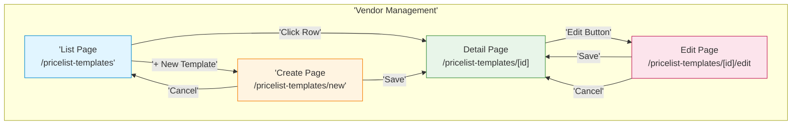

# Pricelist Templates - Technical Specification (TS)

## Document Information
- **Document Type**: Technical Specification (Sitemap)
- **Module**: Vendor Management > Pricelist Templates
- **Version**: 2.1.0
- **Last Updated**: 2025-11-25
- **Document Status**: Active
- **Mermaid Compatibility**: 8.8.2+

## Document History

| Version | Date | Author | Changes |
|---------|------|--------|---------|
| 1.1.0 | 2025-12-10 | Documentation Team | Standardized reference number format (XXX-YYMM-NNNN) |
| 2.1.0 | 2025-11-25 | Documentation Team | Restructured to sitemap-focused format; Removed implementation code |
| 2.0.0 | 2025-11-25 | Documentation Team | Simplified to align with BR-pricelist-templates.md |
| 1.0 | 2024-01-15 | System | Initial technical specification |

---

## 1. Module Overview

### 1.1 Purpose
The Pricelist Templates module provides a centralized system for creating, managing, and distributing standardized pricing templates to vendors.

### 1.2 Base Route
```
/vendor-management/pricelist-templates
```

### 1.3 File Structure
```
app/
└── (main)/
    └── vendor-management/
        └── pricelist-templates/
            ├── page.tsx                    # List Page
            ├── new/
            │   └── page.tsx                # Create Page
            ├── [id]/
            │   ├── page.tsx                # Detail Page
            │   └── edit/
            │       └── page.tsx            # Edit Page
            └── components/
                ├── template-list.tsx
                ├── template-form.tsx
                ├── template-detail.tsx
                └── product-selector.tsx
```

---

## 2. Sitemap Overview

### 2.1 Navigation Structure



### 2.2 Page Summary

| Page | Route | Purpose |
|------|-------|---------|
| List Page | `/pricelist-templates` | Browse and manage templates |
| Create Page | `/pricelist-templates/new` | Create new template |
| Detail Page | `/pricelist-templates/[id]` | View template details |
| Edit Page | `/pricelist-templates/[id]/edit` | Modify existing template |

---

## 3. Page Specifications

### 3.1 List Page

**Route**: `/vendor-management/pricelist-templates`

**Purpose**: Display paginated list of all pricelist templates with filtering and search capabilities.

#### Layout Structure

```
┌─────────────────────────────────────────────────────────────┐
│ HEADER                                                      │
│ ┌─────────────────────────────────────────────────────────┐ │
│ │ Breadcrumbs: Vendor Management > Pricelist Templates    │ │
│ │ Title: Pricelist Templates                              │ │
│ │ [+ New Template]                                        │ │
│ └─────────────────────────────────────────────────────────┘ │
├─────────────────────────────────────────────────────────────┤
│ TOOLBAR                                                     │
│ ┌─────────────────────────────────────────────────────────┐ │
│ │ [Search...               ] [Filter] [Export]            │ │
│ └─────────────────────────────────────────────────────────┘ │
├─────────────────────────────────────────────────────────────┤
│ TABS                                                        │
│ ┌─────────────────────────────────────────────────────────┐ │
│ │ [All] [Draft] [Active] [Inactive]                       │ │
│ └─────────────────────────────────────────────────────────┘ │
├─────────────────────────────────────────────────────────────┤
│ DATA TABLE                                                  │
│ ┌─────────────────────────────────────────────────────────┐ │
│ │ Name | Currency | Products | Status | Updated | Actions │ │
│ ├─────────────────────────────────────────────────────────┤ │
│ │ ...rows...                                              │ │
│ └─────────────────────────────────────────────────────────┘ │
├─────────────────────────────────────────────────────────────┤
│ PAGINATION                                                  │
│ ┌─────────────────────────────────────────────────────────┐ │
│ │ Showing 1-10 of 50    [Prev] [1] [2] [3] ... [Next]     │ │
│ └─────────────────────────────────────────────────────────┘ │
└─────────────────────────────────────────────────────────────┘
```

#### Tabs

| Tab | Filter | Description |
|-----|--------|-------------|
| All | None | All templates regardless of status |
| Draft | `status = 'draft'` | Templates being created/edited |
| Active | `status = 'active'` | Templates ready for use |
| Inactive | `status = 'inactive'` | Deactivated templates |

#### Table Columns

| Column | Type | Sortable | Description |
|--------|------|----------|-------------|
| Name | Text | Yes | Template name (clickable link) |
| Currency | Text | Yes | Default currency |
| Products | Number | Yes | Count of assigned products |
| Status | Badge | Yes | Draft / Active / Inactive |
| Updated | Date | Yes | Last modification date |
| Actions | Menu | No | Row action menu |

#### Row Actions

| Action | Condition | Description |
|--------|-----------|-------------|
| View | Always | Navigate to detail page |
| Edit | Always | Navigate to edit page |
| Clone | Always | Opens clone dialog |
| Activate | Status = Draft | Change status to Active |
| Deactivate | Status = Active | Change status to Inactive |
| Delete | Status ≠ Active | Soft delete template |

#### Dialogues

| Dialog | Trigger | Purpose |
|--------|---------|---------|
| Clone Template | Row action: Clone | Create copy with new name |
| Delete Confirm | Row action: Delete | Confirm deletion |
| Filter | Toolbar: Filter | Advanced filtering options |
| Export | Toolbar: Export | Export data (Excel/CSV) |

---

### 3.2 Detail Page

**Route**: `/vendor-management/pricelist-templates/[id]`

**Purpose**: Display comprehensive view of a single template including all assigned products.

#### Layout Structure

```
┌─────────────────────────────────────────────────────────────┐
│ HEADER                                                      │
│ ┌─────────────────────────────────────────────────────────┐ │
│ │ Breadcrumbs: ... > Pricelist Templates > [Template Name]│ │
│ │ Title: [Template Name]  [Status Badge]                  │ │
│ │ [Edit] [Clone] [Activate/Deactivate] [Delete]           │ │
│ └─────────────────────────────────────────────────────────┘ │
├─────────────────────────────────────────────────────────────┤
│ TABS                                                        │
│ ┌─────────────────────────────────────────────────────────┐ │
│ │ [Overview] [Products] [Activity Log]                    │ │
│ └─────────────────────────────────────────────────────────┘ │
├─────────────────────────────────────────────────────────────┤
│ TAB CONTENT                                                 │
│ ┌─────────────────────────────────────────────────────────┐ │
│ │ (Content varies by selected tab)                        │ │
│ └─────────────────────────────────────────────────────────┘ │
└─────────────────────────────────────────────────────────────┘
```

#### Tabs

##### Tab: Overview

| Section | Content |
|---------|---------|
| Basic Information | Name, Description, Status |
| Currency | Currency code and name |
| Effective Dates | From date, To date |
| Vendor Instructions | Instructions text |
| Summary | Product count, Created/Updated info |

##### Tab: Products

| Column | Type | Description |
|--------|------|-------------|
| # | Number | Sequence number |
| Product | Text | Product name and code |
| UOM | Text | Unit of measure |
| MOQ | Number | Minimum order quantity |
| Lead Time | Number | Lead time in days |

##### Tab: Activity Log

| Column | Type | Description |
|--------|------|-------------|
| Date/Time | DateTime | When action occurred |
| User | Text | Who performed action |
| Action | Text | What was done |
| Details | Text | Additional information |

#### Header Actions

| Action | Condition | Description |
|--------|-----------|-------------|
| Edit | Always | Navigate to edit page |
| Clone | Always | Opens clone dialog |
| Activate | Status = Draft | Opens status change dialog |
| Deactivate | Status = Active | Opens status change dialog |
| Delete | Status ≠ Active | Opens delete confirmation |

#### Dialogues

| Dialog | Trigger | Purpose |
|--------|---------|---------|
| Status Change | Activate/Deactivate button | Confirm status change |
| Clone Template | Clone button | Create copy with new name |
| Delete Confirm | Delete button | Confirm deletion |

---

### 3.3 Create Page

**Route**: `/vendor-management/pricelist-templates/new`

**Purpose**: Create a new pricelist template with product assignments.

#### Layout Structure

```
┌─────────────────────────────────────────────────────────────┐
│ HEADER                                                      │
│ ┌─────────────────────────────────────────────────────────┐ │
│ │ Breadcrumbs: ... > Pricelist Templates > New Template   │ │
│ │ Title: Create New Template                              │ │
│ │ [Cancel] [Save as Draft] [Save]                         │ │
│ └─────────────────────────────────────────────────────────┘ │
├─────────────────────────────────────────────────────────────┤
│ FORM - BASIC INFORMATION                                    │
│ ┌─────────────────────────────────────────────────────────┐ │
│ │ Template Name *: [________________________]             │ │
│ │ Description:     [________________________]             │ │
│ │ Currency:        [Select Currency      ▼]               │ │
│ │ Effective From:  [Date Picker]                          │ │
│ │ Effective To:    [Date Picker]                          │ │
│ │ Vendor Instructions:                                    │ │
│ │ [                                                     ] │ │
│ │ [                                                     ] │ │
│ └─────────────────────────────────────────────────────────┘ │
├─────────────────────────────────────────────────────────────┤
│ FORM - PRODUCT ASSIGNMENT                                   │
│ ┌───────────────────────┬───────────────────────────────────┐
│ │ PRODUCT SEARCH        │ SELECTED PRODUCTS                 │
│ │ [Search products...]  │ ┌───────────────────────────────┐ │
│ │ [Category Filter ▼]   │ │ # │ Product │ UOM │ MOQ │ LT │ │
│ │ ┌───────────────────┐ │ ├───────────────────────────────┤ │
│ │ │ Product 1    [+]  │ │ │ 1 │ Rice    │ bag │ 10  │ 7  │ │
│ │ │ Product 2    [+]  │ │ │ 2 │ Flour   │ bag │ 10  │ 7  │ │
│ │ │ Product 3    [+]  │ │ └───────────────────────────────┘ │
│ │ └───────────────────┘ │                                   │
│ └───────────────────────┴───────────────────────────────────┘
└─────────────────────────────────────────────────────────────┘
```

#### Form Fields

| Field | Type | Required | Validation |
|-------|------|----------|------------|
| Template Name | Text | Yes | 3-200 characters, unique |
| Description | Textarea | No | Max 2000 characters |
| Currency | Select | No | Valid currency |
| Effective From | Date | No | - |
| Effective To | Date | No | Must be after From date |
| Vendor Instructions | Textarea | No | Max 5000 characters |
| Products | Table | Yes | At least 1 product (BR-PT-002) |

#### Product Assignment Fields

| Field | Type | Required | Validation |
|-------|------|----------|------------|
| Product | Select | Yes | Valid product |
| UOM | Text | Yes | Non-empty |
| MOQ | Number | No | > 0 if specified |
| Lead Time | Number | No | > 0 if specified |

#### Dialogues

| Dialog | Trigger | Purpose |
|--------|---------|---------|
| Cancel Confirm | Cancel button (if unsaved changes) | Confirm discarding changes |

---

### 3.4 Edit Page

**Route**: `/vendor-management/pricelist-templates/[id]/edit`

**Purpose**: Modify an existing pricelist template.

#### Layout Structure

Same as Create Page with pre-populated data.

#### Header Actions

| Action | Description |
|--------|-------------|
| Cancel | Return to detail page (with confirmation if changes) |
| Save | Save changes and return to detail page |

#### Dialogues

| Dialog | Trigger | Purpose |
|--------|---------|---------|
| Discard Changes | Cancel button (if unsaved changes) | Confirm discarding changes |

---

## 4. Navigation Flow

### 4.1 Primary User Flows

```mermaid
flowchart TD
    subgraph CreateFlow['Create Template Flow']
        L1[List Page] -->|"Click + New Template"| C1[Create Page]
        C1 -->|'Fill Form'| C2[Add Products]
        C2 -->|'Save'| D1[Detail Page]
        C1 -->|'Cancel'| L1
    end

    subgraph EditFlow['Edit Template Flow']
        L2[List Page] -->|"Click Row"| D2[Detail Page]
        D2 -->|'Click Edit'| E1[Edit Page]
        E1 -->|'Save'| D2
        E1 -->|'Cancel'| D2
    end

    subgraph StatusFlow['Status Change Flow']
        D3[Detail Page] -->|"Click Activate"| S1{Status Dialog}
        S1 -->|'Confirm'| D4[Detail Page - Active]
        D4 -->|'Click Deactivate'| S2{Status Dialog}
        S2 -->|'Confirm'| D5[Detail Page - Inactive]
    end

    subgraph CloneFlow['Clone Template Flow']
        D6[Detail Page] -->|"Click Clone"| CL1{Clone Dialog}
        CL1 -->|'Enter Name + Confirm'| D7[New Template Detail]
    end
```



### 4.2 Quick Actions

| From | Action | To |
|------|--------|-----|
| List Page | Click row | Detail Page |
| List Page | + New Template | Create Page |
| List Page | Row action: Edit | Edit Page |
| List Page | Row action: Clone | Clone Dialog → Detail Page |
| Detail Page | Edit button | Edit Page |
| Detail Page | Clone button | Clone Dialog → Detail Page |
| Create Page | Save | Detail Page |
| Create Page | Cancel | List Page |
| Edit Page | Save | Detail Page |
| Edit Page | Cancel | Detail Page |

---

## 5. Component Specifications

### 5.1 Template List Component

**File**: `components/template-list.tsx`

**Props**:
| Prop | Type | Description |
|------|------|-------------|
| templates | Template[] | Array of templates to display |
| onEdit | (id: string) => void | Edit action handler |
| onClone | (id: string) => void | Clone action handler |
| onDelete | (id: string) => void | Delete action handler |
| onStatusChange | (id: string, status: string) => void | Status change handler |

### 5.2 Template Form Component

**File**: `components/template-form.tsx`

**Props**:
| Prop | Type | Description |
|------|------|-------------|
| initialData | Template? | Existing data for edit mode |
| mode | 'create' \| 'edit' | Form mode |
| onSubmit | (data: FormData) => void | Submit handler |
| onCancel | () => void | Cancel handler |

### 5.3 Product Selector Component

**File**: `components/product-selector.tsx`

**Props**:
| Prop | Type | Description |
|------|------|-------------|
| selectedProducts | ProductAssignment[] | Currently selected products |
| onProductsChange | (products: ProductAssignment[]) => void | Change handler |

### 5.4 Template Detail Component

**File**: `components/template-detail.tsx`

**Props**:
| Prop | Type | Description |
|------|------|-------------|
| template | Template | Template data with details |
| onEdit | () => void | Edit action handler |
| onClone | () => void | Clone action handler |
| onDelete | () => void | Delete action handler |
| onStatusChange | (status: string) => void | Status change handler |

---

## 6. State Management

### 6.1 Server State (React Query)

| Query Key | Data | Cache Time |
|-----------|------|------------|
| `['templates']` | Template list | 5 minutes |
| `['templates', id]` | Single template | 5 minutes |
| `['products', search, category]` | Product search results | 1 minute |
| `['currencies']` | Currency list | 10 minutes |

### 6.2 Form State (React Hook Form)

| Form | Fields | Validation |
|------|--------|------------|
| Template Form | name, description, currencyId, effectiveFrom, effectiveTo, vendorInstructions, products | Zod schema |

---

## 7. Access Control

### 7.1 Page Access by Role

| Role | List | Detail | Create | Edit | Delete |
|------|------|--------|--------|------|--------|
| Procurement Manager | ✅ | ✅ | ✅ | ✅ | ✅ |
| Procurement Staff | ✅ | ✅ | ✅ (draft) | ✅ (own) | ❌ |
| Finance Manager | ✅ | ✅ | ❌ | ❌ | ❌ |
| Department Manager | ✅ (dept) | ✅ (dept) | ❌ | ❌ | ❌ |
| Executive | ✅ | ✅ | ❌ | ❌ | ❌ |

### 7.2 Action Permissions

| Action | Permission Required |
|--------|---------------------|
| View templates | `view_templates` |
| Create template | `create_templates` |
| Edit template | `edit_templates` or owner of draft |
| Activate template | `activate_templates` |
| Delete template | `delete_templates` |
| Clone template | `create_templates` |

---

## Related Documents
- BR-pricelist-templates.md - Business Requirements
- DD-pricelist-templates.md - Data Definition
- FD-pricelist-templates.md - Flow Diagrams
- VAL-pricelist-templates.md - Validations
- UC-pricelist-templates.md - Use Cases

---

**End of Technical Specification Document**
