# Requests for Pricing (Price Collection Campaigns) - Flow Diagrams (FD)

## Document Information
- **Document Type**: Flow Diagrams Document
- **Module**: Vendor Management > Requests for Pricing
- **Version**: 2.0.0
- **Last Updated**: 2025-11-26
- **Document Status**: Updated
- **Mermaid Version**: 8.8.2

## Document History

| Version | Date | Author | Changes |
|---------|------|--------|---------|
| 1.1.0 | 2025-12-10 | Documentation Team | Standardized reference number format (XXX-YYMM-NNNN) |
| 2.0.0 | 2025-11-26 | System | Complete rewrite to match BR v2.0.0 and actual code; Removed fictional RFQ features (bidding, evaluation, awards, contracts); Updated to reflect Price Collection Campaign functionality; Updated mermaid syntax to 8.8.2 |
| 1.0 | 2024-01-15 | System | Initial flow diagrams document |

---

## 1. Introduction

This document provides visual representations of workflows and processes in the Requests for Pricing module using Mermaid 8.8.2 diagrams. These diagrams illustrate the flow of operations for price collection campaigns, from creation through vendor invitation and progress tracking.

The module enables procurement staff to create pricing collection campaigns, invite vendors to submit pricing, and track submission progress.

---

## 2. System Architecture Diagram

### 2.1 High-Level Architecture

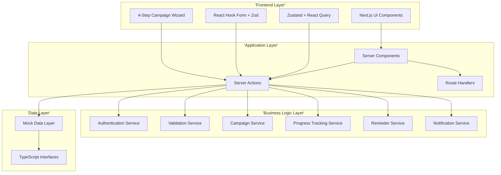

---

## 3. Campaign Lifecycle State Diagram

### 3.1 Campaign Status States

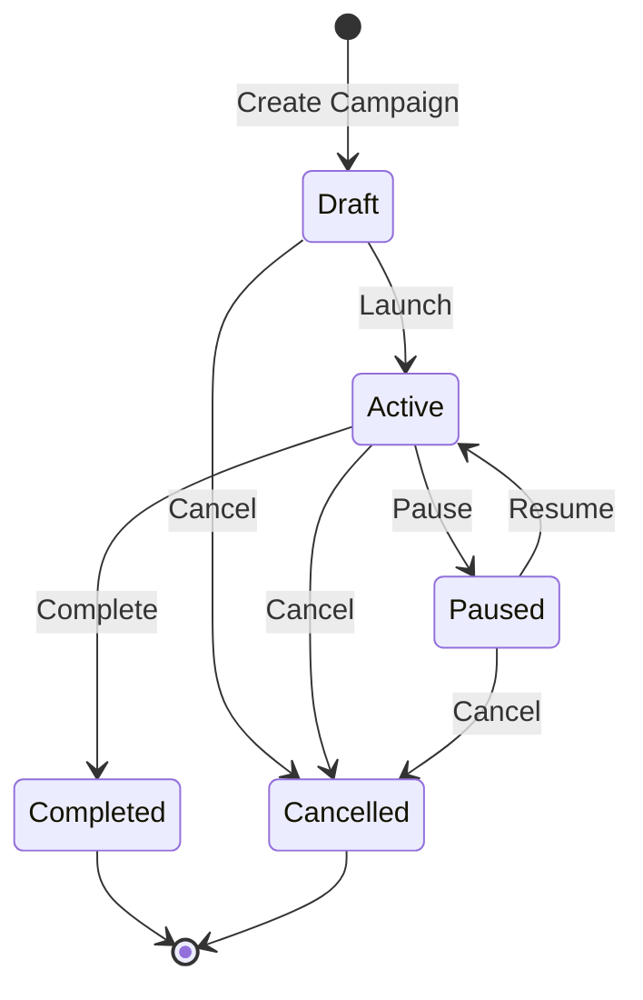

### 3.2 Status Transitions with Actions

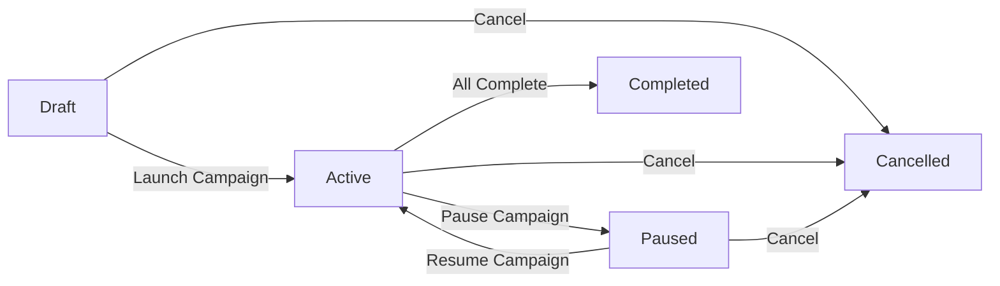

---

## 4. Core Workflows

### 4.1 Campaign List Workflow (FR-RFP-001)

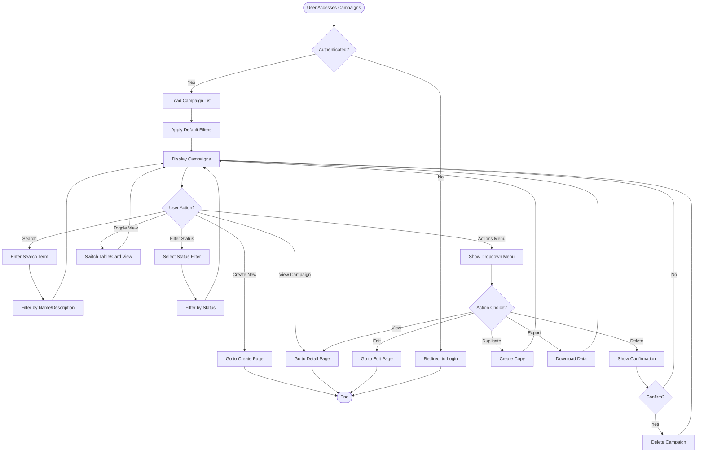

### 4.2 Campaign Creation Wizard Workflow (FR-RFP-002)

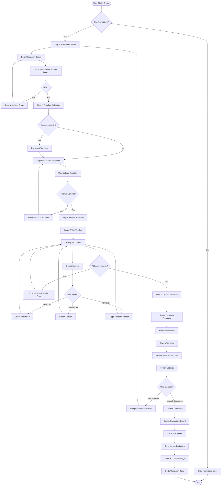

### 4.3 Campaign Detail View Workflow (FR-RFP-005)

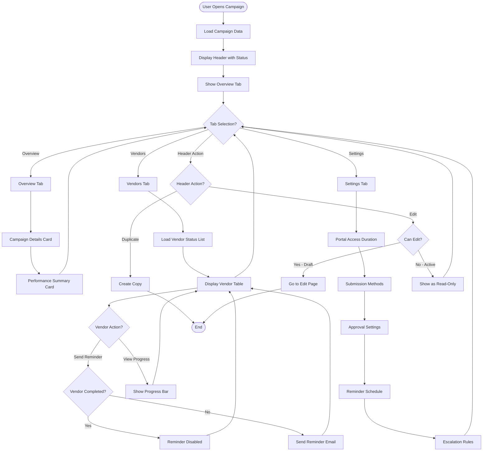

### 4.4 Vendor Selection Workflow (FR-RFP-010)

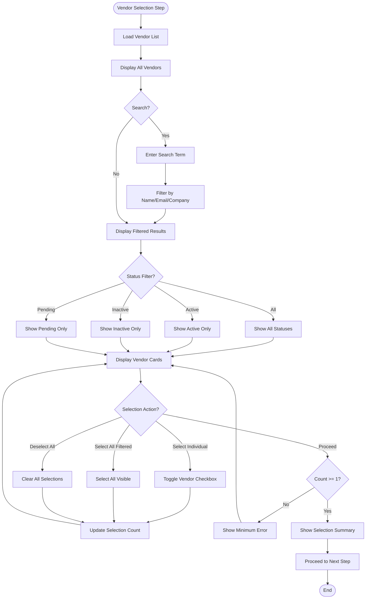

### 4.5 Progress Tracking Workflow (FR-RFP-006)

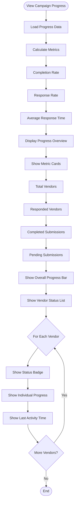

---

## 5. Data Flow Diagrams

### 5.1 Campaign Creation Data Flow

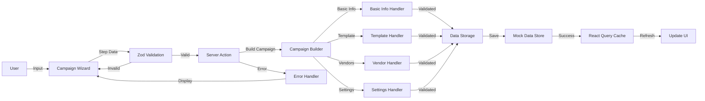

### 5.2 Campaign List Data Flow

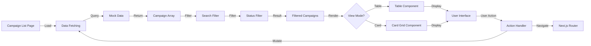

### 5.3 Vendor Selection Data Flow

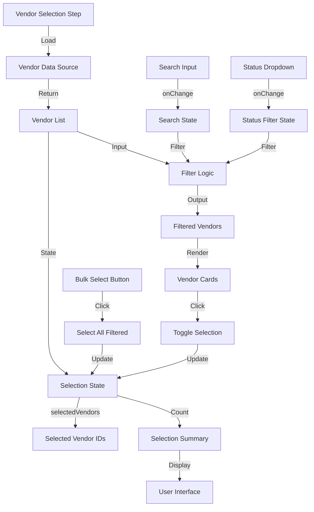

---

## 6. UI Navigation Flows

### 6.1 Campaign Module Navigation

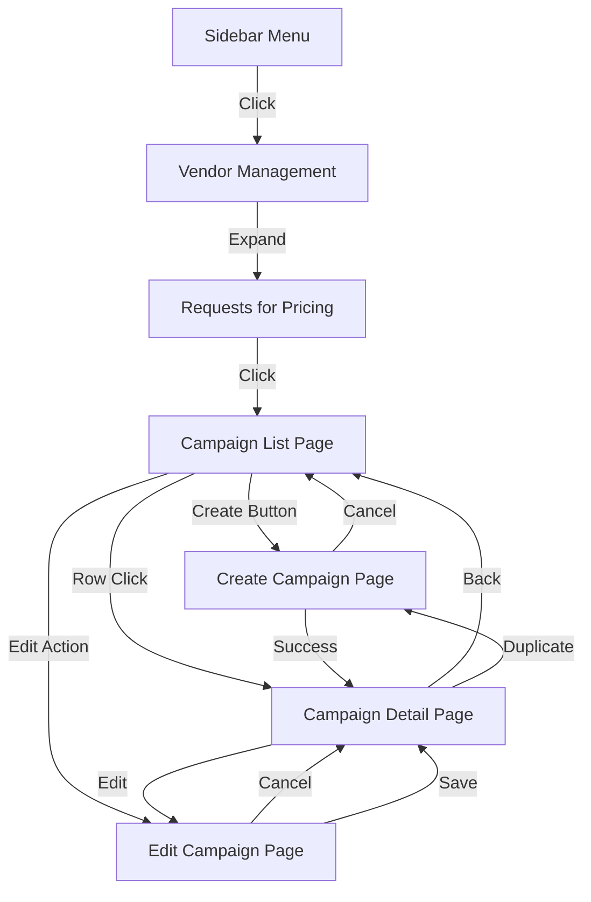

### 6.2 Campaign Create Wizard Navigation

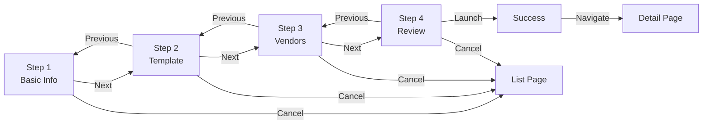

### 6.3 Campaign Detail Tabs Navigation

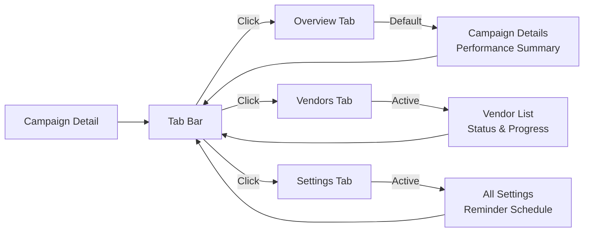

---

## 7. Action Workflows

### 7.1 Duplicate Campaign Workflow

```mermaid
flowchart TD
    Start([Click Duplicate]) --> LoadCampaign[Load Original Campaign]
    LoadCampaign --> CopyData[Copy Campaign Data]
    CopyData --> ModifyName[Add ' (Copy)' to Name]
    ModifyName --> ResetStatus[Set Status: Draft]
    ResetStatus --> ResetProgress[Reset Progress Metrics]
    ResetProgress --> CreateNew[Create New Campaign]
    CreateNew --> ShowToast[Show Success Toast]
    ShowToast --> NavigateNew[Navigate to New Campaign]
    NavigateNew --> End([End])
```

### 7.2 Send Reminder Workflow

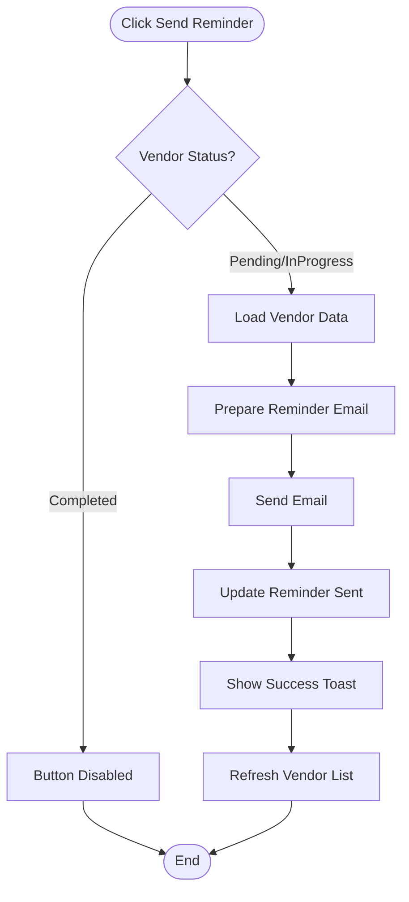

### 7.3 Delete Campaign Workflow

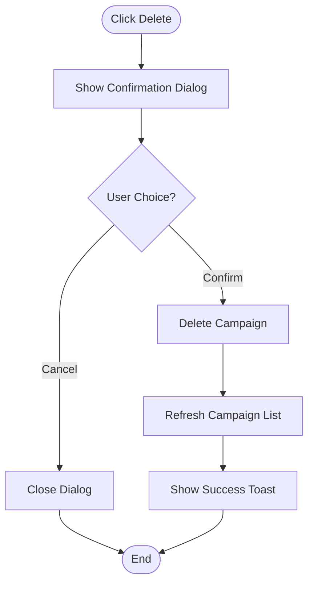

---

## 8. Settings Configuration Flows

### 8.1 Reminder Schedule Configuration

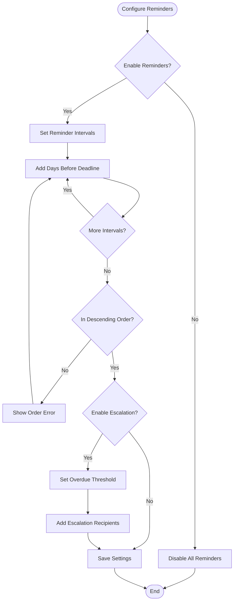

### 8.2 Recurring Pattern Configuration

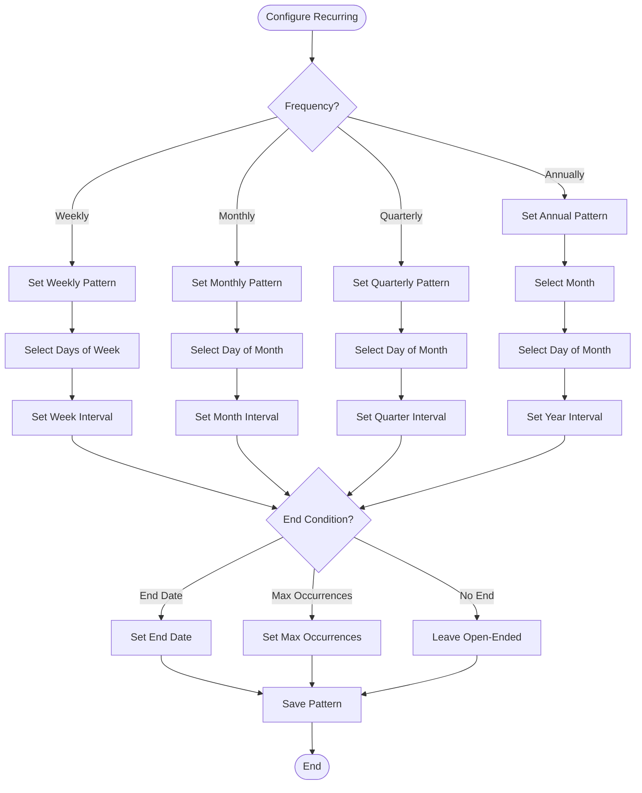

---

## 9. Integration Flow Diagrams

### 9.1 Template Integration Flow

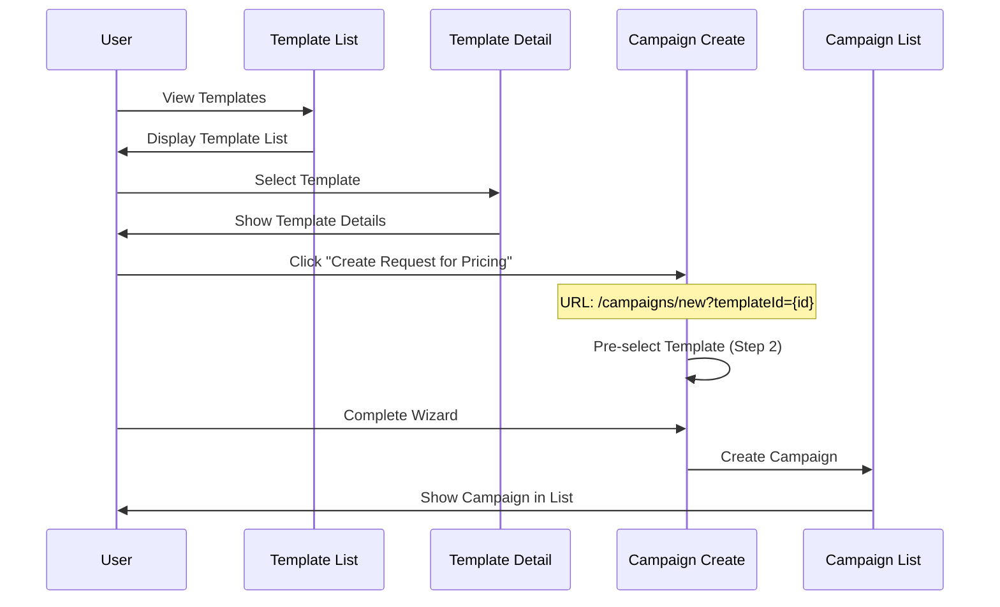

### 9.2 Vendor Directory Integration Flow

```mermaid
sequenceDiagram
    participant U as User
    participant CW as Campaign Wizard
    participant VS as Vendor Selection
    participant VD as Vendor Directory

    U->>CW: Start Campaign Creation
    CW->>VS: Navigate to Step 3
    VS->>VD: Query Vendors
    VD->>VS: Return Vendor List
    VS->>U: Display Vendors with Search/Filter
    U->>VS: Search by Name/Email
    VS->>VD: Filter Vendors
    VD->>VS: Return Filtered List
    VS->>U: Display Filtered Vendors
    U->>VS: Select Vendors
    VS->>CW: Store Selected Vendor IDs
    CW->>U: Proceed to Step 4
```

---

## 10. Error Handling Flows

### 10.1 Form Validation Error Flow

```mermaid
flowchart TD
    Start([User Submits Form]) --> Validate[Zod Validation]

    Validate --> CheckResult{Valid?}

    CheckResult -->|Yes| ProcessData[Process Data]
    ProcessData --> Success[Success Response]
    Success --> End([End])

    CheckResult -->|No| CollectErrors[Collect Validation Errors]
    CollectErrors --> MapToFields[Map Errors to Fields]
    MapToFields --> HighlightFields[Highlight Invalid Fields]
    HighlightFields --> ShowMessages[Show Error Messages]
    ShowMessages --> FocusFirst[Focus First Invalid Field]
    FocusFirst --> End
```

### 10.2 API Error Flow

```mermaid
flowchart TD
    Start([API Call]) --> TryRequest[Execute Request]

    TryRequest --> CheckResponse{Success?}

    CheckResponse -->|Yes| ReturnData[Return Data]
    ReturnData --> UpdateUI[Update UI]
    UpdateUI --> End([End])

    CheckResponse -->|No| CheckErrorType{Error Type?}

    CheckErrorType -->|Network| ShowNetworkError[Show Network Error Toast]
    CheckErrorType -->|Auth| RedirectLogin[Redirect to Login]
    CheckErrorType -->|Validation| ShowValidationError[Show Validation Errors]
    CheckErrorType -->|Server| ShowServerError[Show Server Error Toast]
    CheckErrorType -->|Unknown| ShowGenericError[Show Generic Error Toast]

    ShowNetworkError --> End
    RedirectLogin --> End
    ShowValidationError --> End
    ShowServerError --> End
    ShowGenericError --> End
```

---

## 11. Related Documents

- [BR-requests-for-pricing.md](./BR-requests-for-pricing.md) - Business Requirements v2.0.0
- [DD-requests-for-pricing.md](./DD-requests-for-pricing.md) - Data Definition
- [TS-requests-for-pricing.md](./TS-requests-for-pricing.md) - Technical Specification
- [UC-requests-for-pricing.md](./UC-requests-for-pricing.md) - Use Cases
- [VAL-requests-for-pricing.md](./VAL-requests-for-pricing.md) - Validations

---

**End of Flow Diagrams Document**
