# Vendor Directory - Flow Diagrams (FD)

## Document Information
- **Document Type**: Flow Diagrams Document
- **Module**: Vendor Management > Vendor Directory
- **Version**: 2.2.0
- **Last Updated**: 2025-11-25
- **Document Status**: Updated
- **Mermaid Version**: 8.8.2+

## Document History

| Version | Date | Author | Changes |
|---------|------|--------|---------|
| 1.1.0 | 2025-12-10 | Documentation Team | Standardized reference number format (XXX-YYMM-NNNN) |
| 2.2.0 | 2025-11-25 | System | Added certification management workflow; Updated address workflow for Asian international format |
| 2.1.0 | 2025-11-25 | System | Added multi-address and multi-contact workflows with primary designation |
| 2.0.0 | 2025-11-25 | System | Updated to match actual code implementation |
| 1.0 | 2024-01-15 | System | Initial creation |

---

## 1. Introduction

This document provides visual representations of all workflows and processes in the Vendor Directory module using Mermaid diagrams. These diagrams complement the use cases and technical specifications by illustrating the flow of operations, decision points, and system interactions.

---

## 2. System Architecture Diagram

### 2.1 High-Level Architecture

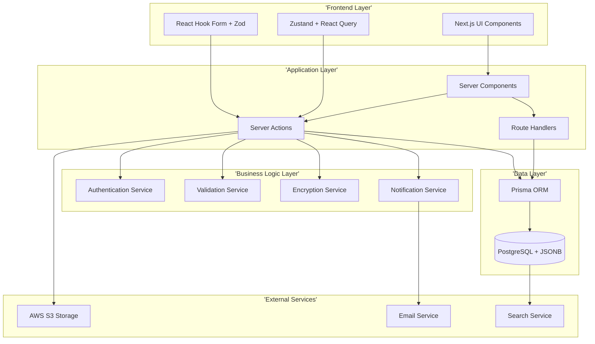

---

## 3. Data Flow Diagrams

### 3.1 Vendor Data Flow

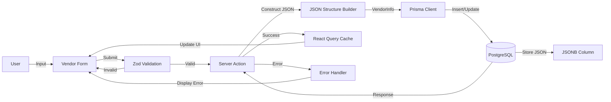

### 3.2 Document Upload Flow

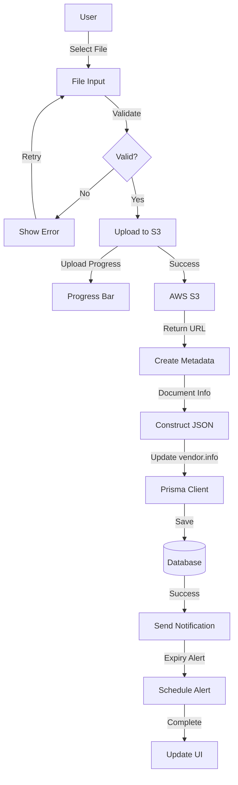

---

## 4. Core Workflows

### 4.1 Vendor Creation Workflow

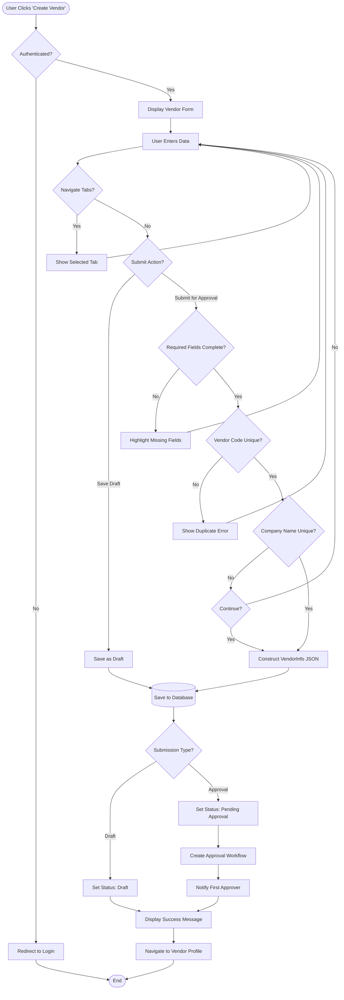

### 4.2 Vendor Approval Workflow

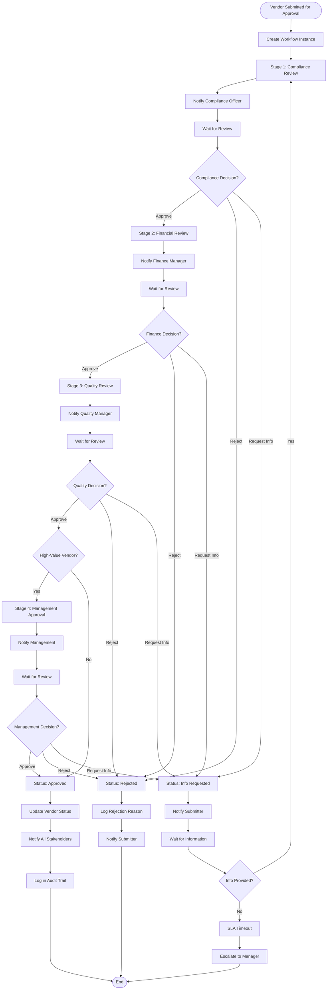

### 4.3 Vendor Edit Workflow

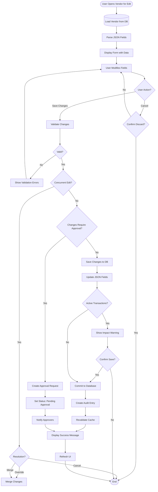

### 4.4 Document Upload Workflow

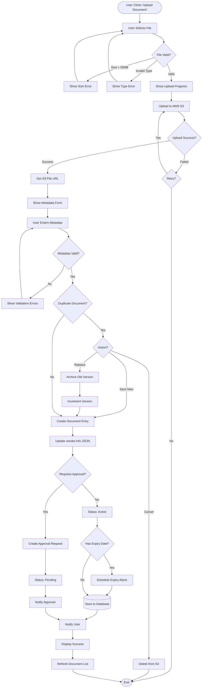

---

## 5. Search and Filter Workflows

### 5.1 Vendor Search Workflow

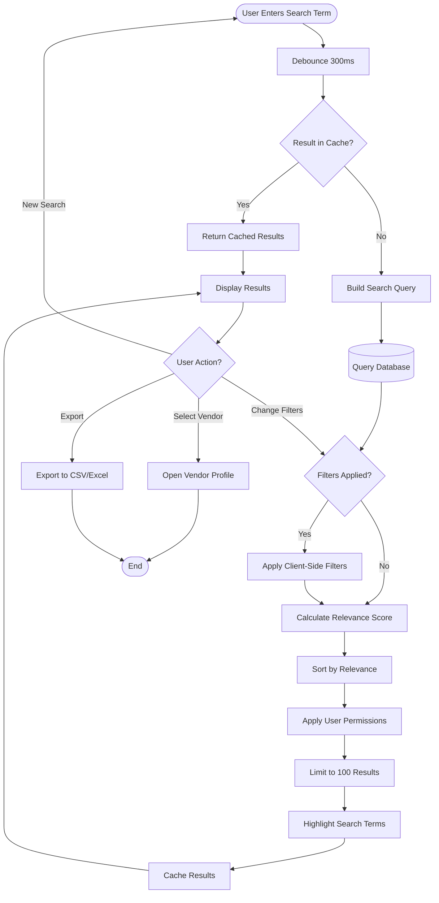

### 5.2 Advanced Filter Workflow

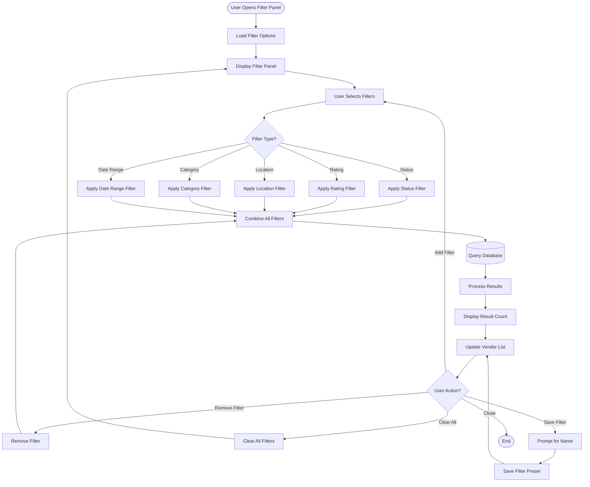

---

## 6. Performance Tracking Workflows

### 6.1 Automated Performance Calculation

```mermaid
flowchart TD
    Start([Monthly Cron Job Triggers]) --> SelectVendors[Select Eligible Vendors]
    SelectVendors --> CheckEligibility{Min 5 Transactions?}

    CheckEligibility -->|No| Skip[Skip Vendor]
    CheckEligibility -->|Yes| FetchData[Fetch Transaction Data]

    FetchData --> GatherPOs[Gather Purchase Orders]
    GatherPOs --> GatherGRNs[Gather GRN Data]
    GatherGRNs --> GatherInvoices[Gather Invoice Data]
    GatherInvoices --> GatherIssues[Gather Issue Tickets]

    GatherIssues --> CalcQuality[Calculate Quality Score]
    CalcQuality --> QualityFormula['Quality = 100 - (defect_rate * 40) - (reject_rate * 30) - (complaint_impact * 30)']

    QualityFormula --> CalcDelivery[Calculate Delivery Score]
    CalcDelivery --> DeliveryFormula['Delivery = (on_time / total) * 100']

    DeliveryFormula --> CalcService[Calculate Service Score]
    CalcService --> ServiceFormula['Service = 100 - (response_delay * 2) - (unresolved * 10)']

    ServiceFormula --> CalcPricing[Calculate Pricing Score]
    CalcPricing --> PricingFormula['Pricing = 100 - (price_variance * 2)']

    PricingFormula --> ApplyWeights[Apply Weights]
    ApplyWeights --> OverallFormula['Overall = Quality * 0.35 + Delivery * 0.30 + Service * 0.20 + Pricing * 0.15']

    OverallFormula --> Compare{Rating Change >10 points?}
    Compare -->|Yes| FlagChange[Flag Significant Change]
    Compare -->|No| SaveRating

    FlagChange --> SendAlert[Send Alert to Manager]
    SendAlert --> SaveRating[Save Rating to JSON]

    SaveRating --> UpdateHistory[Update Performance History]
    UpdateHistory --> CheckThreshold{Rating < 60?}

    CheckThreshold -->|Yes| TriggerPIP[Trigger Performance Improvement Plan]
    CheckThreshold -->|No| CheckHigh{Rating >= 90 for 6 months?}

    TriggerPIP --> NotifyManager[Notify Vendor Manager]
    CheckHigh -->|Yes| SuggestPreferred[Suggest Preferred Status]
    CheckHigh -->|No| Complete

    SuggestPreferred --> NotifyManager
    NotifyManager --> Complete[Mark Complete]
    Complete --> NextVendor{More Vendors?}

    NextVendor -->|Yes| SelectVendors
    NextVendor -->|No| GenerateReport[Generate Monthly Report]
    GenerateReport --> End([End])

    Skip --> NextVendor
```

### 6.2 Manual Performance Review

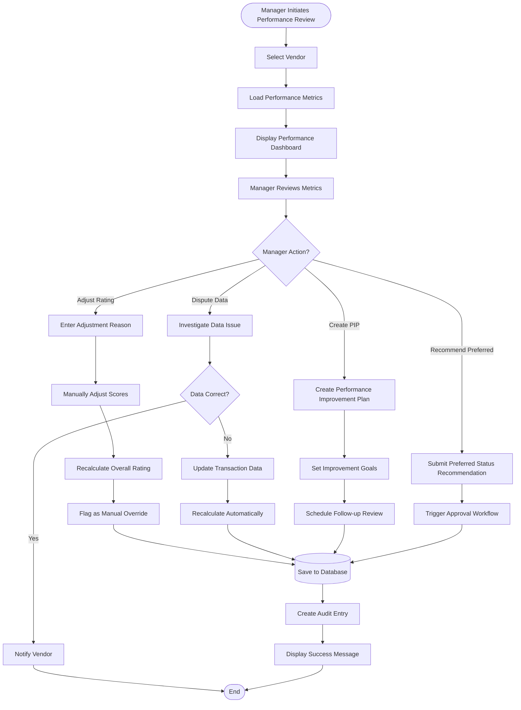

---

## 7. Status Change Workflows

### 7.1 Block Vendor Workflow

```mermaid
flowchart TD
    Start([Manager Initiates Block Vendor]) --> CheckAuth{Has Permission?}
    CheckAuth -->|No| PermissionError[Show Permission Error]
    PermissionError --> End([End])

    CheckAuth -->|Yes| CheckImpact[Check Impact]
    CheckImpact --> CountPOs[Count Active POs]
    CountPOs --> CountInvoices[Count Pending Invoices]
    CountInvoices --> CountBalance[Check Outstanding Balance]

    CountBalance --> DisplaySummary[Display Impact Summary]
    DisplaySummary --> CheckType{Vendor Type?}

    CheckType -->|Strategic| StrategicWarning[Show Strategic Vendor Warning]
    StrategicWarning --> RequireExecutive[Require Executive Approval]
    CheckType -->|Sole Source| SoleSourceWarning[Show Sole Source Warning]
    SoleSourceWarning --> RequireExecutive
    CheckType -->|Regular| EnterReason

    RequireExecutive --> EnterReason[Enter Block Reason]
    EnterReason --> ReasonType{Reason Type?}

    ReasonType -->|Quality| QualityDetails[Enter Quality Issue Details]
    ReasonType -->|Delivery| DeliveryDetails[Enter Delivery Failure Details]
    ReasonType -->|Compliance| ComplianceDetails[Enter Compliance Issue Details]
    ReasonType -->|Financial| FinancialDetails[Enter Financial Concern Details]
    ReasonType -->|Other| OtherDetails[Enter Other Reason]

    QualityDetails --> EnterNotes
    DeliveryDetails --> EnterNotes
    ComplianceDetails --> EnterNotes
    FinancialDetails --> EnterNotes
    OtherDetails --> EnterNotes[Enter Detailed Notes]

    EnterNotes --> SetDuration{Block Type?}
    SetDuration -->|Temporary| SetDays[Set Number of Days]
    SetDuration -->|Pending Review| SetReview[Set Review Date]
    SetDuration -->|Indefinite| RequireApproval

    SetDays --> NotifyVendor{Notify Vendor?}
    SetReview --> NotifyVendor

    NotifyVendor -->|Yes| ComposeNotification[Compose Notification]
    ComposeNotification --> RequireApproval
    NotifyVendor -->|No| RequireApproval{Requires Approval?}

    RequireApproval -->|Yes| SubmitApproval[Submit for Approval]
    SubmitApproval --> WaitApproval[Wait for Approval]
    WaitApproval --> ApprovalDecision{Approved?}
    ApprovalDecision -->|No| NotifyRejection[Notify Manager]
    NotifyRejection --> End
    ApprovalDecision -->|Yes| ApplyBlock

    RequireApproval -->|No| ApplyBlock[Apply Block Status]
    ApplyBlock --> UpdateJSON[Update vendor.info]
    UpdateJSON --> SetEffectiveDate[Set Effective Date]
    SetEffectiveDate --> PreventNewPOs[Prevent New PO Creation]
    PreventNewPOs --> AllowExisting[Allow Existing PO Processing]

    AllowExisting --> SendNotifications[Send Notifications]
    SendNotifications --> NotifyProcurement[Notify Procurement Team]
    NotifyProcurement --> NotifyFinance[Notify Finance Team]
    NotifyFinance --> NotifyVendorEmail{Vendor Notification?}

    NotifyVendorEmail -->|Yes| SendVendorEmail[Send Email to Vendor]
    SendVendorEmail --> LogAction
    NotifyVendorEmail -->|No| LogAction[Log in Audit Trail]

    LogAction --> CheckTemporary{Temporary Block?}
    CheckTemporary -->|Yes| ScheduleReview[Schedule Review Reminder]
    ScheduleReview --> DisplaySuccess
    CheckTemporary -->|No| DisplaySuccess[Display Success Message]

    DisplaySuccess --> UpdateBadge[Add BLOCKED Badge]
    UpdateBadge --> RefreshUI[Refresh Vendor Profile]
    RefreshUI --> End
```

### 7.2 Unblock/Reactivate Vendor

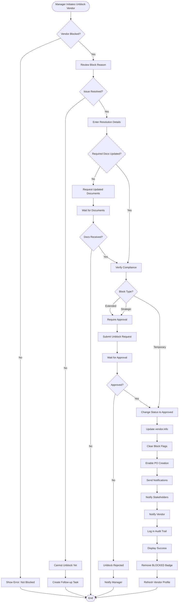

---

## 8. Contact Management Workflows

### 8.1 Add Contact Workflow

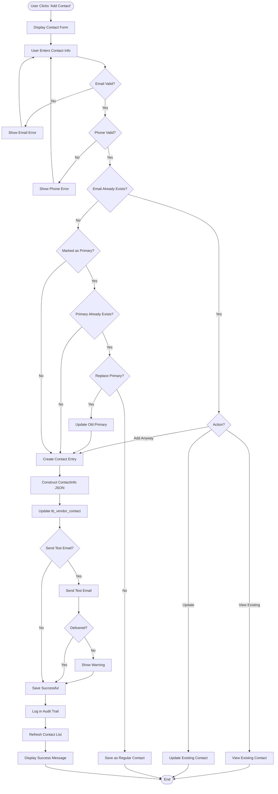

### 8.2 Address Management Workflow (Asian International Format)

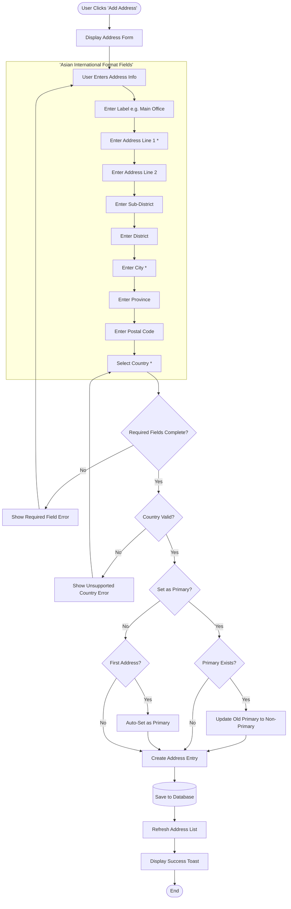

**Supported Countries (15):**
- Thailand, Singapore, Malaysia, Indonesia, Vietnam
- Philippines, Myanmar, Cambodia, Laos, Brunei
- China, Japan, South Korea, India, United States

---

## 9. Certification Management Workflows

### 9.1 Add Certification Workflow

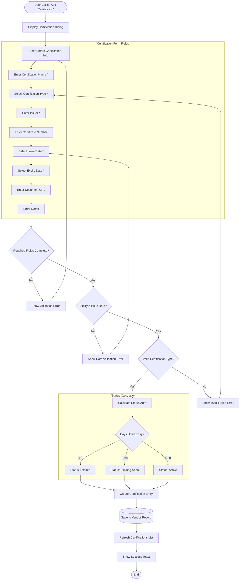

### 9.2 Edit Certification Workflow

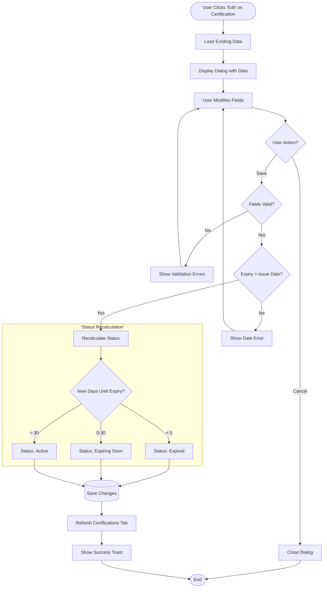

### 9.3 Delete Certification Workflow

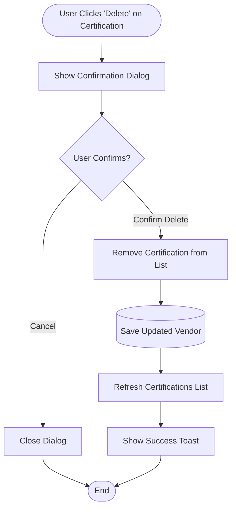

### 9.4 Certification Status Auto-Calculation Flow

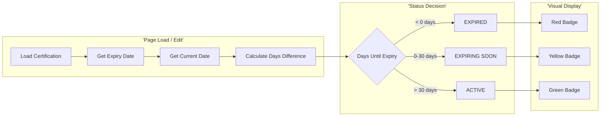

### 9.5 Certification Types Reference

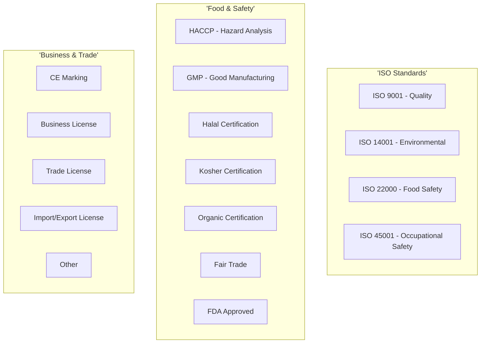

---

## 10. Integration Workflows

### 10.1 Vendor Selection in Purchase Order

```mermaid
flowchart TD
    Start([User Creates Purchase Order]) --> SelectVendor[Click 'Select Vendor']
    SelectVendor --> ShowModal[Show Vendor Selection Modal]

    ShowModal --> SearchVendors[Search/Filter Vendors]
    SearchVendors --> ApplyFilters[Apply Filters]
    ApplyFilters --> FilterStatus{Status Filter}

    FilterStatus --> OnlyApproved[Show Only Approved/ Preferred Vendors]
    OnlyApproved --> FilterLocation{Location Filter}
    FilterLocation --> MatchLocation[Match PO Location]
    MatchLocation --> FilterCatalog{Product Filter}
    FilterCatalog --> MatchProducts[Match Product Categories]

    MatchProducts --> DisplayResults[Display Filtered Vendors]
    DisplayResults --> UserSelects[User Selects Vendor]
    UserSelects --> CheckStatus{Vendor Status Valid?}

    CheckStatus -->|Blocked| BlockedError[Show Error: Vendor Blocked]
    CheckStatus -->|Blacklisted| BlacklistError[Show Error: Vendor Blacklisted]
    CheckStatus -->|Inactive| InactiveError[Show Error: Vendor Inactive]

    BlockedError --> SearchVendors
    BlacklistError --> SearchVendors
    InactiveError --> SearchVendors

    CheckStatus -->|Approved/Preferred| LoadVendorData[Load Vendor Data]
    LoadVendorData --> ParseJSON[Parse vendor.info JSON]
    ParseJSON --> AutoFill[Auto-fill PO Fields]

    AutoFill --> FillAddress[Fill Vendor Address]
    FillAddress --> FillContact[Fill Primary Contact]
    FillContact --> FillPaymentTerms[Fill Payment Terms]
    FillPaymentTerms --> FillCurrency[Fill Default Currency]
    FillCurrency --> FillCreditLimit[Check Credit Limit]

    FillCreditLimit --> CheckLimit{Within Credit Limit?}
    CheckLimit -->|No| CreditWarning[Show Credit Limit Warning]
    CreditWarning --> RequireApproval[Require Additional Approval]
    RequireApproval --> CompleteFill

    CheckLimit -->|Yes| CompleteFill[Complete Auto-fill]
    CompleteFill --> CloseModal[Close Modal]
    CloseModal --> UpdatePO[Update PO Form]
    UpdatePO --> EnableNext[Enable Next Step]
    EnableNext --> End([End])
```

### 10.2 Performance Data Update from GRN

```mermaid
flowchart TD
    Start([GRN Created/ Updated]) --> ExtractData[Extract GRN Data]
    ExtractData --> GetVendor[Get Vendor ID]
    GetVendor --> LoadVendor[Load Vendor Record]

    LoadVendor --> ParseJSON[Parse vendor.info]
    ParseJSON --> GetPerformance[Get Performance Object]

    GetPerformance --> UpdateQuality[Update Quality Metrics]
    UpdateQuality --> DefectRate[Calculate Defect Rate]
    DefectRate --> RejectRate[Calculate Reject Rate]
    RejectRate --> ComplaintImpact[Calculate Complaint Impact]

    ComplaintImpact --> UpdateDelivery[Update Delivery Metrics]
    UpdateDelivery --> OnTimeStatus{Delivered On Time?}
    OnTimeStatus -->|Yes| IncrementOnTime[Increment On-Time Count]
    OnTimeStatus -->|No| IncrementLate[Increment Late Count]

    IncrementOnTime --> CalcDeliveryRate
    IncrementLate --> CalcDeliveryRate[Calculate Delivery Rate]
    CalcDeliveryRate --> UpdateQuantity[Update Quantity Accuracy]

    UpdateQuantity --> CheckTransactions{Transaction Count >= 5?}
    CheckTransactions -->|No| SaveMetrics[Save Updated Metrics]
    CheckTransactions -->|Yes| RecalcRating[Recalculate Overall Rating]

    RecalcRating --> ApplyWeights[Apply Weighted Formula]
    ApplyWeights --> CompareOld{Significant Change?}
    CompareOld -->|Yes| TriggerAlert[Trigger Rating Alert]
    TriggerAlert --> SaveMetrics
    CompareOld -->|No| SaveMetrics

    SaveMetrics --> UpdateJSON[Update vendor.info JSON]
    UpdateJSON --> SaveDB[(Save to Database)]
    SaveDB --> CheckThreshold{Rating Below Threshold?}

    CheckThreshold -->|Yes| NotifyManager[Notify Vendor Manager]
    NotifyManager --> LogUpdate
    CheckThreshold -->|No| LogUpdate[Log Update in Audit]

    LogUpdate --> End([End])
```

---

## 11. Notification Workflows

### 11.1 Document Expiry Alert Workflow

```mermaid
flowchart TD
    Start([Daily Cron Job Triggers]) --> QueryDocuments[Query Documents with Expiry]
    QueryDocuments --> FilterExpiring[Filter Expiring Documents]

    FilterExpiring --> CheckDays{Days Until Expiry?}
    CheckDays -->|90 Days| Create90DayAlert
    CheckDays -->|60 Days| Create60DayAlert
    CheckDays -->|30 Days| Create30DayAlert
    CheckDays -->|7 Days| Create7DayAlert
    CheckDays -->|Expired| CreateExpiredAlert

    Create90DayAlert[Create 90-Day Alert] --> GroupAlerts
    Create60DayAlert[Create 60-Day Alert] --> GroupAlerts
    Create30DayAlert[Create 30-Day Alert] --> GroupAlerts
    Create7DayAlert[Create 7-Day Alert] --> GroupAlerts
    CreateExpiredAlert[Create Expired Alert] --> GroupAlerts

    GroupAlerts[Group Alerts by Vendor] --> BatchAlerts[Batch Alerts by User]
    BatchAlerts --> SendEmail[Send Email Notifications]
    SendEmail --> CreateInAppNotif[Create In-App Notifications]
    CreateInAppNotif --> UpdateDashboard[Update Dashboard Badge]

    UpdateDashboard --> LogNotifications[Log Notifications Sent]
    LogNotifications --> MarkSent[Mark Alerts as Sent]
    MarkSent --> CheckAutoRenew{Auto-Renew Enabled?}

    CheckAutoRenew -->|Yes| TriggerRenewal[Trigger Renewal Workflow]
    TriggerRenewal --> NotifyVendor[Notify Vendor]
    NotifyVendor --> End([End])

    CheckAutoRenew -->|No| End
```

### 11.2 Approval Notification Workflow

```mermaid
flowchart TD
    Start([Approval Request Created]) --> IdentifyApprover[Identify Approver]
    IdentifyApprover --> CheckAvailability{Approver Available?}

    CheckAvailability -->|No| FindBackup[Find Backup Approver]
    FindBackup --> NotifyBackup[Notify Backup]
    NotifyBackup --> LogDelegation[Log Auto-Delegation]
    LogDelegation --> SendEmail

    CheckAvailability -->|Yes| SendEmail[Send Email Notification]
    SendEmail --> EmailContent[Compose Email]
    EmailContent --> IncludeDetails[Include Vendor Details]
    IncludeDetails --> IncludeLink[Include Approval Link]
    IncludeLink --> IncludeDeadline[Include SLA Deadline]

    IncludeDeadline --> SendEmailAPI[Send via Email Service]
    SendEmailAPI --> CreateInApp[Create In-App Notification]
    CreateInApp --> UpdateBadge[Update Notification Badge]

    UpdateBadge --> StartSLA[Start SLA Timer]
    StartSLA --> ScheduleReminder[Schedule Reminder]
    ScheduleReminder --> WaitResponse[Wait for Response]

    WaitResponse --> CheckSLA{SLA Exceeded?}
    CheckSLA -->|Yes| SendReminder[Send Reminder]
    SendReminder --> EscalateCount{Reminder Count?}
    EscalateCount -->|3rd| EscalateManager[Escalate to Manager]
    EscalateManager --> WaitResponse
    EscalateCount -->|<3| WaitResponse

    CheckSLA -->|No| ResponseReceived{Response Received?}
    ResponseReceived -->|No| WaitResponse
    ResponseReceived -->|Yes| ProcessResponse[Process Response]

    ProcessResponse --> NotifySubmitter[Notify Submitter]
    NotifySubmitter --> UpdateWorkflow[Update Workflow Status]
    UpdateWorkflow --> LogResponse[Log in Audit Trail]
    LogResponse --> End([End])
```

---

## Related Documents
- BR-vendor-directory.md - Business Requirements
- UC-vendor-directory.md - Use Cases
- TS-vendor-directory.md - Technical Specification
- data-structure-gaps.md - Data Structure Analysis
- VAL-vendor-directory.md - Validations

---

**End of Flow Diagrams Document**
