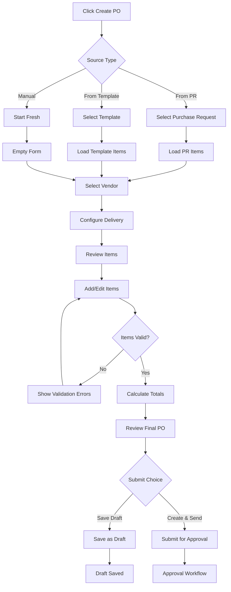
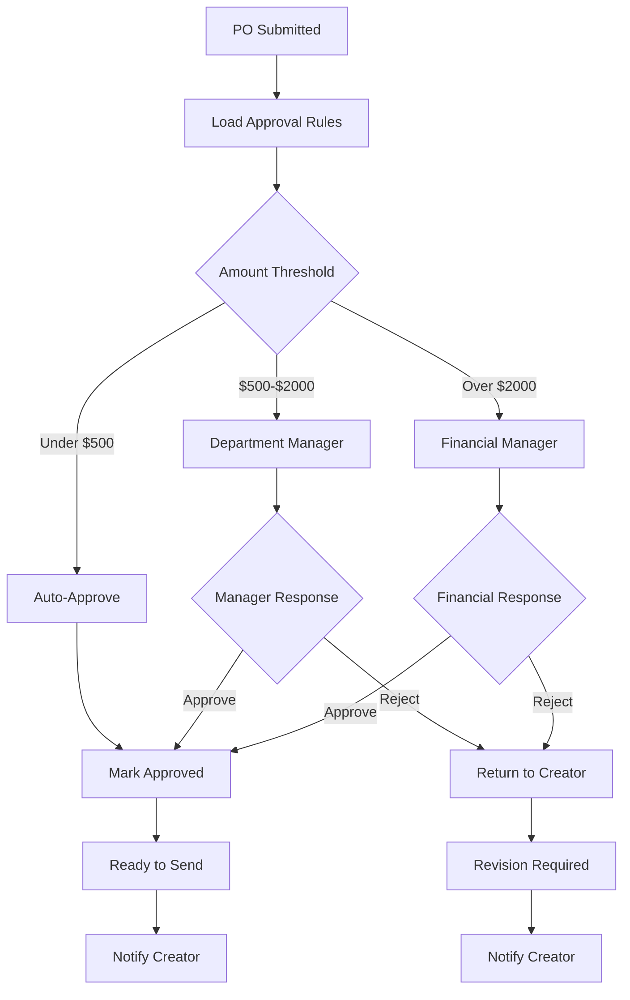
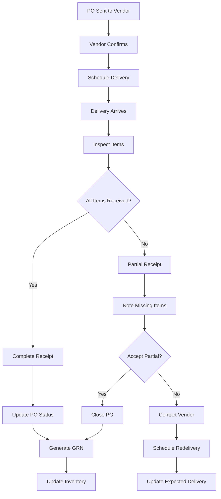

# Purchase Order Management - Detailed Specification

**Screen**: Purchase Order Management Interface  
**Route**: `/procurement/purchase-orders`  
**User Roles**: Purchasing Staff, Department Manager, Financial Manager  
**Last Updated**: August 22, 2025  

## Document History

| Version | Date | Author | Changes |
|---------|------|--------|---------|
| 1.0.0 | 2025-11-19 | Documentation Team | Initial version |
---

## 📸 Visual Reference

### Purchase Order List


### Purchase Order Detail View


### PO Creation from PR

*PO Creation with Auto-populated Items*

### Status Management

*Status Management and Workflow Actions*

### Role-Based Variations

*Staff Role View - View Only Access*


*Department Manager View - Approval Authority*


*Financial Manager View - Budget and Payment Focus*

---

## 🎯 Screen Objective

**Primary Purpose**: Comprehensive purchase order lifecycle management from creation through delivery, with integrated vendor communication, budget tracking, and receiving workflows.

**User Goals**:
- Create purchase orders from approved purchase requests
- Manage PO status and approval workflows
- Track delivery schedules and receipt status
- Monitor budget impact and spend analysis
- Coordinate with vendors and receiving teams
- Generate purchase order documentation

---

## 🏗️ Layout Structure

### Purchase Order List Layout
```
┌─────────────────────────────────────────────────────────────────┐
│ [☰] Carmen ERP    Procurement > Purchase Orders      [👤]      │
├─────────────────────────────────────────────────────────────────┤
│ Purchase Orders                            [+ Create PO]        │
├─────────────────────────────────────────────────────────────────┤
│ [🔍 Search...]  [📅 Date ▼] [🏢 Vendor ▼] [📊 Status ▼] [💰 Amount ▼] │
├─────────────────────────────────────────────────────────────────┤
│ Active Filters: Status: Pending (×) | Vendor: FreshSupply (×)   │
└─────────────────────────────────────────────────────────────────┘

┌─────────────────────────────────────────────────────────────────┐
│ PO #    │ Vendor        │ Total    │ Status     │ Created │ Due  │ ⋮ │
├─────────┼───────────────┼──────────┼────────────┼─────────┼──────┼───┤
│ PO-001  │ FreshSupply   │ $1,850.00│ 🟡 Pending │ 8/20    │ 8/25 │ ⋮ │
│ PO-002  │ VendorCorp    │ $3,200.00│ 🟢 Approved│ 8/19    │ 8/24 │ ⋮ │
│ PO-003  │ TechEquip     │   $875.00│ 🔵 Sent    │ 8/18    │ 8/23 │ ⋮ │
│ PO-004  │ CleanCorp     │   $450.00│ 🟣 Received│ 8/17    │ 8/22 │ ⋮ │
│ PO-005  │ LocalMart     │ $2,100.00│ 🟢 Approved│ 8/16    │ 8/21 │ ⋮ │
└─────────┴───────────────┴──────────┴────────────┴─────────┴──────┴───┘

┌─────────────────────────────────────────────────────────────────┐
│ [Bulk Actions ▼] | Selected: 2 items     [◀ Previous] [Next ▶] │
│ Showing 1-25 of 89 purchase orders                             │
└─────────────────────────────────────────────────────────────────┘
```

### Purchase Order Detail Layout
```
┌─────────────────────────────────────────────────────────────────┐
│ Purchase Order: PO-2401-0001                    [📧 Send] [📄 PDF]│
├─────────────────────────────────────────────────────────────────┤
│ Status: 🟢 Approved    Created: Aug 20, 2025    Due: Aug 25, 2025│
├─────────────────────────────────────────────────────────────────┤
│ Vendor Information               │ Delivery Information          │
│ ┌──────────────────────────────┐ │ ┌──────────────────────────── │
│ │ FreshSupply Co.              │ │ │ Delivery Address:           │
│ │ John Mitchell                │ │ │ Carmen Restaurant           │
│ │ john@freshsupply.com         │ │ │ 123 Main Street            │
│ │ (555) 123-4567               │ │ │ City, ST 12345             │
│ │ Payment Terms: Net 30        │ │ │ Delivery Window:           │
│ └──────────────────────────────┘ │ │ 8:00 AM - 12:00 PM        │
│                                  │ │ Special Instructions:       │
│                                  │ │ Call 30 min before         │
│                                  │ └──────────────────────────── │
├─────────────────────────────────────────────────────────────────┤
│ Order Items                                                     │
│ ┌─────────────────────────────────────────────────────────────┐ │
│ │ Item               │ Qty │ Unit  │ Price   │ Total     │ Status│ │
│ ├─────────────────────────────────────────────────────────────┤ │
│ │ Organic Tomatoes   │ 25  │ lbs   │ $3.50   │ $87.50    │ ✓    │ │
│ │ Fresh Basil        │ 12  │ bunches│ $4.25   │ $51.00    │ ✓    │ │
│ │ Olive Oil (Premium)│ 6   │ bottles│ $28.00  │ $168.00   │ ✓    │ │
│ │ Mozzarella Cheese  │ 8   │ lbs   │ $12.75  │ $102.00   │ ✓    │ │
│ │ Delivery Fee       │ 1   │ service│ $15.00  │ $15.00    │ ✓    │ │
│ └─────────────────────────────────────────────────────────────┘ │
│                                                                 │
│ Subtotal: $423.50                                              │
│ Tax (8.5%): $36.00                                             │
│ Total: $459.50                                                 │
├─────────────────────────────────────────────────────────────────┤
│ Actions: [📝 Edit] [✅ Approve] [📧 Send to Vendor] [📦 Receive] │
└─────────────────────────────────────────────────────────────────┘
```

### PO Creation Form Layout
```
┌─────────────────────────────────────────────────────────────────┐
│ Create Purchase Order                                           │
├─────────────────────────────────────────────────────────────────┤
│ Source Information                                              │
│ ○ Create from Purchase Request: [PR-2401-0015 ▼]               │
│ ○ Create from Template: [Monthly Supplies ▼]                  │
│ ○ Create Manually                                              │
├─────────────────────────────────────────────────────────────────┤
│ Vendor Selection                                                │
│ Vendor: [FreshSupply Co. ▼]    Contact: [John Mitchell ▼]     │
│ Expected Delivery: [📅 2025-08-25]    Priority: [Normal ▼]    │
├─────────────────────────────────────────────────────────────────┤
│ Order Items                                                     │
│ ┌─────────────────────────────────────────────────────────────┐ │
│ │ [+ Add Item] [🔍 Quick Search...]                          │ │
│ │                                                             │ │
│ │ Item               │ Qty │ Unit  │ Price   │ Total     │ ⋮  │ │
│ │ Organic Tomatoes   │[25] │ lbs   │[$3.50]  │ $87.50    │ ❌ │ │
│ │ Fresh Basil        │[12] │bunches│[$4.25]  │ $51.00    │ ❌ │ │
│ │ [Add item...]      │     │       │         │           │    │ │
│ └─────────────────────────────────────────────────────────────┘ │
│                                                                 │
│ Delivery Instructions                                           │
│ [Call 30 minutes before delivery. Use rear entrance...]        │
│                                                                 │
│ [Cancel] [Save Draft] [Create & Send]                          │
└─────────────────────────────────────────────────────────────────┘
```

---

## 🏷️ UI Components & Labels

### List View Controls
| Component | Label | Type | Action | Role Access |
|-----------|-------|------|---------|-------------|
| **Create PO Button** | "+ Create PO" | Primary Button | Navigate to PO creation | Purchasing Staff+ |
| **Search Input** | "Search orders..." | Text Input | Filter by PO#, vendor, items | All |
| **Date Filter** | "Date Range" | Date Range Picker | Filter by creation/due date | All |
| **Vendor Filter** | "Vendor" | Multi-select Dropdown | Filter by vendor | All |
| **Status Filter** | "Status" | Multi-select Dropdown | Filter by PO status | All |
| **Amount Filter** | "Amount Range" | Range Slider | Filter by order value | Financial+ |

### PO Status Definitions
| Status | Label | Color | Icon | Description | Next Actions |
|--------|-------|-------|------|-------------|--------------|
| **Draft** | "Draft" | Gray | 📝 | Being created, not submitted | Edit, Submit |
| **Pending** | "Pending" | Yellow | ⏳ | Awaiting approval | Approve, Reject |
| **Approved** | "Approved" | Green | ✅ | Approved, ready to send | Send to Vendor |
| **Sent** | "Sent" | Blue | 📧 | Sent to vendor | Track, Receive |
| **Confirmed** | "Confirmed" | Blue | 🤝 | Vendor confirmed order | Prepare for Delivery |
| **Partial** | "Partial" | Orange | 📦 | Partially received | Receive Remainder |
| **Received** | "Received" | Purple | 🏁 | Fully received | Close, Invoice |
| **Cancelled** | "Cancelled" | Red | ❌ | Order cancelled | Archive |

### Table Column Definitions
| Column | Header | Width | Sort | Filter | Content Format |
|--------|--------|-------|------|--------|----------------|
| **PO Number** | "PO #" | 100px | Yes | Yes | "PO-" + number |
| **Vendor** | "Vendor" | 150px | Yes | Yes | Company name |
| **Total Amount** | "Total" | 100px | Yes | Yes | Currency format |
| **Status** | "Status" | 120px | Yes | Yes | Status badge |
| **Created Date** | "Created" | 80px | Yes | Yes | MM/DD format |
| **Due Date** | "Due" | 80px | Yes | Yes | MM/DD format |
| **Actions** | ⋮ | 40px | No | No | Dropdown menu |

### Row Actions Menu
| Action | Label | Icon | Behavior | Role Access |
|--------|-------|------|----------|-------------|
| **View Details** | "View" | 👁 | Navigate to PO detail | All |
| **Edit PO** | "Edit" | ✏️ | Navigate to edit form | Creator + Manager+ |
| **Approve** | "Approve" | ✅ | Quick approval action | Approvers only |
| **Send to Vendor** | "Send" | 📧 | Email PO to vendor | Purchasing Staff+ |
| **Duplicate** | "Duplicate" | 📋 | Create copy of PO | Purchasing Staff+ |
| **Cancel** | "Cancel" | ❌ | Cancel PO | Creator + Manager |
| **Print** | "Print" | 🖨 | Generate PDF | All |

---

## 📊 Data Fields & Sources

### Purchase Order Data Model
```typescript
interface PurchaseOrder {
  id: string;
  number: string;              // "PO-" + auto-increment
  sourceType: 'purchase_request' | 'template' | 'manual';
  sourceId?: string;           // PR ID or template ID
  vendor: {
    id: string;
    companyName: string;
    contactPerson: {
      name: string;
      email: string;
      phone: string;
    };
    paymentTerms: PaymentTerms;
    shippingMethod?: string;
  };
  delivery: {
    address: Address;
    expectedDate: string;
    deliveryWindow?: string;
    specialInstructions?: string;
    priority: 'low' | 'normal' | 'high' | 'urgent';
  };
  items: {
    id: string;
    inventoryItemId: string;
    name: string;
    sku: string;
    description?: string;
    quantity: number;
    unit: string;
    unitPrice: Money;
    totalPrice: Money;
    specifications?: string;
    notes?: string;
    receivedQuantity?: number;
    status: 'pending' | 'partial' | 'received' | 'cancelled';
  }[];
  financial: {
    subtotal: Money;
    taxAmount: Money;
    shippingCost: Money;
    discountAmount: Money;
    totalAmount: Money;
    currency: Currency;
    budgetAllocation?: {
      departmentId: string;
      costCenter: string;
      accountCode: string;
    };
  };
  status: POStatus;
  workflow: {
    currentStep: number;
    totalSteps: number;
    approvals: {
      stepNumber: number;
      approverRole: string;
      approverId?: string;
      approvedAt?: string;
      comments?: string;
      status: 'pending' | 'approved' | 'rejected';
    }[];
  };
  communication: {
    sentToVendor?: {
      sentAt: string;
      sentBy: string;
      method: 'email' | 'portal' | 'fax';
    };
    vendorConfirmation?: {
      confirmedAt: string;
      confirmationNumber?: string;
      estimatedDelivery?: string;
    };
    lastContact?: string;
  };
  receiving: {
    expectedDeliveries: {
      date: string;
      items: string[];
      status: 'scheduled' | 'arrived' | 'received';
    }[];
    goodsReceivedNotes?: string[];
  };
  audit: {
    createdBy: string;
    createdAt: string;
    updatedBy: string;
    updatedAt: string;
    version: number;
    changeLog: {
      timestamp: string;
      userId: string;
      action: string;
      changes: Record<string, any>;
    }[];
  };
  permissions: {
    canEdit: boolean;
    canApprove: boolean;
    canSend: boolean;
    canReceive: boolean;
    canCancel: boolean;
  };
}
```

### Filter and Search State
```typescript
interface POFilterState {
  search: string;
  dateRange: {
    start?: Date;
    end?: Date;
    field: 'created' | 'due' | 'expected_delivery';
  };
  vendors: string[];
  statuses: POStatus[];
  amountRange: {
    min?: number;
    max?: number;
  };
  priority: ('low' | 'normal' | 'high' | 'urgent')[];
  departments: string[];
  createdBy: string[];
  sortBy: keyof PurchaseOrder | 'vendor.companyName' | 'financial.totalAmount';
  sortDirection: 'asc' | 'desc';
  viewMode: 'table' | 'card';
}
```

---

## ⚡ Interactive Actions

### Primary Actions
| Action | Trigger | Behavior | Validation |
|--------|---------|----------|-------------|
| **Create PO** | Click "+ Create PO" | Navigate to PO creation form | User has create permission |
| **Search POs** | Type in search box | Filter POs in real-time | Debounced search (300ms) |
| **Filter by Status** | Select status filter | Update list with status filter | Combine with existing filters |
| **Sort by Column** | Click column header | Sort POs, toggle direction | Visual sort indicator |
| **Select Multiple** | Checkbox selection | Enable bulk operations | Update action counter |

### Detail View Actions
| Action | Trigger | Behavior | Validation |
|--------|---------|----------|-------------|
| **Edit PO** | Click "Edit" button | Navigate to edit form | User can edit this PO |
| **Approve PO** | Click "Approve" button | Submit for approval workflow | User is valid approver |
| **Send to Vendor** | Click "Send" button | Email PO to vendor | PO is approved |
| **Receive Items** | Click "Receive" button | Navigate to receiving process | PO is sent/confirmed |
| **Download PDF** | Click "PDF" button | Generate PO document | Include all PO details |

### Bulk Operations
| Action | Label | Behavior | Validation |
|--------|-------|----------|-------------|
| **Bulk Approve** | "Approve Selected" | Approve multiple POs | User can approve all selected |
| **Bulk Send** | "Send to Vendors" | Send multiple POs | All selected POs are approved |
| **Bulk Export** | "Export Selected" | Download PO data | User has export permission |
| **Bulk Print** | "Print Selected" | Generate batch PDF | User has print permission |

---

## 🔄 User Flow Diagrams

### PO Creation Flow


### Approval Workflow


### Receiving Process Flow


---

## 📱 Responsive Behavior

### Desktop (1200px+)
- Full table view with all columns visible
- Side-by-side detail panels
- Advanced filtering sidebar
- Bulk operation toolbar

### Tablet (768px - 1199px)
- Condensed table with priority columns
- Collapsible detail sections
- Touch-friendly action buttons
- Simplified filtering panel

### Mobile (< 768px)
- Card-based layout for PO list
- Stackable detail sections
- Swipe actions for quick operations
- Essential information only

---

## 🎨 Visual Design Specifications

### PO Status Badge Styles
```css
.po-status-badge {
  display: inline-flex;
  align-items: center;
  gap: 4px;
  padding: 4px 8px;
  border-radius: 12px;
  font-size: 12px;
  font-weight: 500;
  border: 1px solid;
}

.status-draft {
  background: #f3f4f6;
  color: #374151;
  border-color: #d1d5db;
}

.status-pending {
  background: #fef3c7;
  color: #92400e;
  border-color: #fbbf24;
}

.status-approved {
  background: #d1fae5;
  color: #065f46;
  border-color: #10b981;
}

.status-sent {
  background: #dbeafe;
  color: #1e40af;
  border-color: #3b82f6;
}

.status-received {
  background: #e7e5ff;
  color: #5b21b6;
  border-color: #8b5cf6;
}

.status-cancelled {
  background: #fee2e2;
  color: #991b1b;
  border-color: #f87171;
}
```

### PO Table Styling
```css
.po-table {
  background: white;
  border-radius: 8px;
  overflow: hidden;
  box-shadow: 0 1px 3px rgba(0, 0, 0, 0.1);
}

.po-table-header {
  background: #f8f9fa;
  font-weight: 600;
  font-size: 14px;
  color: #374151;
  padding: 12px 16px;
  border-bottom: 1px solid #e5e7eb;
}

.po-table-row {
  padding: 12px 16px;
  border-bottom: 1px solid #f3f4f6;
  transition: background-color 0.15s ease;
  cursor: pointer;
}

.po-table-row:hover {
  background: #f9fafb;
}

.po-table-row.selected {
  background: #eff6ff;
  border-left: 3px solid #3b82f6;
}

.po-number {
  font-family: monospace;
  font-weight: 600;
  color: #3b82f6;
}

.po-amount {
  font-weight: 600;
  text-align: right;
}

.po-vendor {
  color: #374151;
  font-weight: 500;
}
```

### PO Detail Card
```css
.po-detail-card {
  background: white;
  border-radius: 12px;
  padding: 24px;
  box-shadow: 0 4px 6px -1px rgba(0, 0, 0, 0.1);
  margin-bottom: 20px;
}

.po-header {
  display: flex;
  justify-content: space-between;
  align-items: center;
  margin-bottom: 20px;
  padding-bottom: 16px;
  border-bottom: 1px solid #e5e7eb;
}

.po-number-display {
  font-size: 24px;
  font-weight: 700;
  color: #111827;
  font-family: monospace;
}

.po-actions {
  display: flex;
  gap: 8px;
}

.vendor-info {
  background: #f8f9fa;
  padding: 16px;
  border-radius: 8px;
  margin-bottom: 20px;
}

.items-table {
  width: 100%;
  border-collapse: collapse;
  margin: 16px 0;
}

.items-table th,
.items-table td {
  padding: 12px;
  text-align: left;
  border-bottom: 1px solid #e5e7eb;
}

.items-table th {
  background: #f8f9fa;
  font-weight: 600;
  color: #374151;
}

.po-totals {
  background: #f8f9fa;
  padding: 16px;
  border-radius: 8px;
  margin-top: 16px;
}

.total-line {
  display: flex;
  justify-content: space-between;
  margin-bottom: 8px;
}

.total-line.final {
  font-weight: 700;
  font-size: 16px;
  padding-top: 8px;
  border-top: 2px solid #374151;
}
```

---

## 🔧 Implementation Notes

### State Management
```typescript
interface POManagementState {
  purchaseOrders: PurchaseOrder[];
  filteredPOs: PurchaseOrder[];
  selectedPOs: Set<string>;
  currentPO: PurchaseOrder | null;
  filters: POFilterState;
  loading: boolean;
  error: string | null;
  pagination: {
    page: number;
    limit: number;
    total: number;
  };
  bulkOperations: {
    inProgress: boolean;
    selectedAction?: string;
    progress?: number;
  };
  approvalWorkflow: {
    pendingApprovals: string[];
    approvalHistory: ApprovalHistoryItem[];
  };
}
```

### API Endpoints
- `GET /api/procurement/purchase-orders` - Fetch PO list with filters
- `GET /api/procurement/purchase-orders/:id` - Get PO details
- `POST /api/procurement/purchase-orders` - Create new PO
- `PUT /api/procurement/purchase-orders/:id` - Update PO
- `POST /api/procurement/purchase-orders/:id/approve` - Approve PO
- `POST /api/procurement/purchase-orders/:id/send` - Send to vendor
- `POST /api/procurement/purchase-orders/bulk-operations` - Bulk actions
- `GET /api/procurement/purchase-orders/:id/pdf` - Generate PDF

### Performance Optimizations
- Virtual scrolling for large PO lists (500+ orders)
- Lazy loading of PO details and documents
- Debounced search and filtering operations
- Cached vendor and approval data
- Optimistic updates for status changes

### Workflow Integration
```typescript
const useApprovalWorkflow = (po: PurchaseOrder) => {
  const [approvalSteps, setApprovalSteps] = useState<ApprovalStep[]>([]);
  
  useEffect(() => {
    const calculateApprovalSteps = (amount: number) => {
      const steps: ApprovalStep[] = [];
      
      if (amount >= 500) {
        steps.push({
          stepNumber: 1,
          approverRole: 'department-manager',
          required: true,
          description: 'Department Manager Approval'
        });
      }
      
      if (amount >= 2000) {
        steps.push({
          stepNumber: 2,
          approverRole: 'financial-manager',
          required: true,
          description: 'Financial Manager Approval'
        });
      }
      
      return steps;
    };
    
    setApprovalSteps(calculateApprovalSteps(po.financial.totalAmount.amount));
  }, [po.financial.totalAmount]);
  
  return { approvalSteps };
};
```

### Real-time Updates
```typescript
// WebSocket integration for PO status updates
useEffect(() => {
  const subscription = subscribeToPOUpdates({
    departments: userDepartments,
    onUpdate: (updatedPO) => {
      updatePOInList(updatedPO);
    },
    onStatusChange: (poId, newStatus) => {
      updatePOStatus(poId, newStatus);
      showNotification(`PO ${poId} status changed to ${newStatus}`);
    },
    onVendorResponse: (poId, response) => {
      updateVendorResponse(poId, response);
    }
  });
  
  return () => subscription.unsubscribe();
}, [userDepartments]);
```

---

## ✅ Acceptance Criteria

### Functional Requirements
- [ ] PO list loads within 2 seconds for 500+ orders
- [ ] Search provides real-time results with <300ms delay
- [ ] All filters combine correctly and update list
- [ ] Approval workflow follows configured rules
- [ ] Status changes reflect immediately
- [ ] PDF generation works for individual and bulk orders
- [ ] Email integration sends POs to vendors
- [ ] Bulk operations handle large selections efficiently

### Data Integrity Requirements
- [ ] PO numbers are unique and sequential
- [ ] Financial calculations are accurate
- [ ] Approval audit trail is complete
- [ ] Vendor communication is logged
- [ ] Status transitions follow business rules
- [ ] Item quantities and prices are validated

### User Experience Requirements
- [ ] Intuitive navigation between list and detail views
- [ ] Clear visual indicators for status and actions
- [ ] Responsive design works on all devices
- [ ] Loading states for async operations
- [ ] Error handling with user-friendly messages
- [ ] Keyboard navigation support

### Business Requirements
- [ ] Role-based access controls enforced
- [ ] Budget constraints are validated
- [ ] Vendor relationships are maintained
- [ ] Delivery schedules are tracked
- [ ] Integration with receiving process
- [ ] Compliance with procurement policies

---

**Implementation Priority**: High (Core Procurement Function)  
**Complexity**: High (Complex Workflow + Integration)  
**Dependencies**: Vendor Management, Approval System, Inventory Management  

*This specification provides complete implementation guidance for Purchase Order Management with comprehensive workflow support, vendor communication, and financial integration.*