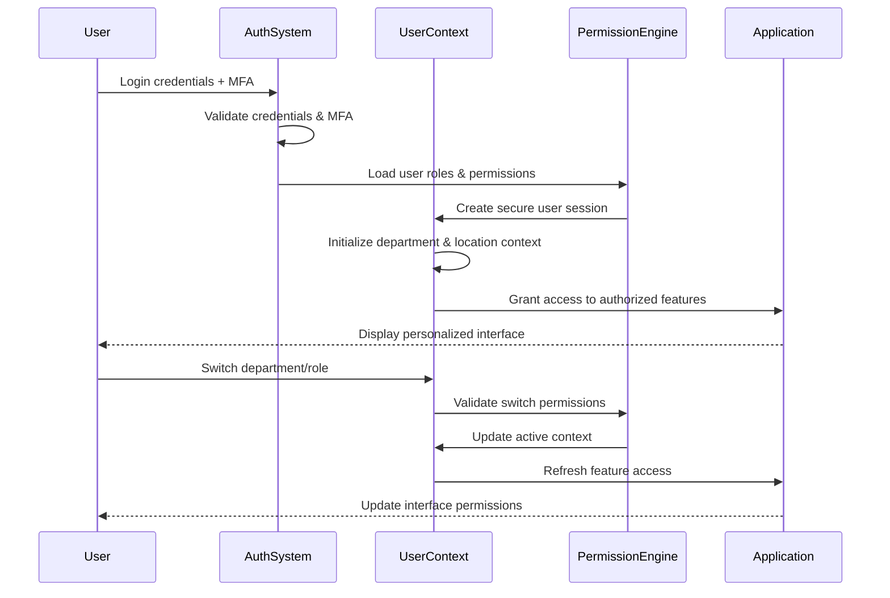
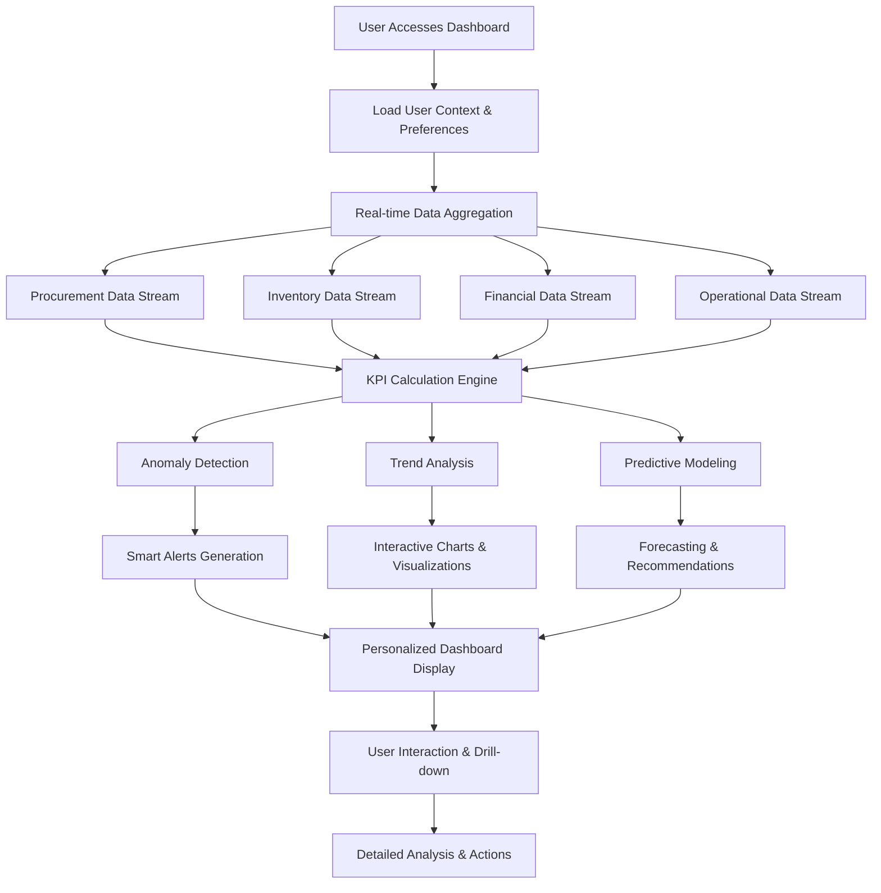
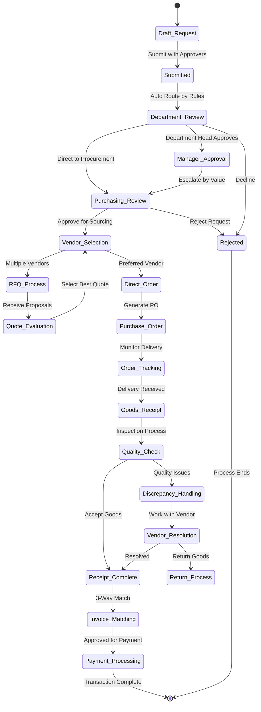
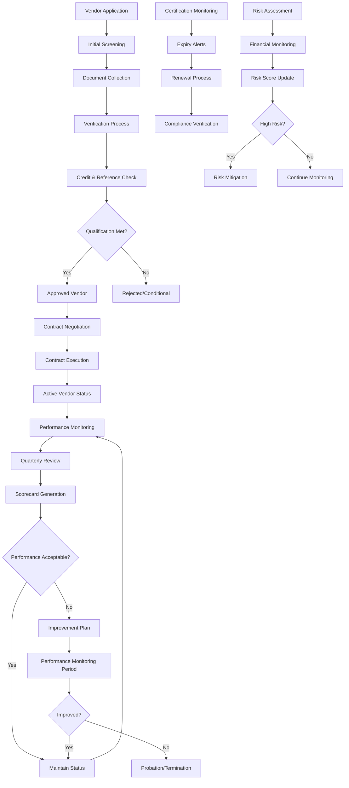
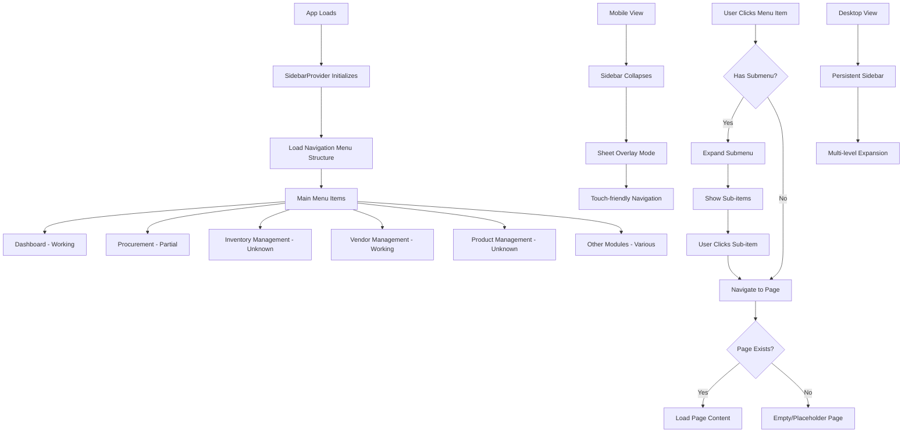
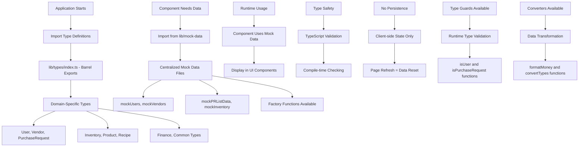

# Carmen ERP System - Complete System Requirements & Documentation

## System Overview

Carmen is a comprehensive hospitality-focused Enterprise Resource Planning (ERP) system designed for hotels, restaurants, and hospitality operations. The system manages procurement, inventory, vendor relationships, operational planning, and financial operations through a unified web-based platform.

**Vision**: A complete end-to-end hospitality management system that streamlines operations from procurement to service delivery, with intelligent automation, real-time analytics, and seamless integration across all hotel departments.

## Document History

| Version | Date | Author | Changes |
|---------|------|--------|---------|
| 1.0.0 | 2025-11-19 | Documentation Team | Initial version |
---

## 1. Authentication & User Management

### Current Implementation
The system uses a mock authentication system for prototype development with no real authentication or session management.

### Features Implemented
- **Simple User Context**: Mock user authentication system (`lib/context/simple-user-context.tsx`)
- **User Switching**: Ability to switch between different mock users for testing
- **Role System**: Mock roles including staff, manager, financial-manager, purchasing-staff, chef
- **Department/Location Context**: Users can switch between departments and locations

### Technical Implementation
```typescript
// Simple mock authentication
const DEFAULT_MOCK_USER = mockUsers[0]
- Mock user data from centralized mock data files
- Client-side context provider for user state
- No real authentication, sessions, or security
```

### Flow Diagram


### Limitations
- No real authentication system
- No password validation
- No session management
- All authentication is mocked for development

---

## 2. Dashboard & Analytics

### Current Implementation
The dashboard displays static mock data with basic charts and tables showing hospitality metrics.

### Features Implemented

#### Dashboard Cards (`dashboard-cards.tsx`)
- **Total Orders**: Hardcoded value of 1,234
- **Active Suppliers**: Hardcoded value of 89
- **Inventory Value**: Hardcoded value of $45,231
- **Monthly Spend**: Hardcoded value of $89,432

#### Dashboard Charts (`dashboard-chart.tsx`)
- **Order Trends Chart**: Area chart showing mock monthly order data
- **Spend Analysis Chart**: Bar chart displaying mock procurement spend
- **Supplier Network Growth**: Line chart with mock supplier and order correlation

#### Recent Activities Table (`dashboard-data-table.tsx`)
- Displays 6 hardcoded activity records
- Shows Purchase Requests, Purchase Orders, Goods Receipt, Stock Adjustment, Vendor Invoice, Quality Check
- Each record has mock data for status, priority, reviewer, and date

### Data Structure
```typescript
const chartData = [
  { month: "Jan", orders: 186, spend: 45000, suppliers: 12 },
  { month: "Feb", orders: 305, spend: 52000, suppliers: 15 },
  // ... more hardcoded monthly data
]
```

### Flow Diagram


### Limitations
- All data is hardcoded/static
- No real-time data fetching
- No dynamic calculations or aggregations
- Charts display mock trends only

---

## 3. Procurement Management

### Current Implementation
Basic procurement interface with mock purchase request data and list views.

### Features Implemented

#### Purchase Requests List (`ModernPurchaseRequestList.tsx`)
- **List View**: Table and card view modes for purchase requests
- **Mock Data**: Uses `mockPRListData.ts` with sample purchase request records
- **View Modes**: Toggle between table and card display
- **Selection**: Multi-select functionality for purchase requests
- **Actions**: Placeholder buttons for create, download, print (non-functional)

#### Purchase Request Data
- Sample purchase requests with realistic hospitality data
- Fields: ID, reference number, requestor, status, workflow stage, estimated total
- Workflow statuses: pending, approved, completed
- Request types: General Purchase, Emergency, Capital Expenditure

### Data Structure
```typescript
export const mockPRListData: PurchaseRequest[] = [
  {
    id: 'pr-2024-001',
    refNumber: 'PR-2401-0001',
    description: 'Kitchen Equipment and Food Supplies for Grand Ballroom Event',
    requestor: { name: 'Chef Maria Rodriguez', department: 'Food & Beverage' },
    status: DocumentStatus.Completed,
    estimatedTotal: 15750.00,
    // ... more mock fields
  }
]
```

### Flow Diagram


### Limitations
- No create/edit functionality
- No approval workflow implementation
- No integration with vendor or inventory systems
- All data is static mock data

---

## 4. Vendor Management

### Current Implementation
Multi-module vendor management system with working features and prototype demonstrations.

### Features Implemented

#### Vendor Management Dashboard (`page.tsx`)
- **Quick Stats**: Total vendors (25), active contracts (18), price updates (45), pending approvals (3)
- **Module Navigation**: Links to different vendor management sections
- **Development Status**: Clear indication of what's implemented vs. prototype

#### Module Structure
1. **Manage Vendors**: ✅ Fully implemented (links to `/vendor-management/manage-vendors`)
2. **Price Lists**: ✅ Implemented (links to `/vendor-management/pricelists`)
3. **Pricelist Templates**: 🚧 UI Prototype only (marked as "Demo Only")
4. **Pricing Campaigns**: 🚧 UI Prototype only (marked as "Demo Only")
5. **Analytics & Reports**: ❌ Coming Soon (disabled button)

### Implementation Status
```typescript
// Actual implementation markers in the code
<Badge className="bg-orange-100 text-orange-700">Prototype</Badge>
<Badge variant="outline" className="text-orange-600 border-orange-200">Demo Only</Badge>
<Button variant="outline" size="sm" disabled>Coming Soon</Button>
```

### Prototype Features
- Pricelist template management UI (no backend functionality)
- Pricing campaign management UI (no backend functionality)
- Vendor portal demo interface

### Flow Diagram


### Limitations
- Price management features are UI prototypes only
- No real data integration for pricing
- Analytics module not implemented
- Templates and campaigns are demonstration interfaces only

---

## 5. System Navigation

### Current Implementation
Multi-level sidebar navigation system with responsive design and collapsible sections.

### Features Implemented

#### Sidebar Navigation (`sidebar.tsx`)
- **Multi-level Menu**: Supports up to 3 levels of nesting
- **Responsive Design**: Collapsible sidebar with mobile sheet overlay
- **Dynamic Icons**: Uses Lucide React icons throughout
- **Active State**: Highlights current page/section

#### Available Modules
Based on existing page files:
- Dashboard
- Procurement
- Inventory Management
- Vendor Management
- Product Management
- Operational Planning
- Production
- Store Operations
- Finance
- Reporting & Analytics
- System Administration
- Help & Support
- Style Guide

### Navigation Structure
```typescript
interface MenuItem {
  title: string;
  path: string;
  icon: string;
  subItems: Array<SubMenuItem>;
}
```

### Navigation Flow Diagram


### Limitations
- Many module pages are placeholder/empty implementations
- Navigation structure exists but content varies by module
- Some modules are fully implemented, others are basic stubs

---

## 6. User Interface System

### Current Implementation
Consistent UI component system based on Tailwind CSS and Shadcn/ui components.

### Components Implemented
- **Cards**: Used throughout for metric display and module navigation
- **Tables**: Data tables with sorting, filtering, selection capabilities
- **Charts**: Area, bar, and line charts using Recharts library
- **Forms**: React Hook Form integration with Zod validation
- **Navigation**: Sidebar, dropdown menus, breadcrumbs
- **Badges**: Status indicators, labels, categories
- **Buttons**: Various sizes, variants, and states

### Design System
- **Typography**: Consistent font sizing and hierarchy
- **Colors**: Tailwind CSS color palette with semantic usage
- **Spacing**: Consistent padding and margin patterns
- **Icons**: Lucide React icon library throughout
- **Responsive**: Mobile-first design approach

### Limitations
- No comprehensive design system documentation
- Some components are basic implementations
- Limited accessibility testing and compliance

---

## 7. Data Architecture

### Current Implementation
Mock data system with TypeScript types and centralized data management.

### Type System (`lib/types/`)
- **Centralized Types**: All interfaces defined in `lib/types/` barrel exports
- **Domain Types**: User, Vendor, PurchaseRequest, Inventory, Product, Recipe, Finance
- **Common Types**: Money, DocumentStatus, WorkflowStatus, Currency
- **Type Guards**: Runtime validation functions
- **Converters**: Data transformation utilities

### Mock Data System (`lib/mock-data/`)
- **Centralized Mock Data**: All sample data in `lib/mock-data/`
- **Factory Functions**: Functions to create mock entities with overrides
- **Realistic Data**: Mock data reflects actual hospitality scenarios
- **Data Consistency**: Cross-referenced mock data between modules

### Data Structure Example
```typescript
// Type definition
export interface PurchaseRequest {
  id: string;
  refNumber: string;
  requestor: User;
  status: DocumentStatus;
  estimatedTotal: number;
  // ... additional fields
}

// Mock data usage
import { mockPRListData } from '@/lib/mock-data'
const displayData = useMemo(() => mockPRListData, [])
```

### Data Flow Diagram


### Limitations
- No real database integration
- All data persistence is client-side only
- No data validation at runtime
- Mock data doesn't reflect real business complexity

---

## Technical Architecture

### Frontend Technology Stack
- **Framework**: Next.js 14 with App Router
- **Language**: TypeScript with strict mode
- **Styling**: Tailwind CSS + Shadcn/ui components
- **State Management**: Zustand for global state, React Query for server state
- **Form Handling**: React Hook Form with Zod validation
- **Charts**: Recharts library for data visualization
- **Icons**: Lucide React icon system

### Project Structure
```
app/(main)/              # Main application routes
  dashboard/            # ✅ Fully implemented with mock data
  procurement/         # ✅ Basic list views implemented
  vendor-management/   # ✅ Mixed: working features + prototypes
  [other-modules]/     # ❓ Various implementation levels
components/ui/          # ✅ Shadcn/ui component library
lib/
  types/               # ✅ Centralized TypeScript definitions
  mock-data/          # ✅ Centralized mock data system
  context/            # ✅ User context and state management
```

### Development Environment
- **Node.js**: v20.14.0
- **Package Manager**: npm v10.7.0
- **Build System**: Next.js built-in build system
- **Development Server**: Next.js dev server on port 3003

---

## Implementation Status Summary

### ✅ Fully Implemented
- **Dashboard**: Working interface with mock data and charts
- **Basic Navigation**: Multi-level sidebar with responsive design
- **User Context**: Mock authentication and role switching
- **UI Components**: Consistent component library
- **Type System**: Comprehensive TypeScript definitions
- **Mock Data**: Realistic sample data across domains

### 🚧 Partially Implemented
- **Procurement**: List views work, but no CRUD operations
- **Vendor Management**: Core features work, price management is prototype only

### ❌ Not Implemented
- **Real Authentication**: All authentication is mocked
- **Data Persistence**: No database or API integration
- **Business Logic**: No real workflow or calculation engines
- **Advanced Features**: Most modules are basic stubs or placeholders

### 🎨 UI Prototypes Only
- **Pricelist Templates**: Visual interface with no functionality
- **Pricing Campaigns**: Demo screens with mock interactions
- **Advanced Analytics**: UI mockups planned but not built

---

This documentation reflects the actual state of the Carmen ERP prototype as implemented in the source code. The system provides a solid foundation for hospitality ERP functionality with working user interfaces, consistent design patterns, and extensible architecture, but currently operates entirely on mock data without real business logic implementation.