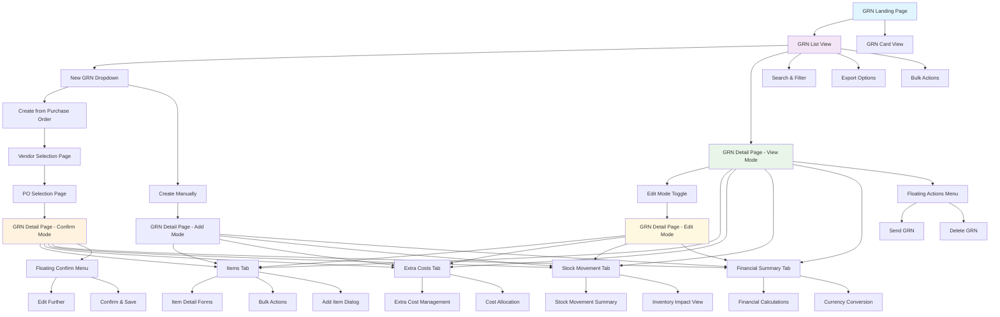
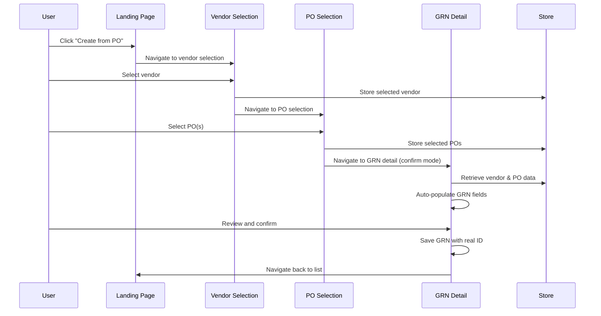
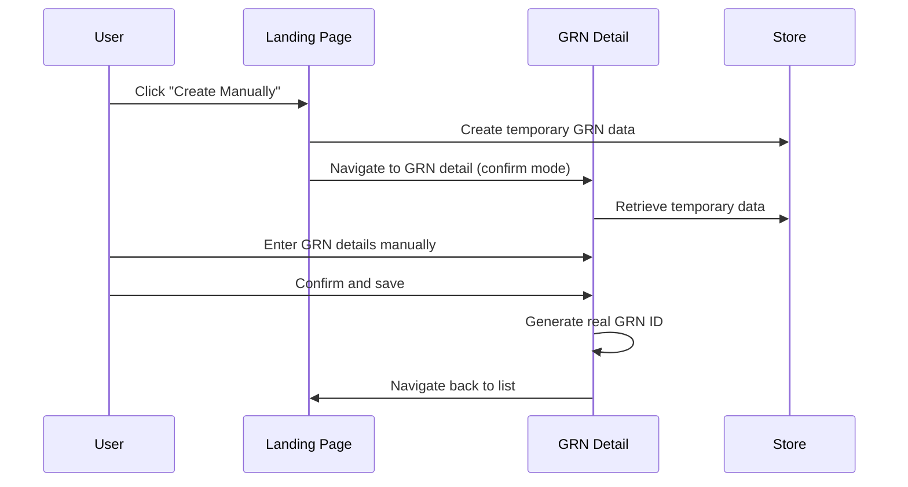
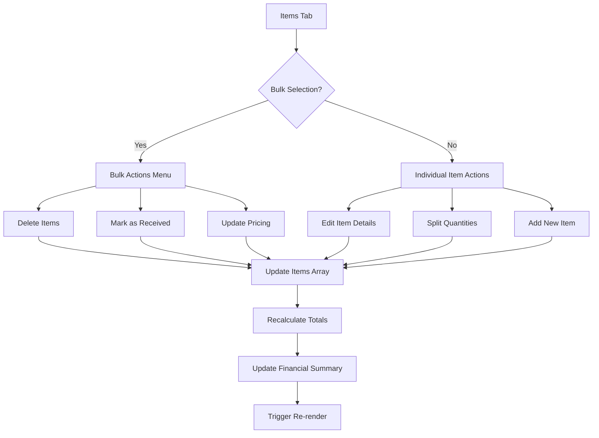
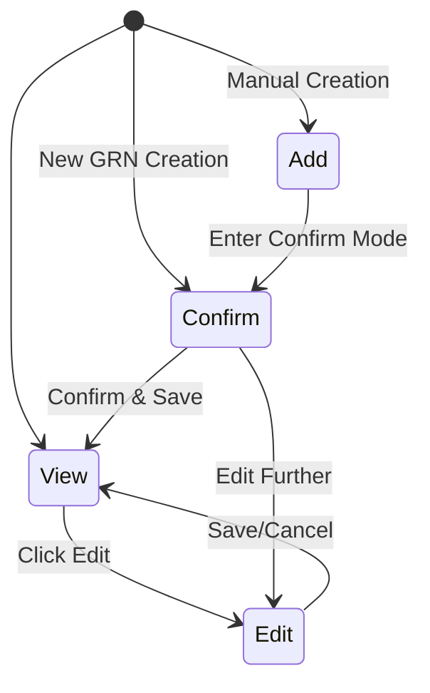
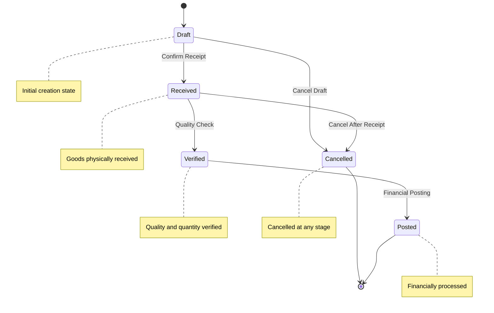
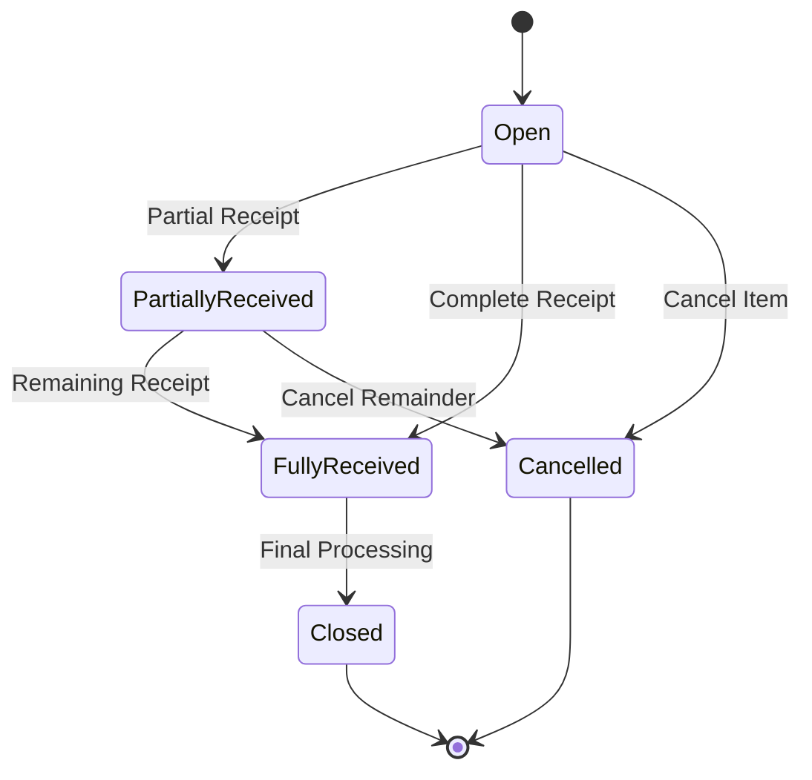

# Goods Received Note Module - Complete Technical Specification

## Table of Contents
1. [Module Overview](#module-overview)
2. [Complete Site Map](#complete-site-map)
3. [Page Documentation](#page-documentation)
4. [Component Architecture](#component-architecture)
5. [Data Flow](#data-flow)
6. [User Interactions](#user-interactions)
7. [Technical Architecture](#technical-architecture)
8. [API Integration](#api-integration)
9. [Database Schema](#database-schema)
10. [Status Workflow](#status-workflow)

## Module Overview

The Goods Received Note (GRN) module is a critical component of the Carmen Hospitality ERP system that manages the receipt and processing of goods from vendors. It serves as the bridge between Purchase Orders and inventory management, enabling three-way matching (PO-GRN-Invoice) for complete procurement lifecycle tracking.

### Key Features

#### Core GRN Management
- **Multi-path GRN Creation**: Create from Purchase Orders or manually
- **Three-way Matching**: Automated matching with Purchase Orders and Invoices
- **Real-time Financial Calculations**: Multi-currency support with exchange rate handling
- **Comprehensive Item Processing**: Detailed line-item management with quantity tracking

#### Advanced Functionality
- **Consignment Management**: Special handling for consignment goods
- **Cash Transactions**: Support for cash-based purchases
- **Extra Costs Processing**: Handling of additional charges (freight, insurance, etc.)
- **Stock Movement Integration**: Automatic inventory updates upon receipt
- **Financial Summary**: Real-time calculation of totals with tax and currency conversion

#### User Experience
- **Multi-mode Interface**: View, Edit, Confirm, and Add modes
- **Bulk Operations**: Select and process multiple items simultaneously
- **Responsive Design**: Optimized for desktop, tablet, and mobile devices
- **Activity Logging**: Complete audit trail of all changes and actions

## Complete Site Map



## Page Documentation

### 1. GRN Landing Page (`/procurement/goods-received-note/page.tsx`)

**Purpose**: Main entry point for GRN module with list management and creation options

**Key Features**:
- **View Toggle**: Switch between table and card layouts
- **New GRN Dropdown**: Multiple creation paths
- **Advanced Filtering**: Status, vendor, date range filters
- **Search Functionality**: Global search across GRN fields
- **Bulk Operations**: Multi-select actions
- **Export Options**: PDF, Excel, CSV exports

**Screenshot**:

*Main GRN listing interface showing table view with filtering and search capabilities*

**State Management**:
```typescript
const [processType, setProcessType] = useState<'po' | 'manual' | null>(null)
const [viewMode, setViewMode] = useState<'table' | 'card'>('table')
const [selectedGRNs, setSelectedGRNs] = useState<string[]>([])
const [showCreateDialog, setShowCreateDialog] = useState(false)
```

**New GRN Creation Flow**:
1. **From Purchase Order**:
   - Navigate to vendor selection
   - Select appropriate POs
   - Auto-populate GRN data
2. **Manual Creation**:
   - Create temporary GRN with placeholder data
   - Navigate directly to confirm mode
   - Manual data entry required

**Screenshot**:

*New GRN creation dropdown showing process selection options*

### 2. Vendor Selection Page (`/new/vendor-selection/page.tsx`)

**Purpose**: Select vendor for PO-based GRN creation

**Key Features**:
- **Vendor Search**: Filter by company name or registration number
- **Vendor Listing**: Table view with business registration details
- **Selection Action**: Single-click vendor selection

**Screenshot**:

*Vendor selection interface with search functionality and vendor listing*

**Data Flow**:
```typescript
const { setSelectedVendor, setStep } = useGRNCreationStore()

const handleSelectVendor = (vendor: Vendor) => {
  setSelectedVendor(vendor)
  setStep('po-selection')
  router.push('/procurement/goods-received-note/new/po-selection')
}
```

### 3. PO Selection Page (`/new/po-selection/page.tsx`)

**Purpose**: Select Purchase Orders for GRN creation from chosen vendor

**Key Features**:
- **Filtered PO Display**: Shows only POs from selected vendor
- **Multi-selection**: Choose multiple POs for single GRN
- **PO Status Validation**: Only open/partially received POs available
- **Auto-calculation**: Preview of GRN totals

**Screenshot**:

*Purchase Order selection interface showing filtered POs from selected vendor*

### 4. Item Location Selection Page (`/new/item-location-selection/page.tsx`)

**Purpose**: Select specific items and quantities to receive from chosen Purchase Orders

**Key Features**:
- **Item Filtering**: Filter by location (e.g., Receiving Bay)
- **Item Search**: Search by item name, description, or PO number
- **Quantity Management**: Enter receiving quantities with unit conversions
- **Multi-selection**: Select multiple items for processing
- **Real-time Calculations**: Auto-calculate amounts based on quantities and pricing

**Screenshot**:

*Item and location selection interface with quantity management and real-time calculations*

### 5. GRN Detail Page (`/[id]/page.tsx` + `GoodsReceiveNoteDetail.tsx`)

**Purpose**: Comprehensive GRN management interface supporting multiple operational modes

#### Operational Modes
- **View Mode**: Read-only display of existing GRN
- **Edit Mode**: Modify existing GRN data
- **Confirm Mode**: Review and confirm new GRN before saving
- **Add Mode**: Create new manual GRN

**Key Features**:
- **Header Information**: Date, invoice details, vendor, receiver
- **Tabbed Interface**: Items, Extra Costs, Stock Movement, Financial Summary
- **Mode-Aware UI**: Dynamic form states based on current mode
- **Financial Summary**: Real-time calculation with currency conversion
- **Floating Actions**: Context-specific action menus

**Screenshot**:

*GRN detail page in confirm mode showing header information, Items tab, and transaction summary*

**State Management**:
```typescript
const [formData, setFormData] = useState<GoodsReceiveNote>(initialData)
const [currentMode, setCurrentMode] = useState<GRNDetailMode>(mode)
const [extraCosts, setExtraCosts] = useState<ExtraCost[]>([])
const [selectedItems, setSelectedItems] = useState<string[]>([])
const [hasUnsavedChanges, setHasUnsavedChanges] = useState(false)
```

## Component Architecture

### Core Components

#### 1. GoodsReceiveNoteDetail (Main Container)
**File**: `components/GoodsReceiveNoteDetail.tsx`

**Purpose**: Primary component managing all GRN operations and state

**Key Responsibilities**:
- Mode management (view/edit/confirm/add)
- Form data synchronization
- Tab coordination
- Action handling (save, cancel, confirm)
- Financial calculations

**Props Interface**:
```typescript
interface GoodsReceiveNoteDetailProps {
  id?: string
  mode?: GRNDetailMode
  onModeChange?: (mode: GRNDetailMode) => void
  initialData: GoodsReceiveNote
}
```

#### 2. Tab Components

**GoodsReceiveNoteItems** (`tabs/GoodsReceiveNoteItems.tsx`)
- Item line management
- Quantity tracking (ordered vs received)
- Unit price and calculations
- Bulk selection and actions

**ExtraCostsTab** (`tabs/ExtraCostsTab.tsx`)
- Additional cost management
- Cost allocation across items
- Freight, insurance, handling charges

**StockMovementsTab** (`tabs/StockMovementsTab.tsx`)
- Inventory movement tracking
- Stock location management
- Unit cost calculations
- Total cost summaries

**Screenshot**:

*Stock Movements tab showing inventory transactions and cost breakdowns*

**StockMovementTab** (`tabs/StockMovementTab.tsx`)
- Inventory impact visualization
- Stock level updates
- Movement history

**FinancialSummaryTab** (`tabs/FinancialSummaryTab.tsx`)
- Financial totals calculation
- Currency conversion display
- Tax calculations
- Journal entry preview

#### 3. Form Components

**Header Information Form**
- GRN reference and dates
- Vendor and receiver selection
- Invoice details
- Status and flags (consignment, cash)

**Item Detail Forms** (`tabs/itemDetailForm.tsx`)
- Individual item editing
- Quantity and pricing
- Product information
- Unit conversions

### Utility Components

#### 1. Bulk Actions (`tabs/GoodsReceiveNoteItemsBulkActions.tsx`)
**Purpose**: Multi-item operations

**Actions**:
- Delete selected items
- Mark as received
- Update pricing
- Split quantities

#### 2. Floating Action Menus
**Purpose**: Context-aware action buttons

**Confirm Mode Actions**:
- Edit Further
- Confirm & Save

**View Mode Actions**:
- Delete GRN
- Send to vendor
- Print/Export

#### 3. SummaryTotal
**Purpose**: Financial calculations display

**Features**:
- Real-time total updates
- Multi-currency display
- Tax breakdown
- Exchange rate application

## Data Flow

### GRN Creation Flow (from PO)



### GRN Manual Creation Flow



### Item Management Flow



## User Interactions

### Navigation Patterns

#### 1. Entry Points
- **Sidebar Navigation**: Procurement → Goods Received Note
- **Direct URL**: `/procurement/goods-received-note`
- **Dashboard Links**: Quick access to pending GRNs

#### 2. Creation Workflows

**From Purchase Order**:
1. Click "New GRN" → "Create from Purchase Order"
2. Search and select vendor
3. Choose applicable POs
4. Review auto-populated data
5. Confirm and save

**Manual Creation**:
1. Click "New GRN" → "Create Manually"
2. Enter all GRN details manually
3. Add items individually
4. Confirm and save

### Form Interactions

#### 1. Header Form
**Field Types**:
- **Date Fields**: HTML5 date pickers with validation
- **Dropdowns**: Vendor, receiver, currency, cash book selection
- **Text Fields**: Invoice numbers, descriptions
- **Checkboxes**: Consignment, cash transaction flags

**Validation Rules**:
- Required fields: Date, vendor, receiver
- Date constraints: Invoice date ≤ current date
- Currency validation: Must match PO currency (if applicable)

#### 2. Items Tab Interactions

**Item Selection**:
- **Individual**: Checkbox per item
- **Bulk**: Master checkbox for all items
- **Range**: Shift+click for range selection

**Item Actions**:
- **Add**: Dialog with product search and details
- **Edit**: Inline editing or popup form
- **Delete**: Individual or bulk deletion
- **Split**: Divide quantities for partial receipts

### Mode Transitions



## Technical Architecture

### Framework Components

#### 1. Next.js 14 App Router
- **File-based Routing**: Automatic route generation
- **Server Components**: Default server rendering
- **Client Components**: Interactive elements marked with 'use client'

#### 2. State Management
- **Zustand Store**: Global GRN creation state
- **React useState**: Local component state
- **URL Parameters**: Mode and navigation state

**Store Structure**:
```typescript
interface GRNCreationStore {
  selectedVendor: Vendor | null
  selectedPOs: PurchaseOrder[]
  currentStep: 'vendor-selection' | 'po-selection' | 'grn-creation'
  newlyCreatedGRNData: GoodsReceiveNote | null

  setSelectedVendor: (vendor: Vendor) => void
  setSelectedPOs: (pos: PurchaseOrder[]) => void
  setStep: (step: string) => void
  setNewlyCreatedGRNData: (data: GoodsReceiveNote) => void
  clearCreationData: () => void
}
```

#### 3. Component Architecture
- **Functional Components**: All components use function declarations
- **TypeScript Interfaces**: Strict typing for all props and state
- **Shadcn/ui Components**: Consistent design system
- **Modular Structure**: Tab components for feature separation

### Data Types

#### Core Interfaces

```typescript
interface GoodsReceiveNote {
  id: string
  ref: string
  selectedItems: string[]
  date: Date
  invoiceDate: Date
  invoiceNumber: string
  description: string
  receiver: string
  vendor: string
  vendorId: string
  location: string
  currency: string
  status: GoodsReceiveNoteStatus
  cashBook: string
  items: GoodsReceiveNoteItem[]
  stockMovements: StockMovement[]
  isConsignment: boolean
  isCash: boolean
  extraCosts: ExtraCost[]
  comments: Comment[]
  attachments: Attachment[]
  activityLog: ActivityLogEntry[]
  financialSummary: FinancialSummary | null
  exchangeRate: number
  baseCurrency: string
  // Financial totals
  baseSubTotalPrice: number
  subTotalPrice: number
  baseNetAmount: number
  netAmount: number
  baseDiscAmount: number
  discountAmount: number
  baseTaxAmount: number
  taxAmount: number
  baseTotalAmount: number
  totalAmount: number
}

interface GoodsReceiveNoteItem {
  id: string
  productName: string
  description: string
  orderedQuantity: number
  receivedQuantity: number
  remainingQuantity: number
  orderUnit: string
  baseUnit: string
  conversionFactor: number
  unitPrice: number
  subTotalPrice: number
  discountRate: number
  discountAmount: number
  netAmount: number
  taxRate: number
  taxAmount: number
  totalAmount: number
  status: ItemStatus
  poReference?: string
  poItemId?: string
}

interface ExtraCost {
  id: string
  description: string
  amount: number
  currency: string
  allocationType: 'even' | 'weighted' | 'manual'
  allocation: ExtraCostAllocation[]
}

type GoodsReceiveNoteStatus = 'Draft' | 'Received' | 'Verified' | 'Posted' | 'Cancelled'
type GRNDetailMode = 'view' | 'edit' | 'add' | 'confirm'
```

### Responsive Design

#### Breakpoint Strategy
- **Mobile**: 320px - 768px (Stack columns, simplified navigation)
- **Tablet**: 768px - 1024px (Responsive grids, collapsible sidebars)
- **Desktop**: 1024px+ (Full feature set, multi-column layouts)

#### Component Adaptations
- **Tables**: Horizontal scroll on mobile, card view option
- **Forms**: Single column on mobile, multi-column on desktop
- **Navigation**: Hamburger menu on mobile, full sidebar on desktop

## API Integration

### Endpoints

#### GRN Management
```
GET    /api/grn                    # List GRNs with filtering
POST   /api/grn                    # Create new GRN
GET    /api/grn/:id                # Get specific GRN
PUT    /api/grn/:id                # Update GRN
DELETE /api/grn/:id                # Delete GRN
PATCH  /api/grn/:id/status         # Update GRN status
```

#### Item Management
```
POST   /api/grn/:id/items          # Add item to GRN
PUT    /api/grn/:id/items/:itemId  # Update GRN item
DELETE /api/grn/:id/items/:itemId  # Remove item from GRN
POST   /api/grn/:id/items/bulk     # Bulk item operations
```

#### Related Resources
```
GET    /api/vendors                # List vendors for selection
GET    /api/purchase-orders        # Get POs for vendor
GET    /api/products               # Product search for manual items
POST   /api/grn/:id/stock-movements # Process stock movements
```

### Data Models

#### Request/Response Patterns

**Create GRN Request**:
```json
{
  "vendorId": "vendor-123",
  "poIds": ["PO-2301-0001", "PO-2301-0002"],
  "date": "2023-06-15",
  "invoiceNumber": "INV-456",
  "invoiceDate": "2023-06-14",
  "description": "Monthly inventory delivery",
  "receiver": "warehouse_manager",
  "currency": "USD",
  "exchangeRate": 1.0,
  "isConsignment": false,
  "isCash": false,
  "items": [...],
  "extraCosts": [...]
}
```

**GRN Response**:
```json
{
  "id": "GRN-2301-0001",
  "ref": "GRN-2301-0001",
  "status": "Received",
  "vendor": {
    "id": "vendor-123",
    "name": "Global Foods Inc.",
    "businessRegistrationNumber": "BRN001"
  },
  "financialSummary": {
    "netAmount": 1250.00,
    "taxAmount": 87.50,
    "totalAmount": 1337.50,
    "currency": "USD"
  },
  "items": [...],
  "activityLog": [...],
  "createdAt": "2023-06-15T10:30:00Z",
  "updatedAt": "2023-06-15T15:45:00Z"
}
```

## Database Schema

### Primary Tables

#### goods_receive_notes
```sql
CREATE TABLE goods_receive_notes (
  id UUID PRIMARY KEY DEFAULT gen_random_uuid(),
  ref VARCHAR(50) UNIQUE NOT NULL,
  vendor_id UUID NOT NULL REFERENCES vendors(id),
  receiver_id UUID NOT NULL REFERENCES users(id),
  date DATE NOT NULL,
  invoice_number VARCHAR(100),
  invoice_date DATE,
  tax_invoice_number VARCHAR(100),
  tax_invoice_date DATE,
  description TEXT,
  currency VARCHAR(3) NOT NULL,
  exchange_rate DECIMAL(10,4) DEFAULT 1.0000,
  base_currency VARCHAR(3) NOT NULL,
  status grn_status_enum NOT NULL DEFAULT 'Draft',
  cash_book_id UUID REFERENCES cash_books(id),
  is_consignment BOOLEAN DEFAULT FALSE,
  is_cash BOOLEAN DEFAULT FALSE,

  -- Financial totals
  sub_total_price DECIMAL(15,2) NOT NULL DEFAULT 0.00,
  discount_amount DECIMAL(15,2) NOT NULL DEFAULT 0.00,
  net_amount DECIMAL(15,2) NOT NULL DEFAULT 0.00,
  tax_amount DECIMAL(15,2) NOT NULL DEFAULT 0.00,
  total_amount DECIMAL(15,2) NOT NULL DEFAULT 0.00,

  -- Base currency equivalents
  base_sub_total_price DECIMAL(15,2) NOT NULL DEFAULT 0.00,
  base_discount_amount DECIMAL(15,2) NOT NULL DEFAULT 0.00,
  base_net_amount DECIMAL(15,2) NOT NULL DEFAULT 0.00,
  base_tax_amount DECIMAL(15,2) NOT NULL DEFAULT 0.00,
  base_total_amount DECIMAL(15,2) NOT NULL DEFAULT 0.00,

  created_by UUID NOT NULL REFERENCES users(id),
  created_at TIMESTAMP WITH TIME ZONE DEFAULT CURRENT_TIMESTAMP,
  updated_at TIMESTAMP WITH TIME ZONE DEFAULT CURRENT_TIMESTAMP
);

CREATE TYPE grn_status_enum AS ENUM (
  'Draft', 'Received', 'Verified', 'Posted', 'Cancelled'
);
```

#### grn_items
```sql
CREATE TABLE grn_items (
  id UUID PRIMARY KEY DEFAULT gen_random_uuid(),
  grn_id UUID NOT NULL REFERENCES goods_receive_notes(id) ON DELETE CASCADE,
  product_id UUID NOT NULL REFERENCES products(id),
  po_item_id UUID REFERENCES purchase_order_items(id),

  ordered_quantity DECIMAL(10,3) NOT NULL,
  received_quantity DECIMAL(10,3) NOT NULL,
  remaining_quantity DECIMAL(10,3) GENERATED ALWAYS AS (ordered_quantity - received_quantity) STORED,

  order_unit VARCHAR(20) NOT NULL,
  base_unit VARCHAR(20) NOT NULL,
  conversion_factor DECIMAL(10,4) DEFAULT 1.0000,

  unit_price DECIMAL(15,4) NOT NULL,
  sub_total_price DECIMAL(15,2) NOT NULL,
  discount_rate DECIMAL(5,2) DEFAULT 0.00,
  discount_amount DECIMAL(15,2) DEFAULT 0.00,
  net_amount DECIMAL(15,2) NOT NULL,
  tax_rate DECIMAL(5,2) DEFAULT 0.00,
  tax_amount DECIMAL(15,2) DEFAULT 0.00,
  total_amount DECIMAL(15,2) NOT NULL,

  status item_status_enum NOT NULL DEFAULT 'Open',

  created_at TIMESTAMP WITH TIME ZONE DEFAULT CURRENT_TIMESTAMP,
  updated_at TIMESTAMP WITH TIME ZONE DEFAULT CURRENT_TIMESTAMP
);

CREATE TYPE item_status_enum AS ENUM (
  'Open', 'PartiallyReceived', 'FullyReceived', 'Cancelled', 'Closed'
);
```

#### grn_extra_costs
```sql
CREATE TABLE grn_extra_costs (
  id UUID PRIMARY KEY DEFAULT gen_random_uuid(),
  grn_id UUID NOT NULL REFERENCES goods_receive_notes(id) ON DELETE CASCADE,
  description VARCHAR(255) NOT NULL,
  amount DECIMAL(15,2) NOT NULL,
  currency VARCHAR(3) NOT NULL,
  allocation_type extra_cost_allocation_enum NOT NULL DEFAULT 'even',

  created_at TIMESTAMP WITH TIME ZONE DEFAULT CURRENT_TIMESTAMP
);

CREATE TYPE extra_cost_allocation_enum AS ENUM (
  'even', 'weighted', 'manual'
);
```

#### grn_activity_log
```sql
CREATE TABLE grn_activity_log (
  id UUID PRIMARY KEY DEFAULT gen_random_uuid(),
  grn_id UUID NOT NULL REFERENCES goods_receive_notes(id) ON DELETE CASCADE,
  user_id UUID NOT NULL REFERENCES users(id),
  action VARCHAR(100) NOT NULL,
  activity_type activity_type_enum NOT NULL,
  description TEXT NOT NULL,
  metadata JSONB,

  created_at TIMESTAMP WITH TIME ZONE DEFAULT CURRENT_TIMESTAMP
);

CREATE TYPE activity_type_enum AS ENUM (
  'Creation', 'StatusChange', 'ItemModification', 'DocumentGeneration',
  'Communication', 'SystemEvent'
);
```

### Key Relationships

- **GRN → Items**: One-to-Many (Cascade delete)
- **GRN → Extra Costs**: One-to-Many (Cascade delete)
- **GRN → Activity Log**: One-to-Many (Cascade delete)
- **GRN → Vendor**: Many-to-One
- **GRN Items → PO Items**: Many-to-One (Optional for manual GRNs)
- **GRN → Stock Movements**: One-to-Many (Generated on confirmation)

### Indexes and Constraints

```sql
-- Performance indexes
CREATE INDEX idx_grn_vendor_date ON goods_receive_notes(vendor_id, date DESC);
CREATE INDEX idx_grn_status_created ON goods_receive_notes(status, created_at DESC);
CREATE INDEX idx_grn_ref ON goods_receive_notes(ref);
CREATE INDEX idx_grn_invoice ON goods_receive_notes(invoice_number) WHERE invoice_number IS NOT NULL;

-- Foreign key indexes
CREATE INDEX idx_grn_items_grn ON grn_items(grn_id);
CREATE INDEX idx_grn_items_product ON grn_items(product_id);
CREATE INDEX idx_grn_items_po_item ON grn_items(po_item_id) WHERE po_item_id IS NOT NULL;

-- Constraints
ALTER TABLE goods_receive_notes ADD CONSTRAINT chk_positive_amounts
  CHECK (sub_total_price >= 0 AND net_amount >= 0 AND total_amount >= 0);

ALTER TABLE grn_items ADD CONSTRAINT chk_quantities_positive
  CHECK (ordered_quantity > 0 AND received_quantity >= 0);

ALTER TABLE grn_items ADD CONSTRAINT chk_received_not_exceed_ordered
  CHECK (received_quantity <= ordered_quantity);
```

## Status Workflow

### GRN Status Progression



### Item Status Workflow



### Business Rules

#### Status Transitions
1. **Draft → Received**: Requires all mandatory fields and at least one item
2. **Received → Verified**: Requires quality check completion
3. **Verified → Posted**: Requires financial approval
4. **Any → Cancelled**: Requires cancellation reason

#### Validation Rules
1. **Financial Consistency**: Item totals must equal GRN total
2. **Quantity Constraints**: Received ≤ Ordered for all items
3. **Currency Matching**: All items must use same currency as GRN
4. **Date Validation**: Invoice date ≤ GRN date ≤ Current date

#### Auto-calculations
1. **Item Totals**: Net amount = (Quantity × Unit Price) - Discount + Tax
2. **GRN Total**: Sum of all item totals + extra costs
3. **Base Currency**: All amounts converted using exchange rate
4. **Stock Impact**: Automatic inventory updates on status change

## Document History

| Version | Date | Author | Changes |
|---------|------|--------|---------|
| 1.0.0 | 2025-11-19 | Documentation Team | Initial version |
---

*Documentation Version: 1.0*
*Generated on: $(date)*
*Carmen ERP - Hospitality Supply Chain Management*