# Purchase Request System - Comprehensive Analysis

This document provides a complete analysis of the Carmen ERP Purchase Request system, including system architecture, component hierarchy, user flows, and technical implementation details.

## Table of Contents

1. [System Overview](#system-overview)
2. [Component Architecture](#component-architecture)
3. [User Journey Flows](#user-journey-flows)
4. [User Interface Screenshots](#user-interface-screenshots)
5. [Modal and Dialog System](#modal-and-dialog-system)
6. [Data Flow and State Management](#data-flow-and-state-management)
7. [Workflow Engine](#workflow-engine)
8. [RBAC and Permissions](#rbac-and-permissions)
9. [API Integration](#api-integration)

## System Overview

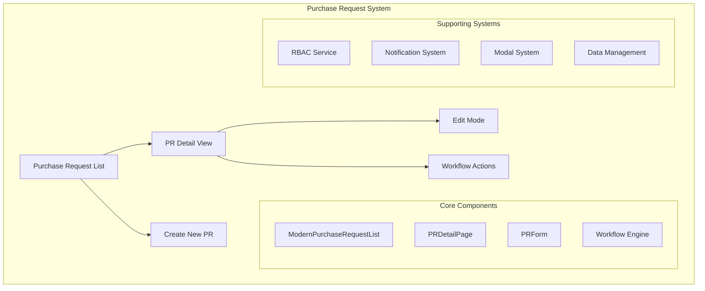

## Component Architecture

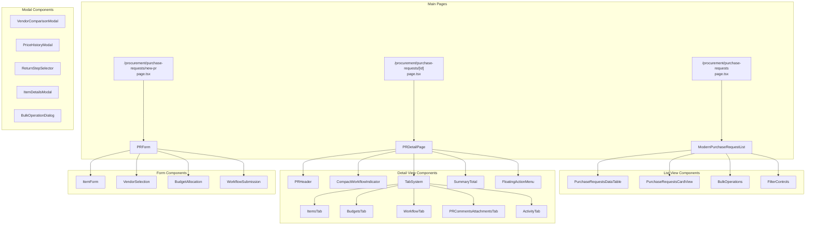

## User Journey Flows

### Main Purchase Request Flow

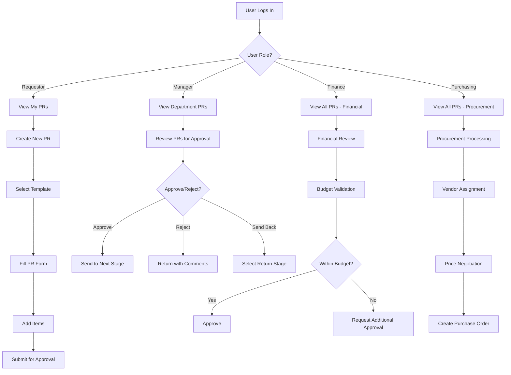

### Create Purchase Request Flow

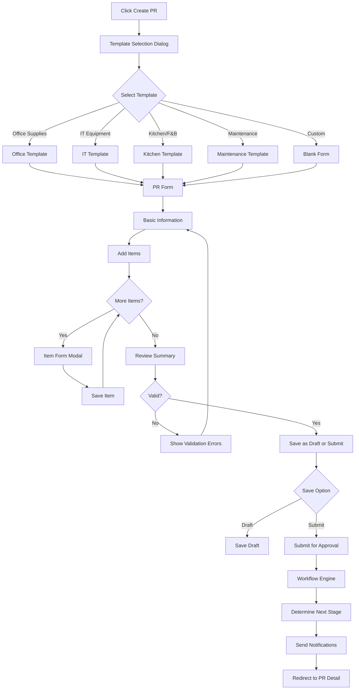

### Approval Workflow

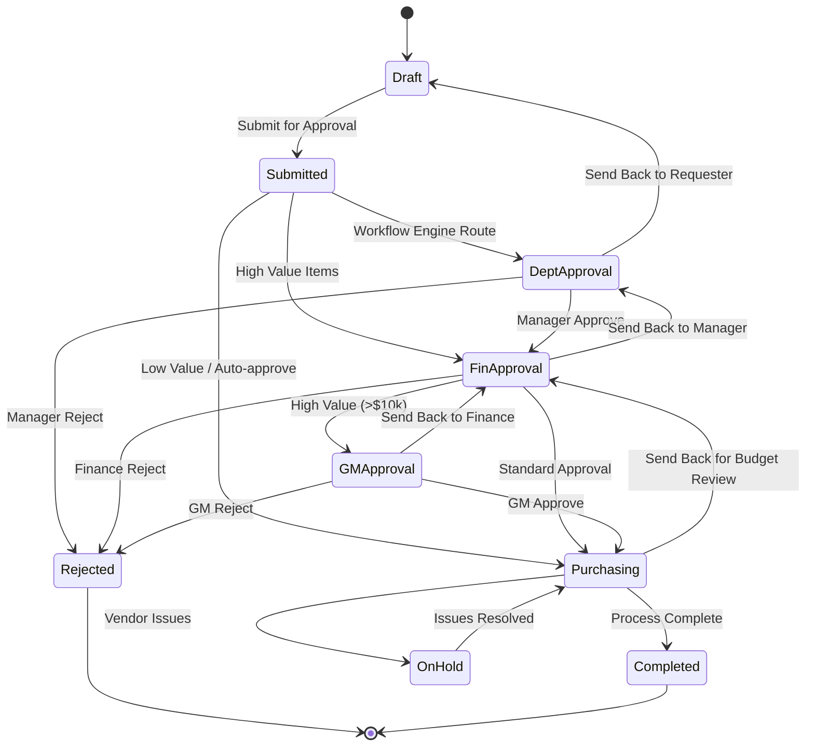

## Modal and Dialog System

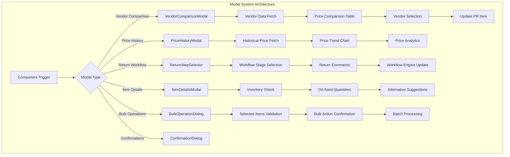

### Modal Interaction Flow

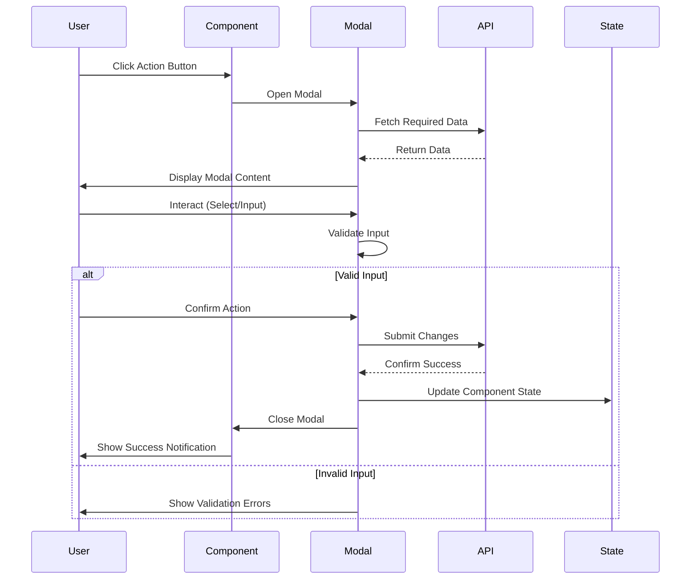

## Data Flow and State Management

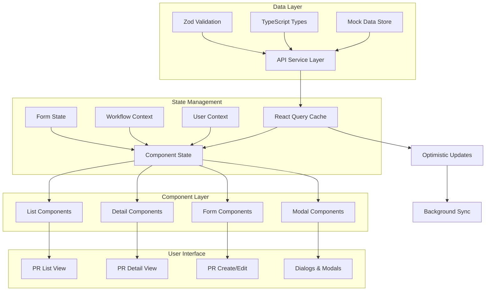

### State Update Flow

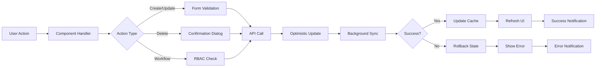

## Workflow Engine

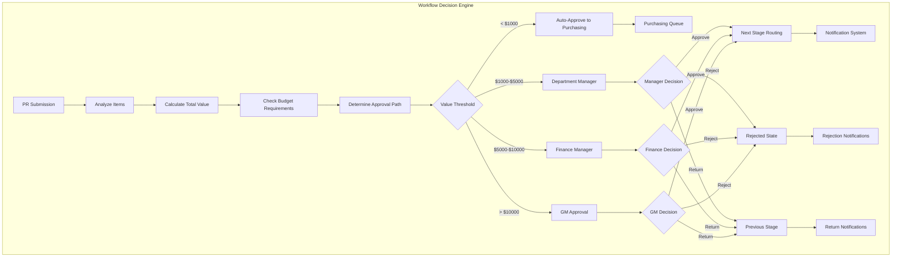

### Workflow Rules Engine

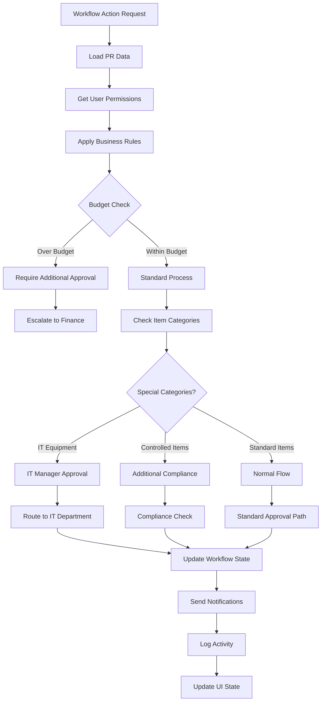

## RBAC and Permissions

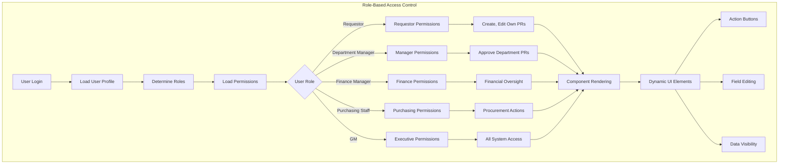

### Permission Matrix

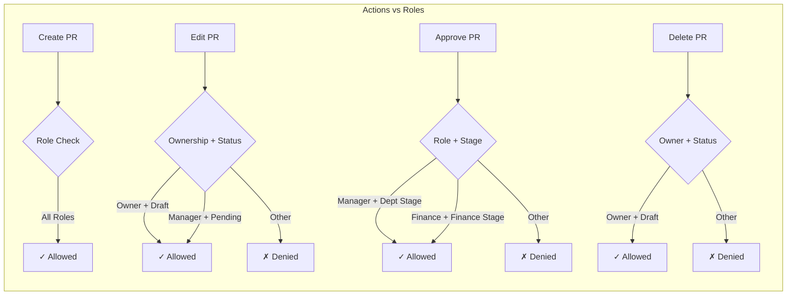

## API Integration

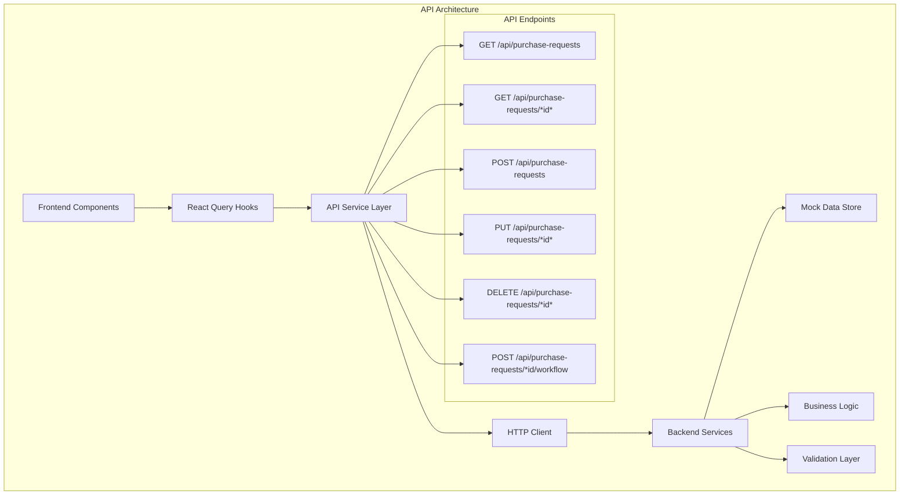

### API Flow Sequence

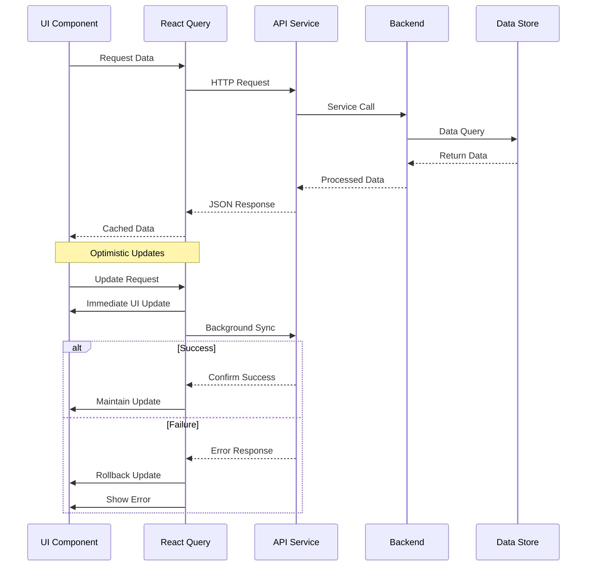

## Notification and Message System

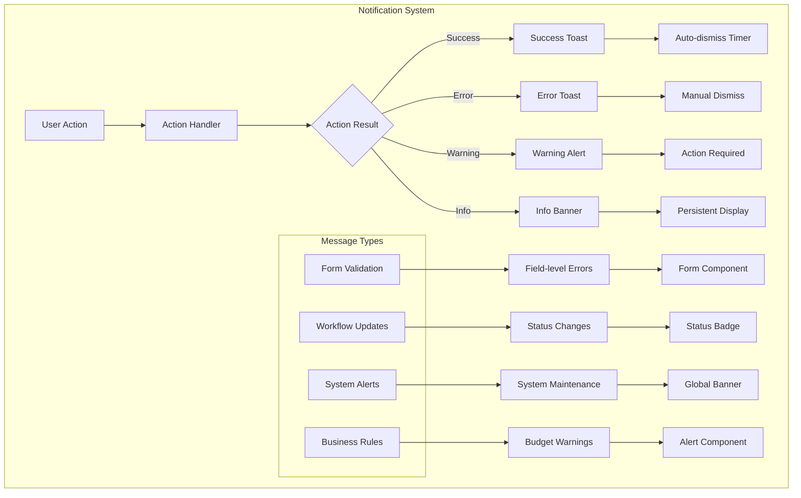

## User Interface Screenshots

This section provides visual documentation of the key user interface screens in the Carmen ERP Purchase Request system. Screenshots were captured from the running application to show the actual implementation of the designs and workflows described in this document.

### Purchase Request List View
*Screenshot captured: Purchase Request main list interface*

The main Purchase Request list view shows:
- **Navigation sidebar** with procurement module expanded
- **Filter controls** including "My Pending", "All Documents", stage filters, and saved filters
- **Action buttons** for Export, Print, and New PR creation
- **Data table** with sortable columns: PR Number, Date, Type, Stage, Status, Requestor, Department, Amount, Currency
- **Status indicators** with color coding (Completed in green, InProgress in blue, Submitted in blue, Rejected in red, Draft in yellow)
- **Pagination controls** at the bottom
- **View toggle** between list and card views
- **Bulk selection** capability with checkboxes

### Purchase Request Detail View
*Screenshot captured: Purchase Request detail interface (PR-2401-0002)*

The Purchase Request detail view displays:
- **Header section** with PR number, status badge, and action buttons (Print, Export, Share)
- **Basic information** including Date, PR Type, Requestor, and Department
- **Description field** with full PR details
- **Workflow progress indicator** showing current stage in the approval process
- **Tabbed interface** with Items, Budgets, and Workflow tabs
- **Items table** with expandable rows showing:
  - Item numbers and location/status
  - Product details with descriptions
  - Requested vs Approved quantities
  - Date required and delivery points
  - Pricing information
- **Auto-expand on hover** functionality for better UX
- **Status badges** for individual items (Pending, Approved, etc.)
- **Comments & Attachments** section with file upload and download capabilities
- **Activity Log** showing complete history of all actions performed on the PR

### Purchase Request Creation Form
*Screenshot captured: Purchase Request creation/editing interface (PR-2301-0001 Draft)*

The Purchase Request creation form includes:
- **Form header** with PR number and draft status
- **Basic details** including Date, PR Type, Requestor, and Department
- **Description field** for PR purpose
- **Workflow progress** showing submission stage
- **Items management** with detailed table including:
  - Item numbering and location selection
  - Product details with full descriptions
  - Quantity requested vs approved tracking
  - Date requirements and delivery points
  - Pricing calculations
- **Item status indicators** (Approved, Review, Pending, etc.)
- **Auto-expand functionality** for better data visibility
- **Comments & Attachments** section for collaboration
- **Activity Log** for tracking all changes and actions
- **Validation and submission** controls

### Dynamic UI Elements and Interactions
*Screenshots captured: Interactive menus, dropdowns, and popup elements*

#### Action Menu (Three-dot Menu)

The row-level action menu provides context-specific actions for each Purchase Request:
- **Approve** option with green checkmark icon for pending requests
- **Reject** option with red X icon for declining requests
- **Delete** option with red trash icon for removing requests
- **Visual separator** between approval/rejection actions and destructive delete action
- **Contextual availability** - options appear based on current PR status and user permissions

#### Filter Dropdown Menus

##### Stage Filter Dropdown

The Stage filter dropdown allows filtering by approval workflow stages:
- **All Stage** (default selection showing all requests)
- **Request Creation** for newly created PRs
- **Department Approval** for requests pending department head approval
- **Purchasing Review** for requests under purchasing team review
- **Finance Review** for requests requiring financial approval
- **Final Approval** for requests pending final sign-off
- **Completed** for fully processed requests

##### Requester Filter Dropdown

The Requester filter dropdown enables filtering by the person who created the PR:
- **All Requester** (default selection showing all requesters)
- **Individual staff members** including:
  - Somchai
  - Somsri
  - John
  - Mary
- **Dynamic population** based on users who have created Purchase Requests

#### Bulk Operations Menu (In PR Detail Form)

The bulk operations functionality is located within the Purchase Request detail form, specifically in the Items tab:

**Selection Interface:**
- **Item checkboxes** on each row for individual selection
- **Select all checkbox** in the table header for bulk selection
- **Selection counter** displays "X items selected: Y Approved" showing total and status breakdown
- **Auto-expand on hover** toggle for better visibility during bulk operations

**Bulk Action Buttons:**
- **Approve Selected** (green checkmark icon) - Approve multiple items simultaneously
- **Reject Selected** (red X icon) - Reject multiple items at once
- **Return Selected** (orange return icon) - Return selected items for revision
- **Split** (blue split icon) - Split selected items into separate requests
- **Set Date Required** (purple calendar icon) - Update delivery dates for multiple items

**Context-Aware Functionality:**
- Button availability changes based on current item status and user permissions
- Visual feedback shows the impact of bulk operations before execution
- Actions apply only to currently selected items, maintaining granular control

#### Auto-Expand Item Details on Hover

The auto-expand functionality provides detailed information when hovering over item rows:

**Inventory Information Panel:**
- **On Hand**: Current stock quantity with piece/unit indicators
- **On Order**: Pending incoming stock quantities
- **Reorder**: Minimum threshold for reordering
- **Restock**: Target quantity for restocking
- **Stock Level**: Percentage indicator with visual status bar
- **Needs Reorder** alert when stock falls below threshold

**Business Dimensions Panel:**
- **Job Number**: Project/job reference (e.g., FB-2024-Q1-001)
- **Event**: Associated event name (e.g., CONF2024)
- **Project**: Project code (e.g., PROJ001)
- **Market Segment**: Business classification (e.g., ENTERPRISE)

#### Role-Based UI Differences

The system displays different information based on user roles:

**Chef/Requestor Role (Original View):**
- Comment section shows user initials "CMR" (Chef Maria Rodriguez)
- Standard approval quantities without additional procurement details
- Focus on operational requirements and item specifications

**Purchasing Staff Role:**
- Comment section shows "DPS" (Demo Purchasing Staff)
- **Additional FOC (Free of Charge) information** displayed in Approved column:
  - "FOC: 0.000 piece" for each item showing free quantities
  - Critical for procurement cost calculations and vendor negotiations
- **Submit & Approve button** appears at bottom for procurement workflow actions
- User profile shows "Demo Purchasing Staff" with "purchasing@example.com"
- Department context switches from "Kitchen Operations" to "Administration"

**Dynamic Panel Visibility:**
- **Inventory panels** may show/hide based on role permissions
- **Business dimensions** visibility controlled by departmental access
- **Pricing details** and FOC information restricted to procurement roles
- **Auto-expand behavior** may differ based on user's data access level

#### UI Interaction Patterns
- **Hover states** provide visual feedback for interactive elements
- **Dropdown menus** close when clicking outside or pressing Escape
- **Status color coding** maintains consistency across all views:
  - Green for Completed/Approved states
  - Blue for InProgress/Submitted states
  - Red for Rejected states
  - Yellow for Draft states
- **Progressive disclosure** with expandable rows and hover details
- **Contextual actions** that adapt based on item status and user permissions
- **Role-based information display** with procurement-specific details for purchasing staff

## Workflow Action Buttons

The system implements workflow action buttons for approval processes through a dedicated approval interface rather than on individual purchase request detail pages.

### Approval Workflow Interface

The workflow actions are primarily handled through the **My Approvals** page (`/procurement/my-approvals`) which provides:

#### 1. Two-Tab Approval System

**Pending Approval Tab:**
- Items ready for immediate approval
- Direct "Approve" buttons for straightforward requests
- Standard approval workflow for routine procurement

**Flagged for Review Tab:**
- High-value or exceptional requests requiring detailed review
- "Review" buttons for complex approval scenarios
- Additional scrutiny for requests exceeding normal parameters

#### 2. Purchase Request Detail Page Behavior

On individual PR detail pages, the workflow action appears as:

- **"Review Required" button** (typically disabled until specific conditions are met)
- Located at the bottom-right of the page interface
- Serves as an indicator rather than primary action interface

#### 3. Workflow Action Patterns

**Approve Actions:**
- Single-click approval for standard requests
- Immediate state change with visual feedback
- Auto-navigation or list update upon completion

**Review Actions:**
- Opens detailed review interface for complex items
- Allows for additional scrutiny and documentation
- May provide multiple action options (approve, reject, request changes)

**Role-Based Access:**
- Actions only visible to users with appropriate approval permissions
- Department Manager role enables approval capabilities
- Context-sensitive button activation based on workflow stage

#### 4. Workflow States and Button Behavior

- **Disabled State**: "Review Required" button appears disabled when user lacks permissions or item isn't ready for approval
- **Active State**: Buttons become interactive when approval criteria are met
- **Processing State**: Visual feedback during approval processing
- **Completion State**: State updates and potential navigation after action completion

### Implementation Notes

The workflow system prioritizes:
- **Separation of concerns**: Dedicated approval interface separate from viewing interface
- **Role-based access control**: Buttons only appear for authorized users
- **Two-tier approval process**: Standard vs. flagged items require different approval paths
- **Visual state management**: Clear indication of approval status and available actions

## Technical Implementation Details

### Component Communication

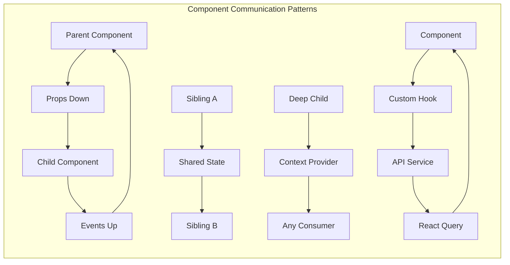

### Performance Optimizations

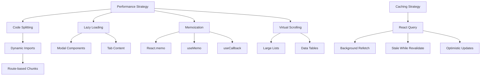

## Document History

| Version | Date | Author | Changes |
|---------|------|--------|---------|
| 1.0.0 | 2025-11-19 | Documentation Team | Initial version |
---

This comprehensive analysis provides a complete technical overview of the Carmen ERP Purchase Request system, covering all aspects from high-level architecture to detailed implementation patterns. The Mermaid diagrams illustrate the relationships between components, data flow, user interactions, and system behavior.