# Shared Components

**Module**: Store Operations
**Last Updated**: 2025-10-02

## Table of Contents

1. [Modals and Dialogues](#modals-and-dialogues)
2. [Dropdown Components](#dropdown-components)
3. [Form Components](#form-components)
4. [Display Components](#display-components)
5. [Navigation Components](#navigation-components)

---

## Modals and Dialogues

### 1. Filter Builder Dialog

**Component**: `FilterBuilder` inside `Dialog`
**Used In**: Store Requisitions List
**Trigger**: Click "Add Filters" button

**Features**:
- Dynamic filter condition rows
- Add/remove conditions
- Field, operator, and value selection
- Apply filters action

**Fields**:
- Date
- Requisition (Ref No)
- Request To
- To Location
- Store Name
- Description
- Status
- Workflow Stage
- Process Status

**Operators**:
- Equals
- Contains
- Greater than
- Less than

**Action Flow**:
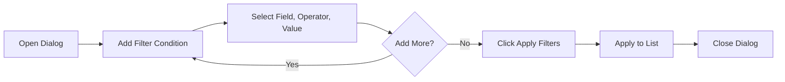

---

### 2. Approval Log Dialog

**Component**: `ApprovalLogDialog`
**Used In**: Store Requisition Detail - Approval Workflow
**Trigger**: Click "View Log" button

**Purpose**: Display complete approval history for a requisition

**Content**:
- Chronological approval steps
- Approver information
- Action taken (Approved/Rejected/Requested Changes)
- Comments
- Timestamps
- Approval status

**Fields Displayed**:
- Stage Level
- Approver Name
- Approver Role
- Action
- Comments
- Timestamp

**Action Flow**:
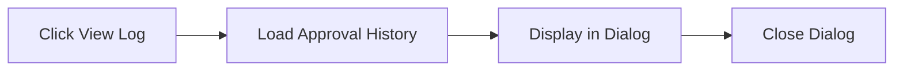

---

### 3. Item Info Popover

**Component**: Custom Popover/Tooltip
**Used In**: Store Requisition Detail - Items Tab
**Trigger**: Hover on item name or info icon

**Content**:
- Item Name
- Location and Location Code
- Category
- Sub-category
- Item Group
- Barcode
- Location Type

**Action Flow**:
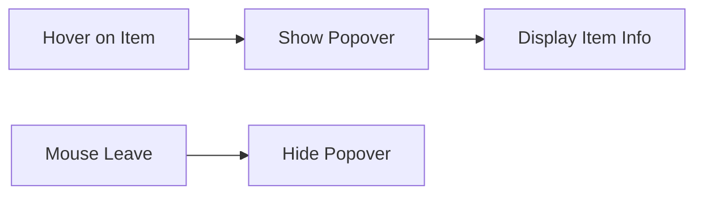

---

### 4. Inventory Info Popover

**Component**: Custom Popover/Tooltip
**Used In**: Store Requisition Detail - Items Tab (Expanded Row)
**Trigger**: Hover on inventory icon

**Content**:
- On Hand Quantity
- On Order Quantity
- Last Purchase Price
- Last Vendor

**Action Flow**:
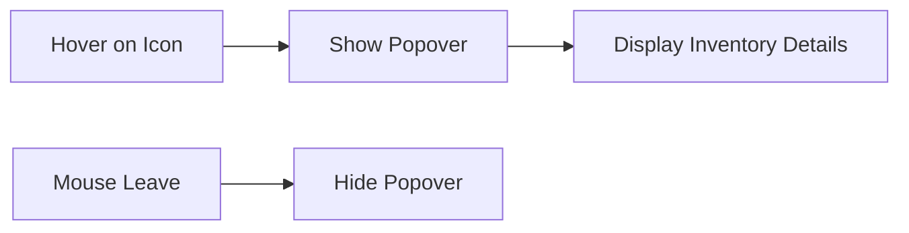

---

## Dropdown Components

### 1. Status Filter Dropdown

**Component**: `Select`
**Used In**: Store Requisitions List, Wastage Reporting
**Type**: Single Select

**Options**:
- All Status (default)
- Draft
- In Process
- Complete
- Reject
- Void

**Action Flow**:
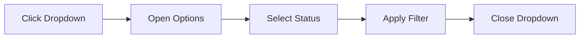

---

### 2. Location Filter Dropdown

**Component**: `Select`
**Used In**: Stock Replenishment, Wastage Reporting
**Type**: Single Select

**Options**: Dynamic list of locations
- All Locations (default)
- Central Kitchen (CK-001)
- Roastery Store (RS-001)
- Main Warehouse (MW-001)
- [Additional locations...]

**Action Flow**:
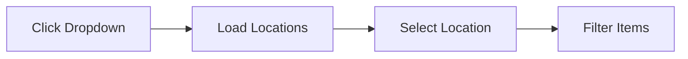

---

### 3. Reason Filter Dropdown

**Component**: `Select`
**Used In**: Wastage Reporting
**Type**: Single Select

**Options**:
- All Reasons (default)
- Expiration
- Damage
- Quality Issues
- Other

**Action Flow**:
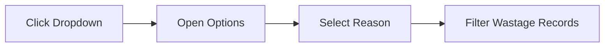

---

### 4. Actions Dropdown Menu

**Component**: `DropdownMenu`
**Used In**: All list pages, detail pages
**Trigger**: Click actions icon (⋮ or ⋯)

**Variants**:

**Store Requisitions List**:
- View
- Edit
- Export
- Delete

**Store Requisition Detail**:
- Edit Requisition
- Print
- Void
- Copy
- Delete
- Export

**Action Flow**:
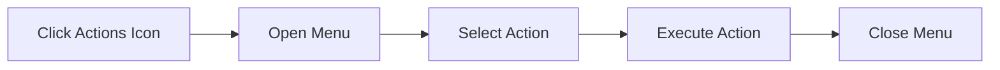

---

### 5. Filter Field Dropdown

**Component**: `Select`
**Used In**: Filter Builder Dialog
**Type**: Single Select

**Options**:
- Date
- Requisition
- Request To
- To Location
- Store Name
- Description
- Status
- Workflow Stage
- Process Status

---

### 6. Filter Operator Dropdown

**Component**: `Select`
**Used In**: Filter Builder Dialog
**Type**: Single Select

**Options**:
- Equals
- Contains
- Greater than
- Less than

---

## Form Components

### 1. Search Input

**Component**: `Input` with search icon
**Used In**: All list pages

**Features**:
- Left-aligned search icon
- Placeholder text
- Real-time filtering
- Clear button (optional)

**Variants**:
- Store Requisitions: "Search requisitions..."
- Stock Replenishment: "Search items..."
- Wastage Reporting: "Search wastage records..."

**Action Flow**:
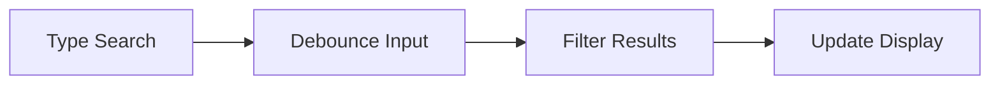

---

### 2. Pagination Controls

**Component**: `Pagination`
**Used In**: Store Requisitions List

**Features**:
- First page button (hidden on mobile)
- Previous page button
- Page number display
- Go to page input
- Next page button
- Last page button (hidden on mobile)
- Responsive design

**Action Flow**:
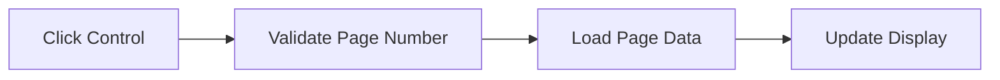

---

### 3. View Toggle

**Component**: Button group
**Used In**: Store Requisitions List

**Options**:
- Table View (List icon)
- Card View (Grid icon)

**Action Flow**:
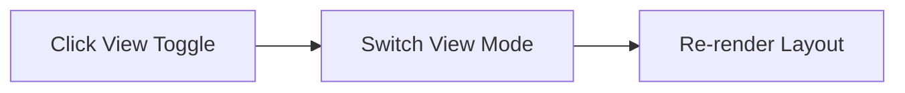

---

### 4. Date Range Picker

**Component**: `DateRangePicker` (future)
**Used In**: Wastage Reporting, Reports

**Features**:
- Start date selection
- End date selection
- Preset ranges (This Week, This Month, Last Month, etc.)
- Calendar picker

---

## Display Components

### 1. Status Badge

**Component**: `StatusBadge` or `Badge`
**Used In**: All modules

**Variants**:

**Store Requisitions**:
- Draft (Gray)
- In Process (Blue)
- Complete (Green)
- Reject (Red)
- Void (Gray strikethrough)

**Wastage**:
- Pending Review (Orange)
- Approved (Green)
- Rejected (Red)
- Void (Gray)

**Stock Status**:
- Low (Red)
- Critical (Dark Red)
- Normal (Green)
- High (Blue)
- Overstock (Orange)

**Props**:
```typescript
interface StatusBadgeProps {
  status: string
  variant?: 'default' | 'outline' | 'secondary'
}
```

---

### 2. Workflow Stage Badge

**Component**: Custom badge with tooltip
**Used In**: Store Requisitions

**Features**:
- Colored dot indicator
- Stage name text
- Hover tooltip with description
- Color-coded by stage type

**Stages**:
- Submission (Blue)
- HOD Approval (Purple)
- Store Manager Approval (Amber)
- Complete (Green)
- Rejected (Red)

**Props**:
```typescript
interface WorkflowStageBadgeProps {
  stage: string
  tooltip: string
}
```

---

### 3. Stat Card

**Component**: `Card` with statistics
**Used In**: All dashboard pages

**Structure**:
- Title text
- Large value display
- Icon (optional)
- Trend indicator (optional)
- Comparison text (optional)

**Variants**:
- Numeric (e.g., "1,234")
- Currency (e.g., "$45,678")
- Percentage (e.g., "45%")
- Count with trend (e.g., "28 items +8%")

**Props**:
```typescript
interface StatCardProps {
  title: string
  value: string | number
  icon?: React.ReactNode
  trend?: 'up' | 'down' | 'neutral'
  trendValue?: string
  trendLabel?: string
}
```

---

### 4. Data Table

**Component**: `Table` from shadcn/ui
**Used In**: All list views

**Features**:
- Sticky header
- Sortable columns
- Row hover effects
- Responsive design
- Horizontal scroll on mobile
- Minimum column widths

**Props**:
```typescript
interface DataTableProps<T> {
  columns: ColumnDef<T>[]
  data: T[]
  sorting?: SortingState
  onSortingChange?: (sorting: SortingState) => void
}
```

---

### 5. Card View Item

**Component**: Custom card component
**Used In**: Store Requisitions Card View

**Structure**:
- Header with reference and status
- Description
- Key details in grid
- Footer with metadata
- Actions menu

**Features**:
- Responsive grid layout
- Truncated text with ellipsis
- Hover shadow effect
- Conditional field display

---

### 6. Chart Components

**Components**: Recharts library
**Used In**: All dashboard pages

**Chart Types**:

**Line Chart**:
- Stock level trends
- Monthly wastage trends
- Purpose: Time series visualization

**Pie/Donut Chart**:
- Wastage by reason
- Stock distribution by location
- Purpose: Proportion visualization

**Bar Chart**:
- Top stores by requisitions
- Items by category
- Purpose: Comparison visualization

**Common Props**:
```typescript
interface ChartProps {
  data: any[]
  width?: number | string
  height?: number | string
  responsive?: boolean
}
```

---

## Navigation Components

### 1. Back Button

**Component**: Button with ChevronLeft icon
**Used In**: Detail pages

**Action Flow**:
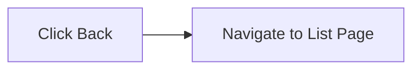

---

### 2. Tab Navigation

**Component**: `Tabs` from shadcn/ui
**Used In**: Store Requisition Detail

**Tabs**:
- Items
- Stock Movements
- Journal Entries
- Approval Workflow

**Action Flow**:
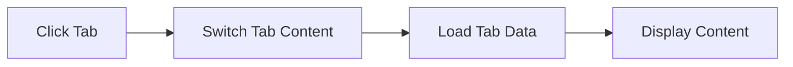

---

### 3. Breadcrumbs

**Component**: Breadcrumb navigation (future)
**Used In**: All pages

**Structure**:
```
Store Operations > Store Requisitions > SR-2401-0001
```

---

## Component Patterns

### Button Patterns

**Primary Actions**:
- Solid background
- High contrast
- CTA (Call to Action)
- Examples: "New Request", "Create Requisition", "Report Wastage"

**Secondary Actions**:
- Outline style
- Medium contrast
- Supporting actions
- Examples: "Export", "Saved Filters"

**Destructive Actions**:
- Red color scheme
- Warning indicators
- Confirmation required
- Examples: "Delete", "Void"

**Icon Buttons**:
- Ghost/minimal style
- Icon only
- Tooltip on hover
- Examples: Actions menu (⋮), View toggle

---

### Loading States

**Skeleton Loaders**:
- Pulsing animation
- Matches component structure
- Used during data fetch

**Spinners**:
- Centered in container
- Used for quick operations

**Progressive Loading**:
- Load critical content first
- Lazy load secondary data

---

### Error States

**Empty States**:
- Icon
- Message
- Call to action
- Example: "No requisitions found. Try adjusting your filters."

**Error Messages**:
- Red alert banner
- Error icon
- Descriptive message
- Retry action

---

### Responsive Patterns

**Mobile Optimizations**:
- Hide non-essential columns
- Switch to card view
- Simplified navigation
- Touch-friendly targets (44x44px minimum)

**Tablet Optimizations**:
- Adaptive grid layouts
- Collapsible sidebars
- Optimized table columns

**Desktop Optimizations**:
- Full table display
- Multi-column layouts
- Hover states
- Keyboard shortcuts

---

**Last Updated**: 2025-10-02
**Module**: Store Operations
**Status**: ✅ Production (Store Requisitions), 🚧 Prototype (Others)

## Document History

| Version | Date | Author | Changes |
|---------|------|--------|---------|
| 1.0.0 | 2025-11-19 | Documentation Team | Initial version |