# Store Requisitions Submodule

**Submodule**: Store Requisitions
**Route**: `/store-operations/store-requisitions`
**Status**: ✅ Production
## Document History

| Version | Date | Author | Changes |
|---------|------|--------|---------|
| 1.0.0 | 2025-11-19 | Documentation Team | Initial version |
**Last Updated**: 2025-10-02

## Table of Contents

1. [Pages](#pages)
2. [Modals and Dialogues](#modals-and-dialogues)
3. [Dropdown Fields](#dropdown-fields)
4. [Actions and Buttons](#actions-and-buttons)
5. [Form Components](#form-components)
6. [Data Display Components](#data-display-components)

---

## Pages

### 1. Store Requisition List Page

**Path**: `/store-operations/store-requisitions`
**Component**: `StoreRequisitionListComponent`
**Screenshot**: 

#### Page Structure

```
┌─────────────────────────────────────────────────────────────┐
│ Store Requisition List                                      │
│ Manage and track store requisitions across all locations    │
│                                          [Export] [+ New]    │
├─────────────────────────────────────────────────────────────┤
│ [Search...]  [Status Filter]  [Saved Filters] [Add Filters] │
│                                           [Table] [Card]     │
├─────────────────────────────────────────────────────────────┤
│                                                               │
│  SR #    Date    Request To   Location   Store   Status...  │
│  ───────────────────────────────────────────────────────...  │
│  Data rows with workflow stages and amounts...               │
│                                                               │
├─────────────────────────────────────────────────────────────┤
│  Page 1 of N                                 [< > Goto >>]  │
└─────────────────────────────────────────────────────────────┘
```

#### Features

**Search and Filtering**:
- Global search across requisition number, description, location
- Status filter dropdown (All, Draft, In Process, Complete, Reject, Void)
- Advanced filter builder with multiple conditions
- Saved filter presets

**View Modes**:
- Table view with sortable columns
- Card view with compact information cards
- View toggle button

**Table Columns**:
1. SR # (Requisition Number) - Clickable link to detail page
2. Date - Formatted as DD/MM/YYYY
3. Request To - Location code
4. To Location - Destination location name
5. Store Name - Originating store
6. Description - Request description
7. Amount - Total amount with currency
8. Currency - Currency code
9. Status - Status badge
10. Workflow Stage - Current approval stage with tooltip
11. Actions - Dropdown menu

**Pagination**:
- First/Previous/Next/Last page buttons
- Go to page input field
- Items per page: 10
- Current page indicator

#### Action Flows

**Search Requisitions**:
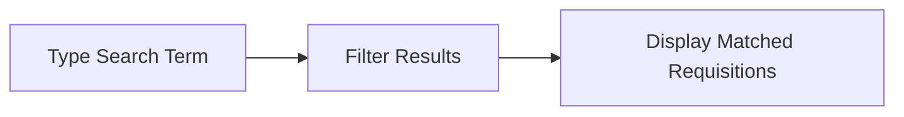

**Apply Status Filter**:
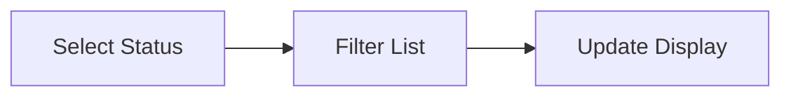

**Open Filter Builder**:
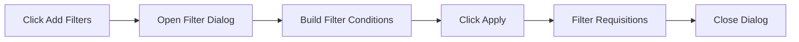

**Switch View Mode**:
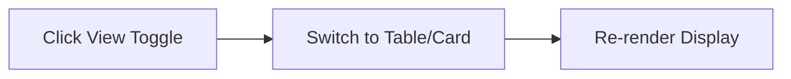

**Navigate to Detail**:
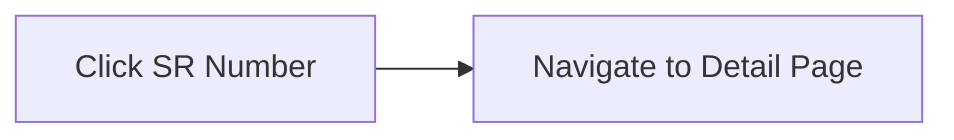

**Export Requisitions**:
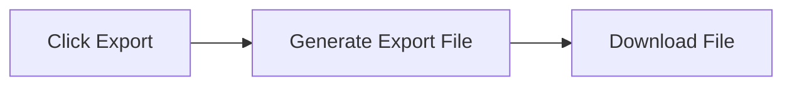

**Create New Requisition**:
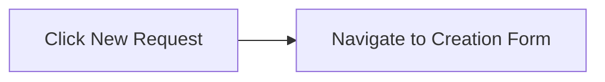

**Page Navigation**:
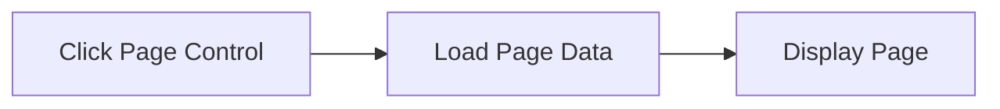

---

### 2. Store Requisition Detail Page

**Path**: `/store-operations/store-requisitions/[id]`
**Component**: `StoreRequisitionDetailComponent`
**Screenshot**: 

#### Page Structure

```
┌─────────────────────────────────────────────────────────────┐
│ [< Back]  Store Requisition: SR-2401-0001          [Actions▼]│
├─────────────────────────────────────────────────────────────┤
│ ┌─── Header Information ───────────────────────────────┐    │
│ │ Date: 2024-01-15        Expected: 2024-01-20        │    │
│ │ Request To: M01         Description: Monthly...     │    │
│ │ Department: F&B Ops     Status: In Process          │    │
│ └─────────────────────────────────────────────────────┘    │
├─────────────────────────────────────────────────────────────┤
│ [Items] [Stock Movements] [Journal Entries] [Approval]      │
├─────────────────────────────────────────────────────────────┤
│                                                               │
│  Tab Content Area                                            │
│  (Dynamic based on selected tab)                             │
│                                                               │
└─────────────────────────────────────────────────────────────┘
```

#### Header Information

**Display Fields**:
- Reference Number (SR-YYYY-NNN)
- Request Date
- Expected Delivery Date
- Movement Type
- Request To (Location code and name)
- Department
- Job Code
- Description
- Status Badge
- Workflow Stage (if applicable)

**Header Actions Dropdown**:
- Edit Requisition
- Print
- Void
- Copy
- Delete
- Export

#### Tab 1: Items Tab

**Screenshot**: 

**Features**:
- Expandable item rows
- Item-level approval status
- Quantity tracking (Required vs Approved vs Issued)
- Cost per unit and total calculations
- Tax and discount information
- Inventory information popup

**Table Columns**:
1. Expand/Collapse icon
2. Description
3. Unit
4. Qty Required
5. Qty Approved
6. Qty Issued
7. Cost/Unit
8. Subtotal
9. Tax %
10. Discount %
11. Total
12. Approval Status Badge
13. Actions

**Expanded Row Shows**:
- Item Information (Location, Category, Sub-category, Item Group, Barcode)
- Inventory Information (On Hand, On Order, Last Price, Last Vendor)
- Request Date

**Action Flows**:

**View Item Details**:
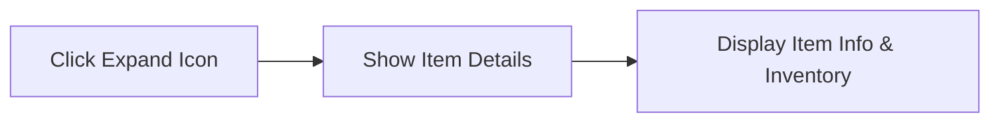

**View Item Info Popup**:
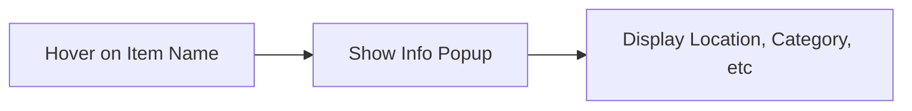

**View Inventory Info**:
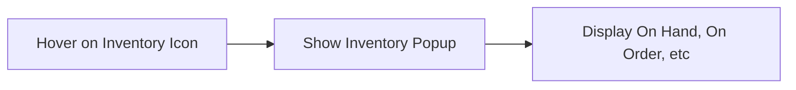

**Approve Item**:
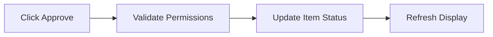

**Reject Item**:
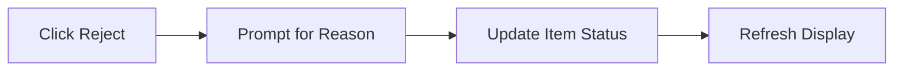

**Calculate Totals**:
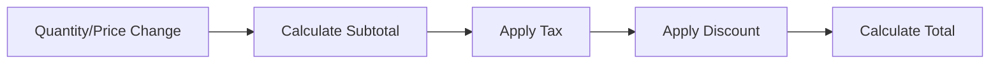

#### Tab 2: Stock Movements Tab

**Screenshot**: 

**Features**:
- Stock movement history for requisition
- Source and destination tracking
- Quantity movements
- Transaction dates
- Movement status

**Table Columns**:
1. Date
2. Movement Type
3. From Location
4. To Location
5. Item Description
6. Quantity
7. Unit
8. Status
9. Created By

**Action Flows**:

**View Movement Details**:
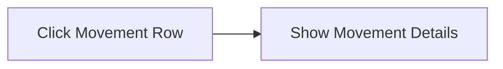

**Filter Movements**:
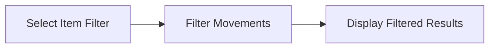

#### Tab 3: Journal Entries Tab

**Screenshot**: 

**Features**:
- Auto-generated journal entries
- Debit and credit accounts
- Account codes and descriptions
- Amount tracking
- Entry date and reference

**Table Columns**:
1. Entry Date
2. Account Code
3. Account Description
4. Debit Amount
5. Credit Amount
6. Reference
7. Created By

**Action Flows**:

**View Journal Entry**:
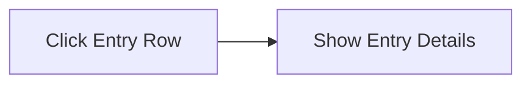

**Export Journal Entries**:
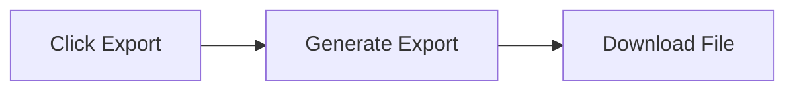

#### Tab 4: Approval Workflow

**Screenshot**: 

**Features**:
- Visual workflow progress indicator
- Approval stage cards
- Approver information
- Approval comments
- Timestamp tracking
- Stage-based actions

**Approval Stages**:
1. **Submission** - System auto-approval
2. **HOD Approval** - Head of Department review
3. **Store Manager Approval** - Final approval for issue
4. **Complete** - All approvals done

**Stage Card Shows**:
- Stage level name
- Approver name and role
- Approval status (Pending/Approved/Rejected/Current)
- Comments
- Approval timestamp
- Action buttons (if current stage)

**Status Indicators**:
- ✓ Approved (Green)
- → Current (Blue)
- ○ Pending (Gray)
- ✗ Rejected (Red)

**Action Flows**:

**Approve Stage**:
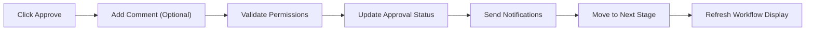

**Reject Stage**:
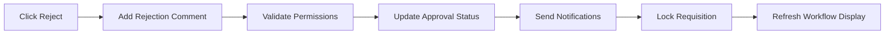

**Request Changes**:
```mermaid
flowchart LR
    Click["Click Request Changes"] --> Comment["Add Change Request"]
    Comment --> Send["Send to Requester"]
    Send --> Status["Update to Review Status"]
```

**View Approval Log**:
```mermaid
flowchart LR
    Click["Click View Log"] --> Open["Open Approval Log Dialog"]
    Open --> Display["Display Full Approval History"]
```

---

## Modals and Dialogues

### 1. Filter Builder Dialog

**Trigger**: Click "Add Filters" button
**Screenshot**: 

**Components**:
- Filter condition rows
- Field selector dropdown
- Operator selector dropdown
- Value input field
- Add/Remove filter buttons
- Apply button

**Fields Available**:
- Date
- Requisition (Ref No)
- Request To
- To Location
- Store Name
- Description
- Status
- Workflow Stage
- Process Status

**Operators**:
- Equals
- Contains
- Greater than
- Less than

**Action Flows**:

**Build Filter**:
```mermaid
flowchart LR
    Click["Click Add Filter"] --> Select["Select Field"]
    Select --> Operator["Select Operator"]
    Operator --> Value["Enter Value"]
    Value --> Apply["Click Apply"]
    Apply --> Filter["Apply Filters"]
    Filter --> Close["Close Dialog"]
```

**Remove Filter**:
```mermaid
flowchart LR
    Click["Click Remove (X)"] --> Delete["Delete Filter Condition"]
    Delete --> Update["Update Filter Display"]
```

### 2. Approval Log Dialog

**Trigger**: Click "View Log" in approval workflow
**Component**: `ApprovalLogDialog`

**Features**:
- Complete approval history
- Approver details
- Action timestamps
- Comments
- Status changes

**Display Fields**:
- Stage Level
- Approver Name
- Approver Role
- Action (Approved/Rejected/Requested Changes)
- Comments
- Timestamp

**Action Flows**:

**View Approval Log**:
```mermaid
flowchart LR
    Open["Open Dialog"] --> Load["Load Approval History"]
    Load --> Display["Display Chronological Log"]
```

**Close Dialog**:
```mermaid
flowchart LR
    Click["Click Close/Outside"] --> Close["Close Dialog"]
```

### 3. Item Details Popover

**Trigger**: Hover on item name or info icon

**Shows**:
- Item Name
- Category and Sub-category
- Item Group
- Location and Location Code
- Barcode
- Location Type

### 4. Inventory Info Popover

**Trigger**: Hover on inventory icon in expanded item row

**Shows**:
- On Hand Quantity
- On Order Quantity
- Last Purchase Price
- Last Vendor

---

## Dropdown Fields

### 1. Status Filter Dropdown

**Field**: Status Filter
**Type**: Single Select
**Component**: `Select`

**Options**:
- All Status (default)
- Draft
- In Process
- Complete
- Reject
- Void

**Action Flow**:
```mermaid
flowchart LR
    Open["Open Dropdown"] --> Select["Select Status"]
    Select --> Apply["Apply Filter"]
    Apply --> Update["Update List"]
```

### 2. Filter Field Dropdown

**Field**: Filter Builder - Field Selection
**Type**: Single Select

**Options**:
- Date
- Requisition (Ref No)
- Request To
- To Location
- Store Name
- Description
- Status
- Workflow Stage
- Process Status

### 3. Filter Operator Dropdown

**Field**: Filter Builder - Operator Selection
**Type**: Single Select

**Options**:
- Equals
- Contains
- Greater than
- Less than

### 4. Actions Dropdown (List Page)

**Trigger**: Click actions menu (⋮)
**Type**: Multi-option menu

**Options**:
- View - Navigate to detail page
- Edit - Open edit form
- Export - Download requisition
- Delete - Delete requisition (with confirmation)

**Action Flow**:
```mermaid
flowchart LR
    Click["Click Menu Icon"] --> Open["Open Dropdown"]
    Open --> Select["Select Action"]
    Select --> Execute["Execute Action"]
```

### 5. Header Actions Dropdown (Detail Page)

**Trigger**: Click "Actions" button in header
**Type**: Multi-option menu

**Options**:
- Edit Requisition
- Print
- Void
- Copy
- Delete
- Export

---

## Actions and Buttons

### List Page Actions

**Primary Actions**:
1. **Export** - Export filtered requisitions to file
2. **New Request** - Create new store requisition

**Search Actions**:
1. **Search Input** - Global search across requisitions
2. **Status Filter** - Filter by requisition status
3. **Saved Filters** - Load saved filter presets
4. **Add Filters** - Open advanced filter builder

**View Controls**:
1. **Table View Toggle** - Switch to table layout
2. **Card View Toggle** - Switch to card layout

**Pagination Controls**:
1. **First Page** - Jump to first page
2. **Previous Page** - Go to previous page
3. **Next Page** - Go to next page
4. **Last Page** - Jump to last page
5. **Go to Page** - Navigate to specific page number

**Row Actions**:
1. **View** - Open detail page
2. **Edit** - Edit requisition
3. **Export** - Download single requisition
4. **Delete** - Delete requisition

### Detail Page Actions

**Header Actions**:
1. **Back** - Return to list page
2. **Actions Dropdown** - Access secondary actions

**Items Tab Actions**:
1. **Expand/Collapse** - Toggle item details
2. **View Item Info** - Show item information popup
3. **View Inventory** - Show inventory information popup
4. **Approve Item** - Mark item as approved
5. **Reject Item** - Mark item as rejected

**Approval Workflow Actions**:
1. **Approve** - Approve current stage
2. **Reject** - Reject requisition
3. **Request Changes** - Send back for modifications
4. **View Log** - Open approval history dialog

**Tab Actions**:
1. **Switch Tab** - Navigate between tabs
2. **Export Tab Data** - Download tab-specific data

---

## Form Components

### Filter Builder Form

**Components**:
- Select (Field)
- Select (Operator)
- Input (Value)
- Button (Add Filter)
- Button (Remove Filter)
- Button (Apply Filters)

**Validation**:
- Field is required
- Operator is required
- Value is required

### Approval Comment Form

**Fields**:
- Comment Textarea (optional for approval, required for rejection)
- Action Selection (Approve/Reject/Request Changes)

**Validation**:
- Comment required if rejecting
- User must have appropriate role permissions

---

## Data Display Components

### Status Badge

**Component**: `StatusBadge`
**Props**: `status: string`

**Status Variants**:
- **Draft** - Gray badge
- **In Process** - Blue badge
- **Complete** - Green badge
- **Reject** - Red badge
- **Void** - Gray strikethrough badge

### Workflow Stage Badge

**Component**: Custom badge with tooltip
**Features**:
- Colored dot indicator
- Stage name text
- Hover tooltip with description

**Stage Styles**:
- **Submission** - Blue
- **HOD Approval** - Purple
- **Store Manager Approval** - Amber
- **Complete** - Green
- **Rejected** - Red

### Pagination Component

**Component**: `Pagination`
**Features**:
- Page indicator
- Navigation buttons
- Go to page input
- Responsive design (hides first/last on mobile)

### Card View Component

**Component**: Requisition card
**Shows**:
- Reference number
- Status badge
- Workflow stage
- Description
- Request To and Location
- Store name
- Date and amount
- Action menu

---

**Last Updated**: 2025-10-02
**Module**: Store Operations > Store Requisitions
**Status**: ✅ Production
