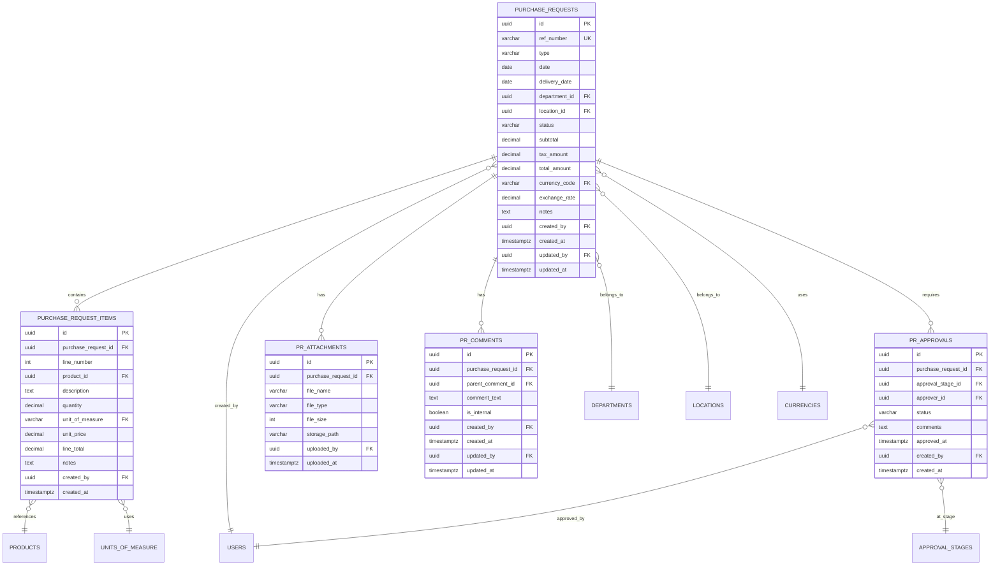

# DS-PR-001: Purchase Requests Data Schema

**Module**: Procurement
**Sub-Module**: Purchase Requests
**Document Type**: Data Schema (DS)
**Version**: 1.0.0
**Last Updated**: 2025-01-30
**Status**: Active

## Document History

| Version | Date | Author | Changes |
|---------|------|--------|---------|
| 1.0.0 | 2025-11-19 | Documentation Team | Initial version |
---

## 1. Overview

### 1.1 Purpose
This document defines the complete database schema for the Purchase Requests sub-module, including all tables, relationships, constraints, indexes, and security policies.

### 1.2 Scope
- Purchase request header and line items
- Approval workflows and history
- Attachments and comments
- Status tracking and audit trails
- Multi-currency support
- Department and location relationships

### 1.3 Database Technology
- **DBMS**: PostgreSQL 14+
- **Extensions**: uuid-ossp, pgcrypto
- **Features**: Row Level Security (RLS), JSONB, Full-Text Search, Triggers

---

## 2. Entity Relationship Diagram

### 2.1 Core Entities



---

## 3. Table Definitions

### 3.1 purchase_requests

**Purpose**: Main table storing purchase request header information.

```sql
CREATE TABLE purchase_requests (
  -- Primary Key
  id UUID PRIMARY KEY DEFAULT uuid_generate_v4(),

  -- Business Key
  ref_number VARCHAR(50) UNIQUE NOT NULL,

  -- Core Fields
  type VARCHAR(20) NOT NULL DEFAULT 'General',
  date DATE NOT NULL DEFAULT CURRENT_DATE,
  delivery_date DATE NOT NULL,

  -- Organizational Context
  department_id UUID NOT NULL REFERENCES departments(id),
  location_id UUID NOT NULL REFERENCES locations(id),

  -- Status and Workflow
  status VARCHAR(20) NOT NULL DEFAULT 'Draft',
  approval_status VARCHAR(20),
  current_approval_stage_id UUID REFERENCES approval_stages(id),

  -- Financial Information (Transaction Currency)
  subtotal DECIMAL(15,2) NOT NULL DEFAULT 0.00,
  tax_amount DECIMAL(15,2) NOT NULL DEFAULT 0.00,
  discount_amount DECIMAL(15,2) NOT NULL DEFAULT 0.00,
  total_amount DECIMAL(15,2) NOT NULL DEFAULT 0.00,
  currency_code VARCHAR(3) NOT NULL DEFAULT 'USD' REFERENCES currencies(code),

  -- Financial Information (Base Currency)
  base_subtotal DECIMAL(15,2) NOT NULL DEFAULT 0.00,
  base_tax_amount DECIMAL(15,2) NOT NULL DEFAULT 0.00,
  base_discount_amount DECIMAL(15,2) NOT NULL DEFAULT 0.00,
  base_total_amount DECIMAL(15,2) NOT NULL DEFAULT 0.00,
  base_currency_code VARCHAR(3) NOT NULL DEFAULT 'USD' REFERENCES currencies(code),
  exchange_rate DECIMAL(15,6) NOT NULL DEFAULT 1.000000,

  -- Additional Information
  notes TEXT,
  internal_notes TEXT,
  priority VARCHAR(20) DEFAULT 'Normal',

  -- Template Information
  template_id UUID REFERENCES pr_templates(id),

  -- Metadata
  metadata JSONB,

  -- Audit Fields (Required for all tables)
  created_at TIMESTAMPTZ NOT NULL DEFAULT NOW(),
  created_by UUID NOT NULL REFERENCES users(id),
  updated_at TIMESTAMPTZ NOT NULL DEFAULT NOW(),
  updated_by UUID NOT NULL REFERENCES users(id),

  -- Version Control
  version INT NOT NULL DEFAULT 1,

  -- Soft Delete
  deleted_at TIMESTAMPTZ,
  deleted_by UUID REFERENCES users(id),

  -- Constraints
  CONSTRAINT pr_type_check CHECK (type IN ('General', 'Market List', 'Asset')),
  CONSTRAINT pr_status_check CHECK (status IN ('Draft', 'Submitted', 'Approved', 'Rejected', 'Cancelled', 'Converted')),
  CONSTRAINT pr_approval_status_check CHECK (approval_status IN ('Pending', 'Approved', 'Rejected', 'Recalled')),
  CONSTRAINT pr_priority_check CHECK (priority IN ('Low', 'Normal', 'High', 'Urgent')),
  CONSTRAINT pr_delivery_date_check CHECK (delivery_date >= date),
  CONSTRAINT pr_amounts_check CHECK (
    subtotal >= 0 AND
    tax_amount >= 0 AND
    discount_amount >= 0 AND
    total_amount >= 0
  ),
  CONSTRAINT pr_exchange_rate_check CHECK (exchange_rate > 0)
);

-- Indexes
CREATE INDEX idx_pr_ref_number ON purchase_requests(ref_number);
CREATE INDEX idx_pr_date ON purchase_requests(date DESC);
CREATE INDEX idx_pr_delivery_date ON purchase_requests(delivery_date);
CREATE INDEX idx_pr_status ON purchase_requests(status);
CREATE INDEX idx_pr_department ON purchase_requests(department_id);
CREATE INDEX idx_pr_location ON purchase_requests(location_id);
CREATE INDEX idx_pr_created_by ON purchase_requests(created_by);
CREATE INDEX idx_pr_created_at ON purchase_requests(created_at DESC);
CREATE INDEX idx_pr_type ON purchase_requests(type);
CREATE INDEX idx_pr_approval_status ON purchase_requests(approval_status);

-- Full-Text Search Index
CREATE INDEX idx_pr_notes_fts ON purchase_requests USING GIN(to_tsvector('english', COALESCE(notes, '')));

-- Composite Indexes for Common Queries
CREATE INDEX idx_pr_dept_status ON purchase_requests(department_id, status);
CREATE INDEX idx_pr_location_date ON purchase_requests(location_id, date DESC);

-- Comments
COMMENT ON TABLE purchase_requests IS 'Main table for purchase request headers';
COMMENT ON COLUMN purchase_requests.ref_number IS 'Unique reference number in format PR-YYMM-NNNN';
COMMENT ON COLUMN purchase_requests.type IS 'Type of purchase request: General, Market List, or Asset';
COMMENT ON COLUMN purchase_requests.approval_status IS 'Current approval workflow status';
```

### 3.2 purchase_request_items

**Purpose**: Line items for each purchase request.

```sql
CREATE TABLE purchase_request_items (
  -- Primary Key
  id UUID PRIMARY KEY DEFAULT uuid_generate_v4(),

  -- Foreign Keys
  purchase_request_id UUID NOT NULL REFERENCES purchase_requests(id) ON DELETE CASCADE,
  product_id UUID REFERENCES products(id),

  -- Line Information
  line_number INT NOT NULL,

  -- Product Information
  description TEXT NOT NULL,
  specifications TEXT,

  -- Quantity and Pricing
  quantity DECIMAL(15,3) NOT NULL,
  unit_of_measure VARCHAR(20) NOT NULL REFERENCES units_of_measure(code),
  unit_price DECIMAL(15,2) NOT NULL DEFAULT 0.00,
  line_total DECIMAL(15,2) NOT NULL DEFAULT 0.00,

  -- Tax Information
  tax_rate DECIMAL(5,2) DEFAULT 0.00,
  tax_amount DECIMAL(15,2) DEFAULT 0.00,

  -- Discount Information
  discount_percentage DECIMAL(5,2) DEFAULT 0.00,
  discount_amount DECIMAL(15,2) DEFAULT 0.00,

  -- Additional Information
  notes TEXT,

  -- Budget Information
  budget_code VARCHAR(50),
  cost_center VARCHAR(50),
  gl_account VARCHAR(50),

  -- Metadata
  metadata JSONB,

  -- Audit Fields
  created_at TIMESTAMPTZ NOT NULL DEFAULT NOW(),
  created_by UUID NOT NULL REFERENCES users(id),
  updated_at TIMESTAMPTZ NOT NULL DEFAULT NOW(),
  updated_by UUID NOT NULL REFERENCES users(id),

  -- Soft Delete
  deleted_at TIMESTAMPTZ,
  deleted_by UUID REFERENCES users(id),

  -- Constraints
  CONSTRAINT pri_quantity_check CHECK (quantity > 0),
  CONSTRAINT pri_unit_price_check CHECK (unit_price >= 0),
  CONSTRAINT pri_line_total_check CHECK (line_total >= 0),
  CONSTRAINT pri_tax_rate_check CHECK (tax_rate >= 0 AND tax_rate <= 100),
  CONSTRAINT pri_discount_check CHECK (discount_percentage >= 0 AND discount_percentage <= 100),
  CONSTRAINT pri_line_number_positive CHECK (line_number > 0),

  -- Unique Constraint
  UNIQUE(purchase_request_id, line_number)
);

-- Indexes
CREATE INDEX idx_pri_pr_id ON purchase_request_items(purchase_request_id);
CREATE INDEX idx_pri_product_id ON purchase_request_items(product_id);
CREATE INDEX idx_pri_line_number ON purchase_request_items(purchase_request_id, line_number);

-- Full-Text Search
CREATE INDEX idx_pri_description_fts ON purchase_request_items USING GIN(to_tsvector('english', description));

-- Comments
COMMENT ON TABLE purchase_request_items IS 'Line items for purchase requests';
COMMENT ON COLUMN purchase_request_items.line_number IS 'Sequential line number within the purchase request';
COMMENT ON COLUMN purchase_request_items.line_total IS 'Calculated as quantity * unit_price';
```

### 3.3 pr_approvals

**Purpose**: Tracks approval workflow history and current status.

```sql
CREATE TABLE pr_approvals (
  -- Primary Key
  id UUID PRIMARY KEY DEFAULT uuid_generate_v4(),

  -- Foreign Keys
  purchase_request_id UUID NOT NULL REFERENCES purchase_requests(id) ON DELETE CASCADE,
  approval_stage_id UUID NOT NULL REFERENCES approval_stages(id),
  approver_id UUID NOT NULL REFERENCES users(id),

  -- Approval Information
  status VARCHAR(20) NOT NULL DEFAULT 'Pending',
  sequence_number INT NOT NULL,

  -- Decision Information
  comments TEXT,
  approved_at TIMESTAMPTZ,
  rejected_at TIMESTAMPTZ,

  -- Notification
  notified_at TIMESTAMPTZ,
  reminder_count INT DEFAULT 0,
  last_reminder_at TIMESTAMPTZ,

  -- Delegation
  delegated_to UUID REFERENCES users(id),
  delegated_at TIMESTAMPTZ,
  delegation_reason TEXT,

  -- Metadata
  metadata JSONB,

  -- Audit Fields
  created_at TIMESTAMPTZ NOT NULL DEFAULT NOW(),
  created_by UUID NOT NULL REFERENCES users(id),
  updated_at TIMESTAMPTZ NOT NULL DEFAULT NOW(),
  updated_by UUID NOT NULL REFERENCES users(id),

  -- Constraints
  CONSTRAINT pra_status_check CHECK (status IN ('Pending', 'Approved', 'Rejected', 'Skipped', 'Recalled')),
  CONSTRAINT pra_sequence_positive CHECK (sequence_number > 0),
  CONSTRAINT pra_reminder_count_check CHECK (reminder_count >= 0)
);

-- Indexes
CREATE INDEX idx_pra_pr_id ON pr_approvals(purchase_request_id);
CREATE INDEX idx_pra_approver ON pr_approvals(approver_id, status);
CREATE INDEX idx_pra_status ON pr_approvals(status);
CREATE INDEX idx_pra_stage ON pr_approvals(approval_stage_id);
CREATE INDEX idx_pra_sequence ON pr_approvals(purchase_request_id, sequence_number);

-- Comments
COMMENT ON TABLE pr_approvals IS 'Approval workflow tracking for purchase requests';
COMMENT ON COLUMN pr_approvals.sequence_number IS 'Order of approval in the workflow chain';
```

### 3.4 pr_attachments

**Purpose**: File attachments for purchase requests.

```sql
CREATE TABLE pr_attachments (
  -- Primary Key
  id UUID PRIMARY KEY DEFAULT uuid_generate_v4(),

  -- Foreign Keys
  purchase_request_id UUID NOT NULL REFERENCES purchase_requests(id) ON DELETE CASCADE,

  -- File Information
  file_name VARCHAR(255) NOT NULL,
  original_file_name VARCHAR(255) NOT NULL,
  file_type VARCHAR(100) NOT NULL,
  file_size INT NOT NULL,
  mime_type VARCHAR(100) NOT NULL,

  -- Storage Information
  storage_path VARCHAR(500) NOT NULL,
  storage_provider VARCHAR(50) NOT NULL DEFAULT 'supabase',

  -- Classification
  attachment_type VARCHAR(50) DEFAULT 'General',
  description TEXT,

  -- Access Control
  is_public BOOLEAN DEFAULT FALSE,

  -- Metadata
  metadata JSONB,

  -- Audit Fields
  uploaded_at TIMESTAMPTZ NOT NULL DEFAULT NOW(),
  uploaded_by UUID NOT NULL REFERENCES users(id),

  -- Soft Delete
  deleted_at TIMESTAMPTZ,
  deleted_by UUID REFERENCES users(id),

  -- Constraints
  CONSTRAINT pra_file_size_check CHECK (file_size > 0),
  CONSTRAINT pra_attachment_type_check CHECK (attachment_type IN ('General', 'Quote', 'Specification', 'Drawing', 'Image', 'Other'))
);

-- Indexes
CREATE INDEX idx_pra_pr_id ON pr_attachments(purchase_request_id);
CREATE INDEX idx_pra_uploaded_by ON pr_attachments(uploaded_by);
CREATE INDEX idx_pra_uploaded_at ON pr_attachments(uploaded_at DESC);
CREATE INDEX idx_pra_file_type ON pr_attachments(file_type);

-- Comments
COMMENT ON TABLE pr_attachments IS 'File attachments for purchase requests';
COMMENT ON COLUMN pr_attachments.storage_path IS 'Full path to file in storage system';
```

### 3.5 pr_comments

**Purpose**: Comments and notes on purchase requests with threading support.

```sql
CREATE TABLE pr_comments (
  -- Primary Key
  id UUID PRIMARY KEY DEFAULT uuid_generate_v4(),

  -- Foreign Keys
  purchase_request_id UUID NOT NULL REFERENCES purchase_requests(id) ON DELETE CASCADE,
  parent_comment_id UUID REFERENCES pr_comments(id) ON DELETE CASCADE,

  -- Comment Information
  comment_text TEXT NOT NULL,
  comment_type VARCHAR(20) DEFAULT 'General',

  -- Visibility
  is_internal BOOLEAN DEFAULT FALSE,
  is_pinned BOOLEAN DEFAULT FALSE,

  -- Mentions and Notifications
  mentioned_users UUID[],

  -- Edit History
  is_edited BOOLEAN DEFAULT FALSE,
  edited_at TIMESTAMPTZ,

  -- Metadata
  metadata JSONB,

  -- Audit Fields
  created_at TIMESTAMPTZ NOT NULL DEFAULT NOW(),
  created_by UUID NOT NULL REFERENCES users(id),
  updated_at TIMESTAMPTZ NOT NULL DEFAULT NOW(),
  updated_by UUID NOT NULL REFERENCES users(id),

  -- Soft Delete
  deleted_at TIMESTAMPTZ,
  deleted_by UUID REFERENCES users(id),

  -- Constraints
  CONSTRAINT prc_comment_type_check CHECK (comment_type IN ('General', 'Question', 'Issue', 'Update', 'Approval'))
);

-- Indexes
CREATE INDEX idx_prc_pr_id ON pr_comments(purchase_request_id);
CREATE INDEX idx_prc_parent ON pr_comments(parent_comment_id);
CREATE INDEX idx_prc_created_by ON pr_comments(created_by);
CREATE INDEX idx_prc_created_at ON pr_comments(created_at DESC);
CREATE INDEX idx_prc_internal ON pr_comments(is_internal);

-- Full-Text Search
CREATE INDEX idx_prc_comment_fts ON pr_comments USING GIN(to_tsvector('english', comment_text));

-- Comments
COMMENT ON TABLE pr_comments IS 'Comments and discussions on purchase requests with threading';
COMMENT ON COLUMN pr_comments.parent_comment_id IS 'NULL for top-level comments, references parent for replies';
```

---

## 4. Supporting Tables

### 4.1 pr_templates

```sql
CREATE TABLE pr_templates (
  id UUID PRIMARY KEY DEFAULT uuid_generate_v4(),
  name VARCHAR(200) NOT NULL,
  description TEXT,
  type VARCHAR(20) NOT NULL,
  department_id UUID REFERENCES departments(id),
  is_active BOOLEAN DEFAULT TRUE,
  template_data JSONB NOT NULL,
  created_at TIMESTAMPTZ NOT NULL DEFAULT NOW(),
  created_by UUID NOT NULL REFERENCES users(id),
  updated_at TIMESTAMPTZ NOT NULL DEFAULT NOW(),
  updated_by UUID NOT NULL REFERENCES users(id),

  CONSTRAINT prt_type_check CHECK (type IN ('General', 'Market List', 'Asset'))
);

CREATE INDEX idx_prt_department ON pr_templates(department_id);
CREATE INDEX idx_prt_active ON pr_templates(is_active);
```

### 4.2 pr_activity_log

```sql
CREATE TABLE pr_activity_log (
  id UUID PRIMARY KEY DEFAULT uuid_generate_v4(),
  purchase_request_id UUID NOT NULL REFERENCES purchase_requests(id) ON DELETE CASCADE,
  activity_type VARCHAR(50) NOT NULL,
  description TEXT NOT NULL,
  old_values JSONB,
  new_values JSONB,
  created_at TIMESTAMPTZ NOT NULL DEFAULT NOW(),
  created_by UUID NOT NULL REFERENCES users(id)
);

CREATE INDEX idx_pral_pr_id ON pr_activity_log(purchase_request_id);
CREATE INDEX idx_pral_created_at ON pr_activity_log(created_at DESC);
CREATE INDEX idx_pral_type ON pr_activity_log(activity_type);
```

---

## 5. Database Functions and Triggers

### 5.1 Auto-update Timestamps

```sql
CREATE OR REPLACE FUNCTION update_updated_at_column()
RETURNS TRIGGER AS $$
BEGIN
  NEW.updated_at = NOW();
  RETURN NEW;
END;
$$ LANGUAGE plpgsql;

-- Apply to all tables
CREATE TRIGGER update_pr_updated_at BEFORE UPDATE ON purchase_requests
  FOR EACH ROW EXECUTE FUNCTION update_updated_at_column();

CREATE TRIGGER update_pri_updated_at BEFORE UPDATE ON purchase_request_items
  FOR EACH ROW EXECUTE FUNCTION update_updated_at_column();

CREATE TRIGGER update_pra_updated_at BEFORE UPDATE ON pr_approvals
  FOR EACH ROW EXECUTE FUNCTION update_updated_at_column();

CREATE TRIGGER update_prc_updated_at BEFORE UPDATE ON pr_comments
  FOR EACH ROW EXECUTE FUNCTION update_updated_at_column();
```

### 5.2 Calculate PR Totals

```sql
CREATE OR REPLACE FUNCTION calculate_pr_totals()
RETURNS TRIGGER AS $$
BEGIN
  UPDATE purchase_requests
  SET
    subtotal = (
      SELECT COALESCE(SUM(line_total), 0)
      FROM purchase_request_items
      WHERE purchase_request_id = NEW.purchase_request_id
        AND deleted_at IS NULL
    ),
    total_amount = subtotal + tax_amount - discount_amount
  WHERE id = NEW.purchase_request_id;

  RETURN NEW;
END;
$$ LANGUAGE plpgsql;

CREATE TRIGGER recalculate_pr_totals_insert
  AFTER INSERT ON purchase_request_items
  FOR EACH ROW EXECUTE FUNCTION calculate_pr_totals();

CREATE TRIGGER recalculate_pr_totals_update
  AFTER UPDATE ON purchase_request_items
  FOR EACH ROW EXECUTE FUNCTION calculate_pr_totals();

CREATE TRIGGER recalculate_pr_totals_delete
  AFTER DELETE ON purchase_request_items
  FOR EACH ROW EXECUTE FUNCTION calculate_pr_totals();
```

### 5.3 Activity Logging

```sql
CREATE OR REPLACE FUNCTION log_pr_activity()
RETURNS TRIGGER AS $$
BEGIN
  IF (TG_OP = 'UPDATE') THEN
    INSERT INTO pr_activity_log (
      purchase_request_id,
      activity_type,
      description,
      old_values,
      new_values,
      created_by
    ) VALUES (
      NEW.id,
      'UPDATE',
      'Purchase request updated',
      to_jsonb(OLD),
      to_jsonb(NEW),
      NEW.updated_by
    );
  ELSIF (TG_OP = 'INSERT') THEN
    INSERT INTO pr_activity_log (
      purchase_request_id,
      activity_type,
      description,
      new_values,
      created_by
    ) VALUES (
      NEW.id,
      'CREATE',
      'Purchase request created',
      to_jsonb(NEW),
      NEW.created_by
    );
  END IF;

  RETURN NEW;
END;
$$ LANGUAGE plpgsql;

CREATE TRIGGER log_pr_changes
  AFTER INSERT OR UPDATE ON purchase_requests
  FOR EACH ROW EXECUTE FUNCTION log_pr_activity();
```

### 5.4 Generate Reference Number

```sql
CREATE OR REPLACE FUNCTION generate_pr_ref_number()
RETURNS TRIGGER AS $$
DECLARE
  next_number INT;
  new_ref VARCHAR(50);
BEGIN
  IF NEW.ref_number IS NULL THEN
    SELECT COALESCE(MAX(CAST(SUBSTRING(ref_number FROM 9) AS INT)), 0) + 1
    INTO next_number
    FROM purchase_requests
    WHERE ref_number LIKE 'PR-' || TO_CHAR(NEW.date, 'YYYY') || '-%';

    new_ref := 'PR-' || TO_CHAR(NEW.date, 'YYYY') || '-' || LPAD(next_number::TEXT, 4, '0');
    NEW.ref_number := new_ref;
  END IF;

  RETURN NEW;
END;
$$ LANGUAGE plpgsql;

CREATE TRIGGER generate_pr_ref
  BEFORE INSERT ON purchase_requests
  FOR EACH ROW EXECUTE FUNCTION generate_pr_ref_number();
```

---

## 6. Views

### 6.1 purchase_requests_with_details

```sql
CREATE OR REPLACE VIEW purchase_requests_with_details AS
SELECT
  pr.id,
  pr.ref_number,
  pr.type,
  pr.date,
  pr.delivery_date,
  pr.status,
  pr.approval_status,
  pr.total_amount,
  pr.currency_code,
  d.name AS department_name,
  l.name AS location_name,
  u.full_name AS created_by_name,
  (SELECT COUNT(*) FROM purchase_request_items WHERE purchase_request_id = pr.id AND deleted_at IS NULL) AS item_count,
  (SELECT COUNT(*) FROM pr_approvals WHERE purchase_request_id = pr.id AND status = 'Pending') AS pending_approvals,
  pr.created_at,
  pr.updated_at
FROM purchase_requests pr
LEFT JOIN departments d ON pr.department_id = d.id
LEFT JOIN locations l ON pr.location_id = l.id
LEFT JOIN users u ON pr.created_by = u.id
WHERE pr.deleted_at IS NULL;
```

### 6.2 pending_pr_approvals

```sql
CREATE OR REPLACE VIEW pending_pr_approvals AS
SELECT
  pra.id AS approval_id,
  pr.id AS purchase_request_id,
  pr.ref_number,
  pr.date,
  pr.total_amount,
  pr.currency_code,
  pra.approver_id,
  u.full_name AS approver_name,
  pra.sequence_number,
  pra.created_at AS pending_since,
  EXTRACT(DAY FROM NOW() - pra.created_at) AS days_pending
FROM pr_approvals pra
JOIN purchase_requests pr ON pra.purchase_request_id = pr.id
JOIN users u ON pra.approver_id = u.id
WHERE pra.status = 'Pending'
  AND pr.deleted_at IS NULL
ORDER BY pra.created_at;
```

---

## 7. Row Level Security (RLS)

### 7.1 Enable RLS

```sql
ALTER TABLE purchase_requests ENABLE ROW LEVEL SECURITY;
ALTER TABLE purchase_request_items ENABLE ROW LEVEL SECURITY;
ALTER TABLE pr_approvals ENABLE ROW LEVEL SECURITY;
ALTER TABLE pr_attachments ENABLE ROW LEVEL SECURITY;
ALTER TABLE pr_comments ENABLE ROW LEVEL SECURITY;
```

### 7.2 RLS Policies

```sql
-- Users can view PRs from their department or location
CREATE POLICY pr_select_policy ON purchase_requests
  FOR SELECT
  USING (
    auth.uid() = created_by
    OR department_id IN (SELECT department_id FROM user_departments WHERE user_id = auth.uid())
    OR location_id IN (SELECT location_id FROM user_locations WHERE user_id = auth.uid())
    OR EXISTS (SELECT 1 FROM pr_approvals WHERE purchase_request_id = id AND approver_id = auth.uid())
  );

-- Users can insert PRs for their departments
CREATE POLICY pr_insert_policy ON purchase_requests
  FOR INSERT
  WITH CHECK (
    department_id IN (SELECT department_id FROM user_departments WHERE user_id = auth.uid())
  );

-- Users can update their own draft PRs
CREATE POLICY pr_update_policy ON purchase_requests
  FOR UPDATE
  USING (
    created_by = auth.uid()
    AND status IN ('Draft', 'Rejected')
  );

-- Approvers can update approval records
CREATE POLICY pra_update_policy ON pr_approvals
  FOR UPDATE
  USING (
    approver_id = auth.uid()
    AND status = 'Pending'
  );
```

---

## 8. Migration Scripts

### 8.1 Initial Migration (Up)

```sql
-- File: migrations/001_create_purchase_requests.up.sql

BEGIN;

-- Create tables
\i tables/purchase_requests.sql
\i tables/purchase_request_items.sql
\i tables/pr_approvals.sql
\i tables/pr_attachments.sql
\i tables/pr_comments.sql
\i tables/pr_templates.sql
\i tables/pr_activity_log.sql

-- Create functions and triggers
\i functions/update_timestamps.sql
\i functions/calculate_totals.sql
\i functions/activity_logging.sql
\i functions/generate_ref_number.sql

-- Create views
\i views/purchase_requests_with_details.sql
\i views/pending_pr_approvals.sql

-- Enable RLS
\i security/enable_rls.sql
\i security/rls_policies.sql

-- Create indexes
\i indexes/purchase_requests_indexes.sql
\i indexes/purchase_request_items_indexes.sql

COMMIT;
```

### 8.2 Rollback Migration (Down)

```sql
-- File: migrations/001_create_purchase_requests.down.sql

BEGIN;

-- Drop views
DROP VIEW IF EXISTS pending_pr_approvals;
DROP VIEW IF EXISTS purchase_requests_with_details;

-- Drop triggers
DROP TRIGGER IF EXISTS log_pr_changes ON purchase_requests;
DROP TRIGGER IF EXISTS generate_pr_ref ON purchase_requests;
DROP TRIGGER IF EXISTS recalculate_pr_totals_insert ON purchase_request_items;
DROP TRIGGER IF EXISTS recalculate_pr_totals_update ON purchase_request_items;
DROP TRIGGER IF EXISTS recalculate_pr_totals_delete ON purchase_request_items;

-- Drop functions
DROP FUNCTION IF EXISTS log_pr_activity();
DROP FUNCTION IF EXISTS generate_pr_ref_number();
DROP FUNCTION IF EXISTS calculate_pr_totals();
DROP FUNCTION IF EXISTS update_updated_at_column();

-- Drop tables (in reverse order of dependencies)
DROP TABLE IF EXISTS pr_activity_log;
DROP TABLE IF EXISTS pr_templates;
DROP TABLE IF EXISTS pr_comments;
DROP TABLE IF EXISTS pr_attachments;
DROP TABLE IF EXISTS pr_approvals;
DROP TABLE IF EXISTS purchase_request_items;
DROP TABLE IF EXISTS purchase_requests;

COMMIT;
```

---

## 9. Performance Considerations

### 9.1 Index Strategy
- Primary indexes on all foreign keys
- Composite indexes for common query patterns (department + status, location + date)
- Full-text search indexes on text fields (notes, description, comments)
- Covering indexes for frequently accessed columns

### 9.2 Query Optimization
- Use views for complex joins to ensure consistent execution plans
- Implement pagination for large result sets
- Use EXPLAIN ANALYZE for slow queries
- Consider materialized views for reporting queries

### 9.3 Data Archival
```sql
-- Archive old PRs (older than 2 years and completed)
CREATE TABLE purchase_requests_archive (LIKE purchase_requests INCLUDING ALL);

CREATE OR REPLACE FUNCTION archive_old_prs()
RETURNS void AS $$
BEGIN
  INSERT INTO purchase_requests_archive
  SELECT * FROM purchase_requests
  WHERE date < CURRENT_DATE - INTERVAL '2 years'
    AND status IN ('Converted', 'Cancelled')
    AND deleted_at IS NULL;

  UPDATE purchase_requests
  SET deleted_at = NOW(), deleted_by = '00000000-0000-0000-0000-000000000000'::UUID
  WHERE date < CURRENT_DATE - INTERVAL '2 years'
    AND status IN ('Converted', 'Cancelled')
    AND deleted_at IS NULL;
END;
$$ LANGUAGE plpgsql;
```

---

## 10. Security Considerations

### 10.1 Data Encryption
- Use pgcrypto for sensitive fields
- Encrypt attachment file paths
- Hash internal notes if containing sensitive information

### 10.2 Audit Trail
- All tables include created_by, updated_by, created_at, updated_at
- Activity log captures all changes to PRs
- Soft delete maintains data integrity

### 10.3 Access Control
- RLS policies enforce department/location access
- Approvers have specific permissions for their approval records
- Public/private attachment controls

---

## 11. Backup and Recovery

### 11.1 Backup Strategy
```sql
-- Daily incremental backups
pg_dump -Fc -f pr_backup_$(date +%Y%m%d).dump -t purchase_requests* -t pr_* carmen_db

-- Weekly full backups
pg_dump -Fc -f full_backup_$(date +%Y%m%d).dump carmen_db
```

### 11.2 Point-in-Time Recovery
- Enable WAL archiving
- Configure continuous archiving
- Test restore procedures monthly

---

## 12. Monitoring and Maintenance

### 12.1 Health Checks
```sql
-- Check for orphaned records
SELECT 'Orphaned PR Items' AS issue, COUNT(*)
FROM purchase_request_items pri
WHERE NOT EXISTS (SELECT 1 FROM purchase_requests WHERE id = pri.purchase_request_id);

-- Check for invalid totals
SELECT 'Invalid Totals' AS issue, COUNT(*)
FROM purchase_requests
WHERE ABS(total_amount - (subtotal + tax_amount - discount_amount)) > 0.01;
```

### 12.2 Statistics
```sql
-- Update table statistics
ANALYZE purchase_requests;
ANALYZE purchase_request_items;
ANALYZE pr_approvals;
```

---

## 13. Related Documents

- **Business Requirements**: [BR-purchase-requests.md](../../business-requirements/procurement/BR-purchase-requests.md)
- **Use Cases**: [UC-purchase-requests.md](../../use-cases/procurement/UC-purchase-requests.md)
- **Flow Diagrams**: [FD-purchase-requests.md](./FD-purchase-requests.md)
- **Validations**: [VAL-purchase-requests.md](./VAL-purchase-requests.md)
- **API Documentation**: [API-purchase-requests.md](./API-purchase-requests.md)

---

**Document Control**:
- **Created**: 2025-01-30
- **Author**: System Architect
- **Reviewed By**: Database Administrator, Security Team
- **Next Review**: 2025-04-30
