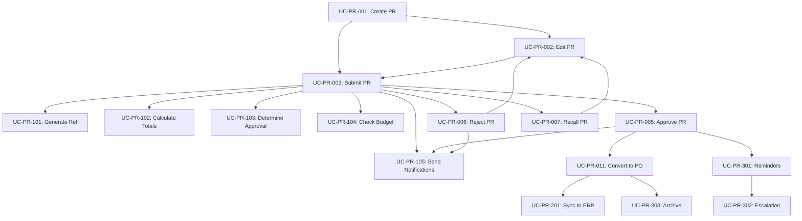

# UC-PR: Purchase Requests Use Cases

**Module**: Procurement
**Sub-Module**: Purchase Requests
**Document Type**: Use Cases (UC)
**Version**: 1.0.0
**Last Updated**: 2025-01-30
**Status**: Active

## Document History

| Version | Date | Author | Changes |
|---------|------|--------|---------|
| 1.0.0 | 2025-11-19 | Documentation Team | Initial version |
---

## 1. Overview

### 1.1 Purpose
This document defines all use cases for the Purchase Requests sub-module, including user interactions, system processes, integrations, and background jobs.

### 1.2 Scope
- User use cases (UC-PR-001 to UC-PR-099): Human-system interactions
- System use cases (UC-PR-101 to UC-PR-199): Automated processes
- Integration use cases (UC-PR-201 to UC-PR-299): External system interactions
- Background job use cases (UC-PR-301 to UC-PR-399): Asynchronous processes

### 1.3 Actors

#### Primary Actors
- **Requestor**: Staff member creating purchase requests
- **Department Manager**: Approver for department-level PRs
- **Finance Manager**: Approver for high-value PRs
- **General Manager**: Approver for very high-value PRs
- **Asset Manager**: Approver for asset purchases
- **Purchasing Staff**: Converts PRs to POs

#### Secondary Actors
- **System Administrator**: Configures workflows
- **Budget Manager**: Views budget impact

#### System Actors
- **PR System**: Purchase request management system
- **Approval Engine**: Workflow automation
- **Budget System**: Budget tracking and validation
- **Notification Service**: Email/SMS notifications
- **Reporting Engine**: Analytics and reports

---

## 2. Use Case Diagram

```mermaid
flowchart TD
    Requestor([Requestor])
    DeptMgr([Dept Manager])
    FinMgr([Finance Manager])
    GenMgr([General Manager])
    Purchasing([Purchasing Staff])
    System([System])

    Requestor --> UC001[UC-PR-001: Create PR]
    Requestor --> UC002[UC-PR-002: Edit Draft PR]
    Requestor --> UC003[UC-PR-003: Submit PR]
    Requestor --> UC004[UC-PR-004: View PR Status]
    Requestor --> UC009[UC-PR-009: Add Attachment]
    Requestor --> UC010[UC-PR-010: Add Comment]

    DeptMgr --> UC005[UC-PR-005: Approve PR]
    DeptMgr --> UC006[UC-PR-006: Reject PR]
    FinMgr --> UC005
    FinMgr --> UC006
    GenMgr --> UC005
    GenMgr --> UC006

    Requestor --> UC007[UC-PR-007: Recall PR]
    Requestor --> UC008[UC-PR-008: Cancel PR]

    Purchasing --> UC011[UC-PR-011: Convert to PO]

    System --> UC101[UC-PR-101: Auto-generate Ref Number]
    System --> UC102[UC-PR-102: Calculate Totals]
    System --> UC103[UC-PR-103: Determine Approval Chain]
    System --> UC104[UC-PR-104: Check Budget]
    System --> UC105[UC-PR-105: Send Notifications]

    System --> UC301[UC-PR-301: Reminder Notifications]
    System --> UC302[UC-PR-302: Escalation Process]
    System --> UC303[UC-PR-303: Archive Old PRs]
```



---

## 3. User Use Cases (001-099)

### UC-PR-001: Create Purchase Request

**Priority**: Critical
**Frequency**: Daily (50-100 per day)
**Actors**: Requestor

#### Description
Allows staff to create a new purchase request by entering header information and adding line items for products or services they need to procure.

#### Preconditions
- User must be authenticated
- User must have 'create_purchase_request' permission
- User must have access to at least one department

#### Postconditions
- **Success**: PR saved as Draft with auto-generated reference number
- **Failure**: Error message displayed, no PR created

#### Main Flow
1. User clicks "New Purchase Request" button
2. System displays PR form with default values:
   - Today's date as PR date
   - User's default department selected
   - User's default location selected
   - Currency from user's location
   - Status set to "Draft"
3. User selects PR type (General/Market List/Asset)
4. User enters delivery date
5. User optionally modifies department, location, or other header fields
6. User adds line items:
   a. Clicks "Add Item" button
   b. Searches for and selects product (optional)
   c. Enters description and specifications
   d. Enters quantity and unit of measure
   e. Enters unit price (optional for draft)
   f. Optionally enters budget code, cost center, GL account
   g. Clicks "Add" to add item to PR
7. User repeats step 6 for additional items
8. System calculates line totals and PR total automatically
9. User optionally adds notes or internal notes
10. User clicks "Save as Draft"
11. System validates input (see VAL-PR-001)
12. System generates reference number (see UC-PR-101)
13. System saves PR to database
14. System logs activity
15. System displays success message with PR reference number
16. System redirects to PR detail page

#### Alternative Flows

**A1: Use Template** (Step 1)
1a. User clicks "New from Template"
2a. System displays template selection dialog
3a. User selects template
4a. System loads template data into form
5a. Resume at step 6

**A2: Validation Errors** (Step 11)
11a. System detects validation errors
12a. System displays error messages inline
13a. User corrects errors
14a. Resume at step 10

**A3: Cancel Creation** (Any step)
1. User clicks "Cancel"
2. System prompts for confirmation
3. If confirmed:
   a. System discards unsaved changes
   b. System redirects to PR list
4. If not confirmed, resume at previous step

#### Exception Flows

**E1: Network Error** (Step 13)
1. System displays "Network error. Please try again."
2. System retains form data
3. User clicks "Retry"
4. Resume at step 10

**E2: Database Error** (Step 13)
1. System logs error details
2. System displays "Unable to save PR. Please contact support."
3. Use case ends

**E3: Session Expired** (Any step)
1. System detects expired session
2. System redirects to login
3. After login, system restores form data if possible
4. Resume at previous step

#### Business Rules
- BR-PR-001: Reference number auto-generated in format PR-YYMM-NNNN
- BR-PR-002: Delivery date must be after PR date
- BR-PR-003: At least one line item required before submission (not for draft)
- BR-PR-005: Only certain statuses allow editing
- BR-PR-011: Department and location required

#### Related Requirements
- FR-PR-001: Create purchase request
- FR-PR-002: Auto-generate reference numbers
- FR-PR-007: Multi-currency support

---

### UC-PR-002: Edit Draft Purchase Request

**Priority**: High
**Frequency**: Daily (30-50 per day)
**Actors**: Requestor

#### Description
Allows requestor to modify a purchase request that is in Draft or Rejected status.

#### Preconditions
- User must be authenticated
- PR must exist
- PR status must be "Draft" or "Rejected"
- User must be the creator of the PR

#### Postconditions
- **Success**: PR updated with new values, version incremented
- **Failure**: Error message displayed, PR unchanged

#### Main Flow
1. User opens PR from list or search
2. System checks PR status and ownership
3. System displays editable PR form with current values
4. User modifies header fields as needed
5. User modifies existing line items:
   - Edit quantity, price, description
   - Delete items by clicking "Remove"
6. User adds new line items (same as UC-PR-001 step 6)
7. System recalculates totals automatically
8. User clicks "Save"
9. System validates changes (see VAL-PR-001)
10. System checks for version conflicts
11. System updates PR in database
12. System increments version number
13. System logs activity with old/new values
14. System displays success message
15. System refreshes PR detail page

#### Alternative Flows

**A1: Version Conflict** (Step 10)
10a. System detects version mismatch
11a. System displays "This PR was modified by another user"
12a. System shows option to:
   - View latest version and discard changes
   - Overwrite with user's changes (if admin)
13a. User selects option
14a. System processes accordingly

**A2: Cancel Editing** (Any step)
1. User clicks "Cancel"
2. System prompts for confirmation if changes made
3. If confirmed, system discards changes and shows read-only view
4. If not confirmed, resume editing

#### Exception Flows

**E1: PR Status Changed** (Step 2)
1. System detects status changed to non-editable status
2. System displays "This PR can no longer be edited"
3. System shows read-only view
4. Use case ends

**E2: Permission Revoked** (Step 2)
1. System detects user no longer has edit permission
2. System displays "You no longer have permission to edit this PR"
3. System shows read-only view
4. Use case ends

#### Business Rules
- BR-PR-005: Only Draft and Rejected PRs can be edited
- BR-PR-006: Only creator can edit their PRs
- BR-PR-015: Version control prevents concurrent edit conflicts

#### Related Requirements
- FR-PR-003: Edit purchase request
- FR-PR-015: Version control

---

### UC-PR-003: Submit Purchase Request for Approval

**Priority**: Critical
**Frequency**: Daily (40-80 per day)
**Actors**: Requestor

#### Description
Allows requestor to submit a draft PR for approval, triggering the approval workflow.

#### Preconditions
- User must be authenticated
- PR must exist in "Draft" status
- User must be the creator of the PR
- PR must have at least one line item
- All line items must have unit prices
- Delivery date must be in the future
- Approval workflow must be configured

#### Postconditions
- **Success**: PR status changed to "Submitted", approval records created, notifications sent
- **Failure**: Error message displayed, PR remains in Draft

#### Main Flow
1. User opens Draft PR
2. User clicks "Submit for Approval" button
3. System validates PR completeness (see VAL-PR-107, VAL-PR-108, VAL-PR-109)
4. System determines approval chain (see UC-PR-103)
5. System displays preview of approval chain
6. User confirms submission
7. System begins transaction
8. System creates approval records for each stage
9. System updates PR status to "Submitted"
10. System updates approval status to "Pending"
11. System commits transaction
12. System sends notification to first approver (see UC-PR-105)
13. System logs activity
14. System displays success message
15. System updates PR detail page to show submission status

#### Alternative Flows

**A1: Review Before Submit** (Step 2)
2a. User clicks "Preview Approval Chain"
3a. System displays who will approve and order
4a. User reviews chain
5a. User clicks "Submit"
6a. Resume at step 3

**A2: Auto-Approve** (Step 4)
4a. System determines no approval required (e.g., Market List < $500)
5a. System updates PR status directly to "Approved"
6a. System displays "PR auto-approved"
7a. Use case ends

#### Exception Flows

**E1: Validation Failed** (Step 3)
1. System detects validation errors
2. System displays specific error messages
3. System highlights problematic fields
4. User must correct errors
5. Resume at step 2

**E2: No Approval Workflow** (Step 4)
1. System detects no approval workflow configured
2. System displays "No approval workflow configured. Contact administrator."
3. PR remains in Draft
4. Use case ends

**E3: Notification Failure** (Step 12)
1. System logs notification failure
2. System queues notification for retry
3. System still marks PR as Submitted
4. System displays warning: "PR submitted but notification may be delayed"
5. Use case continues

#### Business Rules
- BR-PR-003: At least one item required
- BR-PR-004: All items must have prices
- BR-PR-006: Approval chain required
- BR-PR-007: Market List auto-approve under threshold
- BR-PR-008: Budget availability check if budget code provided
- BR-PR-009: Asset type requires asset manager

#### Related Requirements
- FR-PR-004: Submit for approval
- FR-PR-005: Approval workflow
- FR-PR-006: Notifications

---

### UC-PR-004: View Purchase Request Status

**Priority**: High
**Frequency**: Continuous (monitoring)
**Actors**: Requestor, Approvers, Purchasing Staff

#### Description
Allows users to view the current status of a purchase request, including approval progress, comments, and history.

#### Preconditions
- User must be authenticated
- PR must exist
- User must have view permission (creator, approver, or purchasing staff)

#### Postconditions
- **Success**: PR details and status displayed
- **Failure**: Access denied message or PR not found

#### Main Flow
1. User navigates to PR list or searches for PR
2. User clicks on PR reference number
3. System checks user permissions
4. System retrieves PR data with related records
5. System displays PR detail page showing:
   - Header information (type, dates, department, amounts)
   - Status badge (Draft, Submitted, Approved, etc.)
   - Line items with quantities and prices
   - Approval progress:
     * List of approval stages
     * Current stage highlighted
     * Status of each approval (Pending/Approved/Rejected)
     * Approver names and timestamps
     * Comments from approvers
   - Attachments list
   - Comments/notes
   - Activity log
   - Related documents (PO if converted)
6. User views information
7. User optionally:
   - Exports to PDF
   - Prints
   - Shares link
   - Takes action (if permitted)

#### Alternative Flows

**A1: Track PR from Email** (Step 1)
1a. User clicks PR link in email notification
2a. System validates link and authentication
3a. Resume at step 4

**A2: Real-time Updates** (Step 6)
6a. While viewing, another user updates PR
7a. System displays notification "This PR was updated"
8a. System shows option to refresh
9a. If user refreshes, system reloads latest data

#### Exception Flows

**E1: Access Denied** (Step 3)
1. System detects user lacks permission
2. System displays "You do not have access to this PR"
3. Use case ends

**E2: PR Not Found** (Step 4)
1. System cannot find PR with given ID
2. System displays "Purchase request not found"
3. System redirects to PR list
4. Use case ends

#### Business Rules
- BR-PR-012: View access based on department/location
- BR-PR-013: Approvers can view PRs pending their approval
- BR-PR-014: Purchasing staff can view all submitted PRs

#### Related Requirements
- FR-PR-008: View PR details
- FR-PR-009: Track approval status

---

### UC-PR-005: Approve Purchase Request

**Priority**: Critical
**Frequency**: Daily (30-60 per day)
**Actors**: Department Manager, Finance Manager, General Manager, Asset Manager

#### Description
Allows designated approver to review and approve a purchase request at their approval stage.

#### Preconditions
- User must be authenticated
- User must be the designated approver for current stage
- PR must be in "Submitted" status
- Approval record must be in "Pending" status
- User's turn in sequential approval chain (if applicable)

#### Postconditions
- **Success**: Approval recorded, PR advances to next stage or becomes fully approved
- **Failure**: Error message displayed, approval unchanged

#### Main Flow
1. Approver receives notification (email/app)
2. Approver clicks link to view PR
3. System displays PR details with approval options
4. Approver reviews:
   - Items and quantities
   - Prices and totals
   - Justification/notes
   - Budget impact
   - Previous approval comments (if any)
5. Approver optionally adds comments
6. Approver clicks "Approve" button
7. System validates approver authority
8. System begins transaction
9. System updates approval record:
   - Status = "Approved"
   - Timestamp = current time
   - Comments saved
10. System checks if all required approvals complete
11. If all approvals complete:
    a. System updates PR status to "Approved"
    b. System sends notification to PR creator
    c. System notifies purchasing staff
12. If more approvals needed:
    a. System identifies next approver
    b. System sends notification to next approver
13. System commits transaction
14. System logs approval activity
15. System displays success message
16. System updates approval status display

#### Alternative Flows

**A1: Approve with Conditions** (Step 6)
6a. Approver clicks "Approve with Conditions"
7a. System prompts for conditions/comments (required)
8a. Approver enters conditions
9a. Resume at step 7 (approval still proceeds but flagged)

**A2: Request More Information** (Step 6)
6a. Approver clicks "Request Information"
7a. System prompts for questions/comments (required)
8a. Approver enters questions
9a. System sends notification to PR creator
10a. Approval remains "Pending"
11a. Use case ends (creator must respond)

**A3: Delegate Approval** (Step 6)
6a. Approver clicks "Delegate"
7a. System displays list of possible delegates
8a. Approver selects delegate and enters reason
9a. System updates approver for this record
10a. System sends notification to delegate
11a. Use case ends

#### Exception Flows

**E1: Already Approved** (Step 7)
1. System detects approval already processed
2. System displays "This PR has already been approved"
3. System shows read-only approval status
4. Use case ends

**E2: PR Status Changed** (Step 7)
1. System detects PR status changed (e.g., Cancelled)
2. System displays "This PR is no longer pending approval"
3. System shows current status
4. Use case ends

**E3: Approver Changed** (Step 7)
1. System detects approver was changed/delegated
2. System displays "You are no longer the approver for this PR"
3. Use case ends

#### Business Rules
- BR-PR-016: Approver must be designated for current stage
- BR-PR-017: Sequential approvals must follow order
- BR-PR-018: Parallel approvals can be done in any order
- BR-PR-019: All parallel approvals must complete before next stage

#### Related Requirements
- FR-PR-005: Approval workflow
- FR-PR-010: Delegation
- FR-PR-006: Notifications

---

### UC-PR-006: Reject Purchase Request

**Priority**: High
**Frequency**: Weekly (5-15 per week)
**Actors**: Department Manager, Finance Manager, General Manager, Asset Manager

#### Description
Allows approver to reject a purchase request with required justification, returning it to the requestor.

#### Preconditions
- Same as UC-PR-005 (Approve PR)
- Comments must be provided (minimum 10 characters)

#### Postconditions
- **Success**: PR status changed to "Rejected", requestor notified
- **Failure**: Error message displayed, approval unchanged

#### Main Flow
1. Approver receives notification and views PR (same as UC-PR-005 steps 1-4)
2. Approver identifies reason for rejection
3. Approver clicks "Reject" button
4. System displays rejection dialog
5. System prompts for rejection reason (required)
6. Approver enters detailed reason (minimum 10 characters)
7. Approver clicks "Confirm Rejection"
8. System validates comments length
9. System begins transaction
10. System updates approval record:
    - Status = "Rejected"
    - Timestamp = current time
    - Comments saved
11. System updates PR status to "Rejected"
12. System cancels all other pending approvals
13. System commits transaction
14. System sends rejection notification to PR creator with comments
15. System logs rejection activity
16. System displays confirmation message
17. System updates PR detail page

#### Alternative Flows

**A1: Cancel Rejection** (Step 7)
7a. Approver clicks "Cancel"
8a. System closes dialog
9a. PR remains in pending state
10a. Use case ends

#### Exception Flows

**E1: Insufficient Comments** (Step 8)
1. System detects comments < 10 characters
2. System displays "Please provide detailed reason (minimum 10 characters)"
3. System keeps dialog open
4. Resume at step 6

**E2: Already Processed** (Step 9)
1. System detects approval already approved/rejected
2. System displays "This approval was already processed"
3. Use case ends

#### Business Rules
- BR-PR-010: Rejection comments required (min 10 chars)
- BR-PR-020: Rejection returns PR to Draft or Rejected status
- BR-PR-021: Rejected PR can be edited and resubmitted

#### Related Requirements
- FR-PR-005: Approval workflow
- FR-PR-011: Rejection handling
- FR-PR-006: Notifications

---

### UC-PR-007: Recall Purchase Request

**Priority**: Medium
**Frequency**: Weekly (5-10 per week)
**Actors**: Requestor

#### Description
Allows requestor to recall a submitted PR before it is fully approved, returning it to Draft status for editing.

#### Preconditions
- User must be authenticated
- User must be the PR creator
- PR status must be "Submitted"
- PR must not be fully approved yet

#### Postconditions
- **Success**: PR status changed to "Draft", pending approvals cancelled
- **Failure**: Error message displayed, PR unchanged

#### Main Flow
1. Requestor opens submitted PR
2. Requestor reviews current approval status
3. Requestor clicks "Recall" button
4. System displays confirmation dialog with warning
5. System prompts for recall reason (optional)
6. Requestor confirms recall
7. System begins transaction
8. System updates all pending approval records to "Recalled"
9. System updates PR status to "Draft"
10. System commits transaction
11. System sends notifications to pending approvers (cancellation)
12. System logs recall activity with reason
13. System displays success message
14. System displays editable PR form

#### Alternative Flows

**A1: Cancel Recall** (Step 6)
6a. Requestor clicks "Cancel"
7a. System closes dialog
8a. PR remains Submitted
9a. Use case ends

#### Exception Flows

**E1: Already Approved** (Step 7)
1. System detects all approvals complete
2. System displays "Cannot recall. PR already fully approved."
3. Use case ends

**E2: In Final Stage** (Step 7)
1. System detects PR in final approval stage
2. System displays additional warning "PR in final approval stage"
3. System asks for confirmation
4. If confirmed, proceed with recall
5. If cancelled, use case ends

#### Business Rules
- BR-PR-022: Only creator can recall
- BR-PR-023: Cannot recall if fully approved
- BR-PR-024: Recalled PR returns to Draft status

#### Related Requirements
- FR-PR-012: Recall functionality

---

### UC-PR-008: Cancel Purchase Request

**Priority**: Medium
**Frequency**: Monthly (10-20 per month)
**Actors**: Requestor, Department Manager

#### Description
Allows authorized user to cancel a PR at any status except Converted.

#### Preconditions
- User must be authenticated
- User must be PR creator OR have cancel permission
- PR status must not be "Converted" or "Cancelled"

#### Postconditions
- **Success**: PR status changed to "Cancelled"
- **Failure**: Error message displayed, PR unchanged

#### Main Flow
1. User opens PR
2. User clicks "Cancel PR" button
3. System checks if PR can be cancelled
4. System displays confirmation dialog
5. System prompts for cancellation reason (required)
6. User enters reason
7. User confirms cancellation
8. System begins transaction
9. System updates PR status to "Cancelled"
10. System cancels all pending approvals
11. If budget was reserved, system releases budget
12. System commits transaction
13. System sends cancellation notifications
14. System logs cancellation activity
15. System displays confirmation message
16. System shows cancelled PR (read-only)

#### Alternative Flows

**A1: Cancel After Approval** (Step 3)
3a. PR is already approved
4a. System checks for linked PO
5a. If PO exists, display "Cannot cancel. PR converted to PO-XXXX"
6a. Use case ends
7a. If no PO, continue with cancellation

#### Exception Flows

**E1: PR Already Converted** (Step 3)
1. System detects PR has linked PO
2. System displays "Cannot cancel. PR converted to PO. Please cancel PO instead."
3. Use case ends

#### Business Rules
- BR-PR-025: Cannot cancel converted PRs
- BR-PR-026: Budget released on cancellation
- BR-PR-027: Cancellation reason required

#### Related Requirements
- FR-PR-013: Cancellation functionality

---

### UC-PR-009: Add Attachment to PR

**Priority**: Medium
**Frequency**: Weekly (20-40 per week)
**Actors**: Requestor, Approvers

#### Description
Allows authorized users to attach files (quotes, specifications, images) to a PR.

#### Preconditions
- User must be authenticated
- User must be PR creator or approver
- PR must exist
- File size must be < 10MB
- File type must be allowed (PDF, DOC, XLS, JPG, PNG)

#### Postconditions
- **Success**: File uploaded and linked to PR
- **Failure**: Error message displayed, no file attached

#### Main Flow
1. User opens PR detail page
2. User scrolls to Attachments section
3. User clicks "Add Attachment" button
4. System opens file picker dialog
5. User selects file from device
6. System validates file (size, type)
7. User optionally enters description
8. User selects attachment type (Quote/Specification/Drawing/Image/Other)
9. User clicks "Upload"
10. System displays upload progress
11. System uploads file to storage (Supabase)
12. System creates attachment record in database
13. System logs activity
14. System displays success message
15. System refreshes attachments list

#### Alternative Flows

**A1: Drag and Drop** (Step 4)
4a. User drags file onto attachment area
5a. System detects file drop
6a. Resume at step 6

**A2: Multiple Files** (Step 5)
5a. User selects multiple files
6a. System validates each file
7a. System uploads files sequentially
8a. System displays progress for each
9a. Resume at step 15

#### Exception Flows

**E1: File Too Large** (Step 6)
1. System detects file > 10MB
2. System displays "File size exceeds 10MB limit"
3. Resume at step 4

**E2: Invalid File Type** (Step 6)
1. System detects invalid file extension
2. System displays "File type not allowed"
3. Resume at step 4

**E3: Upload Failed** (Step 11)
1. System encounters upload error
2. System displays "Upload failed. Please try again."
3. System provides retry option
4. Resume at step 9

#### Business Rules
- BR-PR-028: Max file size 10MB
- BR-PR-029: Allowed file types only
- BR-PR-030: Attachments visible to all with PR access

#### Related Requirements
- FR-PR-014: Attachment management

---

### UC-PR-010: Add Comment to PR

**Priority**: Medium
**Frequency**: Daily (30-50 per day)
**Actors**: Requestor, Approvers, Purchasing Staff

#### Description
Allows users to add comments and questions to a PR, supporting threaded discussions.

#### Preconditions
- User must be authenticated
- User must have view access to PR
- PR must exist

#### Postconditions
- **Success**: Comment added and visible to authorized users
- **Failure**: Error message displayed, comment not saved

#### Main Flow
1. User opens PR detail page
2. User scrolls to Comments section
3. User clicks "Add Comment" button
4. System displays comment form
5. User types comment text
6. User optionally:
   - Marks as internal (visible to approvers only)
   - Mentions other users with @username
   - Attaches files
7. User clicks "Post Comment"
8. System validates comment (not empty, length < 2000 chars)
9. System saves comment to database
10. System sends notifications to mentioned users
11. System logs activity
12. System displays success message
13. System refreshes comments list showing new comment

#### Alternative Flows

**A1: Reply to Comment** (Step 3)
3a. User clicks "Reply" on existing comment
4a. System displays reply form with parent comment context
5a. User types reply
6a. Resume at step 7

**A2: Edit Comment** (Step 3)
3a. User clicks "Edit" on their own comment
4a. System loads comment text into form
5a. User modifies text
6a. User clicks "Update"
7a. System marks comment as edited
8a. System saves changes
9a. Use case ends

**A3: Delete Comment** (Step 3)
3a. User clicks "Delete" on their own comment
4a. System prompts for confirmation
5a. User confirms
6a. System soft-deletes comment
7a. System displays "[Comment deleted]"
8a. Use case ends

#### Exception Flows

**E1: Empty Comment** (Step 8)
1. System detects empty comment
2. System displays "Comment cannot be empty"
3. Resume at step 5

**E2: Comment Too Long** (Step 8)
1. System detects comment > 2000 characters
2. System displays "Comment exceeds maximum length"
3. System shows character count
4. Resume at step 5

#### Business Rules
- BR-PR-031: Comments support threading (replies)
- BR-PR-032: Internal comments visible to staff only
- BR-PR-033: User mentions send notifications

#### Related Requirements
- FR-PR-015: Comments and collaboration

---

### UC-PR-011: Convert Purchase Request to Purchase Order

**Priority**: Critical
**Frequency**: Daily (30-50 per day)
**Actors**: Purchasing Staff

#### Description
Allows purchasing staff to convert an approved PR into a PO for sending to vendors.

#### Preconditions
- User must be authenticated
- User must have purchasing staff role
- PR must be in "Approved" status
- PR must not already be converted

#### Postconditions
- **Success**: PO created, PR status changed to "Converted", PR-PO link established
- **Failure**: Error message displayed, no PO created

#### Main Flow
1. Purchasing staff opens approved PR
2. System displays "Convert to PO" button
3. User clicks "Convert to PO"
4. System begins conversion process:
   a. System validates PR is approved
   b. System checks for existing PO link
   c. System retrieves PR data
5. System displays PO creation form pre-filled with PR data:
   - Items from PR
   - Delivery date from PR
   - Department/location from PR
   - Total amount from PR
6. User reviews and modifies PO as needed:
   - Selects vendor(s)
   - Adjusts delivery dates
   - Splits items across vendors if needed
   - Adds PO-specific fields (payment terms, delivery address)
7. User clicks "Create PO"
8. System begins transaction
9. System creates PO header and items
10. System creates PR-PO link record
11. System updates PR status to "Converted"
12. System commits transaction
13. System sends notification to PR creator
14. System logs activity
15. System displays success message with PO number
16. System provides link to new PO

#### Alternative Flows

**A1: Split to Multiple POs** (Step 6)
6a. User selects "Split to Multiple POs"
7a. System groups items by vendor or delivery date
8a. User reviews grouping
9a. System creates multiple POs
10a. System links all POs to PR
11a. Resume at step 11

**A2: Partial Conversion** (Step 6)
6a. User selects only some items to convert
7a. System creates PO with selected items
8a. System marks PR as "Partially Converted"
9a. Remaining items can be converted later
10a. Resume at step 11

#### Exception Flows

**E1: Already Converted** (Step 4b)
1. System detects existing PO link
2. System displays "This PR was already converted to PO-XXXX"
3. System provides link to existing PO
4. Use case ends

**E2: PR Status Changed** (Step 4a)
1. System detects PR no longer approved
2. System displays "PR status changed. Cannot convert."
3. Use case ends

#### Business Rules
- BR-PR-034: Only approved PRs can be converted
- BR-PR-035: PR-PO link maintained for traceability
- BR-PR-036: PR cannot be edited after conversion

#### Related Requirements
- FR-PR-016: Convert to PO
- FR-PO-001: Create PO (cross-reference)

---

## 4. System Use Cases (101-199)

### UC-PR-101: Auto-generate Reference Number

**Priority**: Critical
**Trigger**: PR creation (UC-PR-001 step 12)
**Frequency**: Every PR creation

#### Description
System automatically generates unique sequential reference numbers for new purchase requests.

#### Preconditions
- PR is being created
- Database sequence exists

#### Postconditions
- **Success**: Unique reference number assigned in format PR-YYMM-NNNN
- **Failure**: Database error, transaction rolled back

#### Main Flow
1. System receives new PR data without reference number
2. System extracts PR date year
3. System queries database for next sequence number for that year:
   ```sql
   SELECT COALESCE(MAX(CAST(SUBSTRING(ref_number FROM 9) AS INT)), 0) + 1
   FROM purchase_requests
   WHERE ref_number LIKE 'PR-2025-%'
   ```
4. System formats reference number: `PR-{YEAR}-{SEQUENCE:04d}`
   - Example: PR-2501-0042
5. System assigns reference number to PR
6. System continues with PR creation

#### Alternative Flows

**A1: First PR of Year** (Step 3)
3a. No PRs exist for current year
4a. System returns sequence = 1
5a. Resume at step 4

#### Exception Flows

**E1: Sequence Exhausted** (Step 4)
1. Sequence reaches 9999
2. System logs error "PR sequence exhausted for year YYYY"
3. System notifies administrator
4. Transaction fails

**E2: Duplicate Detection** (Step 5)
1. System detects duplicate reference (race condition)
2. System retries with next sequence number
3. Max 3 retries
4. If still fails, transaction rolled back

#### Business Rules
- BR-PR-001: Format PR-YYMM-NNNN
- BR-PR-037: Sequence resets each year
- BR-PR-038: Reference numbers are immutable

#### Related Requirements
- FR-PR-002: Auto-generate reference numbers

---

### UC-PR-102: Calculate Purchase Request Totals

**Priority**: Critical
**Trigger**: Line item added/modified/deleted
**Frequency**: Continuous during PR editing

#### Description
System automatically calculates line totals and PR totals based on quantities, prices, taxes, and discounts.

#### Preconditions
- PR exists
- Line items exist

#### Postconditions
- **Success**: All totals calculated and updated
- **Failure**: Calculation error logged

#### Main Flow
1. System receives trigger (item add/edit/delete)
2. For each affected line item:
   a. System calculates: `line_subtotal = quantity × unit_price`
   b. System calculates: `discount_amount = line_subtotal × (discount_percentage / 100)`
   c. System calculates: `line_total = line_subtotal - discount_amount`
   d. System calculates: `tax_amount = line_total × (tax_rate / 100)`
   e. System calculates: `line_total_with_tax = line_total + tax_amount`
3. System aggregates all line items:
   ```typescript
   subtotal = Σ(line_total)
   total_tax = Σ(tax_amount)
   total_discount = Σ(discount_amount)
   ```
4. System calculates PR totals:
   ```typescript
   total_amount = subtotal + total_tax
   ```
5. System applies exchange rate if multi-currency:
   ```typescript
   base_total_amount = total_amount × exchange_rate
   ```
6. System updates PR record with calculated totals
7. System triggers UI update if user is viewing PR

#### Alternative Flows

**A1: Rounding** (Step 2)
2a. System rounds all monetary values to 2 decimal places
2b. System uses banker's rounding (round half to even)

#### Exception Flows

**E1: Invalid Values** (Step 2)
1. System detects negative or null values
2. System sets calculated values to 0
3. System logs validation error
4. System continues with other items

#### Business Rules
- BR-PR-039: Totals calculated in real-time
- BR-PR-040: Rounding to 2 decimal places
- BR-PR-041: Multi-currency conversion using exchange rate

#### Related Requirements
- FR-PR-017: Automatic calculations
- FR-PR-007: Multi-currency support

---

### UC-PR-103: Determine Approval Chain

**Priority**: Critical
**Trigger**: PR submission (UC-PR-003 step 4)
**Frequency**: Every PR submission

#### Description
System automatically determines the required approval chain based on PR type, amount, department, and configured rules.

#### Preconditions
- PR is being submitted
- Approval rules are configured
- Approvers are assigned to departments/roles

#### Postconditions
- **Success**: Approval chain determined with sequence of approvers
- **Failure**: No approval chain configured error

#### Main Flow
1. System receives PR submission request
2. System retrieves PR details:
   - Type (General/Market List/Asset)
   - Total amount
   - Department ID
   - Location ID
3. System queries approval rules:
   ```sql
   SELECT * FROM approval_rules
   WHERE pr_type = ?
     AND min_amount <= total_amount
     AND max_amount >= total_amount
     AND (department_id = ? OR department_id IS NULL)
   ORDER BY priority
   ```
4. System applies matching rule
5. System builds approval chain:
   - For sequential workflow:
     * Stage 1: Department Manager
     * Stage 2: Finance Manager (if amount > $10,000)
     * Stage 3: General Manager (if amount > $50,000)
   - For parallel workflow (Asset type):
     * Stage 1: Department Manager + Asset Manager + Finance Manager (parallel)
6. System verifies all roles have assigned users
7. System creates approval stage records
8. System returns approval chain

#### Alternative Flows

**A1: Market List Auto-Approve** (Step 4)
4a. PR type is Market List AND amount < $500
5a. System returns empty approval chain (auto-approve)
6a. Use case ends

**A2: No Rule Match** (Step 4)
4a. No approval rule matches criteria
5a. System applies default rule (department manager only)

#### Exception Flows

**E1: No Approver Assigned** (Step 6)
1. System detects required role has no assigned user
2. System checks for fallback approver
3. If no fallback, system returns error
4. PR submission fails with error message

**E2: Circular Approval** (Step 5)
1. System detects creator is also approver
2. System auto-approves that stage
3. System moves to next stage

#### Business Rules
- BR-PR-006: Approval chain required for submission
- BR-PR-007: Market List auto-approve under threshold
- BR-PR-042: Amount-based approval tiers
- BR-PR-043: Asset type requires asset manager
- BR-PR-044: Parallel approvals for high-value assets

#### Related Requirements
- FR-PR-005: Approval workflow
- FR-PR-018: Configurable approval rules

---

### UC-PR-104: Check Budget Availability

**Priority**: High
**Trigger**: PR submission with budget code (UC-PR-003 step 8)
**Frequency**: When budget codes used (60% of PRs)

#### Description
System checks if sufficient budget is available for items with budget codes before allowing PR submission.

#### Preconditions
- PR is being submitted
- Line items have budget codes
- Budget system is available

#### Postconditions
- **Success**: Budget available, funds reserved
- **Failure**: Insufficient budget error

#### Main Flow
1. System identifies line items with budget codes
2. System groups items by budget code
3. For each budget code:
   a. System queries budget system for available balance
   b. System calculates requested amount for that budget code
   c. System compares: `available >= requested`
4. System aggregates results
5. If all budget codes have sufficient funds:
   a. System reserves funds in budget system
   b. System records reservation ID
6. System returns success

#### Alternative Flows

**A1: No Budget Codes** (Step 1)
1a. No items have budget codes
2a. System skips budget check
3a. System returns success immediately

**A2: Partial Budget** (Step 5)
5a. Some budget codes sufficient, others not
5b. System returns detailed breakdown
5c. System suggests which items to remove
5d. Submission fails

#### Exception Flows

**E1: Insufficient Budget** (Step 3c)
1. System detects insufficient budget for one or more codes
2. System returns detailed error:
   - Budget code
   - Available amount
   - Requested amount
   - Shortfall amount
3. System provides option to:
   - Remove over-budget items
   - Request budget increase
   - Use different budget code
4. Submission fails

**E2: Budget System Unavailable** (Step 3a)
1. System cannot connect to budget system
2. System logs error
3. System provides options:
   - Submit without budget check (requires approval)
   - Retry later
4. Submission paused

#### Business Rules
- BR-PR-008: Budget check required if budget code provided
- BR-PR-045: Funds reserved on submission, committed on conversion
- BR-PR-046: Funds released on rejection/cancellation

#### Related Requirements
- FR-PR-019: Budget integration
- INT-BR-001: Budget system integration

---

### UC-PR-105: Send Approval Notifications

**Priority**: Critical
**Trigger**: PR submitted, approval completed (UC-PR-003, UC-PR-005)
**Frequency**: Every status change requiring notification

#### Description
System sends notifications to relevant users when PR status changes or action is required.

#### Preconditions
- PR exists
- Status change event occurred
- User preferences are configured

#### Postconditions
- **Success**: Notifications sent via configured channels
- **Failure**: Notification queued for retry

#### Main Flow
1. System receives notification trigger event:
   - PR submitted → Notify first approver
   - PR approved → Notify next approver or creator
   - PR rejected → Notify creator
   - PR cancelled → Notify all pending approvers
2. System identifies recipient users
3. System retrieves user notification preferences
4. System builds notification content:
   - Subject: "[Action Required] PR-2501-0042 awaiting your approval"
   - Body: PR details, amounts, link to PR
5. For each recipient and their preferences:
   a. If email enabled: Queue email
   b. If SMS enabled: Queue SMS
   c. If in-app enabled: Create in-app notification
6. System sends notifications via configured services
7. System logs notification delivery
8. System updates notification_sent timestamp
9. System marks notification as delivered

#### Alternative Flows

**A1: Batch Notifications** (Step 6)
6a. Multiple notifications for same user
6b. System groups into digest email
6c. System sends single notification

**A2: No Preferences** (Step 3)
3a. User has no preferences configured
3b. System uses default (email + in-app)

#### Exception Flows

**E1: Email Delivery Failed** (Step 6a)
1. Email service returns error
2. System logs error details
3. System queues for retry (max 3 attempts)
4. System tries alternate channels (SMS, in-app)

**E2: Invalid Email/Phone** (Step 6)
1. System detects invalid contact info
2. System logs warning
3. System notifies admin
4. System sends in-app notification only

#### Business Rules
- BR-PR-047: Notifications sent within 5 minutes
- BR-PR-048: Failed notifications retried up to 3 times
- BR-PR-049: Users can configure notification preferences

#### Related Requirements
- FR-PR-006: Notifications
- INT-NOT-001: Notification service integration

---

## 5. Integration Use Cases (201-299)

### UC-PR-201: Sync PR Data to ERP System

**Priority**: Medium
**Trigger**: PR status changes to Approved or Converted
**Frequency**: Daily (30-50 times)

#### Description
System synchronizes approved PR data to external ERP system for financial tracking and reporting.

#### Preconditions
- PR is approved or converted
- ERP integration is enabled
- ERP system is accessible

#### Postconditions
- **Success**: PR data synced to ERP, sync ID recorded
- **Failure**: Sync error logged, queued for retry

#### Main Flow
1. System detects PR status change to Approved/Converted
2. System checks if ERP sync is enabled
3. System prepares PR data in ERP format:
   ```json
   {
     "document_type": "PR",
     "reference": "PR-2501-0042",
     "date": "2025-01-30",
     "department": "F&B",
     "total_amount": 15750.00,
     "currency": "USD",
     "items": [...]
   }
   ```
4. System calls ERP API endpoint
5. System receives ERP document ID
6. System saves sync record:
   - PR ID
   - ERP document ID
   - Sync timestamp
   - Status: Synced
7. System logs sync activity

#### Alternative Flows

**A1: Update Existing Record** (Step 4)
4a. PR was previously synced
5a. System calls ERP update endpoint
6a. System updates existing sync record

#### Exception Flows

**E1: ERP API Error** (Step 4)
1. ERP returns error response
2. System logs error details
3. System queues for retry
4. System updates sync status: Failed
5. System sends alert to admin

**E2: Network Timeout** (Step 4)
1. API call times out
2. System checks ERP for duplicate
3. If not found, queue for retry
4. Max 3 retry attempts

#### Business Rules
- BR-PR-050: Sync occurs after approval
- BR-PR-051: Failed syncs retried automatically
- BR-PR-052: Sync can be disabled per department

#### Related Requirements
- INT-ERP-001: ERP integration
- FR-PR-020: External system sync

---

### UC-PR-202: Import PR Data from External System

**Priority**: Low
**Trigger**: Scheduled import job or manual trigger
**Frequency**: Monthly (for bulk imports)

#### Description
System imports purchase request data from external systems (e.g., legacy system migration, vendor portal).

#### Preconditions
- Import file available
- File format validated
- Import mapping configured

#### Postconditions
- **Success**: PRs created/updated, import log generated
- **Failure**: Import errors logged, rollback if needed

#### Main Flow
1. System receives import file (CSV/Excel/JSON)
2. System validates file format and schema
3. System parses file records
4. For each record:
   a. System validates data against business rules
   b. System checks for duplicates (by reference number)
   c. If valid:
      - System creates new PR
      - System sets status appropriately
      - System logs import
   d. If invalid:
      - System logs error with line number
      - System continues to next record
5. System generates import summary:
   - Total records processed
   - Success count
   - Error count
   - List of errors
6. System sends summary to user

#### Alternative Flows

**A1: Update Mode** (Step 4c)
4ca. Import mode is "Update"
4cb. System updates existing PRs by reference number
4cc. System preserves audit trail

**A2: Validation-Only Mode** (Step 4c)
4ca. Import mode is "Validate Only"
4cb. System does not create/update records
4cc. System generates validation report

#### Exception Flows

**E1: Invalid File Format** (Step 2)
1. System cannot parse file
2. System returns error "Invalid file format"
3. Import fails immediately

**E2: Critical Validation Error** (Step 4a)
1. Required field missing
2. System logs error with details
3. System skips record
4. System continues with next record

#### Business Rules
- BR-PR-053: Import preserves audit trail
- BR-PR-054: Duplicate detection by reference number
- BR-PR-055: Validation-only mode for testing

#### Related Requirements
- FR-PR-021: Data import
- INT-IMP-001: Import framework

---

## 6. Background Job Use Cases (301-399)

### UC-PR-301: Send Approval Reminder Notifications

**Priority**: Medium
**Trigger**: Scheduled job (daily at 9:00 AM)
**Frequency**: Daily

#### Description
System automatically sends reminder notifications to approvers who have pending approvals older than configured threshold.

#### Preconditions
- Scheduled job is enabled
- Pending approvals exist
- Reminder threshold configured (default: 48 hours)

#### Postconditions
- **Success**: Reminders sent, reminder count incremented
- **Failure**: Errors logged, retry next run

#### Main Flow
1. Job starts at scheduled time
2. System queries pending approvals:
   ```sql
   SELECT *
   FROM pr_approvals pra
   JOIN purchase_requests pr ON pra.purchase_request_id = pr.id
   WHERE pra.status = 'Pending'
     AND pra.created_at < NOW() - INTERVAL '48 hours'
     AND pra.reminder_count < 3
   ```
3. System groups approvals by approver
4. For each approver with pending approvals:
   a. System builds reminder email listing all pending PRs
   b. System sends reminder email
   c. System increments reminder_count
   d. System updates last_reminder_at timestamp
5. System logs reminder activity
6. System generates summary report
7. Job completes

#### Alternative Flows

**A1: Escalation Threshold** (Step 3)
3a. Some approvals exceed escalation threshold (e.g., 5 days)
3b. System includes manager in notification
3c. System flags for escalation process (UC-PR-302)

#### Exception Flows

**E1: Email Failure** (Step 4b)
1. Email send fails
2. System logs error
3. System continues with next approver
4. Failed reminders retried next run

#### Business Rules
- BR-PR-056: Reminders sent after 48 hours
- BR-PR-057: Max 3 reminders per approval
- BR-PR-058: Reminders include all pending PRs for approver

#### Related Requirements
- FR-PR-022: Reminder notifications
- SYS-JOB-001: Scheduled jobs framework

---

### UC-PR-302: Escalate Overdue Approvals

**Priority**: Medium
**Trigger**: Scheduled job (daily at 10:00 AM)
**Frequency**: Daily

#### Description
System escalates approvals that remain pending beyond critical threshold, notifying approver's manager.

#### Preconditions
- Escalation is enabled
- Overdue approvals exist (> 5 days pending)
- Manager hierarchy configured

#### Postconditions
- **Success**: Escalation notifications sent, status updated
- **Failure**: Errors logged, retry next run

#### Main Flow
1. Job starts at scheduled time
2. System queries overdue approvals:
   ```sql
   SELECT *
   FROM pr_approvals pra
   WHERE pra.status = 'Pending'
     AND pra.created_at < NOW() - INTERVAL '5 days'
     AND pra.escalated_at IS NULL
   ```
3. For each overdue approval:
   a. System identifies approver's manager
   b. System sends escalation notification to manager
   c. System sends urgent reminder to approver
   d. System marks approval as escalated
   e. System logs escalation
4. System generates escalation report
5. Job completes

#### Alternative Flows

**A1: Auto-Delegation** (Step 3a)
3aa. Approver is absent (vacation/leave)
3ab. System auto-delegates to configured backup
3ac. System sends notification to backup approver

#### Exception Flows

**E1: No Manager Found** (Step 3a)
1. System cannot identify manager
2. System escalates to department head
3. If no department head, escalates to admin

#### Business Rules
- BR-PR-059: Escalation after 5 days pending
- BR-PR-060: Manager notified of overdue approvals
- BR-PR-061: Escalation recorded in audit log

#### Related Requirements
- FR-PR-023: Approval escalation
- SYS-JOB-002: Escalation framework

---

### UC-PR-303: Archive Old Purchase Requests

**Priority**: Low
**Trigger**: Scheduled job (monthly, first Sunday at 2:00 AM)
**Frequency**: Monthly

#### Description
System archives purchase requests older than retention period to maintain database performance.

#### Preconditions
- Archive job is enabled
- Retention period configured (default: 2 years)
- Archive storage available

#### Postconditions
- **Success**: Old PRs moved to archive, database size reduced
- **Failure**: Errors logged, no data loss

#### Main Flow
1. Job starts at scheduled time
2. System identifies PRs eligible for archiving:
   ```sql
   SELECT id
   FROM purchase_requests
   WHERE date < CURRENT_DATE - INTERVAL '2 years'
     AND status IN ('Converted', 'Cancelled')
     AND deleted_at IS NULL
     AND archived_at IS NULL
   ```
3. System begins transaction
4. For each eligible PR:
   a. System copies PR and related records to archive tables
   b. System soft-deletes from main tables
   c. System updates archived_at timestamp
5. System commits transaction
6. System generates archive report:
   - Count of PRs archived
   - Total size reduced
   - Archive location
7. System sends report to admin
8. Job completes

#### Alternative Flows

**A1: Partial Archive** (Step 4)
4a. Some PRs have recent activity (comments/views)
4b. System skips those PRs
4c. System continues with others

#### Exception Flows

**E1: Archive Storage Full** (Step 4a)
1. System detects insufficient storage
2. System pauses archiving
3. System sends alert to admin
4. Job fails, retries next run

**E2: Transaction Error** (Step 5)
1. Database error occurs
2. System rolls back transaction
3. System logs error details
4. No data lost, retries next run

#### Business Rules
- BR-PR-062: Archive after 2 years
- BR-PR-063: Only Converted/Cancelled PRs archived
- BR-PR-064: Archived data can be restored

#### Related Requirements
- FR-PR-024: Data archival
- SYS-JOB-003: Archive framework

---

## 7. Use Case Priority Matrix

| Priority | User UC Count | System UC Count | Integration UC Count | Background UC Count | Total |
|----------|---------------|-----------------|----------------------|---------------------|-------|
| Critical | 5 | 4 | 0 | 0 | 9 |
| High | 3 | 1 | 0 | 0 | 4 |
| Medium | 3 | 0 | 1 | 3 | 7 |
| Low | 0 | 0 | 1 | 1 | 2 |
| **Total** | **11** | **5** | **2** | **4** | **22** |

---

## 8. Use Case Dependencies



---

## 9. Related Documents

- **Business Requirements**: [BR-purchase-requests.md](../../business-requirements/procurement/BR-purchase-requests.md)
- **Data Definition**: [DS-purchase-requests.md](../technical-specifications/procurement/DS-purchase-requests.md)
- **Flow Diagrams**: [FD-purchase-requests.md](../technical-specifications/procurement/FD-purchase-requests.md)
- **Validations**: [VAL-purchase-requests.md](../technical-specifications/procurement/VAL-purchase-requests.md)
- **API Documentation**: [API-purchase-requests.md](../technical-specifications/procurement/API-purchase-requests.md)

---

**Document Control**:
- **Created**: 2025-01-30
- **Author**: Business Analyst
- **Reviewed By**: Product Owner, Development Lead, QA Lead
- **Next Review**: 2025-04-30
